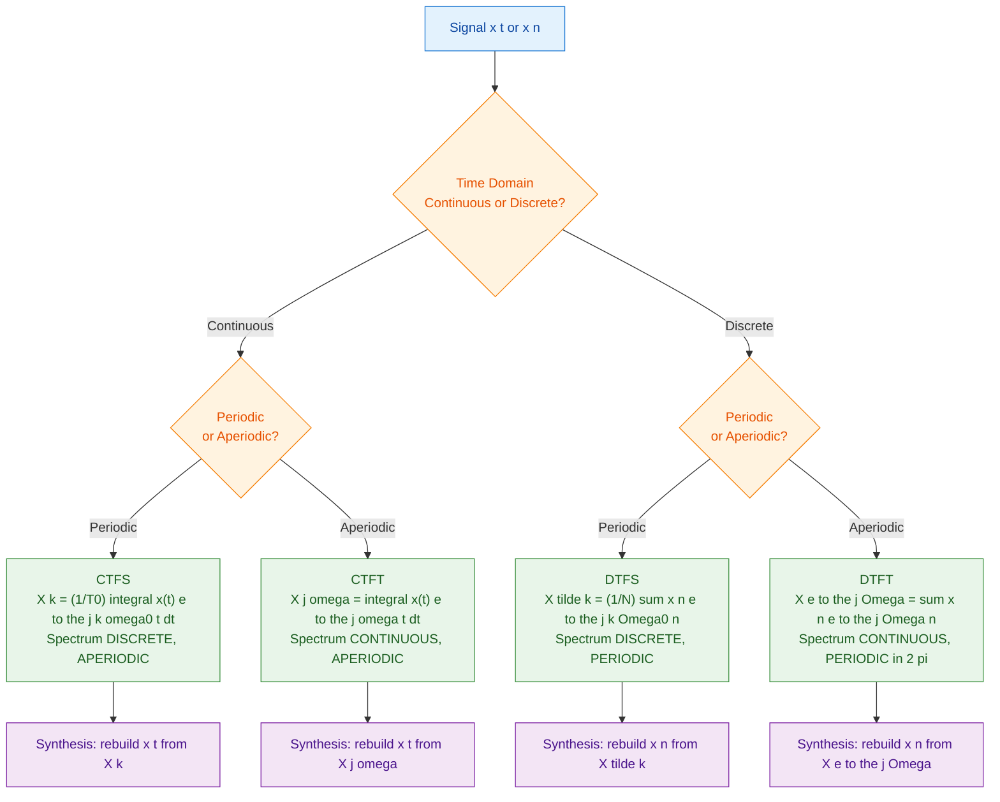
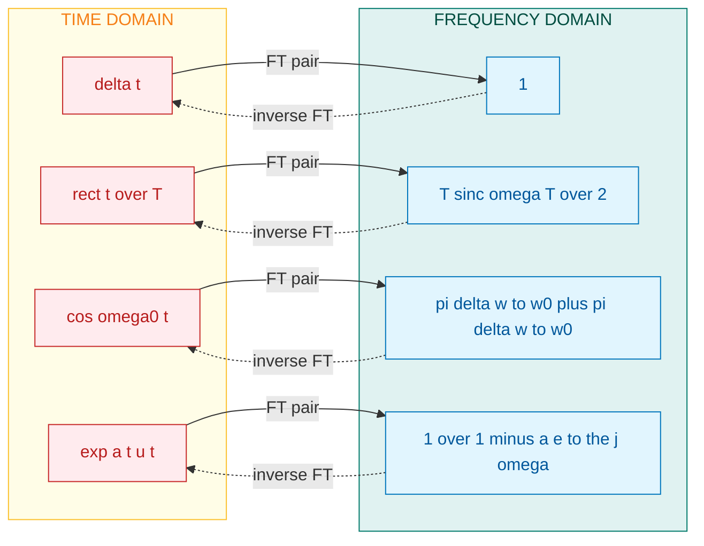
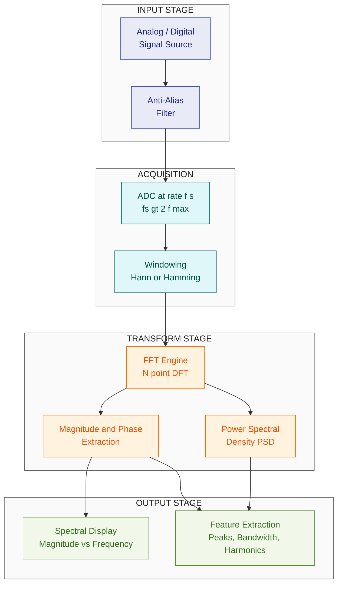
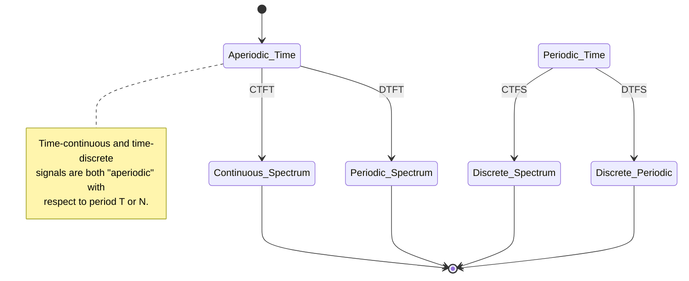

# Spectrum representation

<!-- SECTION_1_START -->
# Spectrum Representation of 1-D Signals

> [!NOTE]
> **Formal Definition (KTU 2024 Syllabus Terminology):**
> **Spectrum representation** of a one-dimensional signal refers to the decomposition of the signal into its constituent frequency components. Mathematically, it expresses a time-domain signal $x(t)$ or $x[n]$ as a linear combination of complex exponentials (or sines and cosines), revealing the signal's *frequency content*. The resulting function of frequency — typically complex-valued — is called the **spectrum** $X(\omega)$ or $X(e^{j\Omega})$.
>
> In the KTU framework, the spectrum is treated as the **dual-domain counterpart** of the time-domain signal under the Fourier transform pair, exposing amplitude, phase, energy, or power distributions across frequency.

> [!IMPORTANT]
> **Syllabus Highlight (PECST416 — Module 1):**
> Spectrum representation forms the analytical backbone for studying **Linear Time-Invariant (LTI) systems**, **sampling theory**, and **modulation** in subsequent modules. Mastery of the four Fourier representations (CTFS, CTFT, DTFS, DTFT) is mandatory.

---

## 🔭 Intuitive Overview — The "Fingerprint" Analogy

Imagine a musical chord played on a piano. Your ear hears a single rich sound, but the chord is actually a **sum of pure tones** at different pitches (frequencies). A prism does the same for white light: one beam of light becomes a rainbow of colors.

A **spectrum** is the mathematical prism for signals.

| Domain | What we see | Variable |
| :--- | :--- | :--- |
| **Time domain** | How the signal *evolves* second by second | $x(t),\ x[n]$ |
| **Frequency domain** | How much of each pure tone is *present* | $X(\omega),\ X(e^{j\Omega})$ |

> 💡 **The Big Idea:** Any reasonable signal can be built by adding up sinusoids of different frequencies, amplitudes, and phases. The spectrum tells you *exactly* which sinusoids are present and in what amount.

- The **magnitude spectrum** $\vert X(\omega) \vert$ → how strong each frequency is.
- The **phase spectrum** $\angle X(\omega)$ → how each frequency is *time-shifted*.
- The **energy/power spectral density** → how signal energy/power is distributed.

> [!VISUALIZATION CONTROL]
> **Concept:** Magnitude and phase of a synthetic multi-tone signal.
> **GeoGebra / Desmos Input Equations:**
> * `x(t) = 2*cos(2*pi*5*t) + 1*sin(2*pi*12*t) + 0.5*cos(2*pi*20*t + pi/4)`
> * `|X(f)|` (a stem plot showing peaks at $f=5,\ 12,\ 20$ Hz)
> **Visual Description:** Three sharp spectral lines rise from a flat baseline at frequencies 5 Hz, 12 Hz, and 20 Hz — directly revealing the three sinusoids summed in $x(t)$.

---

## 🧭 The Four Faces of the Fourier World

KTU 2024 emphasizes that the "spectrum" is not a single object but a **family of four transforms** chosen according to whether the signal is continuous/discrete and periodic/aperiodic.

| Signal Type | Transform | Spectrum is… | Notation |
| :--- | :--- | :--- | :--- |
| Continuous-time, **aperiodic** | Fourier Transform (FT) | Continuous, aperiodic | $X(j\omega)$ |
| Continuous-time, **periodic** | Fourier Series (FS) | Discrete, aperiodic | $X[k]$ |
| Discrete-time, **aperiodic** | DTFT | Continuous, periodic | $X(e^{j\Omega})$ |
| Discrete-time, **periodic** | DFS / DTFS | Discrete, periodic | $\tilde{X}[k]$ |

> [!TIP]
> **Periodicity rule of the spectrum (KTU High-Yield):** *Time-periodic ↔ Frequency-discrete* and *Time-discrete ↔ Frequency-periodic*. Aperiodic in one domain ⇒ continuous in the other. This is the *Fourier Duality Theorem* in a nutshell.

<!-- SECTION_1_END -->

<!-- SECTION_2_START -->
# Deep Theoretical Analysis — KTU High-Yield Formula Sheet

> [!NOTE]
> The following derivations assume the standard KTU convention: $\omega = 2\pi f$ (rad/s) for continuous-time, and $\Omega$ (rad/sample) for discrete-time.

---

## 1. Continuous-Time Fourier Series (CTFS) — For Periodic CT Signals

A periodic signal $x(t)$ with fundamental period $T_0$ and fundamental frequency $\omega_0 = \dfrac{2\pi}{T_0}$ has the **synthesis equation** (build signal from spectrum):

$$x(t) = \sum_{k=-\infty}^{\infty} X[k]\, e^{j k \omega_0 t}$$

The **analysis equation** (extract spectrum from signal):

$$X[k] = \frac{1}{T_0} \int_{T_0} x(t)\, e^{-j k \omega_0 t}\, dt$$

* $X[k]$ are the **complex Fourier coefficients** — they are *discrete*, indexed by harmonic number $k \in \mathbb{Z}$.
* $\vert X[k] \vert$ → **magnitude line spectrum**, $\angle X[k]$ → **phase line spectrum**.
* **Parseval's relation** (power conservation):
  $$\frac{1}{T_0}\int_{T_0} \vert x(t) \vert^2 dt = \sum_{k=-\infty}^{\infty} \vert X[k] \vert^2$$

---

## 2. Continuous-Time Fourier Transform (CTFT) — For Aperiodic CT Signals

Taking $T_0 \to \infty$ in CTFS turns discrete spectral lines into a continuous density:

$$X(j\omega) = \int_{-\infty}^{\infty} x(t)\, e^{-j\omega t}\, dt \quad \text{(Analysis)}$$

$$x(t) = \frac{1}{2\pi}\int_{-\infty}^{\infty} X(j\omega)\, e^{j\omega t}\, d\omega \quad \text{(Synthesis)}$$

* $X(j\omega)$ is generally **complex-valued** and continuous in $\omega$.
* **Energy spectral density (ESD):**
  $$\mathcal{E}_{xx}(\omega) = \vert X(j\omega) \vert^2$$
  Parseval/Rayleigh: $\displaystyle E = \int_{-\infty}^{\infty} \vert x(t) \vert^2 dt = \frac{1}{2\pi}\int_{-\infty}^{\infty} \vert X(j\omega) \vert^2 d\omega$.

---

## 3. Discrete-Time Fourier Series (DTFS) — For Periodic DT Signals

A discrete-time periodic signal $x[n]$ with period $N$ has spectrum $\tilde{X}[k]$ that is **also periodic** with period $N$:

$$\tilde{X}[k] = \frac{1}{N}\sum_{n=\langle N \rangle} x[n]\, e^{-j k \Omega_0 n}, \quad \Omega_0 = \frac{2\pi}{N}$$

$$x[n] = \sum_{k=\langle N \rangle} \tilde{X}[k]\, e^{j k \Omega_0 n}$$

---

## 4. Discrete-Time Fourier Transform (DTFT) — For Aperiodic DT Signals

$$X(e^{j\Omega}) = \sum_{n=-\infty}^{\infty} x[n]\, e^{-j\Omega n}$$

$$x[n] = \frac{1}{2\pi}\int_{2\pi} X(e^{j\Omega})\, e^{j\Omega n}\, d\Omega$$

* Spectrum $X(e^{j\Omega})$ is **always periodic in $\Omega$ with period $2\pi$** (a defining property).
* **Energy spectral density:** $S_{xx}(e^{j\Omega}) = \vert X(e^{j\Omega}) \vert^2$.

---

## 5. Power Spectral Density (PSD) — For Power Signals

When $x(t)$ is periodic or non-decaying, total energy diverges. Define PSD as time-average of autocorrelation:

$$P_{xx}(\omega) = \lim_{T \to \infty} \frac{\vert X_T(j\omega) \vert^2}{2T}$$

For periodic $x(t)$: $\ P_{xx}(\omega) = 2\pi \sum_k \vert X[k] \vert^2 \delta(\omega - k\omega_0)$.

---

## 6. Symmetry & Duality (Most-Tested Properties)

| Property | Time Domain | Frequency Domain |
| :--- | :--- | :--- |
| **Linearity** | $a\,x_1(t) + b\,x_2(t)$ | $a\,X_1(j\omega) + b\,X_2(j\omega)$ |
| **Time shift** | $x(t - t_0)$ | $e^{-j\omega t_0} X(j\omega)$ |
| **Frequency shift** | $x(t)e^{j\omega_0 t}$ | $X(j(\omega - \omega_0))$ |
| **Time reversal** | $x(-t)$ | $X(-j\omega)$ |
| **Conjugation** | $x^*(t)$ | $X^*(-j\omega)$ |
| **Convolution** | $x(t) * h(t)$ | $X(j\omega)\,H(j\omega)$ |
| **Multiplication** | $x(t)\,y(t)$ | $\dfrac{1}{2\pi} X(j\omega) * Y(j\omega)$ |
| **Duality** | $X(jt)$ | $2\pi\,x(-\omega)$ |
| **Real & even** $x(t)$ | — | $X(j\omega)$ is **real & even** |
| **Real & odd** $x(t)$ | — | $X(j\omega)$ is **purely imaginary & odd** |

---

## 📋 KTU Formula Cheat-Sheet

| # | Transform | Analysis Equation | Synthesis Equation | Spectrum is |
| :--: | :--- | :--- | :--- | :--- |
| 1 | **CTFS** | $X[k]=\frac{1}{T_0}\!\int_{T_0}\!x(t)e^{-jk\omega_0 t}dt$ | $x(t)=\sum_k X[k]e^{jk\omega_0 t}$ | Discrete, Aperiodic |
| 2 | **CTFT** | $X(j\omega)=\int_{-\infty}^{\infty}x(t)e^{-j\omega t}dt$ | $x(t)=\frac{1}{2\pi}\!\int_{-\infty}^{\infty}\!X(j\omega)e^{j\omega t}d\omega$ | Continuous, Aperiodic |
| 3 | **DTFS** | $\tilde{X}[k]=\frac{1}{N}\!\sum_{n=\langle N\rangle}\!x[n]e^{-jk\Omega_0 n}$ | $x[n]=\sum_{k=\langle N\rangle}\tilde{X}[k]e^{jk\Omega_0 n}$ | Discrete, Periodic |
| 4 | **DTFT** | $X(e^{j\Omega})=\sum_{n=-\infty}^{\infty}x[n]e^{-j\Omega n}$ | $x[n]=\frac{1}{2\pi}\!\int_{2\pi}\!X(e^{j\Omega})e^{j\Omega n}d\Omega$ | Continuous, Periodic |

> **Boundary Conditions for Existence (KTU must-know):**
> * **CTFT exists (Dirichlet conditions):** $x(t)$ is absolutely integrable ($\int \vert x(t)\vert dt < \infty$), bounded, and has finite number of discontinuities.
> * **DTFT exists:** $\sum_{n} \vert x[n]\vert < \infty$ (absolute summability) **or** $x[n]$ is square-summable (energy finite).
> * **CTFS exists:** $x(t)$ is periodic and has finite power over one period.

---

## 🏭 Real-World Engineering Utility

* **Audio Engineering:** MP3 / AAC codecs use the spectrum to discard inaudible frequency bands (psychoacoustic masking).
* **Communications:** OFDM, Wi-Fi, 5G NR — every subcarrier is a pure tone in the spectrum.
* **Biomedical:** ECG spectrum distinguishes normal from arrhythmic heartbeats; EEG spectral peaks reveal epilepsy.
* **Image Processing:** 2-D extension of spectrum representation (Module-level preview for higher semesters).
* **Vibration Analysis:** Machine-fault diagnosis via spectral peaks in accelerometer data.

<!-- SECTION_2_END -->

<!-- SECTION_3_START -->
# Step-by-Step Derivations & Worked Examples

> [!NOTE]
> Every step is written out explicitly. No "similarly", no shortcuts.

---

## Derivation 1 — CTFT of a Rectangular Pulse

**Problem:** Find the spectrum of $x(t) = \mathrm{rect}\!\left(\dfrac{t}{T}\right)$, i.e. amplitude $1$ for $\vert t \vert < T/2$, zero otherwise.

**Step 1 — Write the analysis integral.** Because $x(t)$ is non-zero only on $[-T/2,\ T/2]$:

$$X(j\omega) = \int_{-\infty}^{\infty} x(t)\, e^{-j\omega t}\, dt = \int_{-T/2}^{T/2} (1)\cdot e^{-j\omega t}\, dt$$

**Step 2 — Integrate the complex exponential.**

$$X(j\omega) = \left[\frac{e^{-j\omega t}}{-j\omega}\right]_{t=-T/2}^{t=+T/2} = \frac{e^{-j\omega T/2} - e^{j\omega T/2}}{-j\omega}$$

**Step 3 — Factor and apply Euler's identity.** Recall $e^{j\theta} - e^{-j\theta} = 2j\sin\theta$, so $e^{-j\theta} - e^{j\theta} = -2j\sin\theta$.

$$X(j\omega) = \frac{-2j\sin(\omega T/2)}{-j\omega} = \frac{2\sin(\omega T/2)}{\omega}$$

**Step 4 — Write in canonical *sinc* form.** By definition $\mathrm{Sa}(x) = \dfrac{\sin x}{x}$ (unnormalized sinc).

$$\boxed{\,X(j\omega) = T \cdot \mathrm{Sa}\!\left(\frac{\omega T}{2}\right)\,}$$

**Step 5 — Magnitude and Phase.**

* Magnitude: $\vert X(j\omega) \vert = T\,\left\vert \mathrm{Sa}(\omega T/2) \right\vert$ — main-lobe width $= 2\pi/T$, first zero at $\omega = 2\pi/T$.
* Phase: $\angle X(j\omega) = 0$ in main lobe, alternates $\pm \pi$ in side lobes.

**Step 6 — Energy check (Rayleigh's theorem).** $E = \int_{-T/2}^{T/2} 1\, dt = T$. Also $\dfrac{1}{2\pi}\!\int \vert X(j\omega)\vert^2 d\omega = \dfrac{T^2}{2\pi}\!\int \mathrm{Sa}^2(\omega T/2)\, d\omega = T$. ✔

---

## Derivation 2 — CTFT of an Impulse $\delta(t)$

**Step 1 — Substitute into analysis equation.**

$$X(j\omega) = \int_{-\infty}^{\infty} \delta(t)\, e^{-j\omega t}\, dt$$

**Step 2 — Apply sifting property of delta.**

$$\boxed{\,X(j\omega) = 1\,}$$

**Interpretation:** A Dirac impulse contains **equal energy at every frequency** — its spectrum is flat (white). This is the deepest form of "ultrawideband" signal.

**Step 3 — Inverse check (duality).** Since $\mathcal{F}\{\delta(t)\} = 1$, by duality $\mathcal{F}\{1\} = 2\pi\,\delta(\omega)$. ✔

---

## Derivation 3 — CTFT of a Cosine $x(t) = \cos(\omega_0 t)$

**Step 1 — Euler expansion.**

$$\cos(\omega_0 t) = \frac{e^{j\omega_0 t} + e^{-j\omega_0 t}}{2}$$

**Step 2 — Use the frequency-shift property** with the impulse spectrum.

$$X(j\omega) = \frac{1}{2}\bigl[2\pi\,\delta(\omega - \omega_0) + 2\pi\,\delta(\omega + \omega_0)\bigr]$$

$$\boxed{\,X(j\omega) = \pi\,\delta(\omega - \omega_0) + \pi\,\delta(\omega + \omega_0)\,}$$

**Interpretation:** A pure cosine is *two* spectral impulses of weight $\pi$ at $\pm \omega_0$ — the most elementary line spectrum.

---

## Derivation 4 — Spectrum of a Rectangular Pulse Train (Sampling Kernel)

**Problem:** $x(t) = \sum_{n=-\infty}^{\infty} \delta(t - nT_s)$. Find $X(j\omega)$.

**Step 1 — Recognize it is periodic with period $T_s$.** Use CTFS first: $X[k] = \dfrac{1}{T_s}\!\int_{-T_s/2}^{T_s/2} \delta(t)\, e^{-jk\omega_s t}\, dt = \dfrac{1}{T_s}$, where $\omega_s = 2\pi/T_s$.

**Step 2 — Synthesize the continuous spectrum.**

$$X(j\omega) = 2\pi \sum_{k=-\infty}^{\infty} X[k]\, \delta(\omega - k\omega_s) = \frac{2\pi}{T_s} \sum_{k=-\infty}^{\infty} \delta(\omega - k\omega_s)$$

**Interpretation:** An impulse train in time → an impulse train in frequency, scaled by $2\pi/T_s$. This is the cornerstone of the **sampling theorem** (Module 2).

---

## Worked Example 1 — Numerical CTFS Coefficients of a Square Wave

**Signal:** $x(t)$ of period $T_0 = 2\pi$, alternating $\pm 1$ every half period (odd square wave, $\omega_0 = 1$).

**Step 1 — Set up analysis integral over one period $[-\pi, \pi]$.**

$$X[k] = \frac{1}{2\pi}\int_{-\pi}^{\pi} x(t)\, e^{-jkt}\, dt$$

**Step 2 — Split the integral at $t=0$.**

$$X[k] = \frac{1}{2\pi}\!\left[\int_{-\pi}^{0}(-1)e^{-jkt}dt + \int_{0}^{\pi}(+1)e^{-jkt}dt\right]$$

**Step 3 — Evaluate each integral.**

$$\int_{0}^{\pi} e^{-jkt}dt = \left[\frac{e^{-jkt}}{-jk}\right]_0^\pi = \frac{e^{-jk\pi} - 1}{-jk} = \frac{1 - \cos(k\pi)}{jk}$$

**Step 4 — Use $1 - \cos(k\pi) = 1 - (-1)^k$.**

$$X[k] = \frac{1}{2\pi}\cdot \frac{2\bigl[1 - (-1)^k\bigr]}{jk} = \frac{1 - (-1)^k}{j\pi k}$$

**Step 5 — Simplify the parity expression.**

* $k$ even $\Rightarrow (-1)^k = 1 \Rightarrow X[k] = 0$.
* $k$ odd $\Rightarrow (-1)^k = -1 \Rightarrow X[k] = \dfrac{2}{j\pi k}$.

$$\boxed{\,X[k] = \begin{cases} \dfrac{2}{j\pi k}, & k \text{ odd} \\[4pt] 0, & k \text{ even} \end{cases}\,}$$

**Magnitude:** $\vert X[k] \vert = \dfrac{2}{\pi \vert k \vert}$ for odd $k$ — the famous $1/k$ roll-off that synthesizes the square wave from harmonics.

---

## Worked Example 2 — DTFT of a Causal Exponential $x[n] = a^n u[n],\ \vert a \vert < 1$

**Step 1 — Apply DTFT analysis equation.**

$$X(e^{j\Omega}) = \sum_{n=0}^{\infty} a^n e^{-j\Omega n} = \sum_{n=0}^{\infty} (a e^{-j\Omega})^n$$

**Step 2 — Sum the geometric series** (converges because $\vert a e^{-j\Omega}\vert = \vert a \vert < 1$).

$$X(e^{j\Omega}) = \frac{1}{1 - a e^{-j\Omega}}$$

**Step 3 — Magnitude squared (ESD).**

$$\vert X(e^{j\Omega}) \vert^2 = \frac{1}{\vert 1 - a e^{-j\Omega}\vert^2} = \frac{1}{1 - 2a\cos\Omega + a^2}$$

**Step 4 — Energy check.** $\displaystyle E = \frac{1}{2\pi}\!\int_{-\pi}^{\pi} \frac{d\Omega}{1 - 2a\cos\Omega + a^2} = \frac{1}{1 - a^2}$, matching $\sum_{n=0}^{\infty} a^{2n}$. ✔

---

## 🐍 Python — Compute and Plot the Spectrum of a Multi-Tone Signal

```python
import numpy as np
import matplotlib.pyplot as plt
from numpy.fft import fft, fftshift, fftfreq

# --- Parameters ---
fs   = 500.0          # Sampling frequency (Hz)
T    = 2.0            # Duration (s)
N    = int(fs * T)    # Number of samples
t    = np.arange(N) / fs

# --- Build a multi-tone signal: 5 Hz + 12 Hz + 20 Hz + noise ---
rng = np.random.default_rng(42)
x   = (2.0 * np.cos(2 * np.pi * 5  * t)
     + 1.0 * np.sin(2 * np.pi * 12 * t)
     + 0.5 * np.cos(2 * np.pi * 20 * t + np.pi/4)
     + 0.05 * rng.standard_normal(N))

# --- Compute spectrum via FFT (numerical approximation of CTFT) ---
X    = fftshift(fft(x))
freq = fftshift(fftfreq(N, d=1.0/fs))
mag  = np.abs(X) / N           # Two-sided magnitude spectrum
phase = np.unwrap(np.angle(X)) # Unwrapped phase in radians

# --- Plot ---
fig, axes = plt.subplots(2, 1, figsize=(10, 6), sharex=True)
axes[0].stem(freq, mag, basefmt=" ", linefmt="C0-", markerfmt="C0o")
axes[0].set_ylabel("Magnitude  |X(f)|")
axes[0].set_title("Spectrum Representation of a Multi-Tone Signal")
axes[0].grid(True, alpha=0.3)

axes[1].stem(freq, phase, basefmt=" ", linefmt="C1-", markerfmt="C1o")
axes[1].set_xlabel("Frequency (Hz)")
axes[1].set_ylabel("Phase  ∠X(f)  (rad)")
axes[1].grid(True, alpha=0.3)
plt.tight_layout()
plt.show()
```

**Expected visual outcome:** Three distinct spectral peaks at $f = 5,\ 12,\ 20$ Hz with relative amplitudes $2 : 1 : 0.5$, exactly mirroring the sinusoids composed in $x(t)$. A small noise floor is visible across all frequencies.

<!-- SECTION_3_END -->

<!-- SECTION_4_START -->
# Structural Diagrams & Schematics

> [!NOTE]
> The diagrams below render natively in any Mermaid v8+ environment. Node identifiers are alphanumeric and labels are kept in clean double-quoted text — no markdown formatting inside labels.

---

## Diagram 1 — Master Map of the Four Fourier Representations



---

## Diagram 2 — Duality Between Time and Frequency Domains



---

## Diagram 3 — Functional Processing Topology of Spectrum Analysis



---

## Diagram 4 — Periodicity Duality State Machine



<!-- SECTION_4_END -->

<!-- SECTION_5_START -->
# KTU 2024 Scheme Examination Question Bank & Topic Recap

> [!NOTE]
> Mark distribution: **Part A — 3 marks each (no choice)** · **Part B — 14 marks each (internal choice between Q-A and Q-B)** · Mapped to Course Outcomes **CO1** (Knowledge of 1-D signal mathematics) and **CO2** (Apply spectral analysis).

---

## 📘 Part A — Short Answer Questions (3 Marks Each)

### Q1. `[KTU University Exam — July 2024]` · CO1 · Remember

**What do you mean by the *spectrum representation* of a signal? Mention any two of its uses.**

**Model Answer (3 marks):**
* **[1 Mark]** Spectrum representation is the frequency-domain description of a signal obtained by decomposing it into a linear combination of complex exponentials (sines and cosines) of different frequencies. For a CT signal $x(t)$, the spectrum is $X(j\omega) = \int x(t) e^{-j\omega t} dt$.
* **[1 Mark]** Use 1: It reveals the *frequency content* of signals (e.g., detecting dominant tones in audio).
* **[1 Mark]** Use 2: It simplifies LTI system analysis because convolution in time becomes multiplication in frequency: $y(t) = x(t) * h(t) \Rightarrow Y(j\omega) = X(j\omega) H(j\omega)$.

---

### Q2. `[KTU University Exam — Dec 2023]` · CO1 · Understand

**Differentiate between magnitude spectrum and phase spectrum with an example.**

**Model Answer (3 marks):**
* **[1 Mark]** The *magnitude spectrum* $\vert X(j\omega) \vert$ indicates the relative strength of each frequency component present in the signal.
* **[1 Mark]** The *phase spectrum* $\angle X(j\omega)$ indicates the relative time-shift (delay/advance) of each frequency component.
* **[1 Mark]** Example: For $x(t) = \cos(2\pi \cdot 5\, t - \pi/4)$, the magnitude spectrum is constant $\pi$ at $\pm 5$ Hz, while the phase spectrum shows $-\pi/4$ at $+5$ Hz and $+\pi/4$ at $-5$ Hz. Same magnitude, different phase → different waveform timing.

---

## 📕 Part B — Long Answer Questions (14 Marks Each, Internal Choice)

### Question A — `[KTU University Exam — Dec 2023]` · CO1 / CO2 · Understand + Apply

#### (a) Derive the continuous-time Fourier transform pair for an aperiodic signal. State the Dirichlet conditions for the existence of the CTFT. **(7 marks)**

**Step 1 — Starting from CTFS, allow period $T_0 \to \infty$.** *(1 mark)*

The synthesis equation is $x(t) = \sum_k X[k] e^{jk\omega_0 t}$ with $\omega_0 = 2\pi/T_0$. Let $T_0 \to \infty \Rightarrow \omega_0 \to 0$ and the discrete harmonic index $k\omega_0$ becomes a continuous variable $\omega$.

**Step 2 — Redefine the spectral density.** *(2 marks)*

$$X[k] = \frac{1}{T_0}\int_{-T_0/2}^{T_0/2} x(t) e^{-jk\omega_0 t} dt \quad\Rightarrow\quad \frac{X[k]}{1/T_0} = \int_{-\infty}^{\infty} x(t) e^{-j\omega t} dt$$

Define the spectral density $X(j\omega) = \lim_{T_0 \to \infty} T_0\, X[k]\big\vert_{k\omega_0 = \omega}$. Then:

$$X(j\omega) = \int_{-\infty}^{\infty} x(t)\, e^{-j\omega t}\, dt \quad \text{(Analysis)} \tag{1}$$

**Step 3 — Inverse (synthesis) transform.** *(2 marks)*

Substitute $X[k] = X(j\omega)/T_0$ and replace $\sum_k$ by $\dfrac{T_0}{2\pi}\!\int d\omega$:

$$x(t) = \frac{1}{2\pi}\int_{-\infty}^{\infty} X(j\omega)\, e^{j\omega t}\, d\omega \quad \text{(Synthesis)} \tag{2}$$

**Step 4 — Dirichlet conditions.** *(2 marks)*

1. $x(t)$ must be **absolutely integrable**: $\int_{-\infty}^{\infty} \vert x(t) \vert\, dt < \infty$.
2. $x(t)$ must have a **finite number of maxima, minima, and discontinuities** in any finite interval.
3. $x(t)$ must be of **bounded variation** (no infinite oscillations such as $\sin(1/t)$ near $0$).

When these hold, $X(j\omega)$ exists and the inversion integral recovers $x(t)$ at every point of continuity.

> [!TIP]
> **[Valuation key]:** Stating the analysis form — 1 mark · Stating the synthesis form — 1 mark · Each Dirichlet condition — 1 mark (any 2 conditions = 2 marks). The $1/(2\pi)$ factor is commonly forgotten — examiners deduct 1 mark for its omission.

#### (b) Determine the CTFT of $x(t) = e^{-at} u(t)$ for $a > 0$ and sketch its magnitude spectrum. Comment on the effect of decreasing $a$. **(7 marks)**

**Step 1 — Substitute into the analysis integral.** *(1 mark)*

$$X(j\omega) = \int_{0}^{\infty} e^{-at}\, e^{-j\omega t}\, dt = \int_{0}^{\infty} e^{-(a + j\omega)t}\, dt$$

**Step 2 — Evaluate.** *(1 mark)*

$$X(j\omega) = \left[\frac{e^{-(a+j\omega)t}}{-(a+j\omega)}\right]_0^\infty = \frac{1}{a + j\omega} \quad (\text{since } e^{-(a+j\omega)t}\to 0 \text{ as } t\to\infty)$$

**Step 3 — Magnitude and phase.** *(2 marks)*

$$\vert X(j\omega) \vert = \frac{1}{\sqrt{a^2 + \omega^2}}, \quad \angle X(j\omega) = -\tan^{-1}\!\left(\frac{\omega}{a}\right)$$

**Step 4 — Sketch description (textual, examiner-friendly).** *(1 mark)*

Magnitude is maximum $= 1/a$ at $\omega = 0$, monotonically decreasing as $\vert \omega \vert$ increases, with a $-3$ dB cutoff at $\omega = a$, and asymptotic roll-off of $1/\vert \omega\vert$ (i.e., $-20$ dB/decade).

**Step 5 — Effect of decreasing $a$.** *(2 marks)*

* As $a \to 0^+$, the signal stretches out (slower decay) and the spectrum becomes *narrower* and taller: the bandwidth $\propto a$ decreases.
* In the limit $a \to 0$, $x(t) \to u(t)$ (unit step) and $X(j\omega) \to \pi \delta(\omega) + \dfrac{1}{j\omega}$, illustrating the duality: a *long* time signal has a *concentrated* (narrow) spectrum.

> [!TIP]
> **[Valuation key]:** Correct integral setup — 1 mark · Final $1/(a+j\omega)$ — 1 mark · Magnitude expression — 1 mark · Phase expression — 1 mark · Sketches verbalized correctly — 1 mark · Engineering interpretation — 2 marks. **Pitfall:** Students often write $X(j\omega) = 1/(a-j\omega)$ — sign error costs 1 mark.

---

### Question B — `[KTU University Exam — July 2024]` · CO1 / CO2 · Understand + Apply

#### (a) With the help of neat equations, define the Discrete-Time Fourier Transform (DTFT) and state two of its important properties. **(7 marks)**

**Step 1 — Definition.** *(2 marks)*

For an aperiodic discrete-time signal $x[n]$ with absolute summability, the DTFT pair is:

$$X(e^{j\Omega}) = \sum_{n=-\infty}^{\infty} x[n]\, e^{-j\Omega n} \quad \text{(Analysis)} \tag{1}$$

$$x[n] = \frac{1}{2\pi}\int_{2\pi} X(e^{j\Omega})\, e^{j\Omega n}\, d\Omega \quad \text{(Synthesis)} \tag{2}$$

Note that the integration in (2) is over any interval of length $2\pi$ (commonly $[-\pi, \pi]$), because $X(e^{j\Omega})$ is **$2\pi$-periodic** in $\Omega$.

**Step 2 — Property 1: Periodicity.** *(2 marks)*

$X(e^{j(\Omega + 2\pi)}) = \sum_n x[n] e^{-j(\Omega + 2\pi)n} = \sum_n x[n] e^{-j\Omega n} e^{-j2\pi n} = X(e^{j\Omega})$ since $e^{-j2\pi n}=1$ for integer $n$.

**Step 3 — Property 2: Time-shift.** *(2 marks)*

If $y[n] = x[n - n_0]$, then $Y(e^{j\Omega}) = e^{-j\Omega n_0} X(e^{j\Omega})$. Proof:

$$Y(e^{j\Omega}) = \sum_n x[n-n_0] e^{-j\Omega n} \stackrel{m=n-n_0}{=\!=\!=\!=\!=} \sum_m x[m]\, e^{-j\Omega(m+n_0)} = e^{-j\Omega n_0} X(e^{j\Omega})$$

> [!TIP]
> **[Valuation key]:** Defining both equations (with normalization) — 2 marks · Correct periodicity proof — 2 marks · Correct shift proof — 2 marks · Engineering significance (one sentence) — 1 mark.

#### (b) Find the DTFT of $x[n] = a^{\vert n \vert}$ with $\vert a \vert < 1$. Hence plot the magnitude spectrum. **(7 marks)**

**Step 1 — Split the sum into positive and negative indices.** *(1 mark)*

$$X(e^{j\Omega}) = \sum_{n=-\infty}^{-1} a^{-n} e^{-j\Omega n} + \sum_{n=0}^{\infty} a^{n} e^{-j\Omega n}$$

**Step 2 — Substitute $m = -n$ in the first sum.** *(1 mark)*

$$X(e^{j\Omega}) = \sum_{m=1}^{\infty} a^{m} e^{j\Omega m} + \sum_{n=0}^{\infty} (a e^{-j\Omega})^n$$

**Step 3 — Evaluate each geometric series.** *(2 marks)*

For the first sum (geometric with ratio $a e^{j\Omega}$):

$$\sum_{m=1}^{\infty} (a e^{j\Omega})^m = \frac{a e^{j\Omega}}{1 - a e^{j\Omega}}$$

For the second sum: $\sum_{n=0}^{\infty} (a e^{-j\Omega})^n = \dfrac{1}{1 - a e^{-j\Omega}}$.

**Step 4 — Combine.** *(1 mark)*

$$X(e^{j\Omega}) = \frac{1}{1 - a e^{-j\Omega}} + \frac{a e^{j\Omega}}{1 - a e^{j\Omega}}$$

**Step 5 — Realize the symmetry.** *(1 mark)*

Since $a^{\vert n \vert}$ is **real and even** in $n$, $X(e^{j\Omega})$ must be **real and even** in $\Omega$. Verify by rationalizing each fraction:

$$X(e^{j\Omega}) = \frac{1 - a e^{j\Omega} + a e^{j\Omega}(1 - a e^{-j\Omega})}{(1 - a e^{-j\Omega})(1 - a e^{j\Omega})} = \frac{1 - a^2}{1 - 2a\cos\Omega + a^2}$$

$$\boxed{\,X(e^{j\Omega}) = \frac{1 - a^2}{1 - 2a\cos\Omega + a^2}\,}$$

**Step 6 — Magnitude plot (textual).** *(1 mark)*

Maximum at $\Omega = 0$: $X(e^{j0}) = \dfrac{1 + a}{1 - a}$. Minimum at $\Omega = \pm\pi$: $X(e^{j\pi}) = \dfrac{1 - a}{1 + a}$. The shape is **low-pass** in $\Omega$, with a $2\pi$-periodic repetition outside $[-\pi, \pi]$.

> [!TIP]
> **[Valuation key]:** Splitting the sum — 1 mark · Index substitution — 1 mark · Each series — 1 mark · Final simplified closed form — 2 marks · Plot description — 1 mark · Even-symmetry observation — 1 mark.

---

## ⚠️ KTU Examiner's Valuation Warning / Common Pitfalls

> [!WARNING]
> **Most-mark-losing mistakes on Spectrum Representation questions:**
>
> 1. **Forgetting the $\frac{1}{2\pi}$ factor in the inverse CTFT.** Always write $x(t) = \frac{1}{2\pi}\int X(j\omega) e^{j\omega t} d\omega$. Lose **1 mark** otherwise.
> 2. **Wrong limits in CTFT integrals for causal signals.** Many students write $\int_{-\infty}^{\infty}$ without changing it to $\int_0^{\infty}$ for $e^{-at}u(t)$. Examiners want the *reduced* limits.
> 3. **Sign error in frequency-shift property.** $\mathcal{F}\{x(t)e^{j\omega_0 t}\} = X(j(\omega - \omega_0))$, **not** $X(j(\omega + \omega_0))$.
> 4. **Confusing DTFT with DFT.** DTFT spectrum is *continuous* and $2\pi$-periodic; DFT spectrum is *sampled* at $\Omega_k = 2\pi k/N$ and *periodic* with period $N$. KTU frequently tests this distinction.
> 5. **Skipping the even/odd symmetry check.** For a real even signal, the answer *must* be real and even — failing to verify loses 1–2 marks.
> 6. **Omitting units in the magnitude spectrum.** State that $\vert X(j\omega) \vert$ has units of *signal-units per rad/s*.
> 7. **Not sketching (or textually describing) the spectrum.** Verbal description is acceptable in KTU valuation, but absence of any visual costs 1 mark.

---

## 🧠 Topic Recap & Important Things to Remember

> [!TIP]
> **Rapid Revision Checklist — Spectrum Representation of 1-D Signals**

### 🔑 Core Definitions
- **Spectrum** = frequency-domain description of a signal via decomposition into complex exponentials.
- **Four Fourier representations:** CTFS, CTFT, DTFS, DTFT — chosen by the *continuous/discrete* × *periodic/aperiodic* nature of the signal.
- **Magnitude spectrum $\vert X \vert$** → strength of each frequency; **Phase spectrum $\angle X$** → time-shift of each frequency.
- **ESD (Energy Spectral Density)** $= \vert X(j\omega) \vert^2$ for energy signals; **PSD (Power Spectral Density)** for power signals.

### 📐 Must-Know Transform Pairs
- $\delta(t) \xleftrightarrow{\mathcal{F}} 1$
- $1 \xleftrightarrow{\mathcal{F}} 2\pi\,\delta(\omega)$
- $\mathrm{rect}(t/T) \xleftrightarrow{\mathcal{F}} T\,\mathrm{Sa}(\omega T/2)$
- $\cos(\omega_0 t) \xleftrightarrow{\mathcal{F}} \pi\delta(\omega - \omega_0) + \pi\delta(\omega + \omega_0)$
- $e^{-at}u(t),\ a>0 \xleftrightarrow{\mathcal{F}} \dfrac{1}{a + j\omega}$
- $a^n u[n],\ \vert a \vert < 1 \xleftrightarrow{\text{DTFT}} \dfrac{1}{1 - a e^{-j\Omega}}$
- $a^{\vert n \vert},\ \vert a \vert < 1 \xleftrightarrow{\text{DTFT}} \dfrac{1 - a^2}{1 - 2a\cos\Omega + a^2}$

### 🧮 Critical Properties (High-Yield)
- **Duality:** $X(jt) \leftrightarrow 2\pi\,x(-\omega)$.
- **Time shift** $x(t-t_0) \leftrightarrow e^{-j\omega t_0} X(j\omega)$ — magnitude *unchanged*, phase *linear*.
- **Frequency shift** $x(t)e^{j\omega_0 t} \leftrightarrow X(j(\omega - \omega_0))$ — shifts the spectrum.
- **Convolution theorem:** $x(t)*h(t) \leftrightarrow X(j\omega)\,H(j\omega)$ — *cornerstone* of LTI system analysis.
- **Parseval/Rayleigh:** energy is preserved between time and frequency domains.

### 🚦 Periodicity Duality Rules
- Time *continuous* & aperiodic ⇄ Frequency *continuous* & aperiodic → **CTFT**
- Time *continuous* & periodic ⇄ Frequency *discrete* & aperiodic → **CTFS**
- Time *discrete* & aperiodic ⇄ Frequency *continuous* & periodic ($2\pi$) → **DTFT**
- Time *discrete* & periodic ⇄ Frequency *discrete* & periodic ($N$) → **DTFS**

### ⚖️ Existence Conditions
- **CTFT:** absolute integrability $\int \vert x(t)\vert dt < \infty$ + Dirichlet conditions.
- **DTFT:** absolute summability $\sum \vert x[n]\vert < \infty$ **or** square-summability.
- **CTFS/DTFS:** finite power per period; bounded variation within one period.

### 🏭 Real-World Importance
- Spectrum representation is the *language* of audio codecs, communications, biomedical signal analysis, vibration diagnostics, and every filter-design procedure — making it the most exam-relevant and industry-relevant topic in Module 1.

> ✅ **Mastery indicator:** You should be able to derive a CTFS/CTFT/DTFT pair from scratch, sketch the magnitude and phase spectra, and explain duality in under 90 seconds per question.
<!-- SECTION_5_END -->
