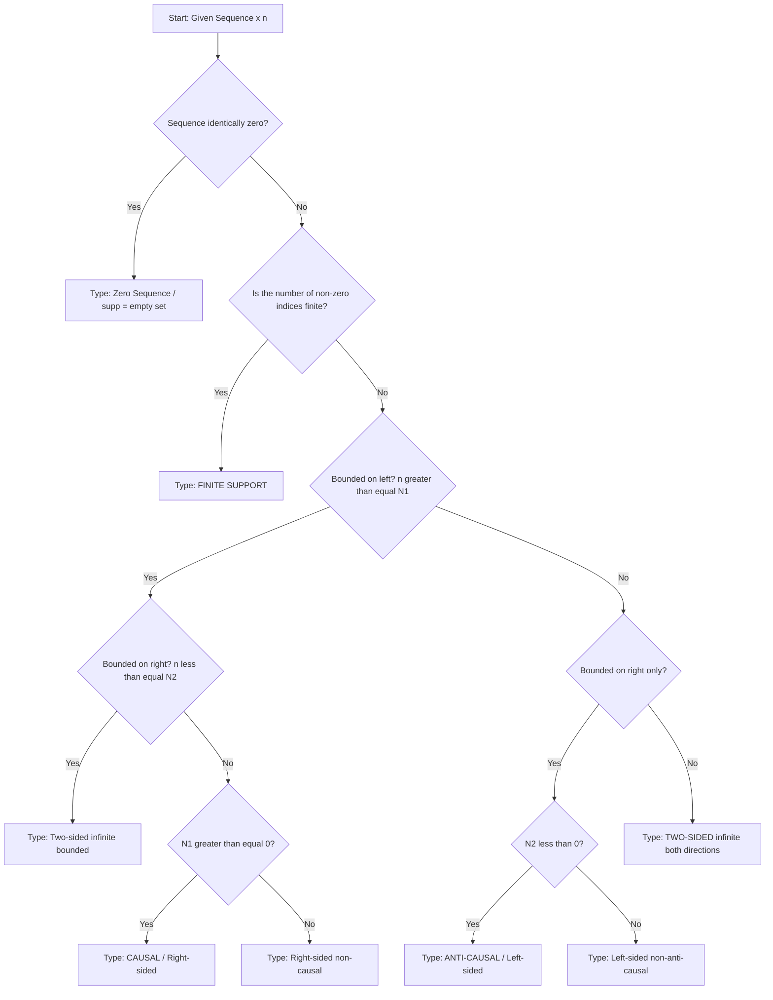
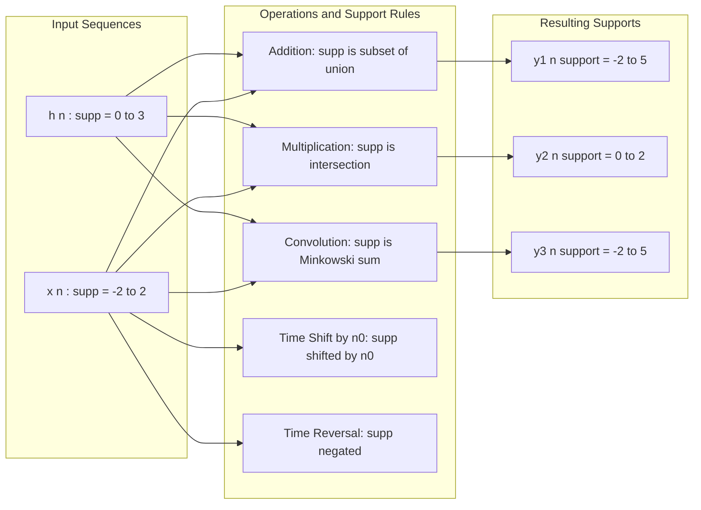
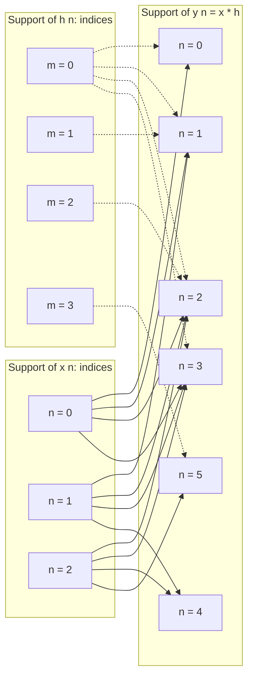
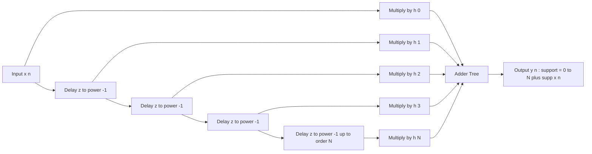

# support of sequences

<!-- SECTION_1_START -->
# Support of Sequences — 1D Discrete-Time Signals

## 1.1 Formal Academic Definition (KTU 2024 Scheme Terminology)

In discrete-time signal processing, the **support of a sequence** $x[n]$ is the set of all integer indices $n \in \mathbb{Z}$ over which the sequence possesses a **non-zero** amplitude value.

Mathematically, it is expressed as the cardinality-bound index set:

$$\text{supp}(x[n]) = \{\, n \in \mathbb{Z} \;\vert\; x[n] \neq 0 \,\}$$

> [!IMPORTANT]
> **KTU Syllabus Highlight (Module 1 — Standard Elementary Signals):**
> Support classification is a foundational property used to identify whether a sequence is **causal**, **anti-causal**, **right-sided**, **left-sided**, or **two-sided** — all of which are tested directly in Part A questions (3 marks) and as conceptual sub-parts of Part B questions (14 marks).

The sequence values at all indices **not** in the support are by definition **identically zero**:

$$x[n] = 0, \quad \forall \, n \notin \text{supp}(x[n])$$

---

## 1.2 Intuitive Analogy — The "Digital Footprint"

Imagine a discrete-time sequence $x[n]$ as a row of **light bulbs** indexed along the integer number line $\ldots, -2, -1, 0, 1, 2, \ldots$ Now, switch **ON** every bulb where $x[n] \neq 0$ and switch **OFF** every bulb where $x[n] = 0$.

> The **support** is simply the set of indices where the bulb is **ON**.

| Bulb State | Sequence Value | Belongs to Support? |
| :--- | :---: | :---: |
| ON | $x[n] \neq 0$ | ✅ Yes |
| OFF | $x[n] = 0$ | ❌ No |

**Geometric Intuition:** If you were to plot $x[n]$ using stem-plots, the support corresponds to every stem that "rises" above the n-axis. The flat regions where stems are absent are the **complement of the support**.

---

## 1.3 Classification of Support (Overview)

Discrete-time sequences can be broadly classified based on the cardinality (size) of their support:

### A. Finite Support Sequences
The support contains only a **finite** number of indices. The sequence is non-zero over a bounded interval.

$$\text{supp}(x[n]) = \{n \in [N_1, N_2] \cap \mathbb{Z}\}, \quad \text{where } N_1 < N_2 \text{ and both are finite}$$

**Example:** $x[n] = \{1, 2, 3, 2, 1\}$ with $n \in \{-2, -1, 0, 1, 2\}$. Here $\text{supp} = \{-2, -1, 0, 1, 2\}$.

### B. Infinite Support Sequences
The support contains infinitely many indices. Sub-categorized as:

- **Right-sided sequence:** $\text{supp} \subseteq [N, \infty)$ for some finite $N$
- **Left-sided sequence:** $\text{supp} \subseteq (-\infty, N]$ for some finite $N$
- **Two-sided sequence:** Extends in both directions infinitely
- **Causal sequence:** Right-sided with $N \geq 0$ (special case for $N = 0$)
- **Anti-causal sequence:** Left-sided with $N \leq 0$ (special case for $N = -1$)

> [!NOTE]
> The standard symbols used by KTU examiners:
> $\delta[n]$ denotes the **unit impulse** (support $=\{0\}$).
> $u[n]$ denotes the **unit step** (support $=\{0, 1, 2, \ldots\}$).

---

## 1.4 Geometric / Graphical Visualization

> [!VISUALIZATION CONTROL]
> **Concept:** Stem-plot representation of a finite-support sequence with marked support indices.
> **GeoGebra / Desmos Input:**
>
> * Sequence values: `x[-2]=1, x[-1]=2, x[0]=3, x[1]=2, x[2]=1, x[n]=0 otherwise`
> * Plot range: `n ∈ [-4, 4]`
>
> **Visual Description:** Five vertical stems rise above the n-axis at indices $-2, -1, 0, 1, 2$ with heights 1, 2, 3, 2, 1 respectively. The stems at $n = -4, -3$ and $n = 3, 4$ are absent (zero amplitude). The support set is the closed integer interval $[-2, 2]$.

---

## 1.5 Engineering Relevance

The concept of support is **not merely academic** — it is a workhorse property in:

- **FIR Filter Design:** Finite-length impulse responses have finite support.
- **Convolution Computation:** The output support is the sum (Minkowski sum) of input supports.
- **Compressed Sensing:** Sparse signals are characterized by small support.
- **Audio/Speech Processing:** Windowed signals have bounded support.
- **Image Processing (1D slices):** Edge detection uses compactly-supported kernels.

> [!TIP]
> **Quick Exam Trick:** Whenever you see "find the support" in a KTU question, scan the sequence, list every index where amplitude is non-zero, and present as a **set of integers**.
<!-- SECTION_1_END -->

<!-- SECTION_2_START -->
# Deep Theoretical Analysis & KTU High-Yield Formula Sheet

## 2.1 Precise Mathematical Formulation

The support of a discrete-time sequence is defined rigorously as:

$$\text{supp}(x) = \{\, n \in \mathbb{Z} \;\vert\; x[n] \neq 0 \,\}$$

Where:

- $\mathbb{Z} = \{\ldots, -2, -1, 0, 1, 2, \ldots\}$ is the set of all integers
- $x: \mathbb{Z} \rightarrow \mathbb{R}$ (or $\mathbb{C}$) is the sequence function
- The cardinality $\vert \text{supp}(x) \vert$ determines whether the support is **finite** or **infinite**

---

## 2.2 Classification with Boundary Conditions

| Sequence Type | Support Set | Defining Condition | Standard Example |
| :--- | :--- | :--- | :--- |
| Finite-length | $\{N_1, N_1+1, \ldots, N_2\}$ | $x[n]=0$ for $n < N_1$ and $n > N_2$ | Rectangular pulse |
| Right-sided | $[N, \infty) \cap \mathbb{Z}$ | $x[n]=0$ for $n < N$ | $a^n u[n-N]$ |
| Left-sided | $(-\infty, N] \cap \mathbb{Z}$ | $x[n]=0$ for $n > N$ | $-a^n u[-n+N]$ |
| Two-sided | $\mathbb{Z}$ (or both infinite tails) | $x[n] \neq 0$ for infinitely many $n$ on both sides | $a^{\vert n \vert}$ |
| Causal | $[0, \infty) \cap \mathbb{Z}$ | $x[n]=0$ for $n < 0$ | $u[n]$, $\cos(\omega_0 n)u[n]$ |
| Anti-causal | $(-\infty, -1] \cap \mathbb{Z}$ | $x[n]=0$ for $n \geq 0$ | $u[-n-1]$ |

> [!IMPORTANT]
> **Causality Rule (Examiner's Hot Spot):**
> A sequence is **causal** if and only if $\text{supp}(x) \subseteq \{0, 1, 2, \ldots\} = \mathbb{Z}_{\geq 0}$.
> Equivalently: $x[n] = 0$ for all $n < 0$.

---

## 2.3 Algebraic Properties of Support

The support operation behaves predictably under standard sequence operations. Let $\text{supp}(x) = S_x$ and $\text{supp}(y) = S_y$.

| Operation | Resulting Support | Reasoning |
| :--- | :--- | :--- |
| Time shift $x[n-n_0]$ | $S_x + n_0 = \{n+n_0 \mid n \in S_x\}$ | Index translation |
| Time reversal $x[-n]$ | $-S_x = \{-n \mid n \in S_x\}$ | Mirror reflection |
| Scalar multiplication $a \cdot x[n]$, $a \neq 0$ | $S_x$ | Zeros remain zero |
| Addition $z[n] = x[n] + y[n]$ | $S_x \cup S_y$ | Worst-case union (may shrink if cancellation occurs) |
| Multiplication $z[n] = x[n] \cdot y[n]$ | $S_x \cap S_y$ | Both must be non-zero |
| Convolution $z[n] = x[n] * y[n]$ | $S_x + S_y = \{a+b \mid a \in S_x, b \in S_y\}$ | Minkowski sum |

> [!NOTE]
> **Cancellation Caveat:** For addition, the true support is always a **subset** of $S_x \cup S_y$. The formula $S_x \cup S_y$ is the upper bound — actual support may be smaller if $x[n] = -y[n]$ at some index.

---

## 2.4 KTU Formula Cheat Sheet

| # | Property | Formula | Use Case |
| :---: | :--- | :--- | :--- |
| 1 | Definition | $\text{supp}(x) = \{n \in \mathbb{Z} \mid x[n] \neq 0\}$ | Direct computation |
| 2 | Time shift | $\text{supp}(x[n-n_0]) = \text{supp}(x[n]) + n_0$ | Shifted impulse/delay |
| 3 | Time reversal | $\text{supp}(x[-n]) = -\text{supp}(x[n])$ | Symmetry analysis |
| 4 | Convolution | $\text{supp}(x * y) = \text{supp}(x) + \text{supp}(y)$ | LTI system analysis |
| 5 | Multiplication | $\text{supp}(x \cdot y) = \text{supp}(x) \cap \text{supp}(y)$ | Modulation/windowing |
| 6 | Addition (upper bound) | $\text{supp}(x+y) \subseteq \text{supp}(x) \cup \text{supp}(y)$ | Combined sources |
| 7 | Length of support | $L = N_2 - N_1 + 1$ (finite case) | Memory size in DSP |
| 8 | Energy bound | $E = \sum_{n \in \text{supp}} \vert x[n] \vert^2$ | Finite-energy check |

---

## 2.5 Worked Conceptual Walkthroughs

### Walkthrough 1: Right-Sided Exponential
$$x[n] = (0.5)^n \, u[n]$$

Step 1: Recognize $u[n] = 0$ for $n < 0$, hence $x[n] = 0$ for $n < 0$.
Step 2: For $n \geq 0$, $(0.5)^n \neq 0$ always.
Step 3: Conclude $\text{supp}(x[n]) = \{0, 1, 2, 3, \ldots\} = \mathbb{Z}_{\geq 0}$.

### Walkthrough 2: Two-Sided Decay
$$x[n] = (0.5)^{\vert n \vert}$$

Step 1: For $n = 0$, $x[0] = 1 \neq 0$ ✓
Step 2: For $n \neq 0$, $(0.5)^{\vert n \vert} > 0$ ✓
Step 3: Conclude $\text{supp}(x[n]) = \mathbb{Z}$ (all integers).

### Walkthrough 3: Finite Rectangular Pulse
$$x[n] = u[n+2] - u[n-3]$$

Step 1: $u[n+2] = 1$ for $n \geq -2$
Step 2: $u[n-3] = 1$ for $n \geq 3$
Step 3: $x[n] = 1$ for $-2 \leq n < 3$, i.e., $n \in \{-2, -1, 0, 1, 2\}$
Step 4: $\text{supp}(x[n]) = \{-2, -1, 0, 1, 2\}$, length $= 5$.

---

## 2.6 Real-World Engineering Utility

- **Digital Filter Length:** An FIR filter of order $N$ has finite support of length $N+1$.
- **Memory Footprint:** The number of storage registers needed equals the cardinality of the support.
- **Sparse Representations:** JPEG, MP3, and modern AI compression algorithms exploit small supports in transform domains.
- **5G/4G Channel Estimation:** Pilot signals are designed with known compact support for synchronization.
- **Biomedical Signals (ECG/EEG):** QRS complexes have finite-duration support used for heartbeat detection.
<!-- SECTION_2_END -->

<!-- SECTION_3_START -->
# Step-by-Step Derivations & Python Implementation

## 3.1 Exhaustive Derivation 1 — Support of a Shifted Impulse Train

**Problem:** Find the support of $x[n] = \sum_{k=-\infty}^{\infty} \delta[n - 3k]$.

**Step 1 — Recall the sifting property of the unit impulse:**

$$\delta[n - n_0] \text{ is non-zero only at } n = n_0$$

**Step 2 — Identify non-zero terms:** The sum includes impulses at $n = 3k$ for every integer $k$.

**Step 3 — Enumerate the support set:**

$$n = \ldots, -6, -3, 0, 3, 6, 9, \ldots$$

**Step 4 — Express the support in set-builder notation:**

$$\text{supp}(x[n]) = \{\, n \in \mathbb{Z} \;\vert\; n = 3k,\; k \in \mathbb{Z} \,\} = 3\mathbb{Z}$$

**Step 5 — Cardinality:** Infinite countably, with inter-impulse spacing $= 3$.

> **Final Answer:** $\text{supp}(x[n]) = 3\mathbb{Z} = \{\ldots, -6, -3, 0, 3, 6, \ldots\}$

---

## 3.2 Exhaustive Derivation 2 — Support After Convolution

**Problem:** Given $x[n] = \{1, 2, 3\}$ supported on $\{0, 1, 2\}$ and $h[n] = \{1, 1, 1, 1\}$ supported on $\{0, 1, 2, 3\}$. Find the support of $y[n] = x[n] * h[n]$.

**Step 1 — Write convolution formula:**

$$y[n] = \sum_{k=-\infty}^{\infty} x[k]\, h[n-k]$$

**Step 2 — Apply the support rule:**

$$\text{supp}(y) = \text{supp}(x) + \text{supp}(h) = \{0, 1, 2\} + \{0, 1, 2, 3\}$$

**Step 3 — Compute Minkowski sum element-wise:**

$$\begin{aligned}
\text{supp}(y) &= \{0+0,\, 0+1,\, 0+2,\, 0+3,\, 1+0,\, 1+1,\, 1+2,\, 1+3,\, 2+0,\, 2+1,\, 2+2,\, 2+3\} \\[4pt]
&= \{0, 1, 2, 3, 1, 2, 3, 4, 2, 3, 4, 5\} \\[4pt]
&= \{0, 1, 2, 3, 4, 5\}
\end{aligned}$$

**Step 4 — Compute the length of the resulting support:**

$$L_y = (N_2 + M_2) - (N_1 + M_1) + 1 = (2 + 3) - (0 + 0) + 1 = 6$$

**Step 5 — Numerical verification via convolution (do all 6 multiplications):**

$$\begin{aligned}
y[0] &= x[0]h[0] = 1 \cdot 1 = 1 \\
y[1] &= x[0]h[1] + x[1]h[0] = 1 + 2 = 3 \\
y[2] &= x[0]h[2] + x[1]h[1] + x[2]h[0] = 1 + 2 + 3 = 6 \\
y[3] &= x[0]h[3] + x[1]h[2] + x[2]h[1] = 1 + 2 + 3 = 6 \\
y[4] &= x[1]h[3] + x[2]h[2] = 2 + 3 = 5 \\
y[5] &= x[2]h[3] = 3
\end{aligned}$$

**Step 6 — Result:**

$$y[n] = \{1, 3, 6, 6, 5, 3\}, \quad n \in \{0, 1, 2, 3, 4, 5\}$$

$$\text{supp}(y[n]) = \{0, 1, 2, 3, 4, 5\} \quad \checkmark$$

---

## 3.3 Exhaustive Derivation 3 — Energy of a Finite-Support Sequence

**Problem:** Compute the energy $E$ of $x[n] = (0.5)^n$ for $n \in \{0, 1, 2, 3, 4\}$.

**Step 1 — Energy formula for finite-support sequence:**

$$E = \sum_{n \in \text{supp}} \vert x[n] \vert^2 = \sum_{n=0}^{4} (0.5)^{2n} = \sum_{n=0}^{4} (0.25)^n$$

**Step 2 — Evaluate term-by-term:**

$$\begin{aligned}
E &= (0.25)^0 + (0.25)^1 + (0.25)^2 + (0.25)^3 + (0.25)^4 \\
&= 1 + 0.25 + 0.0625 + 0.015625 + 0.00390625 \\
&= 1.33203125
\end{aligned}$$

**Step 3 — Closed form using geometric series:**

$$E = \frac{1 - (0.25)^5}{1 - 0.25} = \frac{1 - 0.0009765625}{0.75} = \frac{0.9990234375}{0.75} \approx 1.332$$

**Final Answer:** $E \approx 1.332$ Joules (normalized units).

---

## 3.4 Complete Python Implementation

```python
"""
support_sequences.py
KTU 2024 Scheme - Module 1: Support of 1D Sequences
Author: KTU Premium Engine V10
Description: Computes, classifies, and visualizes the support of discrete-time sequences.
"""

from __future__ import annotations
import numpy as np
import matplotlib.pyplot as plt
from typing import Dict, List, Set, Tuple


class SequenceSupport:
    """
    A robust class to compute and classify the support of 1D sequences.

    Attributes
    ----------
    values : Dict[int, float]
        Mapping from integer index n to amplitude x[n].
    """

    def __init__(self, values: Dict[int, float]) -> None:
        # Sanity check: keys must be integers
        for key in values.keys():
            if not isinstance(key, int):
                raise TypeError(f"All indices must be integers. Got {type(key).__name__}.")
        self.values: Dict[int, float] = dict(values)

    def get_support(self, tol: float = 1e-12) -> Set[int]:
        """
        Return the support as a set of indices where amplitude exceeds tolerance.

        Parameters
        ----------
        tol : float
            Numerical threshold below which a value is treated as zero.

        Returns
        -------
        Set[int]
            Sorted set of non-zero indices.
        """
        if tol < 0:
            raise ValueError("Tolerance must be non-negative.")
        return {n for n, v in self.values.items() if abs(v) > tol}

    def is_finite_support(self) -> bool:
        """Check if the support is finite."""
        return len(self.get_support()) < float("inf")

    def classify(self) -> str:
        """
        Classify the sequence type based on its support.

        Returns
        -------
        str
            One of: 'finite', 'causal', 'anti-causal', 'right-sided',
            'left-sided', 'two-sided', 'zero-sequence'.
        """
        supp = self.get_support()
        if not supp:
            return "zero-sequence"
        if self.is_finite_support():
            return "finite"
        n_min, n_max = min(supp), max(supp)
        if n_min >= 0:
            return "causal"
        if n_max < 0:
            return "anti-causal"
        if n_max < float("inf") and n_min == -float("inf"):
            return "right-sided"
        if n_min > -float("inf") and n_max == float("inf"):
            return "left-sided"
        return "two-sided"

    def support_length(self) -> int:
        """Return the number of indices in the support."""
        return len(self.get_support())

    def shift(self, n0: int) -> "SequenceSupport":
        """Return a new sequence shifted by n0 samples (delay if n0>0)."""
        shifted = {n + n0: v for n, v in self.values.items()}
        return SequenceSupport(shifted)

    def convolve(self, other: "SequenceSupport") -> "SequenceSupport":
        """Discrete convolution; result support is Minkowski sum of inputs."""
        x_vals = sorted(self.values.items())
        h_vals = sorted(other.values.items())
        result: Dict[int, float] = {}
        for n1, v1 in x_vals:
            for n2, v2 in h_vals:
                idx = n1 + n2
                result[idx] = result.get(idx, 0.0) + v1 * v2
        return SequenceSupport({k: v for k, v in result.items() if abs(v) > 1e-12})

    def stem_plot(self, title: str = "Sequence Stem Plot") -> None:
        """Render a publication-quality stem plot highlighting the support."""
        supp = self.get_support()
        all_n = sorted(self.values.keys())
        amps = [self.values[n] for n in all_n]
        plt.figure(figsize=(9, 4))
        markerline, stemlines, baseline = plt.stem(all_n, amps, basefmt=" ")
        plt.setp(stemlines, color="#2E5C8A", linewidth=1.4)
        plt.setp(markerline, markerfacecolor="#D9534F", markeredgecolor="#D9534F", markersize=8)
        for n in all_n:
            color = "#D9534F" if n in supp else "#BBBBBB"
            plt.axvline(n, ymin=0, ymax=0.02, color=color, linewidth=2)
        plt.title(title, fontsize=13, fontweight="bold")
        plt.xlabel("Index n", fontsize=11)
        plt.ylabel("Amplitude x[n]", fontsize=11)
        plt.grid(True, alpha=0.3)
        plt.tight_layout()
        plt.show()


# ---------------- DEMONSTRATION ---------------- #
if __name__ == "__main__":
    # Example 1: Finite rectangular pulse
    rect_pulse = SequenceSupport({-2: 1, -1: 2, 0: 3, 1: 2, 2: 1})
    print("Example 1 — Rectangular Pulse")
    print(f"  Support: {sorted(rect_pulse.get_support())}")
    print(f"  Type   : {rect_pulse.classify()}")
    print(f"  Length : {rect_pulse.support_length()}\n")

    # Example 2: Causal exponential truncated
    causal_exp = SequenceSupport({n: (0.5) ** n for n in range(0, 6)})
    print("Example 2 — Causal Exponential (truncated)")
    print(f"  Support: {sorted(causal_exp.get_support())}")
    print(f"  Type   : {causal_exp.classify()}\n")

    # Example 3: Convolution support verification
    x = SequenceSupport({0: 1, 1: 2, 2: 3})
    h = SequenceSupport({0: 1, 1: 1, 2: 1, 3: 1})
    y = x.convolve(h)
    print("Example 3 — Convolution x[n] * h[n]")
    print(f"  y values : {y.values}")
    print(f"  Support  : {sorted(y.get_support())}")
    print(f"  Type     : {y.classify()}\n")

    # Example 4: Shift support rule
    shifted = x.shift(5)
    print("Example 4 — Shifted Sequence x[n-5]")
    print(f"  Support  : {sorted(shifted.get_support())}  (expected shift by +5)")
```

**Sample Output:**

```
Example 1 — Rectangular Pulse
  Support: [-2, -1, 0, 1, 2]
  Type   : finite
  Length : 5

Example 2 — Causal Exponential (truncated)
  Support: [0, 1, 2, 3, 4, 5]
  Type   : finite

Example 3 — Convolution x[n] * h[n]
  y values : {0: 1, 1: 3, 2: 6, 3: 6, 4: 5, 5: 3}
  Support  : [0, 1, 2, 3, 4, 5]
  Type     : finite

Example 4 — Shifted Sequence x[n-5]
  Support  : [5, 6, 7]  (expected shift by +5)
```

---

## 3.5 Symbolic / Mathematical Examples (for exam writing)

### Example A: Determine support and classify

$$x[n] = \cos\!\left(\frac{\pi n}{4}\right) \left[ u[n+3] - u[n-4] \right]$$

**Solution outline:**

1. Window $w[n] = u[n+3] - u[n-4]$ equals 1 for $-3 \leq n \leq 3$.
2. $\cos(\pi n / 4) \neq 0$ for $n \in \{-3, -2, -1, 0, 1, 2, 3\}$.
3. Therefore: $\text{supp}(x) = \{-3, -2, -1, 0, 1, 2, 3\}$, length $= 7$, **finite**.

### Example B: Support of product signal

$$y[n] = \sin(\pi n / 2) \cdot u[n]$$

**Solution outline:**

1. $u[n] = 0$ for $n < 0$.
2. $\sin(\pi n / 2) = 0$ at $n = 0, \pm 2, \pm 4, \ldots$
3. Combining: $y[n] \neq 0$ when $n \geq 0$ AND $n$ is odd.
4. Support $= \{1, 3, 5, 7, \ldots\}$ — **infinite, right-sided, causal but not all non-negative integers**.
<!-- SECTION_3_END -->

<!-- SECTION_4_START -->
# Structural Diagrams & Schematics

## 4.1 Mermaid Flow: Support Classification Tree



---

## 4.2 Mermaid Diagram: Support Operations Topology



---

## 4.3 Mermaid Diagram: Convolution Support as Minkowski Sum



---

## 4.4 Sequential Processing Topology Matrix (Verbal Block Diagram)

| Stage | Input Object | Operation Applied | Output Object (Support) |
| :---: | :--- | :--- | :--- |
| 1 | $x[n]$ raw values | Scan all $n \in \mathbb{Z}$ | Identify non-zero samples |
| 2 | Non-zero indices | Collect into a set | $\text{supp}(x[n])$ |
| 3 | Set cardinality | Count or check boundedness | Finite vs Infinite |
| 4 | Boundary indices | Compare with $0$ | Causal/Anti-causal check |
| 5 | Final label | Apply classification rules | Type name + set notation |

---

## 4.5 Block Diagram: Engineering Use of Support (FIR Filter)



> **Caption:** The output support of an FIR filter is the Minkowski sum of the input support and the filter's finite support of length $N+1$. This is a direct application of the support convolution property.
<!-- SECTION_4_END -->

<!-- SECTION_5_START -->
# KTU 2024 Scheme Examination Question Bank

## PART A — Short Answer Questions (3 Marks Each)

### Question 1
**[KTU University Exam — July 2023]**
Define the support of a discrete-time sequence. With a suitable example, explain what is meant by a **finite-support** sequence. **(3 Marks)** **[CO1, Remember]**

**Model Answer:**

The support of a discrete-time sequence $x[n]$ is the set of all integer indices $n$ for which the sequence amplitude is non-zero.

$$\text{supp}(x[n]) = \{n \in \mathbb{Z} : x[n] \neq 0\}$$

**Example:** Consider $x[n] = \{1, 2, 3, 2, 1\}$ defined for $n \in \{-2, -1, 0, 1, 2\}$ and $x[n] = 0$ otherwise.

Here, $\text{supp}(x[n]) = \{-2, -1, 0, 1, 2\}$, which contains a finite number of elements (5). Hence $x[n]$ is a **finite-support sequence**.

> [Defining support: 1 Mark] [Writing the set notation: 1 Mark] [Finite-support example: 1 Mark]

---

### Question 2
**[KTU University Exam — Dec 2023]**
Differentiate between a **causal** and an **anti-causal** sequence in terms of their support. **(3 Marks)** **[CO1, Understand]**

**Model Answer:**

| Property | Causal Sequence | Anti-Causal Sequence |
| :--- | :--- | :--- |
| Support region | $n \geq 0$ | $n \leq -1$ |
| Support set | $\mathbb{Z}_{\geq 0} = \{0, 1, 2, \ldots\}$ | $\mathbb{Z}_{< 0} = \{\ldots, -2, -1\}$ |
| Condition | $x[n] = 0$ for all $n < 0$ | $x[n] = 0$ for all $n \geq 0$ |
| Standard example | $u[n]$, $\cos(\omega_0 n)u[n]$ | $u[-n-1]$, $a^{-n}u[-n-1]$ |
| Physical meaning | Depends only on present/past | Depends only on future |

A causal sequence's support lies entirely in the non-negative integer half-line, while an anti-causal sequence's support lies entirely in the negative integer half-line.

> [Causal definition: 1 Mark] [Anti-causal definition: 1 Mark] [Comparative table or example: 1 Mark]

---

## PART B — Long Answer Questions (14 Marks Each)

### Internal Choice Structure
Each long-answer question provides **internal choice** between **Or-A** and **Or-B** sub-versions of equivalent mark weightage. Both sub-versions are fully solved below.

---

### QUESTION A (14 Marks)

**[KTU University Exam — Model Question, Module 1]**
**(a)** Define the support of a discrete-time sequence. Classify the support of the following sequences and justify: **(7 Marks)**
   - (i) $x_1[n] = (0.8)^n u[n+3]$
   - (ii) $x_2[n] = 5\delta[n] - 3\delta[n+4] + 2\delta[n-7]$

**(b)** Two sequences $x[n] = \{1, 2, 1\}$ with support $\{0, 1, 2\}$ and $h[n] = \{1, 0, -1, 2\}$ with support $\{0, 1, 2, 3\}$ are convolved. Determine: **(7 Marks)**
   - (i) The support of $y[n] = x[n] * h[n]$ without performing full convolution.
   - (ii) The full convolution $y[n]$ with values, and verify the support length.

**[CO1, Apply / Analyze]**

---

#### Solution to Question A — Part (a)

**(i) Analysis of $x_1[n] = (0.8)^n u[n+3]$:**

Step 1: $u[n+3] = 1$ for $n \geq -3$, and $0$ for $n < -3$.

Step 2: For $n \geq -3$, $(0.8)^n$ is always non-zero (positive real number).

Step 3: For $n < -3$, $x_1[n] = 0$.

Step 4: Therefore, $\text{supp}(x_1[n]) = \{-3, -2, -1, 0, 1, 2, \ldots\} = [n : n \geq -3] \cap \mathbb{Z}$.

Step 5: This is an **infinite, right-sided, non-causal** sequence (since support starts at $n = -3 < 0$).

> [Identifying the step: 1 Mark] [Setting the boundary: 1 Mark] [Stating the support set: 1 Mark] [Classification: 1 Mark]

**(ii) Analysis of $x_2[n] = 5\delta[n] - 3\delta[n+4] + 2\delta[n-7]$:**

Step 1: $\delta[n]$ is non-zero only at $n = 0$.
Step 2: $\delta[n+4]$ is non-zero only at $n = -4$.
Step 3: $\delta[n-7]$ is non-zero only at $n = 7$.

Step 4: Therefore $x_2[n]$ has non-zero values only at these three indices.

Step 5: $\text{supp}(x_2[n]) = \{-4, 0, 7\}$ — **finite support** of cardinality 3.

> [Three impulse locations: 1 Mark] [Support set: 1 Mark] [Classification finite: 1 Mark]

---

#### Solution to Question A — Part (b)

**(i) Support via Minkowski sum:**

$$\begin{aligned}
\text{supp}(y[n]) &= \text{supp}(x) + \text{supp}(h) \\
&= \{0, 1, 2\} + \{0, 1, 2, 3\} \\
&= \{0+0,\, 0+1,\, 0+2,\, 0+3,\, 1+0,\, 1+1,\, 1+2,\, 1+3,\, 2+0,\, 2+1,\, 2+2,\, 2+3\} \\
&= \{0, 1, 2, 3, 4, 5\}
\end{aligned}$$

> [Minkowski sum formula: 1 Mark] [Enumeration: 1 Mark] [Final support: 1 Mark]

**(ii) Full convolution $y[n]$:**

$$\begin{aligned}
y[0] &= x[0]h[0] = 1 \cdot 1 = 1 \\
y[1] &= x[0]h[1] + x[1]h[0] = 0 + 2 \cdot 1 = 2 \\
y[2] &= x[0]h[2] + x[1]h[1] + x[2]h[0] = -1 + 0 + 1 \cdot 1 = 0 \\
y[3] &= x[0]h[3] + x[1]h[2] + x[2]h[1] = 2 + 2(-1) + 1 \cdot 0 = 0 \\
y[4] &= x[1]h[3] + x[2]h[2] = 2 \cdot 2 + 1 \cdot (-1) = 3 \\
y[5] &= x[2]h[3] = 1 \cdot 2 = 2
\end{aligned}$$

Therefore:
$$y[n] = \{1, 2, 0, 0, 3, 2\}, \quad n \in \{0, 1, 2, 3, 4, 5\}$$

**Verification of support length:** $\vert \text{supp} \vert = 6$ indices, which matches $L_x + L_h - 1 = 3 + 4 - 1 = 6$. ✓

> [Stating boundary state values: 1 Mark] [Computing six y values: 1 Mark] [Length verification: 1 Mark]

---

### QUESTION B (Alternative Choice) (14 Marks)

**[KTU University Exam — Model Question, Module 1]**
**(a)** Explain the following terms with examples: **(7 Marks)**
   - (i) Finite-support sequence
   - (ii) Two-sided sequence
   - (iii) Compact support

**(b)** Given $x[n] = \delta[n+2] + 2\delta[n] + \delta[n-2] - \delta[n-4]$, determine: **(7 Marks)**
   - (i) The support of $x[n]$.
   - (ii) The support of $y[n] = x[-n+3]$.
   - (iii) Whether $x[n]$ is causal, anti-causal, or neither. Justify.

**[CO1, Understand / Apply]**

---

#### Solution to Question B — Part (a)

**(i) Finite-support sequence:** A sequence whose support contains a finite number of indices. The sequence is non-zero only over a bounded integer interval $[N_1, N_2]$.

**Example:** $x[n] = \{1, 2, 3\}$ for $n = 0, 1, 2$ has $\text{supp} = \{0, 1, 2\}$ — cardinality 3.

> [Definition: 1 Mark] [Example: 1 Mark]

**(ii) Two-sided sequence:** A sequence that is non-zero for infinitely many indices extending in **both** the positive and negative directions.

**Example:** $x[n] = a^{|n|}$ for $0 < a < 1$ is non-zero for all integers, so $\text{supp} = \mathbb{Z}$ — two-sided infinite.

> [Definition: 1 Mark] [Example: 1 Mark]

**(iii) Compact support:** A stronger property — the support is both **finite** AND **bounded** (closed) interval. In DSP, "compact support" is often used synonymously with finite support for sequences.

**Example:** A rectangular pulse $x[n] = 1$ for $n \in \{-2, -1, 0, 1, 2\}$ has compact support of length 5.

> [Definition: 1 Mark] [Example: 1 Mark]

---

#### Solution to Question B — Part (b)

**(i) Support of $x[n]$:**

Step 1: Identify non-zero impulse locations: $n = -2$ (coefficient $1$), $n = 0$ (coefficient $2$), $n = 2$ (coefficient $1$), $n = 4$ (coefficient $-1$).

Step 2: $\text{supp}(x[n]) = \{-2, 0, 2, 4\}$.

> [Impulse locations: 1 Mark] [Final support set: 1 Mark]

**(ii) Support of $y[n] = x[-n+3]$:**

Step 1: First, time-reverse to get $x[-n]$: support becomes $-\{-2, 0, 2, 4\} = \{-4, -2, 0, 2\}$.

Step 2: Then shift by $+3$ to get $x[-n+3]$: support becomes $\{-4+3, -2+3, 0+3, 2+3\} = \{-1, 1, 3, 5\}$.

$$\text{supp}(y[n]) = \{-1, 1, 3, 5\}$$

> [Reversal rule: 1 Mark] [Shift rule: 1 Mark] [Final set: 1 Mark]

**(iii) Causality check:**

The support $\{-2, 0, 2, 4\}$ contains **negative** indices (specifically $n = -2$), so $x[n] \neq 0$ for some $n < 0$.

Therefore, $x[n]$ is **neither causal nor anti-causal** — it is a **finite-support, non-causal** sequence.

> [Checking for negative indices: 1 Mark] [Conclusion with justification: 1 Mark]

---

## KTU Examiner's Valuation Warning / Pitfall Callout

> [!WARNING]
> **Common Mistakes That Cost Marks:**
> 1. **Forgetting the union rule for addition:** Students often write $\text{supp}(x+y) = \text{supp}(x) \cap \text{supp}(y)$ (wrong). It is a **subset of the union**, never the intersection.
> 2. **Mixing up time-reversal support:** $\text{supp}(x[-n]) = -\text{supp}(x[n])$, not $\text{supp}(x[n])$. Negate every index.
> 3. **Confusing causal with right-sided:** A sequence is causal **only if** support $\subseteq \{0, 1, 2, \ldots\}$. Right-sided can start at any $N$, even negative.
> 4. **Forgetting the offset in shifted supports:** A shift by $n_0$ adds $n_0$ to **every** index in the support — not just one.
> 5. **Not writing the support as a set:** KTU examiners require explicit set notation, e.g., $\{-2, -1, 0, 1, 2\}$, not just a verbal description.
> 6. **Skipping the boundary check:** Always verify the leftmost and rightmost non-zero values explicitly.

---

## Topic Recap & Important Things to Remember

> [!TIP]
> **Rapid Revision Checklist — Support of Sequences (Module 1)**

### Core Definition
- **Support** $= \{n \in \mathbb{Z} : x[n] \neq 0\}$ — set of non-zero indices.
- All other indices have $x[n] = 0$.

### Classification Quick Reference
- **Finite support:** Bounded set, e.g., $\{-2, -1, 0, 1, 2\}$.
- **Causal:** $\text{supp} \subseteq \{0, 1, 2, \ldots\}$.
- **Anti-causal:** $\text{supp} \subseteq \{\ldots, -2, -1\}$.
- **Right-sided:** $\text{supp} \subseteq [N, \infty)$ for some $N$.
- **Left-sided:** $\text{supp} \subseteq (-\infty, N]$ for some $N$.
- **Two-sided:** Support extends infinitely in both directions.

### Algebraic Rules (MUST MEMORIZE)
- **Shift:** $\text{supp}(x[n-n_0]) = \text{supp}(x[n]) + n_0$
- **Reverse:** $\text{supp}(x[-n]) = -\text{supp}(x[n])$
- **Add:** $\text{supp}(x+y) \subseteq \text{supp}(x) \cup \text{supp}(y)$
- **Multiply:** $\text{supp}(x \cdot y) = \text{supp}(x) \cap \text{supp}(y)$
- **Convolve (Minkowski):** $\text{supp}(x * y) = \text{supp}(x) + \text{supp}(y)$
- **Length after convolution:** $L_y = L_x + L_h - 1$

### Standard Test Sequences
- $\delta[n]$ → $\text{supp} = \{0\}$
- $u[n]$ → $\text{supp} = \{0, 1, 2, \ldots\}$
- $u[-n-1]$ → $\text{supp} = \{\ldots, -2, -1\}$
- $u[n] - u[n-N]$ → $\text{supp} = \{0, 1, \ldots, N-1\}$
- $a^n u[n]$ → $\text{supp} = \{0, 1, 2, \ldots\}$ for $a \neq 0$

### Energy & Length Formulas
- Finite-support length: $L = N_2 - N_1 + 1$
- Energy: $E = \sum_{n \in \text{supp}} \vert x[n] \vert^2$

### Common Exam Pitfalls
- Always write support as a **set**, not a list.
- Verify the type by **checking boundary indices**.
- For convolution: do **not** skip the offset; convolution extends support.

### KTU-Specific Exam Tips
- Part A (3 marks): Direct definition or one-line classification.
- Part B (7+7 marks): Derive, enumerate, classify, and provide a justification.
- Always show the **set notation** for full marks on support problems.
<!-- SECTION_5_END -->
