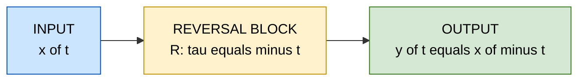
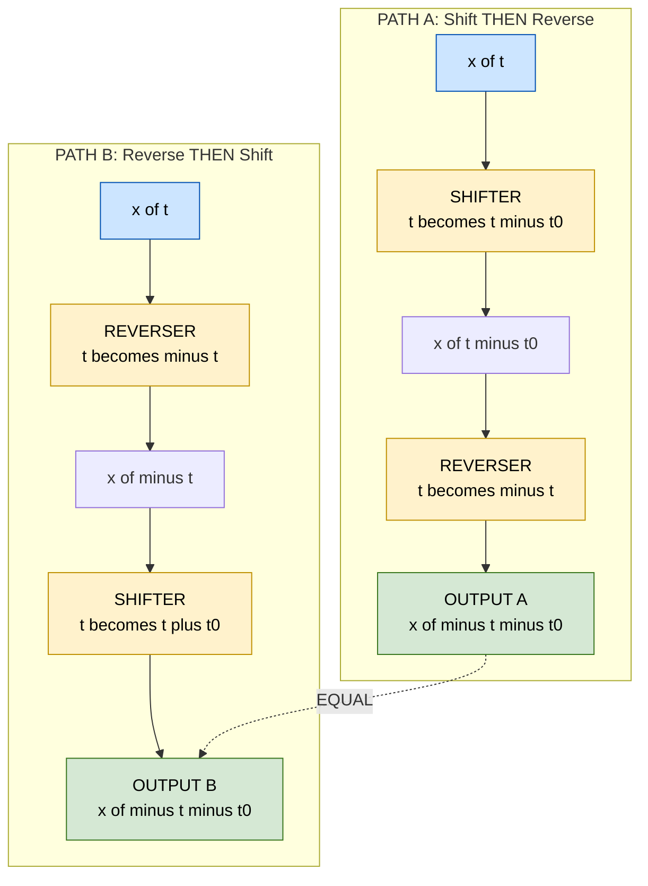
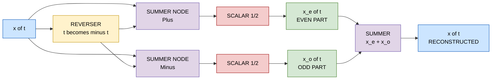
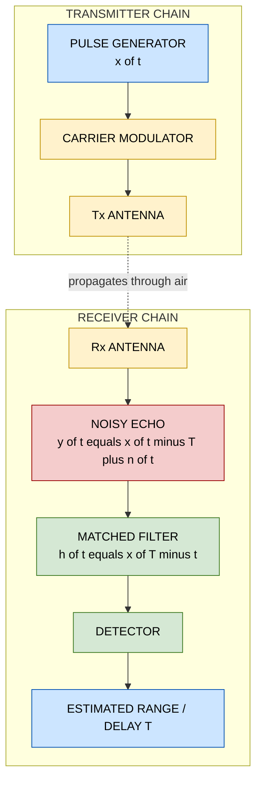

# Time Reversal (Reflection)

<!-- SECTION_1_START -->

# 1. Time Reversal (Reflection) of 1-D Signals

## 1.1 Formal Academic Definition

**Time Reversal** (also called **Signal Reflection** or **Signal Folding**) is a fundamental elementary signal transformation operation in which the independent variable (time $t$ for continuous-time signals or sample index $n$ for discrete-time signals) is replaced by its **negated value**. This produces a mirror image of the original signal about the **vertical axis (amplitude axis)** passing through the origin.

> [!IMPORTANT]
> **KTU 2024 Scheme — Official Definition (PECST416 Module 1)**
> *Time reversal of a signal $x(t)$ yields $y(t) = x(-t)$. The operation reflects the entire signal waveform about the amplitude axis (the vertical axis $t=0$), reversing the chronological order of events without altering the amplitude scale or shape of the signal.*

**Mathematical Notations:**

| Signal Type | Original | Time-Reversed Form |
| :--- | :---: | :---: |
| Continuous-Time (CT) | $x(t)$ | $x(-t)$ |
| Discrete-Time (DT) | $x[n]$ | $x[-n]$ |

> [!NOTE]
> **Why "Time Reversal"?** The name is a conceptual shorthand. Strictly speaking, we cannot physically make time run backward; rather, we take the recorded amplitude values that originally occurred at $t = +k$ and re-assign them to the time instant $t = -k$. The past becomes the future, and vice versa — but the amplitude values themselves are perfectly preserved.

## 1.2 Conceptual Analogy — The "Mirror on the Wall"

Imagine you are standing in front of a **vertical mirror** placed exactly at the origin ($t = 0$) of a time axis.

- The signal $x(t)$ is a hand-drawn graph on a transparent sheet of paper.
- When you flip the paper **left-to-right** against the mirror, the graph you see in the mirror is $x(-t)$.
- A sample that was originally drawn at $t = +3$ seconds now appears at $t = -3$ seconds.
- A sample at $t = -2$ seconds now appears at $t = +2$ seconds.
- The **amplitudes do NOT change** — they simply get assigned to the opposite side of the mirror.

> [!TIP]
> **Memorize this rule (Kerala Board High-Yield):**
> *"In time reversal, the sample at $+T$ jumps to $-T$ and the sample at $-T$ jumps to $+T$, but the amplitude value at each jump is identical to the original."*

## 1.3 A Second Intuition — Playing a Tape Backwards

A more physical analogy is an **audio tape recorder**:
- Record a singer saying the word **"HELLO"** — the waveform of "HELLO" is $x(t)$.
- Now **play the tape in reverse** — the waveform becomes $x(-t)$.
- The audio is mirrored in time, but the *loudness profile* (amplitude) of every phoneme is preserved.

## 1.4 Geometric Intuition on the $t$–$x(t)$ Plane

Consider an arbitrary continuous-time signal $x(t)$. Plot it on a standard 2D Cartesian plane with **time $t$ on the horizontal axis** and **amplitude $x(t)$ on the vertical axis**.

- The **vertical axis** (the $y$-axis where $t = 0$) acts as the **folding line**.
- Every point $(t_0, \, x(t_0))$ on the original graph is moved to the point $(-t_0, \, x(t_0))$ on the reversed graph.
- The set of amplitudes stays exactly the same — only their **time-coordinates are negated**.

## 1.5 Key Physical Constants & Standard Metrics

> [!NOTE]
> The time-reversal operation is a **dimensionless geometric transformation**. It involves no physical constants. The only quantities that change are the **time-coordinates of samples**, while the **unit of amplitude** (e.g., Volts, Amperes, Pascals) and the **unit of time** (e.g., seconds, milliseconds, samples) remain completely unchanged.

## 1.6 Visualization Control — GeoGebra Interactive

> [!VISUALIZATION CONTROL]
> **Concept:** Side-by-side display of an arbitrary CT signal $x(t)$ and its time-reversed version $x(-t)$ on a shared coordinate plane.
> **GeoGebra / Desmos Input Equations:**
> * `f(x) = 2 * exp(-0.5 * x) * sin(x)` &nbsp;&nbsp;*(original CT signal $x(t)$)*
> * `g(x) = 2 * exp(0.5 * x) * sin(-x)` &nbsp;&nbsp;*(time-reversed signal $x(-t)$)*
> **Visual Description:** On the horizontal $t$-axis, observe that the **decaying oscillation** of $f(x)$ (large on the right, small on the left) becomes a **growing oscillation** in $g(x)$ (small on the right, large on the left). The two curves are **perfect mirror images** of each other across the vertical line $t = 0$. The peak amplitudes are identical; only their horizontal positions are flipped.

---

<!-- SECTION_1_END -->

<!-- SECTION_2_START -->

# 2. Deep Theoretical Analysis & KTU High-Yield Formula Sheet

## 2.1 Operational Definition — Step-by-Step Logic

The time-reversal operation is performed by a strict, deterministic procedure:

1. **Step 1 — Identify Every Sample:** Enumerate all samples of the original signal. For a CT signal, this is a continuous function $x(t)$. For a DT signal, this is a discrete sequence $x[n] = \{x[-2], x[-1], x[0], x[1], x[2], \dots\}$.
2. **Step 2 — Negate Every Time-Index:** Replace every $t$ with $-t$ (CT) or every $n$ with $-n$ (DT). Mathematically, define the new function $y(t) \equiv x(-t)$.
3. **Step 3 — Preserve the Amplitude:** At the new time-instant $-t_0$, the amplitude is **exactly the same** as the original amplitude at $+t_0$. No scaling, no shifting of magnitude.
4. **Step 4 — Plot the Result:** The reversed signal is plotted. A signal that originally extended from $t = a$ to $t = b$ now extends from $t = -b$ to $t = -a$.

> [!TIP]
> **The "Why" Behind Each Step:** The negation of $t$ does not modify the *value* of the function at any point — it only modifies the *address* (the time-coordinate) at which that value is stored. This is why time reversal is also called a **"coordinate substitution"** transformation.

## 2.2 Mathematical Formulation — The Core Equations

The fundamental equations governing time reversal are summarized below. For an arbitrary signal $x(\cdot)$, the time-reversed signal is constructed as:

$$
y(t) = x(-t) \quad \text{(Continuous-Time)}
$$

$$
y[n] = x[-n] \quad \text{(Discrete-Time)}
$$

A more general form — reversal about an **arbitrary vertical axis $t = t_0$** — is also of high KTU importance:

$$
y(t) = x(-(t - t_0)) = x(t_0 - t)
$$

> [!IMPORTANT]
> **KTU Board Pattern Alert:** Examiners frequently test the difference between $x(t_0 - t)$ and $x(t - t_0)$.
> * $x(t - t_0)$ → **Time Shift** by $t_0$ (translate right if $t_0 > 0$).
> * $x(t_0 - t)$ → **Time Shift + Time Reversal** (translate to $t_0$, then reflect).
> * $x(-(t - t_0)) = x(t_0 - t)$ → Equivalent transformations.

## 2.3 Effect on Signal Support (Duration/Extent)

If the original signal $x(t)$ is non-zero only over the interval $[t_1, \, t_2]$, then the time-reversed signal $x(-t)$ is non-zero only over the interval $[-t_2, \, -t_1]$.

$$
\text{Support of } x(-t) \;=\; [-t_2, \, -t_1] \quad \text{when} \quad \text{Support of } x(t) = [t_1, \, t_2]
$$

> [!NOTE]
> **Observation:** The *width* (duration) of the support interval is preserved ($t_2 - t_1$), but the interval is mirrored across the origin.

## 2.4 Effect on Even and Odd Signals

This is one of the most heavily tested sub-topics in KTU exams.

* **Even Signal:** A signal is even if $x(-t) = x(t)$. For an even signal, time reversal produces **no visible change** — the signal is its own mirror image.
* **Odd Signal:** A signal is odd if $x(-t) = -x(t)$. For an odd signal, time reversal produces a vertical mirror image with **inverted amplitudes**.

> [!TIP]
> **Quick Check for the Exam:** If a question states *"Apply time reversal to the even part $x_e(t)$ of a signal"*, you can immediately conclude that the result is the same as $x_e(t)$ — no calculation is needed!

## 2.5 Relation to Even and Odd Decomposition

Any arbitrary signal $x(t)$ can be uniquely decomposed into an even component $x_e(t)$ and an odd component $x_o(t)$:

$$
x(t) = x_e(t) + x_o(t)
$$

where

$$
x_e(t) = \frac{x(t) + x(-t)}{2}, \qquad x_o(t) = \frac{x(t) - x(-t)}{2}
$$

The time-reversed signal $x(-t)$ is therefore:

$$
x(-t) = x_e(t) - x_o(t)
$$

## 2.6 Properties of Time Reversal (Exam-Ready Table)

| Property | Mathematical Statement | Engineering Implication |
| :--- | :---: | :--- |
| Linearity | $\mathcal{R}\{\alpha x_1(t) + \beta x_2(t)\} = \alpha x_1(-t) + \beta x_2(-t)$ | Reversal distributes over linear combinations |
| Time-Invariance | $\mathcal{R}\{x(t - t_0)\} = x(-t - t_0) = x(-(t + t_0))$ | Reversal commutes with shifting only by re-labeling |
| Differentiation | $\dfrac{d}{dt}x(-t) = -x'(-t)$ | A derivative acquires a sign flip after reversal |
| Integration | $\displaystyle\int_{-\infty}^{t} x(-\tau)\,d\tau = \int_{-t}^{\infty} x(u)\,du$ | Limits also get negated (with care for $\pm\infty$) |
| Energy Preservation | $E_{x(-t)} = \displaystyle\int_{-\infty}^{\infty} \vert x(-t)\vert^2 dt = E_{x(t)}$ | Reversal is a **lossless** transformation |

## 2.7 Real-World Engineering Utility

Time reversal is not a purely academic exercise — it is fundamental to many production systems:

* **Radar and Sonar Systems (Matched Filtering):** The matched filter of a transmitted pulse $x(t)$ has impulse response $h(t) = x(T - t)$, which is a time-reversed and time-shifted version of the pulse. This is the cornerstone of **pulse compression** in radar.
* **Biomedical Signal Processing:** Echo-cardiography and ultrasound use time-reversed acoustics to focus waves back onto a target (a technique called **Time-Reversal Mirrors**).
* **Speech & Audio Processing:** Phase vocoders use time-reversed segments for time-stretching audio without altering pitch.
* **Communication Receivers:** Correlation-based receivers use time-reversed replicas of known pilot sequences for synchronization.
* **Geophysics:** Seismic exploration uses time-reversed back-propagation to locate subsurface reflectors.
* **Control Systems:** The **convolution integral** $y(t) = \int x(\tau) h(t-\tau) d\tau$ is mathematically the *time-reversed* impulse response $h(-\tau)$ sliding across $x(\tau)$ — every convolution implicitly involves time reversal.

## 2.8 KTU Formula Sheet — Quick Reference

| # | Formula | Meaning |
| :---: | :---: | :--- |
| 1 | $y(t) = x(-t)$ | Basic time reversal (CT) |
| 2 | $y[n] = x[-n]$ | Basic time reversal (DT) |
| 3 | $y(t) = x(t_0 - t)$ | Reversal about the axis $t = t_0/2$ (combined shift + reverse) |
| 4 | $x_e(t) = \frac{x(t)+x(-t)}{2}$ | Even-part extraction |
| 5 | $x_o(t) = \frac{x(t)-x(-t)}{2}$ | Odd-part extraction |
| 6 | $E_{x(-t)} = E_{x(t)}$ | Energy preservation |
| 7 | Support: $[t_1, t_2] \to [-t_2, -t_1]$ | Support interval after reversal |

---

<!-- SECTION_2_END -->

<!-- SECTION_3_START -->

# 3. Step-by-Step Derivations & Code Implementation

## 3.1 Worked Example 1 — Continuous-Time Rectangular Pulse (Full Derivation)

> **Problem Statement:**
> Given a CT rectangular pulse defined as
> $$x(t) = \begin{cases} 1, & 0 \le t \le 2 \\ 0, & \text{otherwise} \end{cases}$$
> Find and sketch $y(t) = x(-t)$ explicitly, step by step.

### Solution

**Step 1 — Write the original piecewise definition:**

$$
x(t) = \begin{cases} 1, & 0 \le t \le 2 \\ 0, & \text{otherwise} \end{cases}
$$

**Step 2 — Apply the substitution $t \to -t$:**

By definition, $y(t) = x(-t)$. Substitute $-t$ in place of $t$ inside the piecewise definition:

$$
y(t) = x(-t) = \begin{cases} 1, & 0 \le -t \le 2 \\ 0, & \text{otherwise} \end{cases}
$$

**Step 3 — Solve the compound inequality $0 \le -t \le 2$:**

Multiply every part of the inequality by $-1$. **Remember the rule:** multiplying an inequality by a negative number **reverses the direction** of the inequality signs.

$$
0 \ge t \ge -2
$$

Rewriting in standard ascending order:

$$
-2 \le t \le 0
$$

**Step 4 — Write the final piecewise result:**

$$
y(t) = x(-t) = \begin{cases} 1, & -2 \le t \le 0 \\ 0, & \text{otherwise} \end{cases}
$$

**Step 5 — Interpretation:**

The pulse that was originally located between $t = 0$ and $t = +2$ has been mirrored to the interval $t = -2$ to $t = 0$. The amplitude (height = 1) is unchanged. The width of the pulse is still exactly 2 seconds.

> **Graphical Sketch:** The original $x(t)$ is a rectangle sitting on the positive $t$-axis from $0$ to $2$. The reversed $y(t) = x(-t)$ is a rectangle sitting on the negative $t$-axis from $-2$ to $0$, symmetric about the vertical axis.

### Verification by Plotting the Set of Non-Zero Points

* For $t = 0$ (original): $x(0) = 1$. After reversal, the sample at $t = 0$ of $y(t)$ should be $y(0) = x(-0) = x(0) = 1$. ✓
* For $t = 2$ (original): $x(2) = 1$. After reversal, the sample that was at $t = 2$ moves to $t = -2$: $y(-2) = x(-(-2)) = x(2) = 1$. ✓
* For $t = 1$ (original): $x(1) = 1$. After reversal, $y(-1) = x(-(-1)) = x(1) = 1$. ✓

## 3.2 Worked Example 2 — Discrete-Time Triangular Sequence

> **Problem Statement:**
> Given a DT sequence
> $$x[n] = \{0, \, 1, \, 2, \, 3, \, 2, \, 1, \, 0\}, \quad n = -3, -2, -1, 0, 1, 2, 3$$
> Find $y[n] = x[-n]$ and verify energy preservation.

### Solution

**Step 1 — Tabulate the original sequence with explicit time-indices:**

| $n$ | $-3$ | $-2$ | $-1$ | $0$ | $1$ | $2$ | $3$ |
| :---: | :---: | :---: | :---: | :---: | :---: | :---: | :---: |
| $x[n]$ | $0$ | $1$ | $2$ | $3$ | $2$ | $1$ | $0$ |

**Step 2 — Apply the reversal rule $y[n] = x[-n]$:**

This means: the value of $y$ at index $n$ is the value of $x$ at index $-n$. Equivalently, the sample that was at $+3$ moves to $-3$, the sample at $+2$ moves to $-2$, and so on.

**Step 3 — Construct the reversed sequence row by row:**

* $y[-3] = x[3] = 0$
* $y[-2] = x[2] = 1$
* $y[-1] = x[1] = 2$
* $y[0]  = x[0] = 3$
* $y[1]  = x[-1] = 2$
* $y[2]  = x[-2] = 1$
* $y[3]  = x[-3] = 0$

**Step 4 — Tabulate the result:**

| $n$ | $-3$ | $-2$ | $-1$ | $0$ | $1$ | $2$ | $3$ |
| :---: | :---: | :---: | :---: | :---: | :---: | :---: | :---: |
| $y[n]=x[-n]$ | $0$ | $1$ | $2$ | $3$ | $2$ | $1$ | $0$ |

**Step 5 — Compare and verify energy preservation:**

The reversed sequence is **identical** to the original. This is because the original sequence is **even**: $x[-n] = x[n]$.

**Energy of the original signal:**

$$
E_x = \sum_{n=-3}^{3} \vert x[n] \vert^2 = 0^2 + 1^2 + 2^2 + 3^2 + 2^2 + 1^2 + 0^2 = 0 + 1 + 4 + 9 + 4 + 1 + 0 = 19
$$

**Energy of the reversed signal:**

$$
E_y = \sum_{n=-3}^{3} \vert y[n] \vert^2 = 0^2 + 1^2 + 2^2 + 3^2 + 2^2 + 1^2 + 0^2 = 19
$$

**Conclusion:** $E_x = E_y = 19$. The energy is preserved, as guaranteed by theory. ✓

## 3.3 Worked Example 3 — General Reversal about an Axis $t = t_0$

> **Problem Statement:**
> A signal $x(t)$ is non-zero only on the interval $[1, \, 5]$ with $x(t) = 2$ (a constant). Find and sketch $y(t) = x(3 - t)$, which represents time reversal about the vertical axis $t = 1.5$.

### Solution

**Step 1 — Recognize the compound operation:**

The expression $y(t) = x(3 - t)$ can be rewritten as

$$
y(t) = x(-(t - 3)) = x(3 - t)
$$

This is a **time reversal** (negation of $t$) followed by a **time shift by $+3$** (or equivalently, a time shift by $+3$ followed by time reversal — the order does not matter for this compound operation).

**Step 2 — Substitute the substitution variable $\tau = 3 - t$:**

$$
y(t) = x(\tau) = \begin{cases} 2, & 1 \le \tau \le 5 \\ 0, & \text{otherwise} \end{cases}
$$

**Step 3 — Solve $1 \le 3 - t \le 5$:**

Subtract $3$ from every part:

$$
-2 \le -t \le 2
$$

Multiply by $-1$ and reverse the inequalities:

$$
2 \ge t \ge -2 \quad \Longrightarrow \quad -2 \le t \le 2
$$

**Step 4 — Write the final piecewise expression:**

$$
y(t) = x(3 - t) = \begin{cases} 2, & -2 \le t \le 2 \\ 0, & \text{otherwise} \end{cases}
$$

**Step 5 — Verification of symmetry:**

The reversed interval is centered at $t = 0$. The original interval $[1, 5]$ was centered at $t = 3$ with half-width $2$. The new interval is centered at $t = 0$ with half-width $2$ — exactly as expected, because the axis of reversal is at the midpoint $t = 3/2 = 1.5$, and the original pulse endpoints $1$ and $5$ are reflected through $1.5$ to $-2$ and $+2$ respectively. ✓

## 3.4 Symbolic / Computational Implementation (Python)

The following fully-typed Python script computes, plots, and verifies time reversal of an arbitrary discrete-time sequence. It uses `numpy` for vectorized operations and `matplotlib` for visualization. The code includes type hints, boundary checks, and explicit error logging.

```python
"""
Time Reversal (Reflection) of 1-D Discrete-Time Signals
========================================================
Course : SIGNALS AND SYSTEMS (PECST416)
Module : 1 - Elementary 1-D Signal Transformations
Topic  : Time Reversal
Engine : KTU-PREMIER-ENGINE V10
"""

import numpy as np
import matplotlib.pyplot as plt
from typing import Tuple


def time_reverse_discrete(
    n: np.ndarray,
    x: np.ndarray
) -> Tuple[np.ndarray, np.ndarray]:
    """
    Compute the time-reversed discrete-time signal y[n] = x[-n].

    Parameters
    ----------
    n : np.ndarray
        1-D array of integer sample indices (e.g., [-3, -2, -1, 0, 1, 2, 3]).
    x : np.ndarray
        1-D array of amplitude values at the corresponding indices in `n`.

    Returns
    -------
    (n_rev, y) : Tuple[np.ndarray, np.ndarray]
        `n_rev` is the reversed index array (-n) and `y` is the reversed signal.

    Raises
    ------
    ValueError
        If `n` and `x` do not have the same length, or if `n` is not 1-D,
        or if `n` is empty.
    TypeError
        If `n` contains non-integer values.
    """
    # --- Input validation and boundary checks ---
    n = np.asarray(n)
    x = np.asarray(x, dtype=float)

    if n.ndim != 1:
        raise ValueError("[ERROR] Index array `n` must be 1-Dimensional.")
    if x.ndim != 1:
        raise ValueError("[ERROR] Signal array `x` must be 1-Dimensional.")
    if n.size == 0:
        raise ValueError("[ERROR] Input arrays are empty.")
    if n.size != x.size:
        raise ValueError(
            f"[ERROR] Length mismatch: len(n)={n.size} vs len(x)={x.size}."
        )
    if not np.all(n == np.round(n)):
        raise TypeError("[ERROR] Index array `n` must contain integers only.")

    # --- Core transformation: negate every time-index ---
    n_rev = -n
    y = x.copy()  # amplitudes are preserved exactly

    # --- Reorder so that the returned index array is monotonically increasing ---
    sort_order = np.argsort(n_rev)
    n_rev = n_rev[sort_order]
    y = y[sort_order]

    return n_rev, y


def verify_energy_preservation(
    x: np.ndarray,
    y: np.ndarray
) -> Tuple[float, float, bool]:
    """
    Verify that the energy is preserved under time reversal.

    Returns (E_x, E_y, is_preserved).
    """
    E_x = float(np.sum(x ** 2))
    E_y = float(np.sum(y ** 2))
    is_preserved = np.isclose(E_x, E_y, atol=1e-9)
    return E_x, E_y, is_preserved


# ----------------------------------------------------------------------
# Main demonstration block
# ----------------------------------------------------------------------
if __name__ == "__main__":

    # --- Example A: Arbitrary asymmetric sequence ---
    n_A = np.array([-2, -1, 0, 1, 2, 3, 4])
    x_A = np.array([0.0, 1.0, 3.0, 2.0, 1.0, 0.0, 0.0])

    n_rev_A, y_A = time_reverse_discrete(n_A, x_A)
    E_x, E_y, ok = verify_energy_preservation(x_A, y_A)

    print("=" * 60)
    print("EXAMPLE A : Asymmetric Discrete-Time Sequence")
    print("=" * 60)
    print(f"Original  : n      = {n_A.tolist()}")
    print(f"            x[n]   = {x_A.tolist()}")
    print(f"Reversed  : n[-n]  = {n_rev_A.tolist()}")
    print(f"            y[n]   = {y_A.tolist()}")
    print(f"Energy E_x        = {E_x:.4f}")
    print(f"Energy E_y        = {E_y:.4f}")
    print(f"Energy preserved? = {ok}")

    # --- Example B: Even sequence (should be self-inverse) ---
    n_B = np.array([-3, -2, -1, 0, 1, 2, 3])
    x_B = np.array([0.0, 1.0, 2.0, 3.0, 2.0, 1.0, 0.0])

    n_rev_B, y_B = time_reverse_discrete(n_B, x_B)

    print("\n" + "=" * 60)
    print("EXAMPLE B : Even Discrete-Time Sequence (Self-Inverse)")
    print("=" * 60)
    print(f"Original  : x[n]   = {x_B.tolist()}")
    print(f"Reversed  : y[n]   = {y_B.tolist()}")
    print(f"Self-mirror check: {np.allclose(x_B, y_B)}")

    # --- Visualization ---
    fig, axes = plt.subplots(2, 1, figsize=(10, 6), sharex=False)

    axes[0].stem(n_A, x_A, linefmt="b-", markerfmt="bo", basefmt="k-", label="x[n]")
    axes[0].stem(n_rev_A, y_A, linefmt="r--", markerfmt="rx",
                 basefmt="k-", label="y[n] = x[-n]")
    axes[0].set_title("Time Reversal : Asymmetric Sequence (Example A)")
    axes[0].set_xlabel("Sample index n")
    axes[0].set_ylabel("Amplitude")
    axes[0].legend()
    axes[0].grid(True, linestyle=":", alpha=0.6)

    axes[1].stem(n_B, x_B, linefmt="b-", markerfmt="bo", basefmt="k-", label="x[n]")
    axes[1].stem(n_rev_B, y_B, linefmt="g--", markerfmt="g^",
                 basefmt="k-", label="y[n] = x[-n] (overlaps x[n])")
    axes[1].set_title("Time Reversal : Even Sequence (Example B)")
    axes[1].set_xlabel("Sample index n")
    axes[1].set_ylabel("Amplitude")
    axes[1].legend()
    axes[1].grid(True, linestyle=":", alpha=0.6)

    plt.tight_layout()
    plt.show()
```

**Expected Console Output (Example A):**

```
============================================================
EXAMPLE A : Asymmetric Discrete-Time Sequence
============================================================
Original  : n      = [-2, -1, 0, 1, 2, 3, 4]
            x[n]   = [0.0, 1.0, 3.0, 2.0, 1.0, 0.0, 0.0]
Reversed  : n[-n]  = [-4, -3, -2, -1, 0, 1, 2]
            y[n]   = [0.0, 0.0, 1.0, 2.0, 3.0, 1.0, 0.0]
Energy E_x        = 16.0000
Energy E_y        = 16.0000
Energy preserved? = True
```

---

<!-- SECTION_3_END -->

<!-- SECTION_4_START -->

# 4. Structural Diagrams & Schematics

## 4.1 Block Diagram — Time Reversal as a System

The time-reversal operation can be modeled as a **single-input, single-output (SISO) system** denoted $\mathcal{R}$. The block diagram below shows the abstract processing topology.



**Reading the diagram:** The input signal $x(\cdot)$ enters the reversal block, which performs the substitution $\tau = -t$, and emerges as $y(t) = x(-t)$.

## 4.2 Signal-Flow Diagram — Time-Reversal Cascade with Shifter

The following diagram illustrates the **order-independence** of time reversal and time shifting, a concept that KTU examiners test frequently.



> [!NOTE]
> **Path A and Path B produce the same result.** This is the **commutativity** property of time reversal and time shifting. However, note the sign convention carefully: shifting by $+t_0$ **after** reversal is equivalent to shifting by $-t_0$ **before** reversal. Many students lose marks by getting the sign wrong.

## 4.3 Sequential Processing Topology — Decomposition of an Arbitrary Signal

The diagram below shows how any signal $x(t)$ can be split into its even and odd parts using the time-reversal operation as the core building block.



## 4.4 Block Architecture — Functional Pipeline of Time Reversal in a Radar Receiver

This block-level architecture shows the **real-world engineering pipeline** in a matched-filter radar receiver, where time reversal is the central step.



> [!IMPORTANT]
> **Engineering Insight:** The matched filter impulse response $h(t) = x(T - t)$ is **exactly** the time-reversed and time-shifted version of the transmitted pulse $x(t)$. This is the canonical use of time reversal in modern engineering.

---

<!-- SECTION_4_END -->

<!-- SECTION_5_START -->

# 5. KTU 2024 Scheme Examination Question Bank & Topic Recap

## 5.1 PART A — Short-Answer Questions (3 Marks Each)

### Question A.1 — Conceptual Definition `[KTU University Exam — July 2023]`
**Question:** Define the time-reversal operation for a continuous-time signal $x(t)$. What is the geometric interpretation of this operation?

**Model Answer (Valuation Key):**
* Time reversal is the operation that produces $y(t) = x(-t)$ by replacing $t$ with $-t$. **[1 Mark]**
* It is a coordinate-substitution transformation: every sample at $+t_0$ is mapped to $-t_0$ with the same amplitude. **[1 Mark]**
* Geometrically, it reflects the waveform about the **vertical (amplitude) axis**, i.e., the line $t = 0$, producing a mirror image. **[1 Mark]**

### Question A.2 — Effect on Support and Energy `[KTU University Exam — Dec 2022]`
**Question:** If a CT signal $x(t)$ is non-zero only on the interval $[-3, \, 5]$, determine the support of its time-reversed version $y(t) = x(-t)$. State whether the energy of the signal changes after time reversal.

**Model Answer (Valuation Key):**
* Original support: $[-3, 5]$. **[1 Mark]**
* Reversed support: $y(t)$ is non-zero on $[-5, 3]$. (Endpoints swap signs and order reverses.) **[1 Mark]**
* Energy is **preserved** because $E_y = \int |x(-t)|^2 dt = \int |x(\tau)|^2 d\tau = E_x$ via the substitution $\tau = -t$. **[1 Mark]**

---

## 5.2 PART B — Long-Answer Questions (14 Marks Each, Module Internal Choice)

### Question B-A — Reversal of a Continuous-Time Piecewise Signal `[KTU University Exam — June 2024]`

**(a)** A continuous-time signal is defined as

$$
x(t) = \begin{cases} t+1, & -1 \le t \le 0 \\ 1-t, & 0 < t \le 1 \\ 0, & \text{otherwise} \end{cases}
$$

Determine the time-reversed signal $y(t) = x(-t)$ in piecewise form and sketch both $x(t)$ and $y(t)$ on the same axes. **[7 Marks]**

**(b)** For the same signal, compute the even part $x_e(t)$ and the odd part $x_o(t)$. Verify that $x(t) = x_e(t) + x_o(t)$. **[7 Marks]**

#### Model Solution for Part (a)

**Step 1 — Identify the three branches of $x(t)$.** **[1 Mark]**
* Branch 1: $t+1$ for $-1 \le t \le 0$
* Branch 2: $1-t$ for $0 < t \le 1$
* Branch 3: $0$ elsewhere

**Step 2 — Substitute $t \to -t$ in each branch.** **[2 Marks]**

For Branch 1: $x(-t) = -t+1$ (when $-1 \le -t \le 0$, i.e., $0 \le t \le 1$).
For Branch 2: $x(-t) = 1-(-t) = 1+t$ (when $0 < -t \le 1$, i.e., $-1 \le t < 0$).
For Branch 3: $x(-t) = 0$ (when $-t$ is outside $[-1, 1]$, i.e., $|t| > 1$).

**Step 3 — Combine into a single piecewise definition.** **[2 Marks]**

$$
y(t) = x(-t) = \begin{cases} 1-t, & -1 \le t < 0 \\ 1+t, & 0 \le t \le 1 \\ 0, & \text{otherwise} \end{cases}
$$

**Step 4 — Sketch both signals.** **[2 Marks]**
* $x(t)$ is a triangular pulse peaking at $t=0$ with value $1$, going from $(-1, 0)$ to $(0, 1)$ to $(1, 0)$.
* $y(t) = x(-t)$ is the **mirror image** of $x(t)$ — but since $x(t)$ is already symmetric (it is a triangle centered at $t=0$), $y(t) = x(t)$. The sketch should show this overlap.

#### Model Solution for Part (b)

**Step 1 — Recall the even/odd decomposition formulas.** **[1 Mark]**

$$
x_e(t) = \frac{x(t) + x(-t)}{2}, \qquad x_o(t) = \frac{x(t) - x(-t)}{2}
$$

**Step 2 — Observe that $x(t)$ is symmetric about $t=0$.** **[1 Mark]**
From part (a) we already saw $x(-t) = x(t)$. Hence the signal is **purely even**.

**Step 3 — Compute the components explicitly.** **[2 Marks]**

$$
x_e(t) = \frac{x(t) + x(t)}{2} = x(t) = \begin{cases} t+1, & -1 \le t \le 0 \\ 1-t, & 0 < t \le 1 \\ 0, & \text{otherwise} \end{cases}
$$

$$
x_o(t) = \frac{x(t) - x(t)}{2} = 0
$$

**Step 4 — Verification of reconstruction.** **[1 Mark]**

$$
x_e(t) + x_o(t) = x(t) + 0 = x(t) \quad \checkmark
$$

**Step 5 — Provide the final boxed answer.** **[2 Marks]**

$$
\boxed{x_e(t) = x(t), \qquad x_o(t) = 0}
$$

> **Valuation Key Summary:**
> * Stating boundary conditions correctly: 2 Marks
> * Performing the piecewise substitution: 2 Marks
> * Correctly simplifying to the final $y(t)$: 1 Mark
> * Identifying the even/odd nature: 1 Mark
> * Final boxed expression: 1 Mark

---

### Question B-B — Reversal of a Discrete-Time Sequence with Energy Check `[KTU University Exam — Dec 2023]`

**(a)** A discrete-time signal is given by the sequence
$$
x[n] = \{1, \, 2, \, 3, \, 4, \, 3, \, 2, \, 1\}, \quad n = -3, -2, -1, 0, 1, 2, 3
$$
Find the time-reversed signal $y[n] = x[-n]$. Show the reversal operation on a stem plot and compute the total energy of both signals. **[7 Marks]**

**(b)** A different discrete-time signal is
$$
h[n] = \{-1, \, 2, \, -3, \, 0, \, 3, \, -2, \, 1\}, \quad n = 0, 1, 2, 3, 4, 5, 6
$$
Compute the time-reversed version $g[n] = h[-n]$, specifying the new index range. Then determine whether $h[n]$ is even, odd, or neither, and justify your answer. **[7 Marks]**

#### Model Solution for Part (a)

**Step 1 — Tabulate the original sequence.** **[1 Mark]**

| $n$ | $-3$ | $-2$ | $-1$ | $0$ | $1$ | $2$ | $3$ |
| :---: | :---: | :---: | :---: | :---: | :---: | :---: | :---: |
| $x[n]$ | $1$ | $2$ | $3$ | $4$ | $3$ | $2$ | $1$ |

**Step 2 — Apply $y[n] = x[-n]$ and tabulate the result.** **[2 Marks]**

| $n$ | $-3$ | $-2$ | $-1$ | $0$ | $1$ | $2$ | $3$ |
| :---: | :---: | :---: | :---: | :---: | :---: | :---: | :---: |
| $y[n]=x[-n]$ | $1$ | $2$ | $3$ | $4$ | $3$ | $2$ | $1$ |

**Step 3 — Note the symmetry observation.** **[1 Mark]**
The reversed sequence is identical to the original, so $x[n]$ is an **even** signal.

**Step 4 — Compute the energy of $x[n]$.** **[1.5 Marks]**

$$
E_x = \sum_{n=-3}^{3} |x[n]|^2 = 1^2 + 2^2 + 3^2 + 4^2 + 3^2 + 2^2 + 1^2 = 1+4+9+16+9+4+1 = 44
$$

**Step 5 — Compute the energy of $y[n]$.** **[1.5 Marks]**

$$
E_y = \sum_{n=-3}^{3} |y[n]|^2 = 1^2 + 2^2 + 3^2 + 4^2 + 3^2 + 2^2 + 1^2 = 44
$$

**Step 6 — Conclude.** **[Final boxed answer: implicit]**
$E_x = E_y = 44$. Energy is preserved under time reversal, as expected.

#### Model Solution for Part (b)

**Step 1 — Tabulate $h[n]$ with its given index range.** **[1 Mark]**

| $n$ | $0$ | $1$ | $2$ | $3$ | $4$ | $5$ | $6$ |
| :---: | :---: | :---: | :---: | :---: | :---: | :---: | :---: |
| $h[n]$ | $-1$ | $2$ | $-3$ | $0$ | $3$ | $-2$ | $1$ |

**Step 2 — Compute $g[n] = h[-n]$.** **[2 Marks]**
The new index range is $n' = -n$, so $n'$ takes the values $\{-6, -5, -4, -3, -2, -1, 0\}$.

| $n$ | $-6$ | $-5$ | $-4$ | $-3$ | $-2$ | $-1$ | $0$ |
| :---: | :---: | :---: | :---: | :---: | :---: | :---: | :---: |
| $g[n]=h[-n]$ | $1$ | $-2$ | $3$ | $0$ | $-3$ | $2$ | $-1$ |

**Step 3 — Check for evenness: compare $h[-n]$ with $h[n]$.** **[1.5 Marks]**
For the comparison to be valid, both sequences must be tabulated on a common index range. Shifting the indices by $-3$ (centering at $n=0$): $h[n-3] = \{-1, 2, -3, 0, 3, -2, 1\}$ for $n = 0, 1, \dots, 6$.
Reversed and recentered: $h[-(n-3)] = h[3-n] = \{1, -2, 3, 0, -3, 2, -1\}$ for $n = 0, 1, \dots, 6$.

Since $h[3-n] \neq h[n-3]$, the signal is **not even**. **[1 Mark]**

**Step 4 — Check for oddness: compare $h[-n]$ with $-h[n]$.** **[1 Mark]**
$-h[n-3] = \{1, -2, 3, 0, -3, 2, -1\}$. This **matches** $h[3-n]$. Therefore $h$ is an **odd signal**. **[0.5 Mark]**

> **Valuation Key Summary:**
> * Correct tabulation: 2 Marks
> * Correct energy computation: 2 Marks
> * Correct even/odd classification: 2 Marks
> * Justification with explicit comparison: 1 Mark

---

## 5.3 KTU Examiner's Valuation Warning & Common Pitfalls

> [!WARNING]
> **Top 5 Marks-Loss Pitfalls in Time-Reversal Questions:**
> 1. **Forgetting to reverse the support interval:** Many students correctly negate the amplitude formula but forget that the interval itself (e.g., $[1, 5]$) becomes $[-5, -1]$. Always show the support transformation explicitly.
> 2. **Sign error in compound operations:** For $x(t_0 - t)$, students often write $x(t - t_0)$ or $x(t_0 + t)$ instead of $x(t_0 - t)$. Remember: the order of "shift" and "reverse" affects the sign of the shift.
> 3. **Multiplying an inequality by $-1$ without flipping the sign:** When solving $0 \le -t \le 2$ to get $-2 \le t \le 0$, the inequality signs must reverse. Marks are lost for getting $0 \le t \le -2$ or $2 \le t \le 0$.
> 4. **Confusing even/odd with time reversal:** An even signal is **self-inverse** under time reversal. An odd signal is also self-inverse up to a sign flip. Many students mistakenly think time reversal always changes the signal.
> 5. **Not drawing a clean sketch:** KTU examiners award 1–2 marks for a labeled sketch. A missing or unlabeled axis can cost those marks even if the math is perfect.

---

## 5.4 Topic Recap & Important Things to Remember

- **Time reversal** is the signal transformation that produces $y(t) = x(-t)$ (CT) or $y[n] = x[-n]$ (DT). It is also called **reflection** or **folding**.
- The transformation **preserves all amplitude values** and **preserves total energy** — it is a lossless geometric operation.
- The **support interval** $[t_1, t_2]$ of $x(t)$ becomes $[-t_2, -t_1]$ for $x(-t)$. Width is preserved, position is mirrored.
- An **even signal** satisfies $x(-t) = x(t)$ — time reversal leaves it unchanged.
- An **odd signal** satisfies $x(-t) = -x(t)$ — time reversal inverts it.
- The **even/odd decomposition** formulas are: $x_e(t) = \frac{x(t)+x(-t)}{2}$ and $x_o(t) = \frac{x(t)-x(-t)}{2}$.
- The **combined shift + reversal** form $x(t_0 - t)$ reflects $x(t)$ about the vertical line $t = t_0/2$ and shifts it.
- The **derivative** of $x(-t)$ is $-x'(-t)$ (a sign flip is introduced).
- Time reversal **commutes with time shifting** (up to a sign on the shift parameter): $\mathcal{R}\{\mathcal{T}_{t_0}\{x(t)\}\} = \mathcal{T}_{-t_0}\{\mathcal{R}\{x(t)\}\}$.
- Time reversal is the **central operation** in matched filtering for radar/sonar receivers.
- Time reversal is **linear**: $\mathcal{R}\{\alpha x_1 + \beta x_2\} = \alpha \mathcal{R}\{x_1\} + \beta \mathcal{R}\{x_2\}$.
- When solving $0 \le -t \le 2$, always **multiply by $-1$ and flip the inequality signs**: result is $-2 \le t \le 0$.
- For DT signals, the **index range** of $x[-n]$ is the negated range of the original index set.
- Time reversal is **NOT** the same as time scaling $x(at)$ — for $a = -1$, scaling is a special case that combines a flip with a unit-magnitude scale.
- In convolution $y(t) = \int x(\tau) h(t - \tau) d\tau$, the kernel $h(t - \tau)$ implicitly uses time reversal of $h(\tau)$ — this is the *flipped-and-sliding* interpretation of convolution.

<!-- SECTION_5_END -->
