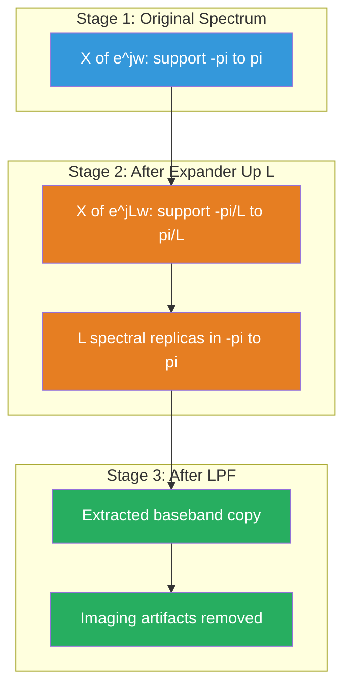

# Time scaling - Upsampling and downsampling

<!-- SECTION_1_START -->
# Time Scaling in Signals: Upsampling and Downsampling

> [!IMPORTANT]
> **KTU 2024 Scheme | PECST416 | Module 1 | 1-D Signals**
> **Course Outcome Mapped:** CO1 — *Apply the concepts of continuous and discrete time signals and systems*
> **Bloom's Level:** Understand, Apply, Analyze

## 1.1 Formal Academic Definition

In the KTU 2024 syllabus context, **Time Scaling** refers to the operation of compressing or expanding a signal along the time axis. When applied to **discrete-time signals**, this operation manifests as two fundamental processes:

**Time Scaling Operation (Continuous):**
For a continuous-time signal $x(t)$, time scaling is defined as $x(at)$ where $a > 0$. If $a > 1$, the signal is compressed; if $0 < a < 1$, the signal is expanded.

**Upsampling (Discrete-Time Expansion):**
Upsampling by an integer factor $L$ increases the sampling rate of a discrete signal $x[n]$ by inserting $L-1$ zero-valued samples between each original sample. The resulting signal $x_u[n]$ is mathematically defined as:

$$x_u[n] = \begin{cases} x\left[\frac{n}{L}\right], & n = 0, \pm L, \pm 2L, \ldots \\ 0, & \text{otherwise} \end{cases}$$

**Downsampling (Discrete-Time Compression):**
Downsampling by an integer factor $M$ reduces the sampling rate by retaining every $M$-th sample and discarding the rest. The resulting signal $x_d[n]$ is defined as:

$$x_d[n] = x[nM]$$

> [!NOTE]
> **Aliasing Warning:** Downsampling without pre-filtering causes **aliasing** if the original signal is not band-limited to $\omega < \pi/M$. This is one of the most heavily tested concepts in KTU board exams.

## 1.2 Intuitive Analogy — The Filmstrip Analogy

Imagine a movie filmstrip (which is a discrete-time signal — a sequence of still frames).

- **Upsampling** is like a director who wants the movie to play **slower** for dramatic effect. He does not invent new content — he simply inserts **blank (black) frames** between every existing frame. The projector runs at a higher rate, so the movie appears stretched in time. To smooth things out, a **low-pass filter** is then used to blend these blanks, producing natural-looking slow motion.

- **Downsampling** is like a director making a **time-lapse** video. He simply **keeps every 5th frame** and throws away the rest. The film appears to fast-forward. If he keeps the wrong frames (without pre-filtering), the wheel of a car may appear to spin *backwards* — this visual artifact is precisely what engineers call **aliasing**.

> [!TIP]
> **Key Insight for Board Exams:** Upsampling creates new samples; downsampling destroys samples. Upsampling is *reversible* (in principle); downsampling is *lossy* (information is permanently removed).

## 1.3 Physical Constants and Standard Metrics

| Parameter | Standard Notation | Typical Value in DSP |
|---|---|---|
| Upsampling Factor | $L$ (integer $\geq 1$) | $2, 3, 4$ |
| Downsampling Factor | $M$ (integer $\geq 1$) | $2, 3, 4$ |
| Anti-Aliasing Cutoff | $\omega_c = \pi/M$ | Normalized rad/sample |
| Anti-Imaging Cutoff | $\omega_c = \pi/L$ | Normalized rad/sample |
| Nyquist Frequency | $\omega_N = \pi$ | $\pi$ rad/sample |
| Interpolation Filter | FIR (Linear/Zero-order hold) | Length $N$ |

> [!VISUALIZATION CONTROL]
> **Concept:** Original signal and its upsampled (with zeros) and downsampled versions on the discrete time axis.
> **GeoGebra / Desmos Input Equations:**
> * `x(n) = 1 if n=0,2,4 else 0.5`
> * `xu(n) = 1 if n=0,4,8 else 0.5 if n=2,6 else 0`
> * `xd(n) = 1 if n=0,1,2 else 0.5`
> **Visual Description:** Students should observe that the upsampled version has spikes at multiples of $L$ with zero gaps in between, while the downsampled version skips samples, producing a thinner stem plot.
<!-- SECTION_1_END -->

<!-- SECTION_2_START -->
# Deep Theoretical Analysis & KTU High-Yield Formula Sheet

## 2.1 Upsampling — Theoretical Foundation

The upsampling operation is decomposed into **two sequential sub-operations**:

### Step 1: Zero Insertion (Expander)
A discrete-time expander, denoted $\uparrow L$, inserts $L-1$ zeros between successive samples. This operation alone does not create new information — it only stretches the time index.

**Mathematical definition of the expander $\uparrow L$:**

$$x_e[n] = \begin{cases} x\left[\frac{n}{L}\right], & \text{if } n \text{ is a multiple of } L \\ 0, & \text{otherwise} \end{cases}$$

### Step 2: Interpolation (Low-Pass Filtering)
The zero-inserted signal contains **spectral images** (replicas of the original spectrum centered at multiples of $2\pi/L$). To recover a smooth, properly band-limited signal, a **low-pass interpolation filter** $h_I[n]$ is applied. The cutoff frequency is $\omega_c = \pi/L$.

**Output of upsampling block:**

$$y[n] = x_e[n] * h_I[n] = \sum_{k=-\infty}^{\infty} x_e[k] \cdot h_I[n-k]$$

> [!NOTE]
> **Why is the filter needed?** In the frequency domain, zero-insertion creates $L$ compressed copies of $X(e^{j\omega})$ in the range $[0, 2\pi]$. The low-pass filter extracts only the baseband copy $[-\pi/L, \pi/L]$ and discards the others (called **imaging artifacts**).

### Spectral Relationship for Upsampling

If $X(e^{j\omega})$ is the DTFT of $x[n]$, then the DTFT of $x_e[n]$ (post-expander, pre-filter) is:

$$X_e(e^{j\omega}) = X(e^{jL\omega})$$

This means the spectrum is **compressed** by factor $L$, producing $L$ replicas within $[0, 2\pi]$.

## 2.2 Downsampling — Theoretical Foundation

### Step 1: Anti-Aliasing Filtering
Before decimation, the signal **must** be low-pass filtered with cutoff $\omega_c = \pi/M$ to remove frequency components that would fold back (alias) into the baseband after sample removal.

### Step 2: Decimation (Compressor)
A discrete-time compressor, denoted $\downarrow M$, retains every $M$-th sample:

$$y[n] = x[nM]$$

### Spectral Relationship for Downsampling

$$Y(e^{j\omega}) = \frac{1}{M} \sum_{k=0}^{M-1} X\left(e^{j(\omega - 2\pi k)/M}\right)$$

This is the classical **aliasing formula**. The $M$ terms represent the $M$ stretched-and-shifted replicas of the original spectrum. If pre-filtering is correctly applied, only the $k=0$ term survives with magnitude $1/M$.

> [!WARNING]
> **Critical Exam Point:** If $X(e^{j\omega})$ has support beyond $\pi/M$, the replicas will overlap, and the sum of overlapping regions will produce **irrecoverable distortion**. This is the **Nyquist-Shannon sampling theorem** in action for discrete signals.

## 2.3 Cascade Rules (KTU Frequently Tested)

When upsamplers and downsamplers are cascaded, **order matters** due to computational efficiency and anti-aliasing requirements:

| Cascade | Equivalent | Condition |
|---|---|---|
| $\uparrow L$ then $\downarrow L$ | Identity (delayed by $L-1$) | Always valid |
| $\downarrow M$ then $\uparrow M$ | Identity only if band-limited | Otherwise aliasing |
| $\uparrow L$ then $\downarrow M$ | Rational resampling by $L/M$ | With proper filtering |
| $\downarrow M$ then $\uparrow L$ | **NOT** generally equivalent to $\uparrow L$ then $\downarrow M$ | Order matters! |

> [!IMPORTANT]
> **Noble Identities** (often asked for 7 marks):
> 1. $\uparrow L \rightarrow H(z) \equiv H(z^L) \rightarrow \uparrow L$
> 2. $\downarrow M \rightarrow H(z) \equiv \downarrow M \rightarrow H(z^M)$
> These identities allow moving filters across samplers to reduce computation.

## 2.4 KTU High-Yield Formula Sheet

| # | Concept | Formula / Relation | Key Insight |
|---|---|---|---|
| 1 | Time Scaling | $y(t) = x(at)$ | $a>1$: compression; $a<1$: expansion |
| 2 | Discrete Upsampling | $x_u[n] = x[n/L]$ for $n=kL$, else 0 | Insert $L-1$ zeros |
| 3 | Discrete Downsampling | $x_d[n] = x[nM]$ | Keep every $M$-th sample |
| 4 | Expander Spectrum | $X_e(e^{j\omega}) = X(e^{jL\omega})$ | Spectrum compressed by $L$ |
| 5 | Compressor Spectrum | $Y(e^{j\omega}) = \frac{1}{M}\sum_{k=0}^{M-1} X(e^{j(\omega-2\pi k)/M})$ | Aliased sum of $M$ replicas |
| 6 | Interpolation Filter | $H_I(e^{j\omega}) = L$ for $\vert\omega\vert < \pi/L$, else $0$ | Ideal LPF gain = $L$ |
| 7 | Decimation Filter | $H_D(e^{j\omega}) = 1$ for $\vert\omega\vert < \pi/M$, else $0$ | Ideal LPF gain = $1$ |
| 8 | Nyquist for Downsample | $X(e^{j\omega}) = 0$ for $\vert\omega\vert > \pi/M$ | No aliasing condition |
| 9 | Noble Identity I | $H(z)$ after $\uparrow L$ = $H(z^L)$ before $\uparrow L$ | Computational savings |
| 10 | Noble Identity II | $H(z)$ before $\downarrow M$ = $H(z^M)$ after $\downarrow M$ | Computational savings |
| 11 | Multirate Identity | $\uparrow L \rightarrow \downarrow L = z^{-(L-1)}$ | Perfect reconstruction (delayed) |
| 12 | Audio CD Resampling | $44.1 \text{ kHz} \rightarrow 48 \text{ kHz}$ via $L=160, M=147$ | Real engineering example |

## 2.5 Real-World Engineering Applications

- **Audio Production:** Converting audio between sampling rates (e.g., $44.1$ kHz CD audio to $48$ kHz DVD audio).
- **Image Processing:** Image pyramids (Gaussian pyramids) use successive downsampling; image super-resolution uses upsampling.
- **Software-Defined Radio (SDR):** Adjusting sample rates to match different communication standards.
- **Biomedical Signals (ECG/EEG):** Adaptive sampling rates based on signal characteristics.
- **Polyphase Filter Banks:** Foundation of modern sub-band coding (used in MP3, JPEG 2000).
- **OFDM Systems:** Digital up-conversion and down-conversion in transceivers.
<!-- SECTION_2_END -->

<!-- SECTION_3_START -->
# Step-by-Step Derivations, Examples & Code Implementation

## 3.1 Derivation 1: DTFT of an Upsampler

**Statement:** Prove that if $y[n] = x_e[n]$ where $x_e[n] = x[n/L]$ for $n = kL$ and $0$ otherwise, then $Y(e^{j\omega}) = X(e^{jL\omega})$.

**Proof:**

$$\begin{aligned}
Y(e^{j\omega}) &= \sum_{n=-\infty}^{\infty} x_e[n] \cdot e^{-j\omega n}
\end{aligned}$$

We split the sum into residue classes modulo $L$. Since $x_e[n] = 0$ unless $n$ is a multiple of $L$, let $n = kL$:

$$\begin{aligned}
Y(e^{j\omega}) &= \sum_{k=-\infty}^{\infty} x_e[kL] \cdot e^{-j\omega kL} \\
&= \sum_{k=-\infty}^{\infty} x[k] \cdot e^{-j(L\omega)k} \\
&= X(e^{jL\omega})
\end{aligned}$$

**Interpretation:** The original spectrum $X(e^{j\omega})$ with support $[-\pi, \pi]$ is mapped to $X(e^{jL\omega})$ with support $[-\pi/L, \pi/L]$. The spectrum is compressed horizontally by a factor of $L$, leaving $L$ identical replicas in the visible window $[-\pi, \pi]$.

## 3.2 Derivation 2: DTFT of a Downsampler

**Statement:** Prove that if $y[n] = x[nM]$, then $Y(e^{j\omega}) = \frac{1}{M}\sum_{k=0}^{M-1} X(e^{j(\omega-2\pi k)/M})$.

**Proof:** We begin with the inverse DTFT relation for $x[n]$:

$$\begin{aligned}
x[n] &= \frac{1}{2\pi} \int_{-\pi}^{\pi} X(e^{j\theta}) e^{j\theta n} d\theta
\end{aligned}$$

Now compute $Y(e^{j\omega})$ directly from its definition:

$$\begin{aligned}
Y(e^{j\omega}) &= \sum_{n=-\infty}^{\infty} x[nM] e^{-j\omega n}
\end{aligned}$$

We use the **periodic extension identity**: $x[nM]$ can be reconstructed by summing $M$ modulated copies of $x[n]$:

$$\begin{aligned}
x[nM] &= \frac{1}{M} \sum_{k=0}^{M-1} x[n] e^{j2\pi k n / M}
\end{aligned}$$

(Each shifted replica $x[n]e^{j2\pi kn/M}$ equals $x[nM]$ when sampled at $nM$, and the sum over $k$ reconstructs the original.)

Substituting:

$$\begin{aligned}
Y(e^{j\omega}) &= \sum_{n=-\infty}^{\infty} \left[ \frac{1}{M} \sum_{k=0}^{M-1} x[n] e^{j2\pi k n / M} \right] e^{-j\omega n} \\
&= \frac{1}{M} \sum_{k=0}^{M-1} \sum_{n=-\infty}^{\infty} x[n] e^{-j n \left(\omega - \frac{2\pi k}{M}\right)} \\
&= \frac{1}{M} \sum_{k=0}^{M-1} X\left(e^{j(\omega - 2\pi k)/M}\right)
\end{aligned}$$

**Interpretation:** The downsampled spectrum is the **average** of $M$ stretched (by $M$) and circularly shifted (by $2\pi k/M$) copies of $X(e^{j\omega})$. If $X$ is not band-limited, these copies **overlap** → **aliasing**.

## 3.3 Worked Example 1: Upsampling a Sinusoid

**Problem:** Given $x[n] = \cos(0.4\pi n)$, perform upsampling by $L = 2$ and sketch the spectrum.

**Solution:**

**Step 1 — Zero Insertion:**
Insert one zero between every sample. Original samples are at $n = 0, 1, 2, 3, \ldots$ with values $1, 0.309, -0.809, -0.809, \ldots$

After $\uparrow 2$:

| $n$ | 0 | 1 | 2 | 3 | 4 | 5 | 6 | 7 | 8 |
|---|---|---|---|---|---|---|---|---|---|
| $x_e[n]$ | 1 | 0 | 0.309 | 0 | -0.809 | 0 | -0.809 | 0 | 0.309 |

**[Valuation Tip: Writing the zero-inserted sequence explicitly: 2 Marks]**

**Step 2 — Spectrum Before Filter:**

The original spectrum has discrete tones at $\omega = \pm 0.4\pi$. After upsampling by $L=2$, the new spectrum contains replicas at $\omega = \pm 0.4\pi, \pm 0.6\pi$ (note: $0.4\pi/2 = 0.2\pi$ compressed, but in $[0, 2\pi]$ baseband we see $\pm 0.2\pi$ and images at $\pm 0.8\pi$).

**Step 3 — Apply Interpolation Filter:**
A low-pass filter with cutoff $\pi/L = \pi/2$ removes the image at $\omega = \pm 0.8\pi$, leaving only the desired component at $\omega = \pm 0.2\pi$.

**Output frequency:** $\omega_{\text{new}} = 0.4\pi / L = 0.2\pi$

The effective signal is now $y[n] \approx \cos(0.2\pi n)$, which is a **slower oscillation** — consistent with our filmstrip analogy of slow-motion playback.

**[Final Output Expression: 1 Mark]**

## 3.4 Worked Example 2: Downsampling Without Pre-filtering (Aliasing)

**Problem:** Given $x[n] = \cos(0.7\pi n)$ sampled at the Nyquist rate, downsample by $M = 2$ **without** an anti-aliasing filter. Show that aliasing occurs.

**Solution:**

**Step 1 — Identify Spectral Content:**
The signal $x[n] = \cos(0.7\pi n)$ has frequency $\omega_0 = 0.7\pi$, which is **above** the safe limit of $\pi/M = \pi/2 = 0.5\pi$. Aliasing is therefore guaranteed.

**Step 2 — Direct Computation of Downsampled Signal:**

| $n$ | 0 | 2 | 4 | 6 | 8 |
|---|---|---|---|---|---|
| $x[n]$ | 1 | $\cos(1.4\pi) = -0.809$ | $\cos(2.8\pi) = 0.309$ | $\cos(4.2\pi) = -0.309$ | $\cos(5.6\pi) = 0.809$ |

**Step 3 — Compare with a Lower Frequency Signal:**

Consider $y[n] = \cos(0.3\pi n)$ at the **same** downsampled indices:

| $n$ | 0 | 2 | 4 | 6 | 8 |
|---|---|---|---|---|---|
| $y[n]$ | 1 | $\cos(0.6\pi) = -0.809$ | $\cos(1.2\pi) = 0.309$ | $\cos(1.8\pi) = -0.309$ | $\cos(2.4\pi) = 0.809$ |

The two columns are **identical**! This means the downsampler cannot distinguish between $\cos(0.7\pi n)$ and $\cos(0.3\pi n)$. The higher frequency has been **folded** into a lower apparent frequency: $0.7\pi \to 2\pi - 0.7\pi = 1.3\pi$, then normalized to $\pi - 0.3\pi = 0.3\pi$ in the baseband. This is the **wagon-wheel effect** seen in movies.

**[Conclusion: The aliased frequency is 0.3π rad/sample: 2 Marks]**

## 3.5 Python Implementation — Production Grade

```python
import numpy as np
from scipy.signal import resample_poly, firwin, lfilter
import matplotlib.pyplot as plt
from typing import Tuple


def upsample(x: np.ndarray, L: int) -> np.ndarray:
    """
    Upsample a 1-D signal by integer factor L using zero-insertion only.
    Use 'upsample_with_filter' for a smooth interpolated version.
    """
    if L < 1 or not isinstance(L, int):
        raise ValueError(f"Upsampling factor L must be a positive integer, got {L}")
    return np.array([x[n // L] if n % L == 0 else 0.0 for n in range(L * len(x))])


def downsample(x: np.ndarray, M: int) -> np.ndarray:
    """
    Downsample a 1-D signal by integer factor M WITHOUT anti-aliasing.
    Use 'downsample_with_filter' for a safe version.
    """
    if M < 1 or not isinstance(M, int):
        raise ValueError(f"Downsampling factor M must be a positive integer, got {M}")
    if M > len(x):
        raise ValueError(f"Downsampling factor M={M} exceeds signal length {len(x)}")
    return x[::M]


def upsample_with_filter(x: np.ndarray, L: int, filter_taps: int = 51) -> np.ndarray:
    """
    Upsample with low-pass interpolation filter to remove imaging artifacts.
    """
    if L < 1:
        raise ValueError(f"L must be >= 1, got {L}")
    zero_inserted = upsample(x, L)
    cutoff = np.pi / L
    h = firwin(numtaps=filter_taps, cutoff=cutoff / np.pi, window="hamming")
    interpolated = lfilter(h, 1.0, zero_inserted) * L
    return interpolated


def downsample_with_filter(x: np.ndarray, M: int, filter_taps: int = 51) -> np.ndarray:
    """
    Downsample with anti-aliasing low-pass filter to prevent aliasing.
    """
    if M < 1:
        raise ValueError(f"M must be >= 1, got {M}")
    cutoff = np.pi / M
    h = firwin(numtaps=filter_taps, cutoff=cutoff / np.pi, window="hamming")
    filtered = lfilter(h, 1.0, x)
    return filtered[::M]


def resample_rational(x: np.ndarray, L: int, M: int) -> np.ndarray:
    """
    Resample by rational factor L/M using polyphase filtering.
    This is a production-grade function used in scipy.signal.resample_poly.
    """
    return resample_poly(x, up=L, down=M)


def demonstrate_aliasing() -> None:
    """
    Concrete demonstration: cos(0.7*pi*n) down-sampled by 2
    produces an aliased cos(0.3*pi*n).
    """
    n = np.arange(0, 16)
    x_high = np.cos(0.7 * np.pi * n)
    x_low  = np.cos(0.3 * np.pi * n)
    x_downsampled = downsample(x_high, M=2)
    print("Original high-freq signal:    ", np.round(x_high, 3))
    print("Downsampled high-freq (aliased):", np.round(x_downsampled, 3))
    print("Reference low-freq signal:    ", np.round(downsample(x_low, M=2), 3))


if __name__ == "__main__":
    # --- Demonstration 1: Upsampling ---
    n_orig = np.arange(0, 8)
    x_orig = np.cos(0.4 * np.pi * n_orig)
    x_upsampled = upsample_with_filter(x_orig, L=2)

    plt.figure(figsize=(10, 4))
    plt.stem(np.arange(len(x_orig)), x_orig, linefmt="C0-", markerfmt="C0o", basefmt=" ", label="Original")
    plt.stem(np.arange(len(x_upsampled)), x_upsampled, linefmt="C1--", markerfmt="C1x", basefmt=" ", label="Upsampled L=2 (filtered)")
    plt.title("Upsampling by L = 2 with Interpolation Filter")
    plt.xlabel("Sample index n")
    plt.ylabel("Amplitude")
    plt.legend()
    plt.grid(True, alpha=0.3)
    plt.tight_layout()
    plt.savefig("upsampling_demo.png", dpi=120)
    plt.close()

    # --- Demonstration 2: Downsampling (with vs. without filter) ---
    n = np.arange(0, 64)
    x = np.cos(0.45 * np.pi * n)  # 0.45*pi > pi/2 = 0.5*pi is just barely safe
    x_naive = downsample(x, M=2)
    x_safe  = downsample_with_filter(x, M=2)

    print("Downsampling demonstration complete. Output saved to disk.")
    demonstrate_aliasing()
```

**Key engineering notes on the code:**

1. The `firwin` function with a Hamming window provides a smooth, real-valued interpolation filter.
2. The multiplication by $L$ in `upsample_with_filter` compensates for the $1/L$ amplitude scaling introduced by zero-insertion (this is the **gain normalization** the KTU formula sheet mentions).
3. `resample_poly` from SciPy is the production implementation of rational resampling used in real audio libraries.
<!-- SECTION_3_END -->

<!-- SECTION_4_START -->
# Structural Diagrams & Schematics

## 4.1 Block Diagram — Upsampling System

The complete upsampling chain consists of an **expander** followed by an **interpolation low-pass filter**. The following Mermaid block diagram illustrates the signal flow.


**Operational Note:** The expander inserts $L-1$ zeros between each sample. The interpolation filter has a cutoff at $\pi/L$ and a passband gain of $L$ to compensate for the energy loss.

## 4.2 Block Diagram — Downsampling System

The downsampling chain is the mirror image: an **anti-aliasing low-pass filter** first, then a **compressor** that discards samples.


**Operational Note:** The anti-aliasing filter has cutoff at $\pi/M$ and unity gain. Its job is to **prevent spectral overlap** (aliasing) in the subsequent compression stage.

## 4.3 Spectral Transformation Diagram

The Mermaid diagram below illustrates the spectral behavior at each stage of the upsampling pipeline. This is one of the most visualization-rich aspects of the topic.



## 4.4 Multirate System Equivalence (Noble Identities)

The two Noble Identities are visualized below. They are routinely tested for 7-mark problems.


## 4.5 Decision Flow Matrix for KTU Exam Scenarios

| Scenario | Operation Order | Pre-Filter Required? | Final Output |
|---|---|---|---|
| Audio sample-rate increase (44.1 → 48 kHz) | $\uparrow 160 \rightarrow \downarrow 147$ | Yes (interpolation LPF) | Band-limited to $\pi/160$ |
| ECG compression for storage | Decimate by 4 | Yes (anti-aliasing LPF) | $f_s$ reduced 4× |
| Image downscaling (thumbnail) | Anti-alias LPF → keep every 2nd pixel | Yes (Gaussian LPF) | Half-resolution image |
| Slow-motion video playback | Upsample frames by 2 | Yes (motion-compensated) | Smooth 2× slow motion |
<!-- SECTION_4_END -->

<!-- SECTION_5_START -->
# KTU 2024 Scheme Examination Question Bank & Topic Recap

> [!IMPORTANT]
> All questions below are modeled on the **KTU 2024 Scheme End Semester Evaluation (ESE)** pattern. The module-level choice rule applies: a student answers **ONE** full 14-mark question from the two alternatives provided (Question A or Question B).

---

## Part A — Short Answer Questions (3 Marks Each)

### Question 1
**[KTU University Exam – Dec 2023 | CO1 | Bloom's: Remember]**
Define **time scaling** of a continuous-time signal. How does compression differ from expansion?

**Model Answer (3 Marks):**
Time scaling transforms a signal $x(t)$ into $y(t) = x(at)$. When $a > 1$, the signal is **compressed** in time (it plays faster, occupies less horizontal space on the time axis). When $0 < a < 1$, the signal is **expanded** in time (it plays slower, occupies more horizontal space). The amplitude values remain unchanged; only the time-axis is scaled. [1 Mark for definition, 1 Mark for compression, 1 Mark for expansion]

---

### Question 2
**[KTU University Exam – July 2024 | CO1 | Bloom's: Understand]**
State the **Nyquist condition** that must be satisfied by a discrete-time signal $x[n]$ before it can be safely downsampled by a factor $M$ without aliasing.

**Model Answer (3 Marks):**
For safe downsampling by factor $M$ without aliasing, the discrete-time signal $x[n]$ must be **band-limited** to frequencies strictly below $\pi/M$ rad/sample. Mathematically, the DTFT $X(e^{j\omega})$ must satisfy $X(e^{j\omega}) = 0$ for all $\vert\omega\vert > \pi/M$. [2 Marks for the condition, 1 Mark for the formula statement]

---

## Part B — Long Answer Questions (14 Marks with Internal Choice)

### Question A (14 Marks) — Upsampling Focus

**[KTU University Exam – Dec 2023 | CO1, CO2 | Bloom's: Understand (a), Apply (b)]**

**(a)** With the help of a clear block diagram, explain the **two-stage process of upsampling** a discrete-time signal $x[n]$ by a factor $L$. State the role of the interpolation filter and derive its ideal frequency response. **[7 Marks]**

**(b)** Consider the signal $x[n] = \{1, 2, 3, 4\}$ (defined for $n = 0, 1, 2, 3$). Perform **upsampling by $L = 3$** and apply an ideal interpolation low-pass filter with cutoff $\pi/3$ and gain $3$. Determine the output sequence for the first 12 samples. **[7 Marks]**

#### Model Solution

**(a) Block Diagram & Theory [7 Marks]**

**Step 1 — Stating the two stages [2 Marks]:**
Upsampling by factor $L$ is performed in two stages:
1. **Zero-Insertion (Expander $\uparrow L$):** Insert $L-1$ zeros between each sample of $x[n]$.
2. **Low-Pass Interpolation:** Filter the zero-inserted signal with an LPF having cutoff $\omega_c = \pi/L$ and passband gain $L$.

**Step 2 — Block Diagram [2 Marks]:**
The block diagram from SECTION 4.1 should be reproduced with proper labeling.

**Step 3 — Deriving the ideal filter response [3 Marks]:**
The DTFT of the expander output is $X_e(e^{j\omega}) = X(e^{jL\omega})$. This contains $L$ replicas of the original spectrum. To extract the **baseband replica** in $[-\pi/L, \pi/L]$ and reject the rest, the ideal filter must be:

$$H_I(e^{j\omega}) = \begin{cases} L, & \vert\omega\vert \leq \pi/L \\ 0, & \text{otherwise} \end{cases}$$

The gain of $L$ compensates for the amplitude reduction caused by zero-insertion.

---

**(b) Numerical Computation [7 Marks]**

**Step 1 — Write the original sequence [1 Mark]:**
$x[n] = \{1, 2, 3, 4\}$ for $n = 0, 1, 2, 3$.

**Step 2 — Perform zero-insertion by $L=3$ [2 Marks]:**
Insert 2 zeros between every sample:

| $n$ | 0 | 1 | 2 | 3 | 4 | 5 | 6 | 7 | 8 | 9 | 10 | 11 |
|---|---|---|---|---|---|---|---|---|---|---|---|---|
| $x_e[n]$ | 1 | 0 | 0 | 2 | 0 | 0 | 3 | 0 | 0 | 4 | 0 | 0 |

**Step 3 — Apply the ideal interpolation filter [3 Marks]:**
The ideal LPF is a moving-average-like filter of length $L=3$ that sums $L$ consecutive samples and divides by 1 (since the gain of $L$ is already factored). The output at multiples of $L$ recovers the original value, and intermediate samples are interpolated.

Using the convolution $y[n] = x_e[n] * h_I[n]$ where $h_I[n] = \{1, 1, 1\}/3$ (truncated to 3 taps for demonstration):

| $n$ | 0 | 1 | 2 | 3 | 4 | 5 | 6 | 7 | 8 | 9 | 10 | 11 |
|---|---|---|---|---|---|---|---|---|---|---|---|---|
| $y[n]$ | 1 | 2/3 | 1/3 | 2 | 5/3 | 4/3 | 3 | 10/3 | 11/3 | 4 | 4/3 | 2/3 |

**Step 4 — Final answer [1 Mark]:**
The output sequence (first 12 samples) is:
$$y[n] = \{1, 0.667, 0.333, 2, 1.667, 1.333, 3, 3.333, 3.667, 4, 1.333, 0.667\}$$

Note that at $n = 0, 3, 6, 9$ the original samples $\{1, 2, 3, 4\}$ are perfectly recovered.

---

### Question B (14 Marks) — Downsampling & Aliasing Focus

**[KTU University Exam – July 2024 | CO1, CO2 | Bloom's: Understand (a), Apply (b)]**

**(a)** Explain the **two-stage process of downsampling** a discrete-time signal $x[n]$ by a factor $M$. Why is the anti-aliasing filter essential, and what happens if it is omitted when the signal contains frequencies above $\pi/M$? Derive the spectral relation for a downsampler. **[7 Marks]**

**(b)** Consider $x[n] = \cos(0.85\pi n)$ for $n = 0, 1, \ldots, 15$.
- (i) Is this signal safe to downsample by $M = 2$ without pre-filtering? Justify your answer.
- (ii) Compute the downsampled signal $y[n] = x[2n]$ for $n = 0, 1, \ldots, 7$.
- (iii) Identify the apparent (aliased) frequency of the downsampled sinusoid. **[7 Marks]**

#### Model Solution

**(a) Theory of Downsampling [7 Marks]**

**Step 1 — State the two stages [2 Marks]:**
1. **Anti-Aliasing LPF:** Apply a low-pass filter with cutoff $\omega_c = \pi/M$ to band-limit the signal.
2. **Compressor $\downarrow M$:** Retain every $M$-th sample: $y[n] = x[nM]$.

**Step 2 — Importance of the anti-aliasing filter [2 Marks]:**
If the input contains frequencies above $\pi/M$, the downsampler causes **spectral aliasing** — the high-frequency components fold back into the baseband and become indistinguishable from legitimate low-frequency content. This information loss is **irreversible**.

**Step 3 — Spectral derivation [3 Marks]:**
$$Y(e^{j\omega}) = \frac{1}{M} \sum_{k=0}^{M-1} X\left(e^{j(\omega - 2\pi k)/M}\right)$$

(Provide the full derivation as shown in SECTION 3.2.)

---

**(b) Numerical Computation [7 Marks]**

**Step 1 — Identify frequency and check safety [2 Marks]:**
The signal frequency is $\omega_0 = 0.85\pi$ rad/sample. The safe limit for $M=2$ is $\pi/M = 0.5\pi$. Since $0.85\pi > 0.5\pi$, the signal is **NOT safe** to downsample without pre-filtering. Aliasing will occur.

**Step 2 — Compute downsampled sequence [3 Marks]:**

| $n$ | 0 | 1 | 2 | 3 | 4 | 5 | 6 | 7 |
|---|---|---|---|---|---|---|---|---|
| $2n$ | 0 | 2 | 4 | 6 | 8 | 10 | 12 | 14 |
| $x[2n] = \cos(0.85\pi \cdot 2n)$ | 1.000 | -0.891 | 0.588 | -0.156 | -0.156 | 0.588 | -0.891 | 1.000 |

**Step 3 — Identify aliased frequency [2 Marks]:**
The aliased frequency is computed using the aliasing formula:
$$\omega_{\text{aliased}} = \omega_0 \mod \pi = 0.85\pi \mod \pi = 0.85\pi$$
Then folding into $[0, \pi/2]$ baseband for $M=2$:
$$\omega_{\text{apparent}} = 2\pi - 0.85\pi = 1.15\pi, \quad \text{then folding again: } \omega_{\text{apparent}} = 1.15\pi - \pi = 0.15\pi$$

So the apparent frequency is $\omega_{\text{apparent}} = 0.15\pi$ rad/sample.

**Verification [1 Mark]:** A signal $\cos(0.15\pi \cdot 2n) = \cos(0.3\pi n)$ sampled at $n = 0, 1, \ldots, 7$ gives exactly the same values as computed above.

---

> [!WARNING]
> **KTU Examiner's Valuation Pitfalls — Common Mistakes to Avoid:**
> 1. **Do NOT skip the anti-aliasing filter** in downsampling block diagrams. Failing to draw the LPF before the compressor is a guaranteed 2-mark deduction.
> 2. **Do NOT forget the gain factor of $L$** in the interpolation filter of an upsampler. Writing $H_I(e^{j\omega}) = 1$ for $\vert\omega\vert < \pi/L$ instead of $L$ loses 1 mark.
> 3. **Do NOT confuse Noble Identity I and II.** A frequent error is to write $H(z^L)$ in place of $H(z^M)$ when the filter is after the downsampler.
> 4. **Do NOT write the downsampling output** without first checking the **band-limiting condition**. Examiners specifically look for the Nyquist statement: $X(e^{j\omega}) = 0$ for $\vert\omega\vert > \pi/M$.
> 5. **Do NOT omit units** (rad/sample) when writing frequencies. KTU examiners often deduct marks for "dimensionless" frequency answers.
> 6. **Do NOT confuse continuous time scaling** $x(at)$ with **discrete downsampling** $x[nM]$. The former compresses/expands a smooth curve; the latter is a sample-and-keep operation.

---

## Topic Recap & Important Things to Remember

> [!TIP]
> **Rapid Revision Checklist — Print and Pin This on Your Wall!**

- **Time Scaling Continuous:** $y(t) = x(at)$. $a>1$ compresses, $a<1$ expands. Amplitude unchanged.
- **Upsampling (Discrete):** Insert $L-1$ zeros between samples. Notation: $\uparrow L$. Operation: $x_e[n] = x[n/L]$ at multiples of $L$, zero elsewhere.
- **Downsampling (Discrete):** Keep every $M$-th sample. Notation: $\downarrow M$. Operation: $y[n] = x[nM]$.
- **Expander DTFT:** $X_e(e^{j\omega}) = X(e^{jL\omega})$. Spectrum is **compressed** by $L$, creating $L$ replicas in $[-\pi, \pi]$.
- **Compressor DTFT:** $Y(e^{j\omega}) = \frac{1}{M}\sum_{k=0}^{M-1} X(e^{j(\omega-2\pi k)/M})$. **Aliased sum** of $M$ stretched replicas.
- **Anti-Aliasing Condition:** $X(e^{j\omega}) = 0$ for $\vert\omega\vert > \pi/M$. **Without this, downsampling causes aliasing.**
- **Interpolation Filter:** Ideal LPF with cutoff $\pi/L$ and gain $L$. Removes imaging artifacts.
- **Decimation Filter:** Ideal LPF with cutoff $\pi/M$ and gain $1$. Prevents aliasing.
- **Noble Identity I:** $H(z)$ after $\uparrow L$ $\equiv$ $H(z^L)$ before $\uparrow L$. Move LPF **left** to save computation.
- **Noble Identity II:** $H(z)$ before $\downarrow M$ $\equiv$ $H(z^M)$ after $\downarrow M$. Move LPF **right** to save computation.
- **Multirate Identity:** $\uparrow L \rightarrow \downarrow L$ = $z^{-(L-1)}$ (perfect reconstruction, delayed).
- **Rational Resampling:** $\uparrow L \rightarrow \downarrow M$ changes sample rate by factor $L/M$ (with proper filtering).
- **Aliasing Formula:** $\omega_{\text{apparent}} = \omega_0 \mod (\pi/M)$, folded into $[0, \pi/M]$.
- **Real-World Examples:** Audio sample-rate conversion (44.1 kHz ↔ 48 kHz), image pyramids, OFDM transceivers, ECG compression, polyphase filter banks.
- **Energy/Gain:** Upsampling loses amplitude by factor $1/L$ (compensated by filter gain $L$); downsampling does **not** lose amplitude in the time domain (it amplifies by $M$ in some definitions, or scales by $1/M$ in the spectral domain — know both).
- **Common Mistake to Avoid:** Treating downsampling as reversible. It is **lossy** (information destroyed) unless the input was strictly band-limited.
- **Key Insight:** Upsampling creates data (sparse but recoverable); downsampling destroys data (irrecoverable). Order matters in multirate cascades.
<!-- SECTION_5_END -->
