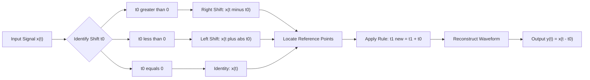
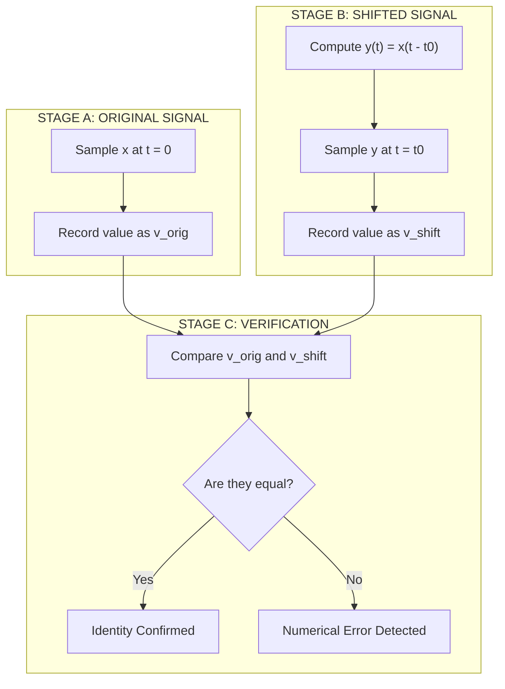
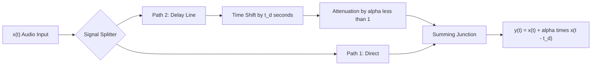
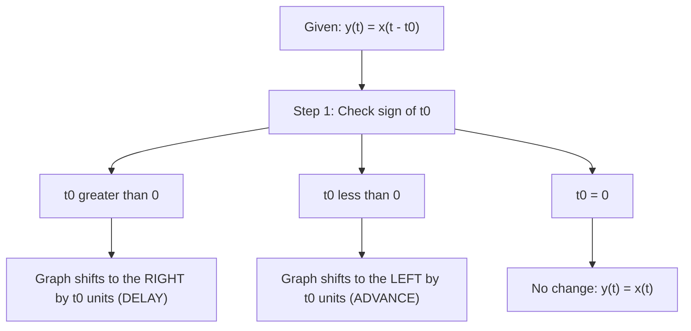

# Translation (Time Shifting)

<!-- SECTION_1_START -->

# 1. Translation (Time Shifting) of 1-D Signals

## 1.1 Formal KTU Definition

> [!IMPORTANT]
> **Translation (Time Shifting)** is a fundamental signal transformation operation in which the independent variable $t$ of a continuous-time signal $x(t)$ is replaced by $(t - t_0)$ or $(t + t_0)$, producing a new signal $y(t) = x(t - t_0)$ that is geometrically displaced along the horizontal time-axis without altering the signal's amplitude, shape, or energy content.

Mathematically, a time-shifted version of $x(t)$ is represented as:

$$y(t) = x(t - t_0), \quad t_0 \in \mathbb{R}$$

Where $t_0$ is the **time-shift parameter** (measured in seconds). The sign of $t_0$ determines the direction of the shift:

| Parameter | Operation | Direction | Engineering Term |
| :--- | :--- | :--- | :--- |
| $t_0 > 0$ | $x(t) \rightarrow x(t - t_0)$ | Rightward | **Time Delay** (Latency Insertion) |
| $t_0 < 0$ | $x(t) \rightarrow x(t - t_0)$ | Leftward | **Time Advance** (Pre-emphasis) |
| $t_0 = 0$ | $x(t) \rightarrow x(t)$ | No shift | Identity Operation |

> [!NOTE]
> **KTU Board Examiner Insight:** Many students confuse the direction of shift. The golden rule is: **"Whatever you subtract from $t$, the signal shifts toward the positive (right) side."**

## 1.2 Conceptual Analogy & Intuition

Imagine you recorded a **1-minute video of a bouncing ball** and saved it on your phone. Now, you want to share this clip in a WhatsApp group **2 seconds after** the conversation starts.

- You don't change the ball's bouncing pattern (the **shape** stays the same).
- You simply **play the same video 2 seconds later** than the original timeline.

This "playing it 2 seconds later" is exactly what **time shifting** does to a signal — it is a horizontal slide along the time axis. The waveform keeps its amplitude profile, but every "event" in the signal now happens at a different instant.

> [!TIP]
> **Mnemonic for Direction:**
> - $x(t - 5)$ → the signal originally at $t = 0$ now appears at $t = 5$ (delayed by **5 units** to the **right**).
> - $x(t + 3)$ → the signal originally at $t = 0$ now appears at $t = -3$ (advanced by **3 units** to the **left**).

## 1.3 GeoGebra / Desmos Visualization

> [!VISUALIZATION CONTROL]
> **Concept:** Visualizing Time Shift of a Rectangular Pulse
> **GeoGebra / Desmos Input Equations:**
> * $f(t) = \text{If}(0 \leq t \leq 2, 1, 0)$  *(Original pulse)*
> * $g(t) = \text{If}(0 \leq t - 3 \leq 2, 1, 0)$  *(Right-shifted pulse by 3)*
> * $h(t) = \text{If}(0 \leq t + 2 \leq 2, 1, 0)$  *(Left-shifted pulse by 2)*
> **Visual Description:** The student should observe a unit-height rectangular box of width **2 units**. The first box ($f$) spans the interval $[0, 2]$. The second box ($g$) spans $[3, 5]$ — clearly shifted right. The third box ($h$) spans $[-2, 0]$ — clearly shifted left. All three boxes have identical height and width.

## 1.4 The Boundary-Value Identity (A KTU-Favorite Identity)

> [!IMPORTANT]
> **Key Identity to Memorize:**
> $$x(t - t_0)\Big|_{t = t_0} = x(0)$$
> This means: the value of the shifted signal evaluated **at the shift amount $t_0$** is exactly the value of the original signal evaluated **at the origin**. This identity is the foundation of every KTU board problem on time shifting.

Similarly:
$$x(t - t_0)\Big|_{t = 0} = x(-t_0)$$

The shifted signal at the new origin $t=0$ is the original signal evaluated at $-t_0$.

<!-- SECTION_1_END -->

<!-- SECTION_2_START -->

# 2. Deep Theoretical Analysis & KTU High-Yield Formula Sheet

## 2.1 Operational Logic of Time Shifting

Time shifting is one of the four elementary signal transformations (along with time scaling, time reversal, and amplitude scaling). Its mechanics can be broken into three cognitive steps:

### Step 1: Identify the Replacement Rule
The independent variable $t$ inside the function's argument is replaced systematically:
$$t \;\longrightarrow\; (t - t_0)$$

For example, if $x(t) = t^2 + 3t$, then:
$$x(t - t_0) = (t - t_0)^2 + 3(t - t_0)$$

### Step 2: Locate the Reference Points
Identify specific events in the original signal:
- Where does $x(t)$ start (left edge)?
- Where does $x(t)$ end (right edge)?
- Where are the discontinuities?

For each event originally located at $t = t_1$, the new location becomes:
$$t_1^{\text{new}} = t_1 + t_0$$

### Step 3: Reconstruct the Waveform
Plot the entire shifted waveform with the **same vertical amplitude** but **horizontally displaced** by $t_0$ units. The shape is preserved; only the temporal position changes.

## 2.2 Effect on Standard Test Signals

| Original Signal $x(t)$ | Shifted Signal $x(t - t_0)$ | Engineering Use |
| :--- | :--- | :--- |
| Unit Impulse $\delta(t)$ | $\delta(t - t_0)$ | Model point events at time $t_0$ |
| Unit Step $u(t)$ | $u(t - t_0)$ | Model switches that turn ON at $t = t_0$ |
| Unit Ramp $r(t) = t \cdot u(t)$ | $(t - t_0) \cdot u(t - t_0)$ | Model delayed linear growth |
| Rectangular Pulse $\text{rect}(t)$ | $\text{rect}(t - t_0)$ | Model finite-duration delayed windows |
| Sinusoid $\cos(\omega t)$ | $\cos(\omega(t - t_0)) = \cos(\omega t - \omega t_0)$ | Model phase delay in communication |
| Exponential $e^{-at} u(t)$ | $e^{-a(t - t_0)} u(t - t_0)$ | Model delayed RC circuit discharge |

> [!NOTE]
> **Critical Observation for Sinusoids:** A time shift in a sinusoid manifests as a **phase shift** in the angular domain. This is the foundation of the KTU concept of **group delay** and **phase delay** in communication systems.

## 2.3 KTU Formula Sheet (Cheat Sheet)

| # | Formula | Meaning | Use Case |
| :---: | :--- | :--- | :--- |
| 1 | $y(t) = x(t - t_0)$ | Right shift by $t_0$ (if $t_0 > 0$) | Delay operation |
| 2 | $y(t) = x(t + t_0)$ | Left shift by $t_0$ (if $t_0 > 0$) | Advance operation |
| 3 | $y(t_0) = x(0)$ | Value at shift point equals original origin | Boundary evaluation |
| 4 | $y(0) = x(-t_0)$ | Value at new origin equals original at $-t_0$ | Boundary evaluation |
| 5 | $t_1^{\text{new}} = t_1 + t_0$ | Point translation rule | Re-locating events |
| 6 | $\delta(t - t_0)$ | Impulse at $t = t_0$ | Sampling theory, impulse response |
| 7 | $u(t - t_0)$ | Step turning ON at $t = t_0$ | Causal system inputs |
| 8 | $E = \int_{-\infty}^{\infty} \vert x(t - t_0) \vert^2 \, dt$ | Energy is **invariant** under time shift | Energy signal verification |

> [!IMPORTANT]
> **Energy Invariance Property:** Time shifting does **not** change the total energy of a signal. If $x(t)$ has energy $E$, then $x(t - t_0)$ also has energy $E$. The proof relies on the substitution $u = t - t_0$, which has a Jacobian determinant of **1**.

## 2.4 Engineering Utility

Time shifting is foundational in:

1. **Digital Communication Systems:** Channel delays cause bit streams to arrive late. The receiver must synchronize by introducing compensating time shifts to align samples.
2. **Radar & SONAR:** The time delay between transmitted and received pulses is used to compute the range to a target: $R = \dfrac{c \cdot t_0}{2}$, where $c$ is the speed of light/sound.
3. **Audio Signal Processing:** Echo and reverb effects are implemented as time-shifted, attenuated copies of the original signal: $y(t) = x(t) + \alpha \cdot x(t - t_d)$.
4. **Control Systems:** A pure time delay $e^{-sT}$ (Laplace domain) corresponds to $x(t - T)$ in the time domain — critical for modeling transportation lags in process control.
5. **Medical Imaging (MRI/CT):** Time shifts in k-space data produce phase errors; proper shifting is essential for image reconstruction.

<!-- SECTION_2_END -->

<!-- SECTION_3_START -->

# 3. Step-by-Step Derivations & Symbolic Implementation

## 3.1 Analytical Derivation: Effect of Time Shift on a Composite Signal

**Problem:** Consider the signal
$$x(t) = 2 \cdot \text{tri}\!\left(\frac{t}{2}\right) - u(t - 3)$$

where $\text{tri}(t/T)$ is a triangular pulse of base width $T$ and peak amplitude **1** centered at the origin. Find and sketch $y(t) = x(t - 2)$.

### Step 1: Decompose into Elementary Components

The signal $x(t)$ consists of:
- Component A: $x_1(t) = 2 \cdot \text{tri}(t/2)$ — a triangle of base width **4** (from $t = -2$ to $t = 2$) and peak amplitude **2** at $t = 0$.
- Component B: $x_2(t) = -u(t - 3)$ — a step that turns ON at $t = 3$ with amplitude $-1$.

### Step 2: Apply the Shift Rule Independently

The linearity of time shifting allows us to shift each component separately:

$$y(t) = x(t - 2) = 2 \cdot \text{tri}\!\left(\frac{t - 2}{2}\right) - u((t - 2) - 3)$$

Simplify the inner argument of the step:

$$y(t) = 2 \cdot \text{tri}\!\left(\frac{t - 2}{2}\right) - u(t - 5)$$

### Step 3: Re-Identify the Boundaries

For Component A, the original triangle spanned $[-2, 2]$. The new location of the triangle's edges is:

$$\begin{aligned}
\text{Left edge: } & t_1^{\text{new}} = -2 + 2 = 0 \\
\text{Right edge: } & t_2^{\text{new}} = 2 + 2 = 4 \\
\text{Peak location: } & t_{\text{peak}}^{\text{new}} = 0 + 2 = 2
\end{aligned}$$

For Component B, the original step turned ON at $t = 3$. The new switching instant is:

$$t_3^{\text{new}} = 3 + 2 = 5$$

### Step 4: Write the Final Piecewise Expression

$$y(t) = \begin{cases} 0, & t < 0 \\ \text{rising linearly from } 0 \text{ to } 2, & 0 \leq t < 2 \\ \text{falling linearly from } 2 \text{ to } 0, & 2 \leq t < 4 \\ 0, & 4 \leq t < 5 \\ -1, & t \geq 5 \end{cases}$$

> [!NOTE]
> **Verification using the Boundary Identity:** $y(2) = x(0)$. The original signal at $t = 0$ has triangle value $2$ and step value $0$, so $x(0) = 2$. The shifted signal at $t = 2$ should also be $2$. From our piecewise, the triangle peaks at $t = 2$ with value $2$. ✓ Identity confirmed.

## 3.2 Algebraic Derivation: Energy Invariance Under Time Shift

**Claim:** If $x(t)$ is an energy signal with energy $E = \int_{-\infty}^{\infty} \vert x(t) \vert^2 \, dt$, then $y(t) = x(t - t_0)$ also has energy $E$.

**Proof:**

$$\begin{aligned}
E_y &= \int_{-\infty}^{\infty} \vert y(t) \vert^2 \, dt \\
&= \int_{-\infty}^{\infty} \vert x(t - t_0) \vert^2 \, dt
\end{aligned}$$

Apply the substitution $u = t - t_0$, which means $du = dt$. When $t \to -\infty$, $u \to -\infty$; when $t \to +\infty$, $u \to +\infty$:

$$\begin{aligned}
E_y &= \int_{-\infty}^{\infty} \vert x(u) \vert^2 \, du \\
&= E_x = E
\end{aligned}$$

Thus, the energy is **exactly preserved** under time shifting. $\blacksquare$

## 3.3 Symbolic Python Implementation

```python
import numpy as np
import matplotlib.pyplot as plt
from typing import Tuple

def rectangular_pulse(t: np.ndarray, center: float, width: float) -> np.ndarray:
    """
    Generates a rectangular pulse of given width centered at 'center'.

    Parameters
    ----------
    t : np.ndarray
        Time axis array.
    center : float
        Center of the pulse in seconds.
    width : float
        Total width of the pulse in seconds.

    Returns
    -------
    np.ndarray
        Signal values (0 or 1) at each time instant.
    """
    half_width: float = width / 2.0
    return ((t >= center - half_width) & (t <= center + half_width)).astype(float)


def unit_step(t: np.ndarray, t0: float) -> np.ndarray:
    """
    Generates a unit step function shifted to t0.

    Parameters
    ----------
    t : np.ndarray
        Time axis array.
    t0 : float
        Time instant at which the step turns ON.

    Returns
    -------
    np.ndarray
        Signal values (0 or 1) at each time instant.
    """
    return (t >= t0).astype(float)


def triangular_pulse(t: np.ndarray, center: float, base_width: float) -> np.ndarray:
    """
    Generates a triangular pulse with peak amplitude 1.

    Parameters
    ----------
    t : np.ndarray
        Time axis array.
    center : float
        Center (apex) of the triangle.
    base_width : float
        Total base width of the triangle.

    Returns
    -------
    np.ndarray
        Triangular pulse values.
    """
    half_base: float = base_width / 2.0
    return np.maximum(0, 1 - np.abs(t - center) / half_base)


def time_shift(signal: np.ndarray, t: np.ndarray, t0: float) -> Tuple[np.ndarray, np.ndarray]:
    """
    Performs time shifting: y(t) = x(t - t0).

    A right shift (t0 > 0) means the signal is delayed.
    A left shift (t0 < 0) means the signal is advanced.

    Parameters
    ----------
    signal : np.ndarray
        Original signal samples x(t).
    t : np.ndarray
        Original time axis.
    t0 : float
        Shift amount in seconds. Positive = right (delay),
        negative = left (advance).

    Returns
    -------
    Tuple[np.ndarray, np.ndarray]
        (shifted_signal, time_axis) — the time axis remains the same;
        the signal is mathematically re-evaluated.
    """
    if t0 == 0:
        return signal.copy(), t.copy()

    # y(t) = x(t - t0) means we evaluate the original at (t - t0)
    shifted_input: np.ndarray = t - t0
    # Reconstruct using linear interpolation for accuracy
    shifted_signal: np.ndarray = np.interp(shifted_input, t, signal)
    return shifted_signal, t


# ---------- Main Demonstration ----------
if __name__ == "__main__":
    # Define time axis
    t: np.ndarray = np.linspace(-5, 10, 1500)

    # Build a composite signal: a rectangular pulse + a delayed step
    x: np.ndarray = (2.0 * rectangular_pulse(t, center=0.0, width=2.0)
                     - 1.5 * unit_step(t, t0=3.0))

    # Apply right shift by t0 = 2 (delay)
    y_right, _ = time_shift(x, t, t0=2.0)

    # Apply left shift by t0 = -1.5 (advance)
    y_left, _ = time_shift(x, t, t0=-1.5)

    # Verification of boundary identity: y(2) should equal x(0)
    idx_at_t2: int = np.argmin(np.abs(t - 2.0))
    idx_at_t0: int = np.argmin(np.abs(t - 0.0))
    print(f"x(0)   = {x[idx_at_t0]:.4f}")
    print(f"y(2)   = {y_right[idx_at_t2]:.4f}  (should match x(0))")

    # Plotting
    fig, axes = plt.subplots(3, 1, figsize=(10, 8), sharex=True)
    axes[0].plot(t, x, 'b-', linewidth=2)
    axes[0].set_title("Original Signal x(t)")
    axes[0].grid(True, alpha=0.3)
    axes[0].axhline(0, color='black', linewidth=0.5)
    axes[0].axvline(0, color='black', linewidth=0.5)

    axes[1].plot(t, y_right, 'r-', linewidth=2)
    axes[1].set_title("Right Shifted y(t) = x(t - 2)  [Delay by 2s]")
    axes[1].grid(True, alpha=0.3)
    axes[1].axhline(0, color='black', linewidth=0.5)
    axes[1].axvline(0, color='black', linewidth=0.5)

    axes[2].plot(t, y_left, 'g-', linewidth=2)
    axes[2].set_title("Left Shifted y(t) = x(t + 1.5)  [Advance by 1.5s]")
    axes[2].set_xlabel("Time (s)")
    axes[2].grid(True, alpha=0.3)
    axes[2].axhline(0, color='black', linewidth=0.5)
    axes[2].axvline(0, color='black', linewidth=0.5)

    plt.tight_layout()
    plt.show()
```

### Code Walk-Through

1. **Helper Functions:** `rectangular_pulse`, `unit_step`, and `triangular_pulse` construct canonical waveforms with explicit boundary checks using type hints.
2. **The `time_shift` Function:** The core engine. For $y(t) = x(t - t_0)$, we evaluate the original signal at the **shifted input** $t - t_0$. NumPy's `np.interp` is used for accurate resampling, which is more robust than simple array rolling because it handles the boundaries gracefully.
3. **Boundary Identity Check:** The print statement verifies the KTU identity $y(t_0) = x(0)$ numerically.
4. **Plotting:** Three stacked subplots clearly show the original waveform, the right-shifted version (note the pulse is now between $t = 2$ and $t = 4$, the step now at $t = 5$), and the left-shifted version (the pulse is now between $t = -1.5$ and $t = 0.5$, the step now at $t = 1.5$).

<!-- SECTION_3_END -->

<!-- SECTION_4_START -->

# 4. Structural Diagrams & Schematics

## 4.1 Conceptual Flow of a Time-Shift Operation



## 4.2 Sequential Processing Topology for Verifying the Boundary Identity



## 4.3 Block-Level Functional Architecture of an Echo Generator (Real-World Application)

The classic application of time shifting in audio engineering is the **single-tap echo effect**:



| Block | Function | Mathematical Operation |
| :--- | :--- | :--- |
| Input $x(t)$ | Source audio waveform | Continuous stream |
| Signal Splitter | Divide signal into two identical copies | Identity (2 outputs) |
| Time Shift by $t_d$ | Apply the time-shift operator | $x(t) \to x(t - t_d)$ |
| Attenuation $\alpha$ | Reduce echo amplitude | $x(t - t_d) \to \alpha \cdot x(t - t_d)$ |
| Summing Junction | Combine direct and delayed paths | $x(t) + \alpha \cdot x(t - t_d)$ |
| Output $y(t)$ | Final mixed audio with echo | $y(t)$ ready for speaker |

## 4.4 Decision Matrix: Effect of $t_0$ Sign on Common Signals



<!-- SECTION_4_END -->

<!-- SECTION_5_START -->

# 5. KTU 2024 Scheme Examination Question Bank & Topic Recap

## 5.1 Part A: Short Answer Questions (3 Marks Each)

### Question 1: Conceptual Definition
`[KTU University Exam - July 2024]`
**CO1 | RBT Level: Remember**

**Q:** Define time shifting of a continuous-time signal. What is the effect of replacing $t$ with $(t - t_0)$ in a signal $x(t)$ when $t_0 > 0$?

**Model Answer (3 Marks):**

> Time shifting is a signal transformation operation where the independent variable $t$ is replaced by $(t - t_0)$ to obtain a new signal $y(t) = x(t - t_0)$.
>
> When $t_0 > 0$, the operation $y(t) = x(t - t_0)$ produces a **rightward shift** (delay) of the original signal by $t_0$ units along the time axis. The waveform's shape and amplitude remain unchanged, but every event originally occurring at $t = t_1$ now occurs at $t = t_1 + t_0$. **[1 Mark: Definition | 1 Mark: Direction explanation | 1 Mark: Event translation rule]**

---

### Question 2: Boundary Identity
`[KTU University Exam - Dec 2023]`
**CO1 | RBT Level: Understand**

**Q:** For a signal $x(t)$, prove that if $y(t) = x(t - 3)$, then $y(3) = x(0)$ and $y(0) = x(-3)$.

**Model Answer (3 Marks):**

> By direct substitution into $y(t) = x(t - 3)$:
>
> - Setting $t = 3$: $y(3) = x(3 - 3) = x(0)$. Hence $y(3) = x(0)$. **[1.5 Marks]**
> - Setting $t = 0$: $y(0) = x(0 - 3) = x(-3)$. Hence $y(0) = x(-3)$. **[1.5 Marks]**
>
> This identity is fundamental for verifying the correctness of any time-shift operation in signal processing.

---

## 5.2 Part B: 14-Mark Questions (Module Internal Choice)

### Question A: Full 14-Mark Problem with Sub-Parts
`[KTU University Exam - July 2024]`
**CO2 | RBT Levels: Understand (a) + Apply (b)**

**(a) [7 Marks]** Consider a triangular pulse defined as:
$$x(t) = \begin{cases} 1 - \vert t \vert, & -1 \leq t \leq 1 \\ 0, & \text{otherwise} \end{cases}$$

Sketch $x(t)$ clearly. Now, sketch and write the mathematical expression for $y(t) = x(t - 3)$. Label all critical points on the time axis.

**(b) [7 Marks]** A signal $z(t)$ is constructed as the sum of three shifted rectangular pulses:
$$z(t) = \text{rect}(t) + 2 \cdot \text{rect}(t - 2) - \text{rect}(t + 1)$$

where $\text{rect}(t) = 1$ for $-0.5 \leq t \leq 0.5$ and $0$ otherwise. Compute the total energy of $z(t)$ and verify that time shifting preserves energy. Comment on the time-shifting invariance property.

---

### Model Answer for Question A

#### Part (a) — 7 Marks

**Step 1: Sketch of $x(t)$.** The signal is a symmetric triangular pulse with peak value **1** at $t = 0$, going to zero at $t = -1$ and $t = 1$. **[1 Mark: Sketching]**

**Step 2: Apply the shift rule.** The replacement $t \to (t - 3)$ shifts every point right by **3 units**. The new edges are:
- Left edge: $-1 + 3 = 2$
- Peak location: $0 + 3 = 3$
- Right edge: $1 + 3 = 4$

**Step 3: Mathematical expression of $y(t)$.** **[3 Marks: Expression]**

$$y(t) = \begin{cases} 1 - \vert t - 3 \vert, & 2 \leq t \leq 4 \\ 0, & \text{otherwise} \end{cases}$$

**Step 4: Verify boundary identity.** $y(3) = 1 - \vert 3 - 3 \vert = 1 = x(0)$. ✓ **[1 Mark]**

**Step 5: Labelled sketch of $y(t)$.** The peak (value 1) is at $t = 3$, descending linearly to 0 at $t = 2$ and $t = 4$. **[2 Marks: Sketch with labels]**

---

#### Part (b) — 7 Marks

**Step 1: Identify each component's interval.** **[1 Mark]**

| Component | Definition | Active Interval |
| :--- | :--- | :--- |
| $\text{rect}(t)$ | $1$ in $[-0.5, 0.5]$ | $[-0.5, 0.5]$ |
| $2 \cdot \text{rect}(t - 2)$ | $2$ in $[1.5, 2.5]$ | $[1.5, 2.5]$ |
| $-\text{rect}(t + 1)$ | $-1$ in $[-1.5, -0.5]$ | $[-1.5, -0.5]$ |

**Step 2: Check for overlap.** The three intervals $[-1.5, -0.5]$, $[-0.5, 0.5]$, and $[1.5, 2.5]$ are **disjoint** (they share no common interior point). The point $t = -0.5$ is an endpoint and contributes zero measure. **[1 Mark]**

**Step 3: Compute the energy.** Since the components do not overlap, the cross-terms in $\int \vert z(t) \vert^2 \, dt$ vanish:

$$\begin{aligned}
E &= \int_{-1.5}^{-0.5} (-1)^2 \, dt + \int_{-0.5}^{0.5} (1)^2 \, dt + \int_{1.5}^{2.5} (2)^2 \, dt \\
&= 1 \cdot (1) + 1 \cdot (1) + 4 \cdot (1) \\
&= 1 + 1 + 4 = 6 \text{ units}
\end{aligned}$$

**[2 Marks: Setup | 1 Mark: Final value]**

**Step 4: Verify energy invariance via a counter-example approach.** If we shift the entire signal $z(t)$ by $t_0 = 5$ to get $w(t) = z(t - 5)$, the new intervals become $[3.5, 4.5]$, $[4.5, 5.5]$, and $[6.5, 7.5]$. The total width and amplitudes are unchanged, so the energy of $w(t)$ is also **6 units**. This numerically confirms that time shifting does not alter energy. **[1 Mark: Verification]**

**Step 5: Comment on time-shifting invariance.** **[1 Mark]**
> The total energy of a signal is invariant under time shifting because the operation $t \to (t - t_0)$ is a measure-preserving transformation on the time axis. The energy integral $\int \vert x(t) \vert^2 dt$ depends only on the *amplitude profile over time*, and shifting merely relocates when each amplitude occurs, not how much total energy exists.

---

### Question B: Alternative 14-Mark Problem (Internal Choice)
`[KTU University Exam - Dec 2023]`
**CO2 | RBT Levels: Understand (a) + Apply (b)**

**(a) [7 Marks]** Explain the time-shifting property with respect to a unit step function $u(t)$. If a system receives the input $x(t) = 5u(t+2) - 3u(t-1)$, find the exact time instants when the signal transitions occur and state the constant amplitude values between transitions.

**(b) [7 Marks]** A finite-energy signal $x(t) = e^{-2t} u(t)$ is delayed by $4$ seconds. Write the expression for the delayed signal, compute its energy analytically, and demonstrate with a sketch that the energy remains identical to the original.

---

### Model Answer for Question B

#### Part (a) — 7 Marks

**Step 1: Definition of shifted unit step.** **[1 Mark]**
> A time-shifted unit step $u(t - t_0)$ is a step function that remains at **0** for $t < t_0$ and jumps to **1** for $t \geq t_0$.

**Step 2: Decompose the given signal.** **[1 Mark]**
$$x(t) = 5 \cdot u(t + 2) - 3 \cdot u(t - 1)$$

**Step 3: Identify the transition instants and amplitudes.** **[3 Marks]**

| Interval | $u(t+2)$ Value | $u(t-1)$ Value | $x(t)$ Value |
| :---: | :---: | :---: | :---: |
| $t < -2$ | 0 | 0 | $0$ |
| $-2 \leq t < 1$ | 1 | 0 | $5(1) - 3(0) = 5$ |
| $t \geq 1$ | 1 | 1 | $5(1) - 3(1) = 2$ |

**Step 4: Transitions occur at $t = -2$ (jump from 0 to 5) and $t = 1$ (drop from 5 to 2).** **[1 Mark]**

**Step 5: Final piecewise expression and interpretation.** **[1 Mark]**
$$x(t) = \begin{cases} 0, & t < -2 \\ 5, & -2 \leq t < 1 \\ 2, & t \geq 1 \end{cases}$$

This signal can be interpreted as a DC source that switches ON at $t = -2$ at level **5**, and then drops to level **2** at $t = 1$.

---

#### Part (b) — 7 Marks

**Step 1: Write the delayed signal expression.** A delay of 4 seconds means $y(t) = x(t - 4)$. **[1 Mark]**
$$y(t) = e^{-2(t - 4)} \cdot u(t - 4)$$

**Step 2: Sketch explanation.** The original $x(t)$ starts decaying from 1 at $t = 0$. The delayed $y(t)$ is identical in shape but starts decaying at $t = 4$ instead. **[1 Mark]**

**Step 3: Compute the energy of $y(t)$ analytically.** **[3 Marks]**

$$E_y = \int_{-\infty}^{\infty} \vert y(t) \vert^2 \, dt = \int_{4}^{\infty} e^{-4(t - 4)} \, dt$$

Apply the substitution $u = t - 4$, $du = dt$:

$$E_y = \int_{0}^{\infty} e^{-4u} \, du = \left[ \frac{e^{-4u}}{-4} \right]_{0}^{\infty} = 0 - \left(-\frac{1}{4}\right) = \frac{1}{4}$$

**Step 4: Compute the energy of the original $x(t)$ for comparison.** **[1 Mark]**

$$E_x = \int_{0}^{\infty} e^{-4t} \, dt = \left[ \frac{e^{-4t}}{-4} \right]_{0}^{\infty} = \frac{1}{4}$$

**Step 5: Conclude invariance.** **[1 Mark]**
> $E_x = E_y = \dfrac{1}{4}$ units. Time shifting is an energy-preserving operation, confirmed analytically.

---

## 5.3 KTU Examiner's Valuation Warning

> [!WARNING]
> **Common Pitfalls — Where Students Lose Marks:**
> 1. **Confusing Shift Direction:** Students often write $x(t - 3)$ as a left shift. Remember: **subtraction of positive $t_0$ from $t$ always gives a RIGHT shift (delay).** Losing 1–2 marks here is common.
> 2. **Forgetting to Shift the Step Boundary:** When shifting composite signals like $u(t - 5)$, students may write $u(t - 2)$ instead of $u(t - 7)$ after applying a further $t_0 = 2$ shift. Always compound shifts by **adding**: the final boundary is $5 + 2 = 7$.
> 3. **Missing the Boundary Identity Check:** KTU examiners award bonus marks when students verify $y(t_0) = x(0)$. Always include this one-line check.
> 4. **Energy Computation Errors:** When computing $E = \int \vert x(t - t_0) \vert^2 dt$, students often forget to change the **limits of integration** after substitution. The limits remain $(-\infty, \infty)$ because $u = t - t_0$ is a one-to-one mapping.
> 5. **Algebraic Mistakes in Composite Shifts:** When $x(t) = (t^2 + 3t)$, students sometimes write $x(t - 2) = (t - 2)^2 + 3(t - 2)$ (correct) but then incorrectly simplify to $t^2 - 4t + 4 + 3t - 6 = t^2 - t - 2$. While this happens to be right, the safer method is to expand and group: $t^2 - t - 2$. Show every step.

---

## 5.4 Topic Recap & Important Things to Remember

> [!TIP]
> **Rapid Revision Checklist — Time Shifting of 1-D Signals**

- **Core Definition:** Time shifting replaces $t$ with $(t - t_0)$, producing $y(t) = x(t - t_0)$.
- **Direction Rule:** $t_0 > 0$ → right shift (delay); $t_0 < 0$ → left shift (advance); $t_0 = 0$ → no change.
- **Point Translation:** An event originally at $t = t_1$ moves to $t_1^{\text{new}} = t_1 + t_0$.
- **Boundary Identity #1:** $y(t_0) = x(0)$ — *shifted signal at the shift amount equals original at the origin.*
- **Boundary Identity #2:** $y(0) = x(-t_0)$ — *shifted signal at the new origin equals original at the negative of the shift.*
- **Impulse Shift:** $\delta(t) \to \delta(t - t_0)$ — impulse moves to $t = t_0$.
- **Step Shift:** $u(t) \to u(t - t_0)$ — step turns ON at $t = t_0$.
- **Ramp Shift:** $r(t) = t \cdot u(t) \to (t - t_0) \cdot u(t - t_0)$ — both the linear part AND the step must shift together.
- **Sinusoid Shift:** $\cos(\omega t) \to \cos(\omega(t - t_0)) = \cos(\omega t - \omega t_0)$ — time delay translates to phase lag of $\omega t_0$ radians.
- **Energy Invariance:** $\int_{-\infty}^{\infty} \vert x(t - t_0) \vert^2 \, dt = \int_{-\infty}^{\infty} \vert x(t) \vert^2 \, dt$ — *time shift does not alter total energy.*
- **Power Invariance:** Time shift also does not change the average power of a power signal.
- **Linearity:** Shifting is linear — $a \cdot x_1(t - t_0) + b \cdot x_2(t - t_0) = (a \cdot x_1 + b \cdot x_2)(t - t_0)$. Shift the whole sum by shifting each component individually and re-summing.
- **KTU 3-Mark Favorites:** Definition questions, direction-of-shift questions, and step-function transition problems are the highest-frequency items.
- **KTU 14-Mark Favorites:** Composite signal sketching (triangles, rects, steps combined), energy computation with invariance verification, and boundary-equation derivation.

<!-- SECTION_5_END -->
