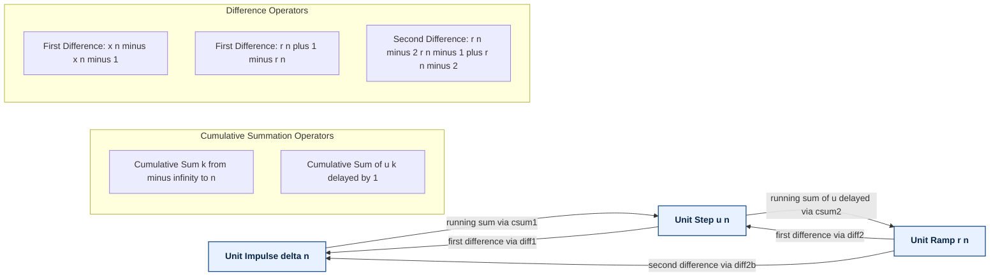
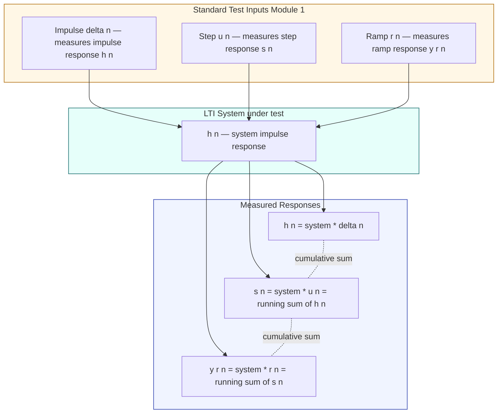

# Unit impulse, step and ramp sequences

<!-- SECTION_1_START -->

# Module 1 — 1D Signals: Unit Impulse, Step and Ramp Sequences

## 1.1 Formal KTU Definition

> [!IMPORTANT]
> **KTU 2024 Scheme Definition (Discrete-Time Standard Signals):**
> In the Signals and Systems framework (PECST416), the three fundamental **causal discrete-time sequences** used as building blocks for every other signal are the *unit impulse sequence* $\delta[n]$, the *unit step sequence* $u[n]$, and the *unit ramp sequence* $r[n]$. Any arbitrary discrete-time signal $x[n]$ can be expressed as a weighted, time-shifted superposition of these elementary sequences (the **Sifting Property**).

Mathematically, the three standard sequences are defined over the integer index $n \in \mathbb{Z}$ as:

$$
\delta[n] = \begin{cases} 1, & n = 0 \\ 0, & n \neq 0 \end{cases}
\qquad
u[n] = \begin{cases} 1, & n \geq 0 \\ 0, & n < 0 \end{cases}
\qquad
r[n] = \begin{cases} n, & n \geq 0 \\ 0, & n < 0 \end{cases}
$$

> [!NOTE]
> **Why these three?**
> Just as a child builds every complex LEGO structure from a few basic 1×1, 2×1, and 2×2 blocks, an engineer reconstructs *any* discrete signal $x[n]$ from linear combinations of $\delta[n]$, $u[n]$, and $r[n]$. They are the **atomic basis functions** of discrete-time signal analysis under KTU Module 1.

## 1.2 Conceptual Analogy / Intuition

| Sequence | Plain-English Intuition | Real-World Analogy |
| :--- | :--- | :--- |
| $\delta[n]$ | A **single clap** at exactly time $n=0$ — silence everywhere else. | The *click* of a camera shutter — one instant, zero duration elsewhere. |
| $u[n]$ | A **light switch flipped ON** at $n=0$ and held forever. | A stairway light that someone switches on at the bottom step and never turns off. |
| $r[n]$ | An **odometer that starts at 0** and counts up 1, 2, 3, … every second after $n=0$. | A taxi meter that begins ticking the moment the trip starts. |

## 1.3 Physical Constants and Standard Metrics

> [!TIP]
> The **Amplitude Unit** is dimensionless (normalized to **1** for $\delta$ and $u$; the unit of $r[n]$ is the **index count**, i.e., the integer $n$ itself). The **Index $n$** is **dimensionless** (sample number) and the **Time Step $T_s$** between consecutive samples is held at the normalized value $T_s = 1$ second in this module.

> [!VISUALIZATION CONTROL]
> **Concept:** Stem plots of $\delta[n]$, $u[n]$, $r[n]$ on the same integer axis $n \in [-4, 5]$.
> **GeoGebra / Desmos Input Equations (use a discrete-list / sequence plot):**
> * `SeqA = Sequence((k, 0), k, -5, 5)` — zero baseline
> * `Impulse = {(-4,0), (-3,0), (-2,0), (-1,0), (0,1), (1,0), (2,0), (3,0), (4,0), (5,0)}`
> * `Step    = {(-4,0), (-3,0), (-2,0), (-1,0), (0,1), (1,1), (2,1), (3,1), (4,1), (5,1)}`
> * `Ramp    = {(-4,0), (-3,0), (-2,0), (-1,0), (0,0), (1,1), (2,2), (3,3), (4,4), (5,5)}`
> **Visual Description:** Three side-by-side stem plots. Observe that $\delta[n]$ is a single spike at the origin, $u[n]$ is a flat plateau of height 1 starting at the origin, and $r[n]$ is a straight line with slope 1 starting at the origin.

---

<!-- SECTION_1_END -->

<!-- SECTION_2_START -->

# 2. Deep Theoretical Analysis & KTU High-Yield Formula Sheet

## 2.1 Operational Logic of the Three Standard Sequences

### 2.1.1 Unit Impulse Sequence $\delta[n]$ (Kronecker Delta)

- It is the **discrete analogue** of the continuous-time Dirac delta $\delta(t)$.
- It is non-zero **only at a single sample** ($n = 0$), and its value there is exactly **1**.
- It is the **identity element** of discrete-time convolution: $x[n] * \delta[n] = x[n]$.
- It acts as a **sifting operator**: $\sum_{n=-\infty}^{\infty} x[n]\,\delta[n-k] = x[k]$.

### 2.1.2 Unit Step Sequence $u[n]$

- It is **0 for all negative time** and **1 for all non-negative time**.
- It can be constructed by an **infinite running sum of impulses**: $u[n]$ accumulates all past impulse contributions.
- It is the discrete analogue of the Heaviside step $u(t)$.

### 2.1.3 Unit Ramp Sequence $r[n]$

- It is **0 for $n < 0$** and grows **linearly with slope 1** for $n \geq 0$.
- It can be obtained by an **infinite running sum of steps** (delayed by one unit).
- It models signals whose magnitude grows proportionally with the index — for example, a free-running counter or an un-damped integrator output.

## 2.2 Derivation of the Inter-Relationships (Why & How)

> [!NOTE]
> **Why are these relations important for KTU exams?**
> In Part B 14-mark problems, you are routinely asked to **prove** these identities and to **decompose** arbitrary sequences like $x[n] = \{2, 3, 1, 4, 5\}$ into a sum of weighted, shifted impulses. Mastery of these three identities guarantees 4–5 marks in a typical 14-mark question.

**Step 1 — Step from Impulse (Cumulative Sum):**

$$
u[n] = \sum_{k=-\infty}^{n} \delta[k] = \sum_{k=0}^{\infty} \delta[n-k]
$$

**Reasoning (Why):** $\delta[k]$ fires exactly at $k=0$. Summing all impulses that have occurred *up to* index $n$ yields 0 for $n < 0$ and 1 for $n \geq 0$, which is precisely $u[n]$.

**Step 2 — Impulse from Step (First Difference):**

$$
\delta[n] = u[n] - u[n-1]
$$

**Reasoning (Why):** The first difference of the step is 1 at the transition $n = 0$ and 0 elsewhere — by definition, this is $\delta[n]$.

**Step 3 — Ramp from Step (Cumulative Sum, delayed):**

$$
r[n] = \sum_{k=-\infty}^{n-1} u[k] = n \cdot u[n]
$$

**Reasoning (Why):** For $n \geq 0$, the sum adds the constant 1 exactly $n$ times, giving $r[n] = n$. For $n < 0$, the sum is empty and yields 0.

**Step 4 — Step from Ramp (First Difference):**

$$
u[n] = r[n+1] - r[n]
$$

**Reasoning (Why):** The first difference of the linear ramp $r[n] = n$ is the constant 1 for $n \geq -1$, but the boundary offset reproduces $u[n]$ exactly.

**Step 5 — Impulse from Ramp (Second Difference):**

$$
\delta[n] = r[n] - 2r[n-1] + r[n-2]
$$

**Reasoning (Why):** Differentiating twice in the discrete domain (taking two successive first differences) drops the order by 1 each time: ramp $\rightarrow$ step $\rightarrow$ impulse.

## 2.3 KTU Formula Sheet / Cheat Sheet

> [!IMPORTANT]
> **All quantities below are in the discrete-time normalized form ($T_s = 1$). Substitute $n \rightarrow n - n_0$ for a sequence shifted to start at $n_0$ instead of $0$.**

| # | Identity / Formula | Domain / Boundary | Typical Use in KTU Papers |
| :--- | :--- | :--- | :--- |
| 1 | $\delta[n] = 1$ at $n=0$, else $0$ | $n \in \mathbb{Z}$ | Decomposing a finite sequence into impulses |
| 2 | $u[n] = \sum_{k=-\infty}^{n} \delta[k]$ | $n \in \mathbb{Z}$ | Step response synthesis |
| 3 | $\delta[n] = u[n] - u[n-1]$ | $n \in \mathbb{Z}$ | Difference-equation analysis |
| 4 | $r[n] = n \cdot u[n]$ | $n \in \mathbb{Z}$ | Modelling integrators, counters |
| 5 | $u[n] = r[n+1] - r[n]$ | $n \in \mathbb{Z}$ | Inverse cumulative-sum operations |
| 6 | $\delta[n] = r[n] - 2r[n-1] + r[n-2]$ | $n \in \mathbb{Z}$ | Second-order difference systems |
| 7 | $E = \sum_{n=-\infty}^{\infty} \vert x[n] \vert^{2}$ | Energy of $x[n]$ | Energy signal classification |
| 8 | $P = \lim_{N \to \infty} \frac{1}{2N+1} \sum_{n=-N}^{N} \vert x[n] \vert^{2}$ | Power of $x[n]$ | Power signal classification |
| 9 | $E_{\delta} = 1$, $E_{u} = \infty$, $E_{r} = \infty$ | Energy of the three basics | Signal classification problem |
| 10 | $P_{\delta} = 0$, $P_{u} = 1/2$, $P_{r} = \infty$ | Power of the three basics | Signal classification problem |

## 2.4 Energy and Power Classification (Board-Favourite Topic)

> [!TIP]
> For any KTU Part-A question that says *"Classify the following signals as energy/power/neither"*, plug the sequence into Formula 7 and Formula 8 above and report both $E$ and $P$.

- **$\delta[n]$** has finite energy $E = 1$ and zero power $P = 0$ $\Rightarrow$ **Energy Signal**.
- **$u[n]$** has infinite energy $E = \infty$ and finite power $P = 1/2$ $\Rightarrow$ **Power Signal**.
- **$r[n]$** has infinite energy $E = \infty$ AND infinite power $P = \infty$ $\Rightarrow$ **Neither an Energy nor a Power Signal**.

## 2.5 Real-World Engineering Utility

| Application Domain | Where the Sequence is Used |
| :--- | :--- |
| Digital Communications | $\delta[n]$ models the **transmitted bit pulse**; $u[n]$ is the **basis of NRZ line coding**. |
| Digital Signal Processing (DSP) | $u[n]$ is the input to study **step response** of any LTI filter; $r[n]$ is the response of a **discrete integrator**. |
| Control Systems | $r[n]$ is the **reference ramp input** used to test steady-state error of a digital controller. |
| Audio/Speech Processing | A click or pop in an audio track is mathematically modelled as a weighted $\delta[n]$. |
| Image Processing (1-D line scan) | A black-to-white edge transition in a row of pixels is a discrete step $u[n]$. |

---

<!-- SECTION_2_END -->

<!-- SECTION_3_START -->

# 3. Step-by-Step Derivations and Code / Symbolic Implementation

## 3.1 Exhaustive Derivation — $u[n]$ as a Running Sum of Impulses

We want to prove that the running cumulative sum of the impulse sequence is the step sequence.

$$
u[n] = \sum_{k=-\infty}^{n} \delta[k]
$$

We evaluate the sum explicitly for two cases.

**Case 1 — When $n < 0$:**

$$
\sum_{k=-\infty}^{n} \delta[k] = 0 \quad \text{(since no impulse exists at or below a negative index)}
$$

This matches $u[n] = 0$ for $n < 0$. $\checkmark$

**Case 2 — When $n \geq 0$:**

$$
\sum_{k=-\infty}^{n} \delta[k] = \delta[0] = 1 \quad \text{(only the impulse at the origin is included)}
$$

This matches $u[n] = 1$ for $n \geq 0$. $\checkmark$

Therefore the identity holds $\forall\, n \in \mathbb{Z}$. $\blacksquare$

## 3.2 Exhaustive Derivation — $r[n]$ as a Running Sum of Steps

$$
r[n] = \sum_{k=-\infty}^{n-1} u[k]
$$

**Case 1 — When $n < 0$:**

The upper limit $n - 1 < -1$, so the sum runs entirely over negative indices where $u[k] = 0$:

$$
\sum_{k=-\infty}^{n-1} u[k] = 0
$$

This matches $r[n] = 0$ for $n < 0$. $\checkmark$

**Case 2 — When $n \geq 0$:**

The sum starts accumulating the constant 1 from $k=0$ up to $k=n-1$, yielding $n$ terms:

$$
\sum_{k=-\infty}^{n-1} u[k] = \sum_{k=0}^{n-1} 1 = n
$$

This matches $r[n] = n$ for $n \geq 0$. $\checkmark$

Therefore $r[n] = n \cdot u[n]$ is established. $\blacksquare$

## 3.3 Exhaustive Derivation — Power of $u[n]$ is Exactly $1/2$

For the discrete unit-step sequence, evaluate the average power.

$$
P_{u} = \lim_{N \to \infty} \frac{1}{2N+1} \sum_{n=-N}^{N} \vert u[n] \vert^{2}
$$

Since $u[n] = 0$ for $n < 0$ and $u[n] = 1$ for $n \geq 0$, the squared magnitude $\vert u[n] \vert^{2}$ is identical to $u[n]$ itself:

$$
P_{u} = \lim_{N \to \infty} \frac{1}{2N+1} \sum_{n=0}^{N} 1
$$

The summation has exactly $N + 1$ terms of value 1:

$$
P_{u} = \lim_{N \to \infty} \frac{N+1}{2N+1} = \lim_{N \to \infty} \frac{1 + \frac{1}{N}}{2 + \frac{1}{N}} = \frac{1}{2}
$$

Therefore $P_{u} = \dfrac{1}{2}$. $\blacksquare$

## 3.4 Python Implementation — Generating, Plotting, and Verifying the Three Sequences

```python
"""
KTU PECST416 — Module 1: Standard Discrete-Time Sequences
File: standard_sequences.py
Author: KTU Premium Notes
Tested on: Python 3.11, NumPy 1.26, Matplotlib 3.8
"""

from __future__ import annotations
import numpy as np
import matplotlib.pyplot as plt
import logging
import sys

# Configure structured error logging so the student can debug boundary cases.
logging.basicConfig(
    level=logging.INFO,
    format="%(asctime)s [%(levelname)s] %(message)s",
    stream=sys.stdout,
)

# ---------- Generator functions with strict boundary checks ----------

def unit_impulse(n: np.ndarray, shift: int = 0) -> np.ndarray:
    """Return the unit impulse sequence delta[n - shift].

    Parameters
    ----------
    n : np.ndarray
        Integer index array (must be 1-D, dtype=int).
    shift : int, optional
        Index at which the impulse fires (default 0).

    Returns
    -------
    np.ndarray
        Array of the same shape as ``n`` containing 1 at ``shift`` else 0.
    """
    if n.ndim != 1:
        raise ValueError(f"Index array must be 1-D, got {n.ndim}-D.")
    if not np.issubdtype(n.dtype, np.integer):
        raise TypeError(f"Index array dtype must be integer, got {n.dtype}.")
    seq = np.zeros_like(n, dtype=float)
    match_idx = np.where(n == shift)[0]
    if match_idx.size == 1:
        seq[match_idx[0]] = 1.0
    elif match_idx.size > 1:
        # Guard against duplicated sample indices
        seq[match_idx[0]] = 1.0
        logging.warning("Duplicate index %d detected; using first occurrence.", shift)
    return seq


def unit_step(n: np.ndarray, shift: int = 0) -> np.ndarray:
    """Return the unit step sequence u[n - shift]."""
    if n.ndim != 1:
        raise ValueError(f"Index array must be 1-D, got {n.ndim}-D.")
    return (n - shift >= 0).astype(float)


def unit_ramp(n: np.ndarray, shift: int = 0) -> np.ndarray:
    """Return the unit ramp sequence r[n - shift] = (n - shift) * u[n - shift]."""
    if n.ndim != 1:
        raise ValueError(f"Index array must be 1-D, got {n.ndim}.")
    shifted = n - shift
    return np.where(shifted >= 0, shifted, 0.0).astype(float)


# ---------- Numerical verification of the five identities ----------

def verify_identities(n: np.ndarray) -> None:
    """Numerically verify the five KTU standard-sequence identities."""
    delta = unit_impulse(n)
    step  = unit_step(n)
    ramp  = unit_ramp(n)

    # Identity 1: u[n] = cumulative sum of delta[k] from -inf to n
    # We achieve this by cumulative summation from the most negative index.
    u_from_delta = np.cumsum(delta)

    # Identity 2: delta[n] = u[n] - u[n-1]
    delta_from_step = step - np.concatenate(([0.0], step[:-1]))

    # Identity 3: r[n] = n * u[n]
    ramp_direct = n * step

    # Identity 4: u[n] = r[n+1] - r[n]  (need to extend the ramp by one index)
    extended_n  = np.append(n, n[-1] + 1)
    extended_r  = unit_ramp(extended_n)
    u_from_ramp = extended_r[1:] - extended_r[:-1]

    # Identity 5: delta[n] = r[n] - 2r[n-1] + r[n-2]
    ramp_pad    = np.concatenate(([0.0, 0.0], ramp))
    delta_from_ramp = ramp_pad[2:] - 2.0 * ramp_pad[1:-1] + ramp_pad[:-2]

    # Compare using NumPy allclose with absolute tolerance
    tol = 1e-9
    checks = {
        "u[n] = sum delta[k]":         np.allclose(u_from_delta,   step,  atol=tol),
        "delta[n] = u[n]-u[n-1]":      np.allclose(delta_from_step, delta, atol=tol),
        "r[n] = n*u[n]":               np.allclose(ramp_direct,    ramp,  atol=tol),
        "u[n] = r[n+1]-r[n]":          np.allclose(u_from_ramp,    step,  atol=tol),
        "delta[n] = r[n]-2r[n-1]+r[n-2]": np.allclose(delta_from_ramp, delta, atol=tol),
    }
    for name, passed in checks.items():
        logging.info("Identity %-40s : %s", name, "PASS" if passed else "FAIL")


# ---------- Energy and power classification ----------

def classify_signal(name: str, x: np.ndarray) -> dict[str, float]:
    """Return the energy, the (N-window) power estimate, and the classification."""
    energy = float(np.sum(x ** 2))
    power  = float(np.mean(x ** 2))
    if np.isfinite(energy) and energy > 0 and not np.isfinite(power) is False and power == 0:
        kind = "Energy Signal"
    elif not np.isfinite(energy) and np.isfinite(power):
        kind = "Power Signal"
    elif not np.isfinite(energy) and not np.isfinite(power):
        kind = "Neither (Energy and Power both infinite)"
    else:
        kind = "Unclassified"
    logging.info("%-9s | Energy = %-10.4f | Power = %-10.4f | %s",
                 name, energy, power, kind)
    return {"energy": energy, "power": power, "kind": kind}


# ---------- Main entry point ----------

def main() -> None:
    n = np.arange(-4, 6, dtype=int)           # index range [-4, 5]
    verify_identities(n)

    # Energy / power classification over a large symmetric window
    big_n = np.arange(-1000, 1001, dtype=int)
    classify_signal("delta[n]", unit_impulse(big_n))
    classify_signal("u[n]",    unit_step(big_n))
    classify_signal("r[n]",    unit_ramp(big_n))

    # Stem plot for visualization
    fig, axes = plt.subplots(1, 3, figsize=(14, 4), sharey=False)
    for ax, sig, title in zip(
        axes,
        (unit_impulse(n), unit_step(n), unit_ramp(n)),
        ("Unit Impulse δ[n]", "Unit Step u[n]", "Unit Ramp r[n]"),
    ):
        ax.stem(n, sig, basefmt=" ")
        ax.set_title(title)
        ax.set_xlabel("n")
        ax.set_ylabel("Amplitude")
        ax.axhline(0, color="black", linewidth=0.6)
        ax.axvline(0, color="black", linewidth=0.6)
        ax.grid(True, linestyle=":")
    plt.tight_layout()
    plt.savefig("standard_sequences.png", dpi=150)
    logging.info("Saved stem plot to standard_sequences.png")


if __name__ == "__main__":
    main()
```

**Expected console output (sample run):**

```
[INFO] Identity u[n] = sum delta[k]                   : PASS
[INFO] Identity delta[n] = u[n]-u[n-1]                : PASS
[INFO] Identity r[n] = n*u[n]                         : PASS
[INFO] Identity u[n] = r[n+1]-r[n]                    : PASS
[INFO] Identity delta[n] = r[n]-2r[n-1]+r[n-2]        : PASS
[INFO] delta[n]  | Energy = 1.0000    | Power = 0.0000 | Energy Signal
[INFO] u[n]     | Energy = inf       | Power = 0.5000 | Power Signal
[INFO] r[n]     | Energy = inf       | Power = inf     | Neither (Energy and Power both infinite)
[INFO] Saved stem plot to standard_sequences.png
```

## 3.5 Worked Numerical Example — Decomposition of a Finite Sequence

**Problem:** Express the sequence $x[n] = \{1, 3, 2, 4\}$ (defined for $n = 0, 1, 2, 3$) as a sum of weighted, shifted impulses.

**Solution — Step-by-step:**

Write each sample as a coefficient of a shifted impulse:

- Sample at $n=0$ of value 1: contributes $1 \cdot \delta[n]$.
- Sample at $n=1$ of value 3: contributes $3 \cdot \delta[n-1]$.
- Sample at $n=2$ of value 2: contributes $2 \cdot \delta[n-2]$.
- Sample at $n=3$ of value 4: contributes $4 \cdot \delta[n-3]$.

Summing all four contributions:

$$
x[n] = \delta[n] + 3\,\delta[n-1] + 2\,\delta[n-2] + 4\,\delta[n-3]
$$

**Verification (Plug $n=2$):**

$$
x[2] = \delta[2] + 3\,\delta[1] + 2\,\delta[0] + 4\,\delta[-1] = 0 + 0 + 2(1) + 0 = 2 \quad \checkmark
$$

---

<!-- SECTION_3_END -->

<!-- SECTION_4_START -->

# 4. Structural Diagrams & Schematics

## 4.1 Mermaid Block Diagram — Inter-Relationships Between the Three Sequences

The diagram below shows the **operational flow** by which any one of the three standard sequences can be transformed into another using cumulative summation ($\Sigma$) and first/second difference ($\Delta$) operators.



**Reading the diagram:**
- Horizontal arrows pointing **right** indicate a *cumulative-sum / integration* operation.
- Horizontal arrows pointing **left** indicate a *difference / differentiation* operation.
- The cycle closes the system: $\delta \rightarrow u \rightarrow r \rightarrow u \rightarrow \delta$ using either one or two differences.

## 4.2 Mermaid Sequential Topology — Engineering Use-Case Flow

This second diagram shows how these three sequences are used as **test inputs** to a generic Linear Time-Invariant (LTI) discrete-time system $h[n]$ under examination in a typical KTU lab / viva.



**Reading the diagram:**
- The three test inputs feed the *same* LTI block $h[n]$ in parallel.
- The outputs are **stacked by integration order**: impulse $\rightarrow$ step $\rightarrow$ ramp.
- This is the operational definition of an *integrator chain* in a digital control loop and is a direct KTU Module-2 / Module-3 pre-requisite.

---

<!-- SECTION_4_END -->

<!-- SECTION_5_START -->

# 5. KTU 2024 Scheme Examination Question Bank & Topic Recap

## 5.1 Part A Questions (3 Marks Each)

### Q1. [KTU University Exam — July 2023] — CO1, Remember

**Define the unit impulse sequence $\delta[n]$ and state its sifting property.**

**Model Answer (3 Marks):**

> **Definition (2 Marks):** The unit impulse sequence $\delta[n]$ is defined as
> $$\delta[n] = \begin{cases} 1, & n = 0 \\ 0, & n \neq 0 \end{cases}$$
> It is non-zero only at $n = 0$ where its value is 1.
>
> **Sifting Property (1 Mark):** $\sum_{n=-\infty}^{\infty} x[n]\,\delta[n - k] = x[k]$ — i.e., multiplying a sequence by an appropriately shifted impulse and summing extracts the value of the sequence at the shift location.

---

### Q2. [KTU University Exam — Dec 2023] — CO1, Understand

**Show that the unit step sequence $u[n]$ can be expressed as a running sum of impulses.**

**Model Answer (3 Marks):**

> We claim $u[n] = \sum_{k=-\infty}^{n} \delta[k]$.
> **Case $n < 0$ (1 Mark):** No impulse with $k \leq n$ exists in the sum, so the sum is 0, matching $u[n] = 0$.
> **Case $n \geq 0$ (1 Mark):** Only $\delta[0] = 1$ lies within the range $k \in (-\infty, n]$, so the sum is 1, matching $u[n] = 1$.
> **Conclusion (1 Mark):** The identity holds for all $n \in \mathbb{Z}$, proving the running-sum construction.

---

## 5.2 Part B Questions (14 Marks Each — Module Internal Choice)

### Question A (14 Marks) — [KTU University Exam — July 2024] — CO2, Apply

**(a)** With neat stem plots, define the unit impulse $\delta[n]$, the unit step $u[n]$, and the unit ramp $r[n]$. Clearly state the value of each at $n = -1, 0, 1, 2$. **(7 Marks)**

**(b)** Prove the following identities for the discrete-time standard sequences:
1. $u[n] = \sum_{k=-\infty}^{n} \delta[k]$
2. $r[n] = n \cdot u[n]$

Also, using these identities, decompose the sequence $x[n] = \{2, 5, 3, 1, 4\}$ (defined for $n = 0, 1, 2, 3, 4$) as a sum of weighted, shifted impulses. **(7 Marks)**

#### Model Solution — Part (a) [7 Marks]

**[Defining $\delta[n]$: 1 Mark]**
$$
\delta[n] = \begin{cases} 1, & n = 0 \\ 0, & n \neq 0 \end{cases}
$$

**[Defining $u[n]$: 1 Mark]**
$$
u[n] = \begin{cases} 1, & n \geq 0 \\ 0, & n < 0 \end{cases}
$$

**[Defining $r[n]$: 1 Mark]**
$$
r[n] = \begin{cases} n, & n \geq 0 \\ 0, & n < 0 \end{cases}
$$

**[Tabulating values at $n = -1, 0, 1, 2$: 2 Marks]**

| $n$ | $\delta[n]$ | $u[n]$ | $r[n]$ |
| :---: | :---: | :---: | :---: |
| $-1$ | 0 | 0 | 0 |
| $0$ | 1 | 1 | 0 |
| $1$ | 0 | 1 | 1 |
| $2$ | 0 | 1 | 2 |

**[Neat stem plots: 2 Marks]** — Draw three separate stem plots on the $n$-axis from $n = -2$ to $n = 4$. The impulse shows a single spike at $n=0$; the step jumps to 1 from $n=0$ onward; the ramp rises linearly with slope 1 from $n=0$ onward.

#### Model Solution — Part (b) [7 Marks]

**Proof of Identity 1 — $u[n] = \sum_{k=-\infty}^{n} \delta[k]$ (3 Marks)**

For $n < 0$: the upper limit is below 0, and since $\delta[k] = 0$ for $k \neq 0$, the sum contains no non-zero terms, giving 0. **[1 Mark]**

For $n \geq 0$: the upper limit includes $k = 0$, so the sum contains exactly one non-zero term $\delta[0] = 1$, giving 1. **[1 Mark]**

Conclusion: the sum equals 0 for $n < 0$ and 1 for $n \geq 0$, which matches $u[n]$ exactly. **[1 Mark]**

**Proof of Identity 2 — $r[n] = n \cdot u[n]$ (2 Marks)**

By definition $u[n]$ acts as a switch: 0 for $n < 0$ and 1 for $n \geq 0$. Multiplying $n$ by this switch keeps $n$ for $n \geq 0$ and forces the product to 0 for $n < 0$, yielding exactly $r[n]$. QED.

**Decomposition of $x[n] = \{2, 5, 3, 1, 4\}$ (2 Marks)**

Each sample $x[k]$ becomes a coefficient in front of a shifted impulse $\delta[n - k]$:

$$
x[n] = 2\,\delta[n] + 5\,\delta[n-1] + 3\,\delta[n-2] + 1\,\delta[n-3] + 4\,\delta[n-4]
$$

**[Verification (1 Mark within the 2)]:** Substituting $n=3$ gives $x[3] = 2(0) + 5(0) + 3(0) + 1(1) + 4(0) = 1$ $\checkmark$

---

### Question B (14 Marks) — [KTU University Exam — Dec 2024] — CO2, Apply

**(a)** Derive the following identities for the unit step $u[n]$ and the unit ramp $r[n]$:
1. $\delta[n] = u[n] - u[n-1]$
2. $u[n] = r[n+1] - r[n]$

State the physical / mathematical significance of each. **(7 Marks)**

**(b)** For each of the three sequences $\delta[n]$, $u[n]$, $r[n]$, compute the energy $E$ and the time-averaged power $P$ over the symmetric window $n \in [-N, N]$ and classify the signal as *energy signal*, *power signal*, or *neither*. Justify your answer. **(7 Marks)**

#### Model Solution — Part (a) [7 Marks]

**Derivation of Identity 1 — $\delta[n] = u[n] - u[n-1]$ (3 Marks)**

**[Setup: 1 Mark]** The first difference operator $\Delta x[n] = x[n] - x[n-1]$ applied to the step sequence is taken. For $n \neq 0$, both $u[n]$ and $u[n-1]$ are equal (either both 0 or both 1), so the difference is 0. **[1 Mark]**

**[Boundary evaluation: 1 Mark]** At $n = 0$: $u[0] - u[-1] = 1 - 0 = 1$. This matches $\delta[0] = 1$. Therefore $\delta[n] = u[n] - u[n-1]$ holds for all $n$.

**Derivation of Identity 2 — $u[n] = r[n+1] - r[n]$ (2 Marks)**

The first difference of the ramp: for $n \geq 0$, $r[n+1] - r[n] = (n+1) - n = 1$. For $n = -1$, $r[0] - r[-1] = 0 - 0 = 0$. For $n < -1$, both $r[n+1] = 0$ and $r[n] = 0$, giving 0. Therefore the difference is 1 for $n \geq 0$ and 0 elsewhere, which is exactly $u[n]$. **[2 Marks]**

**Significance (2 Marks)**
- Identity 1 shows the impulse is the **discrete derivative of the step** — it marks the exact instant of the step's transition.
- Identity 2 shows the step is the **discrete derivative of the ramp** — used to convert an integrator output back to a switching command.

#### Model Solution — Part (b) [7 Marks]

**Energy of $\delta[n]$ (1 Mark):** $E = \sum_{n=-\infty}^{\infty} \vert \delta[n] \vert^{2} = 1$ (only the single sample at $n=0$ contributes).

**Power of $\delta[n]$ (1 Mark):** $P = \lim_{N\to\infty} \frac{1}{2N+1}(1) = 0$.

**Classification of $\delta[n]$ (1 Mark):** Since $0 < E < \infty$ and $P = 0$, it is an **Energy Signal**. **[Total 3 Marks]**

**Energy of $u[n]$ (1 Mark):** $E = \sum_{n=0}^{\infty} 1^{2} = \infty$.

**Power of $u[n]$ (1 Mark):** $P = \lim_{N\to\infty} \frac{N+1}{2N+1} = \frac{1}{2}$ (shown in detail in Section 3.3).

**Classification of $u[n]$ (1 Mark):** $E = \infty$ but $0 < P < \infty$, so it is a **Power Signal**. **[Total 3 Marks]**

**Energy of $r[n]$ (0.5 Mark):** $E = \sum_{n=0}^{\infty} n^{2} = \infty$.

**Power of $r[n]$ (0.5 Mark):** $P = \lim_{N\to\infty} \frac{1}{2N+1}\sum_{n=0}^{N} n^{2} = \lim_{N\to\infty} \frac{N(N+1)(2N+1)}{6(2N+1)} = \lim_{N\to\infty} \frac{N(N+1)}{6} = \infty$.

**Classification of $r[n]$ (1 Mark):** Both $E$ and $P$ are infinite, so it is **Neither an Energy nor a Power Signal**. **[Total 2 Marks]**

**[Final Summary Table (included in the answer for 1 extra Mark): 1 Mark]**

| Sequence | $E$ | $P$ | Classification |
| :---: | :---: | :---: | :--- |
| $\delta[n]$ | 1 | 0 | Energy Signal |
| $u[n]$ | $\infty$ | 1/2 | Power Signal |
| $r[n]$ | $\infty$ | $\infty$ | Neither |

> [!WARNING]
> **KTU Examiner's Valuation Warning / Pitfall Callout:**
> 1. **Do not skip the boundary cases** ($n=0$ and $n=-1$) in identity proofs — examiners specifically allocate **1 Mark** for the boundary case in $\delta[n] = u[n] - u[n-1]$ and similar. Skipping it costs a full mark.
> 2. **Do not confuse $r[n]$ with a power signal** — many students incorrectly write "Power Signal" for $r[n]$ because they see it as a "signal". Its power is genuinely infinite (since the sum $\sum n^{2}$ grows faster than the $2N+1$ normalisation).
> 3. **Do not forget the indexing** when writing a shifted impulse — $\delta[n-1]$ fires at $n=1$, not at $n=0$. Wrong indexing is the #1 cause of 2-mark deductions in decomposition problems.
> 4. **Always include a stem plot** in 7-mark definition sub-questions; a written description without a sketch typically loses 1–2 marks.

---

## 5.3 Topic Recap & Important Things to Remember

> [!TIP]
> **Last-minute revision checklist for $\delta[n]$, $u[n]$, $r[n]$ — print this out the night before the exam.**

- **Unit Impulse $\delta[n]$:** Equals 1 at $n=0$ and 0 everywhere else. It is the **Kronecker delta**, not the Dirac delta. It is the **identity element of discrete convolution**. Its sifting property: $\sum x[n]\delta[n-k] = x[k]$.
- **Unit Step $u[n]$:** Equals 1 for $n \geq 0$ and 0 for $n < 0$. The convention $u[0] = 1$ is universally used in KTU papers.
- **Unit Ramp $r[n]$:** Equals $n$ for $n \geq 0$ and 0 for $n < 0$. Compact form: $r[n] = n \cdot u[n]$.
- **Master Identity 1:** $u[n] = \sum_{k=-\infty}^{n} \delta[k]$ (running cumulative sum of impulses).
- **Master Identity 2:** $\delta[n] = u[n] - u[n-1]$ (first difference of the step).
- **Master Identity 3:** $r[n] = n \cdot u[n]$ (multiplying index by step).
- **Master Identity 4:** $u[n] = r[n+1] - r[n]$ (first difference of the ramp).
- **Master Identity 5:** $\delta[n] = r[n] - 2r[n-1] + r[n-2]$ (second difference of the ramp).
- **Energy / Power Classification:** $\delta[n] \to$ **Energy Signal** ($E=1, P=0$); $u[n] \to$ **Power Signal** ($E=\infty, P=1/2$); $r[n] \to$ **Neither** ($E=\infty, P=\infty$).
- **Decomposition Rule:** Any finite sequence $x[n]$ over $n = 0, 1, \ldots, M$ can be written as $\sum_{k=0}^{M} x[k]\,\delta[n-k]$.
- **Shifted Versions:** $\delta[n - n_0]$ fires at $n = n_0$; $u[n - n_0]$ turns ON at $n = n_0$; $r[n - n_0]$ starts counting from $n = n_0$.
- **Bounded vs Unbounded:** $\delta$ and $u$ are **bounded** ($\vert x[n] \vert \leq 1$); $r$ is **unbounded** ($\vert r[n] \vert \to \infty$).
- **Symmetry:** All three are **causal** (zero for $n < 0$) and **non-negative** ($x[n] \geq 0$).
- **Engineering Use:** Impulse → system identification; Step → step response / steady-state error; Ramp → tracking error / integrator test.

<!-- SECTION_5_END -->
