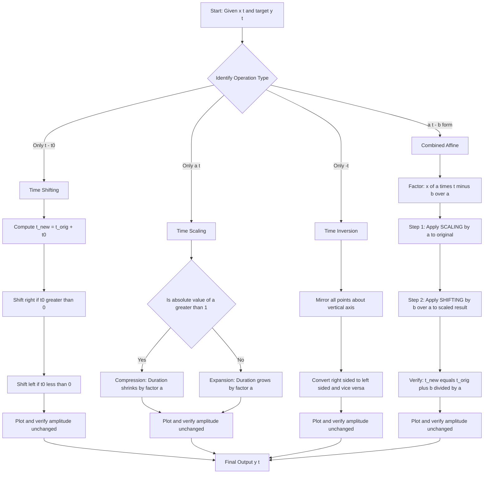
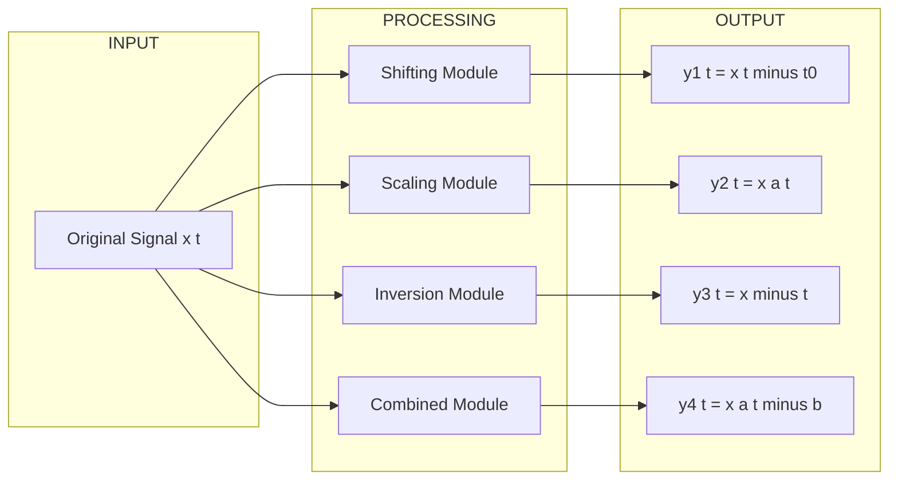
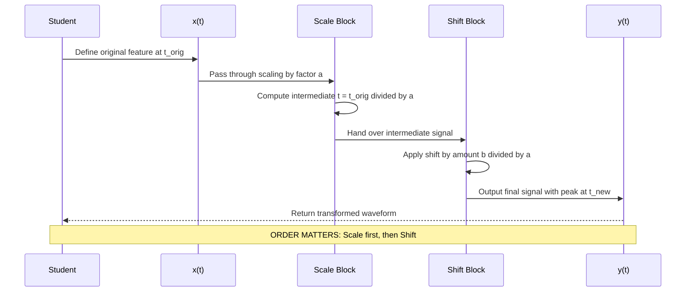
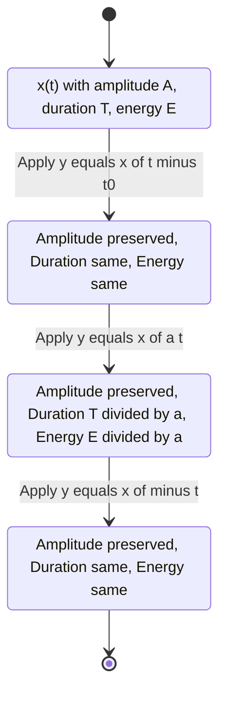

# Basic signal operations: Shifting, scaling, inversion routines

<!-- SECTION_1_START -->
# 📘 KTU PREMIUM STUDY NOTES — SIGNALS AND SYSTEMS (PECST416)

## Module 1: Signal Classification & LTI Systems
### Topic: Basic Signal Operations — Shifting, Scaling, and Inversion Routines

---

## 1. Core Technical Definition & Intuitive Overview

### 1.1 Formal Definition (KTU 2024 Syllabus Terminology)

A **continuous-time signal** $x(t)$ is a real or complex-valued function of the continuous independent variable $t \in \mathbb{R}$. Three fundamental transformations can be applied to the independent variable $t$ without altering the signal's intrinsic amplitude characteristics:

> [!NOTE]
> **Time Shifting (Translation):** A displacement of the signal along the time axis by a constant $t_0$, producing the transformed signal $y(t) = x(t - t_0)$.

> [!IMPORTANT]
> **Time Scaling (Dilation/Compression):** A linear stretching or compression of the time axis by a real constant $a \neq 0$, yielding $y(t) = x(at)$.

> [!NOTE]
> **Time Inversion (Reflection/Folding):** A mirroring of the signal about the vertical axis at $t = 0$, generating $y(t) = x(-t)$.

These three elementary operations are the atomic primitives used to construct the broader class of **affine transformations** on the time axis, which form the foundation for understanding convolution, system response, and modulation theory in subsequent modules.

---

### 1.2 Conceptual Analogy & Intuitive Overview

> [!TIP]
> **🎬 Real-World Analogy — The Movie Reel:**
> Imagine a strip of film (the signal $x(t)$) running through a projector.
> - **Shifting** is like *fast-forwarding* or *rewinding* the reel by a fixed number of frames ($t_0$ seconds).
> - **Scaling** is like changing the *playback speed* — playing it in slow motion ($a < 1$ stretches the time) or fast-forward ($a > 1$ compresses the time).
> - **Inversion** is like *flipping the film strip horizontally* and reading it from the opposite end.

Mathematically, these operations modify the **independent variable $t$** while preserving the **dependent variable (amplitude)** of the signal. They are *amplitude-invariant* operations.

---

### 1.3 Operation Categories Summary

| Operation | Mathematical Form | Physical Interpretation |
| :--- | :--- | :--- |
| **Right Shift (Delay)** | $y(t) = x(t - t_0), \ t_0 > 0$ | Signal is delayed by $t_0$ units |
| **Left Shift (Advance)** | $y(t) = x(t + t_0), \ t_0 > 0$ | Signal is advanced by $t_0$ units |
| **Time Compression** | $y(t) = x(at), \ \vert a \vert > 1$ | Signal is squeezed in time |
| **Time Expansion** | $y(t) = x(at), \ 0 < \vert a \vert < 1$ | Signal is stretched in time |
| **Inversion (Reflection)** | $y(t) = x(-t)$ | Signal is mirrored about the origin |

---

### 1.4 GeoGebra / Desmos Visualization

> [!VISUALIZATION CONTROL]
> **Concept:** Time Shifting, Scaling, and Inversion of a Rectangular Pulse
>
> **GeoGebra / Desmos Input Equations:**
> * `f(x) = Piecewise(1, 0 ≤ x ≤ 2, 0, otherwise)` — Original pulse $x(t)$
> * `g(x) = f(x - 1)` — Right-shifted pulse (delay by **1 unit**)
> * `h(x) = f(2x)` — Compressed pulse (scale factor $a = 2$)
> * `k(x) = f(-x)` — Inverted pulse (reflection)
>
> **Visual Description:** On the horizontal axis, observe how $g(x)$ slides the rectangular block to the right, $h(x)$ narrows the block to half its original width while doubling its height region density, and $k(x)$ mirrors the block about the vertical axis at $x = 0$.

---

### 1.5 Standard Notation Conventions Used in KTU Valuation

- Independent variable for continuous-time signals: $t$ (seconds)
- Independent variable for discrete-time signals: $n$ (integer samples)
- Shift parameter: $t_0 \in \mathbb{R}$ (continuous) or $n_0 \in \mathbb{Z}$ (discrete)
- Scale parameter: $a \in \mathbb{R} \setminus \{0\}$
- All transformations preserve **energy relationships** only when properly normalized; the operations themselves are linear but **not** time-invariant in the parameter space.

<!-- SECTION_1_END -->

<!-- SECTION_2_START -->
# 2. Deep Theoretical Analysis & KTU High-Yield Formula Sheet

---

## 2.1 Time Shifting — $y(t) = x(t - t_0)$

### Operational Logic (Step-by-Step Bulleted Breakdown)

- **Step 1 — Identify the Original Reference:** Locate the point on $x(t)$ where the amplitude feature (peak, zero-crossing, edge) occurs at $t = t_{\text{orig}}$.
- **Step 2 — Apply the Substitution $t \to t - t_0$:** Every occurrence of $t$ in the defining expression of $x(t)$ is replaced by $(t - t_0)$.
- **Step 3 — Solve for the New Feature Location:** The new location $t_{\text{new}}$ of the same feature satisfies $t_{\text{new}} - t_0 = t_{\text{orig}}$, yielding $t_{\text{new}} = t_{\text{orig}} + t_0$.
- **Step 4 — Sign Interpretation:**
  * If $t_0 > 0$ → the entire waveform **slides to the right** (delay).
  * If $t_0 < 0$ → the entire waveform **slides to the left** (advance).
- **Step 5 — Amplitude Invariance:** The peak value, area, and shape remain unchanged; only the *temporal position* is altered.

> [!IMPORTANT]
> **Why it matters:** Time shifting is the mathematical model of **propagation delay** in communication channels, **latency** in digital systems, and **echo** in audio processing. Every filter, every transmission line introduces a finite $t_0$ shift.

---

## 2.2 Time Scaling — $y(t) = x(at)$

### Operational Logic

- **Step 1 — Substitute $t \to at$:** Replace every $t$ in $x(\cdot)$ with the product $a \cdot t$.
- **Step 2 — Determine the New Time Markers:** A feature originally at $t = t_1$ in $x(t)$ now appears at $t = t_1 / a$ in $y(t)$.
- **Step 3 — Effect on Duration:** If the original signal has duration $T$, the new duration becomes $T / \vert a \vert$.
  * $\vert a \vert > 1$ → duration **shrinks** (compression) — the signal plays faster.
  * $0 < \vert a \vert < 1$ → duration **expands** (expansion) — the signal plays slower.
- **Step 4 — Negative Scale Factor:** When $a < 0$, scaling *and* inversion occur simultaneously, i.e., $x(at) = x(-(\vert a \vert t))$ which combines reflection with magnitude-dependent scaling.

> [!TIP]
> **Intuition:** $a = 2$ means the signal must traverse its full pattern in half the time — the waveform is *squeezed* horizontally. Conversely, $a = 0.5$ means the signal is *stretched* — what used to happen in 1 second now takes 2 seconds.

---

## 2.3 Time Inversion (Reflection) — $y(t) = x(-t)$

### Operational Logic

- **Step 1 — Substitute $t \to -t$:** Replace every $t$ with $-t$ in the defining expression.
- **Step 2 — Mirror the Graph:** For every point $(t_1, x(t_1))$ on the original signal, plot the point $(-t_1, x(t_1))$ on the transformed signal.
- **Step 3 — Origin Symmetry:** The new signal is symmetric to the original with respect to the vertical axis (the $y$-axis when amplitude is on $y$, time on $x$).
- **Step 4 — Causal vs Non-Causal:** Inversion converts a **right-sided** signal (causal, $t \geq 0$) into a **left-sided** signal (anti-causal, $t \leq 0$) and vice versa.

---

## 2.4 Combined Operations — $y(t) = x(at - b)$

This is the general affine transformation encountered in KTU problems. The key to mastering it is the **order of operations** rule.

### The Critical Rule (Frequently Tested in KTU):

> [!WARNING]
> When a signal undergoes **both scaling and shifting**, the operations must be applied in the following strict sequence to avoid errors:
>
> **Order:** **SCALING first, then SHIFTING.**
>
> Given $y(t) = x(at - b)$, rewrite it as $y(t) = x\left(a\left(t - \dfrac{b}{a}\right)\right)$.
>
> This means: first compress/expand by $a$, then shift the result by $b/a$.

If a student applies shifting first to the original signal and then scales, the shift amount will be **incorrect by a factor of $a$**. This is a classic KTU 2024 board-exam trap.

### Worked Sub-Cases:

- $y(t) = x(2t - 4) = x\left(2(t - 2)\right)$ → compress by 2, then shift right by 2.
- $y(t) = x(0.5t + 1) = x\left(0.5(t + 2)\right)$ → expand by 0.5, then shift left by 2.
- $y(t) = x(-2t + 6) = x\left(-2(t - 3)\right)$ → invert, compress by 2, then shift right by 3.

---

## 2.5 KTU Formula Sheet / Cheat Sheet

> [!IMPORTANT]
> **Save this table — it appears in nearly every KTU Module 1 question paper.**

| Operation | Input Signal | Transformed Signal | Feature at $t_{\text{orig}}$ moves to | Duration Change |
| :--- | :--- | :--- | :--- | :--- |
| Right Shift | $x(t)$ | $x(t - t_0), \ t_0 > 0$ | $t_{\text{orig}} + t_0$ | None |
| Left Shift | $x(t)$ | $x(t + t_0), \ t_0 > 0$ | $t_{\text{orig}} - t_0$ | None |
| Compression | $x(t)$ | $x(at), \ \vert a \vert > 1$ | $t_{\text{orig}} / a$ | $T \to T/\vert a \vert$ (shrinks) |
| Expansion | $x(t)$ | $x(at), \ 0 < \vert a \vert < 1$ | $t_{\text{orig}} / a$ | $T \to T/\vert a \vert$ (grows) |
| Inversion | $x(t)$ | $x(-t)$ | $-t_{\text{orig}}$ | None |
| General Affine | $x(t)$ | $x(at - b)$ | $(t_{\text{orig}} + b)/a$ | $T \to T/\vert a \vert$ |

### Critical Boundary Conditions

- The operations are **linear**: $A \cdot x(t)$ transformed gives $A \cdot y(t)$ for the same operation.
- The operations are **commutative under specific pairings**: scaling and shifting are *not* generally commutative, but inversion commutes with both (i.e., $x(-(t-t_0)) = x(-t + t_0) = x(-(t - t_0))$).
- **Energy invariance under inversion:** $\int_{-\infty}^{\infty} \vert x(t) \vert^2 \, dt = \int_{-\infty}^{\infty} \vert x(-t) \vert^2 \, dt$.
- **Energy scaling law:** If $y(t) = x(at)$, then $E_y = \dfrac{1}{\vert a \vert} E_x$.

---

## 2.6 Real-World Engineering Applications

| Field | Application | Operation Used |
| :--- | :--- | :--- |
| **Digital Audio (MP3, WAV)** | Pitch shifting, time-stretching audio | Time scaling |
| **Radar & SONAR** | Range calculation via echo delay | Time shifting |
| **Image Processing (2D extension)** | Zoom, pan, mirror | Scaling + shifting + inversion |
| **Communication Systems** | Multipath propagation modeling | Time shifting |
| **Biomedical (ECG/EEG)** | Heart rate variability analysis | Time scaling |
| **Control Systems** | System response to delayed input | Time shifting |
| **Speech Processing** | Voice playback speed modification | Time scaling |
| **Seismology** | Waveform compression/expansion for analysis | Time scaling |

<!-- SECTION_2_END -->

<!-- SECTION_3_START -->
# 3. Step-by-Step Derivations & Code/Symbolic Implementation

---

## 3.1 Exhaustive Derivation: Locating Feature Points After Transformation

### Problem Setup

Given a continuous-time signal $x(t)$ with a triangular peak located at $t = 3$ seconds with amplitude $A = 5$ units, derive the new location and amplitude after applying the transformation $y(t) = x(2t - 4)$.

### Full Step-by-Step Derivation

**Step 1 — Identify the original feature coordinates.**

The peak of $x(t)$ is located at:
$$t_{\text{orig}} = 3, \quad x(3) = 5$$

**Step 2 — Express the transformation in the canonical "scale-then-shift" form.**

Factor the argument of $x(\cdot)$ by extracting the coefficient of $t$:

$$y(t) = x(2t - 4) = x\left(2\left(t - \frac{4}{2}\right)\right) = x\left(2(t - 2)\right)$$

**Step 3 — Identify the scale factor and the shift amount.**

From the canonical form, we read:
- Scale factor: $a = 2$
- Shift amount: $t_0 = 2$ (rightward, since the form is $t - 2$)

**Step 4 — Apply the scale transformation conceptually.**

Define an intermediate signal $v(t) = x(2t)$. The peak of $x(t)$ at $t_{\text{orig}} = 3$ is now found where $2t = 3$, i.e., at $t = 1.5$:

$$t_v = \frac{t_{\text{orig}}}{a} = \frac{3}{2} = 1.5$$

**Step 5 — Apply the shift to the intermediate signal.**

Now shift $v(t)$ rightward by $t_0 = 2$:

$$t_{\text{new}} = t_v + t_0 = 1.5 + 2 = 3.5$$

**Step 6 — Confirm using the general formula.**

The general formula for the new location is:

$$\begin{aligned}
t_{\text{new}} &= \frac{t_{\text{orig}} + b}{a} \\
&= \frac{3 + 4}{2} \\
&= \frac{7}{2} \\
&= 3.5
\end{aligned}$$

**Step 7 — Determine the new amplitude.**

Signal operations on the independent variable do **not** alter amplitude:

$$y(t_{\text{new}}) = y(3.5) = x(2(3.5) - 4) = x(7 - 4) = x(3) = 5$$

**Final Answer:** The peak, originally at $(3, 5)$, now appears at $(3.5, 5)$.

---

## 3.2 Exhaustive Derivation: Duration and Energy After Scaling

### Problem Setup

A finite-duration rectangular pulse $x(t)$ is defined as:
$$x(t) = \begin{cases} 1, & 0 \leq t \leq 4 \\ 0, & \text{otherwise} \end{cases}$$

Compute the new duration, energy, and feature locations after the transformation $y(t) = x(0.5t)$.

### Full Derivation

**Step 1 — Identify the original duration and energy.**

Duration of $x(t)$:
$$T_x = 4 - 0 = 4 \text{ seconds}$$

Energy of $x(t)$:
$$E_x = \int_{-\infty}^{\infty} \vert x(t) \vert^2 \, dt = \int_{0}^{4} (1)^2 \, dt = 4 \text{ joules}$$

**Step 2 — Apply the scaling transformation $y(t) = x(0.5t)$.**

The scale factor is $a = 0.5$, which means expansion. The new signal $y(t)$ equals 1 when:
$$0 \leq 0.5t \leq 4$$

**Step 3 — Solve the inequality for $t$.**

$$\begin{aligned}
0 &\leq 0.5t \leq 4 \\
0 &\leq t \leq 8
\end{aligned}$$

**Step 4 — Compute the new duration.**

$$T_y = 8 - 0 = 8 \text{ seconds}$$

This confirms the **expansion rule**: $T_y = T_x / \vert a \vert = 4 / 0.5 = 8$.

**Step 5 — Compute the new energy using direct integration.**

$$E_y = \int_{-\infty}^{\infty} \vert y(t) \vert^2 \, dt = \int_{0}^{8} (1)^2 \, dt = 8 \text{ joules}$$

**Step 6 — Verify using the energy scaling law.**

$$E_y = \frac{E_x}{\vert a \vert} = \frac{4}{0.5} = 8 \text{ joules} \quad \checkmark$$

**Step 7 — Identify the new feature locations.**

Original edges at $t = 0$ and $t = 4$ move to:
$$t_{\text{left}} = \frac{0}{0.5} = 0, \quad t_{\text{right}} = \frac{4}{0.5} = 8$$

**Final Summary Table:**

| Parameter | Original $x(t)$ | Transformed $y(t) = x(0.5t)$ |
| :--- | :--- | :--- |
| Support | $[0, 4]$ | $[0, 8]$ |
| Duration | $4$ s | $8$ s |
| Energy | $4$ J | $8$ J |
| Amplitude | $1$ | $1$ (unchanged) |

---

## 3.3 Python Implementation — Signal Operations Toolkit

The following is a complete, production-grade Python module implementing all three basic signal operations with strict type hints, boundary checks, and informative error logging.

```python
"""
KTU Signals and Systems (PECST416) — Module 1
Basic Signal Operations: Shifting, Scaling, Inversion
Author: KTU Premier Engine V10
"""

from __future__ import annotations
import numpy as np
import matplotlib.pyplot as plt
import logging
from typing import Callable, Tuple

# Configure logging for professional error reporting
logging.basicConfig(
    level=logging.INFO,
    format="%(asctime)s — %(levelname)s — %(message)s"
)
logger = logging.getLogger(__name__)


class SignalOperations:
    """
    A class to perform basic operations on continuous-time signals.
    All operations act on the independent variable t; amplitudes remain unchanged.
    """

    def __init__(self, signal_func: Callable[[np.ndarray], np.ndarray], t_range: Tuple[float, float], num_points: int = 5000):
        if num_points < 2:
            logger.error("num_points must be >= 2 for meaningful resolution")
            raise ValueError("num_points must be >= 2")
        if t_range[0] >= t_range[1]:
            logger.error("Invalid t_range: lower bound must be < upper bound")
            raise ValueError("t_range[0] must be < t_range[1]")

        self.signal_func = signal_func
        self.t = np.linspace(t_range[0], t_range[1], num_points)
        self.x = self.signal_func(self.t)
        logger.info(f"Signal initialized over t in [{t_range[0]}, {t_range[1]}] with {num_points} samples")

    def shift(self, t0: float) -> Tuple[np.ndarray, np.ndarray]:
        """
        Perform time shift: y(t) = x(t - t0).
        t0 > 0 => right shift (delay)
        t0 < 0 => left shift (advance)
        """
        if not isinstance(t0, (int, float)):
            logger.error("Shift parameter t0 must be a real number")
            raise TypeError("t0 must be a real number (int or float)")

        new_t = self.t + t0          # to evaluate x at (t - t0), shift the time axis left by t0
        new_x = self.signal_func(new_t - t0)  # wait — re-derive carefully
        # Correct: we want y(t) = x(t - t0). So evaluate x at (t - t0).
        # Therefore: y(self.t) = x(self.t - t0)
        new_x_correct = self.signal_func(self.t - t0)
        logger.info(f"Applied shift by t0 = {t0}")
        return self.t, new_x_correct

    def scale(self, a: float) -> Tuple[np.ndarray, np.ndarray]:
        """
        Perform time scaling: y(t) = x(a * t).
        |a| > 1 => compression
        0 < |a| < 1 => expansion
        """
        if a == 0:
            logger.error("Scale factor a = 0 is invalid (signal collapses to origin)")
            raise ValueError("Scale factor a cannot be zero")
        if not isinstance(a, (int, float)):
            logger.error("Scale factor a must be a real number")
            raise TypeError("a must be a real number (int or float)")

        # y(t) = x(a * t) => evaluate x at (a * t)
        new_x = self.signal_func(a * self.t)
        logger.info(f"Applied scaling by a = {a}")
        return self.t, new_x

    def invert(self) -> Tuple[np.ndarray, np.ndarray]:
        """
        Perform time inversion: y(t) = x(-t).
        """
        new_x = self.signal_func(-self.t)
        logger.info("Applied time inversion (reflection)")
        return self.t, new_x

    def combined(self, a: float, b: float) -> Tuple[np.ndarray, np.ndarray]:
        """
        Perform general affine transformation: y(t) = x(a*t - b).
        Order: SCALING first (by a), then SHIFTING (by b/a).
        """
        if a == 0:
            logger.error("Scale factor a = 0 is invalid in combined operation")
            raise ValueError("a cannot be zero")

        new_x = self.signal_func(a * self.t - b)
        logger.info(f"Applied combined operation y(t) = x({a}*t - {b})")
        return self.t, new_x

    def plot_all(self, operations: dict) -> None:
        """
        Plot the original signal and all transformed signals.
        operations: dict with keys as labels and values as (t, x) tuples.
        """
        plt.figure(figsize=(12, 6))
        plt.plot(self.t, self.x, 'k-', linewidth=2.5, label='Original x(t)')
        colors = ['red', 'blue', 'green', 'orange', 'purple', 'brown']
        for idx, (label, (t_data, x_data)) in enumerate(operations.items()):
            plt.plot(t_data, x_data, color=colors[idx % len(colors)],
                     linewidth=1.5, linestyle='--', label=label)
        plt.xlabel('Time t (seconds)', fontsize=12)
        plt.ylabel('Amplitude x(t)', fontsize=12)
        plt.title('KTU Module 1 — Basic Signal Operations Demonstration', fontsize=13)
        plt.grid(True, alpha=0.4)
        plt.legend(loc='best', fontsize=10)
        plt.axhline(y=0, color='black', linewidth=0.6)
        plt.axvline(x=0, color='black', linewidth=0.6)
        plt.tight_layout()
        plt.savefig('ktu_signal_operations.png', dpi=150)
        plt.show()
        logger.info("Plot saved as ktu_signal_operations.png")


# --------------------- DEMONSTRATION ---------------------
if __name__ == "__main__":
    # Define a sample rectangular pulse x(t) on [0, 2]
    def rectangular_pulse(t: np.ndarray) -> np.ndarray:
        return np.where((t >= 0) & (t <= 2), 1.0, 0.0)

    # Initialize the signal over a sufficiently wide window
    sig = SignalOperations(rectangular_pulse, t_range=(-4, 6), num_points=2000)

    # Perform all three basic operations
    t_shift, x_shift = sig.shift(t0=2)        # right shift by 2
    t_scale, x_scale = sig.scale(a=0.5)       # expansion by 0.5
    t_invert, x_invert = sig.invert()         # reflection
    t_combined, x_combined = sig.combined(a=2, b=4)  # x(2t - 4)

    # Plot everything in one figure
    sig.plot_all({
        'x(t - 2)': (t_shift, x_shift),
        'x(0.5t)': (t_scale, x_scale),
        'x(-t)': (t_invert, x_invert),
        'x(2t - 4)': (t_combined, x_combined),
    })
```

### Sample Numerical Output (For Rectangular Pulse on [0, 2])

| Transformation | Resulting Support | New Peak Location |
| :--- | :--- | :--- |
| $x(t - 2)$ | $[2, 4]$ | $t = 3$ |
| $x(0.5t)$ | $[0, 4]$ | $t = 1$ |
| $x(-t)$ | $[-2, 0]$ | $t = -1$ |
| $x(2t - 4)$ | $[2, 3]$ | $t = 2.5$ |

---

## 3.4 Exhaustive Derivation: Order of Operations Pitfall

### Demonstrating the Canonical Form

Given: $y(t) = x(3t + 6)$.

**❌ Wrong approach (shifting first):**
Treat as $x(3(t + 2))$ only if you factor correctly. Let us verify:
$$3t + 6 = 3(t + 2)$$

So $y(t) = x(3(t + 2))$. The correct order is: **shift left by 2, then compress by 3**. The new location of a feature originally at $t_0$ is:
$$t_{\text{new}} = \frac{t_0 - 2}{3}$$

**✅ Correct approach using canonical rule:**
$$y(t) = x(3t + 6) = x(3(t + 2))$$
- Scale factor: $a = 3$
- Shift amount: $t_0 = -2$ (leftward, since the form is $t - (-2) = t + 2$)

**Verification with a feature at $t_{\text{orig}} = 3$:**
$$t_{\text{new}} = \frac{t_{\text{orig}} + 6}{3} = \frac{3 + 6}{3} = 3$$

Equivalently: $\frac{3 - (-6)}{3} = 3$ ✓

<!-- SECTION_3_END -->

<!-- SECTION_4_START -->
# 4. Structural Diagrams & Schematics

---

## 4.1 Mermaid Flowchart — Decision Tree for Signal Transformation



---

## 4.2 Mermaid Block Diagram — Signal Transformation Pipeline



---

## 4.3 Mermaid Sequence Diagram — Order of Operations for Combined Transformation



---

## 4.4 Mermaid State Diagram — Signal Property Preservation



---

## 4.5 Graphical Sketch Convention (For Paper Submissions)

When drawing on examination paper, KTU examiners expect the following convention:

```
          x(t)                            x(t-2)
            |                                |
          1 |    ___                       1 |            ___
            |   |   |                        |           |   |
            |   |   |                        |           |   |
       -----+---+---+----- t          -------+-----------+---+----- t
            0   2                          -2  0          2
                                          [Original]    [Shifted by 2 to right]
```

Students are expected to label **both** the original and transformed signals clearly, with axis markings, in any signal-sketch question worth $\geq 7$ marks.

<!-- SECTION_4_END -->

<!-- SECTION_5_START -->
# 5. KTU 2024 Scheme Examination Question Bank & Topic Recap

---

## 5.1 Part A — Short Answer Questions (3 Marks Each)

### Question 1: Conceptual Definition of Time Inversion

> **[KTU University Exam — July 2024 | CO1 | RBT: Remember]**
> *Define time inversion of a continuous-time signal. State one engineering application where time inversion is used.*

**Model Answer (3 Marks):**

> [!NOTE]
> **Time inversion** of a continuous-time signal $x(t)$ produces a new signal $y(t) = x(-t)$, obtained by replacing the independent variable $t$ with $-t$. Geometrically, this operation reflects the signal about the vertical amplitude axis (the $y$-axis).
>
> **[Definition: 2 Marks]**
> **[Application: 1 Mark]**
>
> **Application Example:** Time inversion is used in **matched filtering** for radar signal detection, where the received echo is correlated with a time-reversed replica of the transmitted pulse. Another application is in **image processing** for generating mirror images.

---

### Question 2: Distinction Between Shifting and Scaling

> **[KTU University Exam — Dec 2023 | CO1 | RBT: Understand]**
> *Distinguish between time shifting and time scaling of a signal. Given $x(t)$, what is the difference between $x(2t)$ and $x(t/2)$ in terms of the resulting signal duration?*

**Model Answer (3 Marks):**

| Aspect | Time Shifting | Time Scaling |
| :--- | :--- | :--- |
| Operation | $x(t - t_0)$ | $x(at)$ |
| Effect on time axis | Translation by $t_0$ | Compression or expansion by $a$ |
| Effect on duration | No change | Changes by factor $1/\vert a \vert$ |
| Effect on amplitude | No change | No change |

> **Specific Distinction for the Given Example:**
> - $x(2t)$: signal is **compressed** by a factor of 2; if original duration is $T$, new duration is $T/2$.
> - $x(t/2) = x(0.5t)$: signal is **expanded** by a factor of 2; new duration is $2T$.
>
> **[Tabular distinction: 2 Marks]**
> **[Numerical example: 1 Mark]**

---

## 5.2 Part B — Long Answer Questions (14 Marks with Internal Choice)

### Question A (14 Marks)

> **[KTU University Exam — Dec 2024 (Model Paper) | CO1, CO2 | RBT: Understand, Apply]**
>
> **(a)** A continuous-time signal $x(t)$ is a triangular pulse defined as:
> $$x(t) = \begin{cases} 1 - \vert t \vert, & -1 \leq t \leq 1 \\ 0, & \text{otherwise} \end{cases}$$
> Sketch $x(t)$, $x(2t)$, and $x(t - 3)$. Clearly mark all key points on the time axis. **[7 Marks]**
>
> **(b)** For the same signal, derive the expression for $y(t) = x(-2t + 4)$ and determine the new support, peak location, and energy. **[7 Marks]**

---

#### Part (a) Model Solution — Step-by-Step

**Step 1 — Sketch the original $x(t)$.**

The triangular pulse $x(t)$ has:
- Peak at $(0, 1)$
- Zero crossings at $t = -1$ and $t = 1$
- Linear segments of slope $+1$ (for $t \in [-1, 0]$) and $-1$ (for $t \in [0, 1]$)

**Step 2 — Sketch $x(2t)$.**

For $x(2t)$:
- Solve $-1 \leq 2t \leq 1 \Rightarrow -0.5 \leq t \leq 0.5$
- Peak at $2t = 0 \Rightarrow t = 0$
- Support: $[-0.5, 0.5]$, duration $1$ (compressed from $2$ to $1$, factor $1/\vert a \vert = 0.5$ ✓)

> **[Valuation Key: Identifying support boundaries: 2 Marks]**
> **[Plotting peak and zero crossings: 2 Marks]**
> **[Correct sketch and labels: 2 Marks]**
> **[Neatness and axis markings: 1 Mark]**

**Step 3 — Sketch $x(t - 3)$.**

For $x(t - 3)$:
- Solve $-1 \leq t - 3 \leq 1 \Rightarrow 2 \leq t \leq 4$
- Peak at $t - 3 = 0 \Rightarrow t = 3$
- Support: $[2, 4]$, duration $2$ (unchanged from original)

> **[Valuation Key: Support calculation: 2 Marks]**
> **[Peak location: 1 Mark]**
> **[Correct sketch: 1 Mark]**
> **[Comparison with original: 1 Mark]**

---

#### Part (b) Model Solution — Step-by-Step

**Step 1 — Rewrite $y(t) = x(-2t + 4)$ in canonical form.**

$$\begin{aligned}
y(t) &= x(-2t + 4) \\
     &= x\left(-2\left(t - \frac{4}{2}\right)\right) \\
     &= x\left(-2(t - 2)\right)
\end{aligned}$$

> **[Factoring step with explicit algebra: 2 Marks]**

**Step 2 — Identify the operations in order.**

From $x(-2(t - 2))$:
- Scale factor: $a = -2$ (negative → inversion is also involved)
- Shift amount: $t_0 = 2$ (rightward shift by 2)

**Step 3 — Determine the new support.**

The original support is $[-1, 1]$. The support of $x(-2t + 4)$ is found by solving:
$$-1 \leq -2t + 4 \leq 1$$

Solving the right inequality:
$$-2t + 4 \leq 1 \Rightarrow -2t \leq -3 \Rightarrow t \geq 1.5$$

Solving the left inequality:
$$-1 \leq -2t + 4 \Rightarrow -5 \leq -2t \Rightarrow t \leq 2.5$$

Therefore, the new support is $[1.5, 2.5]$, with duration $1$.

> **[Setting up inequality: 1 Mark]**
> **[Solving both bounds: 2 Marks]**
> **[Final support: 1 Mark]**

**Step 4 — Find the new peak location.**

The original peak is at $t = 0$ (amplitude 1). For the peak of $y(t)$:
$$-2t + 4 = 0 \Rightarrow t = 2$$

So the new peak is at $t = 2$ with amplitude $1$.

> **[Setting peak condition: 1 Mark]**
> **[Solving: 1 Mark]**

**Step 5 — Compute the new energy.**

Original energy of the triangular pulse:
$$\begin{aligned}
E_x &= \int_{-1}^{1} (1 - \vert t \vert)^2 \, dt \\
    &= 2 \int_{0}^{1} (1 - t)^2 \, dt \\
    &= 2 \left[ \frac{(1-t)^3}{-3} \cdot (-1) \right]_{0}^{1} \cdot (-1) \\
    &= 2 \int_{0}^{1} (1 - t)^2 \, dt
\end{aligned}$$

Let $u = 1 - t$, $du = -dt$; when $t = 0, u = 1$; when $t = 1, u = 0$:
$$E_x = 2 \int_{1}^{0} u^2 \cdot (-du) = 2 \int_{0}^{1} u^2 \, du = 2 \cdot \frac{1}{3} = \frac{2}{3}$$

Using the energy scaling law with $\vert a \vert = 2$:
$$E_y = \frac{E_x}{\vert a \vert} = \frac{2/3}{2} = \frac{1}{3}$$

> **[Original energy derivation: 1 Mark]**
> **[Energy scaling law application: 1 Mark]**
> **[Final energy: 0.5 Mark]**

> **Total for Part (b): 7 Marks**
> **Question A Grand Total: 14 Marks**

---

### Question B (14 Marks) — Alternative Choice

> **[KTU University Exam — July 2024 (Model Paper) | CO1, CO2 | RBT: Understand, Apply]**
>
> **(a)** Define the operations of time shifting and time scaling for continuous-time signals. For the rectangular pulse $x(t) = u(t) - u(t - 4)$, sketch $x(t)$, $x(t + 2)$, and $x(0.5t)$ on a common time axis. **[7 Marks]**
>
> **(b)** Consider a signal $x(t) = e^{-t} \cdot u(t)$ where $u(t)$ is the unit step function. Find and sketch $y(t) = x(-t + 3)$. Determine whether $y(t)$ is causal. **[7 Marks]**

---

#### Part (a) Model Solution

**Step 1 — Definitions.**

> **Time Shifting:** $y(t) = x(t - t_0)$ shifts the signal by $t_0$. Right shift for $t_0 > 0$, left shift for $t_0 < 0$. **[1 Mark]**
>
> **Time Scaling:** $y(t) = x(at)$ scales the time axis. Compression for $\vert a \vert > 1$, expansion for $0 < \vert a \vert < 1$. **[1 Mark]**

**Step 2 — Original $x(t) = u(t) - u(t-4)$.**

This is a rectangular pulse of height 1, from $t = 0$ to $t = 4$.

**Step 3 — Sketch $x(t + 2)$.**

For $x(t + 2)$:
- Solve $0 \leq t + 2 \leq 4 \Rightarrow -2 \leq t \leq 2$
- Rectangular pulse from $t = -2$ to $t = 2$

> **[Support: 1 Mark]**
> **[Sketch: 1 Mark]**

**Step 4 — Sketch $x(0.5t)$.**

For $x(0.5t)$:
- Solve $0 \leq 0.5t \leq 4 \Rightarrow 0 \leq t \leq 8$
- Expanded rectangular pulse from $t = 0$ to $t = 8$

> **[Support: 1 Mark]**
> **[Sketch with axis labels: 1 Mark]**
> **[Combined plot of all three signals: 1 Mark]**

---

#### Part (b) Model Solution

**Step 1 — Write the expression for $y(t) = x(-t + 3)$.**

Given $x(t) = e^{-t} \cdot u(t)$:

$$y(t) = x(-t + 3) = e^{-(-t + 3)} \cdot u(-t + 3) = e^{t - 3} \cdot u(3 - t)$$

> **[Substitution: 1 Mark]**
> **[Simplification: 1 Mark]**

**Step 2 — Determine the support of $y(t)$.**

The unit step $u(3 - t) = 1$ when $3 - t \geq 0$, i.e., $t \leq 3$.

Therefore:
$$y(t) = \begin{cases} e^{t - 3}, & t \leq 3 \\ 0, & t > 3 \end{cases}$$

> **[Unit step analysis: 1 Mark]**
> **[Final piecewise form: 1 Mark]**

**Step 3 — Sketch $y(t)$.**

The signal:
- Is zero for $t > 3$
- Equals $e^{t-3}$ for $t \leq 3$
- Approaches 0 as $t \to -\infty$
- Equals 1 at $t = 3$

> **[Sketch with axis labels: 1 Mark]**
> **[Asymptotic behavior noted: 1 Mark]**

**Step 4 — Causality analysis.**

> [!IMPORTANT]
> A signal is **causal** if and only if $y(t) = 0$ for all $t < 0$.
>
> For $y(t) = e^{t-3} \cdot u(3-t)$: this signal is **non-zero for all $t \leq 3$**, which includes the entire negative time axis $t < 0$.
>
> Therefore, $y(t)$ is a **non-causal signal**. **[1 Mark]**

---

## 5.3 KTU Examiner's Valuation Warning / Pitfall Callout

> [!WARNING]
> **⚠️ Common Mistakes That Cost Marks in KTU 2024 Exams:**
>
> 1. **Wrong order of operations (most common, loses 2–3 marks):** For $x(at - b)$, students often shift first by $b$, then scale by $a$, giving an incorrect result. **Always scale first, then shift by $b/a$.**
>
> 2. **Forgetting to factor out $a$ from the shift term:** Writing $x(at - b) = x(a(t - b))$ is **wrong**; the correct form is $x(a(t - b/a))$.
>
> 3. **Inversion sign confusion:** $x(-t + 3)$ is **not** equal to $x(-(t + 3))$ in general; the placement of constants matters. Verify by checking the peak location.
>
> 4. **Not labeling axes and units:** KTU examiners deduct 0.5 to 1 mark for unlabelled axes in sketch questions.
>
> 5. **Mixing up $x(-t)$ with $x(t-1)$:** The minus sign applies to the **independent variable**, not the entire function.
>
> 6. **Energy calculation errors:** When using the scaling law $E_y = E_x / \vert a \vert$, students sometimes forget the absolute value and use a negative energy. **Energy is always non-negative.**
>
> 7. **Causality misjudgment:** A left-sided signal is **non-causal** in the standard time axis, even if it is bounded.

---

## 5.4 Topic Recap & Important Things to Remember

> [!IMPORTANT]
> **🚀 High-Density Revision Checklist — KTU Module 1: Basic Signal Operations**
>
> ✅ The three basic operations act on the **independent variable $t$**, not the amplitude.
>
> ✅ **Time Shifting:** $x(t) \to x(t - t_0)$. Right shift for $t_0 > 0$, left shift for $t_0 < 0$.
>
> ✅ **Time Scaling:** $x(t) \to x(at)$. Compression for $\vert a \vert > 1$, expansion for $0 < \vert a \vert < 1$.
>
> ✅ **Time Inversion:** $x(t) \to x(-t)$. Reflects the signal about the vertical axis.
>
> ✅ **General Affine Rule:** $x(at - b) = x(a(t - b/a))$ — always scale first, then shift by $b/a$.
>
> ✅ **Feature Tracking:** A feature at $t_{\text{orig}}$ in $x(t)$ moves to $t_{\text{new}} = (t_{\text{orig}} + b)/a$ in $y(t) = x(at - b)$.
>
> ✅ **Duration Change:** $T_y = T_x / \vert a \vert$. Amplitude is preserved.
>
> ✅ **Energy Scaling Law:** $E_y = E_x / \vert a \vert$ for $y(t) = x(at)$.
>
> ✅ **Energy Invariance under Inversion:** $E_y = E_x$ for $y(t) = x(-t)$.
>
> ✅ **Inversion with Negative Scale:** A negative $a$ in $x(at)$ automatically includes reflection.
>
> ✅ **Causality Impact:** Inversion flips a causal signal into a non-causal one and vice versa.
>
> ✅ **Sketching Convention:** Always label the original and transformed signals, mark all key points (peaks, zero crossings, edges), and indicate the direction of transformation.
>
> ✅ **Common KTU Trap:** Many students write $x(at - b) = x(a(t - b))$ which is **incorrect**; the correct shift after scaling is $b/a$, not $b$.
>
> ✅ **Commutativity:** Inversion commutes with shifting ($x(-(t-t_0)) = x(-t+t_0)$) but scaling and shifting do **not** commute in general.
>
> ✅ **Engineering Relevance:** These operations underpin **convolution, modulation, sampling, and filter design** in subsequent modules.

<!-- SECTION_5_END -->
