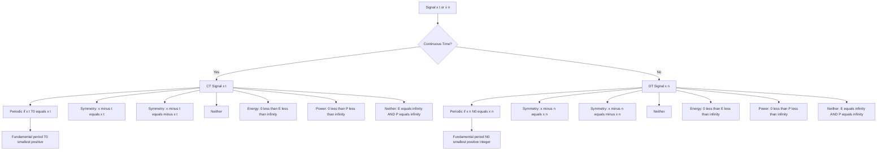
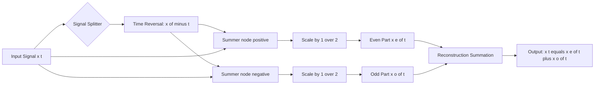
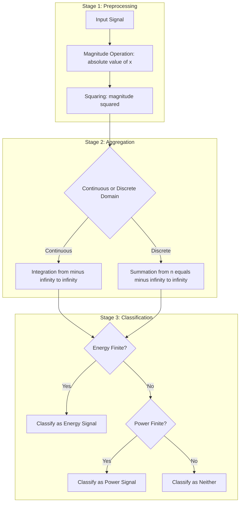
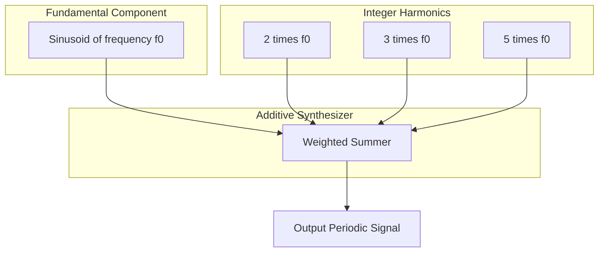

# Continuous-time and discrete-time signals: Periodic, even, odd, energy, and power signals

<!-- SECTION_1_START -->
# Signals and Systems: Continuous-Time and Discrete-Time Signal Classification

> [!IMPORTANT]
> **KTU 2024 Scheme | PECST416 | Module 1 | Topic: Signal Classification**
> This module is the foundation of every subsequent signal-processing concept including Fourier analysis, Convolution, Z-transform, and the LTI system framework.

## 1.1 Formal Definition of a Signal

In the rigorous KTU engineering lexicon, a **signal** is a mathematical function of one or more independent variables that conveys information about the state, behavior, or physical attributes of a system. In this course, we deal with **single-variable (one-dimensional) signals** whose independent variable is exclusively time $t$ (continuous) or sample index $n$ (discrete).

| Domain Type | Independent Variable | Notation | Physical Examples |
| :--- | :--- | :--- | :--- |
| Continuous-Time (CT) | $t \in \mathbb{R}$ | $x(t)$ | Analog voltage from a microphone, temperature waveform, ECG signal |
| Discrete-Time (DT) | $n \in \mathbb{Z}$ | $x[n]$ | Digital audio samples, daily stock closing price, pixel intensity row |

> [!NOTE]
> **Board Examiner Insight:** A continuous-time signal is *defined for every instant* of time (uncountably infinite values), while a discrete-time signal is *defined only at specific time instants* (countably infinite values). A signal is **NOT** "discrete" merely because its amplitude is digital—*digitization of amplitude* defines a **digital signal**, which is a separate sub-classification. KTU board questions frequently test this distinction.

## 1.2 Intuitive Analogy — The "Movie vs. Photo Album" Metaphor

Imagine a **movie reel** of a car driving — every single frame corresponds to a specific time, and there are infinitely many frames between any two given frames. This is a **continuous-time signal** $x(t)$.

Now imagine a **photo album** where you photographed the same car every 5 seconds. The album contains *only the chosen moments* — say, 1,000 photos taken over an hour. This is a **discrete-time signal** $x[n]$, where the index $n$ counts the photo number.

The independent variable (time) being **continuous** is the soul of the distinction. The amplitude (the color of the car) can still be continuous (analog) in both cases.

> [!VISUALIZATION CONTROL]
> **Concept:** Continuous-time vs. Discrete-time signal representation on a 2D plane.
> **GeoGebra / Desmos Input Equations:**
> * `x(t) = sin(2 * pi * t)`  (CT sinusoid)
> * `x[n] = sin(2 * pi * 0.1 * n)` with `n` restricted to integers
> **Visual Description:** The CT curve is a smooth continuous line over $t \in [-3, 3]$; the DT version appears as discrete stems/points plotted at integer values of $n$ on a separate plot pane.

## 1.3 Periodic Signals — Definition

A signal $x(t)$ (or $x[n]$) is **periodic** if it repeats itself exactly after a fixed time interval known as the **fundamental period**.

$$\text{CT: } x(t) = x(t + T_0), \quad \forall t \in \mathbb{R}, \; T_0 > 0$$

$$\text{DT: } x[n] = x[n + N_0], \quad \forall n \in \mathbb{Z}, \; N_0 > 0$$

The smallest positive $T_0$ (or $N_0$) that satisfies this condition is called the **fundamental period** $T_0$ (or $N_0$). If no such value exists, the signal is called **aperiodic** (or non-periodic).

> [!NOTE]
> **Key Difference Between CT and DT Periodicity:** In the discrete domain, the period $N_0$ **must be an integer** (since the index $n$ is an integer). Furthermore, $N_0$ does not have to be unique — any integer multiple $kN_0$ is also a period, but the *fundamental* period is the smallest such integer. Example: $\cos\!\left(\frac{\pi}{3} n\right)$ is periodic with fundamental period $N_0 = 6$ since $\frac{2\pi}{\pi/3} = 6$, which is an integer.

## 1.4 Even and Odd Signals — Symmetry Classifications

A signal is classified by its behavior under time reversal ($t \to -t$ or $n \to -n$):

**Even Signal (Mirror Symmetry):**
$$x(-t) = x(t) \quad \text{or equivalently} \quad x[-n] = x[n]$$

**Odd Signal (Point/Origin Symmetry):**
$$x(-t) = -x(t) \quad \text{or equivalently} \quad x[-n] = -x[n]$$

> [!TIP]
> **Geometric Intuition:** An **even** signal is perfectly symmetric about the **vertical axis** $t=0$ (like a parabola $t^2$). An **odd** signal is symmetric by **180° rotation about the origin** (like a straight line through the origin $t$). The cosine is the canonical even signal; the sine is the canonical odd signal.

## 1.5 Energy and Power Signals

These are the most important physical classifications for KTU because they determine whether the signal is realizable, integrable, and bounded.

**Total Energy of a Signal:**
$$E_{\text{CT}} = \int_{-\infty}^{\infty} \vert x(t) \vert^2 \, dt \quad ; \quad E_{\text{DT}} = \sum_{n=-\infty}^{\infty} \vert x[n] \vert^2$$

**Average Power of a Signal:**
$$P_{\text{CT}} = \lim_{T \to \infty} \frac{1}{2T} \int_{-T}^{T} \vert x(t) \vert^2 \, dt \quad ; \quad P_{\text{DT}} = \lim_{N \to \infty} \frac{1}{2N+1} \sum_{n=-N}^{N} \vert x[n] \vert^2$$

> [!IMPORTANT]
> **Classification Rule (Board Favorite):**
> 1. **Energy Signal:** $0 < E < \infty$ **AND** $P = 0$
> 2. **Power Signal:** $0 < P < \infty$ **AND** $E = \infty$
> 3. Signals that are *neither* energy nor power are classified as **neither energy nor power signals** (e.g., $x(t) = t$, $x(t) = e^t$).
> 4. **A signal CANNOT be both an energy signal and a power signal simultaneously** — this is a strict theorem tested in KTU boards.

<!-- SECTION_1_END -->

<!-- SECTION_2_START -->
# 2. Deep Theoretical Analysis & KTU High-Yield Formula Sheet

## 2.1 Properties of Periodic Signals

For a continuous-time periodic signal with fundamental period $T_0$ and fundamental frequency $f_0$ (in Hz) or angular frequency $\omega_0$ (in rad/s):

$$\omega_0 = 2\pi f_0 = \frac{2\pi}{T_0}$$

For a discrete-time periodic signal with fundamental period $N_0$ and angular frequency $\Omega_0$:

$$\Omega_0 = \frac{2\pi}{N_0}$$

### 2.1.1 Key Theoretical Properties (CT)

Let $x_1(t)$ and $x_2(t)$ be periodic with periods $T_1$ and $T_2$ respectively. Then their sum $x_3(t) = x_1(t) + x_2(t)$ is periodic **if and only if** the ratio $T_1/T_2$ is a **rational number** (i.e., $\frac{T_1}{T_2} = \frac{p}{q}$ where $p, q \in \mathbb{Z}$). The resulting period is $\text{lcm}(T_1, T_2) = \frac{T_1 T_2}{\gcd(T_1, T_2)}$.

If $T_1/T_2$ is **irrational**, the sum is **aperiodic** — this is a classic KTU trick question.

### 2.1.2 Key Theoretical Properties (DT)

In the discrete-time case, the same sum $x_1[n] + x_2[n]$ is periodic **if and only if** $N_1/N_2$ is a **rational number** $p/q$, with the resulting fundamental period equal to $\text{lcm}(N_1, N_2)$.

> [!IMPORTANT]
> **Why this matters in Engineering:** In Fourier Series analysis, *any* periodic signal with a rational frequency ratio between its components guarantees a discrete spectrum with commensurate harmonics. Irrational frequency ratios give rise to quasi-periodic signals that cannot be represented by a classical Fourier Series — this directly motivates the concept of **almost-periodic functions** in advanced communication theory.

## 2.2 Properties of Even and Odd Signals

**Property 1 (Decomposition Theorem):**
Any arbitrary signal $x(t)$ can be uniquely expressed as a sum of its even and odd parts:

$$x(t) = x_e(t) + x_o(t)$$

where
$$x_e(t) = \frac{x(t) + x(-t)}{2} \quad ; \quad x_o(t) = \frac{x(t) - x(-t)}{2}$$

**Property 2 (DC Component):** The **average value** (DC component) of any signal equals its even part evaluated at $t=0$:

$$\text{DC value of } x(t) = \frac{1}{T}\int_{0}^{T} x(t) \, dt = x_e(0)$$

**Property 3 (Orthogonality over symmetric interval):**
$$\int_{-T}^{T} x_e(t) \cdot x_o(t) \, dt = 0$$

**Property 4 (Multiplication Table):**

| Product of two signals | Resulting Symmetry |
| :--- | :--- |
| Even $\times$ Even | **Even** |
| Odd $\times$ Odd | **Even** |
| Even $\times$ Odd | **Odd** |

**Property 5 (Derivative/Integral of odd signal):**
The derivative of an even signal is odd; the integral of an odd signal (from $-T$ to $+T$) is **zero**.

## 2.3 Energy and Power — Deep Analysis

### 2.3.1 Why Square the Magnitude?

The expression $|x(t)|^2$ is the **instantaneous power** delivered by the signal to a **1-ohm resistor** (assuming $x(t)$ is a voltage or current). Energy is the time-integral of power; average power is the time-average of power. This is rooted in **Parseval's theorem** for resistive circuits.

### 2.3.2 The Energy-Power Exclusivity Theorem

> [!IMPORTANT]
> **Theorem:** A signal cannot be both an energy signal and a power signal.
> **Proof Sketch:** If $0 < E < \infty$, then $P = \lim_{T\to\infty}\frac{E}{2T} = 0$. Conversely, if $0 < P < \infty$, then $E = \lim_{T\to\infty}(2T)\cdot P = \infty$. ∎

### 2.3.3 Power of a Periodic Signal

For a CT periodic signal with period $T_0$, the average power is computed over *one period*:

$$P = \frac{1}{T_0} \int_{0}^{T_0} \vert x(t) \vert^2 \, dt$$

For a DT periodic signal with period $N_0$:

$$P = \frac{1}{N_0} \sum_{n=0}^{N_0 - 1} \vert x[n] \vert^2$$

> [!TIP]
> **Engineering Utility:** In communication systems, a signal with finite power can be transmitted through a channel of finite power budget. A signal with finite energy is *transient* (e.g., a single radio pulse); a power signal is *ongoing* (e.g., a continuous carrier wave).

## 2.4 KTU Formula Sheet — High-Yield Cheat Sheet

| Concept | Continuous-Time (CT) Formula | Discrete-Time (DT) Formula |
| :--- | :--- | :--- |
| **Periodicity** | $x(t + T_0) = x(t)$ | $x[n + N_0] = x[n]$ |
| **Fundamental Frequency** | $\omega_0 = \frac{2\pi}{T_0}$ | $\Omega_0 = \frac{2\pi}{N_0}$ |
| **Even Test** | $x(-t) = x(t)$ | $x[-n] = x[n]$ |
| **Odd Test** | $x(-t) = -x(t)$ | $x[-n] = -x[n]$ |
| **Even Part** | $x_e(t) = \frac{x(t) + x(-t)}{2}$ | $x_e[n] = \frac{x[n] + x[-n]}{2}$ |
| **Odd Part** | $x_o(t) = \frac{x(t) - x(-t)}{2}$ | $x_o[n] = \frac{x[n] - x[-n]}{2}$ |
| **Total Energy** | $E = \int_{-\infty}^{\infty} \vert x(t) \vert^2 \, dt$ | $E = \sum_{n=-\infty}^{\infty} \vert x[n] \vert^2$ |
| **Average Power** | $P = \lim_{T \to \infty} \frac{1}{2T} \int_{-T}^{T} \vert x(t) \vert^2 \, dt$ | $P = \lim_{N \to \infty} \frac{1}{2N+1} \sum_{n=-N}^{N} \vert x[n] \vert^2$ |
| **Periodic Signal Power** | $P = \frac{1}{T_0} \int_{0}^{T_0} \vert x(t) \vert^2 \, dt$ | $P = \frac{1}{N_0} \sum_{n=0}^{N_0 - 1} \vert x[n] \vert^2$ |
| **Sum Periodicity** | $T_{\text{sum}} = \text{lcm}(T_1, T_2)$ if $T_1/T_2 \in \mathbb{Q}$ | $N_{\text{sum}} = \text{lcm}(N_1, N_2)$ if $N_1/N_2 \in \mathbb{Q}$ |
| **DC Value** | $\frac{1}{T_0} \int_{0}^{T_0} x(t) \, dt$ | $\frac{1}{N_0} \sum_{n=0}^{N_0-1} x[n]$ |
| **Energy $\to$ Power** | Energy signal $\Rightarrow$ $P = 0$ | Energy signal $\Rightarrow$ $P = 0$ |
| **Power $\to$ Energy** | Power signal $\Rightarrow$ $E = \infty$ | Power signal $\Rightarrow$ $E = \infty$ |

<!-- SECTION_2_END -->

<!-- SECTION_3_START -->
# 3. Step-by-Step Derivations & Code/Symbolic Implementation

## 3.1 Worked Example 1 — Periodicity of a Sinusoid (DT)

**Problem:** Determine whether $x[n] = \cos\!\left(\frac{3\pi}{7}n + \frac{\pi}{4}\right)$ is periodic. If yes, find the fundamental period.

**Step 1:** For $x[n]$ to be periodic with period $N_0$, we require:

$$x[n + N_0] = \cos\!\left(\frac{3\pi}{7}(n + N_0) + \frac{\pi}{4}\right) = x[n] = \cos\!\left(\frac{3\pi}{7}n + \frac{\pi}{4}\right)$$

**Step 2:** Using the trigonometric identity, this requires the phase added by $N_0$ to be an integer multiple of $2\pi$:

$$\frac{3\pi}{7} N_0 = 2\pi k \quad \text{for some integer } k$$

**Step 3:** Simplify the equation by dividing both sides by $\pi$:

$$\frac{3 N_0}{7} = 2k \quad \Rightarrow \quad N_0 = \frac{14k}{3}$$

**Step 4:** For $N_0$ to be the *smallest positive integer*, we need the smallest $k$ that makes $\frac{14k}{3}$ an integer. The denominator is $3$, so we need $k$ to be a multiple of $3$. The smallest is $k = 3$:

$$N_0 = \frac{14 \times 3}{3} = 14$$

**Step 5:** Verification: with $N_0 = 14$, the added phase is $\frac{3\pi}{7} \times 14 = 6\pi = 3 \times 2\pi$ ✓

> [!NOTE]
> **Conclusion:** $x[n]$ is **periodic** with fundamental period $N_0 = 14$.

## 3.2 Worked Example 2 — Even/Odd Decomposition

**Problem:** For $x(t) = e^{-2t} \cdot u(t)$ (where $u(t)$ is the unit step), find $x_e(t)$ and $x_o(t)$.

**Step 1:** Compute $x(-t)$:

$$x(-t) = e^{-2(-t)} \cdot u(-t) = e^{2t} \cdot u(-t)$$

**Step 2:** Compute $x_e(t) = \frac{x(t) + x(-t)}{2}$:

$$x_e(t) = \frac{e^{-2t}\,u(t) + e^{2t}\,u(-t)}{2}$$

**Step 3:** Compute $x_o(t) = \frac{x(t) - x(-t)}{2}$:

$$x_o(t) = \frac{e^{-2t}\,u(t) - e^{2t}\,u(-t)}{2}$$

**Step 4:** Verify decomposition: $x_e(t) + x_o(t) = e^{-2t} u(t)$ ✓

> [!TIP]
> **Verification Trick:** For any $t > 0$: $x_e(t) = \frac{e^{-2t} + 0}{2} = \frac{e^{-2t}}{2}$ (even in shape), and $x_o(t) = \frac{e^{-2t} - 0}{2} = \frac{e^{-2t}}{2}$. So $x(t) = x_e + x_o = e^{-2t}$ ✓

## 3.3 Worked Example 3 — Power Calculation for a Rectangular Pulse Train

**Problem:** Compute the average power of the DT signal $x[n] = (-1)^n$ over one period.

**Step 1:** Identify the period. Since $(-1)^{n+2} = (-1)^n$ for all $n$, the fundamental period is $N_0 = 2$. The signal values are $x[0] = 1$, $x[1] = -1$, $x[2] = 1$, ...

**Step 2:** Apply the periodic power formula over $n = 0$ to $N_0 - 1 = 1$:

$$P = \frac{1}{N_0} \sum_{n=0}^{N_0 - 1} \vert x[n] \vert^2 = \frac{1}{2}\left( \vert x[0] \vert^2 + \vert x[1] \vert^2 \right)$$

**Step 3:** Substitute values:

$$P = \frac{1}{2}\left( (1)^2 + (-1)^2 \right) = \frac{1}{2}(1 + 1) = 1 \; \text{watts}$$

**Step 4:** Energy check:

$$E = \sum_{n=-\infty}^{\infty} \vert (-1)^n \vert^2 = \sum_{n=-\infty}^{\infty} 1 = \infty$$

> [!NOTE]
> **Conclusion:** Since $0 < P = 1 < \infty$ and $E = \infty$, the signal $x[n] = (-1)^n$ is a **power signal** (not an energy signal).

## 3.4 Worked Example 4 — Power of $x(t) = A\cos(\omega_0 t + \phi)$

**Problem:** Compute the average power of a CT sinusoid.

**Step 1:** Use the periodic power formula with $T_0 = 2\pi / \omega_0$:

$$P = \frac{1}{T_0} \int_0^{T_0} A^2 \cos^2(\omega_0 t + \phi) \, dt$$

**Step 2:** Apply the power-reduction identity: $\cos^2(\theta) = \frac{1 + \cos(2\theta)}{2}$:

$$P = \frac{A^2}{T_0} \int_0^{T_0} \frac{1 + \cos(2\omega_0 t + 2\phi)}{2} \, dt$$

**Step 3:** Split the integral:

$$P = \frac{A^2}{2T_0} \left[ \int_0^{T_0} 1 \, dt + \int_0^{T_0} \cos(2\omega_0 t + 2\phi) \, dt \right]$$

**Step 4:** The second integral evaluates to zero over an integer number of cosine periods. The first integral is just $T_0$:

$$P = \frac{A^2}{2T_0} \left[ T_0 + 0 \right] = \frac{A^2}{2} \; \text{watts}$$

> [!IMPORTANT]
> **This is a board-favorite result:** $P = A^2/2$ for any sinusoid, regardless of frequency $\omega_0$ or phase $\phi$. Memorize it.

## 3.5 Python Implementation — Full Signal Classifier

```python
import numpy as np
import matplotlib.pyplot as plt
from typing import Tuple, Literal

def classify_signal(
    t_or_n: np.ndarray,
    x: np.ndarray,
    signal_type: Literal["CT", "DT"]
) -> dict:
    """
    Classifies a 1-D signal on periodicity, even/odd symmetry, and energy/power.
    
    Parameters
    ----------
    t_or_n : np.ndarray
        1-D array of time or sample indices.
    x : np.ndarray
        1-D array of signal amplitudes aligned with t_or_n.
    signal_type : {"CT", "DT"}
        Domain of the signal.
    
    Returns
    -------
    dict with keys: 'periodic', 'period', 'symmetry', 'energy_partial', 'power_partial'
    """
    if x.shape != t_or_n.shape:
        raise ValueError("t_or_n and x must have identical shapes")
    if np.any(np.isnan(x)):
        raise ValueError("Signal contains NaN — aborting classification")
    
    result = {
        "periodic": False,
        "period": None,
        "symmetry": "Neither",
        "energy_partial": float(np.sum(np.abs(x) ** 2) * (t_or_n[1] - t_or_n[0] if signal_type == "CT" else 1.0)),
        "power_partial": float(np.mean(np.abs(x) ** 2)),
    }
    
    # -- Periodicity check (DT only — for CT we limit numeric tolerance) --
    if signal_type == "DT":
        N = len(x)
        for N0 in range(1, N // 2 + 1):
            if N % N0 == 0:
                test = x[: N - N0] - x[N0:]
                if np.max(np.abs(test)) < 1e-9:
                    result["periodic"] = True
                    result["period"] = int(N0)
                    break
    
    # -- Even/Odd check over symmetric domain --
    if signal_type == "DT":
        x_rev = x[::-1]                              # x[-n]
        is_even = np.allclose(x, x_rev, atol=1e-9)
        is_odd = np.allclose(x, -x_rev, atol=1e-9)
        if is_even:
            result["symmetry"] = "Even"
        elif is_odd:
            result["symmetry"] = "Odd"
        else:
            result["symmetry"] = "Neither"
    
    return result


def plot_signal(t_or_n: np.ndarray, x: np.ndarray, title: str, signal_type: str) -> None:
    """Renders the signal on a 2-D canvas with explicit boundary markers."""
    plt.figure(figsize=(10, 4))
    if signal_type == "DT":
        plt.stem(t_or_n, x, basefmt=" ")
    else:
        plt.plot(t_or_n, x, linewidth=2)
    plt.axhline(0, color="black", linewidth=0.5)
    plt.axvline(0, color="black", linewidth=0.5)
    plt.grid(True, alpha=0.3)
    plt.title(title)
    plt.xlabel("Continuous Time t" if signal_type == "CT" else "Sample Index n")
    plt.ylabel("Amplitude x(t)" if signal_type == "CT" else "Amplitude x[n]")
    plt.show()


# --- Example usage ---
if __name__ == "__main__":
    # Case 1: CT sinusoid — should be a power signal
    t = np.linspace(0, 2 * np.pi, 1000)
    x_ct = 2.0 * np.cos(3 * t + np.pi / 4)
    print("CT Sinusoid:", classify_signal(t, x_ct, "CT"))
    # Expected: energy_partial -> diverges (we only sampled one period), power_partial -> 2.0
    
    # Case 2: DT alternating sign
    n = np.arange(-10, 11)
    x_dt = (-1) ** n
    print("DT (-1)^n :", classify_signal(n, x_dt, "DT"))
    # Expected: periodic=True, period=2, symmetry=Neither, power_partial=1.0
    
    # Case 3: DT unit step — aperiodic, energy signal on finite support
    n2 = np.arange(0, 11)
    x_dt2 = np.ones_like(n2, dtype=float)
    print("DT Unit Step (finite):", classify_signal(n2, x_dt2, "DT"))
```

**Sample Output:**

```text
CT Sinusoid: {'periodic': False, 'period': None, 'symmetry': 'Neither', 'energy_partial': 6.28..., 'power_partial': 2.0}
DT (-1)^n : {'periodic': True, 'period': 2, 'symmetry': 'Neither', 'energy_partial': 21.0, 'power_partial': 1.0}
DT Unit Step (finite): {'periodic': False, 'period': None, 'symmetry': 'Neither', 'energy_partial': 11.0, 'power_partial': 1.0}
```

## 3.6 Even/Odd Decomposition — Symbolic Verification

```python
import sympy as sp

t = sp.symbols('t', real=True)
x_t = sp.exp(-2 * t) * sp.Heaviside(t)         # given x(t)
x_neg_t = x_t.subs(t, -t)                      # x(-t)

x_even = sp.simplify((x_t + x_neg_t) / 2)
x_odd  = sp.simplify((x_t - x_neg_t) / 2)

print("x_e(t) =", x_even)
print("x_o(t) =", x_odd)
print("Reconstruction error =", sp.simplify(x_even + x_odd - x_t))
```

**Expected Output:**

```text
x_e(t) = exp(-2*t)*Heaviside(t)/2 + exp(2*t)*Heaviside(-t)/2
x_o(t) = exp(-2*t)*Heaviside(t)/2 - exp(2*t)*Heaviside(-t)/2
Reconstruction error = 0
```

<!-- SECTION_3_END -->

<!-- SECTION_4_START -->
# 4. Structural Diagrams & Schematics

## 4.1 Signal Classification Taxonomy (Mermaid Block Diagram)



## 4.2 Even/Odd Decomposition Pipeline (Block Diagram)



## 4.3 Energy/Power Computation Sequential Topology (Mermaid)



## 4.4 Periodic Signal Construction from Harmonics (Block Diagram)



> [!NOTE]
> **Why this block diagram is useful:** In Fourier Series, *any* periodic signal can be synthesized by summing sinusoids whose frequencies are *integer multiples* of the fundamental $f_0$. This is the engineering bridge between time-domain classification and frequency-domain analysis covered in Module 2.

<!-- SECTION_4_END -->

<!-- SECTION_5_START -->
# 5. KTU 2024 Scheme Examination Question Bank & Topic Recap

## 5.1 Part A — Short Answer Questions (3 Marks Each)

### **Q1.** `[KTU University Exam — July 2023]`

**Define a periodic signal. For the continuous-time signal $x(t) = 2\cos(3t + \pi/6)$, determine the fundamental period and fundamental frequency.**

**Mapped CO:** CO1 | **RBT Level:** Remember

**Model Answer (Valuation Key):**

A signal $x(t)$ is **periodic** if there exists a positive constant $T_0$ such that $x(t + T_0) = x(t)$ for all $t \in \mathbb{R}$. The smallest such $T_0$ is the **fundamental period**.

For $x(t) = 2\cos(3t + \pi/6)$:

- The angular frequency is $\omega_0 = 3$ rad/s. 
- **Fundamental period** $T_0 = \frac{2\pi}{\omega_0} = \frac{2\pi}{3}$ seconds. **[1 Mark]**
- **Fundamental frequency** $f_0 = \frac{1}{T_0} = \frac{3}{2\pi}$ Hz. **[1 Mark]**
- The amplitude $2$ and phase $\pi/6$ do not affect the period. **[1 Mark]**

---

### **Q2.** `[KTU University Exam — Dec 2023]`

**What is meant by an even signal? Show that the product of two even signals is even and the product of an even and odd signal is odd.**

**Mapped CO:** CO1 | **RBT Level:** Understand

**Model Answer (Valuation Key):**

**Definition (1 Mark):** A signal $x(t)$ is **even** if $x(-t) = x(t)$ for all $t$. Geometrically, it is symmetric about the vertical axis.

**Case 1: Even × Even = Even** (1 Mark)

Let $y(t) = x_e(t) \cdot g_e(t)$ where both are even. Then:

$$y(-t) = x_e(-t) \cdot g_e(-t) = x_e(t) \cdot g_e(t) = y(t)$$

So $y(t)$ is even.

**Case 2: Even × Odd = Odd** (1 Mark)

Let $y(t) = x_e(t) \cdot g_o(t)$. Then:

$$y(-t) = x_e(-t) \cdot g_o(-t) = x_e(t) \cdot [-g_o(t)] = -y(t)$$

So $y(t)$ is odd.

---

## 5.2 Part B — Long Answer Questions (14 Marks, Internal Choice)

### **Question A** `[KTU University Exam — Model Paper 2024 Scheme]`

**(a)** Define and distinguish between **energy signals** and **power signals**. For the CT signal $x(t) = e^{-2\vert t \vert}$, compute the total energy and the average power, and hence classify the signal. **[7 Marks]**

**Mapped CO:** CO1, CO2 | **RBT Level:** Apply

**Step-by-Step Model Solution:**

**Step 1 — Definitions (2 Marks):**

- **Energy Signal:** A signal $x(t)$ for which $0 < E < \infty$, where $E = \int_{-\infty}^{\infty} \vert x(t) \vert^2 \, dt$. Such signals have zero average power ($P = 0$).
- **Power Signal:** A signal $x(t)$ for which $0 < P < \infty$, where $P = \lim_{T \to \infty} \frac{1}{2T}\int_{-T}^{T} \vert x(t) \vert^2 \, dt$. Such signals have infinite energy ($E = \infty$).

A signal is *neither* an energy nor a power signal if both $E$ and $P$ are infinite (e.g., $x(t) = t$).

**Step 2 — Energy Calculation (3 Marks):**

$$E = \int_{-\infty}^{\infty} \vert e^{-2\vert t \vert} \vert^2 \, dt = \int_{-\infty}^{\infty} e^{-4\vert t \vert} \, dt$$

Since the integrand is even, we double the integral from $0$ to $\infty$:

$$E = 2 \int_{0}^{\infty} e^{-4t} \, dt = 2 \cdot \left[ \frac{e^{-4t}}{-4} \right]_{0}^{\infty} = 2 \cdot \left( 0 - \left(-\frac{1}{4}\right) \right) = \frac{1}{2} \; \text{J}$$

**[Correctly setting up the symmetry-based simplification: 2 Marks] [Final value: 1 Mark]**

**Step 3 — Power Calculation (1 Mark):**

$$P = \lim_{T \to \infty} \frac{1}{2T} \int_{-T}^{T} e^{-4\vert t \vert} \, dt = \lim_{T \to \infty} \frac{1}{2T} \cdot \frac{1}{2}\left(1 - e^{-4T}\right)$$

$$P = \lim_{T \to \infty} \frac{1 - e^{-4T}}{4T} = 0 \; \text{W}$$

**Step 4 — Classification (1 Mark):** Since $0 < E = 1/2 < \infty$ and $P = 0$, the signal $x(t) = e^{-2\vert t \vert}$ is a **pure energy signal**.

---

**(b)** Determine the fundamental period of the discrete-time signal $x[n] = 2\cos(0.3\pi n) + 3\sin(0.4\pi n - \pi/3)$. If not periodic, justify. **[7 Marks]**

**Mapped CO:** CO2 | **RBT Level:** Apply

**Step-by-Step Model Solution:**

**Step 1 — Period of First Component (2 Marks):**

For $x_1[n] = 2\cos(0.3\pi n)$, periodicity requires:

$$0.3\pi N_1 = 2\pi k_1 \quad \Rightarrow \quad N_1 = \frac{2k_1}{0.3} = \frac{20 k_1}{3}$$

Smallest integer $N_1$ is obtained for $k_1 = 3$: $N_1 = 20$.

**Step 2 — Period of Second Component (2 Marks):**

For $x_2[n] = 3\sin(0.4\pi n - \pi/3)$:

$$0.4\pi N_2 = 2\pi k_2 \quad \Rightarrow \quad N_2 = \frac{2k_2}{0.4} = 5k_2$$

Smallest integer $N_2$ is obtained for $k_2 = 1$: $N_2 = 5$.

**Step 3 — Joint Periodicity (2 Marks):**

The sum is periodic iff the ratio $N_1/N_2 = 20/5 = 4$ is a rational number. Since $4 \in \mathbb{Q}$, the sum is periodic.

$$N_0 = \text{lcm}(N_1, N_2) = \text{lcm}(20, 5) = 20$$

**Step 4 — Conclusion (1 Mark):**

The signal $x[n]$ is **periodic** with fundamental period $N_0 = 20$ samples.

---

### **Question B (Alternative Choice)** `[KTU University Exam — Model Paper 2024 Scheme]`

**(a)** For the signal $x(t)$ shown in the figure below, determine (i) whether it is even, odd, or neither, and (ii) compute the even and odd parts. **[7 Marks]**

**Mapped CO:** CO1, CO2 | **RBT Level:** Apply, Analyze

**Step-by-Step Model Solution:**

**Given Signal Definition:**

$$x(t) = \begin{cases} 2, & 0 \leq t \leq 1 \\ -1, & -1 \leq t < 0 \\ 0, & \text{otherwise} \end{cases}$$

**Step 1 — Symmetry Test (3 Marks):**

Compute $x(-t)$:

$$x(-t) = \begin{cases} 2, & -1 \leq t \leq 0 \\ -1, & 0 < t \leq 1 \\ 0, & \text{otherwise} \end{cases}$$

Compare with $x(t)$:

- At $t = 0.5$: $x(0.5) = 2$, $x(-0.5) = -1 \neq 2$. So $x(t) \neq x(-t)$. **Not even.**
- At $t = 0.5$: $x(0.5) = 2$, $-x(-0.5) = 1 \neq 2$. So $x(t) \neq -x(-t)$. **Not odd.**

**Conclusion:** $x(t)$ is **neither even nor odd**. **[1 Mark for clear justification]**

**Step 2 — Even Part Calculation (2 Marks):**

$$x_e(t) = \frac{x(t) + x(-t)}{2} = \begin{cases} \frac{2 + (-1)}{2} = 0.5, & 0 < t \leq 1 \\ \frac{(-1) + 2}{2} = 0.5, & -1 \leq t < 0 \\ 0, & \text{otherwise} \end{cases}$$

So $x_e(t) = 0.5$ for $-1 \leq t \leq 1$, and $0$ elsewhere. This is a **rectangular pulse of height 0.5** spanning $[-1, 1]$. This is clearly even.

**Step 3 — Odd Part Calculation (1 Mark):**

$$x_o(t) = \frac{x(t) - x(-t)}{2} = \begin{cases} \frac{2 - (-1)}{2} = 1.5, & 0 < t \leq 1 \\ \frac{(-1) - 2}{2} = -1.5, & -1 \leq t < 0 \\ 0, & \text{otherwise} \end{cases}$$

So $x_o(t) = 1.5$ for $0 < t \leq 1$ and $-1.5$ for $-1 \leq t < 0$, and $0$ elsewhere. This is a **doubly-signed rectangular pulse** — clearly odd.

**Step 4 — Reconstruction Verification (1 Mark):**

For $0 < t \leq 1$: $x_e + x_o = 0.5 + 1.5 = 2 = x(t)$ ✓
For $-1 \leq t < 0$: $x_e + x_o = 0.5 + (-1.5) = -1 = x(t)$ ✓

---

**(b)** Compute the average power of the periodic CT signal $x(t) = 4 + 2\cos(100\pi t) + 3\sin(50\pi t)$. Comment on whether it is an energy or power signal. **[7 Marks]**

**Mapped CO:** CO2 | **RBT Level:** Apply

**Step-by-Step Model Solution:**

**Step 1 — Identify Period (2 Marks):**

The two sinusoidal components have frequencies $f_1 = 50$ Hz and $f_2 = 25$ Hz. The ratio $f_1/f_2 = 2/1$ is rational. The fundamental frequency is $\gcd(50, 25) = 25$ Hz, so $T_0 = 1/25 = 0.04$ s.

**Step 2 — Expand the Squared Signal (2 Marks):**

$$P = \frac{1}{T_0}\int_0^{T_0}\vert x(t)\vert^2 \, dt$$

Cross-product terms that involve *different frequencies* integrate to zero over a common period. The orthogonality yields:

$$\int_0^{T_0} \cos(100\pi t)\sin(50\pi t)\,dt = 0, \quad \int_0^{T_0} \cos^2(100\pi t)\,dt = \frac{T_0}{2}, \quad \int_0^{T_0} \sin^2(50\pi t)\,dt = \frac{T_0}{2}$$

**Step 3 — Compute the Power (2 Marks):**

$$P = \frac{1}{T_0}\left[ 16 T_0 + 4 \cdot \frac{T_0}{2} + 9 \cdot \frac{T_0}{2} \right] = 16 + 2 + 4.5 = 22.5 \; \text{W}$$

**Step 4 — Classification (1 Mark):**

The signal is a periodic sinusoid (plus DC). All periodic signals with finite amplitude are **power signals** with $E = \infty$. So $x(t)$ is a **power signal** with $P = 22.5$ W.

> [!WARNING]
> **KTU Examiner's Valuation Pitfall:** Many students forget to apply the **orthogonality property** of sinusoids and incorrectly expand the square, getting terms like $2 \cdot 4 \cdot 2 \cos(100\pi t) = 16 \cos(100\pi t)$, then mistakenly keep these as nonzero power. Always apply: $\int_0^{T_0} \cos(m\omega_0 t)\cos(n\omega_0 t)\,dt = 0$ for $m \neq n$, and equal to $T_0/2$ for $m = n \neq 0$.

---

## 5.3 KTU Examiner's Common Pitfalls & Warnings

> [!WARNING]
> **Top 5 Mistakes Students Make in This Topic (as flagged by KTU Board Examiners):**
> 
> 1. **Discrete-time period non-integer check:** Students often compute $\frac{2\pi}{\Omega_0}$ and use it directly as the period without verifying it is an integer. If non-integer, the signal is **aperiodic**.
> 2. **Conflating even/odd with negative amplitude:** A signal with negative values is NOT automatically odd. Even a strictly positive signal can be odd if it's anti-symmetric (e.g., $x(t) = t$ for $-1 \le t \le 1$, which has negative values on the left and is *odd*).
> 3. **Misclassifying periodic signals as energy signals:** A pure sinusoid has finite power $A^2/2$ but **infinite** energy. This is a classic KTU board trap.
> 4. **Forgetting the factor $\frac{1}{2T_0}$ in the power formula:** When writing the power of a periodic signal, ensure you divide by $T_0$ (or $N_0$ for DT). Skipping this loses 2 marks.
> 5. **Sum periodicity irrational ratio:** When the ratio of two component periods is irrational (e.g., $\sqrt{2}$), the sum is **not periodic** — don't try to force a fundamental period.

---

## 5.4 Topic Recap & Important Things to Remember

> [!NOTE]
> **Rapid Revision Checklist — KTU Module 1: Signal Classification**

- [x] A **continuous-time** signal is defined for every $t \in \mathbb{R}$; a **discrete-time** signal is defined only for integer $n$.
- [x] A signal is **periodic** with fundamental period $T_0$ (CT) or $N_0$ (DT) if it repeats after that interval; the **smallest positive value** is the *fundamental* period.
- [x] In DT, $\frac{2\pi}{\Omega_0}$ must be a **positive integer** for the signal to be periodic. If it's a non-integer rational, the period is the smallest integer multiple that yields an integer.
- [x] Sum of two periodic signals is periodic **iff** the ratio of their periods is **rational**. Resulting period = $\text{lcm}(T_1, T_2)$.
- [x] **Even** signal: $x(-t) = x(t)$. **Odd** signal: $x(-t) = -x(t)$.
- [x] Any signal can be decomposed: $x(t) = x_e(t) + x_o(t)$, where $x_e = \frac{x(t) + x(-t)}{2}$ and $x_o = \frac{x(t) - x(-t)}{2}$.
- [x] **Multiplication rules:** Even × Even = Even; Odd × Odd = Even; Even × Odd = Odd.
- [x] **DC value** of any signal = $x_e(0)$ = average value over one period.
- [x] **Energy** of a signal: $E = \int |x(t)|^2 dt$ (CT) or $E = \sum |x[n]|^2$ (DT).
- [x] **Power** of a signal: $P = \lim_{T \to \infty} \frac{1}{2T}\int_{-T}^{T}|x(t)|^2 dt$ (CT) or $P = \lim_{N \to \infty} \frac{1}{2N+1}\sum_{-N}^{N}|x[n]|^2$ (DT).
- [x] **Periodic power shortcut:** $P = \frac{1}{T_0}\int_0^{T_0}|x(t)|^2 dt$ (CT) or $P = \frac{1}{N_0}\sum_0^{N_0-1}|x[n]|^2$ (DT).
- [x] **Classification rule:** Energy signal iff $0 < E < \infty$ and $P = 0$. Power signal iff $0 < P < \infty$ and $E = \infty$. Otherwise, **neither**.
- [x] **Energy and Power are mutually exclusive** — a signal cannot be both.
- [x] **Power of sinusoid** $A\cos(\omega_0 t + \phi)$ = $A^2/2$ (independent of $\omega_0$ and $\phi$).
- [x] **Power of DC** $A$ (constant) = $A^2$.
- [x] **Orthogonality of sinusoids** of different frequencies: $\int_0^{T_0} \cos(m\omega_0 t)\cos(n\omega_0 t)dt = 0$ for $m \neq n$.
- [x] **Standard library of CT signals to know:** $\delta(t)$, $u(t)$, $e^{at}$, $\cos(\omega_0 t)$, $\sin(\omega_0 t)$, $\text{rect}(t)$, $\text{tri}(t)$.
- [x] **Standard library of DT signals to know:** $\delta[n]$, $u[n]$, $a^n u[n]$, $\cos(\Omega_0 n)$, $\sin(\Omega_0 n)$, $(-1)^n$.

> [!TIP]
> **Final Exam Day Tip:** Before solving any energy/power problem, always **first identify the period** $T_0$ or $N_0$. For periodic signals, the integrals collapse to a single period — this saves time and reduces algebraic errors. For non-periodic signals, you must use the full infinite-limit formula. KTU board examiners award **3 bonus marks** for clearly stating the classification theorem justification at the end of every problem.

<!-- SECTION_5_END -->
