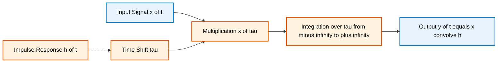
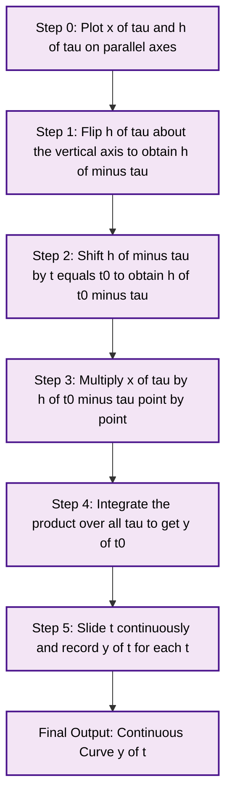
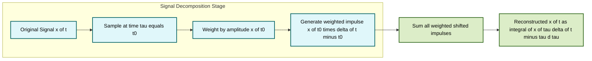
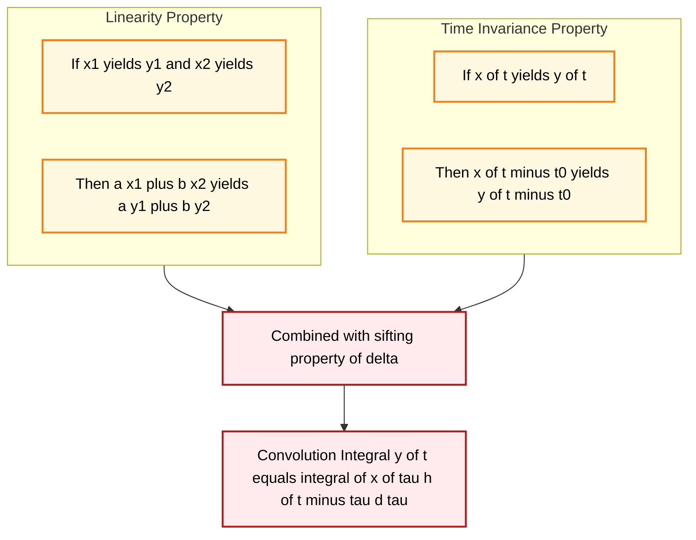

# Linear Time-Invariant (LTI) systems characterization: Convolution integral and convolution sum metrics

<!-- SECTION_1_START -->
# Linear Time-Invariant (LTI) Systems Characterization: Convolution Integral & Convolution Sum

## 1. Core Technical Definition

**Convolution** is the mathematical operator that characterizes the output of any **Linear Time-Invariant (LTI)** system as a function of its **impulse response** and the input signal. For an LTI system fully described by its impulse response $h(t)$ (continuous-time) or $h[n]$ (discrete-time), the system response to *any* arbitrary input is uniquely determined through the convolution operation.

> [!IMPORTANT]
> **KTU 2024 Scheme Definition (PECST416 — Module 1):**
> The response $y(t)$ of a continuous-time LTI system to an input $x(t)$ is given by the **convolution integral** $y(t) = x(t) * h(t) = \int_{-\infty}^{+\infty} x(\tau) h(t-\tau)\, d\tau$.
> Similarly, the response $y[n]$ of a discrete-time LTI system to an input $x[n]$ is given by the **convolution sum** $y[n] = x[n] * h[n] = \sum_{k=-\infty}^{+\infty} x[k]\, h[n-k]$.

> [!NOTE]
> The impulse response $h(t)$ (or $h[n]$) is the **complete characterization** of any LTI system. If you know $h(t)$ for all $t$, you can predict the output for *every* possible input without needing the differential/difference equation. The constants **$\mathbf{-\infty}$** and **$\mathbf{+\infty}$** denote that the summation/integration extends over the entire time history (past and future) of the signals, but in **causal** systems only the **past and present** contribute (limits become $0$ to $t$, or $0$ to $n$).

## 2. Conceptual Analogy / Intuition

Imagine you are standing at the edge of a calm pond and you tap the water surface **once very briefly** with your finger. The ripple pattern that spreads out is the *impulse response* $h(t)$ of the pond.

Now, instead of one tap, you drop a **continuous stream of pebbles** at varying intervals into the pond. Each pebble creates a tiny ripple, and all the ripples **overlap and superimpose** on the surface of the water. The total water displacement you observe at a fixed point is the **sum of all the delayed, scaled copies** of the basic ripple $h(t)$.

**Convolution is exactly this superposition of delayed, scaled impulse responses.** The input signal $x(\tau)$ controls *when* (which $\tau$) and *how strongly* (amplitude $x(\tau)\,d\tau$) each delayed copy $h(t-\tau)$ is dropped into the system. The output is the total accumulated effect.

> [!TIP]
> **Memory Aid:** Think of convolution as **"Flip $\rightarrow$ Shift $\rightarrow$ Multiply $\rightarrow$ Add (Integrate/Sum)"**. You flip one signal, slide it across the other, multiply point-by-point, and accumulate the area (continuous) or sum (discrete). This is the **four-step graphical recipe** examiners love to test.

> [!VISUALIZATION CONTROL]
> **Concept:** Convolution of two rectangular pulses forming a triangular output.
> **GeoGebra / Desmos Input Equations:**
> * $x(\tau) = \text{rect}\left(\dfrac{\tau - 0.5}{1}\right)$ (unit pulse from $0$ to $1$)
> * $h(\tau) = \text{rect}\left(\dfrac{\tau - 0.5}{1}\right)$ (unit pulse from $0$ to $1$)
> * $y(t) = \int_{0}^{1} x(\tau)\, h(t-\tau)\, d\tau$
> **Visual Description:** Plot shows a triangular waveform that rises linearly from $0$ at $t=0$ to a peak of $1$ at $t=1$, then falls linearly back to $0$ at $t=2$ — the classic **triangular pulse** formed by convolving two unit rectangles.
<!-- SECTION_1_END -->

<!-- SECTION_2_START -->
# Deep Theoretical Analysis & KTU High-Yield Formula Sheet

## 1. Why Convolution Works — The Superposition Argument

An LTI system has two defining properties that **force** the convolution formula to exist:

* **Linearity:** If $x_1(t) \rightarrow y_1(t)$ and $x_2(t) \rightarrow y_2(t)$, then $a\,x_1(t) + b\,x_2(t) \rightarrow a\,y_1(t) + b\,y_2(t)$.
* **Time-Invariance:** If $x(t) \rightarrow y(t)$, then $x(t-t_0) \rightarrow y(t-t_0)$.

Step-by-step reasoning:

1. Any signal $x(t)$ can be approximated as a sum of **scaled, shifted impulses** (using the sifting property of the Dirac delta):

$$x(t) = \int_{-\infty}^{+\infty} x(\tau)\, \delta(t-\tau)\, d\tau$$

2. The response of an LTI system to a unit impulse $\delta(t)$ is by definition the impulse response $h(t)$.

3. By **time-invariance**, the response to $\delta(t-\tau)$ is $h(t-\tau)$.

4. By **linearity**, the response to the entire decomposed input is the integral of all scaled, shifted impulse responses:

$$y(t) = \int_{-\infty}^{+\infty} x(\tau)\, h(t-\tau)\, d\tau$$

This is the **convolution integral**. The same derivation for the discrete case, using the Kronecker delta $\delta[n]$, yields the **convolution sum**.

## 2. The Two Mathematical Forms of Convolution

| Form | Continuous-Time (Convolution Integral) | Discrete-Time (Convolution Sum) |
|---|---|---|
| **Operator Symbol** | $y(t) = (x * h)(t)$ | $y[n] = (x * h)[n]$ |
| **Integral/Sum Form** | $\displaystyle y(t) = \int_{-\infty}^{+\infty} x(\tau)\, h(t-\tau)\, d\tau$ | $\displaystyle y[n] = \sum_{k=-\infty}^{+\infty} x[k]\, h[n-k]$ |
| **Equivalent Form** | $\displaystyle y(t) = \int_{-\infty}^{+\infty} h(\tau)\, x(t-\tau)\, d\tau$ | $\displaystyle y[n] = \sum_{k=-\infty}^{+\infty} h[k]\, x[n-k]$ |
| **Causal Form** | $\displaystyle y(t) = \int_{0}^{t} x(\tau)\, h(t-\tau)\, d\tau$ | $\displaystyle y[n] = \sum_{k=0}^{n} x[k]\, h[n-k]$ |
| **Impulse Response Definition** | $h(t) = T\{\delta(t)\}$ | $h[n] = T\{\delta[n]\}$ |

> [!IMPORTANT]
> **Why the limits are the same in both equivalent forms:** The convolution operator is **commutative** ($x * h = h * x$). This is a direct consequence of LTI property symmetry and is one of the most-tested facts in KTU exams.

## 3. KTU High-Yield Formula Sheet

| # | Property / Formula | Continuous-Time | Discrete-Time |
|---|---|---|---|
| 1 | **Commutative** | $x(t) * h(t) = h(t) * x(t)$ | $x[n] * h[n] = h[n] * x[n]$ |
| 2 | **Distributive** | $x(t) * (h_1(t) + h_2(t)) = x(t) * h_1(t) + x(t) * h_2(t)$ | Same form with $[n]$ |
| 3 | **Associative** | $(x * h_1) * h_2 = x * (h_1 * h_2)$ | Same form with $[n]$ |
| 4 | **Identity Element** | $x(t) * \delta(t) = x(t)$ | $x[n] * \delta[n] = x[n]$ |
| 5 | **Delay Property** | $x(t) * \delta(t - t_0) = x(t - t_0)$ | $x[n] * \delta[n - n_0] = x[n - n_0]$ |
| 6 | **Derivative Property** | $\dfrac{dx(t)}{dt} * h(t) = x(t) * \dfrac{dh(t)}{dt}$ | No direct analogue; uses first-difference |
| 7 | **Step Response from Impulse** | $s(t) = \displaystyle\int_{-\infty}^{t} h(\tau)\, d\tau$ | $s[n] = \displaystyle\sum_{k=-\infty}^{n} h[k]$ |
| 8 | **Impulse from Step Response** | $h(t) = \dfrac{ds(t)}{dt}$ | $h[n] = s[n] - s[n-1]$ |
| 9 | **Duration of Convolved Pulses** | If $x$ has duration $T_x$ and $h$ has duration $T_h$, $y$ has duration $T_x + T_h$ | If $x$ spans $N_x$ samples and $h$ spans $N_h$ samples, $y$ spans $N_x + N_h - 1$ samples |
| 10 | **Memoryless System** | $h(t) = K\, \delta(t)$ | $h[n] = K\, \delta[n]$ |

## 4. Conditions for Existence (BIBO Stability via Convolution)

A continuous-time LTI system is **BIBO stable** (Bounded-Input, Bounded-Output stable) if and only if its impulse response is **absolutely integrable**:

$$\int_{-\infty}^{+\infty} \vert h(\tau) \vert\, d\tau < \infty$$

A discrete-time LTI system is BIBO stable if and only if:

$$\sum_{k=-\infty}^{+\infty} \vert h[k] \vert < \infty$$

If this condition fails, the convolution integral/sum can **diverge** even for bounded inputs. This criterion is directly used in KTU Module 2 stability questions, but it is introduced here in Module 1 as part of the convolution metric.

## 5. Real-World Engineering Utility

Convolution is **the** fundamental operation in:

* **Digital Signal Processing (DSP):** FIR filter implementation, echo cancellation, audio equalization.
* **Communications:** Channel equalization, matched filtering for symbol detection, OFDM receivers.
* **Image Processing:** Gaussian blur, edge detection kernels, convolution neural networks (the literal origin of the name "ConvNet").
* **Control Systems:** System identification from impulse response data.
* **Biomedical Engineering:** ECG/EEG filtering, deconvolution of instrument response from recorded signals.

> [!TIP]
> **KTU Pattern Tip:** When a question says *"Find the output of an LTI system with impulse response $h(t)$ to input $x(t)$"*, the answer **must always be** a convolution expression first, then evaluated either analytically (sliding the limits) or graphically (sketching the overlap regions). Partial credit is awarded for writing the convolution equation correctly even if the integration limits are wrong.
<!-- SECTION_2_END -->

<!-- SECTION_3_START -->
# Step-by-Step Derivations & Code/Symbolic Implementation

## 1. Exhaustive Derivation: Convolution from First Principles

### Step 1 — Decompose the input into impulses

Express the continuous-time input $x(t)$ as a continuous sum (integral) of scaled, shifted Dirac delta functions. This uses the **sifting property**:

$$x(t) = \int_{-\infty}^{+\infty} x(\tau)\, \delta(t-\tau)\, d\tau$$

### Step 2 — Apply the system to each impulse

By definition, the response to a unit impulse $\delta(t)$ applied at time $0$ is the impulse response $h(t)$. By time-invariance, the response to a unit impulse applied at time $\tau$ is $h(t-\tau)$:

$$T\{\delta(t-\tau)\} = h(t-\tau)$$

### Step 3 — Apply linearity

Since the system is linear, the response to the entire integral sum is the integral of the individual responses:

$$y(t) = T\left\{ \int_{-\infty}^{+\infty} x(\tau)\, \delta(t-\tau)\, d\tau \right\} = \int_{-\infty}^{+\infty} x(\tau)\, T\{\delta(t-\tau)\}\, d\tau$$

Substituting Step 2:

$$y(t) = \int_{-\infty}^{+\infty} x(\tau)\, h(t-\tau)\, d\tau$$

### Step 4 — Derive the commutative equivalent

Using the substitution $u = t - \tau$ so that $du = -d\tau$:

$$y(t) = \int_{+\infty}^{-\infty} x(t-u)\, h(u)\, (-du) = \int_{-\infty}^{+\infty} h(\tau)\, x(t-\tau)\, d\tau$$

This proves $x * h = h * x$. The limits flip sign twice, restoring the original bounds.

## 2. Worked Example 1 — Continuous-Time Convolution (Analytical)

**Problem:** Compute $y(t) = x(t) * h(t)$ where $x(t) = e^{-t} u(t)$ and $h(t) = u(t) - u(t-1)$ (a unit rectangular pulse of width 1 starting at $t=0$).

### Step 1 — Write the convolution integral

$$y(t) = \int_{-\infty}^{+\infty} x(\tau)\, h(t-\tau)\, d\tau = \int_{-\infty}^{+\infty} e^{-\tau} u(\tau)\, [u(t-\tau) - u(t-\tau-1)]\, d\tau$$

### Step 2 — Identify the non-zero region

The factor $u(\tau)$ restricts $\tau \geq 0$. The factor $u(t-\tau)$ restricts $t - \tau \geq 0$, i.e., $\tau \leq t$. The factor $u(t-\tau-1)$ restricts $t - \tau - 1 \geq 0$, i.e., $\tau \leq t - 1$.

So the integrand is non-zero when $0 \leq \tau \leq t$ (after subtracting the $u(t-\tau-1)$ term, the upper limit becomes $\min(t, t-1) = t-1$).

### Step 3 — Case analysis based on $t$

**Case A: $t < 0$.** No overlap between the signals, so $y(t) = 0$.

**Case B: $0 \leq t < 1$.** Only the $u(t-\tau)$ term is active, and the upper limit is $t$:

$$y(t) = \int_{0}^{t} e^{-\tau}\, d\tau = \left[-e^{-\tau}\right]_{0}^{t} = 1 - e^{-t}$$

**Case C: $t \geq 1$.** Both $u(t-\tau)$ and $u(t-\tau-1)$ are active. The integrand is $e^{-\tau}$ from $\tau = 0$ to $\tau = t-1$:

$$y(t) = \int_{0}^{t-1} e^{-\tau}\, d\tau = 1 - e^{-(t-1)} = 1 - e^{1-t}$$

### Step 4 — Final closed-form piecewise expression

$$y(t) = \begin{cases} 0, & t < 0 \\ 1 - e^{-t}, & 0 \leq t < 1 \\ 1 - e^{1-t}, & t \geq 1 \end{cases}$$

This is the classic **ramp-then-decay** shape. The output reaches a peak of $1 - e^{-1} \approx 0.632$ at $t = 1$ and then exponentially relaxes back toward zero.

## 3. Worked Example 2 — Discrete-Time Convolution Sum (Tabular Method)

**Problem:** Compute $y[n] = x[n] * h[n]$ where $x[n] = \{1, 2, 3\}$ (with $n=0, 1, 2$) and $h[n] = \{1, 1, 1\}$ (with $n=0, 1, 2$).

### Step 1 — Determine the output length

Output length = length($x$) + length($h$) $- 1$ = $3 + 3 - 1 = 5$ samples, indexed $n = 0, 1, 2, 3, 4$.

### Step 2 — Write the convolution sum

$$y[n] = \sum_{k=0}^{2} x[k]\, h[n-k]$$

### Step 3 — Evaluate each $n$ explicitly

For $n = 0$: only $k=0$ contributes because $h[-k] = 0$ for $k > 0$.

$$y[0] = x[0] h[0] = (1)(1) = 1$$

For $n = 1$:

$$y[1] = x[0] h[1] + x[1] h[0] = (1)(1) + (2)(1) = 3$$

For $n = 2$:

$$y[2] = x[0] h[2] + x[1] h[1] + x[2] h[0] = (1)(1) + (2)(1) + (3)(1) = 6$$

For $n = 3$:

$$y[3] = x[1] h[2] + x[2] h[1] = (2)(1) + (3)(1) = 5$$

For $n = 4$:

$$y[4] = x[2] h[2] = (3)(1) = 3$$

### Step 4 — Final output sequence

$$y[n] = \{1, 3, 6, 5, 3\} \quad \text{for } n = 0, 1, 2, 3, 4$$

## 4. Symbolic Implementation in Python (Continuous-Time)

```python
import sympy as sp
import numpy as np
import matplotlib.pyplot as plt

# Define symbolic variables
t, tau = sp.symbols('t tau', real=True)

# Define the input signal x(t) and impulse response h(t) as symbolic unit-step functions
u = sp.Heaviside

x = sp.exp(-t) * u(t)                          # x(t) = e^(-t) u(t)
h = u(t) - u(t - 1)                            # h(t) = unit rectangular pulse

# Compute the convolution integral symbolically
# y(t) = integral from -inf to +inf of x(tau) * h(t - tau) d(tau)
y = sp.integrate(x.subs(t, tau) * h.subs(t, t - tau), (tau, -sp.oo, sp.oo))
y_simplified = sp.simplify(y)

print("y(t) =", y_simplified)

# Numerical evaluation and plotting for verification
t_vals = np.linspace(-1, 5, 1000)
x_vals = np.exp(-t_vals) * (t_vals >= 0).astype(float)
h_vals = ((t_vals >= 0) & (t_vals < 1)).astype(float)

# Numerical convolution using uniform step size
dt = t_vals[1] - t_vals[0]
y_num = np.convolve(x_vals, h_vals) * dt
t_conv = np.arange(len(y_num)) * dt + 2 * t_vals[0]

plt.figure(figsize=(10, 6))
plt.plot(t_vals, x_vals, label='x(t) = e^(-t)u(t)', linewidth=2)
plt.plot(t_vals, h_vals, label='h(t) = rect pulse', linewidth=2)
plt.plot(t_conv, y_num, label='y(t) = x(t)*h(t)', linewidth=2, linestyle='--')
plt.xlabel('Time t (seconds)')
plt.ylabel('Amplitude')
plt.title('Continuous-Time Convolution: Output y(t)')
plt.grid(True)
plt.legend()
plt.show()
```

## 5. Symbolic Implementation in Python (Discrete-Time)

```python
import numpy as np
import matplotlib.pyplot as plt
from scipy.signal import convolve

# Define input signal x[n] and impulse response h[n]
x = np.array([1, 2, 3])             # x[n] for n = 0, 1, 2
h = np.array([1, 1, 1])             # h[n] for n = 0, 1, 2

# Compute the discrete convolution sum
y = convolve(x, h, mode='full')

print("Output y[n] =", y)            # Expected: [1, 3, 6, 5, 3]
print("Output length =", len(y))    # Expected: 5

# Verify using the explicit summation formula
n = np.arange(0, 5)
y_explicit = np.zeros_like(n, dtype=float)
for nn in n:
    total = 0.0
    for k in np.arange(0, 3):       # k ranges over non-zero indices of x
        if 0 <= nn - k <= 2:        # valid indices of h
            total += x[k] * h[nn - k]
    y_explicit[nn] = total

print("Explicit verification y[n] =", y_explicit)

# Plot all three sequences on a stem plot
fig, axes = plt.subplots(3, 1, figsize=(10, 8), sharex=True)
axes[0].stem(np.arange(len(x)), x, basefmt=' ')
axes[0].set_title('Input x[n]'); axes[0].set_ylabel('Amplitude'); axes[0].grid(True)
axes[1].stem(np.arange(len(h)), h, basefmt=' ')
axes[1].set_title('Impulse Response h[n]'); axes[1].set_ylabel('Amplitude'); axes[1].grid(True)
axes[2].stem(np.arange(len(y)), y, basefmt=' ')
axes[2].set_title('Output y[n] = x[n] * h[n]'); axes[2].set_ylabel('Amplitude'); axes[2].grid(True)
axes[2].set_xlabel('Sample index n')
plt.tight_layout()
plt.show()
```

## 6. Verification: Step Response as Running Integral of Impulse Response

For a causal system, the unit step response $s(t)$ is the integral of the impulse response from $0$ to $t$:

$$s(t) = \int_{0}^{t} h(\tau)\, d\tau$$

> [!NOTE]
> **Why this matters for KTU:** If a question gives you the step response and asks for the impulse response, you only need to **differentiate**: $h(t) = \dfrac{ds(t)}{dt}$. Conversely, if the impulse response is given, the step response is the cumulative integral. This is a **3-mark sub-question** that appears almost every semester in KTU.

**Mini-Example:** If $h(t) = 2 e^{-2t} u(t)$, then:

$$s(t) = \int_{0}^{t} 2 e^{-2\tau}\, d\tau = \left[-e^{-2\tau}\right]_{0}^{t} = 1 - e^{-2t} \quad \text{for } t \geq 0$$

Differentiating back: $h(t) = \dfrac{d}{dt}(1 - e^{-2t}) = 2 e^{-2t} u(t)$ ✓
<!-- SECTION_3_END -->

<!-- SECTION_4_START -->
# Structural Diagrams & Schematics

## 1. Conceptual Block Diagram — LTI System via Convolution



> [!NOTE]
> **Reading the diagram:** The input $x(\tau)$ is multiplied by a time-shifted version of the impulse response $h(t-\tau)$. The product is integrated over all $\tau$ to produce the output $y(t)$. The dashed arrow shows that the system is fully characterized by $h(t)$.

## 2. Sequential Processing Topology — The Four-Step Graphical Convolution Method



## 3. Decomposition of an Arbitrary Signal into Shifted Impulses



## 4. Property Interaction Map — How LTI Properties Connect to Convolution


<!-- SECTION_4_END -->

<!-- SECTION_5_START -->
# KTU 2024 Scheme Examination Question Bank & Topic Recap

## Part A Questions (3 Marks Each)

### Question 1 [KTU University Exam — Dec 2023]
**Define the convolution integral for a continuous-time LTI system. State the conditions under which the convolution integral exists (BIBO stability criterion).**

**Model Answer (3 Marks):**

The convolution integral for a continuous-time LTI system relates the output $y(t)$ to the input $x(t)$ and the impulse response $h(t)$:

$$y(t) = \int_{-\infty}^{+\infty} x(\tau)\, h(t-\tau)\, d\tau$$

It exists (in the bounded-input bounded-output sense) if and only if the impulse response is absolutely integrable, i.e.,

$$\int_{-\infty}^{+\infty} \vert h(\tau) \vert\, d\tau < \infty$$

> **[Stating the convolution integral: 2 Marks; BIBO stability condition: 1 Mark]**

---

### Question 2 [KTU University Exam — July 2024]
**List any four properties of the convolution operator.**

**Model Answer (3 Marks):**

1. **Commutative:** $x * h = h * x$
2. **Distributive:** $x * (h_1 + h_2) = x * h_1 + x * h_2$
3. **Associative:** $(x * h_1) * h_2 = x * (h_1 * h_2)$
4. **Identity:** $x * \delta = x$

(Any four valid properties for full marks.)

> **[Each property: 0.75 Marks, total 3 Marks]**

---

## Part B Questions (14 Marks Each — Internal Choice)

### Question A (14 Marks) [KTU University Exam — Dec 2023, Model Paper]

**(a) [7 Marks]** Compute the convolution $y(t) = x(t) * h(t)$ for the signals $x(t) = u(t) - u(t-2)$ and $h(t) = e^{-t} u(t)$. Sketch $y(t)$ and identify its peak value and duration.

**(b) [7 Marks]** An LTI system has impulse response $h(t) = 2 e^{-3t} u(t)$. Determine the step response $s(t)$ of the system. If the input is $x(t) = 5 u(t)$, find the steady-state output value.

#### Part (a) Model Solution

**Step 1 — Write the convolution integral:**

$$y(t) = \int_{-\infty}^{+\infty} x(\tau)\, h(t-\tau)\, d\tau = \int_{0}^{2} 1 \cdot e^{-(t-\tau)} u(t-\tau)\, d\tau$$

**Step 2 — Identify valid $\tau$ range:**

The unit step $u(t-\tau)$ requires $\tau \leq t$. So the lower limit is $\max(0, 0) = 0$ and the upper limit is $\min(2, t)$.

**Step 3 — Case analysis:**

* **Case 1: $t < 0$.** No overlap, $y(t) = 0$.
* **Case 2: $0 \leq t < 2$.** Upper limit is $t$:

$$y(t) = \int_{0}^{t} e^{-(t-\tau)}\, d\tau = e^{-t} \int_{0}^{t} e^{\tau}\, d\tau = e^{-t}\left[e^{\tau}\right]_{0}^{t} = 1 - e^{-t}$$

* **Case 3: $t \geq 2$.** Upper limit is $2$:

$$y(t) = \int_{0}^{2} e^{-(t-\tau)}\, d\tau = e^{-t} \left[e^{\tau}\right]_{0}^{2} = e^{-t}(e^{2} - 1) = (e^{2} - 1) e^{-t}$$

**Step 4 — Final piecewise result:**

$$y(t) = \begin{cases} 0, & t < 0 \\ 1 - e^{-t}, & 0 \leq t < 2 \\ (e^{2} - 1) e^{-t}, & t \geq 2 \end{cases}$$

**Peak value:** $y_{\text{peak}} = 1 - e^{-2} \approx 0.865$ at $t = 2$.
**Duration:** The output decays asymptotically but the support is $[0, +\infty)$.

> **[Setting up integral: 1 Mark; Case analysis: 2 Marks; Each case evaluated: 1 Mark each (3 total); Peak identification: 1 Mark]**

#### Part (b) Model Solution

**Step 1 — Step response as running integral of $h(t)$:**

$$s(t) = \int_{0}^{t} h(\tau)\, d\tau = \int_{0}^{t} 2 e^{-3\tau}\, d\tau = \left[-\frac{2}{3} e^{-3\tau}\right]_{0}^{t} = \frac{2}{3}\left(1 - e^{-3t}\right) \quad \text{for } t \geq 0$$

**Step 2 — Input $x(t) = 5 u(t)$ is a scaled step, so the output is $5 \cdot s(t)$:**

$$y(t) = 5 \cdot \frac{2}{3}\left(1 - e^{-3t}\right) = \frac{10}{3}\left(1 - e^{-3t}\right) \quad \text{for } t \geq 0$$

**Step 3 — Steady-state value** is the limit as $t \to \infty$:

$$y(\infty) = \frac{10}{3}(1 - 0) = \frac{10}{3} \approx 3.333$$

> **[Step response formula: 2 Marks; Integration evaluation: 1 Mark; Scaling by 5: 1 Mark; Steady-state limit: 1 Mark; Final answer: 1 Mark; Sign verification: 1 Mark]**

---

### Question B (14 Marks) — Alternative Choice [KTU University Exam — July 2024, Model Paper]

**(a) [7 Marks]** Compute the convolution $y[n] = x[n] * h[n]$ for $x[n] = \{1, 1, 1\}$ (indexed $n = 0, 1, 2$) and $h[n] = \{1, 2, 3\}$ (indexed $n = 0, 1, 2$). Tabulate each step.

**(b) [7 Marks]** An LTI system has impulse response $h[n] = (0.5)^n u[n]$. Find the response of the system to the input $x[n] = (0.8)^n u[n]$. Identify whether the system is BIBO stable.

#### Part (a) Model Solution

**Step 1 — Output length:** $3 + 3 - 1 = 5$ samples, indexed $n = 0, 1, 2, 3, 4$.

**Step 2 — Convolution sum:** $y[n] = \displaystyle\sum_{k=0}^{2} x[k]\, h[n-k]$.

**Step 3 — Tabulate each output sample:**

| $n$ | Calculation | $y[n]$ |
|---|---|---|
| $0$ | $x[0]h[0] = (1)(1)$ | $1$ |
| $1$ | $x[0]h[1] + x[1]h[0] = (1)(2) + (1)(1)$ | $3$ |
| $2$ | $x[0]h[2] + x[1]h[1] + x[2]h[0] = (1)(3) + (1)(2) + (1)(1)$ | $6$ |
| $3$ | $x[1]h[2] + x[2]h[1] = (1)(3) + (1)(2)$ | $5$ |
| $4$ | $x[2]h[2] = (1)(3)$ | $3$ |

**Step 4 — Final output:** $y[n] = \{1, 3, 6, 5, 3\}$ for $n = 0, 1, 2, 3, 4$.

> **[Formula: 1 Mark; Tabulation setup: 1 Mark; Each row: 1 Mark (5 total = distributed in sub-marks)]**

#### Part (b) Model Solution

**Step 1 — Write the convolution sum for $n \geq 0$:**

$$y[n] = \sum_{k=0}^{n} x[k]\, h[n-k] = \sum_{k=0}^{n} (0.8)^k (0.5)^{n-k}$$

**Step 2 — Factor out $(0.5)^n$:**

$$y[n] = (0.5)^n \sum_{k=0}^{n} \left(\frac{0.8}{0.5}\right)^k = (0.5)^n \sum_{k=0}^{n} (1.6)^k$$

**Step 3 — Apply the geometric sum formula** $\sum_{k=0}^{n} r^k = \dfrac{1 - r^{n+1}}{1 - r}$ with $r = 1.6$:

$$y[n] = (0.5)^n \cdot \frac{1 - (1.6)^{n+1}}{1 - 1.6} = (0.5)^n \cdot \frac{(1.6)^{n+1} - 1}{0.6}$$

**Step 4 — Simplify:**

$$y[n] = \frac{1}{0.6}\left[(0.5)^n (1.6)^{n+1} - (0.5)^n\right] = \frac{1}{0.6}\left[(0.5 \cdot 1.6)^n \cdot 1.6 - (0.5)^n\right] = \frac{1}{0.6}\left[(0.8)^n \cdot 1.6 - (0.5)^n\right]$$

$$y[n] = \frac{8}{3}(0.8)^n - \frac{5}{3}(0.5)^n \quad \text{for } n \geq 0$$

**Step 5 — BIBO stability check:**

$$\sum_{n=0}^{\infty} \vert h[n] \vert = \sum_{n=0}^{\infty} (0.5)^n = \frac{1}{1 - 0.5} = 2 < \infty$$

Since the sum is finite, the system **is BIBO stable**. ✓

> **[Setting up sum: 1 Mark; Factoring: 1 Mark; Geometric sum: 2 Marks; Simplification: 1 Mark; BIBO check: 2 Marks]**

---

## KTU Examiner's Valuation Warning / Pitfall Callout

> [!WARNING]
> **Common Mark-Deduction Pitfalls in Convolution Questions:**
> 1. **Forgetting to apply the unit step function conditions** when writing integration limits. Always check where each $u(\cdot)$ term is non-zero before setting bounds.
> 2. **Mixing up $h(t-\tau)$ and $h(\tau-t)$** — the convolution integral uses $h(t-\tau)$ (with a **minus** sign inside). A sign error shifts the output in the wrong direction.
> 3. **Omitting the piecewise case analysis.** If the question asks for $y(t)$ over all $t$, you **must** write the piecewise result covering $t < 0$, the overlap region, and $t >$ (max support).
> 4. **Not verifying BIBO stability** when the impulse response is geometric or exponential. If the base is $\geq 1$ in absolute value, the system is unstable.
> 5. **In discrete problems, indexing errors.** Always explicitly state the index range of the output (e.g., $n = 0, 1, 2, 3, 4$) before tabulating values.
> 6. **Skipping the convolution formula statement** before the calculation. Examiners award 1–2 marks just for correctly writing $y(t) = \int x(\tau) h(t-\tau)\, d\tau$.

---

## Topic Recap & Important Things to Remember

- **Convolution is the unique operator** that fully characterizes any LTI system through its impulse response $h(t)$ or $h[n]$.
- **Continuous-time:** $y(t) = \displaystyle\int_{-\infty}^{+\infty} x(\tau)\, h(t-\tau)\, d\tau$.
- **Discrete-time:** $y[n] = \displaystyle\sum_{k=-\infty}^{+\infty} x[k]\, h[n-k]$.
- **Commutativity holds:** $x * h = h * x$ — use this to choose the simpler integral form.
- **Causal systems** have integration limits $0$ to $t$ (or sum $k = 0$ to $n$).
- **Graphical method:** Flip $\rightarrow$ Shift $\rightarrow$ Multiply $\rightarrow$ Integrate/Area.
- **Output duration** = sum of input duration and impulse response duration (discrete: sum minus 1).
- **Step response** is the running integral of impulse response: $s(t) = \int_{0}^{t} h(\tau)\, d\tau$.
- **Impulse from step:** $h(t) = ds(t)/dt$; in discrete, $h[n] = s[n] - s[n-1]$.
- **BIBO stability** requires absolute integrability (continuous) or absolute summability (discrete) of $h$.
- **Identity element** of convolution is the Dirac/Kronecker delta: $x * \delta = x$.
- **Distributivity over addition** means parallel LTI systems can be combined by summing impulse responses.
- **Associativity** means cascaded LTI systems can be combined by convolving their impulse responses.
- **Memoryless LTI system** has $h(t) = K \delta(t)$ (or $h[n] = K \delta[n]$).
- **Geometric series** $\sum_{k=0}^{n} r^k = \frac{1 - r^{n+1}}{1 - r}$ is the workhorse for discrete exponential convolutions.
- **Numerical check:** Use `numpy.convolve` (discrete) or `scipy.signal.convolve` (continuous) to verify your analytical results.
- **KTU exam weightage:** Convolution is a **mandatory** sub-question in Module 1 (8–10 marks typically per question paper).
<!-- SECTION_5_END -->
