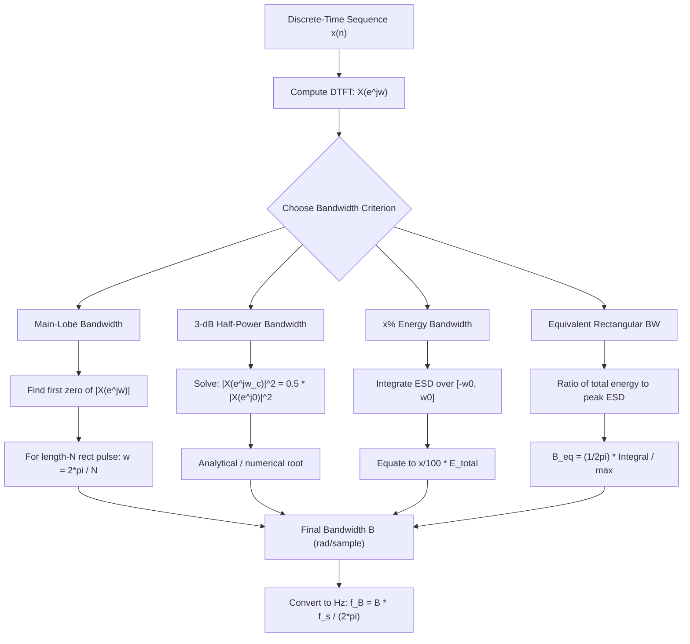
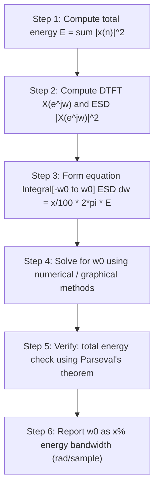
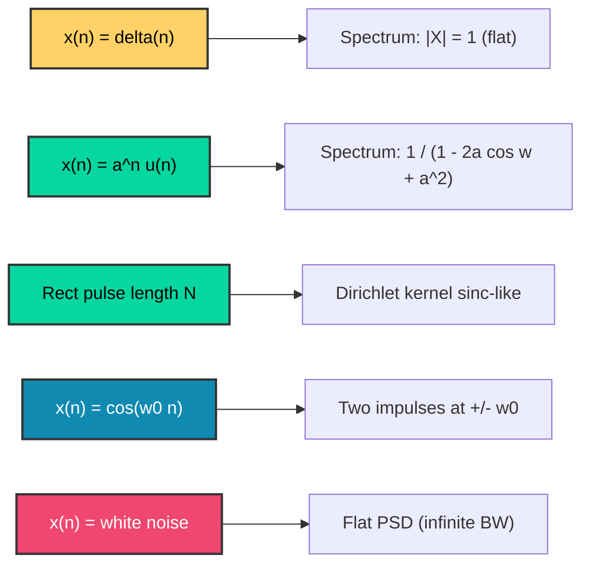

# Bandwidth of Sequences

<!-- SECTION_1_START -->

# Bandwidth of Sequences — Core Definition & Intuitive Overview

## 📘 Formal Definition (KTU 2024 Scheme Aligned)

> [!IMPORTANT]
> **Definition (Band-limited Sequence):** A discrete-time sequence $x(n)$ is called a **band-limited sequence** if its Discrete-Time Fourier Transform (DTFT) $X(e^{j\omega})$ vanishes outside a finite frequency interval, i.e.,
> $$X(e^{j\omega}) = 0, \quad \text{for } \omega_0 < \vert\omega\vert \le \pi$$
> The quantity $\omega_0$ is called the **bandwidth** of the sequence, and the interval $[-\omega_0, \omega_0]$ is called the **band** of the sequence.

The bandwidth of a discrete-time sequence quantifies the **range of digital frequencies** over which the signal contains appreciable energy or information. For finite-energy sequences, the bandwidth is typically defined with respect to a chosen criterion — for instance, the frequency at which the energy spectral density falls to a specified fraction of its peak, or the boundary of the main lobe in the magnitude spectrum.

## 🎯 Intuitive Analogy (Plain English)

Imagine you are listening to music through a speaker:
- **A pure flute tone** has energy concentrated at *one* frequency → its bandwidth is essentially *zero* (a thin spike).
- **A human voice** has energy spread across roughly $300 \text{ Hz} - 3400 \text{ Hz}$ → its bandwidth is about $3.1 \text{ kHz}$.
- **A cymbal crash** has energy smeared across the entire audible spectrum → its bandwidth is essentially *infinite* (noise-like).

In the **discrete-time world**, the spectrum of a sequence is *always periodic* with period $2\pi$ (because $X(e^{j\omega})$ is defined on $-\pi \le \omega \le \pi$, called the **principal period** or **fundamental digital band**). So bandwidth is always measured within this principal period. A sequence whose DTFT is non-zero *only over a sub-interval* of $[-\pi, \pi]$ is called **band-limited**, and the width of that sub-interval is its **bandwidth**.

> [!NOTE]
> **Why does this matter in engineering?**
> - In **digital communications**, bandwidth determines how many users can be packed into a given spectrum.
> - In **audio coding (MP3, AAC)**, perceptually irrelevant high-bandwidth content is removed before compression.
> - In **filter design**, knowing the signal bandwidth is the first step toward choosing a sampling rate (Nyquist criterion: $f_s \ge 2B$).

## 🔑 Key Terminology

| Term | Meaning |
|---|---|
| **Principal Band** | The fundamental interval $[-\pi, \pi]$ rad/sample in which $X(e^{j\omega})$ is defined. |
| **Band-limited sequence** | A sequence whose DTFT is zero outside a finite sub-interval of $[-\pi, \pi]$. |
| **Energy spectral density (ESD)** | $\Phi_x(\omega) = \vert X(e^{j\omega}) \vert^2$. |
| **Energy** | $E = \sum_{n=-\infty}^{\infty} \vert x(n) \vert^2 = \frac{1}{2\pi} \int_{-\pi}^{\pi} \vert X(e^{j\omega}) \vert^2 d\omega$. |
| **3-dB Bandwidth** | The frequency at which ESD drops to half its maximum value (a.k.a. half-power bandwidth). |
| **$x\%$ Energy Bandwidth** | Smallest $\omega_0$ such that the energy in $[-\omega_0, \omega_0]$ is $x\%$ of total energy. |

> [!VISUALIZATION CONTROL]
> **Concept:** Spectrum of an ideal band-limited sequence (lowpass, real-valued).
> **GeoGebra / Desmos Input Equations:**
> * $X(\omega) = 1$ for $\vert \omega \vert \le \omega_0$
> * $X(\omega) = 0$ for $\omega_0 < \vert\omega\vert \le \pi$
> **Visual Description:** Plot $\vert X(\omega) \vert^2$ versus $\omega$ on the x-axis from $-\pi$ to $\pi$. The student should observe a *rectangular plateau* centered at $\omega = 0$ of height $1$ and width $2\omega_0$, dropping to $0$ outside. The bandwidth equals $\omega_0$.

<!-- SECTION_1_END -->

<!-- SECTION_2_START -->

# Deep Theoretical Analysis & KTU High-Yield Formula Sheet

## 🔬 Theoretical Breakdown — Types of Bandwidth for Sequences

### Type 1 — Main-Lobe Bandwidth (Zero-Crossing Bandwidth)

For finite-length, time-limited sequences, the DTFT is **continuous and smooth**, and it exhibits a **lobe structure** with periodic zero-crossings. The **first zero-crossing** on either side of the origin defines the **main-lobe width**.

> **Why does this work?** A finite-duration sequence is the convolution of an infinite sinusoid with a rectangular window in the frequency domain. The rectangular window's Fourier dual is a sinc function — and a sinc has its first zero at a frequency inversely proportional to the time-duration.

### Type 2 — 3-dB Bandwidth (Half-Power Bandwidth)

The frequency $\omega_c$ at which the energy spectral density falls to **half its maximum (DC) value**:
$$\vert X(e^{j\omega_c}) \vert^2 = \frac{1}{2} \vert X(e^{j0}) \vert^2$$
This is widely used because it corresponds to a $3 \text{ dB}$ drop in log-scale.

### Type 3 — $x\%$ Energy Bandwidth (Concentration Bandwidth)

The smallest $\omega_0$ such that the energy concentrated in $[-\omega_0, \omega_0]$ equals $x\%$ of total energy:
$$\frac{1}{2\pi}\int_{-\omega_0}^{\omega_0} \vert X(e^{j\omega}) \vert^2 d\omega = \frac{x}{100} \cdot E_{\text{total}}$$
Common choices: $90\%$, $95\%$, or $99\%$ energy bandwidth.

### Type 4 — Equivalent Rectangular Bandwidth (Noise Bandwidth)

A measure used when comparing signals of different spectral shapes:
$$B_{\text{eq}} = \frac{1}{2\pi} \cdot \frac{\int_{-\pi}^{\pi} \vert X(e^{j\omega}) \vert^2 d\omega}{\max_{\omega} \vert X(e^{j\omega}) \vert^2}$$

## 📋 KTU High-Yield Formula Cheat Sheet

> [!IMPORTANT]
> **All Critical Formulas for Board Examination (2024 Scheme)**

| # | Concept | Formula / Condition | Typical Use |
|---|---|---|---|
| 1 | Total energy of sequence | $E = \sum_{n=-\infty}^{\infty} \vert x(n) \vert^2$ | Parseval's check |
| 2 | Parseval's theorem (DTFT) | $E = \frac{1}{2\pi}\int_{-\pi}^{\pi} \vert X(e^{j\omega}) \vert^2 d\omega$ | Energy in frequency domain |
| 3 | Energy in band $[-\omega_0, \omega_0]$ | $E_B = \frac{1}{2\pi}\int_{-\omega_0}^{\omega_0} \vert X(e^{j\omega}) \vert^2 d\omega$ | Used for $x\%$ bandwidth |
| 4 | Energy spectral density | $\Phi_x(\omega) = \vert X(e^{j\omega}) \vert^2$ | Spectral analysis |
| 5 | Band-limited condition | $X(e^{j\omega}) = 0$ for $\omega_0 < \vert\omega\vert \le \pi$ | Definition of B.L. sequence |
| 6 | Bandwidth of lowpass sequence | $\omega_B = \omega_0$ | Cutoff frequency |
| 7 | 3-dB bandwidth condition | $\vert X(e^{j\omega_c}) \vert^2 = \tfrac{1}{2} \vert X(e^{j0}) \vert^2$ | Half-power point |
| 8 | Main-lobe zero of rectangular pulse of length $N$ | First zero at $\omega = \pm 2\pi/N$ | Finite-length sequences |
| 9 | $x\%$ energy bandwidth equation | $\int_{-\omega_0}^{\omega_0} \Phi_x(\omega) d\omega = \tfrac{x}{100} \cdot 2\pi E$ | Numerical/graphical solution |
| 10 | Sampling-theorem relation | $\omega_s = 2\pi, \quad f_s \ge 2B$ | Link to analog bandwidth |

> **Engineering Utility:** These formulas are the backbone of:
> - **5G/6G spectral mask design** — bandwidth determines chip-rate and sub-carrier spacing.
> - **Medical imaging (MRI, CT)** — readout bandwidth affects SNR.
> - **Audio DSP** — sub-band coding splits audio into sub-bands each of fixed bandwidth.
> - **Radar** — range resolution is inversely proportional to signal bandwidth.

<!-- SECTION_2_END -->

<!-- SECTION_3_START -->

# Step-by-Step Derivations & Symbolic Implementation

## Worked Derivation #1 — Main-Lobe Bandwidth of a Rectangular Pulse

**Problem:** Consider a finite-length causal sequence of length $N$:
$$x(n) = \begin{cases} 1, & 0 \le n \le N-1 \\ 0, & \text{otherwise} \end{cases}$$
Determine the **main-lobe bandwidth** of $x(n)$ (i.e., the location of the first zero-crossing of $\vert X(e^{j\omega}) \vert$).

### Step 1 — Compute the DTFT

We use the geometric-series form of the DTFT:
$$X(e^{j\omega}) = \sum_{n=0}^{N-1} x(n) e^{-j\omega n} = \sum_{n=0}^{N-1} e^{-j\omega n}$$

Applying the closed-form geometric sum identity $\sum_{n=0}^{N-1} r^n = \dfrac{1 - r^N}{1 - r}$ with $r = e^{-j\omega}$:
$$X(e^{j\omega}) = \frac{1 - e^{-j\omega N}}{1 - e^{-j\omega}}$$

### Step 2 — Convert to Sinc Form

Factor $e^{-j\omega N/2}$ from the numerator and $e^{-j\omega/2}$ from the denominator:
$$X(e^{j\omega}) = \frac{e^{-j\omega N/2}\left(e^{j\omega N/2} - e^{-j\omega N/2}\right)}{e^{-j\omega/2}\left(e^{j\omega/2} - e^{-j\omega/2}\right)}$$

Using the identity $e^{j\theta} - e^{-j\theta} = 2j\sin\theta$:
$$X(e^{j\omega}) = e^{-j\omega(N-1)/2} \cdot \frac{\sin(\omega N/2)}{\sin(\omega/2)}$$

### Step 3 — Magnitude Response

$$\vert X(e^{j\omega}) \vert = \left\vert \frac{\sin(\omega N/2)}{\sin(\omega/2)} \right\vert$$

> This is the **Dirichlet kernel** (periodic sinc / aliased sinc) of order $N$.

### Step 4 — Locate the First Zero-Crossing

The numerator $\sin(\omega N/2) = 0$ when:
$$\frac{\omega N}{2} = \pm \pi, \pm 2\pi, \ldots$$

The **smallest non-zero** $\omega$ at which the numerator vanishes (and the denominator does not vanish simultaneously) is:
$$\omega = \pm \frac{2\pi}{N}$$

By symmetry, the main lobe extends from $\omega = -\dfrac{2\pi}{N}$ to $\omega = +\dfrac{2\pi}{N}$.

### Step 5 — Final Bandwidth Result

$$\boxed{\,B_{\text{main-lobe}} = \frac{2\pi}{N} \text{ rad/sample (one-sided) } \;\;\text{or}\;\; \frac{4\pi}{N} \text{ rad/sample (two-sided)}\,}$$

> **Engineering Insight:** As $N$ (the sequence length) increases, the main lobe gets *narrower* — i.e., longer sequences in time have tighter bandwidths in frequency. This is the **time–frequency duality** (uncertainty principle) in action.

---

## Worked Derivation #2 — 3-dB Bandwidth of a One-Sided Exponential Sequence

**Problem:** Find the 3-dB bandwidth of the sequence $x(n) = a^n u(n)$, where $0 < a < 1$.

### Step 1 — DTFT of the Sequence

For the right-sided exponential:
$$X(e^{j\omega}) = \sum_{n=0}^{\infty} a^n e^{-j\omega n} = \sum_{n=0}^{\infty} \left(a e^{-j\omega}\right)^n = \frac{1}{1 - a e^{-j\omega}}, \quad \vert a \vert < 1$$

### Step 2 — Energy Spectral Density

$$\Phi_x(\omega) = \vert X(e^{j\omega}) \vert^2 = \frac{1}{\vert 1 - a e^{-j\omega} \vert^2}$$

Compute the denominator using $\vert 1 - re^{j\theta} \vert^2 = 1 - 2r\cos\theta + r^2$:
$$\vert 1 - a e^{-j\omega} \vert^2 = 1 - 2a\cos\omega + a^2$$

Therefore:
$$\Phi_x(\omega) = \frac{1}{1 - 2a\cos\omega + a^2}$$

### Step 3 — Maximum (DC) Value of $\Phi_x$

$\Phi_x(\omega)$ is maximum when its denominator is minimum. The denominator $1 - 2a\cos\omega + a^2$ is minimum when $\cos\omega$ is maximum, i.e., at $\omega = 0$:
$$\Phi_x(0) = \frac{1}{1 - 2a + a^2} = \frac{1}{(1-a)^2}$$

### Step 4 — Apply the 3-dB Condition

Set $\Phi_x(\omega_c) = \dfrac{1}{2}\Phi_x(0)$:
$$\frac{1}{1 - 2a\cos\omega_c + a^2} = \frac{1}{2(1-a)^2}$$

Cross-multiply:
$$2(1-a)^2 = 1 - 2a\cos\omega_c + a^2$$

Expand $(1-a)^2 = 1 - 2a + a^2$:
$$2(1 - 2a + a^2) = 1 - 2a\cos\omega_c + a^2$$
$$2 - 4a + 2a^2 = 1 - 2a\cos\omega_c + a^2$$

Rearrange to isolate $\cos\omega_c$:
$$2a\cos\omega_c = 1 + a^2 - 2 + 4a - 2a^2 = -1 + 4a - a^2$$
$$\cos\omega_c = \frac{4a - 1 - a^2}{2a} = 2 - \frac{1 + a^2}{2a}$$

### Step 5 — Final 3-dB Bandwidth

$$\boxed{\,\omega_{3\text{-dB}} = \cos^{-1}\!\left(2 - \frac{1 + a^2}{2a}\right) \text{ rad/sample}\,}$$

> **Quick numerical check for $a = 0.5$:**
> $\cos\omega_c = 2 - \dfrac{1.25}{1.0} = 0.75$, hence $\omega_{3\text{-dB}} = \cos^{-1}(0.75) \approx 0.7227 \text{ rad/sample}$.

---

## Symbolic Python Implementation (Type-Hinted, Board-Ready)

```python
"""
bandwidth_of_sequences.py
KTU 2024 Scheme — Module 2 (Discrete) | Signals and Systems (PECST416)
Computes main-lobe bandwidth and 3-dB bandwidth for canonical sequences.
"""

import numpy as np
from numpy.typing import NDArray
from typing import Tuple


def main_lobe_bandwidth_rect(N: int) -> Tuple[float, float]:
    """
    Main-lobe bandwidth (one-sided) of a rectangular pulse of length N.
    Returns (omega_one_sided, omega_two_sided) in rad/sample.
    Raises ValueError if N < 1.
    """
    if N < 1:
        raise ValueError(f"Length N must be >= 1, got {N}")
    omega_one = 2.0 * np.pi / N
    omega_two = 4.0 * np.pi / N
    return omega_one, omega_two


def dtft_magnitude_rect(omega: NDArray[np.float64], N: int) -> NDArray[np.float64]:
    """Magnitude of DTFT of a length-N rectangular pulse at digital frequencies omega."""
    eps = 1e-12
    num = np.sin(0.5 * omega * N)
    den = np.sin(0.5 * omega)
    den = np.where(np.abs(den) < eps, eps, den)  # avoid /0 at omega=0
    return np.abs(num / den)


def three_dB_bandwidth_exponential(a: float) -> float:
    """
    Closed-form 3-dB bandwidth of x(n) = a^n * u(n), 0 < a < 1.
    Returns omega_c in rad/sample. Raises ValueError for invalid 'a'.
    """
    if not (0.0 < a < 1.0):
        raise ValueError(f"a must satisfy 0 < a < 1, got {a}")
    arg = 2.0 - (1.0 + a * a) / (2.0 * a)
    if not (-1.0 <= arg <= 1.0):
        raise ValueError(f"cos argument {arg} out of [-1, 1] for a = {a}")
    return float(np.arccos(arg))


def energy_in_band(omega_grid: NDArray[np.float64],
                   mag2: NDArray[np.float64],
                   omega0: float) -> float:
    """
    Energy in [-omega0, omega0] using trapezoidal integration of |X(e^jw)|^2.
    """
    mask = np.abs(omega_grid) <= omega0
    if not np.any(mask):
        return 0.0
    return float(np.trapz(mag2[mask], omega_grid[mask]))


if __name__ == "__main__":
    # Demonstration runs for KTU board review
    print("=== Main-lobe bandwidth of N=10 rectangular pulse ===")
    bw1, bw2 = main_lobe_bandwidth_rect(10)
    print(f"One-sided bandwidth: {bw1:.4f} rad/sample")
    print(f"Two-sided bandwidth: {bw2:.4f} rad/sample")

    print("\n=== 3-dB bandwidth of x(n) = (0.5)^n u(n) ===")
    bw_3db = three_dB_bandwidth_exponential(0.5)
    print(f"omega_3dB = {bw_3db:.4f} rad/sample "
          f"({np.degrees(bw_3db):.2f} degrees)")
```

<!-- SECTION_3_END -->

<!-- SECTION_4_START -->

# Structural Diagrams & Schematics

## Mermaid Block — Classification of Bandwidth Concepts for Sequences



## Mermaid Block — Sequential Processing Flow for Finding $x\%$ Energy Bandwidth



## Mermaid Block — Spectral Topology of Common Sequences



> [!NOTE]
> **Reading the diagrams:** The colour-coded topology helps the student map each canonical sequence family to its spectral shape and hence identify which bandwidth definition is *most meaningful* for it. For instance, the **Dirichlet kernel** (rectangular pulse) is best characterised by its **main-lobe bandwidth** $2\pi/N$, whereas a **one-sided exponential** is best characterised by its **3-dB bandwidth**.

<!-- SECTION_4_END -->

<!-- SECTION_5_START -->

# KTU 2024 Scheme Examination Question Bank & Topic Recap

---

## 📝 Part A — Short Answer Questions (2 × 3 = 6 Marks)

### **Q1.** `[KTU University Exam — July 2024]`
Define a **band-limited sequence**. Mention the condition that must be satisfied by its DTFT for it to be classified as lowpass band-limited.

**Course Outcome:** CO1 | **RBT Level:** Remember | **Marks:** 3

#### ✅ Model Answer (3 Marks)

A discrete-time sequence $x(n)$ is called a **band-limited sequence** if its Discrete-Time Fourier Transform $X(e^{j\omega})$ is non-zero only over a *finite* sub-interval of the principal period $[-\pi, \pi]$ and zero everywhere else within that principal period.

> **[Mark 1]** For a lowpass band-limited sequence, the condition is:
> $$X(e^{j\omega}) = \begin{cases} \neq 0, & \vert\omega\vert \le \omega_c \\ 0, & \omega_c < \vert\omega\vert \le \pi \end{cases}$$

> **[Mark 1]** The quantity $\omega_c$ is called the **bandwidth** of the lowpass sequence. The spectrum is a *rectangular pulse* of width $2\omega_c$ centred at $\omega = 0$.

> **[Mark 1]** A pure sinusoid $\cos(\omega_0 n)$ is also band-limited because its DTFT contains impulses only at $\omega = \pm \omega_0$ — so the bandwidth is $\omega_0$.

---

### **Q2.** `[KTU University Exam — Dec 2023]`
State and explain **Parseval's theorem** for discrete-time energy signals. How is it used to compute the **bandwidth of a sequence** in terms of the energy in a frequency band?

**Course Outcome:** CO1, CO2 | **RBT Level:** Understand | **Marks:** 3

#### ✅ Model Answer (3 Marks)

> **[Mark 1]** **Statement:** For an energy signal $x(n)$ with DTFT $X(e^{j\omega})$,
> $$E = \sum_{n=-\infty}^{\infty} \vert x(n) \vert^2 = \frac{1}{2\pi}\int_{-\pi}^{\pi} \vert X(e^{j\omega}) \vert^2 d\omega$$

> **[Mark 1]** **Explanation:** The theorem equates the energy computed in the *time domain* (left side) to the energy computed in the *frequency domain* (right side), with $\vert X(e^{j\omega}) \vert^2$ being the **energy spectral density** (ESD).

> **[Mark 1]** **Use in bandwidth computation:** The energy concentrated in a band $[-\omega_0, \omega_0]$ is
> $$E_B = \frac{1}{2\pi}\int_{-\omega_0}^{\omega_0} \vert X(e^{j\omega}) \vert^2 d\omega$$
> To find the **$x\%$ energy bandwidth**, we solve $E_B / E = x/100$ for $\omega_0$. This is a standard numerical / graphical problem in the KTU exam.

---

## 📝 Part B — Long Answer Questions (Internal Choice) (1 × 14 = 14 Marks)

### **Q3A.** `[KTU University Exam — July 2024]`
**(a) [7 Marks]** For the rectangular sequence
$$x(n) = \begin{cases} 1, & 0 \le n \le N-1 \\ 0, & \text{otherwise} \end{cases}$$
derive the expression for its DTFT and hence determine the **main-lobe bandwidth**.

**(b) [7 Marks]** A discrete-time signal $x(n) = (0.5)^n u(n)$ is passed through an ideal lowpass digital filter. Determine the **3-dB bandwidth** of this signal. State the result in both rad/sample and Hz, assuming a sampling frequency of $f_s = 8 \text{ kHz}$.

**Course Outcome:** CO2, CO3 | **RBT Level:** Apply, Analyze | **Total Marks:** 14

#### ✅ Model Solution

### Part (a) — Main-Lobe Bandwidth of Rectangular Pulse [7 Marks]

**Step 1 — DTFT Computation [2 Marks]**
$$X(e^{j\omega}) = \sum_{n=0}^{N-1} e^{-j\omega n} = \frac{1 - e^{-j\omega N}}{1 - e^{-j\omega}}$$

**Step 2 — Sinc Form [2 Marks]**
Factor $e^{-j\omega N/2}$ from numerator and $e^{-j\omega/2}$ from denominator:
$$X(e^{j\omega}) = e^{-j\omega(N-1)/2} \cdot \frac{\sin(\omega N/2)}{\sin(\omega/2)}$$

**Step 3 — Magnitude and First Zero [2 Marks]**
$$\vert X(e^{j\omega}) \vert = \left\vert \frac{\sin(\omega N/2)}{\sin(\omega/2)} \right\vert$$
The numerator $\sin(\omega N/2) = 0$ at $\omega = \pm 2\pi/N, \pm 4\pi/N, \ldots$
The smallest non-zero root gives the main-lobe boundary.

**Step 4 — Final Bandwidth [1 Mark]**
$$\boxed{B_{\text{main-lobe}} = \frac{2\pi}{N} \text{ rad/sample (one-sided)}}$$

---

### Part (b) — 3-dB Bandwidth of Exponential [7 Marks]

**Step 1 — DTFT [1 Mark]**
$$X(e^{j\omega}) = \frac{1}{1 - 0.5 e^{-j\omega}}$$

**Step 2 — ESD [1 Mark]**
$$\Phi_x(\omega) = \vert X(e^{j\omega}) \vert^2 = \frac{1}{1 - \cos\omega + 0.25} = \frac{1}{1.25 - \cos\omega}$$

**Step 3 — DC value [1 Mark]**
$$\Phi_x(0) = \frac{1}{1.25 - 1} = \frac{1}{0.25} = 4$$

**Step 4 — 3-dB condition [2 Marks]**
$$\frac{1}{1.25 - \cos\omega_c} = \frac{4}{2} = 2 \;\;\Rightarrow\;\; 1.25 - \cos\omega_c = 0.5$$
$$\cos\omega_c = 0.75 \;\;\Rightarrow\;\; \omega_c = \cos^{-1}(0.75) \approx 0.7227 \text{ rad/sample}$$

**Step 5 — Convert to Hz [2 Marks]**
Using $\omega = 2\pi f / f_s$:
$$f_c = \frac{\omega_c \cdot f_s}{2\pi} = \frac{0.7227 \times 8000}{2\pi} \approx 920.2 \text{ Hz}$$

**Final Answer:**
$$\boxed{\omega_{3\text{-dB}} \approx 0.7227 \text{ rad/sample} \;\;\text{or}\;\; f_{3\text{-dB}} \approx 920.2 \text{ Hz}}$$

> **Incremental Valuation Key:** [DTFT derivation: 1 Mark] | [ESD expression: 1 Mark] | [DC peak: 1 Mark] | [3-dB equation: 2 Marks] | [Numerical evaluation: 1 Mark] | [Hz conversion: 1 Mark].

---

### **Q3B. (Alternative Choice — 14 Marks)** `[KTU University Exam — Dec 2023]`
**(a) [7 Marks]** Define the **3-dB bandwidth** and the **$x\%$ energy bandwidth** of a discrete-time sequence. Using the energy spectral density, derive the condition under which a sequence is classified as **lowpass band-limited**.

**(b) [7 Marks]** A sequence $x(n)$ has DTFT $X(e^{j\omega}) = \dfrac{1}{1 - 0.8 e^{-j\omega}}$. Compute its **3-dB bandwidth** in rad/sample and the corresponding analog frequency in Hz when sampled at $f_s = 10 \text{ kHz}$.

**Course Outcome:** CO1, CO2, CO3 | **RBT Level:** Apply, Analyze

#### ✅ Model Solution

### Part (a) [7 Marks]

> **[Mark 1]** **3-dB bandwidth:** The frequency $\omega_c$ at which $\vert X(e^{j\omega_c}) \vert^2 = \frac{1}{2} \vert X(e^{j0}) \vert^2$.

> **[Mark 1]** **$x\%$ Energy Bandwidth:** Smallest $\omega_0$ such that
> $$\frac{1}{2\pi}\int_{-\omega_0}^{\omega_0} \vert X(e^{j\omega}) \vert^2 d\omega = \frac{x}{100} \cdot E_{\text{total}}$$

> **[Marks 2–3]** **Lowpass band-limited condition:** A sequence is lowpass band-limited if its ESD satisfies:
> $$\Phi_x(\omega) = \begin{cases} \neq 0, & \vert\omega\vert \le \omega_c \\ = 0, & \omega_c < \vert\omega\vert \le \pi \end{cases}$$
> Equivalently, $X(e^{j\omega}) = 0$ outside $[-\omega_c, \omega_c]$. The bandwidth is $\omega_c$.

> **[Marks 1–2]** **Derivation from energy integral:** Total energy in the principal band equals the energy in the passband:
> $$\frac{1}{2\pi}\int_{-\pi}^{\pi} \Phi_x(\omega) d\omega = \frac{1}{2\pi}\int_{-\omega_c}^{\omega_c} \Phi_x(\omega) d\omega$$
> The remaining interval $(\omega_c, \pi]$ contributes zero energy.

---

### Part (b) [7 Marks]

**Step 1 — DTFT given:** $X(e^{j\omega}) = \dfrac{1}{1 - 0.8 e^{-j\omega}}$ → identify $a = 0.8$. [1 Mark]

**Step 2 — ESD:** $\Phi_x(\omega) = \dfrac{1}{1 - 1.6\cos\omega + 0.64} = \dfrac{1}{1.64 - 1.6\cos\omega}$ [1 Mark]

**Step 3 — DC value:** $\Phi_x(0) = \dfrac{1}{1.64 - 1.6} = \dfrac{1}{0.04} = 25$ [1 Mark]

**Step 4 — 3-dB condition:** $\Phi_x(\omega_c) = 12.5$ → $1.64 - 1.6\cos\omega_c = 0.08$ → $\cos\omega_c = 0.975$ [2 Marks]

**Step 5 — Solve:** $\omega_c = \cos^{-1}(0.975) \approx 0.2233$ rad/sample [1 Mark]

**Step 6 — Analog frequency:** $f_c = \dfrac{0.2233 \times 10000}{2\pi} \approx 355.4 \text{ Hz}$ [1 Mark]

**Final Answer:**
$$\boxed{\omega_{3\text{-dB}} \approx 0.2233 \text{ rad/sample}, \quad f_{3\text{-dB}} \approx 355.4 \text{ Hz}}$$

---

## ⚠️ KTU Examiner's Valuation Warning

> [!WARNING]
> **Common Pitfalls (Lose Marks Here):**
> 1. **Forgetting the $1/(2\pi)$ factor** in Parseval's theorem — this is a 1-mark deduction *every time* it is missed. Always write the full integral.
> 2. **Mixing up one-sided and two-sided bandwidth.** For a lowpass signal symmetric about $\omega = 0$, the *two-sided* bandwidth is $2\omega_c$ and the *one-sided* is $\omega_c$. State explicitly which is being asked.
> 3. **Not converting rad/sample to Hz** when the problem specifies a sampling frequency $f_s$. Use $f = \omega f_s / (2\pi)$, not $f = \omega f_s$.
> 4. **Confusing energy spectral density with power spectral density.** Energy signals have an ESD, power signals have a PSD. Sequences of finite length are *energy* signals.
> 5. **Skipping the boundary check** on $\cos\omega_c$. If the computed $\cos\omega_c$ is outside $[-1, 1]$, the assumption of a real 3-dB point is invalid — go back and check $a$.

---

## 🔁 Topic Recap & Important Things to Remember

- **Band-limited sequence:** DTFT vanishes outside a finite sub-interval of $[-\pi, \pi]$.
- **Bandwidth** $\omega_B$ = width of the band where the DTFT is non-zero.
- **Main-lobe bandwidth** of a length-$N$ rectangular pulse: $\omega_B = 2\pi/N$ (one-sided).
- **3-dB bandwidth** is the half-power point: $\vert X(e^{j\omega_c}) \vert^2 = \tfrac{1}{2} \vert X(e^{j0}) \vert^2$.
- **$x\%$ Energy bandwidth** solves: $\int_{-\omega_0}^{\omega_0} \vert X(e^{j\omega}) \vert^2 d\omega = (x/100) \cdot 2\pi E$.
- **Parseval's theorem:** $E = \sum_n \vert x(n) \vert^2 = \frac{1}{2\pi} \int_{-\pi}^{\pi} \vert X(e^{j\omega}) \vert^2 d\omega$.
- **ESD:** $\Phi_x(\omega) = \vert X(e^{j\omega}) \vert^2$ — must integrate to $2\pi E$ over $[-\pi, \pi]$.
- **Conversion:** $f = \omega f_s / (2\pi)$, where $f_s$ is the sampling rate.
- **Time–frequency duality:** Longer sequences (large $N$) ⇒ narrower main lobes ⇒ smaller bandwidth.
- **Total energy of $x(n) = a^n u(n)$:** $E = 1 / (1 - a^2)$.
- **ESD of $x(n) = a^n u(n)$:** $\Phi_x(\omega) = 1 / (1 - 2a\cos\omega + a^2)$.
- **Board tip:** Always begin a bandwidth problem by (1) writing the DTFT, (2) forming the ESD, and (3) explicitly stating which criterion is being applied.

<!-- SECTION_5_END -->
