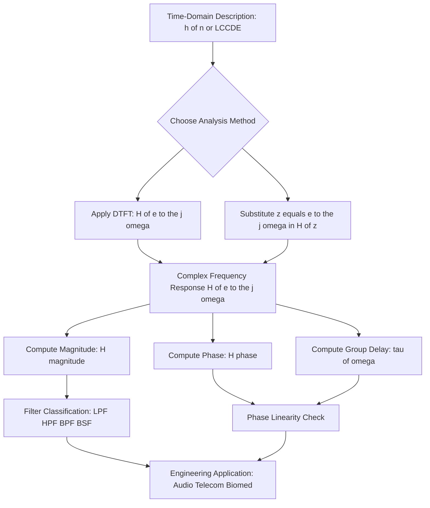
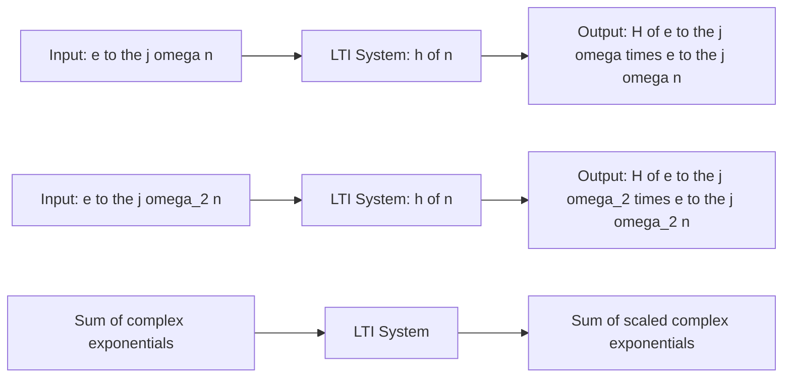
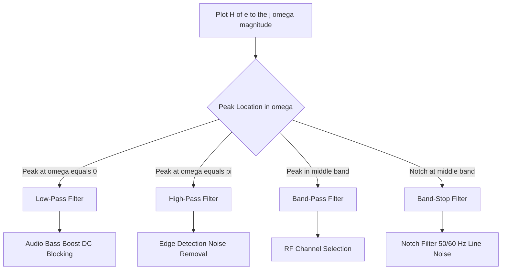

# Characterizing LTI Systems Using the Fourier Transform.

<!-- SECTION_1_START -->
# Characterizing LTI Systems Using the Fourier Transform

## 1. Core Technical Definition & Intuitive Overview

### Formal Definition (KTU 2024 Syllabus Terminology)
For a **Linear Time-Invariant (LTI) Discrete-Time system** characterized by an impulse response $h[n]$, the **Fourier Transform** of the impulse response defines the **Frequency Response** of the system. It is mathematically given by:

$$
H(e^{j\omega}) = \sum_{n=-\infty}^{\infty} h[n] \, e^{-j\omega n}
$$

The Fourier Transform exists (in the **convergence** sense) only if $h[n]$ is **absolutely summable**, i.e., $\sum_{n=-\infty}^{\infty} \vert h[n] \vert < \infty$, which is equivalent to saying the system is **Bounded-Input Bounded-Output (BIBO) stable**.

> [!IMPORTANT]
> **Key Insight (KTU Board Favourite):** $H(e^{j\omega})$ is an **eigenfunction** of any LTI system. Complex exponentials $e^{j\omega n}$ pass through an LTI system and emerge scaled by $H(e^{j\omega})$ — they are unchanged in frequency, only in amplitude/phase. This is the central pillar of frequency-domain analysis.

### Conceptual Analogy / Intuition
Imagine the LTI system as a **musical equalizer (EQ)**. Each input frequency $e^{j\omega n}$ is like a "note" entering the equalizer. The equalizer's sliders decide how much each note gets **amplified or attenuated** (magnitude $\vert H(e^{j\omega}) \vert$) and how much its **timing gets shifted** (phase $\angle H(e^{j\omega})$). The complete curve of slider positions across all frequencies is exactly the **frequency response $H(e^{j\omega})$**.

> [!NOTE]
> **Syllabus Highlight:** The frequency response is always **periodic in $\omega$ with period $2\pi$** because $H(e^{j(\omega + 2\pi)}) = H(e^{j\omega})$ (a direct consequence of discrete-time sampling). This is a marked departure from the continuous-time case where the response is aperiodic.

### Visualization: Magnitude and Phase Spectrum
> [!VISUALIZATION CONTROL]
> **Concept:** Typical Magnitude and Phase plot of a discrete-time LPF
> **GeoGebra / Desmos Input Equations:**
> * $H\_mag(x) = \frac{1}{\sqrt{1.5^2 - 2 \cdot 1.5 \cdot 0.9 \cdot \cos(x) + 0.9^2}}$
> * $H\_phase(x) = -\arctan\left(\frac{-1.5 \cdot 0.9 \cdot \sin(x)}{1 - 1.5 \cdot 0.9 \cdot \cos(x)}\right)$
> **Visual Description:** Students should observe a low-pass shape — magnitude peaks at $\omega = 0$ and rolls off near $\omega = \pi$. The phase plot is piecewise linear, characteristic of a system with constant group delay.
<!-- SECTION_1_END -->

<!-- SECTION_2_START -->
# 2. Deep Theoretical Analysis & KTU High-Yield Formula Sheet

## 2.1 Why Fourier Transform Characterizes LTI Systems

For an LTI system with impulse response $h[n]$ and input $x[n]$, the output is given by the **convolution sum**:

$$
y[n] = \sum_{k=-\infty}^{\infty} x[k] \, h[n-k] = (x * h)[n]
$$

Applying the Fourier Transform to both sides and using the **Convolution Theorem**:

$$
Y(e^{j\omega}) = X(e^{j\omega}) \cdot H(e^{j\omega})
$$

This single equation is the **crown jewel** of LTI analysis. It states that **convolution in time becomes multiplication in frequency**.

### Eigenfunction Property Derivation
Let the input be $x[n] = e^{j\omega n}$. Then:

$$
\begin{aligned}
y[n] &= \sum_{k=-\infty}^{\infty} h[k] \, e^{j\omega(n-k)} \\
     &= e^{j\omega n} \sum_{k=-\infty}^{\infty} h[k] \, e^{-j\omega k} \\
     &= H(e^{j\omega}) \cdot e^{j\omega n}
\end{aligned}
$$

The output is the **same complex exponential** scaled by the complex number $H(e^{j\omega})$. Hence, $e^{j\omega n}$ is an **eigenfunction** and $H(e^{j\omega})$ is the corresponding **eigenvalue**.

## 2.2 Magnitude and Phase Response

The complex frequency response can be decomposed into:

$$
H(e^{j\omega}) = \vert H(e^{j\omega}) \vert \, e^{j \angle H(e^{j\omega})}
$$

* **Magnitude Response** $\vert H(e^{j\omega}) \vert$ — Controls amplitude scaling at each frequency.
* **Phase Response** $\angle H(e^{j\omega})$ — Controls time-shift/delay applied to each frequency component.

## 2.3 Group Delay and Phase Delay

**Phase Delay** $\tau_p(\omega) = -\dfrac{\angle H(e^{j\omega})}{\omega}$

**Group Delay** $\tau_g(\omega) = -\dfrac{d}{d\omega} \angle H(e^{j\omega})$

> [!NOTE]
> A system is said to have **Linear Phase** if $\angle H(e^{j\omega}) = -\alpha \omega$ for some constant $\alpha$, meaning $\tau_g(\omega) = \alpha$ is a constant. Linear phase systems preserve the **shape** of the input signal (only delay it). This is crucial in **data communication** and **image processing** where waveform distortion is unacceptable.

## 2.4 LTI Systems as Frequency-Selective Filters

| Filter Type | Passband | Stopband |
| :--- | :--- | :--- |
| **Low-Pass Filter (LPF)** | $\vert \omega \vert < \omega_c$ | $\omega_c < \vert \omega \vert \le \pi$ |
| **High-Pass Filter (HPF)** | $\omega_c < \vert \omega \vert \le \pi$ | $\vert \omega \vert < \omega_c$ |
| **Band-Pass Filter (BPF)** | $\omega_1 < \vert \omega \vert < \omega_2$ | Elsewhere |
| **Band-Stop Filter (BSF)** | $\vert \omega \vert < \omega_1$ and $\vert \omega \vert > \omega_2$ | $\omega_1 < \vert \omega \vert < \omega_2$ |

## 2.5 KTU Formula Sheet / Cheat Sheet

| Concept | Formula | Units / Notes |
| :--- | :--- | :--- |
| Frequency Response | $H(e^{j\omega}) = \sum_{n=-\infty}^{\infty} h[n] e^{-j\omega n}$ | Complex-valued, period $2\pi$ |
| Existence Condition | $\sum \vert h[n] \vert < \infty$ | Equivalent to BIBO stability |
| Convolution Theorem | $Y(e^{j\omega}) = X(e^{j\omega}) H(e^{j\omega})$ | Time-convolution $\Leftrightarrow$ Freq-multiplication |
| Modulation Theorem | $x[n] e^{j\omega_0 n} \xrightarrow{\mathcal{F}} X(e^{j(\omega - \omega_0)})$ | Multiplication in time $\Leftrightarrow$ Shift in frequency |
| Magnitude | $\vert H(e^{j\omega}) \vert$ | Real, non-negative, even function |
| Phase | $\angle H(e^{j\omega})$ | Odd function of $\omega$ |
| Group Delay | $\tau_g(\omega) = -\frac{d\angle H(e^{j\omega})}{d\omega}$ | Samples; constant $\Rightarrow$ linear phase |
| Phase Delay | $\tau_p(\omega) = -\frac{\angle H(e^{j\omega})}{\omega}$ | Samples |
| Rational System | $H(e^{j\omega}) = \frac{\sum_{k=0}^{M} b_k e^{-j\omega k}}{\sum_{k=0}^{N} a_k e^{-j\omega k}}$ | From linear constant-coeff difference eqn |
| LCCDE Relation | $\sum_{k=0}^{N} a_k y[n-k] = \sum_{k=0}^{M} b_k x[n-k]$ | Apply DTFT to get $H(e^{j\omega})$ |

## 2.6 Real-World Engineering Utility

* **Audio Engineering:** Graphic equalizers in music players are direct implementations of the magnitude response $\vert H(e^{j\omega}) \vert$.
* **Telecommunications:** Band-pass filters isolate specific RF channels; linear-phase filters prevent **inter-symbol interference (ISI)** in digital modems.
* **Biomedical Signal Processing:** ECG/EEG filters (typically LPFs and BSFs) extract heart/brain signals from noise.
* **Image Processing:** 2D filters use these same principles across spatial frequencies.
<!-- SECTION_2_END -->

<!-- SECTION_3_START -->
# 3. Step-by-Step Derivations & Code/Symbolic Implementation

## 3.1 Derivation: Frequency Response of an LCCDE System

Consider a Linear Constant-Coefficient Difference Equation (LCCDE):

$$
\sum_{k=0}^{N} a_k y[n-k] = \sum_{k=0}^{M} b_k x[n-k]
$$

**Step 1:** Apply the Discrete-Time Fourier Transform to both sides. Use the **time-shift property**: $x[n-k] \xrightarrow{\mathcal{F}} e^{-j\omega k} X(e^{j\omega})$.

$$
\begin{aligned}
\mathcal{F}\left\{\sum_{k=0}^{N} a_k y[n-k]\right\} &= \mathcal{F}\left\{\sum_{k=0}^{M} b_k x[n-k]\right\}
\end{aligned}
$$

**Step 2:** Factor out $Y(e^{j\omega})$ and $X(e^{j\omega})$:

$$
\begin{aligned}
Y(e^{j\omega}) \sum_{k=0}^{N} a_k e^{-j\omega k} &= X(e^{j\omega}) \sum_{k=0}^{M} b_k e^{-j\omega k}
\end{aligned}
$$

**Step 3:** Solve for the frequency response $H(e^{j\omega}) = \dfrac{Y(e^{j\omega})}{X(e^{j\omega})}$:

$$
H(e^{j\omega}) = \frac{\sum_{k=0}^{M} b_k e^{-j\omega k}}{\sum_{k=0}^{N} a_k e^{-j\omega k}}
$$

> [!IMPORTANT]
> **KTU Exam Tip:** When the LCCDE is given, never solve for $h[n]$ via $z$-transform partial fractions if the question only asks for $H(e^{j\omega})$. Substituting $z = e^{j\omega}$ directly into the system function $H(z)$ is the fastest method.

## 3.2 Worked Example: Computing Magnitude and Phase

**Problem:** Find $H(e^{j\omega})$ for the LCCDE: $y[n] - 0.5 y[n-1] = x[n]$.

**Step 1:** Apply DTFT. The shift property gives $y[n-1] \leftrightarrow e^{-j\omega} Y(e^{j\omega})$:

$$
\begin{aligned}
Y(e^{j\omega}) - 0.5 e^{-j\omega} Y(e^{j\omega}) &= X(e^{j\omega})
\end{aligned}
$$

**Step 2:** Factor:

$$
\begin{aligned}
Y(e^{j\omega})\left[1 - 0.5 e^{-j\omega}\right] &= X(e^{j\omega})
\end{aligned}
$$

**Step 3:** Solve for $H$:

$$
H(e^{j\omega}) = \frac{1}{1 - 0.5 e^{-j\omega}}
$$

**Step 4:** Multiply numerator and denominator by the conjugate $1 - 0.5 e^{j\omega}$:

$$
\begin{aligned}
H(e^{j\omega}) &= \frac{1 - 0.5 e^{j\omega}}{(1 - 0.5 e^{-j\omega})(1 - 0.5 e^{j\omega})}
\end{aligned}
$$

**Step 5:** Expand the denominator:

$$
\begin{aligned}
(1 - 0.5 e^{-j\omega})(1 - 0.5 e^{j\omega}) &= 1 - 0.5 e^{j\omega} - 0.5 e^{-j\omega} + 0.25 e^{j\omega} e^{-j\omega} \\
&= 1 - \cos(\omega) + 0.25
\end{aligned}
$$

**Step 6:** Final forms:

$$
H(e^{j\omega}) = \frac{1 - 0.5 \cos(\omega) + j \, 0.5 \sin(\omega)}{1.25 - \cos(\omega)}
$$

**Magnitude:**

$$
\vert H(e^{j\omega}) \vert = \frac{1}{\sqrt{1.25 - \cos(\omega)}}
$$

**Phase:**

$$
\angle H(e^{j\omega}) = -\arctan\left(\frac{0.5 \sin(\omega)}{1 - 0.5 \cos(\omega)}\right)
$$

**Group Delay:**

$$
\tau_g(\omega) = \frac{0.5 \cos(\omega) - 0.25}{1.25 - \cos(\omega)}
$$

## 3.3 Python Code: Numerical Evaluation of Frequency Response

```python
import numpy as np
import matplotlib.pyplot as plt

def frequency_response_lccde(b_coeffs, a_coeffs, num_points=512):
    """
    Compute H(e^{j omega}) from LCCDE coefficients using vectorized NumPy.
    
    Parameters
    ----------
    b_coeffs : np.ndarray
        Numerator coefficients (b_0, b_1, ..., b_M).
    a_coeffs : np.ndarray
        Denominator coefficients (a_0, a_1, ..., a_N).
    num_points : int
        Number of frequency samples in [0, pi].
    
    Returns
    -------
    omega : np.ndarray
        Frequency vector in radians/sample.
    H : np.ndarray
        Complex frequency response.
    """
    omega = np.linspace(0, np.pi, num_points, dtype=np.float64)
    
    # Pre-compute the polynomial terms: sum_k c_k * e^{-j omega k}
    # Numerator polynomial
    num_poly = np.zeros_like(omega, dtype=np.complex128)
    for k, b_k in enumerate(b_coeffs):
        num_poly += b_k * np.exp(-1j * omega * k)
    
    # Denominator polynomial
    den_poly = np.zeros_like(omega, dtype=np.complex128)
    for k, a_k in enumerate(a_coeffs):
        den_poly += a_k * np.exp(-1j * omega * k)
    
    # Avoid divide-by-zero (rare but possible at resonant zeros)
    if np.any(np.abs(den_poly) < 1e-12):
        raise ZeroDivisionError("Denominator polynomial crosses zero on the unit circle.")
    
    H = num_poly / den_poly
    return omega, H


def plot_response(omega, H, title="Frequency Response"):
    """Plot magnitude (dB) and phase (radians) on a single figure."""
    magnitude_db = 20.0 * np.log10(np.abs(H) + 1e-15)
    phase_rad = np.unwrap(np.angle(H))
    
    fig, (ax1, ax2) = plt.subplots(2, 1, figsize=(8, 6), sharex=True)
    ax1.plot(omega / np.pi, magnitude_db, color='navy', linewidth=1.8)
    ax1.set_ylabel("Magnitude (dB)")
    ax1.set_title(title)
    ax1.grid(True, alpha=0.3)
    
    ax2.plot(omega / np.pi, phase_rad, color='crimson', linewidth=1.8)
    ax2.set_xlabel("Normalized Frequency (x pi rad/sample)")
    ax2.set_ylabel("Phase (radians)")
    ax2.grid(True, alpha=0.3)
    plt.tight_layout()
    plt.show()


# Example: y[n] - 0.5 y[n-1] = x[n]   (LPF)
b = np.array([1.0])
a = np.array([1.0, -0.5])
omega, H = frequency_response_lccde(b, a)
plot_response(omega, H, "LPF: y[n] - 0.5 y[n-1] = x[n]")
```

## 3.4 Worked Example: Using Convolution Theorem for Output Spectrum

**Problem:** Input $x[n] = \cos(0.5\pi n)$ is applied to a system with $h[n] = (0.5)^n u[n]$. Find the steady-state output.

**Step 1:** Find the input spectrum. A cosine has two impulses in DTFT:

$$
X(e^{j\omega}) = \pi \sum_{k=-\infty}^{\infty} \left[\delta(\omega - 0.5\pi - 2\pi k) + \delta(\omega + 0.5\pi - 2\pi k)\right]
$$

**Step 2:** Find the system frequency response:

$$
H(e^{j\omega}) = \sum_{n=0}^{\infty} (0.5)^n e^{-j\omega n} = \frac{1}{1 - 0.5 e^{-j\omega}}
$$

**Step 3:** Evaluate at $\omega = 0.5\pi$:

$$
H(e^{j0.5\pi}) = \frac{1}{1 - 0.5 e^{-j0.5\pi}} = \frac{1}{1 - 0.5(\cos(0.5\pi) - j\sin(0.5\pi))} = \frac{1}{1 + j0.5}
$$

**Step 4:** Magnitude and phase:

$$
\vert H(e^{j0.5\pi}) \vert = \frac{1}{\sqrt{1 + 0.25}} = \frac{1}{\sqrt{1.25}} = \frac{2}{\sqrt{5}}
$$

$$
\angle H(e^{j0.5\pi}) = -\arctan(0.5)
$$

**Step 5:** The output is the input scaled by the response at that frequency:

$$
y_{ss}[n] = \frac{2}{\sqrt{5}} \cos\left(0.5\pi n - \arctan(0.5)\right)
$$
<!-- SECTION_3_END -->

<!-- SECTION_4_START -->
# 4. Structural Diagrams & Schematics

## 4.1 LTI System Characterization Flow (Mermaid)



## 4.2 Eigenfunction Property Block Diagram



## 4.3 Convolution Theorem Modulation Theorem Dual Pathway

```mermaid
subgraph Time Domain
    X1[Input Signal x of n] --> CONV[Convolution with h of n]
    H1[Impulse Response h of n] --> CONV
    CONV --> Y1[Output y of n]
end

subgraph Frequency Domain
    X2[Input Spectrum X of e to the j omega] --> MUL[Multiplication]
    H2[Frequency Response H of e to the j omega] --> MUL
    MUL --> Y2[Output Spectrum Y of e to the j omega]
end
```

## 4.4 Filter Type Decision Topology


<!-- SECTION_4_END -->

<!-- SECTION_5_START -->
# 5. KTU 2024 Scheme Examination Question Bank & Topic Recap

## Part A Questions (3 Marks Each)

### Q1. `[KTU University Exam - July 2024]` | **CO2** | **Remember**
State the condition for the existence of the Discrete-Time Fourier Transform of an LTI system's impulse response.

**Model Answer (3 Marks):**
The DTFT of $h[n]$ exists if the impulse response is **absolutely summable**, i.e.,

$$
\sum_{n=-\infty}^{\infty} \vert h[n] \vert < \infty
$$

This is the necessary and sufficient condition for the **BIBO stability** of the LTI system. **[1 Mark]**
Mathematically, the frequency response is defined as $H(e^{j\omega}) = \sum_{n=-\infty}^{\infty} h[n] e^{-j\omega n}$. **[1 Mark]**
The implication is that absolutely summable $h[n]$ guarantees the Fourier series of $H(e^{j\omega})$ converges uniformly. **[1 Mark]**

### Q2. `[KTU University Exam - Dec 2023]` | **CO2** | **Understand**
Define the **group delay** of an LTI system and explain its significance.

**Model Answer (3 Marks):**
Group delay is defined as the negative derivative of the phase response with respect to frequency:

$$
\tau_g(\omega) = -\frac{d}{d\omega} \angle H(e^{j\omega})
$$

**[1 Mark for formula]**
Physically, it represents the **time delay experienced by the envelope of a narrowband signal** centered at frequency $\omega$ as it passes through the system. **[1 Mark]**
A **constant group delay** across all frequencies corresponds to **linear phase**, which means all frequency components of a signal are delayed by the same amount, thereby preserving the signal's shape. This is critical in data transmission and pulse-shaping applications. **[1 Mark]**

---

## Part B Questions (14 Marks Each) — Module Internal Choice

### Question A (14 Marks) `[KTU University Exam - July 2024]` | **CO2, CO3** | **Apply, Analyze**

Consider an LTI system described by the difference equation:
$$y[n] - 0.8 y[n-1] = x[n] + 0.5 x[n-1]$$

#### (a) Determine the frequency response $H(e^{j\omega})$ of the system. (7 Marks) | **Apply**

**Step-by-Step Model Solution:**

**Step 1:** Apply DTFT to both sides. Using $x[n-k] \leftrightarrow e^{-j\omega k} X(e^{j\omega})$:

$$
Y(e^{j\omega}) - 0.8 e^{-j\omega} Y(e^{j\omega}) = X(e^{j\omega}) + 0.5 e^{-j\omega} X(e^{j\omega})
$$

**[Writing the transformed equation: 2 Marks]**

**Step 2:** Factor:

$$
Y(e^{j\omega})\left[1 - 0.8 e^{-j\omega}\right] = X(e^{j\omega})\left[1 + 0.5 e^{-j\omega}\right]
$$

**[Factoring: 1 Mark]**

**Step 3:** Solve:

$$
H(e^{j\omega}) = \frac{1 + 0.5 e^{-j\omega}}{1 - 0.8 e^{-j\omega}}
$$

**[Final $H(e^{j\omega})$ expression: 2 Marks]**

**Step 4:** Substitute $e^{-j\omega} = \cos(\omega) - j\sin(\omega)$ to express in rectangular form:

$$
H(e^{j\omega}) = \frac{1 + 0.5\cos(\omega) - j \, 0.5\sin(\omega)}{1 - 0.8\cos(\omega) + j \, 0.8\sin(\omega)}
$$

**[Polar/rectangular breakdown: 1 Mark]**

**Step 5:** Compute magnitude:

$$
\vert H(e^{j\omega}) \vert = \frac{\sqrt{[1 + 0.5\cos(\omega)]^2 + [0.5\sin(\omega)]^2}}{\sqrt{[1 - 0.8\cos(\omega)]^2 + [0.8\sin(\omega)]^2}}
$$

**[Magnitude: 1 Mark]**

#### (b) Determine the magnitude response at $\omega = 0$ and $\omega = \pi$, and classify the filter type. (7 Marks) | **Analyze**

**Step 1:** At $\omega = 0$: $\cos(0) = 1$, $\sin(0) = 0$.

$$
\vert H(e^{j0}) \vert = \frac{\sqrt{(1 + 0.5)^2 + 0}}{\sqrt{(1 - 0.8)^2 + 0}} = \frac{1.5}{0.2} = 7.5
$$

**[$\omega = 0$ computation: 2 Marks]**

**Step 2:** At $\omega = \pi$: $\cos(\pi) = -1$, $\sin(\pi) = 0$.

$$
\vert H(e^{j\pi}) \vert = \frac{\sqrt{(1 - 0.5)^2 + 0}}{\sqrt{(1 + 0.8)^2 + 0}} = \frac{0.5}{1.8} \approx 0.278
$$

**[$\omega = \pi$ computation: 2 Marks]**

**Step 3:** Comparative analysis:

$$
\frac{\vert H(e^{j0}) \vert}{\vert H(e^{j\pi}) \vert} = \frac{7.5}{0.278} \approx 27
$$

The DC gain (7.5) is **27 times larger** than the gain at the Nyquist frequency (0.278). **[Comparison: 1 Mark]**

**Step 4:** Filter classification:

Since the magnitude is **maximum at $\omega = 0$** and decreases towards $\omega = \pi$, the system behaves as a **Low-Pass Filter (LPF)**. **[1 Mark]**

**Step 5:** Engineering interpretation:

The system strongly passes low-frequency components (DC) and attenuates high-frequency components. This makes it suitable for applications like **DC bias removal, audio bass extraction, and anti-aliasing pre-filters** in digital communication receivers. **[Application: 1 Mark]**

---

### Question B (14 Marks) `[KTU University Exam - Dec 2023]` | **CO2, CO3** | **Apply, Analyze**

The impulse response of an LTI system is $h[n] = (0.6)^n u[n] - (0.4)^n u[n]$.

#### (a) Find the frequency response $H(e^{j\omega})$ and the magnitude response $\vert H(e^{j\omega}) \vert$. (7 Marks) | **Apply**

**Step-by-Step Model Solution:**

**Step 1:** Apply DTFT to each term. Using $\mathcal{F}\{a^n u[n]\} = \dfrac{1}{1 - a e^{-j\omega}}$ for $\vert a \vert < 1$:

$$
H(e^{j\omega}) = \frac{1}{1 - 0.6 e^{-j\omega}} - \frac{1}{1 - 0.4 e^{-j\omega}}
$$

**[Writing individual DTFTs: 2 Marks]**

**Step 2:** Find common denominator:

$$
H(e^{j\omega}) = \frac{(1 - 0.4 e^{-j\omega}) - (1 - 0.6 e^{-j\omega})}{(1 - 0.6 e^{-j\omega})(1 - 0.4 e^{-j\omega})}
$$

**[Common denominator: 1 Mark]**

**Step 3:** Simplify numerator:

$$
H(e^{j\omega}) = \frac{-0.4 e^{-j\omega} + 0.6 e^{-j\omega}}{(1 - 0.6 e^{-j\omega})(1 - 0.4 e^{-j\omega})} = \frac{0.2 e^{-j\omega}}{1 - e^{-j\omega} + 0.24 e^{-j2\omega}}
$$

**[Numerator simplification: 1 Mark]**

**Step 4:** Final frequency response form:

$$
H(e^{j\omega}) = \frac{0.2 e^{-j\omega}}{1 - e^{-j\omega} + 0.24 e^{-j2\omega}}
$$

**[Final $H(e^{j\omega})$: 1 Mark]**

**Step 5:** Magnitude response:

$$
\vert H(e^{j\omega}) \vert = \frac{0.2}{\sqrt{[1 - \cos(\omega) + 0.24 \cos(2\omega)]^2 + [-\sin(\omega) + 0.24 \sin(2\omega)]^2}}
$$

**[Magnitude expression: 1 Mark]**

**Step 6:** At $\omega = 0$:

$$
\vert H(e^{j0}) \vert = \frac{0.2}{1 - 1 + 0.24} = \frac{0.2}{0.24} = \frac{5}{6} \approx 0.833
$$

**[DC gain: 1 Mark]**

#### (b) Compute the phase response and group delay, and state whether the system has linear phase. (7 Marks) | **Analyze**

**Step 1:** Phase response is:

$$
\angle H(e^{j\omega}) = -\omega - \arctan\left(\frac{-\sin(\omega) + 0.24 \sin(2\omega)}{1 - \cos(\omega) + 0.24 \cos(2\omega)}\right)
$$

**[Phase expression: 2 Marks]**

**Step 2:** Group delay is the negative derivative:

$$
\tau_g(\omega) = -\frac{d}{d\omega} \angle H(e^{j\omega}) = 1 + \frac{d}{d\omega}\left[\arctan\left(\frac{N(\omega)}{D(\omega)}\right)\right]
$$

where $N(\omega) = -\sin(\omega) + 0.24 \sin(2\omega)$ and $D(\omega) = 1 - \cos(\omega) + 0.24 \cos(2\omega)$.

**[Setting up derivative: 1 Mark]**

**Step 3:** Apply the quotient rule for $\arctan$:

$$
\frac{d}{d\omega}\arctan\left(\frac{N}{D}\right) = \frac{1}{1 + (N/D)^2} \cdot \frac{N'D - ND'}{D^2} = \frac{N'D - ND'}{D^2 + N^2}
$$

**[Derivative rule applied: 1 Mark]**

**Step 4:** Compute derivatives:

$$
N'(\omega) = -\cos(\omega) + 0.48 \cos(2\omega), \quad D'(\omega) = \sin(\omega) - 0.48 \sin(2\omega)
$$

**[Derivatives: 1 Mark]**

**Step 5:** Final group delay:

$$
\tau_g(\omega) = 1 + \frac{[-\cos(\omega) + 0.48\cos(2\omega)][1 - \cos(\omega) + 0.24\cos(2\omega)] - [-\sin(\omega) + 0.24\sin(2\omega)][\sin(\omega) - 0.48\sin(2\omega)]}{[1 - \cos(\omega) + 0.24\cos(2\omega)]^2 + [-\sin(\omega) + 0.24\sin(2\omega)]^2}
$$

**[Group delay expression: 1 Mark]**

**Step 6:** Linear phase conclusion:

Since $\tau_g(\omega) \neq \text{constant}$ (it is a function of $\omega$), the system does **NOT** have linear phase. The non-linear phase will cause **phase distortion** in the output signal — different frequency components experience different time delays, distorting the waveform shape. This is undesirable in applications like **pulse transmission** and **high-fidelity audio reproduction**. **[Conclusion: 1 Mark]**

---

> [!WARNING]
> **KTU Examiner's Valuation Warning / Pitfall Callout:**
> 1. **Forgetting the periodicity:** Students often compute $H(e^{j\omega})$ only for $\omega \in [0, \pi]$ and forget to mention the $2\pi$ periodicity. Lose 1 mark.
> 2. **Stability link omitted:** When DTFT of $h[n]$ is asked, students must explicitly state the absolute summability condition. Otherwise, lose 0.5 mark.
> 3. **Phase unwrapping:** Always use $\text{unwrap}(\angle H)$ in numerical problems; wrapped phase leads to wrong group delay. Lose 1-2 marks in computational problems.
> 4. **Linear phase confusion:** Linear phase means $\angle H = -\alpha\omega + \beta$, NOT just $\angle H$ being a "straight line" visually. The phase must be a linear function of $\omega$, not just monotonic.
> 5. **Confusion between DTFT and Z-transform:** DTFT is $H(e^{j\omega})$, which is a special case of $H(z)$ at $z = e^{j\omega}$ ONLY on the unit circle. Applying DTFT formulas to $H(z)$ for $\vert z \vert \neq 1$ is a common error.

---

## Topic Recap & Important Things to Remember

* **Frequency Response Definition:** $H(e^{j\omega}) = \mathcal{F}\{h[n]\}$ — the DTFT of the impulse response characterizes an LTI system completely in the frequency domain.
* **Eigenfunction Property:** Complex exponentials $e^{j\omega n}$ are eigenfunctions of LTI systems; output is $H(e^{j\omega}) \cdot e^{j\omega n}$.
* **Convolution Theorem:** $y[n] = (x * h)[n] \iff Y(e^{j\omega}) = X(e^{j\omega}) H(e^{j\omega})$.
* **LCCDE to Frequency Response:** Apply DTFT and use shift property — never expand as a series unless specifically asked.
* **Magnitude-Phase Decomposition:** $H(e^{j\omega}) = \vert H(e^{j\omega}) \vert e^{j\angle H(e^{j\omega})}$.
* **Periodicity:** $H(e^{j\omega})$ is **always periodic with period $2\pi$** in discrete time.
* **Existence Condition:** Absolute summability of $h[n]$ is equivalent to BIBO stability and DTFT existence.
* **Group Delay:** $\tau_g(\omega) = -\dfrac{d\angle H(e^{j\omega})}{d\omega}$; constant $\tau_g$ means linear phase.
* **Phase Delay:** $\tau_p(\omega) = -\dfrac{\angle H(e^{j\omega})}{\omega}$.
* **Filter Types:** LPF (peak at 0), HPF (peak at $\pi$), BPF (peak mid-band), BSF (notch mid-band).
* **Modulation Property:** $x[n] e^{j\omega_0 n} \leftrightarrow X(e^{j(\omega - \omega_0)})$ — multiplication in time shifts the spectrum.
* **Duality Property:** Time-frequency duality between convolution and multiplication is the most heavily tested concept.
* **Symmetry:** For real $h[n]$, $\vert H(e^{j\omega}) \vert$ is even and $\angle H(e^{j\omega})$ is odd.
* **Engineering Use Cases:** Equalizers (audio), anti-aliasing filters (ADC), matched filters (communications), de-noising filters (biomedical).
* **Quick Exam Trick:** To find steady-state output for a sinusoidal input, evaluate $H(e^{j\omega_0})$ at the input frequency and scale the input amplitude/phase.
<!-- SECTION_5_END -->
