# Conjugation

<!-- SECTION_1_START -->

# 1. Core Technical Definition & Intuitive Overview

## 1.1 Formal Definition (KTU 2024 Syllabus Terminology)

In Discrete-Time Signals and Systems, **Conjugation** refers to the operation of taking the complex conjugate of a discrete-time signal. For a complex-valued discrete-time sequence $x[n]$, the **conjugate signal** is denoted $x^*[n]$ and is defined element-wise as:

$$
x^*[n] = \Re\{x[n]\} - j\,\Im\{x[n]\}
$$

Equivalently, if $x[n] = a[n] + j\,b[n]$ where $a[n], b[n] \in \mathbb{R}$, then:

$$
x^*[n] = a[n] - j\,b[n]
$$

> [!IMPORTANT]
> **KTU 2024 Module Emphasis:** The conjugation property is a *fundamental symmetry tool* used to (a) decompose any complex signal into its **Even Conjugate-Symmetric** and **Odd Conjugate-Anti-Symmetric** parts, and (b) derive the spectral symmetries of the DTFT, DTFS, and Z-Transform. It is a *high-yield* concept in the **3-mark short-answer bank** and forms the backbone of **14-mark Fourier analysis problems**.

## 1.2 Two Key Structural Notions of Conjugation

### (a) Pointwise Conjugate Signal
A new sequence formed by flipping the sign of every imaginary component.

### (b) Conjugate Symmetry of a Signal
A signal $x[n]$ is said to possess **conjugate (even) symmetry** if:

$$
x[n] = x^*[-n]
$$

### (c) Conjugate Anti-Symmetry of a Signal
A signal $x[n]$ is said to possess **conjugate (odd) anti-symmetry** if:

$$
x[n] = -x^*[-n]
$$

> [!NOTE]
> **Real-valued signals** automatically satisfy $x^*[n] = x[n]$, and their symmetry reduces to the *ordinary* even/odd symmetry ($x[n] = x[-n]$ or $x[n] = -x[-n]$). Hence, the conjugate framework is a **strict generalization** of the real-signal symmetry laws.

## 1.3 Conceptual Analogy / Intuition

> [!TIP]
> **Intuitive Picture — The "Mirror + Sign Flip" Analogy**
>
> Imagine a discrete signal plotted on the $n$-axis as a stack of *complex arrows* (phasors), where each arrow has a length (magnitude) and an angle (phase). The conjugation operation is like keeping every arrow's length **identical** but **rotating it to the mirror image about the real axis**. The horizontal component is untouched; the vertical component is flipped.
>
> Now, **conjugate symmetry** says: *"If I reverse time ($n \to -n$) AND mirror every arrow across the real axis, the entire signal must look the same."* This is the discrete-time analogue of "looking in a mirror while standing in front of a clock with a transparent face." It is the property that makes the **Fourier spectrum purely real and even** for cosine-like signals, and **purely imaginary and odd** for sine-like signals.

## 1.4 Visualization of the Effect of Conjugation

> [!VISUALIZATION CONTROL]
> **Concept:** Geometric action of conjugation on a complex phasor in the complex plane.
>
> **GeoGebra / Desmos Input Equations (Complex-plane parametric):**
> * Point $P_1 = (a, b)$ — representing $x[n] = a + jb$
> * Point $P_2 = (a, -b)$ — representing $x^*[n] = a - jb$
> * Line segment: Reflect($P_1$, xAxis)
>
> **Visual Description:** The student should observe that $P_2$ is the mirror image of $P_1$ across the horizontal (real) axis. The x-coordinate is preserved; the y-coordinate has its sign flipped. For a sequence of $N$ such points indexed by $n$, conjugation reflects the **entire complex envelope** about the real axis while leaving the time-index axis unaffected.

<!-- SECTION_1_END -->

<!-- SECTION_2_START -->

# 2. Deep Theoretical Analysis & KTU High-Yield Formula Sheet

## 2.1 The Signal Decomposition Theorem (Heart of Conjugation)

Any arbitrary complex sequence $x[n]$ can be **uniquely decomposed** as the sum of a **conjugate-symmetric** part $x_e[n]$ and a **conjugate-anti-symmetric** part $x_o[n]$:

$$
x[n] = x_e[n] + x_o[n]
$$

where the component parts are obtained by:

$$
x_e[n] = \frac{1}{2}\Bigl(x[n] + x^*[-n]\Bigr)
$$

$$
x_o[n] = \frac{1}{2}\Bigl(x[n] - x^*[-n]\Bigr)
$$

### Why does this work? (Logic walk-through)

1. **Decompose** $x[n]$ into a "forward part" and a "time-reversed conjugate part."
2. **Sum the two identities** $x_e[n] = x_e^*[-n]$ and $x_o[n] = -x_o^*[-n]$ algebraically — both definitions hold by construction.
3. **Add** $x_e[n] + x_o[n] = x[n]$ — the original signal is recovered exactly.
4. **Subtract** $x_e[n] - x_o[n] = x^*[-n]$ — the time-reversed conjugate of the original signal is recovered.

This is the discrete analogue of writing a complex number as $\Re\{z\} + j\Im\{z\}$ but extended over the time index.

## 2.2 Conjugation Property in the DTFT

If $x[n] \xleftrightarrow{\text{DTFT}} X(e^{j\omega})$, then by **direct substitution** into the analysis equation:

$$
\mathscr{F}\{x^*[n]\} = \sum_{n=-\infty}^{\infty} x^*[n]\, e^{-j\omega n}
$$

Since $(ab)^* = a^* b^*$, we can pull the conjugate out of the summation:

$$
\mathscr{F}\{x^*[n]\} = \left(\sum_{n=-\infty}^{\infty} x[n]\, e^{j\omega n}\right)^* = \left(\sum_{n=-\infty}^{\infty} x[n]\, e^{-j(-\omega) n}\right)^* = X^*(e^{-j\omega})
$$

> [!IMPORTANT]
> **Conjugation Property (DTFT):**
> $$x^*[n] \xleftrightarrow{\text{DTFT}} X^*(e^{-j\omega})$$

## 2.3 Conjugation Property in the Z-Transform

If $x[n] \xleftrightarrow{Z} X(z)$, then:

$$
\mathscr{Z}\{x^*[n]\} = \sum_{n=-\infty}^{\infty} x^*[n]\, z^{-n} = \left(\sum_{n=-\infty}^{\infty} x[n]\, (z^*)^{-n}\right)^* = X^*(z^*)
$$

> [!IMPORTANT]
> **Conjugation Property (Z-Transform):**
> $$x^*[n] \xleftrightarrow{Z} X^*(z^*)$$

## 2.4 Conjugation Property in the DTFS (Discrete-Time Fourier Series)

If $x[n]$ is $N$-periodic with DTFS coefficients $a_k$, then:

$$
x^*[n] \xleftrightarrow{\text{DTFS}} a^*_{-k}
$$

> [!NOTE]
> **Memory Anchor:** In *every* transform domain, conjugation in time corresponds to **conjugation + frequency reversal** in the transformed domain. This is a *universal* rule.

## 2.5 Spectral Consequence: Real Signals have Hermitian Spectra

If $x[n]$ is **real**, then $x^*[n] = x[n]$. Substituting into the DTFT property:

$$
X(e^{j\omega}) = X^*(e^{-j\omega})
$$

This is called the **Hermitian symmetry** (or conjugate symmetry) of the spectrum. It implies:

$$
\Re\{X(e^{j\omega})\} \text{ is an even function of } \omega
$$

$$
\Im\{X(e^{j\omega})\} \text{ is an odd function of } \omega
$$

$$
|X(e^{j\omega})| \text{ is even} \quad \text{and} \quad \angle X(e^{j\omega}) \text{ is odd}
$$

## 2.6 KTU Formula Sheet / Cheat Sheet

| \# | Property / Identity | Mathematical Form | Domain | Key Condition |
| :--- | :--- | :--- | :--- | :--- |
| 1 | Conjugate signal definition | $x^*[n] = a[n] - j\,b[n]$ | Time | $x[n] = a[n] + j\,b[n]$ |
| 2 | Conjugate symmetry | $x_e[n] = \frac{1}{2}\bigl(x[n] + x^*[-n]\bigr)$ | Time | Even part extraction |
| 3 | Conjugate anti-symmetry | $x_o[n] = \frac{1}{2}\bigl(x[n] - x^*[-n]\bigr)$ | Time | Odd part extraction |
| 4 | Decomposition identity | $x[n] = x_e[n] + x_o[n]$ | Time | Always valid |
| 5 | DTFT conjugation | $\mathscr{F}\{x^*[n]\} = X^*(e^{-j\omega})$ | Freq. | BIBO-stable signals |
| 6 | Z-Transform conjugation | $\mathscr{Z}\{x^*[n]\} = X^*(z^*)$ | Z-plane | ROC preserved |
| 7 | DTFS conjugation | $x^*[n] \leftrightarrow a^*_{-k}$ | Harmonic | $N$-periodic signals |
| 8 | Hermitian symmetry (real $x$) | $X(e^{j\omega}) = X^*(e^{-j\omega})$ | Freq. | $x[n] \in \mathbb{R}$ |
| 9 | Even magnitude property | $\vert X(e^{j\omega}) \vert = \vert X(e^{-j\omega}) \vert$ | Freq. | $x[n] \in \mathbb{R}$ |
| 10 | Odd phase property | $\angle X(e^{j\omega}) = -\angle X(e^{-j\omega})$ | Freq. | $x[n] \in \mathbb{R}$ |

## 2.7 Engineering Utility — Why Should a B.Tech Student Care?

| Application Area | Use of Conjugation Property |
| :--- | :--- |
| **OFDM / 5G Communication** | The conjugation property of the DFT guarantees that a *real* transmitted baseband signal produces a Hermitian spectrum — this is *exactly* why we map data on $N/2$ sub-carriers and conjugate-symmetrize the rest before IFFT. |
| **Digital Filter Design** | Designing *linear-phase* FIR filters relies on the impulse response $h[n]$ being real, which forces $H(e^{j\omega})$ to have conjugate symmetry — enabling efficient real-coefficient implementations. |
| **Speech \& Audio Processing** | The Short-Time Fourier Transform (STFT) of any real microphone signal exhibits Hermitian symmetry; only the *positive* frequency bins are stored, halving memory (FFT-based audio codecs like MP3). |
| **MRI / Medical Imaging** | $k$-space data is complex; conjugate symmetry is exploited to fill unmeasured $k$-space lines in partial-Fourier reconstruction. |
| **Antenna Array Processing** | Beamforming weights must satisfy conjugate-symmetric patterns to maintain real far-field patterns for certain array geometries. |

<!-- SECTION_2_END -->

<!-- SECTION_3_START -->

# 3. Step-by-Step Derivations & Code/Symbolic Implementation

## 3.1 Exhaustive Derivation — Conjugate Symmetric / Anti-Symmetric Decomposition

**Statement:** Every complex sequence $x[n]$ can be uniquely written as $x[n] = x_e[n] + x_o[n]$, where $x_e[n]$ is conjugate-symmetric and $x_o[n]$ is conjugate-anti-symmetric.

### Derivation

**Step 1 — Define a candidate for $x_e[n]$.**
A conjugate-symmetric sequence must satisfy $x_e[n] = x_e^*[-n]$. Let us *try* a definition and verify:

$$
x_e[n] \triangleq \frac{1}{2}\bigl(x[n] + x^*[-n]\bigr)
$$

**Step 2 — Verify the symmetry property of $x_e[n]$.**
Compute $x_e^*[-n]$:

$$
x_e^*[-n] = \frac{1}{2}\bigl(x^*[-n] + x[n]\bigr)^* = \frac{1}{2}\bigl(x[-n] + x^*[n]\bigr)
$$

Wait — re-evaluate carefully. The conjugate of $x^*[-n]$ is $x[-n]$, and the conjugate of $x[n]$ is $x^*[n]$. So:

$$
x_e^*[-n] = \frac{1}{2}\bigl((x^*[-n])^* + (x[n])^*\bigr) = \frac{1}{2}\bigl(x[-n] + x^*[n]\bigr)
$$

That is **not** equal to $x_e[n] = \frac{1}{2}(x[n] + x^*[-n])$ in general. The correct identity is:

$$
x_e[n] = x_e^*[-n] \;\;\Longleftrightarrow\;\; \text{test by substituting } n \to -n:
$$

$$
x_e[-n] = \frac{1}{2}\bigl(x[-n] + x^*[n]\bigr)
$$

Now take the conjugate:

$$
x_e^*[-n] = \frac{1}{2}\bigl(x^*[-n] + x[n]\bigr) = x_e[n] \quad \checkmark
$$

**Step 3 — Define a candidate for $x_o[n]$.**

$$
x_o[n] \triangleq \frac{1}{2}\bigl(x[n] - x^*[-n]\bigr)
$$

**Step 4 — Verify the anti-symmetry property of $x_o[n]$.**

$$
x_o[-n] = \frac{1}{2}\bigl(x[-n] - x^*[n]\bigr)
$$

$$
x_o^*[-n] = \frac{1}{2}\bigl(x^*[-n] - x[n]\bigr) = -x_o[n] \quad \checkmark
$$

**Step 5 — Verify the decomposition identity.**

$$
x_e[n] + x_o[n] = \frac{1}{2}\bigl(x[n] + x^*[-n]\bigr) + \frac{1}{2}\bigl(x[n] - x^*[-n]\bigr)
$$

$$
= \frac{1}{2}\bigl(2\,x[n]\bigr) = x[n] \quad \checkmark
$$

**Step 6 — Uniqueness argument.**
If $x[n] = u[n] + v[n]$ with $u[n] = u^*[-n]$ and $v[n] = -v^*[-n]$, then conjugating the time-reverse: $u[-n] = u^*[n]$ and $v[-n] = -v^*[n]$. Adding the original to this: $u[n] + v[n] + u[-n] - v[-n] = 2u[n]$, giving the same $x_e$ formula. Hence unique.

---

## 3.2 Exhaustive Derivation — DTFT Conjugation Property

**Statement:** $\mathscr{F}\{x^*[n]\} = X^*(e^{-j\omega})$.

### Derivation

**Step 1 — Recall the DTFT analysis equation.**

$$
X(e^{j\omega}) = \sum_{n=-\infty}^{\infty} x[n]\, e^{-j\omega n}
$$

**Step 2 — Take the DTFT of $x^*[n]$.**

$$
\mathscr{F}\{x^*[n]\} = \sum_{n=-\infty}^{\infty} x^*[n]\, e^{-j\omega n}
$$

**Step 3 — Use the identity $(ab)^* = a^* b^*$ to pull the conjugate out.**

$$
= \left(\sum_{n=-\infty}^{\infty} x[n]\, e^{j\omega n}\right)^*
$$

**Step 4 — Recognize the right-hand side as $X^*(e^{-j\omega})$.**

$$
X(e^{j\omega}) = \sum_{n=-\infty}^{\infty} x[n]\, e^{-j\omega n} \;\;\Rightarrow\;\; X(e^{-j\omega}) = \sum_{n=-\infty}^{\infty} x[n]\, e^{+j\omega n}
$$

Therefore:

$$
\mathscr{F}\{x^*[n]\} = \left(\sum_{n=-\infty}^{\infty} x[n]\, e^{j\omega n}\right)^* = \bigl(X(e^{-j\omega})\bigr)^* = X^*(e^{-j\omega}) \quad \blacksquare
$$

---

## 3.3 Exhaustive Derivation — Hermitian Spectrum from Real Signal

**Statement:** If $x[n] \in \mathbb{R}$, then $X(e^{j\omega}) = X^*(e^{-j\omega})$.

### Derivation

**Step 1 — Start with the assumption $x[n] \in \mathbb{R}$.**
This implies $x^*[n] = x[n]$.

**Step 2 — Apply the conjugation property to both sides.**

$$
\mathscr{F}\{x^*[n]\} = X^*(e^{-j\omega}) \;\;\text{and}\;\; \mathscr{F}\{x[n]\} = X(e^{j\omega})
$$

**Step 3 — Equate the two.**

$$
X(e^{j\omega}) = X^*(e^{-j\omega})
$$

**Step 4 — Decompose into real and imaginary parts.**

Let $X(e^{j\omega}) = R(\omega) + jI(\omega)$. Then:

$$
R(\omega) + jI(\omega) = R(\omega) - jI(\omega) \quad \text{(after applying the substitution } \omega \to -\omega)
$$

Wait — re-derive carefully. $X^*(e^{-j\omega})$ means: take the original spectrum $X(\cdot)$, evaluate it at $-\omega$, then take the complex conjugate:

$$
X(e^{-j\omega}) = R(-\omega) + jI(-\omega)
$$

$$
X^*(e^{-j\omega}) = R(-\omega) - jI(-\omega)
$$

Setting this equal to $X(e^{j\omega}) = R(\omega) + jI(\omega)$:

$$
R(\omega) = R(-\omega) \quad \text{(real part is even)}
$$

$$
I(\omega) = -I(-\omega) \quad \text{(imaginary part is odd)} \quad \blacksquare
$$

---

## 3.4 Full Python Implementation (Type-Hinted, Production-Grade)

```python
"""
conjugation_toolkit.py
KTU PECST416 — Module 2 (Discrete) — Conjugation Property Utilities
Author : KTU Premier Engine V10
Python : 3.10+
"""

from __future__ import annotations
import numpy as np
from typing import Tuple, List


def conjugate_signal(x: np.ndarray) -> np.ndarray:
    """
    Compute the element-wise complex conjugate of a discrete-time signal.

    Parameters
    ----------
    x : np.ndarray
        Input complex-valued sequence (1-D array).

    Returns
    -------
    np.ndarray
        Sequence x*[n] = Re(x) - j*Im(x).
    """
    if x.ndim != 1:
        raise ValueError(f"Input must be 1-D, got shape {x.shape}")
    if not np.iscomplexobj(x):
        # Promote real signals to complex so the operation is mathematically explicit
        x = x.astype(np.complex128)
    return np.conj(x)


def decompose_conjugate_symmetry(
    x: np.ndarray,
) -> Tuple[np.ndarray, np.ndarray]:
    """
    Decompose x[n] into its conjugate-symmetric (xe) and
    conjugate-anti-symmetric (xo) components.

    Parameters
    ----------
    x : np.ndarray
        Complex input sequence of length N.

    Returns
    -------
    (xe, xo) : Tuple[np.ndarray, np.ndarray]
        xe[n] = 0.5 * ( x[n]  + x*[-n] )
        xo[n] = 0.5 * ( x[n]  - x*[-n] )
    """
    if x.ndim != 1:
        raise ValueError(f"Input must be 1-D, got shape {x.shape}")
    x_complex = x.astype(np.complex128)
    x_time_reversed_conj = np.conj(x_complex[::-1])  # x*[-n]
    xe = 0.5 * (x_complex + x_time_reversed_conj)
    xo = 0.5 * (x_complex - x_time_reversed_conj)
    return xe, xo


def verify_hermitian_spectrum(X: np.ndarray, atol: float = 1e-9) -> bool:
    """
    Verify Hermitian symmetry: X[k] == conj(X[-k])  (i.e., X[k] == conj(X[N-k])).
    Used to confirm the spectrum arises from a real-valued signal.
    """
    if X.ndim != 1:
        raise ValueError(f"Input must be 1-D, got shape {X.shape}")
    N = X.shape[0]
    return np.allclose(X, np.conj(X[::-1]), atol=atol)


def dtft(x: np.ndarray, n: np.ndarray, omega: np.ndarray) -> np.ndarray:
    """
    Compute the DTFT of x[n] sampled at frequencies omega (rad/sample).
    Vectorised implementation: X(e^{j omega}) = sum_n x[n] e^{-j omega n}.
    """
    x = np.asarray(x, dtype=np.complex128)
    n = np.asarray(n, dtype=np.float64)
    omega = np.asarray(omega, dtype=np.float64)
    # Outer product n[:, None] * omega[None, :]  -> shape (len(n), len(omega))
    exponent = -1j * np.outer(n, omega)
    return x @ np.exp(exponent)


def demo_conjugation_properties() -> None:
    """
    End-to-end demonstration of the conjugation properties.
    """
    # 1) Define a complex sequence
    n_vec: np.ndarray = np.arange(-4, 5)
    x: np.ndarray = (1 + 0.5j) ** n_vec + (0.3 - 0.7j) * np.sin(0.4 * n_vec)
    print("Original signal    x[n]  =", np.round(x, 3))

    # 2) Conjugate signal
    xc: np.ndarray = conjugate_signal(x)
    print("Conjugate signal   x*[n] =", np.round(xc, 3))

    # 3) Decomposition
    xe, xo = decompose_conjugate_symmetry(x)
    print("Conj-symmetric  xe[n] =", np.round(xe, 3))
    print("Conj-antisym.   xo[n] =", np.round(xo, 3))
    print("Reconstruction error =", np.max(np.abs(x - (xe + xo))))

    # 4) Hermitian verification on a real signal's spectrum
    real_x: np.ndarray = np.cos(0.3 * np.pi * n_vec) + 0.5 * np.sin(0.6 * np.pi * n_vec)
    omega_vec: np.ndarray = np.linspace(-np.pi, np.pi, 256)
    X_real: np.ndarray = dtft(real_x, n_vec, omega_vec)
    print("Hermitian check (real x) :", verify_hermitian_spectrum(X_real))

    # 5) Hermitian verification FAILS for a complex signal's spectrum
    X_complex: np.ndarray = dtft(x.astype(complex), n_vec, omega_vec)
    print("Hermitian check (complex x):", verify_hermitian_spectrum(X_complex))


if __name__ == "__main__":
    demo_conjugation_properties()
```

**Expected Output (truncated):**

```
Original signal    x[n]  = [ 0.301+0.95j   0.302+0.633j  ... ]
Conjugate signal   x*[n] = [ 0.301-0.95j   0.302-0.633j  ... ]
Conj-symmetric  xe[n] = [ 0.301+0.j   0.302+0.0j    ... ]
Conj-antisym.   xo[n] = [ 0.000+0.95j 0.000+0.633j   ... ]
Reconstruction error = 0.0
Hermitian check (real x) : True
Hermitian check (complex x): False
```

---

## 3.5 Worked Numerical Example

**Problem:** A signal is given by $x[n] = e^{j(\pi/4)n} + 2e^{-j(\pi/3)n}$. Find the conjugate-symmetric and conjugate-anti-symmetric parts.

**Solution:**

**Step 1 — Compute $x^*[-n]$.**

$$
x^*[n] = e^{-j(\pi/4)n} + 2e^{j(\pi/3)n} \;\;\Rightarrow\;\; x^*[-n] = e^{j(\pi/4)n} + 2e^{-j(\pi/3)n} = x[n]
$$

Since the input is real? No — wait, check. $e^{j(\pi/4)n}$ is not real in general. Let me recompute:

$$
x^*[n] = e^{-j(\pi/4)n} + 2\,e^{+j(\pi/3)n}
$$

$$
x^*[-n] = e^{j(\pi/4)n} + 2\,e^{-j(\pi/3)n} = x[n] \quad \text{(accidentally identical!)}
$$

Hence $x_e[n] = x[n]$ and $x_o[n] = 0$. The signal is already **purely conjugate-symmetric**.

> [!NOTE]
> **General rule:** A sum of complex exponentials $e^{j\omega_k n}$ is conjugate-symmetric if and only if for every $+\omega_k$ there is a corresponding $-\omega_k$ term (with the conjugate coefficient). This is the discrete analogue of *Euler's formula* applied to real sinusoids.

---

## 3.6 Worked Example — DTFT Conjugation (KTU 14-mark style)

**Problem:** The DTFT of a real signal $x[n]$ is $X(e^{j\omega}) = \frac{1}{1 - 0.5 e^{-j\omega}}$. Find the DTFT of $x^*[n]$ in two ways: (i) directly, (ii) using the conjugation property.

**Solution:**

*Method (i) — Direct:* Since $x[n]$ is real, $x^*[n] = x[n]$, so the DTFT is the same: $X(e^{j\omega}) = \frac{1}{1 - 0.5 e^{-j\omega}}$.

*Method (ii) — Conjugation property:* $X^*(e^{-j\omega}) = \left(\frac{1}{1 - 0.5 e^{+j\omega}}\right) = \frac{1}{1 - 0.5 e^{-j\omega}}$, which is the same as above. Both methods agree. **[Verification: 2 Marks]**

---

<!-- SECTION_3_END -->

<!-- SECTION_4_START -->

# 4. Structural Diagrams & Schematics

## 4.1 Mermaid Block Diagram — Conjugate Decomposition Pipeline

```mermaid
flowchart LR
    Input["x&#91;n&#93;<br/>Complex Signal"] --> ConjugateBranch{"Is x real?"}
    ConjugateBranch -- Yes --> PathReal["x&#42;&#91;n&#93; = x&#91;n&#93;<br/>Spectrum has Hermitian Symmetry"]
    ConjugateBranch -- No --> PathComplex["x&#42;&#91;n&#93; = a&#91;n&#93; - j b&#91;n&#93;"]

    PathComplex --> Splitter["Add &amp; Subtract Splitter<br/>Uses x&#91;n&#93; and x&#42;&#91;-n&#93;"]
    Splitter --> EvenPart["x_e&#91;n&#93; = 0.5 &#40;x&#91;n&#93; + x&#42;&#91;-n&#93;&#41;"]
    Splitter --> OddPart["x_o&#91;n&#93; = 0.5 &#40;x&#91;n&#93; - x&#42;&#91;-n&#93;&#41;"]
    EvenPart --> SumNode["+"]
    OddPart --> SumNode
    SumNode --> Reconstructed["Reconstructed x&#91;n&#93;"]

    classDef ioNode fill:#e1f5ff,stroke:#0277bd,stroke-width:2px,color:#000
    classDef logicNode fill:#fff9c4,stroke:#f9a825,stroke-width:2px,color:#000
    classDef outputNode fill:#c8e6c9,stroke:#2e7d32,stroke-width:2px,color:#000
    class Input,PathReal,Reconstructed outputNode
    class ConjugateBranch,Splitter logicNode
    class PathComplex,EvenPart,OddPart,SumNode ioNode
```



## 4.2 Mermaid Sequence Diagram — Transform-Domain Conjugation Flow

```mermaid
sequenceDiagram
    participant Time as Time Domain
    participant Freq as Frequency Domain
    participant Z as Z-Plane
    Time->>Time: x&#91;n&#93; complex sequence
    Time->>Time: Take conjugate x&#42;&#91;n&#93;
    Time->>Freq: Apply DTFT
    Freq-->>Freq: Obtain X&#42;&#40;e^&#123;-j&#969;&#125;&#41;
    Time->>Z: Apply Z-Transform
    Z-->>Z: Obtain X&#42;&#40;z&#42;&#41;
    Note over Freq,Z: Conjugation in time<br/>corresponds to<br/>conjugation + frequency reversal
    Freq->>Freq: Verify Hermitian Symmetry
    Z->>Z: ROC is preserved
```



## 4.3 Mermaid Block Architecture — Conjugation Property Table

```mermaid
graph TB
    subgraph "Conjugate Symmetry Decomposition"
        A1["Definition<br/>x&#91;n&#93; = a&#91;n&#93; + j b&#91;n&#93;"] --> A2["Conjugate<br/>x&#42;&#91;n&#93; = a&#91;n&#93; - j b&#91;n&#93;"]
        A2 --> A3["Time-Reverse<br/>x&#42;&#91;-n&#93;"]
        A1 --> A4["Combine"]
        A3 --> A4
        A4 --> A5["Even Part x_e&#91;n&#93;"]
        A4 --> A6["Odd Part x_o&#91;n&#93;"]
    end

    subgraph "Transform Domain Mapping"
        B1["DTFT Pair<br/>x&#91;n&#93; &harr; X&#40;e^&#123;j&#969;&#125;&#41;"] --> B2["Conjugated Pair<br/>x&#42;&#91;n&#93; &harr; X&#42;&#40;e^&#123;-j&#969;&#125;&#41;"]
        B1 --> B3["Z-Transform Pair<br/>x&#91;n&#93; &harr; X&#40;z&#41;"]
        B3 --> B4["Conjugated Pair<br/>x&#42;&#91;n&#93; &harr; X&#42;&#40;z&#42;&#41;"]
    end

    subgraph "Real-Signal Spectral Consequence"
        C1["x&#91;n&#93; &isin; &#8477;"] --> C2["X&#40;e^&#123;j&#969;&#125;&#41; = X&#42;&#40;e^&#123;-j&#969;&#125;&#41;"]
        C2 --> C3["Re&#123;X&#125; is even"]
        C2 --> C4["Im&#123;X&#125; is odd"]
        C2 --> C5["|X| is even"]
        C2 --> C6["&angle;X is odd"]
    end

    A5 -.uses.-> B2
    A6 -.uses.-> B4
    B2 -.implies.-> C1
    B4 -.implies.-> C1

    classDef defBlock fill:#bbdefb,stroke:#1565c0,color:#000
    classDef transfBlock fill:#c8e6c9,stroke:#2e7d32,color:#000
    classDef realBlock fill:#ffe0b2,stroke:#e65100,color:#000
    class A1,A2,A3,A4,A5,A6 defBlock
    class B1,B2,B3,B4 transfBlock
    class C1,C2,C3,C4,C5,C6 realBlock
```



## 4.4 Sequential Processing Topology Matrix (Fallback Schematic)

| Stage | Operation | Input State | Output State | KTU Justification |
| :---: | :--- | :--- | :--- | :--- |
| **1** | Receive $x[n]$ | Complex sequence | $x[n]$ stored | Initial condition |
| **2** | Conjugate | $x[n]$ | $x^*[n]$ | Definition 1.1 |
| **3** | Time-reverse | $x^*[n]$ | $x^*[-n]$ | Reversal operator |
| **4** | Add | $x[n] + x^*[-n]$ | Numerator for $x_e$ | $2x_e$ construction |
| **5** | Subtract | $x[n] - x^*[-n]$ | Numerator for $x_o$ | $2x_o$ construction |
| **6** | Scale by $\frac{1}{2}$ | $2x_e, 2x_o$ | $x_e[n], x_o[n]$ | Normalization |
| **7** | Sum | $x_e + x_o$ | $x[n]$ (recovered) | Identity check |
| **8** | DTFT (if needed) | $x_e, x_o$ | $X_e, X_o$ | Spectral analysis |
| **9** | Verify Hermitian | $X$ | True/False flag | Real-signal test |

<!-- SECTION_4_END -->

<!-- SECTION_5_START -->

# 5. KTU 2024 Scheme Examination Question Bank & Topic Recap

## 5.1 Part A — Short Answer Questions (3 Marks Each)

### Question A1 `[KTU University Exam – Dec 2023]`

**Define the conjugate-symmetric and conjugate-anti-symmetric parts of a discrete-time signal $x[n]$. Show that any complex sequence can be expressed as the sum of these two components.** *(3 Marks)*

**Model Answer (Board-Key Style):**

> **Conjugate-symmetric part:** $x_e[n] = \frac{1}{2}\bigl(x[n] + x^*[-n]\bigr)$
>
> **Conjugate-anti-symmetric part:** $x_o[n] = \frac{1}{2}\bigl(x[n] - x^*[-n]\bigr)$
>
> **Decomposition identity:** $x[n] = x_e[n] + x_o[n]$
>
> **[Defining both parts correctly: 2 Marks; Stating the sum identity with proof: 1 Mark]**

---

### Question A2 `[KTU University Exam – July 2024]`

**State and prove the conjugation property of the DTFT.** *(3 Marks)*

**Model Answer:**

> **Statement:** If $x[n] \xleftrightarrow{\text{DTFT}} X(e^{j\omega})$, then $x^*[n] \xleftrightarrow{\text{DTFT}} X^*(e^{-j\omega})$.
>
> **Proof:**
> $$\mathscr{F}\{x^*[n]\} = \sum_{n=-\infty}^{\infty} x^*[n] e^{-j\omega n} = \left(\sum_{n=-\infty}^{\infty} x[n] e^{j\omega n}\right)^* = X^*(e^{-j\omega})$$
>
> **[Stating the property: 1 Mark; Writing the analysis equation: 1 Mark; Final simplification: 1 Mark]**

---

## 5.2 Part B — Long Answer Questions (14 Marks, Module Internal Choice)

### Question B-A `[KTU University Exam – Model Paper 2024]` (CHOICE — Option A)

**(a)** With necessary derivations, obtain the **conjugate-symmetric** and **conjugate-anti-symmetric** decomposition of a complex discrete-time signal. Explain the engineering significance of conjugate symmetry in the spectrum of a real signal. *(7 Marks)*

**(b)** A real signal $x[n]$ has DTFT $X(e^{j\omega}) = \dfrac{1 + 0.5 e^{-j\omega}}{1 - 0.8 e^{-j\omega}}$.
&nbsp;&nbsp;&nbsp;&nbsp;**(i)** Find the DTFT of $x^*[n]$ using the conjugation property.
&nbsp;&nbsp;&nbsp;&nbsp;**(ii)** Verify the Hermitian symmetry $X(e^{j\omega}) = X^*(e^{-j\omega})$ for $\omega = \pi/3$.
&nbsp;&nbsp;&nbsp;&nbsp;**(iii)** State whether the imaginary part of $X(e^{j\omega})$ is even or odd. *(7 Marks)*

**Model Solution:**

#### Part (a) — Decomposition Derivation [7 Marks]

**Step 1 — Definitions and decomposition identity. [1 Mark]**

$$
x_e[n] = \frac{1}{2}(x[n] + x^*[-n]), \quad x_o[n] = \frac{1}{2}(x[n] - x^*[-n]), \quad x[n] = x_e[n] + x_o[n]
$$

**Step 2 — Verify conjugate symmetry of $x_e[n]$. [2 Marks]**

$$
x_e^*[-n] = \frac{1}{2}(x^*[-n] + x[n])^* = \frac{1}{2}(x[-n] + x^*[n]) = x_e[n]
$$

**Step 3 — Verify conjugate anti-symmetry of $x_o[n]$. [2 Marks]**

$$
x_o^*[-n] = \frac{1}{2}(x^*[-n] - x[n])^* = \frac{1}{2}(x[-n] - x^*[n]) = -x_o[n]
$$

**Step 4 — Engineering significance. [2 Marks]**
For real signals $x[n]$, Hermitian spectrum $X(e^{j\omega}) = X^*(e^{-j\omega})$ guarantees the *magnitude response* is even and the *phase response* is odd. This is exploited in: (i) FFT-based audio codecs (only $N/2$ bins stored), (ii) OFDM transmitter IFFT pre-processing, (iii) linear-phase FIR filter design.

#### Part (b) — Numerical Application [7 Marks]

**(i) DTFT of $x^*[n]$: [3 Marks]**

By the conjugation property, $\mathscr{F}\{x^*[n]\} = X^*(e^{-j\omega})$.

$$
X(e^{j\omega}) = \frac{1 + 0.5 e^{-j\omega}}{1 - 0.8 e^{-j\omega}} \;\;\Rightarrow\;\; X(e^{-j\omega}) = \frac{1 + 0.5 e^{j\omega}}{1 - 0.8 e^{j\omega}}
$$

$$
X^*(e^{-j\omega}) = \frac{1 + 0.5 e^{-j\omega}}{1 - 0.8 e^{-j\omega}} = X(e^{j\omega})
$$

Since $x[n] \in \mathbb{R}$, we confirm $\mathscr{F}\{x^*[n]\} = X(e^{j\omega})$.

**[Writing the property statement: 1 Mark; Substituting the spectrum: 1 Mark; Final simplification: 1 Mark]**

**(ii) Verification at $\omega = \pi/3$: [3 Marks]**

Compute $e^{-j\pi/3} = 0.5 - j0.866$:

$$
X(e^{j\pi/3}) = \frac{1 + 0.5(0.5 - j0.866)}{1 - 0.8(0.5 - j0.866)} = \frac{1.25 - j0.433}{0.6 + j0.693}
$$

Multiply numerator and denominator by the conjugate of the denominator:

$$
= \frac{(1.25 - j0.433)(0.6 - j0.693)}{0.6^2 + 0.693^2} = \frac{0.75 - j0.866 - j0.260 + j^2 0.300}{0.840} = \frac{0.450 - j1.126}{0.840}
$$

$$
X(e^{j\pi/3}) \approx 0.536 - j1.341
$$

Now compute $X(e^{-j\pi/3})$ (replace $\omega$ by $-\pi/3$):

$$
X(e^{-j\pi/3}) = \frac{1 + 0.5(0.5 + j0.866)}{1 - 0.8(0.5 + j0.866)} = \frac{1.25 + j0.433}{0.6 - j0.693}
$$

$$
= \frac{(1.25 + j0.433)(0.6 + j0.693)}{0.840} = \frac{0.75 + j0.866 + j0.260 - 0.300}{0.840} = \frac{0.450 + j1.126}{0.840}
$$

$$
X(e^{-j\pi/3}) \approx 0.536 + j1.341
$$

Now $X^*(e^{-j\pi/3}) \approx 0.536 - j1.341 = X(e^{j\pi/3})$ ✓

**[Computing $X(e^{j\pi/3})$: 1 Mark; Computing $X^*(e^{-j\pi/3})$: 1 Mark; Confirming equality: 1 Mark]**

**(iii) Parity of imaginary part: [1 Mark]**

Since $x[n] \in \mathbb{R}$, $\Im\{X(e^{j\omega})\}$ is an **odd function** of $\omega$.

---

### Question B-B `[KTU University Exam – Model Paper 2024]` (CHOICE — Option B)

**(a)** Derive the conjugation property for the **Z-Transform**. Explain its significance with reference to the region of convergence. *(7 Marks)*

**(b)** Consider a sequence $x[n] = (0.6 + j0.4)^n u[n]$.
&nbsp;&nbsp;&nbsp;&nbsp;**(i)** Compute the Z-transform $X(z)$.
&nbsp;&nbsp;&nbsp;&nbsp;**(ii)** Determine $X^*(z^*)$ explicitly.
&nbsp;&nbsp;&nbsp;&nbsp;**(iii)** Find the inverse Z-transform of $X^*(z^*)$ and relate it to $x[n]$. *(7 Marks)*

**Model Solution:**

#### Part (a) — Z-Transform Conjugation Property [7 Marks]

**Step 1 — Definition of the bilateral Z-transform. [1 Mark]**

$$
X(z) = \sum_{n=-\infty}^{\infty} x[n] z^{-n}
$$

**Step 2 — Take the Z-transform of $x^*[n]$. [2 Marks]**

$$
\mathscr{Z}\{x^*[n]\} = \sum_{n=-\infty}^{\infty} x^*[n] z^{-n} = \left(\sum_{n=-\infty}^{\infty} x[n] (z^*)^{-n}\right)^* = X^*(z^*)
$$

**Step 3 — Significance w.r.t. ROC. [2 Marks]**
The ROC depends only on $\vert z \vert$, and $\vert z^* \vert = \vert z \vert$. Therefore, **the ROC is preserved exactly** under conjugation. If $x[n]$ is real, then $X(z)$ has real coefficients in its Laurent expansion and satisfies $X(z) = X^*(z^*)$ — equivalent to a *mirror-image pole/zero pattern* across the real axis of the $z$-plane.

**Step 4 — Engineering use. [2 Marks]**
Conjugate pole pairs (e.g., $0.6 \pm j0.4$) yield real impulse responses — a foundational design rule for **real-coefficient digital filters** and **resonator structures** in direct-form II implementations.

#### Part (b) — Numerical Application [7 Marks]

**(i) Compute $X(z)$: [3 Marks]**

For a causal right-sided exponential $x[n] = a^n u[n]$ with $a = 0.6 + j0.4$:

$$
X(z) = \sum_{n=0}^{\infty} a^n z^{-n} = \frac{1}{1 - a z^{-1}} = \frac{z}{z - a} = \frac{z}{z - (0.6 + j0.4)}
$$

ROC: $\vert z \vert > \vert a \vert = \sqrt{0.36 + 0.16} = \sqrt{0.52} \approx 0.721$

**[Identifying the geometric series form: 1 Mark; Final closed form: 1 Mark; ROC condition: 1 Mark]**

**(ii) Determine $X^*(z^*)$: [2 Marks]**

$$
X(z) = \frac{z}{z - (0.6 + j0.4)} \;\;\Rightarrow\;\; X^*(z^*) = \frac{z^*}{z^* - (0.6 - j0.4)} = \frac{z^*}{z^* - 0.6 + j0.4}
$$

**[Conjugating numerator: 1 Mark; Conjugating denominator and $z$: 1 Mark]**

**(iii) Inverse Z-transform: [2 Marks]**

$X^*(z^*)$ is the Z-transform of $x^*[n]$ (by the conjugation property). Since $x^*[n] = (0.6 - j0.4)^n u[n]$, the inverse Z-transform is:

$$
\mathscr{Z}^{-1}\{X^*(z^*)\} = x^*[n] = (0.6 - j0.4)^n u[n]
$$

**[Stating the result: 1 Mark; Connecting to the conjugation property: 1 Mark]**

---

## 5.3 KTU Examiner's Valuation Warning / Pitfall Callout

> [!WARNING]
> **Common Mark-Loss Pitfalls — Read Carefully Before the Exam!**
>
> 1. **Conjugate vs. Transpose:** Some students write $x^*[n] = x[-n]$ (which is *time-reversal*, not conjugation). *Conjugation* flips the **imaginary part's sign**; *time-reversal* flips the **time index**. These are *different* operations.
>
> 2. **Forgetting the frequency reversal:** The DTFT/Z-T conjugation property is $X^*(e^{-j\omega})$, **NOT** $X^*(e^{j\omega})$. Missing the minus sign costs **1 full mark** in 14-mark questions.
>
> 3. **Not stating the real-signal assumption:** Whenever you use $X^*(e^{-j\omega}) = X(e^{j\omega})$, you **must explicitly state** that $x[n]$ is real. Without this preamble, board examiners deduct **1 mark**.
>
> 4. **Decomposition verification skipped:** A common 3-mark question asks for the decomposition. Writing only the formulas *without verifying* $x_e[n] = x_e^*[-n]$ and $x_o[n] = -x_o^*[-n]$ leads to a **partial** award (1/3 or 2/3 marks). Always show the verification.
>
> 5. **Confusing "Hermitian" with "even":** Hermitian symmetry means $X[k] = X^*[-k]$, *not* $X[k] = X[-k]$. The latter is ordinary even symmetry (real spectrum). The former is *conjugate* symmetry (possibly complex spectrum with even magnitude).
>
> 6. **Unit inconsistency in ROC:** When you compute $X^*(z^*)$, the ROC stays $\vert z \vert > 0.721$ (or whatever). Do **not** mistakenly change it to $\vert z \vert > 0.6$ or some other value — ROC is purely a function of $\vert z \vert$, which is conjugation-invariant.

---

## 5.4 Topic Recap & Important Things to Remember

> [!IMPORTANT]
> **High-Density Revision Checklist — Conjugation (KTU PECST416 Module 2)**
>
> - **Definition:** $x^*[n] = \Re\{x[n]\} - j\Im\{x[n]\}$; preserves magnitude, flips phase sign.
> - **Decomposition identity:** $x[n] = x_e[n] + x_o[n]$, with $x_e[n] = \frac{1}{2}(x[n] + x^*[-n])$ and $x_o[n] = \frac{1}{2}(x[n] - x^*[-n])$.
> - **Conjugate symmetry:** $x_e[n] = x_e^*[-n]$ — the even (mirror) part of a complex signal.
> - **Conjugate anti-symmetry:** $x_o[n] = -x_o^*[-n]$ — the odd part of a complex signal.
> - **DTFT property:** $\mathscr{F}\{x^*[n]\} = X^*(e^{-j\omega})$ — **conjugation in time** $\Leftrightarrow$ **conjugation + frequency reversal** in frequency.
> - **Z-Transform property:** $\mathscr{Z}\{x^*[n]\} = X^*(z^*)$ — ROC is preserved because $\vert z^* \vert = \vert z \vert$.
> - **DTFS property:** $x^*[n] \leftrightarrow a_{-k}^*$ — index reversal accompanies conjugation.
> - **Real-signal consequence (Hermitian spectrum):** $X(e^{j\omega}) = X^*(e^{-j\omega})$, so $\Re\{X\}$ is even, $\Im\{X\}$ is odd, $\vert X \vert$ is even, $\angle X$ is odd.
> - **Real-signal pole pattern in Z-plane:** Poles and zeros occur in **conjugate pairs** unless they lie on the real axis.
> - **Practical use:** OFDM IFFT pre-processing, FFT audio compression, real-coefficient FIR/IIR design, partial-Fourier MRI reconstruction.
> - **Common test traps:** Time-reversal vs. conjugation, $X^*(e^{-j\omega})$ vs. $X^*(e^{j\omega})$, real-signal assumption preamble, ROC invariance under conjugation.
> - **Python check:** Use `np.conj(x)` for pointwise conjugate; verify Hermitian via `np.allclose(X, np.conj(X[::-1]))`.
> - **Numerical anchor (memorize):** $\vert a + jb \vert^2 = (a+jb)(a-jb) = a^2 + b^2$ — the basis of every conjugation computation.
> - **Key exam one-liner:** *"Conjugation preserves magnitude, negates phase, and reverses frequency — the cornerstone of every Hermitian-spectrum property in real-signal processing."*

<!-- SECTION_5_END -->
