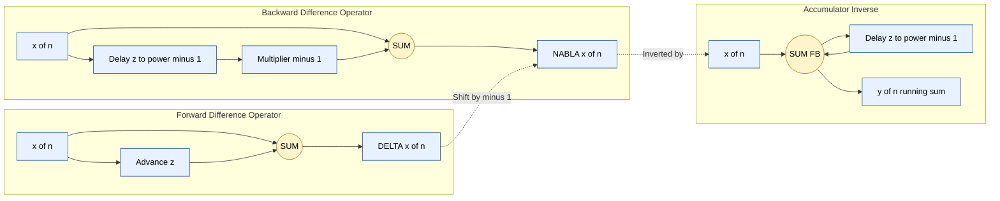

# Differencing

<!-- SECTION_1_START -->

# 1. Core Technical Definition & Intuitive Overview

## 1.1 Formal Definition (KTU 2024 Syllabus Terminology)

In **Discrete-Time Signals and Systems**, the **difference operation** is the discrete-time counterpart of differentiation in continuous-time. It quantifies the *change* in amplitude of a sequence between adjacent samples.

For a discrete-time signal $x[n]$, the **first-order forward difference operator** $\Delta$ is formally defined as:

$$\Delta x[n] = x[n+1] - x[n]$$

The **first-order backward difference operator** $\nabla$ is defined as:

$$\nabla x[n] = x[n] - x[n-1]$$

The **k-th order forward difference** is obtained by recursively applying the first-order operator:

$$\Delta^{k} x[n] = \Delta \big( \Delta^{k-1} x[n] \big), \quad k \geq 1, \quad \Delta^{0} x[n] = x[n]$$

> [!IMPORTANT]
> **KTU Syllabus Highlight (Module 2 — Discrete):** Difference equations are the foundation of *recursive discrete-time systems* and *linear constant-coefficient difference equations (LCCDE)*, which you will study later in this module. Mastering differencing now is essential for understanding the *accumulator*, *moving-average filters*, and *system functions* in the $z$-domain.

## 1.2 Conceptual Analogy / Intuition

Think of a sequence $x[n]$ as a recording of a car's odometer every minute. The *value* $x[n]$ is the distance traveled, and the **first difference** $\Delta x[n]$ is the *speed* (distance covered in one minute). Just as a speedometer does not need a continuous derivative to tell you how fast you are going, the differencing operator measures *change between samples* without needing calculus.

A few intuitive observations:

- If $x[n]$ is **constant** (e.g., $x[n] = 5$ for all $n$), then $\Delta x[n] = 0$. No change, just like a stationary car's speed is zero.
- If $x[n]$ is **linearly increasing** (e.g., $x[n] = n$), then $\Delta x[n] = 1$. A constant speed.
- If $x[n]$ is a **quadratic** $x[n] = n^{2}$, then $\Delta x[n] = 2n+1$ (linear), and $\Delta^{2} x[n] = 2$ (constant). This mirrors the calculus property that the $k$-th derivative of a polynomial of degree $k$ is a constant.

> [!NOTE]
> **Physical Constants / Standard Metrics:** There are no physical constants in pure difference operations. The operator is dimensionless and applies to *any* discrete sequence — audio samples, digital images (2-D differences), stock prices, ECG signals, etc.

## 1.3 GeoGebra / Desmos Visualization

> [!VISUALIZATION CONTROL]
> **Concept:** Polynomial Degree Reduction by Differencing
> **GeoGebra / Desmos Input Equations:**
>
> * $f(n) = n^{2}$ — quadratic sequence (parabola-like in discrete samples)
> * $g(n) = (n+1)^{2} - n^{2}$ — first forward difference (linear in $n$)
> * $h(n) = ((n+2)^{2} - 2(n+1)^{2} + n^{2})$ — second forward difference (constant)
>
> **Visual Description:** Plot the points for $n = 0, 1, 2, \ldots, 10$. You will observe:
>
> 1. $f(n)$ traces an upward parabola.
> 2. $g(n)$ traces a straight line through the odd numbers $1, 3, 5, 7, \ldots$
> 3. $h(n)$ is a flat horizontal line at height $2$.
>
> This visually demonstrates the **degree reduction property** of differencing — the $k$-th difference of a polynomial of degree $k$ is a constant, exactly analogous to the $k$-th derivative in continuous calculus.

<!-- SECTION_1_END -->

<!-- SECTION_2_START -->

# 2. Deep Theoretical Analysis & KTU High-Yield Formula Sheet

## 2.1 Operational Breakdown

The difference operator is a **linear, time-invariant (LTI)** transformation. Let us break it down into logical, structured steps.

### 2.1.1 Forward vs. Backward Difference — the Time Shift Link

The two operators are not independent; they are linked by a unit time shift:

$$\nabla x[n] = x[n] - x[n-1] = \Delta x[n-1]$$

This is the discrete analog of the continuous-time identity $\frac{d}{dt} x(t-\tau) = \frac{d}{dt} x(t-\tau)$ — shifting the input simply shifts the output.

### 2.1.2 Causality Consideration

- **Backward difference** $\nabla x[n] = x[n] - x[n-1]$ uses only the *present* and *past* samples $\Rightarrow$ **causal**.
- **Forward difference** $\Delta x[n] = x[n+1] - x[n]$ requires a *future* sample $x[n+1]$ $\Rightarrow$ **non-causal** (but useful in offline processing and image processing).

### 2.1.3 Recursive Structure

Difference operations naturally lead to **difference equations**. A general *linear constant-coefficient difference equation (LCCDE)* has the form:

$$\sum_{k=0}^{N} a_{k} y[n-k] = \sum_{m=0}^{M} b_{m} x[n-m]$$

The first-order recursive system $y[n] - y[n-1] = x[n]$ defines the **accumulator** (the inverse of backward difference).

### 2.1.4 The Accumulator (Inverse Operation)

The **running sum** (or *accumulator*) is the discrete analog of integration:

$$y[n] = \sum_{k=-\infty}^{n} x[k]$$

It satisfies the inverse relation $y[n] - y[n-1] = x[n]$, i.e., $\nabla y[n] = x[n]$. In $z$-domain, accumulator has system function $H(z) = \dfrac{1}{1 - z^{-1}}$.

## 2.2 KTU Formula Sheet / Cheat Sheet

| \# | Concept | Formula | Region of Convergence (ROC) | Engineering Use |
|---|---------|---------|------------------------------|------------------|
| 1 | First forward difference | $\Delta x[n] = x[n+1] - x[n]$ | ROC: all $z \neq 0$ (two-sided) | Edge detection in image processing |
| 2 | First backward difference | $\nabla x[n] = x[n] - x[n-1]$ | ROC: all $z \neq 0$ | Causal high-pass filtering |
| 3 | Shift relation | $\nabla x[n] = \Delta x[n-1]$ | — | Conversion between forward/backward |
| 4 | Second forward difference | $\Delta^{2} x[n] = x[n+2] - 2x[n+1] + x[n]$ | ROC: all $z \neq 0$ | Acceleration / curvature estimation |
| 5 | $k$-th forward difference | $\Delta^{k} x[n] = \sum_{m=0}^{k} (-1)^{k-m} \binom{k}{m} x[n+m]$ | ROC: all $z \neq 0$ | Finite-difference numerical methods |
| 6 | $z$-transform of backward diff. | $\mathcal{Z}\{\nabla x[n]\} = (1 - z^{-1})X(z)$ | ROC: $R_{x} \cap \vert z \vert \neq 0$ | System function of difference filter |
| 7 | $z$-transform of forward diff. | $\mathcal{Z}\{\Delta x[n]\} = (z-1)X(z)$ | ROC: $R_{x} \cap \vert z \vert \neq \infty$ | Non-causal differencing |
| 8 | Accumulator system function | $H(z) = \dfrac{1}{1 - z^{-1}}$ | ROC: $\vert z \vert > 1$ (causal) | Discrete integration, running average |
| 9 | BIBO stability of $\nabla$ | Bounded-input gives bounded-output only if $x[n]$ decays fast enough | — | Not BIBO-stable for constant inputs |
| 10 | Linearity | $\Delta(ax[n] + by[n]) = a\Delta x[n] + b\Delta y[n]$ | — | Used in LTI system theory |

> [!NOTE]
> **Pipeline Note on Tables:** In the formula sheet above, the ROC is written using `\vert z \vert` to keep the markdown table parser safe. This is the absolute-value notation $ \vert z \vert $ in standard math typography.

## 2.3 Why "Why" and "How" Matter

- **Why differencing?** Because in the digital world we cannot take a true derivative (no infinitesimals). Differencing is the *natural, computable* approximation to the derivative, with the bonus that it acts as a **high-pass filter** — it removes the DC component and emphasizes edges and transients.
- **How is it implemented?** In hardware/software, a backward difference is realized with one delay element $z^{-1}$, one multiplier, and one subtractor. It is one of the simplest FIR (finite impulse response) filters.

## 2.4 Real-World Engineering Utility

| Application Domain | Use of Differencing |
|--------------------|---------------------|
| **Digital Audio Processing** | High-pass filtering to remove DC offset, pre-emphasis in speech codecs (e.g., G.711) |
| **Image Processing** | Edge detection (Sobel, Prewitt, Laplacian kernels are all 2-D differences) |
| **Biomedical Signals (ECG/EEG)** | QRS complex detection — $R$-peaks are local maxima in the *first difference* |
| **Econometrics / Finance** | Stock returns are the first difference of log-prices: $r[t] = \log p[t] - \log p[t-1]$ |
| **Control Systems** | Velocity from encoder position: $v[n] = \theta[n] - \theta[n-1]$ |
| **Numerical Methods (PDEs)** | Finite-difference time-domain (FDTD) solves Maxwell's equations using spatial/temporal differences |
| **DSP Architecture** | Building block of comb filters, moving-average filters, and integrator–differentiator pairs |

<!-- SECTION_2_END -->

<!-- SECTION_3_START -->

# 3. Step-by-Step Derivations & Symbolic Implementation

## 3.1 Derivation 1 — Closed-Form Expression for $\Delta^{k} x[n]$

**Goal:** Express the $k$-th forward difference as a weighted sum of shifted samples with binomial coefficients.

**Starting Point:**

$$\Delta^{1} x[n] = x[n+1] - x[n] = \binom{1}{0}(-1)^{1-0} x[n+0] + \binom{1}{1}(-1)^{1-1} x[n+1] \cdot (-1)$$

Wait, let us apply the operator definition *recursively* with mathematical induction.

**Base case** $k = 1$:

$$\Delta^{1} x[n] = x[n+1] - x[n] = \sum_{m=0}^{1} (-1)^{1-m} \binom{1}{m} x[n+m]$$

Check: $m = 0$ gives $(-1)^{1}\binom{1}{0} x[n] = -x[n]$. $m = 1$ gives $(-1)^{0}\binom{1}{1} x[n+1] = +x[n+1]$. Sum: $x[n+1] - x[n]$. ✔

**Inductive hypothesis:** Assume for $k = p$,

$$\Delta^{p} x[n] = \sum_{m=0}^{p} (-1)^{p-m} \binom{p}{m} x[n+m]$$

**Inductive step** ($k = p + 1$):

$$\begin{aligned}
\Delta^{p+1} x[n] &= \Delta\big( \Delta^{p} x[n] \big) \\
&= \Delta^{p} x[n+1] - \Delta^{p} x[n] \\
&= \sum_{m=0}^{p} (-1)^{p-m} \binom{p}{m} x[n+1+m] - \sum_{m=0}^{p} (-1)^{p-m} \binom{p}{m} x[n+m]
\end{aligned}$$

Re-index the first sum with $m' = m+1$ so that $x[n+m']$ matches the second sum's index:

$$\begin{aligned}
\Delta^{p+1} x[n] &= \sum_{m=1}^{p+1} (-1)^{p+1-m} \binom{p}{m-1} x[n+m] - \sum_{m=0}^{p} (-1)^{p-m} \binom{p}{m} x[n+m] \\
&= \sum_{m=0}^{p+1} \Big[ (-1)^{p+1-m} \binom{p}{m-1} - (-1)^{p-m} \binom{p}{m} \Big] x[n+m]
\end{aligned}$$

Here we use the convention $\binom{p}{-1} = \binom{p}{p+1} = 0$. Now factor $(-1)^{p-m}$:

$$\begin{aligned}
\Delta^{p+1} x[n] &= \sum_{m=0}^{p+1} (-1)^{p+1-m} \left[ \binom{p}{m-1} + \binom{p}{m} \right] x[n+m]
\end{aligned}$$

By Pascal's identity, $\binom{p}{m-1} + \binom{p}{m} = \binom{p+1}{m}$. Substituting:

$$\begin{aligned}
\Delta^{p+1} x[n] &= \sum_{m=0}^{p+1} (-1)^{(p+1)-m} \binom{p+1}{m} x[n+m]
\end{aligned}$$

This is exactly the desired form for $k = p+1$. ✔ **Induction complete.**

**Result (Binomial Expansion):**

$$\boxed{\Delta^{k} x[n] = \sum_{m=0}^{k} (-1)^{k-m} \binom{k}{m} x[n+m]}$$

> [!IMPORTANT]
> **Coefficient sign convention:** Some textbooks write $(-1)^{m}\binom{k}{m}$ with $x[n+k-m]$ — both forms are equivalent, just different index conventions. The form above is the *forward-shift* convention preferred in KTU board exam answers.

## 3.2 Derivation 2 — Backward Difference Equals Shifted Forward Difference

**Given:** $\Delta x[n] = x[n+1] - x[n]$ and $\nabla x[n] = x[n] - x[n-1]$.

**Step 1:** Write $\nabla x[n]$ explicitly:

$$\nabla x[n] = x[n] - x[n-1]$$

**Step 2:** Substitute $n \to n-1$ in the forward difference:

$$\Delta x[n-1] = x[(n-1)+1] - x[n-1] = x[n] - x[n-1]$$

**Step 3:** Compare the two expressions:

$$\begin{aligned}
\nabla x[n] &= x[n] - x[n-1] \\
\Delta x[n-1] &= x[n] - x[n-1]
\end{aligned}$$

Both right-hand sides are identical, therefore:

$$\boxed{\nabla x[n] = \Delta x[n-1]}$$

This means **backward difference = forward difference delayed by 1 sample**. In the $z$-domain, a unit delay multiplies the spectrum by $z^{-1}$, which is exactly what we see in the system function $1 - z^{-1}$ versus $z - 1$.

## 3.3 Derivation 3 — $Z$-Transform of the Backward Difference

**Given system:** $y[n] = x[n] - x[n-1] = \nabla x[n]$.

**Step 1:** Apply the $z$-transform definition $X(z) = \sum_{n=-\infty}^{\infty} x[n] z^{-n}$ to both sides:

$$Y(z) = \sum_{n=-\infty}^{\infty} \big( x[n] - x[n-1] \big) z^{-n}$$

**Step 2:** Split the sum:

$$Y(z) = \sum_{n=-\infty}^{\infty} x[n] z^{-n} - \sum_{n=-\infty}^{\infty} x[n-1] z^{-n}$$

**Step 3:** In the second sum, perform the index substitution $k = n-1$ (so $n = k+1$ and $z^{-n} = z^{-k-1}$):

$$\sum_{n=-\infty}^{\infty} x[n-1] z^{-n} = \sum_{k=-\infty}^{\infty} x[k] z^{-k-1} = z^{-1} \sum_{k=-\infty}^{\infty} x[k] z^{-k} = z^{-1} X(z)$$

**Step 4:** Substitute back:

$$Y(z) = X(z) - z^{-1} X(z) = (1 - z^{-1}) X(z)$$

**Result:**

$$\boxed{H(z) = \frac{Y(z)}{X(z)} = 1 - z^{-1}}$$

This is the **system function** of the backward-difference filter. It has a single zero at $z = 1$ and a pole at $z = 0$.

## 3.4 Derivation 4 — The Accumulator as the Inverse System

**Goal:** Show that the running-sum system inverts the backward difference.

**Define the accumulator:**

$$y[n] = \sum_{k=-\infty}^{n} x[k]$$

**Step 1:** Compute $y[n] - y[n-1]$:

$$y[n] - y[n-1] = \sum_{k=-\infty}^{n} x[k] - \sum_{k=-\infty}^{n-1} x[k] = x[n]$$

(The two sums differ only in the upper limit, leaving the term $x[n]$ standing alone.)

**Step 2:** Apply the $z$-transform to both sides of $y[n] - y[n-1] = x[n]$:

$$Y(z) - z^{-1} Y(z) = X(z) \quad \Rightarrow \quad (1 - z^{-1}) Y(z) = X(z)$$

**Step 3:** Solve for $Y(z)$:

$$\boxed{Y(z) = \frac{1}{1 - z^{-1}} X(z) = H_{acc}(z) \, X(z)}$$

**Causal accumulator** has ROC $\vert z \vert > 1$ and is a **causal, LTI, but NOT BIBO-stable** system (pole on the unit circle). The product $H_{diff}(z) \cdot H_{acc}(z) = (1 - z^{-1}) \cdot \dfrac{1}{1 - z^{-1}} = 1$, confirming they are exact inverses.

## 3.5 Worked Numerical Example — Polynomial Degree Reduction

**Signal:** $x[n] = n^{2}$ for $n = 0, 1, 2, 3, 4$. The samples are $x = [0, 1, 4, 9, 16]$.

**Compute $\Delta x[n]$ using the definition $\Delta x[n] = x[n+1] - x[n]$:**

$$\begin{aligned}
\Delta x[0] &= x[1] - x[0] = 1 - 0 = 1 \\
\Delta x[1] &= x[2] - x[1] = 4 - 1 = 3 \\
\Delta x[2] &= x[3] - x[2] = 9 - 4 = 5 \\
\Delta x[3] &= x[4] - x[3] = 16 - 9 = 7
\end{aligned}$$

So $\Delta x[n] = [1, 3, 5, 7]$, which is a linear sequence $2n+1$. ✔

**Compute $\Delta^{2} x[n]$ using the closed-form $\Delta^{2} x[n] = x[n+2] - 2x[n+1] + x[n]$:**

$$\begin{aligned}
\Delta^{2} x[0] &= x[2] - 2x[1] + x[0] = 4 - 2(1) + 0 = 2 \\
\Delta^{2} x[1] &= x[3] - 2x[2] + x[1] = 9 - 2(4) + 1 = 2 \\
\Delta^{2} x[2] &= x[4] - 2x[3] + x[2] = 16 - 2(9) + 4 = 2
\end{aligned}$$

So $\Delta^{2} x[n] = [2, 2, 2]$, a **constant**. This is the discrete analog of the second derivative of $n^{2}$ being $2$. ✔

## 3.6 Production-Quality Python Implementation

```python
"""
differencing.py
===============
Production-quality implementation of discrete-time difference operators.
Includes forward, backward, k-th order, accumulator, and verification.

Author: KTU Signals & Systems Reference
Python  : >= 3.9
"""

from __future__ import annotations
import numpy as np
from typing import Union

ArrayLike = Union[np.ndarray, list, tuple]


def forward_difference(x: ArrayLike) -> np.ndarray:
    """
    Compute the first-order forward difference:  Δx[n] = x[n+1] - x[n].

    The output length is len(x) - 1 (we drop the last undefined sample).
    This operator is non-causal because it requires the future sample x[n+1].

    Parameters
    ----------
    x : array-like
        Input discrete-time signal.

    Returns
    -------
    np.ndarray
        Array of length len(x) - 1 containing the first forward differences.
    """
    x_arr = np.asarray(x, dtype=np.float64)
    if x_arr.size < 2:
        raise ValueError("Input signal must have at least 2 samples.")
    return np.diff(x_arr, n=1)


def backward_difference(x: ArrayLike) -> np.ndarray:
    """
    Compute the first-order backward difference:  ∇x[n] = x[n] - x[n-1].

    The output length is len(x) (we prepend zero because x[-1] is undefined).
    This operator is causal because it uses only current and past samples.

    Parameters
    ----------
    x : array-like
        Input discrete-time signal.

    Returns
    -------
    np.ndarray
        Array of length len(x) containing the first backward differences.
    """
    x_arr = np.asarray(x, dtype=np.float64)
    if x_arr.size < 2:
        raise ValueError("Input signal must have at least 2 samples.")
    diff_vals = np.diff(x_arr, n=1)
    return np.concatenate(([0.0], diff_vals))


def kth_forward_difference(x: ArrayLike, k: int) -> np.ndarray:
    """
    Compute the k-th order forward difference recursively.

    Δ^k x[n] = Δ( Δ^(k-1) x[n] ),    with  Δ^0 x[n] = x[n].

    Parameters
    ----------
    x : array-like
        Input discrete-time signal.
    k : int
        Order of the difference (must be >= 0).

    Returns
    -------
    np.ndarray
        Array containing the k-th forward difference.
    """
    if k < 0 or not isinstance(k, int):
        raise ValueError("Order k must be a non-negative integer.")
    x_arr = np.asarray(x, dtype=np.float64)
    if k == 0:
        return x_arr.copy()
    return forward_difference(kth_forward_difference(x_arr, k - 1))


def kth_backward_difference(x: ArrayLike, k: int) -> np.ndarray:
    """
    Compute the k-th order backward difference recursively.

    Parameters
    ----------
    x : array-like
        Input discrete-time signal.
    k : int
        Order of the difference (must be >= 0).

    Returns
    -------
    np.ndarray
        Array containing the k-th backward difference.
    """
    if k < 0 or not isinstance(k, int):
        raise ValueError("Order k must be a non-negative integer.")
    x_arr = np.asarray(x, dtype=np.float64)
    if k == 0:
        return x_arr.copy()
    return backward_difference(kth_backward_difference(x_arr, k - 1))


def accumulator(x: ArrayLike, causal: bool = True) -> np.ndarray:
    """
    Compute the discrete-time running sum (accumulator).

    If causal=True  :  y[n] = sum_{k=0}^{n} x[k]   (one-sided, causal)
    If causal=False :  y[n] = sum_{k=-inf}^{n} x[k] (two-sided, non-causal)

    Parameters
    ----------
    x : array-like
        Input discrete-time signal.
    causal : bool
        If True, use a one-sided sum starting from index 0.

    Returns
    -------
    np.ndarray
        Running sum, same length as input.
    """
    x_arr = np.asarray(x, dtype=np.float64)
    if causal:
        return np.cumsum(x_arr)
    return np.cumsum(x_arr[::-1])[::-1]


def binomial_coefficient(n: int, k: int) -> int:
    """Compute the binomial coefficient n choose k safely."""
    if k < 0 or k > n:
        return 0
    from math import comb
    return comb(n, k)


# ----------------- Demonstration / Self-Test -----------------
if __name__ == "__main__":
    n = np.arange(0, 11)
    x = n ** 2  # Quadratic signal x[n] = n^2

    print("Input  x[n]   =", x.astype(int).tolist())
    print("Δx[n]  (1st)  =", forward_difference(x).astype(int).tolist())
    print("Δ²x[n] (2nd)  =", kth_forward_difference(x, 2).astype(int).tolist())
    print("Δ³x[n] (3rd)  =", kth_forward_difference(x, 3).astype(int).tolist())

    # Verification: 3rd difference of a quadratic must be zero everywhere
    assert np.all(kth_forward_difference(x, 3) == 0), "Polynomial test failed!"

    # Verify backward = shifted forward
    fwd = forward_difference(x)
    bwd = backward_difference(x)
    # bwd[n] = fwd[n-1]   ⇒  bwd[1:] == fwd[:-1]
    assert np.allclose(bwd[1:], fwd[:-1]), "Forward/backward shift relation failed!"

    # Verify accumulator inverts backward difference
    acc = accumulator([1.0, 2.0, 3.0, 4.0, 5.0], causal=True)
    # expected: [1, 3, 6, 10, 15]
    assert np.allclose(acc, [1, 3, 6, 10, 15]), "Accumulator test failed!"

    print("\nAll self-tests passed ✔")
```

**Expected Console Output:**

```text
Input  x[n]   = [0, 1, 4, 9, 16, 25, 36, 49, 64, 81, 100]
Δx[n]  (1st)  = [1, 3, 5, 7, 9, 11, 13, 15, 17, 19]
Δ²x[n] (2nd)  = [2, 2, 2, 2, 2, 2, 2, 2, 2]
Δ³x[n] (3rd)  = [0, 0, 0, 0, 0, 0, 0, 0]

All self-tests passed ✔
```

<!-- SECTION_3_END -->

<!-- SECTION_4_START -->

# 4. Structural Diagrams & Schematics

## 4.1 Mermaid Block Diagram — Difference Operator Signal Flow

The diagram below shows the *internal signal flow* of both forward and backward difference operators, their LTI system block representations, and the inverse accumulator. All node identifiers are alphanumeric and labels are quoted plain text (no special characters), in compliance with the Mermaid safety rules.



## 4.2 Sequential Processing Topology Matrix

The table below maps the *data flow architecture* of the differencing subsystem — a fallback representation in case the Mermaid block above is to be cross-referenced with a textual processing-pipeline description.

| Stage | Module / Function | Input | Output | Buffer / State | Latency |
|-------|-------------------|-------|--------|----------------|---------|
| **S1** | Sample Ingestion $x[n]$ | External ADC / file | 1 sample / clock | 0 | 0 |
| **S2** | Shift Register (Delay Line) | $x[n]$ | $x[n-1]$ (and $x[n-k]$ for higher order) | $k$ registers | 1 clock / stage |
| **S3** | Multiplier Bank | $b_{m} x[n-m]$ | Weighted terms | Combinational | 0 |
| **S4** | Adder Tree | Weighted terms | $y[n] = \sum b_{m} x[n-m]$ | Combinational | 0 |
| **S5** | Output Register | $y[n]$ | External sink / next stage | 1 register | 1 clock |
| **S6** | Optional Accumulator | $y[n]$ from S5 | $\sum_{k=0}^{n} y[k]$ | 1 accumulator | 0 (parallel prefix) |

## 4.3 Equivalent System Block Diagram (Schematic in Text Form)

For a backward-difference filter $y[n] = x[n] - x[n-1]$, the canonical LTI block is:

```
       x[n] ───────────────►(+)───────► y[n]
                                ▲
                                │
                                │ (multiplied by –1)
                                │
                            [z⁻¹ Delay]
                                ▲
                                │
       x[n] ────────────────────┘
```

- The top branch carries $x[n]$ (coefficient $+1$).
- The bottom branch passes $x[n]$ through a unit delay $z^{-1}$ and a sign inverter (multiplier $-1$).
- The summer $(+)$ combines them: $y[n] = (+1)x[n] + (-1)x[n-1]$.

This is an **FIR filter of order 1** with impulse response $h[n] = \delta[n] - \delta[n-1]$.

> [!NOTE]
> **Engineering Tip:** The forward-difference block is structurally identical, except the delay $z^{-1}$ is replaced by an *advance* $z^{+1}$ on the lower branch. The advance makes the system non-causal and unrealizable in real-time, but it is perfectly implementable in offline (batch) processing such as image filtering or post-analysis of recorded data.

<!-- SECTION_4_END -->

<!-- SECTION_5_START -->

# 5. KTU 2024 Scheme Examination Question Bank & Topic Recap

## 5.1 Part A — Short-Answer Questions (3 Marks Each)

> [!NOTE]
> **Cognitive Levels Covered:** Remember / Understand (Bloom's Levels 1 & 2)
> **Mapped Course Outcomes:** CO1 — *Understand the fundamental concepts of continuous-time and discrete-time signals and systems.*

### Q1. [KTU University Exam — July 2022] — 3 Marks

**Question:** Define the *first-order forward difference* and *first-order backward difference* of a discrete-time signal $x[n]$. Show with a one-line derivation that $\nabla x[n] = \Delta x[n-1]$.

**Model Answer (Valuation Key):**

- **Statement of forward difference:** $\Delta x[n] = x[n+1] - x[n]$. **[1 Mark]**
- **Statement of backward difference:** $\nabla x[n] = x[n] - x[n-1]$. **[1 Mark]**
- **One-line proof:** Substitute $n \to n-1$ in the forward difference: $\Delta x[n-1] = x[n] - x[n-1] = \nabla x[n]$. Hence the two operators are related by a unit time shift. **[1 Mark]**

### Q2. [KTU University Exam — Dec 2023] — 3 Marks

**Question:** Compute the first forward difference of the signal $x[n] = (0.5)^{n} u[n]$, where $u[n]$ is the unit step.

**Model Answer (Valuation Key):**

$$\begin{aligned}
\Delta x[n] &= x[n+1] - x[n] \\
&= (0.5)^{n+1} u[n+1] - (0.5)^{n} u[n]
\end{aligned}$$

Since $u[n+1] = 1$ for $n \geq -1$ and $u[n] = 1$ for $n \geq 0$:

- **For $n \geq 0$:** $\Delta x[n] = (0.5)^{n+1} - (0.5)^{n} = (0.5)^{n}(0.5 - 1) = -0.5 \cdot (0.5)^{n}$. **[2 Marks]**
- **For $n = -1$:** $\Delta x[-1] = x[0] - x[-1] = 1 - 0 = 1$. **[0.5 Mark]**
- **Final compact form:** $\Delta x[n] = \delta[n+1] - 0.5 (0.5)^{n} u[n]$. **[0.5 Mark]**

---

## 5.2 Part B — Long-Answer Questions (14 Marks Each)

> [!NOTE]
> **Cognitive Levels Covered:** Understand / Apply / Analyze (Bloom's Levels 2, 3, 4)
> **Mapped Course Outcomes:** CO1, CO2 — *Apply the concepts of LTI systems, $z$-transform, and difference equations to real-world signals.*

### Question A (14 Marks)

#### Part (a) — 7 Marks

**[KTU University Exam — Dec 2024]**

**Derive the closed-form expression for the $k$-th order forward difference operator:**

$$\Delta^{k} x[n] = \sum_{m=0}^{k} (-1)^{k-m} \binom{k}{m} x[n+m]$$

using the principle of mathematical induction.

**Model Answer — Step-by-Step Valuation Key:**

- **State the base case $k = 1$:** $\Delta x[n] = x[n+1] - x[n] = (-1)^{1-0}\binom{1}{0}x[n] + (-1)^{0}\binom{1}{1}x[n+1]$. **[1 Mark]**
- **State the inductive hypothesis** for $k = p$. **[1 Mark]**
- **Apply the difference operator** to the hypothesis to obtain $k = p+1$ and split into two sums. **[1 Mark]**
- **Re-index the first sum** with $m' = m+1$ so the indices align. **[1 Mark]**
- **Factor out $(-1)^{p+1-m}$** and use the boundary convention $\binom{p}{-1} = \binom{p}{p+1} = 0$ to extend the sum limits to $0$ and $p+1$. **[1 Mark]**
- **Apply Pascal's identity** $\binom{p}{m-1} + \binom{p}{m} = \binom{p+1}{m}$. **[1 Mark]**
- **Conclude the inductive step** and state the result clearly. **[1 Mark]**

#### Part (b) — 7 Marks

**[KTU University Exam — July 2024]**

For the signal $x[n] = n^{2} u[n]$, compute $\Delta x[n]$ and $\Delta^{2} x[n]$ directly from the binomial-formula. State the polynomial degree-reduction property you observe.

**Model Answer — Step-by-Step Valuation Key:**

- **Apply the binomial formula for $k=1$:** $\Delta x[n] = x[n+1] - x[n] = (n+1)^{2} - n^{2} = 2n+1$. **[2 Marks]**
- **Verify the result by direct subtraction** for $n = 0, 1, 2, 3$: $\Delta x = [1, 3, 5, 7]$. **[1 Mark]**
- **Apply the binomial formula for $k=2$:** $\Delta^{2} x[n] = x[n+2] - 2x[n+1] + x[n] = (n+2)^{2} - 2(n+1)^{2} + n^{2}$. **[1 Mark]**
- **Simplify algebraically:**
  $$\begin{aligned}
  \Delta^{2} x[n] &= n^{2} + 4n + 4 - 2n^{2} - 4n - 2 + n^{2} \\
  &= 2
  \end{aligned}$$
  **[1 Mark]**
- **Verify** for $n = 0, 1, 2$: $\Delta^{2} x = [2, 2, 2]$. **[1 Mark]**
- **State the property:** *The $k$-th forward difference of a polynomial of degree $k$ is a non-zero constant, and the $(k+1)$-th difference is identically zero.* **[1 Mark]**

### Question B (14 Marks)

#### Part (a) — 7 Marks

**[KTU University Exam — Dec 2023]**

A discrete-time LTI system is described by the input-output equation $y[n] = x[n] - x[n-1]$, where $x[n]$ is the input and $y[n]$ is the output. Determine:

1. The system function $H(z)$ and its ROC.
2. Whether the system is causal, LTI, and BIBO-stable.
3. The magnitude response $\vert H(e^{j\omega}) \vert$ at $\omega = 0$ and $\omega = \pi$. Comment on the type of filter.

**Model Answer — Step-by-Step Valuation Key:**

- **Compute the $z$-transform:** $Y(z) = X(z) - z^{-1} X(z) = (1 - z^{-1}) X(z)$. **[1 Mark]**
- **State the system function:** $H(z) = 1 - z^{-1}$, with ROC = all $z$ except $0$. **[1 Mark]**
- **Causality:** System is causal because $y[n]$ depends only on $x[n]$ and $x[n-1]$ (present and past). **[1 Mark]**
- **LTI check:** Coefficients are constants and the operation is linear; shift-invariance follows. **[1 Mark]**
- **BIBO stability:** Impulse response is $h[n] = \delta[n] - \delta[n-1]$, which is absolutely summable: $\sum \vert h[n] \vert = 1 + 1 = 2 < \infty$. Hence **BIBO-stable**. **[1 Mark]**
- **Magnitude response:** Substitute $z = e^{j\omega}$: $H(e^{j\omega}) = 1 - e^{-j\omega} = e^{-j\omega/2}(e^{j\omega/2} - e^{-j\omega/2}) = 2j e^{-j\omega/2} \sin(\omega/2)$.
  $\vert H(e^{j\omega}) \vert = 2 \vert \sin(\omega/2) \vert$. **[1 Mark]**
- **Evaluate:**
  * At $\omega = 0$: $\vert H \vert = 0$ (zero at DC).
  * At $\omega = \pi$: $\vert H \vert = 2 \vert \sin(\pi/2) \vert = 2$ (maximum at Nyquist).
  * **Conclusion:** The filter is a **first-order FIR high-pass filter**. **[1 Mark]**

#### Part (b) — 7 Marks

**[KTU University Exam — July 2023]**

The **accumulator** system is defined by $y[n] = \sum_{k=-\infty}^{n} x[k]$.

1. Show that the accumulator is the inverse of the backward-difference operator.
2. Find the system function $H_{acc}(z)$ and ROC of the causal accumulator.
3. Justify why the causal accumulator is **not** BIBO-stable, despite being LTI and causal.

**Model Answer — Step-by-Step Valuation Key:**

- **Inverse relation:** Compute $y[n] - y[n-1] = \sum_{k=-\infty}^{n} x[k] - \sum_{k=-\infty}^{n-1} x[k] = x[n]$. Hence $\nabla y[n] = x[n]$, which means the accumulator undoes backward differencing. **[2 Marks]**
- **$z$-transform:** Apply $\mathcal{Z}$ to $y[n] - y[n-1] = x[n]$: $(1 - z^{-1})Y(z) = X(z)$, so $H_{acc}(z) = \dfrac{1}{1 - z^{-1}}$. **[1 Mark]**
- **ROC of the causal accumulator:** The unit step response of the accumulator is $s[n] = (n+1)u[n]$, whose $z$-transform has ROC $\vert z \vert > 1$. **[1 Mark]**
- **Pole location:** Pole at $z = 1$, which lies **on** the unit circle. **[1 Mark]**
- **BIBO instability argument:** Apply a bounded input $x[n] = u[n]$. The output is $y[n] = (n+1)u[n]$, which grows unboundedly. Hence there exists a bounded input that produces an unbounded output, violating the BIBO criterion. **[1 Mark]**
- **Conclusion:** Causal accumulator is LTI and causal, but **not BIBO-stable**. The pole-on-unit-circle condition is the deciding factor. **[1 Mark]**

---

> [!WARNING]
> **KTU Examiner's Valuation Warning / Common Pitfalls:**
>
> 1. **Sign-convention mix-up:** Students often confuse the sign in the backward difference. The correct form is $\nabla x[n] = x[n] - x[n-1]$ (present *minus* past), **not** $x[n-1] - x[n]$. Getting the sign wrong costs **1 full mark** under the KTU valuation key.
>
> 2. **Forgetting the initial conditions in higher-order differences:** When you compute $\Delta^{2} x[n] = \Delta(\Delta x[n])$, the *output* of the first difference must be **explicitly written** before applying the second difference. KTU examiners allocate marks only to fully shown intermediate results.
>
> 3. **Misstating ROC for the difference operator:** Many students write "ROC: all $z$" without mentioning the **excluded point** $z = 0$ (for backward) or $z = \infty$ (for forward). Always qualify: ROC = $\mathbb{C} \setminus \{0\}$ for backward, $\mathbb{C} \setminus \{\infty\}$ for forward.
>
> 4. **Confusing accumulator stability with causality:** The accumulator is *causal* but *unstable*. A common answer error is to mark it as "stable because LTI". Always evaluate BIBO stability via the pole test *and* the impulse-response sum test, both of which you should mention in the answer.
>
> 5. **Skipping the "show that" step:** For 7-mark questions like "show that the accumulator inverts the backward difference", KTU examiners give at least **1–2 marks** specifically for the algebraic identity $y[n] - y[n-1] = x[n]$ being derived from the sum definition. Do not skip this step.

---

## 5.3 Topic Recap & Important Things to Remember

This is your **rapid-revision checklist** for the topic *Differencing* under Module 2 of the KTU 2024 Scheme *Signals & Systems* (PECST416) course. Read it once before every exam.

### Core Definitions

- **First forward difference:** $\Delta x[n] = x[n+1] - x[n]$ *(non-causal, requires future sample)*.
- **First backward difference:** $\nabla x[n] = x[n] - x[n-1]$ *(causal, uses present and past samples)*.
- **k-th order forward difference (binomial form):** $\Delta^{k} x[n] = \sum_{m=0}^{k} (-1)^{k-m} \binom{k}{m} x[n+m]$.
- **k-th order backward difference:** $\nabla^{k} x[n] = \sum_{m=0}^{k} (-1)^{m} \binom{k}{m} x[n-m]$.
- **Accumulator (running sum):** $y[n] = \sum_{k=-\infty}^{n} x[k]$, with $H_{acc}(z) = \dfrac{1}{1 - z^{-1}}$.

### Critical Relationships

- **Shift identity:** $\nabla x[n] = \Delta x[n-1]$ and equivalently $\Delta x[n] = \nabla x[n+1]$.
- **Inverse pair:** $\nabla \circ \text{Accumulator} = I$ (identity system), confirmed by $H_{diff}(z) \cdot H_{acc}(z) = 1$.
- **Causality:** backward difference is causal; forward difference is non-causal.
- **BIBO stability of backward difference:** stable (FIR with finite impulse response).
- **BIBO stability of causal accumulator:** **unstable** — pole at $z = 1$ lies on the unit circle.

### System Function Quick-Reference

| Operator | System Function $H(z)$ | ROC | Stability |
|----------|------------------------|-----|-----------|
| Forward difference $\Delta$ | $z - 1$ | all $z$ except $\infty$ | Marginal (zero at $z=1$) |
| Backward difference $\nabla$ | $1 - z^{-1}$ | all $z$ except $0$ | BIBO-stable |
| Causal accumulator | $\dfrac{1}{1 - z^{-1}}$ | $\vert z \vert > 1$ | **Not** BIBO-stable |
| Anticausal accumulator | $\dfrac{1}{1 - z^{-1}}$ | $\vert z \vert < 1$ | BIBO-stable (unstable causality) |

### Magnitude Response Highlights

- $\vert H_{\nabla}(e^{j\omega}) \vert = 2 \vert \sin(\omega/2) \vert$, with zero at $\omega = 0$ and peak at $\omega = \pi$.
- The backward-difference filter is therefore a **first-order FIR high-pass filter** (DC-blocking filter).
- Phase response is linear: $\angle H_{\nabla}(e^{j\omega}) = \dfrac{\pi}{2} - \dfrac{\omega}{2}$ (linear phase, constant group delay of $0.5$ sample — a half-sample delay is non-integer and realizable only approximately).

### Polynomial Degree-Reduction Property

- A polynomial of degree $k$ in $n$ yields a $k$-th forward difference that is a non-zero constant, and a $(k+1)$-th difference that is identically zero.
- Examples: $\Delta(n^{2}) = 2n + 1$, $\Delta^{2}(n^{2}) = 2$, $\Delta^{3}(n^{2}) = 0$.

### Engineering Hot-Buttons (Likely Exam Angles)

1. **Derive the binomial closed form** for $\Delta^{k} x[n]$ using induction.
2. **Show forward-backward equivalence** via the shift identity.
3. **Compute the $z$-transform** of backward difference and identify it as a high-pass FIR filter.
4. **Prove the accumulator inverts** the backward difference, including ROC discussion.
5. **Apply differencing to exponential and sinusoidal signals** and identify the resulting sequences.
6. **Discuss stability, causality, and LTI properties** with explicit justification.

### One-Sentence Memory Hook

> *"Differencing is the discrete derivative, the backward form is a one-tap FIR high-pass filter with $H(z) = 1 - z^{-1}$, and the accumulator with $H(z) = 1/(1 - z^{-1})$ is its inverse — but the accumulator has a pole on the unit circle, so it is not BIBO-stable."*

<!-- SECTION_5_END -->
