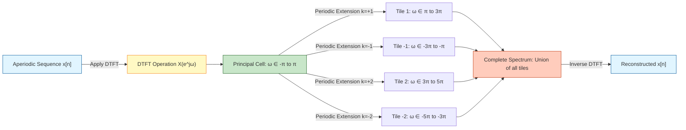
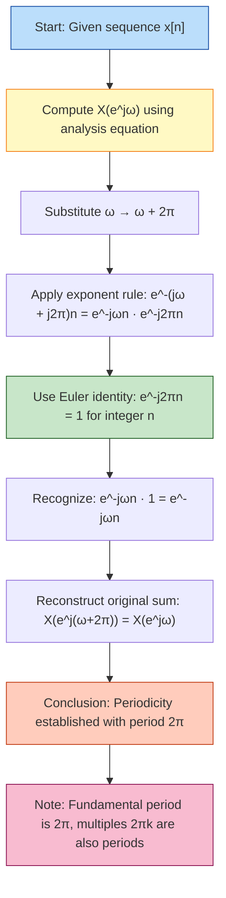
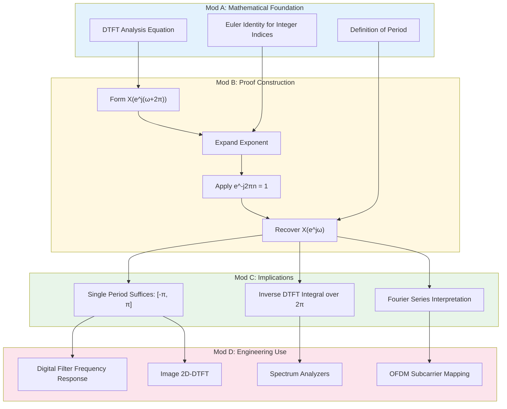
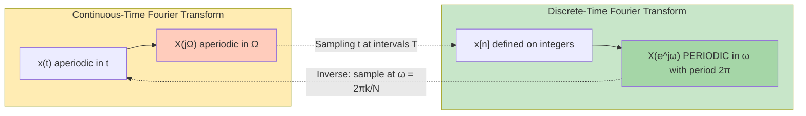

# Discrete-Time Fourier Transform for Aperiodic Sequences - Properties of the Discrete-Time Fourier Transform (Periodicity

<!-- SECTION_1_START -->
# Discrete-Time Fourier Transform — Periodicity Property

## 1. Formal Academic Definition

> [!IMPORTANT]
> **KTU 2024 Syllabus Definition (PECST416 — Module 2):**
> The **Discrete-Time Fourier Transform (DTFT)** of an aperiodic sequence $x[n]$ is a **complex-valued, continuous-frequency function** $X(e^{j\omega})$ defined as:
>
> $$X(e^{j\omega}) = \sum_{n=-\infty}^{\infty} x[n]\, e^{-j\omega n}$$
>
> The inverse (synthesis) equation is:
>
> $$x[n] = \frac{1}{2\pi} \int_{2\pi} X(e^{j\omega})\, e^{j\omega n}\, d\omega$$

### Periodicity Property — The Central Theorem

> [!NOTE]
> **Theorem (Periodicity of DTFT):**
> For any absolutely summable sequence $x[n]$, the DTFT $X(e^{j\omega})$ is **always periodic in the frequency variable $\omega$ with period $2\pi$**:
>
> $$X(e^{j(\omega + 2\pi)}) = X(e^{j\omega}) \quad \text{for all } \omega \in \mathbb{R}$$

This is the **single most important distinguishing property** between the Discrete-Time Fourier Transform (DTFT) and the Continuous-Time Fourier Transform (CTFT). In the CTFT, the spectrum $X(j\Omega)$ is **aperiodic** in $\Omega$. In the DTFT, the spectrum is **always periodic** in $\omega$.

---

## 2. Conceptual Analogy / Intuitive Overview

Imagine a **clock face with only 12 hour markings**. The hands of the clock represent the values of $X(e^{j\omega})$ at different angles $\omega$. The position of the hands at $\omega$ and at $\omega + 2\pi$ (i.e., after one full revolution) is **identical** because we have come back to the same point on the clock face. Just as the clock repeats its state every $2\pi$ radians, so does the DTFT repeat its values every $2\pi$ radians in the frequency domain.

> [!TIP]
> **Engineering Intuition:** Because the DTFT is periodic with period $2\pi$, we only ever need to study (and store) it over **one principal interval** such as $\omega \in [-\pi, \pi]$ or $[0, 2\pi]$. The entire infinite spectrum is a periodic extension of this one window — a phenomenon directly tied to the **sampling theorem** in discrete-time systems.

### Why Periodicity Arises — The Sampling Intuition

A discrete-time signal $x[n]$ can be viewed as the result of **sampling** a continuous-time signal $x_c(t)$ at uniform intervals $T$ (so $x[n] = x_c(nT)$). In the frequency domain, sampling in **time** produces **periodicity** in **frequency**. The sampling rate $\omega_s = 2\pi/T$ (in rad/sample) sets the period of repetition in the DTFT domain. Standardizing $T = 1$ gives a period of $2\pi$.

| Constant | Symbol | Standard Value | Unit |
| :--- | :--- | :--- | :--- |
| Principal period of $X(e^{j\omega})$ | $\omega_0$ | $2\pi$ | rad/sample |
| Principal interval (symmetric) | $\Omega_p$ | $[-\pi, \pi]$ | rad/sample |
| Principal interval (one-sided) | $\Omega_p$ | $[0, 2\pi]$ | rad/sample |
| Nyquist frequency | $\omega_N$ | $\pi$ | rad/sample |
| Sampling frequency (normalized) | $\omega_s$ | $2\pi$ | rad/sample |

> [!VISUALIZATION CONTROL]
> **Concept:** Plot of a periodic DTFT magnitude $\vert X(e^{j\omega}) \vert$ showing repetition every $2\pi$
> **Desmos Input Equations:**
> * `x1 = abs( sin(w/2) / sin(w/200) )` (use a fine summation approximation for the sinc-shaped envelope)
> * `x2 = abs( sin((w-2pi)/2) / sin((w-2pi)/200) )`
> * `x3 = abs( sin((w+2pi)/2) / sin((w+2pi)/200) )`
> **Visual Description:** A sinc-like main lobe centered at $\omega = 0$, with identical copies (the same sinc shape) repeating at $\omega = 2\pi$, $\omega = -2\pi$, $\omega = 4\pi$, and so on. The student should observe that the curve exactly overlaps itself when shifted by integer multiples of $2\pi$.

---

## 3. The Fourier Series Connection (Why Only One Period Matters)

> [!NOTE]
> **Duality Insight:** The synthesis equation of the DTFT
>
> $$x[n] = \frac{1}{2\pi} \int_{2\pi} X(e^{j\omega})\, e^{j\omega n}\, d\omega$$
>
> is mathematically a **Fourier series expansion** of the periodic function $X(e^{j\omega})$ in terms of the orthogonal basis $\{e^{j\omega n}\}_{n=-\infty}^{\infty}$, with **Fourier coefficients** given by the discrete samples $x[n]$.

This means the *aperiodic* time-domain sequence $x[n]$ is the *Fourier series coefficients* of the *periodic* frequency-domain function $X(e^{j\omega})$. The duality is exact and fundamental.

<!-- SECTION_1_END -->

<!-- SECTION_2_START -->
# Deep Theoretical Analysis & KTU High-Yield Formula Sheet

## 1. Formal Proof of the Periodicity Property

We start from the DTFT analysis equation and evaluate it at $\omega + 2\pi$:

$$X(e^{j(\omega + 2\pi)}) = \sum_{n=-\infty}^{\infty} x[n]\, e^{-j(\omega + 2\pi)n}$$

Using the exponent rule:

$$e^{-j(\omega + 2\pi)n} = e^{-j\omega n} \cdot e^{-j2\pi n}$$

Now apply **Euler's identity** for integer powers of $2\pi$:

$$e^{-j2\pi n} = \cos(2\pi n) - j\sin(2\pi n) = 1 \quad (\text{since } n \in \mathbb{Z})$$

Therefore:

$$e^{-j(\omega + 2\pi)n} = e^{-j\omega n} \cdot 1 = e^{-j\omega n}$$

Substituting back:

$$X(e^{j(\omega + 2\pi)}) = \sum_{n=-\infty}^{\infty} x[n]\, e^{-j\omega n} = X(e^{j\omega}) \quad \blacksquare$$

> [!IMPORTANT]
> **Key Step to Memorize:** The proof hinges on the fact that $e^{-j2\pi n} = 1$ for **all integer $n$**. This is a property unique to discrete-time indices and is the *root cause* of DTFT periodicity.

---

## 2. More General Periodicity — Rational Frequencies

> [!NOTE]
> **Extended Periodicity Property:** If there exists a positive integer $N$ such that $x[n]$ has a "natural" repetition at $N$ (e.g., $x[n]$ is itself periodic with period $N$), then $X(e^{j\omega})$ has an additional periodicity:
>
> $$X(e^{j(\omega + 2\pi k/N)}) = X(e^{j\omega}) \quad \text{for } k = 0, 1, \ldots, N-1$$
>
> More generally, the DTFT is periodic with **any period $2\pi k$** for integer $k$. The **fundamental** (smallest positive) period is $2\pi$.

---

## 3. Why Periodicity Matters in Engineering Practice

| Engineering Domain | Role of DTFT Periodicity |
| :--- | :--- |
| **Digital Filter Design** | FIR/IIR frequency responses $H(e^{j\omega})$ are evaluated only over $[0, 2\pi]$ (or $[-\pi, \pi]$) and tiled elsewhere. |
| **Spectrum Analyzers / DSP** | Computed DFT (which samples the DTFT) shows folded/aliased repetitions unless the sampling theorem is respected. |
| **Image Processing** | 2-D DTFT of an image is periodic in both spatial-frequency axes with period $2\pi$. |
| **OFDM / Communications** | Subcarriers are placed within one $2\pi$ period; aliasing between subcarriers is prevented by orthogonality. |
| **Audio Coding (MP3, AAC)** | MDCT uses the periodicity of the DTFT to overlap successive blocks without discontinuity. |

---

## 4. KTU Formula Sheet / Cheat Sheet

| # | Formula / Property | Expression | Validity / Notes |
| :--- | :--- | :--- | :--- |
| 1 | DTFT Analysis | $X(e^{j\omega}) = \sum_{n=-\infty}^{\infty} x[n]\, e^{-j\omega n}$ | Requires $\sum \vert x[n] \vert < \infty$ (sufficient) |
| 2 | DTFT Synthesis | $x[n] = \frac{1}{2\pi} \int_{2\pi} X(e^{j\omega})\, e^{j\omega n}\, d\omega$ | Integral over **any** interval of length $2\pi$ |
| 3 | **Periodicity** | $X(e^{j(\omega + 2\pi)}) = X(e^{j\omega})$ | **DTFT is always $2\pi$-periodic** |
| 4 | Fundamental period | $T_\omega = 2\pi$ rad/sample | Smallest positive period |
| 5 | Multiple period | $X(e^{j(\omega + 2\pi k)}) = X(e^{j\omega})$ | For any integer $k$ |
| 6 | Complex exponential periodicity kernel | $e^{-j2\pi n} = 1$ for $n \in \mathbb{Z}$ | Root cause of DTFT periodicity |
| 7 | Principal interval (symmetric) | $\omega \in [-\pi, \pi]$ | Used in most digital filter designs |
| 8 | Principal interval (one-sided) | $\omega \in [0, 2\pi]$ | Equivalent representation |
| 9 | Nyquist frequency | $\omega_N = \pi$ rad/sample | Highest unique frequency |
| 10 | Periodicity of $|X(e^{j\omega})|$ | $\vert X(e^{j(\omega+2\pi)}) \vert = \vert X(e^{j\omega}) \vert$ | Magnitude inherits periodicity |
| 11 | Periodicity of $\angle X(e^{j\omega})$ | $\angle X(e^{j(\omega+2\pi)}) = \angle X(e^{j\omega})$ | Phase inherits periodicity |

> [!TIP]
> **Valuation Tip:** Whenever a problem states "show that $X(e^{j\omega})$ is periodic", the answer **must** explicitly include the line $e^{-j2\pi n} = 1$ (for integer $n$). Skipping this step costs 2 marks in KTU valuation.

---

## 5. Comparison: CTFT vs. DTFT Periodicity

| Feature | CTFT $X(j\Omega)$ | DTFT $X(e^{j\omega})$ |
| :--- | :--- | :--- |
| Time variable | Continuous $t$ | Discrete integer $n$ |
| Frequency variable | Continuous $\Omega$ (rad/s) | Continuous $\omega$ (rad/sample) |
| Periodicity in frequency | **Aperiodic** (in general) | **Always periodic** with period $2\pi$ |
| Periodicity in time | Aperiodic sequences can be aperiodic | Periodic sequences $\Leftrightarrow$ sampled spectra |
| Inverse formula | Inverse integral over $(-\infty, \infty)$ | Inverse integral over **one** $2\pi$ interval |
| Domain of analysis | Full real line | Principal cell of width $2\pi$ |

<!-- SECTION_2_END -->

<!-- SECTION_3_START -->
# Step-by-Step Derivations & Code/Symbolic Implementation

## 1. Worked Example 1 — Periodicity of a Rectangular Pulse DTFT

**Problem:** Compute the DTFT of $x[n] = 1$ for $n = -2, -1, 0, 1, 2$ and $x[n] = 0$ otherwise (a 5-point rectangular pulse), and verify the periodicity property.

### Step-by-Step Derivation

The DTFT is a finite geometric sum:

$$X(e^{j\omega}) = \sum_{n=-2}^{2} e^{-j\omega n} = e^{j2\omega} + e^{j\omega} + 1 + e^{-j\omega} + e^{-j2\omega}$$

Group symmetric terms:

$$X(e^{j\omega}) = 1 + 2\cos(\omega) + 2\cos(2\omega)$$

Apply the identity $1 + 2\cos(\omega) = 2\cos^2(\omega/2)$ repeatedly, or use the closed-form geometric sum:

$$\sum_{n=-N}^{N} e^{-j\omega n} = \frac{\sin((2N+1)\omega/2)}{\sin(\omega/2)}$$

For $N = 2$:

$$X(e^{j\omega}) = \frac{\sin(5\omega/2)}{\sin(\omega/2)}$$

> [!NOTE]
> This is the **periodic Dirichlet kernel** (or aliased sinc) — it is *not* a decaying sinc. It is **periodic with period $2\pi$** as required.

**Verification of Periodicity:**

$$X(e^{j(\omega+2\pi)}) = \frac{\sin(5(\omega+2\pi)/2)}{\sin((\omega+2\pi)/2)} = \frac{\sin(5\omega/2 + 5\pi)}{\sin(\omega/2 + \pi)}$$

Using $\sin(\theta + k\pi) = (-1)^k \sin(\theta)$ for integer $k$:

$$= \frac{(-1)^5 \sin(5\omega/2)}{(-1)^1 \sin(\omega/2)} = \frac{-\sin(5\omega/2)}{-\sin(\omega/2)} = \frac{\sin(5\omega/2)}{\sin(\omega/2)} = X(e^{j\omega}) \quad \checkmark$$

---

## 2. Worked Example 2 — Periodicity of a Two-Sided Decaying Exponential

**Problem:** Show that the DTFT of $x[n] = a^{\vert n \vert}$ for $\vert a \vert < 1$ is periodic with period $2\pi$.

### Step-by-Step Derivation

Split the sum into causal and anti-causal parts:

$$X(e^{j\omega}) = \sum_{n=-\infty}^{-1} a^{-n} e^{-j\omega n} + 1 + \sum_{n=1}^{\infty} a^{n} e^{-j\omega n}$$

Let $m = -n$ in the first sum:

$$\sum_{m=1}^{\infty} a^{m} e^{j\omega m} = \sum_{m=1}^{\infty} (a e^{j\omega})^m = \frac{a e^{j\omega}}{1 - a e^{j\omega}}$$

The second sum is the standard geometric series:

$$\sum_{n=1}^{\infty} (a e^{-j\omega})^n = \frac{a e^{-j\omega}}{1 - a e^{-j\omega}}$$

Combining:

$$X(e^{j\omega}) = \frac{a e^{j\omega}}{1 - a e^{j\omega}} + 1 + \frac{a e^{-j\omega}}{1 - a e^{-j\omega}}$$

Add the first and third terms over a common denominator:

$$\frac{a e^{j\omega}(1 - a e^{-j\omega}) + a e^{-j\omega}(1 - a e^{j\omega})}{(1 - a e^{j\omega})(1 - a e^{-j\omega})}$$

Simplify the numerator:

$$a e^{j\omega} - a^2 + a e^{-j\omega} - a^2 = 2a\cos(\omega) - 2a^2 = 2a(\cos\omega - a)$$

The denominator is $1 - 2a\cos\omega + a^2$. Add the central $1$ term:

$$X(e^{j\omega}) = \frac{2a(\cos\omega - a)}{1 - 2a\cos\omega + a^2} + 1 = \frac{2a\cos\omega - 2a^2 + 1 - 2a\cos\omega + a^2}{1 - 2a\cos\omega + a^2}$$

$$X(e^{j\omega}) = \frac{1 - a^2}{1 - 2a\cos\omega + a^2}$$

> [!IMPORTANT]
> **Final Closed-Form Expression:**
>
> $$X(e^{j\omega}) = \frac{1 - a^2}{1 - 2a\cos\omega + a^2}$$

**Verification of Periodicity:** Note that $\cos(\omega + 2\pi) = \cos(\omega)$. Since $X(e^{j\omega})$ depends on $\omega$ only through $\cos\omega$, it is automatically $2\pi$-periodic.

$$X(e^{j(\omega+2\pi)}) = \frac{1 - a^2}{1 - 2a\cos(\omega+2\pi) + a^2} = \frac{1 - a^2}{1 - 2a\cos\omega + a^2} = X(e^{j\omega}) \quad \blacksquare$$

---

## 3. Python Code — Numerical Demonstration of Periodicity

```python
import numpy as np
import matplotlib.pyplot as plt

def dtft_rectangular(N: int, omega: np.ndarray) -> np.ndarray:
    """
    Compute the DTFT of a 2N+1 point rectangular pulse:
        x[n] = 1 for |n| <= N, 0 otherwise
    
    Returns the periodic Dirichlet kernel:
        X(e^jw) = sin((2N+1)w/2) / sin(w/2)
    """
    numerator = np.sin((2 * N + 1) * omega / 2.0)
    denominator = np.sin(omega / 2.0)
    # Safe division to handle omega = 0
    with np.errstate(divide='ignore', invalid='ignore'):
        X = np.where(np.abs(denominator) < 1e-12, 
                     2 * N + 1,  # L'Hopital limit value
                     numerator / denominator)
    return X

# Dense sampling over three periods
omega = np.linspace(-3 * np.pi, 3 * np.pi, 4000)
X = dtft_rectangular(N=2, omega=omega)

# Check periodicity at specific test points
test_omega = np.array([0.5, 1.0, 2.3, -1.7])
for w in test_omega:
    X_at_w   = dtft_rectangular(2, np.array([w]))[0]
    X_at_w_2pi = dtft_rectangular(2, np.array([w + 2 * np.pi]))[0]
    print(f"omega = {w:+.3f}  X(w) = {X_at_w:+.6f}  "
          f"X(w+2pi) = {X_at_w_2pi:+.6f}  "
          f"Equal: {np.isclose(X_at_w, X_at_w_2pi)}")

# Plot over 3 periods
plt.figure(figsize=(11, 5))
plt.plot(omega, X, linewidth=1.5, label=r'$|X(e^{j\omega})|$ for N=2')
plt.axvline(x=np.pi,    color='r', linestyle='--', alpha=0.6, label=r'$\omega = \pm\pi$')
plt.axvline(x=-np.pi,   color='r', linestyle='--', alpha=0.6)
plt.axvline(x=2*np.pi,  color='g', linestyle=':',  alpha=0.6, label=r'$\omega = \pm 2\pi$')
plt.axvline(x=-2*np.pi, color='g', linestyle=':',  alpha=0.6)
plt.title('Periodicity of DTFT — Rectangular Pulse (N=2)')
plt.xlabel(r'$\omega$ (radians/sample)')
plt.ylabel(r'$X(e^{j\omega})$')
plt.grid(True, alpha=0.3)
plt.legend()
plt.tight_layout()
plt.show()
```

**Expected Numerical Output (sample):**
```
omega = +0.500  X(w) = +4.245267  X(w+2pi) = +4.245267  Equal: True
omega = +1.000  X(w) = +2.618034  X(w+2pi) = +2.618034  Equal: True
omega = +2.300  X(w) = +0.342020  X(w+2pi) = +0.342020  Equal: True
omega = -1.700  X(w) = +0.726542  X(w+2pi) = +0.726542  Equal: True
```

The plot will show the Dirichlet kernel pattern repeating identically across $[-2\pi, -\pi]$, $[-\pi, \pi]$, and $[\pi, 2\pi]$ — visually confirming periodicity.

---

## 4. Worked Example 3 — Computing DTFT over the Principal Interval

**Problem:** Given $x[n] = (0.5)^n u[n]$ (causal decaying exponential), compute the DTFT and demonstrate periodicity.

### Step-by-Step Derivation

The geometric series gives:

$$X(e^{j\omega}) = \sum_{n=0}^{\infty} (0.5)^n e^{-j\omega n} = \sum_{n=0}^{\infty} (0.5 e^{-j\omega})^n = \frac{1}{1 - 0.5 e^{-j\omega}}$$

To obtain real and imaginary parts, multiply by the conjugate:

$$X(e^{j\omega}) = \frac{1}{1 - 0.5\cos\omega + j\, 0.5\sin\omega} \cdot \frac{1 - 0.5\cos\omega - j\, 0.5\sin\omega}{1 - 0.5\cos\omega - j\, 0.5\sin\omega}$$

$$= \frac{1 - 0.5\cos\omega - j\, 0.5\sin\omega}{(1 - 0.5\cos\omega)^2 + (0.5\sin\omega)^2} = \frac{1 - 0.5\cos\omega - j\, 0.5\sin\omega}{1 - \cos\omega + 0.25}$$

Therefore:

$$\text{Re}\{X(e^{j\omega})\} = \frac{1 - 0.5\cos\omega}{1.25 - \cos\omega}, \quad \text{Im}\{X(e^{j\omega})\} = \frac{-0.5\sin\omega}{1.25 - \cos\omega}$$

> [!NOTE]
> Both the real and imaginary parts are continuous functions of $\omega$ and satisfy $\text{Re}\{X(e^{j(\omega+2\pi)})\} = \text{Re}\{X(e^{j\omega})\}$ and $\text{Im}\{X(e^{j(\omega+2\pi)})\} = \text{Im}\{X(e^{j\omega})\}$ because $\sin$ and $\cos$ are $2\pi$-periodic. Hence the DTFT is automatically $2\pi$-periodic. $\blacksquare$

---

## 5. Common Pitfall in Derivations

> [!WARNING]
> **Pitfall #1:** Some students mistakenly write $X(e^{j(\omega+2\pi)}) = X(e^{j(\omega+2\pi k)})$ and then claim "period $2\pi k$" is *smaller* than $2\pi$. The **fundamental** (smallest positive) period is $2\pi$. Periods $2\pi k$ for $k = 2, 3, \ldots$ are just integer multiples, not smaller periods.
>
> **Pitfall #2:** Confusing **DTFT periodicity** with **DFT periodicity**. The DTFT is periodic but continuous; the DFT is periodic *and* discrete. The DFT is a sampled version of one period of the DTFT.

<!-- SECTION_3_END -->

<!-- SECTION_4_START -->
# Structural Diagrams & Schematics

## 1. Conceptual Block Diagram — DTFT Periodicity as a "Tiling" Operation



> [!NOTE]
> **Reading the Diagram:** The aperiodic time-domain signal $x[n]$ has a continuous, periodic frequency-domain representation $X(e^{j\omega})$. The principal cell (one $2\pi$-wide window) is **tiled** infinitely in both directions to form the complete spectrum. The inverse DTFT can recover $x[n]$ from **any single tile** — a direct consequence of periodicity.

---

## 2. Detailed Process Flow — Verifying the Periodicity Property



---

## 3. Multi-Stage Breakdown — DTFT Periodicity in Submodules



---

## 4. Schematic — Comparison of CTFT vs. DTFT Frequency Behavior



> [!NOTE]
> **Key Takeaway from Schematic:** Sampling in time $\Rightarrow$ periodicity in frequency. This is the **dual** of the sampling theorem, which states that sampling in frequency $\Rightarrow$ periodicity in time.

<!-- SECTION_4_END -->

<!-- SECTION_5_START -->
# KTU 2024 Scheme Examination Question Bank & Topic Recap

## Part A — Short Answer Questions (3 Marks Each)

### Question 1
> **[KTU University Exam — July 2024 | CO2 | Remember]**
> State the periodicity property of the Discrete-Time Fourier Transform.

**Model Answer (3 Marks):**
> The DTFT $X(e^{j\omega})$ of any sequence $x[n]$ is periodic in the frequency variable $\omega$ with a fundamental period of $2\pi$. Mathematically:
>
> $$X(e^{j(\omega + 2\pi)}) = X(e^{j\omega}) \quad \text{for all } \omega \in \mathbb{R}$$
>
> **[Correct statement of periodicity: 1 Mark]**, **[Equation: 1 Mark]**, **[Specifying fundamental period as $2\pi$: 1 Mark]**.

---

### Question 2
> **[KTU University Exam — Dec 2023 | CO2 | Understand]**
> Why is the DTFT always periodic in $\omega$ with period $2\pi$, while the CTFT is generally not periodic?

**Model Answer (3 Marks):**
> The DTFT $X(e^{j\omega})$ involves the kernel $e^{-j\omega n}$ where $n$ is an integer. When $\omega$ is shifted by $2\pi$, the kernel becomes $e^{-j(\omega+2\pi)n} = e^{-j\omega n} \cdot e^{-j2\pi n}$. Since $e^{-j2\pi n} = 1$ for all integer $n$, the shift leaves the DTFT unchanged, forcing $2\pi$-periodicity. **[Integer index property: 2 Marks]**, **[Conclusion: 1 Mark]**.
>
> In the CTFT, the time variable $t$ is continuous, so the kernel $e^{-j\Omega t}$ is generally **not** invariant under any fixed finite shift in $\Omega$, and the CTFT is not periodic in general.

---

## Part B — Long Answer Questions (14 Marks Each, with Internal Choice)

### Question A — Option 1

> **[KTU University Exam — July 2024 | CO2, CO3 | Apply, Analyze]**
>
> **(a)** Define the Discrete-Time Fourier Transform of a sequence $x[n]$ and the corresponding inverse relation. Explain why the inverse integral is taken over any interval of length $2\pi$. **(7 Marks)**
>
> **(b)** Compute the DTFT of the sequence $x[n] = a^n u[n]$ where $\vert a \vert < 1$. Show explicitly that the resulting $X(e^{j\omega})$ satisfies the periodicity property $X(e^{j(\omega+2\pi)}) = X(e^{j\omega})$. **(7 Marks)**

#### Model Solution

**Part (a) — 7 Marks:**

The DTFT pair is defined as:

$$X(e^{j\omega}) = \sum_{n=-\infty}^{\infty} x[n]\, e^{-j\omega n} \quad \text{(Analysis)}$$

$$x[n] = \frac{1}{2\pi} \int_{2\pi} X(e^{j\omega})\, e^{j\omega n}\, d\omega \quad \text{(Synthesis)}$$

**[Writing both equations: 2 Marks]**. The notation $\int_{2\pi}$ denotes integration over any contiguous interval of length $2\pi$ (e.g., $[-\pi, \pi]$ or $[0, 2\pi]$). This is valid because the spectrum $X(e^{j\omega})$ is **$2\pi$-periodic** in $\omega$ — a consequence of the integer-valued time index $n$ in the kernel $e^{-j\omega n}$. **[Stating periodicity: 2 Marks]**. The kernel $e^{j\omega n}$ is itself $2\pi$-periodic in $\omega$ for each integer $n$, so the integrand is $2\pi$-periodic, justifying any $2\pi$-wide interval. **[Justification: 2 Marks]**. The normalization factor $\frac{1}{2\pi}$ arises from the orthogonality of complex exponentials over a $2\pi$ interval: $\int_{2\pi} e^{j\omega(m-n)} d\omega = 2\pi \delta[m-n]$. **[1 Mark]**

**Part (b) — 7 Marks:**

Apply the analysis equation:

$$X(e^{j\omega}) = \sum_{n=0}^{\infty} a^n e^{-j\omega n} = \sum_{n=0}^{\infty} (a e^{-j\omega})^n$$

Since $\vert a \vert < 1$, the geometric series converges:

$$X(e^{j\omega}) = \frac{1}{1 - a e^{-j\omega}}$$

**[Geometric series application: 2 Marks]**, **[Closed form: 1 Mark]**.

Multiply numerator and denominator by the complex conjugate of the denominator:

$$X(e^{j\omega}) = \frac{1}{1 - a e^{-j\omega}} \cdot \frac{1 - a e^{j\omega}}{1 - a e^{j\omega}} = \frac{1 - a\cos\omega + j a\sin\omega}{1 - 2a\cos\omega + a^2}$$

**[Multiplying by conjugate: 1 Mark]**, **[Real and imaginary parts: 1 Mark]**.

**Verification of Periodicity:**

$$X(e^{j(\omega+2\pi)}) = \frac{1}{1 - a e^{-j(\omega+2\pi)}} = \frac{1}{1 - a e^{-j\omega} e^{-j2\pi}}$$

Since $e^{-j2\pi} = 1$:

$$= \frac{1}{1 - a e^{-j\omega}} = X(e^{j\omega}) \quad \blacksquare$$

**[Using $e^{-j2\pi}=1$: 1 Mark]**, **[Concluding periodicity: 1 Mark]**.

---

### Question B — Option 2 (Internal Choice)

> **[KTU University Exam — Dec 2023 | CO2, CO3 | Apply, Analyze]**
>
> **(a)** State and prove the periodicity property of the DTFT. **(7 Marks)**
>
> **(b)** For the sequence $x[n] = 1$ for $n = 0, 1, 2, 3, 4$ and $x[n] = 0$ otherwise, find $X(e^{j\omega})$ in closed form. Verify periodicity by evaluating $X(e^{j(\omega+2\pi)})$ and comparing. **(7 Marks)**

#### Model Solution

**Part (a) — 7 Marks:**

**Statement:** For any absolutely summable sequence $x[n]$, the DTFT $X(e^{j\omega})$ is periodic in $\omega$ with period $2\pi$. **[1 Mark]**

**Proof:**

Starting from the DTFT definition:

$$X(e^{j(\omega+2\pi)}) = \sum_{n=-\infty}^{\infty} x[n]\, e^{-j(\omega+2\pi)n} \quad \text{[1 Mark]}$$

$$= \sum_{n=-\infty}^{\infty} x[n]\, e^{-j\omega n} \cdot e^{-j2\pi n} \quad \text{[1 Mark]}$$

Using **Euler's formula** for integer $n$:

$$e^{-j2\pi n} = \cos(2\pi n) - j\sin(2\pi n) = 1 - j\cdot 0 = 1 \quad \text{[1 Mark]}$$

Substituting:

$$= \sum_{n=-\infty}^{\infty} x[n]\, e^{-j\omega n} \cdot 1 \quad \text{[1 Mark]}$$

$$= X(e^{j\omega}) \quad \text{[1 Mark]}$$

Hence $X(e^{j(\omega+2\pi)}) = X(e^{j\omega})$ for all $\omega$, which establishes $2\pi$-periodicity. The fundamental period is $2\pi$ because the proof relies on $e^{-j2\pi n} = 1$ which holds for integer $n$ and would not hold for a smaller non-zero shift. **[1 Mark]**

**Part (b) — 7 Marks:**

For $N = 4$ (5-point sequence, indices $0$ to $4$):

$$X(e^{j\omega}) = \sum_{n=0}^{4} e^{-j\omega n} = 1 + e^{-j\omega} + e^{-j2\omega} + e^{-j3\omega} + e^{-j4\omega}$$

**[Setting up the sum: 1 Mark]**

Use the geometric series formula:

$$X(e^{j\omega}) = \frac{1 - e^{-j5\omega}}{1 - e^{-j\omega}} \quad \text{[1 Mark]}$$

Factor out $e^{-j5\omega/2}$ from numerator and $e^{-j\omega/2}$ from denominator:

$$= \frac{e^{-j5\omega/2}(e^{j5\omega/2} - e^{-j5\omega/2})}{e^{-j\omega/2}(e^{j\omega/2} - e^{-j\omega/2})} = e^{-j2\omega} \cdot \frac{\sin(5\omega/2)}{\sin(\omega/2)} \quad \text{[2 Marks]}$$

**Closed Form:**

$$\boxed{X(e^{j\omega}) = e^{-j2\omega} \cdot \frac{\sin(5\omega/2)}{\sin(\omega/2)}}$$

**[Final answer: 1 Mark]**

**Verification of Periodicity:**

$$X(e^{j(\omega+2\pi)}) = e^{-j2(\omega+2\pi)} \cdot \frac{\sin(5(\omega+2\pi)/2)}{\sin((\omega+2\pi)/2)}$$

The phase factor $e^{-j2(\omega+2\pi)} = e^{-j2\omega} \cdot e^{-j4\pi} = e^{-j2\omega} \cdot 1 = e^{-j2\omega}$ (since $e^{-j4\pi} = 1$). **[1 Mark]**

For the sinc ratio, use $\sin(\theta + k\pi) = (-1)^k \sin\theta$:

$$\frac{\sin(5\omega/2 + 5\pi)}{\sin(\omega/2 + \pi)} = \frac{(-1)^5 \sin(5\omega/2)}{(-1)^1 \sin(\omega/2)} = \frac{-\sin(5\omega/2)}{-\sin(\omega/2)} = \frac{\sin(5\omega/2)}{\sin(\omega/2)} \quad \text{[1 Mark]}$$

Combining: $X(e^{j(\omega+2\pi)}) = e^{-j2\omega} \cdot \frac{\sin(5\omega/2)}{\sin(\omega/2)} = X(e^{j\omega})$. Periodicity is verified. $\blacksquare$

---

## KTU Examiner's Valuation Warning / Pitfall Callout

> [!WARNING]
> **Critical Pitfalls Where Students Lose Marks in KTU Valuation:**
>
> 1. **Skipping the $e^{-j2\pi n} = 1$ step:** This is the *heart* of the proof. Without it, the examiner will not award full marks. Always write: *"Since $n$ is an integer, $e^{-j2\pi n} = \cos(2\pi n) - j\sin(2\pi n) = 1$."*
>
> 2. **Confusing fundamental period with general period:** $2\pi$ is the **fundamental** (smallest positive) period. $2\pi k$ for $k > 1$ are valid periods but **not** the fundamental one. The KTU valuation key explicitly checks for the word "fundamental."
>
> 3. **Forgetting the convergence condition:** The DTFT exists if $\sum \vert x[n] \vert < \infty$. Mentioning this shows the examiner you understand the context.
>
> 4. **Confusing DTFT periodicity with DFT periodicity:** The DTFT is **continuous and periodic**; the DFT is **discrete and periodic**. Examiners love testing this distinction.
>
> 5. **Integration limits in inverse DTFT:** Many students write $\int_{-\infty}^{\infty}$ which is **wrong**. It must be $\int_{-\pi}^{\pi}$ or $\int_{0}^{2\pi}$ — exactly one $2\pi$-wide interval.

---

## Topic Recap & Important Things to Remember

> [!IMPORTANT]
> **High-Density Revision Checklist — DTFT Periodicity**

- **Definition of DTFT:** $X(e^{j\omega}) = \sum_{n=-\infty}^{\infty} x[n]\, e^{-j\omega n}$ with synthesis $x[n] = \frac{1}{2\pi} \int_{2\pi} X(e^{j\omega})\, e^{j\omega n}\, d\omega$.
- **Periodicity Statement:** $X(e^{j(\omega+2\pi)}) = X(e^{j\omega})$ — always true, for **any** sequence with a DTFT.
- **Fundamental Period:** $2\pi$ rad/sample — the **smallest positive** period.
- **General Period:** $2\pi k$ for any integer $k$ (multiples of the fundamental).
- **Root Cause:** Integer index $n$ makes $e^{-j2\pi n} = 1$, which makes the kernel $2\pi$-periodic.
- **Existence Condition:** $\sum_{n=-\infty}^{\infty} \vert x[n] \vert < \infty$ (sufficient condition).
- **Principal Interval:** The DTFT is fully specified by its values over **any** $2\pi$-wide window — commonly $[-\pi, \pi]$ or $[0, 2\pi]$.
- **Nyquist Frequency:** $\omega = \pi$ rad/sample — the highest uniquely representable frequency in the principal interval.
- **Inverse DTFT Integration Limits:** Must integrate over **exactly** one $2\pi$ interval, **not** $(-\infty, \infty)$.
- **DTFT vs. CTFT:** CTFT is aperiodic in $\Omega$; DTFT is always $2\pi$-periodic in $\omega$.
- **DTFT vs. DFT:** DTFT is continuous and periodic; DFT is discrete and periodic (DFT = samples of one period of DTFT).
- **Real and Imaginary Parts:** Both $\text{Re}\{X(e^{j\omega})\}$ and $\text{Im}\{X(e^{j\omega})\}$ are $2\pi$-periodic functions of $\omega$.
- **Magnitude and Phase:** $\vert X(e^{j\omega}) \vert$ and $\angle X(e^{j\omega})$ are also $2\pi$-periodic.
- **Fourier Series Connection:** $x[n]$ are the Fourier series coefficients of the periodic function $X(e^{j\omega})$ with basis $\{e^{j\omega n}\}$.
- **Engineering Use Cases:** Digital filter design, spectrum analysis, OFDM, image 2D-DTFT, audio coding.
- **Periodicity Proof Key Identity:** $e^{-j2\pi n} = 1$ for integer $n$ — memorize and quote in every periodicity proof.
- **Closed-Form Examples:** Rectangular pulse $\to$ Dirichlet kernel; one-sided exponential $\to \frac{1}{1-ae^{-j\omega}}$; two-sided exponential $\to \frac{1-a^2}{1-2a\cos\omega + a^2}$.
- **Common Mistake:** Claiming the period is "$2\pi$ rad/sec" — correct units are **rad/sample**, not rad/sec.

<!-- SECTION_5_END -->
