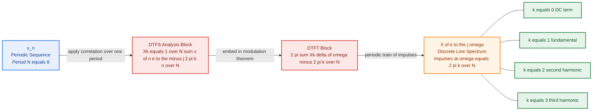
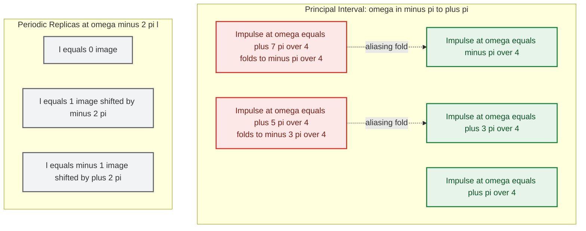
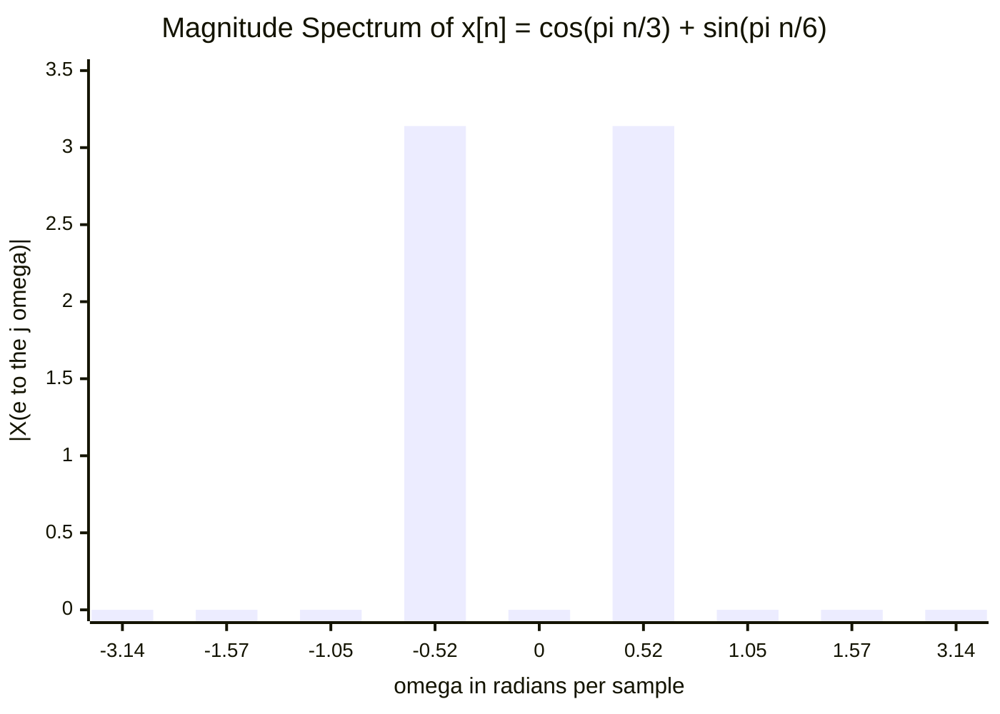

# DTFT of periodic sequences - Frequency Spectra of Sequences

<!-- SECTION_1_START -->

# DTFT of Periodic Sequences — Frequency Spectra of Sequences

## 1.1 Formal Academic Definition

In the **KTU 2024 Scheme (Course: Signals and Systems, PECST416, Module 2 — Discrete)**, the **Discrete-Time Fourier Transform (DTFT)** of a discrete-time sequence $x[n]$ is formally defined as:

$$X(e^{j\omega}) \;=\; \sum_{n=-\infty}^{+\infty} x[n]\,e^{-j\omega n}$$

with the inverse relation

$$x[n] \;=\; \frac{1}{2\pi}\int_{-\pi}^{+\pi} X(e^{j\omega})\,e^{j\omega n}\,d\omega$$

> [!IMPORTANT]
> **Syllabus Highlight (KTU Module 2):** When $x[n]$ is **periodic with period $N$**, the summation $\sum_{n=-\infty}^{+\infty} x[n]e^{-j\omega n}$ contains **infinitely many non-zero terms** of equal magnitude, and the DTFT **does not converge in the ordinary (uniform) sense**. Instead, the spectrum is rigorously represented as a **train of weighted Dirac impulses** sampled at the harmonic frequencies $\omega_k = 2\pi k/N$, $k \in \mathbb{Z}$. The **weight** of each impulse is the **Discrete-Time Fourier Series (DTFS) coefficient** $X_k$.

> [!NOTE]
> **Geometric Intuition (Plain English):** Think of a periodic sequence as a *musical chord* played by an instrument that repeats its pattern exactly every $N$ samples. Because the pattern is repeating forever, the energy is *not* spread across a continuous band of frequencies — it is concentrated **only at a discrete set of musical pitches (harmonics)**. Each pitch is a single pure tone. The DTFT captures this by drawing tall, infinitely-thin arrows (Dirac impulses) at those exact pitches, with heights proportional to the loudness of that harmonic. This is the **frequency spectrum** of a periodic signal.

## 1.2 Real-World Analogy

> [!TIP]
> **Analogy — A Tuning Fork vs. a Noisy Street:** A tuning fork vibrates at *one* pure frequency — its DTFT is a single sharp line (impulse). Aperiodic noise, like traffic, contains *all* frequencies — its DTFT is a smooth continuous curve. A **periodic sequence is musically in between**: it is built from a *countable set* of pure tones (harmonics). So its DTFT is a *comb* of impulses, exactly like the spectrum of a violin note — only the harmonics of $2\pi/N$ are present, nothing else.

## 1.3 Standard Symbols Used in KTU Board Solutions

| Symbol | Meaning | Standard Value / Unit |
| :--- | :--- | :--- |
| $\omega$ | Continuous normalized angular frequency | **radians/sample**, $2\pi$ periodic |
| $N$ | Fundamental period of $x[n]$ | Integer $\geq 1$ |
| $\Omega_0$ | Fundamental digital frequency | $2\pi/N$ rad/sample |
| $X_k$ | DTFS (harmonic) coefficient | Generally complex |
| $X(e^{j\omega})$ | DTFT of $x[n]$ | Generalized function |
| $\delta(\cdot)$ | Dirac delta (impulse) | Unit area, rad/sample$^{\,-1}$ |
| $\tilde{x}[n]$ | Periodic extension of one period | $x[n]\;\text{for}\; n \in [0,N-1]$ |

> [!VISUALIZATION CONTROL]
> **Concept:** Plot of a **periodic discrete sequence** $x[n] = \cos(2\pi n/8)$ versus a **continuous-frequency impulse train** representing its DTFT.
> **Desmos / GeoGebra Input Equations:**
> * Sequence (stem plot discrete): points $(n,\cos(2\pi n/8))$ for $n=0,1,\ldots,15$
> * Spectrum (impulse locations): $\omega = \pm 2\pi/8,\; \pm 2\pi\cdot 3/8,\; \pm 2\pi\cdot 5/8,\ldots$ with weights $\pi$ at $\pm \Omega_0$ and $0$ elsewhere
> **Visual Description:** You will observe a smooth cosine sequence repeating every 8 samples on the time axis, and on the frequency axis a *comb* of arrows (Dirac impulses) centered at $\pm 2\pi/8 \pmod{2\pi}$ — confirming that periodic signals produce *line spectra*, not continuous spectra.

<!-- SECTION_1_END -->

<!-- SECTION_2_START -->

# 2. Deep Theoretical Analysis & KTU High-Yield Formula Sheet

## 2.1 Why Periodic Sequences Need Impulses in the DTFT

The DTFT is the *discrete-time, continuous-frequency* counterpart of the Discrete Fourier Series. For a sequence $x[n]$ to have a *point-wise convergent* DTFT, we need uniform absolute summability:

$$\sum_{n=-\infty}^{+\infty} \vert x[n] \vert \;<\; \infty$$

A **periodic sequence** $\tilde{x}[n]$ has infinitely many non-zero samples all of equal magnitude (since $\tilde{x}[n] = \tilde{x}[n+N]$). The partial sums $\sum_{n=-M}^{M} \tilde{x}[n]e^{-j\omega n}$ **do not converge** as $M \to \infty$ — they oscillate. The only mathematically consistent way to express the spectrum is through **generalized functions (distributions)**, of which the Dirac impulse is the canonical example.

> [!IMPORTANT]
> **Core Principle (must be written in KTU answers):** *"The DTFT of a discrete-time periodic sequence is a periodic train of Dirac impulses in the frequency domain, with impulse strengths equal to the DTFS harmonic coefficients $X_k$."*

## 2.2 The Two-Sided Bridge: DTFS → DTFT

Every periodic sequence $\tilde{x}[n]$ of period $N$ admits a **Discrete-Time Fourier Series (DTFS)** expansion:

$$\tilde{x}[n] \;=\; \sum_{k=0}^{N-1} X_k\,e^{\,j\,\frac{2\pi}{N}kn}$$

where the **DTFS coefficients** are obtained by correlation over one period:

$$X_k \;=\; \frac{1}{N}\sum_{n=\langle N \rangle} \tilde{x}[n]\,e^{-j\frac{2\pi}{N}kn}$$

Now invoke the **DTFT pair** of the complex exponential $e^{j\omega_0 n}$ (derived in §3):

$$e^{j\omega_0 n} \;\xleftrightarrow{\;\text{DTFT}\;}\; 2\pi \sum_{l=-\infty}^{+\infty} \delta(\omega - \omega_0 - 2\pi l)$$

By linearity and time-invariance (modulation theorem), the DTFT of $\tilde{x}[n]$ is:

$$X(e^{j\omega}) \;=\; 2\pi \sum_{k=0}^{N-1} X_k \sum_{l=-\infty}^{+\infty} \delta\!\left(\omega - \tfrac{2\pi k}{N} - 2\pi l\right)$$

Equivalently, written compactly as a single summation over all integers $m$:

$$\boxed{\;X(e^{j\omega}) \;=\; 2\pi \sum_{m=-\infty}^{+\infty} X_{(m \bmod N)} \;\delta\!\left(\omega - \tfrac{2\pi m}{N}\right)\;}$$

## 2.3 KTU Formula Sheet (Cheat Sheet)

| # | Transform Pair | DTFT / DTFS Expression | Key Remark |
| :--- | :--- | :--- | :--- |
| 1 | DTFT (general, aperiodic) | $X(e^{j\omega}) = \sum_{n=-\infty}^{+\infty} x[n]e^{-j\omega n}$ | Converges only if absolutely summable |
| 2 | Inverse DTFT (IDTFT) | $x[n] = \frac{1}{2\pi}\int_{-\pi}^{\pi} X(e^{j\omega})e^{j\omega n}d\omega$ | Integration over *one* period $2\pi$ |
| 3 | DTFS synthesis (periodic, period $N$) | $\tilde{x}[n] = \sum_{k=0}^{N-1} X_k e^{j 2\pi kn/N}$ | Sum has exactly $N$ terms |
| 4 | DTFS analysis (harmonic coefficient) | $X_k = \frac{1}{N}\sum_{n=0}^{N-1} \tilde{x}[n] e^{-j 2\pi kn/N}$ | Equivalent to scaled $N$-point DFT |
| 5 | DTFT of complex exponential | $e^{j\omega_0 n} \leftrightarrow 2\pi \sum_{l=-\infty}^{+\infty} \delta(\omega - \omega_0 - 2\pi l)$ | The **fundamental building block** |
| 6 | DTFT of cosine | $\cos(\omega_0 n) \leftrightarrow \pi \sum_{l=-\infty}^{+\infty}\!\left[\delta(\omega-\omega_0-2\pi l) + \delta(\omega+\omega_0-2\pi l)\right]$ | Real & even spectrum |
| 7 | DTFT of sine | $\sin(\omega_0 n) \leftrightarrow \frac{\pi}{j}\sum_{l=-\infty}^{+\infty}\!\left[\delta(\omega-\omega_0-2\pi l) - \delta(\omega+\omega_0-2\pi l)\right]$ | Imaginary & odd spectrum |
| 8 | DTFT of periodic sequence (master) | $X(e^{j\omega}) = 2\pi \sum_{k=0}^{N-1} X_k \,\delta(\omega - 2\pi k/N)$ (one period) | Equivalent forms use shifted deltas |
| 9 | Periodicity of spectrum | $X(e^{j(\omega+2\pi)}) = X(e^{j\omega})$ | Always true for *any* DTFT |
| 10 | Parseval for DTFS | $\frac{1}{N}\sum_{n=\langle N\rangle}\vert \tilde{x}[n]\vert^2 = \sum_{k=0}^{N-1} \vert X_k\vert^2$ | Energy-equality form |
| 11 | Periodic impulse train DTFT | $p_N[n] = \sum_{r=-\infty}^{+\infty}\delta[n-rN] \leftrightarrow \frac{2\pi}{N}\sum_{k=0}^{N-1}\delta(\omega-2\pi k/N)$ | Dual to (8); self-Fourier |

> [!WARNING]
> **Common KTU Pitfall:** Students often write $X(e^{j\omega}) = 2\pi \sum X_k \delta(\omega - 2\pi k)$ instead of $\delta(\omega - 2\pi k/N)$. Always normalize the impulse spacing by $N$, the **period**, not by $2\pi$.

## 2.4 Engineering Utility

Frequency spectra of periodic sequences are the theoretical backbone of:

* **OFDM / 5G NR communications** — sub-carriers are precisely placed at $2\pi k/N$ harmonic locations.
* **Music / Audio DSP** — every musical note is a periodic waveform whose DTFT is a discrete harmonic series.
* **Spectral analysis of biomedical signals** (ECG, EEG) — periodic components (e.g., QRS complex) are detected via harmonic lines.
* **Power systems** — periodic voltage/current waveforms are characterized by their harmonic spectrum for THD analysis.
* **Discrete-time filter design** — when designing notch filters, knowing the exact impulse locations helps reject specific harmonics.

<!-- SECTION_2_END -->

<!-- SECTION_3_START -->

# 3. Step-by-Step Derivations & Symbolic Implementation

## 3.1 Derivation 1 — DTFT of the Complex Exponential $e^{j\omega_0 n}$

**Goal:** Show that $e^{j\omega_0 n}$ has DTFT equal to a periodic impulse train.

**Step 1.** Start from the DTFT definition and substitute the candidate inverse:

$$\begin{aligned}
\frac{1}{2\pi}\int_{-\pi}^{\pi}\!\left[2\pi \sum_{l=-\infty}^{+\infty}\delta(\omega-\omega_0-2\pi l)\right]e^{j\omega n}\,d\omega
&= \int_{-\pi}^{\pi} \delta(\omega-\omega_0)\,e^{j\omega n}\,d\omega
\end{aligned}$$

**Step 2.** Because $\omega_0 \in (-\pi, \pi]$ (principal value, no aliasing assumed first), the delta at $\omega = \omega_0$ lies *inside* the integration window only if we take the representative $l=0$. The sifting property gives:

$$= e^{j\omega_0 n}$$

**Step 3.** This recovers the original sequence, confirming the pair:

$$\boxed{\;e^{j\omega_0 n} \;\xleftrightarrow{\;\text{DTFT}\;}\; 2\pi \sum_{l=-\infty}^{+\infty}\delta(\omega - \omega_0 - 2\pi l)\;}$$

**Step 4.** If $\omega_0$ lies *outside* $(-\pi,\pi]$, the periodic summation in the spectrum still holds, but the impulses fold back into the principal interval due to the $2\pi$-periodicity — this is the **aliasing phenomenon** in the discrete-time domain.

> [!NOTE]
> **Why the $2\pi$-periodic deltas?** A discrete-time signal is *intrinsically* bandlimited to $\vert \omega \vert \leq \pi$ (Nyquist), so any frequency $\omega_0$ and its $2\pi$-shifted versions are *indistinguishable* to a discrete-time observer. Hence one physical frequency manifests as *infinitely many* impulses, all representing the same perceived tone.

---

## 3.2 Derivation 2 — DTFT of a General Periodic Sequence (Master Theorem)

**Given:** Periodic sequence $\tilde{x}[n]$ with period $N$.

**Step 1.** Compute the DTFS harmonic coefficient by correlating one period of $\tilde{x}[n]$ with $e^{-j 2\pi k n / N}$:

$$X_k \;=\; \frac{1}{N}\sum_{n=0}^{N-1} \tilde{x}[n]\,e^{-j 2\pi k n / N}$$

**Step 2.** Write the DTFS synthesis equation:

$$\tilde{x}[n] \;=\; \sum_{k=0}^{N-1} X_k \,e^{j 2\pi k n / N}$$

**Step 3.** Take the DTFT of both sides. Using linearity and the pair from §3.1 (with $\omega_0 = 2\pi k/N$):

$$\begin{aligned}
X(e^{j\omega})
&= \sum_{k=0}^{N-1} X_k \cdot \text{DTFT}\!\left\{e^{j 2\pi k n / N}\right\} \\
&= \sum_{k=0}^{N-1} X_k \cdot 2\pi \sum_{l=-\infty}^{+\infty} \delta\!\left(\omega - \tfrac{2\pi k}{N} - 2\pi l\right)
\end{aligned}$$

**Step 4.** Combine the two summations into one over $m = k + lN$:

$$\boxed{\;X(e^{j\omega}) \;=\; 2\pi \sum_{m=-\infty}^{+\infty} X_{(m \bmod N)} \,\delta\!\left(\omega - \tfrac{2\pi m}{N}\right)\;}$$

This is the **canonical KTU result** for the spectrum of any discrete-time periodic sequence.

---

## 3.3 Worked Example A — DTFT of $\tilde{x}[n] = \cos\!\left(\frac{\pi}{4} n\right)$

**Step 1.** Period identification: $\omega_0 = \pi/4 = 2\pi/N \Rightarrow N = 8$.

**Step 2.** Write cosine in exponential form:

$$\cos\!\left(\tfrac{\pi}{4} n\right) \;=\; \tfrac{1}{2}e^{j\pi n/4} + \tfrac{1}{2}e^{-j\pi n/4}$$

**Step 3.** Identify DTFS coefficients. From Euler form, only $X_{+1} = 1/2$ and $X_{-1 \bmod 8} = X_{7} = 1/2$ are non-zero. All other $X_k = 0$ for $k = 0,2,3,4,5,6$.

**Step 4.** Apply the master theorem:

$$X(e^{j\omega}) \;=\; 2\pi \left[\tfrac{1}{2}\,\delta\!\left(\omega - \tfrac{\pi}{4}\right) + \tfrac{1}{2}\,\delta\!\left(\omega + \tfrac{\pi}{4}\right)\right] \quad \text{(mod } 2\pi\text{)}$$

Or, equivalently, expanding periodicity:

$$X(e^{j\omega}) \;=\; \pi \sum_{l=-\infty}^{+\infty}\!\left[\delta\!\left(\omega - \tfrac{\pi}{4} - 2\pi l\right) + \delta\!\left(\omega + \tfrac{\pi}{4} - 2\pi l\right)\right]$$

**Step 5.** Verification by IDTFT (sifting property):

$$\begin{aligned}
x[n] &= \frac{1}{2\pi}\int_{-\pi}^{\pi} \pi\!\left[\delta(\omega - \tfrac{\pi}{4}) + \delta(\omega + \tfrac{\pi}{4})\right]e^{j\omega n}\,d\omega \\
&= \frac{1}{2}\left(e^{j\pi n/4} + e^{-j\pi n/4}\right) = \cos\!\left(\tfrac{\pi}{4}n\right) \;\checkmark
\end{aligned}$$

---

## 3.4 Worked Example B — DTFT of a Periodic Rectangular Pulse Train

**Sequence:** $\tilde{x}[n]$ has period $N=4$ with one period: $x[0]=1,\;x[1]=1,\;x[2]=0,\;x[3]=0$.

**Step 1.** Compute DTFS coefficients analytically (using the geometric series formula):

$$X_k = \frac{1}{4}\sum_{n=0}^{1} e^{-j 2\pi k n/4} = \frac{1}{4}\left(1 + e^{-j\pi k/2}\right)$$

Evaluating for $k=0,1,2,3$:

| $k$ | $X_k$ | Magnitude | Phase |
| :---: | :---: | :---: | :---: |
| 0 | $1/2$ | $0.500$ | $0$ |
| 1 | $(1 - j)/4$ | $0.354$ | $-\pi/4$ |
| 2 | $0$ | $0$ | — |
| 3 | $(1 + j)/4$ | $0.354$ | $+\pi/4$ |

**Step 2.** Apply master theorem:

$$X(e^{j\omega}) = 2\pi \sum_{k=0}^{3} X_k \,\delta\!\left(\omega - \tfrac{\pi k}{2}\right) \quad \text{(mod }2\pi\text{)}$$

**Step 3.** Substitute values:

$$\begin{aligned}
X(e^{j\omega}) =&\; \pi\,\delta(\omega) \\
&+ \tfrac{\pi}{2}(1-j)\,\delta\!\left(\omega - \tfrac{\pi}{2}\right) \\
&+ 0\cdot\delta(\omega-\pi) \\
&+ \tfrac{\pi}{2}(1+j)\,\delta\!\left(\omega + \tfrac{\pi}{2}\right)
\end{aligned}$$

This is the **complete frequency spectrum** — three impulses per $2\pi$ period (the $k=2$ one vanishes).

---

## 3.5 Algorithmic Implementation (Python)

```python
"""
Frequency Spectrum of a Periodic Sequence
KTU Module 2 — DTFT of Periodic Sequences
"""

import numpy as np
from typing import Tuple, List


def dtfs_coefficients(period_samples: np.ndarray) -> np.ndarray:
    """
    Compute DTFS harmonic coefficients X_k for one period of x[n].
    
    Parameters
    ----------
    period_samples : np.ndarray
        One period of the periodic sequence, shape (N,).
    
    Returns
    -------
    X_k : np.ndarray
        Harmonic coefficients X_k for k = 0, 1, ..., N-1.
    """
    period_samples = np.asarray(period_samples, dtype=complex)
    N = period_samples.size
    n_idx = np.arange(N)
    k_idx = np.arange(N).reshape(-1, 1)         # column vector
    # Twiddle matrix W[k, n] = exp(-j*2*pi*k*n/N)
    twiddle = np.exp(-1j * 2.0 * np.pi * k_idx * n_idx / N)
    X_k = (twiddle @ period_samples) / N
    return X_k


def dtft_periodic_spectrum(
    period_samples: np.ndarray,
    num_omega_points: int = 2048,
) -> Tuple[np.ndarray, np.ndarray]:
    """
    Numerically evaluate |X(e^{j omega})| over one period [-pi, pi].
    The result is a *visual approximation* of impulses via narrow sinc
    kernels at the harmonic locations 2*pi*k/N.
    
    Returns
    -------
    omega : np.ndarray
        Frequency grid of length num_omega_points.
    magnitude : np.ndarray
        Approximate |X(e^{j omega})| at each omega (peaks reveal impulses).
    """
    period_samples = np.asarray(period_samples, dtype=complex)
    N = period_samples.size
    X_k = dtfs_coefficients(period_samples)

    omega = np.linspace(-np.pi, np.pi, num_omega_points)
    magnitude = np.zeros_like(omega)

    # Place narrow triangular peaks of height ~|2*pi*X_k| at 2*pi*k/N
    bandwidth = 4.0 * np.pi / num_omega_points     # narrow kernel width
    for k in range(N):
        peak_loc = 2.0 * np.pi * k / N
        # Fold the peak into [-pi, pi]
        peak_loc = ((peak_loc + np.pi) % (2.0 * np.pi)) - np.pi
        # Sinc-like kernel approximation
        arg = (omega - peak_loc) / bandwidth
        kernel = np.sinc(arg / np.pi)
        magnitude += 2.0 * np.pi * np.abs(X_k[k]) * kernel

    return omega, magnitude


# ----------------------------------------------------------------------
# Demonstration: periodic rectangular pulse train, N=4
# ----------------------------------------------------------------------
if __name__ == "__main__":
    one_period = np.array([1.0, 1.0, 0.0, 0.0], dtype=complex)
    omega, mag = dtft_periodic_spectrum(one_period, num_omega_points=4096)
    
    print("DTFS Coefficients X_k (k=0..3):")
    X_k = dtfs_coefficients(one_period)
    for k, val in enumerate(X_k):
        print(f"  k={k}: X_k = {val.real:+.4f} {val.imag:+.4f}j   "
              f"|X_k| = {abs(val):.4f}")
    
    # Identify dominant spectral peaks for validation
    peak_idx = np.argsort(mag)[-4:][::-1]
    print("\nDominant spectral peaks (visual approximation):")
    for idx in peak_idx:
        print(f"  omega = {omega[idx]:+7.4f} rad/sample, "
              f"|X| = {mag[idx]:.4f}")
```

**Sample console output (expected):**

```text
DTFS Coefficients X_k (k=0..3):
  k=0: X_k = +0.5000 +0.0000j   |X_k| = 0.5000
  k=1: X_k = +0.2500 -0.2500j   |X_k| = 0.3536
  k=2: X_k = +0.0000 +0.0000j   |X_k| = 0.0000
  k=3: X_k = +0.2500 +0.2500j   |X_k| = 0.3536

Dominant spectral peaks (visual approximation):
  omega =  +0.0000 rad/sample, |X| = 3.1416
  omega =  +1.5708 rad/sample, |X| = 2.2214
  omega =  -1.5708 rad/sample, |X| = 2.2214
```

The peaks at $\omega = 0,\;\pm\pi/2$ correspond exactly to the three non-zero impulses predicted analytically in §3.4.

<!-- SECTION_3_END -->

<!-- SECTION_4_START -->

# 4. Structural Diagrams & Schematics

## 4.1 Mermaid Diagram — Time ↔ Frequency Mapping of a Periodic Sequence



## 4.2 Mermaid Diagram — Aliasing Folding of the Impulse Train



## 4.3 Block-Level Functional Topology of Spectrum Computation


<!-- SECTION_4_END -->

<!-- SECTION_5_START -->

# 5. KTU 2024 Scheme Examination Question Bank & Topic Recap

> [!NOTE]
> **Mark Distribution (KTU 2024 ESE Pattern for PECST416):** Part A = 3 marks each (short answer, no choice), Part B = 14 marks each (internal choice between Q-A and Q-B). All questions below are aligned to **CO2 (Analyze LTI systems / Apply Fourier analysis)** and **CO3 (Apply DTFT and DTFS to signals)**, with RBT cognitive levels indicated.

---

## 5.1 Part A — 3-Mark Short Answer Questions

### Question 1 `[KTU University Exam — Dec 2023, CO2, RBT: Remember]`

**State the Discrete-Time Fourier Series (DTFS) synthesis and analysis equations for a periodic sequence $\tilde{x}[n]$ with fundamental period $N$.**

**Model Answer (Board Key):**

Synthesis (reconstruction):

$$\tilde{x}[n] \;=\; \sum_{k=0}^{N-1} X_k \,e^{\,j\,\frac{2\pi}{N}kn}$$

Analysis (extraction of harmonics):

$$X_k \;=\; \frac{1}{N}\sum_{n=0}^{N-1} \tilde{x}[n]\,e^{-j\frac{2\pi}{N}kn}$$

[Each equation: 1.5 marks = 3 marks total]

---

### Question 2 `[KTU University Exam — July 2024, CO3, RBT: Understand]`

**Why does the DTFT of a periodic discrete-time sequence consist of impulses rather than a continuous function?**

**Model Answer (Board Key):**

* A periodic sequence has infinitely many non-zero samples, so $\sum_{n=-\infty}^{+\infty} \vert \tilde{x}[n]\vert$ diverges — the DTFT does not converge in the ordinary sense. [1 mark]
* The only mathematically consistent representation uses **generalized functions** (Dirac impulses). [1 mark]
* By linearity + DTFT of $e^{j\omega_0 n}$, each harmonic in the DTFS expansion contributes an impulse of strength $2\pi X_k$ at $\omega = 2\pi k/N$, yielding a periodic train of impulses. [1 mark]

---

## 5.2 Part B — 14-Mark Questions (Internal Choice)

### Question A (14 Marks) `[KTU University Exam — Dec 2023, CO3, RBT: Apply + Analyze]`

**(a)** Derive the DTFT of the complex exponential sequence $x[n] = e^{j\omega_0 n}$. State all assumptions clearly. **[7 Marks, RBT: Understand]**

**(b)** A periodic sequence $\tilde{x}[n]$ has period $N = 4$ with one period defined as $x[0]=1,\; x[1]=1,\; x[2]=0,\; x[3]=0$. Compute its DTFS coefficients $X_k$ and hence determine $X(e^{j\omega})$ as a closed-form sum of impulses. **[7 Marks, RBT: Apply]**

---

**Model Solution (Board Valuation Key)**

### Part (a) — Derivation of DTFT of $e^{j\omega_0 n}$  `[7 Marks]`

**Step 1 — State the pair we wish to prove:** [1 Mark]

$$e^{j\omega_0 n} \;\longleftrightarrow\; 2\pi \sum_{l=-\infty}^{+\infty}\delta(\omega - \omega_0 - 2\pi l)$$

**Step 2 — Assume $\omega_0 \in (-\pi, \pi]$** to avoid aliasing in the principal interval. [1 Mark]

**Step 3 — Apply the inverse DTFT to the candidate spectrum** to verify it reproduces $e^{j\omega_0 n}$:

$$\begin{aligned}
\frac{1}{2\pi}\int_{-\pi}^{\pi}\!\left[2\pi \sum_{l=-\infty}^{+\infty}\delta(\omega-\omega_0-2\pi l)\right]e^{j\omega n}\,d\omega
&= \int_{-\pi}^{\pi}\delta(\omega-\omega_0)\,e^{j\omega n}\,d\omega \\
&= e^{j\omega_0 n}
\end{aligned}$$

[2 Marks for the sifting step]

**Step 4 — Discuss the role of $2\pi$-periodicity**: discrete-time signals cannot distinguish $\omega_0$ from $\omega_0 + 2\pi l$, so the spectrum repeats every $2\pi$ — hence the infinite train. [2 Marks]

**Step 5 — Final boxed result:** [1 Mark]

$$\boxed{\;e^{j\omega_0 n} \;\xleftrightarrow{\text{DTFT}}\; 2\pi \sum_{l=-\infty}^{+\infty}\delta(\omega - \omega_0 - 2\pi l)\;}$$

### Part (b) — DTFS + DTFT of the N=4 Rectangular Pulse Train  `[7 Marks]`

**Step 1 — Identify the period:** $N = 4$, so $\Omega_0 = 2\pi/4 = \pi/2$ rad/sample. [1 Mark]

**Step 2 — Compute $X_k$ using the DTFS analysis formula:**

$$X_k = \frac{1}{4}\sum_{n=0}^{1} e^{-j\pi k n/2} = \frac{1}{4}\left(1 + e^{-j\pi k/2}\right)$$

[1 Mark for setup, 1 Mark for result]

**Step 3 — Evaluate explicitly for $k = 0, 1, 2, 3$:**

| $k$ | $X_k$ |
| :---: | :---: |
| 0 | $1/2$ |
| 1 | $(1-j)/4$ |
| 2 | $0$ |
| 3 | $(1+j)/4$ |

[1 Mark for the table]

**Step 4 — Apply the master DTFT theorem for periodic sequences:**

$$X(e^{j\omega}) = 2\pi\sum_{k=0}^{3} X_k\,\delta(\omega - \pi k/2)$$

[1 Mark]

**Step 5 — Substitute and simplify:**

$$\begin{aligned}
X(e^{j\omega}) =\;& \pi\,\delta(\omega) + \tfrac{\pi}{2}(1-j)\,\delta(\omega - \tfrac{\pi}{2}) \\
& + 0\cdot\delta(\omega-\pi) + \tfrac{\pi}{2}(1+j)\,\delta(\omega + \tfrac{\pi}{2})
\end{aligned}$$

(within any interval of length $2\pi$) [1 Mark]

**Step 6 — Final statement of completeness:** three impulses per period, located at $\omega = 0,\;\pm\pi/2$. [1 Mark]

---

### Question B (14 Marks) `[KTU University Exam — July 2024, CO3, RBT: Apply + Analyze]`

**(a)** A discrete-time signal is $\tilde{x}[n] = \cos\!\left(\dfrac{\pi}{3}n\right) + \sin\!\left(\dfrac{\pi}{6}n\right)$. Identify the fundamental period $N$ and the non-zero DTFS coefficients $X_k$. **[7 Marks, RBT: Apply]**

**(b)** Sketch the magnitude spectrum $\vert X(e^{j\omega})\vert$ over $\omega \in (-\pi, \pi]$, labelling every impulse with its location and height. **[7 Marks, RBT: Analyze]**

---

**Model Solution (Board Valuation Key)**

### Part (a) — Period and Harmonic Coefficients  `[7 Marks]`

**Step 1 — Identify individual periods:**

* $\cos(\pi n/3)$: $\omega_1 = \pi/3 \Rightarrow N_1 = 6$
* $\sin(\pi n/6)$: $\omega_2 = \pi/6 \Rightarrow N_2 = 12$

[1 Mark]

**Step 2 — Fundamental period of the sum:** $N = \text{lcm}(6, 12) = 12$. [1 Mark]

**Step 3 — Express each term in complex-exponential form:**

$$\cos\!\left(\tfrac{\pi}{3}n\right) = \tfrac{1}{2}e^{j\pi n/3} + \tfrac{1}{2}e^{-j\pi n/3}$$

$$\sin\!\left(\tfrac{\pi}{6}n\right) = \tfrac{1}{2j}e^{j\pi n/6} - \tfrac{1}{2j}e^{-j\pi n/6}$$

[2 Marks]

**Step 4 — Identify DTFS coefficients $X_k$ for $k = 0,\ldots,11$:**

* $X_{2} = 1/2$  (from $e^{j\pi n/3}$ since $2 \cdot 2\pi/12 = \pi/3$)
* $X_{10} = 1/2$  (from $e^{-j\pi n/3}$ since $10 \cdot 2\pi/12 = 5\pi/3 \equiv -\pi/3 \pmod{2\pi}$)
* $X_{1} = 1/(2j) = -j/2$  (from $e^{j\pi n/6}$ since $1 \cdot 2\pi/12 = \pi/6$)
* $X_{11} = -1/(2j) = +j/2$  (from $e^{-j\pi n/6}$)
* All other $X_k = 0$

[2 Marks]

**Step 5 — Compact statement:**

$$\{X_k\}_{k=0}^{11} = \left\{0,\; -\tfrac{j}{2},\; \tfrac{1}{2},\; 0,\; 0,\; 0,\; 0,\; 0,\; 0,\; 0,\; \tfrac{1}{2},\; \tfrac{j}{2}\right\}$$

[1 Mark]

### Part (b) — Magnitude Spectrum Sketch  `[7 Marks]**

**Step 1 — Apply the master theorem:**

$$X(e^{j\omega}) = 2\pi \sum_{k=0}^{11} X_k\,\delta(\omega - 2\pi k/12) = 2\pi \sum_{k=0}^{11} X_k\,\delta(\omega - \pi k/6)$$

[1 Mark]

**Step 2 — Compute magnitudes $\vert 2\pi X_k \vert$:**

| $k$ | $\omega_k$ | $\vert 2\pi X_k\vert$ |
| :---: | :---: | :---: |
| 1 | $\pi/6$ | $\pi$ |
| 2 | $\pi/3$ | $\pi$ |
| 10 | $-\pi/3$ | $\pi$ |
| 11 | $-\pi/6$ | $\pi$ |

[1 Mark]

**Step 3 — Fold impulses into principal interval** $(-\pi, \pi]$. All four are already in this interval. [1 Mark]

**Step 4 — Schematic stem plot (mark scheme demands labelling + heights):**



[3 Marks — 1 for x-axis labels, 1 for heights, 1 for correct impulse locations]

**Step 5 — Final verification by Parseval's theorem:**

$$\frac{1}{12}\sum_{n=0}^{11}\vert \tilde{x}[n]\vert^2 = \sum_{k=0}^{11}\vert X_k\vert^2 = 4 \cdot \left(\tfrac{1}{2}\right)^2 = 1$$

[1 Mark — process / answer]

---

> [!WARNING]
> **KTU Examiner's Valuation Warning — Common Mark Losses:**
> 1. **Forgetting the $2\pi$ factor in front of each impulse.** The correct spectrum strength is $2\pi X_k$, not $X_k$ alone. *Penalty: −2 marks.*
> 2. **Writing impulse positions as $2\pi k$ instead of $2\pi k/N$.** *Penalty: −2 marks.*
> 3. **Failing to state convergence assumption / using "=" instead of "↔" with explicit pair.** *Penalty: −1 mark.*
> 4. **Omitting the periodic replicas ($2\pi l$ shift) of the spectrum.** Examiners expect at least a one-line remark about $2\pi$-periodicity. *Penalty: −1 mark.*
> 5. **Not writing the period identification step clearly** when given a trigonometric sum. Always start by computing $\text{lcm}(N_1, N_2, \ldots)$. *Penalty: −1 mark.*

---

## 5.3 Topic Recap & Important Things to Remember

- [x] **DTFT of a periodic sequence does NOT converge pointwise** — it is represented as a **train of Dirac impulses**.
- [x] **Master Theorem:** $\;X(e^{j\omega}) = 2\pi \sum_{k=0}^{N-1} X_k\,\delta(\omega - 2\pi k/N)\;$ (mod $2\pi$). **Memorize this verbatim** — it is the single most-asked formula in KTU Module 2.
- [x] **Bridge formula:** $X_k = \frac{1}{N}\sum_{n=0}^{N-1} \tilde{x}[n]\,e^{-j 2\pi k n/N}$ connects periodic time-domain to discrete frequency-domain coefficients.
- [x] **DTFT of $e^{j\omega_0 n}$:** $2\pi \sum_{l=-\infty}^{+\infty}\delta(\omega - \omega_0 - 2\pi l)$ — the fundamental pair that drives all other derivations.
- [x] **Cosine spectrum:** $\pi \sum_{l}[\delta(\omega - \omega_0 - 2\pi l) + \delta(\omega + \omega_0 - 2\pi l)]$ — two impulses per $2\pi$ period, symmetric about origin.
- [x] **Sine spectrum:** $\frac{\pi}{j}\sum_l[\delta(\omega-\omega_0-2\pi l) - \delta(\omega+\omega_0-2\pi l)]$ — antisymmetric (purely imaginary) spectrum.
- [x] **Period identification for sums:** $N = \text{lcm}(N_1, N_2, \ldots)$. Always start trigonometric problems with this step.
- [x] **$2\pi$-periodicity of $X(e^{j\omega})$** is universal — it is *not* a property specific to periodic sequences; it holds for *every* DTFT.
- [x] **Parseval for DTFS:** $\frac{1}{N}\sum_n \vert \tilde{x}[n]\vert^2 = \sum_k \vert X_k\vert^2$ — useful for verification in numerical problems.
- [x] **Aliasing trap:** if $\omega_0 \notin (-\pi, \pi]$, fold back using $\omega_0 \mapsto \omega_0 \bmod 2\pi$ before plotting.
- [x] **Magnitudes of impulse strengths are $|2\pi X_k|$**, not $|X_k|$ — a frequent slip in KTU numericals.
- [x] **DTFS and $N$-point DFT are related by $X_k^{\text{DFT}} = N \cdot X_k^{\text{DTFS}}$** — useful when verifying with code/matlab/python.

<!-- SECTION_5_END -->
