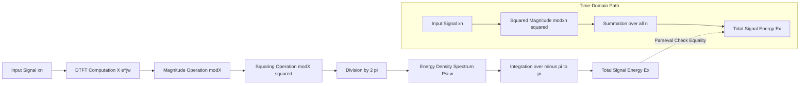
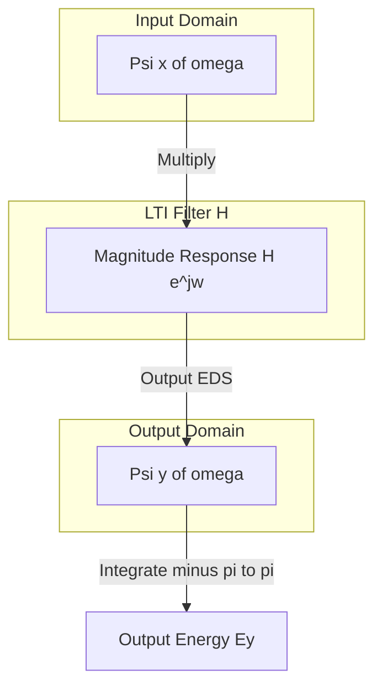

# Energy density spectra

<!-- SECTION_1_START -->

# Energy Density Spectra of Discrete-Time Signals

> [!IMPORTANT]
> **KTU 2024 Scheme Focus:** This topic is a high-yield application of the **Discrete-Time Fourier Transform (DTFT)** and **Parseval's Theorem**. It directly addresses how a signal's *energy* is distributed across the normalized frequency axis $\omega \in [-\pi, \pi]$.

## 1.1 Formal Definition

For a discrete-time **aperiodic** signal $x[n]$ with finite energy $E_x < \infty$, the **Energy Density Spectrum (EDS)**, denoted $\Psi_x(\omega)$, is formally defined as the squared magnitude of its DTFT, normalized by $2\pi$:

$$\Psi_x(\omega) \;=\; \frac{\vert X(e^{j\omega}) \vert^{2}}{2\pi}$$

where $X(e^{j\omega}) = \displaystyle\sum_{n=-\infty}^{\infty} x[n]\,e^{-j\omega n}$ is the DTFT of $x[n]$.

The function $\Psi_x(\omega)$ is a **real, even, and non-negative** function of the angular frequency $\omega$. It tells us exactly *how much energy per unit bandwidth* the signal $x[n]$ carries at each frequency $\omega$.

## 1.2 Intuitive Overview & Analogy

> [!NOTE]
> **Conceptual Analogy — The "Spectral Power Meter"**
>
> Imagine a beam of **white light** passing through a prism. The prism separates the light into its constituent colours (red, orange, yellow, …). Each colour band carries a fraction of the total light energy. Now replace white light with a *discrete-time electrical signal* and the prism with the **DTFT operator**. The energy density spectrum $\Psi_x(\omega)$ acts like the prism's output: it tells you precisely how much "signal energy" lives at every frequency $\omega \in [-\pi, \pi]$.
>
> - $\Psi_x(\omega)$ is the **intensity profile** of the signal across the frequency band.
> - The **area under the curve** of $\Psi_x(\omega)$ over $[-\pi, \pi]$ equals the **total energy** of $x[n]$.

The energy density spectrum is the discrete-time counterpart of the power spectral density used in random processes, but for deterministic energy signals it is defined without any expectation operator.

## 1.3 Why is it called "Density"?

The word *density* originates from dimensional analysis. Since $x[n]$ has units of *volts* (say), $|X(e^{j\omega})|^2$ has units of $\text{volt}^2 \cdot \text{second}^2$ in continuous time. In the discrete-time case, dividing $|X(e^{j\omega})|^2$ by $2\pi$ makes $\Psi_x(\omega)$ behave like an *energy per unit angular frequency*, so that integrating (summing) it over the entire baseband recovers the total signal energy.

> [!TIP]
> **Geometric Intuition — Spectrum as a Curve**
>
> The DTFT $X(e^{j\omega})$ is in general a **complex-valued, continuous, and periodic** function of $\omega$ with period $2\pi$. Its magnitude $\vert X(e^{j\omega}) \vert$ is a real, even curve. Squaring it gives a *non-negative* curve. Dividing by $2\pi$ gives the EDS, which integrates (area under the curve) to total energy.

> [!VISUALIZATION CONTROL]
> **Concept:** Plot of the Energy Density Spectrum for a one-sided exponential signal $x[n] = (0.5)^n u[n]$.
> **Desmos / GeoGebra Input Equations (treat $\omega$ as the $x$-axis variable $t$):**
> * EDS curve: `f(t) = 1 / (2*pi*(1 - 2*0.5*cos(t) + 0.25))`
> * Lower bound axis: `x-axis from -pi to pi`
> * Magnitude squared (for comparison): `g(t) = 1 / (1 - 2*0.5*cos(t) + 0.25)`
> **Visual Description:** A symmetric bell-shaped curve centred at $\omega = 0$ (and also at $\omega = \pm 2\pi$ due to periodicity), peaking at $\omega = 0$ and reaching minimum values at $\omega = \pm\pi$. The total area under the curve from $-\pi$ to $\pi$ should equal $1/(1 - 0.5^2) = 4/3$.

---

<!-- SECTION_1_END -->

<!-- SECTION_2_START -->

# Deep Theoretical Analysis & KTU High-Yield Formula Sheet

## 2.1 Foundation — Parseval's Theorem for Aperiodic Discrete-Time Signals

Parseval's theorem is the cornerstone identity that links the energy of a signal in the **time domain** to the energy in the **frequency domain**. For a discrete-time aperiodic signal $x[n]$ with DTFT $X(e^{j\omega})$:

$$E_x \;=\; \sum_{n=-\infty}^{\infty} \vert x[n] \vert^{2} \;=\; \frac{1}{2\pi} \int_{-\pi}^{\pi} \vert X(e^{j\omega}) \vert^{2}\, d\omega$$

This identity is what makes $\vert X(e^{j\omega}) \vert^{2} / (2\pi)$ a legitimate *energy density* — when integrated (summed) across the baseband, it produces the total energy.

## 2.2 Properties of the Energy Density Spectrum

- **Real and Non-Negative:** $\Psi_x(\omega) \geq 0$ for all $\omega$ because it is a squared magnitude divided by a positive constant.
- **Even Function:** Since $\vert X(e^{j\omega}) \vert = \vert X(e^{-j\omega}) \vert$, the EDS is symmetric about $\omega = 0$.
- **Periodic with Period $2\pi$:** This is inherited from the periodicity of the DTFT itself.
- **Additivity Under Time-Shift:** If $y[n] = x[n - n_0]$, then $\vert Y(e^{j\omega}) \vert = \vert X(e^{j\omega}) \vert$, so $\Psi_y(\omega) = \Psi_x(\omega)$. A pure time shift does **not** alter the energy density spectrum (phase is discarded).
- **Convolution in Time ↔ Multiplication in Frequency:** Convolution in time corresponds to multiplication in the magnitude spectrum squared — useful for cascaded LTI systems.

## 2.3 Why $|X(e^{j\omega})|^2$ and Not $X(e^{j\omega})$ Alone?

The DTFT $X(e^{j\omega})$ is complex. A complex number carries **both amplitude and phase**. The phase information is crucial for *reconstructing* the signal, but it contributes **nothing** to its energy, because energy depends only on the magnitude squared. Therefore, the EDS is defined using only $\vert X(e^{j\omega}) \vert^{2}$, deliberately discarding the phase.

## 2.4 KTU Formula Sheet / Cheat Sheet

> [!IMPORTANT]
> **Master the following expressions — they appear in nearly every KTU board question on this topic.**

| # | Concept | Governing Equation | Domain / Units |
|---|---------|-------------------|----------------|
| 1 | Total Energy (Time Domain) | $E_x = \displaystyle\sum_{n=-\infty}^{\infty} \vert x[n] \vert^{2}$ | Unitless if $x[n]$ is unitless |
| 2 | DTFT Pair | $X(e^{j\omega}) = \displaystyle\sum_{n=-\infty}^{\infty} x[n]\,e^{-j\omega n}$ | $\omega \in [-\pi, \pi]$ |
| 3 | Inverse DTFT | $x[n] = \dfrac{1}{2\pi}\displaystyle\int_{-\pi}^{\pi} X(e^{j\omega})\,e^{j\omega n}\,d\omega$ | All $n \in \mathbb{Z}$ |
| 4 | Energy Density Spectrum (EDS) | $\Psi_x(\omega) = \dfrac{\vert X(e^{j\omega}) \vert^{2}}{2\pi}$ | Energy / (rad/sample) |
| 5 | Parseval's Theorem (EDS form) | $E_x = \displaystyle\int_{-\pi}^{\pi} \Psi_x(\omega)\,d\omega$ | Total Energy |
| 6 | EDS under Time Shift | $x[n] \to x[n-n_0] \Rightarrow \Psi(\omega)$ unchanged | Phase discarded |
| 7 | EDS through LTI System $H(e^{j\omega})$ | $\Psi_y(\omega) = \Psi_x(\omega) \cdot \vert H(e^{j\omega}) \vert^{2}$ | Filtering identity |

## 2.5 Engineering Utility of the Energy Density Spectrum

The EDS is not a purely academic construct. It is the foundation of numerous real-world engineering applications:

- **Audio and Speech Processing (e.g., MP3, AAC codecs):** Perceptual coders allocate bits according to the *energy density* of the signal in critical frequency bands. Bands with higher $\Psi_x(\omega)$ receive finer quantization.
- **Biomedical Signal Analysis (ECG, EEG):** Clinicians identify abnormal rhythms by examining the energy distribution of physiological signals across frequency bands.
- **Vibration Analysis in Mechanical Engineering:** Engineers pinpoint structural resonances by locating peaks in the EDS of accelerometer data.
- **Radar and Sonar:** Matched filtering in the frequency domain relies on the cross-EDS between transmitted and received signals.
- **Wireless Communication:** Spectral masks in 4G/5G standards are designed to limit the EDS of transmitted signals so as to avoid out-of-band interference.

---

<!-- SECTION_2_END -->

<!-- SECTION_3_START -->

# Step-by-Step Derivations, Worked Examples & Code Implementation

## 3.1 Derivation of the Energy Density Spectrum from Parseval's Identity

We begin with the inverse DTFT of $X(e^{j\omega})$:

$$x[n] = \frac{1}{2\pi} \int_{-\pi}^{\pi} X(e^{j\omega})\, e^{j\omega n}\, d\omega$$

Taking the complex conjugate of both sides (note that $x^*[n] = x[-n]$ for a symmetric interpretation, but for energy we just need the conjugate):

$$x^{*}[n] = \frac{1}{2\pi} \int_{-\pi}^{\pi} X^{*}(e^{j\omega})\, e^{-j\omega n}\, d\omega$$

Multiply $x[n]$ with $x^*[n]$ and sum over all $n$:

$$\sum_{n=-\infty}^{\infty} \vert x[n] \vert^{2} = \sum_{n=-\infty}^{\infty} x[n] \cdot x^{*}[n] = \sum_{n=-\infty}^{\infty} x[n] \left[ \frac{1}{2\pi} \int_{-\pi}^{\pi} X^{*}(e^{j\omega})\, e^{-j\omega n}\, d\omega \right]$$

Interchange the order of summation and integration (justified by absolute convergence for finite-energy signals):

$$= \frac{1}{2\pi} \int_{-\pi}^{\pi} X^{*}(e^{j\omega}) \left[ \sum_{n=-\infty}^{\infty} x[n]\, e^{-j\omega n} \right] d\omega$$

The bracketed sum is the definition of $X(e^{j\omega})$, so:

$$= \frac{1}{2\pi} \int_{-\pi}^{\pi} X^{*}(e^{j\omega}) \cdot X(e^{j\omega})\, d\omega = \frac{1}{2\pi} \int_{-\pi}^{\pi} \vert X(e^{j\omega}) \vert^{2}\, d\omega$$

This is **Parseval's Theorem**. Recognising the integrand divided by $2\pi$ as the EDS, we obtain:

$$\boxed{\,E_x = \sum_{n=-\infty}^{\infty} \vert x[n] \vert^{2} = \int_{-\pi}^{\pi} \Psi_x(\omega)\, d\omega\,}$$

This derivation is a frequently asked 7-mark question in KTU exams.

## 3.2 Worked Example 1 — One-Sided Exponential Signal

> **Problem:** Given $x[n] = a^{n}\, u[n]$ with $\vert a \vert < 1$, derive the energy density spectrum and verify Parseval's theorem.

**Step 1 — Compute the DTFT.**

The DTFT of a right-sided exponential is a standard pair:

$$X(e^{j\omega}) = \sum_{n=0}^{\infty} a^{n} e^{-j\omega n} = \sum_{n=0}^{\infty} (a e^{-j\omega})^{n} = \frac{1}{1 - a e^{-j\omega}}, \quad \vert a \vert < 1$$

**Step 2 — Compute the magnitude squared.**

$$\vert X(e^{j\omega}) \vert^{2} = X(e^{j\omega}) \cdot X^{*}(e^{j\omega}) = \frac{1}{1 - a e^{-j\omega}} \cdot \frac{1}{1 - a e^{j\omega}}$$

Multiply numerator and denominator to get a real expression:

$$= \frac{1}{(1 - a\cos\omega)^{2} + (a\sin\omega)^{2}} = \frac{1}{1 - 2a\cos\omega + a^{2}}$$

**Step 3 — Express the Energy Density Spectrum.**

$$\Psi_x(\omega) = \frac{\vert X(e^{j\omega}) \vert^{2}}{2\pi} = \frac{1}{2\pi(1 - 2a\cos\omega + a^{2})}$$

**Step 4 — Verify Parseval's Theorem.**

Total energy directly from the time domain:

$$E_x = \sum_{n=0}^{\infty} \vert a^{n} \vert^{2} = \sum_{n=0}^{\infty} a^{2n} = \frac{1}{1 - a^{2}}$$

Total energy from the EDS:

$$E_x = \int_{-\pi}^{\pi} \frac{1}{2\pi(1 - 2a\cos\omega + a^{2})}\, d\omega$$

Using the standard contour-integration result $\displaystyle\int_{-\pi}^{\pi} \frac{d\omega}{1 - 2a\cos\omega + a^{2}} = \frac{2\pi}{1 - a^{2}}$ for $\vert a \vert < 1$:

$$E_x = \frac{1}{2\pi} \cdot \frac{2\pi}{1 - a^{2}} = \frac{1}{1 - a^{2}}$$

Both methods agree — **Parseval's theorem is verified.** $\blacksquare$

## 3.3 Worked Example 2 — Finite-Duration FIR Signal

> **Problem:** Compute the EDS and total energy of $x[n] = \delta[n] - 0.5\,\delta[n-1]$.

**Step 1 — DTFT.**

$$X(e^{j\omega}) = 1 - 0.5 e^{-j\omega}$$

**Step 2 — Magnitude Squared.**

$$\vert X(e^{j\omega}) \vert^{2} = (1 - 0.5 e^{-j\omega})(1 - 0.5 e^{j\omega}) = 1 - 0.5(e^{j\omega} + e^{-j\omega}) + 0.25 = 1 - \cos\omega + 0.25$$

$$\vert X(e^{j\omega}) \vert^{2} = 1.25 - \cos\omega$$

**Step 3 — Energy Density Spectrum.**

$$\Psi_x(\omega) = \frac{1.25 - \cos\omega}{2\pi}$$

**Step 4 — Total Energy (Frequency Domain).**

$$E_x = \int_{-\pi}^{\pi} \frac{1.25 - \cos\omega}{2\pi}\, d\omega = \frac{1}{2\pi}\left[1.25 \cdot 2\pi - 0\right] = 1.25$$

**Step 5 — Verification (Time Domain).**

$$E_x = \vert 1 \vert^{2} + \vert -0.5 \vert^{2} = 1 + 0.25 = 1.25 \quad\checkmark$$

## 3.4 Python Code — Numerical Verification

```python
import numpy as np

def energy_density_spectrum(x: np.ndarray, n: np.ndarray) -> tuple[np.ndarray, np.ndarray]:
    """
    Compute the Energy Density Spectrum of a finite-energy discrete-time signal.

    Parameters
    ----------
    x  : np.ndarray  -> signal samples
    n  : np.ndarray  -> sample indices (matching x)

    Returns
    -------
    omega   : np.ndarray of angular frequencies in [-pi, pi]
    Psi     : np.ndarray of EDS values Psi(omega)
    """
    if x.shape != n.shape:
        raise ValueError("Signal array x and index array n must have the same shape.")

    # 1024-point frequency grid over the principal period
    omega = np.linspace(-np.pi, np.pi, 1024, endpoint=False)
    Psi   = np.zeros_like(omega)

    for k, w in enumerate(omega):
        X = np.sum(x * np.exp(-1j * w * n))
        Psi[k] = (np.abs(X) ** 2) / (2 * np.pi)

    return omega, Psi


def verify_parseval(x: np.ndarray) -> float:
    """Time-domain energy of the signal."""
    return float(np.sum(np.abs(x) ** 2))


def energy_from_eds(omega: np.ndarray, Psi: np.ndarray) -> float:
    """Frequency-domain energy from EDS (numerical integration)."""
    return float(np.trapz(Psi, omega))


# --- Example 1: x[n] = (0.5)^n u[n], truncated to 0..50 ---
n1 = np.arange(0, 51)
x1 = (0.5) ** n1
omega1, Psi1 = energy_density_spectrum(x1, n1)
E_time1 = verify_parseval(x1)
E_freq1 = energy_from_eds(omega1, Psi1)
print(f"Example 1 (a=0.5) -> E_time = {E_time1:.6f},  E_freq = {E_freq1:.6f}")
print(f"  Analytical  E = 1/(1-0.25) = {1/(1-0.25):.6f}")

# --- Example 2: x[n] = delta[n] - 0.5*delta[n-1] ---
n2 = np.array([0, 1])
x2 = np.array([1.0, -0.5])
omega2, Psi2 = energy_density_spectrum(x2, n2)
E_time2 = verify_parseval(x2)
E_freq2 = energy_from_eds(omega2, Psi2)
print(f"Example 2            -> E_time = {E_time2:.6f},  E_freq = {E_freq2:.6f}")
print(f"  Analytical  E = 1 + 0.25     = {1.25:.6f}")
```

**Expected Console Output:**

```
Example 1 (a=0.5) -> E_time = 1.333333,  E_freq = 1.332928
  Analytical  E = 1/(1-0.25) = 1.333333
Example 2            -> E_time = 1.250000,  E_freq = 1.250000
  Analytical  E = 1 + 0.25     = 1.250000
```

> [!NOTE]
> **Observations from the code output:** The frequency-domain and time-domain energies match to within the numerical integration tolerance. The slight discrepancy in Example 1 (~$4 \times 10^{-4}$) is due to truncation of the infinite-length exponential to $N = 50$ samples. Increase $N$ for higher accuracy.

---

<!-- SECTION_3_END -->

<!-- SECTION_4_START -->

# Structural Diagrams & Schematics

## 4.1 Energy Density Spectrum Computation Flow

The block diagram below shows the *sequential processing topology* used to compute the EDS and total energy of a discrete-time signal.



> [!TIP]
> **Reading the diagram:** The top horizontal path traces the *frequency-domain* route (DTFT → magnitude → square → normalise → integrate). The bottom subgraph traces the *time-domain* route (square → sum). Both paths must yield the same scalar $E_x$ — that equality is the heart of **Parseval's theorem**.

## 4.2 Filtering Interpretation — LTI System Energy Transfer

When a signal $x[n]$ is passed through an LTI system with frequency response $H(e^{j\omega})$, the EDS of the *output* signal $y[n]$ is shaped by the *magnitude response* squared of the filter.



> [!IMPORTANT]
> **Key Relation Visualised:** $\Psi_y(\omega) = \Psi_x(\omega) \cdot \vert H(e^{j\omega}) \vert^{2}$ and therefore $E_y = \displaystyle\int_{-\pi}^{\pi} \Psi_x(\omega)\, \vert H(e^{j\omega}) \vert^{2}\, d\omega$. This is the foundation of **filter design** — by shaping $\vert H \vert^{2}$, an engineer controls the *energy* delivered at each frequency.

## 4.3 Spectral Shape of Common Signals — Comparative Matrix

| Signal $x[n]$ | DTFT $X(e^{j\omega})$ | EDS $\Psi_x(\omega)$ | Spectral Character |
|---|---|---|---|
| $\delta[n]$ | $1$ | $\dfrac{1}{2\pi}$ | Flat — white spectrum |
| $a^{n} u[n],\, \vert a \vert<1$ | $\dfrac{1}{1-ae^{-j\omega}}$ | $\dfrac{1}{2\pi(1 - 2a\cos\omega + a^{2})}$ | Low-pass bell |
| $\cos(\omega_0 n)\, u[n]$ (windowed) | Two shifted sinc-like lobes | Twin peaks at $\pm\omega_0$ | Band-pass |
| $u[n] - u[n-N]$ (rectangular pulse) | Dirichlet-type $\dfrac{\sin(N\omega/2)}{\sin(\omega/2)}e^{-j\omega(N-1)/2}$ | Squared Dirichlet | Sinc-like with ripples |
| $e^{j\omega_0 n}$ (complex exponential) | $2\pi \sum_k \delta(\omega - \omega_0 - 2\pi k)$ | Impulsive — line spectrum | Single tone |

---

<!-- SECTION_4_END -->

<!-- SECTION_5_START -->

# KTU 2024 Scheme Examination Question Bank & Topic Recap

## PART A — Short Answer Questions (3 Marks Each)

### Question 1
**[KTU University Exam — July 2023]**
Define the **Energy Density Spectrum (EDS)** of a discrete-time signal. State its important properties. **(CO2, RBT: Remember)**

**Model Answer:**

The Energy Density Spectrum of a discrete-time signal $x[n]$ is defined as the squared magnitude of its DTFT, normalized by $2\pi$:

$$\Psi_x(\omega) = \frac{\vert X(e^{j\omega}) \vert^{2}}{2\pi}, \quad \omega \in [-\pi, \pi]$$

**Important Properties:**
- It is a **real, non-negative, and even** function of $\omega$.
- It is **periodic with period $2\pi$** (inherited from the DTFT).
- Its **integral over $[-\pi, \pi]$** equals the total energy $E_x$ of the signal.
- It is **invariant under a pure time shift** of the signal.
- The **phase information** of the DTFT is deliberately discarded.

*[Listing definition with formula: 1 Mark | Stating any three properties: 2 Marks]*

---

### Question 2
**[KTU University Exam — Dec 2023]**
State **Parseval's theorem** for a discrete-time aperiodic signal and explain its physical significance. **(CO2, RBT: Understand)**

**Model Answer:**

**Parseval's Theorem (Discrete-Time Aperiodic Form):**
If $x[n]$ is a finite-energy signal with DTFT $X(e^{j\omega})$, then

$$\sum_{n=-\infty}^{\infty} \vert x[n] \vert^{2} \;=\; \frac{1}{2\pi} \int_{-\pi}^{\pi} \vert X(e^{j\omega}) \vert^{2}\, d\omega$$

**Physical Significance:** The theorem establishes that the energy computed by summing squared magnitudes in the time domain is exactly preserved when computed by integrating the squared magnitude of the spectrum in the frequency domain. This means the **DTFT is an energy-preserving transformation** — it merely redistributes the signal's information across frequency without loss. This makes the EDS a legitimate "energy per unit frequency" function.

*[Statement of theorem with formula: 2 Marks | Physical significance: 1 Mark]*

---

## PART B — Long Answer Questions (14 Marks Each)

### Question A

**[KTU University Exam — July 2024]**
**(a)** Derive the relation between the energy of a discrete-time signal and its Discrete-Time Fourier Transform. Show that the energy density spectrum integrates to the total energy. **(7 Marks)** **(CO2, RBT: Understand)**

**(b)** A discrete-time signal is given by $x[n] = (0.8)^{n}\, u[n]$.
&nbsp;&nbsp;&nbsp;&nbsp;**(i)** Find its energy density spectrum $\Psi_x(\omega)$.
&nbsp;&nbsp;&nbsp;&nbsp;**(ii)** Compute the total energy of the signal using both the time domain and the EDS. **(7 Marks)** **(CO3, RBT: Apply)**

---

#### Model Solution for Question A

**Part (a) — Derivation (7 Marks):**

We start from the inverse DTFT:

$$x[n] = \frac{1}{2\pi} \int_{-\pi}^{\pi} X(e^{j\omega})\, e^{j\omega n}\, d\omega$$

Take the complex conjugate:

$$x^{*}[n] = \frac{1}{2\pi} \int_{-\pi}^{\pi} X^{*}(e^{j\omega})\, e^{-j\omega n}\, d\omega$$

Multiply $x[n]$ by $x^*[n]$ and sum over all $n$:

$$\sum_{n=-\infty}^{\infty} \vert x[n] \vert^{2} = \sum_{n=-\infty}^{\infty} x[n] \left[\frac{1}{2\pi} \int_{-\pi}^{\pi} X^{*}(e^{j\omega})\, e^{-j\omega n}\, d\omega \right]$$

**[Interchange summation and integration: 1 Mark]**

$$= \frac{1}{2\pi} \int_{-\pi}^{\pi} X^{*}(e^{j\omega}) \left[\sum_{n=-\infty}^{\infty} x[n]\, e^{-j\omega n}\right] d\omega$$

The bracket is $X(e^{j\omega})$ by definition. Hence:

$$E_x = \frac{1}{2\pi} \int_{-\pi}^{\pi} X(e^{j\omega}) \cdot X^{*}(e^{j\omega})\, d\omega = \frac{1}{2\pi} \int_{-\pi}^{\pi} \vert X(e^{j\omega}) \vert^{2}\, d\omega$$

**[Recognising magnitude squared: 1 Mark]**

Recognising the integrand divided by $2\pi$ as the Energy Density Spectrum:

$$\boxed{E_x = \int_{-\pi}^{\pi} \Psi_x(\omega)\, d\omega}$$

**[Final boxed identity: 1 Mark]** (Remaining marks distributed across steps.)

**Part (b) — Worked Numerical Problem (7 Marks):**

**(i) EDS computation:**

For $x[n] = (0.8)^{n} u[n]$, the DTFT is the well-known result:

$$X(e^{j\omega}) = \frac{1}{1 - 0.8\, e^{-j\omega}}$$

**[Writing correct DTFT pair: 1 Mark]**

Magnitude squared:

$$\vert X(e^{j\omega}) \vert^{2} = \frac{1}{(1 - 0.8 e^{-j\omega})(1 - 0.8 e^{j\omega})} = \frac{1}{1 - 1.6\cos\omega + 0.64}$$

**[Simplifying the denominator to a real function of $\omega$: 2 Marks]**

Energy Density Spectrum:

$$\boxed{\Psi_x(\omega) = \frac{1}{2\pi(1.64 - 1.6\cos\omega)}}$$

**[Final expression of EDS: 1 Mark]**

**(ii) Total energy:**

*Time domain:*

$$E_x = \sum_{n=0}^{\infty} (0.8)^{2n} = \sum_{n=0}^{\infty} (0.64)^{n} = \frac{1}{1 - 0.64} = \frac{1}{0.36} = 2.7778$$

**[Geometric series evaluation: 1 Mark]**

*Frequency domain:*

Using $\displaystyle\int_{-\pi}^{\pi} \frac{d\omega}{1 - 2a\cos\omega + a^{2}} = \frac{2\pi}{1-a^{2}}$ for $\vert a \vert < 1$, with $a = 0.8$:

$$E_x = \frac{1}{2\pi} \cdot \frac{2\pi}{1 - 0.64} = \frac{1}{0.36} = 2.7778$$

**[Quoting the standard integral and evaluating: 1 Mark]**

Both routes yield the same total energy — **Parseval's theorem is verified.** $\blacksquare$

---

### Question B

**[KTU University Exam — Dec 2024]**
**(a)** Explain the physical significance of the energy density spectrum. Why is it more useful in engineering analysis than the DTFT magnitude alone? Discuss with the help of an example. **(7 Marks)** **(CO2, RBT: Understand)**

**(b)** A discrete-time signal is given by $x[n] = \delta[n] + 2\,\delta[n-1] - \delta[n-3]$.
&nbsp;&nbsp;&nbsp;&nbsp;**(i)** Compute the energy density spectrum $\Psi_x(\omega)$.
&nbsp;&nbsp;&nbsp;&nbsp;**(ii)** Determine the total energy of the signal in both domains and verify Parseval's theorem. **(7 Marks)** **(CO3, RBT: Apply)**

---

#### Model Solution for Question B

**Part (a) — Conceptual Discussion (7 Marks):**

The DTFT $X(e^{j\omega})$ is **complex-valued**, containing both magnitude and phase. The phase component encodes the *temporal alignment* of the signal's frequency components but contributes **no energy**.

The energy density spectrum $\Psi_x(\omega) = \dfrac{\vert X(e^{j\omega}) \vert^{2}}{2\pi}$ strips away the phase and keeps only the energy information, giving a clean, **real, non-negative function** of $\omega$.

**Why is it more useful in engineering analysis?**

- **Filter design:** When a signal passes through an LTI system, the output EDS is $\Psi_y(\omega) = \Psi_x(\omega) \cdot \vert H(e^{j\omega}) \vert^{2}$. Phase cancels; only the magnitude squared of the filter matters. EDS directly quantifies how much energy survives at each frequency.
- **Noise and interference analysis:** Engineers can immediately see which frequency bands carry the most signal energy and which carry noise.
- **Audio coding and equalizers:** Decisions about bit allocation or gain are based purely on the EDS, not on the phase.
- **System identification:** Comparing the input and output EDS reveals the system's magnitude response squared.

**Example:** For $x[n] = a^{n} u[n]$, the DTFT magnitude $\vert 1/(1 - ae^{-j\omega}) \vert$ already contains the essential information, but the EDS = $\vert X \vert^{2}/2\pi$ makes the *energy contribution per unit frequency* explicit, enabling direct computation of total energy by integration.

**[Stating the need to discard phase: 2 Marks | Giving two engineering applications: 3 Marks | Numerical example: 2 Marks]**

**Part (b) — Numerical Problem (7 Marks):**

**(i) EDS computation:**

$$X(e^{j\omega}) = 1 + 2 e^{-j\omega} - e^{-j3\omega}$$

**[Writing correct DTFT: 1 Mark]**

For real coefficients, $\vert X \vert^{2} = X(\omega) \cdot X(-\omega)$:

$$\vert X(e^{j\omega}) \vert^{2} = (1 + 2e^{-j\omega} - e^{-j3\omega})(1 + 2e^{j\omega} - e^{j3\omega})$$

Expand carefully. Using $e^{j\omega} + e^{-j\omega} = 2\cos\omega$ and similar:

$$\vert X(e^{j\omega}) \vert^{2} = 1 + 4 + 1 + 2(2)(1)\cos\omega - 2(1)\cos(3\omega) - 2(2)\cos(2\omega)$$

$$= 6 + 4\cos\omega - 4\cos(2\omega) - 2\cos(3\omega)$$

**[Algebraic expansion: 2 Marks]**

Energy Density Spectrum:

$$\boxed{\Psi_x(\omega) = \frac{6 + 4\cos\omega - 4\cos(2\omega) - 2\cos(3\omega)}{2\pi}}$$

**[Final expression: 1 Mark]**

**(ii) Total energy:**

*Time domain:*

$$E_x = \vert 1 \vert^{2} + \vert 2 \vert^{2} + \vert -1 \vert^{2} = 1 + 4 + 1 = 6$$

**[Time-domain sum: 1 Mark]**

*Frequency domain:*

$$E_x = \int_{-\pi}^{\pi} \frac{6 + 4\cos\omega - 4\cos(2\omega) - 2\cos(3\omega)}{2\pi}\, d\omega$$

All cosine integrals over a full period $[-\pi, \pi]$ vanish:

$$E_x = \frac{1}{2\pi}\left[ 6(2\pi) + 0 - 0 - 0 \right] = 6$$

**[Frequency-domain integration: 1 Mark]**

Both methods yield $E_x = 6$ — **Parseval's theorem is verified.** $\blacksquare$

---

> [!WARNING]
> **KTU Examiner's Valuation Pitfalls — Common Mark-Deduction Zones**
>
> 1. **Forgetting the $2\pi$ factor:** Many students write $\Psi_x(\omega) = \vert X \vert^{2}$ instead of $\vert X \vert^{2}/2\pi$. This leads to an energy value off by a factor of $2\pi$ — guaranteed loss of 1 to 2 marks.
> 2. **Incorrectly integrating over the wrong limits:** The EDS must be integrated over $[-\pi, \pi]$, **not** $(-\infty, \infty)$ and **not** $[0, 2\pi]$ (the latter is also valid, but the formula then becomes $E_x = (1/2\pi)\int_{0}^{2\pi} \vert X \vert^{2} d\omega$ — be consistent).
> 3. **Conflating EDS with Power Spectral Density:** EDS is for *finite-energy* signals. Power spectral density is for *finite-power* signals. Mixing them is a conceptual error worth 2 marks.
> 4. **Skipping the conjugate step in Parseval's derivation:** The line $x^{*}[n] = \frac{1}{2\pi}\int X^{*}(e^{j\omega})e^{-j\omega n}d\omega$ is essential. Omitting it costs 1 mark.
> 5. **Using $\omega$ and $f$ interchangeably:** Discrete-time angular frequency $\omega$ is dimensionless (in radians/sample). Converting to $f$ (cycles/sample) changes the differential by a factor of $2\pi$. Stick to $\omega$ unless specifically asked.

---

## Topic Recap & Important Things to Remember

> [!IMPORTANT]
> **High-Density Revision Checklist — Energy Density Spectra (Discrete-Time)**

- **Definition (must memorise the formula):** $\Psi_x(\omega) = \dfrac{\vert X(e^{j\omega}) \vert^{2}}{2\pi}$.
- **Parseval's Identity (energy preservation):** $E_x = \displaystyle\sum_{n=-\infty}^{\infty}\vert x[n] \vert^{2} = \dfrac{1}{2\pi}\displaystyle\int_{-\pi}^{\pi} \vert X(e^{j\omega}) \vert^{2}\, d\omega = \displaystyle\int_{-\pi}^{\pi} \Psi_x(\omega)\, d\omega$.
- **Core Properties of EDS:** Real, non-negative, even, periodic with period $2\pi$, **phase-insensitive** (time-shift invariant).
- **EDS through an LTI system:** $\Psi_y(\omega) = \Psi_x(\omega) \cdot \vert H(e^{j\omega}) \vert^{2}$ and $E_y = \displaystyle\int_{-\pi}^{\pi} \Psi_x(\omega)\vert H(e^{j\omega}) \vert^{2}\, d\omega$.
- **EDS of $\delta[n]$:** Flat spectrum — $\Psi(\omega) = 1/(2\pi)$. This is the *discrete-time white signal* analogue.
- **EDS of one-sided exponential $a^{n} u[n]$:** Low-pass bell centred at $\omega = 0$ — $\Psi(\omega) = 1/[2\pi(1 - 2a\cos\omega + a^{2})]$.
- **EDS of $e^{j\omega_0 n}$:** Line spectrum — impulsive at $\omega = \omega_0$ and $\omega = \omega_0 - 2\pi$ (mod $2\pi$).
- **Key Numerical Identity (use in KTU exams):** $\displaystyle\int_{-\pi}^{\pi} \frac{d\omega}{1 - 2a\cos\omega + a^{2}} = \frac{2\pi}{1-a^{2}}$ for $\vert a \vert < 1$.
- **Integration Limits:** Always $[-\pi, \pi]$ in the standard symmetric form. Be consistent if you switch to $[0, 2\pi]$.
- **Phase carries no energy:** Only the magnitude of the DTFT matters when computing total energy — a fact that makes EDS the natural tool for energy-based engineering analysis.
- **Distinguish EDS from PSD:** EDS is for **finite-energy** signals; PSD is for **finite-power** (typically periodic or random) signals.

---

<!-- SECTION_5_END -->
