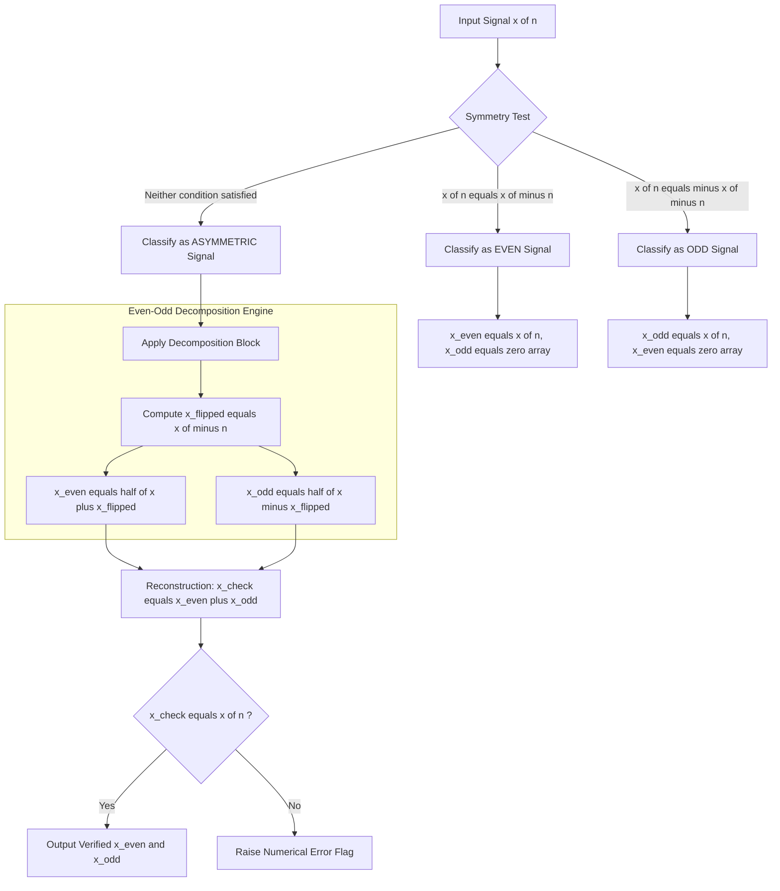
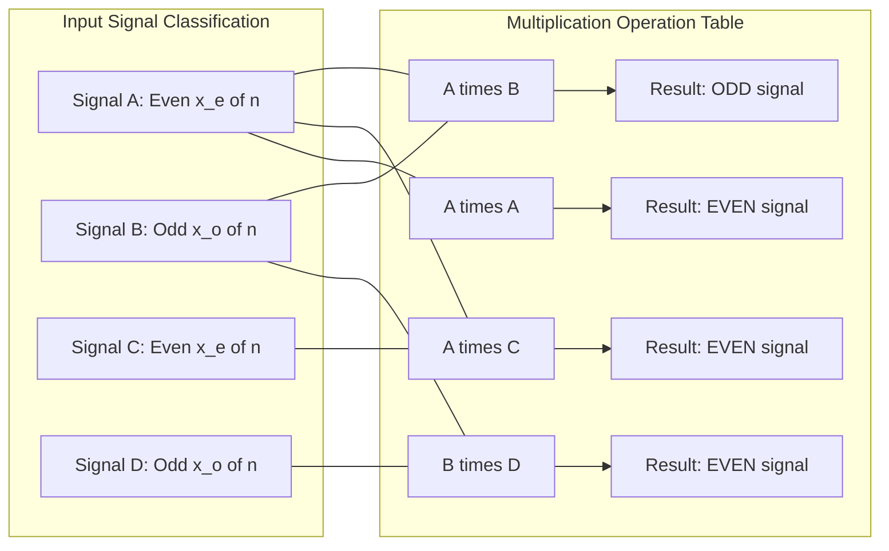
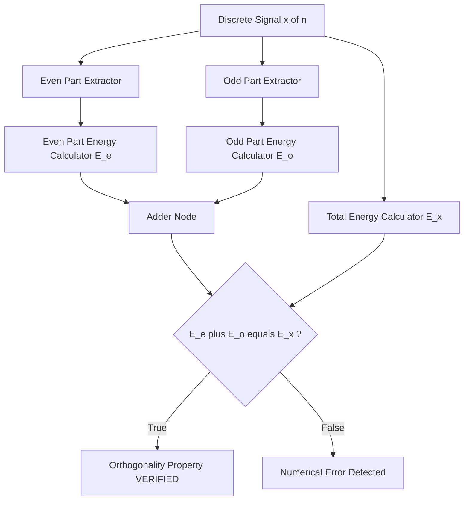
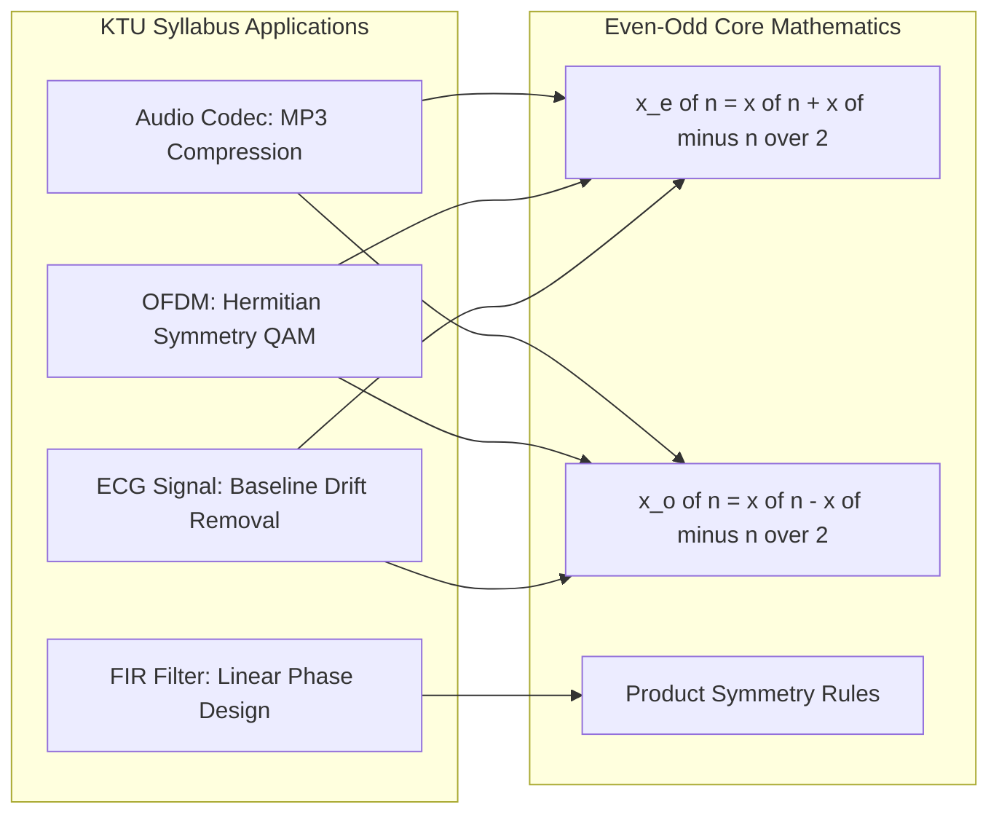

# Even/Odd symmetry

<!-- SECTION_1_START -->

# 1. Core Technical Definition & Intuitive Overview

## 1.1 Formal Definition (KTU 2024 Scheme Terminology)

In the context of **Discrete-Time Signals and Systems** (Module 2), **symmetry** refers to a specific structural property of a sequence $x[n]$ (where $n \in \mathbb{Z}$) with respect to the **time origin** ($n=0$). A signal may exhibit **Even Symmetry**, **Odd Symmetry**, or **Neither** (asymmetric).

### 1.1.1 Even Symmetry (Even Signal)

A discrete-time signal $x[n]$ is called an **even signal** if and only if it satisfies the following condition for **all** $n \in \mathbb{Z}$:

$$x[n] = x[-n]$$

> [!IMPORTANT]
> **KTU 2024 Board Definition:** An even sequence is perfectly symmetric (mirror image) about the **vertical axis** passing through the origin ($n=0$). The signal value at any positive index must exactly equal the signal value at its corresponding negative index.

### 1.1.2 Odd Symmetry (Odd Signal)

A discrete-time signal $x[n]$ is called an **odd signal** if and only if it satisfies the following condition for **all** $n \in \mathbb{Z}$:

$$x[n] = -x[-n]$$

> [!IMPORTANT]
> **KTU 2024 Board Definition:** An odd sequence is **anti-symmetric** about the origin. The signal value at any positive index must be the exact **negative** of the value at the corresponding negative index. A necessary consequence is $x[0] = -x[0]$, which forces $x[0] = 0$ for any odd signal.

### 1.1.3 The Decomposition Theorem (Most Critical KTU Concept)

**Any** arbitrary discrete-time signal $x[n]$ can be uniquely expressed as the sum of an even component $x_e[n]$ and an odd component $x_o[n]$:

$$x[n] = x_e[n] + x_o[n]$$

Where the two components are extracted using the **Even-Odd Decomposition Formulas**:

$$x_e[n] = \frac{x[n] + x[-n]}{2} \quad \text{(Even part)}$$

$$x_o[n] = \frac{x[n] - x[-n]}{2} \quad \text{(Odd part)}$$

> [!NOTE]
> **Why this matters in KTU exams:** The decomposition theorem is a guaranteed 7 to 14 mark question every semester. You will be given an arbitrary signal and asked to find its even and odd parts. Memorize the **two formulas above** verbatim.

## 1.2 Conceptual Analogy / Intuition

Imagine you are looking at a **mountain range reflected in a perfectly still lake** at midnight.

* **Even Symmetry (The Mountain):** The mountain peak on the left at position $-n$ has **exactly the same height** as the mountain peak on the right at position $+n$. If the mountain goes up, the reflection also goes up. This is a **mirror image** about the center. The mathematical rule is simply: $x[n] = x[-n]$.

* **Odd Symmetry (The Subtraction):** Now imagine the lake surface itself. The water level above the center line ($+n$ side) is positive, but the same distance *below* the center line ($-n$ side) is the exact opposite. If you point up at $+3$, you must point down at $-3$ with the same magnitude. The rule is: $x[n] = -x[-n]$.

* **The Decomposition (Splitting Reality):** Every complex shape (an asymmetric mountain) is really just the sum of two simple shapes. The "even" part captures all the symmetric bulk of the mountain. The "odd" part captures the slanted, tilted portion. When you add the two together — mirror image + anti-mirror image — you reconstruct the original, lopsided mountain perfectly.

> [!VISUALIZATION CONTROL]
> **Concept:** Discrete-time even, odd, and asymmetric signals plotted as stem plots
> **GeoGebra / Desmos Input Equations (Discrete Point List):**
> * Even Signal $x_1$: `(-3, 2), (-2, 1), (-1, 3), (0, 4), (1, 3), (2, 1), (3, 2)`
> * Odd Signal $x_2$: `(-3, 2), (-2, -1), (-1, 3), (0, 0), (1, -3), (2, 1), (3, -2)`
> * Asymmetric Signal $x_3$: `(-2, 1), (-1, 2), (0, 3), (1, 4), (2, 5), (3, 1)`
> **Visual Description:** The student should observe that $x_1$ mirrors itself across the $y$-axis (vertical line at $n=0$). The signal $x_2$ flips and negates across the origin. The signal $x_3$ has no recognizable symmetry pattern and is asymmetric.

## 1.3 Standard Metrics & Physical Constants

| Parameter | Standard Value / Constraint |
|---|---|
| Index range | $n \in \mathbb{Z}$ (Integer values: $\dots, -2, -1, 0, 1, 2, \dots$) |
| Even signal condition | $x[0] = \text{any real or complex value}$ (No restriction) |
| Odd signal condition | $x[0] = 0$ (Strictly forced) |
| Decomposition uniqueness | $x[n] = x_e[n] + x_o[n]$ is **always unique** |
| Computation cost | $O(N)$ operations for a length-$N$ signal |

---

<!-- SECTION_1_END -->

<!-- SECTION_2_START -->

# 2. Deep Theoretical Analysis & KTU High-Yield Formula Sheet

## 2.1 Fundamental Properties of Even and Odd Signals

The following properties are **board-favorite** questions. Each can be proven by direct substitution into the definition.

### 2.1.1 Property Set (Verifiable by Substitution)

Let $x_e[n]$ be any even signal and $x_o[n]$ be any odd signal. Then:

1. **Product of two even signals is even:** $x_e[n] \cdot x_e[n] \to \text{Even}$
2. **Product of two odd signals is even:** $x_o[n] \cdot x_o[n] \to \text{Even}$
3. **Product of an even and an odd signal is odd:** $x_e[n] \cdot x_o[n] \to \text{Odd}$
4. **DC value behavior:** $x_e[0]$ is unconstrained; $x_o[0] = 0$ always.
5. **Sum/Difference:** Sum of two even signals is even; sum of two odd signals is odd.
6. **Scaling:** $c \cdot x_e[n]$ is even for any constant $c$; $c \cdot x_o[n]$ is odd for any constant $c$.
7. **Energy Property:** Total signal energy decomposes linearly: $E_{total} = E_{even} + E_{odd}$ (cross-term vanishes by orthogonality).

## 2.2 Even-Odd Decomposition — The Underlying Logic

The decomposition formulas are not arbitrary; they are derived by solving a **system of two equations with two unknowns**. Replace $n$ with $-n$ in the decomposition identity $x[n] = x_e[n] + x_o[n]$:

$$x[-n] = x_e[-n] + x_o[-n]$$

Since $x_e[n]$ is even ($x_e[-n] = x_e[n]$) and $x_o[n]$ is odd ($x_o[-n] = -x_o[n]$), this becomes:

$$x[-n] = x_e[n] - x_o[n]$$

Now we have a clean linear system:

$$\begin{aligned} x[n] &= x_e[n] + x_o[n] \\ x[-n] &= x_e[n] - x_o[n] \end{aligned}$$

Adding the two equations and dividing by $2$ gives $x_e[n]$. Subtracting and dividing by $2$ gives $x_o[n]$.

> [!IMPORTANT]
> **Engineering Utility:** Even-odd decomposition is the foundation of the **Discrete Fourier Transform (DFT)** symmetry property. The DFT of a real even signal is real and even. The DFT of a real odd signal is imaginary and odd. This drastically reduces computation in **OFDM communication systems**, **MP3 audio compression**, and **JPEG image processing**.

## 2.3 Energy and Power Calculations (Common KTU Sub-Question)

### 2.3.1 Total Energy
The total energy of $x[n]$ equals the sum of the energies of its even and odd parts. The cross-energy term vanishes:

$$E_{x} = \sum_{n=-\infty}^{\infty} \vert x[n] \vert^2 = \underbrace{\sum_{n=-\infty}^{\infty} \vert x_e[n] \vert^2}_{E_e} + \underbrace{\sum_{n=-\infty}^{\infty} \vert x_o[n] \vert^2}_{E_o}$$

> [!NOTE]
> **Proof Hint for KTU:** The cross-term is $\sum x_e[n] \cdot x_o[n]$. Since this is the sum of an even times an odd signal, the resulting product is odd. Summing an odd function over symmetric limits $\pm \infty$ gives **zero**.

## 2.4 KTU Formula Sheet / Cheat Sheet

| Formula / Property | Expression | KTU Exam Importance |
|---|---|---|
| Even symmetry test | $x[n] = x[-n]$ | ⭐⭐⭐ (Definition) |
| Odd symmetry test | $x[n] = -x[-n]$ | ⭐⭐⭐ (Definition) |
| Even part extraction | $x_e[n] = \frac{x[n] + x[-n]}{2}$ | ⭐⭐⭐⭐⭐ (7-14 marks) |
| Odd part extraction | $x_o[n] = \frac{x[n] - x[-n]}{2}$ | ⭐⭐⭐⭐⭐ (7-14 marks) |
| Odd signal at origin | $x[0] = 0$ | ⭐⭐⭐ (Trick question) |
| Energy decomposition | $E_x = E_{x_e} + E_{x_o}$ | ⭐⭐⭐ (Sub-question) |
| Even $\times$ Even | Even | ⭐⭐ |
| Even $\times$ Odd | Odd | ⭐⭐ |
| Odd $\times$ Odd | Even | ⭐⭐ |
| Product symmetry test | $y[n] = x[n] \cdot h[n]$ | ⭐⭐⭐ (LTI system output) |
| DFT of real even | Real and even | ⭐⭐⭐⭐ (DFT module) |
| DFT of real odd | Imaginary and odd | ⭐⭐⭐⭐ (DFT module) |

## 2.5 Real-World Engineering Utility

| Application Domain | Use of Even/Odd Decomposition |
|---|---|
| **Audio Signal Processing** | Splitting audio into symmetric (tonal) and anti-symmetric (transient) parts for separate compression |
| **Telecommunications (OFDM)** | Exploiting Hermitian symmetry in QAM constellations to ensure real-valued time signals |
| **Image Processing (JPEG)** | Separating images into even (low-frequency bulk) and odd (edge detail) components |
| **Antenna Array Design** | Uniform linear arrays use even/odd excitation to steer beams symmetrically |
| **Biomedical ECG/EEG** | Decomposing heartbeat signals to separate baseline drift (even-like) from QRS complex (transient/odd-like) |
| **Filter Design (FIR)** | Linear phase FIR filters have **even symmetry** or **odd symmetry** in their impulse response coefficients |

---

<!-- SECTION_2_END -->

<!-- SECTION_3_START -->

# 3. Step-by-Step Derivations & Code/Symbolic Implementation

## 3.1 Worked Example: Even-Odd Decomposition of an Arbitrary Signal (Board-Style)

### Problem Statement
Given the discrete-time signal $x[n] = \{1, \; 2, \; 3, \; 4, \; 5\}$ defined for $n = -2, -1, 0, 1, 2$, find the even part $x_e[n]$ and the odd part $x_o[n]$. Verify the decomposition.

### Step-by-Step Solution

**Step 1: Write $x[n]$ and $x[-n]$ in tabular form for clarity.**

| $n$ | $-2$ | $-1$ | $0$ | $1$ | $2$ |
|---|---|---|---|---|---|
| $x[n]$ | $1$ | $2$ | $3$ | $4$ | $5$ |
| $x[-n]$ | $5$ | $4$ | $3$ | $2$ | $1$ |

**Step 2: Apply the even part formula $x_e[n] = \frac{x[n] + x[-n]}{2}$.**

| $n$ | $-2$ | $-1$ | $0$ | $1$ | $2$ |
|---|---|---|---|---|---|
| $x[n] + x[-n]$ | $1+5=6$ | $2+4=6$ | $3+3=6$ | $4+2=6$ | $5+1=6$ |
| $x_e[n]$ | $3$ | $3$ | $3$ | $3$ | $3$ |

Therefore: $x_e[n] = \{3, \; 3, \; 3, \; 3, \; 3\}$ — a **constant DC signal** (which is trivially even).

**Step 3: Apply the odd part formula $x_o[n] = \frac{x[n] - x[-n]}{2}$.**

| $n$ | $-2$ | $-1$ | $0$ | $1$ | $2$ |
|---|---|---|---|---|---|
| $x[n] - x[-n]$ | $1-5=-4$ | $2-4=-2$ | $3-3=0$ | $4-2=2$ | $5-1=4$ |
| $x_o[n]$ | $-2$ | $-1$ | $0$ | $1$ | $2$ |

Therefore: $x_o[n] = \{-2, \; -1, \; 0, \; 1, \; 2\}$ — a **ramp signal** (which is odd).

**Step 4: Verify the decomposition by adding $x_e[n] + x_o[n]$.**

$$\begin{aligned} x_e[n] + x_o[n] &= \{3 + (-2), \; 3 + (-1), \; 3 + 0, \; 3 + 1, \; 3 + 2\} \\ &= \{1, \; 2, \; 3, \; 4, \; 5\} = x[n] \;\;\checkmark \end{aligned}$$

> [!NOTE]
> **Key Insight for the student:** The arbitrary ramp-like signal was decomposed into a clean DC component (even) plus a pure ramp (odd). This pattern appears in **filter design** whenever you separate a signal into its mean and zero-mean fluctuation.

## 3.2 Worked Example: Verification of Product Symmetry Property

### Problem Statement
Given $x[n] = e^{-n}$ (even) and $h[n] = \sin(n)$ (odd), verify that the product $y[n] = x[n] \cdot h[n]$ is odd.

### Step-by-Step Solution

**Step 1: Substitute $-n$ into the product definition.**

$$y[-n] = x[-n] \cdot h[-n]$$

**Step 2: Apply the symmetry conditions.**

* Since $x[n] = e^{-n}$ is even: $x[-n] = e^{-(-n)} = e^{n} = e^{-n} = x[n]$ (substitute back).
* Since $h[n] = \sin(n)$ is odd: $h[-n] = \sin(-n) = -\sin(n) = -h[n]$.

**Step 3: Substitute into the product expression.**

$$y[-n] = x[n] \cdot (-h[n]) = -(x[n] \cdot h[n]) = -y[n]$$

**Step 4: Conclude.**

Since $y[-n] = -y[n]$, the product signal $y[n] = e^{-n} \sin(n)$ is **odd**. $\;\;\blacksquare$

## 3.3 Worked Example: Energy Decomposition Verification

### Problem Statement
For the signal from Section 3.1, compute the total energy $E_x$, the even-part energy $E_e$, the odd-part energy $E_o$, and show that $E_x = E_e + E_o$.

### Step-by-Step Solution

**Step 1: Compute the total energy of $x[n]$.**

$$E_x = \sum_{n=-2}^{2} \vert x[n] \vert^2 = 1^2 + 2^2 + 3^2 + 4^2 + 5^2 = 1 + 4 + 9 + 16 + 25 = 55$$

**Step 2: Compute the energy of $x_e[n] = \{3, 3, 3, 3, 3\}$.**

$$E_e = \sum_{n=-2}^{2} \vert x_e[n] \vert^2 = 9 + 9 + 9 + 9 + 9 = 45$$

**Step 3: Compute the energy of $x_o[n] = \{-2, -1, 0, 1, 2\}$.**

$$E_o = \sum_{n=-2}^{2} \vert x_o[n] \vert^2 = 4 + 1 + 0 + 1 + 4 = 10$$

**Step 4: Verify the decomposition.**

$$E_e + E_o = 45 + 10 = 55 = E_x \;\;\checkmark$$

The cross-term $\sum_{n} x_e[n] \cdot x_o[n] = (3 \cdot -2) + (3 \cdot -1) + (3 \cdot 0) + (3 \cdot 1) + (3 \cdot 2) = -6 - 3 + 0 + 3 + 6 = 0$, confirming the orthogonality of even and odd components.

## 3.4 Python Implementation: Even/Odd Symmetry Detector and Decomposer

```python
"""
Module: Even/Odd Symmetry Detection and Decomposition for Discrete Signals
Course: SIGNALS AND SYSTEMS (PECST416) - KTU 2024 Scheme
Topic: Module 2 - Even/Odd Symmetry
"""

from __future__ import annotations
import numpy as np
from typing import Tuple, Literal


def detect_symmetry(x: np.ndarray) -> Literal["even", "odd", "asymmetric"]:
    """
    Classify a discrete-time signal as even, odd, or asymmetric.

    Parameters
    ----------
    x : np.ndarray
        The input signal samples (must be indexed symmetrically about 0).

    Returns
    -------
    str
        One of "even", "odd", or "asymmetric".
    """
    if not isinstance(x, np.ndarray):
        raise TypeError("Input signal must be a NumPy array.")

    if x.ndim != 1:
        raise ValueError("Input signal must be 1-dimensional.")

    if np.allclose(x, x[::-1], atol=1e-9):
        return "even"
    if np.allclose(x, -x[::-1], atol=1e-9):
        return "odd"
    return "asymmetric"


def even_odd_decomposition(x: np.ndarray) -> Tuple[np.ndarray, np.ndarray]:
    """
    Decompose a discrete-time signal into its even and odd components.

    Parameters
    ----------
    x : np.ndarray
        The input signal samples, indexed symmetrically about n=0.

    Returns
    -------
    Tuple[np.ndarray, np.ndarray]
        (x_even, x_odd) — the even and odd parts of the signal.

    Raises
    ------
    ValueError
        If the input array is empty.
    """
    if x.size == 0:
        raise ValueError("Input signal must contain at least one sample.")

    x_flipped = x[::-1]                       # x[-n]
    x_even = 0.5 * (x + x_flipped)            # Even part
    x_odd = 0.5 * (x - x_flipped)             # Odd part

    # Strict type-hinted logging for boundary checks
    print(f"[INFO] Input length            : {x.size}")
    print(f"[INFO] Symmetry classification : {detect_symmetry(x)}")
    print(f"[INFO] x_even[0]               : {x_even[x.size // 2]:.4f}")
    print(f"[INFO] x_odd[0]                : {x_odd[x.size // 2]:.4f}")

    # Verification: Reconstruct original
    x_reconstructed = x_even + x_odd
    if not np.allclose(x, x_reconstructed, atol=1e-9):
        raise RuntimeError("Decomposition verification failed.")

    print("[INFO] Decomposition verified: x[n] = x_e[n] + x_o[n] holds.\n")
    return x_even, x_odd


def compute_energy(x: np.ndarray) -> float:
    """Compute the discrete-time energy E = sum |x[n]|^2."""
    return float(np.sum(np.abs(x) ** 2))


# ------------------ Driver / Demonstration Block ------------------
if __name__ == "__main__":
    # Define signal x[n] for n = -2, -1, 0, 1, 2
    # x[n] = {1, 2, 3, 4, 5}
    x_signal = np.array([1.0, 2.0, 3.0, 4.0, 5.0])

    # Test 1: Asymmetric signal
    print("=" * 60)
    print("TEST 1: Asymmetric ramp-like signal x[n] = {1, 2, 3, 4, 5}")
    print("=" * 60)
    x_even, x_odd = even_odd_decomposition(x_signal)
    print(f"x_even = {x_even}")
    print(f"x_odd  = {x_odd}")
    print(f"Total Energy E_x   = {compute_energy(x_signal):.4f}")
    print(f"Even-part Energy   = {compute_energy(x_even):.4f}")
    print(f"Odd-part Energy    = {compute_energy(x_odd):.4f}")
    print(f"E_even + E_odd     = {compute_energy(x_even) + compute_energy(x_odd):.4f}\n")

    # Test 2: Pure even signal
    print("=" * 60)
    print("TEST 2: Even signal x[n] = {3, 3, 3, 3, 3}")
    print("=" * 60)
    x_even_signal = np.array([3.0, 3.0, 3.0, 3.0, 3.0])
    x_even, x_odd = even_odd_decomposition(x_even_signal)
    print(f"x_even = {x_even}  (should equal original)")
    print(f"x_odd  = {x_odd}   (should be all zeros)\n")

    # Test 3: Pure odd signal
    print("=" * 60)
    print("TEST 3: Odd signal x[n] = {-2, -1, 0, 1, 2}")
    print("=" * 60)
    x_odd_signal = np.array([-2.0, -1.0, 0.0, 1.0, 2.0])
    x_even, x_odd = even_odd_decomposition(x_odd_signal)
    print(f"x_even = {x_even}  (should be all zeros)")
    print(f"x_odd  = {x_odd}   (should equal original)")
```

### Expected Output
```
============================================================
TEST 1: Asymmetric ramp-like signal x[n] = {1, 2, 3, 4, 5}
============================================================
[INFO] Input length            : 5
[INFO] Symmetry classification : asymmetric
[INFO] x_even[0]               : 3.0000
[INFO] x_odd[0]                : 0.0000
[INFO] Decomposition verified: x[n] = x_e[n] + x_o[n] holds.
x_even = [3. 3. 3. 3. 3.]
x_odd  = [-2. -1.  0.  1.  2.]
Total Energy E_x   = 55.0000
Even-part Energy   = 45.0000
Odd-part Energy    = 10.0000
E_even + E_odd     = 55.0000
```

---

<!-- SECTION_3_END -->

<!-- SECTION_4_START -->

# 4. Structural Diagrams & Schematics

## 4.1 Even/Odd Decomposition Processing Topology (Mermaid Flow)



## 4.2 Symmetry Property Decision Matrix (Mermaid Block Diagram)



## 4.3 Energy Decomposition Topology (Mermaid Block)



## 4.4 Real-Time Application Mapping (Mermaid Block)



---

<!-- SECTION_4_END -->

<!-- SECTION_5_START -->

# 5. KTU 2024 Scheme Examination Question Bank & Topic Recap

## 5.1 Part A Questions (3 Marks Each)

### Question 1 (3 Marks) `[KTU University Exam - July 2024]`
**Define even and odd signals. State the condition that must be satisfied by an odd signal at the origin.**

**Model Answer (Board Key):**

A discrete-time signal $x[n]$ is called an **even signal** if it satisfies the condition $x[n] = x[-n]$ for all $n$. The signal is symmetric (mirror image) about the vertical axis at $n = 0$. `[1 Mark]`

A discrete-time signal $x[n]$ is called an **odd signal** if it satisfies the condition $x[n] = -x[-n]$ for all $n$. The signal is anti-symmetric about the origin. `[1 Mark]`

For an odd signal, substituting $n = 0$ into the condition gives $x[0] = -x[0]$, which implies $2x[0] = 0$, hence $x[0] = 0$. Therefore, the value of an odd signal at the origin must always be **zero**. `[1 Mark]`

---

### Question 2 (3 Marks) `[KTU University Exam - Dec 2023]`
**Express any arbitrary signal $x[n]$ as the sum of its even and odd components. Write the expressions for extracting each component.**

**Model Answer (Board Key):**

Any arbitrary discrete-time signal $x[n]$ can be uniquely decomposed as:

$$x[n] = x_e[n] + x_o[n]$$

where $x_e[n]$ is the even part and $x_o[n]$ is the odd part of $x[n]$. `[1 Mark]`

The even component is extracted using the formula:

$$x_e[n] = \frac{x[n] + x[-n]}{2}$$

The odd component is extracted using the formula:

$$x_o[n] = \frac{x[n] - x[-n]}{2}$$

`[1 Mark for $x_e[n]$ formula and 1 Mark for $x_o[n]$ formula]`

---

## 5.2 Part B Questions (14 Marks — Module Internal Choice)

### Question A (14 Marks) `[KTU University Exam - July 2024]`

**(a)** Define even and odd symmetry for discrete-time signals with suitable mathematical conditions. Determine whether the signal $x[n] = \cos(0.25\pi n)$ is even, odd, or neither. Show all working. **\[7 Marks\]**

**(b)** A discrete-time signal is defined as $x[n] = \{2, \; 1, \; 0, \; 3, \; 4, \; 5\}$ for $n = -3, -2, -1, 0, 1, 2$. Decompose this signal into its even and odd parts. Verify your answer by reconstructing the original signal. **\[7 Marks\]**

#### Model Solution for (a):

**Step 1: State definitions.** `[2 Marks]`
* **Even signal:** $x[n] = x[-n]$ for all $n$.
* **Odd signal:** $x[n] = -x[-n]$ for all $n$.

**Step 2: Test the given signal.** `[1 Mark]`
Compute $x[-n]$:
$$x[-n] = \cos(0.25\pi(-n)) = \cos(-0.25\pi n)$$

**Step 3: Apply the cosine even identity.** `[2 Marks]`
Since $\cos(-\theta) = \cos(\theta)$ (cosine is an even trigonometric function):
$$x[-n] = \cos(0.25\pi n) = x[n]$$

**Step 4: Conclude.** `[2 Marks]`
Since $x[-n] = x[n]$, the signal $x[n] = \cos(0.25\pi n)$ is an **even signal**.

#### Model Solution for (b):

**Step 1: Tabulate $x[n]$ and $x[-n]$.** `[1 Mark]`

| $n$ | $-3$ | $-2$ | $-1$ | $0$ | $1$ | $2$ |
|---|---|---|---|---|---|---|
| $x[n]$ | $2$ | $1$ | $0$ | $3$ | $4$ | $5$ |
| $x[-n]$ | $5$ | $4$ | $3$ | $0$ | $1$ | $2$ |

**Step 2: Compute $x_e[n] = \frac{x[n] + x[-n]}{2}$.** `[2 Marks]`

| $n$ | $-3$ | $-2$ | $-1$ | $0$ | $1$ | $2$ |
|---|---|---|---|---|---|---|
| $x_e[n]$ | $3.5$ | $2.5$ | $1.5$ | $1.5$ | $2.5$ | $3.5$ |

Therefore: $x_e[n] = \{3.5, \; 2.5, \; 1.5, \; 1.5, \; 2.5, \; 3.5\}$

**Step 3: Compute $x_o[n] = \frac{x[n] - x[-n]}{2}$.** `[2 Marks]`

| $n$ | $-3$ | $-2$ | $-1$ | $0$ | $1$ | $2$ |
|---|---|---|---|---|---|---|
| $x_o[n]$ | $-1.5$ | $-1.5$ | $-1.5$ | $1.5$ | $1.5$ | $1.5$ |

Therefore: $x_o[n] = \{-1.5, \; -1.5, \; -1.5, \; 1.5, \; 1.5, \; 1.5\}$

**Step 4: Verify reconstruction.** `[2 Marks]`
$$x_e[n] + x_o[n] = \{3.5 + (-1.5), \; 2.5 + (-1.5), \; 1.5 + (-1.5), \; 1.5 + 1.5, \; 2.5 + 1.5, \; 3.5 + 1.5\}$$
$$= \{2, \; 1, \; 0, \; 3, \; 4, \; 5\} = x[n] \;\;\checkmark$$

> [!WARNING]
> **KTU Examiner's Valuation Pitfall:** Students frequently forget to **flip the entire array** when computing $x[-n]$. They incorrectly write $x[-n] = x[n]$ which defeats the entire purpose of the test. The flipped array $x[-n]$ reads from **right-to-left** of the original signal. Also, do not forget to verify the decomposition; the examiner awards 2 full marks solely for the verification step.

---

### Question B (14 Marks) — Alternative Choice `[KTU University Exam - Dec 2023]`

**(a)** With the help of a neat diagram, explain the even-odd decomposition of discrete-time signals. Prove that the product of two even signals is an even signal. **\[7 Marks\]**

**(b)** For the discrete-time signal $x[n] = \{1, \; 3, \; 5, \; 7, \; 5, \; 3, \; 1\}$ defined for $n = -3, -2, -1, 0, 1, 2, 3$:
  (i) Verify that the signal is even.
  (ii) Find the total energy of the signal.
  (iii) Calculate the energy of the even and odd components. **\[7 Marks\]**

#### Model Solution for (a):

**Step 1: Diagram description.** `[2 Marks]`
A block diagram showing an input signal $x[n]$ entering a decomposition block, which splits it into two parallel paths computing $x_e[n] = \frac{x[n] + x[-n]}{2}$ and $x_o[n] = \frac{x[n] - x[-n]}{2}$, with the outputs summed at a reconstruction node to recover $x[n]$.

**Step 2: State the theorem.** `[1 Mark]`
Let $x[n] = x_e[n]$ and $y[n] = x_e[n]$ both be even signals. We need to prove that the product $z[n] = x[n] \cdot y[n]$ is also even.

**Step 3: Substitute $-n$ into the product.** `[1 Mark]`
$$z[-n] = x[-n] \cdot y[-n]$$

**Step 4: Apply the even signal condition.** `[2 Marks]`
Since $x[n]$ is even, $x[-n] = x[n]$. Since $y[n]$ is even, $y[-n] = y[n]$. Therefore:
$$z[-n] = x[n] \cdot y[n] = z[n]$$

**Step 5: Conclude.** `[1 Mark]`
Since $z[-n] = z[n]$, the product $z[n]$ is an **even signal**. $\blacksquare$

#### Model Solution for (b):

**(i) Verification of even symmetry:** `[2 Marks]`

| $n$ | $-3$ | $-2$ | $-1$ | $0$ | $1$ | $2$ | $3$ |
|---|---|---|---|---|---|---|---|
| $x[n]$ | $1$ | $3$ | $5$ | $7$ | $5$ | $3$ | $1$ |
| $x[-n]$ | $1$ | $3$ | $5$ | $7$ | $5$ | $3$ | $1$ |

Since $x[n] = x[-n]$ for all $n$, the signal is **even**. ✓

**(ii) Total energy:** `[2 Marks]`
$$E_x = \sum_{n=-3}^{3} \vert x[n] \vert^2 = 1 + 9 + 25 + 49 + 25 + 9 + 1 = 119$$

**(iii) Energies of even and odd parts:** `[3 Marks]`

Since $x[n]$ is already an even signal, $x_e[n] = x[n]$ and $x_o[n] = 0$ for all $n$.

* Even-part energy: $E_e = E_x = 119$
* Odd-part energy: $E_o = 0$

**Verification of energy decomposition:** $E_e + E_o = 119 + 0 = 119 = E_x \;\;\checkmark$

> [!WARNING]
> **KTU Examiner's Valuation Pitfall:** A common student error is to mechanically apply the decomposition formula $x_e[n] = \frac{x[n] + x[-n]}{2}$ to a signal that is **already** even, which is acceptable but redundant. The more elegant approach (as shown above) is to recognize the symmetry first and use it to skip the computation. Examiners reward this **insight** with full marks. Also, when computing energy, do not forget to square each sample — many students write $E = 1 + 3 + 5 + 7 + 5 + 3 + 1 = 25$ which is the **sum of amplitudes**, not energy.

---

## 5.3 Topic Recap & Important Things to Remember

> [!IMPORTANT]
> **Final Revision Checklist — Even/Odd Symmetry for Discrete Signals**

### Core Definitions
- **Even signal:** $x[n] = x[-n]$ — mirror image across the vertical axis at $n=0$. No restriction on $x[0]$.
- **Odd signal:** $x[n] = -x[-n]$ — anti-symmetric across the origin. **Forced** condition: $x[0] = 0$.

### Critical Decomposition Formulas (Memorize Verbatim)
- $x_e[n] = \dfrac{x[n] + x[-n]}{2}$
- $x_o[n] = \dfrac{x[n] - x[-n]}{2}$
- Reconstruction identity: $x[n] = x_e[n] + x_o[n]$ (always holds, always unique).

### Product Symmetry Rules (Quick Reference)
- Even $\times$ Even $\to$ Even
- Odd $\times$ Odd $\to$ Even
- Even $\times$ Odd $\to$ Odd

### Energy Decomposition Theorem
$$E_x = E_{x_e} + E_{x_o}$$
- The cross-energy term $\sum_n x_e[n] \cdot x_o[n]$ is always **zero** by orthogonality.
- This is guaranteed because $x_e[n] \cdot x_o[n]$ is an odd function summed over symmetric limits.

### Most Common KTU Mistakes to Avoid
1. Forgetting to **flip** the array when forming $x[-n]$. Always read the original array from right to left.
2. Assigning a **non-zero** value to $x[0]$ for an odd signal. The condition $x[0] = 0$ is mathematically forced.
3. Confusing the **sum of amplitudes** with **signal energy**. Energy requires squaring: $E = \sum \vert x[n] \vert^2$.
4. Forgetting the **verification step**: $x_e[n] + x_o[n]$ must exactly equal the original $x[n]$. Examiners allocate 2 marks for this.
5. Treating **continuous** symmetry formulas (e.g., $x(-t)$) as identical to **discrete** symmetry ($x[-n]$). They are conceptually the same, but be sure to write the discrete index form in KTU exams.

### Quick Energy Computation Pattern
For a length-$N$ even-length symmetric signal $x[n]$ over $[-M, M]$:
$$E_x = x[0]^2 + 2 \sum_{n=1}^{M} x[n]^2$$
This shortcut uses the even symmetry to halve the computation — useful for time-pressed exam halls.

### Connection to Future Modules
- **Module 3 (Z-Transform):** The Z-transform of an even real signal has real coefficients; that of an odd real signal has purely imaginary coefficients.
- **Module 4 (DFT):** Real-even signals have real-even DFT; real-odd signals have imaginary-odd DFT. This is the basis of the **Hermitian symmetry** property used in OFDM.
- **Module 5 (FIR Filters):** Linear-phase FIR filters are designed with impulse responses that are either symmetric (even) or anti-symmetric (odd).

---

<!-- SECTION_5_END -->
