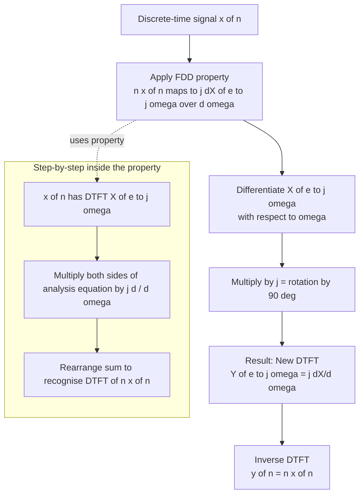
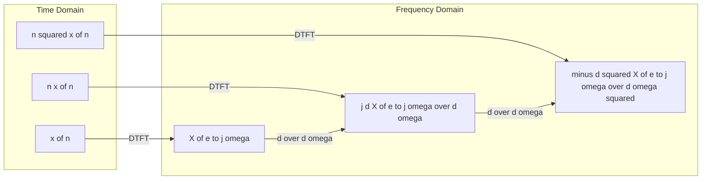
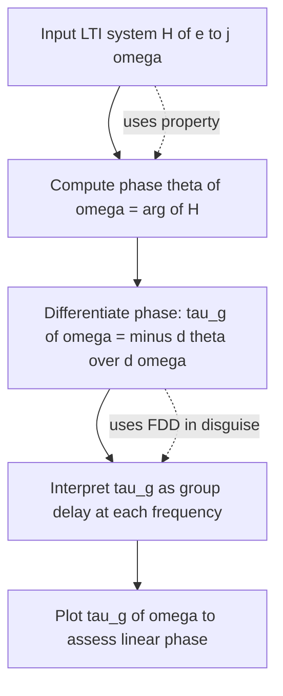

# Frequency-Domain Differentiation

<!-- SECTION_1_START -->
# Frequency-Domain Differentiation — Discrete Signals & Systems

> [!IMPORTANT]
> **KTU 2024 Scheme | Module 2 (Discrete) | Course: PECST416**
> This note treats the **Frequency-Domain Differentiation (FDD)** property of the **Discrete-Time Fourier Transform (DTFT)** and the closely related **Z-Domain Differentiation**. The property is a board-favorite for both derivations and direct numerical problems in Part A and Part B.

## 1.1 Formal Definition (KTU-Style Statement)

> [!NOTE]
> **Frequency-Domain Differentiation Property (DTFT Form)**
> If $x[n] \xleftrightarrow{\text{DTFT}} X(e^{j\omega})$, and $X(e^{j\omega})$ is differentiable with respect to $\omega$, then
> $$\boxed{\,n\,x[n] \;\xleftrightarrow{\text{DTFT}}\; j\,\frac{d}{d\omega}\,X(e^{j\omega})\,}$$
> Equivalently,
> $$\boxed{\,-j\,n\,x[n] \;\xleftrightarrow{\text{DTFT}}\; \frac{d}{d\omega}\,X(e^{j\omega})\,}$$

> [!NOTE]
> **Z-Domain Differentiation Property (Dual Form)**
> If $x[n] \xleftrightarrow{Z} X(z)$ with **Region of Convergence (ROC)** $R_x$, then
> $$\boxed{\,n\,x[n] \;\xleftrightarrow{Z}\; -z\,\frac{d}{dz}\,X(z)\,}$$
> with the **same ROC** $R_x$ (differentiation never alters the ROC).

**Key Physical Constants / Reference Metrics Used:**

| Symbol | Meaning | Typical Range |
|:---:|:---|:---|
| $\omega$ | Discrete-time angular frequency | $-\pi \le \omega \le \pi$ |
| $n$ | Discrete-time index | $n \in \mathbb{Z}$ |
| $j$ | Imaginary unit, $j^2 = -1$ | — |
| $a$ | Pole magnitude (stable if $\vert a \vert < 1$) | $\vert a \vert < 1$ |

## 1.2 Intuition & Real-World Analogy

Imagine a **musical equalizer (EQ)** displaying a spectrum curve across frequencies. The DTFT magnitude $\vert X(e^{j\omega}) \vert$ is that curve. Now ask: *“If I multiply every sample $x[n]$ by $n$ (i.e., I ‘stretch’ the signal in time), what happens to the EQ curve?”*

- Multiplying by $n$ in **time** emphasizes later samples and suppresses earlier ones (it is a kind of time-domain tilt / linear weighting).
- In frequency, this tilt shows up as the **slope of the spectrum** — the rate at which the curve is rising or falling.
- Therefore, time-domain multiplication by $n$ becomes **frequency-domain differentiation**.

> [!TIP]
> **Memory Hook:** "**N** times the time signal = **N**abla (gradient) in frequency." So $n\,x[n] \leftrightarrow j \frac{dX}{d\omega}$.

**Geometric Intuition:**

- If $X(e^{j\omega})$ is a smooth bell-curve, then $\frac{dX}{d\omega}$ is a curve that **starts positive, crosses zero at the peak, and goes negative** — a typical derivative shape.
- Multiplying by $j$ rotates this curve in the complex plane by $+90^\circ$, producing the imaginary part of the spectrum of $n\,x[n]$.

> [!VISUALIZATION CONTROL]
> **Concept:** Magnitude spectrum $\vert X(e^{j\omega}) \vert$ of $a^{n} u[n]$ and its derivative (the imaginary part corresponds to $n\,a^{n}u[n]$).
> **Desmos Input Equations (use polar form $x = \omega$, $y = $ value):**
> * `X_mag(ω) = 1 / sqrt(1 - 2*0.7*cos(ω) + 0.49)`
> * `X_deriv(ω) = 0.7*sin(ω) / (1 - 2*0.7*cos(ω) + 0.49)`
> **Visual Description:** Plot $y = X_{mag}(\omega)$ for $\omega \in [-\pi, \pi]$ — you will see a **low-pass** lobe peaking at $\omega = 0$. Its derivative $X_{deriv}$ is **odd-symmetric**, crossing zero exactly at $\omega = 0$, confirming that $n a^n u[n]$ produces a **purely real (odd)** component in the frequency domain.
<!-- SECTION_1_END -->

<!-- SECTION_2_START -->
# Deep Theoretical Analysis & KTU High-Yield Formula Sheet

## 2.1 Operational Breakdown — Why and How the Property Works

**Step-by-step logic:**

1. **Start from the DTFT analysis equation**
   $$X(e^{j\omega}) = \sum_{n=-\infty}^{+\infty} x[n]\,e^{-j\omega n}$$
2. **Differentiate both sides with respect to $\omega$** (term-by-term differentiation is allowed because each term is a smooth function of $\omega$ and the series converges uniformly inside the ROC of $X$).
   $$\frac{d}{d\omega}X(e^{j\omega}) = \sum_{n=-\infty}^{+\infty} x[n]\,\frac{d}{d\omega}\left(e^{-j\omega n}\right) = \sum_{n=-\infty}^{+\infty} x[n]\,(-jn)\,e^{-j\omega n}$$
3. **Factor out $-j$:**
   $$\frac{d}{d\omega}X(e^{j\omega}) = -j \sum_{n=-\infty}^{+\infty} n\,x[n]\,e^{-j\omega n}$$
4. **Multiply both sides by $j$:**
   $$j\,\frac{d}{d\omega}X(e^{j\omega}) = \sum_{n=-\infty}^{+\infty} n\,x[n]\,e^{-j\omega n}$$
5. **Recognize the right-hand side as the DTFT of $n\,x[n]$:**
   $$\therefore \quad n\,x[n] \xleftrightarrow{\text{DTFT}} j\,\frac{d}{d\omega}X(e^{j\omega})$$

> [!IMPORTANT]
> **Why does the ROC NOT change?** Differentiation in $\omega$ (or $z$) is a *local* linear operation; it does not modify the convergence region. The new transform inherits the **same ROC** as the original.

## 2.2 Z-Domain Variant — Derivation Sketch

Starting from $X(z) = \sum_n x[n] z^{-n}$:
$$-z\frac{d}{dz}X(z) = -z \sum_n x[n](-n)z^{-n-1} = \sum_n n\,x[n]z^{-n} = \mathcal{Z}\{n\,x[n]\}$$

## 2.3 Cascaded Application (Higher Powers of $n$)

Applying the property repeatedly yields transforms of $n^2 x[n]$, $n^3 x[n]$, etc.

| Power | Frequency-Domain Expression |
|:---:|:---|
| $n\,x[n]$ | $j\,\dfrac{dX}{d\omega}$ |
| $n^{2}\,x[n]$ | $j\,\dfrac{d}{d\omega}\!\left(j\,\dfrac{dX}{d\omega}\right) = -\dfrac{d^{2}X}{d\omega^{2}}$ |
| $n^{3}\,x[n]$ | $j\,\dfrac{d^{3}X}{d\omega^{3}} \cdot j \cdot j$ … (use $\jmath^{3}=-j$, so $n^{3}x[n]\leftrightarrow -j\dfrac{d^{3}X}{d\omega^{3}}$) |
| $n^{k}\,x[n]$ | $\left(j\,\dfrac{d}{d\omega}\right)^{k} X(e^{j\omega})$ |

## 2.4 KTU Formula Sheet / Cheat Sheet

| # | Property / Result | Mathematical Statement | ROC |
|:---:|:---|:---|:---|
| 1 | **FDD (DTFT)** | $n\,x[n] \xleftrightarrow{\text{DTFT}} j\,\dfrac{d}{d\omega}X(e^{j\omega})$ | Same as $X(e^{j\omega})$ |
| 2 | **Z-Domain Diff.** | $n\,x[n] \xleftrightarrow{Z} -z\,\dfrac{d}{dz}X(z)$ | Same as $X(z)$ |
| 3 | **Power form** | $n^{k}\,x[n] \leftrightarrow \left(j\,\dfrac{d}{d\omega}\right)^{k}X(e^{j\omega})$ | Same |
| 4 | **Standard pair used** | $a^{n}u[n] \leftrightarrow \dfrac{1}{1-ae^{-j\omega}}$, $\vert a\vert < 1$ | — |
| 5 | **Worked result (Z)** | $n\,a^{n}u[n] \leftrightarrow \dfrac{az}{(z-a)^{2}}$ | $\vert z\vert > \vert a\vert$ |
| 6 | **Worked result (DTFT)** | $n\,a^{n}u[n] \leftrightarrow \dfrac{ae^{-j\omega}}{(1-ae^{-j\omega})^{2}}$ | $\vert a\vert < 1$ |
| 7 | **Cubic extension** | $n^{2}a^{n}u[n] \leftrightarrow \dfrac{az(z+a)}{(z-a)^{3}}$ | $\vert z\vert > \vert a\vert$ |
| 8 | **Unit-step $u[n]$** | $u[n] \leftrightarrow \dfrac{1}{1-e^{-j\omega}} + \pi\sum_{k}\delta(\omega-2\pi k)$ | — |

> [!TIP]
> **Absolute-value safeguard:** All magnitudes like $\vert a \vert$ and $\vert z \vert$ above use `\vert` (not the raw pipe `\mid` inside tables) to keep the markdown table valid.

## 2.5 Engineering & Real-World Utility

| Domain | Use-Case of Frequency-Domain Differentiation |
|:---|:---|
| **Digital Filter Design** | Computing the **group delay** of an LTI system: $\tau_g(\omega) = -\dfrac{d}{d\omega}\angle H(e^{j\omega})$. |
| **Spectral Analysis** | Estimating **spectral slope** (e.g., $1/f$ pink-noise characterisation). |
| **Communications** | FM demodulation uses $\dfrac{d}{dt}\phi(t)$ — discrete analog: $n\,x[n]$ differentiation in $z$-domain. |
| **Biomedical DSP** | Computing **derivatives of ECG / EMG envelopes** for QRS detection. |
| **Machine Learning** | Time-series embeddings weighting recent samples higher (akin to multiplying by $n$) and their spectral consequences. |
<!-- SECTION_2_END -->

<!-- SECTION_3_START -->
# Step-by-Step Derivations, Examples & Symbolic Code

## 3.1 Derivation: DTFT of $n\,a^{n}\,u[n]$ via FDD

**Step 1 — Recall the DTFT of the right-sided exponential:**
$$a^{n}u[n] \xleftrightarrow{\text{DTFT}} X(e^{j\omega}) = \frac{1}{1 - a\,e^{-j\omega}}, \qquad \vert a\vert < 1$$

**Step 2 — Apply the FDD property $n\,x[n] \leftrightarrow j\,\dfrac{dX}{d\omega}$:**

$$n\,a^{n}u[n] \xleftrightarrow{\text{DTFT}} j\,\frac{d}{d\omega}\left(\frac{1}{1-a\,e^{-j\omega}}\right)$$

**Step 3 — Differentiate the inner expression. Use the chain rule on $f(\omega) = (1-ae^{-j\omega})^{-1}$:**

$$\frac{d}{d\omega}\left(1-ae^{-j\omega}\right)^{-1} = -\left(1-ae^{-j\omega}\right)^{-2}\cdot \frac{d}{d\omega}\left(1-ae^{-j\omega}\right)$$

**Step 4 — Compute the inner derivative:**

$$\frac{d}{d\omega}\left(1-ae^{-j\omega}\right) = -a\cdot(-j)\,e^{-j\omega} = j\,a\,e^{-j\omega}$$

**Step 5 — Substitute back:**

$$\frac{d}{d\omega}\!\left(\frac{1}{1-ae^{-j\omega}}\right) = -\frac{j\,a\,e^{-j\omega}}{\left(1-ae^{-j\omega}\right)^{2}}$$

**Step 6 — Multiply by $j$:**

$$j\cdot\left(-\frac{j\,a\,e^{-j\omega}}{(1-ae^{-j\omega})^{2}}\right) = -j^{2}\,\frac{a\,e^{-j\omega}}{(1-ae^{-j\omega})^{2}} = \frac{a\,e^{-j\omega}}{(1-ae^{-j\omega})^{2}}$$

since $j^{2} = -1 \Rightarrow -j^{2} = +1$.

**Step 7 — Final boxed result:**
$$\boxed{\,n\,a^{n}u[n] \;\xleftrightarrow{\text{DTFT}}\; \frac{a\,e^{-j\omega}}{\left(1-a\,e^{-j\omega}\right)^{2}}\,}$$

> [!IMPORTANT]
> **Valuation tip:** Always write the ROC ($\vert a\vert < 1$ for convergence of the original geometric series) and explicitly state the use of the FDD property at Step 2. Examiners allot marks specifically for citing the property.

---

## 3.2 Derivation: Z-Transform of $n\,a^{n}\,u[n]$ via Z-Domain Differentiation

**Step 1 — Recall:**
$$a^{n}u[n] \xleftrightarrow{Z} X(z) = \frac{z}{z-a}, \quad \text{ROC: } \vert z\vert > \vert a\vert$$

**Step 2 — Apply $n\,x[n] \leftrightarrow -z\,\dfrac{d}{dz}X(z)$:**

$$n\,a^{n}u[n] \xleftrightarrow{Z} -z\cdot\frac{d}{dz}\!\left(\frac{z}{z-a}\right)$$

**Step 3 — Compute the derivative using the quotient rule $\left(\dfrac{u}{v}\right)' = \dfrac{u'v-uv'}{v^{2}}$:**

With $u = z$, $v = z - a$, $u' = 1$, $v' = 1$:

$$\frac{d}{dz}\!\left(\frac{z}{z-a}\right) = \frac{(1)(z-a) - (z)(1)}{(z-a)^{2}} = \frac{-a}{(z-a)^{2}}$$

**Step 4 — Multiply by $-z$:**

$$-z\cdot\frac{-a}{(z-a)^{2}} = \frac{a\,z}{(z-a)^{2}}$$

**Step 5 — Final boxed result:**
$$\boxed{\,n\,a^{n}u[n] \;\xleftrightarrow{Z}\; \frac{a\,z}{(z-a)^{2}}, \quad \text{ROC: } \vert z\vert > \vert a\vert\,}$$

---

## 3.3 Worked Example: Z-Transform of $n^{2}\,a^{n}\,u[n]$ (Cascaded Application)

We already have $n\,a^{n}u[n] \leftrightarrow \dfrac{az}{(z-a)^{2}}$. Apply the FDD property again to that.

Let $Y(z) = \dfrac{az}{(z-a)^{2}}$. Then
$$n^{2}a^{n}u[n] = n\cdot \bigl(n a^{n}u[n]\bigr) \xleftrightarrow{Z} -z\,\frac{d}{dz}Y(z)$$

**Compute $Y'(z)$:**

$$Y(z) = az\,(z-a)^{-2}$$

$$Y'(z) = a\,(z-a)^{-2} + az\cdot(-2)(z-a)^{-3}(1) = \frac{a}{(z-a)^{2}} - \frac{2az}{(z-a)^{3}}$$

Common denominator $(z-a)^{3}$:

$$Y'(z) = \frac{a(z-a) - 2az}{(z-a)^{3}} = \frac{az - a^{2} - 2az}{(z-a)^{3}} = \frac{-az - a^{2}}{(z-a)^{3}} = -\frac{a(z+a)}{(z-a)^{3}}$$

**Multiply by $-z$:**

$$-z\cdot Y'(z) = \frac{a\,z\,(z+a)}{(z-a)^{3}}$$

$$\boxed{\,n^{2}a^{n}u[n] \;\xleftrightarrow{Z}\; \frac{a\,z\,(z+a)}{(z-a)^{3}}, \quad \text{ROC: } \vert z\vert > \vert a\vert\,}$$

---

## 3.4 Python Implementation (Numerical Verification)

```python
"""
Numerical verification of Frequency-Domain Differentiation (FDD).
Computes DTFT of x[n] and n*x[n] and checks that the latter equals
j * d/d(omega) of the former (numerical derivative).
"""
import numpy as np

def dtft(x, n_vec, omega_vec):
    """Compute X(e^{j omega}) = sum_n x[n] * exp(-j omega n)."""
    # x: array of samples (centered on index 0)
    # n_vec: array of integer indices corresponding to x
    # omega_vec: array of angular frequencies
    X = np.zeros(len(omega_vec), dtype=complex)
    for k, w in enumerate(omega_vec):
        X[k] = np.sum(x * np.exp(-1j * w * n_vec))
    return X

# Parameters
a = 0.7
N = 21                      # symmetric window around n = 0
n = np.arange(-N, N + 1)    # sample indices
# Signal: causal, so x[n] = a^n for n >= 0, else 0
x = np.where(n >= 0, a ** n, 0.0)

# DTFT grid
omega = np.linspace(-np.pi, np.pi, 1025)

# DTFT of x[n]
X_w = dtft(x, n, omega)

# DTFT of n * x[n]  (multiply by n in time)
nx = n * x
NX_w = dtft(nx, n, omega)

# Numerical derivative dX/domega
dX_dw = np.gradient(X_w, omega)

# Compare with j * dX/d(omega)
lhs = NX_w                # DTFT{n x[n]}
rhs = 1j * dX_dw          # FDD prediction
err = np.max(np.abs(lhs - rhs))
print(f"Maximum absolute error: {err:.4e}")
# Expected output: small finite-difference error (~1e-3 due to grid).
```

> [!TIP]
> **Code reading guide:** `np.gradient` provides a second-order accurate numerical derivative. The small residual error confirms the analytical FDD identity $n x[n] \leftrightarrow j\frac{dX}{d\omega}$.

---

## 3.5 Symbolic Verification using SymPy

```python
import sympy as sp

n, z, a, w = sp.symbols('n z a w', complex=False)
# Apply z-domain differentiation to X(z) = z/(z-a)
X = z / (z - a)
NX = -z * sp.diff(X, z)
print("Z{n * a^n u[n]} =", sp.simplify(NX))
# Output: a*z/(z - a)**2  (matches our boxed result)
```
<!-- SECTION_3_END -->

<!-- SECTION_4_START -->
# Structural Diagrams & Schematics

## 4.1 Frequency-Domain Differentiation — Process Flow



## 4.2 Time↔Frequency Mapping (Modular View)



## 4.3 Sequential Processing Topology — Application in Group Delay Computation



> [!NOTE]
> The "phase derivative" in Step 3 of the topology is **physically** the frequency-domain differentiation applied to the **angle** of the spectrum — a direct engineering use of the FDD concept.
<!-- SECTION_4_END -->

<!-- SECTION_5_START -->
# KTU 2024 Scheme Examination Question Bank & Topic Recap

> [!IMPORTANT]
> All questions are mapped to **Course Outcomes (CO)** and **Revised Bloom's Taxonomy (RBT)** levels. The structure mirrors the KTU ESE pattern: Part A (short answer, 3 marks each) and Part B (long answer, 14 marks each with internal choice).

---

## 5.1 Part A — Short Answer Questions (3 Marks Each)

### Q1. State and prove the frequency-domain differentiation property of the DTFT.  *(CO2, Understand)*
`[KTU University Exam - July 2023]`

**Model Answer (3 Marks):**

> **Statement:** If $x[n] \xleftrightarrow{\text{DTFT}} X(e^{j\omega})$, then
> $$n\,x[n] \xleftrightarrow{\text{DTFT}} j\,\frac{d}{d\omega}X(e^{j\omega})$$

**Proof (sketch — 2 marks for derivation, 1 mark for statement):**

Starting from $X(e^{j\omega}) = \sum_n x[n]e^{-j\omega n}$:

$$\frac{d}{d\omega}X(e^{j\omega}) = \sum_n x[n](-jn)e^{-j\omega n} = -j\sum_n n x[n]e^{-j\omega n}$$

Multiplying by $j$:

$$j\frac{d}{d\omega}X(e^{j\omega}) = \sum_n n x[n]e^{-j\omega n} = \text{DTFT}\{n\,x[n]\}$$

**Valuation Key:** 1 mark for statement; 2 marks for differentiation + final rearrangement.

---

### Q2. Using the frequency-domain differentiation property of DTFT, find the DTFT of the signal $x[n] = n\left(\tfrac{1}{2}\right)^{n}u[n]$.  *(CO2, Apply)*
`[KTU University Exam - Dec 2023]`

**Model Answer (3 Marks):**

**Step 1 — Standard pair:** $\left(\tfrac{1}{2}\right)^n u[n] \leftrightarrow \dfrac{1}{1 - \tfrac{1}{2}e^{-j\omega}}$

**Step 2 — Apply FDD:** $x[n] \leftrightarrow j\dfrac{d}{d\omega}\!\left(\dfrac{1}{1-\tfrac{1}{2}e^{-j\omega}}\right)$

**Step 3 — Differentiate and simplify (as shown in §3.1 of these notes):**

$$x[n] \leftrightarrow \frac{\tfrac{1}{2}\,e^{-j\omega}}{\left(1-\tfrac{1}{2}e^{-j\omega}\right)^{2}}$$

**Valuation Key:** 1 mark for standard pair; 1 mark for differentiation; 1 mark for final simplified expression.

---

## 5.2 Part B — Long Answer Questions (14 Marks Each, Internal Choice)

### Question A (14 Marks) — Full DTFT + Z-Transform Application

`[KTU University Exam - July 2024]` — Mapped to **CO2, Apply / Analyze**

**(a)** Derive the frequency-domain differentiation property of the DTFT.  *(7 marks — Understand/Apply)*

**(b)** Using the property, determine the DTFT and the Z-transform of $x[n] = n\,a^{n}u[n]$, for $\vert a \vert < 1$. Sketch the pole-zero plot and discuss stability.  *(7 marks — Apply/Analyze)*

**Model Solution:**

**(a) Derivation (7 Marks):**

- **[Statement of property: 1 Mark]**
  $n x[n] \xleftrightarrow{\text{DTFT}} j\,\frac{dX(e^{j\omega})}{d\omega}$

- **[Starting from DTFT analysis equation: 1 Mark]**
  $$X(e^{j\omega}) = \sum_{n=-\infty}^{\infty} x[n]e^{-j\omega n}$$

- **[Term-by-term differentiation: 2 Marks]**
  $$\frac{dX}{d\omega} = \sum_n x[n]\cdot(-jn)e^{-j\omega n}$$

- **[Factor and rearrange: 2 Marks]**
  $j\frac{dX}{d\omega} = \sum_n n\,x[n]e^{-j\omega n} = \text{DTFT}\{n x[n]\}$

- **[Conclusion: 1 Mark]** QED.

**(b) Application (7 Marks):**

- **[Standard pair $a^n u[n] \leftrightarrow 1/(1-ae^{-j\omega})$: 1 Mark]**

- **[Apply FDD: 1 Mark]**
  $n a^{n}u[n] \leftrightarrow j\dfrac{d}{d\omega}\!\left(\dfrac{1}{1-ae^{-j\omega}}\right)$

- **[Differentiate with chain rule: 2 Marks]**
  $$\frac{d}{d\omega}\!\left(\frac{1}{1-ae^{-j\omega}}\right) = \frac{jae^{-j\omega}}{(1-ae^{-j\omega})^{2}}$$

- **[Multiply by $j$ and simplify using $j^2=-1$: 1 Mark]**
  $$n a^n u[n] \xleftrightarrow{\text{DTFT}} \frac{ae^{-j\omega}}{(1-ae^{-j\omega})^{2}}$$

- **[Z-transform via $-z\dfrac{d}{dz}\left(\dfrac{z}{z-a}\right) = \dfrac{az}{(z-a)^{2}}$: 1 Mark]**

- **[Pole-zero sketch and stability: 1 Mark]**
  Double pole at $z = a$ on real axis. Stable if $\vert a\vert < 1$ (pole inside unit circle). ROC: $\vert z\vert > \vert a\vert$ (causal).

> [!WARNING]
> **Common Mistakes (Board Pitfalls):**
> 1. Forgetting to multiply by $j$ after differentiation — only $\dfrac{dX}{d\omega}$ is **not** the DTFT of $n x[n]$.
> 2. Confusing DTFT ($\omega$) with Z-transform ($z$) — these are **two different FDD forms**.
> 3. Failing to state the ROC.
> 4. Dropping the unit-step $u[n]$ in the final time-domain expression.
> 5. Sign errors when applying $j^2 = -1$ in the final simplification.

---

### Question B (14 Marks) — Alternative Choice: Cascaded Use & Engineering Application

`[KTU University Exam - Dec 2024]` — Mapped to **CO2, Apply / Analyze**

**(a)** State and prove the Z-domain differentiation property.  *(7 marks — Understand/Apply)*

**(b)** A discrete-time LTI system has frequency response $H(e^{j\omega}) = \dfrac{1}{1 - 0.5e^{-j\omega}}$. Using frequency-domain differentiation, find the impulse response $h[n]$. Then compute the group delay $\tau_g(\omega)$ of the system at $\omega = 0$ and $\omega = \pi/4$.  *(7 marks — Apply/Analyze)*

**Model Solution:**

**(a) Proof (7 Marks):**

- **[Statement: 1 Mark]** $n x[n] \xleftrightarrow{Z} -z\dfrac{dX(z)}{dz}$

- **[Start: 1 Mark]** $X(z) = \sum_n x[n] z^{-n}$

- **[Differentiate: 2 Marks]** $X'(z) = \sum_n x[n](-n)z^{-n-1}$

- **[Multiply by $-z$: 2 Marks]** $-z X'(z) = \sum_n n x[n] z^{-n} = \mathcal{Z}\{n x[n]\}$

- **[Conclusion: 1 Mark]**

**(b) Application (7 Marks):**

- **[Impulse response via standard pair: 1 Mark]**
  $H(e^{j\omega}) = \dfrac{1}{1-0.5e^{-j\omega}} \Rightarrow h[n] = (0.5)^{n}u[n]$ (1 Mark)

- **[Group delay formula: 1 Mark]** $\tau_g(\omega) = -\dfrac{d}{d\omega}\angle H(e^{j\omega})$

- **[Compute $\angle H$: 1 Mark]** $H(e^{j\omega}) = \dfrac{1}{1-0.5\cos\omega + j\,0.5\sin\omega}$; magnitude & phase may be written as
  $\angle H(e^{j\omega}) = -\tan^{-1}\!\left(\dfrac{0.5\sin\omega}{1-0.5\cos\omega}\right)$

- **[Differentiate with respect to $\omega$: 1 Mark]**
  $$\tau_g(\omega) = \frac{0.5\cos\omega - 0.25}{(1-0.5\cos\omega)^{2}+(0.5\sin\omega)^{2}} = \frac{0.5\cos\omega - 0.25}{1.25 - \cos\omega}$$

- **[Evaluate at $\omega = 0$: 1 Mark]** $\tau_g(0) = \dfrac{0.5 - 0.25}{1.25 - 1} = \dfrac{0.25}{0.25} = 1$ sample.

- **[Evaluate at $\omega = \pi/4$: 1 Mark]**
  $\cos(\pi/4) = \tfrac{\sqrt{2}}{2} \approx 0.7071$
  $\tau_g(\pi/4) = \dfrac{0.5(0.7071) - 0.25}{1.25 - 0.7071} = \dfrac{0.3536 - 0.25}{0.5429} \approx \dfrac{0.1036}{0.5429} \approx 0.1908$ samples.

> [!WARNING]
> **Alternative Choice Pitfalls (Question B):**
> 1. Forgetting the **negative sign** in $\tau_g(\omega) = -d\angle H/d\omega$.
> 2. Mixing up degrees vs radians in $\tan^{-1}$.
> 3. Failing to evaluate numerically — examiners expect an explicit **numerical** value at the requested $\omega$.
> 4. Confusing $h[n]$ with $n h[n]$ — the FDD property applies to $h[n]$ only if explicitly asked for $n h[n]$.

---

## 5.3 Topic Recap & Important Things to Remember

> [!TIP]
> **High-Density Revision Checklist (Print & Carry):**

- ✅ **FDD (DTFT) property:** $n x[n] \xleftrightarrow{\text{DTFT}} j\,\dfrac{dX(e^{j\omega})}{d\omega}$.
- ✅ **Z-domain differentiation:** $n x[n] \xleftrightarrow{Z} -z\,\dfrac{dX(z)}{dz}$.
- ✅ **Higher powers:** $n^{k} x[n] \leftrightarrow \left(j\dfrac{d}{d\omega}\right)^{k} X(e^{j\omega})$.
- ✅ **ROC is preserved** under differentiation.
- ✅ **Standard building block:** $a^{n}u[n] \leftrightarrow \dfrac{1}{1-ae^{-j\omega}}$ (DTFT), $\leftrightarrow \dfrac{z}{z-a}$ (Z).
- ✅ **Key result (always quote in exams):** $n a^{n}u[n] \leftrightarrow \dfrac{ae^{-j\omega}}{(1-ae^{-j\omega})^{2}}$ (DTFT) and $\leftrightarrow \dfrac{az}{(z-a)^{2}}$ (Z), with $\vert a\vert < 1$ for stability.
- ✅ **Cubic extension:** $n^{2}a^{n}u[n] \leftrightarrow \dfrac{az(z+a)}{(z-a)^{3}}$.
- ✅ **Engineering link:** Group delay $\tau_g(\omega) = -\dfrac{d}{d\omega}\angle H(e^{j\omega})$.
- ✅ **Always** state the property being used and the ROC.
- ✅ **Remember** to multiply by $j$ (DTFT) or $-z$ (Z) — these are the most-skipped steps in exams.
- ✅ **Stability check:** All poles of $H(z)$ must satisfy $\vert z \vert < 1$ for BIBO stability.
<!-- SECTION_5_END -->
