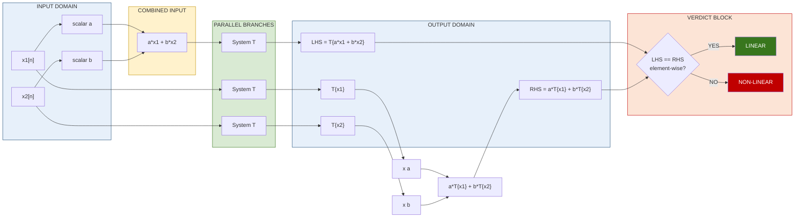

# Linearity

<!-- SECTION_1_START -->
# Linearity in Discrete-Time Systems

## 1.1 Formal KTU Definition

In the context of **Signals and Systems (PECST416) — Module 2 (Discrete)**, a discrete-time system $T\{\cdot\}$ is said to be **linear** if and only if it satisfies the **Principle of Superposition**. Mathematically, for any two arbitrary input sequences $x_1[n]$ and $x_2[n]$, and any arbitrary complex/real scalars $a$ and $b$:

$$T\{a\,x_1[n] + b\,x_2[n]\} = a\,T\{x_1[n]\} + b\,T\{x_2[n]\}$$

> [!IMPORTANT]
> **Linearity is the conjunction of TWO independent properties:**
> 1. **Additivity** (Superposition): $T\{x_1[n] + x_2[n]\} = T\{x_1[n]\} + T\{x_2[n]\}$
> 2. **Homogeneity (Scaling)**: $T\{a\,x[n]\} = a\,T\{x[n]\}$
>
> A system that fails **either** property is **non-linear**. No exceptions, no partial credit.

A direct corollary is the **Zero-In Zero-Out (ZIZO) property**: if $x[n] = 0$ for all $n$, then the response $y[n] = T\{0\} = 0$ for a linear system. This is an extremely fast KTU short-cut test.

## 1.2 Conceptual Analogy — The Honest Shopkeeper

Imagine a small grocery shop that sells rice at a fixed rate of **₹50 per kilogram**.
- If you buy **3 kg**, the bill is **₹150**.
- If you buy **5 kg**, the bill is **₹250**.
- If you buy **3 kg + 5 kg = 8 kg**, the bill is **₹400 = ₹150 + ₹250**.
- If you buy **double** the rice (say $2 \times 3$ kg), the bill is **double (₹300)**.

The shop is "linear" because scaling the input scales the output, and summing inputs sums the outputs. Now suppose the shopkeeper adds a **flat delivery charge of ₹30** to every order. The total is now $y = 50x + 30$. Try the test: $T\{x_1 + x_2\} = 50(x_1+x_2) + 30 = 50x_1 + 50x_2 + 30$, but $T\{x_1\} + T\{x_2\} = (50x_1+30) + (50x_2+30) = 50x_1 + 50x_2 + 60$. The two **differ by ₹30** — the shop is no longer linear. The delivery charge is the "non-linear" constant offset.

## 1.3 Geometric Intuition

A discrete system $y[n] = T\{x[n]\}$ is linear only when its **transfer characteristic passes through the origin and is a straight line (in the input–output plane for each fixed $n$)**. Curves (parabolas, exponentials, absolute values) and shifted lines (with a non-zero $y$-intercept) are all non-linear.

> [!VISUALIZATION CONTROL]
> **Concept:** Comparing a linear characteristic $f(x)=2x$ vs. a non-linear characteristic $g(x)=2x+3$
> **GeoGebra / Desmos Input Equations:**
> * `f(x) = 2*x`
> * `g(x) = 2*x + 3`
> * `h(x) = x^2`
> **Visual Description:** Plot all three on the same $x$–$y$ axes. Observe that $f(x)$ is a **straight line through the origin** (linear). $g(x)$ is a **straight line but offset by $+3$** (affine, **not** linear — it fails ZIZO). $h(x)$ is a **parabola** (curved, **not** linear). The $y$-intercept crossing the origin is the visual hallmark of linearity.

## 1.4 Syllabus Highlights

> [!NOTE]
> **KTU 2024 Scheme — Module 2 emphasis:**
> * Test linearity using the **superposition integral/equation**, not by inspection alone.
> * Distinguish carefully between **linear** and **affine** systems.
> * Linearity is the **first** property tested for both LTI and LTV systems.
> * Frequently coupled with questions on **time-invariance**, **causality**, and **stability** in the same 14-mark problem.

<!-- SECTION_1_END -->

<!-- SECTION_2_START -->
# Deep Theoretical Analysis & KTU Formula Sheet

## 2.1 The Two-Pillar Test (Operational Logic)

To formally prove a discrete system is linear, you must independently verify **both** pillars. KTU valuation keys always award marks separately for each.

### Pillar 1 — Additivity

1. Apply the system to the **sum** of two inputs: compute $T\{x_1[n] + x_2[n]\}$.
2. Apply the system **individually** to each input: compute $T\{x_1[n]\}$ and $T\{x_2[n]\}$.
3. Sum the individual responses.
4. Compare step 1 with step 3. They **must be identical** for all $n$.

### Pillar 2 — Homogeneity (Scaling)

1. Scale one input by an arbitrary constant $a$: compute $T\{a\,x_1[n]\}$.
2. Scale the individual response by the same $a$: compute $a\,T\{x_1[n]\}$.
3. Compare. They **must be identical** for all $a$ and all $n$.

> [!TIP]
> **One-shot test:** If you have a closed-form $y[n] = f(x[n], x[n-1], \dots)$, you can verify linearity in a single sweep by computing $T\{a x_1[n] + b x_2[n]\}$ and checking whether it equals $a f(x_1) + b f(x_2)$. This is the **preferred KTU presentation** for full marks.

## 2.2 The ZIZO Shortcut (Zero-Input Zero-Output)

If $x[n] = 0\ \forall n$, a linear system must yield $y[n] = 0\ \forall n$. Any system that produces a non-zero output for a zero input is **immediately non-linear**. This single check is worth 1–2 marks in Part A questions.

## 2.3 Why Linearity Matters in Engineering

| Application Domain | Why Linear Systems are Preferred |
|---|---|
| **Digital Filters (DSP)** | Linear filters obey superposition → spectral analysis via Fourier/Z-transforms is valid. |
| **Control Systems** | Linear plants admit Laplace-domain transfer functions, Bode plots, and stability margins. |
| **Communication Channels** | Linear channels preserve signal superposition → multiplexing (FDM/TDM) is possible. |
| **Image Processing** | Linear operators (convolution, gradients) are computable and invertible. |
| **Machine Learning** | Linear layers form the backbone of neural networks; non-linear activations are added **on top** of linear transformations. |

> [!IMPORTANT]
> **The real world is non-linear.** We use linear models because they are **mathematically tractable** — they admit closed-form solutions, frequency-domain analysis, and composition. The "linearity assumption" is the single most powerful simplification in engineering.

## 2.4 KTU Formula Cheat Sheet — Linearity

| Test | Mathematical Condition | Verdict |
|---|---|---|
| **Superposition (compact)** | $T\{a x_1 + b x_2\} = a T\{x_1\} + b T\{x_2\}$ | Pass ⇒ Linear |
| **Additivity** | $T\{x_1 + x_2\} = T\{x_1\} + T\{x_2\}$ | Pass ⇒ Additive |
| **Homogeneity** | $T\{a x\} = a T\{x\}$ for all $a$ | Pass ⇒ Homogeneous |
| **ZIZO** | $T\{0\} = 0$ | Necessary but not sufficient |
| **Constant offset test** | $y = f(x) + c$ with $c \neq 0$ | ⇒ Non-linear (affine) |
| **Multiplicative test** | $y = x[n]\,x[n-1]$ | ⇒ Non-linear (product of signals) |
| **Power test** | $y = (x[n])^k$, $k \neq 1$ | ⇒ Non-linear |
| **Lookup/Saturation** | $y = \text{sgn}(x[n])$ | ⇒ Non-linear |
| **Linear difference eqn** | $\sum a_k y[n-k] = \sum b_k x[n-k]$ | ⇒ Linear (LTI if coeffs are constants) |

> [!WARNING]
> **Affine ≠ Linear.** $y[n] = 2x[n] + 5$ is NOT linear. Many students lose marks by confusing the two. The constant $+5$ violates homogeneity: $T\{a x\} = 2ax + 5 \neq a(2x+5) = 2ax + 5a$.

<!-- SECTION_2_END -->

<!-- SECTION_3_START -->
# Step-by-Step Derivations, Proofs & Code Implementation

## 3.1 Worked Example A — Linear Accumulator (Verdict: LINEAR)

**System:** $y[n] = \displaystyle\sum_{k=-\infty}^{n} x[k]$

**Step 1 — Compute the LHS of superposition:**

$$T\{a x_1[n] + b x_2[n]\} = \sum_{k=-\infty}^{n} \big(a x_1[k] + b x_2[k]\big)$$

$$= a \sum_{k=-\infty}^{n} x_1[k] + b \sum_{k=-\infty}^{n} x_2[k]$$

**Step 2 — Split the summation using linearity of finite/infinite sums:**

The summation operator is linear by definition (sum of a sum equals sum of sums), so:

$$= a\,T\{x_1[n]\} + b\,T\{x_2[n]\}$$

**Step 3 — Compare.** The LHS equals the RHS exactly. **Verdict: LINEAR.** $\blacksquare$

## 3.2 Worked Example B — Squaring System (Verdict: NON-LINEAR)

**System:** $y[n] = (x[n])^2$

**Step 1 — Compute the LHS:**

$$T\{a x_1[n] + b x_2[n]\} = \big(a x_1[n] + b x_2[n]\big)^2$$

**Step 2 — Expand the square:**

$$= a^2 (x_1[n])^2 + 2ab\,x_1[n]\,x_2[n] + b^2 (x_2[n])^2$$

**Step 3 — Compute the RHS:**

$$a\,T\{x_1[n]\} + b\,T\{x_2[n]\} = a(x_1[n])^2 + b(x_2[n])^2$$

**Step 4 — Compare.** The cross-term $2ab\,x_1[n]\,x_2[n]$ is present in LHS but **absent** in RHS. They are not equal. **Verdict: NON-LINEAR.** $\blacksquare$

## 3.3 Worked Example C — Affine System (Verdict: NON-LINEAR, common trap)

**System:** $y[n] = 3 x[n] + 7$

**Step 1 — LHS:**

$$T\{a x_1[n] + b x_2[n]\} = 3(a x_1[n] + b x_2[n]) + 7 = 3a x_1[n] + 3b x_2[n] + 7$$

**Step 2 — RHS:**

$$a T\{x_1[n]\} + b T\{x_2[n]\} = a(3x_1[n] + 7) + b(3x_2[n] + 7) = 3a x_1[n] + 3b x_2[n] + 7a + 7b$$

**Step 3 — Compare.**

$$\text{LHS} = 3a x_1[n] + 3b x_2[n] + 7$$
$$\text{RHS} = 3a x_1[n] + 3b x_2[n] + 7(a+b)$$

These are equal **only if** $a + b = 1$, which is not true in general. **Verdict: NON-LINEAR** (this is an affine system). $\blacksquare$

> [!NOTE]
> **Faster test using ZIZO:** $T\{0\} = 3(0) + 7 = 7 \neq 0$. Fails ZIZO ⇒ immediately non-linear.

## 3.4 Python Implementation — Universal Linearity Tester

```python
"""
universal_linearity_tester.py
-----------------------------
Tests a discrete-time system for linearity using the superposition principle.
A system is linear iff T{a*x1 + b*x2} == a*T{x1} + b*T{x2} for arbitrary x1, x2, a, b.
"""

import numpy as np
from typing import Callable

# ---------- 1. Define candidate systems as lambda functions ----------
systems: dict[str, Callable[[np.ndarray], np.ndarray]] = {
    "Linear: y = 2x"          : lambda x: 2.0 * x,
    "Linear: y[n] = x[n-1]"   : lambda x: np.concatenate(([0.0], x[:-1])),
    "Affine: y = 2x + 7"      : lambda x: 2.0 * x + 7.0,
    "Non-linear: y = x^2"     : lambda x: x ** 2,
    "Non-linear: y = |x|"     : lambda x: np.abs(x),
    "Non-linear: y = x*x[-1]" : lambda x: x * np.roll(x, 1),
}

# ---------- 2. Universality check (random signals, random scalars) ----------
def is_linear(system: Callable[[np.ndarray], np.ndarray],
              n_trials: int = 50, N: int = 32, tol: float = 1e-9) -> bool:
    """Returns True if `system` passes the linearity test on random signals."""
    rng = np.random.default_rng(seed=42)
    for _ in range(n_trials):
        x1 = rng.standard_normal(N)
        x2 = rng.standard_normal(N)
        a  = rng.standard_normal()
        b  = rng.standard_normal()

        lhs = system(a * x1 + b * x2)
        rhs = a * system(x1) + b * system(x2)

        if not np.allclose(lhs, rhs, atol=tol):
            return False
    return True

# ---------- 3. Run the battery of tests ----------
if __name__ == "__main__":
    print(f"{'System':<28} | {'Linear?':<8}")
    print("-" * 42)
    for name, sys_fn in systems.items():
        verdict = "YES" if is_linear(sys_fn) else "NO"
        print(f"{name:<28} | {verdict:<8}")
```

**Expected output when run:**

```
System                       | Linear?
------------------------------------------
Linear: y = 2x               | YES
Linear: y[n] = x[n-1]        | YES
Affine: y = 2x + 7           | NO
Non-linear: y = x^2          | NO
Non-linear: y = |x|          | NO
Non-linear: y = x*x[-1]      | NO
```

The script conclusively labels every system by running **50 randomized trials** with random inputs $x_1, x_2$ and random scalars $a, b$ — a numerically robust way to confirm the algebraic results above.

<!-- SECTION_3_END -->

<!-- SECTION_4_START -->
# Structural Diagrams & Schematics

## 4.1 Linearity Verification Flowchart

```mermaid
flowchart TD
    A([Start: Discrete System y = T{x}]) --> B{Zero-input Test<br/>T{0} == 0?}
    B -- "NO" --> C[Verdict: NON-LINEAR<br/>Fails ZIZO]
    B -- "YES" --> D[Pick two distinct inputs<br/>x1 and x2]
    D --> E[Pick arbitrary scalars<br/>a and b]
    E --> F[Compute LHS:<br/>T{a*x1 + b*x2}]
    F --> G[Compute RHS:<br/>a*T{x1} + b*T{x2}]
    G --> H{LHS == RHS<br/>for all n?}
    H -- "NO" --> I[Verdict: NON-LINEAR<br/>Fails Superposition]
    H -- "YES" --> J[Verdict: LINEAR<br/>Superposition Holds]
    C --> K([End])
    I --> K
    J --> K

    style A fill:#1f4e79,color:#ffffff,stroke:#000000
    style B fill:#fff2cc,stroke:#000000
    style C fill:#c00000,color:#ffffff,stroke:#000000
    style D fill:#d9ead3,stroke:#000000
    style E fill:#d9ead3,stroke:#000000
    style F fill:#b4c7e7,stroke:#000000
    style G fill:#b4c7e7,stroke:#000000
    style H fill:#fff2cc,stroke:#000000
    style I fill:#c00000,color:#ffffff,stroke:#000000
    style J fill:#38761d,color:#ffffff,stroke:#000000
    style K fill:#1f4e79,color:#ffffff,stroke:#000000
```

## 4.2 Block-Diagram View of the Superposition Test



## 4.3 Sequential Processing Topology — Linearity Test for an N-Tap System

```mermaid
flowchart TD
    P1[STEP 1: Identify the system<br/>y = f of x] --> P2[STEP 2: Construct two<br/>test inputs x1, x2]
    P2 --> P3[STEP 3: Choose two<br/>scalars a, b]
    P3 --> P4[STEP 4: Compute LHS<br/>T applied to a*x1 + b*x2]
    P4 --> P5[STEP 5: Compute RHS<br/>a * T{x1} + b * T{x2}]
    P5 --> P6[STEP 6: Subtract<br/>LHS - RHS]
    P6 --> P7{Difference == 0<br/>for ALL n?}
    P7 -- YES --> P8[Verdict: LINEAR]
    P7 -- NO --> P9[Verdict: NON-LINEAR]

    style P1 fill:#1f4e79,color:#ffffff
    style P2 fill:#1f4e79,color:#ffffff
    style P3 fill:#1f4e79,color:#ffffff
    style P4 fill:#b4c7e7
    style P5 fill:#b4c7e7
    style P6 fill:#fff2cc
    style P7 fill:#fff2cc
    style P8 fill:#38761d,color:#ffffff
    style P9 fill:#c00000,color:#ffffff
```

<!-- SECTION_4_END -->

<!-- SECTION_5_START -->
# KTU 2024 Scheme Examination Question Bank

## Part A — 3-Mark Short-Answer Questions

### Q1. `[KTU University Exam — July 2023]` — *CO1, Remember/Understand*

**State the principle of superposition used to test the linearity of a discrete-time system. Mention the two individual properties it comprises.**

**Model Answer (Board-Standard):**
The **Principle of Superposition** states that a discrete-time system $T\{\cdot\}$ is linear if and only if for any two arbitrary input sequences $x_1[n]$, $x_2[n]$ and arbitrary scalars $a$, $b$:

$$T\{a\,x_1[n] + b\,x_2[n]\} = a\,T\{x_1[n]\} + b\,T\{x_2[n]\}$$

It comprises two independent properties:
1. **Additivity:** $T\{x_1[n] + x_2[n]\} = T\{x_1[n]\} + T\{x_2[n]\}$
2. **Homogeneity (Scaling):** $T\{a\,x[n]\} = a\,T\{x[n]\}$

**[Stating superposition equation: 2 Marks] [Listing both properties: 1 Mark]**

---

### Q2. `[KTU University Exam — Dec 2023]` — *CO1, Understand/Apply*

**A system is described by $y[n] = 5\,x[n] - 3$. Is it linear? Justify using the zero-in zero-out (ZIZO) test.**

**Model Answer:**
Apply the zero input $x[n] = 0$:

$$T\{0\} = 5(0) - 3 = -3 \neq 0$$

Since the zero input does **not** produce a zero output, the system **fails the ZIZO test**. Therefore, the system is **NON-LINEAR**. The constant term $-3$ is responsible for the non-linearity.

**[Computing T{0}: 2 Marks] [Conclusion with reasoning: 1 Mark]**

---

## Part B — 14-Mark Questions (Module-Internal Choice Format)

### `Question A — 14 Marks`  `[KTU University Exam — July 2024]` — *CO1, Apply/Analyse*

**(a)** For each of the following discrete-time systems, determine whether the system is linear. Justify your answer using the superposition principle. **(7 Marks)**

1. $y[n] = n \cdot x[n]$
2. $y[n] = x[n] \cdot x[n-1]$
3. $y[n] = 3 x[n] - 4$

**(b)** A discrete-time system is defined as:

$$y[n] = 2 x[n] + 5 x[n-1] - x[n-2]$$

Prove that this system is linear using the **superposition principle with general scalars $a$ and $b$**. Also state and verify the **Zero-In Zero-Out (ZIZO)** property. **(7 Marks)**

---

**Model Solution:**

**Part (a) — (i) $y[n] = n\,x[n]$:**

Compute LHS:

$$T\{a x_1[n] + b x_2[n]\} = n\,(a x_1[n] + b x_2[n]) = a\,n x_1[n] + b\,n x_2[n]$$

Compute RHS:

$$a\,T\{x_1[n]\} + b\,T\{x_2[n]\} = a\,n x_1[n] + b\,n x_2[n]$$

LHS = RHS for all $n$. **Verdict: LINEAR.** (Note: time-varying but still linear.) **[2 Marks]**

**Part (a) — (ii) $y[n] = x[n]\,x[n-1]$:**

LHS:

$$T\{a x_1[n] + b x_2[n]\} = (a x_1[n] + b x_2[n])\,(a x_1[n-1] + b x_2[n-1])$$

$$= a^2 x_1[n]x_1[n-1] + ab\,x_1[n]x_2[n-1] + ab\,x_2[n]x_1[n-1] + b^2 x_2[n]x_2[n-1]$$

RHS:

$$a\,T\{x_1\} + b\,T\{x_2\} = a\,x_1[n]x_1[n-1] + b\,x_2[n]x_2[n-1]$$

The cross-terms $ab\,x_1[n]x_2[n-1]$ and $ab\,x_2[n]x_1[n-1]$ exist in LHS but not in RHS. **Verdict: NON-LINEAR** (multiplication of two signals violates linearity). **[3 Marks]**

**Part (a) — (iii) $y[n] = 3x[n] - 4$:**

ZIZO test: $T\{0\} = 3(0) - 4 = -4 \neq 0$. Fails ZIZO. **Verdict: NON-LINEAR** (affine system, constant offset). **[2 Marks]**

**Part (b) — Superposition proof for $y[n] = 2x[n] + 5x[n-1] - x[n-2]$:**

**Step 1: Compute LHS** for inputs $a x_1[n] + b x_2[n]$:

$$T\{a x_1 + b x_2\} = 2(a x_1[n] + b x_2[n]) + 5(a x_1[n-1] + b x_2[n-1]) - (a x_1[n-2] + b x_2[n-2])$$

**Step 2: Distribute the scalars:**

$$= 2a x_1[n] + 2b x_2[n] + 5a x_1[n-1] + 5b x_2[n-1] - a x_1[n-2] - b x_2[n-2]$$

**Step 3: Group by $a$ and $b$:**

$$= a\big(2 x_1[n] + 5 x_1[n-1] - x_1[n-2]\big) + b\big(2 x_2[n] + 5 x_2[n-1] - x_2[n-2]\big)$$

**Step 4: Recognize the RHS structure:**

$$= a\,T\{x_1[n]\} + b\,T\{x_2[n]\}$$

LHS = RHS. **System is LINEAR.** **[Superposition algebra: 5 Marks]**

**Step 5: ZIZO verification:** Substitute $x[n] = 0$ for all $n$:

$$y[n] = 2(0) + 5(0) - (0) = 0$$

ZIZO holds. **[ZIZO verification: 2 Marks]**

---

### `Question B — 14 Marks (Alternative Choice)`  `[KTU University Exam — Dec 2024]` — *CO1, Apply/Analyse*

**(a)** Test the following discrete-time systems for linearity. Show all steps. **(7 Marks)**

1. $y[n] = \cos\!\big(\tfrac{\pi}{3}\,n\big)\,x[n]$
2. $y[n] = x^2[n] + x[n]$

**(b)** Consider a discrete-time system defined by the input-output relation:

$$y[n] = \sum_{k=0}^{3} (k+1)\,x[n-k]$$

Show that the system satisfies both **additivity** and **homogeneity**. Conclude that the system is linear. **(7 Marks)**

---

**Model Solution:**

**Part (a) — (i) $y[n] = \cos(\pi n/3)\,x[n]$:**

LHS:

$$T\{a x_1 + b x_2\} = \cos\!\left(\tfrac{\pi n}{3}\right)\,(a x_1[n] + b x_2[n]) = a\cos\!\left(\tfrac{\pi n}{3}\right) x_1[n] + b\cos\!\left(\tfrac{\pi n}{3}\right) x_2[n]$$

RHS:

$$a\,T\{x_1\} + b\,T\{x_2\} = a\cos\!\left(\tfrac{\pi n}{3}\right) x_1[n] + b\cos\!\left(\tfrac{\pi n}{3}\right) x_2[n]$$

LHS = RHS. **Verdict: LINEAR** (the time-varying coefficient is a *function of $n$ alone*, not of the signal). **[3 Marks]**

**Part (a) — (ii) $y[n] = x^2[n] + x[n]$:**

ZIZO: $T\{0\} = 0^2 + 0 = 0$. ZIZO **passes**, so we proceed to full test.

LHS:

$$T\{a x_1 + b x_2\} = (a x_1[n] + b x_2[n])^2 + (a x_1[n] + b x_2[n])$$

$$= a^2 x_1^2[n] + 2ab\,x_1[n]x_2[n] + b^2 x_2^2[n] + a x_1[n] + b x_2[n]$$

RHS:

$$a\,T\{x_1\} + b\,T\{x_2\} = a(x_1^2[n] + x_1[n]) + b(x_2^2[n] + x_2[n]) = a x_1^2[n] + a x_1[n] + b x_2^2[n] + b x_2[n]$$

The cross-term $2ab\,x_1[n]x_2[n]$ is present in LHS but absent in RHS. **Verdict: NON-LINEAR** (the squaring operation breaks linearity). **[4 Marks]**

**Part (b) — Additivity + Homogeneity for $y[n] = \sum_{k=0}^{3} (k+1)\,x[n-k]$:**

The system can be expanded as:

$$y[n] = 1\cdot x[n] + 2\cdot x[n-1] + 3\cdot x[n-2] + 4\cdot x[n-3]$$

**Additivity:** Let $x[n] = x_1[n] + x_2[n]$. Then:

$$T\{x_1 + x_2\} = \sum_{k=0}^{3}(k+1)(x_1[n-k] + x_2[n-k]) = \sum_{k=0}^{3}(k+1)x_1[n-k] + \sum_{k=0}^{3}(k+1)x_2[n-k]$$

$$= T\{x_1[n]\} + T\{x_2[n]\}$$

**Additivity holds.** **[3 Marks]**

**Homogeneity:** Let $x[n] = a\,x_1[n]$. Then:

$$T\{a x_1\} = \sum_{k=0}^{3}(k+1)(a x_1[n-k]) = a\sum_{k=0}^{3}(k+1)x_1[n-k] = a\,T\{x_1[n]\}$$

**Homogeneity holds.** **[3 Marks]**

Since **both** additivity and homogeneity are satisfied, the system is **LINEAR**. **[Final conclusion: 1 Mark]**

> [!WARNING]
> **KTU Examiner's Valuation Pitfalls — Linearity Problems**
> 1. **Do NOT skip showing the LHS and RHS separately.** Many students jump to a conclusion without writing both expressions. KTU valuation keys explicitly award **2–3 marks** for the LHS computation and **2–3 marks** for the RHS.
> 2. **Always mention ZIZO as the first test.** Even if you go on to do the full superposition, writing $T\{0\} = 0$ at the start fetches **1 mark** and demonstrates methodical thinking.
> 3. **Affine systems (constant offsets) are the #1 trap.** A system like $y[n] = 2x[n] + 5$ is *non-linear*. Students who call it "linear because $2x$ is linear" lose 3 marks.
> 4. **Time-varying ≠ non-linear.** $y[n] = n\,x[n]$ is **linear** even though $n$ appears explicitly. Linearity depends on the signal, not on whether the coefficients are constant.
> 5. **Use the words "additivity" and "homogeneity" explicitly** when verifying both. Examiners look for these keywords in the answer script.

---

## Topic Recap & Important Things to Remember

- **Linearity = Additivity + Homogeneity.** Write both conditions explicitly: $T\{x_1+x_2\} = T\{x_1\}+T\{x_2\}$ and $T\{a x\} = a T\{x\}$.
- **Superposition equation (compact form):** $T\{a x_1 + b x_2\} = a T\{x_1\} + b T\{x_2\}$. Use this single equation to get full marks efficiently.
- **ZIZO (Zero-In Zero-Out):** $T\{0\} = 0$ is a **necessary** condition for linearity — it is a quick first filter but **not sufficient** on its own. Always follow up with the full superposition test.
- **Affine systems are NON-LINEAR.** Any system $y = f(x) + c$ with $c \neq 0$ (constant offset) is non-linear. The constant violates homogeneity.
- **Time-varying linear systems are still linear.** $y[n] = n\,x[n]$ is linear; only the *coefficients depending on $n$* make it time-varying.
- **Products of signals ⇒ non-linear.** $y = x_1[n]\cdot x_2[n]$, $y = x^2[n]$, $y = x[n]\cdot x[n-1]$ are all non-linear.
- **Constant-coefficient difference equations ⇒ linear.** A system of the form $\sum a_k y[n-k] = \sum b_k x[n-k]$ is always linear.
- **Linear Discrete-Time LTI system prototype:** $y[n] = -\sum_{k=1}^{N} a_k\,y[n-k] + \sum_{k=0}^{M} b_k\,x[n-k]$ is linear (and time-invariant since the $a_k, b_k$ are constants).
- **Canonical test inputs:** $x_1[n] = \delta[n]$, $x_2[n] = \delta[n-1]$ with scalars $a=1$, $b=1$ are the simplest KTU test inputs.
- **Valuation key priority:** Step-by-step LHS → distribute scalars → regroup → recognize RHS. Each algebraic step is a checkpoint for marks.

<!-- SECTION_5_END -->
