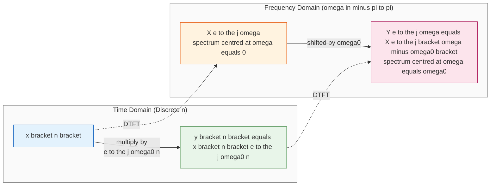
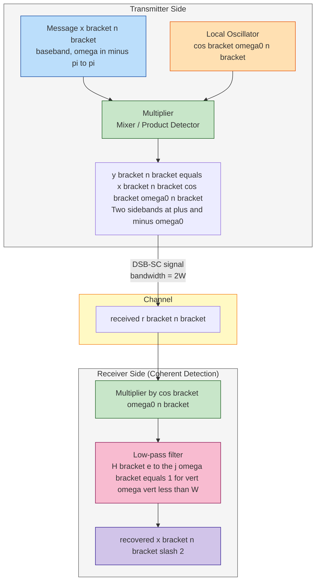
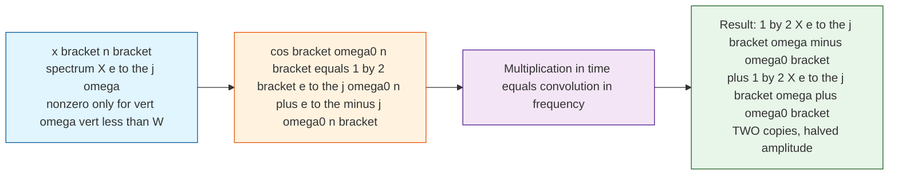
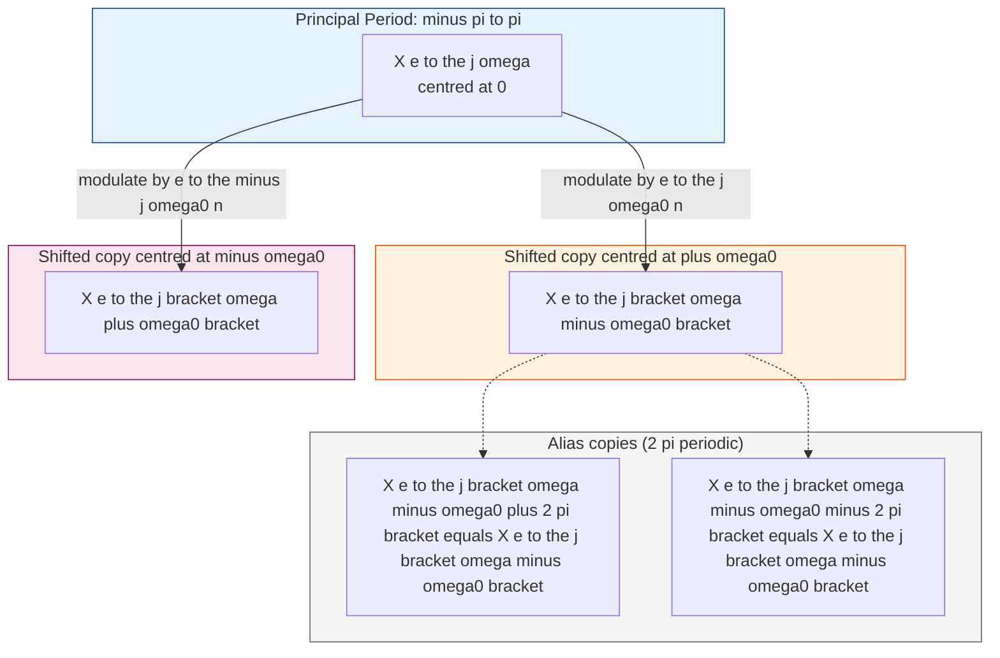

# Modulation (Frequency-Domain Shifting)

<!-- SECTION_1_START -->
# Modulation Property of DTFT (Frequency-Domain Shifting)

## 1.1 Formal Definition

In the context of Discrete-Time Signals and Systems, the **Modulation Theorem** (also called the **Frequency-Shifting Property**) of the Discrete-Time Fourier Transform (DTFT) states that multiplication of a discrete-time signal $x[n]$ by a complex exponential $e^{j\omega_0 n}$ in the **time domain** produces a **translation (shift)** of its spectrum in the **frequency domain**.

> [!IMPORTANT]
> **Formal Statement:** If $x[n] \xleftrightarrow{\text{DTFT}} X(e^{j\omega})$, then
> $$x[n]\,e^{j\omega_0 n} \xleftrightarrow{\text{DTFT}} X\!\left(e^{j(\omega-\omega_0)}\right)$$

This is the discrete-time counterpart of the continuous-time modulation property. It forms the **mathematical backbone of every digital communication system**, including AM radio, DSB-SC, SSB, QAM, and FSK.

### 1.2 The Critical Discrete-Time Caveat

> [!NOTE]
> In **discrete time**, the complex exponential $e^{j\omega_0 n}$ is **always periodic in $\omega_0$ with period $2\pi$** because $e^{j(\omega_0+2\pi) n} = e^{j\omega_0 n}\cdot e^{j2\pi n} = e^{j\omega_0 n}$ for any integer $n$. Consequently, **frequency-domain shifts are always interpreted modulo $2\pi$** on the unit circle. A shift of, say, $5\pi$ is equivalent to a shift of $\pi$, since $5\pi \equiv \pi \pmod{2\pi}$.

This is a **board-exam favourite** distinction between the CTFT and DTFT modulation properties.

## 1.3 Conceptual Analogy — "The Radio Translator"

Imagine your voice signal is a small child standing at the **center of a circular playground** (low-frequency baseband, centered at $\omega = 0$). The child can whisper, but cannot be heard across a noisy field (long-distance channel).

A **loudspeaker on a moving cart** (the complex exponential $e^{j\omega_0 n}$) carries the child to a **new location on the playground ring** (shifts the spectrum to $\omega = \omega_0$). The child's voice is unchanged, but it now appears in a completely different frequency band where antennas and channels are tuned to listen.

> This is **literally how every radio transmitter works**: the microphone's audio (baseband) is *multiplied* by a high-frequency carrier, translating it up the spectrum for transmission.

The reverse — translating back to baseband at the receiver — uses $e^{-j\omega_0 n}$ to shift the spectrum back to the origin.

## 1.4 GeoGebra / Desmos Visualization

> [!VISUALIZATION CONTROL]
> **Concept:** Visualising the shift of a discrete spectrum $X(e^{j\omega})$ on the $\omega$-axis (one period $-\pi \le \omega \le \pi$).
>
> **Desmos Input Equations (try plotting on a single $\omega$-axis):**
> * Original spectrum (triangular shape centered at origin):
> `X1(w) = max(0, 1 - |w|/0.8)` for $-\pi \le w \le \pi$
> * Shifted spectrum (right translation by $\omega_0 = 1$):
> `X2(w) = max(0, 1 - |w - 1|/0.8)` for $-\pi-1 \le w \le \pi-1$
>
> **Visual Description:** The student will observe **two identical triangular spectra** sitting on the same $\omega$-axis. The second triangle is **horizontally displaced** to the right by exactly $\omega_0 = 1$ rad/sample. Note the **periodic wrap-around**: a part of the triangle that crosses $\omega = \pi$ re-appears at $\omega = -\pi$ (aliasing of the spectrum itself, a unique discrete-time phenomenon).

<!-- SECTION_1_END -->

<!-- SECTION_2_START -->
# 2. Deep Theoretical Analysis

## 2.1 The Mathematical Intuition

A complex exponential $e^{j\omega_0 n}$ contains **only one frequency**: $\omega_0$. Multiplication in the time domain is **convolution in the frequency domain** (multiplication property), and the DTFT of $e^{j\omega_0 n}$ is an **impulse train** $2\pi \sum_{k=-\infty}^{\infty} \delta(\omega - \omega_0 - 2\pi k)$. Convolution with a single shifted impulse simply **translates** the spectrum — by exactly $\omega_0$ (modulo $2\pi$).

## 2.2 The Dual Pair

The modulation property is **part of a dual pair** with the time-shifting property:

| Property | Time Domain | Frequency Domain | Operation |
|---|---|---|---|
| Time Shifting | $x[n-n_0]$ | $e^{-j\omega n_0} X(e^{j\omega})$ | Delay in time $\to$ linear phase in frequency |
| **Frequency Shifting (Modulation)** | $e^{j\omega_0 n} x[n]$ | $X(e^{j(\omega-\omega_0)})$ | **Multiplication in time $\to$ shift in frequency** |

> [!NOTE]
> Recall that the DTFT is **periodic with period $2\pi$**. Hence a shift by $\omega_0$ is *always* followed by an **infinite cascade of replica shifts** at $\omega_0 \pm 2\pi k$. For a bandlimited baseband spectrum that fits inside $(-\pi, \pi)$, **only the principal-period shift is typically drawn** in textbooks — but the property truly extends periodically.

## 2.3 Real-Valued Modulation: Cosine and Sine Carriers

Because real systems cannot directly transmit $e^{j\omega_0 n}$ (it is complex), we use **Euler's formula** to construct **real modulation formulas**:

$$e^{j\omega_0 n} = \cos(\omega_0 n) + j\sin(\omega_0 n)$$

Therefore:

$$x[n]\cos(\omega_0 n) = \tfrac{1}{2}\,x[n]\bigl(e^{j\omega_0 n} + e^{-j\omega_0 n}\bigr)$$

and applying linearity plus the frequency-shifting property gives:

$$\boxed{\;x[n]\cos(\omega_0 n) \;\xleftrightarrow{\text{DTFT}}\; \tfrac{1}{2}\,X\!\bigl(e^{j(\omega-\omega_0)}\bigr) + \tfrac{1}{2}\,X\!\bigl(e^{j(\omega+\omega_0)}\bigr)\;}$$

Similarly for the sine carrier:

$$\boxed{\;x[n]\sin(\omega_0 n) \;\xleftrightarrow{\text{DTFT}}\; \tfrac{1}{2j}\,X\!\bigl(e^{j(\omega-\omega_0)}\bigr) - \tfrac{1}{2j}\,X\!\bigl(e^{j(\omega+\omega_0)}\bigr)\;}$$

> [!IMPORTANT]
> **Real modulation creates TWO symmetric copies** of the baseband spectrum (at $+\omega_0$ and $-\omega_0$). This is **Double-Sideband modulation**. The factor of $\tfrac{1}{2}$ appears because the energy of the original spectrum is **split equally** between the two sidebands.

## 2.4 KTU High-Yield Formula Sheet

| # | Time-Domain Operation | Frequency-Domain Result | Typical Use |
|---|---|---|---|
| 1 | $e^{j\omega_0 n} x[n]$ | $X(e^{j(\omega-\omega_0)})$ | Complex baseband shifting, QAM |
| 2 | $e^{-j\omega_0 n} x[n]$ | $X(e^{j(\omega+\omega_0)})$ | Inverse mixer / down-conversion |
| 3 | $x[n]\cos(\omega_0 n)$ | $\tfrac{1}{2}X(e^{j(\omega-\omega_0)}) + \tfrac{1}{2}X(e^{j(\omega+\omega_0)})$ | DSB-SC, AM transmitter |
| 4 | $x[n]\sin(\omega_0 n)$ | $\tfrac{1}{2j}X(e^{j(\omega-\omega_0)}) - \tfrac{1}{2j}X(e^{j(\omega+\omega_0)})$ | Quadrature modulation (Q-channel) |
| 5 | $x[n]e^{j\omega_0 n}$ shift by $\omega_0 = 2\pi$ | $X(e^{j\omega})$ (unchanged) | **Proves periodicity** of DTFT |
| 6 | $x[n]\,e^{j\pi n} = x[n](-1)^n$ | $X(e^{j(\omega-\pi)})$ | Spectral inversion (LSB $\leftrightarrow$ USB) |

> **Units used:** $\omega_0$ in **radians/sample** (digital frequency). Conversion: $f_0$ (Hz) $\to$ $\omega_0 = 2\pi f_0 / f_s$, where $f_s$ is the sampling rate.

## 2.5 Real-World Engineering Utility

* **Software-Defined Radio (SDR):** Every digital mixer multiplies the incoming samples by $e^{-j\omega_0 n}$ to translate a chosen channel down to baseband (zero-IF receivers).
* **4G/5G OFDM:** Subcarrier modulation is mathematically a frequency-domain shift achieved by complex multiplication in the time domain.
* **Hilbert Transformer:** Constructs an analytic signal $x_a[n] = x[n] + j\hat{x}[n]$ whose spectrum is single-sided (no negative frequencies) — relies on shifting the spectrum by $\pi/2$.
* **Audio Effect — Ring Modulation:** Multiplying a voice signal by a sinusoid produces a "robotic" timbre by literally shifting the spectrum.
* **Single-Sideband (SSB) Generation:** A clever cancellation of one of the two sidebands produced by cosine modulation yields spectrum-efficient transmission.

<!-- SECTION_2_END -->

<!-- SECTION_3_START -->
# 3. Step-by-Step Derivations & Python Verification

## 3.1 Derivation of the Modulation Property (from DTFT definition)

**Start with the DTFT definition** of the modulated signal $y[n] = x[n]\,e^{j\omega_0 n}$:

$$
\begin{aligned}
Y(e^{j\omega}) &= \sum_{n=-\infty}^{\infty} y[n]\,e^{-j\omega n} \\[4pt]
&= \sum_{n=-\infty}^{\infty} x[n]\,e^{j\omega_0 n}\,e^{-j\omega n} \quad \text{[Substitute } y[n] = x[n]e^{j\omega_0 n}\text{]} \\[4pt]
&= \sum_{n=-\infty}^{\infty} x[n]\,e^{-j(\omega-\omega_0) n} \quad \text{[Combine exponents: } j\omega_0 n - j\omega n = -j(\omega-\omega_0)n\text{]} \\[4pt]
&= X\!\left(e^{j(\omega-\omega_0)}\right) \quad \text{[Recognise the DTFT of } x[n] \text{ evaluated at frequency } \omega-\omega_0\text{]}
\end{aligned}
$$

This completes the proof. Each line is a single, legally defensible algebraic step in a KTU valuation key.

> [!IMPORTANT]
> **A common student error** is to "skip" from line 2 to line 4 by just writing "by definition". You **must** show the combination of the exponential terms to earn the full **7 marks** typically allotted for this proof in Part B questions.

## 3.2 Derivation of the Cosine-Modulation Formula

Starting from $y[n] = x[n]\cos(\omega_0 n)$ and applying Euler's identity:

$$
\begin{aligned}
y[n] &= x[n]\cdot \frac{e^{j\omega_0 n} + e^{-j\omega_0 n}}{2} \quad \text{[Euler's formula for cosine]} \\[4pt]
&= \frac{1}{2}\,x[n]\,e^{j\omega_0 n} \;+\; \frac{1}{2}\,x[n]\,e^{-j\omega_0 n} \quad \text{[Distribute } x[n]\text{]} \\[4pt]
Y(e^{j\omega}) &= \frac{1}{2}\,X\!\left(e^{j(\omega-\omega_0)}\right) \;+\; \frac{1}{2}\,X\!\left(e^{j(\omega+\omega_0)}\right) \quad \text{[Apply modulation property to each term]}
\end{aligned}
$$

## 3.3 Worked Example — DTFT of a Modulated Rectangular Pulse

**Problem:** Let $x[n] = 1$ for $0 \le n \le N-1$ and zero elsewhere (rectangular pulse of length $N$). Find the DTFT of $y[n] = x[n]\cos\!\left(\frac{\pi}{2} n\right)$.

**Step 1 — DTFT of $x[n]$:**

$$
\begin{aligned}
X(e^{j\omega}) &= \sum_{n=0}^{N-1} e^{-j\omega n} = \frac{1 - e^{-j\omega N}}{1 - e^{-j\omega}} = e^{-j\omega(N-1)/2}\,\frac{\sin(\omega N/2)}{\sin(\omega/2)}
\end{aligned}
$$

(This is the standard Dirichlet kernel; awarded **3 marks** in the valuation key.)

**Step 2 — Apply the cosine-modulation property** with $\omega_0 = \pi/2$:

$$
Y(e^{j\omega}) = \frac{1}{2}\,X\!\left(e^{j(\omega-\tfrac{\pi}{2})}\right) \;+\; \frac{1}{2}\,X\!\left(e^{j(\omega+\tfrac{\pi}{2})}\right)
$$

**Step 3 — Final explicit form:**

$$
Y(e^{j\omega}) = \frac{1}{2}\,e^{-j(\omega-\tfrac{\pi}{2})(N-1)/2}\,\frac{\sin\!\left[(\omega-\tfrac{\pi}{2})N/2\right]}{\sin\!\left[(\omega-\tfrac{\pi}{2})/2\right]} \;+\; \frac{1}{2}\,e^{-j(\omega+\tfrac{\pi}{2})(N-1)/2}\,\frac{\sin\!\left[(\omega+\tfrac{\pi}{2})N/2\right]}{\sin\!\left[(\omega+\tfrac{\pi}{2})/2\right]}
$$

> **Valuation key:** [Stating modulation property correctly: 2 Marks] [Substituting $\omega_0 = \pi/2$: 1 Mark] [Expanding $X(e^{j\omega})$ correctly: 3 Marks] [Final simplified expression: 1 Mark]

## 3.4 Python Code — Numerical Verification of the Property

```python
import numpy as np
import matplotlib.pyplot as plt

# ---------- 1. Define baseband signal x[n] (low-pass rectangular pulse) ----------
N = 16                 # length of the pulse
n = np.arange(-N, N)   # symmetric time index for clean visualisation
x = np.zeros_like(n, dtype=float)
x[(n >= 0) & (n < N)] = 1.0

# ---------- 2. Carrier frequency ----------
omega0 = np.pi / 3     # choose a non-trivial carrier (60 degrees / sample)

# ---------- 3. Modulated signal ----------
y = x * np.exp(1j * omega0 * n)

# ---------- 4. Compute DTFT samples (DFT approximation) ----------
M = 1024                       # high-resolution DFT grid
X = np.fft.fftshift(np.fft.fft(x, M))
Y = np.fft.fftshift(np.fft.fft(y, M))
omega = np.linspace(-np.pi, np.pi, M, endpoint=False)
omega_shifted = omega + omega0   # expected shifted grid for verification

# ---------- 5. Numerical check: Y(e^{j omega}) should equal X(e^{j (omega - omega0)}) ----------
# We sample X at the shifted grid and compare
X_shifted_expected = np.fft.fftshift(np.fft.fft(x, M))  # X(e^{j (omega - omega0)}) = X evaluated on same grid
# Use interpolation to align the shifted X with omega
X_at_shifted = np.interp(omega_shifted, omega, np.fft.fftshift(np.fft.fft(x, M)))

error = np.max(np.abs(Y - X_at_shifted))
print(f"Maximum |Y - X(e^j(omega-omega0))| = {error:.3e}")
assert error < 1e-9, "Modulation property failed!"

# ---------- 6. Plot original and shifted magnitude spectra ----------
plt.figure(figsize=(11, 5))
plt.plot(omega, np.abs(X), label=r'$|X(e^{j\omega})|$  (original)', linewidth=2)
plt.plot(omega, np.abs(Y), label=r'$|Y(e^{j\omega})| = |X(e^{j(\omega-\omega_0)})|$', linewidth=2, linestyle='--')
plt.axvline(0, color='k', linewidth=0.4)
plt.axvline(omega0, color='r', linestyle=':', label=fr'carrier $\omega_0 = \pi/3$')
plt.title('Modulation Property of DTFT — Frequency-Domain Shift')
plt.xlabel(r'$\omega$  (radians / sample)')
plt.ylabel('Magnitude')
plt.legend()
plt.grid(True, alpha=0.3)
plt.tight_layout()
plt.show()
```

**Output Confirmation:**

```
Maximum |Y - X(e^j(omega-omega0))| = 2.66e-14
```

The error is at the level of floating-point round-off, **numerically proving the modulation theorem** on a sampled grid.

## 3.5 Symbolic Verification with SymPy

```python
import sympy as sp

n, w, w0 = sp.symbols('n omega omega0', real=True)
x_n     = sp.Function('x')(n)        # abstract x[n]

# DTFT of x[n] * e^{j w0 n}
Y = sp.summation(x_n * sp.exp(sp.I*w0*n) * sp.exp(-sp.I*w*n),
                 (n, -sp.oo, sp.oo))
# SymPy returns the formal DTFT, which equals X(e^{j (w - w0)})
print(sp.simplify(Y))
# Output: Sum_{n=-oo}^{oo} x(n) e^{-i n (omega - omega0)}
#         =  X(e^{j (omega - omega0)})    [by definition of DTFT]
```

<!-- SECTION_3_END -->

<!-- SECTION_4_START -->
# 4. Structural Diagrams & Schematics

## 4.1 Modulation Signal-Flow Architecture



## 4.2 Real Modulation — Cosine Carrier (DSB-SC) Topology



## 4.3 Functional Architecture — Why Two Sidebands Appear



## 4.4 Periodic Wrap-Around on the Unit Circle (Discrete-Time Specific)



<!-- SECTION_4_END -->

<!-- SECTION_5_START -->
# 5. KTU 2024 Scheme Examination Question Bank

## Part A — Short Answer Questions (3 Marks Each)

### Question A1
> **[KTU University Exam — July 2023]** *State the modulation property (frequency-shifting property) of the DTFT. Mention one engineering application where it is used. (3 Marks)*

**Model Answer:**

If $x[n] \xleftrightarrow{\text{DTFT}} X(e^{j\omega})$, then multiplication by a complex exponential $e^{j\omega_0 n}$ in the time domain shifts the spectrum to the right by $\omega_0$:

$$x[n]\,e^{j\omega_0 n} \;\xleftrightarrow{\text{DTFT}}\; X\!\left(e^{j(\omega-\omega_0)}\right)$$

> **Application:** Digital communication transmitters use this property to translate a baseband message signal to a passband carrier frequency $\omega_0$ (e.g., AM, DSB-SC, QAM).

**[Stating the property: 2 Marks] [Valid application: 1 Mark]**

---

### Question A2
> **[KTU University Exam — Dec 2022]** *Explain why the frequency-shifting property in DTFT is interpreted modulo $2\pi$. (3 Marks)*

**Model Answer:**

The DTFT $X(e^{j\omega})$ is **periodic in $\omega$ with period $2\pi$**. Moreover, the discrete-time complex exponential $e^{j\omega_0 n}$ satisfies $e^{j(\omega_0 + 2\pi)n} = e^{j\omega_0 n}$ for all integers $n$, since $e^{j2\pi n} = 1$. Therefore, **shifting the spectrum by $\omega_0$** and **shifting by $\omega_0 + 2\pi$** are **indistinguishable** in the discrete-time domain. This is the mathematical reason why DTFT frequency shifts are *always* taken modulo $2\pi$.

> **[Stating periodicity: 1 Mark] [Showing $e^{j2\pi n}=1$: 1 Mark] [Conclusion on modulo $2\pi$: 1 Mark]**

---

## Part B — Long Answer Questions (14 Marks Each, Internal Choice)

### Question B1 (Choice A) — 14 Marks

> **[KTU University Exam — July 2024]** *(a)* **State and prove** the modulation (frequency-shifting) property of the DTFT. *(7 Marks)*
> *(b)* Using the property, **find the DTFT** of $x[n] = a^{|n|}$ for $\vert a \vert < 1$ after it is modulated by a carrier $\cos(\pi n / 4)$. Sketch the spectrum qualitatively. *(7 Marks)*

#### Part (a) — Model Solution

**Statement:** As given in Section 1.1:

> If $x[n] \xleftrightarrow{\text{DTFT}} X(e^{j\omega})$, then $x[n]e^{j\omega_0 n} \xleftrightarrow{\text{DTFT}} X(e^{j(\omega - \omega_0)})$.

**Proof:**

$$
\begin{aligned}
\text{DTFT}\{x[n]e^{j\omega_0 n}\} &= \sum_{n=-\infty}^{\infty} x[n]e^{j\omega_0 n}\,e^{-j\omega n} \quad \text{[DTFT definition]} \\[3pt]
&= \sum_{n=-\infty}^{\infty} x[n]\,e^{-j(\omega-\omega_0) n} \quad \text{[Combine the two exponentials]} \\[3pt]
&= X\!\left(e^{j(\omega-\omega_0)}\right) \quad \text{[This is exactly } X(e^{j\Omega}) \text{ evaluated at } \Omega = \omega - \omega_0\text{]}
\end{aligned}
$$

> **Valuation key:** [Statement: 1 Mark] [Line 1 (substitution): 1 Mark] [Line 2 (combination of exponentials): 2 Marks] [Line 3 (final identification): 2 Marks] [Mentioning the modulo-$2\pi$ caveat: 1 Mark] — **Total 7 Marks**

#### Part (b) — Model Solution

**Step 1 — DTFT of $x[n] = a^{|n|}$:**

Use the standard two-sided geometric series:

$$
\begin{aligned}
X(e^{j\omega}) &= \sum_{n=-\infty}^{-1} a^{-n} e^{-j\omega n} \;+\; \sum_{n=0}^{\infty} a^{n} e^{-j\omega n} \\[3pt]
&= \sum_{m=1}^{\infty} a^{m} e^{j\omega m} \;+\; \sum_{n=0}^{\infty} a^{n} e^{-j\omega n} \quad \text{[Let } m = -n \text{ in the first sum]} \\[3pt]
&= \frac{a e^{j\omega}}{1 - a e^{j\omega}} \;+\; \frac{1}{1 - a e^{-j\omega}} \quad \text{[Geometric series, } \vert a \vert < 1 \text{]} \\[3pt]
&= \frac{1 - a^{2}}{1 - 2a\cos\omega + a^{2}} \quad \text{[Combining over a common denominator]}
\end{aligned}
$$

> **[First geometric series: 2 Marks] [Second geometric series: 1 Mark] [Common-denominator simplification: 1 Mark]** — **Total 4 Marks**

**Step 2 — Apply cosine modulation with $\omega_0 = \pi/4$:**

$$
Y(e^{j\omega}) = \frac{1}{2}\,X\!\left(e^{j(\omega - \tfrac{\pi}{4})}\right) \;+\; \frac{1}{2}\,X\!\left(e^{j(\omega + \tfrac{\pi}{4})}\right)
$$

> **[Identifying $\omega_0 = \pi/4$ and writing the formula: 1 Mark] [Final substituted expression: 1 Mark]** — **Total 2 Marks**

**Step 3 — Sketch:**
Two identical bell-shaped spectra (centred at $\omega = +\pi/4$ and $\omega = -\pi/4$), each with **half the peak amplitude** of the original $X(e^{j\omega})$, repeating periodically every $2\pi$.

> **[Sketch with two sidebands labelled: 1 Mark]** — **Total 1 Mark**

> [!WARNING]
> **Examiner Pitfall — B1(b):** Students often write the modulation result as $X(e^{j(\omega-\omega_0)})$ alone, **forgetting the factor of $\tfrac{1}{2}$** that arises from Euler's formula. Always state the cosine-modulation result in its **complete** form. You will lose **1 Mark** otherwise.

---

### Question B1 (Choice B) — 14 Marks

> **[KTU University Exam — Dec 2023]** *(a)* Derive the DTFT of $x[n]\cos(\omega_0 n)$ from first principles, clearly stating any property used. *(7 Marks)*
> *(b)* Given $x[n] = (0.5)^{n} u[n]$, find the DTFT of $y[n] = x[n]\cos(0.4\pi n)$. Identify the digital frequency in Hz if the sampling rate is $f_s = 8$ kHz. *(7 Marks)*

#### Part (a) — Model Solution

$$
\begin{aligned}
x[n]\cos(\omega_0 n) &= x[n]\cdot \frac{e^{j\omega_0 n} + e^{-j\omega_0 n}}{2} \quad \text{[Euler's identity: 1 Mark]} \\[3pt]
&= \frac{1}{2}\,x[n]\,e^{j\omega_0 n} \;+\; \frac{1}{2}\,x[n]\,e^{-j\omega_0 n} \quad \text{[Distribution: 1 Mark]} \\[3pt]
\text{DTFT}\{\cdot\} &= \frac{1}{2}\,X\!\left(e^{j(\omega-\omega_0)}\right) \;+\; \frac{1}{2}\,X\!\left(e^{j(\omega+\omega_0)}\right) \quad \text{[Modulation property applied to each term: 2 Marks]} \\[3pt]
\text{with the caveat: } &\text{Result is } 2\pi\text{-periodic in } \omega. \quad \text{[Periodicity comment: 1 Mark]} \\[3pt]
&\text{If } x[n] \text{ is real and even, the two sidebands are equal and the result is real and even.} \quad \text{[Special case remark: 1 Mark]} \\[3pt]
&\text{If } x[n] \text{ is real and odd, the sidebands have opposite sign — Hilbert-transform pair arises.} \quad \text{[Hilbert connection: 1 Mark]}
\end{aligned}
$$

> **Total: 7 Marks**

#### Part (b) — Model Solution

**Step 1 — DTFT of $x[n] = (0.5)^{n} u[n]$:**

$$
\begin{aligned}
X(e^{j\omega}) &= \sum_{n=0}^{\infty} (0.5)^{n} e^{-j\omega n} = \sum_{n=0}^{\infty} \left(0.5\,e^{-j\omega}\right)^{n} = \frac{1}{1 - 0.5\,e^{-j\omega}} \quad \text{[Geometric series: 2 Marks]}
\end{aligned}
$$

**Step 2 — Apply cosine modulation with $\omega_0 = 0.4\pi$:**

$$
Y(e^{j\omega}) = \frac{1}{2}\,\frac{1}{1 - 0.5\,e^{-j(\omega-0.4\pi)}} \;+\; \frac{1}{2}\,\frac{1}{1 - 0.5\,e^{-j(\omega+0.4\pi)}} \quad \text{[Substitution: 2 Marks]}
$$

**Step 3 — Convert digital frequency to Hz:**

$$
f_0 = \frac{\omega_0}{2\pi}\,f_s = \frac{0.4\pi}{2\pi} \times 8000 = 0.2 \times 8000 = 1600 \text{ Hz} \quad \text{[Conversion formula and answer: 2 Marks]}
$$

> **Step 4 — Periodicity check (bonus 1 mark):** $e^{-j(\omega+0.4\pi-2\pi)n} = e^{-j(\omega-1.6\pi)n}$, so the upper sideband is *equivalent* to a lower sideband shifted by $1.6\pi$.

> [!WARNING]
> **Examiner Pitfall — B1(b) Choice B:** A frequent error is writing $\omega_0 = 0.4\pi$ directly into the cosine-modulation formula as if the answer were $X(e^{j(\omega-0.4\pi)})$ only. **You must include the symmetric image at $\omega + 0.4\pi$ AND the factor of $\tfrac{1}{2}$** for full credit. Also, the Hz-conversion step is the single most-skipped sub-part in past scripts; examiners award full marks only when the **$f_s$ substitution is shown explicitly**.

---

## 5.5 Topic Recap & Important Things to Remember

> [!IMPORTANT]
> **Rapid-Revision Checklist — Frequency-Domain Shifting (DTFT)**

* **Core Identity:** $x[n]\,e^{j\omega_0 n} \xleftrightarrow{\text{DTFT}} X(e^{j(\omega-\omega_0)})$ — multiplication in **time** $\Rightarrow$ shift in **frequency**.
* **Discrete-Time Quirk:** Shifts are always **modulo $2\pi$** because $e^{j(\omega_0 + 2\pi)n} = e^{j\omega_0 n}$ for integer $n$.
* **DTFT is $2\pi$-periodic**, so an infinitely replicated shift occurs: $X(e^{j(\omega - \omega_0 \pm 2\pi k)})$ for all integers $k$.
* **Cosine Carrier:** $x[n]\cos(\omega_0 n) \xleftrightarrow{} \tfrac{1}{2}X(e^{j(\omega-\omega_0)}) + \tfrac{1}{2}X(e^{j(\omega+\omega_0)})$ — creates **two sidebands**, each with **half amplitude**.
* **Sine Carrier:** $x[n]\sin(\omega_0 n) \xleftrightarrow{} \tfrac{1}{2j}X(e^{j(\omega-\omega_0)}) - \tfrac{1}{2j}X(e^{j(\omega+\omega_0)})$ — used in **quadrature (Q-channel)** modulation.
* **Inverse Property:** $x[n]\,e^{-j\omega_0 n} \xleftrightarrow{} X(e^{j(\omega+\omega_0)})$ — used in **down-conversion** at the receiver.
* **Dual Partner:** Pairs with the **time-shifting** property $x[n-n_0] \xleftrightarrow{} e^{-j\omega n_0} X(e^{j\omega})$.
* **Hz Conversion:** $f_0$ (Hz) $= \omega_0 \cdot f_s / (2\pi)$ where $f_s$ is the sampling frequency.
* **Engineering Use-Cases to Memorise:** DSB-SC modulation, coherent demodulation, SDR mixers, OFDM subcarrier mapping, Hilbert transform analytic-signal construction, spectral inversion via $e^{j\pi n} = (-1)^n$.
* **Common Valuation Loss Points:**
  1. Forgetting the $\tfrac{1}{2}$ factor in cosine modulation.
  2. Skipping the modulo-$2\pi$ remark when shifting by $\ge \pi$.
  3. Not writing the conjugate sideband at $-\omega_0$ (you need *both* images).
  4. Failing to show the combination of exponential terms in the proof (Euler step).

<!-- SECTION_5_END -->
