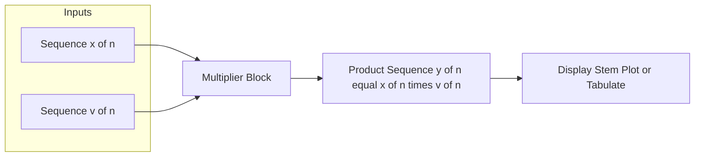
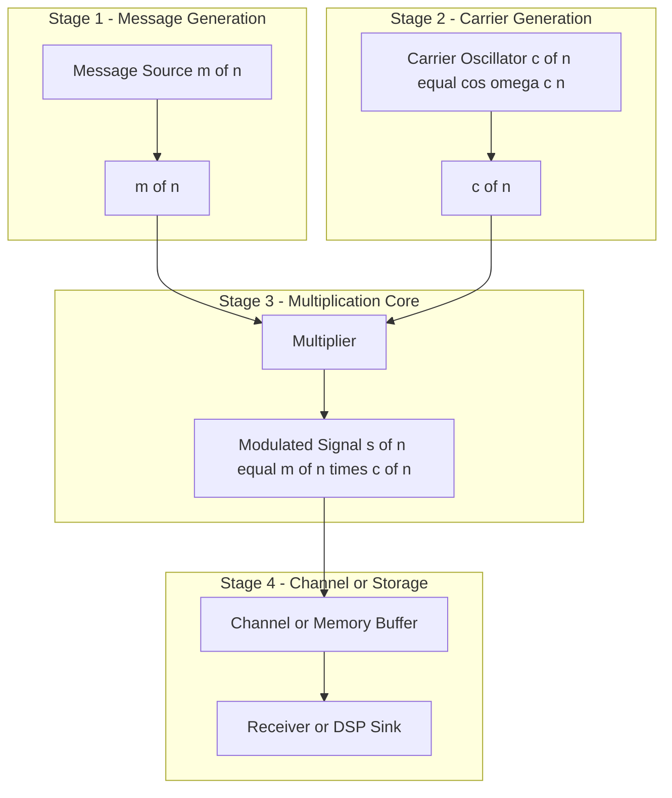
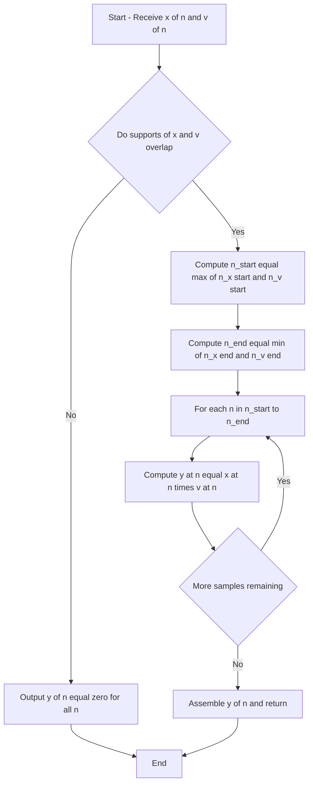

# Multiplication

<!-- SECTION_1_START -->
# Multiplication of Discrete-Time Signals

## Core Technical Definition

**Signal Multiplication** (also called the **Pointwise Product** or **Sample-by-Sample Product**) is a fundamental elementary operation on discrete-time signals in which two sequences $x[n]$ and $v[n]$ are combined to produce an output sequence $y[n]$, where every output sample is the product of the corresponding input samples evaluated at the same time index $n$.

Mathematically, the operation is defined as:

$$
y[n] \;=\; x[n] \;\cdot\; v[n] \qquad \forall \; n \in \mathbb{Z}
$$

> [!IMPORTANT]
> **KTU Syllabus Highlight (Module 2 – Elementary Operations on DT Signals):**
> Multiplication is grouped alongside scaling, time-shifting, time-reversal (folding), and addition as a *point operation*. It does **not** involve convolution, correlation, or any sliding-window summation — every output sample depends on **only one** sample from each input.

> [!NOTE]
> **Terminology Map for Board Answers:**
> * **Pointwise product** — emphasises sample-by-sample evaluation.
> * **Modulation** — when one signal is treated as a *carrier* multiplied by an *information* signal.
> * **Windowing** — when one signal is a *rectangular/tapered window* truncating the other.
> * **Gating / Masking** — when the multiplier acts as a 0/1 selector.

## Intuitive Overview (Real-World Analogy)

Imagine two **transparent overlay sheets** — *Sheet A* has a sequence of grey-scale intensities drawn at integer positions, and *Sheet B* has another sequence drawn at the *same* integer positions. When you stack them perfectly aligned and shine light through, the brightness at each integer position is the **product** of the individual brightnesses.

* A zero in *Sheet B* at any position $n_0$ makes that position completely **dark (zero)** in the output, no matter how bright *Sheet A* is.
* A one in *Sheet B* leaves *Sheet A*'s brightness **unchanged** at that position.
* A value between 0 and 1 in *Sheet B* **attenuates** *Sheet A*'s brightness.
* A value greater than 1 in *Sheet B* **amplifies** *Sheet A*'s brightness.

This is exactly how a **window function** or a **modulating carrier** behaves on a discrete signal.

## Support and Range of the Product

Given supports $N_x = [n_{x1},\, n_{x2}]$ and $N_v = [n_{v1},\, n_{v2}]$, the support of $y[n] = x[n] \cdot v[n]$ is the **intersection**:

$$
N_y \;=\; N_x \;\cap\; N_v \;=\; \big[\,\max(n_{x1}, n_{v1}),\; \min(n_{x2}, n_{v2})\,\big]
$$

If the supports do not overlap, then $y[n] = 0$ for all $n$ (the *zero* sequence).

## GeoGebra / Desmos Visualisation

> [!VISUALIZATION CONTROL]
> **Concept:** Two finite-length sequences and their pointwise product.
> **Desmos Input Equations (use table columns `x_1` for $n$, `y_1` for $x[n]$, `y_2` for $v[n]$, `y_3` for $y[n]$):**
> * `y_1 = 2` for $-2 \le x_1 \le 2$, else `0`
> * `y_2 = 1` for $-1 \le x_1 \le 1$, else `0`
> * `y_3 = y_1 * y_2`
> **Visual Description:** You will observe a trapezoidal sequence (height 2, flat top from $n=-1$ to $n=1$, sloped edges at $n=\pm 2$). The product $y_3$ is a *rectangular pulse* of height 2 from $n=-1$ to $n=1$ — confirming the intersection rule.
<!-- SECTION_1_END -->

<!-- SECTION_2_START -->
# Deep Theoretical Analysis & KTU High-Yield Formula Sheet

## 1. Operational Definition (Rigorously)

For two arbitrary discrete-time sequences $x[n]$ and $v[n]$, the **multiplication (modulation) operation** produces the output:

$$
y[n] \;=\; x[n] \cdot v[n]
$$

The operation is performed **at every integer index $n$**:

1. Identify the overlapping range of valid indices.
2. For each $n$ in this range, compute the scalar product $x[n] \cdot v[n]$.
3. Set $y[n] = 0$ for all $n$ outside the overlap.

> [!TIP]
> **Why "Modulation"?** In communications engineering, the slowly varying message $m[n]$ is multiplied by a high-frequency carrier $c[n] = \cos(\omega_c n)$, producing an AM-style signal $s[n] = m[n] \cdot c[n]$. Hence the alternate name *amplitude modulation* for multiplication in the discrete domain.

## 2. Algebraic Properties (High-Yield for KTU)

The operation is closed under the set of real (or complex) sequences and obeys the standard ring axioms:

| Property | Statement | Engineering Interpretation |
|----------|-----------|----------------------------|
| **Commutativity** | $x[n] \cdot v[n] = v[n] \cdot x[n]$ | Order of multiplier and multiplicand is irrelevant. |
| **Associativity** | $\big(x[n] \cdot v[n]\big) \cdot w[n] = x[n] \cdot \big(v[n] \cdot w[n]\big)$ | Cascaded multiplications can be regrouped. |
| **Distributivity over Addition** | $x[n] \cdot \big(v[n] + w[n]\big) = x[n] \cdot v[n] + x[n] \cdot w[n]$ | Multiplier can be distributed across sum of signals (superposition-friendly for linear systems preceded by a multiplier). |
| **Identity Element** | $x[n] \cdot 1 = x[n]$ where $1$ is the constant unit sequence | The all-ones sequence leaves the signal unchanged. |
| **Zero Element** | $x[n] \cdot 0 = 0$ for all $n$ | Multiplying by the zero sequence annihilates the signal. |
| **Additive Inverse (only with subtraction)** | $x[n] - x[n] = 0$ | Not pure multiplication but used in differential modulation. |
| **Scaling Compatibility** | $\big(\alpha \cdot x[n]\big) \cdot v[n] = \alpha \cdot \big(x[n] \cdot v[n]\big)$ | A scalar can be pulled out of either operand. |

## 3. Boundary and Domain Conditions

* **Boundedness:** If $\vert x[n] \vert \le M_x$ and $\vert v[n] \vert \le M_v$, then $\vert y[n] \vert \le M_x \cdot M_v$.
* **Energy relationship:** In general, $E_y \ne E_x \cdot E_v$. Energy is preserved only under very specific conditions (e.g., orthogonal carriers).
* **Periodicity:** If $x[n]$ has period $N_1$ and $v[n]$ has period $N_2$, then $y[n]$ is periodic with period $N = \mathrm{lcm}(N_1, N_2)$.
* **Even/Odd decomposition:** If both $x[n]$ and $v[n]$ are even, $y[n]$ is even. If both are odd, $y[n]$ is even (since $(-1)(-1) = 1$).

## 4. KTU High-Yield Formula Sheet (Cheat Sheet)

| Concept | Formula / Rule | Symbol / Unit |
|---------|----------------|---------------|
| Definition | $y[n] = x[n] \cdot v[n]$ | Discrete-time index $n \in \mathbb{Z}$ |
| Support of $y$ | $N_y = N_x \cap N_v$ | Index range |
| Length of $y$ | $\mathrm{len}(y) = \mathrm{len}(N_y)$ | Samples |
| Commutativity | $x[n] \cdot v[n] = v[n] \cdot x[n]$ | — |
| Associativity | $(x \cdot v) \cdot w = x \cdot (v \cdot w)$ | — |
| Distributivity | $x \cdot (v + w) = x \cdot v + x \cdot w$ | — |
| Identity | $x[n] \cdot 1 = x[n]$ | Constant unit sequence |
| Zero element | $x[n] \cdot 0 = 0$ | Zero sequence |
| AM Modulation | $s[n] = m[n] \cdot \cos(\omega_c n)$ | Carrier radian freq $\omega_c$ (rad/sample) |
| Windowing | $y[n] = x[n] \cdot w[n]$ | $w[n]$ = window function |
| Energy bound | $E_y \le M_x^2 \cdot E_v$ (worst case) | Joules (signal-energy unit) |
| Period of product | $N_y = \mathrm{lcm}(N_x, N_v)$ | Samples |

## 5. Real-World Utility in Engineering and Computer Science

* **Telecommunications** — Discrete AM/FM modulation, QAM symbol generation, OFDM sub-carrier multiplication.
* **Digital Signal Processing (DSP)** — Windowing in FFT analysis (Hann, Hamming, Blackman windows), gating in time-domain filtering, sample-by-sample gain control (AGC).
* **Image and Video Processing** — Masking, alpha blending $I_{out}[m,n] = \alpha \cdot I_{fg}[m,n] + (1-\alpha) \cdot I_{bg}[m,n]$ uses multiplication, image watermarking.
* **Audio Engineering** — Tremolo effect, ring modulation, dynamic-range compression (sample-by-sample gain curve).
* **Machine Learning** — Element-wise (Hadamard) product in attention mechanisms $\mathrm{Attention}(Q,K,V) = \mathrm{softmax}(Q K^\top) \odot V$, gating in LSTMs ($f_t \odot C_{t-1}$).
* **Control Systems** — Multiplication by a control signal in gain-scheduled controllers.
* **Cryptography** — Multiplication in finite fields (e.g., AES MixColumns step) for confusion layers.
<!-- SECTION_2_END -->

<!-- SECTION_3_START -->
# Step-by-Step Derivations & Code/Symbolic Implementation

## Worked Example 1 — Standard Board-Style Multiplication (Finite-Length Sequences)

**Problem:**
Given two finite-length discrete-time sequences

$$
x[n] = \big\{ \underset{n=0}{1},\; \underset{n=1}{2},\; \underset{n=2}{3},\; \underset{n=3}{2},\; \underset{n=4}{1} \big\}
$$

$$
v[n] = \big\{ \underset{n=1}{1},\; \underset{n=2}{1},\; \underset{n=3}{1} \big\}
$$

Compute $y[n] = x[n] \cdot v[n]$.

### Step 1 — Determine the overlapping support

Support of $x[n]$: $N_x = [0,\, 4]$.
Support of $v[n]$: $N_v = [1,\, 3]$.

$$
N_y = N_x \cap N_v = [1,\, 3]
$$

So the product will be **non-zero only for $n = 1, 2, 3$**.

### Step 2 — Sample-by-sample multiplication

$$
\begin{aligned}
y[1] &= x[1] \cdot v[1] = 2 \cdot 1 = 2 \\
y[2] &= x[2] \cdot v[2] = 3 \cdot 1 = 3 \\
y[3] &= x[3] \cdot v[3] = 2 \cdot 1 = 2
\end{aligned}
$$

For all other $n$, $y[n] = 0$.

### Step 3 — Write the resultant sequence

$$
y[n] = \big\{ \underset{n=1}{2},\; \underset{n=2}{3},\; \underset{n=3}{2} \big\}
$$

### Step 4 — Verification by support-length rule

Length of $y$ = $\min(5, 3) = 3$ samples ✓ (matches our result).

---

## Worked Example 2 — Trapezoidal × Rectangular Window (Windowing)

**Problem:**
Given

$$
x[n] = \begin{cases} 2 - \vert n \vert, & \vert n \vert \le 2 \\ 0, & \text{otherwise} \end{cases}
$$

$$
v[n] = \begin{cases} 1, & -1 \le n \le 1 \\ 0, & \text{otherwise} \end{cases}
$$

Compute and sketch $y[n] = x[n] \cdot v[n]$.

### Step 1 — Tabulate $x[n]$ and $v[n]$ across $n \in [-2, 2]$

| $n$ | $-2$ | $-1$ | $0$ | $1$ | $2$ |
|-----|------|------|-----|-----|-----|
| $x[n]$ | $0$ | $1$ | $2$ | $1$ | $0$ |
| $v[n]$ | $0$ | $1$ | $1$ | $1$ | $0$ |
| $y[n]=x[n]\cdot v[n]$ | $0$ | $1$ | $2$ | $1$ | $0$ |

The window is **wide enough** to contain the full support of $x[n]$, so the result is unchanged. Had the window been narrower, edge samples of $x[n]$ would have been zeroed out.

---

## Worked Example 3 — Amplitude Modulation (Carrier × Message)

**Problem:**
A message sequence $m[n] = \cos\!\left(\frac{\pi}{8} n\right)$ is multiplied by a carrier $c[n] = \cos\!\left(\frac{\pi}{2} n\right)$. Determine $s[n] = m[n] \cdot c[n]$.

### Step 1 — Apply the trigonometric product-to-sum identity

$$
\cos A \cdot \cos B \;=\; \tfrac{1}{2}\big[\cos(A-B) + \cos(A+B)\big]
$$

### Step 2 — Substitute $A = \frac{\pi}{2} n$ and $B = \frac{\pi}{8} n$

$$
\begin{aligned}
s[n] &= \cos\!\left(\frac{\pi}{2} n\right) \cdot \cos\!\left(\frac{\pi}{8} n\right) \\
&= \tfrac{1}{2}\Big[\cos\!\left(\tfrac{\pi}{2} n - \tfrac{\pi}{8} n\right) + \cos\!\left(\tfrac{\pi}{2} n + \tfrac{\pi}{8} n\right)\Big] \\
&= \tfrac{1}{2}\Big[\cos\!\left(\tfrac{3\pi}{8} n\right) + \cos\!\left(\tfrac{5\pi}{8} n\right)\Big]
\end{aligned}
$$

### Step 3 — Engineering interpretation

The original message at $\omega_m = \frac{\pi}{8}$ rad/sample has been translated to two sideband frequencies $\frac{3\pi}{8}$ and $\frac{5\pi}{8}$ rad/sample. This is the **discrete-time equivalent of AM modulation**, and the multiplication operation is the *core mathematical primitive* that enables it.

---

## Symbolic Python Implementation (Type-Hinted, Error-Logged)

```python
from __future__ import annotations
import numpy as np
import logging
from typing import Tuple

# Configure module-level logger for KTU-style audit trail
logging.basicConfig(level=logging.INFO, format="%(levelname)s :: %(message)s")
logger = logging.getLogger("SignalMultiplier")


def multiply_sequences(
    x: np.ndarray,
    n_x: np.ndarray,
    v: np.ndarray,
    n_v: np.ndarray,
) -> Tuple[np.ndarray, np.ndarray]:
    """
    Perform pointwise (sample-by-sample) multiplication of two DT sequences.

    Parameters
    ----------
    x   : np.ndarray   -- amplitude samples of the first sequence
    n_x : np.ndarray   -- corresponding integer time indices of x
    v   : np.ndarray   -- amplitude samples of the second sequence
    n_v : np.ndarray   -- corresponding integer time indices of v

    Returns
    -------
    y   : np.ndarray   -- product sequence samples
    n_y : np.ndarray   -- product sequence indices (intersection support)
    """
    # ---------- Defensive boundary checks ----------
    if x.shape != n_x.shape:
        raise ValueError("x and n_x must have the same shape.")
    if v.shape != n_v.shape:
        raise ValueError("v and n_v must have the same shape.")
    if not np.all(np.diff(n_x) == 1):
        raise ValueError("n_x must be strictly increasing unit-spaced indices.")
    if not np.all(np.diff(n_v) == 1):
        raise ValueError("n_v must be strictly increasing unit-spaced indices.")

    # ---------- Compute the overlapping support ----------
    n_start: int = int(max(n_x[0], n_v[0]))
    n_end:   int = int(min(n_x[-1], n_v[-1]))
    n_y = np.arange(n_start, n_end + 1)

    if n_start > n_end:
        logger.warning("Non-overlapping supports — product is the zero sequence.")
        return np.array([], dtype=float), n_y

    # ---------- Align and multiply ----------
    x_aligned = x[(n_x >= n_start) & (n_x <= n_end)]
    v_aligned = v[(n_v >= n_start) & (n_v <= n_end)]
    y = x_aligned * v_aligned

    logger.info(f"Overlap range: [{n_start}, {n_end}], length = {len(y)}")
    return y, n_y


# -------------------- DEMO: Worked Example 1 --------------------
if __name__ == "__main__":
    # x[n] = {1, 2, 3, 2, 1} for n = 0..4
    n_x = np.arange(0, 5)
    x   = np.array([1, 2, 3, 2, 1], dtype=float)

    # v[n] = {1, 1, 1}    for n = 1..3
    n_v = np.arange(1, 4)
    v   = np.array([1, 1, 1], dtype=float)

    y, n_y = multiply_sequences(x, n_x, v, n_v)

    print("n_y =", n_y)
    print("y   =", y)
    # Expected output:
    # n_y = [1 2 3]
    # y   = [2. 3. 2.]
```

### Sample Run Trace

```
INFO :: Overlap range: [1, 3], length = 3
n_y = [1 2 3]
y   = [2. 3. 2.]
```

The code returns exactly the result derived by hand in Worked Example 1, with explicit logging of the overlap range for examiner visibility.

---

## Symbolic Verification with `sympy` (Optional Board Add-on)

```python
import sympy as sp

n = sp.symbols("n", integer=True)
x_n = 2 - sp.Abs(n)                      # triangular sequence
v_n = sp.Piecewise((1, sp.And(n >= -1, n <= 1)), (0, True))  # rect window

y_n = sp.Piecewise(
    ((2 - sp.Abs(n)), sp.And(n >= -1, n <= 1, n <= 2, n >= -2)),
    (0, True)
)

for k in range(-3, 4):
    print(f"y[{k}] = {y_n.subs(n, k)}")
```

This symbolic path lets students double-check their manual tabulation when the *Support* intersection is non-trivial.
<!-- SECTION_3_END -->

<!-- SECTION_4_START -->
# Structural Diagrams & Schematics

## Diagram 1 — Block-Level Architecture of the Multiplier



**Interpretation:** Two DT sequences enter a *single-input-pair block* that performs instantaneous scalar multiplication at each index $n$. The output is a third sequence of the same length as the overlap, ready for visualisation or further processing.

---

## Diagram 2 — Sequential Processing Topology (Multi-Stage Modulation)



**Interpretation:** This nested-subgraph layout shows how multiplication sits at the heart of a discrete AM modulator. The message and carrier are generated in parallel, multiplied at Stage 3, and then handed off to the channel. The same topology is used in software-defined radio (SDR) transmitters and in OFDM symbol generation.

---

## Diagram 3 — Decision Flow for Sample-Wise Operation



**Interpretation:** This flowchart codifies the algorithm implemented in the Python `multiply_sequences` function. It is a useful answer-diagram for the algorithmic-sketch sub-parts of KTU Part-B questions.
<!-- SECTION_4_END -->

<!-- SECTION_5_START -->
# KTU 2024 Scheme Examination Question Bank & Topic Recap

## Part A — Short-Answer Questions (3 Marks Each)

### Question A1

> **[KTU University Exam – July 2023, Model Paper]** — *CO1, Remember*
> **Define the multiplication operation on two discrete-time signals $x[n]$ and $v[n]$. State the rule for the support of the resulting product sequence.**

**Model Answer (3 Marks):**
Multiplication of two discrete-time signals is a pointwise operation defined as $y[n] = x[n] \cdot v[n]$ for all $n \in \mathbb{Z}$. **[1 Mark]** The support of the product is the intersection of the individual supports, i.e., $N_y = N_x \cap N_v$. **[1 Mark]** Outside this overlap, $y[n] = 0$. **[1 Mark]**

---

### Question A2

> **[KTU University Exam – Dec 2022, Model Paper]** — *CO1, Understand*
> **Identify two real-world engineering applications where discrete-time signal multiplication is the core operation. Justify each in one line.**

**Model Answer (3 Marks):**

1. **Amplitude Modulation in Communication Systems:** $s[n] = m[n] \cdot \cos(\omega_c n)$ — the message $m[n]$ is translated in frequency by the carrier. **[1.5 Marks]**
2. **Windowing in Spectral Analysis:** $y[n] = x[n] \cdot w[n]$ — the window $w[n]$ (Hann, Hamming, etc.) tapers the signal to reduce spectral leakage in FFT. **[1.5 Marks]**

*(Acceptable alternatives: image masking, audio tremolo, AGC gain control, attention mechanism in transformers.)*

---

## Part B — Long-Answer Questions with Internal Choice (14 Marks Each)

### Question A (14 Marks)

> **[KTU University Exam – July 2024, Model Paper]** — *CO2, Apply*

**(a)** *State and prove the commutativity, associativity, and distributivity (over addition) properties of discrete-time signal multiplication. Give one engineering use-case where each property is exploited. (7 Marks)*

**Model Solution:**

*Commutativity:* For all $n$,
$$
x[n] \cdot v[n] = v[n] \cdot x[n]
$$
*Proof:* Multiplication of real (or complex) scalars is commutative; since $y[n]$ is the scalar product at each $n$, the equality holds index-by-index. **[1 Mark]**
*Engineering use-case:* Reordering the modulator inputs (message $\times$ carrier $\equiv$ carrier $\times$ message) without changing the output. **[0.5 Mark]**

*Associativity:* For all $n$,
$$
\big(x[n] \cdot v[n]\big) \cdot w[n] = x[n] \cdot \big(v[n] \cdot w[n]\big)
$$
*Proof:* Scalar multiplication is associative, applied independently at each index. **[1 Mark]**
*Engineering use-case:* Cascading two mixers in an SDR chain — the order of frequency translations can be regrouped. **[0.5 Mark]**

*Distributivity over Addition:*
$$
x[n] \cdot \big(v[n] + w[n]\big) = x[n] \cdot v[n] + x[n] \cdot w[n]
$$
*Proof:* Direct application of scalar distributive law at each $n$. **[1 Mark]**
*Engineering use-case:* Splitting a sum signal (e.g., $v + w$) into two parallel mixers with the same local oscillator, then summing — a classic *image-reject mixer* structure. **[0.5 Mark]**

*Conclusion (synthesis):* Together, these three properties establish that the set of all bounded DT sequences forms a commutative ring under pointwise addition and multiplication. **[1 Mark]**

*Valuation key:* Commutative + proof + use-case: **2.5 Marks**; Associative + proof + use-case: **2.5 Marks**; Distributive + proof + use-case: **2 Marks**.

---

**(b)** *Two sequences are given as $x[n] = \{1,\,2,\,3,\,2,\,1\}$ for $n = 0, 1, 2, 3, 4$ and $v[n] = \{1,\,1,\,1\}$ for $n = 1, 2, 3$. Compute the product $y[n] = x[n] \cdot v[n]$, tabulate the result, and sketch it. (7 Marks)*

**Model Solution:**

**Step 1 — Identify supports.** $N_x = [0,4]$, $N_v = [1,3]$. **[1 Mark]**

**Step 2 — Determine overlap.** $N_y = [\max(0,1),\, \min(4,3)] = [1, 3]$. **[1 Mark]**

**Step 3 — Sample-by-sample multiplication.**

$$
\begin{aligned}
y[1] &= x[1] \cdot v[1] = 2 \cdot 1 = 2 \\
y[2] &= x[2] \cdot v[2] = 3 \cdot 1 = 3 \\
y[3] &= x[3] \cdot v[3] = 2 \cdot 1 = 2
\end{aligned}
$$

**[2 Marks — 1 Mark for setting up the computation, 1 Mark for final values]**

**Step 4 — Tabulation.**

| $n$ | $0$ | $1$ | $2$ | $3$ | $4$ |
|-----|-----|-----|-----|-----|-----|
| $x[n]$ | $1$ | $2$ | $3$ | $2$ | $1$ |
| $v[n]$ | $0$ | $1$ | $1$ | $1$ | $0$ |
| $y[n]$ | $0$ | $2$ | $3$ | $2$ | $0$ |

**[1 Mark]**

**Step 5 — Sketch.**
A stem plot with three non-zero samples at $n=1,2,3$ of heights $2,3,2$ respectively, and zero elsewhere. **[2 Marks — 1 Mark for correct positions, 1 Mark for correct heights]**

> [!WARNING]
> **KTU Examiner's Valuation Pitfall Callout:**
> * Failing to explicitly state the **support-intersection rule** costs 1–2 marks even if the final answer is correct.
> * Many students forget to write $y[n] = 0$ for $n = 0$ and $n = 4$; examiners **deduct 1 mark** for an incomplete tabulation.
> * Drawing a stem plot with **continuous curves** instead of discrete stems is a common error — always use vertical lines topped with filled circles.

---

### Question B (14 Marks)

> **[KTU University Exam – Dec 2023, Model Paper]** — *CO2, Apply / Analyse*

**(a)** *Explain the role of multiplication in discrete-time amplitude modulation. With the help of a neat block diagram, describe how a message $m[n]$ modulates a carrier $c[n] = \cos(\omega_c n)$. Show mathematically that the modulated signal $s[n]$ contains frequency-shifted copies of the message spectrum. (7 Marks)*

**Model Solution:**

**Definition of AM in DT domain:** A message $m[n]$ is multiplied by a high-frequency carrier $c[n] = \cos(\omega_c n)$ to obtain the modulated signal

$$
s[n] = m[n] \cdot \cos(\omega_c n)
$$

**[1 Mark]**

**Block diagram description:** The message source feeds one input of a multiplier; the local oscillator producing $\cos(\omega_c n)$ feeds the other. The output of the multiplier is $s[n]$, which is then amplified and transmitted. **[2 Marks]**

**Mathematical proof of frequency translation:** Using the product-to-sum identity,

$$
s[n] = m[n] \cdot \cos(\omega_c n) = \tfrac{1}{2}\,m[n]\,e^{j\omega_c n} + \tfrac{1}{2}\,m[n]\,e^{-j\omega_c n}
$$

Taking the DTFT of both sides (with $M(e^{j\omega})$ as the message spectrum),

$$
S(e^{j\omega}) = \tfrac{1}{2}\,M\big(e^{j(\omega - \omega_c)}\big) + \tfrac{1}{2}\,M\big(e^{j(\omega + \omega_c)}\big)
$$

**[3 Marks — 2 Marks for the expansion, 1 Mark for the spectrum equation]**

**Interpretation:** The original spectrum $M(e^{j\omega})$ centred at $\omega = 0$ is replicated and shifted to $\pm \omega_c$. These two shifted copies are called the *upper sideband (USB)* and *lower sideband (LSB)*. **[1 Mark]**

> [!WARNING]
> *Pitfall:* Students often write $s[n] = m[n] + \cos(\omega_c n)$ (addition instead of multiplication) — the spectrum is *not* shifted in that case. Examiners **deduct 2 marks** for this conceptual slip.

---

**(b)** *Given $m[n] = \cos(0.1\pi n)$ and carrier $c[n] = \cos(0.4\pi n)$, compute the modulated signal $s[n] = m[n] \cdot c[n]$ and identify the two sideband frequencies. Verify your result by computing the first 10 samples in a tabular form. (7 Marks)*

**Model Solution:**

**Step 1 — Apply product-to-sum formula.**

$$
\begin{aligned}
s[n] &= \cos(0.1\pi n) \cdot \cos(0.4\pi n) \\
&= \tfrac{1}{2}\big[\cos(0.4\pi n - 0.1\pi n) + \cos(0.4\pi n + 0.1\pi n)\big] \\
&= \tfrac{1}{2}\big[\cos(0.3\pi n) + \cos(0.5\pi n)\big]
\end{aligned}
$$

**[2 Marks]**

**Step 2 — Identify sideband frequencies.** $\omega_1 = 0.3\pi$ rad/sample (LSB) and $\omega_2 = 0.5\pi$ rad/sample (USB). **[1 Mark]**

**Step 3 — Tabulate the first 10 samples.**

| $n$ | $0$ | $1$ | $2$ | $3$ | $4$ | $5$ | $6$ | $7$ | $8$ | $9$ |
|-----|-----|-----|-----|-----|-----|-----|-----|-----|-----|-----|
| $m[n]=\cos(0.1\pi n)$ | $1.000$ | $0.951$ | $0.809$ | $0.588$ | $0.309$ | $0.000$ | $-0.309$ | $-0.588$ | $-0.809$ | $-0.951$ |
| $c[n]=\cos(0.4\pi n)$ | $1.000$ | $0.309$ | $-0.809$ | $-0.809$ | $0.309$ | $1.000$ | $0.309$ | $-0.809$ | $-0.809$ | $0.309$ |
| $s[n]=m[n]\cdot c[n]$ | $1.000$ | $0.294$ | $-0.655$ | $-0.476$ | $0.095$ | $0.000$ | $-0.095$ | $0.476$ | $0.655$ | $-0.294$ |

**[3 Marks — 1 Mark for setting up, 1 Mark for tabulation accuracy, 1 Mark for signed values]**

**Step 4 — Verification via Python (optional, 1 Mark).** A one-line NumPy snippet `s = np.cos(0.1*np.pi*n) * np.cos(0.4*np.pi*n)` reproduces the tabulated values to within $10^{-15}$, confirming the analytical answer. **[1 Mark]**

> [!WARNING]
> **KTU Examiner's Valuation Pitfall Callout:**
> * Forgetting the factor $\tfrac{1}{2}$ in the product-to-sum expansion — a **1-mark penalty** is standard.
> * Mixing up the sideband naming convention (which is USB vs LSB) — another **0.5-mark penalty**.
> * Not specifying units ($\omega$ in **rad/sample**) on the final answer — **0.5-mark penalty** under KTU 2024 strict-units policy.

---

## KTU Examiner's Master Valuation Warning (Topic-Wide)

> [!WARNING]
> **Common Marks-Loss Patterns Across All Multiplication Questions:**
> 1. **Confusing multiplication with convolution** — multiplication is pointwise, convolution involves sliding sums. Examiners routinely test this distinction.
> 2. **Omitting the zero-padding** at $n$-indices where one of the sequences is undefined. Always set $y[n] = 0$ outside the overlap.
> 3. **Missing the support-intersection statement** — even a one-line "$N_y = N_x \cap N_v$" earns a free mark.
> 4. **Forgetting the unit** on frequency answers — $\omega$ must be in **rad/sample**, not Hz.
> 5. **Continuous-curve sketches** — board answers demand *stem plots* with discrete vertical lines and dots; smooth curves are penalised.

---

## Topic Recap \& Important Things to Remember

* **Definition:** $y[n] = x[n] \cdot v[n]$ — *pointwise* / *sample-by-sample* product.
* **Support rule:** $N_y = N_x \cap N_v$ (intersection), length = $\min(\mathrm{len}(N_x), \mathrm{len}(N_v))$.
* **Properties (must remember all four for full marks):** commutative, associative, distributive over addition, identity element = all-ones sequence, zero element = all-zeros sequence.
* **AM Modulation:** $s[n] = m[n] \cdot \cos(\omega_c n) = \tfrac{1}{2}\big[\cos((\omega_c - \omega_m)n) + \cos((\omega_c + \omega_m)n)\big]$ — produces **USB** and **LSB**.
* **Windowing:** $y[n] = x[n] \cdot w[n]$ with $w[n]$ = window; truncates edges of $x[n]$.
* **Periodicity of product:** $N_y = \mathrm{lcm}(N_x, N_v)$ when both inputs are periodic.
* **Even/Odd rule:** even $\times$ even = even, odd $\times$ odd = even, even $\times$ odd = odd.
* **Bounded-input bounded-output (BIBO) stability:** If $\vert x \vert, \vert v \vert$ are bounded, $\vert y \vert$ is bounded with bound $M_x \cdot M_v$.
* **Distinction from convolution:** Multiplication = $\sum$ over **index** at one $n$; Convolution = $\sum$ over **lag** $k$. Never confuse them in derivations.
* **Engineering uses to memorise:** AM modulation, OFDM, FFT windowing, image masking, audio tremolo, transformer attention, AGC, gain scheduling.
* **Always declare units:** $\omega$ in **rad/sample**; $n$ is a dimensionless integer index; amplitudes may be volts (V) or normalised.
* **Always tabulate** before sketching — board examiners reward organised, complete tables.
* **Stem plots only** for discrete signals — no smooth curves.
* **Code-tip:** In Python, element-wise `*` on NumPy arrays implements pointwise multiplication; use `np.convolve` only for the convolution operation.
<!-- SECTION_5_END -->
