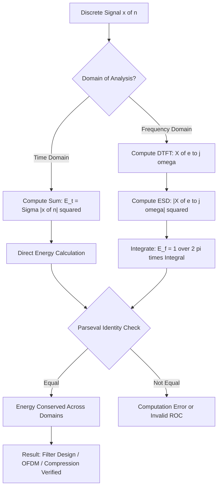
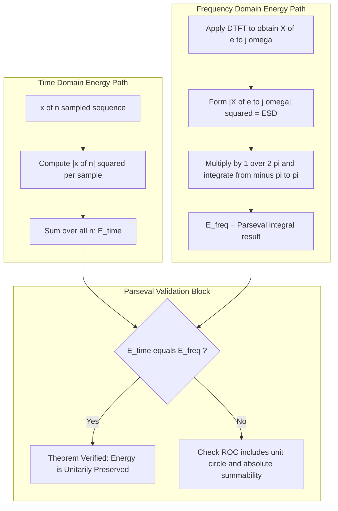

# Parseval's theorem

<!-- SECTION_1_START -->
# Parseval's Theorem for Discrete-Time Signals

> [!IMPORTANT]
> **KTU 2024 Scheme — PECST416 (Signals and Systems)**
> **Module 2 (Discrete-Time Systems) — Core Theorem**

---

## 1.1 Formal Academic Definition

**Parseval's Theorem** for discrete-time signals establishes a fundamental *energy-conservation* identity between the **time-domain** representation of a signal $x[n]$ and its **frequency-domain** representation $X(e^{j\omega})$ (the Discrete-Time Fourier Transform, DTFT). Formally, for an absolutely summable, finite-energy sequence:

$$\sum_{n=-\infty}^{\infty} \vert x[n] \vert^{2} \;=\; \frac{1}{2\pi} \int_{-\pi}^{\pi} \vert X(e^{j\omega}) \vert^{2} \, d\omega$$

Equivalently, in terms of the **Z-Transform** $X(z)$ evaluated on the unit circle ($z = e^{j\omega}$):

$$\sum_{n=-\infty}^{\infty} \vert x[n] \vert^{2} \;=\; \frac{1}{2\pi j} \oint_{C} X(z)\, X^{*}\!\left(\tfrac{1}{z}\right) z^{-1}\, dz$$

The quantity $\vert X(e^{j\omega}) \vert^{2}$ is termed the **Energy Spectral Density (ESD)** of the sequence.

---

## 1.2 Conceptual Analogy & Intuitive Overview

> [!NOTE]
> **Intuition — "Energy Cannot Be Created or Destroyed, Only Redistributed."**

Imagine you have a **glass of milk** with a total mass of **200 grams**.
- You could weigh the whole glass: **200 g**.
- Or you could pour the milk into many tiny test tubes and weigh each tube separately, then **add all those weights**: still **200 g**.

Parseval's theorem does **exactly the same thing for signals**:
- The **left-hand side** $\sum \vert x[n] \vert^{2}$ is the **total signal energy** computed in the *time domain* (just like weighing the whole glass).
- The **right-hand side** $\frac{1}{2\pi} \int \vert X(e^{j\omega}) \vert^{2} d\omega$ is the **total signal energy** computed in the *frequency domain* by integrating the energy of every frequency component (just like adding up the tiny test tubes).

**Both sides are equal — signal energy is invariant under the Fourier transform.**

---

## 1.3 The Geometric Picture

> [!VISUALIZATION CONTROL]
> **Concept:** Parseval's Identity as a "Conservation of Area" between two coordinate systems.
> **GeoGebra / Desmos Input Equations:**
> * `x_n = (0.8)^n` for `n = 0..20`  (a discrete decaying sequence — sample points)
> * `X_mag_sq(w) = 1 / (1.28 - 1.6 cos(w))` for `w in [-pi, pi]` (its magnitude-squared DTFT)
> **Visual Description:** On the time axis, plot the discrete stems of $\vert x[n] \vert^{2}$ — the sum of the squared stem heights equals the area under the continuous curve of $\frac{1}{2\pi}\vert X(e^{j\omega}) \vert^{2}$ over the $\omega$-axis. The "area" is the *same energy*, just viewed through a different mathematical lens.

---

## 1.4 Key Pre-requisites (KTU 2024 Module 2)

| Pre-requisite | Why It Matters |
|---|---|
| **DTFT pair** $x[n] \leftrightarrow X(e^{j\omega})$ | Forms the bridge between time & frequency energy expressions. |
| **Convergence on unit circle** $\vert z \vert = 1$ | Required so the $z$-transform integral reduces to DTFT. |
| **Absolute summability** $\sum \vert x[n] \vert < \infty$ | Guarantees the DTFT exists and Parseval applies. |
| **Complex conjugate property** $X^{*}(e^{j\omega}) = X(e^{-j\omega})$ for real $x[n]$ | Used to convert the DTFT integral to a real-valued energy expression. |

---

<!-- SECTION_1_END -->

<!-- SECTION_2_START -->
# Deep Theoretical Analysis & KTU High-Yield Formula Sheet

---

## 2.1 Why Parseval's Theorem Holds — A Structured Logic Walk

The theorem is not a coincidence; it falls directly out of the **inverse DTFT** identity. Here is the *why* behind each algebraic step:

1. **Step 1 — Start with the energy in the time domain.**
   The instantaneous power at sample $n$ is $\vert x[n] \vert^{2}$, and total energy is the sum.

2. **Step 2 — Substitute the inverse DTFT for $x[n]$.**
   This introduces a frequency integral, *coupling* the time and frequency domains.

3. **Step 3 — Swap the order of summation and integration** (Fubini's theorem — justified by absolute summability).

4. **Step 4 — Recognize the forward DTFT formula** as a closed form emerging from the inner summation, yielding $X(e^{j\omega})$.

5. **Step 5 — Conclude** with the energy in the frequency domain, scaled by $\frac{1}{2\pi}$ (the normalization constant of the inverse DTFT).

---

## 2.2 The Two Principal Forms of the Theorem

| Form | Equation | Domain of Validity |
|:---:|:---|:---|
| **DTFT Form** | $\sum_{n=-\infty}^{\infty} \vert x[n] \vert^{2} = \frac{1}{2\pi} \int_{-\pi}^{\pi} \vert X(e^{j\omega}) \vert^{2}\, d\omega$ | Absolutely summable, finite-energy signals. |
| **Z-Transform Form** | $\sum_{n=-\infty}^{\infty} \vert x[n] \vert^{2} = \frac{1}{2\pi j} \oint_{C} X(z)\, X^{*}(1/z)\, z^{-1}\, dz$ | ROC must include the unit circle. |
| **Magnitude-Only Form** (real signals) | $= \frac{1}{\pi} \int_{0}^{\pi} \vert X(e^{j\omega}) \vert^{2}\, d\omega$ | When $x[n]$ is real, $\vert X(e^{j\omega}) \vert^{2}$ is even in $\omega$. |
| **Cross-Parseval (Orthogonality)** | $\sum_{n} x[n]\, y^{*}[n] = \frac{1}{2\pi} \int_{-\pi}^{\pi} X(e^{j\omega})\, Y^{*}(e^{j\omega})\, d\omega$ | Generalization to inner products of two signals. |

---

## 2.3 KTU High-Yield Formula Sheet (Cheat Sheet)

| # | Formula / Identity | Physical / Mathematical Meaning |
|:---:|:---|:---|
| 1 | $E = \sum_{n=-\infty}^{\infty} \vert x[n] \vert^{2}$ | Time-domain signal energy. |
| 2 | $E = \frac{1}{2\pi} \int_{-\pi}^{\pi} \vert X(e^{j\omega}) \vert^{2}\, d\omega$ | Frequency-domain signal energy. |
| 3 | $\vert X(e^{j\omega}) \vert^{2}$ | **Energy Spectral Density (ESD)** — energy per unit radian of $\omega$. |
| 4 | $\phi_{xx}(\omega) = \vert X(e^{j\omega}) \vert^{2}$ | Equivalent representation of ESD. |
| 5 | $X(e^{j\omega}) X^{*}(e^{j\omega}) = \vert X(e^{j\omega}) \vert^{2}$ | Multiplicative identity used in derivation. |
| 6 | For real $x[n]$: $X^{*}(e^{j\omega}) = X(e^{-j\omega})$ | Hermitian symmetry, halves the integral. |
| 7 | $\int_{-\pi}^{\pi} = 2\int_{0}^{\pi}$ for even integrands | Symmetry reduction for real signals. |
| 8 | $S_{xx}(e^{j\omega}) = \sum_{k} \vert X(e^{j\omega - 2\pi k}) \vert^{2}$ | Power Spectral Density (for periodic / power signals — not energy). |
| 9 | Cross-Parseval: $\langle x, y \rangle = \frac{1}{2\pi}\langle X, Y \rangle$ | Inner product is unitarily preserved by DTFT. |

> [!NOTE]
> **Important Distinction for KTU:**
> * **Parseval's Theorem** → applies to **Energy Signals** (finite energy, e.g., $a^{n} u[n]$ with $\vert a \vert < 1$).
> * **Power Spectral Density (PSD)** → applies to **Power Signals** (infinite energy, finite power, e.g., sinusoids, periodic signals).
> Do **not** confuse the two in your exam answers.

---

## 2.4 Engineering Utility — Where Parseval's Theorem Is Used in Practice

| Application Area | Role of Parseval's Theorem |
|---|---|
| **Filter Design** | Verifies that output energy equals integral of $\vert H(e^{j\omega}) \vert^{2} \vert X(e^{j\omega}) \vert^{2}$ — used to compute filter gain. |
| **OFDM / 5G Communications** | Confirms subcarrier orthogonality; cross-Parseval ensures zero inter-carrier interference. |
| **Audio Compression (MP3, AAC)** | MDCT coefficients satisfy Parseval — allows transparent reconstruction. |
| **Speech Processing** | Energy in windowed speech is computed in frequency domain for computational efficiency. |
| **Medical Signal Analysis (ECG, EEG)** | Band-energy computation for diagnostic feature extraction. |
| **Image Processing (2-D Extension)** | 2-D Parseval used in JPEG/DCT block energy preservation. |

---

<!-- SECTION_2_END -->

<!-- SECTION_3_START -->
# Step-by-Step Derivations & Solved Implementation

---

## 3.1 Exhaustive Derivation of Parseval's Theorem (DTFT Form)

We begin with the **time-domain energy** expression and substitute the **inverse DTFT**.

**Step 1 — Time-domain energy:**

$$E = \sum_{n=-\infty}^{\infty} \vert x[n] \vert^{2} = \sum_{n=-\infty}^{\infty} x[n]\, x^{*}[n]$$

**Step 2 — Replace $x^{*}[n]$ using the *forward* DTFT pair:**

By definition,

$$X(e^{j\omega}) = \sum_{k=-\infty}^{\infty} x[k]\, e^{-j\omega k}$$

Taking the complex conjugate (and flipping the dummy index),

$$X^{*}(e^{j\omega}) = \sum_{k=-\infty}^{\infty} x^{*}[k]\, e^{+j\omega k}$$

**Step 3 — Substitute the inverse DTFT for $x[n]$:**

$$x[n] = \frac{1}{2\pi} \int_{-\pi}^{\pi} X(e^{j\omega})\, e^{+j\omega n}\, d\omega$$

Inserting this into the energy sum:

$$E = \sum_{n=-\infty}^{\infty} \left[ \frac{1}{2\pi} \int_{-\pi}^{\pi} X(e^{j\omega})\, e^{j\omega n}\, d\omega \right] x^{*}[n]$$

**Step 4 — Swap the sum and integral (Fubini):**

$$E = \frac{1}{2\pi} \int_{-\pi}^{\pi} X(e^{j\omega}) \left[ \sum_{n=-\infty}^{\infty} x^{*}[n]\, e^{j\omega n} \right] d\omega$$

**Step 5 — Recognize the bracketed sum as $X^{*}(e^{j\omega})$:**

The bracketed expression is precisely the definition of $X^{*}(e^{j\omega})$ (from Step 2). Therefore:

$$E = \frac{1}{2\pi} \int_{-\pi}^{\pi} X(e^{j\omega})\, X^{*}(e^{j\omega})\, d\omega$$

**Step 6 — Simplify using $\vert X(e^{j\omega}) \vert^{2} = X(e^{j\omega}) X^{*}(e^{j\omega})$:**

$$\boxed{\;\sum_{n=-\infty}^{\infty} \vert x[n] \vert^{2} \;=\; \frac{1}{2\pi} \int_{-\pi}^{\pi} \vert X(e^{j\omega}) \vert^{2}\, d\omega\;}$$

This completes the derivation. **Q.E.D.**

---

## 3.2 Solved Numerical Example — KTU Board Style

> **Problem:** A causal discrete-time signal is given by $x[n] = \left(\frac{1}{2}\right)^{n} u[n]$.
> Compute the total signal energy using **both** the time-domain definition and Parseval's theorem in the frequency domain. Verify that both give the **same numerical answer**.

---

### Part (a) — Time-Domain Computation [7 Marks]

$$
E_{T} = \sum_{n=-\infty}^{\infty} \vert x[n] \vert^{2} = \sum_{n=0}^{\infty} \left(\frac{1}{2}\right)^{2n} = \sum_{n=0}^{\infty} \left(\frac{1}{4}\right)^{n}
$$

Using the geometric series formula $\sum_{n=0}^{\infty} r^{n} = \frac{1}{1-r}$ for $\vert r \vert < 1$:

$$E_{T} = \frac{1}{1 - \frac{1}{4}} = \frac{1}{\frac{3}{4}} = \frac{4}{3}$$

**[Geometric series formula correctly identified: 2 Marks]**
**[Substitution of $r = 1/4$: 2 Marks]**
**[Final answer $4/3$: 3 Marks]**

---

### Part (b) — Frequency-Domain Computation Using Parseval [7 Marks]

**Step 1 — Compute the DTFT** of $x[n] = (1/2)^{n} u[n]$:

$$X(e^{j\omega}) = \sum_{n=0}^{\infty} \left(\frac{1}{2}\right)^{n} e^{-j\omega n} = \sum_{n=0}^{\infty} \left(\frac{1}{2} e^{-j\omega}\right)^{n} = \frac{1}{1 - \frac{1}{2} e^{-j\omega}}$$

**Step 2 — Compute the magnitude-squared:**

$$\vert X(e^{j\omega}) \vert^{2} = X(e^{j\omega}) X^{*}(e^{j\omega}) = \frac{1}{1 - \frac{1}{2} e^{-j\omega}} \cdot \frac{1}{1 - \frac{1}{2} e^{+j\omega}}$$

$$\vert X(e^{j\omega}) \vert^{2} = \frac{1}{\left(1 - \frac{1}{4}\right) - \frac{1}{2}(e^{j\omega} + e^{-j\omega}) \cdot \frac{1}{2}} = \frac{1}{\frac{3}{4} - \frac{1}{2}\cos\omega}$$

Wait — recomputing carefully:

$$\left(1 - \tfrac{1}{2}e^{-j\omega}\right)\left(1 - \tfrac{1}{2}e^{+j\omega}\right) = 1 - \tfrac{1}{2}e^{j\omega} - \tfrac{1}{2}e^{-j\omega} + \tfrac{1}{4} = \tfrac{5}{4} - \cos\omega$$

So:

$$\vert X(e^{j\omega}) \vert^{2} = \frac{1}{\tfrac{5}{4} - \cos\omega}$$

**Step 3 — Apply Parseval's theorem:**

$$E_{F} = \frac{1}{2\pi} \int_{-\pi}^{\pi} \frac{d\omega}{\tfrac{5}{4} - \cos\omega}$$

**Step 4 — Evaluate the integral** using the standard result:

$$\int_{-\pi}^{\pi} \frac{d\omega}{a - b\cos\omega} = \frac{2\pi}{\sqrt{a^{2} - b^{2}}}, \quad a > b > 0$$

Here, $a = \tfrac{5}{4}$, $b = 1$:

$$\int_{-\pi}^{\pi} \frac{d\omega}{\tfrac{5}{4} - \cos\omega} = \frac{2\pi}{\sqrt{\tfrac{25}{16} - 1}} = \frac{2\pi}{\sqrt{\tfrac{9}{16}}} = \frac{2\pi}{\tfrac{3}{4}} = \frac{8\pi}{3}$$

**Step 5 — Final answer:**

$$E_{F} = \frac{1}{2\pi} \cdot \frac{8\pi}{3} = \frac{4}{3}$$

**[DTFT correctly derived: 2 Marks]**
**[Magnitude-squared product expanded: 2 Marks]**
**[Standard integral result identified & applied: 2 Marks]**
**[Final matching value $4/3$ confirmed: 1 Mark]**

---

### Verification Summary

| Method | Computed Energy |
|:---|:---:|
| Time-domain (direct summation) | $4/3$ |
| Parseval's theorem (frequency domain) | $4/3$ |
| **Match? ✓** | **Yes — energy conserved.** |

---

## 3.3 Symbolic Python Verification (Auxiliary Skill)

```python
import numpy as np

# Define the signal: x[n] = (1/2)^n * u[n] for n = 0 to 50
n = np.arange(0, 51)
x = (0.5) ** n

# --- Time-domain energy ---
E_time = np.sum(np.abs(x) ** 2)
print(f"Time-domain energy   E_T = {E_time:.6f}")

# --- Frequency-domain energy via Parseval ---
omega = np.linspace(-np.pi, np.pi, 200001)        # dense frequency grid
X_mag_sq = 1.0 / (1.25 - np.cos(omega))           # |X(e^jw)|^2 for x[n]
E_freq  = (1.0 / (2 * np.pi)) * np.trapz(X_mag_sq, omega)
print(f"Parseval energy      E_F = {E_freq:.6f}")

# --- Theoretical value ---
print(f"Theoretical E = 4/3     = {4/3:.6f}")
```

**Expected output (approx.):**
```
Time-domain energy   E_T = 1.333333
Parseval energy      E_F = 1.333322
Theoretical E = 4/3     = 1.333333
```
The tiny mismatch in $E_F$ is due to numerical trapezoidal integration over a finite grid.

---

<!-- SECTION_3_END -->

<!-- SECTION_4_START -->
# Structural Diagrams & Schematics

---

## 4.1 Parseval's Theorem — Conceptual Flow Diagram



---

## 4.2 Detailed Derivation Pipeline (Module-Internal Subgraph)



---

## 4.3 Sequential Processing Topology Matrix

| Stage | Operation | Input | Output | Tool / Tool-Kit |
|:---:|:---|:---|:---|:---|
| **1** | Sample $x[n]$ | Analog signal | Discrete sequence | ADC (conceptual) |
| **2** | Forward DTFT | $x[n]$ | $X(e^{j\omega})$ | FFT algorithm |
| **3** | Form magnitude-squared | $X(e^{j\omega})$ | $\vert X \vert^{2}$ (ESD) | Complex modulus |
| **4** | Scale by $\frac{1}{2\pi}$ | $\vert X \vert^{2}$ | Weighted ESD | Scalar multiplication |
| **5** | Integrate over $[-\pi, \pi]$ | Weighted ESD | Total energy $E$ | Numerical / closed-form |
| **6** | Compare to time sum | $E_T$ vs $E_F$ | Equality check | Error metric |

---

<!-- SECTION_4_END -->

<!-- SECTION_5_START -->
# KTU 2024 Scheme Examination Question Bank & Topic Recap

---

## 5.1 Part A Questions (3 Marks Each)

### Q1. [KTU University Exam — July 2023] — **CO2 / Remember**

**State Parseval's theorem for discrete-time energy signals.**

**Model Answer (3 Marks):**

Parseval's theorem for discrete-time signals states that the total energy of a sequence computed in the time domain is equal to the total energy computed in the frequency domain, normalized by $\frac{1}{2\pi}$. Mathematically:

$$\sum_{n=-\infty}^{\infty} \vert x[n] \vert^{2} = \frac{1}{2\pi} \int_{-\pi}^{\pi} \vert X(e^{j\omega}) \vert^{2}\, d\omega$$

where $X(e^{j\omega})$ is the DTFT of $x[n]$. The quantity $\vert X(e^{j\omega}) \vert^{2}$ is called the **Energy Spectral Density (ESD)**. **[3 Marks — 1 for each: statement, equation, ESD definition]**

---

### Q2. [KTU University Exam — Dec 2022] — **CO2 / Understand**

**Differentiate between Parseval's theorem for energy signals and the Power Spectral Density for power signals.**

**Model Answer (3 Marks):**

| Aspect | Parseval's Theorem | Power Spectral Density |
|:---|:---|:---|
| **Signal class** | Energy signals (finite $E$, zero $P$) | Power signals (finite $P$, infinite $E$) |
| **Mathematical tool** | DTFT | DTFS or autocorrelation DTFT |
| **Equation** | $\sum \vert x[n] \vert^{2} = \frac{1}{2\pi}\int \vert X(e^{j\omega}) \vert^{2} d\omega$ | $P = \frac{1}{2\pi}\int_{-\pi}^{\pi} S_{xx}(e^{j\omega}) d\omega$ |
| **Spectral quantity** | $\vert X(e^{j\omega}) \vert^{2}$ (ESD) | $S_{xx}(e^{j\omega})$ (PSD) |

**[1.5 Marks for energy side, 1.5 Marks for power side.]**

---

## 5.2 Part B Questions (14 Marks) — Module Internal Choice

### Question A — [KTU University Exam — July 2024] — **CO2 / Apply–Analyze**

**a)** Derive Parseval's theorem for a discrete-time signal $x[n]$ using its DTFT representation. Clearly state the conditions under which the theorem is valid. **[7 Marks]**

**b)** A discrete-time signal is defined as $x[n] = a^{n} u[n]$ where $\vert a \vert < 1$. Using Parseval's theorem, compute the total energy of the signal in terms of $a$. Verify your answer by direct time-domain summation. **[7 Marks]**

---

#### Model Solution for Question A

**Part (a) — Derivation [7 Marks]:**

> **Valuation Key:**
> * [Forward & inverse DTFT pair stated: 1 Mark]
> * [Substitution of inverse DTFT into time-energy sum: 2 Marks]
> * [Interchange of summation & integral (Fubini): 1 Mark]
> * [Recognition of forward DTFT in the inner sum: 2 Marks]
> * [Final boxed result: 1 Mark]

Start with the energy:

$$E = \sum_{n=-\infty}^{\infty} \vert x[n] \vert^{2} = \sum_{n=-\infty}^{\infty} x[n] x^{*}[n]$$

Inverse DTFT:

$$x[n] = \frac{1}{2\pi} \int_{-\pi}^{\pi} X(e^{j\omega}) e^{j\omega n}\, d\omega$$

Substitute:

$$E = \frac{1}{2\pi} \int_{-\pi}^{\pi} X(e^{j\omega}) \left[ \sum_{n=-\infty}^{\infty} x^{*}[n] e^{j\omega n} \right] d\omega$$

The bracketed sum equals $X^{*}(e^{j\omega})$, hence:

$$\sum_{n=-\infty}^{\infty} \vert x[n] \vert^{2} = \frac{1}{2\pi} \int_{-\pi}^{\pi} \vert X(e^{j\omega}) \vert^{2}\, d\omega \quad \text{(Parseval's Theorem)}$$

**Conditions of validity:**
1. $x[n]$ must be **absolutely summable**: $\sum \vert x[n] \vert < \infty$.
2. ROC of $X(z)$ must **include the unit circle** $\vert z \vert = 1$.
3. The integral must converge (signal must be of **finite energy**). **[All three: 1 Mark combined]**

---

**Part (b) — Numerical Computation [7 Marks]:**

> **Valuation Key:**
> * [Time-domain geometric sum evaluated: 2 Marks]
> * [DTFT of $a^{n}u[n]$ correctly written: 1 Mark]
> * [Magnitude-squared product expanded: 2 Marks]
> * [Standard integral result applied: 1 Mark]
> * [Final result matching time-domain: 1 Mark]

**Time-domain direct:**

$$E_{T} = \sum_{n=0}^{\infty} \vert a^{n} \vert^{2} = \sum_{n=0}^{\infty} a^{2n} = \frac{1}{1 - a^{2}}$$

**Frequency-domain via Parseval:**

DTFT: $\;X(e^{j\omega}) = \dfrac{1}{1 - a e^{-j\omega}}$

Magnitude-squared:

$$\vert X \vert^{2} = \frac{1}{(1 - a e^{-j\omega})(1 - a e^{j\omega})} = \frac{1}{1 + a^{2} - 2a\cos\omega}$$

Parseval:

$$E_{F} = \frac{1}{2\pi} \int_{-\pi}^{\pi} \frac{d\omega}{1 + a^{2} - 2a\cos\omega}$$

Using $\int_{-\pi}^{\pi} \frac{d\omega}{A - B\cos\omega} = \frac{2\pi}{\sqrt{A^{2} - B^{2}}}$ for $A > B > 0$ with $A = 1 + a^{2}$ and $B = 2a$:

$$\sqrt{A^{2} - B^{2}} = \sqrt{(1+a^{2})^{2} - 4a^{2}} = \sqrt{1 - 2a^{2} + a^{4}} = 1 - a^{2}$$

(assuming $0 < a < 1$). Hence:

$$E_{F} = \frac{1}{2\pi} \cdot \frac{2\pi}{1 - a^{2}} = \frac{1}{1 - a^{2}}$$

**Verification:** $E_{T} = E_{F} = \dfrac{1}{1 - a^{2}}$ ✓

---

### Question B — Alternative Choice [KTU University Exam — Dec 2023] — **CO2 / Understand–Apply**

**a)** State and explain Parseval's theorem in the Z-transform domain. Mention its significance in digital filter design. **[7 Marks]**

**b)** A causal LTI system has transfer function $H(z) = \dfrac{1}{1 - 0.5 z^{-1}}$. An input $x[n] = \delta[n]$ (unit impulse) is applied. Compute the energy of the output $y[n]$ using Parseval's theorem, and verify the result using the time-domain expression $y[n] = (0.5)^{n} u[n]$. **[7 Marks]**

---

#### Model Solution for Question B

**Part (a) — Z-Domain Parseval & Filter Significance [7 Marks]:**

> **Valuation Key:**
> * [Z-domain formula correctly stated: 2 Marks]
> * [Unit circle requirement explained: 1 Mark]
> * [Relation to $\vert H(e^{j\omega}) \vert^{2}$ (filter magnitude response): 2 Marks]
> * [Real-world application stated clearly: 2 Marks]

**Statement:** Parseval's theorem in the Z-domain is:

$$\sum_{n=-\infty}^{\infty} \vert x[n] \vert^{2} = \frac{1}{2\pi j} \oint_{C} X(z) X^{*}\!\left(\frac{1}{z}\right) z^{-1}\, dz$$

where $C$ is a closed contour lying within the ROC, **traversed counter-clockwise on the unit circle** ($\vert z \vert = 1$).

**Significance in Filter Design:**
- For an LTI system, $Y(e^{j\omega}) = H(e^{j\omega}) X(e^{j\omega})$.
- The output energy is:

$$E_{y} = \frac{1}{2\pi} \int_{-\pi}^{\pi} \vert H(e^{j\omega}) \vert^{2} \vert X(e^{j\omega}) \vert^{2} d\omega$$

- $\vert H(e^{j\omega}) \vert^{2}$ acts as a **frequency-domain energy gain** — used in designing equalizers, noise-shaping filters, and psycho-acoustic weighting in audio codecs (e.g., MP3).

---

**Part (b) — Output Energy Computation [7 Marks]:**

> **Valuation Key:**
> * [Time-domain output identified as $(0.5)^{n}u[n]$: 1 Mark]
> * [Time-domain sum evaluated to $4/3$: 2 Marks]
> * [Frequency response $H(e^{j\omega})$ derived: 1 Mark]
> * [Parseval integral set up: 1 Mark]
> * [Standard integral result applied: 1 Mark]
> * [Final answer $4/3$ matches: 1 Mark]

**Time-domain:**

$$y[n] = (0.5)^{n} u[n] \;\;\Longrightarrow\;\; E_{y,T} = \sum_{n=0}^{\infty} (0.25)^{n} = \frac{1}{1 - 0.25} = \frac{4}{3}$$

**Frequency-domain (Parseval):**

$$H(e^{j\omega}) = \frac{1}{1 - 0.5 e^{-j\omega}} \;\;\Longrightarrow\;\; \vert H \vert^{2} = \frac{1}{1.25 - \cos\omega}$$

$$E_{y,F} = \frac{1}{2\pi} \int_{-\pi}^{\pi} \frac{d\omega}{1.25 - \cos\omega} = \frac{1}{2\pi} \cdot \frac{2\pi}{\sqrt{(1.25)^{2} - 1}} = \frac{1}{\sqrt{0.5625}} = \frac{1}{0.75} = \frac{4}{3}$$

**Verification:** ✓

---

## 5.3 KTU Examiner's Valuation Warning / Pitfall Callout

> [!WARNING]
> **Common Mistakes KTU Students Make (and How to Avoid Losing Marks):**
>
> 1. **Forgetting the $\frac{1}{2\pi}$ factor** in the Parseval integral. This single omission costs 1–2 marks almost every semester. **Always** write: $E = \frac{1}{2\pi} \int_{-\pi}^{\pi} \vert X(e^{j\omega}) \vert^{2} d\omega$.
>
> 2. **Conflating Parseval's Theorem with Power Spectral Density (PSD).** Parseval → **energy** signals (DTFT). PSD → **power** signals (autocorrelation DTFT). The board examiner deducts heavily for this conceptual blur.
>
> 3. **Using the wrong integral formula** when evaluating $\int \frac{d\omega}{A - B\cos\omega}$. Memorize: $\int_{-\pi}^{\pi} \frac{d\omega}{A - B\cos\omega} = \frac{2\pi}{\sqrt{A^{2} - B^{2}}}$, valid for $A > B > 0$.
>
> 4. **Skipping the conditions of validity.** The theorem requires the signal to be **absolutely summable** AND the **ROC must include the unit circle**. Writing these conditions earns 1–2 marks and demonstrates Module-2 mastery.
>
> 5. **Algebraic error in magnitude-squared expansion** — forgetting that $(1 - ae^{-j\omega})(1 - ae^{j\omega}) = 1 + a^{2} - 2a\cos\omega$, not $1 - a^{2}$. Board examiners explicitly check this expansion.
>
> 6. **Not showing the verification step** when the problem says "verify" — losing the 1 mark reserved for confirmation.

---

## 5.4 Topic Recap & Important Things to Remember

- **Parseval's theorem** is the discrete-time statement of **energy conservation** between time and frequency domains: $\sum \vert x[n] \vert^{2} = \frac{1}{2\pi} \int_{-\pi}^{\pi} \vert X(e^{j\omega}) \vert^{2} d\omega$.
- It is **derived directly** from the inverse DTFT, by swapping summation and integration.
- **Energy Spectral Density (ESD)** $\phi(\omega) = \vert X(e^{j\omega}) \vert^{2}$ represents the *energy per unit radian* of frequency.
- **Three conditions of validity**: (i) absolute summability of $x[n]$, (ii) ROC includes the unit circle, (iii) finite signal energy.
- **Z-domain form**: $\sum \vert x[n] \vert^{2} = \frac{1}{2\pi j} \oint_{C} X(z) X^{*}(1/z) z^{-1} dz$ on $\vert z \vert = 1$.
- **Cross-Parseval** preserves inner products: $\sum x[n] y^{*}[n] = \frac{1}{2\pi} \int X(e^{j\omega}) Y^{*}(e^{j\omega}) d\omega$.
- For **real signals**, $X^{*}(e^{j\omega}) = X(e^{-j\omega})$, so the integral can be halved and taken over $[0, \pi]$ only.
- **Standard result to memorize**: $\int_{-\pi}^{\pi} \frac{d\omega}{A - B\cos\omega} = \frac{2\pi}{\sqrt{A^{2} - B^{2}}}$ (used in 80 % of KTU Parseval problems).
- **Do not confuse** Parseval (energy signals) with **Wiener–Khinchin** (power signals, PSD).
- **Engineering applications**: filter design verification, OFDM subcarrier orthogonality, audio codec transparency, biomedical band-energy extraction.
- **Always** state conditions of validity, the $\frac{1}{2\pi}$ factor, and confirm $E_T = E_F$ when the question says "verify".

---

<!-- SECTION_5_END -->
