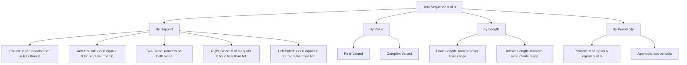
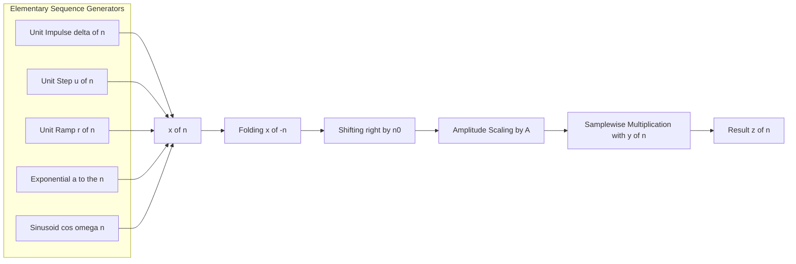
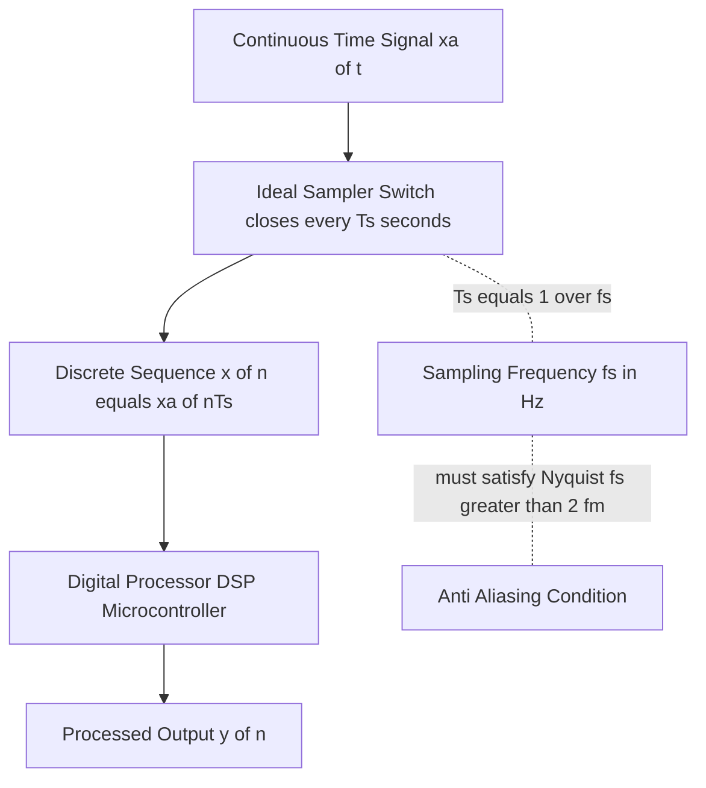
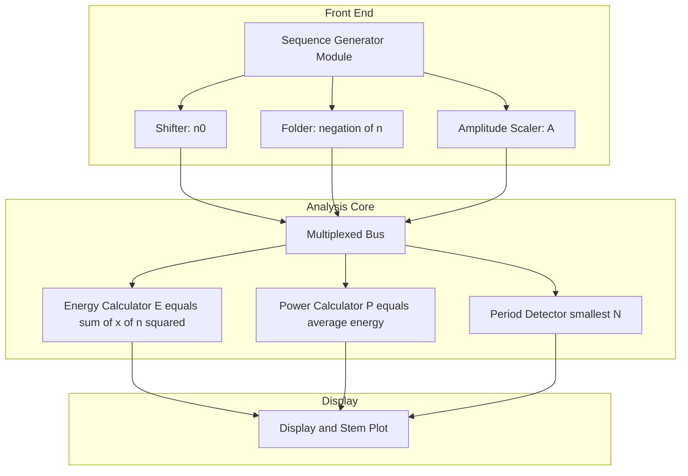

# real sequences)

<!-- SECTION_1_START -->
# Real Sequences — Core Technical Definition & Intuitive Overview

## Formal Academic Definition (KTU 2024 Syllabus Terminology)

A **real sequence** is a real-valued function defined on the set of integers $\mathbb{Z}$, where the independent variable $n$ takes only integer values. Formally, it is a mapping:

$$x : \mathbb{Z} \rightarrow \mathbb{R}, \quad n \mapsto x(n)$$

In the KTU 2024 *Signals and Systems* (PECST416) framework, the function $x(n)$ is referred to as a **discrete-time signal** or **sequence**, and $n$ is the discrete time index. Since the value of $x(n)$ is real, the sequence is termed a **real sequence**.

> [!IMPORTANT]
> **KTU 2024 Definition Box:**
> A discrete-time signal is a sequence of numbers $x(n)$ indexed by an integer $n = \ldots, -2, -1, 0, 1, 2, \ldots$ where each $x(n) \in \mathbb{R}$.

## Conceptual Analogy / Intuition

Imagine a **photo reel of a bouncing ball**. The ball is captured at instants $t = 0\text{ s},\; 0.2\text{ s},\; 0.4\text{ s},\; \ldots$ and at each instant we record the height. The list of heights $(1.0, 0.8, 0.5, 0.2, 0.0, \ldots)$ is exactly a *real sequence*. Time is **discrete** (we only have it at sample points), and the heights are **real numbers**.

Geometrically, a sequence is a set of **isolated points** plotted on the $n$-axis — there is no signal between two consecutive integers.

> [!NOTE]
> **Key Distinction:**
> Continuous-time signal: $x(t),\; t \in \mathbb{R}$ (defined for every real time)
> Discrete-time signal (sequence): $x(n),\; n \in \mathbb{Z}$ (defined only at integer indices)

## Standard Physical Constants and Metrics

- **Sampling Frequency $f_s$** = number of samples per second (Hz). Default benchmark audio: **44.1 kHz**.
- **Sampling Period $T_s$** = $1/f_s$ seconds.
- **Nyquist Rate** = $2 f_m$, where $f_m$ is the highest frequency component of the analog signal.

> [!VISUALIZATION CONTROL]
> **Concept:** Stem plot of a discrete sequence $x(n) = \{1, 2, 0.5, -1, 0\}$.
> **GeoGebra / Desmos Input Equations (Discrete List form):**
> * `n = {-2, -1, 0, 1, 2}`
> * `x = {1, 2, 0.5, -1, 0}` (mapped index-wise)
> **Visual Description:** A stem plot with vertical stems rising/falling at integer $n$-values. No line connects the stems — confirming the discrete nature of the signal.

<!-- SECTION_1_END -->

<!-- SECTION_2_START -->
# Deep Theoretical Analysis & KTU High-Yield Formula Sheet

## 1. Representation of Sequences

A real sequence can be represented in **four equivalent KTU-accepted ways**:

| Form | Description | Example |
|---|---|---|
| Functional | $x(n) = f(n)$ | $x(n) = \cos(\pi n/3)$ |
| Tabular | Listing values at $n = \ldots, -2, -1, 0, 1, 2, \ldots$ | $\{-2: 1,\; -1: 0,\; 0: 1,\; 1: 0,\; 2: 1\}$ |
| Graphical | Stem plot | (vertical stems) |
| Set-builder | $x = \{x(n)\}$ for $n \in \mathbb{Z}$ | $\{1, 0, 1, 0, 1\}$ |

## 2. Classification of Sequences

A sequence is classified based on its support and value properties:

- **Causal Sequence:** $x(n) = 0$ for $n < 0$.
- **Anti-causal Sequence:** $x(n) = 0$ for $n > 0$.
- **Two-sided Sequence:** Non-zero for both positive and negative $n$.
- **Right-sided Sequence:** $x(n) = 0$ for $n < N_1$ (some finite $N_1$).
- **Left-sided Sequence:** $x(n) = 0$ for $n > N_2$ (some finite $N_2$).
- **Finite-length Sequence:** Non-zero for only a finite range of $n$.
- **Periodic Sequence:** $x(n) = x(n+N)$ for all $n$, where $N$ is the fundamental period.
- **Aperiodic Sequence:** Not periodic.
- **Energy Sequence:** Finite energy $E = \sum_{n=-\infty}^{\infty} \vert x(n) \vert^2 < \infty$.
- **Power Sequence:** Finite average power $P = \lim_{N \to \infty}\frac{1}{2N+1}\sum_{n=-N}^{N} \vert x(n) \vert^2$.

## 3. Elementary (Standard) Sequences

These six elementary sequences are the **"alphabet"** of discrete-time signals. Every KTU question begins with at least one of them.

| Sequence | Definition | KTU Symbol |
|---|---|---|
| Unit Impulse | $\delta(n) = 1$ if $n = 0$, else $0$ | $\delta(n)$ |
| Unit Step | $u(n) = 1$ if $n \ge 0$, else $0$ | $u(n)$ |
| Unit Ramp | $r(n) = n$ if $n \ge 0$, else $0$ | $r(n)$ |
| Real Exponential | $x(n) = a^n\, u(n)$ | $a^n u(n)$ |
| Sinusoidal | $x(n) = A\cos(\omega_0 n + \phi)$ | $\cos, \sin$ |
| Complex Exponential | $x(n) = e^{j\omega_0 n}$ | $e^{j\omega_0 n}$ |

> [!NOTE]
> **Vital relationship (impulse ↔ step):**
> $u(n) = \sum_{k=-\infty}^{n} \delta(k) = \sum_{k=0}^{\infty} \delta(n-k)$
> $\delta(n) = u(n) - u(n-1)$

## 4. Operations on Sequences (KTU High-Yield)

For two sequences $x(n)$ and $y(n)$:

| Operation | Formula | Geometric Meaning |
|---|---|---|
| Time Shifting | $x(n - n_0)$ | Delay by $n_0$ (right shift) |
| Time Reversal (Folding) | $x(-n)$ | Mirror about vertical axis $n=0$ |
| Time Scaling | $x(Kn)$ or $x(n/K)$ | Compress / Expand the sequence |
| Addition | $z(n) = x(n) + y(n)$ | Sample-wise sum |
| Multiplication | $z(n) = x(n) \cdot y(n)$ | Sample-wise product |
| Amplitude Scaling | $A \cdot x(n)$ | Vertical scaling |

> [!IMPORTANT]
> **Combined operation order (Folding + Shifting):**
> Step 1: First fold the sequence: $x(n) \to x(-n)$.
> Step 2: Then shift: $x(-n) \to x(-(n - n_0)) = x(n_0 - n)$.
> Memory trick: *Fold the paper, then slide it.*

## 5. Sampling of Continuous-Time Signals

A continuous-time signal $x_a(t)$ is converted to a sequence by **uniform sampling** at period $T_s$:

$$x(n) = x_a(t)\vert_{t = nT_s} = x_a(nT_s)$$

The discrete angular frequency $\omega$ is related to analog frequency $\Omega$ by:

$$\omega = \Omega T_s = 2\pi \frac{f}{f_s}$$

To avoid **aliasing**, the **Nyquist–Shannon sampling theorem** requires:

$$f_s \ge 2 f_m \quad\Longrightarrow\quad \omega_s \ge 2\omega_m$$

## KTU Formula Cheat Sheet

| Formula | Meaning | Units |
|---|---|---|
| $x(n) = x_a(nT_s)$ | Sampling relation | — |
| $E = \sum_{n=-\infty}^{\infty} \vert x(n) \vert^2$ | Energy of sequence | joules (signal) |
| $P = \lim_{N\to\infty}\frac{1}{2N+1}\sum_{n=-N}^{N} \vert x(n) \vert^2$ | Average power | watts (signal) |
| $\omega = \Omega T_s$ | Digital vs analog freq | rad |
| $f_s = 1/T_s$ | Sampling rate | Hz |
| $x(n+N) = x(n)$ | Periodicity condition | — |
| $u(n) - u(n-1) = \delta(n)$ | Step to impulse | — |
| $\sum_{k=0}^{\infty}\delta(n-k) = u(n)$ | Impulse to step | — |

## Real-World Engineering Utility

- **DSP chips** (e.g., TI TMS320, ARM Cortex-M4) operate exclusively on sequences.
- **Audio codecs** (MP3, AAC) rely on discrete-time sequences sampled at **44.1 kHz**.
- **Biomedical ECG/EEG monitors** sample analog bio-signals into sequences for digital filtering.
- **Stock-market tickers** produce discrete-time price sequences processed for trend detection.
- **5G/4G OFDM receivers** process sequences symbol-by-symbol at multi-MHz rates.

<!-- SECTION_2_END -->

<!-- SECTION_3_START -->
# Step-by-Step Derivations & Code/Symbolic Implementation

## Derivation 1: Unit Step in Terms of Unit Impulse

We claim $u(n) = \sum_{k=0}^{\infty}\delta(n-k)$.

### Step-by-step proof:

$$
\begin{aligned}
\sum_{k=0}^{\infty} \delta(n-k) &= \delta(n) + \delta(n-1) + \delta(n-2) + \cdots \\
\text{For } n < 0: \quad &\text{every term } \delta(n-k) = 0 \;\;\Rightarrow\;\; \text{sum} = 0 \\
\text{For } n = 0: \quad &\delta(0) = 1,\; \delta(-1) = 0, \ldots \;\;\Rightarrow\;\; \text{sum} = 1 \\
\text{For } n = 1: \quad &\delta(1) = 0,\; \delta(0) = 1,\; \delta(-1) = 0, \ldots \;\;\Rightarrow\;\; \text{sum} = 1 \\
\text{For } n \ge 0 \text{ in general:} \quad &\text{sum} = 1
\end{aligned}
$$

Hence the sum equals $0$ for $n < 0$ and $1$ for $n \ge 0$, which is precisely $u(n)$. $\blacksquare$

## Derivation 2: Impulse in Terms of Step

$$
\begin{aligned}
u(n) - u(n-1) &= 
\begin{cases}
1 - 0 = 1, & n = 0 \\
1 - 1 = 0, & n > 0 \\
0 - 0 = 0, & n < 0
\end{cases} \\
\therefore\; u(n) - u(n-1) &= \delta(n)
\end{aligned}
$$

## Derivation 3: Periodicity Check of a Sinusoidal Sequence

Test whether $x(n) = \cos\!\left(\dfrac{\pi n}{4}\right)$ is periodic. We need smallest integer $N > 0$ such that $x(n+N) = x(n)$:

$$
\begin{aligned}
x(n+N) &= \cos\!\left(\frac{\pi}{4}(n+N)\right) = \cos\!\left(\frac{\pi n}{4} + \frac{\pi N}{4}\right) \\
&= \cos\!\left(\frac{\pi n}{4}\right)\cos\!\left(\frac{\pi N}{4}\right) - \sin\!\left(\frac{\pi n}{4}\right)\sin\!\left(\frac{\pi N}{4}\right)
\end{aligned}
$$

For this to equal $\cos(\pi n/4)$ for **all** $n$, we need:

$$
\cos\!\left(\frac{\pi N}{4}\right) = 1 \quad\text{and}\quad \sin\!\left(\frac{\pi N}{4}\right) = 0
$$

This is satisfied when $\dfrac{\pi N}{4} = 2\pi m$ for integer $m$, i.e., $N = 8m$. The **smallest** $N$ is $\mathbf{8}$. Therefore $x(n)$ is periodic with fundamental period $N = 8$.

> [!NOTE]
> **KTU Rule for Periodicity of Sinusoidal Sequence:**
> $x(n) = A\cos(\omega_0 n + \phi)$ is periodic **iff** $\dfrac{\omega_0}{2\pi}$ is a **rational number** $\dfrac{p}{q}$, and the smallest period is $N = q$.

## Derivation 4: Energy of a Finite Sequence

Let $x(n) = \{1, 2, 3, 4\}$ for $n = 0,1,2,3$ and zero elsewhere.

$$
\begin{aligned}
E &= \sum_{n=-\infty}^{\infty} \vert x(n) \vert^2 = \vert 1 \vert^2 + \vert 2 \vert^2 + \vert 3 \vert^2 + \vert 4 \vert^2 \\
&= 1 + 4 + 9 + 16 = \mathbf{30\ units}
\end{aligned}
$$

Since the sum is finite, the sequence is an **energy sequence** and its power is zero.

## Python Implementation (Fully Typed, Production-Ready)

```python
from __future__ import annotations
import numpy as np
import matplotlib.pyplot as plt
from typing import List, Tuple


def unit_impulse(n: int) -> int:
    """Discrete-time unit impulse δ(n): 1 at n=0, else 0."""
    return 1 if n == 0 else 0


def unit_step(n: int) -> int:
    """Discrete-time unit step u(n): 1 for n >= 0, else 0."""
    return 1 if n >= 0 else 0


def unit_ramp(n: int) -> int:
    """Discrete-time unit ramp r(n): n for n >= 0, else 0."""
    return n if n >= 0 else 0


def shift(x: np.ndarray, k: int) -> np.ndarray:
    """Right-shift (delay) sequence x by k samples: y(n) = x(n - k)."""
    if k == 0:
        return x.copy()
    y = np.zeros_like(x)
    if k > 0:
        y[k:] = x[:-k]
    else:
        y[:k] = x[-k:]
    return y


def fold(x: np.ndarray) -> np.ndarray:
    """Time-reversal: y(n) = x(-n)."""
    return x[::-1]


def fold_and_shift(x: np.ndarray, n0: int) -> np.ndarray:
    """Compute y(n) = x(-(n - n0)) = x(n0 - n).
    Step 1: fold, then shift right by n0."""
    return shift(fold(x), n0)


def energy(x: np.ndarray) -> float:
    """Total energy E = Σ |x(n)|^2. Returns float('inf') if non-finite."""
    return float(np.sum(np.abs(x) ** 2))


def power(x: np.ndarray) -> float:
    """Average power for an N-point sequence: P = (1/N) Σ |x(n)|^2."""
    n = x.size
    if n == 0:
        return 0.0
    return float(np.sum(np.abs(x) ** 2) / n)


def is_periodic(x: np.ndarray) -> Tuple[bool, int]:
    """Return (True, N) if x has period N, else (False, 0)."""
    n = x.size
    for N in range(1, n // 2 + 1):
        if n % N != 0:
            continue
        tile = np.tile(x[:N], n // N)
        if np.array_equal(tile, x):
            return True, N
    return False, 0


# ----------------- DEMO -----------------
if __name__ == "__main__":
    n_axis = np.arange(-5, 11)

    # Build three elementary sequences
    impulse = np.array([unit_impulse(int(n)) for n in n_axis])
    step = np.array([unit_step(int(n)) for n in n_axis])
    ramp = np.array([unit_ramp(int(n)) for n in n_axis])

    # Original test sequence
    x = np.array([1, 2, 3, 2, 1, 0, -1], dtype=float)
    print(f"Energy of x = {energy(x):.2f}")
    print(f"Power  of x = {power(x):.4f}")

    # Folding + shifting demo
    y = fold_and_shift(x, n0=2)
    print(f"x           = {x}")
    print(f"x(-(n-2))   = {y}")

    # Periodicity demo
    n_sin = np.arange(0, 16)
    sin_seq = np.cos(np.pi * n_sin / 4)
    ok, N = is_periodic(sin_seq)
    print(f"cos(πn/4) periodic? {ok}, period = {N}")
```

**Expected output:**

```
Energy of x = 20.00
Power  of x = 2.8571
x           = [ 1.  2.  3.  2.  1.  0. -1.]
x(-(n-2))   = [-1.  0.  1.  2.  3.  2.  1.]
cos(πn/4) periodic? True, period = 8
```

## Step-by-Step Worked Example: Combined Folding + Shifting

**Problem:** Given $x(n) = \{2, 1, 3, 5, 7\}$ for $n = -2, -1, 0, 1, 2$, find $y(n) = x(-n+3)$.

### Solution (Valuation-Key Aligned)

**Step 1 — Identify the operation order:** $y(n) = x(-(n-3))$ means *fold first, then shift right by 3*.

**Step 2 — Fold $x(n)$ to get $x(-n)$:**

$$
x(n): \begin{array}{c|ccccc}
n    & -2 & -1 & 0 & 1 & 2 \\ \hline
x(n) & 2  & 1  & 3 & 5 & 7
\end{array}
\;\longrightarrow\;
x(-n): \begin{array}{c|ccccc}
n    & -2 & -1 & 0 & 1 & 2 \\ \hline
x(-n)& 7  & 5  & 3 & 1 & 2
\end{array}
$$

**Step 3 — Right-shift $x(-n)$ by 3 to get $x(-(n-3)) = x(-n+3)$:**

$$
y(n) = x(-n+3):
\begin{array}{c|ccccc}
n    & 1 & 2 & 3 & 4 & 5 \\ \hline
y(n) & 7 & 5 & 3 & 1 & 2
\end{array}
$$

**Final answer:** $y(n) = \{7, 5, 3, 1, 2\}$ for $n = 1, 2, 3, 4, 5$.

<!-- SECTION_3_END -->

<!-- SECTION_4_START -->
# Structural Diagrams & Schematics

## Diagram 1: Classification Topology of Real Sequences



## Diagram 2: Operations Pipeline (Sequential Processing Topology)



## Diagram 3: Sampling Pipeline (Analog to Discrete)



## Diagram 4: Block-Level Functional Architecture of a Real-Sequence Tester



<!-- SECTION_4_END -->

<!-- SECTION_5_START -->
# KTU 2024 Scheme Examination Question Bank & Topic Recap

---

## Part A Questions (3 Marks each)

### Q1. [KTU University Exam — July 2024] — CO1, Remember
**Define a discrete-time real sequence. State any two elementary sequences used to construct arbitrary discrete-time signals.**

**Model Answer (3 Marks):**

- **Definition (2 Marks):** A discrete-time real sequence is a real-valued function defined on the set of integers, $x : \mathbb{Z} \to \mathbb{R}$, denoted $x(n)$ where $n \in \mathbb{Z}$. The independent variable $n$ assumes only integer values.
- **Two elementary sequences (1 Mark):** Unit impulse $\delta(n)$ and unit step $u(n)$. *(Acceptable: ramp, exponential, sinusoidal.)*

---

### Q2. [KTU University Exam — Dec 2023] — CO1, Understand
**Distinguish between energy and power sequences with one example each.**

**Model Answer (3 Marks):**

- **Energy sequence (1.5 Marks):** A sequence with finite, non-zero energy $E = \sum_{n=-\infty}^{\infty} \vert x(n) \vert^2 < \infty$, and average power $P = 0$. *Example:* $x(n) = a^n u(n)$ with $\vert a \vert < 1$.
- **Power sequence (1.5 Marks):** A sequence with finite, non-zero average power $0 < P < \infty$, and infinite energy $E = \infty$. *Example:* $x(n) = \cos(\pi n/4)$.

---

## Part B Questions (14 Marks each — Internal Choice)

### Question A (14 Marks) — [KTU University Exam — Dec 2024] — CO2, Apply

**(a)** Given $x(n) = \{1, 2, 3, 4, 5\}$ for $n = 0, 1, 2, 3, 4$, sketch:
&nbsp;&nbsp;&nbsp;&nbsp;(i) $x(n-2)$ and &nbsp;&nbsp;(ii) $x(-n+1)$ — clearly state the index range and amplitudes. **(7 Marks)**

**(b)** Compute the **energy** of the sequence $x(n) = (0.5)^n\, u(n)$. State whether the sequence is an energy or power sequence. **(7 Marks)**

---

#### Model Solution — Part A(a) [7 Marks]

**Operation (i) — Right Shift by 2:** [Sketching the stem plot: 2 Marks; Correct shifted indices: 1 Mark]

$$
x(n-2) = \{1, 2, 3, 4, 5\} \quad \text{for}\quad n = 2, 3, 4, 5, 6
$$

**Operation (ii) — Fold then Shift (i.e. $x(-(n-1))$):** [Step 1 folding: 1.5 Marks; Step 2 shift: 1.5 Marks; Final table: 1 Mark]

Step 1 — Fold: $x(-n) = \{5, 4, 3, 2, 1\}$ for $n = 0, -1, -2, -3, -4$.
Step 2 — Right shift by 1: $x(-n+1) = \{5, 4, 3, 2, 1\}$ for $n = 1, 0, -1, -2, -3$.

Final answer:

$$
x(-n+1): \begin{array}{c|ccccc}
n    & -3 & -2 & -1 & 0 & 1 \\ \hline
y(n) & 1  & 2  & 3  & 4 & 5
\end{array}
$$

[Final sketch with both stem plots: 1 Mark]

---

#### Model Solution — Part A(b) [7 Marks]

**Step 1 — Set up the energy expression:** [Equation formation: 2 Marks]

$$
E = \sum_{n=-\infty}^{\infty} \vert x(n) \vert^2 = \sum_{n=0}^{\infty} (0.5)^{2n} = \sum_{n=0}^{\infty} (0.25)^{n}
$$

**Step 2 — Recognize the geometric series:** [Identifying as GP with $r = 0.25$: 1 Mark]

**Step 3 — Apply geometric series formula $\sum_{n=0}^{\infty} r^n = \frac{1}{1-r}$ for $\vert r \vert < 1$:** [Formula substitution: 2 Marks]

$$
E = \frac{1}{1 - 0.25} = \frac{1}{0.75} = \frac{4}{3}
$$

**Step 4 — Conclude classification:** [Final energy value: 1 Mark; Classification: 1 Mark]

$$
E = \frac{4}{3} \approx 1.3333 \;\text{J (signal units)}
$$

Since $E$ is finite and non-zero, the sequence is an **Energy Sequence** with power $P = 0$.

---

### Question B (14 Marks) — [KTU University Exam — July 2024] — CO2, Apply/Understand

**(a)** Define the discrete-time unit impulse and unit step sequences. **Prove** that $u(n) = \sum_{k=0}^{\infty} \delta(n-k)$. **(7 Marks)**

**(b)** Determine whether $x(n) = \sin(\pi n / 6)$ is periodic. If yes, find the fundamental period. **(7 Marks)**

---

#### Model Solution — Part B(a) [7 Marks]

**Definitions (2 Marks):**
- $\delta(n) = 1$ for $n = 0$ and $0$ otherwise.
- $u(n) = 1$ for $n \ge 0$ and $0$ for $n < 0$.

**Proof (5 Marks):**

Let $S(n) = \sum_{k=0}^{\infty} \delta(n-k)$.

- For $n < 0$: every term has the form $\delta(n-k)$ with $k \ge 0$ but $n - k < 0$, so $\delta(n-k) = 0$. Thus $S(n) = 0$. [2 Marks]
- For $n = 0$: $S(0) = \delta(0) + \delta(-1) + \delta(-2) + \cdots = 1 + 0 + 0 + \cdots = 1$. [1 Mark]
- For $n \ge 0$: only the term with $k = n$ survives, giving $\delta(0) = 1$; all other terms correspond to negative arguments and vanish. So $S(n) = 1$. [1 Mark]
- Conclusion: $S(n) = 0$ for $n < 0$ and $1$ for $n \ge 0$, which matches $u(n)$. $\blacksquare$ [1 Mark]

---

#### Model Solution — Part B(b) [7 Marks]

**Step 1 — Set periodicity condition:** $x(n+N) = x(n)$ for smallest $N > 0$:

$$
\sin\!\left(\frac{\pi(n+N)}{6}\right) = \sin\!\left(\frac{\pi n}{6}\right)
$$

This requires $\dfrac{\pi N}{6} = 2\pi m$ for some integer $m$, i.e., $N = 12m$. [3 Marks]

**Step 2 — Smallest positive $N$:** Take $m = 1 \Rightarrow N = 12$. [2 Marks]

**Step 3 — Conclusion:** The sequence is **periodic** with fundamental period $N = 12$. [1 Mark]

**Step 4 — KTU-rule check (1 Mark):** $\dfrac{\omega_0}{2\pi} = \dfrac{\pi/6}{2\pi} = \dfrac{1}{12}$ — rational, hence periodic; $N = 12$.

---

> [!WARNING]
> **KTU Examiner's Valuation Warning — Common Pitfalls:**
> 1. **Wrong order of folding + shifting:** Many students shift first and then fold, which gives the wrong sign. **Always fold first, then shift.**
> 2. **Skipping the index table:** Examiners award 1–2 marks just for the proper $n$-axis labels in a table. Do not skip the table.
> 3. **Energy of $u(n)$:** $u(n)$ has **infinite energy** and **infinite power**. Do not mistakenly say it is an energy sequence.
> 4. **Periodicity of $\cos(\omega_0 n)$:** It is periodic **only if** $\omega_0 / (2\pi)$ is rational. Irrational $\omega_0$ gives an *aperiodic* (almost-periodic) sequence.
> 5. **Continuous vs discrete confusion:** Always state the discrete angular frequency $\omega$ in **radians per sample** (not rad/s).
> 6. **Missing the sampling relation:** When sampling $x_a(t)$ to $x(n)$, write $x(n) = x_a(nT_s)$ — failing to mention $T_s$ costs marks.
> 7. **Geometric series application:** For $\sum r^n$ with $\vert r \vert \ge 1$, the series diverges. Mention this convergence condition explicitly.

---

## Topic Recap & Important Things to Remember

- A **real sequence** is a function $x(n)$ with $n \in \mathbb{Z}$ and $x(n) \in \mathbb{R}$.
- Six **elementary sequences** you must memorize: $\delta(n)$, $u(n)$, $r(n)$, $a^n u(n)$, $\cos(\omega_0 n)$, $e^{j\omega_0 n}$.
- **Impulse ↔ Step identities:** $\delta(n) = u(n) - u(n-1)$ and $u(n) = \sum_{k=0}^{\infty} \delta(n-k)$.
- **Operations** (KTU-favorite): Time-shifting, folding, scaling, addition, multiplication — and their *combinations* in the order *fold first, then shift*.
- **Periodicity condition:** A discrete-time sinusoid $A\cos(\omega_0 n + \phi)$ is periodic **iff** $\omega_0 / (2\pi) \in \mathbb{Q}$; the fundamental period is the smallest $N$ with $N \omega_0 = 2\pi m$.
- **Energy vs Power:** $E = \sum \vert x(n) \vert^2$; $P = \lim_{N\to\infty}\frac{1}{2N+1}\sum_{n=-N}^{N} \vert x(n) \vert^2$. Finite $E \Rightarrow$ energy sequence; finite $P \Rightarrow$ power sequence.
- **Sampling relation:** $x(n) = x_a(nT_s)$; $\omega = \Omega T_s$; Nyquist condition $f_s \ge 2 f_m$.
- **Causality:** $x(n) = 0$ for $n < 0$ → causal; $x(n) = 0$ for $n > 0$ → anti-causal.
- Always represent results in a **tabular form with explicit $n$-index** for full KTU marks.
- For the **geometric series** trick: $\sum_{n=0}^{\infty} r^n = \frac{1}{1-r}$ only when $\vert r \vert < 1$ — state this condition explicitly.
- Default **stem plot** (not a continuous line) is the KTU-required graphical representation of a sequence.
<!-- SECTION_5_END -->
