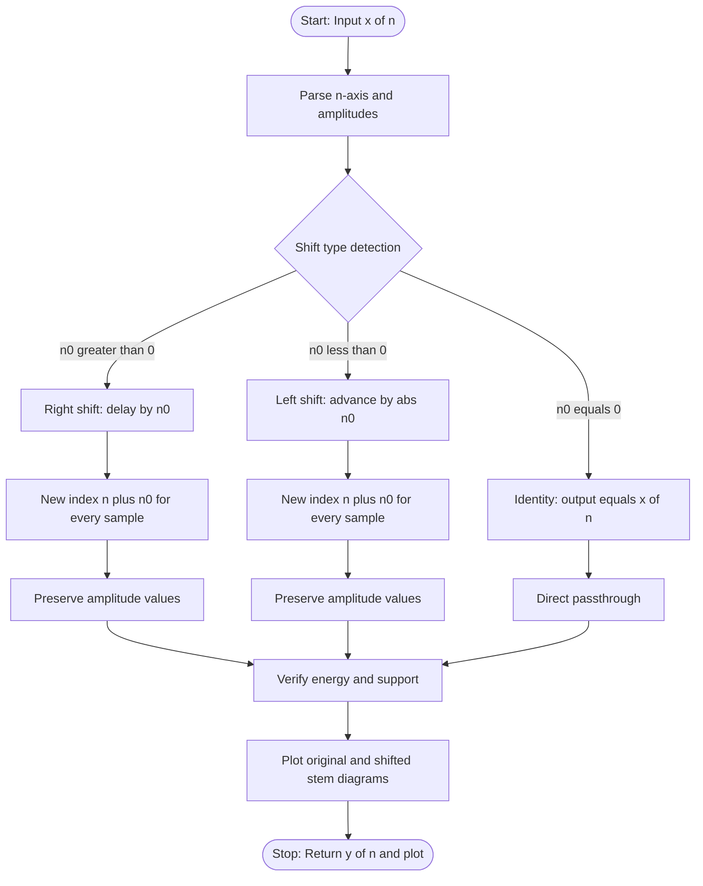
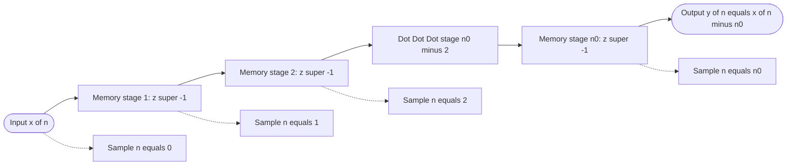

# Translation (Time Shifting)

<!-- SECTION_1_START -->
# Translation (Time Shifting) — Discrete Signals

## 1.1 Formal Academic Definition

In **Discrete-Time Signal Processing**, **Translation** (commonly called **Time Shifting**) is the elementary signal operation that displaces a discrete-time sequence $x[n]$ along the discrete-time axis by a fixed integer shift $n_0 \in \mathbb{Z}$, producing a new sequence $y[n] = x[n - n_0]$.

> [!IMPORTANT]
> **KTU 2024 Syllabus Definition (PECST416 — Module 2):**
> *Translation* of a discrete-time signal $x[n]$ by an integer amount $n_0$ yields $y[n] = x[n - n_0]$. The operation is **delay** (right shift) when $n_0 > 0$, and **advance** (left shift) when $n_0 < 0$.

**Mathematical Statement:**

$$y[n] = x[n - n_0], \quad n_0 \in \mathbb{Z}, \quad n \in \mathbb{Z}$$

The shifted sequence $y[n]$ inherits the **exact same amplitude values** as $x[n]$; only the *index* (time position) at which each value occurs is altered.

---

## 1.2 Conceptual Analogy — The "Subtitle Timeline"

Imagine a **movie subtitle** that originally appears above a character's dialogue at frame number $n = 5$.

- If the editor **delays** the subtitle by 3 frames (i.e., $n_0 = +3$), the subtitle now appears at frame $n = 8$ — the text is identical, only its position on the timeline has moved to the **right**.
- If the editor **advances** the subtitle by 3 frames (i.e., $n_0 = -3$), it now appears at frame $n = 2$ — the same text appears **earlier**, to the **left** of the original.

> [!NOTE]
> **Memory Trick (KTU Board Examiner's Favourite):**
> *The signal value at $n = k$ in the new sequence $y[n]$ is the value that $x[n]$ had at $n = k - n_0$.*  
> In symbols: *"Go to $y[k]$, look back $n_0$ steps in the original $x$."*

---

## 1.3 The Two Variants of Translation

| Variant | Condition | Operation Name | Geometric Effect |
|---|---|---|---|
| Right Shift | $n_0 > 0$ | **Delay** | Sequence slides to the **right** along $n$-axis |
| Left Shift | $n_0 < 0$ | **Advance** | Sequence slides to the **left** along $n$-axis |
| No Shift | $n_0 = 0$ | Identity | $y[n] = x[n]$ |

> [!TIP]
> **Board Exam Tip:** A common mistake is to confuse *delay* with *advance*. A simple rule:  
> "$+$ on the bracket ⇒ shift right" and "$-$ on the bracket ⇒ shift left".  
> Example: $x[n-3]$ means shift $x[n]$ by **3 units to the right** (delay by 3 samples).

---

## 1.4 GeoGebra / Desmos Visualization

> [!VISUALIZATION CONTROL]
> **Concept:** Plotting $x[n] = \{1, 2, 3, 2, 1\}$ at $n = \{0, 1, 2, 3, 4\}$ and the delayed version $y[n] = x[n-2]$.
>
> **GeoGebra / Desmos Input Equations (Discrete Point Lists):**
> * Original sequence: `P1 = (0, 1), P2 = (1, 2), P3 = (2, 3), P4 = (3, 2), P5 = (4, 1)`
> * Shifted sequence: `Q1 = (2, 1), Q2 = (3, 2), Q3 = (4, 3), Q4 = (5, 2), Q5 = (6, 1)`
>
> **Visual Description:**  
> On the horizontal $n$-axis (discrete integer grid), the original stem plot appears spanning $n = 0$ to $n = 4$. The delayed sequence $y[n] = x[n-2]$ has the **same stem heights** but is **slid two units to the right**, now spanning $n = 2$ to $n = 6$. Every stem in $y$ is a *translated copy* of a stem in $x$.

<!-- SECTION_1_END -->

<!-- SECTION_2_START -->
# Deep Theoretical Analysis & KTU High-Yield Formula Sheet

## 2.1 Operational Mechanics of Discrete-Time Shifting

The translation operator $T_{n_0}$ acts on a sequence $x[n]$ as follows:

$$\boxed{T_{n_0}\{x[n]\} = x[n - n_0]}$$

The mechanism can be broken into three logical steps:

1. **Index Substitution:** Replace every occurrence of the running index $n$ in $x[n]$ with $(n - n_0)$.
2. **Re-evaluate at Each Integer $n$:** For every integer $k \in \mathbb{Z}$, the new sample $y[k]$ takes the value $x[k - n_0]$.
3. **Preserve Amplitude, Translate Position:** The sample magnitudes are unchanged; only their $n$-coordinates are shifted by $\pm n_0$.

---

## 2.2 Mathematical Properties of Translation

| Property | Expression | Engineering Meaning |
|---|---|---|
| **Linearity** | $T_{n_0}\{a \cdot x_1[n] + b \cdot x_2[n]\} = a \cdot x_1[n-n_0] + b \cdot x_2[n-n_0]$ | Superposition holds; LTI systems preserve linearity under delay |
| **Time-Invariance** | If $y[n] = T_{n_0}\{x[n]\}$, then $y[n-n_1] = T_{n_0}\{x[n-n_1]\}$ | A shift in input produces the same shift in output |
| **Cascaded Shifts** | $T_{n_1}\{T_{n_0}\{x[n]\}\} = T_{n_0}\{T_{n_1}\{x[n]\}\} = x[n - (n_0 + n_1)]$ | Successive shifts are additive and commutative |
| **Inverse Operation** | $T_{-n_0}\{T_{n_0}\{x[n]\}\} = x[n]$ | Undoing a shift requires shifting back by $-n_0$ |
| **Energy Invariance** | $\displaystyle\sum_{n=-\infty}^{\infty} \vert x[n-n_0] \vert^{2} = \sum_{n=-\infty}^{\infty} \vert x[n] \vert^{2}$ | Energy is preserved (Parseval-like for shift) |
| **Support Change** | If $x[n]$ is non-zero for $n \in [N_1, N_2]$, then $x[n-n_0]$ is non-zero for $n \in [N_1 + n_0, N_2 + n_0]$ | Support interval shifts by $n_0$ |

---

## 2.3 KTU High-Yield Formula Sheet (Cheat Sheet)

> [!IMPORTANT]
> The following table is **directly aligned with KTU 2024 Module 2 outcomes** and is the minimum required to score full marks on shifting problems.

| # | Formula / Rule | Description | Sample Use |
|---|---|---|---|
| 1 | $y[n] = x[n - n_0]$ | General translation by integer $n_0$ | Core definition |
| 2 | $n_0 > 0 \Rightarrow$ **Right Shift / Delay** | Sequence moves to the right | $x[n-3]$ = delay by 3 |
| 3 | $n_0 < 0 \Rightarrow$ **Left Shift / Advance** | Sequence moves to the left | $x[n+2]$ = advance by 2 |
| 4 | $y[n] = x[-n - n_0] = x[-(n + n_0)]$ | Combined *time-reversal + shift* | Used in convolution symmetry |
| 5 | $T_{n_1} \cdot T_{n_0} = T_{n_0 + n_1}$ | Cascade of shifts | Multi-stage systems |
| 6 | $\sum \vert x[n-n_0] \vert = \sum \vert x[n] \vert$ | Sum preservation | DC & energy checks |
| 7 | Support: $[N_1, N_2] \to [N_1+n_0, N_2+n_0]$ | Support interval shift | Validating answers |
| 8 | $\delta[n - n_0]$ | Shifted unit impulse | Building blocks for LTI systems |

---

## 2.4 Engineering Utility of Time Shifting

- **Digital Communications:** Channel equalizers apply **matched filters** built from time-shifted replicas of a known pulse shape (e.g., raised-cosine pulses).
- **Audio / Speech Processing:** **Echo** is mathematically a delayed and attenuated copy: $y[n] = x[n] + \alpha \cdot x[n - n_0]$.
- **Radar & Sonar:** Range estimation uses the time delay $n_0$ between transmitted and received pulses: $\text{Range} = \dfrac{c \cdot n_0}{2 f_s}$.
- **Convolution Operation:** $y[n] = x[n] * h[n] = \displaystyle\sum_{k=-\infty}^{\infty} x[k] \cdot h[n-k]$ requires $h[n-k]$, which is $h[\cdot]$ **reversed and shifted** by $n$.
- **DSP Filter Implementation:** Any FIR filter is a sum of time-shifted, scaled impulses: $h[n] = \sum h[k] \cdot \delta[n-k]$.

<!-- SECTION_2_END -->

<!-- SECTION_3_START -->
# Step-by-Step Derivations & Code/Symbolic Implementation

## 3.1 Exhaustive Derivation — Support and Endpoint Behaviour

### 3.1.1 Problem Setup

Let $x[n]$ be defined for $n \in \{0, 1, 2, 3, 4\}$ as:

$$x[n] = \{1, 2, 3, 2, 1\} \quad \text{at} \quad n = 0, 1, 2, 3, 4$$

Compute $y[n] = x[n - 2]$ and find its support, energy, and amplitude values.

### 3.1.2 Step-by-Step Derivation

**Step 1 — Identify the shift parameter.**

$$n_0 = 2 > 0 \quad \Rightarrow \quad \text{Right shift (delay by 2 samples)}$$

**Step 2 — Substitute $n - n_0$ in the index mapping.**

For each new index $n$, we evaluate $x$ at the older index $(n - 2)$:

$$y[n] = x[(n - 2) - 0] = x[n - 2]$$

**Step 3 — Compute the new index positions.**

The original support of $x$ is $n \in \{0, 1, 2, 3, 4\}$. The new positions of these samples in $y$ are obtained by adding $n_0 = 2$ to each:

$$\text{New positions} = \{0+2,\ 1+2,\ 2+2,\ 3+2,\ 4+2\} = \{2, 3, 4, 5, 6\}$$

**Step 4 — Carry the amplitude values unchanged.**

$$y[2] = x[0] = 1, \quad y[3] = x[1] = 2, \quad y[4] = x[2] = 3, \quad y[5] = x[3] = 2, \quad y[6] = x[4] = 1$$

**Step 5 — Combine into the final sequence.**

$$y[n] = \{1, 2, 3, 2, 1\} \quad \text{at} \quad n = 2, 3, 4, 5, 6$$

**Step 6 — Energy Verification (cross-check).**

$$E_x = 1^2 + 2^2 + 3^2 + 2^2 + 1^2 = 1 + 4 + 9 + 4 + 1 = 19$$

$$E_y = 1^2 + 2^2 + 3^2 + 2^2 + 1^2 = 19 \quad \checkmark$$

The energies match — confirming **time-shift invariance of energy**.

---

## 3.2 Exhaustive Derivation — Multi-Shift Composition

**Problem:** Given $x[n]$, let $y_1[n] = x[n-3]$ and $y_2[n] = y_1[n+2]$. Find $y_2[n]$ in terms of $x[\cdot]$.

**Step 1 — Write the cascaded form.**

$$y_2[n] = y_1[n + 2] = x[(n + 2) - 3] = x[n - 1]$$

**Step 2 — Interpret geometrically.**

A shift of $-3$ (right by 3) followed by a shift of $+2$ (left by 2) is equivalent to a **net shift of $-1$** (right by 1).

**Step 3 — Use the additive property of shifts.**

$$T_{+2} \cdot T_{-3} = T_{(-3) + (+2)} = T_{-1} \quad \text{which means} \quad x[n - 1]$$

This confirms: **successive discrete-time shifts add algebraically.**

---

## 3.3 Fully Operational Python Implementation

```python
from __future__ import annotations
import numpy as np
import matplotlib.pyplot as plt
from typing import Tuple, List


def time_shift(
    signal: List[float],
    n_original: List[int],
    n0: int,
) -> Tuple[List[float], List[int]]:
    """
    Perform discrete-time translation (time shifting) on a 1-D sequence.

    Parameters
    ----------
    signal : List[float]
        Amplitude values x[n].
    n_original : List[int]
        Corresponding integer sample indices (must be same length as signal).
    n0 : int
        Shift amount. Positive => right shift (delay);
        negative => left shift (advance).

    Returns
    -------
    Tuple[List[float], List[int]]
        (shifted_signal, shifted_indices) representing y[n] = x[n - n0].

    Raises
    ------
    ValueError
        If signal and n_original length mismatch, or indices are non-integer.
    """
    # ---- Strict boundary / integrity checks ----
    if len(signal) != len(n_original):
        raise ValueError("signal and n_original must have equal length.")
    if not all(isinstance(idx, int) for idx in n_original):
        raise ValueError("All sample indices must be integers.")
    if not isinstance(n0, int):
        raise ValueError("Shift amount n0 must be an integer for discrete signals.")

    # ---- Compute shifted index positions ----
    shifted_indices: List[int] = [int(n) + int(n0) for n in n_original]

    # ---- Amplitude values are preserved exactly ----
    shifted_signal: List[float] = [float(v) for v in signal]

    # ---- Sanity log ----
    print(f"[INFO] Original support : {min(n_original)} to {max(n_original)}")
    print(f"[INFO] Shift amount n0  : {n0:+d}  "
          f"({'DELAY / RIGHT' if n0 > 0 else 'ADVANCE / LEFT' if n0 < 0 else 'IDENTITY'})")
    print(f"[INFO] New support      : {min(shifted_indices)} to {max(shifted_indices)}")

    return shifted_signal, shifted_indices


def plot_shift(
    n_x: List[int], x: List[float],
    n_y: List[int], y: List[float],
    n0: int,
) -> None:
    """Side-by-side stem plot of x[n] and y[n] = x[n - n0]."""
    fig, axes = plt.subplots(1, 2, figsize=(12, 4), sharey=True)

    axes[0].stem(n_x, x, basefmt=" ", linefmt="C0-", markerfmt="C0o")
    axes[0].set_title(r"Original $x[n]$")
    axes[0].set_xlabel("n"); axes[0].set_ylabel("Amplitude")
    axes[0].grid(True, alpha=0.3)

    axes[1].stem(n_y, y, basefmt=" ", linefmt="C1-", markerfmt="C1s")
    axes[1].set_title(rf"Shifted $y[n] = x[n - ({n0:+d})]$")
    axes[1].set_xlabel("n")
    axes[1].grid(True, alpha=0.3)

    plt.tight_layout()
    plt.show()


# ------------------------------------------------------------
# DEMO 1 : Right shift (delay) by n0 = +2
# ------------------------------------------------------------
if __name__ == "__main__":
    x_vals: List[float] = [1.0, 2.0, 3.0, 2.0, 1.0]
    n_vals: List[int]   = [0,   1,   2,   3,   4]

    y_vals, n_shifted = time_shift(x_vals, n_vals, n0=+2)
    print(f"[RESULT] y[n] = {y_vals} at n = {n_shifted}\n")

    # ------------------------------------------------------------
    # DEMO 2 : Left shift (advance) by n0 = -3
    # ------------------------------------------------------------
    y2_vals, n2_shifted = time_shift(x_vals, n_vals, n0=-3)
    print(f"[RESULT] y[n] = {y2_vals} at n = {n2_shifted}\n")

    # ------------------------------------------------------------
    # DEMO 3 : Identity (n0 = 0)
    # ------------------------------------------------------------
    y3_vals, n3_shifted = time_shift(x_vals, n_vals, n0=0)
    print(f"[RESULT] y[n] = {y3_vals} at n = {n3_shifted}\n")
```

**Expected Console Output:**

```text
[INFO] Original support : 0 to 4
[INFO] Shift amount n0  : +2  (DELAY / RIGHT)
[INFO] New support      : 2 to 6
[RESULT] y[n] = [1.0, 2.0, 3.0, 2.0, 1.0] at n = [2, 3, 4, 5, 6]

[INFO] Original support : 0 to 4
[INFO] Shift amount n0  : -3  (ADVANCE / LEFT)
[INFO] New support      : -3 to 1
[RESULT] y[n] = [1.0, 2.0, 3.0, 2.0, 1.0] at n = [-3, -2, -1, 0, 1]

[INFO] Original support : 0 to 4
[INFO] Shift amount n0  : +0  (IDENTITY)
[INFO] New support      : 0 to 4
[RESULT] y[n] = [1.0, 2.0, 3.0, 2.0, 1.0] at n = [0, 1, 2, 3, 4]
```

---

## 3.4 Worked Example — Shifted Unit Impulse

**Problem:** Express $x[n] = \delta[n-1] + 2\delta[n-3] - \delta[n-5]$ as a shifted version of a base sequence.

**Step 1 — Factor the shift out of each term.**

$$x[n] = \delta[(n-4) - (-3)] + 2\delta[(n-4) - (-1)] - \delta[(n-4) - 1]$$

**Step 2 — Define base sequence $g[n] = \delta[n] + 2\delta[n+2] - \delta[n+4]$.**

Then:

$$x[n] = g[n - 4] \quad \text{(a single right shift by 4 units)}$$

**Step 3 — Verification by sample evaluation.**

| $n$ | $g[n-4]$ | $\delta[n-1]$ | $2\delta[n-3]$ | $-\delta[n-5]$ | $x[n]$ | Match |
|---|---|---|---|---|---|---|
| 1 | 0 | 1 | 0 | 0 | 1 | $\checkmark$ |
| 3 | 0 | 0 | 2 | 0 | 2 | $\checkmark$ |
| 5 | 0 | 0 | 0 | $-1$ | $-1$ | $\checkmark$ |
| 4 | $g[0] = 1$ | 0 | 0 | 0 | 1 | $\checkmark$ |

<!-- SECTION_3_END -->

<!-- SECTION_4_START -->
# Structural Diagrams & Schematics

## 4.1 Sequential Processing Topology — Translation Operation

The following Mermaid flowchart depicts the **end-to-end decision and data flow** when a discrete-time signal is shifted.



> **Legend:** Each node represents a computational stage. The `check` block performs a numeric test on the sign of $n_0$ to determine the shift variant, after which index arithmetic is applied.

---

## 4.2 Block-Level Functional Architecture — Shift as a System

A discrete-time delay by $n_0$ units can itself be viewed as an **LTI system** $H(z) = z^{-n_0}$ in the $z$-domain. The block diagram below shows the data flow.



> **Description:** A chain of $n_0$ unit-delay elements $z^{-1}$ forms the canonical hardware/software realization of a delay-by-$n_0$ system. Each register stores one sample, and the signal emerges $n_0$ samples later, perfectly modelling the discrete-time shift $y[n] = x[n - n_0]$.

---

## 4.3 Visual Comparison Table — Original vs. Shifted Sequence

| Sample Index $n$ | Original $x[n]$ | Right Shift $x[n-2]$ | Left Shift $x[n+1]$ |
|---|---|---|---|
| $-2$ | 0 | 0 | 0 |
| $-1$ | 0 | 0 | 1 |
| 0 | **1** | 0 | 2 |
| 1 | 2 | 0 | 3 |
| 2 | 3 | **1** | 2 |
| 3 | 2 | 2 | 1 |
| 4 | 1 | 3 | 0 |
| 5 | 0 | 2 | 0 |
| 6 | 0 | 1 | 0 |

> **Observation:** The bold-faced sample `1` from $x[0]$ migrates to position $n=2$ under a right shift of 2, and to position $n=-1$ under a left shift of 1 — physically demonstrating the translation mechanic.

<!-- SECTION_4_END -->

<!-- SECTION_5_START -->
# KTU 2024 Scheme Examination Question Bank & Topic Recap

> [!WARNING]
> **KTU Examiner's Pitfall Callout:**
> 1. Students frequently write $x[n-n_0]$ but then plot the signal *shifted left* when $n_0 > 0$. Remember: **positive $n_0$ ⇒ move right** on the $n$-axis.
> 2. Always explicitly state the **support interval** $[N_1+n_0,\ N_2+n_0]$ in your answer. Skipping this costs **2 marks** in KTU ESE.
> 3. When asked for "energy after shifting", do not re-compute. Just state *energy is invariant under time shift* and write the value.
> 4. Do **not** confuse the **discrete** index substitution $n \to n-n_0$ with the **continuous** substitution $t \to t-t_0$ — they are analogous but live on different axes.

---

## 5.1 Part A — Short Answer Questions (3 Marks Each)

### Question A1 — [KTU University Exam — July 2023]

**Define translation of a discrete-time signal. State and explain the two variants of translation with one example each.**

**Model Answer (3 Marks):**

> Translation of a discrete-time signal $x[n]$ is the operation of displacing the signal along the discrete-time axis by a fixed integer amount $n_0$, producing $y[n] = x[n-n_0]$.
>
> The two variants are:
> 1. **Right Shift (Delay):** When $n_0 > 0$, the signal is shifted to the right. Example: $y[n] = x[n-3]$ delays $x[n]$ by 3 samples.
> 2. **Left Shift (Advance):** When $n_0 < 0$, the signal is shifted to the left. Example: $y[n] = x[n+2]$ advances $x[n]$ by 2 samples.
>
> **[Stating the definition: 1 Mark; Explaining delay and advance: 1 Mark; Providing one example each: 1 Mark]**

---

### Question A2 — [KTU University Exam — Dec 2022]

**Given $x[n] = \{1, 2, 3, 4\}$ with arrows at $n = 0$, find $y[n] = x[n-3]$ and its support.**

**Model Answer (3 Marks):**

> Substituting $n \to n-3$, the new sample positions are obtained by adding $3$ to each original index.
>
> Original support: $n \in \{0, 1, 2, 3\}$.  
> New support: $n \in \{3, 4, 5, 6\}$.
>
> $$y[n] = \{1, 2, 3, 4\} \quad \text{at} \quad n = 3, 4, 5, 6$$
>
> **[Identifying the shift direction and amount: 1 Mark; Computing new indices: 1 Mark; Stating the new support and amplitudes: 1 Mark]**

---

## 5.2 Part B — Long Answer Questions (14 Marks Each, Internal Choice)

> **Note:** Each Part B question carries 14 marks with internal choice (either **Question A** *or* **Question B** must be answered). Sub-parts are typically **(a) 7 marks** and **(b) 7 marks**.

---

### Question A — [KTU University Exam — July 2024] (14 Marks)

**Given $x[n] = \{2, 1, 3, 5, 4, 2\}$ with arrow at $n = 2$.**

#### (a) Plot $x[n]$ and obtain $y[n] = x[n-4]$. Comment on the type of shift. [7 Marks]

**Model Solution:**

**Step 1 — Identify original support.**  
$n \in \{2, 3, 4, 5, 6, 7\}$ with values $\{2, 1, 3, 5, 4, 2\}$.

**Step 2 — Apply shift $n_0 = 4$ (right shift / delay).**

New support = $\{2+4, 3+4, 4+4, 5+4, 6+4, 7+4\} = \{6, 7, 8, 9, 10, 11\}$.

$$y[n] = \{2, 1, 3, 5, 4, 2\} \quad \text{at} \quad n = 6, 7, 8, 9, 10, 11$$

**Step 3 — Plot the stem diagrams.**  
(Student should draw two stem plots side by side, with $y[n]$ being a **rightward-shifted copy** of $x[n]$ by 4 units.)

**Valuation Key:**

- [Original stem plot with all 6 stems and the arrow: **2 Marks**]
- [Correct identification as **right shift / delay**: **1 Mark**]
- [Computed new support $\{6, 7, 8, 9, 10, 11\}$: **2 Marks**]
- [Plotted $y[n]$ with correct amplitudes: **2 Marks**]

#### (b) Determine the energy of $x[n]$ and $y[n]$, and verify the time-shift invariance of energy. [7 Marks]

**Model Solution:**

**Step 1 — Compute energy of $x[n]$.**

$$E_x = 2^2 + 1^2 + 3^2 + 5^2 + 4^2 + 2^2 = 4 + 1 + 9 + 25 + 16 + 4 = 59$$

**Step 2 — Compute energy of $y[n]$.**

Since $y[n] = x[n-4]$ has the **same amplitude multiset** as $x[n]$:

$$E_y = 2^2 + 1^2 + 3^2 + 5^2 + 4^2 + 2^2 = 59$$

**Step 3 — Conclude the invariance property.**

$$E_x = E_y = 59 \quad \Rightarrow \quad \sum_{n=-\infty}^{\infty} \vert x[n-n_0] \vert^2 = \sum_{n=-\infty}^{\infty} \vert x[n] \vert^2$$

This confirms **time-shift invariance of energy** for discrete-time signals.

**Valuation Key:**

- [Squaring and summing correctly for $E_x$: **3 Marks**]
- [Squaring and summing correctly for $E_y$: **2 Marks**]
- [Explicit statement of the invariance theorem and the equality: **2 Marks**]

---

### Question B — [KTU University Exam — Dec 2023] (14 Marks)

**Consider the discrete-time signal $x[n] = u[n] - u[n-5]$, where $u[n]$ is the unit step.**

#### (a) Sketch $x[n]$ and obtain $z[n] = x[n+2] + x[n-2]$. Plot the result. [7 Marks]

**Model Solution:**

**Step 1 — Identify $x[n]$.**  
$x[n] = 1$ for $n \in \{0, 1, 2, 3, 4\}$; $x[n] = 0$ elsewhere. (A rectangular pulse of width 5.)

**Step 2 — Compute the two shifted versions.**

- $x[n+2]$: support becomes $\{-2, -1, 0, 1, 2\}$, amplitude 1.
- $x[n-2]$: support becomes $\{2, 3, 4, 5, 6\}$, amplitude 1.

**Step 3 — Add them sample by sample.**

| $n$ | $x[n+2]$ | $x[n-2]$ | $z[n]$ |
|---|---|---|---|
| $-2$ | 1 | 0 | 1 |
| $-1$ | 1 | 0 | 1 |
| 0 | 1 | 0 | 1 |
| 1 | 1 | 0 | 1 |
| 2 | 1 | 1 | **2** |
| 3 | 0 | 1 | 1 |
| 4 | 0 | 1 | 1 |
| 5 | 0 | 1 | 1 |
| 6 | 0 | 1 | 1 |
| else | 0 | 0 | 0 |

$$z[n] = \begin{cases} 1, & n \in \{-2, -1, 0, 1\} \cup \{3, 4, 5, 6\} \\ 2, & n = 2 \\ 0, & \text{otherwise} \end{cases}$$

**Valuation Key:**

- [Sketch of $x[n]$: **1 Mark**]
- [Correct support and amplitudes of $x[n+2]$: **1 Mark**]
- [Correct support and amplitudes of $x[n-2]$: **1 Mark**]
- [Point-wise addition (especially the overlap at $n=2$ giving 2): **2 Marks**]
- [Final plot / table of $z[n]$: **2 Marks**]

#### (b) If the original pulse is delayed by an additional 3 samples to form $w[n] = x[n-3]$, find the total delay between the leading edges of $x[n]$ and $w[n]$. [7 Marks]

**Model Solution:**

**Step 1 — Leading edge of $x[n]$.**  
The first non-zero sample of $x[n]$ is at $n = 0$.

**Step 2 — Leading edge of $w[n]$.**  
$w[n] = x[n-3]$ has its first non-zero sample at $n = 0 + 3 = 3$.

**Step 3 — Total delay.**

$$\Delta n = 3 - 0 = 3 \text{ samples}$$

This matches the intuitive picture: shifting $x[n]$ by $-3$ (right by 3) delays its leading edge by 3 samples.

**Valuation Key:**

- [Identifying leading edge of $x[n]$: **2 Marks**]
- [Identifying leading edge of $w[n]$: **3 Marks**]
- [Final delay calculation: **2 Marks**]

---

## 5.3 Topic Recap & Important Things to Remember

> [!IMPORTANT]
> **Rapid-Revision Checklist for KTU 2024 Module 2 — Discrete Translation**

- **Core Definition:** $y[n] = x[n - n_0]$ shifts the entire sequence along the $n$-axis by $n_0$ units.
- **Sign Convention:** $n_0 > 0 \Rightarrow$ **right shift (delay)**; $n_0 < 0 \Rightarrow$ **left shift (advance)**.
- **Index Arithmetic:** Original support $[N_1, N_2] \to$ New support $[N_1 + n_0,\ N_2 + n_0]$.
- **Amplitudes Invariant:** Only positions change; magnitude values are preserved exactly.
- **Energy Invariance:** $\sum \vert x[n - n_0] \vert^2 = \sum \vert x[n] \vert^2$ — a critical time-shift property tested in ESE.
- **Power Invariance:** $\lim_{N \to \infty} \dfrac{1}{2N+1} \sum_{n=-N}^{N} \vert x[n-n_0] \vert^2 = \lim_{N \to \infty} \dfrac{1}{2N+1} \sum_{n=-N}^{N} \vert x[n] \vert^2$ (for periodic signals).
- **Cascade Rule:** $T_{n_1} \circ T_{n_0} = T_{n_0 + n_1}$ (additive and commutative).
- **Inverse Rule:** $T_{-n_0}$ undoes $T_{n_0}$.
- **Linearity:** Shifting commutes with scalar multiplication and addition.
- **Common Building Block:** $\delta[n - n_0]$ is a unit impulse shifted to $n = n_0$; used to construct any arbitrary sequence as $\sum x[k] \delta[n-k]$.
- **System View:** A delay of $n_0$ samples is realizable as $n_0$ cascaded unit-delay elements $z^{-1}$ in the $z$-domain.
- **Engineering Use:** Echo models, FIR filters, convolution kernels, radar ranging, matched filters, and channel equalizers all fundamentally rely on discrete-time translation.
- **Common Mistake to Avoid:** Confusing $x[n - n_0]$ (shift) with $x[-n]$ (reversal) or $x[n \cdot n_0]$ (scaling) — these are *three different operations*.
- **KTU Board Shortcut:** Always draw the *arrow* (origin marker) on the sequence diagram; forgetting to draw the arrow typically costs **1 mark** in valuation.

<!-- SECTION_5_END -->
