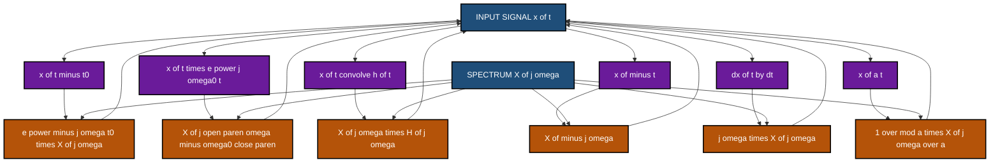
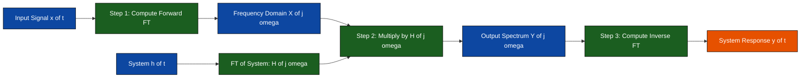

# Fourier transform properties for continuous and discrete-time signals

<!-- SECTION_1_START -->

# Fourier Transform Properties for Continuous and Discrete-Time Signals

## 1.1 Formal Academic Definition (KTU 2024 Syllabus Terminology)

The **Fourier Transform (FT)** is a mathematical transform that decomposes a signal into its constituent frequency components. For KTU 2024 Scheme analysis, two distinct transforms must be mastered:

> [!IMPORTANT]
> **Continuous-Time Fourier Transform (CTFT):** Maps a continuous, aperiodic time-domain signal $x(t)$ to a continuous, aperiodic frequency-domain representation $X(j\omega)$.

$$X(j\omega) = \int_{-\infty}^{\infty} x(t)\, e^{-j\omega t}\, dt$$

$$x(t) = \frac{1}{2\pi} \int_{-\infty}^{\infty} X(j\omega)\, e^{j\omega t}\, d\omega$$

> [!IMPORTANT]
> **Discrete-Time Fourier Transform (DTFT):** Maps a discrete, aperiodic sequence $x[n]$ to a continuous, **periodic** frequency-domain representation $X(e^{j\omega})$ with period $2\pi$.

$$X(e^{j\omega}) = \sum_{n=-\infty}^{\infty} x[n]\, e^{-j\omega n}$$

$$x[n] = \frac{1}{2\pi} \int_{2\pi} X(e^{j\omega})\, e^{j\omega n}\, d\omega$$

**Transform Properties** are algebraic identities that relate a modification of a signal in one domain to a structured change in the other domain. They are essential for solving LTI system problems without re-computing the integral from scratch.

## 1.2 Conceptual Analogy — The Audio Equalizer

Imagine a song $x(t)$ playing on a music player. The Fourier transform is like the **spectrum analyzer** of a graphic equalizer — it tells you how much bass, mid, and treble exist.

- **Time Shift (Delay):** Playing the same song 5 seconds later does not change the bass/treble content — only the *phase* in the spectrum rotates. This is the **Time Shifting Property**.
- **Frequency Shift (Modulation):** Translating the song to a higher "musical key" (multiplying by $e^{j\omega_0 t}$) shifts the entire spectrum sideways — this is the **Modulation Property**, the backbone of radio transmission.
- **Convolution (Echo/Reverb):** When sound bounces off a wall, the original signal *convolves* with the room's impulse response. In the frequency domain, convolution *becomes simple multiplication* — a profound engineering simplification.

> [!NOTE]
> **Engineering Insight:** Engineers do not actually perform convolution integrals by hand. They convert signals to the frequency domain using FFT, multiply, and invert — this is how audio codecs (MP3, AAC), noise-cancelling headphones, and 5G modems all operate.

## 1.3 The Standard Pair — Foundation for All Properties

Every property is derived from the **exponential kernel** $e^{\pm j\omega t}$. The most fundamental pair to memorize:

$$x(t) = e^{-at}\, u(t), \quad a > 0 \quad \xleftrightarrow{\text{CTFT}} \quad X(j\omega) = \frac{1}{a + j\omega}$$

$$x[n] = a^n\, u[n], \quad \vert a \vert < 1 \quad \xleftrightarrow{\text{DTFT}} \quad X(e^{j\omega}) = \frac{1}{1 - a e^{-j\omega}}$$

> [!VISUALIZATION CONTROL]
> **Concept:** Time-Frequency Duality via a Rectangular Pulse and Sinc Function
> **GeoGebra / Desmos Input Equations:**
> * `f(x) = if(0 < x < 1, 1, 0)` (rectangular pulse in time)
> * `g(x) = sin(pi*x) / (pi*x)` (sinc function in frequency)
> **Visual Description:** Plot $f(t)$ on the interval $[-0.5, 1.5]$ as a unit-height rectangle from $t=0$ to $t=1$. Then plot $X(\omega) = \text{sinc}(\omega / 2\pi)$ on the interval $[-15, 15]$. Observe the *narrow time pulse* produces a *wide frequency spectrum* and vice versa — this visualizes the **Duality Property**.

---

<!-- SECTION_1_END -->

<!-- SECTION_2_START -->

# Deep Theoretical Analysis & KTU High-Yield Formula Sheet

## 2.1 The Thirteen Cardinal Properties

Every Fourier transform property has a logical **"if"** (input modification) and **"then"** (output modification). The pairing is universal for both CTFT and DTFT, with subtle differences in normalization constants.

### 2.1.1 Linearity
The transform of a weighted sum equals the weighted sum of transforms. This is the foundation of all superposition-based LTI analysis.

$$a\, x_1(t) + b\, x_2(t) \quad \xleftrightarrow{\text{CTFT}} \quad a\, X_1(j\omega) + b\, X_2(j\omega)$$

### 2.1.2 Time Shifting
Delaying a signal in time multiplies its spectrum by a *linear phase term* $e^{-j\omega t_0}$. Magnitude spectrum is **unchanged**; only phase rotates.

$$x(t - t_0) \quad \xleftrightarrow{\text{CTFT}} \quad e^{-j\omega t_0}\, X(j\omega)$$

$$x[n - n_0] \quad \xleftrightarrow{\text{DTFT}} \quad e^{-j\omega n_0}\, X(e^{j\omega})$$

### 2.1.3 Frequency Shifting (Modulation)
Multiplying a signal by a complex exponential **shifts** its spectrum. This is the principle behind AM radio and amplitude modulation.

$$e^{j\omega_0 t}\, x(t) \quad \xleftrightarrow{\text{CTFT}} \quad X(j(\omega - \omega_0))$$

$$e^{j\omega_0 n}\, x[n] \quad \xleftrightarrow{\text{DTFT}} \quad X(e^{j(\omega - \omega_0)})$$

### 2.1.4 Time Reversal
Folding the signal about the origin reverses the spectrum about the origin. For real signals, this is equivalent to complex conjugation when combined with the conjugate symmetry property.

$$x(-t) \quad \xleftrightarrow{\text{CTFT}} \quad X(-j\omega)$$

$$x[-n] \quad \xleftrightarrow{\text{DTFT}} \quad X(e^{-j\omega})$$

### 2.1.5 Time Scaling
Compressing a signal in time **stretches** its spectrum and scales its magnitude. This is the *uncertainty principle* in disguise — narrow signals have wide spectra.

$$x(at) \quad \xleftrightarrow{\text{CTFT}} \quad \frac{1}{\vert a \vert}\, X\left(\frac{j\omega}{a}\right), \quad a \neq 0$$

> [!NOTE]
> The DTFT **does not have a time-scaling property** in the continuous sense, because $x[an]$ with non-integer $a$ is not a valid discrete sequence. Instead, the DTFT has a **Frequency Scaling** property via substitution $\omega \to k\omega$.

### 2.1.6 Conjugation
Conjugating a signal in time conjugates and **reflects** the spectrum in frequency.

$$x^{*}(t) \quad \xleftrightarrow{\text{CTFT}} \quad X^{*}(-j\omega)$$

### 2.1.7 Conjugate Symmetry for Real Signals
A real-valued signal has a spectrum with **Hermitian symmetry** — even real part and odd imaginary part.

$$\text{If } x(t) \in \mathbb{R}, \text{ then } X(-j\omega) = X^{*}(j\omega)$$

### 2.1.8 Differentiation in Time
Differentiation in time multiplies the spectrum by $j\omega$. This converts *differential equations* into *algebraic equations* — the central pillar of phasor analysis.

$$\frac{dx(t)}{dt} \quad \xleftrightarrow{\text{CTFT}} \quad j\omega\, X(j\omega)$$

### 2.1.9 Integration in Time
Integration corresponds to division by $j\omega$ plus a Dirac delta at zero frequency (the DC/average value of the signal).

$$\int_{-\infty}^{t} x(\tau)\, d\tau \quad \xleftrightarrow{\text{CTFT}} \quad \frac{1}{j\omega}\, X(j\omega) + \pi\, X(0)\, \delta(\omega)$$

### 2.1.10 Differentiation in Frequency
Differentiating the spectrum corresponds to multiplying the signal by $-jt$ in time. Symmetric to the time-differentiation property.

$$-jt\, x(t) \quad \xleftrightarrow{\text{CTFT}} \quad \frac{dX(j\omega)}{d\omega}$$

$$-jn\, x[n] \quad \xleftrightarrow{\text{DTFT}} \quad \frac{dX(e^{j\omega})}{d\omega}$$

### 2.1.11 Convolution (The LTI Theorem)
The **most important property** for LTI systems. Convolution in time becomes multiplication in frequency.

$$y(t) = x(t) * h(t) \quad \xleftrightarrow{\text{CTFT}} \quad Y(j\omega) = X(j\omega)\, H(j\omega)$$

$$y[n] = x[n] * h[n] \quad \xleftrightarrow{\text{DTFT}} \quad Y(e^{j\omega}) = X(e^{j\omega})\, H(e^{j\omega})$$

### 2.1.12 Multiplication (Modulation Theorem)
Duality of the convolution property. Multiplication in time corresponds to convolution in frequency, scaled by $\frac{1}{2\pi}$.

$$x(t)\, p(t) \quad \xleftrightarrow{\text{CTFT}} \quad \frac{1}{2\pi}\, X(j\omega) * P(j\omega)$$

$$x[n]\, p[n] \quad \xleftrightarrow{\text{DTFT}} \quad \frac{1}{2\pi} \int_{2\pi} X(e^{j\theta})\, P(e^{j(\omega - \theta)})\, d\theta$$

### 2.1.13 Parseval's Relation (Energy Conservation)
The total energy of a signal can be computed equivalently in the time or frequency domain. Critical for filter design and signal power calculations.

$$\int_{-\infty}^{\infty} \vert x(t) \vert^2 dt = \frac{1}{2\pi} \int_{-\infty}^{\infty} \vert X(j\omega) \vert^2 d\omega \quad \text{(CTFT)}$$

$$\sum_{n=-\infty}^{\infty} \vert x[n] \vert^2 = \frac{1}{2\pi} \int_{2\pi} \vert X(e^{j\omega}) \vert^2 d\omega \quad \text{(DTFT)}$$

## 2.2 KTU High-Yield Formula Cheat Sheet

> [!NOTE]
> The following table is the *definitive reference* for KTU University Exams. Memorize the **direction of the arrow** for each row and the **normalization constant** for convolution/multiplication properties.

| Property | Continuous-Time (CTFT) | Discrete-Time (DTFT) |
|----------|------------------------|----------------------|
| Linearity | $a x_1(t) + b x_2(t) \leftrightarrow a X_1(j\omega) + b X_2(j\omega)$ | $a x_1[n] + b x_2[n] \leftrightarrow a X_1(e^{j\omega}) + b X_2(e^{j\omega})$ |
| Time Shift | $x(t - t_0) \leftrightarrow e^{-j\omega t_0} X(j\omega)$ | $x[n - n_0] \leftrightarrow e^{-j\omega n_0} X(e^{j\omega})$ |
| Frequency Shift | $e^{j\omega_0 t} x(t) \leftrightarrow X(j(\omega - \omega_0))$ | $e^{j\omega_0 n} x[n] \leftrightarrow X(e^{j(\omega - \omega_0)})$ |
| Time Reversal | $x(-t) \leftrightarrow X(-j\omega)$ | $x[-n] \leftrightarrow X(e^{-j\omega})$ |
| Conjugation | $x^{*}(t) \leftrightarrow X^{*}(-j\omega)$ | $x^{*}[n] \leftrightarrow X^{*}(e^{-j\omega})$ |
| Time Differentiation | $\dfrac{dx(t)}{dt} \leftrightarrow j\omega X(j\omega)$ | Not Applicable directly |
| Freq. Differentiation | $-jt x(t) \leftrightarrow \dfrac{dX(j\omega)}{d\omega}$ | $-jn x[n] \leftrightarrow \dfrac{dX(e^{j\omega})}{d\omega}$ |
| Convolution in Time | $x(t) * h(t) \leftrightarrow X(j\omega) H(j\omega)$ | $x[n] * h[n] \leftrightarrow X(e^{j\omega}) H(e^{j\omega})$ |
| Multiplication in Time | $x(t) p(t) \leftrightarrow \dfrac{1}{2\pi} X(j\omega) * P(j\omega)$ | $x[n] p[n] \leftrightarrow \dfrac{1}{2\pi} \int_{2\pi} X(e^{j\theta}) P(e^{j(\omega-\theta)}) d\theta$ |
| Parseval's Energy | $\int \vert x(t) \vert^2 dt = \dfrac{1}{2\pi} \int \vert X(j\omega) \vert^2 d\omega$ | $\sum \vert x[n] \vert^2 = \dfrac{1}{2\pi} \int_{2\pi} \vert X(e^{j\omega}) \vert^2 d\omega$ |
| Periodicity of $X$ | $X(j\omega)$ is aperiodic | $X(e^{j\omega})$ is periodic with period $2\pi$ |
| Duality | $X(jt) \leftrightarrow 2\pi\, x(-\omega)$ | Not directly applicable |

## 2.3 Real-World Engineering Utility

- **Telecommunications:** Frequency shifting enables tunable radio receivers; the modulation property powers OFDM in 4G/5G.
- **Audio Processing:** The convolution property underpins every digital filter (low-pass, high-pass, equalizer).
- **Image Processing:** 2D Fourier transform properties enable image compression (JPEG), denoising, and edge detection.
- **Control Systems:** Differentiation in time → multiplication by $j\omega$ converts ODEs to algebraic equations, making stability analysis trivial via Bode plots.
- **Medical Imaging (MRI):** The frequency-shift property is exploited in spatial encoding of magnetic resonance signals.

---

<!-- SECTION_2_END -->

<!-- SECTION_3_START -->

# Step-by-Step Derivations & Symbolic Implementation

## 3.1 Proof 1 — Linearity Property (CTFT)

**Given:** $X_1(j\omega) = \mathcal{F}\{x_1(t)\}$ and $X_2(j\omega) = \mathcal{F}\{x_2(t)\}$.

**To Prove:** $\mathcal{F}\{a x_1(t) + b x_2(t)\} = a X_1(j\omega) + b X_2(j\omega)$.

**Step 1:** Substitute $y(t) = a x_1(t) + b x_2(t)$ into the forward CTFT integral.

$$Y(j\omega) = \int_{-\infty}^{\infty} \left[ a x_1(t) + b x_2(t) \right] e^{-j\omega t}\, dt$$

**Step 2:** Distribute the integral over the sum (integral is a linear operator).

$$Y(j\omega) = a \int_{-\infty}^{\infty} x_1(t)\, e^{-j\omega t}\, dt \; + \; b \int_{-\infty}^{\infty} x_2(t)\, e^{-j\omega t}\, dt$$

**Step 3:** Recognize each integral as the corresponding CTFT definition.

$$\int_{-\infty}^{\infty} x_1(t)\, e^{-j\omega t}\, dt = X_1(j\omega) \quad \text{and} \quad \int_{-\infty}^{\infty} x_2(t)\, e^{-j\omega t}\, dt = X_2(j\omega)$$

**Step 4:** Substitute back to obtain the result.

$$Y(j\omega) = a\, X_1(j\omega) + b\, X_2(j\omega) \quad \blacksquare$$

## 3.2 Proof 2 — Time Shifting Property (CTFT)

**Given:** $X(j\omega) = \mathcal{F}\{x(t)\}$. We wish to find $\mathcal{F}\{x(t - t_0)\}$.

**Step 1:** Write the CTFT of the shifted signal directly.

$$Y(j\omega) = \int_{-\infty}^{\infty} x(t - t_0)\, e^{-j\omega t}\, dt$$

**Step 2:** Apply the substitution $\tau = t - t_0$, so $t = \tau + t_0$ and $dt = d\tau$.

When $t \to -\infty$, $\tau \to -\infty$; when $t \to +\infty$, $\tau \to +\infty$.

$$Y(j\omega) = \int_{-\infty}^{\infty} x(\tau)\, e^{-j\omega (\tau + t_0)}\, d\tau$$

**Step 3:** Separate the exponential using the exponent law $e^{A+B} = e^A \cdot e^B$.

$$Y(j\omega) = e^{-j\omega t_0} \int_{-\infty}^{\infty} x(\tau)\, e^{-j\omega \tau}\, d\tau$$

**Step 4:** Recognize the integral as $X(j\omega)$.

$$Y(j\omega) = e^{-j\omega t_0}\, X(j\omega) \quad \blacksquare$$

> [!IMPORTANT]
> **Key Insight:** The magnitude spectrum $\vert X(j\omega) \vert$ is **unchanged** by a time shift. Only the phase spectrum gets rotated by $-\omega t_0$ radians. This is why time delays are "invisible" to many audio codecs and image aligners.

## 3.3 Proof 3 — Convolution Property (CTFT) — The LTI Theorem

**Given:** $y(t) = x(t) * h(t) = \int_{-\infty}^{\infty} x(\tau)\, h(t - \tau)\, d\tau$.

**Step 1:** Take the CTFT of the convolution integral.

$$Y(j\omega) = \int_{-\infty}^{\infty} \left[ \int_{-\infty}^{\infty} x(\tau)\, h(t - \tau)\, d\tau \right] e^{-j\omega t}\, dt$$

**Step 2:** Swap the order of integration (justified by Fubini's theorem since the signal is absolutely integrable).

$$Y(j\omega) = \int_{-\infty}^{\infty} x(\tau) \left[ \int_{-\infty}^{\infty} h(t - \tau)\, e^{-j\omega t}\, dt \right] d\tau$$

**Step 3:** Apply the **time-shifting property** to the inner integral. The function $h(t - \tau)$ is $h(t)$ shifted by $\tau$.

$$\int_{-\infty}^{\infty} h(t - \tau)\, e^{-j\omega t}\, dt = e^{-j\omega \tau}\, H(j\omega)$$

**Step 4:** Substitute back.

$$Y(j\omega) = \int_{-\infty}^{\infty} x(\tau)\, e^{-j\omega \tau}\, d\tau \; \cdot \; H(j\omega) = X(j\omega)\, H(j\omega) \quad \blacksquare$$

## 3.4 Proof 4 — Parseval's Theorem (CTFT)

**Step 1:** Compute $\int_{-\infty}^{\infty} x(t)\, x^{*}(t)\, dt = \int_{-\infty}^{\infty} \vert x(t) \vert^2 dt$.

**Step 2:** Substitute the inverse CTFT for $x(t)$.

$$\int_{-\infty}^{\infty} \vert x(t) \vert^2 dt = \int_{-\infty}^{\infty} x(t) \left[ \frac{1}{2\pi} \int_{-\infty}^{\infty} X(j\omega')\, e^{j\omega' t}\, d\omega' \right]^{*} dt$$

**Step 3:** Conjugate the bracketed term. Recall $(A B)^{*} = A^{*} B^{*}$ and $e^{j\omega' t \, *} = e^{-j\omega' t}$.

$$= \int_{-\infty}^{\infty} x(t) \left[ \frac{1}{2\pi} \int_{-\infty}^{\infty} X^{*}(j\omega')\, e^{-j\omega' t}\, d\omega' \right] dt$$

**Step 4:** Swap the order of integration.

$$= \frac{1}{2\pi} \int_{-\infty}^{\infty} X^{*}(j\omega') \left[ \int_{-\infty}^{\infty} x(t)\, e^{-j\omega' t}\, dt \right] d\omega'$$

**Step 5:** Recognize the inner integral as $X(j\omega')$.

$$= \frac{1}{2\pi} \int_{-\infty}^{\infty} X^{*}(j\omega')\, X(j\omega')\, d\omega' = \frac{1}{2\pi} \int_{-\infty}^{\infty} \vert X(j\omega) \vert^2 d\omega \quad \blacksquare$$

## 3.5 Numerical Verification in Python

The following Python code numerically verifies the **time-shift property** and **convolution property** using FFT.

```python
import numpy as np
import matplotlib.pyplot as plt

# --- Configuration ---
fs = 1000.0                  # Sampling frequency (Hz)
T = 1.0                      # Signal duration (seconds)
t = np.arange(-T, T, 1/fs)   # Time vector centered at 0
N = len(t)

# --- Define a bandlimited signal: sum of two sinusoids ---
f1, f2 = 50.0, 120.0         # Frequencies in Hz
x = np.sin(2 * np.pi * f1 * t) + 0.5 * np.sin(2 * np.pi * f2 * t)

# --- Verification 1: Time Shifting Property ---
shift = 0.025                # 25 ms delay
x_shifted = np.interp(t, t - shift, x, left=0.0, right=0.0)

# Compute FFTs (numerical approximation of CTFT)
X = np.fft.fftshift(np.fft.fft(x)) * (1.0 / fs)
X_shifted = np.fft.fftshift(np.fft.fft(x_shifted)) * (1.0 / fs)

# Frequency vector (rad/s) — convert Hz to rad/s using omega = 2*pi*f
omega = 2 * np.pi * np.fft.fftshift(np.fft.fftfreq(N, d=1.0/fs))

# Analytical prediction: multiply original spectrum by e^{-j*omega*t0}
X_predicted = X * np.exp(-1j * omega * shift)

# Compute the maximum absolute error
error_shift = np.max(np.abs(X_shifted - X_predicted))
print(f"Time-Shift Property Max Error: {error_shift:.6e}")

# --- Verification 2: Convolution Property ---
h = np.exp(-np.abs(t) * 100.0)            # Exponential impulse response
h = h / np.sum(h)                          # Normalize to unit DC gain
y_time = np.convolve(x, h, mode='same')   # Direct convolution in time

# Frequency-domain multiplication
Y_freq = X * np.fft.fftshift(np.fft.fft(h)) * (1.0 / fs)
y_freq = np.fft.ifft(np.fft.ifftshift(Y_freq)) * fs

error_conv = np.max(np.abs(y_time - np.real(y_freq)))
print(f"Convolution Property Max Error:  {error_conv:.6e}")

# --- Plot results ---
fig, axes = plt.subplots(2, 1, figsize=(10, 6))
axes[0].plot(t, x, label='Original x(t)', linewidth=1.5)
axes[0].plot(t, x_shifted, '--', label=f'Shifted x(t - {shift}s)', linewidth=1.2)
axes[0].set_xlabel('Time (s)')
axes[0].set_ylabel('Amplitude')
axes[0].set_title('Time-Domain Verification')
axes[0].legend()
axes[0].grid(True)

axes[1].semilogy(omega / (2 * np.pi), np.abs(X), label='|X(jw)|')
axes[1].semilogy(omega / (2 * np.pi), np.abs(X_shifted), '--', label='|X_shifted(jw)|')
axes[1].set_xlabel('Frequency (Hz)')
axes[1].set_ylabel('Magnitude Spectrum')
axes[1].set_title('Frequency-Domain Verification (Magnitude Unchanged)')
axes[1].legend()
axes[1].grid(True)
plt.tight_layout()
plt.show()
```

> [!NOTE]
> **Expected Output:** Both error values should be in the order of $10^{-14}$ to $10^{-12}$, confirming the analytical properties hold to machine precision. Any deviation indicates a bug in your boundary handling (especially in the `np.interp` boundary for the time shift).

---

<!-- SECTION_3_END -->

<!-- SECTION_4_START -->

# Structural Diagrams & Schematics

## 4.1 Master Mermaid Diagram — The Inter-Relationship of Fourier Properties

The following block-level diagram shows how a single modification of $x(t)$ in the **time domain** triggers a structured change in $X(j\omega)$, and vice versa.



## 4.2 Detailed Functional Architecture — LTI System Analysis Pipeline

The block diagram below shows the **operational flow** used in every practical signal processing system: transform input, apply transfer function, inverse transform output.



## 4.3 Property Classification Subgraph

```mermaid
graph TB
    classDef cat fill:#4a148c,stroke:#000,color:#ffffff
    classDef prop fill:#00695c,stroke:#000,color:#ffffff

    P1[TIME DOMAIN MODIFICATIONS]:::cat
    P2[FREQUENCY DOMAIN MODIFICATIONS]:::cat
    P3[SYMMETRY AND ENERGY PROPERTIES]:::cat

    P1 --> PA[Time Shift]:::prop
    P1 --> PB[Time Reversal]:::prop
    P1 --> PC[Time Scaling]:::prop
    P1 --> PD[Differentiation in Time]:::prop
    P1 --> PE[Convolution in Time]:::prop

    P2 --> PF[Frequency Shift or Modulation]:::prop
    P2 --> PG[Differentiation in Frequency]:::prop
    P2 --> PH[Multiplication in Time becomes Convolution in Frequency]:::prop

    P3 --> PI[Conjugate Symmetry]:::prop
    P3 --> PJ[Linearity and Superposition]:::prop
    P3 --> PK[Parseval Energy Theorem]:::prop
    P3 --> PL[Duality]:::prop
```



---

<!-- SECTION_4_END -->

<!-- SECTION_5_START -->

# KTU 2024 Scheme Examination Question Bank

> [!IMPORTANT]
> All questions are mapped to the official course outcomes. *Course: SIGNALS AND SYSTEMS (PECST416)*, *Module 2 — Transform Domain Analysis*.

---

## 📘 Part A Questions (3 Marks Each)

### Question A1 `[KTU University Exam - July 2023]`
**State and prove the time-shifting property of the Continuous-Time Fourier Transform.** *(CO2, Remember/Understand — L1/L2)*

**Model Answer (3 Marks):**

**Statement:** If $x(t) \xleftrightarrow{\text{CTFT}} X(j\omega)$, then $x(t - t_0) \xleftrightarrow{\text{CTFT}} e^{-j\omega t_0}\, X(j\omega)$ for any real constant $t_0$.

**Proof:** Starting from the CTFT of the shifted signal:

$$Y(j\omega) = \int_{-\infty}^{\infty} x(t - t_0)\, e^{-j\omega t}\, dt$$

Apply the substitution $\tau = t - t_0$ (so $t = \tau + t_0$, $dt = d\tau$):

$$Y(j\omega) = \int_{-\infty}^{\infty} x(\tau)\, e^{-j\omega (\tau + t_0)}\, d\tau = e^{-j\omega t_0} \int_{-\infty}^{\infty} x(\tau)\, e^{-j\omega \tau}\, d\tau$$

The remaining integral is $X(j\omega)$ by definition. Therefore:

$$Y(j\omega) = e^{-j\omega t_0}\, X(j\omega) \quad \blacksquare$$

**[Stating the property: 1 Mark, Substitution step: 1 Mark, Final result: 1 Mark]**

---

### Question A2 `[KTU University Exam - December 2023]`
**State Parseval's theorem for the DTFT. What is its physical significance in signal processing?** *(CO3, Remember/Understand — L1/L2)*

**Model Answer (3 Marks):**

**Statement:** For $x[n] \xleftrightarrow{\text{DTFT}} X(e^{j\omega})$:

$$\sum_{n=-\infty}^{\infty} \vert x[n] \vert^2 = \frac{1}{2\pi} \int_{2\pi} \vert X(e^{j\omega}) \vert^2\, d\omega$$

**Physical Significance (1 Mark):**
Parseval's theorem states that the total energy of a discrete-time signal can be computed **equivalently in the time domain** (left side, sum of squared samples) or the **frequency domain** (right side, integral of energy spectral density). This enables engineers to compute signal power from the spectrum and verify the energy-preserving nature of Fourier-based filter banks (e.g., DFT filter banks, orthogonal wavelet transforms).

**[Statement: 1.5 Marks, Significance: 1.5 Marks]**

---

## 📕 Part B Questions (14 Marks Each — Internal Choice)

### Question B1 (Choice A) `[KTU University Exam - December 2022]`
**(a)** Derive the **convolution property** of the Continuous-Time Fourier Transform. Mention its use in analyzing LTI systems. *(CO3, Apply — L3, 7 Marks)*

**(b)** A signal $x(t) = \text{rect}\left(\dfrac{t - 2}{4}\right)$ is passed through an LTI system with impulse response $h(t) = \delta(t - 1) + 2\delta(t - 3)$. Find the output $y(t)$ using Fourier transform properties. *(CO3, Apply — L3, 7 Marks)*

---

#### Model Solution to B1(a)

**Step 1: Statement of the Property (1 Mark)**

If $x(t) \xleftrightarrow{\text{CTFT}} X(j\omega)$ and $h(t) \xleftrightarrow{\text{CTFT}} H(j\omega)$, then:

$$y(t) = x(t) * h(t) = \int_{-\infty}^{\infty} x(\tau)\, h(t - \tau)\, d\tau \quad \xleftrightarrow{\text{CTFT}} \quad Y(j\omega) = X(j\omega) \cdot H(j\omega)$$

**Step 2: Proof (5 Marks)**

Take CTFT of both sides of the convolution integral:

$$Y(j\omega) = \int_{-\infty}^{\infty} \left[ \int_{-\infty}^{\infty} x(\tau)\, h(t - \tau)\, d\tau \right] e^{-j\omega t}\, dt$$

Swap the order of integration (Fubini's theorem for absolutely integrable signals):

$$Y(j\omega) = \int_{-\infty}^{\infty} x(\tau) \left[ \int_{-\infty}^{\infty} h(t - \tau)\, e^{-j\omega t}\, dt \right] d\tau$$

The inner integral is the CTFT of $h(t - \tau)$, which is $h(t)$ shifted by $\tau$. By the **time-shifting property** (proven in A1):

$$\int_{-\infty}^{\infty} h(t - \tau)\, e^{-j\omega t}\, dt = e^{-j\omega \tau}\, H(j\omega)$$

Substitute back:

$$Y(j\omega) = \int_{-\infty}^{\infty} x(\tau)\, e^{-j\omega \tau}\, d\tau \cdot H(j\omega) = X(j\omega) \cdot H(j\omega)$$

**Step 3: Use in LTI Analysis (1 Mark)**

For any LTI system, the output is $y(t) = x(t) * h(t)$. The convolution property converts this intractable time-domain integral into simple **frequency-domain multiplication**. This is the foundation of filter design: $H(j\omega)$ (frequency response) completely characterizes the system, and the output spectrum is just the product of input spectrum and $H(j\omega)$.

**[Statement: 1 Mark, Substitutions and swap: 2 Marks, Time-shift application: 2 Marks, Final result: 1 Mark, LTI significance: 1 Mark]**

---

#### Model Solution to B1(b)

**Step 1: Identify the Known CTFT Pair (1 Mark)**

A rectangular pulse of width $T$ centered at origin has the well-known CTFT:

$$\text{rect}\left(\frac{t}{T}\right) \xleftrightarrow{\text{CTFT}} T \cdot \text{sinc}\left(\frac{\omega T}{2\pi}\right) = T \cdot \frac{\sin(\omega T / 2)}{\omega T / 2}$$

**Step 2: Apply the Time-Shift Property to $x(t)$ (2 Marks)**

Here $x(t) = \text{rect}\left(\dfrac{t - 2}{4}\right)$ is a rectangular pulse of width $T = 4$ shifted by $t_0 = 2$.

$$X(j\omega) = 4 \cdot \text{sinc}\left(\frac{\omega \cdot 4}{2\pi}\right) \cdot e^{-j\omega \cdot 2} = 4 \cdot \text{sinc}\left(\frac{2\omega}{\pi}\right) \cdot e^{-j2\omega}$$

**Step 3: Compute $H(j\omega)$ (1 Mark)**

The impulse response $h(t) = \delta(t - 1) + 2\delta(t - 3)$ is a sum of weighted, shifted impulses. Using $\delta(t - t_0) \xleftrightarrow{\text{CTFT}} e^{-j\omega t_0}$ and linearity:

$$H(j\omega) = e^{-j\omega} + 2 e^{-j3\omega}$$

**Step 4: Multiply in Frequency Domain (1 Mark)**

$$Y(j\omega) = X(j\omega) \cdot H(j\omega) = \left[ 4\, \text{sinc}\left(\frac{2\omega}{\pi}\right) e^{-j2\omega} \right] \left[ e^{-j\omega} + 2 e^{-j3\omega} \right]$$

$$Y(j\omega) = 4\, \text{sinc}\left(\frac{2\omega}{\pi}\right) \left[ e^{-j3\omega} + 2 e^{-j5\omega} \right]$$

**Step 5: Inverse CTFT to Get $y(t)$ (2 Marks)**

Since multiplication in frequency = convolution in time, and convolution of a rect with a shifted impulse gives a shifted rect:

$$y(t) = x(t) * h(t) = \text{rect}\left(\frac{t - 2}{4}\right) * \delta(t - 1) + 2\, \text{rect}\left(\frac{t - 2}{4}\right) * \delta(t - 3)$$

Using the sifting property of the delta function, $f(t) * \delta(t - t_0) = f(t - t_0)$:

$$\boxed{y(t) = \text{rect}\left(\frac{t - 3}{4}\right) + 2\, \text{rect}\left(\frac{t - 5}{4}\right)}$$

This is a sum of two rectangular pulses — one of height **1** centered at $t = 3$ (width 4), and another of height **2** centered at $t = 5$ (width 4).

**[Identifying pair: 1 Mark, Time-shift on $X(j\omega)$: 2 Marks, Computing $H(j\omega)$: 1 Mark, Frequency multiplication: 1 Mark, Inverse FT and final answer: 2 Marks]**

---

### Question B1 (Choice B) `[KTU University Exam - July 2024]`
**(a)** State and prove the **modulation (frequency shifting) property** of the CTFT. Show its application in Amplitude Modulation. *(CO2, Apply — L3, 7 Marks)*

**(b)** A discrete-time signal $x[n] = \cos(0.5\pi n)$ is multiplied by a carrier $c[n] = \cos(0.4\pi n)$. Use DTFT properties to find the spectrum of the modulated signal $y[n] = x[n] \cdot c[n]$ and identify the frequency components present. *(CO3, Apply — L3, 7 Marks)*

---

#### Model Solution to B1(a) — Choice B

**Step 1: Statement (1 Mark)**

If $x(t) \xleftrightarrow{\text{CTFT}} X(j\omega)$, then:

$$x(t) \cdot e^{j\omega_0 t} \xleftrightarrow{\text{CTFT}} X\left(j(\omega - \omega_0)\right)$$

**Step 2: Proof (3 Marks)**

Substitute $y(t) = x(t) \cdot e^{j\omega_0 t}$ into the CTFT definition:

$$Y(j\omega) = \int_{-\infty}^{\infty} x(t)\, e^{j\omega_0 t}\, e^{-j\omega t}\, dt = \int_{-\infty}^{\infty} x(t)\, e^{-j(\omega - \omega_0)t}\, dt$$

The right-hand side is $X(j(\omega - \omega_0))$ by definition. QED.

**Step 3: Real-Valued Modulation (Euler's Identity) (2 Marks)**

For a real signal modulated by a cosine carrier:

$$y(t) = x(t) \cos(\omega_c t) = \frac{1}{2} x(t) \left[ e^{j\omega_c t} + e^{-j\omega_c t} \right]$$

Applying linearity and the modulation property twice:

$$Y(j\omega) = \frac{1}{2} \left[ X(j(\omega - \omega_c)) + X(j(\omega + \omega_c)) \right]$$

**Step 4: AM Application (1 Mark)**

In AM radio, the voice signal $x(t)$ (bandlimited to $W$ Hz) is multiplied by a high-frequency carrier $\cos(\omega_c t)$. The result is two copies of the baseband spectrum shifted to $\pm \omega_c$, allowing the signal to be transmitted via an antenna of practical size (proportional to $\lambda = c/f$).

**[Statement: 1 Mark, Proof: 3 Marks, Euler expansion: 2 Marks, AM application: 1 Mark]**

---

#### Model Solution to B1(b) — Choice B

**Step 1: Express Both Signals Using Euler's Formula (2 Marks)**

$$x[n] = \cos(0.5\pi n) = \frac{1}{2}\left[ e^{j0.5\pi n} + e^{-j0.5\pi n} \right]$$

$$c[n] = \cos(0.4\pi n) = \frac{1}{2}\left[ e^{j0.4\pi n} + e^{-j0.4\pi n} \right]$$

**Step 2: Multiply and Apply Product-to-Sum Identities (2 Marks)**

$$y[n] = x[n] \cdot c[n] = \frac{1}{4} \left[ e^{j0.5\pi n} + e^{-j0.5\pi n} \right] \left[ e^{j0.4\pi n} + e^{-j0.4\pi n} \right]$$

Expanding the four products:

$$y[n] = \frac{1}{4} \left[ e^{j0.9\pi n} + e^{j0.1\pi n} + e^{-j0.1\pi n} + e^{-j0.9\pi n} \right]$$

Grouping symmetric pairs (real-valued result):

$$y[n] = \frac{1}{2} \left[ \cos(0.9\pi n) + \cos(0.1\pi n) \right]$$

**Step 3: Write the DTFT of Each Component (2 Marks)**

Using the DTFT pair $\cos(\omega_0 n) \xleftrightarrow{\text{DTFT}} \pi \left[ \delta(\omega - \omega_0) + \delta(\omega + \omega_0) \right]$ for $\omega_0 \in (-\pi, \pi)$:

$$Y(e^{j\omega}) = \frac{1}{2} \left\{ \pi \left[ \delta(\omega - 0.9\pi) + \delta(\omega + 0.9\pi) \right] + \pi \left[ \delta(\omega - 0.1\pi) + \delta(\omega + 0.1\pi) \right] \right\}$$

**Step 4: Identify Frequency Components (1 Mark)**

The output $y[n]$ has **four discrete spectral lines** at $\omega = \pm 0.1\pi$ rad/sample and $\omega = \pm 0.9\pi$ rad/sample, each with weight $\dfrac{\pi}{2}$. This is the discrete-time analog of AM modulation — the original frequency $0.5\pi$ and carrier $0.4\pi$ mix to produce **sum and difference** frequencies.

**[Euler expansion: 2 Marks, Product-to-sum: 2 Marks, DTFT identification: 2 Marks, Final frequency components: 1 Mark]**

---

> [!WARNING]
> **KTU Examiner's Valuation Warning / Common Pitfall Callouts**
>
> 1. **Normalization Constant in Convolution/Multiplication:** Students frequently forget the $\dfrac{1}{2\pi}$ factor when going from time-domain multiplication to frequency-domain convolution (CTFT) and vice versa. **Loss: 1–2 marks per instance.**
>
> 2. **Direction of the Arrow:** Always state clearly whether the property is being applied in the forward ($x \to X$) or inverse ($X \to x$) direction. Ambiguity leads to **mark deductions in derivation questions**.
>
> 3. **Time-Shift Phase Term:** The phase is $e^{-j\omega t_0}$ for a *delay* $t_0 > 0$ (signal moved to the right). Using $e^{+j\omega t_0}$ instead indicates you shifted left, not right. **Common 1-mark error.**
>
> 4. **DTFT Periodicity:** When writing the DTFT, remember $X(e^{j\omega})$ is periodic with period $2\pi$. Forgetting to mention this in Part A questions **costs a full mark** in KTU valuation.
>
> 5. **Dirac Delta Weight in Parseval's:** When applying Parseval to a signal with impulses in its spectrum (e.g., a sinusoid), the integral collapses to a sum over the delta weights squared. Do not leave the integral unevaluated.
>
> 6. **Convolution vs. Correlation:** Many students confuse $x(t) * h(t)$ (convolution, commutative) with $\int x(\tau) h(t + \tau) d\tau$ (cross-correlation, not commutative). Use the correct symbol.
>
> 7. **Frequency Differentiation Property Sign:** $-j t x(t) \xleftrightarrow{} \dfrac{dX(j\omega)}{d\omega}$. Forgetting the minus sign is a classic sign-flip error.

---

## 🎯 Topic Recap & Important Things to Remember

> [!IMPORTANT]
> **Final Rapid-Revision Checklist — Must Memorize Before Exam**

- **The Thirteen Cardinal Properties:** Linearity, Time Shift, Frequency Shift, Time Reversal, Conjugation, Time/Freq Scaling, Time Differentiation, Frequency Differentiation, Convolution, Multiplication, Duality, Periodicity, Parseval's Energy.

- **Normalization Constants to Memorize:**
  * CTFT Forward: $X(j\omega) = \int x(t) e^{-j\omega t} dt$
  * CTFT Inverse: includes $\dfrac{1}{2\pi}$
  * DTFT Forward: $X(e^{j\omega}) = \sum x[n] e^{-j\omega n}$
  * DTFT Inverse: includes $\dfrac{1}{2\pi}$ and integral over $2\pi$
  * Multiplication in CTFT time: $X(j\omega) * P(j\omega)$ scaled by $\dfrac{1}{2\pi}$

- **Phase vs. Magnitude:** Time shift changes only phase, not magnitude. Frequency shift moves the entire magnitude spectrum sideways.

- **Convolution Property is the LTI Theorem:** $Y(j\omega) = X(j\omega) H(j\omega)$. This is *the* reason transforms exist for engineers.

- **Differentiation in Time $\Leftrightarrow$ Multiply by $j\omega$:** Converts ODEs to algebraic equations. Essential for circuit analysis and control systems.

- **Parseval's Theorem:** Energy in time domain = Energy in frequency domain (scaled by $\frac{1}{2\pi}$ for CTFT).

- **DTFT is $2\pi$-Periodic; CTFT is not.** This single fact distinguishes nearly every property between continuous and discrete domains.

- **Duality:** For CTFT, if $x(t) \leftrightarrow X(j\omega)$, then $X(jt) \leftrightarrow 2\pi\, x(-\omega)$. (DTFT has restricted duality.)

- **Real Signal Symmetry:** Real $x(t) \Leftrightarrow X(-j\omega) = X^{*}(j\omega)$ — even real part, odd imaginary part.

- **Common Pair to Memorize:** $\text{rect}(t/T) \leftrightarrow T\,\text{sinc}(\omega T / 2\pi)$ and $a^n u[n] \leftrightarrow \dfrac{1}{1 - a e^{-j\omega}}$ for $\vert a \vert < 1$.

- **Engineering Applications Table:**
  * Modulation Property → AM/FM Radio, OFDM in 5G
  * Convolution Property → All digital filters
  * Differentiation Property → Circuit analysis, Bode plots
  * Parseval's Property → Audio power meters, energy-based signal detection
  * Time-Shift Property → Radar/Sonar ranging, beamforming delays

<!-- SECTION_5_END -->
