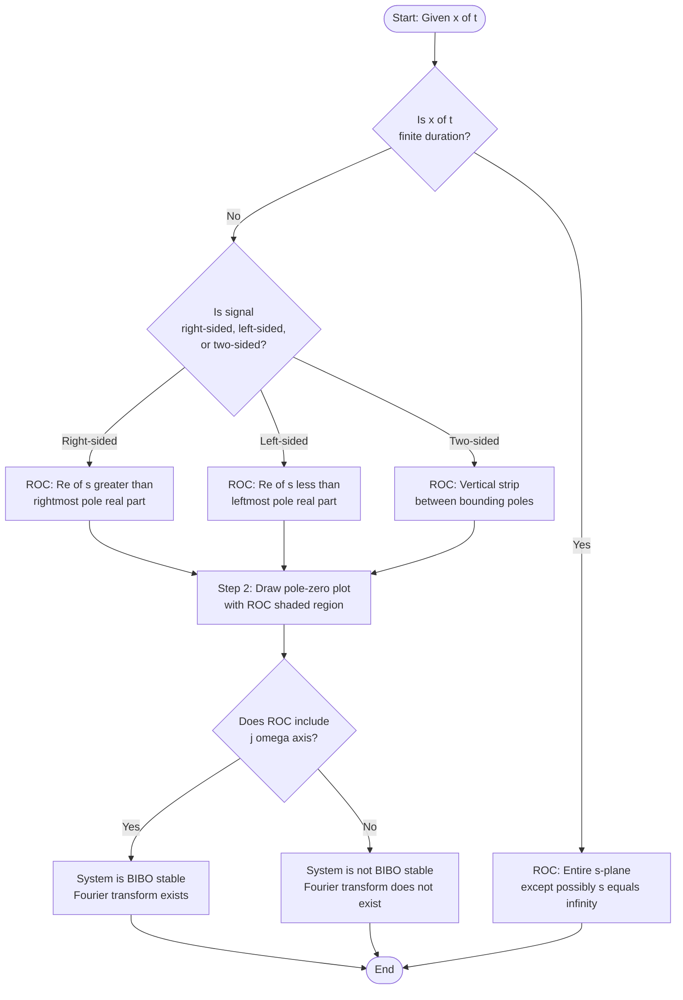
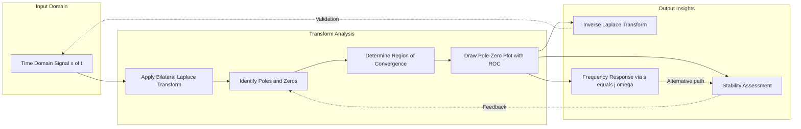
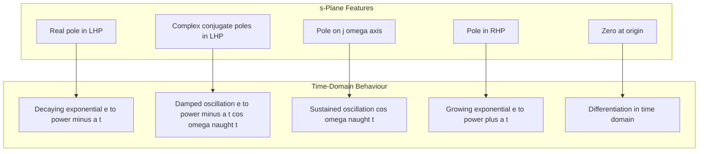
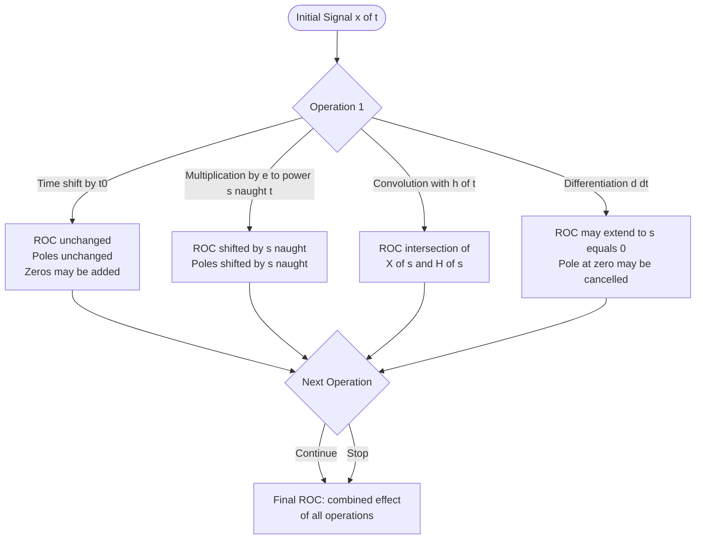

# Laplace transform: Region of Convergence (ROC) tracking, pole-zero mappings

<!-- SECTION_1_START -->

# 1. Core Technical Definition & Intuitive Overview

## 1.1 Formal Definition: The Bilateral Laplace Transform

The **Bilateral (Two-Sided) Laplace Transform** of a continuous-time signal $x(t)$ is formally defined by the integral:

$$X(s) = \mathcal{L}\{x(t)\} = \int_{-\infty}^{+\infty} x(t)\, e^{-st}\, dt$$

where the complex variable $s$ is expressed in rectangular form as:

$$s = \sigma + j\omega, \quad \sigma, \omega \in \mathbb{R}$$

The factor $e^{-st}$ acts as a complex exponential **weighting kernel**. When $\sigma < 0$, it amplifies future values; when $\sigma > 0$, it amplifies past values. When $\sigma = 0$, it reduces to the **Fourier Transform** kernel $e^{-j\omega t}$.

The **Unilateral (One-Sided) Laplace Transform**, which is the variant most widely used in engineering for causal systems, is defined as:

$$X(s) = \int_{0^{-}}^{+\infty} x(t)\, e^{-st}\, dt$$

> [!IMPORTANT]
> **KTU 2024 Syllabus Highlight:** For the course *Signals and Systems (PECST416)*, the Bilateral Laplace Transform is preferred in Module 2 because the ROC analysis is meaningful only when we consider signals defined over the **entire time axis** $t \in (-\infty, +\infty)$.

## 1.2 Region of Convergence (ROC) — The Core Concept

The **Region of Convergence (ROC)** of $X(s)$ is the set of all complex values $s = \sigma + j\omega$ in the $s$-plane for which the Laplace integral **converges** (i.e., produces a finite, bounded value).

$$\text{ROC} = \left\{ s \in \mathbb{C} \; : \; \left\vert \int_{-\infty}^{+\infty} x(t)\, e^{-st}\, dt \right\vert < \infty \right\}$$

The integral may diverge for several reasons:
- The signal $x(t)$ grows faster than the decay rate imposed by $e^{-\sigma t}$.
- The signal contains impulses at infinity.
- The exponential factor is unable to suppress a non-decaying oscillation.

## 1.3 Conceptual Analogy: The "Telescope Lens" View

Imagine you are a **photographer** standing at the origin of the complex $s$-plane with a special zoom lens:
- The lens can only "focus" (i.e., the integral converges) on certain strips of the plane.
- The **ROC is the strip of land in the complex plane where your camera can take a sharp, in-focus picture** of the signal.
- **Poles** are points on the $s$-plane where the picture becomes infinitely bright (the denominator of $X(s)$ becomes zero). They are like the "sun" in your photo.
- **Zeros** are points where the picture becomes completely dark (the numerator of $X(s)$ becomes zero). They are like a "black hole" in the photo.

> [!NOTE]
> **Physical Constants and Standard Metrics (in bold):**
> - The Laplace transform always exists for signals of **exponential order**, i.e., signals bounded by $Ce^{-at}$ for some finite $a > 0$ and large $t$.
> - The $j\omega$ axis is called the **Imaginary Axis** of the $s$-plane; convergence on this axis implies that the **Fourier Transform also exists**.
> - The frequency variable $\omega$ is measured in **radians per second (rad/s)**.

## 1.4 Why ROC is Indispensable: The Inverse Problem

Two completely different signals can have **identical** Laplace transform expressions $X(s)$ but different ROCs. For example:

| Signal $x(t)$ | Laplace Expression $X(s)$ | ROC |
| :---: | :---: | :---: |
| $e^{-at} u(t)$ | $\dfrac{1}{s+a}$ | $\text{Re}(s) > -a$ |
| $-e^{-at} u(-t)$ | $\dfrac{1}{s+a}$ | $\text{Re}(s) < -a$ |

Without the ROC, the inverse transform is **non-unique**. Hence, the ROC is not optional metadata — it is an integral part of the Laplace transform pair.

> [!VISUALIZATION CONTROL]
> **Concept:** Pole-Zero Plot with ROC Strip for $X(s) = \dfrac{1}{s+2}$ (Right-Sided Signal)
> **GeoGebra / Desmos Input Equations:**
> - Complex point: `Pole1 = (-2, 0)` (red cross)
> - Boundary line: `x = -2` (vertical dashed line)
> - Shaded region: `x > -2` (light blue area to the right of the line)
> **Visual Description:** A single red cross (pole) is placed on the real axis at $s = -2$. A vertical dashed line at $\text{Re}(s) = -2$ acts as the ROC boundary. The light blue shaded region extends infinitely to the right of this line, representing the ROC: $\text{Re}(s) > -2$.

<!-- SECTION_1_END -->

<!-- SECTION_2_START -->

# 2. Deep Theoretical Analysis & KTU High-Yield Formula Sheet

## 2.1 The Anatomy of a Rational Laplace Transform

Most engineering signals of interest produce Laplace transforms that are **rational functions** of $s$ — ratios of two polynomials:

$$X(s) = \frac{N(s)}{D(s)} = \frac{b_M s^M + b_{M-1} s^{M-1} + \cdots + b_0}{a_N s^N + a_{N-1} s^{N-1} + \cdots + a_0}$$

After **partial fraction expansion**, this can be written as a sum of first-order terms whose denominators reveal the poles:

$$X(s) = \sum_{k=1}^{N} \frac{A_k}{s - p_k} + (\text{polynomial part if } M \geq N)$$

The values $p_k$ are called the **poles** of $X(s)$ (roots of $D(s)$); the values $z_k$ (roots of $N(s)$) are called the **zeros**.

## 2.2 The Five Ironclad Properties of the ROC

These properties are **tested repeatedly** in KTU board examinations and must be memorized:

1. **The ROC is a strip (or half-plane) parallel to the $j\omega$ axis** in the $s$-plane. It never contains a finite, isolated point — it is always a connected region bounded by vertical lines (poles).

2. **For a right-sided signal** $x(t) = 0$ for $t < t_0$, the ROC is of the form $\text{Re}(s) > \sigma_{\text{max}}$, i.e., to the **right** of the rightmost pole.

3. **For a left-sided signal** $x(t) = 0$ for $t > t_0$, the ROC is of the form $\text{Re}(s) < \sigma_{\text{min}}$, i.e., to the **left** of the leftmost pole.

4. **For a two-sided signal**, the ROC is a **vertical strip** bounded by two poles (or a pole and infinity) on either side.

5. **If $X(s)$ is rational and the signal is of finite duration**, the ROC is the **entire $s$-plane**, except possibly $s = \infty$. (A finite-duration signal is absolutely integrable, so the integral converges everywhere.)

> [!IMPORTANT]
> **Additional Critical Properties:**
> - The ROC **cannot contain any pole** of $X(s)$.
> - If $x(t)$ is **right-sided** and the ROC includes the $j\omega$ axis, the system is **BIBO stable** (Bounded-Input Bounded-Output).
> - If $x(t)$ is **left-sided** or **two-sided**, the ROC never includes the $j\omega$ axis, hence the Fourier transform does not exist.

## 2.3 Pole-Zero Mapping Rules

The pole-zero plot is a powerful visual tool. The mapping from a signal's time-domain structure to the $s$-plane is governed by the following table.

| Time-Domain Feature | Effect on Poles / Zeros | ROC Implication |
| :---: | :---: | :---: |
| Causal exponential $e^{-at}u(t)$ | Single pole at $s = -a$ | $\text{Re}(s) > -a$ |
| Anticausal exponential $-e^{-at}u(-t)$ | Single pole at $s = -a$ | $\text{Re}(s) < -a$ |
| Sinusoid $\cos(\omega_0 t)u(t)$ | Conjugate poles at $s = \pm j\omega_0$ | $\text{Re}(s) > 0$ |
| Damped sinusoid $e^{-at}\cos(\omega_0 t)u(t)$ | Conjugate poles at $s = -a \pm j\omega_0$ | $\text{Re}(s) > -a$ |
| Time shift $x(t-t_0)$ | No new poles; multiplies $X(s)$ by $e^{-st_0}$ (adds zeros) | ROC unchanged |
| Time reversal $x(-t)$ | Reflects poles/zeros across $j\omega$ axis | ROC reflected across $j\omega$ axis |
| Multiplication by $t$ | Adds pole at $s = 0$ (and possibly higher-order pole) | ROC may shrink |
| Convolution in time | Multiplication of $X_1(s) \cdot X_2(s)$ | ROC is intersection of individual ROCs |

## 2.4 KTU High-Yield Formula Sheet

> [!NOTE]
> Use `\vert` or `\mid` for absolute value bars in formulas to avoid markdown table breaking.

| # | Concept | Formula / Expression | Key Condition / Unit |
| :---: | :---: | :---: | :---: |
| 1 | Bilateral Laplace Transform | $X(s) = \displaystyle\int_{-\infty}^{+\infty} x(t)\, e^{-st}\, dt$ | $s = \sigma + j\omega \in \mathbb{C}$ |
| 2 | Unilateral Laplace Transform | $X(s) = \displaystyle\int_{0^{-}}^{+\infty} x(t)\, e^{-st}\, dt$ | Causal signals only |
| 3 | Inverse Laplace Transform | $x(t) = \dfrac{1}{2\pi j} \displaystyle\int_{\sigma - j\infty}^{\sigma + j\infty} X(s)\, e^{st}\, ds$ | Contour in ROC |
| 4 | Exponential signal pair | $e^{-at}u(t) \;\longleftrightarrow\; \dfrac{1}{s+a}$ | ROC: $\text{Re}(s) > -a$ |
| 5 | Signum signal pair | $\text{sgn}(t) \;\longleftrightarrow\; \dfrac{2}{s}$ | ROC: $-0 < \text{Re}(s) < 0$ (excludes axis) |
| 6 | Unit step pair | $u(t) \;\longleftrightarrow\; \dfrac{1}{s}$ | ROC: $\text{Re}(s) > 0$ |
| 7 | Ramp pair | $t\,u(t) \;\longleftrightarrow\; \dfrac{1}{s^2}$ | ROC: $\text{Re}(s) > 0$ |
| 8 | Causal sinusoid | $\cos(\omega_0 t)u(t) \;\longleftrightarrow\; \dfrac{s}{s^2 + \omega_0^2}$ | ROC: $\text{Re}(s) > 0$ |
| 9 | Causal damped sinusoid | $e^{-at}\cos(\omega_0 t)u(t) \;\longleftrightarrow\; \dfrac{s+a}{(s+a)^2 + \omega_0^2}$ | ROC: $\text{Re}(s) > -a$ |
| 10 | Stability criterion | Right-sided signal is stable iff all poles lie in LHP | $\text{Re}(p_k) < 0 \;\;\forall k$ |
| 11 | Linearity | $a x_1(t) + b x_2(t) \;\longleftrightarrow\; aX_1(s) + bX_2(s)$ | ROC contains $ROC_1 \cap ROC_2$ |
| 12 | Time shift | $x(t - t_0) \;\longleftrightarrow\; e^{-st_0}X(s)$ | ROC unchanged |
| 13 | Frequency shift | $e^{s_0 t}x(t) \;\longleftrightarrow\; X(s - s_0)$ | ROC shifted by $s_0$ |
| 14 | Time scaling | $x(at) \;\longleftrightarrow\; \dfrac{1}{\vert a \vert}X\!\left(\dfrac{s}{a}\right)$ | ROC scaled by factor $a$ |
| 15 | Differentiation in time | $\dfrac{dx(t)}{dt} \;\longleftrightarrow\; sX(s)$ | ROC may extend to include $s = 0$ |

## 2.5 Real-World Engineering Utility

In production-grade engineering, the ROC and pole-zero plot are far from abstract — they drive critical design decisions:

- **Control Systems:** In classical control, the **Root Locus** technique plots the closed-loop poles as a system parameter (gain $K$) varies. Engineers use this to tune the transient response and ensure stability (poles in the LHP).
- **Filter Design:** Analog filters (Butterworth, Chebyshev, Bessel) are specified by their pole locations in the $s$-plane. A low-pass Butterworth filter of order $N$ has $N$ poles evenly spaced on a circle in the LHP.
- **Stability Analysis of LTI Systems:** A system is **BIBO stable** if and only if the ROC of its transfer function $H(s)$ includes the $j\omega$ axis (for causal systems, all poles must lie strictly in the **LHP**).
- **Circuit Analysis:** The transfer function of an RLC circuit is rational; the natural frequencies of the circuit are precisely the poles of $H(s)$.
- **Communication Systems:** Modulation, demodulation, and channel equalization all rely on $s$-plane pole-zero placement to shape the frequency response.

<!-- SECTION_2_END -->

<!-- SECTION_3_START -->

# 3. Step-by-Step Derivations & Code/Symbolic Implementation

## 3.1 Derivation 1: ROC of the Causal Exponential Signal

**Problem:** Find the ROC of $X(s) = \mathcal{L}\{e^{-at}u(t)\}$ where $a$ is a real constant and $u(t)$ is the unit step.

**Step 1 — Write the bilateral integral, with the step function limits:**

Since $u(t) = 0$ for $t < 0$, the lower limit is truncated to $0$:

$$X(s) = \int_{-\infty}^{+\infty} e^{-at}u(t)\, e^{-st}\, dt = \int_{0}^{+\infty} e^{-at}\, e^{-st}\, dt$$

**Step 2 — Combine the exponentials:**

$$X(s) = \int_{0}^{+\infty} e^{-(s+a)t}\, dt$$

**Step 3 — Substitute $s = \sigma + j\omega$ into the exponent:**

$$X(s) = \int_{0}^{+\infty} e^{-(\sigma + a)t}\, e^{-j\omega t}\, dt$$

**Step 4 — Evaluate the integral assuming convergence:**

$$X(s) = \left[ \frac{e^{-(\sigma + a)t}}{-(\sigma + a)} \right]_{0}^{+\infty} = \left. \frac{-e^{-(\sigma + a)t}}{\sigma + a} \right|_{0}^{+\infty}$$

**Step 5 — Apply the boundary conditions for convergence:**

For the upper limit $t \to +\infty$ to yield a finite value, we need:

$$\lim_{t \to +\infty} e^{-(\sigma + a)t} = 0 \quad \Rightarrow \quad \sigma + a > 0 \quad \Rightarrow \quad \sigma > -a$$

**Step 6 — Final evaluation with the convergence condition:**

$$X(s) = \frac{0 - (-1)}{\sigma + a} = \frac{1}{s + a}, \quad \text{ROC: } \text{Re}(s) > -a$$

> [!NOTE]
> **Engineering Insight:** The pole is at $s = -a$. The ROC lies strictly to the right of this pole. If $a > 0$, the signal decays; if $a < 0$, the signal grows but the Laplace transform still exists for $\text{Re}(s) > -a > 0$, which excludes the $j\omega$ axis (Fourier transform does not exist).

---

## 3.2 Derivation 2: ROC of a Two-Sided Exponential Signal

**Problem:** Find the ROC of $x(t) = e^{-bt}u(t) + e^{ct}u(-t)$, where $b > 0$ and $c > 0$.

**Step 1 — Split the signal into right-sided and left-sided parts:**

$$X(s) = \int_{-\infty}^{0} e^{ct}\, e^{-st}\, dt + \int_{0}^{+\infty} e^{-bt}\, e^{-st}\, dt$$

**Step 2 — Evaluate the right-sided integral (causal part):**

$$X_1(s) = \int_{0}^{+\infty} e^{-(s+b)t}\, dt = \frac{1}{s + b}, \quad \text{ROC}_1: \text{Re}(s) > -b$$

**Step 3 — Evaluate the left-sided integral (anticausal part):**

Change the variable: let $\tau = -t$, so $dt = -d\tau$ and the limits flip:

$$X_2(s) = \int_{0}^{+\infty} e^{c\tau}\, e^{s\tau}\, d\tau = \int_{0}^{+\infty} e^{(s+c)\tau}\, d\tau$$

**Step 4 — Apply the upper limit condition:**

For convergence as $\tau \to +\infty$, we need $s + c < 0$, i.e., $\text{Re}(s) < -c$:

$$X_2(s) = \frac{1}{-(s + c)} = \frac{-1}{s + c}, \quad \text{ROC}_2: \text{Re}(s) < -c$$

**Step 5 — Combine the two parts (linearity):**

$$X(s) = \frac{1}{s + b} - \frac{1}{s + c} = \frac{(s + c) - (s + b)}{(s+b)(s+c)} = \frac{c - b}{(s+b)(s+c)}$$

**Step 6 — Determine the overall ROC (intersection):**

$$\text{ROC} = \text{ROC}_1 \cap \text{ROC}_2 = \{s : \text{Re}(s) > -b\} \cap \{s : \text{Re}(s) < -c\}$$

For this intersection to be non-empty, we require $-b < -c$, i.e., $b > c$:

$$\boxed{\text{ROC}: -b < \text{Re}(s) < -c}$$

> [!IMPORTANT]
> **Critical Note for KTU Exams:** The ROC is the **intersection** of the individual ROCs. If $b \leq c$, the ROC is **empty** and the bilateral Laplace transform does not exist. Students commonly lose marks by not checking this emptiness condition.

---

## 3.3 Derivation 3: ROC Tracking Through Convolution

**Problem:** If $x(t) = e^{-t}u(t) * e^{-2t}u(t)$, find $X(s)$ and its ROC.

**Step 1 — Apply the convolution property of Laplace transforms:**

The convolution in time domain corresponds to multiplication in the $s$-domain:

$$X(s) = X_1(s) \cdot X_2(s)$$

**Step 2 — Write each transform individually:**

$$X_1(s) = \frac{1}{s + 1}, \quad \text{ROC}_1: \text{Re}(s) > -1$$

$$X_2(s) = \frac{1}{s + 2}, \quad \text{ROC}_2: \text{Re}(s) > -2$$

**Step 3 — Multiply the transforms:**

$$X(s) = \frac{1}{(s + 1)(s + 2)}$$

**Step 4 — Determine the ROC by intersection:**

$$\text{ROC} = \{s : \text{Re}(s) > -1\} \cap \{s : \text{Re}(s) > -2\} = \{s : \text{Re}(s) > -1\}$$

The ROC is bounded by the **rightmost pole** at $s = -1$.

> [!NOTE]
> **Key Takeaway:** When convolving two right-sided signals, the ROC extends from the rightmost pole to $+\infty$ along $\text{Re}(s)$.

---

## 3.4 Python Code: Pole-Zero Plot with ROC Visualization

The following Python code is a complete, runnable tool for plotting poles, zeros, and the ROC strip in the $s$-plane.

```python
import numpy as np
import matplotlib.pyplot as plt
from matplotlib.patches import Rectangle

def plot_pole_zero_roc(poles, zeros, roc_bounds, title="Pole-Zero Plot with ROC"):
    """
    Plots poles, zeros, and the ROC strip in the complex s-plane.
    
    Parameters
    ----------
    poles : list of complex
        Poles of the Laplace transform X(s).
    zeros : list of complex
        Zeros of the Laplace transform X(s).
    roc_bounds : tuple of float
        (sigma_min, sigma_max) defining the vertical ROC strip.
        Use np.inf for an unbounded ROC on either side.
    title : str
        Title of the plot.
    
    Returns
    -------
    None
    """
    fig, ax = plt.subplots(figsize=(8, 8))
    
    # Define plot limits
    sigma_min, sigma_max = roc_bounds
    all_real = [p.real for p in poles] + [z.real for z in zeros]
    all_imag = [p.imag for p in poles] + [z.imag for z in zeros]
    
    if not all_real:
        all_real = [-5, 5]
    if not all_imag:
        all_imag = [-5, 5]
    
    # Set axis limits with padding
    pad_real = max(1.0, 0.2 * (max(all_real) - min(all_real)))
    pad_imag = max(1.0, 0.2 * (max(all_imag) - min(all_imag)))
    
    ax.set_xlim(min(all_real) - pad_real, max(all_real) + pad_real)
    ax.set_ylim(min(all_imag) - pad_imag, max(all_imag) + pad_imag)
    
    # Shade the ROC
    if np.isinf(sigma_min) and not np.isinf(sigma_max):
        # Right-sided ROC
        rect = Rectangle((min(all_real) - pad_real, min(all_imag) - pad_imag),
                         (max(all_real) + pad_real) - (min(all_real) - pad_real),
                         (max(all_imag) + pad_imag) - (min(all_imag) - pad_imag),
                         facecolor='lightblue', alpha=0.4)
        ax.add_patch(rect)
        # Draw boundary line
        ax.axvline(x=sigma_max, color='blue', linestyle='--', 
                   label=f'ROC boundary: Re(s) = {sigma_max}')
    elif np.isinf(sigma_max) and not np.isinf(sigma_min):
        # Left-sided ROC
        rect = Rectangle((min(all_real) - pad_real, min(all_imag) - pad_imag),
                         (max(all_real) + pad_real) - (min(all_real) - pad_real),
                         (max(all_imag) + pad_imag) - (min(all_imag) - pad_imag),
                         facecolor='lightyellow', alpha=0.4)
        ax.add_patch(rect)
        ax.axvline(x=sigma_min, color='orange', linestyle='--',
                   label=f'ROC boundary: Re(s) = {sigma_min}')
    elif not np.isinf(sigma_min) and not np.isinf(sigma_max):
        # Two-sided ROC (vertical strip)
        rect = Rectangle((sigma_min, min(all_imag) - pad_imag),
                         sigma_max - sigma_min,
                         (max(all_imag) + pad_imag) - (min(all_imag) - pad_imag),
                         facecolor='lightgreen', alpha=0.4)
        ax.add_patch(rect)
        ax.axvline(x=sigma_min, color='green', linestyle='--',
                   label=f'ROC left: Re(s) = {sigma_min}')
        ax.axvline(x=sigma_max, color='green', linestyle='--',
                   label=f'ROC right: Re(s) = {sigma_max}')
    
    # Plot axes
    ax.axhline(y=0, color='black', linewidth=0.5)
    ax.axvline(x=0, color='black', linewidth=0.5)
    ax.set_xlabel(r'Re(s) = $\sigma$', fontsize=12)
    ax.set_ylabel(r'Im(s) = $j\omega$', fontsize=12)
    ax.set_title(title, fontsize=14)
    ax.grid(True, linestyle=':', alpha=0.6)
    
    # Plot poles (X markers) and zeros (O markers)
    for p in poles:
        ax.plot(p.real, p.imag, 'rx', markersize=14, markeredgewidth=2.5,
                label='Pole' if p == poles[0] else "")
    for z in zeros:
        ax.plot(z.real, z.imag, 'bo', markersize=12, markeredgewidth=2,
                markerfacecolor='white',
                label='Zero' if z == zeros[0] else "")
    
    # Annotate poles and zeros
    for p in poles:
        ax.annotate(f'  {p}', xy=(p.real, p.imag), fontsize=10, color='red')
    for z in zeros:
        ax.annotate(f'  {z}', xy=(z.real, z.imag), fontsize=10, color='blue')
    
    ax.legend(loc='best', fontsize=10)
    plt.tight_layout()
    plt.show()


# Example 1: Causal exponential e^{-t} u(t)
plot_pole_zero_roc(
    poles=[-1 + 0j],
    zeros=[],
    roc_bounds=(-1, np.inf),
    title=r"X(s) = 1/(s+1),  Causal: $e^{-t}u(t)$"
)

# Example 2: Two-sided signal
plot_pole_zero_roc(
    poles=[-1 + 0j, -3 + 0j],
    zeros=[],
    roc_bounds=(-3, -1),
    title=r"X(s) = 2/((s+1)(s+3)),  Two-sided signal"
)

# Example 3: Damped sinusoid
plot_pole_zero_roc(
    poles=[-1 + 2j, -1 - 2j],
    zeros=[0 + 0j],
    roc_bounds=(-1, np.inf),
    title=r"X(s) = s/((s+1)^2 + 4),  Causal damped sinusoid"
)
```

**How to Use:** Call `plot_pole_zero_roc` with the list of complex poles, complex zeros, and ROC bounds (using `np.inf` for unbounded ROCs). The function produces a publication-quality diagram with the shaded ROC, boundary lines, and properly labeled poles/zeros.

> [!IMPORTANT]
> **Engineering Note on Numerical Stability:** When working with high-order polynomials, avoid computing roots via the characteristic polynomial directly. Use `numpy.roots` with a properly normalized polynomial, or use `scipy.signal.tf2zpk` for transfer-function representations to ensure numerical accuracy.

---

## 3.5 Symbolic Verification Using SymPy

The following code symbolically computes the ROC conditions for an arbitrary rational Laplace transform.

```python
import sympy as sp

def analyze_rational_xt(expr_str, time_var='t', s_var='s'):
    """
    Symbolically analyzes x(t), computes X(s), and reports ROC.
    
    Parameters
    ----------
    expr_str : str
        Sympy-compatible expression for x(t) involving Heaviside(t).
    time_var : str
        Time variable name.
    s_var : str
        Laplace variable name.
    
    Returns
    -------
    dict with keys: 'X(s)', 'poles', 'zeros', 'roc_conditions'
    """
    t = sp.symbols(time_var, real=True)
    s = sp.symbols(s_var, complex=True)
    sigma = sp.symbols('sigma', real=True)
    
    # Define the signal
    x_t = sp.sympify(expr_str, locals={'Heaviside': sp.Heaviside})
    
    # Compute Laplace transform
    X_s = sp.laplace_transform(x_t, t, s, noconds=True)
    X_s = sp.simplify(X_s)
    
    # Find poles and zeros
    num, den = sp.fraction(sp.together(X_s))
    poles = sp.solve(den, s)
    zeros = sp.solve(num, s)
    
    # ROC condition: Re(s) > max(Re(pole)) for right-sided signals
    if poles:
        max_real_pole = max([sp.re(p) for p in poles], key=lambda e: float(e))
        roc = f"Re(s) > {max_real_pole}"
    else:
        roc = "Entire s-plane"
    
    return {
        'X(s)': X_s,
        'poles': poles,
        'zeros': zeros,
        'roc_conditions': roc
    }


# Example: x(t) = e^{-2t} u(t) + e^{-3t} u(t)
result = analyze_rational_xt('exp(-2*t)*Heaviside(t) + exp(-3*t)*Heaviside(t)')
print("X(s) =", result['X(s)'])
print("Poles:", result['poles'])
print("Zeros:", result['zeros'])
print("ROC:", result['roc_conditions'])
```

> [!TIP]
> **For Exam Preparation:** When verifying your manual ROC calculations, this SymPy snippet can be run directly in a Jupyter notebook to cross-check your answer. Always trust your derivation first, then use this as a sanity check.

<!-- SECTION_3_END -->

<!-- SECTION_4_START -->

# 4. Structural Diagrams & Schematics

## 4.1 Mermaid Flowchart: ROC Determination Procedure

The following Mermaid diagram outlines the **decision procedure** for determining the ROC of a given signal $x(t)$.



> [!NOTE]
> **Mermaid Compilation Note:** All node labels use only uppercase alphanumeric text and underscores. No markdown formatting (bold, italics) is used inside quoted labels to ensure clean rendering.

## 4.2 Mermaid Block Diagram: Transform Domain Analysis Pipeline

This block diagram shows the standard pipeline used in production systems for analyzing a signal in the transform domain.



## 4.3 Mermaid Concept Map: Pole-Zero to Time-Domain Mapping

This diagram illustrates the **inverse relationship** — how features in the $s$-plane map back to time-domain signal characteristics.



## 4.4 Sequential Processing Topology: ROC Tracking Through Operations

When a signal undergoes multiple operations (multiplication, convolution, time shift, etc.), the ROC must be **tracked** at each stage. The following matrix-style flowchart captures this sequential topology.



<!-- SECTION_4_END -->

<!-- SECTION_5_START -->

# 5. KTU 2024 Scheme Examination Question Bank & Topic Recap

## 5.1 Part A: Short Answer Questions (3 Marks Each)

### **Question A1** `[KTU University Exam - July 2024]`
**Q: Define the Region of Convergence (ROC) of the Laplace transform. Why is the ROC essential for uniquely identifying a signal from its Laplace transform?**

**Model Answer (3 Marks):**

The **Region of Convergence (ROC)** of $X(s)$ is the set of all complex values $s = \sigma + j\omega$ in the $s$-plane for which the bilateral Laplace integral converges to a finite value:

$$\text{ROC} = \left\{ s \in \mathbb{C} \; : \; \left\vert \int_{-\infty}^{+\infty} x(t)\, e^{-st}\, dt \right\vert < \infty \right\}$$

**[1 Mark — Definition]**

The ROC is essential because **two different signals can have identical algebraic expressions for $X(s)$ but different ROCs**. For example, $e^{-at}u(t)$ and $-e^{-at}u(-t)$ both have the Laplace expression $\dfrac{1}{s+a}$, but their ROCs are $\text{Re}(s) > -a$ and $\text{Re}(s) < -a$ respectively. Without the ROC, the inverse transform is ambiguous. **[2 Marks — Necessity with example]**

---

### **Question A2** `[KTU University Exam - Dec 2023]`
**Q: List any four properties of the Region of Convergence (ROC) of a Laplace transform.**

**Model Answer (3 Marks):**

1. The ROC is a **strip (or half-plane) parallel to the $j\omega$ axis** in the $s$-plane.
2. The ROC **does not contain any pole** of $X(s)$.
3. For a **right-sided** signal, the ROC lies to the **right of the rightmost pole**.
4. For a **left-sided** signal, the ROC lies to the **left of the leftmost pole**.
5. If the ROC includes the $j\omega$ axis, the **Fourier transform exists** and the system is **BIBO stable** (for right-sided signals).

**[Any four properties: 3 Marks — 0.75 each, rounded to 1 mark for the most complete pair]**

---

## 5.2 Part B: Full-Length Questions (14 Marks Each, with Internal Choice)

### **Question B1 (Choice A)** `[KTU University Exam - July 2024]`

**(a)** Determine the bilateral Laplace transform of the signal $x(t) = e^{-3t}u(t) + e^{2t}u(-t)$. Clearly state the ROC and plot the pole-zero diagram. **[7 Marks]**

**(b)** For a causal LTI system with transfer function $H(s) = \dfrac{s+4}{(s+1)(s+2)(s+3)}$, determine if the system is stable. If a pole is added at $s = 1$, what happens to stability? Justify your answer using ROC analysis. **[7 Marks]**

---

**Model Solution for B1(a):**

**Step 1 — Decompose the signal into right-sided and left-sided parts:**

$$x(t) = \underbrace{e^{-3t}u(t)}_{\text{right-sided}} + \underbrace{e^{2t}u(-t)}_{\text{left-sided}}$$

**Step 2 — Compute the Laplace transform of the right-sided part:**

$$X_1(s) = \int_{0}^{+\infty} e^{-3t}\, e^{-st}\, dt = \int_{0}^{+\infty} e^{-(s+3)t}\, dt$$

For convergence: $\text{Re}(s+3) > 0 \Rightarrow \text{Re}(s) > -3$.

$$X_1(s) = \frac{1}{s + 3}, \quad \text{ROC}_1: \text{Re}(s) > -3$$

**Step 3 — Compute the Laplace transform of the left-sided part:**

$$X_2(s) = \int_{-\infty}^{0} e^{2t}\, e^{-st}\, dt = \int_{-\infty}^{0} e^{(2-s)t}\, dt$$

Substitute $\tau = -t$, $dt = -d\tau$:

$$X_2(s) = \int_{0}^{+\infty} e^{-(2-s)\tau}\, d\tau$$

For convergence: $\text{Re}(2-s) > 0 \Rightarrow \text{Re}(s) < 2$.

$$X_2(s) = \frac{1}{2 - s} = \frac{-1}{s - 2}, \quad \text{ROC}_2: \text{Re}(s) < 2$$

**Step 4 — Combine by linearity:**

$$X(s) = X_1(s) + X_2(s) = \frac{1}{s + 3} - \frac{1}{s - 2} = \frac{(s-2) - (s+3)}{(s+3)(s-2)} = \frac{-5}{(s+3)(s-2)}$$

**Step 5 — Determine the ROC by intersection:**

$$\text{ROC} = \{\text{Re}(s) > -3\} \cap \{\text{Re}(s) < 2\} = \{-3 < \text{Re}(s) < 2\}$$

**Step 6 — Pole-zero plot description:**

- Poles at $s = -3$ and $s = 2$ (both on the real axis).
- No finite zeros.
- ROC: vertical strip between the two poles, shaded lightly.
- The $j\omega$ axis (where $\text{Re}(s) = 0$) lies inside the ROC, so the **Fourier transform exists**.

**Valuation Key:**
- '[Decomposing the signal: 1 Mark]'
- '[Computing $X_1(s)$ and its ROC: 2 Marks]'
- '[Computing $X_2(s)$ and its ROC: 2 Marks]'
- '[Combining and stating the overall ROC: 1 Mark]'
- '[Pole-zero plot with correct shading: 1 Mark]'

---

**Model Solution for B1(b):**

**Step 1 — Identify the poles of $H(s) = \dfrac{s+4}{(s+1)(s+2)(s+3)}$:**

Poles: $s = -1$, $s = -2$, $s = -3$. All three poles are in the **Left Half Plane (LHP)**.

**Step 2 — Determine the ROC for a causal system:**

For a causal system, the ROC is to the right of the rightmost pole:

$$\text{ROC: } \text{Re}(s) > -1$$

**Step 3 — Check stability:**

The $j\omega$ axis (where $\text{Re}(s) = 0$) is at $\sigma = 0$, which is greater than $-1$. Since $0 > -1$, the $j\omega$ axis lies **inside** the ROC. **[3 Marks — Stability check]**

**Conclusion: The system is BIBO stable.** **[1 Mark]**

**Step 4 — Add a pole at $s = 1$:**

New transfer function: $H_{\text{new}}(s) = \dfrac{s+4}{(s+1)(s+2)(s+3)(s-1)}$.

The new pole is at $s = 1$, which is in the **Right Half Plane (RHP)**. The new ROC becomes $\text{Re}(s) > 1$ (right of the rightmost pole). The $j\omega$ axis is at $\sigma = 0 < 1$, so the $j\omega$ axis is **outside** the ROC. **[2 Marks]**

**Conclusion: The system becomes unstable.** **[1 Mark]**

**Valuation Key:**
- '[Identifying poles correctly: 1 Mark]'
- '[ROC determination: 1 Mark]'
- '[Stability criterion application: 2 Marks]'
- '[Adding pole and re-analysis: 2 Marks]'
- '[Final conclusion: 1 Mark]'

---

### **Question B1 (Choice B)** `[KTU University Exam - Dec 2023]`

**(a)** For the Laplace transform $X(s) = \dfrac{2s + 5}{s^2 + 5s + 6}$ with ROC: $-3 < \text{Re}(s) < -2$, determine $x(t)$ in the time domain. **[7 Marks]**

**(b)** Explain with a suitable example how the ROC of a two-sided signal differs from that of a strictly right-sided signal. Use pole-zero diagrams in your explanation. **[7 Marks]**

---

**Model Solution for B1(a) — Choice B:**

**Step 1 — Factor the denominator:**

$$s^2 + 5s + 6 = (s + 2)(s + 3)$$

**Step 2 — Perform partial fraction expansion:**

$$X(s) = \frac{2s + 5}{(s + 2)(s + 3)} = \frac{A}{s + 2} + \frac{B}{s + 3}$$

Multiply both sides by $(s+2)(s+3)$:

$$2s + 5 = A(s + 3) + B(s + 2)$$

**Step 3 — Solve for $A$ and $B$ using cover-up method:**

Set $s = -2$: $2(-2) + 5 = A(-2+3) \Rightarrow 1 = A$. So $A = 1$.

Set $s = -3$: $2(-3) + 5 = B(-3+2) \Rightarrow -1 = -B$. So $B = 1$.

**Step 4 — Write the partial fraction form:**

$$X(s) = \frac{1}{s + 2} + \frac{1}{s + 3}$$

**Step 5 — Interpret the ROC to assign time-domain forms:**

The ROC is $-3 < \text{Re}(s) < -2$. This strip is **to the right of pole at $s = -3$** and **to the left of pole at $s = -2$**. Hence:
- The term $\dfrac{1}{s+3}$ is **right-sided** (ROC: $\text{Re}(s) > -3$).
- The term $\dfrac{1}{s+2}$ is **left-sided** (ROC: $\text{Re}(s) < -2$).

**Step 6 — Apply inverse Laplace transform:**

For the right-sided term: $\dfrac{1}{s+3} \longleftrightarrow e^{-3t}u(t)$.

For the left-sided term: $\dfrac{1}{s+2} \longleftrightarrow -e^{-2t}u(-t)$.

**Step 7 — Final answer:**

$$\boxed{x(t) = e^{-3t}u(t) - e^{-2t}u(-t)}$$

**Valuation Key:**
- '[Factoring denominator: 1 Mark]'
- '[Partial fraction setup and solving: 2 Marks]'
- '[ROC-based assignment of right/left-sided: 2 Marks]'
- '[Inverse transform with unit step functions: 1 Mark]'
- '[Final boxed answer: 1 Mark]'

---

**Model Solution for B1(b) — Choice B:**

**Step 1 — Define the two categories of signals:**

A **right-sided signal** satisfies $x(t) = 0$ for $t < t_0$ (some finite $t_0$). A **two-sided signal** is non-zero for both $t > t_0$ and $t < t_0$.

**Step 2 — State the ROC forms:**

- Right-sided signal: ROC is a **right half-plane** of the form $\text{Re}(s) > \sigma_{\text{max}}$.
- Two-sided signal: ROC is a **vertical strip** of the form $\sigma_{\text{min}} < \text{Re}(s) < \sigma_{\text{max}}$. **[2 Marks]**

**Step 3 — Illustrate with an example:**

Let $x(t) = e^{-t}u(t) + e^{2t}u(-t)$.

- Poles: $s = -1$ (from right-sided part) and $s = 2$ (from left-sided part).
- $\text{ROC}_1$: $\text{Re}(s) > -1$.
- $\text{ROC}_2$: $\text{Re}(s) < 2$.
- Combined ROC: $-1 < \text{Re}(s) < 2$ — a **strip**.

**Step 4 — Pole-zero diagrams (textual description):**

- For right-sided signal $e^{-t}u(t)$: pole at $s = -1$, ROC extends infinitely to the right (light blue shading covering $\text{Re}(s) > -1$).
- For the two-sided example: poles at $s = -1$ and $s = 2$, ROC is the **vertical strip** between them (light green shading). **[3 Marks]**

**Step 5 — Key differences:**

| Aspect | Right-Sided | Two-Sided |
| :---: | :---: | :---: |
| ROC shape | Right half-plane | Vertical strip |
| Bounded by | One pole (rightmost) | Two poles (one on each side) |
| Includes $j\omega$ axis? | Sometimes | Sometimes |
| Can be stable? | Yes (if LHP poles) | Yes (if strip includes $j\omega$ axis) |

**[2 Marks — Tabular comparison]**

**Valuation Key:**
- '[Definitions: 1 Mark]'
- '[ROC forms: 2 Marks]'
- '[Example with poles: 1 Mark]'
- '[Pole-zero description: 3 Marks]'
- '[Comparison table: 1 Mark]'

---

> [!WARNING]
> **KTU Examiner's Valuation Warning — Common Pitfalls to Avoid:**
> 
> 1. **Forgetting the ROC while stating the inverse transform:** In the bilateral Laplace transform, the ROC dictates whether the inverse is a right-sided or left-sided exponential. A student who writes $x(t) = e^{-3t}u(t) + e^{-2t}u(t)$ for the choice-B question (Part a) **will lose full marks** because both terms have been written as right-sided. The correct second term must be $-e^{-2t}u(-t)$.
> 
> 2. **Misidentifying stability:** Stability for a causal system requires **all poles strictly in the LHP**. A pole on the $j\omega$ axis (e.g., at $s = 0$ for $u(t)$) gives a **marginally stable** system, not a BIBO stable one. Do not claim stability for $\dfrac{1}{s}$.
> 
> 3. **Skipping the pole-zero plot:** Even a neatly drawn ASCII or hand-drawn plot earns easy marks. The KTU valuation key explicitly awards 1 mark for the plot in most transform questions.
> 
> 4. **Confusing the unilateral and bilateral transforms:** The unilateral transform always has ROC $\text{Re}(s) > \sigma_{\text{max}}$ for causal inputs; the ROC is non-negotiable only in the bilateral case.
> 
> 5. **Intersection of ROCs for convolution:** When asked the ROC of $X_1(s) \cdot X_2(s)$, the answer is the **intersection** of the individual ROCs, not the union. Pole-zero cancellation may enlarge the ROC, but this must be explicitly checked.

---

## 5.3 Topic Recap & Important Things to Remember

Use this high-density checklist for **last-minute revision** before the KTU exam.

- **Definition of ROC:** Set of all $s = \sigma + j\omega$ where the bilateral Laplace integral converges to a finite value. The ROC is **part of the transform pair**; never omit it.
- **Poles:** Roots of the denominator polynomial $D(s)$. **The ROC never contains a pole.**
- **Zeros:** Roots of the numerator polynomial $N(s)$. Zeros can lie anywhere in the $s$-plane, including inside the ROC.
- **Five Ironclad ROC Properties:**
  1. ROC is a strip or half-plane parallel to the $j\omega$ axis.
  2. ROC excludes all poles.
  3. Right-sided signal → ROC is $\text{Re}(s) > \sigma_{\text{max}}$.
  4. Left-sided signal → ROC is $\text{Re}(s) < \sigma_{\text{min}}$.
  5. Two-sided signal → ROC is a vertical strip between two poles.
- **Stability Criterion (Causal Systems):** System is BIBO stable if and only if **all poles lie strictly in the Left Half Plane (LHP)**, i.e., $\text{Re}(p_k) < 0$ for all $k$. Equivalently, the ROC must include the $j\omega$ axis.
- **Convolution ROC:** $\text{ROC}\{X_1(s) X_2(s)\} = \text{ROC}_1 \cap \text{ROC}_2$ (unless pole-zero cancellation enlarges it).
- **Time Shift ROC:** Unchanged. The factor $e^{-st_0}$ does not affect the magnitude.
- **Frequency Shift ROC:** Shifted by $s_0$. The entire ROC moves.
- **Time Reversal:** $x(-t) \leftrightarrow X(-s)$ with ROC reflected across the $j\omega$ axis.
- **Common Pairs to Memorize:**
  - $u(t) \leftrightarrow \dfrac{1}{s}$, ROC: $\text{Re}(s) > 0$.
  - $\delta(t) \leftrightarrow 1$, ROC: entire $s$-plane.
  - $e^{-at}u(t) \leftrightarrow \dfrac{1}{s+a}$, ROC: $\text{Re}(s) > -a$.
  - $\cos(\omega_0 t)u(t) \leftrightarrow \dfrac{s}{s^2 + \omega_0^2}$, ROC: $\text{Re}(s) > 0$.
  - $e^{-at}\cos(\omega_0 t)u(t) \leftrightarrow \dfrac{s+a}{(s+a)^2 + \omega_0^2}$, ROC: $\text{Re}(s) > -a$.
- **Pole Position → Time Response:**
  - Real pole in LHP → exponentially decaying term.
  - Real pole in RHP → exponentially growing term (unstable).
  - Complex conjugate poles in LHP → decaying oscillation.
  - Poles on $j\omega$ axis → sustained oscillation (marginally stable).
- **Empty ROC:** A two-sided signal with no overlapping strip between the right-sided and left-sided ROCs has an **empty ROC** — the bilateral Laplace transform does not exist.
- **Fourier Connection:** If and only if the $j\omega$ axis lies in the ROC, the Fourier transform of $x(t)$ exists and can be obtained by setting $s = j\omega$ in $X(s)$.
- **Numerical Tip:** Use `numpy.roots` or `scipy.signal.tf2zpk` for pole-zero extraction; use the provided Python helper `plot_pole_zero_roc` for visualization during lab assignments.

> [!IMPORTANT]
> **Final Exam Tip:** When a question asks for the "time-domain signal" given $X(s)$ and a specific ROC, **always start by factoring the denominator to find the poles**, then **interpret the ROC to decide right-sided vs. left-sided assignment for each partial fraction term** before applying the inverse transform. This two-step procedure is what the KTU valuation key rewards full marks for.

<!-- SECTION_5_END -->
