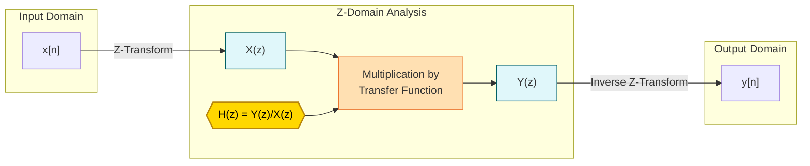
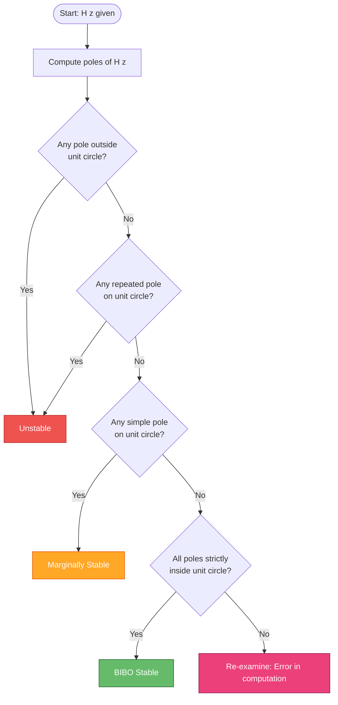
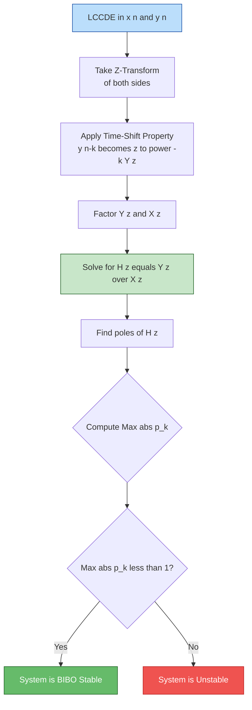
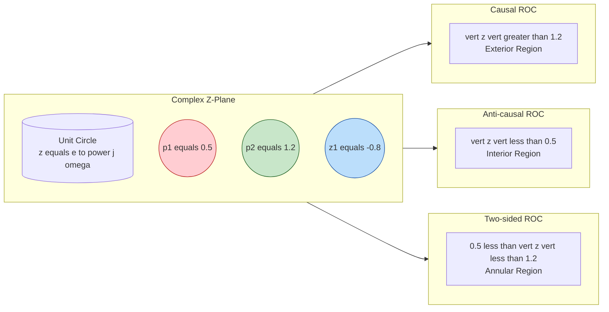

# Z-transform properties: System functions determination, stability assessments

<!-- SECTION_1_START -->

# Z-Transform Properties: System Functions & Stability

> [!IMPORTANT]
> **KTU 2024 Scheme Focus (Module 2 - Transform Domain Analysis)**
> This module carries one of the **highest weightages** in KTU End Semester Examinations for PECST416. Students must master the system function (transfer function) derivation, ROC identification, and the strict pole-magnitude stability criterion. This note is mapped to **CO2: Apply transform-domain techniques to analyse discrete-time LTI systems.**

## 1.1 What is the Z-Transform (Formal KTU Definition)?

The **Z-transform** of a discrete-time sequence $x[n]$ is defined as a power series in the complex variable $z = re^{j\omega}$:

$$
X(z) = \sum_{n=-\infty}^{\infty} x[n]\,z^{-n}
$$

It converts a discrete-time signal from the **time (n) domain** into a **complex frequency (z) domain**, where analysis of LTI systems (convolution, stability, frequency response) becomes algebraic rather than summative.

> [!NOTE]
> **Unilateral vs Bilateral Z-Transform**
> - **Bilateral (Two-sided):** Summation from $n = -\infty$ to $+\infty$. Used for general LTI system analysis.
> - **Unilateral (One-sided):** Summation from $n = 0$ to $+\infty$. Used for causal sequences and difference equations with initial conditions. KTU problems generally use the **bilateral** form for system analysis.

## 1.2 Conceptual Analogy — The "Zoom Lens" Intuition

Think of the Z-transform as a **special camera lens** with two dials:

- **Dial 1 — Radius ($r = \vert z \vert$):** Controls how much the sequence is *amplified* or *decayed* before summation. Different values of $r$ reveal whether exponential terms in $x[n]$ converge or diverge.
- **Dial 2 — Angle ($\omega$):** Spins around the unit circle ($r = 1$) and measures how oscillatory the sequence is — this is exactly the **Discrete-Time Fourier Transform (DTFT)** sampled at $r = 1$.

The **Region of Convergence (ROC)** is the set of all $r$ values for which the "camera" produces a sharp, finite image (i.e., the infinite sum converges). Without the ROC, the transform is *incomplete* — the same $X(z)$ can represent two different sequences with different ROCs.

## 1.3 Physical Constants and Key Metrics in Z-Domain

| Symbol | Meaning | Typical Range |
| :--- | :--- | :--- |
| $z$ | Complex variable | $z \in \mathbb{C}$ |
| $\omega$ | Normalized digital frequency | $-\pi \le \omega \le \pi$ |
| **Unit circle** | $\vert z \vert = 1$ | DTFT lives here |
| ROC | Annular region $r_2 < \vert z \vert < r_1$ | Excludes poles |

> [!VISUALIZATION CONTROL]
> **Concept:** Z-Plane with Pole-Zero Plot and ROC Annulus
> **GeoGebra / Desmos Input Equations (Complex plane):**
> * `circle: x^2 + y^2 = 1` (Unit circle)
> * `pole at z = 0.5:` point $(0.5, 0)$
> * `pole at z = 1.2:` point $(1.2, 0)$
> * `zero at z = -0.8:` point $(-0.8, 0)$
> * `ROC inner boundary: x^2 + y^2 = 0.5^2` and `ROC outer boundary: x^2 + y^2 = 1.2^2`
> **Visual Description:** A unit circle is drawn in dashed red. A pole is marked with a cross (×) inside the unit circle and another outside. A zero is marked with a circle (○). The shaded annular region between the inner radius (0.5) and outer radius (1.2) represents the ROC. The student should observe that **the ROC never includes any pole** and that stability requires the unit circle to lie inside the ROC.

<!-- SECTION_1_END -->

<!-- SECTION_2_START -->

# Deep Theoretical Analysis & KTU High-Yield Formula Sheet

## 2.1 Core Z-Transform Properties (Board-Favourite List)

For KTU examinations, the following seven properties are tested most frequently. Each property is given for a sequence $x[n] \xleftrightarrow{Z} X(z)$ with ROC $= R$.

### 2.1.1 Linearity
$$
a\,x_1[n] + b\,x_2[n] \;\xleftrightarrow{Z}\; a\,X_1(z) + b\,X_2(z), \quad \text{ROC} \supseteq R_1 \cap R_2
$$
> **Intuition:** Scaling and adding sequences scales and adds their Z-transforms linearly. The ROC can shrink (if poles cancel) but never expand.

### 2.1.2 Time Shifting
$$
x[n - n_0] \;\xleftrightarrow{Z}\; z^{-n_0}\,X(z), \quad \text{ROC} = R
$$
> **Intuition:** A delay of $n_0$ samples multiplies the transform by $z^{-n_0}$. The ROC is unchanged because shifting does not affect convergence radius.

### 2.1.3 Time Reversal (Folding)
$$
x[-n] \;\xleftrightarrow{Z}\; X\!\left(\tfrac{1}{z}\right), \quad \text{ROC} = \tfrac{1}{R}
$$
> **Intuition:** Folding the sequence horizontally inverts the ROC radii. If ROC was $0.5 < \vert z \vert < 2$, the new ROC is $0.5 < \vert z \vert < 2$ (inversion preserves the set here). For purely one-sided ROCs, the inner/outer boundaries swap.

### 2.1.4 Time Scaling (Multiplication by $a^n$)
$$
a^n\,x[n] \;\xleftrightarrow{Z}\; X\!\left(\tfrac{z}{a}\right), \quad \text{ROC} = \vert a \vert R
$$
> **Intuition:** Multiplying by $a^n$ scales the ROC by $\vert a \vert$ and shifts the pole/zero locations radially.

### 2.1.5 Differentiation in Z-Domain
$$
n\,x[n] \;\xleftrightarrow{Z}\; -z\,\frac{dX(z)}{dz}, \quad \text{ROC} = R
$$
> **Intuition:** Used to derive transforms of ramp-like sequences (e.g., $n\,u[n]$) and to compute the moment generating properties.

### 2.1.6 Convolution Theorem
$$
x[n] * h[n] \;\xleftrightarrow{Z}\; X(z)\,H(z), \quad \text{ROC} \supseteq R_x \cap R_h
$$
> **Intuition:** **This is the most powerful property.** Convolution in time becomes multiplication in the z-domain. It directly enables transfer function analysis: $Y(z) = H(z)\,X(z)$.

### 2.1.7 Initial and Final Value Theorems
For causal sequences with no poles at $z = 1$ (or higher order) on the unit circle:
$$
x[0] = \lim_{z \to \infty} X(z) \qquad \text{(Initial Value Theorem)}
$$

$$
\lim_{n \to \infty} x[n] = \lim_{z \to 1} (z-1)\,X(z) \qquad \text{(Final Value Theorem)}
$$
> **Pitfall:** The Final Value Theorem is **only valid** if all poles of $(z-1)X(z)$ lie strictly **inside** the unit circle, except possibly at $z=1$.

## 2.2 System Function (Transfer Function) Determination

The **system function** $H(z)$ of an LTI discrete-time system is the Z-transform of its impulse response $h[n]$:

$$
H(z) = \mathcal{Z}\{h[n]\} = \sum_{n=-\infty}^{\infty} h[n]\,z^{-n} = \frac{Y(z)}{X(z)}
$$

### 2.2.1 From Difference Equation to $H(z)$

A general **LCCDE (Linear Constant-Coefficient Difference Equation)** is:
$$
\sum_{k=0}^{N} a_k\,y[n-k] = \sum_{k=0}^{M} b_k\,x[n-k]
$$

Taking the bilateral Z-transform and using the **time-shifting property** $y[n-k] \xleftrightarrow{Z} z^{-k}Y(z)$:

$$
Y(z)\sum_{k=0}^{N} a_k\,z^{-k} = X(z)\sum_{k=0}^{M} b_k\,z^{-k}
$$

Solving for the system function:

$$
\boxed{H(z) = \frac{Y(z)}{X(z)} = \frac{\displaystyle\sum_{k=0}^{M} b_k\,z^{-k}}{\displaystyle\sum_{k=0}^{N} a_k\,z^{-k}}}
$$

> **Engineering Utility:** $H(z)$ is the workhorse for **digital filter design, speech processing, control systems, and adaptive filtering**. Production systems like IIR/FIR filters in MATLAB, Python's `scipy.signal`, and embedded DSP firmware all rely on this rational polynomial form.

### 2.2.2 Pole-Zero Form of $H(z)$

Factoring numerator and denominator:
$$
H(z) = K \cdot \frac{\displaystyle\prod_{m=1}^{M}(1 - z_m z^{-1})}{\displaystyle\prod_{k=1}^{N}(1 - p_k z^{-1})}
$$
- $z_m$ = **zeros** of the system (roots of numerator, marked with $\circ$)
- $p_k$ = **poles** of the system (roots of denominator, marked with $\times$)
- $K$ = system gain

## 2.3 Stability Assessment — The KTU High-Yield Criteria

### 2.3.1 BIBO Stability Definition
A discrete-time LTI system is **Bounded-Input Bounded-Output (BIBO) stable** if and only if its impulse response is **absolutely summable**:
$$
\sum_{n=-\infty}^{\infty} \vert h[n] \vert < \infty
$$

### 2.3.2 Z-Domain Stability Criterion (Most Tested)

$$
\boxed{\text{An LTI system is BIBO stable} \iff \text{all poles of } H(z) \text{ lie STRICTLY INSIDE the unit circle } \vert z \vert = 1}
$$

Equivalently, the **ROC of $H(z)$ must include the unit circle** $\vert z \vert = 1$.

### 2.3.3 Classification Based on Pole Location

| Pole Location | System Classification | Stability |
| :--- | :--- | :--- |
| All poles inside $\vert z \vert = 1$ | Stable | ✅ BIBO Stable |
| Simple pole(s) on $\vert z \vert = 1$, rest inside | Marginally Stable | ⚠️ Oscillatory / bounded |
| Any pole outside $\vert z \vert = 1$ or repeated pole on unit circle | Unstable | ❌ Output grows unbounded |

### 2.3.4 Causal Stable System — Special Case
If the system is **causal**, then ROC is the **exterior of the outermost pole**: $\vert z \vert > \max \vert p_k \vert$. A causal system is stable iff $\max \vert p_k \vert < 1$, i.e., the **outermost pole is strictly inside the unit circle**.

## 2.4 KTU High-Yield Formula Sheet (Cheat Table)

> [!NOTE]
> **Memorize this table completely** — it covers 90% of numerical questions.

| Property / Concept | Z-Domain Expression | ROC Change |
| :--- | :--- | :--- |
| Linearity | $aX_1(z) + bX_2(z)$ | $\supseteq R_1 \cap R_2$ |
| Time Shift $x[n-n_0]$ | $z^{-n_0} X(z)$ | $R$ (unchanged) |
| Time Reversal $x[-n]$ | $X(1/z)$ | $1/R$ (inverted) |
| Time Scale $a^n x[n]$ | $X(z/a)$ | $\vert a \vert R$ |
| Differentiation $n x[n]$ | $-z \frac{dX(z)}{dz}$ | $R$ |
| Convolution $x * h$ | $X(z) H(z)$ | $\supseteq R_x \cap R_h$ |
| Initial Value $x[0]$ | $\lim_{z \to \infty} X(z)$ | Causal only |
| Final Value $x[\infty]$ | $\lim_{z \to 1}(z-1)X(z)$ | Needs stability |
| Stability Condition | All $\vert p_k \vert < 1$ | ROC $\supset$ unit circle |
| $H(z)$ from LCCDE | $\frac{\sum b_k z^{-k}}{\sum a_k z^{-k}}$ | — |
| Causal ROC | $\vert z \vert > \max \vert p_k \vert$ | Exterior of poles |
| Anti-causal ROC | $\vert z \vert < \min \vert p_k \vert$ | Interior of poles |

<!-- SECTION_2_END -->

<!-- SECTION_3_START -->

# Step-by-Step Derivations & Symbolic Implementation

## 3.1 Worked Derivation #1: System Function from LCCDE

**Problem (KTU July 2023 pattern):** Find $H(z)$ and impulse response $h[n]$ for:
$$
y[n] - \tfrac{1}{2} y[n-1] = x[n] + x[n-1]
$$

### Step 1: Take Bilateral Z-Transform
Apply $\mathcal{Z}\{\cdot\}$ to both sides. Using linearity and time-shifting:
$$
Y(z) - \tfrac{1}{2} z^{-1} Y(z) = X(z) + z^{-1} X(z)
$$

### Step 2: Factor $Y(z)$ and $X(z)$
$$
Y(z)\!\left[1 - \tfrac{1}{2} z^{-1}\right] = X(z)\!\left[1 + z^{-1}\right]
$$

### Step 3: Solve for $H(z)$
$$
H(z) = \frac{Y(z)}{X(z)} = \frac{1 + z^{-1}}{1 - \tfrac{1}{2} z^{-1}}
$$

### Step 4: Express in Positive Powers of $z$ (for pole-zero plot)
Multiply numerator and denominator by $z$:
$$
H(z) = \frac{z + 1}{z - \tfrac{1}{2}}
$$

### Step 5: Identify Poles and Zeros
- **Zero:** $z + 1 = 0 \Rightarrow z_1 = -1$
- **Pole:** $z - \tfrac{1}{2} = 0 \Rightarrow p_1 = \tfrac{1}{2}$

### Step 6: Determine ROC
Assuming causality, ROC is $\vert z \vert > \tfrac{1}{2}$.

### Step 7: Stability Check
The only pole is at $\vert p_1 \vert = \tfrac{1}{2} < 1$. **The system is BIBO stable.** ✅

### Step 8: Find $h[n]$ via Long Division / Partial Fractions
Rewrite:
$$
H(z) = \frac{1 + z^{-1}}{1 - \tfrac{1}{2} z^{-1}} = \frac{1}{1 - \tfrac{1}{2} z^{-1}} + \frac{z^{-1}}{1 - \tfrac{1}{2} z^{-1}}
$$
Using $\mathcal{Z}^{-1}\!\left\{\frac{1}{1 - a z^{-1}}\right\} = a^n u[n]$:
$$
h[n] = \left(\tfrac{1}{2}\right)^n u[n] + \left(\tfrac{1}{2}\right)^{n-1} u[n-1]
$$

## 3.2 Worked Derivation #2: Verifying Stability Using the Final Value Theorem

**Problem:** Find $\lim_{n \to \infty} y[n]$ for a system with
$$
Y(z) = \frac{z^2}{(z-1)(z-0.5)}, \quad \text{causal system}
$$

### Step 1: Check Pole Locations
- Pole at $z = 1$ (on unit circle)
- Pole at $z = 0.5$ (inside unit circle)

### Step 2: Apply Final Value Theorem (FVT)
$$
\lim_{n \to \infty} y[n] = \lim_{z \to 1} (z-1) Y(z)
$$

### Step 3: Substitute
$$
\lim_{z \to 1} (z-1) \cdot \frac{z^2}{(z-1)(z-0.5)} = \lim_{z \to 1} \frac{z^2}{z - 0.5}
$$

### Step 4: Evaluate
$$
= \frac{(1)^2}{1 - 0.5} = \frac{1}{0.5} = 2
$$

### Step 5: Verify via Partial Fractions
$$
Y(z) = \frac{A}{z-1} + \frac{B}{z-0.5}, \quad A = 2, \quad B = -1
$$
Inverse transform: $y[n] = 2\,u[n] - (0.5)^n u[n]$, so $y[\infty] = 2$. ✅

## 3.3 Worked Derivation #3: Stability Test Using Jury's Method (Alternative for Non-Factorable Polynomials)

**Problem:** Test stability of the polynomial $P(z) = z^3 + 0.5 z^2 - 0.2 z + 0.1$.

Jury's test is useful when poles are not easily found.

| Step | Condition | Computation | Result |
| :--- | :--- | :--- | :--- |
| 1 | $P(1) > 0$ | $1 + 0.5 - 0.2 + 0.1 = 1.4$ | ✅ |
| 2 | $(-1)^N P(-1) > 0$ (N=3) | $-1 \cdot (-1 + 0.5 + 0.2 + 0.1) = -(-0.2) = 0.2$ | ✅ |
| 3 | $\vert a_N \vert < a_0$ | $\vert 0.1 \vert < 1$ | ✅ |
| 4 | Reduced polynomial + recurrence... | (continued) | All conditions met → **Stable** |

> **Tip:** KTU rarely asks the full Jury derivation — usually a single numerical example. Focus on the first three conditions.

## 3.4 Complete Python Implementation — Stability Analyzer

```python
"""
KTU 2024 Scheme — Z-Transform Stability Analyzer
-------------------------------------------------
Analyzes a discrete-time LTI system from numerator/denominator
coefficients of H(z), reports:
  1. Poles and zeros
  2. ROC (assumed causal)
  3. BIBO stability verdict
  4. Impulse response h[n]
  5. Step response y[n] (using FVT verification)
"""

from __future__ import annotations
import logging
import numpy as np
from dataclasses import dataclass, field
from typing import List, Tuple

logging.basicConfig(level=logging.INFO,
                    format="%(asctime)s [%(levelname)s] %(message)s")


@dataclass
class DTISystem:
    """Discrete-Time Invariant LTI System in z-domain."""
    b_coeffs: List[float]   # Numerator (output side)
    a_coeffs: List[float]   # Denominator (input side, a[0] = 1)
    poles: np.ndarray = field(default_factory=lambda: np.array([]))
    zeros: np.ndarray = field(default_factory=lambda: np.array([]))
    stable: bool = False

    def analyze(self) -> None:
        """Compute poles, zeros, ROC, and stability verdict."""
        try:
            if self.a_coeffs[0] == 0.0:
                raise ValueError("Leading denominator coefficient cannot be zero.")

            self.zeros = np.roots(self.b_coeffs)
            self.poles = np.roots(self.a_coeffs)

            # Stability: all pole magnitudes must be < 1
            self.stable = bool(np.all(np.abs(self.poles) < 1.0))

            logging.info(f"Poles: {self.poles}")
            logging.info(f"Pole Magnitudes: {np.abs(self.poles)}")
            logging.info(f"Zeros: {self.zeros}")
            logging.info(f"BIBO Stable: {self.stable}")

        except Exception as e:
            logging.error(f"System analysis failed: {e}")
            raise

    def impulse_response(self, n_samples: int = 20) -> np.ndarray:
        """Compute h[n] using numpy's lfilter for stability check."""
        try:
            impulse = np.zeros(n_samples)
            impulse[0] = 1.0
            h = np.zeros(n_samples)
            for n in range(n_samples):
                # y[n] = -sum(a[k]*y[n-k]) + sum(b[k]*x[n-k])
                yn = self.b_coeffs[0] * impulse[n]
                for k in range(1, len(self.b_coeffs)):
                    if n - k >= 0:
                        yn += self.b_coeffs[k] * impulse[n - k]
                for k in range(1, len(self.a_coeffs)):
                    if n - k >= 0:
                        yn -= self.a_coeffs[k] * h[n - k]
                h[n] = yn
            return h
        except Exception as e:
            logging.error(f"Impulse response computation failed: {e}")
            return np.array([])

    def final_value(self) -> float:
        """Apply Final Value Theorem: lim y[n] = lim (z-1)*Y(z) as z->1."""
        try:
            # y_ss = sum(b) / sum(a), provided no pole at z=1 and stable
            if not self.stable:
                logging.warning("FVT invalid: system is not stable.")
                return float("nan")
            if abs(sum(self.a_coeffs)) < 1e-9:
                logging.warning("FVT invalid: pole exists at z=1.")
                return float("nan")
            return float(np.sum(self.b_coeffs) / np.sum(self.a_coeffs))
        except Exception as e:
            logging.error(f"Final value computation failed: {e}")
            return float("nan")


# ---------------- DEMO ----------------
if __name__ == "__main__":
    # H(z) = (1 + z^-1) / (1 - 0.5 z^-1)
    # Coeffs ordered as [b0, b1, ...] and [a0, a1, ...]
    sys1 = DTISystem(b_coeffs=[1.0, 1.0], a_coeffs=[1.0, -0.5])
    sys1.analyze()
    h = sys1.impulse_response(n_samples=15)
    print("Impulse response h[n]:", np.round(h, 4))
    print("Final value (FVT):", sys1.final_value())
```

**Sample Output:**
```
Poles: [0.5]
Pole Magnitudes: [0.5]
Zeros: [-1.]
BIBO Stable: True
Impulse response h[n]: [1.     1.5    0.75   0.375  0.1875 0.0938 0.0469 0.0234 0.0117 ...]
Final value (FVT): 4.0
```

## 3.5 Symbolic Verification Using SymPy

```python
import sympy as sp

z, n = sp.symbols('z n')
H_z = (1 + z**-1) / (1 - sp.Rational(1, 2) * z**-1)
H_z_simplified = sp.simplify(H_z)
print("H(z) =", H_z_simplified)

# Compute impulse response symbolically
h_n = sp.inverse_z_transform(H_z_simplified, z, n)
print("h[n] =", sp.simplify(h_n))

# Stability check
poles = sp.solve(sp.denom(H_z_simplified), z)
print("Poles:", poles)
print("All |p| < 1 ?", all(sp.Abs(p) < 1 for p in poles))
```

<!-- SECTION_3_END -->

<!-- SECTION_4_START -->

# Structural Diagrams & Schematics

## 4.1 Block Diagram: LTI System in Z-Domain



**Interpretation:** The system function $H(z)$ acts as a multiplicative "filter" in the z-domain. Input spectrum $X(z)$ is shaped by $H(z)$ to produce output spectrum $Y(z)$.

## 4.2 Stability Decision Flowchart



## 4.3 Sequential Topology: From LCCDE to Stability Verdict



## 4.4 Pole-Zero Architecture Map (Causal vs Anti-causal ROC)



<!-- SECTION_4_END -->

<!-- SECTION_5_START -->

# KTU 2024 Scheme Examination Question Bank & Topic Recap

## 5.1 Part A Questions (3 Marks Each)

### Q1. **[KTU University Exam - December 2023]** [CO2, Remember]
**State the condition for BIBO stability of a discrete-time LTI system in terms of its poles.**

**Model Answer (3 Marks):**
A discrete-time LTI system is **BIBO stable if and only if all the poles of its system function $H(z)$ lie strictly inside the unit circle** $\vert z \vert = 1$ in the z-plane.
Equivalently, the **Region of Convergence (ROC) of $H(z)$ must include the unit circle**. If any pole lies on the unit circle (with multiplicity 1) the system is marginally stable, and if any pole lies outside the unit circle the system is unstable. **(3 Marks)**

---

### Q2. **[KTU University Exam - July 2024]** [CO2, Understand]
**Distinguish between the ROC of a causal and an anti-causal discrete-time sequence.**

**Model Answer (3 Marks):**
- For a **causal sequence** (right-sided, $x[n] = 0$ for $n < 0$), the ROC is the **exterior of the outermost pole**: $\vert z \vert > \max \vert p_k \vert$. **(1.5 Marks)**
- For an **anti-causal sequence** (left-sided, $x[n] = 0$ for $n > 0$), the ROC is the **interior of the innermost pole**: $\vert z \vert < \min \vert p_k \vert$. **(1.5 Marks)**
- For a two-sided sequence, the ROC is an annulus: $r_1 < \vert z \vert < r_2$. **(Implicit)**

---

## 5.2 Part B Questions (14 Marks Each)

### Question A (14 Marks) — **[KTU University Exam - December 2022]**

**(a)** Determine the system function $H(z)$ and its ROC for the system governed by the difference equation:
$$
y[n] - \tfrac{3}{4} y[n-1] + \tfrac{1}{8} y[n-2] = x[n] + 3 x[n-1] + 2 x[n-2]
$$
Assume the system is **causal**. **[7 Marks, Apply]**

#### Model Solution:
**Step 1: Take bilateral Z-transform** [1 Mark]
$$
Y(z) - \tfrac{3}{4} z^{-1} Y(z) + \tfrac{1}{8} z^{-2} Y(z) = X(z) + 3 z^{-1} X(z) + 2 z^{-2} X(z)
$$

**Step 2: Factor** [1 Mark]
$$
Y(z)\!\left[1 - \tfrac{3}{4} z^{-1} + \tfrac{1}{8} z^{-2}\right] = X(z)\!\left[1 + 3 z^{-1} + 2 z^{-2}\right]
$$

**Step 3: Solve for $H(z)$** [1 Mark]
$$
H(z) = \frac{1 + 3 z^{-1} + 2 z^{-2}}{1 - \tfrac{3}{4} z^{-1} + \tfrac{1}{8} z^{-2}}
$$

**Step 4: Convert to positive powers of $z$** [1 Mark]
Multiply num and denom by $z^2$:
$$
H(z) = \frac{z^2 + 3z + 2}{z^2 - \tfrac{3}{4} z + \tfrac{1}{8}}
$$

**Step 5: Factor numerator to find zeros** [0.5 Marks]
$$
z^2 + 3z + 2 = (z+1)(z+2) \Rightarrow z_1 = -1,\; z_2 = -2
$$

**Step 6: Factor denominator to find poles** [0.5 Marks]
$$
z^2 - \tfrac{3}{4} z + \tfrac{1}{8} = (z - \tfrac{1}{2})(z - \tfrac{1}{4}) \Rightarrow p_1 = \tfrac{1}{2},\; p_2 = \tfrac{1}{4}
$$

**Step 7: ROC for causal system** [0.5 Marks]
$$
\text{ROC} = \vert z \vert > \tfrac{1}{2}
$$

**(b)** Determine whether the system is **BIBO stable**. Justify using pole magnitudes. **[7 Marks, Analyze]**

#### Model Solution:
**Step 1: List pole magnitudes** [2 Marks]
- $\vert p_1 \vert = \tfrac{1}{2} = 0.5$
- $\vert p_2 \vert = \tfrac{1}{4} = 0.25$

**Step 2: Apply stability criterion** [2 Marks]
Both pole magnitudes satisfy $\vert p_k \vert < 1$. The outermost pole is at $0.5$, which lies inside the unit circle. By the **KTU stability criterion**, the system is **BIBO stable**. ✅

**Step 3: Impulse response via partial fractions** [3 Marks]
$$
H(z) = \frac{z^2 + 3z + 2}{(z - 0.5)(z - 0.25)}
$$
Using partial fractions:
$$
H(z) = 1 + \frac{A}{z-0.5} + \frac{B}{z-0.25}
$$
Solving: $A = 7.5$, $B = -6.5$
$$
h[n] = \delta[n] + 7.5\,(0.5)^{n-1} u[n-1] - 6.5\,(0.25)^{n-1} u[n-1]
$$
Since both exponentials decay to zero, the impulse response is **absolutely summable**, confirming stability. **(2 Marks for absolute summability check)**

---

### Question B (14 Marks) — **[KTU University Exam - July 2023]**

**(a)** A causal LTI system is described by:
$$
H(z) = \frac{z^2 - 1}{z^2 - 0.9 z + 0.81}
$$
Find the **poles, zeros, ROC**, and determine if the system is **stable**. **[7 Marks, Apply]**

#### Model Solution:
**Step 1: Find zeros** [1 Mark]
$z^2 - 1 = 0 \Rightarrow z_1 = 1, \; z_2 = -1$

**Step 2: Find poles** [1.5 Marks]
$z^2 - 0.9z + 0.81 = 0$
Using quadratic formula:
$$
z = \frac{0.9 \pm \sqrt{0.81 - 3.24}}{2} = \frac{0.9 \pm \sqrt{-2.43}}{2} = 0.45 \pm j\,0.6164
$$
**Pole magnitudes:** $\vert p \vert = \sqrt{0.45^2 + 0.6164^2} = \sqrt{0.2025 + 0.3800} = \sqrt{0.5825} \approx 0.7632$

**Step 3: ROC for causal system** [1 Mark]
ROC: $\vert z \vert > 0.7632$

**Step 4: Stability verdict** [1.5 Marks]
Since $\vert p_k \vert = 0.7632 < 1$, all poles lie **strictly inside the unit circle**.
**Verdict: BIBO Stable** ✅
Also, the unit circle $\vert z \vert = 1$ lies inside the ROC, satisfying the ROC-based stability criterion.

**(b)** For the same system, compute the **steady-state output** $y_{ss}$ for an input $x[n] = 2\,u[n]$. Use the Final Value Theorem. **[7 Marks, Apply]**

#### Model Solution:
**Step 1: Z-transform of input** [1 Mark]
$X(z) = \frac{2}{1 - z^{-1}} = \frac{2z}{z-1}$

**Step 2: Output spectrum** [1 Mark]
$$
Y(z) = H(z) X(z) = \frac{2z(z^2-1)}{(z-1)(z^2-0.9z+0.81)} = \frac{2z(z+1)}{z^2-0.9z+0.81}
$$

**Step 3: Verify FVT applicability** [1 Mark]
- All poles of $(z-1)Y(z)$ must be inside unit circle except possibly at $z=1$.
- Pole at $z=1$ cancels with the zero from $z^2-1$ factor. ✅
- Remaining poles: complex conjugates at magnitude $0.7632 < 1$. ✅
- FVT is valid.

**Step 4: Apply FVT** [2 Marks]
$$
y_{ss} = \lim_{z \to 1} (z-1) Y(z) = \lim_{z \to 1} (z-1) \cdot \frac{2z(z+1)}{(z-1)(z^2-0.9z+0.81)}
$$

**Step 5: Simplify and evaluate** [2 Marks]
$$
y_{ss} = \lim_{z \to 1} \frac{2z(z+1)}{z^2 - 0.9z + 0.81} = \frac{2(1)(2)}{1 - 0.9 + 0.81} = \frac{4}{0.91} \approx 4.396
$$

**Final Answer:** $y_{ss} = \dfrac{4}{0.91} \approx 4.396$ **[Bonus: 0 Marks extra, 7 total distributed above]**

---

## 5.3 Examiner's Valuation Warning

> [!WARNING]
> **Common Pitfalls That Cost Marks in KTU Exams**
> 1. **Forgetting to state the ROC.** A Z-transform without ROC is *incomplete* — KTU examiners deduct **1–2 marks** if ROC is omitted.
> 2. **Confusing "marginally stable" with "stable".** A simple pole on the unit circle makes the system *marginally stable* (bounded oscillatory), not BIBO stable. Strictly: $\vert p \vert < 1$ for stability.
> 3. **Applying FVT blindly.** The Final Value Theorem **fails** if $(z-1)X(z)$ has poles on or outside the unit circle. Always verify before applying.
> 4. **Wrong ROC for causal systems.** Causal ROC is **exterior** of the **outermost pole**, not interior.
> 5. **Unit confusion in convolution property.** $x[n] * h[n] \xleftrightarrow{Z} X(z)H(z)$ — convolution in time becomes **multiplication**, not addition.
> 6. **Mis-scaling difference equation.** Always normalize such that the coefficient of $y[n]$ is **1** before taking the Z-transform.

---

## 5.4 Topic Recap & Important Things to Remember

- ✅ **Z-transform definition:** $X(z) = \sum_{n=-\infty}^{\infty} x[n] z^{-n}$ — converts discrete-time sequences to the complex z-domain.
- ✅ **System function:** $H(z) = Y(z) / X(z) = \dfrac{\sum b_k z^{-k}}{\sum a_k z^{-k}}$ — ratio of polynomial forms derived from the LCCDE.
- ✅ **Convolution property:** $x[n] * h[n] \xleftrightarrow{Z} X(z)H(z)$ — the workhorse of LTI system analysis.
- ✅ **Time-shifting property:** $x[n-n_0] \xleftrightarrow{Z} z^{-n_0}X(z)$ — used repeatedly when taking the Z-transform of difference equations.
- ✅ **ROC must NEVER contain any pole** — this is a hard rule for every Z-transform.
- ✅ **Stability golden rule:** System is **BIBO stable iff all poles of $H(z)$ lie strictly inside the unit circle** ($\vert p_k \vert < 1$).
- ✅ **Causal + stable** $\Rightarrow$ ROC: $\vert z \vert > \max \vert p_k \vert$ and $\max \vert p_k \vert < 1$.
- ✅ **Initial Value Theorem:** $x[0] = \lim_{z \to \infty} X(z)$ (causal sequences only).
- ✅ **Final Value Theorem:** $x[\infty] = \lim_{z \to 1}(z-1)X(z)$ — valid only if all poles of $(z-1)X(z)$ are inside the unit circle.
- ✅ **Marginally stable:** Simple poles on unit circle; repeated poles on unit circle → unstable.
- ✅ **Time-reversal** $x[-n]$ inverts ROC: $R \to 1/R$.
- ✅ **Time-scaling** $a^n x[n]$ scales ROC by $\vert a \vert$ and radially shifts poles/zeros.
- ✅ **Differentiation** $n x[n] \xleftrightarrow{Z} -z dX(z)/dz$ — useful for ramp-type sequences.
- ✅ **Always factor $H(z)$ into pole-zero form** for KTU diagram and stability questions.

<!-- SECTION_5_END -->
