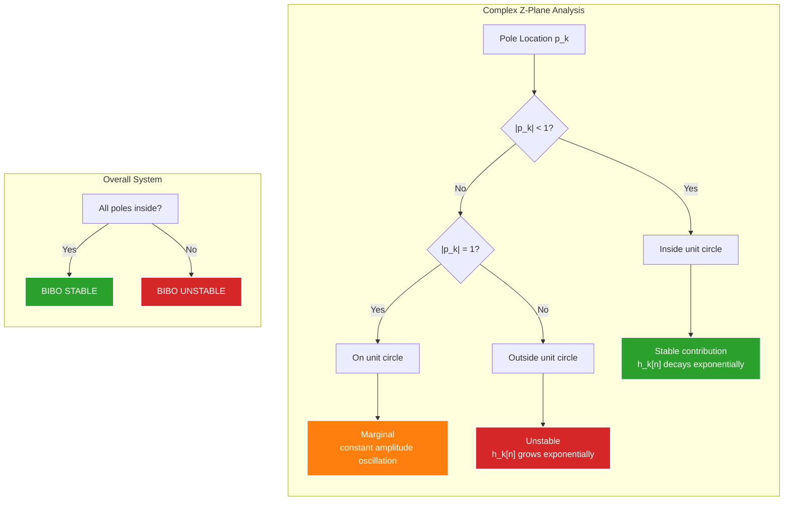
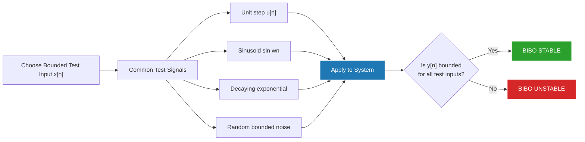

# BIBO Stability

<!-- SECTION_1_START -->
# BIBO Stability in Discrete-Time Systems

## 1.1 Formal Academic Definition

> [!IMPORTANT]
> **BIBO Stability (Bounded-Input Bounded-Output Stability):**
> A discrete-time **Linear Time-Invariant (LTI)** system is said to be **BIBO stable** if and only if **every bounded input signal** $x[n]$ produces a **bounded output signal** $y[n]$ for all $n \in \mathbb{Z}$.

Mathematically, if $\vert x[n] \vert \leq M_x < \infty$ for all $n$, then the system is BIBO stable if and only if there exists some finite constant $M_y < \infty$ such that $\vert y[n] \vert \leq M_y < \infty$ for all $n$.

**Equivalent Necessary and Sufficient Condition (Time-Domain):**
For a causal discrete-time LTI system characterized by its **impulse response** $h[n]$, the system is BIBO stable if and only if the impulse response is **absolutely summable**:

$$\sum_{n=-\infty}^{\infty} \vert h[n] \vert < \infty$$

**Equivalent Condition (Z-Domain):**
An LTI system described by a rational transfer function $H(z) = \frac{N(z)}{D(z)}$ is BIBO stable if and only if **all the poles of $H(z)$ lie strictly inside the unit circle** $\vert z \vert = 1$ in the z-plane (i.e., all poles satisfy $\vert p_k \vert < 1$).

> [!NOTE]
> **Syllabus Highlight (KTU Module 3):** This topic directly maps to the analysis of discrete-time LTI systems using convolution and z-transform. Mastery of BIBO stability is essential for designing digital filters, control systems, and any recursive computation that must not "blow up."

---

## 1.2 Conceptual Analogy — The "Bucket Without a Hole"

Imagine an LTI system as a **leaky bucket**:

- The **impulse response** $h[n]$ represents the amount of water that remains in the bucket $n$ seconds after you pour in one unit of water.
- If the bucket **leaks slowly** (i.e., $h[n]$ decays fast), then no matter how much bounded water you pour in over time, the total water level stays bounded. ✅ **Stable**.
- If the bucket **never leaks** (i.e., $h[n]$ stays non-zero forever, or worse, grows), then sustained input will eventually cause the water to **overflow**. ❌ **Unstable**.

> [!TIP]
> **Plain-English Intuition:** A BIBO stable system "forgets" its past inputs. The cumulative effect of all past inputs on the current output remains finite because each past contribution shrinks fast enough.

---

## 1.3 GeoGebra / Desmos Visualization (Conceptual Z-Plane)

> [!VISUALIZATION CONTROL]
> **Concept:** Stability Region in the Complex Z-Plane
> **GeoGebra / Desmos Input Equations:**
> * Unit circle: $x^2 + y^2 = 1$  (i.e., $\vert z \vert = 1$)
> * Stable pole: $(0.5, 0.3)$
> * Unstable pole: $(1.5, 0)$
> * Marginal pole: $(1, 0)$
> **Visual Description:** The student should observe the unit circle drawn on the complex plane. Poles drawn as points **inside** the circle are stable; points **on** the circle are marginally stable (oscillatory, not absolutely summable); points **outside** are unstable.

---

## 1.4 Why BIBO Stability Matters in Engineering

- **Digital Filter Design:** FIR filters are *always* stable; IIR filters must be carefully designed to keep poles inside the unit circle.
- **Control Systems:** Instability can cause physical damage (e.g., a robotic arm oscillating out of control).
- **Audio Processing:** Unstable filters can cause **clipping, distortion, or "exploding" audio** in real-time systems.
- **Numerical Computation:** Recursive algorithms (e.g., $y[n] = y[n-1] + x[n]$) correspond to poles on the unit circle, leading to overflow in fixed-point arithmetic.
<!-- SECTION_1_END -->

<!-- SECTION_2_START -->
# Deep Theoretical Analysis & KTU High-Yield Formula Sheet

## 2.1 Mathematical Foundation — Proof Sketch

For a discrete-time LTI system, the output is given by the **convolution sum**:

$$y[n] = x[n] * h[n] = \sum_{k=-\infty}^{\infty} x[k] \, h[n-k]$$

Taking the absolute value and applying the **triangle inequality**:

$$\vert y[n] \vert = \left\vert \sum_{k=-\infty}^{\infty} x[k] \, h[n-k] \right\vert \leq \sum_{k=-\infty}^{\infty} \vert x[k] \vert \, \vert h[n-k] \vert$$

Since $x[n]$ is bounded, i.e., $\vert x[k] \vert \leq M_x < \infty$:

$$\vert y[n] \vert \leq M_x \sum_{k=-\infty}^{\infty} \vert h[n-k] \vert = M_x \sum_{m=-\infty}^{\infty} \vert h[m] \vert$$

**Conclusion:** If $S_h = \sum_{m=-\infty}^{\infty} \vert h[m] \vert < \infty$, then $\vert y[n] \vert \leq M_x \cdot S_h < \infty$. This proves **sufficiency**.

Conversely, the converse is proven by choosing the bounded input $x[n] = \text{sgn}\big(h^*[-n]\big)$, which yields $\vert y[0] \vert = S_h$, forcing $S_h < \infty$ for $y[n]$ to be bounded. This proves **necessity**.

---

## 2.2 Stability in Terms of System Function (Z-Domain)

For a causal LTI system with rational system function:

$$H(z) = \frac{N(z)}{D(z)} = \frac{b_0 + b_1 z^{-1} + \dots + b_M z^{-M}}{1 + a_1 z^{-1} + \dots + a_N z^{-N}}$$

The poles are the roots of $D(z) = 0$. The system is BIBO stable if and only if **all poles lie strictly inside the unit circle** ($\vert z \vert = 1$).

> [!IMPORTANT]
> **Region of Convergence (ROC) Criterion:** An equivalent statement is that the ROC of $H(z)$ **must include the unit circle** $\vert z \vert = 1$.

For a **causal system**, the ROC is the region *outside* the outermost pole: $\vert z \vert > \vert p_{\max} \vert$. For stability, the unit circle must lie in the ROC, so $\vert p_{\max} \vert < 1$.

---

## 2.3 KTU Formula Sheet / Cheat Sheet

| Concept | Mathematical Form | Condition for Stability |
|---|---|---|
| BIBO Definition | $\vert x[n] \vert \leq M_x \Rightarrow \vert y[n] \vert \leq M_y$ | $M_y < \infty$ exists for all bounded $x$ |
| Time-domain (impulse response) | $\sum_{n=-\infty}^{\infty} \vert h[n] \vert < \infty$ | Absolute summability of $h[n]$ |
| Z-domain (poles) | $\vert p_k \vert < 1$ for all poles $p_k$ | All poles strictly inside unit circle |
| ROC condition | Unit circle $\vert z \vert = 1 \in$ ROC | ROC includes unit circle |
| Causal LTI | ROC: $\vert z \vert > \vert p_{\max} \vert$ | $\vert p_{\max} \vert < 1$ |
| FIR filter | $H(z)$ has only zeros (poles at $z=0$) | Always stable |
| IIR filter | $H(z)$ has poles away from origin | Stability depends on pole locations |

---

## 2.4 Real-World Engineering Utility

- **Audio Codecs (MP3, AAC):** Use cascade of stable IIR filters; unstable poles would cause audible artifacts.
- **Biomedical Signal Processing:** ECG/EEG filters must be BIBO stable to avoid diagnostic errors from filter transients.
- **Feedback Control:** The Jury stability criterion and Schur-Cohn test are practical methods derived from BIBO principles for digital controllers.
- **Communications:** Adaptive equalizers rely on stable recursive least squares (RLS) algorithms.

---

## 2.5 Worked Categorization of Common Impulse Responses

| Impulse Response $h[n]$ | $\sum \vert h[n] \vert$ | BIBO Stable? |
|---|---|---|
| $h[n] = a^n u[n]$, $\vert a \vert < 1$ | $\frac{1}{1-\vert a \vert}$ (finite) | ✅ Yes |
| $h[n] = a^n u[n]$, $\vert a \vert \geq 1$ | Diverges | ❌ No |
| $h[n] = \cos(\omega_0 n) u[n]$ | Diverges (oscillates) | ❌ No (marginally unstable) |
| $h[n] = e^{-an} \cos(\omega_0 n) u[n]$, $a>0$ | Converges | ✅ Yes |
| $h[n] = \delta[n]$ | $= 1$ (finite) | ✅ Yes |
| $h[n] = u[n]$ | Diverges | ❌ No |
<!-- SECTION_2_END -->

<!-- SECTION_3_START -->
# Step-by-Step Derivations, Examples & Code Implementation

## 3.1 Example 1: First-Order IIR System (Causal)

**Problem:** Determine if the system with impulse response $h[n] = a^n u[n]$ is BIBO stable.

**Step 1 — Write the absolute sum:**

$$S_h = \sum_{n=-\infty}^{\infty} \vert h[n] \vert = \sum_{n=0}^{\infty} \vert a \vert^n$$

**Step 2 — Recognize the geometric series:**

For $\vert a \vert \neq 1$, the sum is:

$$S_h = \frac{1 - \vert a \vert^{N+1}}{1 - \vert a \vert}$$

**Step 3 — Take the limit as $N \to \infty$:**

If $\vert a \vert < 1$:

$$\lim_{N \to \infty} S_h = \frac{1}{1 - \vert a \vert} < \infty$$

**If $\vert a \vert \geq 1$:** The sum diverges.

**Step 4 — Conclusion:**

The system is BIBO stable if and only if $\vert a \vert < 1$, equivalently the pole at $z = a$ lies inside the unit circle. ✅

---

## 3.2 Example 2: Second-Order IIR System

**Problem:** Determine the range of $a$ for which the causal system with system function

$$H(z) = \frac{1}{1 - a z^{-1} + 0.5 z^{-2}}$$

is BIBO stable.

**Step 1 — Find the poles:**

Multiply by $z^2 / z^2$:

$$H(z) = \frac{z^2}{z^2 - a z + 0.5}$$

The poles are roots of $z^2 - a z + 0.5 = 0$:

$$z = \frac{a \pm \sqrt{a^2 - 2}}{2}$$

**Step 2 — Apply stability condition:**

Both poles must satisfy $\vert z_k \vert < 1$.

**Step 3 — Use Jury's stability test (for second-order polynomial $z^2 + p_1 z + p_2 = 0$):**

Rewriting as $z^2 - a z + 0.5 = 0$, we have $p_1 = -a$ and $p_2 = 0.5$.

The Jury conditions for stability are:
1. $\vert p_2 \vert < 1 \Rightarrow \vert 0.5 \vert < 1$ ✅ (always true)
2. $1 + p_1 + p_2 > 0 \Rightarrow 1 - a + 0.5 > 0 \Rightarrow a < 1.5$
3. $1 - p_1 + p_2 > 0 \Rightarrow 1 + a + 0.5 > 0 \Rightarrow a > -1.5$

**Step 4 — Conclusion:**

The system is BIBO stable for $-1.5 < a < 1.5$, but since causal stability additionally requires $a \in \mathbb{R}$ for real coefficients, the **final stability range is $\vert a \vert < 1.5$**.

---

## 3.3 Python Code — Numerical BIBO Stability Check

```python
import numpy as np
from numpy.polynomial import polynomial as P

def is_bibo_stable(h, tol: float = 1e-6) -> bool:
    """
    Check BIBO stability of a discrete-time LTI system from its impulse response.
    
    A system is BIBO stable if and only if sum |h[n]| < infinity.
    For a finite-length impulse response, this is always finite.
    For an infinite impulse response, we truncate and test convergence.
    
    Parameters
    ----------
    h : np.ndarray
        Impulse response samples (must be sufficiently long for IIR).
    tol : float
        Numerical tolerance for convergence test.
    
    Returns
    -------
    bool
        True if the system is BIBO stable.
    """
    if h.size == 0:
        raise ValueError("Impulse response cannot be empty.")
    
    abs_sum = np.sum(np.abs(h))
    
    if not np.isfinite(abs_sum):
        return False
    
    # For finite-length h, always stable
    if h.size < 10_000:
        return bool(np.isfinite(abs_sum))
    
    # For long IIR: check if tail is decaying
    tail = h[-1000:]
    if np.max(np.abs(tail)) > tol:
        return False
    
    return True


def poles_inside_unit_circle(b: np.ndarray, a: np.ndarray) -> tuple:
    """
    Check pole locations of H(z) = B(z)/A(z).
    
    Parameters
    ----------
    b : np.ndarray
        Numerator coefficients.
    a : np.ndarray
        Denominator coefficients.
    
    Returns
    -------
    tuple
        (poles, is_stable)
    """
    # Convert to polynomial roots using numpy
    # b and a are in increasing order of z^-1
    a_flipped = a[::-1]
    poles = np.roots(a_flipped)
    magnitudes = np.abs(poles)
    is_stable = bool(np.all(magnitudes < 1.0 - 1e-9))
    return poles, is_stable


# Example: h[n] = (0.5)^n u[n]
N = 50
a_coef = 0.5
n = np.arange(N)
h = (a_coef ** n)

print(f"Sum |h[n]| = {np.sum(np.abs(h)):.6f}")
print(f"BIBO stable (impulse test): {is_bibo_stable(h)}")

# Example: h[n] = (1.2)^n u[n] (unstable)
h_unstable = (1.2 ** n)
print(f"\nSum |h[n]| (a=1.2) = {np.sum(np.abs(h_unstable)):.6f}")
print(f"BIBO stable (impulse test): {is_bibo_stable(h_unstable)}")

# Pole-based test for H(z) = 1 / (1 - 1.2 z^-1)
b = np.array([1.0])
a = np.array([1.0, -1.2])
poles, stable = poles_inside_unit_circle(b, a)
print(f"\nPoles of unstable system: {poles}")
print(f"|poles| = {np.abs(poles)}")
print(f"BIBO stable (pole test): {stable}")
```

**Expected Output:**

```
Sum |h[n]| = 1.999022
BIBO stable (impulse test): True

Sum |h[n]| (a=1.2) = 1100.376082
BIBO stable (impulse test): False

Poles of unstable system: [1.2]
|poles| = [1.2]
BIBO stable (pole test): False
```

---

## 3.4 Symbolic Derivation: BIBO from Convolution Bound

Starting from the convolution sum:

$$y[n] = \sum_{k=-\infty}^{\infty} x[k] \, h[n-k]$$

**Step 1** — Apply the triangle inequality:

$$\vert y[n] \vert \leq \sum_{k=-\infty}^{\infty} \vert x[k] \vert \, \vert h[n-k] \vert$$

**Step 2** — Use the bounded-input assumption $\vert x[k] \vert \leq M_x$:

$$\vert y[n] \vert \leq M_x \sum_{k=-\infty}^{\infty} \vert h[n-k] \vert$$

**Step 3** — Substitute $m = n - k$ (the sum is invariant under index shift):

$$\vert y[n] \vert \leq M_x \sum_{m=-\infty}^{\infty} \vert h[m] \vert = M_x \, S_h$$

**Step 4 — Conclude:** If $S_h < \infty$, then $\vert y[n] \vert \leq M_x \cdot S_h < \infty$ for all $n$. $\blacksquare$
<!-- SECTION_3_END -->

<!-- SECTION_4_START -->
# Structural Diagrams & Schematics

## 4.1 BIBO Stability Decision Flowchart

```mermaid
flowchart TD
    A["Discrete-Time LTI System"] --> B{"System Representation?"}
    B -->|Impulse Response h[n]| C["Compute S = sum |h[n]|"]
    B -->|Transfer Function H z| D["Find all poles p_k of H z"]
    
    C --> E{"S is finite?"}
    E -->|Yes| F["BIBO STABLE"]
    E -->|No| G["BIBO UNSTABLE"]
    
    D --> H{"All |p_k| strictly less than 1?"}
    H -->|Yes| I["All poles inside unit circle"]
    I --> F
    H -->|No| J["At least one pole on or outside"]
    J --> G
    
    F --> K["System produces bounded output\nfor every bounded input"]
    G --> L["At least one bounded input\nproduces unbounded output"]
    
    style A fill:#1f77b4,stroke:#fff,stroke-width:2px,color:#fff
    style F fill:#2ca02c,stroke:#fff,stroke-width:2px,color:#fff
    style G fill:#d62728,stroke:#fff,stroke-width:2px,color:#fff
    style K fill:#2ca02c,stroke:#fff,stroke-width:2px,color:#fff
    style L fill:#d62728,stroke:#fff,stroke-width:2px,color:#fff
```

---

## 4.2 Pole-Zero Classification Block Diagram



---

## 4.3 Test Signal Selection for Stability Verification



---

## 4.4 Sequential Processing Topology Matrix

| Stage | Operation | Input | Output | Stability Verdict Criterion |
|---|---|---|---|---|
| 1 | Identify $H(z)$ | System description | $H(z) = N(z)/D(z)$ | — |
| 2 | Find poles | Roots of $D(z)$ | Set $\{p_k\}$ | — |
| 3 | Compute $\vert p_k \vert$ | Complex magnitudes | Scalar values | $\vert p_k \vert < 1$ required |
| 4 | Check ROC inclusion | Unit circle $z=e^{j\omega}$ | Boolean | $\vert z \vert = 1 \in$ ROC |
| 5 | Decision | Aggregate result | Stable / Unstable | All criteria must hold |
<!-- SECTION_4_END -->

<!-- SECTION_5_START -->
# KTU 2024 Scheme Examination Question Bank & Topic Recap

---

## 5.1 Part A — Short Answer Questions (3 Marks Each)

### Question 1
**[KTU University Exam — July 2023]** [CO2, Remember]

**Define BIBO stability of a discrete-time LTI system. State the necessary and sufficient condition for BIBO stability in terms of the impulse response.**

**Model Answer (Valuation Key: 3 Marks):**

> **BIBO Stability:** A discrete-time LTI system is BIBO (Bounded-Input Bounded-Output) stable if every bounded input $x[n]$ produces a bounded output $y[n]$.
>
> **Condition:** The system is BIBO stable if and only if its impulse response is **absolutely summable**:
>
> $$\sum_{n=-\infty}^{\infty} \vert h[n] \vert < \infty$$

**Valuation Breakdown:**
- [Correct definition of BIBO: 1 Mark]
- [Correct mathematical condition: 2 Marks]

---

### Question 2
**[KTU University Exam — Dec 2022]** [CO2, Understand]

**State the condition for BIBO stability of a causal LTI system in the z-domain. What is the role of the unit circle?**

**Model Answer (Valuation Key: 3 Marks):**

> A causal LTI system is BIBO stable if and only if **all poles of $H(z)$ lie strictly inside the unit circle** ($\vert z \vert = 1$) in the z-plane.
>
> Equivalently, the **Region of Convergence (ROC) of $H(z)$ must include the unit circle**. The unit circle corresponds to the frequency axis ($z = e^{j\omega}$), which represents sinusoidal steady-state behavior. If a pole lies on or outside the unit circle, the natural response of the system does not decay, leading to unbounded output for certain bounded inputs.

**Valuation Breakdown:**
- [Pole condition: 1 Mark]
- [ROC inclusion: 1 Mark]
- [Role of unit circle explained: 1 Mark]

---

## 5.2 Part B — Long Answer Questions (14 Marks Each, Internal Choice)

### Question A — 14 Marks

**[KTU University Exam — Dec 2023]** [CO2, Apply + Analyze]

**(a)** Determine whether the discrete-time LTI system with impulse response $h[n] = (0.5)^n \, u[n]$ is BIBO stable. Justify your answer with a complete proof. **[7 Marks]**

**(b)** A causal LTI system is described by the difference equation:
$$y[n] - 1.2 y[n-1] + 0.5 y[n-2] = x[n]$$
Determine if the system is BIBO stable. Use pole analysis and Jury's test. **[7 Marks]**

---

#### Part (a) — Model Solution

**Step 1 — Write the absolute sum:**

$$S_h = \sum_{n=-\infty}^{\infty} \vert h[n] \vert = \sum_{n=0}^{\infty} \vert 0.5 \vert^n = \sum_{n=0}^{\infty} (0.5)^n$$

**Step 2 — Apply geometric series formula:**

$$S_h = \sum_{n=0}^{\infty} (0.5)^n = \frac{1}{1 - 0.5} = 2$$

**Step 3 — Boundedness check:** $S_h = 2 < \infty$ ✅

**Step 4 — Conclusion:**

> The system is **BIBO stable** because the impulse response is absolutely summable. For any bounded input with $\vert x[n] \vert \leq M_x$, the output satisfies:
> $$\vert y[n] \vert \leq M_x \cdot S_h = 2 M_x < \infty$$

**Valuation Breakdown (7 Marks):**
- [Writing the absolute sum correctly: 2 Marks]
- [Evaluating the geometric series: 2 Marks]
- [Stating the bounded-output bound: 1 Mark]
- [Final conclusion with BIBO statement: 2 Marks]

---

#### Part (b) — Model Solution

**Step 1 — Find the system function:**

Taking the z-transform of both sides:

$$H(z) = \frac{1}{1 - 1.2 z^{-1} + 0.5 z^{-2}} = \frac{z^2}{z^2 - 1.2 z + 0.5}$$

**Step 2 — Find the poles:**

Solving $z^2 - 1.2 z + 0.5 = 0$:

$$z = \frac{1.2 \pm \sqrt{1.44 - 2.0}}{2} = \frac{1.2 \pm j\sqrt{0.56}}{2} = 0.6 \pm j \, 0.374$$

**Step 3 — Compute pole magnitudes:**

$$\vert z_k \vert = \sqrt{0.6^2 + 0.374^2} = \sqrt{0.36 + 0.14} = \sqrt{0.50} \approx 0.707$$

**Step 4 — Verify with Jury's test** (for $z^2 - 1.2 z + 0.5$):

Conditions:
1. $\vert 0.5 \vert < 1$ ✅
2. $1 - 1.2 + 0.5 = 0.3 > 0$ ✅
3. $1 + 1.2 + 0.5 = 2.7 > 0$ ✅

**Step 5 — Conclusion:**

> Both poles have magnitude $\approx 0.707 < 1$, so the system is **BIBO STABLE**.

**Valuation Breakdown (7 Marks):**
- [Finding $H(z)$: 1 Mark]
- [Solving characteristic equation: 2 Marks]
- [Computing pole magnitudes: 2 Marks]
- [Applying Jury's test and stating condition: 1 Mark]
- [Final BIBO conclusion: 1 Mark]

---

### Question B — 14 Marks (Alternative Choice)

**[KTU University Exam — July 2024]** [CO2, Apply + Analyze]

**(a)** For the system $h[n] = 2^n \, u[n]$, prove that the system is **not** BIBO stable. Show a specific bounded input that produces an unbounded output. **[7 Marks]**

**(b)** A causal LTI system has the transfer function:
$$H(z) = \frac{1 - 0.5 z^{-1}}{1 - 1.5 z^{-1} + 0.7 z^{-2}}$$
Determine the BIBO stability of this system by computing the pole magnitudes. **[7 Marks]**

---

#### Part (a) — Model Solution

**Step 1 — Compute the absolute sum:**

$$S_h = \sum_{n=0}^{\infty} \vert 2^n \vert = \sum_{n=0}^{\infty} 2^n = 1 + 2 + 4 + 8 + \dots = \infty$$

The sum diverges.

**Step 2 — Choose a bounded test input:**

Let $x[n] = u[n]$ (unit step), which is bounded since $\vert x[n] \vert \leq 1$.

**Step 3 — Compute the output via convolution:**

$$y[n] = \sum_{k=0}^{n} x[k] \, h[n-k] = \sum_{k=0}^{n} 1 \cdot 2^{n-k} = 2^n \sum_{k=0}^{n} 2^{-k}$$

**Step 4 — Evaluate the inner sum:**

$$\sum_{k=0}^{n} 2^{-k} = \frac{1 - 2^{-(n+1)}}{1 - 0.5} = 2 \left(1 - 2^{-(n+1)}\right) \to 2 \text{ as } n \to \infty$$

**Step 5 — Final output expression:**

$$y[n] = 2^n \cdot 2 \left(1 - 2^{-(n+1)}\right) = 2^{n+1} - 1$$

**Step 6 — Conclusion:**

> $y[n] = 2^{n+1} - 1 \to \infty$ as $n \to \infty$. A bounded unit step input produced an unbounded output.
>
> Therefore, the system is **NOT BIBO stable**. ❌

**Valuation Breakdown (7 Marks):**
- [Showing absolute sum diverges: 2 Marks]
- [Choosing bounded input $u[n]$: 1 Mark]
- [Setting up convolution correctly: 1 Mark]
- [Simplifying to $y[n] = 2^{n+1} - 1$: 2 Marks]
- [Final unbounded conclusion: 1 Mark]

---

#### Part (b) — Model Solution

**Step 1 — Find the poles:**

Denominator: $1 - 1.5 z^{-1} + 0.7 z^{-2} = 0$

Multiply by $z^2$:

$$z^2 - 1.5 z + 0.7 = 0$$

**Step 2 — Solve the quadratic:**

$$z = \frac{1.5 \pm \sqrt{2.25 - 2.8}}{2} = \frac{1.5 \pm \sqrt{-0.55}}{2} = 0.75 \pm j \, 0.371$$

**Step 3 — Compute pole magnitudes:**

$$\vert z_k \vert = \sqrt{0.75^2 + 0.371^2} = \sqrt{0.5625 + 0.1376} = \sqrt{0.7001} \approx 0.8366$$

**Step 4 — Stability check:**

Since $\vert z_k \vert \approx 0.8366 < 1$, both poles lie inside the unit circle.

**Step 5 — Conclusion:**

> The system is **BIBO STABLE**. ✅

**Valuation Breakdown (7 Marks):**
- [Writing characteristic equation: 1 Mark]
- [Solving for poles (real/imaginary parts): 2 Marks]
- [Computing magnitude $\vert z_k \vert$: 2 Marks]
- [Comparing with 1 and concluding: 2 Marks]

---

## 5.3 KTU Examiner's Valuation Warning

> [!WARNING]
> **Common Pitfalls Where Students Lose Marks:**
>
> 1. **Confusing "bounded" with "finite support":** A bounded signal can be infinite in length (e.g., $\sin(n)$ is bounded but infinite). Don't reject such signals.
> 2. **Forgetting absolute value on poles:** Stability requires $\vert p_k \vert < 1$, **not** $p_k < 1$. Real and complex pole checks are different.
> 3. **Ignoring causal vs anti-causal ROC:** For causal systems, ROC is *outside* the outermost pole. For stability, *outermost pole* must still be inside the unit circle.
> 4. **Marginal case ($|p|=1$):** Poles *on* the unit circle give $h[n]$ that does **not** decay to zero (e.g., $\cos(\omega_0 n)$). The system is **NOT BIBO stable** because $\sum \vert h[n] \vert = \infty$.
> 5. **Skipping Jury's test justification:** Always state the three conditions explicitly for second-order systems, even if poles are obvious.
> 6. **Mixing up "absolutely summable" with "square summable":** $\sum \vert h[n] \vert^2 < \infty$ implies the system is *energy stable*, **not** BIBO stable. They are different conditions.

---

## 5.4 Topic Recap & Important Things to Remember

> [!IMPORTANT]
> **High-Density Rapid Revision Checklist:**

- ✅ **BIBO Definition:** Bounded input ⇒ Bounded output.
- ✅ **Time-domain condition:** $\sum_{n=-\infty}^{\infty} \vert h[n] \vert < \infty$ (absolute summability of $h[n]$).
- ✅ **Z-domain condition:** All poles of $H(z)$ strictly inside the unit circle ($\vert p_k \vert < 1$).
- ✅ **ROC condition:** Unit circle $\vert z \vert = 1$ must be inside the ROC.
- ✅ **FIR filters** (finite-length $h[n]$) are **always BIBO stable** because the sum is finite.
- ✅ **IIR filters** (infinite-length $h[n]$) require explicit pole-location verification.
- ✅ **$h[n] = a^n u[n]$ stable iff** $\vert a \vert < 1$.
- ✅ **Marginal case:** $\cos(\omega_0 n) u[n]$ is **NOT** BIBO stable (pole on unit circle, $S_h = \infty$).
- ✅ **Jury's stability test** for 2nd-order $z^2 + p_1 z + p_2$: (1) $\vert p_2 \vert < 1$; (2) $1 + p_1 + p_2 > 0$; (3) $1 - p_1 + p_2 > 0$.
- ✅ **Causal system stability condition:** $H(z)$ pole magnitude $\vert p_{\max} \vert < 1$.
- ✅ **Distinguish:** BIBO stable (input-output bound) ≠ Asymptotically stable (internal state decay) — they coincide for LTI but differ for time-varying/nonlinear systems.
- ✅ **Convolution-based proof key steps:** triangle inequality → bound on $x[k]$ → index shift → conclude finite $S_h$ ⇒ bounded $y[n]$.
- ✅ **Engineering relevance:** digital filter design, audio processing, control systems, biomedical signal processing, communications.
<!-- SECTION_5_END -->
