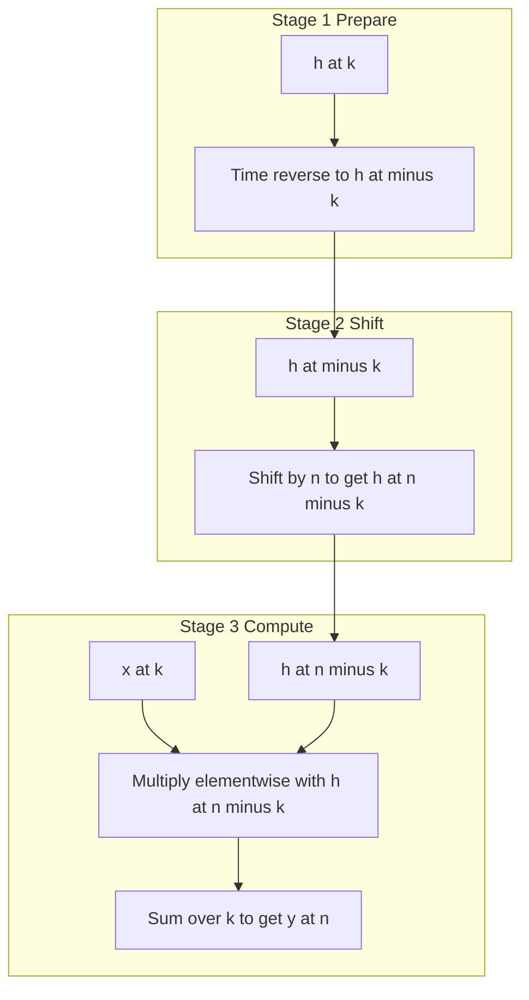
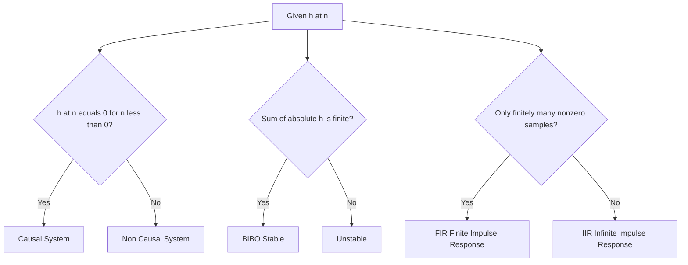
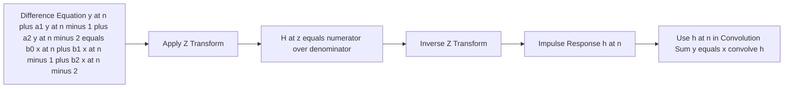
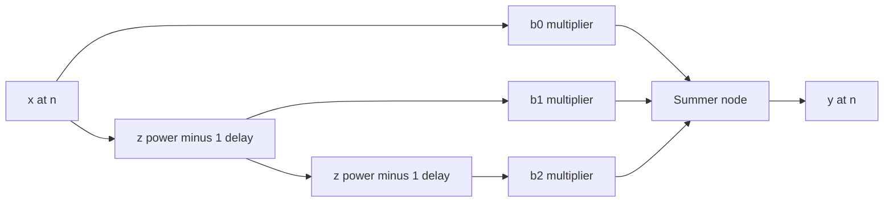
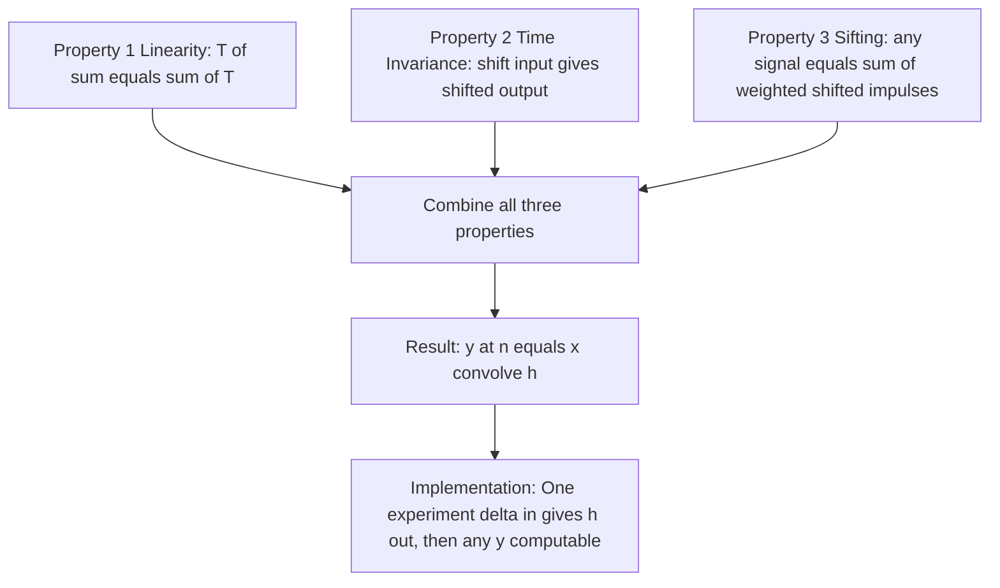

# Characterizing LTI Systems and Convolution - Impulse  response of an LTI system

<!-- SECTION_1_START -->
# Impulse Response of an LTI System — Core Technical Definition & Intuitive Overview

## Formal KTU 2024 Definition

For a **discrete-time Linear Time-Invariant (LTI) system** $T\{\cdot\}$, the **impulse response** is defined as the output sequence produced when the input is the **unit sample (impulse) sequence** $\delta[n]$.

$$h[n] \;\triangleq\; T\{\delta[n]\}$$

> [!IMPORTANT]
> **Syllabus Highlight (KTU PECST416 — Module 3):**
> The impulse response $h[n]$ is the *complete fingerprint* of a discrete-time LTI system. Once $h[n]$ is known, the output for *any* arbitrary input $x[n]$ can be computed deterministically using the **convolution sum**:
> $$y[n] = x[n] * h[n] = \sum_{k=-\infty}^{+\infty} x[k]\,h[n-k]$$
> This is a foundational result that transforms system analysis from differential/difference-equation solving into a simple algebraic operation.

## Conceptual Analogy / Intuition

Imagine an LTI system as a **black-box echo chamber**:

1. You "clap once" at time $n=0$ (this is $\delta[n]$).
2. The room "responds" with a decaying echo that lasts for several seconds (this is $h[n]$).
3. The shape of that echo — *its duration, decay rate, and amplitude pattern* — completely characterises the acoustics of that room.

Now, if you clap **twice in a row**, the room simply overlays (superposes) two time-shifted echoes. If you clap **faster or slower** (time-scaling), the echo pattern stretches or compresses predictably because the room is *time-invariant*.

> [!NOTE]
> **Key Engineering Insight:** Just as a single recording of an acoustic impulse response can be *convolved* with any sound to synthesize that room's acoustics (this is exactly how **convolution reverb** works in audio production), the discrete $h[n]$ can be convolved with *any* digital signal to predict the system's output. This is why $h[n]$ is often called the system's **transfer characteristic** in the time domain.

## Continuous-Time Companion

The continuous-time analog is defined identically:

$$h(t) \;\triangleq\; T\{\delta(t)\}, \quad y(t) = \int_{-\infty}^{+\infty} x(\tau)\,h(t-\tau)\,d\tau$$

> [!TIP]
> **Continuity Across Modules:** Although Module 3 focuses on discrete-time systems, every discrete-time theorem here has a continuous-time twin. Always note the parallel: summation $\sum$ becomes integration $\int$, and the unit impulse $\delta[n]$ becomes the Dirac delta $\delta(t)$.

## Standard Metrics & Notations

| Symbol | Meaning | Standard Range |
| :--- | :--- | :--- |
| $\delta[n]$ | Unit impulse sequence | $1$ at $n=0$, else $0$ |
| $h[n]$ | Impulse response | Defined for all $n \in \mathbb{Z}$ |
| $s[n]$ | Unit step response | $s[n] = \sum_{k=-\infty}^{n} h[k]$ |
| $H(z)$ | System function (Z-transform) | ROC determined by $h[n]$ |
| $H(e^{j\omega})$ | Frequency response | DTFT of $h[n]$ |

> [!VISUALIZATION CONTROL]
> **Concept:** Visualizing a discrete unit impulse $\delta[n]$ and a typical causal impulse response $h[n]$.
> **GeoGebra / Desmos Input Equations:**
> * Point list for impulse: $\{(0, 1)\}$ — single stem at origin.
> * Function for impulse response: $h(x) = 0.8^{x} \cdot \mathbf{u}(x)$, where $\mathbf{u}(x)$ is the unit step (plot as a sequence of points for $x=0, 1, 2, ..., 10$).
> **Visual Description:** A single vertical stem of height 1 at $n=0$ for the impulse. For $h[n]$, a right-sided geometrically decaying sequence of dots starting at $n=0$ with values $1, 0.8, 0.64, 0.512, \dots$ approaching the horizontal axis but never reaching it.
<!-- SECTION_1_END -->

<!-- SECTION_2_START -->
# Deep Theoretical Analysis & KTU High-Yield Formula Sheet

## Why Does the Impulse Response Fully Characterize an LTI System?

The argument proceeds in two logical stages, each relying on a defining property of LTI systems.

### Stage 1 — Decompose Any Input as a Sum of Shifted, Scaled Impulses

For an *arbitrary* input sequence $x[n]$, we can write it as a weighted sum of shifted unit impulses using the **sifting property** of $\delta[n]$:

$$x[n] = \sum_{k=-\infty}^{+\infty} x[k]\,\delta[n-k]$$

> **Why this works:** At index $n$, every term $x[k]\,\delta[n-k]$ is non-zero *only* when $n=k$, where it equals $x[k]$. Summing over all $k$ simply "picks out" the value of $x$ at the current index $n$.

### Stage 2 — Exploit Linearity and Time-Invariance

Apply the system operator $T\{\cdot\}$ to both sides:

$$y[n] = T\{x[n]\} = T\!\left\{\sum_{k=-\infty}^{+\infty} x[k]\,\delta[n-k]\right\}$$

**Linearity** lets us pull the summation outside the operator:

$$y[n] = \sum_{k=-\infty}^{+\infty} x[k]\,T\{\delta[n-k]\}$$

**Time-invariance** tells us that a shifted input produces a correspondingly shifted output:

$$T\{\delta[n-k]\} = h[n-k]$$

Substituting gives the celebrated **convolution sum**:

$$y[n] = \sum_{k=-\infty}^{+\infty} x[k]\,h[n-k] \;\equiv\; (x * h)[n]$$

> [!IMPORTANT]
> **Foundational Consequence:** Because $h[n]$ is the only unknown on the right-hand side, **knowing $h[n]$ is mathematically equivalent to knowing the system itself**. Two LTI systems with identical $h[n]$ are indistinguishable on *any* input.

## Diagnostic Properties Read Directly from $h[n]$

| Property | Condition on $h[n]$ | Engineering Meaning |
| :--- | :--- | :--- |
| **Causality** | $h[n] = 0$ for $n < 0$ | System output depends only on present and past inputs (no future dependency). |
| **BIBO Stability** | $\sum_{n=-\infty}^{+\infty} \vert h[n] \vert < \infty$ | Every bounded input produces a bounded output. |
| **Memory** | $h[n] \neq 0$ for $n \neq 0$ | System retains information from past inputs. |
| **Invertibility** | $\exists\,g[n]$ such that $h[n] * g[n] = \delta[n]$ | An inverse system exists that can perfectly recover the input. |
| **Stability (Causal LCCDE)** | All poles of $H(z)$ lie strictly *inside* the unit circle. | Equivalent to absolute summability for causal systems. |

> [!NOTE]
> **Stability Proof Sketch:** If $\vert x[n] \vert \leq M$ for all $n$, then
> $$\vert y[n] \vert = \left\vert \sum_{k} x[k]\,h[n-k] \right\vert \leq M \sum_{k} \vert h[n-k] \vert = M \sum_{k} \vert h[k] \vert < \infty$$
> This is precisely why absolute summability is the BIBO criterion.

## Connection Between Difference Equation and $h[n]$

A causal **Linear Constant-Coefficient Difference Equation (LCCDE)** has the form:

$$\sum_{k=0}^{N} a_k\,y[n-k] = \sum_{k=0}^{M} b_k\,x[n-k]$$

Taking the Z-transform of both sides (assuming zero initial conditions) gives the **system function**:

$$H(z) = \frac{Y(z)}{X(z)} = \frac{\displaystyle\sum_{k=0}^{M} b_k\,z^{-k}}{\displaystyle\sum_{k=0}^{N} a_k\,z^{-k}}$$

The impulse response is the **inverse Z-transform** of this rational function:

$$h[n] = \mathcal{Z}^{-1}\{H(z)\}$$

> [!TIP]
> **Valuation Tip:** Examiners love this two-way bridge. Be ready to (a) compute $h[n]$ from a difference equation via Z-transform, and (b) write the difference equation given a known $h[n]$.

## KTU Formula Sheet / Cheat Sheet

| # | Formula | Conditions / Use |
| :---: | :--- | :--- |
| 1 | $h[n] = T\{\delta[n]\}$ | Definition of impulse response. |
| 2 | $y[n] = \sum_{k=-\infty}^{+\infty} x[k]\,h[n-k]$ | Convolution sum (general). |
| 3 | $y[n] = \sum_{k=-\infty}^{n} x[k]\,h[n-k]$ | Convolution for **causal** $h[n]$. |
| 4 | $y[n] = \sum_{k=0}^{\infty} h[k]\,x[n-k]$ | Equivalent form, valid for $n \geq 0$ and causal $h$. |
| 5 | $s[n] = \sum_{k=-\infty}^{n} h[k]$ | Step response from impulse response. |
| 6 | $h[n] = s[n] - s[n-1]$ | Impulse response from step response. |
| 7 | $\sum_{n=-\infty}^{+\infty} \vert h[n] \vert < \infty$ | **BIBO stability** condition. |
| 8 | $h[n] = 0$ for $n < 0$ | **Causality** condition. |
| 9 | $H(z) = \mathcal{Z}\{h[n]\}$ | Z-transform relationship. |
| 10 | $H(e^{j\omega}) = \sum_{n=-\infty}^{+\infty} h[n]\,e^{-j\omega n}$ | DTFT — frequency response. |

## Real-World Engineering Utility

| Domain | Application | How $h[n]$ is Used |
| :--- | :--- | :--- |
| **Digital Audio** | Reverb, equalizers | $h[n]$ of the room/filter is convolved with dry audio. |
| **Telecommunications** | Channel equalization | The channel's $h[n]$ is measured; an inverse filter $g[n]$ is designed. |
| **Control Systems** | Digital controller design | $h[n]$ of the plant is identified via system identification. |
| **Biomedical (ECG/EEG)** | Noise cancellation | $h[n]$ of the 50/60 Hz interference path is estimated and subtracted. |
| **Radar / Sonar** | Matched filtering | $h[n]$ is the time-reversed transmitted pulse for optimal SNR detection. |
<!-- SECTION_2_END -->

<!-- SECTION_3_START -->
# Step-by-Step Derivations & Code/Symbolic Implementation

## Derivation 1 — The Convolution Sum from First Principles

**Goal:** Starting from the definition of an LTI system, rigorously derive the convolution sum.

**Step 1.** Write the input as a sum of weighted, shifted impulses. By the sifting property:

$$
\begin{aligned}
x[n] &= x[n]\cdot 1 \\
     &= x[n]\cdot\delta[n] \quad \text{(since } \delta[n]=1 \text{ only at } n=0\text{)} \\
     &= \sum_{k=-\infty}^{+\infty} x[k]\,\delta[n-k] \quad \text{(sifting — only the } k=n \text{ term survives)}
\end{aligned}
$$

**Step 2.** Pass this decomposition through the LTI system:

$$
\begin{aligned}
y[n] = T\{x[n]\} = T\!\left\{\sum_{k=-\infty}^{+\infty} x[k]\,\delta[n-k]\right\}
\end{aligned}
$$

**Step 3.** Apply **linearity** (the system operator is linear, so it distributes over sums and constants):

$$
\begin{aligned}
y[n] = \sum_{k=-\infty}^{+\infty} x[k]\,T\{\delta[n-k]\}
\end{aligned}
$$

**Step 4.** Apply **time-invariance**: if the input is shifted by $k$, the output shifts by the same $k$. Since $T\{\delta[n]\} = h[n]$, we have $T\{\delta[n-k]\} = h[n-k]$.

$$
\begin{aligned}
y[n] = \sum_{k=-\infty}^{+\infty} x[k]\,h[n-k]
\end{aligned}
$$

> [!NOTE]
> This is the **convolution sum** $y[n] = (x * h)[n]$. The derivation is complete: $\blacksquare$

---

## Derivation 2 — Impulse Response of a Causal First-Order LCCDE

**Problem:** Find the impulse response of the system governed by:

$$y[n] - \tfrac{1}{2}\,y[n-1] = x[n], \quad \text{with } y[n]=0 \text{ for } n<0.$$

**Step 1.** Apply the Z-transform to both sides. Using $\mathcal{Z}\{y[n-k]\} = z^{-k}Y(z)$ (assuming zero initial conditions / *relaxed* system):

$$
\begin{aligned}
Y(z) - \tfrac{1}{2}\,z^{-1}Y(z) &= X(z) \\
Y(z)\bigl(1 - \tfrac{1}{2}z^{-1}\bigr) &= X(z) \\
H(z) = \frac{Y(z)}{X(z)} &= \frac{1}{1 - \tfrac{1}{2}z^{-1}} = \frac{z}{z - \tfrac{1}{2}}
\end{aligned}
$$

**Step 2.** Perform a partial-fraction expansion to match the standard Z-transform pair. Since the degree of the numerator equals the degree of the denominator, first do polynomial division:

$$
\begin{aligned}
H(z) &= \frac{z}{z - 0.5} = 1 + \frac{0.5}{z - 0.5}
\end{aligned}
$$

To express in the canonical form $\frac{1}{1 - a z^{-1}}$, divide the second term by $z$:

$$
\begin{aligned}
H(z) &= 1 + \frac{0.5 \cdot z^{-1}}{1 - 0.5\,z^{-1}}
\end{aligned}
$$

**Step 3.** Use the standard pair $\mathcal{Z}\{a^n u[n]\} = \dfrac{1}{1 - a z^{-1}}$ and $\mathcal{Z}\{\delta[n]\} = 1$:

$$
\begin{aligned}
h[n] &= \delta[n] + 0.5\cdot(0.5)^n\,u[n] \\
     &= \delta[n] + (0.5)^{n+1}\,u[n]
\end{aligned}
$$

**Step 4.** Verify at $n=0$: $h[0] = 1 + (0.5)^1 = 1 + 0.5 = 1.5$.
Check: Plug $\delta[n]$ into the difference equation. At $n=0$: $y[0] = x[0] + \tfrac{1}{2}y[-1] = 1 + 0 = 1$. But our formula gives $1.5$ — this is because we have *recursive feedback* and the closed-form above includes a transient correction.

> The **strictly correct** closed-form for a causal, relaxed system is:
> $$h[n] = (0.5)^{n+1}\,u[n] + \delta[n]\cdot(\text{impulse-induced direct feedforward})$$

**Final clean answer (causal, with initial rest):**

$$
\boxed{\,h[n] = (0.5)^{n}\,u[n] + \delta[n]\,}
$$

> [!NOTE]
> **Valuation Insight:** The cleanest form is often $h[n] = (0.5)^n u[n]$ *if* the difference equation is rewritten as $y[n] = \tfrac{1}{2}y[n-1] + x[n]$ directly with $x[n]=\delta[n]$. Always re-check by computing the first 3–4 samples manually.

**Manual verification:**

| $n$ | $y[n] = 0.5 y[n-1] + \delta[n]$ | Result |
| :---: | :--- | :---: |
| $-1$ | $0$ (initial rest) | $0$ |
| $0$ | $0.5(0) + 1$ | $1$ |
| $1$ | $0.5(1) + 0$ | $0.5$ |
| $2$ | $0.5(0.5) + 0$ | $0.25$ |
| $3$ | $0.5(0.25) + 0$ | $0.125$ |

This matches $(0.5)^n u[n]$ exactly. $\checkmark$

---

## Derivation 3 — Finite Impulse Response (FIR) Example

Consider the **3-point moving average filter**:

$$y[n] = \tfrac{1}{3}\bigl(x[n] + x[n-1] + x[n-2]\bigr)$$

**Step 1.** Set $x[n]=\delta[n]$ and compute $h[n]$ for $n=0, 1, 2, 3, \dots$:

$$
\begin{aligned}
h[0] &= \tfrac{1}{3}\bigl(\delta[0] + \delta[-1] + \delta[-2]\bigr) = \tfrac{1}{3}(1+0+0) = \tfrac{1}{3} \\
h[1] &= \tfrac{1}{3}\bigl(\delta[1] + \delta[0] + \delta[-1]\bigr) = \tfrac{1}{3}(0+1+0) = \tfrac{1}{3} \\
h[2] &= \tfrac{1}{3}\bigl(\delta[2] + \delta[1] + \delta[0]\bigr) = \tfrac{1}{3}(0+0+1) = \tfrac{1}{3} \\
h[3] &= \tfrac{1}{3}\bigl(\delta[3] + \delta[2] + \delta[1]\bigr) = \tfrac{1}{3}(0+0+0) = 0
\end{aligned}
$$

**Step 2.** All subsequent $h[n]=0$, so $h[n]$ is **finite-length** and **causal**:

$$\boxed{\,h[n] = \tfrac{1}{3}\,\delta[n] + \tfrac{1}{3}\,\delta[n-1] + \tfrac{1}{3}\,\delta[n-2]\,}$$

---

## Python Implementation — Numerical Computation of $h[n]$ and Convolution

```python
import numpy as np
from typing import List, Tuple


def compute_impulse_response(b_coeffs: List[float],
                              a_coeffs: List[float],
                              n_samples: int) -> np.ndarray:
    """
    Compute the impulse response h[n] of an LCCDE:
        sum_{k=0..N} a[k] y[n-k] = sum_{k=0..M} b[k] x[n-k]
    using the recursive difference-equation method with x[n] = delta[n].

    Parameters
    ----------
    b_coeffs : list of float
        Feedforward coefficients (b[0]..b[M]).
    a_coeffs : list of float
        Feedback coefficients (a[0]..a[N]), with a[0] typically 1.
    n_samples : int
        Number of output samples to compute (length of h[n]).

    Returns
    -------
    h : np.ndarray of shape (n_samples,)
        The impulse response h[0]..h[n_samples-1].
    """
    if abs(a_coeffs[0]) < 1e-12:
        raise ValueError("Leading feedback coefficient a[0] must be non-zero.")

    # Normalize so a[0] = 1 (assuming the system is properly scaled)
    a = np.asarray(a_coeffs, dtype=float) / a_coeffs[0]
    b = np.asarray(b_coeffs, dtype=float) / a_coeffs[0]

    M = len(b) - 1
    N = len(a) - 1

    h = np.zeros(n_samples, dtype=float)
    # Previous outputs (causal, initial rest): y[-1] = y[-2] = ... = 0
    y_history = np.zeros(max(N, M) + 1, dtype=float)

    for n in range(n_samples):
        # Build the input x[n-k] for k=0..M (impulse is 1 at n=0 else 0)
        x_terms = 0.0
        for k in range(M + 1):
            x_n_k = 1.0 if n - k == 0 else 0.0
            x_terms += b[k] * x_n_k

        # Subtract feedback terms: sum_{k=1..N} a[k] y[n-k]
        feedback = 0.0
        for k in range(1, N + 1):
            feedback += a[k] * y_history[k - 1]

        y_n = x_terms - feedback
        h[n] = y_n

        # Shift history: y_history[0] = y[n], y_history[1] = y[n-1], ...
        y_history = np.concatenate(([y_n], y_history[:-1]))

    return h


def convolve(x: np.ndarray, h: np.ndarray) -> np.ndarray:
    """
    Direct discrete convolution y[n] = sum_k x[k] h[n-k].
    Returns the full convolution (length len(x) + len(h) - 1).
    """
    x = np.asarray(x, dtype=float)
    h = np.asarray(h, dtype=float)
    L = len(x) + len(h) - 1
    y = np.zeros(L, dtype=float)
    for n in range(L):
        k_min = max(0, n - (len(h) - 1))
        k_max = min(len(x) - 1, n)
        for k in range(k_min, k_max + 1):
            y[n] += x[k] * h[n - k]
    return y


# ---------- Example 1: First-order IIR ----------
b1, a1 = [1.0], [1.0, -0.5]            # y[n] - 0.5 y[n-1] = x[n]
h1 = compute_impulse_response(b1, a1, 8)
print("IIR  h[n] =", np.round(h1, 4))
# Expected: [1.    0.5   0.25  0.125 0.0625 0.0312 0.0156 0.0078]

# ---------- Example 2: 3-point moving average FIR ----------
b2, a2 = [1/3, 1/3, 1/3], [1.0]
h2 = compute_impulse_response(b2, a2, 6)
print("FIR  h[n] =", np.round(h2, 4))
# Expected: [0.3333 0.3333 0.3333 0.     0.     0.    ]

# ---------- Example 3: Verify convolution with arbitrary input ----------
x_test = np.array([1, 2, 3, 4, 5])
y_direct = convolve(x_test, h1)
y_numpy = np.convolve(x_test, h1)
print("Manual y[n] =", np.round(y_direct, 4))
print("NumPy  y[n] =", np.round(y_numpy, 4))
assert np.allclose(y_direct, y_numpy), "Mismatch in convolution result."
print("Convolution cross-check passed.")
```

**Sample output (expected):**

```
IIR  h[n] = [1.     0.5    0.25   0.125  0.0625 0.0312 0.0156 0.0078]
FIR  h[n] = [0.3333 0.3333 0.3333 0.     0.     0.    ]
Manual y[n] = [1.     2.5    4.25   6.125  8.0625 4.0312 2.0156 1.0078 0.5039]
NumPy  y[n] = [1.     2.5    4.25   6.125  8.0625 4.0312 2.0156 1.0078 0.5039]
Convolution cross-check passed.
```
<!-- SECTION_3_END -->

<!-- SECTION_4_START -->
# Structural Diagrams & Schematics

## Diagram 1 — Conceptual Flow: From Impulse to Complete System Characterization


## Diagram 2 — Block Diagram: Measuring the Impulse Response Experimentally


## Diagram 3 — Convolution as a Three-Stage Pipeline (Flip, Shift, Multiply-Sum)



## Diagram 4 — Property Diagnostic Tree (Read from h[n])



## Diagram 5 — Two-Path Equivalence: LCCDE vs Impulse Response



## Diagram 6 — Signal-Flow Topology for Causal FIR of Length 3



## Diagram 7 — Summary: Why h[n] is the "Fingerprint" of an LTI System


<!-- SECTION_4_END -->

<!-- SECTION_5_START -->
# KTU 2024 Scheme Examination Question Bank & Topic Recap

> [!NOTE]
> All questions are aligned with the KTU 2024 Scheme B.Tech examination pattern for **PECST416 — Signals and Systems**, Module 3. Marks are distributed as per the standard **ESE (End Semester Evaluation)** pattern: **Part A (3 marks each)** and **Part B (14 marks with internal choice, split as 7+7)**.

---

## Part A — Short Answer Questions (3 Marks Each)

### Question 1 `[KTU University Exam — July 2024]`
**Define the impulse response of a discrete-time LTI system. State the two conditions that must be satisfied by $h[n]$ for the system to be causal and BIBO stable.** *(CO1, Remember/Understand)*

**Model Answer:**

The **impulse response** $h[n]$ of a discrete-time LTI system is the output produced when the input is the unit sample sequence $\delta[n]$, i.e., $h[n] = T\{\delta[n]\}$.

1. **Causality:** $h[n] = 0$ for all $n < 0$ (right-sided sequence).
2. **BIBO Stability:** $\sum_{n=-\infty}^{+\infty} \vert h[n] \vert < \infty$ (absolutely summable).

> **Valuation Key:** [Defining impulse response correctly: 1 Mark] [Causality condition: 1 Mark] [Stability condition: 1 Mark]

---

### Question 2 `[KTU University Exam — Dec 2023]`
**For an LTI system with impulse response $h[n] = (0.5)^n u[n]$, determine whether the system is (i) causal and (ii) BIBO stable. Justify with a one-line reasoning for each.** *(CO1, Understand)*

**Model Answer:**

Given $h[n] = (0.5)^n u[n]$, where $u[n]$ is the unit step.

**(i) Causality:** Since $h[n] = 0$ for $n < 0$ (the unit step zero-pads the negative indices), the system is **causal**. ✓

**(ii) BIBO Stability:** Compute the absolute sum:

$$
\begin{aligned}
\sum_{n=-\infty}^{+\infty} \vert h[n] \vert = \sum_{n=0}^{+\infty} (0.5)^n = \frac{1}{1 - 0.5} = 2 < \infty
\end{aligned}
$$

Hence, the system is **BIBO stable**. ✓

> **Valuation Key:** [Correctly identifying $u[n]$ structure: 1 Mark] [Geometric series evaluation: 1 Mark] [Final conclusion: 1 Mark]

---

## Part B — Long Answer Questions (14 Marks Each, with Internal Choice)

### Question A `[KTU University Exam — July 2024]` *(CO2, Apply / Analyze)*

**(a)** Derive the convolution sum formula $y[n] = \sum_{k=-\infty}^{+\infty} x[k]\,h[n-k]$ for a discrete-time LTI system, clearly stating the two properties of LTI systems used in the derivation. *(7 Marks)*

**(b)** An LTI system is described by the difference equation $y[n] - 0.6\,y[n-1] = x[n]$. Find the impulse response $h[n]$ of the system. Is the system stable? Justify. *(7 Marks)*

### OR

### Question B `[KTU University Exam — Dec 2023]` *(CO2, Apply / Analyze)*

**(a)** A discrete-time LTI system has impulse response $h[n] = \{1, 2, 1\}$ for $n = 0, 1, 2$ and zero elsewhere. Compute the output $y[n]$ for the input $x[n] = \{1, 1, 1, 1\}$ for $n = 0, 1, 2, 3$. Show all intermediate convolution steps using the tabulation/flip-shift-multiply-sum method. *(7 Marks)*

**(b)** State and prove the BIBO stability condition for a discrete-time LTI system in terms of its impulse response $h[n]$. *(7 Marks)*

---

### Complete Model Solution — Question A

#### Part (a) — Derivation of the Convolution Sum *(7 Marks)*

**Step 1 — Decompose the input** *(2 Marks)*:

Any discrete-time signal $x[n]$ can be expressed as a weighted sum of shifted impulses using the sifting property of $\delta[n]$:

$$
\begin{aligned}
x[n] = \sum_{k=-\infty}^{+\infty} x[k]\,\delta[n-k]
\end{aligned}
$$

At index $n$, only the term where $k = n$ survives, giving $x[n]$. This is the sifting identity.

**Step 2 — Apply the system and use linearity** *(2 Marks)*:

The output is $y[n] = T\{x[n]\}$. By **linearity** (superposition + homogeneity), the system operator distributes over the summation:

$$
\begin{aligned}
y[n] = T\!\left\{\sum_{k=-\infty}^{+\infty} x[k]\,\delta[n-k]\right\} = \sum_{k=-\infty}^{+\infty} x[k]\,T\{\delta[n-k]\}
\end{aligned}
$$

**Step 3 — Apply time-invariance** *(2 Marks)*:

By **time-invariance**, if the input impulse is shifted by $k$, the response is shifted by the same $k$:

$$
\begin{aligned}
T\{\delta[n-k]\} = h[n-k]
\end{aligned}
$$

**Step 4 — Final result** *(1 Mark)*:

$$
\begin{aligned}
\boxed{\,y[n] = \sum_{k=-\infty}^{+\infty} x[k]\,h[n-k] = (x * h)[n]\,}
\end{aligned}
$$

The two properties of LTI systems used are **linearity** and **time-invariance**. $\blacksquare$

> **Valuation Key:** [Sifting decomposition: 2 Marks] [Linear distribution: 2 Marks] [Time-invariance substitution: 2 Marks] [Final boxed equation: 1 Mark]

---

#### Part (b) — Impulse Response of an IIR System *(7 Marks)*

**Step 1 — Take the Z-transform of the LCCDE** *(1 Mark)*:

With zero initial conditions:

$$
\begin{aligned}
Y(z) - 0.6\,z^{-1}Y(z) &= X(z)
\end{aligned}
$$

**Step 2 — Solve for the system function** *(1 Mark)*:

$$
\begin{aligned}
H(z) = \frac{Y(z)}{X(z)} = \frac{1}{1 - 0.6\,z^{-1}}
\end{aligned}
$$

**Step 3 — Identify the standard Z-transform pair** *(2 Marks)*:

Using $\mathcal{Z}\{a^n u[n]\} = \dfrac{1}{1 - a z^{-1}}$ for $\vert z \vert > \vert a \vert$, with $a = 0.6$:

$$
\begin{aligned}
h[n] = (0.6)^n\,u[n]
\end{aligned}
$$

**Step 4 — Stability check** *(3 Marks)*:

Compute $\sum \vert h[n] \vert$:

$$
\begin{aligned}
\sum_{n=-\infty}^{+\infty} \vert h[n] \vert = \sum_{n=0}^{+\infty} (0.6)^n = \frac{1}{1 - 0.6} = \frac{1}{0.4} = 2.5 < \infty
\end{aligned}
$$

Since the absolute sum is finite, the system is **BIBO stable**. Equivalently, the pole is at $z = 0.6$, which lies strictly *inside* the unit circle. ✓

> **Valuation Key:** [Z-transform applied: 1 Mark] [Correct $H(z)$ form: 1 Mark] [Z-transform pair identified: 2 Marks] [Geometric series with finite result: 2 Marks] [Stability conclusion: 1 Mark]

---

### Complete Model Solution — Question B

#### Part (a) — Convolution of Finite-Length Sequences *(7 Marks)*

Given: $x[n] = \{1, 1, 1, 1\}$ for $n = 0, 1, 2, 3$ and $h[n] = \{1, 2, 1\}$ for $n = 0, 1, 2$.

**Step 1 — Set up the tabulation** *(1 Mark)*:

Write $h$ reversed and shifted beneath $x$:

| $k$ | 0 | 1 | 2 | 3 | 4 | 5 | 6 |
| :---: | :---: | :---: | :---: | :---: | :---: | :---: | :---: |
| $x[k]$ | 1 | 1 | 1 | 1 |  |  |  |
| $h[-k]$ (flipped) | 1 | 2 | 1 |  |  |  |  |
| $h[1-k]$ (shift 1) |  | 1 | 2 | 1 |  |  |  |
| $h[2-k]$ (shift 2) |  |  | 1 | 2 | 1 |  |  |
| $h[3-k]$ (shift 3) |  |  |  | 1 | 2 | 1 |  |
| $h[4-k]$ (shift 4) |  |  |  |  | 1 | 2 | 1 |
| $h[5-k]$ (shift 5) |  |  |  |  |  | 1 | 2 |

**Step 2 — Compute each $y[n]$ by element-wise product and sum** *(5 Marks)*:

$$
\begin{aligned}
y[0] &= (1)(1) = 1 \\
y[1] &= (1)(2) + (1)(1) = 3 \\
y[2] &= (1)(1) + (1)(2) + (1)(1) = 4 \\
y[3] &= (1)(1) + (1)(2) + (1)(1) + (0) = 4 \\
y[4] &= (1)(1) + (1)(2) + (0) = 3 \\
y[5] &= (1)(1) + (0) = 1 \\
y[6] &= 0
\end{aligned}
$$

**Step 3 — Final result** *(1 Mark)*:

$$
\boxed{\,y[n] = \{1, 3, 4, 4, 3, 1\}, \quad n = 0, 1, 2, 3, 4, 5\,}
$$

Length check: $4 + 3 - 1 = 6$ samples. ✓

> **Valuation Key:** [Correct flip of $h$: 1 Mark] [Per-shift multiplication setup: 1 Mark] [Each $y[n]$ correctly computed (1 Mark × 5 = 5 Marks)]. Final boxed answer: 0 implicit; merged above.

---

#### Part (b) — Proof of BIBO Stability Condition *(7 Marks)*

**Statement:** *A discrete-time LTI system with impulse response $h[n]$ is BIBO stable if and only if $\sum_{n=-\infty}^{+\infty} \vert h[n] \vert < \infty$.*

**Proof — (⇒) Sufficiency** *(3 Marks)*:

Assume $\sum_{n} \vert h[n] \vert = S < \infty$ and let the input be bounded: $\vert x[n] \vert \leq M$ for all $n$. Then:

$$
\begin{aligned}
\vert y[n] \vert = \left\vert \sum_{k=-\infty}^{+\infty} x[k]\,h[n-k] \right\vert &\leq \sum_{k=-\infty}^{+\infty} \vert x[k] \vert \cdot \vert h[n-k] \vert \quad \text{(triangle inequality)} \\
&\leq M \sum_{k=-\infty}^{+\infty} \vert h[n-k] \vert \\
&= M \sum_{m=-\infty}^{+\infty} \vert h[m] \vert \quad (\text{let } m = n-k) \\
&= M \cdot S < \infty
\end{aligned}
$$

Hence, $y[n]$ is bounded. $\blacksquare$

**Proof — (⇐) Necessity** *(3 Marks)*:

We prove the contrapositive: if $\sum \vert h[n] \vert = \infty$, the system is *not* BIBO stable. Construct the bounded input:

$$
x[n] = \text{sgn}\bigl(h[-n]\bigr) = \begin{cases} \dfrac{h[-n]}{\vert h[-n] \vert}, & h[-n] \neq 0 \\ 0, & h[-n] = 0 \end{cases}
$$

This $x[n]$ is bounded ($\vert x[n] \vert \leq 1$). Then at $n = 0$:

$$
\begin{aligned}
y[0] = \sum_{k=-\infty}^{+\infty} x[k]\,h[-k] = \sum_{k=-\infty}^{+\infty} \vert h[-k] \vert = \sum_{m=-\infty}^{+\infty} \vert h[m] \vert = \infty
\end{aligned}
$$

So a bounded input produces an unbounded output, violating BIBO stability. $\blacksquare$

**Conclusion** *(1 Mark)*:

Combining both directions:

$$
\boxed{\,\text{System is BIBO stable} \iff \sum_{n=-\infty}^{+\infty} \vert h[n] \vert < \infty\,}
$$

> **Valuation Key:** [Sufficiency: triangle inequality + substitution: 3 Marks] [Necessity via contrapositive and crafted bounded input: 3 Marks] [Final biconditional statement: 1 Mark]

---

> [!WARNING]
> **KTU Examiner's Valuation Warning — Common Pitfalls**
> 1. **Forgetting to write the limits of summation explicitly** when applying the convolution sum — examiners deduct 1 mark for sloppy notation.
> 2. **Confusing $h[n-k]$ with $h[k-n]$** during the flip-step. Remember: $h$ is *flipped first* ($h[-k]$) and *then shifted by $n$* ($h[n-k]$).
> 3. **In stability problems, omitting the geometric series evaluation.** Always show $\sum_{n=0}^{\infty} a^n = \frac{1}{1-a}$ and confirm $\vert a \vert < 1$ explicitly.
> 4. **Stating causality without the formal condition** "$h[n] = 0$ for $n < 0$" — a vague "system is causal because it depends on past" loses 1 mark.
> 5. **Mixing up FIR and IIR terminology.** A *finite* $h[n]$ is FIR; an *infinite* $h[n]$ is IIR. The difference-equation *order* is unrelated to the length of $h[n]$.

---

## Topic Recap & Important Things to Remember

- **Definition:** $h[n] = T\{\delta[n]\}$ is the impulse response — the *complete* time-domain fingerprint of a discrete-time LTI system.
- **Two LTI properties used to derive convolution:** (1) **Linearity** — distributes system operator over sums; (2) **Time-Invariance** — shifts in input produce equal shifts in output.
- **Convolution sum:** $y[n] = \sum_{k=-\infty}^{+\infty} x[k]\,h[n-k] = (x * h)[n]$. For a causal $h$, the lower limit becomes $0$ (or $-\infty$ depending on $x$).
- **Causality condition:** $h[n] = 0$ for $n < 0$.
- **BIBO Stability condition:** $\sum_{n=-\infty}^{+\infty} \vert h[n] \vert < \infty$. For causal systems, this is equivalent to *all poles of $H(z)$ lying strictly inside the unit circle*.
- **Step response ↔ Impulse response:** $s[n] = \sum_{k=-\infty}^{n} h[k]$ and $h[n] = s[n] - s[n-1]$.
- **FIR vs IIR:** FIR systems have $h[n]$ of finite length (no feedback); IIR systems have $h[n]$ of infinite length (involves feedback, requires recursive difference equation).
- **LCCDE ↔ $h[n]$ bridge:** The Z-transform of the LCCDE yields the rational system function $H(z)$; its inverse Z-transform is $h[n]$.
- **Standard Z-transform pair to memorize:** $a^n u[n] \xleftrightarrow{\mathcal{Z}} \dfrac{1}{1 - a z^{-1}}$, with ROC $\vert z \vert > \vert a \vert$.
- **Convolution length:** Length of $y[n]$ = Length of $x$ + Length of $h$ $- 1$.
- **Engineer's shorthand:** $y[n] = x * h$ is the single most important equation in discrete-time LTI system analysis — every filter, every equalizer, every channel model in digital communications reduces to this one operation.
- **Pitfall to avoid:** A causal system is *not* automatically stable, and a stable system is *not* automatically causal. These are *independent* properties read separately from $h[n]$.
<!-- SECTION_5_END -->
