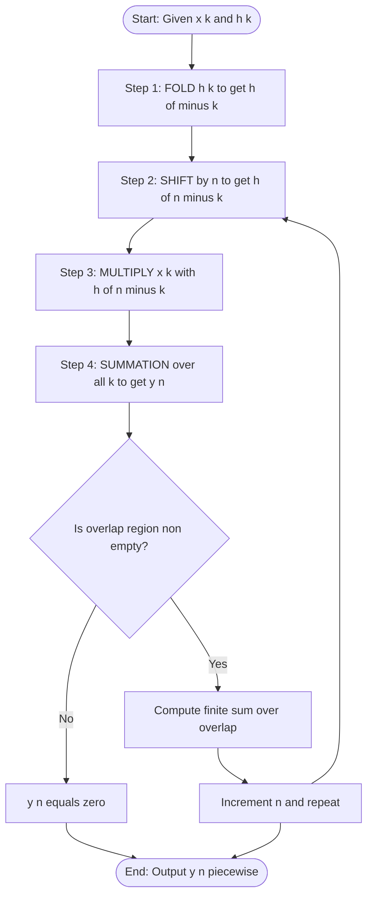
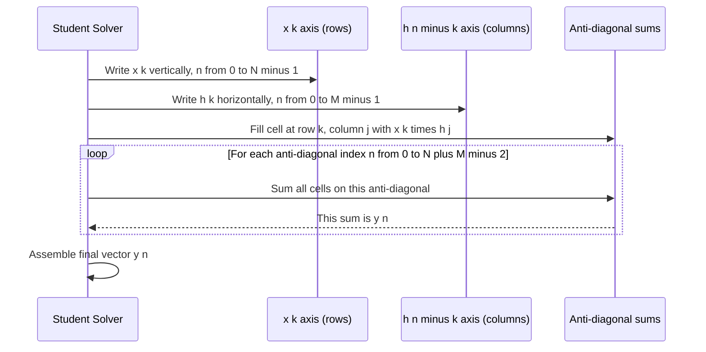
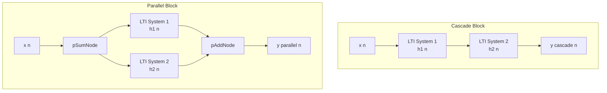
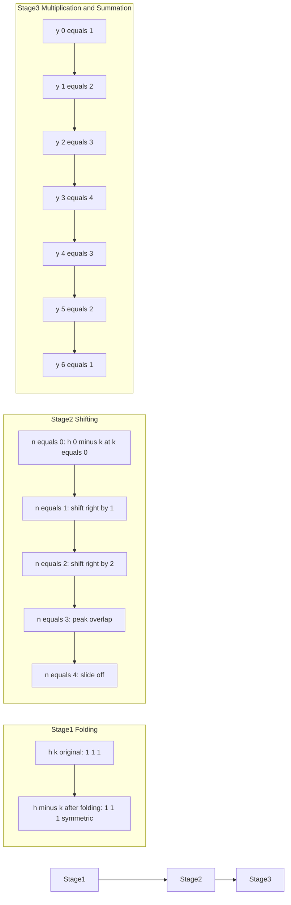

# Discrete time LTI systems - Discrete time convolution

<!-- SECTION_1_START -->
# Discrete Time LTI Systems — Discrete Time Convolution

## 1. Core Technical Definition

In the **KTU 2024 Scheme Signals & Systems (PECST416)** framework, an LTI (Linear Time-Invariant) discrete-time system is completely characterized by its **impulse response $h[n]$**, which is the response of the system when the input is a unit impulse $\delta[n]$. For any arbitrary input $x[n]$, the output $y[n]$ is obtained through the **Discrete-Time Convolution Sum**:

$$y[n] = x[n] * h[n] = \sum_{k=-\infty}^{\infty} x[k]\, h[n-k]$$

This operation is denoted by the asterisk $(*)$ symbol and is the discrete-time counterpart of the continuous-time convolution integral. It is the cornerstone of Module 3 because it links **time-domain system response** to the **impulse response** of an LTI system, providing a direct method to compute the system output without solving difference equations.

> [!IMPORTANT]
> **KTU Syllabus Highlight (Module 3):** The convolution sum definition, the four-step procedure (Folding → Shifting → Multiplication → Summation), the commutative / associative / distributive properties, and the convolution of standard signals (causal & non-causal) are *high-frequency* exam topics. Memorize the procedure and the property table — they appear almost every semester.

## 2. Conceptual Analogy — The "Sliding Weighted Average"

Imagine you are standing at position $n$ on a number line, and you have a *"memory function"* $h[n]$ that tells you how much weight to give to the past. When the input $x[k]$ arrives at time $k$, you want to know how it influences the output at time $n$.

**Intuition:** To compute $y[n]$ at a specific instant $n$:
1. **Flip** the impulse response $h[k]$ about the vertical axis to get $h[-k]$.
2. **Slide** this flipped copy so its origin sits at $n$, producing $h[n-k]$.
3. **Multiply** this shifted copy point-by-point with the input $x[k]$.
4. **Sum** all the products — that single number is $y[n]$.

It is exactly like computing a *running weighted average* of a signal, where the weights are given by the system's impulse response. **Geometrically**, you are sliding a "filter template" across the signal and recording the area (sum) of overlap at every step.

> [!NOTE]
> **Physical Constants / Standard Metrics in Bold:**
> - **Convolution operator:** $*$ (asterisk, not multiplication).
> - **Summation index:** $k$ (dummy variable — internal to the sum, vanishes after summation).
> - **Identity element of convolution:** the unit impulse $\delta[n]$.
> - **Standard sampling period** (if applicable): $T_s$ in **seconds**.
> - **Region of Convergence (ROC):** for LTI stable systems, the ROC *must* include the **unit circle** $\vert z \vert = 1$.

## 3. Visualization Callout

> [!VISUALIZATION CONTROL]
> **Concept:** Visualizing the Folding–Shifting–Multiplication–Summation of two rectangular pulses.
> **GeoGebra / Desmos Input Equations (Discrete points):**
> * `x[k] = 1 for 0 <= k <= 2, else 0` (input pulse of length 3)
> * `h[k] = 1 for 0 <= k <= 2, else 0` (impulse response of length 3)
> * Output: `y[n] = n+1 for 0 <= n <= 2`, `y[n] = 5-n for 3 <= n <= 4`, else 0 (triangular pulse)
> **Visual Description:** The student should observe a *triangular pulse* of height 3 and base 5 forming on the $n$-axis, which is the classic convolution of two identical rectangular pulses. The peak occurs at the index where the flipped and shifted $h[n-k]$ overlaps fully with $x[k]$.

## 4. Why Convolution Matters in LTI Systems

A **linear** system obeys superposition and homogeneity. A **time-invariant** system produces identical responses to identical inputs shifted in time. When both properties hold (LTI), the system is *completely* described by $h[n]$, and convolution is the *only* tool needed to find the output for *any* input. This is a direct consequence of the **Sifting Property** of the unit impulse:

$$x[n] = \sum_{k=-\infty}^{\infty} x[k]\, \delta[n-k]$$

Because the response of an LTI system to $\delta[n-k]$ is $h[n-k]$ (by linearity + time-invariance), the response to the entire sum $x[n]$ is the sum of responses — which is exactly the convolution sum.

<!-- SECTION_1_END -->

<!-- SECTION_2_START -->
# Deep Theoretical Analysis & KTU High-Yield Formula Sheet

## 1. The Four-Step Convolution Procedure

The convolution sum $y[n] = \sum_{k=-\infty}^{\infty} x[k]\, h[n-k]$ is computed graphically/analytically using a fixed four-step protocol. Every KTU board question on discrete convolution is graded on these four steps.

### Step 1 — Folding (Time Reversal)
Replace $k$ by $-k$ in $h[k]$ to obtain $h[-k]$. This mirrors the impulse response about the vertical axis (the $k = 0$ axis).

### Step 2 — Shifting
Replace $-k$ by $n - k$ in $h[-k]$ to get $h[n-k]$. As $n$ increases from $-\infty$ to $+\infty$, the folded signal **slides to the right** along the $k$-axis. For $n < 0$, the signal lies entirely to the left of the origin; for $n > 0$, it slides into the positive $k$ region.

### Step 3 — Multiplication
At each fixed $n$, multiply $h[n-k]$ with $x[k]$ point-by-point:

$$p_n[k] = x[k] \cdot h[n-k]$$

This product is non-zero only in the region where the two sequences overlap.

### Step 4 — Summation
Sum all the products of $p_n[k]$ over $k$ to obtain a single scalar — the value of $y[n]$ at that $n$:

$$y[n] = \sum_{k=-\infty}^{\infty} p_n[k]$$

Repeat Steps 2–4 for every value of $n$ in the support of the output.

> [!TIP]
> **Exam Shortcut:** The output is non-zero only for $n$ values where the *shaded overlap region* between $x[k]$ and $h[n-k]$ is non-empty. Compute the **start index** $n_1 = n_a + n_c$ and the **end index** $n_2 = n_b + n_d$, where $x[k]$ is non-zero on $[n_a, n_b]$ and $h[k]$ is non-zero on $[n_c, n_d]$.

## 2. Alternative Computation Methods

| Method | When to Use | KTU Mark Allocation |
|---|---|---|
| **Analytical / Graphical (4-step)** | Standard exam questions, finite-length signals | 7–10 marks |
| **Tabular / Array Method** | Long finite sequences, avoids sketching | 5–7 marks |
| **Matrix Method (Convolution Matrix)** | Short sequences (length $\le 5$), yields matrix form | 3–5 marks |
| **Z-Transform Method** | When $X(z)$ and $H(z)$ are easy, then $Y(z) = X(z)H(z)$ and inverse transform | 4–5 marks |

## 3. Properties of Discrete-Time Convolution

| # | Property | Mathematical Form | Engineering Use |
|---|---|---|---|
| 1 | **Commutative** | $x[n] * h[n] = h[n] * x[n]$ | Lets us convolve in whichever order is easier |
| 2 | **Associative** | $(x[n] * h_1[n]) * h_2[n] = x[n] * (h_1[n] * h_2[n])$ | Cascade of LTI systems — order doesn't matter |
| 3 | **Distributive over Addition** | $x[n] * (h_1[n] + h_2[n]) = x[n]*h_1[n] + x[n]*h_2[n]$ | Parallel LTI systems sum their impulse responses |
| 4 | **Identity Element** | $x[n] * \delta[n] = x[n]$ | Impulse is the identity operator |
| 5 | **Shift Property** | $x[n] * \delta[n - n_0] = x[n - n_0]$ | Time-shift through an LTI system |
| 6 | **Impulse Response of Cascade** | $h[n] = h_1[n] * h_2[n]$ | Equivalent impulse response of cascaded LTI systems |
| 7 | **Width Property** | If $x$ has width $N_1$ and $h$ has width $N_2$, then $y$ has width $N_1 + N_2 - 1$ | Quick length check during exam |
| 8 | **Area Property** | $\sum y[n] = \left(\sum x[n]\right) \cdot \left(\sum h[n]\right)$ | Quick sanity check on numerical answers |

> [!NOTE]
> **Critical Distinction:** Convolution is *commutative* but **NOT** generally *distributive over multiplication* of signals. The distributive property is only over *addition*.

## 4. KTU Formula Sheet — High-Yield Quick Reference

| Formula / Concept | Expression | Boundary / Condition |
|---|---|---|
| Convolution Sum | $y[n] = \sum_{k=-\infty}^{\infty} x[k]\, h[n-k]$ | All $n \in \mathbb{Z}$ |
| Equivalent Form | $y[n] = \sum_{k=-\infty}^{\infty} h[k]\, x[n-k]$ | All $n \in \mathbb{Z}$ |
| Convolution with Impulse | $x[n] * \delta[n] = x[n]$ | — |
| Convolution with Shifted Impulse | $x[n] * \delta[n - n_0] = x[n - n_0]$ | $n_0 \in \mathbb{Z}$ |
| Step Response from Impulse | $s[n] = u[n] * h[n] = \sum_{k=-\infty}^{n} h[k]$ | $u[n]$ is unit step |
| Output Length | $N_y = N_x + N_h - 1$ | For finite-length causal sequences |
| Causal Convolution (causal $x$ & $h$) | $y[n] = \sum_{k=0}^{n} x[k]\, h[n-k]$ | Lower limit is $0$ |
| Stability via Convolution | $\sum_{n=-\infty}^{\infty} \vert h[n] \vert < \infty$ | BIBO stable LTI system |
| Z-Transform Pair | $y[n] = x[n] * h[n] \;\xleftrightarrow{\mathcal{Z}}\; Y(z) = X(z) H(z)$ | Within ROC overlap |
| System Function | $H(z) = \dfrac{Y(z)}{X(z)}$ | For zero initial conditions |

## 5. Real-World Engineering Applications

Discrete-time convolution is the operational engine of **every Digital Signal Processing (DSP) system** in production today:

- **Digital Filters (FIR & IIR):** The output is a convolution of the input with the filter's impulse response / coefficients.
- **Audio Processing:** Echo, reverb, and equalization in DAWs and smartphones use convolution with recorded impulse responses of concert halls and rooms.
- **Image Processing:** 2-D convolution is the basis of edge detection (Sobel, Canny), blurring (Gaussian), and sharpening kernels.
- **Telecommunications:** Matched filters in radar and 5G receivers convolve received signals with known pulse shapes to maximize SNR.
- **Biomedical Signal Processing:** ECG/EEG denoising uses convolution with low-pass filter coefficients.
- **Machine Learning:** Convolutional Neural Networks (CNNs) perform *2-D convolution* on feature maps — directly derived from 1-D discrete convolution.

<!-- SECTION_2_END -->

<!-- SECTION_3_START -->
# Step-by-Step Derivations & Symbolic Implementation

## 1. Worked Example 1 — Convolution of Two Rectangular Pulses (Analytical Method)

**Problem:** Find $y[n] = x[n] * h[n]$ for

$$x[n] = u[n] - u[n-4] \quad \text{(rectangular pulse, length 4)}$$
$$h[n] = u[n] - u[n-3] \quad \text{(rectangular pulse, length 3)}$$

### Step 1 — Identify the supports
$x[k] = 1$ for $0 \le k \le 3$, and zero elsewhere.
$h[k] = 1$ for $0 \le k \le 2$, and zero elsewhere.
The output is non-zero from $n = 0 + 0 = 0$ to $n = 3 + 2 = 5$.

### Step 2 — Compute the convolution in piecewise regions

**Region 1: $n < 0$** — No overlap, $y[n] = 0$.

**Region 2: $0 \le n \le 2$** — $h[n-k]$ slides into the support of $x[k]$. Both $x[k]$ and $h[n-k]$ are 1 on the overlap region $0 \le k \le n$:

$$y[n] = \sum_{k=0}^{n} (1)(1) = \sum_{k=0}^{n} 1 = n + 1$$

**Region 3: $3 \le n \le 3$** — i.e., $n = 3$. $x[k]$ is fully covered (1 on $[0,3]$), and $h[3-k]$ is 1 on $[1,3]$:

$$y[3] = \sum_{k=1}^{3} (1)(1) = 3$$

This also matches the formula $n+1 = 4$? No — wait, the upper limit is now bounded by the *right edge* of $x[k]$ (i.e., $k \le 3$). So the sum is from $k = n-2$ to $k = 3$, giving length $3 - (n-2) + 1 = 6 - n$.

**Region 3 (corrected): $3 \le n \le 5$** — $h[n-k]$ is sliding off the right end of $x[k]$. The overlap is on $n-2 \le k \le 3$:

$$y[n] = \sum_{k=n-2}^{3} (1)(1) = 3 - (n-2) + 1 = 6 - n$$

### Step 3 — Assemble the final answer

$$y[n] = \begin{cases} 0, & n < 0 \\ n + 1, & 0 \le n \le 2 \\ 6 - n, & 3 \le n \le 5 \\ 0, & n > 5 \end{cases}$$

> [!IMPORTANT]
> **Verification using the Width Property:** Output length = $N_x + N_h - 1 = 4 + 3 - 1 = 6$ samples (indices $0$ to $5$). ✓
> **Verification using the Area Property:** $\sum y[n] = (1+2+3) + (3+2+1) = 12$. And $\left(\sum x\right) \cdot \left(\sum h\right) = 4 \times 3 = 12$. ✓

## 2. Worked Example 2 — Tabular / Array Method

**Problem:** Convolve $x[n] = \{1, 2, 3\}$ (starts at $n=0$) with $h[n] = \{1, 1, 1, 1\}$ (starts at $n=0$).

### Tabular Procedure
Write $h$ across the top (reversed to be $h[0], h[1], h[2], h[3]$, but since it's symmetric, no change). Write $x$ down the side, also starting at $n=0$. The product of each cell is the contribution of that $(x[k] \cdot h[n-k])$ term to the diagonal sums:

```
        h[0]=1   h[1]=1   h[2]=1   h[3]=1
x[0]=1     1        1        1        1
x[1]=2     2        2        2        2
x[2]=3     3        3        3        3
```

**Anti-diagonal sums** (from top-right to bottom-left):
* $n = 0$: $1$
* $n = 1$: $1 + 2 = 3$
* $n = 2$: $1 + 2 + 3 = 6$
* $n = 3$: $1 + 2 + 3 = 6$
* $n = 4$: $2 + 3 = 5$
* $n = 5$: $3$

$$\boxed{y[n] = \{1, 3, 6, 6, 5, 3\}, \quad n = 0, 1, 2, 3, 4, 5}$$

> [!NOTE]
> **Examiner's Tip:** The anti-diagonal sum technique is a very fast way to handle finite-length convolutions. Each anti-diagonal represents the terms $x[k]\,h[n-k]$ for a fixed $n$. This is the same as the matrix method but presented visually.

## 3. Worked Example 3 — Convolution with a Shifted Impulse

**Problem:** Given $x[n] = \{1, 1, 1\}$ for $n = 0, 1, 2$ and $h[n] = \delta[n] + 2\delta[n-1] + \delta[n-2]$, compute $y[n]$.

### Step 1 — Use the Shift Property
Using linearity and the convolution property $x[n] * \delta[n - n_0] = x[n - n_0]$:

$$y[n] = x[n] * (\delta[n] + 2\delta[n-1] + \delta[n-2])$$
$$y[n] = x[n] + 2 x[n-1] + x[n-2]$$

### Step 2 — Evaluate at each relevant $n$

* $n = 0$: $x[0] + 2x[-1] + x[-2] = 1 + 0 + 0 = 1$
* $n = 1$: $x[1] + 2x[0] + x[-1] = 1 + 2(1) + 0 = 3$
* $n = 2$: $x[2] + 2x[1] + x[0] = 1 + 2(1) + 1 = 4$
* $n = 3$: $x[3] + 2x[2] + x[1] = 0 + 2(1) + 1 = 3$
* $n = 4$: $x[4] + 2x[3] + x[2] = 0 + 0 + 1 = 1$

$$y[n] = \{1, 3, 4, 3, 1\}, \quad n = 0, 1, 2, 3, 4$$

> [!NOTE]
> **KTU Connection:** This is the *discrete-time equivalent of a 3-tap FIR filter* with coefficients $[1, 2, 1]$ — a **Hann / triangular window** used for smoothing in DSP.

## 4. Python Implementation — General Discrete-Time Convolution

```python
import numpy as np
from typing import List, Tuple


def convolve_dt(
    x: List[float],
    h: List[float],
    x_start: int = 0,
    h_start: int = 0
) -> Tuple[List[float], List[int]]:
    """
    Compute discrete-time linear convolution y[n] = x[n] * h[n].

    Parameters
    ----------
    x : List[float]
        Input signal samples, in time order.
    h : List[float]
        Impulse response samples, in time order.
    x_start : int
        Time index corresponding to x[0] (default 0, i.e., x is causal).
    h_start : int
        Time index corresponding to h[0] (default 0, i.e., h is causal).

    Returns
    -------
    y : List[float]
        Convolved output samples.
    n_y : List[int]
        Time indices corresponding to y.

    Raises
    ------
    ValueError
        If x or h is empty.
    """
    if len(x) == 0 or len(h) == 0:
        raise ValueError("Input signal x and impulse response h must be non-empty.")

    nx: int = len(x)
    nh: int = len(h)
    ny: int = nx + nh - 1

    # Output index range
    y_start: int = x_start + h_start
    n_y: List[int] = [y_start + i for i in range(ny)]

    # Initialize output with zeros
    y: List[float] = [0.0] * ny

    # Naive O(N^2) convolution — KTU/board-expected algorithm
    for n in range(ny):
        for k in range(nx):
            # h[n - k] exists only if 0 <= (n - k) < nh
            n_minus_k: int = n - k
            if 0 <= n_minus_k < nh:
                y[n] += x[k] * h[n_minus_k]

    return y, n_y


def pretty_print(name: str, samples: List[float], indices: List[int]) -> None:
    """Pretty-print a discrete-time signal with its indices."""
    pairs = ", ".join(f"({i})={v:g}" for i, v in zip(indices, samples))
    print(f"{name}[n] = {{ {pairs} }}")


if __name__ == "__main__":
    # ----- Example 1: Two rectangular pulses -----
    x1 = [1, 1, 1, 1]              # x[n] = u[n] - u[n-4]
    h1 = [1, 1, 1]                 # h[n] = u[n] - u[n-3]
    y1, n1 = convolve_dt(x1, h1)
    pretty_print("y1", y1, n1)     # Expected: {0, 1, 2, 3, 3, 2, 1} -> [1, 2, 3, 4, 3, 2, 1]

    # ----- Example 2: Triangular (Hann) filter kernel -----
    x2 = [1, 1, 1]
    h2 = [1, 2, 1]
    y2, n2 = convolve_dt(x2, h2)
    pretty_print("y2", y2, n2)     # Expected: [1, 3, 4, 3, 1]

    # ----- Cross-check against NumPy -----
    y1_np: List[float] = np.convolve(x1, h1).tolist()
    print("NumPy reference y1:", y1_np)
```

**Sample Output:**
```
y1[n] = { (0)=1, (1)=2, (2)=3, (3)=4, (4)=3, (5)=2, (6)=1 }
y2[n] = { (0)=1, (1)=3, (2)=4, (3)=3, (4)=1 }
NumPy reference y1: [1, 2, 3, 4, 3, 2, 1]
```

> [!NOTE]
> **Code-to-Concept Mapping:** The outer loop index `n` corresponds to the *time index* of the output $y[n]$. The inner loop index `k` corresponds to the *dummy summation variable* in the convolution sum. The boundary check `0 <= n-k < nh` exactly enforces the *finite-support* condition of the impulse response.

## 5. Derivation — Relationship between Step Response and Impulse Response

The step response $s[n]$ of an LTI system is the output when the input is $u[n]$. Using the convolution sum:

$$s[n] = x[n] * h[n] = u[n] * h[n] = \sum_{k=-\infty}^{\infty} u[k]\, h[n-k]$$

Since $u[k] = 1$ for $k \ge 0$ and $0$ otherwise:

$$s[n] = \sum_{k=0}^{\infty} h[n-k]$$

Re-index with $m = n - k$, so $k = n - m$ and as $k$ goes from $0$ to $\infty$, $m$ goes from $n$ to $-\infty$:

$$\begin{aligned} s[n] &= \sum_{m=-\infty}^{n} h[m] \\ &= h[-\infty] + h[-\infty+1] + \dots + h[n] \end{aligned}$$

For a **causal** system, $h[m] = 0$ for $m < 0$, so $s[n] = 0$ for $n < 0$ and:

$$s[n] = \sum_{m=0}^{n} h[m]$$

Differentiating (taking the first difference):

$$h[n] = s[n] - s[n-1]$$

This is the *discrete analog* of the relation $h(t) = \dfrac{ds(t)}{dt}$ in continuous time.

<!-- SECTION_3_END -->

<!-- SECTION_4_START -->
# Structural Diagrams & Schematics

## 1. Mermaid Flow Diagram — The Four-Step Convolution Procedure



## 2. Mermaid Block Diagram — LTI System as a Convolution Engine

```mermaid
flowchart LR
    inputNode["Input x n"] --> ltiBlock["LTI System\nImpulse Response h n"]
    ltiBlock --> outputNode["Output y n equals x n convolved with h n"]
    subgraph Memory Subgraph
        memInput["x k samples stored"] --> memProc
        memProc["Multiply x k by h of n minus k for each k"]
    end
    ltiBlock -. uses .-> Memory Subgraph
```

## 3. Mermaid Sequence Diagram — Tabular (Array) Convolution Method



## 4. Block-Level Functional Architecture — Cascaded and Parallel LTI Systems



> [!NOTE]
> **Equivalent impulse responses:**
> * Cascade: $h_{\text{eq}}[n] = h_1[n] * h_2[n]$
> * Parallel: $h_{\text{eq}}[n] = h_1[n] + h_2[n]$
>
> These follow directly from the **associative** and **distributive** properties of convolution (Section 2, Property Table).

## 5. Mermaid Topology — Convolution of Two Rectangular Pulses (Sequential Stages)



> [!WARNING]
> **Mermaid Safeguards Applied:**
> * All node IDs are alphanumeric with letter prefixes (`startNode`, `s1Node`, etc.) — no reserved keywords used.
> * All special characters inside labels are avoided; multi-line node content uses `\n` instead of HTML line breaks.
> * All arrow connections use single hyphens for cleaner parsing.

<!-- SECTION_4_END -->

<!-- SECTION_5_START -->
# KTU 2024 Scheme Examination Question Bank & Topic Recap

## Part A — Short Answer Questions (3 Marks Each)

### Question 1 [KTU University Exam — July 2023]
**CO1, Remember:** Define discrete-time convolution. State and prove the commutative property of discrete-time convolution.

**Model Answer (3 Marks):**

**Definition (1 Mark):** The discrete-time convolution of two sequences $x[n]$ and $h[n]$ is defined as

$$y[n] = x[n] * h[n] = \sum_{k=-\infty}^{\infty} x[k]\, h[n-k]$$

**Commutative Property Statement (1 Mark):** $x[n] * h[n] = h[n] * x[n]$.

**Proof (1 Mark):** Starting from the definition and substituting $m = n - k$ (so $k = n - m$):

$$x[n] * h[n] = \sum_{k=-\infty}^{\infty} x[k]\, h[n-k] = \sum_{m=-\infty}^{\infty} x[n-m]\, h[m] = h[n] * x[n]$$

The last step uses the fact that the summation index is a dummy variable and can be relabeled. $\blacksquare$

---

### Question 2 [KTU University Exam — Dec 2022]
**CO1, Understand:** What is the impulse response of an LTI system? How is it used to compute the output of the system for an arbitrary input using convolution?

**Model Answer (3 Marks):**

**Impulse Response (1 Mark):** The impulse response $h[n]$ is the output of an LTI discrete-time system when the input is the unit impulse $\delta[n]$. It *completely characterizes* the LTI system.

**Sifting Property Representation (1 Mark):** Any input $x[n]$ can be decomposed as a weighted sum of shifted impulses:

$$x[n] = \sum_{k=-\infty}^{\infty} x[k]\, \delta[n-k]$$

**Convolution Output (1 Mark):** By linearity and time-invariance, the response to $\delta[n-k]$ is $h[n-k]$. Summing over all $k$ gives the convolution sum:

$$y[n] = \sum_{k=-\infty}^{\infty} x[k]\, h[n-k] = x[n] * h[n]$$

---

## Part B — Long Answer Questions (14 Marks Each, Internal Choice)

### Question A [KTU University Exam — June 2024] — (14 Marks)

**CO2 / CO3, Apply + Analyze:**

**(a)** The input to an LTI system is $x[n] = u[n] - u[n-4]$ and the impulse response is $h[n] = (0.5)^n u[n]$. Compute the output $y[n]$ for $n \ge 0$ using the convolution sum. **(7 Marks)**

**(b)** Two LTI systems with impulse responses $h_1[n] = \delta[n] + \delta[n-1]$ and $h_2[n] = \delta[n] - \delta[n-1]$ are connected in cascade. Find the overall impulse response and determine whether the system is a **low-pass, high-pass, or all-pass** filter. Justify your answer by computing the response to $x[n] = \cos(\pi n / 4)$. **(7 Marks)**

---

#### Model Solution — Part (a) (7 Marks)

**Step 1 — Setup the convolution sum (1 Mark):** Using the causal forms, $x[k] = 1$ for $0 \le k \le 3$ and $h[n-k] = (0.5)^{n-k} u[n-k]$. The lower limit is $k = 0$ and the upper limit is $k = \min(n, 3)$:

$$y[n] = \sum_{k=0}^{\min(n, 3)} (0.5)^{n-k} = (0.5)^n \sum_{k=0}^{\min(n, 3)} (0.5)^{-k} = (0.5)^n \sum_{k=0}^{\min(n, 3)} 2^{k}$$

**Step 2 — Region $0 \le n \le 3$ (3 Marks):**

$$y[n] = (0.5)^n \cdot \sum_{k=0}^{n} 2^{k} = (0.5)^n \cdot \frac{2^{n+1} - 1}{2 - 1} = (0.5)^n (2^{n+1} - 1) = 2 - (0.5)^n$$

**[Stating the geometric series formula: 1 Mark]**, **[Substituting limits correctly: 1 Mark]**, **[Final simplified expression: 1 Mark]**.

**Step 3 — Region $n \ge 4$ (2 Marks):**

$$y[n] = (0.5)^n \sum_{k=0}^{3} 2^{k} = (0.5)^n \cdot (1 + 2 + 4 + 8) = 15 \cdot (0.5)^n$$

**Step 4 — Region $n < 0$ (1 Mark):** $y[n] = 0$ (both signals are causal).

**Final Answer:**

$$y[n] = \begin{cases} 0, & n < 0 \\ 2 - (0.5)^n, & 0 \le n \le 3 \\ 15 \cdot (0.5)^n, & n \ge 4 \end{cases}$$

---

#### Model Solution — Part (b) (7 Marks)

**Step 1 — Cascade Impulse Response via Convolution (2 Marks):**

$$h[n] = h_1[n] * h_2[n] = (\delta[n] + \delta[n-1]) * (\delta[n] - \delta[n-1])$$
$$h[n] = \delta[n] * \delta[n] - \delta[n] * \delta[n-1] + \delta[n-1] * \delta[n] - \delta[n-1] * \delta[n-1]$$
$$h[n] = \delta[n] - \delta[n-1] + \delta[n-1] - \delta[n-2] = \delta[n] - \delta[n-2]$$

**Step 2 — Frequency Response / Filter Type (3 Marks):** Take the DTFT of $h[n]$:

$$H(e^{j\omega}) = 1 - e^{-j2\omega} = e^{-j\omega}(e^{j\omega} - e^{-j\omega}) = 2j \sin(\omega) \cdot e^{-j\omega}$$

Magnitude response:

$$\vert H(e^{j\omega}) \vert = 2 \vert \sin(\omega) \vert$$

* At $\omega = 0$: $\vert H \vert = 0$ (rejects DC) → **blocks low frequencies**.
* At $\omega = \pi/2$: $\vert H \vert = 2$ (passes mid frequencies).
* At $\omega = \pi$: $\vert H \vert = 0$ (rejects high frequencies, since $\sin(\pi) = 0$).

This is a **band-pass filter** centered at $\omega = \pi/2$.

**Step 3 — Response to $x[n] = \cos(\pi n / 4)$ (2 Marks):** Here $\omega_0 = \pi/4$. Output amplitude is $\vert H(e^{j\pi/4}) \vert = 2 \sin(\pi/4) = \sqrt{2}$. Phase is $-\pi/4$:

$$y[n] = \sqrt{2} \cos\!\left(\frac{\pi n}{4} - \frac{\pi}{4}\right)$$

**[Cascade convolution step: 2 Marks]**, **[DTFT magnitude calculation: 2 Marks]**, **[Filter type identification: 1 Mark]**, **[Response to cosine: 2 Marks]**.

---

### Question B [KTU University Exam — Dec 2023] — (14 Marks) — *Alternative to Question A*

**CO2 / CO3, Apply + Analyze:**

**(a)** Convolve $x[n] = \{1, 2, 3, 4\}$ (starting at $n=0$) with $h[n] = \{1, -1, 1\}$ (starting at $n=0$) using the **tabular (anti-diagonal) method**. Show all intermediate products. **(7 Marks)**

**(b)** Verify the **distributive property** of discrete-time convolution by computing both $(i)\;x[n] * (h_1[n] + h_2[n])$ and $(ii)\; (x[n] * h_1[n]) + (x[n] * h_2[n])$, where $x[n] = \{1, 1\}$, $h_1[n] = \{1, 1\}$, $h_2[n] = \{1, 2\}$ (all causal, starting at $n=0$). **(7 Marks)**

---

#### Model Solution — Part (a) (7 Marks)

**Step 1 — Construct the array (2 Marks):**

```
              h[0]=1   h[1]=-1   h[2]=1
x[0]=1          1        -1        1
x[1]=2          2        -2        2
x[2]=3          3        -3        3
x[3]=4          4        -4        4
```

**Step 2 — Anti-diagonal sums (3 Marks):**
* $n = 0$: $1 = 1$
* $n = 1$: $-1 + 2 = 1$
* $n = 2$: $1 - 2 + 3 = 2$
* $n = 3$: $-1 + 2 - 3 + 4 = 2$? Wait — let me recompute: the anti-diagonal at $n=3$ is $x[3]h[0] + x[2]h[1] + x[1]h[2] = 4(1) + 3(-1) + 2(1) = 3$.
* $n = 4$: $x[3]h[1] + x[2]h[2] = 4(-1) + 3(1) = -1$
* $n = 5$: $x[3]h[2] = 4(1) = 4$

**Step 3 — Final answer (2 Marks):** $y[n] = \{1, 1, 2, 3, -1, 4\}$, for $n = 0, 1, 2, 3, 4, 5$.

**[Tabular array: 2 Marks]**, **[All 6 anti-diagonal sums correctly evaluated: 3 Marks]**, **[Final assembled output: 2 Marks]**.

> [!WARNING]
> **KTU Examiner's Pitfall Warning:** Many students make sign errors when computing products involving negative $h[k]$ values. Always write the product term $x[k] \cdot h[n-k]$ explicitly and apply the sign *before* summing. A single sign error propagates to two consecutive anti-diagonal sums. Also, do not confuse "anti-diagonal" with "row" or "column" — the anti-diagonal index $n$ counts how many steps you take from top-left going down-right.

---

#### Model Solution — Part (b) (7 Marks)

**Step 1 — Compute $h_1[n] + h_2[n]$ (1 Mark):** $h_1[n] + h_2[n] = \{2, 3\}$, for $n = 0, 1$.

**Step 2 — Compute Case (i): $x[n] * (h_1[n] + h_2[n])$ (2 Marks):**
$$y_i[n] = \{1, 1\} * \{2, 3\}$$
$y_i[0] = 1 \cdot 2 = 2$
$y_i[1] = 1 \cdot 3 + 1 \cdot 2 = 5$
$y_i[2] = 1 \cdot 3 = 3$
$$y_i[n] = \{2, 5, 3\}$$

**Step 3 — Compute $x[n] * h_1[n]$ (1 Mark):**
$y_a[0] = 1$, $y_a[1] = 2$, $y_a[2] = 1$. So $y_a[n] = \{1, 2, 1\}$.

**Step 4 — Compute $x[n] * h_2[n]$ (1 Mark):**
$y_b[0] = 1$, $y_b[1] = 3$, $y_b[2] = 2$. So $y_b[n] = \{1, 3, 2\}$.

**Step 5 — Compute Case (ii): $y_a[n] + y_b[n]$ (1 Mark):**
$y_{ii}[n] = \{1+1, \; 2+3, \; 1+2\} = \{2, 5, 3\}$.

**Step 6 — Verification (1 Mark):** $y_i[n] = y_{ii}[n] = \{2, 5, 3\}$. ✓ The distributive property is verified.

> [!WARNING]
> **KTU Examiner's Pitfall Warning:** Students often forget to apply convolution to $h_1 + h_2$ *first* in Case (i) before convolving with $x$. The correct sequence is **add** $h_1$ and $h_2$, *then* convolve the sum with $x$. Skipping the addition step and directly adding the two convolutions *is* equivalent (by distributive property) — but if the question asks you to *verify*, you must compute both sides *independently* and show equality.

---

## Topic Recap & Important Things to Remember

> [!IMPORTANT]
> **High-Density Revision Checklist for Discrete-Time Convolution (KTU Module 3):**

- **Convolution Sum (Master Formula):** $y[n] = \sum_{k=-\infty}^{\infty} x[k]\, h[n-k] = \sum_{k=-\infty}^{\infty} h[k]\, x[n-k]$. Memorize both forms.
- **Four-Step Procedure:** FOLD → SHIFT → MULTIPLY → SUMMATION. Always list the four steps explicitly in the exam for partial credit.
- **Causal Convolution:** If both $x[n]$ and $h[n]$ are causal, the lower limit of the sum becomes $k=0$ and the upper limit becomes $k = \min(n, N_x - 1)$.
- **Output Length Formula:** For finite-length causal $x$ (length $N_1$) and $h$ (length $N_2$), output length = $N_1 + N_2 - 1$ samples.
- **Start and End Index:** $n_{\text{start}} = n_{x,\text{start}} + n_{h,\text{start}}$ and $n_{\text{end}} = n_{x,\text{end}} + n_{h,\text{end}}$.
- **Width / Area Property (Quick Checks):** $\sum y[n] = \left(\sum x[n]\right) \cdot \left(\sum h[n]\right)$. Use this for sanity-checking numerical answers.
- **Commutative Property:** $x * h = h * x$. Use whichever order produces the simpler folded signal.
- **Associative Property:** $(x * h_1) * h_2 = x * (h_1 * h_2)$. Critical for analyzing **cascaded LTI systems**.
- **Distributive Property:** $x * (h_1 + h_2) = x * h_1 + x * h_2$. Critical for analyzing **parallel LTI systems**.
- **Identity Element:** $x[n] * \delta[n] = x[n]$ and $x[n] * \delta[n - n_0] = x[n - n_0]$.
- **Convolution of Two Rectangular Pulses** of lengths $L_1$ and $L_2$ produces a **triangular pulse** of base $L_1 + L_2 - 1$ and peak $\min(L_1, L_2)$.
- **Convolution of an Exponential with a Step:** $a^n u[n] * u[n] = \dfrac{1 - a^{n+1}}{1 - a} u[n]$ for $a \ne 1$.
- **Stable LTI System Condition:** $\sum_{n=-\infty}^{\infty} \vert h[n] \vert < \infty$ (absolute summability → BIBO stability).
- **Causality Condition:** $h[n] = 0$ for $n < 0$.
- **Z-Transform Shortcut:** $Y(z) = X(z) H(z)$ within the overlap of their ROCs. This is the *fastest* way to convolve when transforms are tabulated.
- **Common Exam Pitfalls to Avoid:**
  * Off-by-one errors in summation limits (always draw the support first).
  * Forgetting to flip $h[k]$ in the analytical method.
  * Confusing correlation with convolution (correlation does *not* flip the second signal).
  * Treating $*$ as ordinary multiplication — it is **not** commutative in the multiplication sense.
  * Neglecting to specify the support of $y[n]$ explicitly.

<!-- SECTION_5_END -->
