# Discrete time systems - Block diagram representation and mathematical representation of discrete-time systems-Some common elements of Discrete-time systems (adder, constant multiplier, signal multiplier, unit delay, unit advance)

<!-- SECTION_1_START -->

# Discrete Time Systems: Block Diagram Representation and Mathematical Modeling

## 1. Core Technical Definition

> [!IMPORTANT]
> **KTU 2024 Syllabus Definition (PECST416 - Module 3)**
> A **Discrete-Time (DT) System** is a mathematical operator or transformation $T\{\cdot\}$ that maps an input discrete-time sequence $x[n]$ to an output discrete-time sequence $y[n]$ according to a prescribed set of rules or computational operations, expressed as:
> $$y[n] = T\{x[n]\}$$
> where $n \in \mathbb{Z}$ represents the integer time index. The system operates on signals defined only at discrete instants, making it the foundational construct for all digital signal processing, embedded controllers, and modern communication receivers.

### 1.1 Conceptual Analogy & Intuition

> [!NOTE]
> **The "Assembly Line" Analogy**
> Imagine a factory assembly line in a digital watch manufacturing plant. Raw components (the **input sequence** $x[n]$) arrive one by one at fixed time intervals. Each station on the line performs **one specific elementary operation** — adding two parts, multiplying by a fixed weight, or delaying a piece by exactly one station. The final assembled product (the **output sequence** $y[n]$) emerges after passing through this chain of elementary stations. 
>
> In DSP terms, every complex algorithm is built by connecting these elementary "stations" (called **building blocks**) using wires (signal paths). The complete factory layout is the **block diagram**, and the master production recipe is the **mathematical representation** (difference equation).

### 1.2 Why Block Diagrams Matter in KTU and Industry

- **Visualization**: Complex systems become readable flow graphs.
- **Modularity**: Each block is a black-box with one defined role.
- **Implementation**: Translates 1-to-1 into C/Python code or FPGA hardware.
- **Analysis**: Enables transfer function and Z-domain manipulation.

### 1.3 Visualization Callout

> [!VISUALIZATION CONTROL]
> **Concept:** Discrete-Time System as a Transformation Operator
> **Desmos Input Equations:**
> * Input: Sequence of points $x[n] = \{0, 1, 2, 3, 4\}$ for $n = 0, 1, 2, 3, 4$
> * Operation: $y[n] = 0.5 \cdot x[n] + 0.3 \cdot x[n-1]$
> * Output: $y[n] = \{0, 0.5, 1.15, 1.95, 2.9\}$ for $n = 0, 1, 2, 3, 4$
> **Visual Description:** The student should plot stems of $x[n]$ (blue) and $y[n]$ (red) on a common n-axis. Notice how each output sample is a *weighted combination* of the current and previous input — this is the essence of a recursive DT system.

---

<!-- SECTION_1_END -->

<!-- SECTION_2_START -->

# Deep Theoretical Analysis & KTU High-Yield Formula Sheet

## 2. Mathematical Representation of Discrete-Time Systems

A discrete-time system can be expressed in **three equivalent mathematical forms**:

### 2.1 Difference Equation Form
The most general **Linear Constant Coefficient Difference Equation (LCCDE)**:

$$\sum_{k=0}^{N} a_k \, y[n-k] = \sum_{m=0}^{M} b_m \, x[n-m]$$

Solving for $y[n]$:

$$y[n] = -\sum_{k=1}^{N} a_k \, y[n-k] + \sum_{m=0}^{M} b_m \, x[n-m]$$

> [!NOTE]
> **KTU Note:** This is the **Recursive (IIR-like) form**. If all $a_k = 0$ for $k \geq 1$, the system reduces to a **Non-Recursive (FIR)** form.

### 2.2 Operator (Transfer Function) Form
Using the **delay operator** $D$ (or shift operator $z^{-1}$ in Z-domain):

$$H(D) = \frac{Y(D)}{X(D)} = \frac{\sum_{m=0}^{M} b_m \, D^m}{1 + \sum_{k=1}^{N} a_k \, D^k}$$

### 2.3 Convolution Sum Form
For **LTI (Linear Time-Invariant)** systems:

$$y[n] = x[n] * h[n] = \sum_{k=-\infty}^{\infty} x[k] \, h[n-k]$$

where $h[n]$ is the **impulse response** of the system.

---

## 3. Common Building Block Elements of Discrete-Time Systems

Every discrete-time system, no matter how complex, is constructed from **five canonical elements**.

### 3.1 The Adder (Summing Junction)

**Function:** Adds two or more discrete-time signals sample-by-sample.

**Mathematical Representation:**
$$y[n] = x_1[n] + x_2[n] + x_3[n] + \ldots + x_K[n]$$

**Block Diagram:**

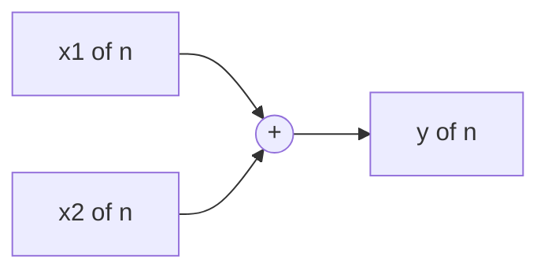

> [!IMPORTANT]
> **KTU Exam Tip:** The summer may have positive ($+$) or negative ($-$) signs. A negative summer is a key part of feedback systems. Always check the sign convention used in your diagram.

### 3.2 The Constant Multiplier (Gain Block)

**Function:** Multiplies the input sequence by a fixed real or complex constant $a$.

**Mathematical Representation:**
$$y[n] = a \cdot x[n]$$

**Block Diagram:**

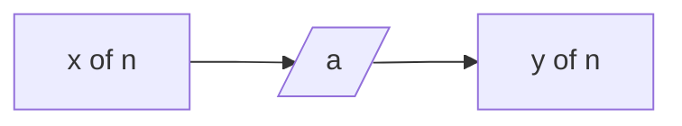

> [!NOTE]
> **Real-World Use:** Gain amplifiers in audio DSP, scaling factors in adaptive filters, normalization in ML preprocessing.

### 3.3 The Signal Multiplier (Modulator / Product Block)

**Function:** Multiplies two sequences sample-by-sample (pointwise multiplication).

**Mathematical Representation:**
$$y[n] = x_1[n] \cdot x_2[n]$$

**Block Diagram:**

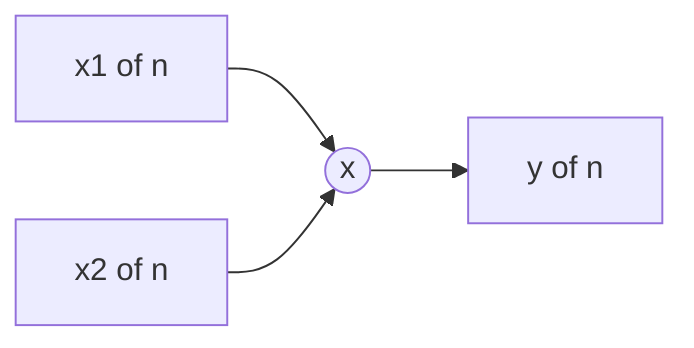

> [!NOTE]
> **Real-World Use:** Amplitude modulation (AM) in communications, windowing in spectral analysis, gating in radar systems.

### 3.4 The Unit Delay Element ($z^{-1}$)

**Function:** Delays the input sequence by exactly **one sample period**.

**Mathematical Representation:**
$$y[n] = x[n-1]$$

**Z-Domain Transfer Function:**
$$H(z) = z^{-1}$$

**Block Diagram:**

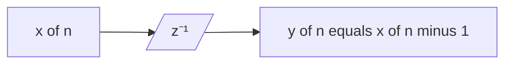

> [!IMPORTANT]
> **The Most Critical Element in KTU Module 3.** The unit delay is the *memory element* of any discrete system. It is the DT equivalent of an inductor or capacitor in analog circuits. All recursive systems (accumulators, integrators, oscillators) require at least one delay block to function.

### 3.5 The Unit Advance Element ($z$)

**Function:** Advances the input sequence by one sample — i.e., produces a future value.

**Mathematical Representation:**
$$y[n] = x[n+1]$$

**Z-Domain Transfer Function:**
$$H(z) = z$$

> [!WARNING]
> **Non-Causality Alert:** The unit advance is **non-causal** because it requires knowledge of a *future* input sample. KTU examiners frequently ask: "Is the system realizable in real-time?" The answer for any system containing a pure advance is **NO** (without buffer storage and offline processing).

---

## 4. KTU High-Yield Formula Sheet

| Element | Input-Output Equation | Z-Domain $H(z)$ | Memory? | Causal? |
|---|---|---|---|---|
| **Adder** | $y[n] = x_1[n] + x_2[n]$ | $H(z) = H_1(z) + H_2(z)$ | No | Yes |
| **Constant Multiplier** | $y[n] = a \cdot x[n]$ | $H(z) = a$ | No | Yes |
| **Signal Multiplier** | $y[n] = x_1[n] \cdot x_2[n]$ | Nonlinear — no $H(z)$ | No | Yes |
| **Unit Delay** | $y[n] = x[n-1]$ | $z^{-1}$ | **Yes** | **Yes** |
| **Unit Advance** | $y[n] = x[n+1]$ | $z$ | Yes (future) | **No** |

### 4.1 Real-World Engineering Utility

- **Audio Codecs (MP3, AAC):** Cascade of multipliers and delays implementing biquad filter sections.
- **Digital Control (PLCs, Flight Controllers):** PI and PID controllers built from summers, gains, and unit delays.
- **Communication Receivers:** Matched filters and equalizers use multiplier-accumulator (MAC) structures.
- **Biomedical Implants (Pacemakers, Hearing Aids):** Ultra-low-power DSP pipelines using these exact five blocks.

---

<!-- SECTION_2_END -->

<!-- SECTION_3_START -->

# Step-by-Step Derivations, Worked Examples & Code Implementation

## 5. Derivation: From Block Diagram to Difference Equation

Consider a **first-order recursive system** with the following block diagram structure:

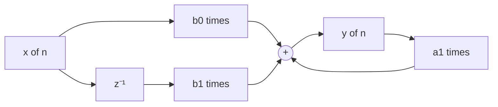

### 5.1 Step-by-Step Algebraic Derivation

Let us denote the output as $w[n]$ at the summer's output (which equals $y[n]$).

**Step 1:** The signal $x[n]$ is split into two paths.

**Step 2:** The upper path applies a constant multiplier of $b_0$:
$$w_1[n] = b_0 \cdot x[n]$$

**Step 3:** The lower path passes through a unit delay, then is multiplied by $b_1$:
$$w_2[n] = b_1 \cdot x[n-1]$$

**Step 4:** The feedback path takes $y[n]$, multiplies it by $-a_1$, and feeds it back to the summer:
$$w_3[n] = -a_1 \cdot y[n-1]$$

**Step 5:** The summer combines all three branches:
$$y[n] = b_0 \cdot x[n] + b_1 \cdot x[n-1] - a_1 \cdot y[n-1]$$

**Step 6:** Rearranging into the standard LCCDE form:
$$y[n] + a_1 \, y[n-1] = b_0 \, x[n] + b_1 \, x[n-1]$$

**Step 7:** The Z-domain transfer function is obtained by applying $y[n-k] \leftrightarrow z^{-k} Y(z)$:
$$Y(z) \left(1 + a_1 \, z^{-1}\right) = X(z) \left(b_0 + b_1 \, z^{-1}\right)$$

$$H(z) = \frac{Y(z)}{X(z)} = \frac{b_0 + b_1 \, z^{-1}}{1 + a_1 \, z^{-1}}$$

> [!IMPORTANT]
> **KTU Board Pattern:** Examiners award **2 marks** for the time-domain difference equation and **1 mark** for the transfer function conversion. Always show both.

---

## 6. Worked Example 1: Accumulator (Discrete Integrator)

An accumulator sums all past input samples.

**Difference Equation:**
$$y[n] = x[n] + y[n-1]$$

**Block Diagram:**

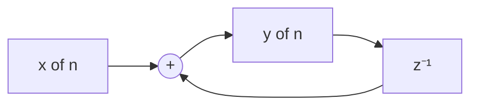

**Z-Domain Transfer Function:**

$$Y(z) = X(z) + z^{-1} Y(z)$$

$$Y(z) \left(1 - z^{-1}\right) = X(z)$$

$$H(z) = \frac{1}{1 - z^{-1}} = \frac{z}{z - 1}$$

**Verification with Python:**

```python
import numpy as np
import matplotlib.pyplot as plt
from scipy.signal import lfilter, dimpulse

# Define accumulator coefficients: y[n] - y[n-1] = x[n]
# Form: a[0]*y[n] + a[1]*y[n-1] = b[0]*x[n]
b_coeffs = [1.0]          # numerator: b0 = 1
a_coeffs = [1.0, -1.0]   # denominator: 1 - z^(-1)

# Compute impulse response h[n]
n_samples, h_n = dimpulse((b_coeffs, a_coeffs, 1.0), n=10)
h_n = h_n[0].flatten()
print("Impulse response h[n] (should be all 1s for n >= 0):")
print(h_n.astype(int))

# Test with x[n] = delta[n] - delta[n-3]
x_input = np.zeros(10)
x_input[0] = 1.0
x_input[3] = -1.0

y_output = lfilter(b_coeffs, a_coeffs, x_input)
print("\nOutput y[n] for difference of impulses:")
print(y_output)
```

> [!NOTE]
> **Expected Output:** The impulse response is $h[n] = u[n]$ (unit step). For the input $\delta[n] - \delta[n-3]$, the output is $1$ for $0 \leq n \leq 2$ and $0$ otherwise — a **rectangular pulse generator**.

---

## 7. Worked Example 2: Moving Average Filter (3-Tap FIR)

**Difference Equation:**
$$y[n] = \frac{1}{3}\left(x[n] + x[n-1] + x[n-2]\right)$$

**Block Diagram:**

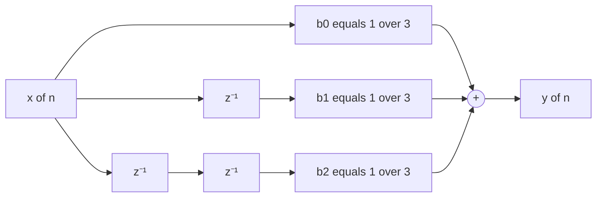

**Z-Domain Transfer Function:**

$$H(z) = \frac{1}{3}\left(1 + z^{-1} + z^{-2}\right)$$

**Python Simulation:**

```python
import numpy as np
from scipy.signal import freqz

# 3-tap moving average filter
b_movavg = [1/3, 1/3, 1/3]
a_movavg = [1.0]

# Frequency response (magnitude)
w, H = freqz(b_movavg, a_movavg, worN=512)

# Identify nulls (zeros of H(z))
from numpy import roots
print("Zeros of H(z):", roots(b_movavg))
# Expected: complex roots at e^(±j*2π/3) — nulls in frequency response
```

---

## 8. Worked Example 3: Building a System from Blocks

**Problem:** Realize the following transfer function using only adders, multipliers, and unit delays:

$$H(z) = \frac{1 + 0.5 z^{-1}}{1 - 0.8 z^{-1}}$$

**Step 1:** Cross-multiply to obtain the difference equation:

$$Y(z) \left(1 - 0.8 z^{-1}\right) = X(z) \left(1 + 0.5 z^{-1}\right)$$

**Step 2:** Convert to time domain using $z^{-1} \leftrightarrow$ delay:

$$y[n] - 0.8 \, y[n-1] = x[n] + 0.5 \, x[n-1]$$

**Step 3:** Solve explicitly for $y[n]$:

$$y[n] = 0.8 \, y[n-1] + x[n] + 0.5 \, x[n-1]$$

**Step 4:** Realization (Direct Form I structure):

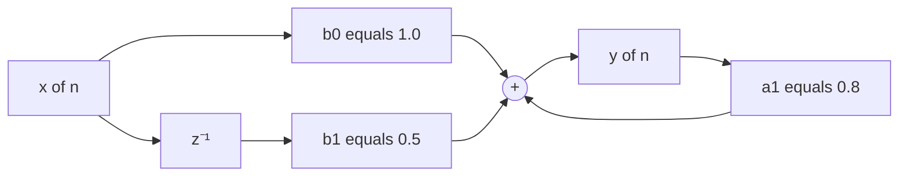

**Step 5:** Validation in Python:

```python
from scipy.signal import lfilter

# Coefficients from H(z) = (1 + 0.5 z^-1) / (1 - 0.8 z^-1)
b_sys = [1.0, 0.5]
a_sys = [1.0, -0.8]

# Test input: unit step
n = np.arange(20) if 'np' in dir() else range(20)
import numpy as np
n = np.arange(20)
x_step = np.ones(20)
y_step = lfilter(b_sys, a_sys, x_step)

print("Step response y[n]:")
print(np.round(y_step, 3))
# Should converge to: 1/(1 - 0.8) = 5.0 for the DC gain
```

---

<!-- SECTION_3_END -->

<!-- SECTION_4_START -->

# Structural Diagrams & Schematics

## 9. Master Architecture: Complete First-Order System Realization

The following Mermaid diagram shows a **complete Direct Form I** realization of a generic first-order system, illustrating how all five canonical elements connect:

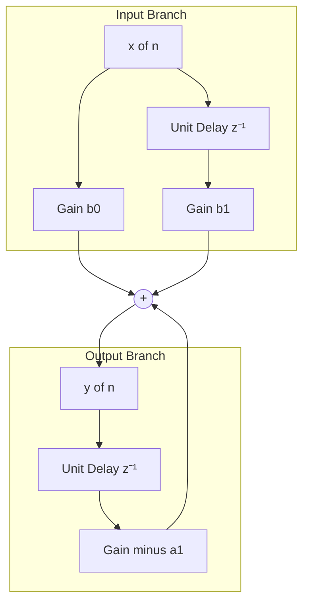

> [!NOTE]
> **Reading the Diagram:** The top half is the **feedforward (zero) path**; the bottom half is the **feedback (pole) path**. The summer is the meeting point. This topology is universal and appears in every KTU question on block diagram realization.

---

## 10. Sequential Processing Topology: How a Sample Flows Through the System

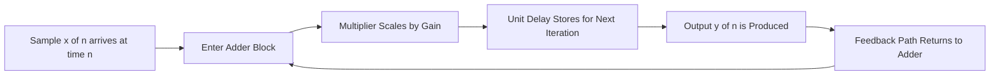

> [!IMPORTANT]
> **KTU Insight:** This cyclic flow is what makes a system **recursive** (has memory of past outputs). Breaking the feedback loop — e.g., by setting $a_1 = 0$ — converts it into a **non-recursive FIR** system.

---

## 11. Functional Architecture: Mapping Blocks to Hardware

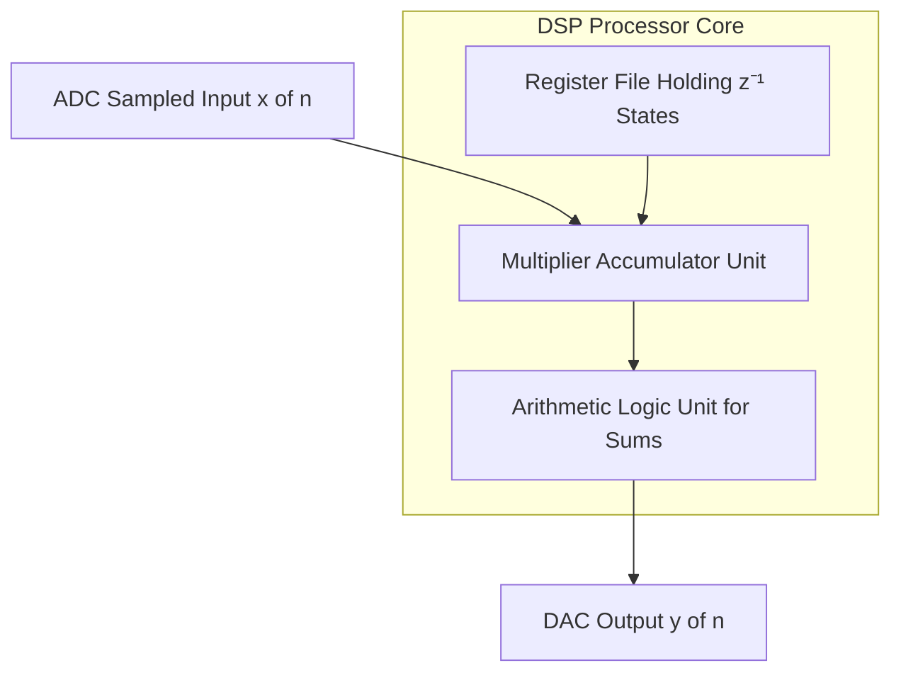

> [!NOTE]
> **Real Hardware Mapping:** 
> * **Constant Multiplier** $\rightarrow$ Shift-and-Add unit in fixed-point DSP
> * **Unit Delay** $\rightarrow$ Memory register (1 flip-flop per delay)
> * **Adder** $\rightarrow$ ALU adder
> * **Signal Multiplier** $\rightarrow$ Hardware MAC unit
> * **Unit Advance** $\rightarrow$ Cannot be implemented in real-time; requires look-ahead buffers

---

## 12. Comparison Matrix: Element Causality and Memory Properties

| Block Element | Introduces Memory? | Real-Time Causality | Z-Domain Pole/Zero | Hardware Cost (Gates) |
|---|---|---|---|---|
| Adder | No | Causal | None | Very Low |
| Constant Multiplier | No | Causal | None (gain only) | Low |
| Signal Multiplier | No | Causal | Nonlinear — no poles | Medium |
| Unit Delay | **Yes (1 tap)** | **Causal** | Pole at $z = 0$ | 1 Flip-Flop |
| Unit Advance | Yes (future) | **Non-Causal** | Zero at $z = 0$ | Buffer RAM |

---

<!-- SECTION_4_END -->

<!-- SECTION_5_START -->

# KTU 2024 Scheme Examination Question Bank & Topic Recap

## 13. Part A Questions (3 Marks Each)

### Question 1
**[KTU University Exam - July 2024]**
**Q:** Define a discrete-time system. What is the significance of a unit delay element in the block diagram representation of a discrete-time system?

**Model Answer (3 Marks):**
A discrete-time system is a mathematical operator $T\{\cdot\}$ that transforms an input sequence $x[n]$ into an output sequence $y[n]$ as $y[n] = T\{x[n]\}$, where $n$ is an integer index. **[1 Mark]**
The unit delay element produces $y[n] = x[n-1]$ and is the fundamental memory element in any discrete-time system. **[1 Mark]**
It introduces one-step memory, enables recursive (feedback) structures, and corresponds to $z^{-1}$ in the Z-domain — without it, no system can have dynamics or state. **[1 Mark]**

**[CO1, Remember/Understand]**

### Question 2
**[KTU University Exam - Dec 2023]**
**Q:** Distinguish between a unit delay element and a unit advance element. State the causality of a system containing a unit advance.

**Model Answer (3 Marks):**
The unit delay produces $y[n] = x[n-1]$ (a past sample), while the unit advance produces $y[n] = x[n+1]$ (a future sample). **[1 Mark]**
In the Z-domain, delay corresponds to $z^{-1}$ and advance corresponds to $z$. **[1 Mark]**
A system containing a unit advance is **non-causal** because computing the output at time $n$ requires a sample from time $n+1$, which is not yet available in real-time operation. **[1 Mark]**

**[CO1, Understand]**

---

## 14. Part B Questions (14 Marks Each — Internal Choice)

### Question A (Choice 1)

**[KTU University Exam - July 2024 | CO2, Apply/Analyze]**

**(a)** Draw the block diagram representation of a discrete-time system described by the difference equation:
$$y[n] = 0.5 \, y[n-1] + x[n] + 0.2 \, x[n-1]$$
Identify the canonical elements used. **[7 Marks]**

**(b)** Derive the transfer function $H(z)$ of the system in (a) and determine its impulse response $h[n]$ for the first 4 samples. **[7 Marks]**

#### Model Solution

**(a) Block Diagram Construction [7 Marks]**

**Identification of Elements [2 Marks]:**
- One **adder** (summer junction)
- Three **constant multipliers** (0.5, 1.0, 0.2)
- Two **unit delays** ($z^{-1}$ for input and output paths)

**Block Diagram [3 Marks]:**

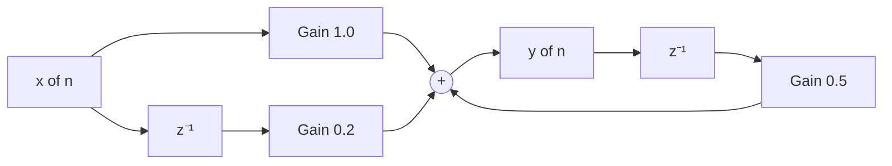

**Element Listing [2 Marks]:**
- Adder: combines 3 signals (2 feedforward, 1 feedback)
- Constant multipliers: 1.0, 0.2, 0.5
- Unit delays: 2 (one on input path, one on feedback path)

**(b) Transfer Function and Impulse Response [7 Marks]**

**Step 1: Rearrange difference equation [1 Mark]:**
$$y[n] - 0.5 \, y[n-1] = x[n] + 0.2 \, x[n-1]$$

**Step 2: Apply Z-transform [2 Marks]:**
$$Y(z) - 0.5 \, z^{-1} Y(z) = X(z) + 0.2 \, z^{-1} X(z)$$
$$Y(z) \left(1 - 0.5 \, z^{-1}\right) = X(z) \left(1 + 0.2 \, z^{-1}\right)$$

**Step 3: Solve for transfer function [1 Mark]:**
$$H(z) = \frac{Y(z)}{X(z)} = \frac{1 + 0.2 \, z^{-1}}{1 - 0.5 \, z^{-1}}$$

**Step 4: Compute impulse response [3 Marks]:**
To find $h[n]$, set $x[n] = \delta[n]$ (so $X(z) = 1$).
$$h[n] - 0.5 \, h[n-1] = \delta[n] + 0.2 \, \delta[n-1]$$

By long division: $H(z) = \frac{1 + 0.2z^{-1}}{1 - 0.5z^{-1}}$. Performing polynomial division:
$$H(z) = (1 + 0.2z^{-1}) \cdot (1 + 0.5z^{-1} + 0.25z^{-2} + 0.125z^{-3} + \ldots)$$

Computing $h[n]$ recursively:
- $h[0] = 1$
- $h[1] = 0.5 \cdot h[0] + 0.2 = 0.5 + 0.2 = 0.7$
- $h[2] = 0.5 \cdot h[1] = 0.35$
- $h[3] = 0.5 \cdot h[2] = 0.175$

**[Stating the difference equation: 1 Mark]**
**[Z-transform application: 2 Marks]**
**[Final transfer function: 1 Mark]**
**[Impulse response values: 3 Marks]**

---

### Question B (Choice 2)

**[KTU University Exam - Dec 2023 | CO2, Apply/Analyze]**

**(a)** Explain any **five** common building block elements of discrete-time systems with their block diagrams and input-output relations. **[7 Marks]**

**(b)** For a system described by $y[n] = 0.4 \, x[n] + 0.3 \, x[n-1] + 0.2 \, x[n-2]$, draw the block diagram, derive $H(z)$, and comment on causality and stability. **[7 Marks]**

#### Model Solution

**(a) Five Common Building Blocks [7 Marks]**

**1. Adder [1.4 Marks]:** $y[n] = x_1[n] + x_2[n]$ — Combines two or more sequences sample-wise; denoted by a circle with $+$ sign.

**2. Constant Multiplier [1.4 Marks]:** $y[n] = a \cdot x[n]$ — Scales the input by a fixed gain $a$; denoted by a triangle or rectangular box labeled with the constant.

**3. Signal Multiplier [1.4 Marks]:** $y[n] = x_1[n] \cdot x_2[n]$ — Pointwise multiplication of two sequences; denoted by a circle with $\times$ sign.

**4. Unit Delay [1.4 Marks]:** $y[n] = x[n-1]$ — Delays the signal by one sample; denoted by a box labeled $z^{-1}$ or $D$. **Most important memory element.**

**5. Unit Advance [1.4 Marks]:** $y[n] = x[n+1]$ — Produces a future sample; denoted by $z$ block. **Non-causal.**

**(b) Block Diagram, Transfer Function, Causality & Stability [7 Marks]**

**Step 1: Block Diagram [2 Marks]**

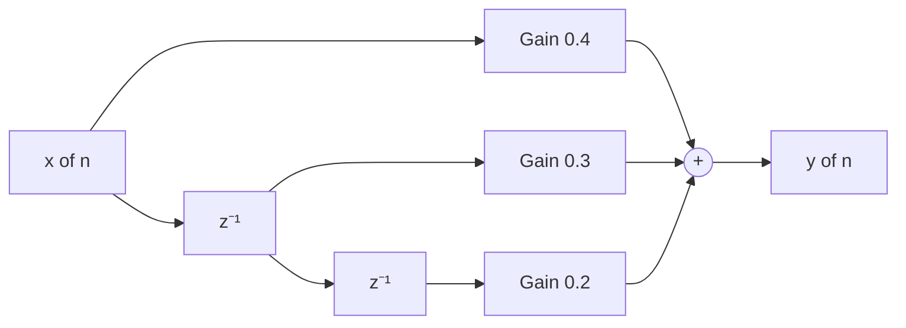

**Step 2: Z-domain derivation [2 Marks]**
$$Y(z) = 0.4 \, X(z) + 0.3 \, z^{-1} X(z) + 0.2 \, z^{-2} X(z)$$
$$H(z) = \frac{Y(z)}{X(z)} = 0.4 + 0.3 \, z^{-1} + 0.2 \, z^{-2}$$

**Step 3: Causality [1.5 Marks]**
The system depends only on $x[n]$, $x[n-1]$, and $x[n-2]$ (current and past inputs only). No future samples are required. **The system is CAUSAL.**

**Step 4: Stability [1.5 Marks]**
The system has no feedback path (no denominator terms), hence no poles except possibly at $z = 0$. All FIR systems with finite coefficients are **BIBO stable**.

**[Block diagram accuracy: 2 Marks]**
**[Transfer function: 2 Marks]**
**[Causality argument: 1.5 Marks]**
**[Stability argument: 1.5 Marks]**

---

> [!WARNING]
> **KTU Examiner's Valuation Pitfalls — Common Mark Losers**
> 1. **Forgetting to show the delay block** in the block diagram when the equation contains $x[n-1]$ or $y[n-1]$. Always explicitly draw $z^{-1}$ boxes.
> 2. **Wrong sign in the feedback path.** When moving $a_k y[n-k]$ to the LHS, the feedback multiplier in the diagram must be $-a_k$, not $+a_k$.
> 3. **Confusing advance with delay.** The unit advance ($z$) is non-causal and rarely appears in realizable real-time systems. Examiners check this carefully.
> 4. **Skipping the cross-multiplication step** in the transfer function derivation. Always write $Y(z)(1 + a_1 z^{-1} + \ldots) = X(z)(b_0 + b_1 z^{-1} + \ldots)$ explicitly.
> 5. **Not labeling sample indices on block diagram arrows.** Every wire must show $x[n]$, $x[n-1]$, $y[n]$, etc. Unlabeled diagrams lose 1–2 marks.
> 6. **Treating signal multiplier as linear.** The product of two signals is **nonlinear** — no $H(z)$ exists for it.

---

## 15. Topic Recap & Important Things to Remember

- **Discrete-Time System:** Mathematical operator mapping $x[n] \rightarrow y[n]$ where $n \in \mathbb{Z}$.
- **Five Canonical Blocks:** Adder, Constant Multiplier, Signal Multiplier, Unit Delay ($z^{-1}$), Unit Advance ($z$).
- **Unit Delay** is the **memory element** — equivalent to a flip-flop in hardware and to $z^{-1}$ in the Z-domain.
- **Unit Advance** is **non-causal** — it requires future input samples, making real-time implementation impossible without look-ahead buffers.
- **LCCDE Form:** $y[n] = -\sum a_k y[n-k] + \sum b_m x[n-m]$.
- **Transfer Function:** $H(z) = \frac{\sum b_m z^{-m}}{1 + \sum a_k z^{-k}}$.
- **Block Diagram Translation Rule:** Replace $x[n-k]$ with a chain of $k$ unit delays; replace $a \cdot x[n]$ with a constant multiplier of $a$; replace the sum of terms with an adder.
- **Direct Form I Topology:** Feedforward path (zeros) on top, feedback path (poles) on bottom, summer in the middle.
- **Causality Rule:** A system is causal **iff** it depends only on present and past inputs (no $z^{+k}$ terms).
- **FIR vs IIR:** FIR systems have all $a_k = 0$ (no feedback) — always stable. IIR systems have at least one $a_k \neq 0$ — stability requires poles inside the unit circle.
- **Hardware Cost:** Each unit delay = 1 flip-flop; multiplier = shift-and-add logic; adder = simple combinational logic.
- **Real-Time Industrial Domains:** Audio codecs, digital controllers, communications receivers, biomedical implants, radar, and image processing pipelines.

---

<!-- SECTION_5_END -->
