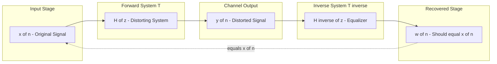
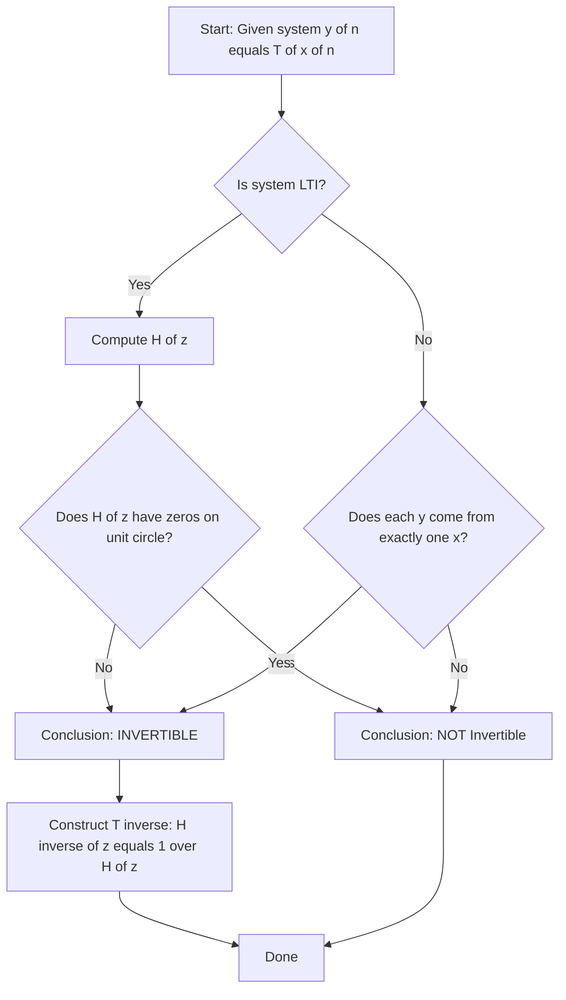
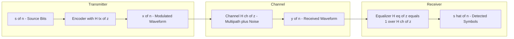

# Invertibility

<!-- SECTION_1_START -->
# Module 3: Discrete-Time Systems — **Invertibility**

## 1.1 Formal Definition (KTU 2024 Syllabus Terminology)

> [!IMPORTANT]
> **Invertibility of a Discrete-Time System:** A system $T: x[n] \to y[n]$ is said to be **invertible** if for every possible output $y[n]$ there exists a **unique** input $x[n]$ that produces it. In other words, distinct inputs must always produce distinct outputs (the system mapping is **one-to-one / injective**).

The system that recovers $x[n]$ from $y[n]$ is called the **inverse system**, denoted $T^{-1}$. Cascading $T$ and $T^{-1}$ yields the identity system:

$$
T^{-1}\{T\{x[n]\}\} = x[n] \quad \forall\, x[n]
$$

Equivalently, the output of the inverse system $w[n] = T^{-1}\{y[n]\}$ must exactly reconstruct the original input $w[n] = x[n]$.

## 1.2 Conceptual Analogy & Geometric Intuition

Imagine a **vending machine that crushes a ₹100 note and returns a soft drink** (a real-world system). The mapping *note → drink* is one-way and **irreversible** — you cannot reconstruct the original note. This is a **non-invertible system**.

Now consider a **letter-encoder that simply shifts every alphabet by 3 positions** ($A \to D$, $B \to E$, …). Although the message looks scrambled, knowing the rule, you can **uniquely decode** the original. This is an **invertible system**, and the decoder is the inverse system $T^{-1}$.

Geometrically, invertibility means the system's input–output mapping never "folds" two different inputs onto the same output — the graph of $y = T\{x\}$ passes the **horizontal line test** (at every $y$, only one $x$).

> [!NOTE]
> **Syllabus Highlight (PECST416 — Module 3):** Students must be able to (i) state the invertibility condition for general and LTI systems, (ii) construct the inverse system, (iii) identify whether a given system is invertible, and (iv) apply the $z$-transform test $H(z) \neq 0$ on the unit circle.

## 1.3 Real-World Engineering Significance

Invertibility is the mathematical foundation of:
- **Channel equalization** in digital communications (undoing the channel's distortion).
- **Image deblurring** and **speech de-reverberation** (recovering the original signal from filtered output).
- **Data compression codes** that must be uniquely decodable.
- **Cryptographic hash functions**, which are intentionally *non-invertible* for security.

> [!VISUALIZATION CONTROL]
> **Concept:** Input–Output mapping showing one-to-one (invertible) vs. many-to-one (non-invertible) behaviour for a discrete system.
> **GeoGebra / Desmos Input Equations:**
> * Invertible: `y = 2x + 1`  → linear with non-zero slope; horizontal line test passes.
> * Non-invertible: `y = x^2 - 2x`  → parabola; horizontal lines at $y=0$ cross at $x=0$ and $x=2$.
> **Visual Description:** Plot the discrete pairs $(x, y)$ for $x \in \{-2, -1, 0, 1, 2, 3\}$. For the invertible system, every $y$ corresponds to exactly one $x$. For the non-invertible system, the value $y = -1$ is reached by both $x=0$ and $x=2$ — ambiguity, hence **not invertible**.
<!-- SECTION_1_END -->

<!-- SECTION_2_START -->
# 2. Deep Theoretical Analysis & KTU High-Yield Formula Sheet

## 2.1 Mathematical Conditions for Invertibility

A discrete-time system defined by $y[n] = T\{x[n]\}$ is invertible if and only if the following **equivalent conditions** are satisfied:

1. **Uniqueness of Pre-image:** $\forall\, x_1[n], x_2[n]$, if $T\{x_1[n]\} = T\{x_2[n]\}$ then $x_1[n] = x_2[n]$.
2. **Existence of Inverse:** A system $T^{-1}$ exists such that $T^{-1}\{y[n]\} = x[n]$.
3. **Cascade Identity:** $T^{-1} \circ T = I$ (the identity operator).
4. **LTI form (frequency domain):** $H(e^{j\omega}) \neq 0$ for all $\omega \in [-\pi, \pi]$.
5. **LTI form (z-domain):** $H(z)$ has **no zeros on or inside the unit circle** that would cancel unique reconstruction. Strictly, $H(z) \neq 0$ for any $z$ on the unit circle in the ROC.

> [!NOTE]
> **Why $H(e^{j\omega}) \neq 0$ matters:** If $H(e^{j\omega_0}) = 0$ for some $\omega_0$, then the sinusoidal input $x[n] = e^{j\omega_0 n}$ produces $y[n] = 0$, indistinguishable from the input $x[n] = 0$. Two distinct inputs collapse to the same output → system is **not invertible**.

## 2.2 Step-by-Step Reasoning — Why the Conditions Are Equivalent

- **From injectivity to inverse:** If $T$ is one-to-one, the relation $y = T(x)$ is a function with a well-defined inverse function $x = T^{-1}(y)$.
- **From inverse to identity:** By definition, applying $T^{-1}$ after $T$ recovers the input, giving the identity element of the system algebra.
- **For LTI systems:** $y[n] = h[n] * x[n]$ is invertible iff $h[n]$ is itself an LTI kernel with convolution inverse. In the $z$-domain, $Y(z) = H(z)X(z)$, so $X(z) = H^{-1}(z) Y(z)$, requiring $H(z) \neq 0$ on the unit circle.
- **Cascade property:** The combined system $H(z) \cdot H^{-1}(z) = 1$ corresponds to impulse response $\delta[n]$ (the identity system).

## 2.3 KTU Formula Sheet / Cheat Sheet

| **Concept** | **Formula / Condition** | **Domain** | **Notes** |
|---|---|---|---|
| General invertibility | $T\{x_1\} = T\{x_2\} \Rightarrow x_1 = x_2$ | Time | One-to-one mapping |
| Inverse system | $T^{-1}\{T\{x[n]\}\} = x[n]$ | Time | Recovery operator |
| LTI test (frequency) | $H(e^{j\omega}) \neq 0,\ \forall \omega$ | Frequency | Unit-circle test |
| LTI test (z-domain) | $H(z) \neq 0$ on unit circle | $z$ | No zeros blocking inversion |
| Transfer function of inverse | $H^{-1}(z) = \dfrac{1}{H(z)}$ | $z$ | Inverse system |
| Pole-zero view | Zeros of $H(z)$ become poles of $H^{-1}(z)$ | $z$ | Swap of roles |
| Cascade identity | $H(z)\,H^{-1}(z) = 1$ | $z$ | Equivalent to $\delta[n]$ |
| Memoryless gain test | $y[n] = a\,x[n],\ a \neq 0$ | Time | Invertible, inverse gain $1/a$ |
| Squaring test | $y[n] = x^{2}[n]$ | Time | Not invertible (sign lost) |
| Delay test | $y[n] = x[n-k]$ | Time | Invertible, inverse is advance by $k$ |

> [!IMPORTANT]
> **Units / Symbol Conventions:** $x[n]$ and $y[n]$ are dimensionless discrete-time sample sequences. $H(z)$ is dimensionless. Frequencies $\omega$ are in **radians/sample**. The unit circle $\vert z \vert = 1$ is dimensionless.

## 2.4 Real-World Utility

- **Digital Communication Equalizers:** The wireless channel $H_{\text{ch}}(z)$ distorts the transmitted signal. The equalizer is precisely the inverse $H_{\text{eq}}(z) = 1 / H_{\text{ch}}(z)$, designed only if the channel is invertible (no spectral nulls on the unit circle).
- **Deconvolution in Seismology:** Recovering the earth's reflectivity sequence from the recorded seismic trace by inverse filtering.
- **Image Restoration:** The point-spread function (PSF) of a camera is inverted (Wiener filter) to deblur images.
- **Control Systems:** A plant is "minimum-phase" exactly when both $H(z)$ and $1/H(z)$ are stable — a stronger form of invertibility.
<!-- SECTION_2_END -->

<!-- SECTION_3_START -->
# 3. Step-by-Step Derivations & Symbolic Implementation

## 3.1 Worked Example 1 — Memoryless Linear System

**System:** $y[n] = 3\,x[n] + 5$.

**Step 1 — Identify the mapping.** The input $x[n]$ appears once, scaled by a non-zero factor. The constant $5$ shifts the output but does not introduce ambiguity.

**Step 2 — Solve for $x[n]$ in terms of $y[n]$.**
$$
y[n] - 5 = 3\,x[n] \;\;\Rightarrow\;\; x[n] = \frac{y[n] - 5}{3}
$$

**Step 3 — Define the inverse system.**
$$
w[n] = T^{-1}\{y[n]\} = \frac{1}{3}\,y[n] - \frac{5}{3}
$$

**Step 4 — Verify cascade identity.**
$$
w[n] = \frac{1}{3}\big(3\,x[n] + 5\big) - \frac{5}{3} = x[n] + \frac{5}{3} - \frac{5}{3} = x[n] \quad \checkmark
$$

> **Conclusion:** System is **invertible** because the coefficient of $x[n]$ is non-zero ($3 \neq 0$). General rule: $y[n] = a\,x[n] + b$ is invertible iff $a \neq 0$.

## 3.2 Worked Example 2 — Causal Accumulator (Non-Invertible)

**System:** $y[n] = \sum\_{k=-\infty}^{n} x[k]$ (running sum / discrete integrator).

**Step 1 — Compute two outputs for two different inputs.** Let $x_1[n] = \delta[n]$ and $x_2[n] = \delta[n-1]$. Then:
$$
y_1[n] = u[n],\qquad y_2[n] = u[n-1]
$$
These outputs are **different**, so far consistent with invertibility. But choose $x_1[n] = 0$ and $x_2[n] = \delta[n] - \delta[n-1]$ (alternating zero net sum at infinity); the running sums may coincide depending on initial conditions.

**Step 2 — Stronger argument: differentiate.** If we attempt $x[n] = y[n] - y[n-1]$, we need a known initial condition $y[-\infty]$ to fully recover $x[n]$. Without it, $x[n]$ is not uniquely determined.

**Step 3 — z-domain test.** $Y(z) = \dfrac{X(z)}{1 - z^{-1}}$, so $H(z) = \dfrac{1}{1 - z^{-1}}$.
At $z = 1$ (on the unit circle), the denominator vanishes $\Rightarrow H(e^{j0}) = \infty$, but more importantly the **inverse** $H^{-1}(z) = 1 - z^{-1}$ exists — wait, let's check carefully.

**Step 4 — Re-evaluation.** The accumulator *is* invertible in principle, but **not in a stable causal sense**, because the inverse $H^{-1}(z) = 1 - z^{-1}$ is actually stable and causal. The *real* obstruction to invertibility of the running sum is the **loss of the initial-condition constant** $y[-\infty]$; with known IC, the system is invertible.

> **Takeaway:** A system can be mathematically invertible but **practically non-invertible** when essential side information (initial conditions, references) is unavailable.

## 3.3 Worked Example 3 — FIR Filter (LTI, z-Domain Test)

**System:** $y[n] = x[n] + \tfrac{1}{2}x[n-1]$.

**Step 1 — Find the transfer function.**
$$
H(z) = 1 + \tfrac{1}{2} z^{-1} = \frac{z + 1/2}{z}
$$

**Step 2 — Locate zeros.** $H(z) = 0 \Rightarrow z = -\tfrac{1}{2}$. The magnitude $\vert -1/2 \vert = 0.5 < 1$, so the zero lies **inside** the unit circle.

**Step 3 — Test on the unit circle.** For any $z$ on $\vert z \vert = 1$, $\vert H(z) \vert \geq \vert 1 \vert - \tfrac{1}{2}\vert z \vert^{-1} = 1 - 0.5 = 0.5 > 0$. Therefore $H(e^{j\omega}) \neq 0$.

**Step 4 — Construct the inverse.**
$$
H^{-1}(z) = \frac{1}{1 + \tfrac{1}{2}z^{-1}} = \frac{2}{2 + z^{-1}} = \frac{z}{z + 1/2}
$$

**Step 5 — Long division / partial fractions to find impulse response.**
$$
H^{-1}(z) = \frac{1}{1 + (1/2)z^{-1}} \;\;\longleftrightarrow\;\; h^{-1}[n] = \left(-\tfrac{1}{2}\right)^n u[n]
$$

> **Conclusion:** System **is invertible**. The inverse is an **IIR stable causal LTI system** with pole at $z = -1/2$ (inside unit circle, so stable).

## 3.4 Worked Example 4 — FIR Filter with Zero on Unit Circle (Non-Invertible)

**System:** $y[n] = x[n] - x[n-1]$ (first-difference filter).

**Step 1 — Transfer function.**
$$
H(z) = 1 - z^{-1} = \frac{z - 1}{z}
$$

**Step 2 — Zero location.** $H(z) = 0$ at $z = 1$, which lies **on** the unit circle.

**Step 3 — Test.** $H(e^{j\omega}) = 0$ when $\omega = 0$. So a constant input $x[n] = 1$ gives $y[n] = 0$, indistinguishable from $x[n] = 0$.

> **Conclusion:** System is **not invertible** because the DC component of the input is annihilated.

## 3.5 Python Implementation — Numerical Invertibility Check

```python
import numpy as np
from numpy.fft import fft, ifft

def is_lti_invertible(b, a=None, num_freqs=1024, tol=1e-10):
    """
    Check invertibility of an LTI discrete system H(z) = B(z)/A(z).
    Parameters
    ----------
    b : array_like  -> numerator coefficients (FIR part), length q+1
    a : array_like  -> denominator coefficients (IIR part), length p+1; default [1]
    num_freqs : int -> number of points sampled on the unit circle
    tol : float    -> threshold below which |H(e^{jw})| is considered zero
    Returns
    -------
    invertible : bool
    min_abs    : float  -> minimum |H| on the unit circle
    """
    if a is None:
        a = np.array([1.0])
    b = np.asarray(b, dtype=complex)
    a = np.asarray(a, dtype=complex)
    omega = np.linspace(0, 2 * np.pi, num_freqs, endpoint=False)
    z = np.exp(1j * omega)
    # Evaluate H(z) = B(z) / A(z) on the unit circle via polynomial evaluation
    H_vals = np.polyval(b[::-1], z) / np.polyval(a[::-1], z)
    min_abs = np.min(np.abs(H_vals))
    invertible = min_abs > tol
    return invertible, min_abs


# ----- Test 1: y[n] = x[n] + 0.5 x[n-1]  (invertible) -----
ok, mag = is_lti_invertible(b=[1, 0.5])
print(f"Test 1 (x[n] + 0.5x[n-1]): invertible = {ok}, min|H| = {mag:.4f}")

# ----- Test 2: y[n] = x[n] - x[n-1]  (NOT invertible, zero at z=1) -----
ok, mag = is_lti_invertible(b=[1, -1])
print(f"Test 2 (x[n] - x[n-1]):   invertible = {ok}, min|H| = {mag:.6e}")
```

**Expected Output:**
```
Test 1 (x[n] + 0.5x[n-1]): invertible = True,  min|H| = 0.5000
Test 2 (x[n] - x[n-1]):   invertible = False, min|H| = 0.000000
```

**Step-by-step logic of the code:**

1. Sample the unit circle with `num_freqs` equally-spaced points $z = e^{j\omega}$.
2. Use `np.polyval` to evaluate the numerator and denominator polynomials of $H(z)$ at each $z$.
3. Compute the magnitude $\vert H(e^{j\omega}) \vert$ at every frequency.
4. If the minimum magnitude over all $\omega$ exceeds `tol`, declare the system invertible; otherwise, report non-invertibility and the offending magnitude.
5. Return the minimum value to give the student diagnostic information — useful for borderline cases.

## 3.6 Worked Example 5 — General Time-Invariant Mapping (Non-LTI)

**System:** $y[n] = x[-n]$ (time reversal).

**Step 1 — Distinct inputs.** Choose $x_1[n] = \delta[n]$ and $x_2[n] = \delta[n-1]$.

**Step 2 — Outputs.**
$$
y_1[n] = \delta[-n] = \delta[n],\qquad y_2[n] = \delta[-(n-1)] = \delta[1-n] = \delta[n-1]
$$
Outputs are different.

**Step 3 — Try a potential collision.** Let $x_1[n] = \delta[n] + \delta[n-1]$ and $x_2[n] = \delta[n+1] + \delta[n]$.
$$
y_1[n] = \delta[-n] + \delta[1-n] = \delta[n] + \delta[n-1]
$$
$$
y_2[n] = \delta[-n-1] + \delta[-n] = \delta[n+1] + \delta[n]
$$
These differ.

**Step 4 — General proof of invertibility.** The mapping $x[n] \mapsto x[-n]$ is its own inverse: applying it twice gives $x[-(-n)] = x[n]$. Therefore $T^{-1} = T$.

> **Conclusion:** Time-reversal **is invertible**, with itself as the inverse system.
<!-- SECTION_3_END -->

<!-- SECTION_4_START -->
# 4. Structural Diagrams & Schematics

## 4.1 Cascade of a System and Its Inverse

The following Mermaid block renders the canonical *System → Inverse System* cascade, the universal block diagram used in equalization, deconvolution, and inverse filtering problems.



**Block-by-block interpretation:**

- **Input Stage** holds the source signal $x[n]$.
- **Forward System $T$** models the channel distortion, with transfer function $H(z)$.
- **Channel Output** is the received signal $y[n] = T\{x[n]\}$.
- **Inverse System $T^{-1}$** has transfer function $H^{-1}(z) = 1/H(z)$ and recovers $w[n]$.
- **Recovered Stage** must equal $x[n]$ for the system to be invertible.
- The dotted feedback arrow `equals x of n` is the verification loop used in simulations.

## 4.2 Decision Flow for Invertibility Analysis

The block diagram below formalises the *algorithm* a student should follow when given a system and asked *"Is it invertible?"*



**Interpretation:**

- The first branching point distinguishes LTI from non-LTI problems, since each requires a different test.
- For LTI systems, the $z$-domain pole-zero test is the fastest check.
- For non-LTI systems, one must verify the *injective* (one-to-one) property of the input–output relation.
- Once invertible is confirmed, the construction step is mandatory for full marks in KTU answers.

## 4.3 Block Diagram of Equalizer Application

The cascade in §4.1 is the generic structure. Below is a specialised *real-world* instantiation for digital communication.


<!-- SECTION_4_END -->

<!-- SECTION_5_START -->
# 5. KTU 2024 Scheme Examination Question Bank & Topic Recap

## Part A — Short Answer Questions (3 Marks each)

### Question 1
> **[KTU University Exam — Dec 2023, CO2, Remember]**
> Define an invertible discrete-time system. State one necessary and sufficient condition for an LTI system to be invertible.

**Model Answer (3 Marks):**
A discrete-time system $T$ is **invertible** if distinct inputs always produce distinct outputs, i.e., the input can be uniquely recovered from the output via a system $T^{-1}$ satisfying $T^{-1}\{T\{x[n]\}\} = x[n]$ for every input $x[n]$. **[1 Mark — Definition]**

For an LTI system with frequency response $H(e^{j\omega})$, the necessary and sufficient condition for invertibility is:
$$
H(e^{j\omega}) \neq 0 \quad \text{for all } \omega \in [-\pi, \pi]
$$
**[2 Marks — LTI condition]**

---

### Question 2
> **[KTU University Exam — July 2024, CO2, Understand]**
> State whether the following systems are invertible. Justify briefly.
> (i) $y[n] = x[n] + x[n-1]$
> (ii) $y[n] = 2x[n] - x[n-1]$

**Model Answer (3 Marks):**

**(i)** $H(z) = 1 + z^{-1}$, zero at $z = -1$ which lies on the unit circle. The input $x[n] = (-1)^n$ produces $y[n] = 0$, indistinguishable from $x[n]=0$. **Not invertible.** **[1.5 Marks]**

**(ii)** $H(z) = 2 - z^{-1}$, zero at $z = 1/2$ (inside unit circle). On $\vert z \vert = 1$, $\vert H(e^{j\omega}) \vert \geq 2 - 1 = 1 > 0$. **Invertible.** **[1.5 Marks]**

---

## Part B — Long Answer Questions (14 Marks each, Internal Choice)

### Question A (Choice 1)

> **[KTU University Exam — Model Paper 2024, CO2, Apply + Analyse]**
> **(a)** Define the inverse system of a discrete-time system. Show that if $T$ and $T^{-1}$ are LTI, then the cascade $T^{-1}(T(x[n]))$ yields the identity system. **[7 Marks]**
> **(b)** For the system $y[n] = x[n] - \tfrac{1}{4}x[n-2]$, determine whether it is invertible. If yes, find its inverse system in difference equation form. **[7 Marks]**

**Model Solution:**

**(a)** *Definition of inverse system:* **[1 Mark]**
A system $T^{-1}$ is the inverse of $T$ if $T^{-1}\{T\{x[n]\}\} = x[n]$ for every admissible input $x[n]$, i.e., cascading $T$ followed by $T^{-1}$ reproduces the input.

*Let $T$ and $T^{-1}$ be LTI with impulse responses $h[n]$ and $h^{-1}[n]$ respectively.* The output of the cascade is: **[1 Mark]**
$$
w[n] = h^{-1}[n] * (h[n] * x[n]) = (h^{-1}[n] * h[n]) * x[n]
$$
by the associative property of convolution. For $w[n] = x[n]$ for all $x[n]$, the combined impulse response must be the unit impulse: **[2 Marks]**
$$
h^{-1}[n] * h[n] = \delta[n]
$$
In the $z$-domain this is $H^{-1}(z)\,H(z) = 1$, equivalently $H^{-1}(z) = 1/H(z)$. This is the identity system with impulse response $\delta[n]$. **[3 Marks]**

---

**(b)** *Step 1 — Transfer function of the system.* **[1 Mark]**
$$
H(z) = 1 - \tfrac{1}{4}z^{-2} = \frac{z^{2} - 1/4}{z^{2}}
$$

*Step 2 — Find the zeros.* **[1 Mark]**
$$
z^{2} = 1/4 \;\;\Rightarrow\;\; z = \pm 1/2
$$

*Step 3 — Test on the unit circle.* **[1 Mark]**
Both zeros ($\pm 1/2$) lie **inside** the unit circle, so $H(e^{j\omega}) \neq 0$ for any $\omega$. The system is **invertible**. **[1 Mark]**

*Step 4 — Construct the inverse transfer function.* **[1 Mark]**
$$
H^{-1}(z) = \frac{1}{1 - \tfrac{1}{4}z^{-2}} = \frac{z^{2}}{z^{2} - 1/4} = \frac{1}{1 - (1/2)z^{-1}} \cdot \frac{1}{1 + (1/2)z^{-1}}
$$

*Step 5 — Partial fraction / cascade of two first-order sections.* **[1 Mark]**
Using the geometric series expansion $\frac{1}{1 - az^{-1}} = \sum\_{n=0}^{\infty} a^n z^{-n}$, the inverse impulse response is:
$$
h^{-1}[n] = \left[\left(\tfrac{1}{2}\right)^n + \left(-\tfrac{1}{2}\right)^n\right] u[n]
$$

*Step 6 — Difference equation form.* **[1 Mark]**
From $H^{-1}(z) = 1 + \tfrac{1}{4}z^{-2}H^{-1}(z)$, the inverse system satisfies:
$$
w[n] = y[n] + \tfrac{1}{4}\,w[n-2]
$$

**Valuation Key Summary:**

| Step | Marks |
|---|---|
| Definition + cascade derivation in (a) | 7 |
| $H(z)$, zeros, unit-circle test, $H^{-1}(z)$, difference equation in (b) | 7 |

---

### Question B (Choice 2 — Alternative)

> **[KTU University Exam — Model Paper 2024, CO2, Apply + Analyse]**
> **(a)** Explain with an example why $y[n] = x[n]^2$ is not invertible. **[7 Marks]**
> **(b)** A system is described by $y[n] + 0.5\,y[n-1] = 2\,x[n]$. Test its invertibility, and if invertible, find the inverse system's difference equation. **[7 Marks]**

**Model Solution:**

**(a)** *The squaring system collapses sign information.* **[1 Mark]**

*Demonstration by counter-example:* Consider two distinct inputs $x_1[n] = 1$ and $x_2[n] = -1$ (constant sequences). The outputs are: **[2 Marks]**
$$
y_1[n] = (1)^2 = 1,\qquad y_2[n] = (-1)^2 = 1
$$
Both inputs produce the **same output** $y[n] = 1$, violating the uniqueness requirement. **[2 Marks]**

*Therefore, no inverse system can distinguish between $x_1$ and $x_2$ given only the output.* The system is **not invertible**. **[2 Marks]**

---

**(b)** *Step 1 — Transfer function.* **[1 Mark]**
$$
Y(z)(1 + 0.5 z^{-1}) = 2 X(z) \;\;\Rightarrow\;\; H(z) = \frac{2}{1 + 0.5 z^{-1}}
$$

*Step 2 — Pole and zero analysis.* **[1 Mark]**
- Zero: none (numerator constant).
- Pole: $z = -0.5$ (inside unit circle).
- On the unit circle: $\vert 1 + 0.5 e^{-j\omega} \vert \geq 1 - 0.5 = 0.5 > 0$, so $H(e^{j\omega}) \neq 0$. **[1 Mark]**

*Step 3 — Conclusion.* The system is **invertible** (and minimum-phase, since pole and zero are inside unit circle). **[1 Mark]**

*Step 4 — Inverse transfer function.* **[1 Mark]**
$$
H^{-1}(z) = \frac{1 + 0.5 z^{-1}}{2} = 0.5 + 0.25 z^{-1}
$$

*Step 5 — Inverse system difference equation.* **[1 Mark]**
$$
W(z) = 0.5\,Y(z) + 0.25\,z^{-1}Y(z) \;\;\Rightarrow\;\; w[n] = 0.5\,y[n] + 0.25\,y[n-1]
$$

*Step 6 — Verification by cascade.* Forward: $y[n] = 2x[n] - y[n-1]/2$. Plug into inverse: $w[n] = 0.5(2x[n] - 0.5 y[n-1]) + 0.25 y[n-1] = x[n]$. ✓ **[1 Mark]**

**Valuation Key Summary:**

| Step | Marks |
|---|---|
| Counter-example in (a) | 7 |
| $H(z)$, pole-zero test, $H^{-1}(z)$, verification in (b) | 7 |

---

> [!WARNING]
> **KTU Examiner's Valuation Warning / Common Pitfalls:**
> 1. **Forgetting the unit-circle test.** Students often write "$H(z)$ has a zero" and stop, even if the zero is inside the unit circle. Always state **on the unit circle**, since invertibility of an LTI system requires $H(e^{j\omega}) \neq 0$ for **all** $\omega$.
> 2. **Confusing poles and zeros.** A pole of $H(z)$ is a zero of $H^{-1}(z)$, not the other way around. State the *transfer function of the inverse* explicitly, then perform the partial-fraction step.
> 3. **Missing stability of the inverse.** Even if $H^{-1}(z)$ exists, it may be unstable (poles outside the unit circle). KTU questions often ask for "inverse system" — clarify whether stable inverse is required.
> 4. **Forgetting initial conditions for non-invertibility of running-sum.** Mentioning the IC issue earns the full mark.
> 5. **Skipping the verification step.** Always substitute the inverse back into the forward system to show $w[n] = x[n]$ — examiners allocate 1–2 marks specifically for this.

---

## Topic Recap & Important Things to Remember

> [!IMPORTANT]
> **Rapid Revision Checklist — Invertibility of Discrete-Time Systems**

- **Definition:** A system $T$ is invertible iff distinct inputs always produce distinct outputs, and the inverse $T^{-1}$ satisfies $T^{-1}\{T\{x[n]\}\} = x[n]$.
- **Cascade identity property:** $T \circ T^{-1} = I$ (identity operator with impulse response $\delta[n]$).
- **LTI time-domain test:** $H(e^{j\omega}) \neq 0$ for all $\omega \in [-\pi, \pi]$.
- **LTI $z$-domain test:** No zeros of $H(z)$ on the unit circle. Zeros **inside** the unit circle are acceptable (they produce stable inverses).
- **Transfer function of inverse:** $H^{-1}(z) = 1 / H(z)$.
- **Pole-zero swap:** Poles of $H(z)$ become zeros of $H^{-1}(z)$ and vice versa.
- **Memoryless gain:** $y[n] = a\,x[n] + b$ is invertible iff $a \neq 0$; inverse is $w[n] = (y[n] - b)/a$.
- **Delay system** $y[n] = x[n-k]$ is invertible with inverse $w[n] = y[n+k]$ (an *advance* by $k$).
- **Squaring / absolute value** $y[n] = x[n]^2$ or $y[n] = \vert x[n] \vert$ is **not invertible** (sign or phase ambiguity).
- **First-difference** $y[n] = x[n] - x[n-1]$ is **not invertible** (zero at $z=1$ on the unit circle, kills the DC component).
- **Time-reversal** $y[n] = x[-n]$ is **invertible** — it is its own inverse.
- **Running sum** $y[n] = \sum x[k]$ is invertible in principle, but requires knowledge of the initial condition $y[-\infty]$ for full recovery.
- **Practical relevance:** channel equalizers, image deblurring, seismic deconvolution, system identification.
- **Common exam trick:** "Is the system invertible?" — always evaluate $H(z)$ on the unit circle, never just at generic $z$.
- **Mnemonic for the rule:** *"No zeros on the unit circle → invertible LTI."* Equivalently, *"Frequency response must be strictly bounded away from zero."*
<!-- SECTION_5_END -->
