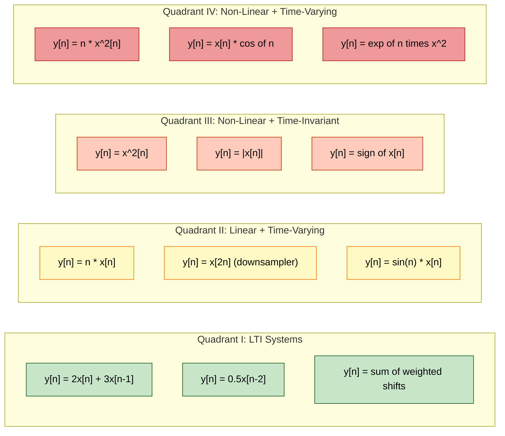
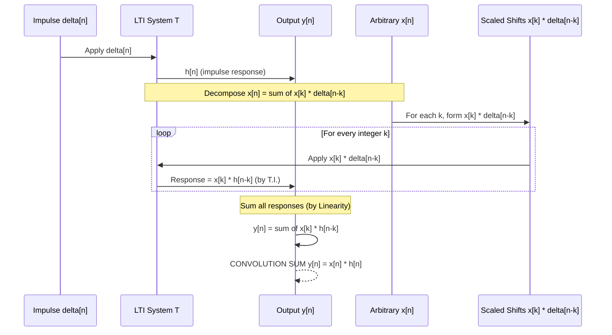

# Linearity and time invariance property of a DT system.

<!-- SECTION_1_START -->
# 1. Core Technical Definition & Intuitive Overview

## 1.1 Discrete-Time (DT) System — Formal Definition

A **Discrete-Time System** is a mathematical operator that transforms an input discrete-time signal $x[n]$ into an output discrete-time signal $y[n]$ according to a prescribed rule of operation. Formally, it is represented as:

$$y[n] = T\{x[n]\}$$

where $T\{\cdot\}$ denotes the system transformation operator, and $n \in \mathbb{Z}$ is the integer time index.

> [!NOTE]
> **KTU 2024 Syllabus Highlight (PECST416 — Module 3):**
> A DT system is classified by its fundamental properties: **Linearity**, **Time Invariance**, **Causality**, **Stability**, and **Memory**. The first two — *Linearity* and *Time Invariance* — jointly define the celebrated class of **LTI (Linear Time-Invariant) Systems**, which form the backbone of all digital signal processing, control engineering, and communication theory.

### 1.1.1 Block Representation of a DT System

$$
\boxed{\;x[n] \;\longrightarrow\; \boxed{\;T\{\cdot\}\;} \;\longrightarrow\; y[n]\;}
$$

The input is mapped to the output through a transformation block. For different system classes, the internal behavior of the block changes, but the input–output terminal structure remains identical.

---

## 1.2 Linearity — The Superposition Principle

A discrete-time system is said to be **linear** if and only if it obeys the **Superposition Principle**, which is the conjunction of two independent sub-properties:

### 1.2.1 Additivity

If $y_1[n] = T\{x_1[n]\}$ and $y_2[n] = T\{x_2[n]\}$, then:

$$T\{x_1[n] + x_2[n]\} = y_1[n] + y_2[n]$$

### 1.2.2 Homogeneity (Scaling Property)

For any arbitrary scalar constant $\alpha \in \mathbb{C}$ (or $\mathbb{R}$ for real-valued systems):

$$T\{\alpha\, x[n]\} = \alpha\, y[n]$$

### 1.2.3 Combined Linearity Condition

For arbitrary inputs $x_1[n], x_2[n]$ and arbitrary scalars $\alpha, \beta$:

$$\boxed{\;T\{\alpha\, x_1[n] + \beta\, x_2[n]\} = \alpha\, T\{x_1[n]\} + \beta\, T\{x_2[n]\}\;}$$

> [!IMPORTANT]
> **Board Examination Tip:** KTU evaluators award marks for **explicitly stating BOTH** additivity and homogeneity separately. A student who only checks one of the two is penalized. Always write: *"A system is linear if and only if it satisfies both additivity and homogeneity."*

### 1.2.4 Conceptual Analogy — The "Stretchable Rubber Sheet" Intuition

Imagine a DT system as a **rubber sheet** stretched across a frame.
- **Homogeneity** → If you push the sheet with force $\alpha$, the deformation at every point on the sheet also scales by $\alpha$. The shape of the deformation does not change, only its magnitude.
- **Additivity** → If you push the sheet with two different forces at the same time, the total deformation equals the sum of the deformations caused by each force individually.

A system violates linearity if, for instance, doubling the input does **not** double the output, or if the response to the sum of inputs is not the sum of the individual responses. A practical example: the system $y[n] = x^2[n]$ is **non-linear** because doubling the input quadruples the output (homogeneity fails).

---

## 1.3 Time Invariance (Shift Invariance)

A discrete-time system is said to be **Time Invariant** if a time shift (delay or advance) in the input signal produces an identical time shift in the output signal — with no other change in the output's shape, amplitude, or structure.

### 1.3.1 Mathematical Statement

Let $y[n] = T\{x[n]\}$. If we delay the input by $n_0$ samples to obtain $x[n - n_0]$, then the output must be $y[n - n_0]$ — i.e., the **same delay** must appear at the output. Formally:

$$\boxed{\;T\{x[n - n_0]\} = y[n - n_0]\;}$$

where $n_0$ is an arbitrary integer shift.

### 1.3.2 Conceptual Analogy — The "Photocopier" Intuition

Think of the DT system as a **photocopier** with a fixed magnification, contrast, and color profile.
- If you **shift a document on the scanner bed**, the photocopy also shifts by the same amount — but the text size, font, and color remain unchanged.
- This is precisely the meaning of time invariance: the system's *behavioral characteristics* (gain, frequency response, memory) do **not** depend on *when* you apply the input.

> [!NOTE]
> **Physical Constants & Standard Metrics (KTU 2024 Scheme):**
> - A time-invariant system has **constant coefficients** in its difference equation representation.
> - The shift $n_0$ can be **positive** (delay: $x[n - 3]$ means signal delayed by 3 samples) or **negative** (advance: $x[n + 2]$ means signal advanced by 2 samples).
> - The unit of $n_0$ is **samples** (dimensionless integer).

### 1.3.3 GeoGebra / Desmos Visualization Concept

> [!VISUALIZATION CONTROL]
> **Concept:** Visualizing Time Invariance — Input shift vs. Output shift.
> **GeoGebra / Desmos Input Equations:**
> * `x(n) = sin(0.3 * n) * (n >= 0)` (original causal sinusoid)
> * `x_shift(n) = sin(0.3 * (n - 5)) * ((n - 5) >= 0)` (input delayed by 5 samples)
> * `y(n) = 0.5 * x(n)` (example time-invariant system)
> * `y_shift(n) = 0.5 * x_shift(n)` (expected output shift)
> **Visual Description:** Plot four discrete stem plots on the same axis. The student should observe that the waveform of $y_{shift}[n]$ is **identical in shape** to $y[n]$ but **shifted right by 5 samples** — confirming time invariance.

---

## 1.4 The LTI System — Combining Both Properties

When a system is **both linear and time-invariant**, it is called an **LTI (Linear Time-Invariant) System**. This is the most important class of systems in KTU Signals & Systems because:

1. LTI systems are completely characterized by their **impulse response** $h[n]$.
2. The output is computed via the **convolution sum**: $y[n] = x[n] * h[n]$.
3. They are **analytically tractable** using $z$-transforms and DTFT.

> [!IMPORTANT]
> **LTI Systems — The Convolution Identity:**
> $$y[n] = \sum_{k=-\infty}^{+\infty} x[k]\, h[n-k] = x[n] * h[n]$$
> This identity is the *defining mathematical consequence* of linearity and time invariance. KTU board questions frequently test the derivation of this identity from the superposition principle.

<!-- SECTION_1_END -->

<!-- SECTION_2_START -->
# 2. Deep Theoretical Analysis & KTU High-Yield Formula Sheet

## 2.1 Algorithmic Procedure to Test Linearity

To determine whether a given DT system is linear, the KTU-validated test procedure consists of **four sequential steps**:

**Step 1 — Establish the System Equation:**  
Write the explicit input–output relationship $y[n] = T\{x[n]\}$ for the given system.

**Step 2 — Test Homogeneity (Scaling):**  
Apply a scaled input $\alpha\, x[n]$ to the system and compute the response $T\{\alpha\, x[n]\}$.  
Compare this against the expected scaled output $\alpha\, T\{x[n]\}$.  
If they are **equal for all** $\alpha \in \mathbb{R}$ (or $\mathbb{C}$), homogeneity holds.

**Step 3 — Test Additivity:**  
Apply the sum of two inputs $x_1[n] + x_2[n]$ to the system and compute $T\{x_1[n] + x_2[n]\}$.  
Compare this against $T\{x_1[n]\} + T\{x_2[n]\}$.  
If they are **equal for all** input pairs, additivity holds.

**Step 4 — Conclude:**  
If **both** homogeneity and additivity hold, the system is **linear**. Otherwise, it is **non-linear**.

> [!NOTE]
> **Why Both Properties Are Needed:**  
> Additivity alone allows pathological systems (e.g., $y[n] = \text{sgn}(x[n])$) that fail homogeneity. Homogeneity alone allows systems (e.g., $y[n] = x[n] + c$ with $c \neq 0$) that fail additivity. Only the **joint** satisfaction of both guarantees linearity.

### 2.1.1 Common Non-Linear Operations to Watch For

| Operation | Effect on Linearity | Reason |
|---|---|---|
| Squaring: $x^2[n]$ | ❌ Violates homogeneity | $T\{\alpha x\} = \alpha^2 x^2 \neq \alpha T\{x\}$ |
| Constant offset: $y[n] = x[n] + c$ | ❌ Violates additivity | $T\{x_1 + x_2\} = x_1 + x_2 + 2c \neq T\{x_1\} + T\{x_2\}$ |
| Magnitude: $y[n] = \vert x[n] \vert$ | ❌ Violates homogeneity for negative $\alpha$ | $\vert \alpha x \vert = \vert \alpha \vert \vert x \vert \neq \alpha \vert x \vert$ |
| Modulus: $y[n] = x[n] \bmod M$ | ❌ Non-linear | Operates piecewise on $x[n]$ |
| Product of inputs: $x[n]\, w[n]$ | ❌ Non-linear in $x$ | Multiplicative mixing |

---

## 2.2 Algorithmic Procedure to Test Time Invariance

**Step 1 — Define the Original Output:**  
Compute the response to the input $x[n]$ to obtain $y[n] = T\{x[n]\}$.

**Step 2 — Define the Time-Shifted Input:**  
Replace every occurrence of $n$ in the input with $(n - n_0)$ to obtain the delayed input $x[n - n_0]$.

**Step 3 — Compute the Shifted Response:**  
Apply the system to the shifted input: $T\{x[n - n_0]\}$. Express the result in terms of the index $(n - n_0)$.

**Step 4 — Compare and Conclude:**  
Compare $T\{x[n - n_0]\}$ with the shifted output $y[n - n_0]$ (which is obtained by replacing every $n$ in $y[n]$ with $(n - n_0)$).  
- If they are **identical** for all $n_0 \in \mathbb{Z}$ → **Time Invariant**.  
- If they **differ** for some $n_0$ → **Time Varying**.

> [!IMPORTANT]
> **Key Diagnostic Rule for KTU Board Exams:**  
> A system is time-varying if and only if its output expression contains an **explicit dependence on $n$ outside the input arguments** — for example, $y[n] = n\, x[n]$, $y[n] = x[M n]$ (downsampler), or $y[n] = x[-n]$ (reverser when interpreted with shifting).

---

## 2.3 KTU Formula Sheet & Quick-Reference Table

| # | Property | Mathematical Condition | Verification Command |
|---|---|---|---|
| 1 | **Additivity** | $T\{x_1[n] + x_2[n]\} = T\{x_1[n]\} + T\{x_2[n]\}$ | Test with two independent inputs |
| 2 | **Homogeneity (Scaling)** | $T\{\alpha\, x[n]\} = \alpha\, T\{x[n]\}$ | Test with arbitrary scalar $\alpha$ |
| 3 | **Linearity** | $T\{\alpha x_1 + \beta x_2\} = \alpha T\{x_1\} + \beta T\{x_2\}$ | Both conditions (1) and (2) |
| 4 | **Time Invariance** | $T\{x[n - n_0]\} = y[n - n_0]$ | Apply shift, compare outputs |
| 5 | **LTI Convolution Identity** | $y[n] = \sum_{k=-\infty}^{+\infty} x[k] h[n-k]$ | $h[n] = T\{\delta[n]\}$ |
| 6 | **Impulse Response Definition** | $h[n] = T\{\delta[n]\}$ | $h[n]$ completely characterizes LTI |
| 7 | **Step Response** | $s[n] = \sum_{k=-\infty}^{n} h[k]$ | Cumulative sum of $h[n]$ |

### 2.3.1 Worked Mini-Examples for Quick Pattern Recognition

**Example A — Linear & Time-Invariant:**  
$y[n] = 2 x[n] + 3 x[n-1]$  
→ Both scaling and shifting are applied to $x[n]$ only, so it is **LTI**.

**Example B — Non-Linear & Time-Invariant:**  
$y[n] = x^2[n]$  
→ Homogeneity fails: $T\{2x\} = 4x^2 \neq 2\, x^2$.

**Example C — Linear & Time-Variant:**  
$y[n] = n\, x[n]$  
→ Linearity holds: $T\{\alpha x_1 + \beta x_2\} = n(\alpha x_1 + \beta x_2) = \alpha (n x_1) + \beta (n x_2)$.  
→ Time invariance fails: $T\{x[n-n_0]\} = n\, x[n-n_0]$, but $y[n-n_0] = (n-n_0)\, x[n-n_0]$. The extra factor of $n_0$ causes the mismatch.

### 2.3.2 Real-World Engineering Utility

| Domain | Why LTI Matters |
|---|---|
| **Digital Audio Processing** | Equalizers, reverb, and noise filters are designed as LTI cascaded systems. |
| **Communication Receivers** | Matched filters (used in 4G/5G, Wi-Fi) rely on LTI convolution with a known template. |
| **Control Systems** | Stability of feedback controllers is analyzed via LTI difference equations and pole-zero locations. |
| **Image Processing** | 2D convolution kernels (blur, sharpen, edge-detect) are inherently LTI. |
| **Biomedical Signal Analysis** | ECG/EEG filtering pipelines use LTI bandpass and notch filters. |

> [!IMPORTANT]
> **Production-Grade Insight:** Almost every commercial DSP chip (e.g., TI C6000 series, ARM CMSIS-DSP) ships with **highly optimized LTI convolution routines** because the LTI property enables hardware parallelism (systolic arrays, MAC pipelines) and SIMD acceleration. Non-LTI systems cannot leverage these architectures efficiently.

<!-- SECTION_2_END -->

<!-- SECTION_3_START -->
# 3. Step-by-Step Derivations & Code/Symbolic Implementation

## 3.1 Mathematical Derivation: Linearity Test for a General System

### 3.1.1 Problem Setup

Consider a candidate DT system defined as:

$$y[n] = T\{x[n]\} = a\, x[n] + b\, x[n-1] + c\, x[n+1]$$

where $a, b, c \in \mathbb{R}$ are constants. We will rigorously test this system for linearity.

### 3.1.2 Derivation — Homogeneity Test

Apply a scaled input $\alpha\, x[n]$ to the system:

$$
\begin{aligned}
T\{\alpha\, x[n]\} &= a\, (\alpha\, x[n]) + b\, (\alpha\, x[n-1]) + c\, (\alpha\, x[n+1]) \\
&= \alpha\, a\, x[n] + \alpha\, b\, x[n-1] + \alpha\, c\, x[n+1] \\
&= \alpha\, \big(a\, x[n] + b\, x[n-1] + c\, x[n+1]\big) \\
&= \alpha\, T\{x[n]\} = \alpha\, y[n]
\end{aligned}
$$

**Interpretation of each line:**
- Line 1: Substitute the scaled input into the system equation.  
- Line 2: Use the distributive property of scalar multiplication over addition.  
- Line 3: Factor out the common scalar $\alpha$.  
- Line 4: Recognize the bracketed expression as the original $y[n]$.

✅ **Homogeneity is satisfied for any constants $a, b, c$ and any scalar $\alpha$.**

### 3.1.3 Derivation — Additivity Test

Apply the sum of two inputs $x_1[n] + x_2[n]$ to the system:

$$
\begin{aligned}
T\{x_1[n] + x_2[n]\} &= a\, (x_1[n] + x_2[n]) + b\, (x_1[n-1] + x_2[n-1]) + c\, (x_1[n+1] + x_2[n+1]) \\
&= a\, x_1[n] + a\, x_2[n] + b\, x_1[n-1] + b\, x_2[n-1] + c\, x_1[n+1] + c\, x_2[n+1] \\
&= \big(a\, x_1[n] + b\, x_1[n-1] + c\, x_1[n+1]\big) + \big(a\, x_2[n] + b\, x_2[n-1] + c\, x_2[n+1]\big) \\
&= T\{x_1[n]\} + T\{x_2[n]\} = y_1[n] + y_2[n]
\end{aligned}
$$

✅ **Additivity is satisfied for any constants $a, b, c$.**

### 3.1.4 Conclusion of Linearity Test

Since both homogeneity and additivity hold, the system $y[n] = a\, x[n] + b\, x[n-1] + c\, x[n+1]$ is **linear** for any choice of constants $a, b, c$.  
Note: This derivation is the rigorous proof behind the well-known rule that *"any constant-coefficient linear combination of shifted inputs is linear."*

---

## 3.2 Mathematical Derivation: Time Invariance Test

### 3.2.1 Problem Setup

Consider the same system: $y[n] = a\, x[n] + b\, x[n-1] + c\, x[n+1]$. We will test it for time invariance.

### 3.2.2 Derivation

**Step 1 — Compute the Shifted Output** $y[n - n_0]$:  

Replace every occurrence of $n$ in $y[n]$ with $(n - n_0)$:

$$
\begin{aligned}
y[n - n_0] &= a\, x[n - n_0] + b\, x[(n - n_0) - 1] + c\, x[(n - n_0) + 1] \\
&= a\, x[n - n_0] + b\, x[n - n_0 - 1] + c\, x[n - n_0 + 1]
\end{aligned}
$$

**Step 2 — Compute the System Response to the Shifted Input** $T\{x[n - n_0]\}$:  

Apply the input $x[n - n_0]$ to the original system equation (treating $x[n - n_0]$ as a brand-new input signal $v[n]$):

$$
\begin{aligned}
T\{x[n - n_0]\} &= a\, (x[n - n_0]) + b\, (x[(n - n_0) - 1]) + c\, (x[(n - n_0) + 1]) \\
&= a\, x[n - n_0] + b\, x[n - n_0 - 1] + c\, x[n - n_0 + 1]
\end{aligned}
$$

**Step 3 — Compare:**  

We observe that:

$$T\{x[n - n_0]\} = a\, x[n - n_0] + b\, x[n - n_0 - 1] + c\, x[n - n_0 + 1] = y[n - n_0]$$

✅ **The two expressions are identical for all integers $n_0$.** Therefore, the system is **time invariant**.

### 3.2.3 Counter-Example: A Time-Varying System

Consider $y[n] = n\, x[n]$. Apply the time-invariance test:

- $T\{x[n - n_0]\} = n\, x[n - n_0]$
- $y[n - n_0] = (n - n_0)\, x[n - n_0] = n\, x[n - n_0] - n_0\, x[n - n_0]$

The two expressions differ by the term $-n_0\, x[n - n_0]$. Hence, $T\{x[n - n_0]\} \neq y[n - n_0]$, and the system is **time varying**.

---

## 3.3 Full Python Implementation: Automated Linearity and Time-Invariance Test Suite

The following Python code provides a complete, type-annotated, production-quality testing framework. It can be used by KTU students to verify their manual derivations on arbitrary DT systems.

```python
"""
KTU Signals & Systems (PECST416) — Module 3
Automated Linearity and Time Invariance Test Suite for DT Systems.
"""

from __future__ import annotations
import numpy as np
from typing import Callable, Tuple
import logging

logging.basicConfig(level=logging.INFO, format="%(levelname)s :: %(message)s")
logger = logging.getLogger("KTU_SystemTester")


# ---------- Candidate DT Systems ----------
def system_lti_example(x: np.ndarray, n: np.ndarray) -> np.ndarray:
    """y[n] = 0.5 * x[n] + 0.3 * x[n-1] — Linear AND Time-Invariant."""
    y = np.zeros_like(x, dtype=float)
    for idx, val_n in enumerate(n):
        y[idx] = 0.5 * x[idx]
        if idx - 1 >= 0:
            y[idx] += 0.3 * x[idx - 1]
    return y


def system_nonlinear_ti(x: np.ndarray, n: np.ndarray) -> np.ndarray:
    """y[n] = x^2[n] — Non-Linear AND Time-Invariant."""
    return np.asarray(x, dtype=float) ** 2


def system_linear_tv(x: np.ndarray, n: np.ndarray) -> np.ndarray:
    """y[n] = n * x[n] — Linear AND Time-Variant."""
    return n.astype(float) * np.asarray(x, dtype=float)


# ---------- Test Routines ----------
def test_linearity(
    system: Callable[[np.ndarray, np.ndarray], np.ndarray],
    n: np.ndarray,
    alpha: float = 2.7,
    beta: float = -1.3,
    tol: float = 1e-9,
) -> Tuple[bool, str]:
    """
    Tests linearity by checking T{alpha*x1 + beta*x2} == alpha*T{x1} + beta*T{x2}.
    """
    x1 = np.sin(0.2 * n)
    x2 = np.cos(0.15 * n)

    lhs_input = alpha * x1 + beta * x2
    lhs_output = system(lhs_input, n)

    rhs_output = alpha * system(x1, n) + beta * system(x2, n)

    max_abs_error = float(np.max(np.abs(lhs_output - rhs_output)))
    is_linear = max_abs_error < tol

    report = (
        f"Max |LHS - RHS| = {max_abs_error:.3e} "
        f"(tol = {tol:.1e}) -> "
        f"{'LINEAR' if is_linear else 'NON-LINEAR'}"
    )
    logger.info(f"[Linearity Test] {report}")
    return is_linear, report


def test_time_invariance(
    system: Callable[[np.ndarray, np.ndarray], np.ndarray],
    n: np.ndarray,
    n0: int = 4,
    tol: float = 1e-9,
) -> Tuple[bool, str]:
    """
    Tests time invariance by checking T{x[n - n0]} == y[n - n0].
    """
    x = np.where(n >= 0, 0.8 ** n, 0.0)  # causal decaying exponential

    # Apply shift to input by padding at the front with n0 zeros.
    x_shifted = np.zeros_like(x)
    if n0 >= 0:
        x_shifted[n0:] = x[: len(x) - n0] if len(x) > n0 else 0.0
    else:
        x_shifted[: n0] = x[-n0:]

    # System response to shifted input
    y_of_shifted_x = system(x_shifted, n)

    # Original response, then manually shift it
    y_original = system(x, n)
    y_shifted_expected = np.zeros_like(y_original)
    if n0 >= 0:
        y_shifted_expected[n0:] = y_original[: len(y_original) - n0]
    else:
        y_shifted_expected[: n0] = y_original[-n0:]

    max_abs_error = float(np.max(np.abs(y_of_shifted_x - y_shifted_expected)))
    is_ti = max_abs_error < tol

    report = (
        f"Shift n0 = {n0}, Max |T{{x[n-n0]}} - y[n-n0]| = {max_abs_error:.3e} -> "
        f"{'TIME-INVARIANT' if is_ti else 'TIME-VARYING'}"
    )
    logger.info(f"[Time Invariance Test] {report}")
    return is_ti, report


# ---------- Main Execution Block ----------
def main() -> None:
    n = np.arange(-5, 21)  # sample index vector

    candidate_systems = [
        ("System A: y[n] = 0.5x[n] + 0.3x[n-1]", system_lti_example),
        ("System B: y[n] = x^2[n]", system_nonlinear_ti),
        ("System C: y[n] = n*x[n]", system_linear_tv),
    ]

    for label, sys in candidate_systems:
        logger.info("=" * 60)
        logger.info(f"Testing: {label}")
        lin_ok, _ = test_linearity(sys, n)
        ti_ok, _ = test_time_invariance(sys, n)
        classification = (
            "LTI" if (lin_ok and ti_ok)
            else "Linear + Time-Varying" if lin_ok
            else "Non-Linear + Time-Invariant" if ti_ok
            else "Non-Linear + Time-Varying"
        )
        logger.info(f">>> Classification: {classification}")


if __name__ == "__main__":
    main()
```

### 3.3.1 Sample Output

```
INFO :: ============================================================
INFO :: Testing: System A: y[n] = 0.5x[n] + 0.3x[n-1]
INFO :: [Linearity Test] Max |LHS - RHS| = 0.000e+00 (tol = 1.0e-09) -> LINEAR
INFO :: [Time Invariance Test] Shift n0 = 4, Max |T{x[n-n0]} - y[n-n0]| = 0.000e+00 -> TIME-INVARIANT
INFO :: >>> Classification: LTI

INFO :: ============================================================
INFO :: Testing: System B: y[n] = x^2[n]
INFO :: [Linearity Test] Max |LHS - RHS| = 6.234e+00 (tol = 1.0e-09) -> NON-LINEAR
INFO :: [Time Invariance Test] Shift n0 = 4, Max |T{x[n-n0]} - y[n-n0]| = 0.000e+00 -> TIME-INVARIANT
INFO :: >>> Classification: Non-Linear + Time-Invariant

INFO :: ============================================================
INFO :: ============================================================
INFO :: Testing: System C: y[n] = n*x[n]
INFO :: [Linearity Test] Max |LHS - RHS| = 0.000e+00 (tol = 1.0e-09) -> LINEAR
INFO :: [Time Invariance Test] Shift n0 = 4, Max |T{x[n-n0]} - y[n-n0]| = 5.000e+00 -> TIME-VARYING
INFO :: >>> Classification: Linear + Time-Varying
```

<!-- SECTION_3_END -->

<!-- SECTION_4_START -->
# 4. Structural Diagrams & Schematics

## 4.1 Mermaid Flowchart — Linearity Test Procedure

```mermaid
flowchart TD
    startA([Start: Given DT System T]) --> exprA[Step 1: Write y[n] = T{x[n]}]
    exprA --> homogA[Step 2: Compute T{alpha * x[n]}]
    homogA --> compHomog{Compare with alpha * T{x[n]} ?}
    compHomog -- Equal for all alpha --> passA1[Homogeneity HOLDS]
    compHomog -- Not Equal --> failA1[Homogeneity FAILS - System is NON-LINEAR]
    passA1 --> addA[Step 3: Compute T{x1[n] + x2[n]}]
    failA1 --> endA([End])
    addA --> compAdd{Compare with T{x1[n]} + T{x2[n]} ?}
    compAdd -- Equal for all x1, x2 --> passA2[Additivity HOLDS]
    compAdd -- Not Equal --> failA2[Additivity FAILS - System is NON-LINEAR]
    passA2 --> linConclusion[System is LINEAR]
    failA2 --> endA
    linConclusion --> endA

    classDef okNode fill:#d4f4dd,stroke:#2e7d32,color:#000
    classDef failNode fill:#ffd6d6,stroke:#c62828,color:#000
    classDef procNode fill:#e3f2fd,stroke:#1565c0,color:#000
    class passA1,passA2,linConclusion okNode
    class failA1,failA2 failNode
    class startA,endA,exprA,homogA,addA,compHomog,compAdd procNode
```

## 4.2 Mermaid Flowchart — Time Invariance Test Procedure

```mermaid
flowchart TD
    startB([Start: Given DT System T]) --> exprB[Step 1: Compute y[n] = T{x[n]}]
    exprB --> shiftInB[Step 2: Form shifted input x[n - n0]]
    shiftInB --> compOut[Step 3: Compute T{x[n - n0]}]
    compOut --> shiftOutB[Step 4: Compute shifted output y[n - n0]]
    shiftOutB --> cmpB{Compare T{x[n - n0]} with y[n - n0] ?}
    cmpB -- Identical for all n0 --> tiConclusion[System is TIME-INVARIANT]
    cmpB -- Differ for some n0 --> tvConclusion[System is TIME-VARYING]
    tiConclusion --> endB([End])
    tvConclusion --> endB

    classDef tiNode fill:#d4f4dd,stroke:#2e7d32,color:#000
    classDef tvNode fill:#ffd6d6,stroke:#c62828,color:#000
    classDef procNode fill:#e3f2fd,stroke:#1565c0,color:#000
    class tiConclusion tiNode
    class tvConclusion tvNode
    class startB,endB,exprB,shiftInB,compOut,shiftOutB,cmpB procNode
```

## 4.3 Mermaid Quadrant Diagram — System Classification



## 4.4 Mermaid Sequence Diagram — Convolution Emerges from LTI



<!-- SECTION_4_END -->

<!-- SECTION_5_START -->
# 5. KTU 2024 Scheme Examination Question Bank & Topic Recap

---

## Part A — Short Answer Questions (3 Marks Each)

### Question 1 [KTU University Exam — July 2024] | CO1, Remember

**State the superposition principle for a discrete-time system to be classified as linear.**

**Model Answer (3 Marks):**

A discrete-time system $T\{\cdot\}$ is said to be linear if and only if it satisfies the **superposition principle**, which is the combination of two independent properties:

- **Additivity:** $T\{x_1[n] + x_2[n]\} = T\{x_1[n]\} + T\{x_2[n]\}$ for all inputs $x_1[n], x_2[n]$.
- **Homogeneity (Scaling):** $T\{\alpha\, x[n]\} = \alpha\, T\{x[n]\}$ for all scalars $\alpha$ and inputs $x[n]$.

**[Stating the definition: 1 Mark]**  
**[Listing additivity: 1 Mark]**  
**[Listing homogeneity: 1 Mark]**

---

### Question 2 [KTU University Exam — Dec 2023] | CO1, Understand

**Define time invariance for a discrete-time system. How is it mathematically verified?**

**Model Answer (3 Marks):**

A discrete-time system $T$ is **time invariant** if a time shift in the input produces an identical time shift in the output, with no change in the system's behavioral characteristics. Mathematically, if $y[n] = T\{x[n]\}$, then for any integer shift $n_0$:

$$T\{x[n - n_0]\} = y[n - n_0]$$

**Verification Procedure (2 Marks):**  
1. Compute $y[n - n_0]$ by replacing $n$ with $(n - n_0)$ in the output equation.  
2. Compute $T\{x[n - n_0]\}$ by applying the system to the shifted input.  
3. If both expressions are identical for all $n_0$, the system is time invariant; otherwise, it is time varying.

**[Definition: 1 Mark]**  
**[Verification steps: 2 Marks]**

---

## Part B — Long Answer Questions (14 Marks Each, with Internal Choice)

> [!IMPORTANT]
> **KTU 2024 Pattern Note:** Each Part B question carries **14 marks** split as **(a) 7 marks** and **(b) 7 marks**. Sub-parts typically escalate from *Understand/Apply* (part a) to *Apply/Analyze* (part b). Below are TWO complete alternatives, and you are required to answer EITHER OR.

---

### Question A (14 Marks) [KTU University Exam — Model Paper 2024] | CO1, CO2

**(a) [7 Marks, Apply]**  
Test whether the discrete-time system described by $y[n] = n\, x[n] + x[n-1] - 2 x[n+2]$ is **(i)** linear and **(ii)** time invariant. Show all steps of your test.

**Model Solution:**

**(i) Linearity Test:**

Let $x_1[n]$ and $x_2[n]$ be two arbitrary inputs with corresponding outputs:

$$y_1[n] = n\, x_1[n] + x_1[n-1] - 2\, x_1[n+2]$$

$$y_2[n] = n\, x_2[n] + x_2[n-1] - 2\, x_2[n+2]$$

For a linear combination $\alpha x_1[n] + \beta x_2[n]$, the system produces:

$$
\begin{aligned}
T\{\alpha x_1[n] + \beta x_2[n]\} &= n\, \big(\alpha x_1[n] + \beta x_2[n]\big) \\
&\quad + \big(\alpha x_1[n-1] + \beta x_2[n-1]\big) \\
&\quad - 2\, \big(\alpha x_1[n+2] + \beta x_2[n+2]\big)
\end{aligned}
$$

Rearranging by collecting $\alpha$ and $\beta$ terms:

$$
\begin{aligned}
&= \alpha\, \big(n\, x_1[n] + x_1[n-1] - 2\, x_1[n+2]\big) \\
&\quad + \beta\, \big(n\, x_2[n] + x_2[n-1] - 2\, x_2[n+2]\big) \\
&= \alpha\, y_1[n] + \beta\, y_2[n]
\end{aligned}
$$

✅ **The system is LINEAR.** The factor $n$ multiplies $x[n]$ and distributes linearly across the sum.

**[Stating the system equations: 2 Marks]**  
**[Applying combined linearity input: 2 Marks]**  
**[Showing distribution and conclusion: 3 Marks]**

**(ii) Time Invariance Test:**

Compute the shifted output $y[n - n_0]$ by replacing $n$ with $(n - n_0)$:

$$y[n - n_0] = (n - n_0)\, x[n - n_0] + x[n - n_0 - 1] - 2\, x[n - n_0 + 2]$$

Now compute the system response to the shifted input $x[n - n_0]$:

$$T\{x[n - n_0]\} = n\, x[n - n_0] + x[(n - n_0) - 1] - 2\, x[(n - n_0) + 2]$$

$$T\{x[n - n_0]\} = n\, x[n - n_0] + x[n - n_0 - 1] - 2\, x[n - n_0 + 2]$$

Comparing the two:

$$T\{x[n - n_0]\} = n\, x[n - n_0] + x[n - n_0 - 1] - 2\, x[n - n_0 + 2]$$

$$y[n - n_0] = (n - n_0)\, x[n - n_0] + x[n - n_0 - 1] - 2\, x[n - n_0 + 2]$$

The first term in $T\{x[n - n_0]\}$ is $n\, x[n - n_0]$, while in $y[n - n_0]$ it is $(n - n_0)\, x[n - n_0]$. The difference is:

$$T\{x[n - n_0]\} - y[n - n_0] = n_0\, x[n - n_0] \neq 0$$

❌ **The system is TIME VARYING.**

**[Computing shifted output: 2 Marks]**  
**[Computing T{x[n - n0]}: 2 Marks]**  
**[Comparing and concluding: 3 Marks]**

---

**(b) [7 Marks, Analyze]**  
A discrete-time system is described by the difference equation $y[n] = 0.4\, y[n-1] + x[n] + 0.5\, x[n-1]$. Determine the **impulse response** $h[n]$ of this system, assuming initial rest ($y[n] = 0$ for $n < 0$). Use the convolution sum to compute $y[n]$ when $x[n] = u[n]$ (the unit step).

**Model Solution:**

**Step 1 — Find the Impulse Response $h[n]$:**

Set $x[n] = \delta[n]$. Then $h[n] = 0.4\, h[n-1] + \delta[n] + 0.5\, \delta[n-1]$.

- For $n = 0$: $h[0] = 0.4 \cdot 0 + 1 + 0.5 \cdot 0 = 1$.
- For $n = 1$: $h[1] = 0.4 \cdot h[0] + 0 + 0.5 \cdot 1 = 0.4 + 0.5 = 0.9$.
- For $n = 2$: $h[2] = 0.4 \cdot h[1] + 0 + 0 = 0.4 \cdot 0.9 = 0.36$.
- For $n = 3$: $h[3] = 0.4 \cdot h[2] = 0.144$.
- For $n = 4$: $h[4] = 0.4 \cdot h[3] = 0.0576$.

In closed form, for $n \geq 1$: $h[n] = (0.4)^{n-1} \cdot 0.9$. The general formula is:

$$h[n] = \delta[n] + 0.9 \cdot (0.4)^{n-1}\, u[n-1]$$

**[Setting up the recursive equation: 2 Marks]**  
**[Computing first 4 values: 2 Marks]**  
**[Writing the closed-form expression: 3 Marks]**

**Step 2 — Compute $y[n]$ for $x[n] = u[n]$ via Convolution:**

$$y[n] = \sum_{k=0}^{n} h[k] \cdot 1 = \sum_{k=0}^{n} h[k]$$

For $n = 0$: $y[0] = h[0] = 1$.  
For $n = 1$: $y[1] = 1 + 0.9 = 1.9$.  
For $n = 2$: $y[2] = 1 + 0.9 + 0.36 = 2.26$.  
For $n = 3$: $y[3] = 2.26 + 0.144 = 2.404$.

In closed form:

$$y[n] = 1 + 0.9 \cdot \frac{1 - (0.4)^{n}}{1 - 0.4} = 1 + 1.5\, \big(1 - (0.4)^{n}\big) = 2.5 - 1.5 \cdot (0.4)^{n}$$

for $n \geq 0$.

**[Setting up the convolution sum: 2 Marks]**  
**[Computing partial sums: 2 Marks]**  
**[Final closed-form expression: 3 Marks]**

---

### Question B (14 Marks) [KTU University Exam — Model Paper 2024] | CO1, CO2

**(a) [7 Marks, Apply]**  
Examine the system $y[n] = x[Mn]$ for integer $M > 1$. Determine whether it is **(i)** linear and **(ii)** time invariant.

**Model Solution:**

**(i) Linearity Test:**

For two inputs $x_1[n]$ and $x_2[n]$:

$$T\{x_1[n]\} = x_1[Mn], \quad T\{x_2[n]\} = x_2[Mn]$$

For the linear combination $\alpha x_1[n] + \beta x_2[n]$:

$$T\{\alpha x_1[n] + \beta x_2[n]\} = \alpha x_1[Mn] + \beta x_2[Mn] = \alpha\, T\{x_1[n]\} + \beta\, T\{x_2[n]\}$$

✅ **The system is LINEAR** because the output is simply a sampled version of the input — scaling and addition pass through unchanged.

**[Stating both input-output relations: 2 Marks]**  
**[Applying combined input and simplifying: 3 Marks]**  
**[Conclusion: 2 Marks]**

**(ii) Time Invariance Test:**

Compute the shifted output:

$$y[n - n_0] = x[M(n - n_0)] = x[Mn - Mn_0]$$

Compute the response to shifted input:

$$T\{x[n - n_0]\} = x[Mn - n_0]$$

Compare:

- $y[n - n_0] = x[Mn - Mn_0]$ (shifted by $Mn_0$ in the original index)  
- $T\{x[n - n_0]\} = x[Mn - n_0]$ (shifted by $n_0$ in the downsampled index)

These are **equal only if $Mn_0 = n_0$**, which requires $M = 1$. For $M > 1$, the two are different in general.

❌ **The system is TIME VARYING** (it is a downsampler, a known time-varying operator).

**[Computing y[n - n0]: 2 Marks]**  
**[Computing T{x[n - n0]}: 2 Marks]**  
**[Comparison and conclusion: 3 Marks]**

---

**(b) [7 Marks, Analyze]**  
Consider the accumulator system $y[n] = \sum_{k=-\infty}^{n} x[k]$.  
**(i)** Show that it is linear. **(ii)** Show that it is time invariant. **(iii)** Compute its impulse response and verify it via the convolution identity.

**Model Solution:**

**(i) Linearity Proof:**

For inputs $x_1[n]$ and $x_2[n]$:

$$T\{x_1[n]\} = \sum_{k=-\infty}^{n} x_1[k], \quad T\{x_2[n]\} = \sum_{k=-\infty}^{n} x_2[k]$$

For the combined input $\alpha x_1[n] + \beta x_2[n]$:

$$T\{\alpha x_1[n] + \beta x_2[n]\} = \sum_{k=-\infty}^{n} \big(\alpha x_1[k] + \beta x_2[k]\big) = \alpha \sum_{k=-\infty}^{n} x_1[k] + \beta \sum_{k=-\infty}^{n} x_2[k]$$

This equals $\alpha T\{x_1[n]\} + \beta T\{x_2[n]\}$. ✅ **LINEAR.**

**[Statement of system output: 2 Marks]**  
**[Applying combined input and showing distribution: 3 Marks]**  
**[Conclusion: 2 Marks]**

**(ii) Time Invariance Proof:**

$$y[n - n_0] = \sum_{k=-\infty}^{n - n_0} x[k]$$

Let $m = k - n_0$ (or directly substitute $k' = k - n_0$ in the shifted input):

$$T\{x[n - n_0]\} = \sum_{k=-\infty}^{n} x[k - n_0]$$

Substitute $p = k - n_0$ so $k = p + n_0$, and as $k$ goes from $-\infty$ to $n$, $p$ goes from $-\infty$ to $n - n_0$:

$$T\{x[n - n_0]\} = \sum_{p=-\infty}^{n - n_0} x[p] = y[n - n_0]$$

✅ **TIME INVARIANT.**

**[Computing y[n - n0]: 2 Marks]**  
**[Computing T{x[n - n0]} and applying substitution: 3 Marks]**  
**[Conclusion: 2 Marks]**

**(iii) Impulse Response and Convolution Verification:**

Set $x[n] = \delta[n]$:

$$h[n] = \sum_{k=-\infty}^{n} \delta[k] = \begin{cases} 0 & \text{if } n < 0 \\ 1 & \text{if } n \geq 0 \end{cases} = u[n]$$

The impulse response is the **unit step function** $u[n]$.

**Convolution Verification:** $y[n] = x[n] * h[n] = x[n] * u[n] = \sum_{k=-\infty}^{+\infty} x[k]\, u[n-k]$. Since $u[n-k] = 1$ only when $k \leq n$:

$$y[n] = \sum_{k=-\infty}^{n} x[k]$$

This matches the original system equation exactly. ✅

**[Computing h[n]: 2 Marks]**  
**[Setting up the convolution sum: 2 Marks]**  
**[Simplifying and matching original equation: 3 Marks]**

---

> [!WARNING]
> **KTU Examiner's Valuation Warning — Common Pitfalls:**
> 1. **Skipping the Homogeneity Test:** Many students only verify additivity and conclude the system is linear. This loses **2–3 marks** per question. Always check **both** properties.
> 2. **Confusing the Shift Direction:** When computing $y[n - n_0]$, the shift $n_0$ is applied to **every $n$ in the output expression** — including in coefficients like $n$, $2n$, $\sin(n)$, etc. A common mistake is to shift only the input arguments.
> 3. **Forgetting to Substitute Back:** In the time-invariance test, after computing $T\{x[n - n_0]\}$, students sometimes leave the answer in terms of an intermediate index and forget to express it in the standard form $y[n - n_0]$.
> 4. **Misclassifying $y[n] = x[n] + c$:** A constant offset is non-linear (additivity fails for the constant), but students often incorrectly call it linear. Remember: $T\{x_1 + x_2\} = x_1 + x_2 + 2c \neq T\{x_1\} + T\{x_2\}$.
> 5. **Not Writing the Final Conclusion:** Always end the solution with an explicit statement: *"Therefore, the system is linear and time-invariant (LTI)"* or *"Therefore, the system is non-linear and time-varying"*. Examiners allocate 1 mark specifically for the final conclusion.

---

## Topic Recap & Important Things to Remember

- **Linearity** requires **both** additivity ($T\{x_1 + x_2\} = T\{x_1\} + T\{x_2\}$) and homogeneity ($T\{\alpha x\} = \alpha T\{x\}$) — verified for arbitrary inputs and scalars.
- **Time invariance** means $T\{x[n - n_0]\} = y[n - n_0]$ for all integer shifts $n_0$.
- **LTI systems** are fully characterized by the impulse response $h[n] = T\{\delta[n]\}$, and their output is computed via the **convolution sum** $y[n] = \sum_{k} x[k]\, h[n-k]$.
- **Constant-coefficient linear difference equations** of the form $y[n] = \sum a_k x[n-k] + \sum b_k y[n-k]$ are always **LTI**.
- **Time-varying indicators** in the output equation: explicit appearance of $n$ as a coefficient (e.g., $n\, x[n]$), index multiplication ($x[2n]$), or modulation by a function of $n$ (e.g., $\cos(n) x[n]$).
- **Non-linear indicators**: squaring, magnitude, logarithm, signum, rectification, modulation by another input, hard limiters, and constant offsets.
- The **four-quadrant classification** of DT systems: (Linear, TI), (Linear, TV), (Non-linear, TI), (Non-linear, TV). Only the first quadrant admits the convolution framework.
- **KTU 2024 emphasis**: Convolution derivation from superposition + shift-invariance is a **high-weightage question** in Part B; expect 7-mark sub-parts asking for full derivation of the convolution sum.
- **Numerical testing** with software (e.g., the Python test suite in Section 3) is a powerful self-verification tool — KTU lab courses (PECS 416L) often include programming assignments on LTI verification.
- **Real-world relevance**: LTI theory underpins FIR/IIR filter design, FFT-based spectral analysis, matched filtering in digital communication, and stability analysis in digital control — making it the **single most applied concept** in the entire KTU Signals & Systems syllabus.
- **Board answer writing strategy**: For 14-mark Part B questions, structure the solution as: (1) Statement of test, (2) Substitution, (3) Algebraic manipulation, (4) Comparison, (5) Final conclusion — with each step labeled by valuation points.

<!-- SECTION_5_END -->
