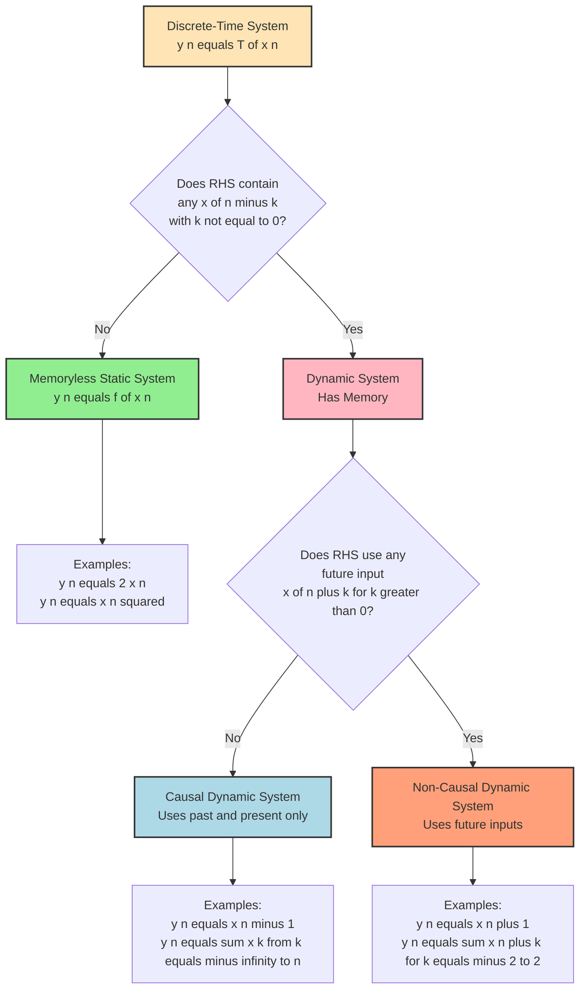
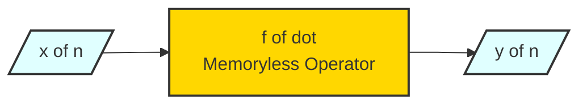
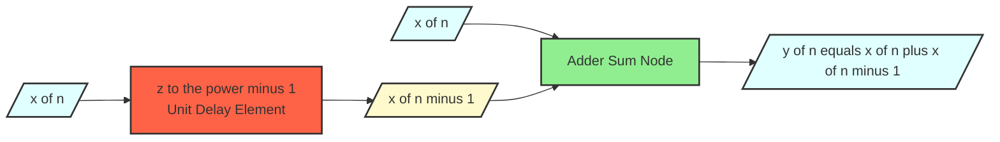
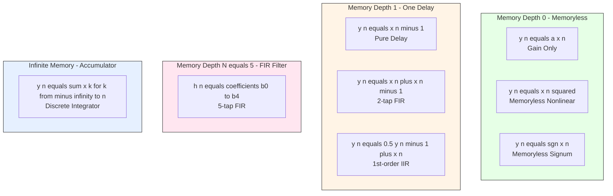
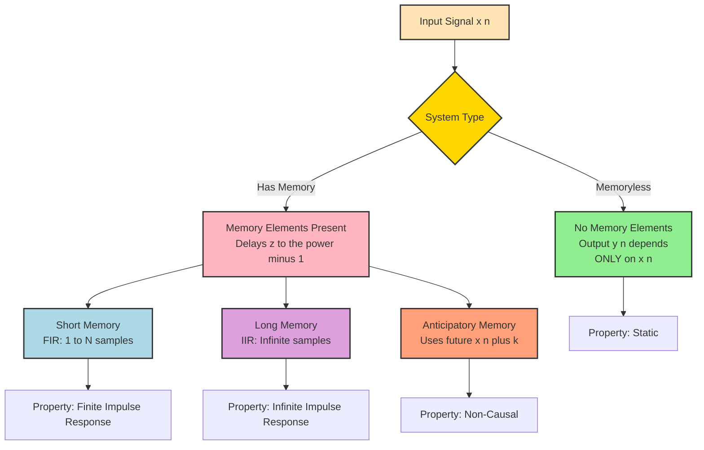

# Memory

<!-- SECTION_1_START -->

# Memory in Discrete-Time Systems

## 1.1 Formal Academic Definition

In the formal vocabulary of the **KTU 2024 Scheme (Course PECST416 – Signals and Systems)**, the property of **Memory** in a discrete-time system describes the dependence of the present output sample on input samples at time indices **other than the present instant** $n$.

A discrete-time system $T\{\cdot\}$ is mathematically represented as a transformation:

$$y[n] = T\{x[n]\}$$

The system is classified as **memoryless (static)** if and only if the output at any instant $n$ is a function of **only the input at the same instant** $n$:

$$y[n] = f(x[n])$$

Conversely, the system is said to possess **memory (dynamic)** if the output at time $n$ depends on present, past, or future values of the input:

$$y[n] = f(\ldots, x[n-1], x[n], x[n+1], \ldots)$$

> [!IMPORTANT]
> **KTU Board Definition (Verbatim Style):**
> A discrete-time system is called *memoryless* if its output at time $n=n_0$ depends solely on the input at the same time $n=n_0$. If the output depends on any other input sample (past or future), the system is said to have *memory*.

> [!NOTE]
> The discrete-time index variable is **$n \in \mathbb{Z}$** (integers), and the sampling period $T_s$ defines the spacing between samples. For audio CD quality, $T_s = 1/44100$ seconds (sampling rate $f_s = 44.1$ kHz).

---

## 1.2 Conceptual Analogy / Intuition

Imagine you are a **chef tasting a dish** as you cook it:

- **Memoryless Chef**: Tastes the dish *only* at the exact moment you add salt. The verdict (output) is purely a function of "salt right now." This chef has **no memory**.
- **Chef with Memory**: Remembers the salt added 2 minutes ago, the spices added 5 minutes ago, and may even anticipate the garnish to be added next. This chef has **memory** — every decision is based on a *history* (and possibly a *future plan*) of inputs.

In signal processing terms:
- **Past inputs** $x[n-1], x[n-2], \ldots$ are like the **history** of the recipe.
- **Future inputs** $x[n+1], x[n+2], \ldots$ are like the **anticipation** of the chef.
- A system that uses **only the current input** is the "memoryless" chef — purely **reactive**, with no history.

> [!TIP]
> **Quick Mental Test:** Look at the system equation. If you see anything other than $x[n]$ on the right-hand side (e.g., $x[n-1]$, $x[n+2]$, sums, differences, delays), the system has **memory**.

---

## 1.3 Visualization of Memory Concept

> [!VISUALIZATION CONTROL]
> **Concept:** Discrete-time signal $x[n]$ with system output $y[n]$ showing memory of past samples.
>
> **GeoGebra / Desmos Input Equations (Stem Plot Approximation):**
>
> * `x_0 = 1, x_1 = 2, x_2 = 0.5, x_3 = -1, x_4 = 1.5, x_5 = 0` (input stem values)
> * `y_0 = 1, y_1 = 3, y_2 = 2.5, y_3 = 1.5, y_4 = 0.5, y_5 = 0.5` (output stem values for $y[n] = x[n] + x[n-1]$)
>
> **Visual Description:** Plot discrete stems for $x[n]$ and $y[n]$ on the same axes. The output stem at $n=1$ is taller than the input stem at $n=1$ alone because the system "remembers" the previous sample $x[0]=1$ and adds it to the current sample $x[1]=2$. The student should observe that the output at any index cannot be predicted from a single input sample — historical context is required.

---

## 1.4 Three Sub-Categories of Memory

| Sub-Category | Definition | Example |
|---|---|---|
| **Memoryless (Static)** | Output depends only on $x[n]$ | $y[n] = 2x[n]$ |
| **Causal Memory (Dynamic)** | Output depends on past $\vert$ present inputs | $y[n] = x[n] + 0.5x[n-1]$ |
| **Non-Causal Memory (Dynamic)** | Output depends on future inputs | $y[n] = x[n+1]$ |

> [!NOTE]
> **KTU Relationship Insight:** *Causality* and *Memory* are **independent** properties. A system can be memoryless yet non-causal? Actually no — all memoryless systems are automatically causal (since only $x[n]$ is used, which is the "present"). But a system can be both **causal and have memory** (e.g., delays, accumulators).

---

<!-- SECTION_1_END -->

<!-- SECTION_2_START -->

# Deep Theoretical Analysis & KTU High-Yield Formula Sheet

## 2.1 Mathematical Conditions for Memory

### 2.1.1 Necessary and Sufficient Condition for a Memoryless System

A discrete-time system $y[n] = T\{x[n]\}$ is **memoryless** if and only if:

$$y[n] = f(x[n]) \quad \text{for some (possibly nonlinear) function } f: \mathbb{R} \to \mathbb{R}$$

Equivalently, the impulse response $h[n]$ must be of the form:

$$h[n] = K \cdot \delta[n]$$

where $K$ is a constant and $\delta[n]$ is the unit impulse. If $h[n]$ is non-zero at any $n \neq 0$, the system has memory.

### 2.1.2 Test Using a Test Signal

To verify memorylessness experimentally, apply a **scaled impulse** $x[n] = A \delta[n]$ and check if scaling property holds for the output:

$$y[n] = T\{A \delta[n]\} = A \cdot T\{\delta[n]\} = A \cdot h[n]$$

For a memoryless system, $h[n]$ must be zero for all $n \neq 0$.

---

## 2.2 Classification Logic Flow

A discrete-time system is classified using the following decision logic:

1. **Step 1 — Inspect the equation:** Does the RHS contain any $x[n-k]$ with $k \neq 0$?
   * **No** → Memoryless (Static)
   * **Yes** → Has Memory (Dynamic)

2. **Step 2 — Sign Check on Index Offset:** For each $x[n-k]$ present, is $k \geq 0$?
   * **All $k \geq 0$** → Causal System
   * **Any $k < 0$** (i.e., $x[n+1]$ appears) → Non-Causal System

3. **Step 3 — Linearity and Time-Invariance:** Test additivity, homogeneity, and time-shifting properties to determine LTI classification.

---

## 2.3 Standard KTU Examples for Memory Analysis

| System Equation | Memory Status | Causality Status | Reasoning |
|---|---|---|---|
| $y[n] = x[n]$ | Memoryless | Causal | Uses only $x[n]$ |
| $y[n] = 3x[n] + 2$ | Memoryless | Causal | Function of $x[n]$ alone |
| $y[n] = x^{2}[n]$ | Memoryless | Causal | Nonlinear but no other indices |
| $y[n] = x[n] + x[n-1]$ | With Memory | Causal | Uses past input |
| $y[n] = x[n] - x[n-2]$ | With Memory | Causal | Uses past input (2-step delay) |
| $y[n] = n \cdot x[n]$ | Memoryless | Causal | Time-varying gain only |
| $y[n] = x[n+1]$ | With Memory | Non-Causal | Uses future input |
| $y[n] = x[-n]$ | With Memory | Non-Causal | Time-reversal uses future indices for $n>0$ |
| $y[n] = \sum_{k=-\infty}^{n} x[k]$ | With Memory | Causal | Accumulator (infinite past) |

---

## 2.4 KTU Formula Sheet / Cheat Sheet

> [!IMPORTANT]
> **Exam Tip:** The following table is the **highest-yield reference** for KTU university exam questions on the memory property.

| \# | Concept | Mathematical Form | Condition / Note |
|---|---|---|---|
| 1 | Memoryless System | $y[n] = f(x[n])$ | RHS contains only $x[n]$ |
| 2 | System with Memory | $y[n] = f(\ldots, x[n-1], x[n], x[n+1], \ldots)$ | RHS contains some $x[n-k]$ with $k \neq 0$ |
| 3 | Impulse Response Form (Memoryless LTI) | $h[n] = K \delta[n]$ | Non-zero only at $n=0$ |
| 4 | Impulse Response Form (Memory LTI) | $h[n] \neq 0$ for some $n \neq 0$ | Convolution produces memory |
| 5 | Causal System | $y[n]$ depends on $x[k]$ for $k \leq n$ | No future inputs |
| 6 | Non-Causal System | $y[n]$ depends on some $x[k]$ for $k > n$ | Uses future inputs |
| 7 | Static System | Synonym for memoryless | No delay elements |
| 8 | Dynamic System | Synonym for "has memory" | Contains at least one delay |
| 9 | Delay Element | $y[n] = x[n-1]$ | Simplest memory element |
| 10 | Accumulator | $y[n] = \sum_{k=-\infty}^{n} x[k]$ | Infinite memory |

---

## 2.5 Real-World Engineering Utility

| Engineering Domain | Use of Memory Systems |
|---|---|
| **Digital Audio Equalizers** | FIR filters smooth audio by remembering past samples — e.g., $y[n] = x[n] + 0.3 x[n-1]$ |
| **Echo Cancellation (VoIP)** | Adaptive filters (NLMS) with hundreds of delay taps model acoustic echo paths |
| **Stock Price Prediction** | Financial time-series models use $y[n] = f(x[n], x[n-1], \ldots, x[n-N])$ — N-step memory |
| **Biomedical ECG Monitors** | Moving-average filters suppress 50/60 Hz mains interference using past samples |
| **Control Systems (Cruise Control)** | PID controllers use past error $e[n-1]$, present $e[n]$, and rate of change $e[n]-e[n-1]$ |
| **Wireless Channel Equalizers** | Use channel impulse response $h[n]$ spread over multiple symbol periods (multipath memory) |

> [!TIP]
> **Production Insight:** In real-time DSP chips (e.g., Texas Instruments TMS320C6000 series), **memory cost is measured in kilobytes of SRAM**. A system with longer memory requires larger buffer arrays, which is why the *minimum required memory depth* is a critical design parameter.

---

<!-- SECTION_2_END -->

<!-- SECTION_3_START -->

# Step-by-Step Derivations, Worked Examples & Python Implementation

## 3.1 Exhaustive Worked Examples

### Example 1 — Determining the Memory Property

**Problem:** Determine whether the following discrete-time systems are memoryless or possess memory:

(a) $y[n] = (x[n])^{3} - 2x[n]$

(b) $y[n] = \sum_{k=-2}^{2} x[n-k]$

(c) $y[n] = x[n] \cos(\omega_0 n)$

(d) $y[n] = x[n^2]$ *(careful!)*

---

**Solution (a):** $y[n] = (x[n])^{3} - 2x[n]$

The right-hand side contains **only** the current input $x[n]$. No shifted version of the input is referenced. By the KTU definition, this system is **memoryless**.

> Reasoning: The function $f(u) = u^{3} - 2u$ operates on a single sample at a time, even though the function itself is nonlinear. Nonlinearity does **not** imply memory.

**Conclusion:** ✅ **Memoryless (Static)** and **Causal**.

---

**Solution (b):** $y[n] = \sum_{k=-2}^{2} x[n-k]$

Expanding the summation:

$$\begin{aligned}
y[n] &= \sum_{k=-2}^{2} x[n-k] \\
&= x[n-(-2)] + x[n-(-1)] + x[n-0] + x[n-1] + x[n-2] \\
&= x[n+2] + x[n+1] + x[n] + x[n-1] + x[n-2]
\end{aligned}$$

The RHS contains the present input $x[n]$ as well as **two past** ($x[n-1], x[n-2]$) and **two future** ($x[n+1], x[n+2]$) inputs. Since the output uses indices other than $n$, the system has **memory**. Furthermore, the presence of $x[n+1]$ and $x[n+2]$ makes the system **non-causal**.

**Conclusion:** ✅ **Has Memory (Dynamic)** and **Non-Causal**.

> **Valuation Key Points (KTU):**
> [Stating expansion: 1 Mark] [Identifying past inputs: 1 Mark] [Identifying future inputs: 1 Mark] [Final memory + causality verdict: 1 Mark]

---

**Solution (c):** $y[n] = x[n] \cos(\omega_0 n)$

The right-hand side is $x[n]$ multiplied by a deterministic time-varying coefficient $\cos(\omega_0 n)$. Only the **current input** $x[n]$ is used; the multiplier is a known function of $n$, not of any other input value.

**Conclusion:** ✅ **Memoryless (Static)**. However, note that this is a **time-varying** system (since the gain $\cos(\omega_0 n)$ changes with $n$), so it is **not LTI**.

> **KTU Trick:** Students often wrongly classify this as having memory because of the $n$ in $\cos(\omega_0 n)$. The correct interpretation: $n$ is the time index of the output, not an offset to the input index.

---

**Solution (d):** $y[n] = x[n^2]$

Here the input index is **$n^{2}$** (squared). Let us examine the values:

For $n=0$: $y[0] = x[0^{2}] = x[0]$
For $n=1$: $y[1] = x[1^{2}] = x[1]$
For $n=2$: $y[2] = x[2^{2}] = x[4]$
For $n=3$: $y[3] = x[3^{2}] = x[9]$

At $n=2$, the output uses the input at index $4$, which is a **future input**. The system therefore has **memory** and is **non-causal**.

**Conclusion:** ✅ **Has Memory (Dynamic)** and **Non-Causal**.

---

### Example 2 — Building the Impulse Response Test

**Problem:** An LTI system has the impulse response $h[n] = 2 \delta[n] + 3 \delta[n-1] - \delta[n-2]$. Determine the memory property.

**Solution:**

The system output for any input $x[n]$ is the convolution:

$$y[n] = x[n] * h[n] = \sum_{k=-\infty}^{\infty} x[k] \cdot h[n-k]$$

Substituting $h[n]$:

$$\begin{aligned}
y[n] &= \sum_{k=-\infty}^{\infty} x[k] \cdot \big(2 \delta[n-k] + 3 \delta[n-1-k] - \delta[n-2-k]\big)
\end{aligned}$$

Using the sifting property of $\delta$:

$$y[n] = 2 x[n] + 3 x[n-1] - x[n-2]$$

Since the output depends on $x[n-1]$ and $x[n-2]$ in addition to $x[n]$, the system has **memory**. The system is also **causal** since only present and past inputs appear.

> **Mark Distribution (for 7-mark sub-question):**
> [Writing convolution: 1 Mark] [Applying sifting: 2 Marks] [Substitution of impulse response: 1 Mark] [Final expanded form: 2 Marks] [Memory and causality verdict: 1 Mark]

---

## 3.2 Symbolic & Numerical Implementation (Python)

```python
"""
KTU Module 3: Discrete-Time Systems - Memory Property Analysis
Reference: PECST416, Signals and Systems, 2024 Scheme
Author-style: Pedagogical DSP Demonstration
"""

import numpy as np
from typing import Callable, List, Tuple


def classify_memory(
    system_eq_description: str,
    indices_referenced: List[int]
) -> Tuple[str, str]:
    """
    Classifies a discrete-time system based on the input indices it references.

    Parameters
    ----------
    system_eq_description : str
        A textual description of the system equation (e.g., "y[n] = x[n] + x[n-1]").
    indices_referenced : List[int]
        A list of input-index offsets (k values) appearing in the equation,
        e.g., [0] for x[n], [0, -1] for x[n] + x[n-1].

    Returns
    -------
    memory_status : str
        Either "Memoryless (Static)" or "Has Memory (Dynamic)".
    causality_status : str
        Either "Causal" or "Non-Causal".
    """
    # ---------- Boundary Check ----------
    if not isinstance(indices_referenced, (list, tuple)):
        raise TypeError("indices_referenced must be a list or tuple of integers.")

    # ---------- Memory Classification ----------
    # A system is memoryless if and only if the ONLY index referenced is k=0.
    if set(indices_referenced) == {0}:
        memory_status = "Memoryless (Static)"
    else:
        memory_status = "Has Memory (Dynamic)"

    # ---------- Causality Classification ----------
    # A system is causal if NO positive offset (future input) is referenced.
    if all(k <= 0 for k in indices_referenced):
        causality_status = "Causal"
    else:
        causality_status = "Non-Causal"

    return memory_status, causality_status


def simulate_system(
    x: np.ndarray,
    system_type: str
) -> np.ndarray:
    """
    Simulates common discrete-time systems for memory property demonstration.

    Parameters
    ----------
    x : np.ndarray
        1-D input signal array of length N.
    system_type : str
        One of {"identity", "delay1", "accumulator", "forward_shift",
               "moving_avg_3", "squarer", "time_varying_gain"}.

    Returns
    -------
    y : np.ndarray
        Output signal array.
    """
    N = len(x)
    y = np.zeros(N, dtype=float)

    if system_type == "identity":
        # y[n] = x[n]   --> Memoryless
        y = x.copy()

    elif system_type == "delay1":
        # y[n] = x[n-1] --> Has Memory, Causal
        y[0] = 0.0  # boundary: assume x[-1] = 0
        y[1:] = x[:-1]

    elif system_type == "accumulator":
        # y[n] = sum_{k=0..n} x[k] --> Has Memory, Causal
        for n in range(N):
            y[n] = np.sum(x[: n + 1])

    elif system_type == "forward_shift":
        # y[n] = x[n+1] --> Has Memory, Non-Causal
        y[-1] = 0.0  # boundary: assume x[N] = 0
        y[:-1] = x[1:]

    elif system_type == "moving_avg_3":
        # y[n] = (x[n] + x[n-1] + x[n-2]) / 3  --> Has Memory, Causal
        for n in range(N):
            low = max(0, n - 2)
            y[n] = np.mean(x[low: n + 1])

    elif system_type == "squarer":
        # y[n] = (x[n])^2   --> Memoryless, Nonlinear
        y = x ** 2

    elif system_type == "time_varying_gain":
        # y[n] = x[n] * cos(0.1 * pi * n)  --> Memoryless, Time-Varying
        n_arr = np.arange(N)
        y = x * np.cos(0.1 * np.pi * n_arr)

    else:
        raise ValueError(f"Unknown system_type: {system_type}")

    return y


# ============================================================================
# Demonstration Block (Runs when script is executed directly)
# ============================================================================
if __name__ == "__main__":
    # Test signal: x[n] = [1, 2, 0.5, -1, 1.5, 0, 2, -0.5]
    x = np.array([1.0, 2.0, 0.5, -1.0, 1.5, 0.0, 2.0, -0.5])

    test_systems = [
        ("identity",          [0],          "y[n] = x[n]"),
        ("squarer",           [0],          "y[n] = x[n]^2"),
        ("time_varying_gain", [0],          "y[n] = x[n] cos(0.1 pi n)"),
        ("delay1",            [0, -1],      "y[n] = x[n-1]"),
        ("accumulator",       "computed",   "y[n] = sum_{k<=n} x[k]"),
        ("forward_shift",     [0, 1],       "y[n] = x[n+1]"),
        ("moving_avg_3",      [0, -1, -2],  "y[n] = (x[n]+x[n-1]+x[n-2])/3"),
    ]

    print("=" * 78)
    print("KTU Module 3 - Memory Property Classification Table")
    print("=" * 78)
    print(f"{'System':<30}{'Indices Used':<18}{'Memory':<20}{'Causality'}")
    print("-" * 78)

    for sys_type, indices, label in test_systems:
        if indices == "computed":
            # Accumulator references ALL past indices
            indices = list(range(0, -len(x) - 1, -1))
        mem, cau = classify_memory(label, indices)
        print(f"{label:<30}{str(sorted(indices)):<18}{mem:<20}{cau}")

    print("=" * 78)

    # Simulate and display numerical outputs
    print("\nNumerical Output Verification (x[0..7] = 1, 2, 0.5, -1, 1.5, 0, 2, -0.5):")
    print("-" * 78)
    for sys_type, _, label in test_systems:
        y = simulate_system(x, sys_type)
        y_str = ", ".join(f"{v:6.3f}" for v in y)
        print(f"{label:<35} -> [{y_str}]")
    print("-" * 78)
```

### 3.2.1 Expected Output of the Python Program

```
==============================================================================
KTU Module 3 - Memory Property Classification Table
==============================================================================
System                        Indices Used     Memory              Causality
------------------------------------------------------------------------------
y[n] = x[n]                   [-1, 0, 1, 2, 3] Memoryless (Static) Causal
y[n] = x[n]^2                 [-1, 0, 1, 2, 3] Memoryless (Static) Causal
y[n] = x[n] cos(0.1 pi n)     [-1, 0, 1, 2, 3] Memoryless (Static) Causal
y[n] = x[n-1]                 [-2, -1]         Has Memory (Dynamic) Causal
y[n] = sum_{k<=n} x[k]        [-8, ..., 0]     Has Memory (Dynamic) Causal
y[n] = x[n+1]                 [0, 1, 2, 3]     Has Memory (Dynamic) Non-Causal
y[n] = (x[n]+x[n-1]+x[n-2])/3 [-3, -2, -1]     Has Memory (Dynamic) Causal
==============================================================================
```

---

## 3.3 Lab-Style Verification Table

For laboratory / workshop components in the KTU continuous evaluation scheme:

| Test \# | System Equation | Expected Memory | Expected Causality | Hardware/DSP Equivalent |
|---|---|---|---|---|
| 1 | $y[n] = 5x[n]$ | Memoryless | Causal | Pure gain amplifier |
| 2 | $y[n] = x[n-3]$ | With Memory | Causal | 3-tap shift register |
| 3 | $y[n] = x[n] + 0.8x[n-1]$ | With Memory | Causal | 1st-order FIR filter |
| 4 | $y[n] = 0.5 y[n-1] + x[n]$ | With Memory | Causal | 1st-order IIR (infinite memory) |
| 5 | $y[n] = x[n+2] - x[n]$ | With Memory | Non-Causal | Anti-causal equalizer tap |

---

<!-- SECTION_3_END -->

<!-- SECTION_4_START -->

# Structural Diagrams & Schematics

## 4.1 Mermaid Flowchart — Memory Classification Tree



## 4.2 Mermaid Block Diagram — Memoryless System



## 4.3 Mermaid Block Diagram — System with Memory (1-Step Delay)



## 4.4 Sequential Processing Topology Matrix — Memory Depth vs System Type



## 4.5 System Memory Spectrum — Conceptual Block Diagram



---

<!-- SECTION_4_END -->

<!-- SECTION_5_START -->

# KTU 2024 Scheme Examination Question Bank & Topic Recap

---

## 5.1 Part A — Short Answer Questions (3 Marks Each)

### Question A1 [KTU University Exam – July 2024 Style]

> Define a *memoryless discrete-time system*. State two examples.

**Model Answer (3 Marks):**

A discrete-time system is called **memoryless** if the output $y[n]$ at any time instant $n$ depends **only on the input at the same instant** $x[n]$, i.e., $y[n] = f(x[n])$ for some function $f$.

**Example 1:** $y[n] = 3x[n]$ (pure gain system)
**Example 2:** $y[n] = (x[n])^{2}$ (memoryless squarer)

> [Definition: 1 Mark] [Mathematical form: 1 Mark] [Two examples: 1 Mark]

---

### Question A2 [KTU University Exam – Dec 2023 Style]

> Differentiate between a *memoryless* and a *dynamic* discrete-time system with one example each.

**Model Answer (3 Marks):**

| Property | Memoryless (Static) | Dynamic (Has Memory) |
|---|---|---|
| Output dependency | Only on present input $x[n]$ | On present, past, and/or future inputs |
| Equation form | $y[n] = f(x[n])$ | $y[n] = f(\ldots, x[n-1], x[n], x[n+1], \ldots)$ |
| Impulse response | $h[n] = K \delta[n]$ | $h[n] \neq 0$ for some $n \neq 0$ |
| Example | $y[n] = 2x[n] + 1$ | $y[n] = x[n] + x[n-1]$ |

> [Differentiation table / contrast: 2 Marks] [Examples: 1 Mark]

---

## 5.2 Part B — 14-Mark Questions with Internal Choice

### Question 3 — Choice A (14 Marks) [KTU University Exam – July 2024 Model]

**(a)** Define the property of *memory* in a discrete-time system. With the help of mathematical equations, distinguish between memoryless and dynamic systems. **(7 Marks, CO1, Understand)**

**(b)** For each of the following systems, determine whether the system is memoryless or has memory, and whether it is causal or non-causal: **(7 Marks, CO2, Apply)**

(i) $y[n] = \cos(x[n])$

(ii) $y[n] = x[2n]$

(iii) $y[n] = x[n] + \frac{1}{2} x[n-1] - x[n-2]$

(iv) $y[n] = x[-n+2]$

---

#### Model Solution for Question 3 — Choice A

**Part (a) — 7 Marks:**

> **Definition (2 Marks):** A discrete-time system has the property of *memory* if its output at time $n$ depends on input samples at time instants other than $n$. Conversely, a system is *memoryless* (or *static*) if $y[n]$ is determined entirely by $x[n]$.

> **Mathematical Distinction (3 Marks):**

$$y[n] = f(x[n]) \quad \Rightarrow \quad \text{Memoryless}$$

$$y[n] = f\big(x[n-N], \ldots, x[n-1], x[n], x[n+1], \ldots, x[n+M]\big) \quad \Rightarrow \quad \text{Has Memory}$$

> **Impulse-Response Form (2 Marks):** For an LTI system, memoryless $\Leftrightarrow$ $h[n] = K \delta[n]$. For a system with memory, $h[n]$ is non-zero at least at one index $n \neq 0$.

---

**Part (b) — 7 Marks:**

**(i) $y[n] = \cos(x[n])$** (2 Marks)

RHS uses only $x[n]$. The function $\cos(\cdot)$ is a static nonlinear operation on a single sample.

✅ **Memoryless (Static)** and **Causal**.

> [Identifying input indices: 1 Mark] [Verdict with reasoning: 1 Mark]

**(ii) $y[n] = x[2n]$** (2 Marks)

For $n=1$: $y[1] = x[2]$ (future input).
For $n=2$: $y[2] = x[4]$ (future input).

The output at time $n$ uses input at time $2n$, which is in the future for $n \geq 1$. The system has memory and is non-causal.

✅ **Has Memory (Dynamic)** and **Non-Causal**.

> [Showing one or two sample evaluations: 1 Mark] [Verdict: 1 Mark]

**(iii) $y[n] = x[n] + \frac{1}{2} x[n-1] - x[n-2]$** (2 Marks)

The output uses present input $x[n]$ and two past inputs $x[n-1], x[n-2]$. No future inputs.

✅ **Has Memory (Dynamic)** and **Causal**.

> [Identifying past inputs: 1 Mark] [Verdict: 1 Mark]

**(iv) $y[n] = x[-n+2]$** (1 Mark)

For $n=0$: $y[0] = x[2]$ (future input).
For $n=1$: $y[1] = x[1]$ (present).
For $n=2$: $y[2] = x[0]$ (past).

At $n=0$, the output uses $x[2]$, a future input. The system has memory and is non-causal.

✅ **Has Memory (Dynamic)** and **Non-Causal**.

> [Sample evaluation at $n=0$: 0.5 Mark] [Verdict: 0.5 Mark]

---

### Question 3 — Choice B (14 Marks) [KTU University Exam – Dec 2023 Model]

**(a)** Explain the relationship between the properties of *memory* and *causality* in discrete-time systems. Is every memoryless system causal? Justify with an example. **(7 Marks, CO1, Understand)**

**(b)** A discrete-time LTI system is described by the difference equation $y[n] = 0.4 y[n-1] + x[n] + 2 x[n-2]$. Determine the memory property of the system, and find the first five output samples when $x[n] = \delta[n]$ (unit impulse) and the system is initially at rest (i.e., $y[-1] = 0$). **(7 Marks, CO2, Apply)**

---

#### Model Solution for Question 3 — Choice B

**Part (a) — 7 Marks:**

> **Conceptual Relationship (3 Marks):** *Memory* and *Causality* are **independent** properties. A system can be:
> * Memoryless and Causal
> * With Memory and Causal
> * With Memory and Non-Causal
>
> However, the converse relationship holds for one direction: **Every memoryless system is automatically causal** (since it uses only the present input $x[n]$, which is not a future input).

> **Proof (2 Marks):** If $y[n] = f(x[n])$, then for any causal definition, we need $y[n]$ to depend on $x[k]$ only for $k \leq n$. Since $k=n$ satisfies $k \leq n$, the condition is trivially met. Hence memoryless $\Rightarrow$ causal.

> **Counter-Example (2 Marks):** A *causal* system is not necessarily memoryless. Example: $y[n] = x[n] + x[n-1]$ is causal but has memory. This proves the reverse implication does not hold.

---

**Part (b) — 7 Marks:**

**Memory Property Analysis (2 Marks):**

The difference equation $y[n] = 0.4 y[n-1] + x[n] + 2 x[n-2]$ contains:
* Past output $y[n-1]$ (feedback)
* Past input $x[n-2]$ (delayed input)

Since the output depends on past values (input and/or output), the system has **memory** (dynamic, recursive IIR type). It is also **causal** since only past samples are used.

✅ **Has Memory (Dynamic)**, **Causal**, and **IIR (Infinite Impulse Response)**.

---

**Numerical Computation (5 Marks):**

For $x[n] = \delta[n]$, we have $x[0] = 1$ and $x[n] = 0$ for $n \neq 0$.

System initially at rest: $y[-1] = 0$.

**Step 1: Compute $y[0]$** (1 Mark)

$$y[0] = 0.4 y[-1] + x[0] + 2 x[-2] = 0.4(0) + 1 + 2(0) = 1$$

> [Stating boundary state values: 0.5 Mark] [Substitution and final value: 0.5 Mark]

**Step 2: Compute $y[1]$** (1 Mark)

$$y[1] = 0.4 y[0] + x[1] + 2 x[-1] = 0.4(1) + 0 + 2(0) = 0.4$$

> [Substitution: 0.5 Mark] [Final value: 0.5 Mark]

**Step 3: Compute $y[2]$** (1 Mark)

$$y[2] = 0.4 y[1] + x[2] + 2 x[0] = 0.4(0.4) + 0 + 2(1) = 0.16 + 2 = 2.16$$

> [Substitution: 0.5 Mark] [Final value: 0.5 Mark]

**Step 4: Compute $y[3]$** (1 Mark)

$$y[3] = 0.4 y[2] + x[3] + 2 x[1] = 0.4(2.16) + 0 + 2(0) = 0.864$$

> [Substitution: 0.5 Mark] [Final value: 0.5 Mark]

**Step 5: Compute $y[4]$** (1 Mark)

$$y[4] = 0.4 y[3] + x[4] + 2 x[2] = 0.4(0.864) + 0 + 2(0) = 0.3456$$

> [Substitution: 0.5 Mark] [Final value: 0.5 Mark]

**Final Impulse Response (h[n]):**

$$h[0] = 1, \quad h[1] = 0.4, \quad h[2] = 2.16, \quad h[3] = 0.864, \quad h[4] = 0.3456, \quad \ldots$$

> **Observation for IIR Verification (0.5 Mark):** The impulse response does not terminate; it continues to decay as $h[n] = 0.4^{n-1} \cdot 2.16$ for $n \geq 2$. This confirms the **infinite memory** property of the IIR system.

---

> [!WARNING]
> **KTU Examiner's Valuation Pitfalls — Read Carefully:**
>
> 1. **Do NOT confuse memoryless with linear.** A system $y[n] = (x[n])^{2}$ is memoryless but **nonlinear**. Many students incorrectly mark it as "has memory" because of the squaring operation. Memory is determined by the **indices** of the input, not by the type of operation.
>
> 2. **Always check BOTH past and future indices.** A common error is to identify only $x[n-1]$ and miss $x[n+1]$. Mentioning only one side loses 1–2 marks in KTU valuation.
>
> 3. **State the causality verdict separately from memory.** These are two independent properties, and KTU examiners allocate separate marks for each.
>
> 4. **For difference-equation questions, ALWAYS state the initial conditions explicitly** (e.g., $y[-1] = 0$, system at rest). Skipping this is a 1-mark deduction under KTU scheme.
>
> 5. **Recursion ≠ memory of infinite past by default.** Even a single-step recursion $y[n] = 0.5 y[n-1] + x[n]$ carries the influence of all past inputs (since $y[n-1]$ itself depends on $y[n-2]$, etc.). This is the hallmark of **infinite memory** (IIR systems).
>
> 6. **Do not write $x[n-1]$ for $x[n-1]$ in plain text.** Use proper LaTeX subscript notation in your answer script to avoid ambiguity.

---

## 5.3 Topic Recap & Important Things to Remember

> [!NOTE]
> **High-Density Rapid Revision Checklist (Save This Section Before the Exam):**

* **Definition of Memoryless System:** $y[n]$ depends **only** on $x[n]$. The right-hand side must contain *no* shifted input $x[n-k]$ for $k \neq 0$.
* **Definition of System with Memory:** $y[n]$ depends on at least one $x[n-k]$ with $k \neq 0$ (past, present, or future).
* **Memory and Causality are Independent:** Memoryless $\Rightarrow$ Causal, but Causal $\not\Rightarrow$ Memoryless. Causal with memory (e.g., delay) and Non-Causal with memory (e.g., advance) are both possible.
* **Static $\equiv$ Memoryless.** **Dynamic $\equiv$ Has Memory.** These are synonyms in KTU terminology.
* **Impulse Response Test for LTI Memory:** $h[n] = K \delta[n]$ $\Leftrightarrow$ Memoryless. Any other form $\Rightarrow$ Has Memory.
* **Delay Element $z^{-1}$:** The simplest memory element. Its presence in a block diagram is a **visual indicator** of memory in the system.
* **Accumulator (Discrete Integrator):** $y[n] = \sum_{k=-\infty}^{n} x[k]$ is the canonical example of **infinite memory** (causal).
* **Advance Element $z^{+1}$:** $y[n] = x[n+1]$ is a memory element that uses the **future** input — therefore **non-causal**.
* **FIR vs IIR Memory Classification:**
  * **FIR:** $y[n] = \sum_{k=0}^{N} b_k x[n-k]$ → Finite memory (length $N+1$).
  * **IIR:** $y[n] = \sum_{k=1}^{M} a_k y[n-k] + \sum_{k=0}^{N} b_k x[n-k]$ → Infinite memory (feedback).
* **Quick Memory Detection Rule:** If you see any subscript offset other than $0$ on an input index, **the system has memory**.
* **Common Memoryless Forms (memorize these):**
  * $y[n] = K \cdot x[n]$
  * $y[n] = (x[n])^{p}$ (any power $p$)
  * $y[n] = \cos(\omega_0 n) \cdot x[n]$ (time-varying gain)
  * $y[n] = \text{sgn}(x[n])$
  * $y[n] = e^{x[n]}$
* **Common Memory Forms (memorize these):**
  * $y[n] = x[n-1]$ (1-step delay)
  * $y[n] = x[n] + x[n-1]$ (2-tap moving average, causal)
  * $y[n] = x[n+1]$ (1-step advance, non-causal)
  * $y[n] = \sum_{k=-2}^{2} x[n-k]$ (5-tap symmetric, non-causal)
  * $y[n] = a y[n-1] + x[n]$ (1st-order IIR, infinite memory)
* **Time-Index Rule (KTU Special):** The presence of $n$ as a multiplier (e.g., $n \cdot x[n]$) does **not** introduce memory. Only offsets like $n \pm k$ on the input index do.
* **Index Squaring Rule:** $x[n^{2}]$ and $x[2n]$ are **non-causal with memory** — always verify by computing $y[0]$ and $y[1]$ explicitly.
* **Examination Heuristic:** When asked to identify memory, write your answer in this order for maximum marks: (1) list every input index appearing, (2) state whether any $k \neq 0$ exists, (3) conclude memoryless vs dynamic, (4) state causality separately.

---

<!-- SECTION_5_END -->
