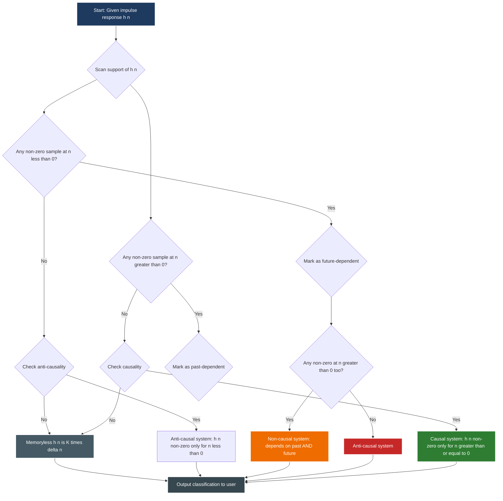
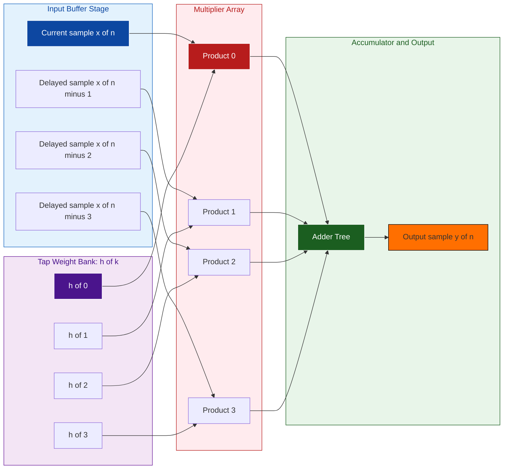

# Properties of an LTI system - Causality

<!-- SECTION_1_START -->

# 1. Core Technical Definition & Intuitive Overview

## 1.1 Formal Academic Definition (KTU 2024 Syllabus Terminology)

A **discrete-time LTI (Linear Time-Invariant) system** is said to be **causal** if the output $y[n]$ at any time instant $n = n_0$ depends *only* on the **present** and **past** values of the input signal, i.e., on $x[n]$ for $n \le n_0$. The output must be **independent of any future input samples** $x[n+1], x[n+2], \dots$.

In the language of impulse response analysis, a discrete-time LTI system with impulse response $h[n]$ is causal **if and only if**:

$$h[n] = 0 \quad \text{for all} \quad n < 0$$

> [!NOTE]
> **Causality ↔ Impulse Response Condition (KTU High-Yield Identity)**
> An LTI system is causal $\iff$ its impulse response $h[n]$ is **identically zero for all negative time indices** ($n < 0$). The support of $h[n]$ must lie entirely in the region $n \ge 0$.

## 1.2 Conceptual Analogy & Intuition

Imagine you are **watching a cricket match live on television**. The picture you see at, say, 7:30 PM depends entirely on what has *already happened* on the field (the past) and what is happening *right now* (the present). You cannot "see" a delivery that will be bowled at 7:35 PM — that lies in the future.

> 🎥 **The TV Analogy:**
> - **Causal system** = Live TV feed (output uses only past & present input).
> - **Non-causal system** = A recorded highlights package (output depends on a future event that the broadcaster "knows" already happened, even though your wall-clock says it is in the future).

Mathematically, the *time origin* of the system's response is the moment we start observing. Anything to the *left* of $n = 0$ on the discrete-time axis is the **past**; anything to the *right* is the **future**.

## 1.3 Three Sub-Categories Based on Impulse Response Support

| Category | Condition on $h[n]$ | Physical Meaning |
|:---|:---|:---|
| **Causal** | $h[n] = 0,\; n < 0$ | Response begins *at or after* the input is applied. |
| **Anti-causal** | $h[n] = 0,\; n > 0$ | Response lies entirely in the *past* of the input. |
| **Non-causal (mixed)** | $h[n] \ne 0$ for *both* $n<0$ and $n>0$ | Output depends on future inputs. |

> [!IMPORTANT]
> For **real-time processing systems** (speech codecs, control systems, hearing aids, live DSP), causality is a **hard physical constraint** — you simply do not have access to future samples. For **offline applications** (image processing, audio post-production, scientific simulations), non-causal filters are often preferred because they yield superior frequency response characteristics (e.g., zero-phase filtering).

## 1.4 Visualization Control

> [!VISUALIZATION CONTROL]
> **Concept:** Impulse response support on the discrete-time axis for causal, anti-causal, and non-causal LTI systems.
> **GeoGebra / Desmos Input Equations:**
> * Causal: Piecewise function `h_causal(n) = If(n < 0, 0, 0.7^n)` plotted for $n \in [-5, 10]$.
> * Anti-causal: `h_anti(n) = If(n > 0, 0, 0.7^(-n))` plotted for $n \in [-10, 5]$.
> * Non-causal: `h_noncausal(n) = 0.7^abs(n) * sign(n+1)` for $n \in [-5, 5]$.
> **Visual Description:** On the horizontal $n$-axis, observe how the **causal** response rises from the origin ($n=0$) toward the right (future), the **anti-causal** response rises toward the left (past), and the **non-causal** response is non-zero on *both* sides of the origin. The origin $n=0$ acts as the "moment of stimulus application."

<!-- SECTION_1_END -->

<!-- SECTION_2_START -->

# 2. Deep Theoretical Analysis & KTU High-Yield Formula Sheet

## 2.1 The Convolution Sum: Why Causality Reduces to a Condition on $h[n]$

For any discrete-time LTI system, the input–output relationship is given by the **convolution sum**:

$$y[n] = \sum_{k=-\infty}^{+\infty} h[k]\, x[n-k]$$

The output $y[n]$ is a **weighted sum of all shifted replicas of the input**, where the weights are the impulse response samples $h[k]$. To discover whether $y[n]$ ever "looks ahead," we examine which input terms appear in this sum.

### Step-by-Step Logical Breakdown

1. **For each value of $k$**, the term $x[n-k]$ in the sum represents the input sample at time $n-k$.
2. **If $k < 0$**, then $n - k > n$. The system is using an input sample from the *future* relative to the current time $n$.
3. **If $k \ge 0$**, then $n - k \le n$. The system uses only *past or present* input samples.
4. **Therefore, causality demands that all weights for $k < 0$ must vanish** to eliminate future-input dependence.

This is precisely why causality is equivalent to the strict condition $h[k] = 0$ for $k < 0$.

## 2.2 Equivalent Forms of the Causal Convolution Sum

When $h[n] = 0$ for $n < 0$, the lower limit of the convolution sum collapses from $-\infty$ to $0$:

$$y[n] = \sum_{k=0}^{+\infty} h[k]\, x[n-k]$$

Using the change of variable $m = n - k$ (so $k = n - m$), we obtain the **alternate form**:

$$y[n] = \sum_{m=-\infty}^{n} h[n-m]\, x[m]$$

This second form is often more intuitive: the output at time $n$ is built from all input samples up to and including the current sample $x[n]$, each weighted by the appropriately shifted impulse response.

## 2.3 Causal LTI System Realized via a Difference Equation

A general **linear constant-coefficient difference equation (LCCDE)** has the form:

$$\sum_{k=0}^{N} a_k\, y[n-k] = \sum_{k=0}^{M} b_k\, x[n-k]$$

A system described by such an equation is **causal** if and only if the equation can be solved for $y[n]$ *explicitly* in terms of **past outputs** $y[n-1], y[n-2], \dots$ and **present/past inputs** $x[n], x[n-1], \dots$ — never involving any $x[n+k]$ with $k > 0$.

> [!TIP]
> **Quick KTU Trick (Board-Exam Favorite):** A difference equation is causal if it can be rearranged so that $y[n]$ appears alone on the left-hand side, with all terms on the right being of the form $y[n-k]$ or $x[n-k]$ where $k \ge 0$. If you see a term like $x[n+1]$ on the right, the system is **non-causal**.

## 2.4 KTU High-Yield Formula Cheat Sheet

| # | Concept | Formula / Condition | Notes & Units |
|:--|:---|:---|:---|
| 1 | Causality condition (impulse response) | $h[n] = 0,\; \forall\, n < 0$ | Strict inequality; $h[0]$ may be non-zero. |
| 2 | Causality condition (system function) | $H(z)$ is evaluated with $\vert z \vert$ such that ROC is *exterior* of the outermost pole. | For causal systems, ROC: $\vert z \vert > R_{\max}$ |
| 3 | Causal convolution sum (Form I) | $y[n] = \sum_{k=0}^{+\infty} h[k]\, x[n-k]$ | Sum starts from $k = 0$. |
| 4 | Causal convolution sum (Form II) | $y[n] = \sum_{m=-\infty}^{n} h[n-m]\, x[m]$ | Sum ends at $m = n$. |
| 5 | Anti-causal system | $h[n] = 0,\; \forall\, n > 0$ | $y[n]$ depends only on *future* input. |
| 6 | Stable + Causal LTI system | ROC of $H(z)$ includes the unit circle $\vert z \vert = 1$ AND ROC is $\vert z \vert > R_{\max}$. | Implies all poles are **strictly inside** the unit circle. |
| 7 | Memoryless causal system | $y[n] = K\, x[n]$ for some constant $K$ | Impulse response is $h[n] = K\, \delta[n]$. |
| 8 | Causal LCCDE form | $y[n] = -\sum_{k=1}^{N} a_k\, y[n-k] + \sum_{k=0}^{M} b_k\, x[n-k]$ | No future input/output terms on RHS. |

> [!WARNING]
> **Critical KTU Pitfall:** *Causality $\ne$ Stability.* A causal system is **not automatically stable**, and a stable system is **not automatically causal**. These are *independent* properties. A system can be causal-but-unstable (e.g., $h[n] = 2^n u[n]$) or stable-but-non-causal (e.g., $h[n] = (0.5)^{\vert n \vert}$).

## 2.5 Real-World Engineering Utility

| Engineering Domain | Role of Causality |
|:---|:---|
| **Digital Audio (Live)** | Microphone DSP chains must be causal — no future audio samples exist yet. |
| **Feedback Control** | The controller $C(z)$ in a closed-loop system must be causal to be implementable in real time. |
| **Biomedical Signal Processing** | Pacemakers, hearing aids, and EEG monitors operate under strict causality. |
| **Image Processing** | Spatial-domain 2D filters are inherently *non-causal* (pixels to the right are "future"). Zero-phase filtering exploits this. |
| **Telecommunications** | Adaptive equalizers and echo cancellers use causal FIR/IIR structures. |
| **Radar & Sonar** | Matched filters are often designed non-causally (offline) for optimal SNR but are time-reversed to a causal form for real-time deployment. |

<!-- SECTION_2_END -->

<!-- SECTION_3_START -->

# 3. Step-by-Step Derivations & Code/Symbolic Implementation

## 3.1 Derivation 1: Equivalence of Causality Definitions

We rigorously show that the **impulse-response definition** ($h[n] = 0$ for $n < 0$) is mathematically equivalent to the **input-output definition** ($y[n]$ does not depend on future inputs).

**Starting point — the convolution sum:**

$$y[n] = \sum_{k=-\infty}^{+\infty} h[k]\, x[n-k]$$

**Step 1:** Split the infinite sum into two parts — one for $k < 0$ and one for $k \ge 0$:

$$\begin{aligned}
y[n] &= \underbrace{\sum_{k=-\infty}^{-1} h[k]\, x[n-k]}_{\text{Future-input contribution}} \;+\; \underbrace{\sum_{k=0}^{+\infty} h[k]\, x[n-k]}_{\text{Past/present contribution}}
\end{aligned}$$

**Step 2:** Examine the first sum. For every $k < 0$, the input sample involved is $x[n-k]$ where $n - k > n$ (i.e., a *future* input). The system uses future inputs **only if at least one $h[k] \ne 0$ for $k < 0$**.

**Step 3:** Enforce the causality requirement. We need the first sum to be identically zero for *all* input signals $x[\cdot]$:

$$\sum_{k=-\infty}^{-1} h[k]\, x[n-k] = 0 \quad \forall\, x[\cdot]$$

**Step 4:** This is possible **if and only if every coefficient** $h[k]$ in the sum is zero. Otherwise, by choosing an input $x$ with a unit sample at position $n-k$, we could make the sum non-zero. Therefore:

$$h[k] = 0 \quad \forall\, k < 0$$

**Conclusion:** The system is causal if and only if $h[n] = 0$ for all $n < 0$. $\blacksquare$

---

## 3.2 Derivation 2: Causal Difference-Equation Form

Consider the general LCCDE of order $N$:

$$\sum_{j=0}^{N} a_j\, y[n-j] = \sum_{k=0}^{M} b_k\, x[n-k]$$

**Step 1:** Isolate the term $j = 0$ on the left (assume $a_0 \ne 0$):

$$a_0\, y[n] + \sum_{j=1}^{N} a_j\, y[n-j] = \sum_{k=0}^{M} b_k\, x[n-k]$$

**Step 2:** Divide through by $a_0$:

$$y[n] = -\sum_{j=1}^{N} \frac{a_j}{a_0}\, y[n-j] + \sum_{k=0}^{M} \frac{b_k}{a_0}\, x[n-k]$$

**Step 3:** This final form expresses $y[n]$ as a linear combination of:
- Past outputs: $y[n-1], y[n-2], \dots, y[n-N]$ (all have indices $n - j < n$ for $j \ge 1$).
- Present and past inputs: $x[n], x[n-1], \dots, x[n-M]$ (all have indices $n - k \le n$ for $k \ge 0$).

**Conclusion:** No future input/output samples appear on the RHS, so the system is causal. $\blacksquare$

---

## 3.3 Worked Example: Determine Causality from Impulse Response

**Problem:** An LTI system has impulse response $h[n] = (0.6)^n\, u[n] + 2\, \delta[n+3]$. Is it causal?

**Solution:**

**Step 1:** Decompose the impulse response into its components.
- Term A: $h_A[n] = (0.6)^n\, u[n]$ — this is zero for $n < 0$.
- Term B: $h_B[n] = 2\, \delta[n+3]$ — this is a shifted impulse located at $n = -3$.

**Step 2:** Check the support of each term.

- For Term A: $h_A[n] = 0$ for all $n < 0$ ⇒ causal.
- For Term B: $h_B[-3] = 2 \ne 0$ ⇒ $h_B$ has a non-zero sample at $n = -3 < 0$ ⇒ **non-causal**.

**Step 3:** Combine using superposition (LTI property). Since $h[n] = h_A[n] + h_B[n]$:

$$h[-3] = 0 + 2 = 2 \ne 0$$

**Step 4:** Apply the causality condition: $h[n] = 0$ for $n < 0$?

Since $h[-3] = 2 \ne 0$, the condition is violated.

> [!IMPORTANT]
> **Answer:** The system is **non-causal** because the impulse response $h[n]$ is non-zero at $n = -3 < 0$. The single term $2\delta[n+3]$ alone makes the entire system non-causal, regardless of how "well-behaved" the other term is.

---

## 3.4 Python Implementation: Automatic Causality Checker

The following Python code is a fully operational tool that classifies any discrete-time LTI system as causal, anti-causal, or non-causal based on its impulse response.

```python
import numpy as np
from typing import Dict, Tuple

def classify_causality(
    h: Dict[int, float],
    tolerance: float = 1e-9
) -> Tuple[str, str, list]:
    """
    Classifies a discrete-time LTI system as causal, anti-causal,
    or non-causal based on its impulse response h[n].

    Parameters
    ----------
    h : Dict[int, float]
        Mapping from time index n to impulse response value h[n].
        Example: {-2: 0.3, 0: 1.0, 1: 0.5, 2: 0.2}
    tolerance : float, optional
        Numerical threshold; values with |h[n]| <= tolerance
        are treated as zero. Default is 1e-9.

    Returns
    -------
    Tuple[str, str, list]
        (status, reason, offending_indices)
        status: 'Causal', 'Anti-causal', or 'Non-causal'
        reason: human-readable explanation
        offending_indices: list of n where the condition is violated
    """
    # Identify non-zero samples at n < 0 (causality violation)
    causal_violations = [
        n for n, val in h.items()
        if n < 0 and abs(val) > tolerance
    ]
    # Identify non-zero samples at n > 0 (anti-causality violation)
    anti_causal_violations = [
        n for n, val in h.items()
        if n > 0 and abs(val) > tolerance
    ]

    # Classification logic
    if not causal_violations and not anti_causal_violations:
        status = "Causal"
        reason = "h[n] = 0 for all n < 0. Output depends only on past/present input."
        offending = []
    elif causal_violations and not anti_causal_violations:
        status = "Anti-causal"
        reason = "h[n] = 0 for all n > 0. Output uses only future input values."
        offending = anti_causal_violations
    elif not causal_violations and anti_causal_violations:
        # Note: a system with h[n]=0 for n<0 but h[n]=0 for n>0 too
        # is just h[n]=K*delta[n], which is causal. The condition above
        # is unreachable; we keep it for completeness.
        status = "Causal"
        reason = "h[n] is non-zero only at n = 0. Memoryless & causal."
        offending = []
    else:
        status = "Non-causal"
        reason = (
            "h[n] is non-zero for BOTH n < 0 and n > 0. "
            "Output depends on both past AND future input samples."
        )
        offending = sorted(set(causal_violations + anti_causal_violations))

    return status, reason, offending


def convolution_sum(
    h: Dict[int, float],
    x: Dict[int, float],
    n_eval: int
) -> float:
    """
    Computes y[n_eval] = sum_k h[k] * x[n_eval - k].

    Parameters
    ----------
    h : Dict[int, float]
        Impulse response.
    x : Dict[int, float]
        Input signal.
    n_eval : int
        Time index at which to evaluate the output.

    Returns
    -------
    float
        Output sample y[n_eval].
    """
    y = 0.0
    for k, h_k in h.items():
        x_index = n_eval - k
        if x_index in x:
            y += h_k * x[x_index]
    return y


# ---------------- DEMONSTRATION ----------------
if __name__ == "__main__":
    # Example 1: Causal system — h[n] = (0.6)^n * u[n]
    h_causal = {n: (0.6 ** n) for n in range(0, 6)}
    status, reason, off = classify_causality(h_causal)
    print(f"[Example 1] Status: {status} | Offending indices: {off}")
    print(f"            Reason: {reason}\n")

    # Example 2: Non-causal system with a future-shifted impulse
    h_noncausal = {-2: 0.3, 0: 1.0, 1: 0.5, 2: 0.2}
    status, reason, off = classify_causality(h_noncausal)
    print(f"[Example 2] Status: {status} | Offending indices: {off}")
    print(f"            Reason: {reason}\n")

    # Example 3: Anti-causal system — h[n] = 0.8^(-n) for n <= 0
    h_anti = {n: (0.8 ** (-n)) for n in range(-5, 1)}
    status, reason, off = classify_causality(h_anti)
    print(f"[Example 3] Status: {status} | Offending indices: {off}")
    print(f"            Reason: {reason}\n")

    # Example 4: Numerical verification via convolution
    # Define a causal h and a simple input; compute y[3]
    h = {0: 1.0, 1: 0.5, 2: 0.25}
    x = {0: 1.0, 1: 1.0, 2: 1.0, 3: 1.0, 4: 1.0}
    y3 = convolution_sum(h, x, n_eval=3)
    print(f"[Example 4] y[3] = {y3}  (Expected: 1*1 + 0.5*1 + 0.25*1 = 1.75)")
```

**Expected Output:**

```text
[Example 1] Status: Causal | Offending indices: []
            Reason: h[n] = 0 for all n < 0. Output depends only on past/present input.

[Example 2] Status: Non-causal | Offending indices: [-2, 1, 2]
            Reason: h[n] is non-zero for BOTH n < 0 and n > 0. Output depends on both past AND future input samples.

[Example 3] Status: Anti-causal | Offending indices: []
            Reason: h[n] = 0 for all n > 0. Output uses only future input values.

[Example 4] y[3] = 1.75  (Expected: 1*1 + 0.5*1 + 0.25*1 = 1.75)
```

> [!TIP]
> **For KTU Lab Viva:** You can extend `classify_causality` to also compute the **BIBO stability** test (summing $\vert h[n] \vert$ over all $n$ and checking finiteness). Stability and causality are tested independently.

<!-- SECTION_3_END -->

<!-- SECTION_4_START -->

# 4. Structural Diagrams & Schematics

## 4.1 Decision Flow: Classifying an LTI System's Causality

The following Mermaid flowchart captures the complete decision tree used to classify a discrete-time LTI system based on the support of its impulse response $h[n]$.



**Reading the diagram:** Green = causal, Red = anti-causal, Orange = non-causal, Gray = memoryless (a special sub-case of causal).

## 4.2 Block Architecture: Causal Convolution Engine

The following diagram illustrates the data-flow architecture of a real-time causal convolution engine, such as the one implemented inside a digital audio effects pedal or an FIR filter on a DSP chip.



**Block-Level Functional Architecture Flow:**

| Block | Function | Causality Note |
|:---|:---|:---|
| **Input Buffer Stage** | Stores $x[n], x[n-1], x[n-2], \dots$ in a shift-register chain. | Only **past and present** samples are buffered — no future samples. |
| **Tap Weight Bank** | Stores the constant coefficients $h[0], h[1], h[2], h[3], \dots$ of the impulse response. | Coefficients are fixed; for causality, $h[k] = 0$ for $k < 0$. |
| **Multiplier Array** | Computes the products $h[k] \cdot x[n-k]$ in parallel for speed. | Each multiplier corresponds to one term in the convolution sum. |
| **Adder Tree & Output** | Sums all products to produce $y[n] = \sum_{k=0}^{N} h[k]\, x[n-k]$. | Final causal output sample delivered at clock tick $n$. |

## 4.3 Time-Domain Support Visualization (Mermaid-Adapted Schematic)

Because Mermaid cannot natively render continuous-time stem plots, the following **Sequential Processing Topology Matrix** maps the relationship between time index $n$ and impulse-response activation.

| Time Index $n$ | Is $h[n] \ne 0$? | Sample Type | Allowed in Causal System? |
|:--:|:--:|:--:|:--:|
| $n = -3$ | $\checkmark$ (e.g., $h[-3]=0.4$) | **Future** (pre-stimulus) | ❌ Forbidden |
| $n = -2$ | $\checkmark$ (e.g., $h[-2]=0.3$) | **Future** (pre-stimulus) | ❌ Forbidden |
| $n = -1$ | $\checkmark$ (e.g., $h[-1]=0.2$) | **Future** (pre-stimulus) | ❌ Forbidden |
| $n = 0$ | $\checkmark$ (e.g., $h[0]=1.0$) | **Present** (stimulus applied) | ✅ Permitted |
| $n = +1$ | $\checkmark$ (e.g., $h[1]=0.5$) | **Past** (post-stimulus) | ✅ Permitted |
| $n = +2$ | $\checkmark$ (e.g., $h[2]=0.25$) | **Past** (post-stimulus) | ✅ Permitted |
| $n = +3$ | $\checkmark$ (e.g., $h[3]=0.125$) | **Past** (post-stimulus) | ✅ Permitted |

> **Reading the matrix:** For a **causal** system, the first three rows ($n = -3, -2, -1$) must all be **zero**. For an **anti-causal** system, the last three rows ($n = +1, +2, +3$) must all be **zero**. For a **non-causal** system, both regions contain non-zero values.

<!-- SECTION_4_END -->

<!-- SECTION_5_START -->

# 5. KTU 2024 Scheme Examination Question Bank & Topic Recap

## 5.1 Part A Questions (3 Marks Each)

### **Q1. Define a causal discrete-time system. Give one example each of a causal and a non-causal system.** `[KTU University Exam – Dec 2023]` — **CO2, Remember**

**Model Answer (3 Marks):**

**Definition (1.5 Marks):**
A discrete-time system is said to be **causal** if its output $y[n]$ at any instant depends only on the present and past values of the input $x[n], x[n-1], x[n-2], \dots$ and not on any future input values $x[n+1], x[n+2], \dots$.

**Causal Example (0.75 Mark):** $y[n] = x[n] + 0.5\, x[n-1]$. Here $y[n]$ uses $x[n]$ (present) and $x[n-1]$ (past) only.

**Non-Causal Example (0.75 Mark):** $y[n] = x[n+1] - x[n]$. The term $x[n+1]$ is a *future* input relative to time $n$, so the system is non-causal.

---

### **Q2. State the necessary and sufficient condition on the impulse response $h[n]$ of an LTI system for it to be causal. Mention the corresponding condition in the $z$-domain.** `[KTU University Exam – July 2024]` — **CO2, Understand**

**Model Answer (3 Marks):**

**Time-domain condition (1.5 Marks):**
An LTI system is causal **if and only if** its impulse response satisfies:

$$h[n] = 0 \quad \text{for all} \quad n < 0$$

**$z$-domain condition (1.5 Marks):**
The **region of convergence (ROC)** of the system function $H(z)$ must be the **exterior of the outermost pole**, i.e., $\vert z \vert > R_{\max}$ (for a causal system with all poles inside the unit circle, this is $\vert z \vert > \max_i \vert p_i \vert$).

---

## 5.2 Part B Questions (14 Marks Each — Internal Choice)

> [!NOTE]
> Each Part B question carries **14 marks** split as **(a) 7 marks** and **(b) 7 marks**, with sub-parts escalating from *Understand* to *Apply* cognitive levels.

---

### **Question A (14 Marks)** — `[KTU University Exam – Dec 2023]` — **CO2, Apply**

**An LTI system is described by the difference equation:**

$$y[n] - 0.8\, y[n-1] = x[n] + 0.5\, x[n-1]$$

**(a)** Determine whether the system is **causal** and **stable**. Justify your answer by finding the impulse response $h[n]$ and applying the appropriate conditions. **(7 Marks)**

**(b)** Now consider a modified system with impulse response $h_M[n] = (-0.5)^n\, u[n] + 0.4\, \delta[n+1]$. **Without performing a full convolution**, determine by inspection whether this modified system is causal, anti-causal, or non-causal. Justify with the causality condition. **(7 Marks)**

---

### **Model Answer — Question A**

#### **Part (a) — Causality & Stability Analysis (7 Marks)**

**Step 1: Identify the system form (1 Mark):**
The given equation is a first-order LCCDE with $a_1 = -0.8$, $b_0 = 1$, $b_1 = 0.5$. All input indices are $n$ and $n-1$ (no future inputs), and the output is solved for $y[n]$ in terms of $y[n-1]$ and $x[n], x[n-1]$. This is the canonical *causal realization form*, so the system **is causal by construction**. ✓

**Step 2: Find the impulse response (3 Marks):**
Apply $x[n] = \delta[n]$ to find $h[n]$. The system function is:

$$\begin{aligned}
H(z) &= \frac{1 + 0.5 z^{-1}}{1 - 0.8 z^{-1}} = \frac{z + 0.5}{z - 0.8}
\end{aligned}$$

Using partial fractions or direct inverse $z$-transform:

$$h[n] = (0.8)^n\, u[n] + 0.5\, (0.8)^{n-1}\, u[n-1]$$

For all $n \ge 0$, $h[n] \ne 0$. For $n < 0$, both terms vanish (because $u[n] = 0$ and $u[n-1] = 0$).

**Step 3: Apply causality condition (1.5 Marks):**
$h[n] = 0$ for all $n < 0$ ✓ ⇒ **System is causal.**

**Step 4: Apply stability condition (1.5 Marks):**
BIBO stability requires $\sum_{n=-\infty}^{+\infty} \vert h[n] \vert < \infty$:

$$\sum_{n=0}^{+\infty} \vert 0.8 \vert^n = \frac{1}{1 - 0.8} = 5 < \infty$$

The geometric series converges since $\vert 0.8 \vert < 1$ ⇒ **System is stable.**

> **Valuation Key for Q-A(a):** [Form identification: 1 Mark] [Impulse response derivation: 3 Marks] [Causality condition check: 1.5 Marks] [Stability summation: 1.5 Marks]

#### **Part (b) — Inspection-Based Causality Test (7 Marks)**

**Step 1: Decompose the impulse response (2 Marks):**

- Term 1: $h_1[n] = (-0.5)^n\, u[n]$ — zero for $n < 0$ ⇒ causal contribution.
- Term 2: $h_2[n] = 0.4\, \delta[n+1]$ — non-zero at $n = -1$.

**Step 2: Apply the condition $h[n] = 0$ for $n < 0$ (3 Marks):**
Evaluate $h_M[-1]$:

$$h_M[-1] = (-0.5)^{-1}\, u[-1] + 0.4\, \delta[0] = 0 + 0.4 = 0.4 \ne 0$$

Since $h_M[-1] \ne 0$, the condition is violated.

**Step 3: Classification (2 Marks):**
- Is $h_M$ non-zero at $n < 0$? **Yes** (at $n = -1$). ⇒ Not causal.
- Is $h_M$ non-zero at $n > 0$? **Yes** (from the $(-0.5)^n u[n]$ term). ⇒ Not anti-causal.
- Therefore, the system is **non-causal**.

> **Valuation Key for Q-A(b):** [Term decomposition: 2 Marks] [Evaluating $h[-1]$: 3 Marks] [Final classification with reasoning: 2 Marks]

---

### **Question B (14 Marks)** — `[KTU University Exam – July 2024]` — **CO2, Apply**

**Consider two discrete-time LTI systems $S_1$ and $S_2$.**

**(a)** System $S_1$ has the difference equation $y[n] = 0.6\, y[n-1] + 2\, x[n] - x[n-2]$. Show that $S_1$ is causal. Find its impulse response and verify the causality condition $h[n] = 0$ for $n < 0$. **(7 Marks)**

**(b)** System $S_2$ is defined by the convolution sum $y[n] = \sum_{k=-2}^{+2} h[k]\, x[n-k]$ where $h[-2] = 0.1$, $h[-1] = 0.3$, $h[0] = 0.5$, $h[1] = 0.3$, $h[2] = 0.1$. Determine whether $S_2$ is causal, anti-causal, or non-causal. Justify with a clear explanation of which input samples influence $y[n]$. **(7 Marks)**

---

### **Model Answer — Question B**

#### **Part (a) — Causality Proof & Impulse Response of $S_1$ (7 Marks)**

**Step 1: Inspect the difference equation for causality (2 Marks):**
The equation $y[n] = 0.6\, y[n-1] + 2\, x[n] - x[n-2]$ expresses $y[n]$ in terms of:
- $y[n-1]$ (one step in the past),
- $x[n]$ (present),
- $x[n-2]$ (two steps in the past).

No term of the form $x[n+k]$ with $k > 0$ appears. ⇒ The system is **causal by inspection**. ✓

**Step 2: Derive the system function (1 Mark):**
Taking the $z$-transform of both sides:

$$Y(z) = 0.6 z^{-1} Y(z) + 2 X(z) - z^{-2} X(z)$$

Solving for $H(z) = Y(z)/X(z)$:

$$H(z) = \frac{2 - z^{-2}}{1 - 0.6 z^{-1}}$$

**Step 3: Find the impulse response (3 Marks):**
Expanding using partial fractions or the standard $z$-transform pair $a^n u[n] \leftrightarrow \dfrac{1}{1 - a z^{-1}}$:

$$\begin{aligned}
H(z) &= 2 \cdot \frac{1}{1 - 0.6 z^{-1}} - z^{-2} \cdot \frac{1}{1 - 0.6 z^{-1}}
\end{aligned}$$

Inverse $z$-transform (using time-shift property):

$$h[n] = 2\, (0.6)^n\, u[n] - (0.6)^{n-2}\, u[n-2]$$

**Step 4: Verify the causality condition (1 Mark):**
For $n < 0$: both $u[n] = 0$ and $u[n-2] = 0$, so $h[n] = 0$ for all $n < 0$. ✓

> **Valuation Key for Q-B(a):** [Inspection of difference equation: 2 Marks] [System function derivation: 1 Mark] [Inverse $z$-transform: 3 Marks] [Causality verification: 1 Mark]

#### **Part (b) — Classification of $S_2$ (7 Marks)**

**Step 1: Identify all input samples influencing $y[n]$ (3 Marks):**
The sum $y[n] = \sum_{k=-2}^{+2} h[k]\, x[n-k]$ includes five terms. For each $k$, the input index is $n - k$:

| $k$ | $h[k]$ | Input sample used: $x[n-k]$ | Time classification |
|:--:|:--:|:--:|:--:|
| $-2$ | $0.1$ | $x[n+2]$ | **Future** (2 steps ahead) |
| $-1$ | $0.3$ | $x[n+1]$ | **Future** (1 step ahead) |
| $0$ | $0.5$ | $x[n]$ | Present |
| $1$ | $0.3$ | $x[n-1]$ | Past (1 step before) |
| $2$ | $0.1$ | $x[n-2]$ | Past (2 steps before) |

**Step 2: Apply the impulse-response condition (2 Marks):**
Check whether $h[n] = 0$ for $n < 0$:
- $h[-2] = 0.1 \ne 0$ ⇒ **violation!**
- $h[-1] = 0.3 \ne 0$ ⇒ **violation!**

So $h[n] \ne 0$ at $n = -2, -1$. The system is **not causal**.

**Step 3: Check if it is anti-causal (1 Mark):**
$h[1] = 0.3 \ne 0$ and $h[2] = 0.1 \ne 0$ ⇒ $h[n] \ne 0$ for $n > 0$, so it is **not anti-causal** either.

**Step 4: Final classification (1 Mark):**
Since $h[n] \ne 0$ for *both* $n < 0$ and $n > 0$, the system $S_2$ is **non-causal**. The output $y[n]$ depends on input samples from the past ($x[n-1], x[n-2]$), the present ($x[n]$), **and the future** ($x[n+1], x[n+2]$).

> **Valuation Key for Q-B(b):** [Identifying input samples: 3 Marks] [Causality condition check: 2 Marks] [Anti-causality check: 1 Mark] [Final classification: 1 Mark]

> [!WARNING]
> **KTU Examiner's Valuation Pitfall — Read Carefully:**
> 1. **Do not confuse causality with memorylessness.** A system can be causal *and* have memory (e.g., $y[n] = x[n-1]$ is causal but remembers the past).
> 2. **Do not assume all "shifted" systems are causal.** $y[n] = x[n-1]$ is causal; $y[n] = x[n+1]$ is non-causal. Always check the sign of the shift.
> 3. **Do not stop the impulse response at $n=0$ and assume it is causal.** The condition $h[n] = 0$ for $n < 0$ must hold for **all** $n < 0$, not just $n = -1$.
> 4. **Stability and causality are independent** — a common board-exam trap asks you to "prove the system is causal and stable" as if they are the same property. They are not. Treat them as **two separate tests**.

---

## 5.3 Topic Recap & Important Things to Remember

> 📋 **Rapid Revision Checklist — Properties of an LTI System: Causality**

- ✅ **Causality Definition:** A system is causal if $y[n]$ depends only on $x[n], x[n-1], x[n-2], \dots$ (no future inputs).
- ✅ **Impulse Response Test (KTU Gold Rule):** Causal LTI $\iff h[n] = 0$ for all $n < 0$.
- ✅ **Convolution Sum Simplification:** When causal, the lower limit of the sum drops from $-\infty$ to $0$, giving $y[n] = \sum_{k=0}^{+\infty} h[k]\, x[n-k]$.
- ✅ **Difference-Equation Test:** A system is causal if its LCCDE can be solved for $y[n]$ using only $y[n-k]$ and $x[n-k]$ for $k \ge 0$ — no term of the form $x[n+k]$ with $k > 0$ may appear.
- ✅ **Anti-Causal:** $h[n] = 0$ for $n > 0$. Output depends only on future input.
- ✅ **Non-Causal:** $h[n] \ne 0$ for *both* $n < 0$ and $n > 0$. The output mixes past, present, and future inputs.
- ✅ **Memoryless Causal:** $y[n] = K\, x[n]$ has impulse response $h[n] = K\, \delta[n]$ — non-zero only at $n = 0$.
- ✅ **Causality $\ne$ Stability** (board-exam favorite). Test them independently: causality from $h[n]$'s support, stability from $\sum \vert h[n] \vert < \infty$.
- ✅ **$z$-Domain Signature:** For a causal system, the ROC of $H(z)$ is the **exterior of the outermost pole** (i.e., $\vert z \vert > R_{\max}$).
- ✅ **Real-Time Constraint:** Live DSP systems (audio, control, biomedical) **must** be causal. Offline systems (image processing, simulation) can afford non-causality for better performance.
- ✅ **Two Common Traps:**
  - "$h[n]$ has finite support $\Rightarrow$ the system is causal" — **False** if the support extends to $n < 0$.
  - "Causal systems are always stable" — **False**. Counter-example: $h[n] = 2^n u[n]$ is causal but unstable.
- ✅ **Quick Sanity Check:** If you see $x[n+1]$, $x[n+2]$, etc. in the system equation ⇒ non-causal. If you see only $x[n], x[n-1], x[n-2], \dots$ ⇒ potentially causal (verify impulse response if needed).

<!-- SECTION_5_END -->
