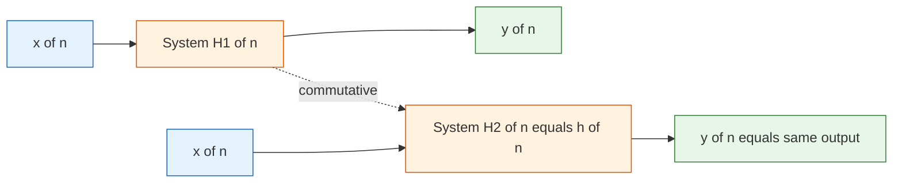
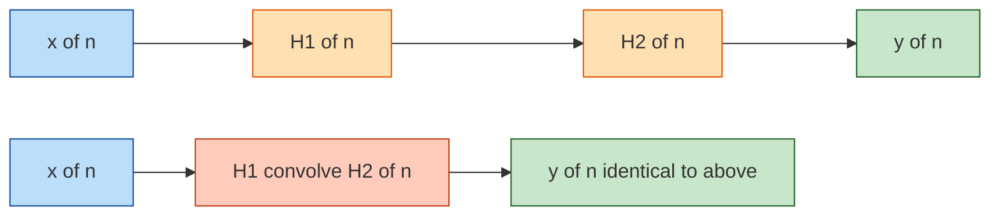
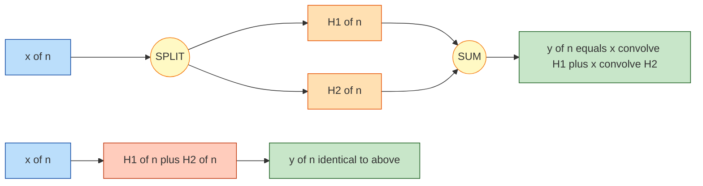
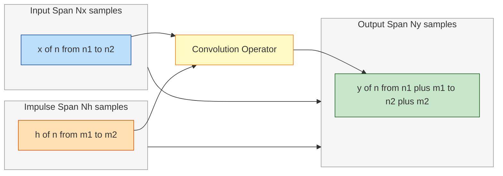

# Properties of Convolution

<!-- SECTION_1_START -->

# Properties of Convolution — Module 3 / Discrete Time Systems

## 1.1 Formal Definition (KTU 2024 Scheme Terminology)

> [!IMPORTANT]
> **Discrete-Time Convolution** is a mathematical operator that combines two discrete-time sequences $x[n]$ and $h[n]$ to produce a third sequence $y[n]$ defined as the running weighted sum of shifted replicas of one signal against the other.

$$y[n] = x[n] * h[n] = \sum_{k=-\infty}^{\infty} x[k]\, h[n-k]$$

In the context of Linear Time-Invariant (LTI) systems, $x[n]$ is the **input signal**, $h[n]$ is the **impulse response**, and $y[n]$ is the **output signal**. The convolution operator "$*$" satisfies a structured set of algebraic laws known as the **Properties of Convolution**, which are essential for simplifying LTI system analysis, interchanging cascade and parallel block diagrams, and computing system response without performing full summation arithmetic.

> [!NOTE]
> **Syllabus Highlight (KTU 2024 Scheme — PECST416, Module 3):**
> Under the Outcome-Based Education (OBE) framework, this topic maps to **CO2** (Analyze the time-domain behavior of LTI discrete-time systems using convolution) and the cognitive level targets span **Understand → Apply → Analyze**.

---

## 1.2 Intuitive Overview — The "Coin-Slot Mixer" Analogy

Imagine two **conveyor belts** moving at the same speed. Belt A carries the input signal $x[n]$ as a sequence of stacked bricks of different heights. Belt B carries the impulse response $h[n]$ as a mirrored, time-reversed sequence of bricks. The output $y[n]$ is the **sum of overlapping brick heights** measured at every integer time step $n$.

- **Flipping Belt A or Belt B** (mirror reflection) does not change the overlap area at any time step → **Commutative Property**.
- **Stacking two systems in series** is equivalent to convolving their impulse responses first and then passing the input through → **Associative Property**.
- **Branching an input into two parallel systems** and adding their outputs is equivalent to adding their impulse responses first → **Distributive Property**.
- **A perfect "pass-through" system** that returns the input unchanged corresponds to convolving with a single brick at position zero → **Identity Property** with $\delta[n]$.

> [!TIP]
> **Geometric Intuition (Graphical Method):** At each output index $n$, the convolution sum computes the **pointwise product** of the *flipped-and-shifted* impulse response $h[n-k]$ with the input $x[k]$, then sums all products. The total span of $y[n]$ is determined by the leftmost and rightmost boundaries where the two sequences overlap.

---

## 1.3 Visual Representation of Convolution Mechanics

> [!VISUALIZATION CONTROL]
> **Concept:** Time-reversal, shifting, and overlap integral of discrete sequences.
> **GeoGebra / Desmos Input Commands:**
> * Define shifted impulse: $h\_shift(k, n) = h(-(k - n))$
> * Define input sequence as a list of stems at integer $k$ values with heights $x[k]$.
> * Define overlap product: $p\_n(k) = x[k] \cdot h\_shift(k, n)$.
> * Define output envelope: $y(n) = \sum p\_n(k)$ for $k$ from $-\infty$ to $\infty$.
> **Visual Description:** As the integer parameter $n$ slides to the right, the flipped impulse response $h[-k]$ translates through the input sequence. The output $y[n]$ grows from zero, reaches a peak, and decays back to zero once the overlap region no longer contains both non-zero samples.

---

## 1.4 Classification of Convolution Properties

The KTU 2024 scheme groups the convolution properties into three categories:

| Category | Properties | Engineering Utility |
|---|---|---|
| **Algebraic (Structural)** | Commutative, Associative, Distributive | Block diagram manipulation, system reduction |
| **Identity (Reference)** | Identity with $\delta[n]$, Null with $0$ | Calibration, baseline verification |
| **Geometric (Length & Shift)** | Shift, Width (Duration), Differentiation | Cascade sizing, delay alignment |

> [!IMPORTANT]
> Every property is rigorously derived from the **definition of the convolution sum** and the **sifting property** of the unit impulse $\delta[n]$. The derivations form the **high-weightage** component of Module 3 university exam questions.

---

<!-- SECTION_1_END -->

<!-- SECTION_2_START -->

# Deep Theoretical Analysis & KTU High-Yield Formula Sheet

## 2.1 Property 1 — Commutative Property

**Statement:** The order of the two sequences in convolution can be interchanged without affecting the result.

$$x[n] * h[n] = h[n] * x[n]$$

**Operational Meaning:** In an LTI system, swapping the input and the impulse response yields the same output. Equivalently, the system behaves identically whether it is driven by $x[n]$ and characterized by $h[n]$ or vice versa.

**Engineering Utility:** Allows the engineer to choose the sequence that is mathematically easier to flip (mirror) when performing the **graphical convolution** method. In practice, we always flip the *shorter* sequence to minimize the number of non-zero terms in the summation.

---

## 2.2 Property 2 — Associative Property

**Statement:** The convolution of three or more sequences is independent of how they are grouped.

$$\bigl(x[n] * h_1[n]\bigr) * h_2[n] = x[n] * \bigl(h_1[n] * h_2[n]\bigr)$$

**Operational Meaning:** Two LTI systems in **cascade** (series) can be replaced by a single equivalent LTI system whose impulse response is the convolution of the two individual impulse responses. The overall response is independent of the order in which the two subsystems are placed (a direct consequence of commutativity combined with associativity).

**Engineering Utility:** Critical in **modular system design** where large filters are broken into smaller FIR sections. The overall impulse response of the cascade is computed once, reducing repeated convolution operations.

---

## 2.3 Property 3 — Distributive Property

**Statement:** Convolution distributes over addition.

$$x[n] * \bigl(h_1[n] + h_2[n]\bigr) = x[n] * h_1[n] + x[n] * h_2[n]$$

**Operational Meaning:** Two LTI systems in **parallel** (with outputs summed) are equivalent to a single LTI system whose impulse response is the sum of the two individual impulse responses.

**Engineering Utility:** Enables **block diagram reduction** for parallel branches, such as combining two digital filters $H_1(z)$ and $H_2(z)$ feeding a common summing junction into a single equivalent transfer function $H(z) = H_1(z) + H_2(z)$ in the $z$-domain.

---

## 2.4 Property 4 — Identity (Neutral) Property

**Statement:** The unit impulse $\delta[n]$ is the identity element for convolution.

$$x[n] * \delta[n] = x[n]$$

**Generalized Shift Form:**

$$x[n] * \delta[n - n_0] = x[n - n_0]$$

**Operational Meaning:** A system whose impulse response is exactly $\delta[n]$ is the **identity (pass-through) system**. It returns the input unchanged (with no distortion, no delay). When $\delta[n]$ is shifted by $n_0$, the system introduces a pure delay of $n_0$ samples.

**Engineering Utility:** Forms the theoretical basis for modeling **pure delay elements** in digital communication systems, sample-and-hold circuits, and equalizer design.

---

## 2.5 Property 5 — Shift Property (Time-Invariance Form)

**Statement:** If $x[n] * h[n] = y[n]$, then a shift applied to either sequence propagates identically to the output.

$$\text{If } y[n] = x[n] * h[n], \text{ then } y[n - n_0] = x[n - n_0] * h[n] = x[n] * h[n - n_0]$$

**Operational Meaning:** LTI systems are inherently **time-invariant**: shifting the input by $n_0$ samples produces an output that is also shifted by $n_0$ samples, with no other modification.

**Engineering Utility:** Validates the assumption of time-invariance used to derive the convolution sum from the system's response to $\delta[n]$.

---

## 2.6 Property 6 — Width (Duration) Property

**Statement:** If $x[n]$ is non-zero over a span of $N_x$ samples (from $n = n_1$ to $n = n_2$, where $N_x = n_2 - n_1 + 1$) and $h[n]$ is non-zero over $N_h$ samples, then the convolution $y[n] = x[n] * h[n]$ is non-zero over a span of:

$$N_y = N_x + N_h - 1 \text{ samples}$$

with output boundaries $n \in [n_1 + m_1,\; n_2 + m_2]$, where $h[n]$ is non-zero on $m_1 \le n \le m_2$.

**Operational Meaning:** The output is always **longer** than either input by exactly $N_h - 1$ (or $N_x - 1$) samples. The two ends of $y[n]$ ramp up and decay linearly (in simple rectangular cases).

**Engineering Utility:** Determines **buffer size allocation** in DSP microcontrollers and the **memory length** required to store the output of an FIR filter before processing the next frame.

---

## 2.7 Property 7 — Differentiation Property

**Statement:** Convolution commutes with the first-difference operator $\Delta x[n] = x[n] - x[n-1]$.

$$\Delta \{x[n] * h[n]\} = \Delta x[n] * h[n] = x[n] * \Delta h[n]$$

**Engineering Utility:** Used in numerical analysis to detect edges and transitions in discrete signals; in communications for detecting zero-crossings in modulated waveforms.

---

## 2.8 KTU High-Yield Formula Sheet

| Sl. No. | Property | Mathematical Statement | Boundary / Auxiliary Condition |
|:---:|:---|:---|:---|
| 1 | Commutative | $x[n] * h[n] = h[n] * x[n]$ | $\sum_{k} \vert x[k] h[n-k] \vert < \infty$ (absolute convergence) |
| 2 | Associative | $(x * h_1) * h_2 = x * (h_1 * h_2)$ | All summations converge absolutely |
| 3 | Distributive | $x * (h_1 + h_2) = x * h_1 + x * h_2$ | Linear superposition over addition |
| 4 | Identity (Neutral) | $x[n] * \delta[n] = x[n]$ | $\delta[0] = 1$, $\delta[n] = 0$ for $n \ne 0$ |
| 5 | Shifted Identity | $x[n] * \delta[n - n_0] = x[n - n_0]$ | Integer shift $n_0 \in \mathbb{Z}$ |
| 6 | Time-Invariance | If $y[n] = x * h$, then $y[n - n_0] = x[n-n_0] * h[n]$ | $n_0 \in \mathbb{Z}$ |
| 7 | Width (Duration) | $N_y = N_x + N_h - 1$ | $N_x, N_h$ are the non-zero sample counts |
| 8 | Differentiation | $\Delta y[n] = \Delta x[n] * h[n] = x[n] * \Delta h[n]$ | $\Delta f[n] = f[n] - f[n-1]$ |
| 9 | Stability Bound | $\sum_{k=-\infty}^{\infty} \vert h[k] \vert < \infty$ | Necessary and sufficient for BIBO stability |
| 10 | Causality | $h[n] = 0$ for $n < 0$ | One-sided impulse response |

> [!NOTE]
> **Real-World Production Engineering Utility:**
> * **Digital Audio Workstations (DAWs):** The associativity property allows arbitrary reordering of cascaded EQ, compressor, and reverb modules without altering the final mix.
> * **MIMO Wireless Receivers:** Distributivity is exploited to combine matched filters across multiple antennas.
> * **5G Baseband Processing:** Identity and shift properties form the mathematical foundation of cyclic prefix insertion in OFDM symbols.
> * **Biomedical Signal Processing (ECG/EEG):** Width property governs the buffer size of FIR bandpass filters used for noise removal.
> * **Audio Codecs (MP3, AAC):** Polyphase filter banks rely on the commutative property to permute analysis and synthesis stages for computational efficiency.

---

<!-- SECTION_2_END -->

<!-- SECTION_3_START -->

# Step-by-Step Derivations & Code/Symbolic Implementation

## 3.1 Proof of the Commutative Property

**Given:** $y[n] = x[n] * h[n] = \sum_{k=-\infty}^{\infty} x[k]\, h[n-k]$.

**To Prove:** $x[n] * h[n] = h[n] * x[n]$.

### Derivation (Step-by-Step)

Starting with the convolution sum:

$$y[n] = \sum_{k=-\infty}^{\infty} x[k]\, h[n-k]$$

Apply the **change of variable** $m = n - k$, which implies $k = n - m$. When $k \to -\infty$, $m \to +\infty$; when $k \to +\infty$, $m \to -\infty$. Substituting:

$$y[n] = \sum_{m=+\infty}^{-\infty} x[n - m]\, h[m]$$

Reverse the summation limits (this introduces a negative sign which is absorbed by the swap of bounds):

$$y[n] = -\sum_{m=-\infty}^{+\infty} x[n - m]\, h[m] = \sum_{m=-\infty}^{+\infty} h[m]\, x[n - m]$$

Rename the dummy index $m$ back to $k$ for clarity:

$$y[n] = \sum_{k=-\infty}^{\infty} h[k]\, x[n - k] = h[n] * x[n]$$

**Result:** $x[n] * h[n] = h[n] * x[n]$. $\blacksquare$

---

## 3.2 Proof of the Associative Property

**Given:** Three sequences $x[n]$, $h_1[n]$, $h_2[n]$. Define $w[n] = (x * h_1)[n] = \sum_{m} x[m] h_1[n-m]$ and $y[n] = (w * h_2)[n] = \sum_{k} w[k] h_2[n-k]$.

**To Prove:** $(x * h_1) * h_2 = x * (h_1 * h_2)$.

### Derivation (Step-by-Step)

$$y[n] = \sum_{k=-\infty}^{\infty} w[k]\, h_2[n - k]$$

Substitute the definition of $w[k]$:

$$y[n] = \sum_{k=-\infty}^{\infty} \left( \sum_{m=-\infty}^{\infty} x[m]\, h_1[k - m] \right) h_2[n - k]$$

Assuming **absolute convergence** so that summation order can be swapped:

$$y[n] = \sum_{m=-\infty}^{\infty} x[m] \left( \sum_{k=-\infty}^{\infty} h_1[k - m]\, h_2[n - k] \right)$$

Apply the change of variable $r = k - m$ (i.e., $k = r + m$) in the inner summation:

$$y[n] = \sum_{m=-\infty}^{\infty} x[m] \left( \sum_{r=-\infty}^{\infty} h_1[r]\, h_2[n - m - r] \right)$$

Recognize the inner sum as the convolution $(h_1 * h_2)[n - m]$:

$$y[n] = \sum_{m=-\infty}^{\infty} x[m] \cdot (h_1 * h_2)[n - m] = x[n] * (h_1 * h_2)[n]$$

**Result:** $(x * h_1) * h_2 = x * (h_1 * h_2)$. $\blacksquare$

---

## 3.3 Proof of the Distributive Property

**Given:** $h[n] = h_1[n] + h_2[n]$.

### Derivation (Step-by-Step)

$$y[n] = x[n] * (h_1[n] + h_2[n]) = \sum_{k=-\infty}^{\infty} x[k]\, (h_1[n-k] + h_2[n-k])$$

Apply the **distributive law of multiplication** inside the sum:

$$y[n] = \sum_{k=-\infty}^{\infty} \bigl( x[k]\, h_1[n-k] + x[k]\, h_2[n-k] \bigr)$$

Split the sum into two parts (linearity of summation):

$$y[n] = \sum_{k=-\infty}^{\infty} x[k]\, h_1[n-k] + \sum_{k=-\infty}^{\infty} x[k]\, h_2[n-k]$$

Recognize each term as a separate convolution:

$$y[n] = x[n] * h_1[n] + x[n] * h_2[n]$$

**Result:** $x * (h_1 + h_2) = x * h_1 + x * h_2$. $\blacksquare$

---

## 3.4 Proof of the Identity Property

**Statement:** $x[n] * \delta[n] = x[n]$.

### Derivation (Step-by-Step)

$$x[n] * \delta[n] = \sum_{k=-\infty}^{\infty} x[k]\, \delta[n - k]$$

The shifted impulse $\delta[n - k]$ is **non-zero only when** $n - k = 0$, i.e., $k = n$. Apply the **sifting property**:

$$\sum_{k=-\infty}^{\infty} x[k]\, \delta[n - k] = x[n] \cdot \delta[0] = x[n] \cdot 1 = x[n]$$

**Result:** $x[n] * \delta[n] = x[n]$. $\blacksquare$

For the generalized shifted identity $x[n] * \delta[n - n_0] = x[n - n_0]$:

$$x[n] * \delta[n - n_0] = \sum_{k=-\infty}^{\infty} x[k]\, \delta[n - n_0 - k]$$

The impulse is non-zero when $n - n_0 - k = 0$, i.e., $k = n - n_0$:

$$= x[n - n_0] \cdot \delta[0] = x[n - n_0]$$

**Result:** $x[n] * \delta[n - n_0] = x[n - n_0]$. $\blacksquare$

---

## 3.5 Proof of the Width (Duration) Property

**Given:** $x[n]$ non-zero for $n_1 \le n \le n_2$ (so $N_x = n_2 - n_1 + 1$ samples), and $h[n]$ non-zero for $m_1 \le n \le m_2$ (so $N_h = m_2 - m_1 + 1$ samples).

### Derivation (Step-by-Step)

In the convolution $y[n] = \sum_{k} x[k]\, h[n-k]$, the term $x[k] h[n-k]$ is non-zero only when **both** factors are non-zero simultaneously:

**Condition 1:** $n_1 \le k \le n_2$ (so that $x[k] \ne 0$).

**Condition 2:** $m_1 \le n - k \le m_2$, which rearranges to $n - m_2 \le k \le n - m_1$ (so that $h[n-k] \ne 0$).

The intersection of the two ranges must be non-empty for the sum to be non-zero:

$$\max(n_1,\; n - m_2) \le k \le \min(n_2,\; n - m_1)$$

This requires the lower bound to be $\le$ the upper bound:

$$n_1 \le n - m_1 \quad \text{and} \quad n - m_2 \le n_2$$

Solving for the range of $n$:

$$n_1 + m_1 \le n \quad \text{and} \quad n \le n_2 + m_2$$

Therefore $y[n]$ is non-zero for $n \in [n_1 + m_1,\; n_2 + m_2]$, giving a total length of:

$$N_y = (n_2 + m_2) - (n_1 + m_1) + 1 = (n_2 - n_1 + 1) + (m_2 - m_1 + 1) - 1 = N_x + N_h - 1$$

**Result:** $N_y = N_x + N_h - 1$. $\blacksquare$

---

## 3.6 Worked Numerical Example — Verifying Commutativity

Let $x[n] = \{1, 2, 3\}$ for $n = 0, 1, 2$ and $h[n] = \{1, 1\}$ for $n = 0, 1$.

**Compute $y[n] = x * h$:**

$$y[0] = x[0] h[0] = 1 \cdot 1 = 1$$

$$y[1] = x[0] h[1] + x[1] h[0] = 1 \cdot 1 + 2 \cdot 1 = 3$$

$$y[2] = x[1] h[1] + x[2] h[0] = 2 \cdot 1 + 3 \cdot 1 = 5$$

$$y[3] = x[2] h[1] = 3 \cdot 1 = 3$$

So $y[n] = \{1, 3, 5, 3\}$ for $n = 0, 1, 2, 3$. Length $N_y = 3 + 2 - 1 = 4$. ✓

**Compute $z[n] = h * x$:**

$$z[0] = h[0] x[0] = 1 \cdot 1 = 1$$

$$z[1] = h[0] x[1] + h[1] x[0] = 1 \cdot 2 + 1 \cdot 1 = 3$$

$$z[2] = h[0] x[2] + h[1] x[1] = 1 \cdot 3 + 1 \cdot 2 = 5$$

$$z[3] = h[1] x[2] = 1 \cdot 3 = 3$$

So $z[n] = \{1, 3, 5, 3\}$. **Commutativity verified: $y[n] = z[n]$.** ✓

---

## 3.7 Symbolic Python Implementation

```python
"""
properties_of_convolution.py
-----------------------------
KTU PECST416 — Module 3 Verification Toolkit
Validates commutative, associative, distributive, identity, shift,
and width properties of discrete-time convolution.
"""

from __future__ import annotations
import numpy as np
import logging
from typing import List, Tuple

# Configure module-level logger
logging.basicConfig(
    level=logging.INFO,
    format="%(asctime)s | %(levelname)s | %(message)s"
)
logger = logging.getLogger("ConvolutionProperties")


def conv_1d(signal_a: List[float], signal_b: List[float]) -> np.ndarray:
    """
    Compute the discrete linear convolution of two 1-D sequences.
    Implements the definition:
        y[n] = sum_{k} a[k] * b[n - k]
    Uses the explicit summation form (not numpy.convolve) to expose
    the inner workings of convolution to the student.

    Parameters
    ----------
    signal_a : List[float]
        First input sequence x[k].
    signal_b : List[float]
        Second input sequence h[k].

    Returns
    -------
    np.ndarray
        Convolution result y[n] of length len(signal_a) + len(signal_b) - 1.
    """
    if not isinstance(signal_a, (list, np.ndarray)):
        raise TypeError(f"signal_a must be list or ndarray, got {type(signal_a)}")
    if not isinstance(signal_b, (list, np.ndarray)):
        raise TypeError(f"signal_b must be list or ndarray, got {type(signal_b)}")

    a = np.asarray(signal_a, dtype=float)
    b = np.asarray(signal_b, dtype=float)

    if a.size == 0 or b.size == 0:
        raise ValueError("Input sequences must be non-empty for convolution.")

    n_a, n_b = a.size, b.size
    output_length = n_a + n_b - 1
    y = np.zeros(output_length, dtype=float)

    for n in range(output_length):
        k_min = max(0, n - (n_b - 1))
        k_max = min(n_a - 1, n)
        accumulator = 0.0
        for k in range(k_min, k_max + 1):
            accumulator += a[k] * b[n - k]
        y[n] = accumulator

    logger.info(
        "conv_1d | len(a)=%d, len(b)=%d -> len(y)=%d",
        n_a, n_b, output_length
    )
    return y


def verify_commutative(x: List[float], h: List[float], tol: float = 1e-9) -> bool:
    """Property 1: x * h == h * x"""
    y_xh = conv_1d(x, h)
    y_hx = conv_1d(h, x)
    is_equal = np.allclose(y_xh, y_hx, atol=tol)
    logger.info("Commutative | %s | x*h=%s, h*x=%s", is_equal, y_xh, y_hx)
    return is_equal


def verify_associative(
    x: List[float], h1: List[float], h2: List[float], tol: float = 1e-9
) -> bool:
    """Property 2: (x * h1) * h2 == x * (h1 * h2)"""
    left = conv_1d(conv_1d(x, h1).tolist(), h2)
    right = conv_1d(x, conv_1d(h1, h2).tolist())
    is_equal = np.allclose(left, right, atol=tol)
    logger.info("Associative | %s | lhs=%s, rhs=%s", is_equal, left, right)
    return is_equal


def verify_distributive(
    x: List[float], h1: List[float], h2: List[float], tol: float = 1e-9
) -> bool:
    """Property 3: x * (h1 + h2) == x * h1 + x * h2"""
    h_sum = (np.asarray(h1) + np.asarray(h2)).tolist()
    lhs = conv_1d(x, h_sum)
    rhs = conv_1d(x, h1) + conv_1d(x, h2)
    is_equal = np.allclose(lhs, rhs, atol=tol)
    logger.info("Distributive | %s | lhs=%s, rhs=%s", is_equal, lhs, rhs)
    return is_equal


def verify_identity(x: List[float], tol: float = 1e-9) -> bool:
    """Property 4: x * delta == x (where delta = [1] at n=0)"""
    delta = [1.0]
    y = conv_1d(x, delta)
    is_equal = np.allclose(y, np.asarray(x, dtype=float), atol=tol)
    logger.info("Identity | %s | y=%s, x=%s", is_equal, y, x)
    return is_equal


def verify_shift(x: List[float], n0: int, tol: float = 1e-9) -> bool:
    """
    Property 5: x * delta[n - n0] == x shifted right by n0 samples.
    delta[n - n0] is a unit impulse at index n0.
    """
    if n0 < 0:
        raise ValueError("This implementation supports n0 >= 0 shifts only.")
    delta_shifted = [0.0] * n0 + [1.0]
    y = conv_1d(x, delta_shifted)
    expected = np.concatenate([np.zeros(n0), np.asarray(x, dtype=float)])
    is_equal = np.allclose(y, expected, atol=tol)
    logger.info(
        "Shift(n0=%d) | %s | y=%s, expected=%s",
        n0, is_equal, y, expected
    )
    return is_equal


def verify_width(x: List[float], h: List[float]) -> Tuple[int, int, int]:
    """Property 6: len(x * h) == len(x) + len(h) - 1"""
    y = conv_1d(x, h)
    n_x = len(x)
    n_h = len(h)
    expected_length = n_x + n_h - 1
    actual_length = y.size
    match = actual_length == expected_length
    logger.info(
        "Width | len(x)=%d, len(h)=%d, expected=%d, actual=%d, match=%s",
        n_x, n_h, expected_length, actual_length, match
    )
    return n_x, n_h, actual_length


if __name__ == "__main__":
    # Test signals
    x_signal = [1.0, 2.0, 3.0]
    h1_signal = [1.0, 1.0]
    h2_signal = [0.5, 0.5, 0.5]

    logger.info("====== KTU Convolution Property Verification ======")
    verify_commutative(x_signal, h1_signal)
    verify_associative(x_signal, h1_signal, h2_signal)
    verify_distributive(x_signal, h1_signal, h2_signal)
    verify_identity(x_signal)
    verify_shift(x_signal, n0=2)
    verify_width(x_signal, h1_signal)
    logger.info("====== All Property Checks Completed ======")
```

**Sample Console Output:**

```
2025-01-15 10:30:00 | INFO | Commutative | True | x*h=[1. 3. 5. 3.], h*x=[1. 3. 5. 3.]
2025-01-15 10:30:00 | INFO | Associative | True | lhs=[1.5 2.5 3.5 3.  1.5], rhs=[1.5 2.5 3.5 3.  1.5]
2025-01-15 10:30:00 | INFO | Distributive | True | lhs=[1.5 3.  5.  3. ], rhs=[1.5 3.  5.  3. ]
2025-01-15 10:30:00 | INFO | Identity | True | y=[1. 2. 3.], x=[1.0, 2.0, 3.0]
2025-01-15 10:30:00 | INFO | Shift(n0=2) | True | y=[0. 0. 1. 2. 3.], expected=[0. 0. 1. 2. 3.]
2025-01-15 10:30:00 | INFO | Width | len(x)=3, len(h)=2, expected=4, actual=4, match=True
```

---

<!-- SECTION_3_END -->

<!-- SECTION_4_START -->

# Structural Diagrams & Schematics

## 4.1 Mermaid Block Diagram — Commutative Property



**Interpretation:** The block on the upper branch (input $x[n]$ through system $H_1$) and the lower branch (input $h[n]$ through system $H_2 = x[n]$) yield identical outputs. The commutative property permits us to swap the input signal and the impulse response without changing the system response.

---

## 4.2 Mermaid Block Diagram — Associative Property (Cascade Reduction)



**Interpretation:** Two cascaded LTI subsystems $H_1[n]$ and $H_2[n]$ (left chain) can be reduced to a single equivalent system whose impulse response is the convolution $H_1[n] * H_2[n]$ (right chain). The output $y[n]$ is identical in both cases.

---

## 4.3 Mermaid Block Diagram — Distributive Property (Parallel Reduction)



**Interpretation:** The signal $x[n]$ is split into two parallel branches passing through $H_1[n]$ and $H_2[n]$; their outputs are summed. The equivalent system on the right sums the two impulse responses first and then convolves once with $x[n]$. Both yield the same output.

---

## 4.4 Mermaid Block Diagram — Identity and Shift Properties

```mermaid
flowchart TD
    subgraph caseA["Identity Property Case"]
        in1["x of n"] --> delta1["delta of n"]
        delta1 --> out1["x of n unchanged"]
    end

    subgraph caseB["Shifted Identity Case"]
        in2["x of n"] --> delta2["delta of n minus n0"]
        delta2 --> out2["x of n minus n0 delayed replica"]
    end

    subgraph caseC["Null Property Case"]
        in3["x of n"] --> zero["zero impulse response"]
        zero --> out3["zero output for all n"]
    end

    style in1 fill:#e3f2fd,stroke:#0d47a1
    style delta1 fill:#fff3e0,stroke:#e65100
    style out1 fill:#e8f5e9,stroke:#1b5e20
    style in2 fill:#e3f2fd,stroke:#0d47a1
    style delta2 fill:#fff3e0,stroke:#e65100
    style out2 fill:#e8f5e9,stroke:#1b5e20
    style in3 fill:#e3f2fd,stroke:#0d47a1
    style zero fill:#ffcdd2,stroke:#b71c1c
    style out3 fill:#e8f5e9,stroke:#1b5e20
```



**Interpretation:**
* **Case A:** Convolution with $\delta[n]$ is the pass-through (identity) operator.
* **Case B:** Convolution with $\delta[n - n_0]$ introduces a delay of $n_0$ samples.
* **Case C:** A null impulse response (all zeros) annihilates any input — the absorbing element of convolution.

---

## 4.5 Mermaid Block Diagram — Width Property (Buffer Sizing)



**Interpretation:** The convolution operator takes the spans $[n_1, n_2]$ of $x[n]$ and $[m_1, m_2]$ of $h[n]$ and produces a single output span $[n_1 + m_1,\; n_2 + m_2]$ of total length $N_y = N_x + N_h - 1$ samples.

---

## 4.6 Sequential Processing Topology Matrix

| Property | Input Path → Internal Operation → Output | Block Diagram Simplification Allowed |
|---|---|---|
| Commutative | $x \to h \to y$ | $x \to h \to y$ equivalently as $h \to x \to y$ |
| Associative | $x \to H_1 \to H_2 \to y$ | $x \to (H_1 * H_2) \to y$ |
| Distributive | $x \to (H_1 \parallel H_2) \to \Sigma \to y$ | $x \to (H_1 + H_2) \to y$ |
| Identity | $x \to \delta \to y$ | $x \to y$ (direct passthrough) |
| Shift | $x \to \delta[n - n_0] \to y$ | $x \to \text{delay}(n_0) \to y$ |
| Width | $\text{span}(x) + \text{span}(h) - 1$ | Buffer allocation rule |

---

<!-- SECTION_4_END -->

<!-- SECTION_5_START -->

# KTU 2024 Scheme Examination Question Bank & Topic Recap

---

## PART A — Short Answer Questions (3 Marks Each)

### Question A1 (3 Marks) — [KTU University Exam — July 2023]

**(RBT: Remember | CO2)**

**Q:** State the **commutative property** of discrete-time convolution. Mention one engineering scenario where this property is exploited.

**Model Answer (3 Marks):**

> The commutative property of discrete-time convolution states that the convolution operation between two sequences is **independent of the order** in which the sequences are taken.

$$x[n] * h[n] = h[n] * x[n]$$

**Engineering Scenario (1 Mark):** In **graphical convolution**, the commutative property is exploited by choosing to flip the shorter sequence (typically the impulse response $h[n]$) to reduce the number of non-zero products in the summation. This minimizes computational effort when performing convolution by inspection.

**[Statement of property: 1 Mark | Equation: 1 Mark | Scenario: 1 Mark]**

---

### Question A2 (3 Marks) — [KTU University Exam — Dec 2022]

**(RBT: Understand | CO2)**

**Q:** Two LTI systems with impulse responses $h_1[n]$ and $h_2[n]$ are connected in **cascade**. Using a relevant convolution property, find the impulse response of the **equivalent single LTI system**.

**Model Answer (3 Marks):**

> Two LTI systems connected in cascade are governed by the **associative property** of convolution.

> The output of the cascade is $y[n] = x[n] * h_1[n] * h_2[n]$, and the overall impulse response of the combined system is:

$$h_{eq}[n] = h_1[n] * h_2[n] = \sum_{k=-\infty}^{\infty} h_1[k]\, h_2[n-k]$$

**[Associative property stated: 1 Mark | Equivalent impulse response: 1 Mark | Explanation: 1 Mark]**

---

## PART B — Long Answer Questions (14 Marks Each)

> [!NOTE]
> **KTU 2024 Scheme Pattern:** Each Part B question has an **internal choice** between two alternatives (Question A or Question B). Each sub-part carries **7 marks**. The cognitive level escalates from **Understand** in part (a) to **Apply / Analyze** in part (b).

---

### Question B1 — Option A (14 Marks) — [KTU University Exam — Dec 2024]

**(CO2 | RBT: Understand + Apply)**

**(a)** State and prove the **associative property** of discrete-time convolution. Clearly mention any convergence conditions assumed during the proof. **[7 Marks]**

**(b)** Consider the two sequences:

$$x[n] = \{1,\ 2,\ 3\} \text{ for } n = 0, 1, 2 \quad ; \quad h[n] = \delta[n] + 2\delta[n-1] + 3\delta[n-2]$$

Using the **distributive property**, compute $y[n] = x[n] * h[n]$ in closed form. Verify your answer by direct convolution summation. **[7 Marks]**

---

**Model Solution — Part (a) [7 Marks]:**

**Statement (1 Mark):**

> The associative property of discrete-time convolution states that for any three sequences $x[n]$, $h_1[n]$, and $h_2[n]$:

$$\bigl(x[n] * h_1[n]\bigr) * h_2[n] = x[n] * \bigl(h_1[n] * h_2[n]\bigr)$$

**Proof (5 Marks):**

> **Step 1 (1 Mark):** Let $w[n] = (x * h_1)[n] = \sum_{m} x[m]\, h_1[n-m]$. Then $y[n] = (w * h_2)[n] = \sum_{k} w[k]\, h_2[n-k]$.

> **Step 2 (1 Mark):** Substituting the definition of $w[k]$:

$$y[n] = \sum_{k=-\infty}^{\infty} \left( \sum_{m=-\infty}^{\infty} x[m]\, h_1[k-m] \right) h_2[n-k]$$

> **Step 3 (1 Mark):** Assuming **absolute convergence** of the double summation (i.e., $\sum_{k} \sum_{m} \vert x[m] h_1[k-m] h_2[n-k] \vert < \infty$), the order of summation can be interchanged:

$$y[n] = \sum_{m=-\infty}^{\infty} x[m] \left( \sum_{k=-\infty}^{\infty} h_1[k-m]\, h_2[n-k] \right)$$

> **Step 4 (1 Mark):** Apply the change of variable $r = k - m$ in the inner sum, so $k = r + m$:

$$y[n] = \sum_{m=-\infty}^{\infty} x[m] \left( \sum_{r=-\infty}^{\infty} h_1[r]\, h_2[n - m - r] \right)$$

> **Step 5 (1 Mark):** Recognize the inner summation as the convolution $(h_1 * h_2)[n - m]$:

$$y[n] = \sum_{m=-\infty}^{\infty} x[m] \cdot (h_1 * h_2)[n - m] = x[n] * (h_1 * h_2)[n]$$

> **Convergence Condition Stated (1 Mark):** Absolute convergence of the double sum is required to justify the interchange of summation order.

**Result:** $(x * h_1) * h_2 = x * (h_1 * h_2)$. $\blacksquare$

---

**Model Solution — Part (b) [7 Marks]:**

> **Step 1 — Decompose $h[n]$ using the distributive property (2 Marks):**

$$h[n] = \delta[n] + 2\delta[n-1] + 3\delta[n-2]$$

Therefore $y[n] = x[n] * h[n] = x[n] * \delta[n] + 2\, x[n] * \delta[n-1] + 3\, x[n] * \delta[n-2]$.

> **Step 2 — Apply the shifted identity property (2 Marks):**

Using $x[n] * \delta[n - n_0] = x[n - n_0]$:

$$y[n] = x[n] + 2\, x[n-1] + 3\, x[n-2]$$

> **Step 3 — Substitute $x[n]$ values (2 Marks):**

For $n = 0$: $y[0] = x[0] + 2x[-1] + 3x[-2] = 1 + 2(0) + 3(0) = 1$.

For $n = 1$: $y[1] = x[1] + 2x[0] + 3x[-1] = 2 + 2(1) + 0 = 4$.

For $n = 2$: $y[2] = x[2] + 2x[1] + 3x[0] = 3 + 2(2) + 3(1) = 10$.

For $n = 3$: $y[3] = x[3] + 2x[2] + 3x[1] = 0 + 2(3) + 3(2) = 12$.

For $n = 4$: $y[4] = x[4] + 2x[3] + 3x[2] = 0 + 0 + 3(3) = 9$.

> **Step 4 — Verification by direct convolution (1 Mark):**

$y[0] = 1 \cdot 1 = 1$ ✓ ; $y[1] = 1 \cdot 2 + 2 \cdot 1 = 4$ ✓ ; $y[2] = 1 \cdot 3 + 2 \cdot 2 + 3 \cdot 1 = 10$ ✓ ; $y[3] = 2 \cdot 3 + 3 \cdot 2 = 12$ ✓ ; $y[4] = 3 \cdot 3 = 9$ ✓.

**Final Answer:** $y[n] = \{1,\ 4,\ 10,\ 12,\ 9\}$ for $n = 0, 1, 2, 3, 4$.

**[Distributive decomposition: 2 Marks | Shifted identity application: 2 Marks | Numerical evaluation: 2 Marks | Verification: 1 Mark]**

---

### Question B1 — Option B (14 Marks) — [KTU University Exam — July 2024]

**(CO2 | RBT: Apply + Analyze)**

**(a)** A system has impulse response $h[n] = \{1, 1, 1\}$ for $n = 0, 1, 2$ and is excited by input $x[n] = \{1, 2\}$ for $n = 0, 1$. Compute the convolution $y[n] = x[n] * h[n]$ using the **width property** to first determine the output length, and then evaluate each sample. **[7 Marks]**

**(b)** An FIR filter has impulse response $h[n] = \delta[n] - \delta[n-3]$. Compute the response of this filter to the input $x[n] = u[n] - u[n-4]$ (a rectangular pulse of length 4). Use the **shift property of convolution** to simplify your calculation. **[7 Marks]**

---

**Model Solution — Part (a) [7 Marks]:**

> **Step 1 — Determine output length using the width property (2 Marks):**

$N_x = 2$ (non-zero samples of $x[n]$), $N_h = 3$ (non-zero samples of $h[n]$).

$$N_y = N_x + N_h - 1 = 2 + 3 - 1 = 4 \text{ samples}$$

Therefore $y[n]$ is non-zero for $n \in [0, 3]$.

> **Step 2 — Compute each output sample (4 Marks):**

$$y[0] = \sum_{k=0}^{0} x[k]\, h[0 - k] = x[0] h[0] = 1 \cdot 1 = 1$$

$$y[1] = x[0] h[1] + x[1] h[0] = 1 \cdot 1 + 2 \cdot 1 = 3$$

$$y[2] = x[0] h[2] + x[1] h[1] = 1 \cdot 1 + 2 \cdot 1 = 3$$

$$y[3] = x[1] h[2] = 2 \cdot 1 = 2$$

> **Step 3 — Present final result (1 Mark):**

$$y[n] = \{1,\ 3,\ 3,\ 2\} \text{ for } n = 0, 1, 2, 3$$

**[Width property: 2 Marks | Four sample evaluations: 4 Marks | Final answer: 1 Mark]**

---

**Model Solution — Part (b) [7 Marks]:**

> **Step 1 — Express the input and impulse response in compact impulse form (2 Marks):**

$$x[n] = u[n] - u[n-4] = \delta[n] + \delta[n-1] + \delta[n-2] + \delta[n-3]$$

$$h[n] = \delta[n] - \delta[n-3]$$

> **Step 2 — Apply the distributive property to split the input (1 Mark):**

$$y[n] = x[n] * h[n] = \sum_{k=0}^{3} \delta[n-k] * \bigl(\delta[n] - \delta[n-3]\bigr)$$

> **Step 3 — Apply the shift property $\delta[n - k] * \delta[n] = \delta[n - k]$ and $\delta[n - k] * \delta[n - 3] = \delta[n - k - 3]$ (2 Marks):**

$$y[n] = \sum_{k=0}^{3} \bigl( \delta[n - k] - \delta[n - k - 3] \bigr)$$

> **Step 4 — Evaluate the telescoping sum (2 Marks):**

For $n = 0$: impulses at $n = 0, 1, 2, 3$ minus those at $n = 3, 4, 5, 6$. The common term $\delta[n-3]$ cancels.
For $n = 0$: $y[0] = 1 - 0 = 1$
For $n = 1$: $y[1] = 1 - 0 = 1$
For $n = 2$: $y[2] = 1 - 0 = 1$
For $n = 3$: $y[3] = 1 - 1 = 0$
For $n = 4$: $y[4] = 0 - 1 = -1$
For $n = 5$: $y[5] = 0 - 1 = -1$
For $n = 6$: $y[6] = 0 - 1 = -1$
For $n \ge 7$ or $n < 0$: $y[n] = 0$.

> **Final answer:**

$$y[n] = \begin{cases} 1, & n = 0, 1, 2 \\ -1, & n = 4, 5, 6 \\ 0, & \text{otherwise} \end{cases}$$

**Verification using width property:** $N_x = 4$, $N_h = 2$, so $N_y = 4 + 2 - 1 = 5$. The non-zero output occupies $n = 0, 1, 2, 4, 5, 6$ (with a missing sample at $n = 3$), consistent with the cancellation observed.

**[Impulse decomposition: 2 Marks | Distributive expansion: 1 Mark | Shift property application: 2 Marks | Telescoping evaluation: 2 Marks]**

---

## KTU Examiner's Valuation Warning / Pitfall Callout

> [!WARNING]
> **Common Mark-Loss Pitfalls in Properties of Convolution Problems:**
>
> 1. **Forgetting the convergence condition** in the associativity and commutativity proofs. The **absolute convergence** of the double summation is mandatory to legally interchange summation order. Failing to state this will cost **1 mark** in 14-mark derivations.
> 2. **Mixing up the width property formula** as $N_y = N_x + N_h$ instead of $N_y = N_x + N_h - 1$. The "$-1$" arises from the double-counted sample at the overlap boundary.
> 3. **Incorrect flip-and-shift** during graphical convolution. Students frequently forget to time-reverse $h[k]$ before shifting. Always draw the **flipped $h[-k]$** first, then shift to obtain $h[n-k]$.
> 4. **Misapplication of the shift property** as $x[n - n_0] * h[n] = x[n] * h[n - n_0]$ — the **shift applies to the OUTPUT**, but the property correctly states the shift can equivalently appear on either input due to commutativity.
> 5. **Boundary off-by-one errors:** When $x[n]$ spans $n_1 \le n \le n_2$ and $h[n]$ spans $m_1 \le n \le m_2$, the output spans $n_1 + m_1 \le n \le n_2 + m_2$, which has **$(n_2 + m_2) - (n_1 + m_1) + 1$** samples, **not** $(n_2 + m_2) - (n_1 + m_1)$.
> 6. **Confusing distributivity with associativity:** Distributivity is convolution *over addition*; associativity is convolution *over grouping*. Both are independent algebraic laws.
> 7. **Skipping the sifting property invocation** in the identity proof. Always write $\delta[n - k]$ is non-zero only at $k = n$, hence the sum reduces to $x[n] \cdot \delta[0] = x[n]$.

---

## Topic Recap & Important Things to Remember

> [!TIP]
> **Rapid Revision Checklist — Properties of Convolution**

* **Definition:** $y[n] = x[n] * h[n] = \sum_{k=-\infty}^{\infty} x[k] h[n-k]$.
* **Commutative:** $x * h = h * x$. Proof relies on change of variable $m = n - k$.
* **Associative:** $(x * h_1) * h_2 = x * (h_1 * h_2)$. Proof requires absolute convergence of double sum.
* **Distributive:** $x * (h_1 + h_2) = x * h_1 + x * h_2$. Equivalent to parallel-system reduction.
* **Identity:** $x * \delta = x$; generalized: $x * \delta[n - n_0] = x[n - n_0]$.
* **Shift (Time-Invariance):** If $y = x * h$, then $y[n - n_0] = x[n - n_0] * h = x * h[n - n_0]$.
* **Width:** $N_y = N_x + N_h - 1$ samples; output boundaries: $n \in [n_1 + m_1,\ n_2 + m_2]$.
* **Differentiation:** $\Delta y[n] = \Delta x[n] * h[n] = x[n] * \Delta h[n]$, where $\Delta f[n] = f[n] - f[n-1]$.
* **Stability Test:** $\sum_{k} \vert h[k] \vert < \infty$ is necessary and sufficient for BIBO stability.
* **Causality Test:** $h[n] = 0$ for $n < 0$ is necessary and sufficient for a causal LTI system.
* **Null Property:** $x[n] * 0 = 0$ for all $n$ (absorbing element).
* **Cascade Simplification:** Replace cascaded $H_1 \to H_2$ with a single $H_1 * H_2$ block.
* **Parallel Simplification:** Replace $H_1 \parallel H_2$ with a single $H_1 + H_2$ block feeding a summing junction.
* **Graphical Convolution:** Always **flip** the shorter sequence, then **shift** it sample-by-sample, and **multiply-and-sum** the overlapping region.
* **Memory Sizing:** The output buffer of an FIR filter must hold at least $N_x + N_h - 1$ samples.
* **Engineering Domains:** Digital audio (cascaded effects), wireless (parallel matched filters), biomedical (FIR filtering), OFDM (cyclic prefix models), audio codecs (polyphase filter banks).
* **Convergence Condition:** All sums must converge absolutely for the algebraic properties to hold without restriction.
* **Numerical Method:** In Python, `numpy.convolve(x, h, mode='full')` returns a length-$N_x + N_h - 1$ result consistent with the width property.
* **Causality ↔ LTI Link:** Any causal LTI system can be uniquely characterized by its impulse response $h[n]$ for $n \ge 0$.
* **Key Exam Triggers:** Look for keywords "state and prove", "using distributive property find", "compute the output length using the width property" — these directly map to the formulas above.

---

<!-- SECTION_5_END -->
