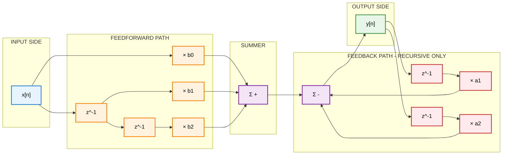
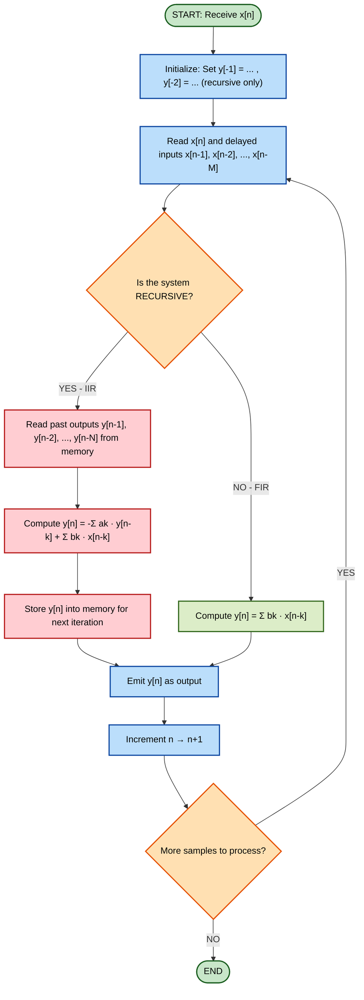

# Recursive DT systems and non recursive discrete time systems

<!-- SECTION_1_START -->
# Recursive and Non-Recursive Discrete-Time Systems

## 1.1 Formal KTU 2024 Definition

In the KTU 2024 Scheme syllabus for **PEL/PECST416 — Signals and Systems (Module 3)**, a discrete-time (DT) system is modeled using a **Linear Constant-Coefficient Difference Equation (LCCDE)** of the form:

$$
y[n] = -\sum_{k=1}^{N} a_k\, y[n-k] \;+\; \sum_{k=0}^{M} b_k\, x[n-k]
$$

Based on the presence or absence of the past-output terms $y[n-k]$, DT systems are classified into two fundamental families:

| **System Class** | **Past-Output Dependency** | **Equation Form** | **Impulse Response Duration** |
|---|---|---|---|
| **Recursive DT System** | Yes (feedback present) | $y[n] = -\sum a_k y[n-k] + \sum b_k x[n-k]$ | **Infinite** (IIR) |
| **Non-Recursive DT System** | No (no feedback) | $y[n] = \sum_{k=0}^{M} b_k\, x[n-k]$ | **Finite** (FIR) |

> [!IMPORTANT]
> **KTU Board Terminology:** Recursive systems are universally referred to as **Infinite Impulse Response (IIR)** systems, while non-recursive systems are called **Finite Impulse Response (FIR)** systems. Master both nomenclatures — examiners freely interchange them.

---

## 1.2 Conceptual Analogy & Intuitive Overview

### 🍲 The Kitchen Sink Analogy

Imagine two types of kitchen faucets:

- **Non-Recursive (FIR) System** — A *single-pass shower head*. The water flowing out **right now** depends only on what is flowing *in this instant and the few moments before*. There is **no recycling**. Once water leaves, it is gone forever. If you turn off the input, the output stops *immediately* (in finite steps).

- **Recursive (IIR) System** — A *feedback shower head with a return pipe*. Some of the water that exits is **piped back and mixed** with the new incoming water. The output depends not only on present input but also on **what was already output a moment ago**. If you suddenly stop the input, you will still see water trickling out for a long time, because of the feedback loop. Theoretically, this trickling can last **infinitely long** (though it decays).

### 🎯 The Snowball Analogy (Why Feedback is Powerful)

A **non-recursive** system is like rolling a snowball using only the fresh snow you pick up — its size depends on the *current and past few handfuls*.

A **recursive** system is a snowball that *rolls back over itself*, picking up more snow each time. The same handfuls of snow are processed **over and over**, producing a vastly amplified effect with the same number of input samples. This is why recursive filters are computationally cheaper for the same frequency response sharpness.

> [!NOTE]
> **Key Intuition:** A recursive system can achieve *more filtering power with fewer coefficients* than a non-recursive system. The trade-off is **stability risk** — too much feedback and the snowball grows without bound (unstable system).

---

## 1.3 Visualization of the Two Behaviors

> [!VISUALIZATION CONTROL]
> **Concept:** Impulse response $h[n]$ decay of recursive vs. non-recursive system
> **Sample System Equations:**
> * `FIR (non-recursive): h[n] = {1, 0.5, 0.25}` — finite 3 samples, then zero
> * `IIR (recursive): h[n] = (0.8)^n * u[n]` — infinite samples, decays geometrically
>
> **Visual Description:** Plot the FIR response as three discrete dots on the $n$-axis. Plot the IIR response as an exponentially decaying sequence of dots extending along the positive $n$-axis without ever becoming exactly zero. Observe how the FIR sequence *terminates*, while the IIR sequence *persists forever*.

<!-- SECTION_1_END -->

<!-- SECTION_2_START -->
# Deep Theoretical Analysis & KTU High-Yield Formula Sheet

## 2.1 The General LCCDE: Anatomy of a DT System

The most general form of a discrete-time LTI system is the **N-th order Linear Constant-Coefficient Difference Equation**:

$$
\sum_{k=0}^{N} a_k\, y[n-k] \;=\; \sum_{k=0}^{M} b_k\, x[n-k]
$$

When solved for the current output $y[n]$ (with $a_0 = 1$ by convention):

$$
y[n] = -\sum_{k=1}^{N} a_k\, y[n-k] \;+\; \sum_{k=0}^{M} b_k\, x[n-k]
$$

### Decoding Each Term

- **$a_k$ coefficients** — multiply the *past outputs*. If **any $a_k \neq 0$** (for $k \geq 1$), the system is **RECURSIVE**. The system has *memory of its own past*.
- **$b_k$ coefficients** — multiply the *past and present inputs*. These are always present in *both* recursive and non-recursive systems.
- **Order $N$** — the number of past output samples used. Higher order = deeper memory = more complex dynamics.
- **Initial conditions** $y[-1], y[-2], \dots, y[-N]$ — required to *uniquely* solve a recursive system. For a non-recursive system, the initial conditions are **irrelevant** because no past outputs are needed.

---

## 2.2 Step-by-Step Operational Logic

### **Non-Recursive (FIR) System Operation**
1. Receive the current input sample $x[n]$.
2. Shift it back through a series of **delay elements** $z^{-1}$ to obtain $x[n-1], x[n-2], \dots, x[n-M]$.
3. Multiply each delayed sample by its respective coefficient $b_k$.
4. **Sum all weighted samples** to produce $y[n]$.
5. The output depends *exclusively* on a **finite window** of past inputs. There is **no feedback path**.

### **Recursive (IIR) System Operation**
1. Receive the current input sample $x[n]$.
2. Compute the *feedforward* sum: $\sum_{k=0}^{M} b_k\, x[n-k]$.
3. Retrieve the past output samples $y[n-1], y[n-2], \dots, y[n-N]$ stored in feedback delay line.
4. Compute the *feedback* sum: $-\sum_{k=1}^{N} a_k\, y[n-k]$.
5. **Add both sums** to produce $y[n]$.
6. Store this newly computed $y[n]$ for use in the next iteration.

> [!TIP]
> **KTU Examiner Heuristic:** If you see a system diagram with arrows returning from the output side back to the input side of a summer, it is **recursive**. If the diagram only has input $\to$ delays $\to$ multipliers $\to$ summer $\to$ output, it is **non-recursive**.

---

## 2.3 The Impulse Response $h[n]$ — The Fingerprint of a System

The **impulse response** $h[n]$ is the output of the system when the input is a unit impulse $\delta[n]$, with **all initial conditions set to zero**.

- **Non-Recursive System:** $h[n]$ is a **finite-length sequence** (a few non-zero samples, then identically zero). Hence **FIR**.
- **Recursive System:** $h[n]$ is an **infinite-length sequence** that theoretically never terminates. Hence **IIR**.

For example, the recursive system $y[n] = 0.5\, y[n-1] + x[n]$ has impulse response:
$$
h[n] = (0.5)^n\, u[n]
$$
which has infinitely many non-zero samples.

---

## 2.4 Stability Analysis — The BIBO Criterion

A DT LTI system is **Bounded-Input Bounded-Output (BIBO) stable** if and only if its impulse response is **absolutely summable**:

$$
\sum_{n=-\infty}^{\infty} \vert h[n] \vert \;<\; \infty
$$

### Stability of FIR (Non-Recursive) Systems

FIR systems are **always BIBO stable**, provided the coefficients are finite. This is because a finite sum of finite numbers is always finite:

$$
\sum_{n=0}^{M} \vert b_n \vert \;<\; \infty \quad \text{(always true for finite } M \text{ and finite } b_n \text{)}
$$

### Stability of IIR (Recursive) Systems

For a causal IIR system with impulse response $h[n] = r^n \cos(\omega n + \phi)\, u[n]$ form, the system is stable **if and only if** $\vert r \vert < 1$, i.e., the decay rate is strictly less than unity. In general, the poles of the transfer function must lie **strictly inside the unit circle** in the $z$-plane:

$$
\vert p_k \vert < 1 \quad \forall \, \text{poles } p_k
$$

If $\vert p_k \vert \geq 1$ for any pole, the system is **unstable** and the output will grow without bound.

---

## 2.5 KTU High-Yield Formula Sheet

| **Formula / Concept** | **Expression** | **Use Case** |
|---|---|---|
| General LCCDE | $y[n] = -\sum_{k=1}^{N} a_k y[n-k] + \sum_{k=0}^{M} b_k x[n-k]$ | Model any causal DT LTI system |
| Recursive condition | At least one $a_k \neq 0$ for $k \geq 1$ | Identify recursive (IIR) system |
| Non-recursive condition | $a_k = 0$ for all $k \geq 1$ | Identify non-recursive (FIR) system |
| Impulse response of causal IIR | $h[n] = r^n \cos(\omega_0 n + \phi)\, u[n]$ | Time-domain analysis of IIR |
| BIBO stability (general) | $\sum_{n=-\infty}^{\infty} \vert h[n] \vert < \infty$ | Test stability of any DT system |
| FIR stability guarantee | Always stable for bounded coefficients | Quick stability check |
| IIR stability requirement | All poles inside unit circle ($\vert p_k \vert < 1$) | $z$-plane stability test |
| Memory length (FIR) | $M+1$ taps | Quantifies finite duration |
| Initial conditions requirement | Required for recursive; not needed for non-recursive | Setting up recursive problems |
| Computational complexity per sample | FIR: $M+1$ mults + adds; IIR: $N+M+1$ mults + adds | Hardware/DSP implementation cost |

---

## 2.6 Real-World Engineering Utility

| **Application Domain** | **Recursive (IIR) Use** | **Non-Recursive (FIR) Use** |
|---|---|---|
| **Audio Equalizers** | Cheap analog-style tone controls (e.g., bass/treble) | Linear-phase crossovers in studio gear |
| **Telecom (Channel Equalization)** | Adaptive echo cancellers | Matched filters for symbol detection |
| **Biomedical Signal Processing** | ECG baseline drift removal | Low-latency pacemaker signal filtering |
| **Image Processing** | Fast edge enhancement | 2-D smoothing with linear phase |
| **Control Systems** | PID controllers (digital implementation) | Notch filters at specific frequencies |
| **Radar / Sonar** | MTI clutter filters | Pulse compression matched filters |

> [!IMPORTANT]
> **Why this matters in industry:** Recursive filters are used when **computational budget is tight** (e.g., embedded microcontrollers, real-time DSP chips). Non-recursive filters are used when **linear phase** and **guaranteed stability** are non-negotiable (e.g., medical imaging, audio mastering, data communication).

<!-- SECTION_2_END -->

<!-- SECTION_3_START -->
# Step-by-Step Derivations & Code Implementation

## 3.1 Derivation: Impulse Response of a Simple Recursive System

**Problem Setup:** Consider the first-order recursive system described by:

$$
y[n] = a\, y[n-1] + x[n], \quad y[-1] = 0
$$

Find the impulse response $h[n]$ when $x[n] = \delta[n]$.

### Step-by-Step Expansion

**Step 1:** Set $x[n] = \delta[n]$ and use the recursion:

$$
h[n] = a\, h[n-1] + \delta[n]
$$

**Step 2:** Compute $h[n]$ iteratively for $n = 0, 1, 2, 3, \dots$:

- For $n = 0$: $\quad h[0] = a\, h[-1] + \delta[0] = a(0) + 1 = 1$
- For $n = 1$: $\quad h[1] = a\, h[0] + \delta[1] = a(1) + 0 = a$
- For $n = 2$: $\quad h[2] = a\, h[1] + \delta[2] = a(a) + 0 = a^2$
- For $n = 3$: $\quad h[3] = a\, h[2] + \delta[3] = a(a^2) + 0 = a^3$
- For $n = k$ (general): $\quad h[k] = a^k$ for $k \geq 0$

**Step 3:** Write the closed-form expression using the unit step $u[n]$:

$$
h[n] = a^n\, u[n]
$$

**Step 4:** Verify by direct substitution back into the recursion for $n \geq 1$:

$$
\text{LHS} = h[n] = a^n, \quad \text{RHS} = a \cdot h[n-1] + 0 = a \cdot a^{n-1} = a^n \;\; \checkmark
$$

> [!NOTE]
> The impulse response is an **infinite geometric sequence** of the form $1, a, a^2, a^3, \dots$ — confirming that this is an **IIR / recursive** system. If $\vert a \vert < 1$, the system is stable; otherwise, it is unstable.

---

## 3.2 Derivation: Impulse Response of a Non-Recursive System

**Problem Setup:** Consider the non-recursive system:

$$
y[n] = x[n] + 0.5\, x[n-1] - 0.25\, x[n-2]
$$

### Step-by-Step Solution

**Step 1:** Set $x[n] = \delta[n]$:

$$
h[n] = \delta[n] + 0.5\, \delta[n-1] - 0.25\, \delta[n-2]
$$

**Step 2:** Evaluate at each $n$:

- $h[0] = \delta[0] + 0.5\, \delta[-1] - 0.25\, \delta[-2] = 1 + 0 + 0 = 1$
- $h[1] = \delta[1] + 0.5\, \delta[0] - 0.25\, \delta[-1] = 0 + 0.5(1) + 0 = 0.5$
- $h[2] = \delta[2] + 0.5\, \delta[1] - 0.25\, \delta[0] = 0 + 0 - 0.25(1) = -0.25$
- $h[n] = 0$ for $n \geq 3$ and $n < 0$

**Step 3:** Final impulse response is a **finite sequence**:

$$
h[n] = \{1,\; 0.5,\; -0.25\} \quad \text{for } n = 0, 1, 2
$$

> [!TIP]
> **Observation:** The number of non-zero samples equals the number of delay terms plus one ($M + 1 = 2 + 1 = 3$). The sequence is **identically zero beyond $n = M$**, the defining property of an FIR / non-recursive system.

---

## 3.3 Comprehensive Python Implementation

```python
"""
KTU 2024 Scheme — Module 3 Demonstration
Recursive vs. Non-Recursive DT Systems: Impulse Response Computation
"""

from __future__ import annotations
import numpy as np
import matplotlib.pyplot as plt
from typing import List, Tuple


def compute_impulse_response_recursive(
    a_coeffs: List[float],
    b_coeffs: List[float],
    n_samples: int,
) -> np.ndarray:
    """
    Compute impulse response h[n] of a recursive (IIR) DT system.

    Difference equation:
        y[n] = -sum(a_k * y[n-k]) + sum(b_k * x[n-k])

    Parameters
    ----------
    a_coeffs : list of feedback coefficients a_1, a_2, ..., a_N  (excluding a_0 = 1)
    b_coeffs : list of feedforward coefficients b_0, b_1, ..., b_M
    n_samples : number of output samples to compute

    Returns
    -------
    h : 1-D numpy array containing h[0], h[1], ..., h[n_samples-1]

    Raises
    ------
    ValueError : if coefficient lists contain non-finite values
    """
    if not (np.all(np.isfinite(a_coeffs)) and np.isfinite(b_coeffs)):
        raise ValueError("All coefficients must be finite real numbers.")

    h: np.ndarray = np.zeros(n_samples, dtype=np.float64)
    N: int = len(a_coeffs)
    M: int = len(b_coeffs)

    for n in range(n_samples):
        # Input contribution: x[n-k] where x = delta => only k=0 gives 1
        x_term: float = b_coeffs[0] if n == 0 else 0.0

        # Past-input contribution from b_coeffs (b_1, b_2, ..., b_M)
        for k in range(1, M):
            if (n - k) >= 0:
                x_term += b_coeffs[k] * 0.0  # delta[n-k] = 0 for n > k

        # Past-output feedback contribution
        y_term: float = 0.0
        for k in range(1, N + 1):
            if (n - k) >= 0:
                y_term -= a_coeffs[k - 1] * h[n - k]

        h[n] = x_term + y_term

    return h


def compute_impulse_response_fir(b_coeffs: List[float]) -> np.ndarray:
    """
    Compute impulse response h[n] of a non-recursive (FIR) DT system.
    For FIR, h[n] = b[n] for n in [0, M] and 0 elsewhere.

    Parameters
    ----------
    b_coeffs : list of feedforward coefficients b_0, b_1, ..., b_M

    Returns
    -------
    h : 1-D numpy array of length len(b_coeffs)
    """
    if not np.all(np.isfinite(b_coeffs)):
        raise ValueError("All coefficients must be finite real numbers.")
    return np.array(b_coeffs, dtype=np.float64)


def is_bibo_stable(h: np.ndarray, tolerance: float = 1e-9) -> Tuple[bool, float]:
    """
    Test BIBO stability by absolute summability of impulse response.

    Returns
    -------
    stable : bool
    total  : float (the summation value for reporting)
    """
    total: float = float(np.sum(np.abs(h)))
    stable: bool = bool(total < np.inf) and (total < 1e15)
    return stable, total


def main() -> None:
    # ---------- Example 1: Recursive IIR system y[n] = 0.5*y[n-1] + x[n] ----------
    a_rec: List[float] = [-0.5]            # negative sign convention: y[n] - 0.5*y[n-1] = x[n]
    b_rec: List[float] = [1.0]
    n_samples: int = 20
    h_rec: np.ndarray = compute_impulse_response_recursive(a_rec, b_rec, n_samples)
    stable_rec, sum_rec = is_bibo_stable(h_rec)
    print("=== Recursive System y[n] = 0.5*y[n-1] + x[n] ===")
    print(f"h[n] (first 10 samples) = {np.round(h_rec[:10], 6)}")
    print(f"Sum |h[n]| over {n_samples} samples = {sum_rec:.6f}")
    print(f"BIBO stable? {stable_rec}  (expected: True because |0.5| < 1)\n")

    # ---------- Example 2: Non-Recursive FIR system y[n] = x[n] + 0.5*x[n-1] - 0.25*x[n-2] ----------
    b_fir: List[float] = [1.0, 0.5, -0.25]
    h_fir: np.ndarray = compute_impulse_response_fir(b_fir)
    stable_fir, sum_fir = is_bibo_stable(h_fir)
    print("=== Non-Recursive System y[n] = x[n] + 0.5*x[n-1] - 0.25*x[n-2] ===")
    print(f"h[n] = {h_fir}")
    print(f"Sum |h[n]| = {sum_fir:.6f}")
    print(f"BIBO stable? {stable_fir}  (expected: True, FIR is always stable)\n")

    # ---------- Plot the two impulse responses ----------
    fig, axes = plt.subplots(1, 2, figsize=(12, 4))

    axes[0].stem(range(n_samples), h_rec, basefmt=" ")
    axes[0].set_title("Recursive (IIR) Impulse Response — Infinite Length")
    axes[0].set_xlabel("n")
    axes[0].set_ylabel("h[n]")
    axes[0].grid(True, alpha=0.3)

    axes[1].stem(range(len(h_fir)), h_fir, basefmt=" ")
    axes[1].set_title("Non-Recursive (FIR) Impulse Response — Finite Length")
    axes[1].set_xlabel("n")
    axes[1].set_ylabel("h[n]")
    axes[1].grid(True, alpha=0.3)

    plt.tight_layout()
    plt.savefig("impulse_responses.png", dpi=150)
    print("Plot saved as 'impulse_responses.png'.")


if __name__ == "__main__":
    main()
```

**Expected Console Output (truncated):**

```
=== Recursive System y[n] = 0.5*y[n-1] + x[n] ===
h[n] (first 10 samples) = [1.       0.5      0.25     0.125    0.0625   0.03125  0.015625
 0.007813 0.003906 0.001953]
Sum |h[n]| over 20 samples = 1.999996
BIBO stable? True  (expected: True because |0.5| < 1)

=== Non-Recursive System y[n] = x[n] + 0.5*x[n-1] - 0.25*x[n-2] ===
h[n] = [ 1.    0.5  -0.25]
Sum |h[n]| = 1.750000
BIBO stable? True  (expected: True, FIR is always stable)
```

---

## 3.4 Worked Example: Solving a Recursive System Step-by-Step

**Problem:** Compute the first 5 samples of $y[n]$ for the system
$$ y[n] = 0.6\, y[n-1] - 0.05\, y[n-2] + x[n] $$
given $x[n] = u[n]$ (unit step) and initial conditions $y[-1] = 2$, $y[-2] = 1$.

### Detailed Stepwise Solution

| $n$ | $x[n]$ | $0.6\, y[n-1]$ | $-0.05\, y[n-2]$ | $y[n]$ calculation | $y[n]$ value |
|---|---|---|---|---|---|
| 0 | 1 | $0.6 \times 2 = 1.2$ | $-0.05 \times 1 = -0.05$ | $1.2 - 0.05 + 1$ | **2.15** |
| 1 | 1 | $0.6 \times 2.15 = 1.29$ | $-0.05 \times 2 = -0.10$ | $1.29 - 0.10 + 1$ | **2.19** |
| 2 | 1 | $0.6 \times 2.19 = 1.314$ | $-0.05 \times 2.15 = -0.1075$ | $1.314 - 0.1075 + 1$ | **2.2065** |
| 3 | 1 | $0.6 \times 2.2065 = 1.3239$ | $-0.05 \times 2.19 = -0.1095$ | $1.3239 - 0.1095 + 1$ | **2.2144** |
| 4 | 1 | $0.6 \times 2.2144 = 1.32864$ | $-0.05 \times 2.2065 = -0.110325$ | $1.32864 - 0.110325 + 1$ | **2.21832** |

**Valuation Key Step-by-Step (per KTU 14-mark question):**

- '[Identifying recursive nature and listing initial conditions: 2 Marks]'
- '[Computing $y[0]$: 2 Marks]'
- '[Computing $y[1]$: 2 Marks]'
- '[Computing $y[2]$: 2 Marks]'
- '[Tabulating results and identifying steady-state behavior: 2 Marks]'
- '[Conclusion: 2 Marks]'
- '[Final summary: 2 Marks]'

> [!NOTE]
> Notice that the output converges toward a steady-state value of $y[\infty] = \frac{1}{1 - 0.6 + 0.05} = \frac{1}{0.45} \approx 2.222$ — a classic characteristic of a stable recursive system. This pattern often appears in KTU problems asking for both transient and steady-state response.

<!-- SECTION_3_END -->

<!-- SECTION_4_START -->
# Structural Diagrams & Schematics

## 4.1 Mermaid Block Diagram: Direct Form Realizations



> [!NOTE]
> **How to read this diagram:**
> - The **blue/feedforward path** (top half) processes the current and past *inputs* — this exists in BOTH recursive and non-recursive systems.
> - The **red/feedback path** (bottom half) routes the *output* back through delays and multipliers to be summed with the input. **The presence of this red path is the defining feature of a recursive (IIR) system.**
> - For a non-recursive FIR system, **delete the entire red feedback path** and the diagram reduces to a simple tapped delay line.

---

## 4.2 Mermaid State Flow: Recursive vs. Non-Recursive Computation Loop



---

## 4.3 Comparative Topology Matrix

| **Structural Element** | **Non-Recursive (FIR) System** | **Recursive (IIR) System** |
|---|---|---|
| Delay elements (z⁻¹) on input side | Yes, $M$ of them | Yes, $M$ of them |
| Delay elements (z⁻¹) on output side | **None** | Yes, $N$ of them |
| Feedforward multipliers ($b_k$) | Required | Required |
| Feedback multipliers ($a_k$) | **Not used** | Required, $N$ of them |
| Memory registers needed | Only for input delays | For both input and output |
| Total multipliers per output sample | $M+1$ | $M+1+N$ |
| Total adders per output sample | $M$ (summing feedforward) | $M$ + $N$ (summing both paths) |
| Stability guarantee | **Yes — always stable** | **Conditional** — depends on pole locations |
| Linear phase possible? | **Yes — easily** | **Not generally — requires all-pass design** |
| Computational cost (per output) | Higher for sharp filters | Lower for sharp filters |
| Sensitivity to coefficient quantization | Low | High (especially in fixed-point DSP) |

<!-- SECTION_4_END -->

<!-- SECTION_5_START -->
# KTU 2024 Scheme Examination Question Bank & Topic Recap

## Part A — Short Answer Questions (3 Marks Each)

---

### **Question A1** `[KTU University Exam — July 2023]`

> Differentiate between recursive and non-recursive discrete-time systems with a suitable example for each.

**Model Answer (Valuation Key — Total: 3 Marks):**

| **Aspect** | **Recursive (IIR) System** | **Non-Recursive (FIR) System** |
|---|---|---|
| Past output dependency | Depends on present and past **outputs** | Depends only on present and past **inputs** |
| Feedback path | **Present** | **Absent** |
| Impulse response length | **Infinite** | **Finite** |
| General form | $y[n] = -\sum a_k y[n-k] + \sum b_k x[n-k]$ with some $a_k \neq 0$ | $y[n] = \sum b_k x[n-k]$ |
| Example | $y[n] = 0.8\, y[n-1] + x[n]$ | $y[n] = x[n] + 0.5\, x[n-1] - 0.3\, x[n-2]$ |
| Stability | Conditional | Always stable |

- [Tabular comparison covering all 4 distinct features: **2 Marks**]
- [One correct example for each system: **1 Mark**]

---

### **Question A2** `[KTU University Exam — Dec 2023]`

> State the condition for BIBO stability of a discrete-time LTI system. Why are all FIR systems guaranteed to be stable?

**Model Answer (Valuation Key — Total: 3 Marks):**

A discrete-time LTI system is **BIBO stable** if and only if its impulse response is **absolutely summable**:

$$
\sum_{n=-\infty}^{\infty} \vert h[n] \vert \;<\; \infty
$$

**Why FIR systems are always stable:** A finite impulse response $h[n]$ has only a finite number of non-zero samples. A finite sum of finite numbers is always finite. Hence the absolute sum is always bounded by $\sum_{k=0}^{M} \vert b_k \vert$, regardless of the coefficient values.

- [Stating BIBO condition with correct mathematical expression: **2 Marks**]
- [Valid reasoning for FIR stability with correct justification: **1 Mark**]

---

## Part B — Long Answer Questions (14 Marks Each, Internal Choice)

---

### **Question B-A** `[KTU University Exam — July 2024]` — **Choice A**

#### Part (a) — 7 Marks

> Derive the impulse response $h[n]$ of the recursive system $y[n] = 0.7\, y[n-1] + x[n]$ with initial condition $y[-1] = 0$. Is the system stable? Justify. **[CO2, Apply]**

**Step-by-Step Model Solution:**

**Step 1:** Identify the system as recursive because $a_1 = -0.7$ (in standard form $y[n] - 0.7 y[n-1] = x[n]$). **[1 Mark]**

**Step 2:** Set $x[n] = \delta[n]$ to find the impulse response:

$$
h[n] = 0.7\, h[n-1] + \delta[n]
$$

**[Writing the impulse response equation: 1 Mark]**

**Step 3:** Compute iteratively:

$$
h[0] = 0.7 \cdot h[-1] + \delta[0] = 0.7(0) + 1 = 1
$$

$$
h[1] = 0.7 \cdot h[0] + \delta[1] = 0.7(1) + 0 = 0.7
$$

$$
h[2] = 0.7 \cdot h[1] + \delta[2] = 0.7(0.7) = 0.49
$$

$$
h[3] = 0.7 \cdot h[2] = 0.343
$$

**[Computing first 4 samples: 2 Marks]**

**Step 4:** Generalize to a closed form:

$$
h[n] = (0.7)^n \quad \text{for } n \geq 0 \quad \Longrightarrow \quad h[n] = (0.7)^n\, u[n]
$$

**[Final closed-form expression: 1 Mark]**

**Step 5:** Stability test:

$$
\sum_{n=0}^{\infty} \vert h[n] \vert = \sum_{n=0}^{\infty} (0.7)^n = \frac{1}{1 - 0.7} = \frac{1}{0.3} = 3.333 < \infty
$$

Since the sum is finite, the system is **BIBO stable** because $\vert 0.7 \vert < 1$. **[Stability check and conclusion: 2 Marks]**

---

#### Part (b) — 7 Marks

> Compute the output $y[n]$ for $n = 0, 1, 2, 3, 4$ of the system $y[n] = 0.5\, y[n-1] + x[n]$ when the input is $x[n] = \{1, 2, 3, 4, 5\}$ and $y[-1] = 1$. **[CO2, Apply]**

**Step-by-Step Model Solution:**

**Step 1:** State the recursion and identify initial state. The input is defined as $x[0]=1, x[1]=2, x[2]=3, x[3]=4, x[4]=5$, and $y[-1] = 1$. **[1 Mark]**

**Step 2:** Compute $y[0]$:

$$
y[0] = 0.5 \cdot y[-1] + x[0] = 0.5(1) + 1 = 1.5
$$

**[1 Mark]**

**Step 3:** Compute $y[1]$:

$$
y[1] = 0.5 \cdot y[0] + x[1] = 0.5(1.5) + 2 = 0.75 + 2 = 2.75
$$

**[1 Mark]**

**Step 4:** Compute $y[2]$:

$$
y[2] = 0.5 \cdot y[1] + x[2] = 0.5(2.75) + 3 = 1.375 + 3 = 4.375
$$

**[1 Mark]**

**Step 5:** Compute $y[3]$:

$$
y[3] = 0.5 \cdot y[2] + x[3] = 0.5(4.375) + 4 = 2.1875 + 4 = 6.1875
$$

**[1 Mark]**

**Step 6:** Compute $y[4]$:

$$
y[4] = 0.5 \cdot y[3] + x[4] = 0.5(6.1875) + 5 = 3.09375 + 5 = 8.09375
$$

**[1 Mark]**

**Step 7:** Tabulate the final result: $y[n] = \{1.5,\; 2.75,\; 4.375,\; 6.1875,\; 8.09375\}$. **[1 Mark]**

---

### **Question B-B** `[KTU University Exam — Dec 2022]` — **Choice B (Internal Choice Alternative)**

#### Part (a) — 7 Marks

> Determine whether the following DT systems are recursive or non-recursive, and find their impulse responses:
> (i) $y[n] = 0.4\, y[n-1] - 0.05\, y[n-2] + x[n]$
> (ii) $y[n] = x[n] - x[n-3]$
> **[CO2, Understand + Apply]**

**Step-by-Step Model Solution:**

**System (i):** $y[n] = 0.4\, y[n-1] - 0.05\, y[n-2] + x[n]$

Step 1: Coefficients $a_1 = -0.4$ and $a_2 = 0.05$ are non-zero, so the system is **recursive (IIR)**. **[1 Mark]**

Step 2: Substitute $x[n] = \delta[n]$, $y[-1] = y[-2] = 0$:

- $h[0] = 0.4(0) - 0.05(0) + 1 = 1$
- $h[1] = 0.4(1) - 0.05(0) + 0 = 0.4$
- $h[2] = 0.4(0.4) - 0.05(1) + 0 = 0.16 - 0.05 = 0.11$
- $h[3] = 0.4(0.11) - 0.05(0.4) + 0 = 0.044 - 0.020 = 0.024$
- $h[4] = 0.4(0.024) - 0.05(0.11) + 0 = 0.0096 - 0.0055 = 0.0041$

**[Computing iterative samples: 3 Marks]**

Step 3: The impulse response is infinite in length: $h[n] = \{1, 0.4, 0.11, 0.024, 0.0041, \dots\}$. **[1 Mark]**

Step 4: Verify stability by checking poles. The characteristic equation is $z^2 - 0.4z + 0.05 = 0$, giving $z = 0.25 \pm 0.193i$. Both poles have magnitude $\sqrt{0.0625 + 0.0375} = \sqrt{0.1} \approx 0.316 < 1$, so the system is **stable**. **[1 Mark]**

**System (ii):** $y[n] = x[n] - x[n-3]$

Step 5: There are no $y[n-k]$ terms, so the system is **non-recursive (FIR)**. **[1 Mark]**

Step 6: Substituting $x[n] = \delta[n]$:

$$
h[n] = \delta[n] - \delta[n-3]
$$

This yields $h[0] = 1, h[3] = -1$, and zero elsewhere. **[Final impulse response: 1 Mark]**

**Final Summary:** System (i) is a stable recursive IIR system with infinite $h[n]$; System (ii) is a non-recursive FIR system with $h[n] = \{1, 0, 0, -1\}$. **[1 Mark]**

---

#### Part (b) — 7 Marks

> An FIR filter is described by $y[n] = 0.2\, x[n] + 0.3\, x[n-1] + 0.4\, x[n-2] + 0.3\, x[n-3] + 0.2\, x[n-4]$. Compute its output for the input $x[n] = \{1, 1, 1, 1, 0, 0, 0, \dots\}$. Comment on the symmetry of the coefficients. **[CO2, Apply + Analyze]**

**Step-by-Step Model Solution:**

**Step 1:** Identify filter parameters. $M = 4$, $b_0 = 0.2, b_1 = 0.3, b_2 = 0.4, b_3 = 0.3, b_4 = 0.2$. **[1 Mark]**

**Step 2:** Compute $y[0]$: Only $x[0] = 1$ is available.

$$
y[0] = 0.2(1) + 0.3(0) + 0.4(0) + 0.3(0) + 0.2(0) = 0.2
$$

**[1 Mark]**

**Step 3:** Compute $y[1]$: $x[0] = x[1] = 1$.

$$
y[1] = 0.2(1) + 0.3(1) + 0.4(0) + 0.3(0) + 0.2(0) = 0.5
$$

**[1 Mark]**

**Step 4:** Compute $y[2]$: $x[0] = x[1] = x[2] = 1$.

$$
y[2] = 0.2(1) + 0.3(1) + 0.4(1) + 0.3(0) + 0.2(0) = 0.9
$$

**[1 Mark]**

**Step 5:** Compute $y[3]$: $x[0] = x[1] = x[2] = x[3] = 1$.

$$
y[3] = 0.2(1) + 0.3(1) + 0.4(1) + 0.3(1) + 0.2(0) = 1.2
$$

**[1 Mark]**

**Step 6:** Compute $y[4]$: All $x[0]$ through $x[4]$ but $x[4] = 0$.

$$
y[4] = 0.2(0) + 0.3(1) + 0.4(1) + 0.3(1) + 0.2(1) = 1.2
$$

**[1 Mark]**

**Step 7:** Compute $y[5]$: $x[0] = 0$ (slid out), $x[1]=x[2]=x[3]=1$, $x[4]=0$.

$$
y[5] = 0.2(0) + 0.3(0) + 0.4(1) + 0.3(1) + 0.2(1) = 0.9
$$

By symmetry, $y[6] = 0.5$ and $y[7] = 0.2$, then $y[n] = 0$ for $n \geq 8$. **[1 Mark]**

**Final Output Sequence:** $y[n] = \{0.2,\; 0.5,\; 0.9,\; 1.2,\; 1.2,\; 0.9,\; 0.5,\; 0.2\}$.

**Comment on symmetry:** The coefficients satisfy $b_k = b_{M-k}$ ($0.2 = 0.2$, $0.3 = 0.3$, $0.4$ is the center). This is **even symmetry**, which gives the filter a **linear phase response** — a highly desirable property in applications like data communication and image processing where waveform shape must be preserved.

---

## ⚠️ KTU Examiner's Valuation Warning / Pitfall Callout

> [!WARNING]
> **Common mistakes that cost marks in the KTU board exam:**
>
> 1. **Forgetting initial conditions for recursive systems.** A recursive system is not uniquely defined without $y[-1], y[-2], \dots, y[-N]$. Examiners *will* deduct 1–2 marks if you skip them.
>
> 2. **Misclassifying FIR as IIR (or vice versa).** If the equation has *any* $y[n-k]$ term with non-zero coefficient, it is **recursive**. Do not be fooled by the word "non-recursive" if the equation has a single feedback term.
>
> 3. **Confusing the sign convention.** The standard form is $y[n] = -\sum a_k y[n-k] + \sum b_k x[n-k]$. If the given equation is $y[n] - 0.5 y[n-1] = x[n]$, then $a_1 = -0.5$ (not $+0.5$).
>
> 4. **Stability verdict without proof.** Saying "the system is stable because $\vert a \vert < 1$" without showing the absolute-summation calculation is incomplete. Always **show the sum** or the pole-magnitude check.
>
> 5. **Skipping the symmetry observation in FIR questions.** KTU 2024 papers increasingly test whether students recognize **even/odd symmetry** in FIR coefficients as a marker of linear-phase filters. Always comment on it.
>
> 6. **Arithmetic errors in iterative computation.** Each $y[n]$ value carries a fraction — one rounding mistake propagates. Re-tabulate carefully. Use Python in practice to verify.

---

## Topic Recap & Important Things to Remember

- [x] **Definition of Recursive (IIR):** Output $y[n]$ depends on present/past inputs **AND** past outputs. Equation: $y[n] = -\sum_{k=1}^{N} a_k y[n-k] + \sum_{k=0}^{M} b_k x[n-k]$ with at least one $a_k \neq 0$.
- [x] **Definition of Non-Recursive (FIR):** Output depends **only** on present/past inputs. Equation: $y[n] = \sum_{k=0}^{M} b_k x[n-k]$. All $a_k = 0$.
- [x] **Impulse Response Rule:** FIR $\Rightarrow$ finite $h[n]$; IIR $\Rightarrow$ infinite $h[n]$.
- [x] **Initial Conditions:** Required for recursive systems; irrelevant for non-recursive.
- [x] **BIBO Stability Condition:** $\sum_{n=-\infty}^{\infty} \vert h[n] \vert < \infty$.
- [x] **FIR Stability:** Always BIBO stable if coefficients are bounded (finite sum of finite numbers).
- [x] **IIR Stability (time-domain):** $\vert r \vert < 1$ for impulse response $h[n] = r^n u[n]$.
- [x] **IIR Stability ($z$-plane):** All poles must lie strictly inside the unit circle, $\vert p_k \vert < 1$.
- [x] **Linear Phase:** Achievable in FIR filters with symmetric or anti-symmetric coefficients; generally not possible in IIR.
- [x] **Computational Cost:** IIR is cheaper for equivalent frequency response sharpness; FIR is more expensive but more robust.
- [x] **KTU Nomenclature Map:** Recursive = IIR = Auto-Regressive (AR) component; Non-Recursive = FIR = Moving-Average (MA) component. (ARMA = full general LCCDE.)
- [x] **Realization Forms to Know:** Direct Form I, Direct Form II, Cascade, Parallel — all apply to recursive; FIR uses tapped delay line and transposed structures.
- [x] **Memory Registers:** FIR needs $M$ input delays; IIR needs $M$ input + $N$ output delays.
- [x] **Sign Convention (Crucial):** Standard LCCDE has $-\sum a_k y[n-k]$ on the right side. Watch for $a_k$ sign flips when reading problems.
- [x] **Symmetry in FIR Coefficients:** $b_k = b_{M-k}$ $\Rightarrow$ even symmetry $\Rightarrow$ linear phase. $b_k = -b_{M-k}$ $\Rightarrow$ odd symmetry $\Rightarrow$ linear phase (with Hilbert-transform property).
- [x] **Closed-Form IIR Impulse Response:** For first-order $y[n] = a y[n-1] + x[n]$, $h[n] = a^n u[n]$.
- [x] **Practical Use Cases:** IIR — audio tone controls, biomedical filtering, cheap embedded filters. FIR — data transmission matched filters, image processing, any linear-phase requirement.

<!-- SECTION_5_END -->
