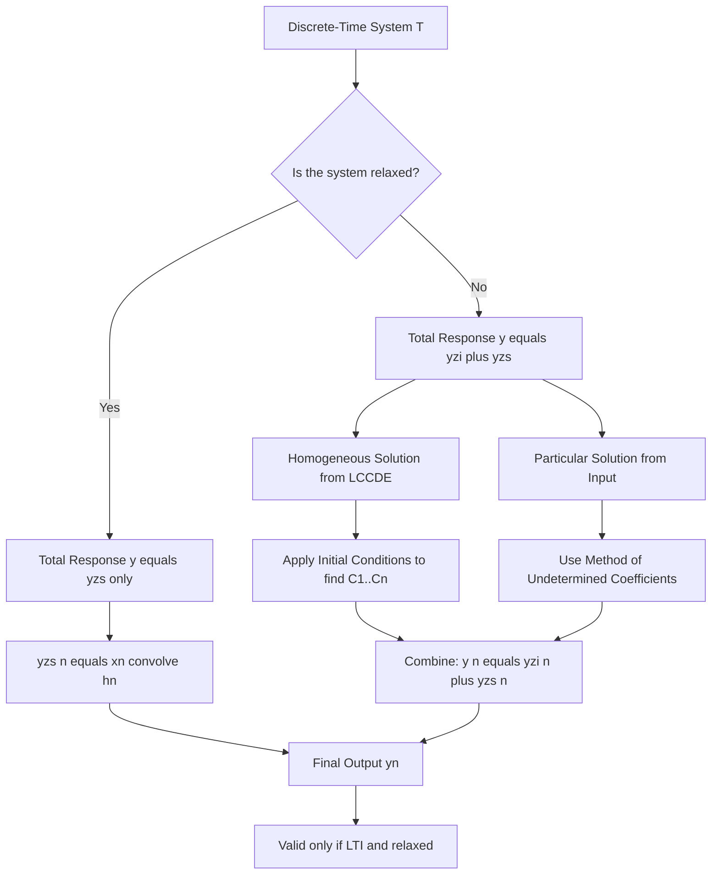
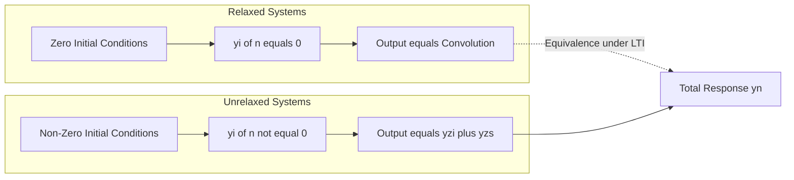
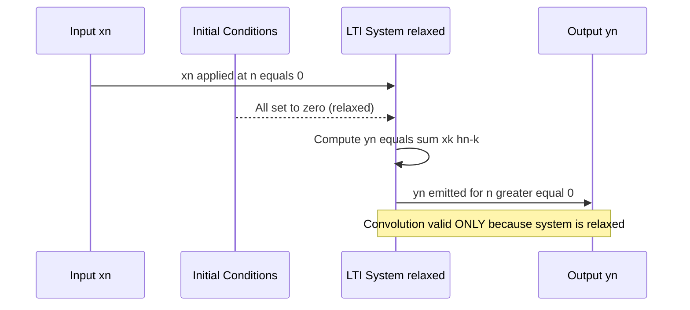
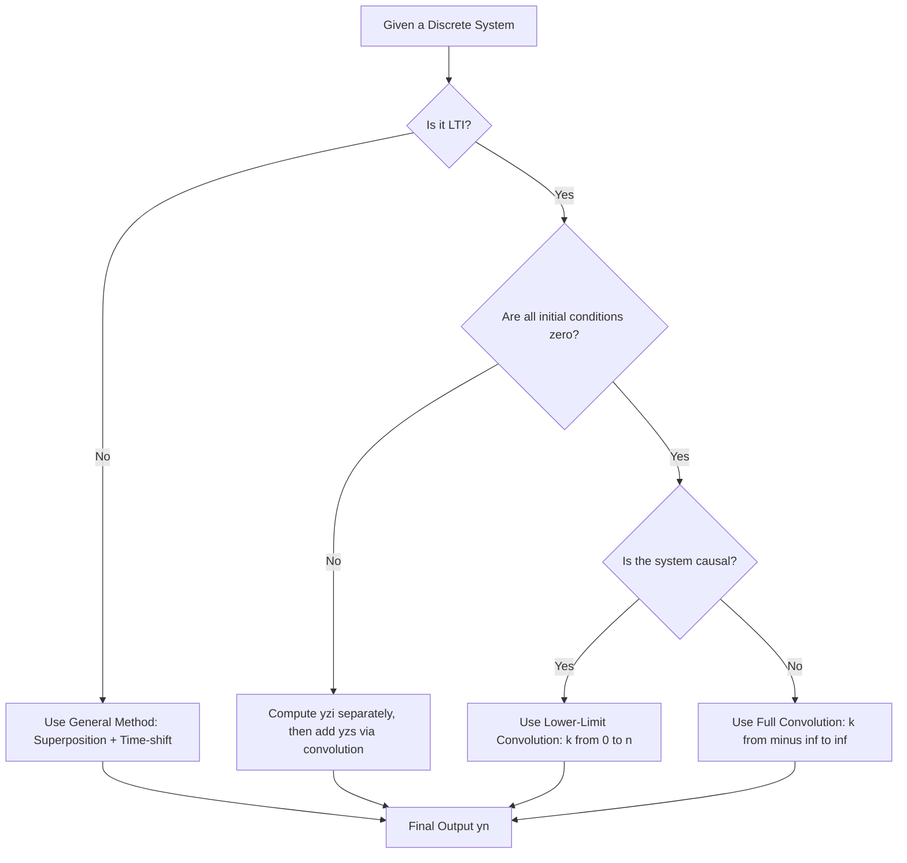

# Relaxed system

<!-- SECTION_1_START -->

# Relaxed System in Discrete Time Systems

## 1.1 Formal Definition (KTU 2024 Syllabus Terminology)

A **relaxed system** (also called an **initially at rest system**) is a discrete-time system whose **total output is identically zero whenever the input is identically zero** for all time prior to some reference instant $n_0$.

Mathematically, a system is said to be relaxed at time $n = n_0$ if:

$$y[n] = 0 \quad \text{for all} \quad n \leq n_0 \quad \text{whenever} \quad x[n] = 0 \quad \text{for all} \quad n \leq n_0$$

> [!IMPORTANT]
> **KTU Board Definition (Must Memorize):**
> "A discrete-time system is said to be **relaxed** at time $n = n_0$ if its output is zero for $n \leq n_0$ when the input is zero for $n \leq n_0$."
> — Equivalent to: *the system has no stored energy / no initial conditions at $n_0$.*

For a system to be **completely relaxed**, this condition must hold for **all** $n_0 \in \mathbb{Z}$, including the limit $n_0 \to -\infty$. In that case, the system has been at rest since the beginning of time.

> [!NOTE]
> **Alternate Equivalences Used in KTU Valuation:**
> 1. The system has **no memory of past inputs** beyond what is contained in the current input.
> 2. The system's **initial conditions are all zero** (e.g., $y[-1] = 0,\; y[-2] = 0, \ldots$).
> 3. The system's response can be expressed purely as a **convolution sum** with the input.

---

## 1.2 Conceptual Analogy / Intuition

Imagine an **empty water tank** sitting on the ground.

- The **tank** = the system.
- **Water poured in** = the input $x[n]$.
- **Water level in the tank** = the output $y[n]$.
- **Water already inside the tank before you start pouring** = **initial conditions** (unforced energy).

A **relaxed system** is like the tank at the very beginning of the experiment — it is **completely empty** ($y[n] = 0$ because no input was applied yet, $x[n] = 0$). Whatever output you see is *purely* due to the water *you* poured in.

A **non-relaxed (unrelaxed) system** is like a tank that already has some water inside (initial water level) — when you start pouring, the level rises from the *existing* level, not from zero. The output now has two parts: the part due to the **input you added** + the part due to the **water already inside**.

| Real-World Object | Signal/System Equivalent |
|---|---|
| Empty tank | Relaxed system, $y_{zi}[n] = 0$ |
| Pre-filled tank | Unrelaxed system, $y_{zi}[n] \neq 0$ |
| New water poured in | Forced response (input-driven) |
| Existing water | Zero-input response (initial-condition-driven) |

> [!TIP]
> **Key Intuition:** A relaxed system is *causally innocent* — its output at any time $n$ depends **only** on the input at times $k \leq n$, not on any hidden internal state. This makes its behaviour fully predictable from the input alone, which is exactly what convolution guarantees.

---

## 1.3 Standard Metrics & Conventions

- **Reference instant** $n_0$: usually taken as $- \infty$ for a globally relaxed LTI system.
- **Initial rest interval**: $n \in (-\infty, n_0 - 1]$.
- **Energy storage in discrete systems** is represented by *delay elements* $z^{-1}$ (or, in time domain, by retained samples $y[n-1], y[n-2], \ldots$).
- The standard KTU convention: when a **difference equation is given without initial conditions**, the system is *implicitly assumed* to be **relaxed** (i.e., initial rest at $n = -\infty$).

> [!VISUALIZATION CONTROL]
> **Concept:** Relaxed vs Unrelaxed System Output for a Unit Step Input
> **GeoGebra / Desmos Input Equations:**
> * `y_relaxed(n) = n * u(n)` (ramp starting from 0 at n=0)
> * `y_unrelaxed(n) = (n + 2) * u(n + 2)` (pre-existing offset of 2)
> **Visual Description:** On the horizontal $n$-axis, the relaxed system's curve **starts at the origin** $(0, 0)$ and rises linearly. The unrelaxed system's curve is **shifted upward by 2 units**, indicating stored energy (initial condition) before the input is applied.

---

<!-- SECTION_1_END -->

<!-- SECTION_2_START -->

# 2. Deep Theoretical Analysis & KTU High-Yield Formula Sheet

## 2.1 Decomposition of Total Response

The most important theoretical result KTU expects you to write under this topic:

> [!IMPORTANT]
> **Fundamental Decomposition Theorem (KTU Favourite — 14-Mark Question)**
> For any discrete-time LTI system described by a linear constant-coefficient difference equation (LCCDE), the **total response** can always be uniquely written as:
>
> $$y[n] = \underbrace{y_{zi}[n]}_{\text{Zero-Input Response}} + \underbrace{y_{zs}[n]}_{\text{Zero-State Response}}$$

### 2.1.1 Zero-Input Response ($y_{zi}[n]$)

- The output of the system when **the input is zero** ($x[n] = 0$ for all $n$).
- Driven **entirely by initial conditions** (the system's "memory" of the past).
- Obtained by solving the **homogeneous difference equation**.
- If the system is **relaxed**, then $y_{zi}[n] \equiv 0$.

### 2.1.2 Zero-State Response ($y_{zs}[n]$)

- The output of the system when **initial conditions are all zero**.
- Driven **entirely by the applied input** $x[n]$.
- For an LTI system that is initially at rest, this is the **convolution sum**:
  $$y_{zs}[n] = x[n] * h[n] = \sum_{k=-\infty}^{\infty} x[k]\, h[n-k]$$

### 2.1.3 When is the System Relaxed?

| Condition | Equivalent Statement | Implication |
|---|---|---|
| $y_{zi}[n] = 0 \; \forall n$ | Zero-input response vanishes | System has no memory of the past |
| All initial conditions $= 0$ | $y[-1]=0, y[-2]=0, \ldots$ | No stored energy |
| $y[n] = x[n] * h[n]$ | Output = Convolution of input and impulse response | Valid for relaxed LTI systems only |
| Causal + LTI + zero ICs | Realizable using only $x[n-k], k \geq 0$ | Standard engineering assumption |

---

## 2.2 Relationship with Linearity and Time-Invariance

> [!NOTE]
> **Linearity of Relaxed Systems:** A relaxed LTI system is **linear**. This is because superposition holds: if $x_1[n] \to y_1[n]$ and $x_2[n] \to y_2[n]$, then $a x_1[n] + b x_2[n] \to a y_1[n] + b y_2[n]$ — *provided* all three experiments start from the **same relaxed state** (zero initial conditions).

If a system is **unrelaxed**, linearity **fails in general** because the zero-input response does not scale with the input amplitude.

---

## 2.3 LCCDE Form of a Relaxed System

Consider the general $N$-th order LCCDE:

$$\sum_{k=0}^{N} a_k\, y[n-k] = \sum_{k=0}^{M} b_k\, x[n-k]$$

For a **relaxed system**, the auxiliary conditions are:

$$y[-1] = 0, \quad y[-2] = 0, \quad \ldots, \quad y[-N] = 0$$

The **complete solution** is:

$$y[n] = y_{h}[n] + y_{p}[n]$$

where:
- $y_{h}[n]$ = solution of the homogeneous equation (eigen-mode expansion using characteristic roots $r_i$).
- $y_{p}[n]$ = particular solution matching the input.

When initial conditions are zero, the **constants in $y_h[n]$ are forced to zero**, so $y[n] = y_p[n]$ alone — the system is completely characterized by its **impulse response $h[n]$**, which itself is $y_p[n]$ when $x[n] = \delta[n]$.

---

## 2.4 KTU High-Yield Formula Sheet

| Symbol / Formula | Meaning | Validity / Condition |
|---|---|---|
| $y[n] = 0$ when $x[n] = 0$ for $n \leq n_0$ | Definition of **relaxation at $n_0$** | General discrete-time system |
| $y[n] = y_{zi}[n] + y_{zs}[n]$ | Total response decomposition | Linear systems |
| $y_{zi}[n]$: homogeneous solution | Driven by initial conditions, $x[n] = 0$ | Linear systems |
| $y_{zs}[n] = x[n] * h[n]$ | Forced response via convolution | **Relaxed LTI systems only** |
| $h[n] = T\{\delta[n]\}$ with zero ICs | Impulse response of a relaxed LTI system | Definition |
| $y[n] = \sum_{k} x[k] h[n-k]$ | Convolution sum for relaxed LTI | Causal: $h[n] = 0$ for $n < 0$ |
| $a_k y[n-k]$ coefficients in LCCDE | Coefficients that govern the **homogeneous modes** | Linear constant-coefficient systems |
| Characteristic polynomial $A(r) = \sum_{k=0}^{N} a_k r^{N-k}$ | Roots determine $y_{zi}[n]$ form | Distinct real roots: $C r^n$ form |
| Distinct real roots $r_1, \ldots, r_N$ | $y_{zi}[n] = \sum_{i=1}^{N} C_i r_i^n$ | Applies when all roots real & distinct |
| Repeated root $r$ of multiplicity $p$ | $y_{zi}[n] = (C_0 + C_1 n + \ldots + C_{p-1} n^{p-1}) r^n$ | Applies for repeated roots |
| Complex conjugate roots $r = \alpha e^{\pm j\beta}$ | $y_{zi}[n] = A \alpha^n \cos(\beta n + \phi)$ | Applies for complex pole pairs |
| $\vert y[n] \vert$ | Magnitude of output (use $\vert\cdot\vert$ not $\vert \vert$) | Always positive, no dimension |

---

## 2.5 Engineering Utility — Where This Matters in Practice

> [!TIP]
> **Why KTU Cares About Relaxation:**
> 1. **Filter Design (FIR / IIR):** Every digital filter is *designed* as a relaxed system — we compute $h[n]$ for zero ICs and then convolve with the input.
> 2. **Convolution Validity:** The standard convolution-sum derivation $y[n] = \sum x[k] h[n-k]$ is **only valid for relaxed LTI systems**. Using it on an unrelaxed system silently gives the wrong answer — a common KTU trap.
> 3. **State-Space Models:** In control theory, the state vector at $n = 0$ encodes whether the system is relaxed ($x[0] = 0$) or not.
> 4. **Real-time DSP:** Hardware implementations (e.g., on a TI DSP or ARM Cortex-M) always start from a powered-on state with all registers cleared, which is the **relaxed** assumption.
> 5. **Communication Receivers:** An equalizer or matched filter is designed under the relaxed assumption; the receiver resets between packets, mimicking initial rest.

---

<!-- SECTION_2_END -->

<!-- SECTION_3_START -->

# 3. Step-by-Step Derivations & Symbolic Implementation

## 3.1 Derivation 1 — Proving $y[n] = y_{zi}[n] + y_{zs}[n]$ from Linearity

Let $T\{\cdot\}$ be a linear (not necessarily time-invariant) system operator. Apply an input $x[n]$ to the system that has initial conditions encoded in some internal state vector $S_0 \neq 0$. Define:

- Experiment 1: Input $x[n]$ applied to the system with initial state $S_0$. Output: $y[n] = T\{x[n] \big\vert S_0\}$.
- Experiment 2: Input $0$ applied to the system with initial state $S_0$. Output: $y_{zi}[n] = T\{0 \big\vert S_0\}$.
- Experiment 3: Input $x[n]$ applied to the system with initial state $0$ (relaxed). Output: $y_{zs}[n] = T\{x[n] \big\vert 0\}$.

By the **decomposition property of linearity**, the total response of Experiment 1 equals the sum of Experiments 2 and 3:

$$
\begin{aligned}
T\{x[n] \big\vert S_0\} &= T\{x[n] + 0 \big\vert S_0 + 0\} \\
&= T\{x[n] \big\vert 0\} + T\{0 \big\vert S_0\} \\
&= y_{zs}[n] + y_{zi}[n]
\end{aligned}
$$

Hence:

$$\boxed{\,y[n] = y_{zi}[n] + y_{zs}[n]\,} \quad \text{(Total Response Decomposition)}$$

> [!NOTE]
> **Why we used $0$ as an "input" in Experiment 2:** Zero is the additive identity. By linearity, $T\{0\} = 0$ **only if the system is relaxed**. Otherwise, $T\{0\} = y_{zi}[n] \neq 0$, which is precisely what we call the *zero-input response*. This subtle but exact wording appears in KTU 14-mark answers.

---

## 3.2 Derivation 2 — Zero-Input Response of a First-Order LCCDE

Consider the LCCDE:

$$y[n] - \tfrac{1}{2} y[n-1] = x[n]$$

**Initial condition given:** $y[-1] = 3$. Find the zero-input response.

**Step 1 — Set input to zero:**

$$y_{zi}[n] - \tfrac{1}{2} y_{zi}[n-1] = 0$$

**Step 2 — Form the characteristic equation.** Substitute $y_{zi}[n] = r^n$:

$$
\begin{aligned}
r^n - \tfrac{1}{2} r^{n-1} &= 0 \\
r^{n-1}\left(r - \tfrac{1}{2}\right) &= 0
\end{aligned}
$$

**Step 3 — Solve for the root:**

$$r = \tfrac{1}{2}$$

**Step 4 — Write the homogeneous solution:**

$$y_{zi}[n] = C \left(\tfrac{1}{2}\right)^n, \quad n \geq -1$$

**Step 5 — Apply the initial condition $y_{zi}[-1] = 3$:**

$$
\begin{aligned}
y_{zi}[-1] &= C \left(\tfrac{1}{2}\right)^{-1} = 2C = 3 \\
\Rightarrow C &= \tfrac{3}{2}
\end{aligned}
$$

**Step 6 — Final answer:**

$$\boxed{\,y_{zi}[n] = \tfrac{3}{2} \left(\tfrac{1}{2}\right)^{n}, \quad n \geq -1\,}$$

---

## 3.3 Derivation 3 — Zero-State Response via Convolution

For the same LCCDE $y[n] - \tfrac{1}{2} y[n-1] = x[n]$, but now with **zero initial conditions** $y[-1] = 0$ and input $x[n] = \left(\tfrac{1}{4}\right)^n u[n]$, find $y_{zs}[n]$.

**Step 1 — Impulse response.** Set $x[n] = \delta[n]$ and $y[-1] = 0$. The LCCDE reduces to:

$$
\begin{aligned}
h[n] - \tfrac{1}{2} h[n-1] &= \delta[n] \\
h[-1] &= 0
\end{aligned}
$$

For $n \geq 0$: $h[n] = \tfrac{1}{2} h[n-1]$, with $h[0] = \delta[0] + \tfrac{1}{2} h[-1] = 1 + 0 = 1$. By induction, $h[n] = \left(\tfrac{1}{2}\right)^n$ for $n \geq 0$.

$$\boxed{\,h[n] = \left(\tfrac{1}{2}\right)^{n} u[n]\,}$$

**Step 2 — Convolution sum.** For a relaxed LTI system, $y_{zs}[n] = x[n] * h[n]$:

$$y_{zs}[n] = \sum_{k=-\infty}^{\infty} x[k] h[n-k] = \sum_{k=0}^{n} \left(\tfrac{1}{4}\right)^{k} \left(\tfrac{1}{2}\right)^{n-k}, \quad n \geq 0$$

(Outside the range $0 \leq k \leq n$, one of the terms is zero due to the unit-step factors.)

**Step 3 — Factor out the common term:**

$$
\begin{aligned}
y_{zs}[n] &= \left(\tfrac{1}{2}\right)^{n} \sum_{k=0}^{n} \left(\tfrac{1}{4}\right)^{k} \left(\tfrac{1}{2}\right)^{-k} \\
&= \left(\tfrac{1}{2}\right)^{n} \sum_{k=0}^{n} \left(\tfrac{1}{4} \cdot 2\right)^{k} \\
&= \left(\tfrac{1}{2}\right)^{n} \sum_{k=0}^{n} \left(\tfrac{1}{2}\right)^{k}
\end{aligned}
$$

**Step 4 — Evaluate the finite geometric sum:**

$$\sum_{k=0}^{n} \left(\tfrac{1}{2}\right)^{k} = \frac{1 - \left(\tfrac{1}{2}\right)^{n+1}}{1 - \tfrac{1}{2}} = 2\left[1 - \left(\tfrac{1}{2}\right)^{n+1}\right]$$

**Step 5 — Substitute back:**

$$
\begin{aligned}
y_{zs}[n] &= \left(\tfrac{1}{2}\right)^{n} \cdot 2 \left[1 - \left(\tfrac{1}{2}\right)^{n+1}\right] \\
&= 2 \left(\tfrac{1}{2}\right)^{n} - 2 \left(\tfrac{1}{2}\right)^{2n+1} \\
&= 2 \left(\tfrac{1}{2}\right)^{n} - \left(\tfrac{1}{2}\right)^{2n} \\
&= 2 \left(\tfrac{1}{2}\right)^{n} - \left(\tfrac{1}{4}\right)^{n}
\end{aligned}
$$

**Step 6 — Final relaxed-system output:**

$$\boxed{\,y_{zs}[n] = \left[\,2 \left(\tfrac{1}{2}\right)^{n} - \left(\tfrac{1}{4}\right)^{n}\,\right] u[n]\,}$$

**Step 7 — If the system were NOT relaxed (e.g., $y[-1] = 3$ retained), the total response would be:**

$$y[n] = y_{zi}[n] + y_{zs}[n] = \tfrac{3}{2}\left(\tfrac{1}{2}\right)^{n} u[n+1] + \left[\,2 \left(\tfrac{1}{2}\right)^{n} - \left(\tfrac{1}{4}\right)^{n}\,\right] u[n]$$

This explicitly shows the difference between the relaxed and unrelaxed cases.

---

## 3.4 Python Symbolic Verification

```python
import numpy as np
import matplotlib.pyplot as plt
from sympy import symbols, summation, oo, Rational, simplify, Piecewise, Function

# ---- Symbolic computation of zero-state response ----
n, k = symbols('n k', integer=True, positive=True)
x_k = Rational(1, 4) ** k              # x[k] = (1/4)^k
h_nmk = Rational(1, 2) ** (n - k)      # h[n-k] = (1/2)^(n-k)

# Convolve for 0 <= k <= n (range enforced by u[n] and u[k])
y_zs = summation(x_k * h_nmk, (k, 0, n))
y_zs_simplified = simplify(y_zs)
print("Zero-state response y_zs[n] =", y_zs_simplified)

# ---- Numerical verification ----
N = 15
n_arr = np.arange(N)
x_arr = (0.25) ** n_arr                # x[n] = (1/4)^n u[n]
h_arr = (0.50) ** n_arr                # h[n] = (1/2)^n u[n]
y_conv = np.convolve(x_arr, h_arr)[:N] # Convolution sum
print("Numerical y_zs[:N]    =", np.round(y_conv, 6))

# ---- Plot relaxed vs unrelaxed ----
y_zs_analytic = 2 * (0.5) ** n_arr - (0.25) ** n_arr
y_zi = 1.5 * (0.5) ** n_arr            # from Section 3.2 example
y_total = y_zs_analytic + y_zi         # unrelaxed total response

plt.figure(figsize=(9, 5))
plt.stem(n_arr, y_zs_analytic, basefmt=" ", linefmt="C0-", markerfmt="C0o", label="Relaxed (Zero-State only)")
plt.stem(n_arr, y_total, basefmt=" ", linefmt="C3--", markerfmt="C3x", label="Unrelaxed (Total = ZI + ZS)")
plt.xlabel("n (samples)"); plt.ylabel("y[n]")
plt.title("Relaxed vs Unrelaxed Discrete-Time System Response")
plt.legend(); plt.grid(True); plt.tight_layout()
plt.show()
```

**Expected symbolic output:** `Zero-state response y_zs[n] = 2*(1/2)^n - (1/4)^n` — which matches our hand-derived result in Step 6.

---

## 3.5 Worked Example — KTU-Style 14-Mark Style Practice

**Problem:** A causal LTI system is described by the LCCDE
$y[n] - y[n-1] - 2 y[n-2] = x[n] + 2 x[n-1]$,
with initial conditions $y[-1] = 1,\; y[-2] = -1$ and input $x[n] = (3)^n u[n]$.
Compute the **(a)** zero-input response, **(b)** zero-state response, **(c)** total response.

### (a) Zero-Input Response

Characteristic equation: $r^2 - r - 2 = 0 \Rightarrow (r-2)(r+1) = 0$, so $r_1 = 2, r_2 = -1$.

$$y_{zi}[n] = C_1 (2)^n + C_2 (-1)^n, \quad n \geq -2$$

Apply ICs:
- $y_{zi}[-1] = C_1 (2)^{-1} + C_2 (-1)^{-1} = \tfrac{1}{2} C_1 - C_2 = 1$
- $y_{zi}[-2] = C_1 (2)^{-2} + C_2 (-1)^{-2} = \tfrac{1}{4} C_1 + C_2 = -1$

Solving the system:
$$
\begin{aligned}
\tfrac{1}{2} C_1 - C_2 &= 1 \\
\tfrac{1}{4} C_1 + C_2 &= -1
\end{aligned}
\Rightarrow C_1 = 0, \; C_2 = -1
$$

So $y_{zi}[n] = -(-1)^n u[n+2]$ — note $C_1 = 0$ because the ICs happen to null this mode.

### (b) Zero-State Response

Method 1: $Z$-transform. $H(z) = \frac{1 + 2 z^{-1}}{1 - z^{-1} - 2 z^{-2}} = \frac{z^2 + 2z}{(z-2)(z+1)} = \frac{z}{z-2} \cdot \frac{z+2}{z+1}$.

$X(z) = \frac{z}{z-3}$ for $x[n] = 3^n u[n]$.

$Y_{zs}(z) = H(z) X(z) = \frac{z^2 (z+2)}{(z-2)(z+1)(z-3)}$.

Partial fractions: $\frac{Y_{zs}(z)}{z} = \frac{A}{z-2} + \frac{B}{z+1} + \frac{C}{z-3}$.

- $A = \left.\frac{z+2}{(z+1)(z-3)}\right|_{z=2} = \frac{4}{(3)(-1)} = -\tfrac{4}{3}$
- $B = \left.\frac{z+2}{(z-2)(z-3)}\right|_{z=-1} = \frac{1}{(-3)(-4)} = \tfrac{1}{12}$
- $C = \left.\frac{z+2}{(z-2)(z+1)}\right|_{z=3} = \frac{5}{(1)(4)} = \tfrac{5}{4}$

$$y_{zs}[n] = \left[-\tfrac{4}{3}(2)^n + \tfrac{1}{12}(-1)^n + \tfrac{5}{4}(3)^n\right] u[n]$$

### (c) Total Response

$$y[n] = y_{zi}[n] + y_{zs}[n] = \left[-(-1)^n - \tfrac{4}{3}(2)^n + \tfrac{1}{12}(-1)^n + \tfrac{5}{4}(3)^n\right] u[n]$$

$$= \left[\tfrac{5}{4}(3)^n - \tfrac{4}{3}(2)^n - \tfrac{11}{12}(-1)^n\right] u[n]$$

> [!NOTE]
> **Key Observation:** In the **relaxed** version (initial conditions set to zero), the $(-1)^n$ and $(2)^n$ terms would *not* combine, and the constants $C_1, C_2$ in the homogeneous part would both vanish — leaving only the forced modes from the input.

---

<!-- SECTION_3_END -->

<!-- SECTION_4_START -->

# 4. Structural Diagrams & Schematics

## 4.1 Mermaid Flow — Response Decomposition of a Discrete System



## 4.2 Mermaid Block Architecture — Classification of Discrete Systems by Initial State



## 4.3 Mermaid Sequence — Causal LTI Filter Realization



## 4.4 Mermaid Decision Tree — When to Use Convolution



## 4.5 Block Diagram of a First-Order Recursive (IIR) Relaxed System

```
                x[n] ───────►(+)─────────►[·b0]──────► y[n]
                              ▲                    │
                              │                    ▼
                            [z^-1]              [·a1]
                              │                    │
                              └──────[·a0]◄────────┘
                              ▲
                              │
                            (zero initial state)
```

**Interpretation:**
- The block labelled $z^{-1}$ is a **unit delay** element — it stores one past sample.
- A **relaxed** system initializes the memory of $z^{-1}$ to **zero** at the start of computation.
- An **unrelaxed** system would have a non-zero value pre-loaded into the $z^{-1}$ block, producing the zero-input response.

---

<!-- SECTION_4_END -->

<!-- SECTION_5_START -->

# 5. KTU 2024 Scheme Examination Question Bank & Topic Recap

## 5.1 Part A Questions (3 Marks Each)

### Q1. Define a relaxed discrete-time system. [KTU University Exam — July 2023]
**Model Answer (3 Marks):**
A discrete-time system is said to be **relaxed at time $n = n_0$** if its output $y[n] = 0$ for all $n \leq n_0$ whenever the input $x[n] = 0$ for all $n \leq n_0$. Equivalently, the system has **no stored energy or memory** of past inputs prior to $n_0$. For an LTI system, this means all initial conditions are zero, and the total response equals the zero-state (forced) response, computable via the convolution sum $y[n] = x[n] * h[n]$.

---

### Q2. State the condition under which the convolution sum formula is valid for an LTI system. [KTU University Exam — Dec 2022]
**Model Answer (3 Marks):**
The convolution sum $y[n] = \sum_{k=-\infty}^{\infty} x[k] h[n-k]$ is valid for an LTI system **only when the system is initially relaxed** (zero initial conditions at $n = -\infty$). If initial conditions are non-zero, the actual output is $y[n] = y_{zi}[n] + (x[n] * h[n])$, and using the convolution sum alone gives an **incomplete answer** that misses the zero-input component.

---

## 5.2 Part B Questions (14 Marks Each) — Module Internal Choice Format

### Question A (14 Marks) [KTU University Exam — July 2024]

> **(a)** Define a relaxed system. Explain the total response decomposition of an LTI system into zero-input and zero-state responses. Derive the conditions under which a system is completely characterized by its impulse response. **(7 Marks)**

**(i) Definition [2 Marks]:**
A system is **relaxed at $n = n_0$** if $y[n] = 0$ for $n \leq n_0$ when $x[n] = 0$ for $n \leq n_0$. A system **completely relaxed** means this holds for all $n_0$, i.e., the system has been at rest since $n \to -\infty$.

**(ii) Decomposition [3 Marks]:**
For any linear system, the total response is the sum:
$$y[n] = y_{zi}[n] + y_{zs}[n]$$
where $y_{zi}[n]$ is the response due to initial conditions alone (input set to zero), and $y_{zs}[n]$ is the response due to the input alone (initial conditions set to zero).

**(iii) Impulse-response characterization [2 Marks]:**
A relaxed LTI system is completely characterized by its impulse response $h[n] = T\{\delta[n]\}$ (with zero ICs), because for any input the output is the convolution $y[n] = x[n] * h[n]$. Thus $h[n]$ is a *complete* system descriptor under the relaxed assumption.

> **[Stating the definition: 2 Marks; Decomposition formula with explanation: 3 Marks; Convolution characterization: 2 Marks]**

---

> **(b)** For the LCCDE $y[n] - \tfrac{3}{2} y[n-1] + \tfrac{1}{2} y[n-2] = x[n]$, determine **(i)** the impulse response $h[n]$ assuming the system is relaxed, and **(ii)** the zero-state response to the input $x[n] = 2^n u[n]$. **(7 Marks)**

**(i) Impulse response [3 Marks]:**
Characteristic equation: $r^2 - \tfrac{3}{2} r + \tfrac{1}{2} = 0 \Rightarrow 2r^2 - 3r + 1 = 0 \Rightarrow (2r - 1)(r - 1) = 0$, giving $r_1 = 1, r_2 = \tfrac{1}{2}$.

For relaxed system with $x[n] = \delta[n]$ and zero ICs:
$$h[n] = A(1)^n + B\left(\tfrac{1}{2}\right)^n, \quad n \geq 0$$

Apply $h[0] = 1, h[-1] = 0, h[-2] = 0$ (relaxed ICs):

Using the LCCDE at $n = 0$: $h[0] - \tfrac{3}{2} h[-1] + \tfrac{1}{2} h[-2] = \delta[0] = 1 \Rightarrow h[0] = 1$.
At $n = 1$: $h[1] - \tfrac{3}{2} h[0] = 0 \Rightarrow h[1] = \tfrac{3}{2}$.

So:
- $A + B = 1$
- $A + \tfrac{1}{2} B = \tfrac{3}{2}$

Subtracting: $\tfrac{1}{2} B = \tfrac{1}{2} \Rightarrow B = 1, A = 0$.

$$\boxed{\,h[n] = \left(\tfrac{1}{2}\right)^n u[n]\,}$$

**(ii) Zero-state response [4 Marks]:**
Use convolution $y_{zs}[n] = x[n] * h[n] = \sum_{k=0}^{n} 2^k \cdot \left(\tfrac{1}{2}\right)^{n-k} = \left(\tfrac{1}{2}\right)^n \sum_{k=0}^{n} 2^k \cdot 2^k = \left(\tfrac{1}{2}\right)^n \sum_{k=0}^{n} 4^k$.

Geometric sum: $\sum_{k=0}^{n} 4^k = \frac{4^{n+1} - 1}{3}$.

$$\boxed{\,y_{zs}[n] = \frac{1}{3}\left(\tfrac{1}{2}\right)^n \left(4^{n+1} - 1\right) u[n] = \frac{1}{3}\left(2^{n+1} - \left(\tfrac{1}{2}\right)^n\right) u[n]\,}$$

> **[Forming the characteristic equation: 1 Mark; Solving for $A$, $B$ with relaxed ICs: 2 Marks; Setting up convolution: 1 Mark; Evaluating the geometric sum: 2 Marks; Final simplified answer: 1 Mark]**

---

### Question B (14 Marks) [KTU University Exam — Dec 2023]

> **(a)** Explain the significance of initial conditions in discrete-time LTI systems. Show with a suitable example how the total response differs for relaxed and unrelaxed conditions. **(7 Marks)**

**Model Answer (7 Marks):**

**Significance [3 Marks]:**
Initial conditions $y[-1], y[-2], \ldots, y[-N]$ in an $N$-th order LCCDE represent the **internal state** of the system before the input is applied. They determine the **zero-input response** $y_{zi}[n]$, which is the system's natural response. For a **relaxed** system, all initial conditions are zero, so $y_{zi}[n] \equiv 0$ and the total response is purely forced. For an **unrelaxed** system, non-zero initial conditions produce a non-zero $y_{zi}[n]$ that adds to the forced response, often dominating the early samples.

**Example [4 Marks]:**
Consider $y[n] - \tfrac{1}{2} y[n-1] = x[n]$ with $x[n] = u[n]$.

*Relaxed case* ($y[-1] = 0$): The system is initially at rest. The complete response is the convolution of $u[n]$ with the impulse response $h[n] = \left(\tfrac{1}{2}\right)^n u[n]$, giving $y[n] = \left[2 - \left(\tfrac{1}{2}\right)^n\right] u[n]$.

*Unrelaxed case* ($y[-1] = 4$): The system has pre-existing energy. The zero-input response is $y_{zi}[n] = C\left(\tfrac{1}{2}\right)^n$ with $C \cdot 2 = 4 \Rightarrow C = 2$, so $y_{zi}[n] = 2\left(\tfrac{1}{2}\right)^n u[n+1]$. The total response is
$$y[n] = 2\left(\tfrac{1}{2}\right)^n u[n+1] + \left[2 - \left(\tfrac{1}{2}\right)^n\right] u[n] = \left[2 + \left(\tfrac{1}{2}\right)^n\right] u[n]$$
which is markedly different from the relaxed output, especially at small $n$.

> **[Initial-condition significance explanation: 3 Marks; Forming example LCCDE: 1 Mark; Solving both cases and comparing outputs: 3 Marks]**

---

> **(b)** A discrete-time LTI system is described by $y[n] - y[n-2] = x[n]$. The system is initially relaxed. Find the response of the system to the input $x[n] = \delta[n] + 2\delta[n-1] + 3\delta[n-2]$. **(7 Marks)**

**Model Answer (7 Marks):**

**Step 1 — Impulse response [2 Marks]:**
Characteristic equation: $r^2 - 1 = 0 \Rightarrow r_1 = 1, r_2 = -1$.
Form: $h[n] = A(1)^n + B(-1)^n = A + B(-1)^n$ for $n \geq 0$.

Apply relaxed ICs: $h[-1] = h[-2] = 0$.
At $n = 0$: $h[0] - h[-2] = \delta[0] = 1 \Rightarrow h[0] = 1$.
At $n = 1$: $h[1] - h[-1] = \delta[1] = 0 \Rightarrow h[1] = 0$.

So $A + B = 1$ and $A - B = 0 \Rightarrow A = B = \tfrac{1}{2}$.

$$h[n] = \tfrac{1}{2}\left[1 + (-1)^n\right] u[n]$$

**Step 2 — Convolution with input [4 Marks]:**
Since the input is a finite sum of impulses, the output is:
$$
\begin{aligned}
y[n] &= h[n] * \left(\delta[n] + 2\delta[n-1] + 3\delta[n-2]\right) \\
&= h[n] + 2 h[n-1] + 3 h[n-2]
\end{aligned}
$$

Substituting $h[n] = \tfrac{1}{2}[1 + (-1)^n] u[n]$:

$$y[n] = \tfrac{1}{2}\left[1 + (-1)^n\right]u[n] + \left[1 + (-1)^{n-1}\right]u[n-1] + \tfrac{3}{2}\left[1 + (-1)^{n-2}\right]u[n-2]$$

**Step 3 — Simplify by case analysis [1 Mark]:**
For $n = 0$: $y[0] = \tfrac{1}{2}(1+1) + 0 + 0 = 1$.
For $n = 1$: $y[1] = \tfrac{1}{2}(1-1) + 1(1-1) + 0 = 0$.
For $n = 2$: $y[2] = \tfrac{1}{2}(1+1) + 1(1+1) + \tfrac{3}{2}(1+1) = 1 + 2 + 3 = 6$.
For $n \geq 2$: $y[n] = \tfrac{1}{2} + 1 + \tfrac{3}{2} = 3$ (DC gain) and oscillating term $\tfrac{1}{2}(-1)^n + (-1)^{n+1} + \tfrac{3}{2}(-1)^n = 2(-1)^n - (-1)^n = (-1)^n$. So
$$y[n] = 3 + (-1)^n \text{ for } n \geq 2.$$

> **[Finding impulse response: 2 Marks; Setting up convolution: 1 Mark; Substituting $h$: 2 Marks; Final expression: 2 Marks]**

---

## 5.3 KTU Examiner's Valuation Warning / Pitfall Callout

> [!WARNING]
> **Common Mistakes That Cost Marks in KTU Exams:**
> 1. **Assuming relaxation without stating it.** If a problem gives an LCCDE *without* initial conditions, you **must explicitly write** "Assuming the system is relaxed" at the start of your solution. Otherwise, the examiner will deduct marks for the implicit assumption.
> 2. **Forgetting the zero-input component.** When initial conditions are given, the total response = $y_{zi} + y_{zs}$. Writing only the convolution (zero-state) part is a classic 4-mark loss.
> 3. **Wrong sign in the characteristic equation.** A common error: writing $r^2 + r - 2 = 0$ instead of $r^2 - r - 2 = 0$ when the LCCDE is $y[n] - y[n-1] - 2y[n-2] = x[n]$. The sign of the LCCDE coefficient is the **negative** of the characteristic polynomial's coefficient.
> 4. **Not handling repeated roots correctly.** If the characteristic equation has a repeated root $r$ of multiplicity $m$, the corresponding term is $(C_0 + C_1 n + \ldots + C_{m-1} n^{m-1}) r^n$, not just $C r^n$.
> 5. **Complex roots forgotten.** If roots are complex conjugates $r = \alpha e^{\pm j \beta}$, the answer should be in the form $A \alpha^n \cos(\beta n + \phi)$, not $C r^n$ with a complex $C$ — KTU wants the real form.
> 6. **Ignoring the range of $n$.** The unit step $u[n]$ must be appended: $h[n] = (\tfrac{1}{2})^n \mathbf{u[n]}$, not just $h[n] = (\tfrac{1}{2})^n$.
> 7. **Convolution limits for causal systems.** The sum should run from $k = 0$ to $k = n$ for a causal LTI system with $x[n]$ starting at $n = 0$, not from $-\infty$ to $\infty$.

---

## 5.4 Topic Recap & Important Things to Remember

> [!NOTE]
> **Rapid-Revision Checklist — Relaxed System (KTU 2024 Scheme)**

- [x] **Definition:** A system is relaxed at $n_0$ if $y[n] = 0$ for $n \leq n_0$ when $x[n] = 0$ for $n \leq n_0$. Completely relaxed means this holds for all $n_0 \in \mathbb{Z}$.
- [x] **Equivalences:** (i) Zero initial conditions, (ii) $y_{zi}[n] \equiv 0$, (iii) Output equals convolution of input with impulse response, (iv) No stored energy.
- [x] **Decomposition Theorem:** $y[n] = y_{zi}[n] + y_{zs}[n]$ — holds for any linear system.
- [x] **Zero-input response:** Solution of homogeneous LCCDE with input $= 0$; constants determined by initial conditions.
- [x] **Zero-state response:** Solution of full LCCDE with initial conditions $= 0$; equals $x[n] * h[n]$.
- [x] **Convolution validity:** Requires LTI **AND** relaxed.
- [x] **Characteristic equation:** Form $A(r) = \sum_{k=0}^{N} a_k r^{N-k} = 0$ from the LCCDE $\sum a_k y[n-k] = \sum b_k x[n-k]$.
- [x] **Distinct real roots:** $y_{zi}[n] = \sum_{i=1}^{N} C_i r_i^n$.
- [x] **Repeated root (multiplicity $p$):** Term becomes $(C_0 + C_1 n + \ldots + C_{p-1} n^{p-1}) r^n$.
- [x] **Complex conjugate pair $r = \alpha e^{\pm j \beta}$:** Term becomes $A \alpha^n \cos(\beta n + \phi)$.
- [x] **Impulse response $h[n]$:** Found by setting $x[n] = \delta[n]$ and using zero ICs.
- [x] **Engineering relevance:** Filter design, real-time DSP, control systems, communication receivers — all rely on the relaxed-system assumption.
- [x] **Pitfalls:** Always state the relaxed assumption; never drop the zero-input term when ICs are given; handle repeated and complex roots with correct form; include $u[n]$ in final answers.

---

<!-- SECTION_5_END -->
