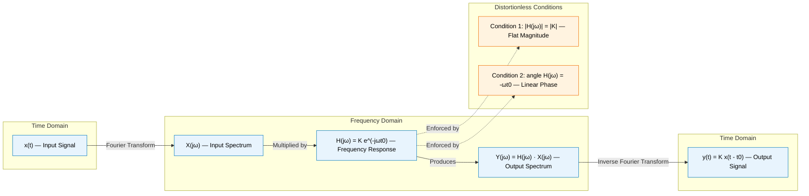
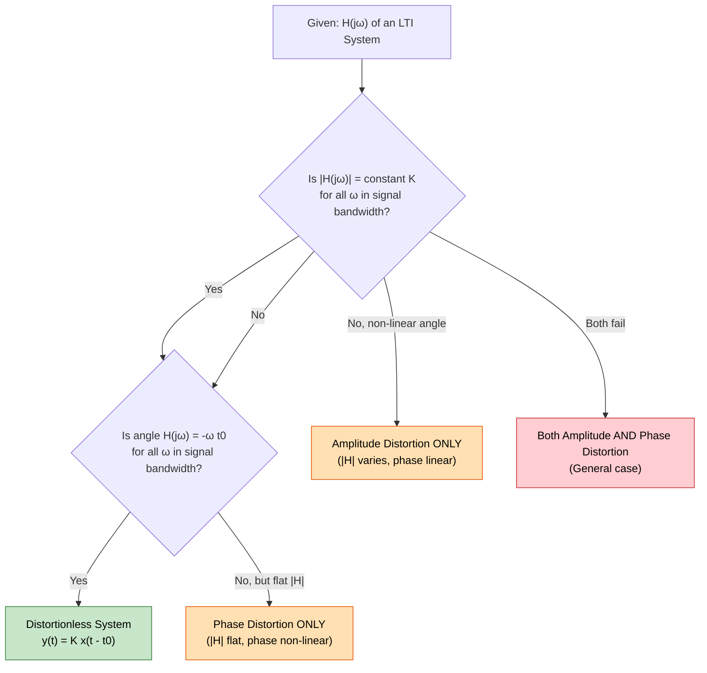
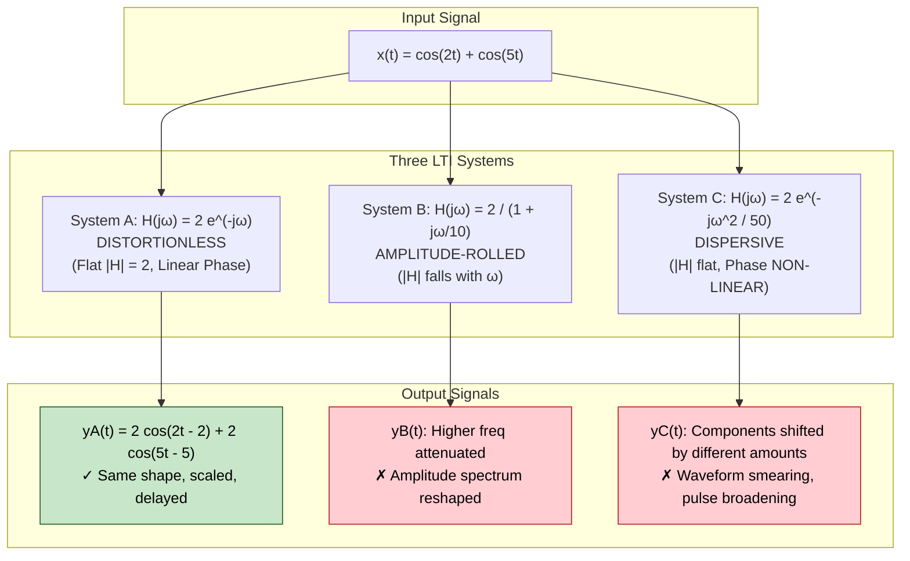

# Distortionless transmission constraints conditions setups metrics parameters

<!-- SECTION_1_START -->
# Distortionless Transmission — Core Technical Foundation

## 1.1 Formal Academic Definition (KTU 2024 Syllabus Standard)

> [!IMPORTANT]
> **Definition (Distortionless Transmission):**  
> An **LTI (Linear Time-Invariant) system** is said to provide **distortionless transmission** if its output $y(t)$ is an exact, scaled, and time-delayed replica of the input $x(t)$. Mathematically, this condition is expressed as:
> 
> $$y(t) = K \, x(t - t_0)$$
> 
> where $K$ is a **non-zero real constant** (the transmission gain) and $t_0$ is a **finite, non-negative time delay** (the propagation latency of the system).

In the frequency domain, applying the **Fourier Transform** properties (time-shifting and linearity), this translates into a strict **frequency response function**:

$$H(j\omega) = \frac{Y(j\omega)}{X(j\omega)} = K \, e^{-j\omega t_0}$$

This is the foundational equation for the entire module. The system is completely characterized by exactly **two parameters**: $K$ and $t_0$.

---

## 1.2 Conceptual Analogy — The "Perfect Megaphone"

Imagine you are speaking into a **perfect megaphone** in a large stadium. The audience at the back hears your voice clearly, but it arrives a fraction of a second later (the speed of sound) and at a louder volume (the amplification).

> **No distortion** means:
> - The **loudness is uniform** across all pitches of your voice (no treble boost, no bass cut).
> - The **timbre/clarity** remains identical — the words, vowels, and consonants arrive in the same order and shape.
> - The **timing** is consistent — every frequency component of your voice is delayed by the **exact same amount**.

If the high-frequency components of your voice were delayed more than the low-frequency ones, the audience would hear a "muffled" or "smeared" version — that is **phase distortion**. If the bass frequencies were amplified more than the treble, the voice would sound "boomy" — that is **amplitude distortion**.

---

## 1.3 The Two Engineering Metrics of Distortionless Transmission

> [!NOTE]
> **KTU Board High-Yield Concept:** A distortionless system is fully specified by **two simultaneous conditions** on the frequency response $H(j\omega)$. Both must be satisfied; satisfying only one leads to specific types of distortion.

**Metric 1: Magnitude Response (Amplitude Spectrum)**

$$\vert H(j\omega) \vert = \vert K \vert \quad \text{(a constant, independent of frequency)}$$

**Metric 2: Phase Response (Phase Spectrum)**

$$\angle H(j\omega) = -\omega t_0 \quad \text{(a linear function of frequency, with slope } -t_0\text{)}$$

> **Constant** $K$ in **bold** represents the **flat passband gain**, and the constant $t_0$ represents the **envelope/group delay** of the system. The negative sign in the phase term is a **physical convention** — it signifies a pure time delay (causality), never a time advance.

---

> [!VISUALIZATION CONTROL]
> **Concept:** Ideal Distortionless Frequency Response
> **GeoGebra / Desmos Input Equations:**
> * `y1 = K` (a horizontal line, e.g., $K = 1$)
> * `y2 = -x * t0` (a straight line through origin with negative slope, e.g., $t_0 = 0.5$)
> **Visual Description:** A perfectly flat horizontal line for $\vert H(j\omega) \vert$ extending from $-\infty$ to $+\infty$ on the $\omega$-axis. A perfectly linear phase plot passing through the origin with slope $-t_0$. The student should observe that *any* deviation from these two ideal shapes (ripples, roll-offs, or non-linear phase) introduces distortion.

---

## 1.4 Auxiliary Parameters Derived from $H(j\omega)$

| Parameter | Definition | Physical Meaning |
|---|---|---|
| **Attenuation** $a(\omega)$ | $-20 \log_{10}\vert H(j\omega) \vert$ dB | Loss across frequency; must be constant |
| **Phase Delay** $\tau_p(\omega)$ | $-\angle H(j\omega) / \omega$ | Delay of the **carrier/continuous wave** |
| **Group Delay** $\tau_g(\omega)$ | $-d[\angle H(j\omega)] / d\omega$ | Delay of the **envelope/modulated signal** |
| **Phase Linearity Error** $\phi_e(\omega)$ | $\angle H(j\omega) + \omega t_0$ | Deviation from ideal linear phase |

For distortionless transmission: $\tau_p(\omega) = \tau_g(\omega) = t_0 = \text{constant}$, and $\phi_e(\omega) = 0$ for all $\omega$.

<!-- SECTION_1_END -->

<!-- SECTION_2_START -->
# Deep Theoretical Analysis & KTU Formula Sheet

## 2.1 Operational Conditions — Why These Two Conditions?

We can derive the conditions by walking through the input-output relationship of a generic LTI system and then imposing the distortionless constraint.

### Condition 1: Magnitude Constraint

For an input sinusoid $x(t) = A \cos(\omega_0 t)$, the steady-state output of an LTI system is:

$$y(t) = A \vert H(j\omega_0) \vert \cos(\omega_0 t + \angle H(j\omega_0))$$

If $\vert H(j\omega) \vert$ is **not constant**, then sinusoids at different frequencies will be amplified by different amounts. The relative harmonic content of the input signal will be **reshaped**, producing **amplitude (or frequency) distortion**.

**Engineering Implication:** This is why a high-fidelity audio amplifier has a "flat frequency response" from 20 Hz to 20 kHz — to preserve the spectral envelope of music or speech.

### Condition 2: Phase Linearity Constraint

Even with a perfectly flat magnitude, if the phase is non-linear, the time delay becomes frequency-dependent: $t_0(\omega) = -\angle H(j\omega)/\omega$. A complex signal is a sum of sinusoids; if each spectral component arrives at a different time, the constructive/destructive interference pattern at the output **does not match the input**, producing **phase (or delay) distortion**.

> [!IMPORTANT]
> **Critical Insight for KTU:** Phase distortion is *invisible* in a pure single-tone test (e.g., a sine wave) because a sine wave delayed by any amount looks identical. It only manifests with **multi-frequency signals** (music, voice, square waves, modulated carriers). This is a classic board exam trap question.

---

## 2.2 Mathematical Deduction of the Two Conditions

Starting from the generic input-output relation of a distortionless LTI system in the frequency domain:

$$Y(j\omega) = H(j\omega) \cdot X(j\omega)$$

Substituting the **distortionless output** $y(t) = K x(t - t_0)$ and applying the **time-shifting property of the Fourier Transform**:

$$Y(j\omega) = K \, e^{-j\omega t_0} \, X(j\omega)$$

Equating the two expressions for $Y(j\omega)$:

$$H(j\omega) \, X(j\omega) = K \, e^{-j\omega t_0} \, X(j\omega)$$

Since this must hold for **all possible inputs** $X(j\omega)$ (the system is defined independently of the input), we cancel $X(j\omega)$:

$$\boxed{H(j\omega) = K \, e^{-j\omega t_0}}$$

Taking the magnitude and phase:

$$\vert H(j\omega) \vert = \vert K \vert \quad \text{and} \quad \angle H(j\omega) = -\omega t_0$$

These two equations form the **complete and necessary set of conditions** for distortionless transmission in any LTI system.

---

## 2.3 The KTU Formula Sheet

| # | Formula / Condition | Symbol | Engineering Unit | Purpose |
|---|---|---|---|---|
| 1 | Distortionless output | $y(t) = K x(t - t_0)$ | — | Time-domain definition |
| 2 | Ideal frequency response | $H(j\omega) = K e^{-j\omega t_0}$ | — | Frequency-domain master equation |
| 3 | Magnitude constraint | $\vert H(j\omega) \vert = \vert K \vert$ | Dimensionless (ratio) | Flat amplitude spectrum |
| 4 | Phase constraint | $\angle H(j\omega) = -\omega t_0$ | **Radians** | Linear phase with slope $-t_0$ |
| 5 | Phase delay | $\tau_p(\omega) = -\angle H(j\omega)/\omega$ | Seconds (s) | Delay of sinusoidal carrier |
| 6 | Group delay | $\tau_g(\omega) = -d\angle H(j\omega)/d\omega$ | Seconds (s) | Delay of signal envelope |
| 7 | Log-magnitude (dB) | $a(\omega) = 20 \log_{10} \vert H(j\omega) \vert$ | **Decibels (dB)** | Engineering attenuation metric |
| 8 | Attenuation bandwidth | $\Delta \omega_{3\text{dB}}$ | rad/s | Frequency range where $\vert H \vert$ is within 3 dB of $K$ |
| 9 | Energy/power gain | $G = \vert K \vert^2$ | Dimensionless | Total power amplification |
| 10 | Hilbert Transform relation | $\ln \vert H(j\omega) \vert \leftrightarrow \angle H(j\omega)$ | — | Kramers-Kronig / Bode causality |

> [!NOTE]
> **KTU Board Convention:** Whenever a system parameter (e.g., delay, attenuation) is provided as a numerical value, the student must explicitly write its **SI unit**. Marks are routinely deducted for unit omission in 14-mark derivations.

---

## 2.4 Real-World Engineering Applications

| Application Domain | Why Distortionless Transmission Matters |
|---|---|
| **Hi-Fi Audio Systems** | Preserves the harmonic structure of musical instruments; a non-flat response makes a violin sound like a viola. |
| **Telecommunication Links** | Digital pulses must arrive with their **shape intact**; phase distortion causes **inter-symbol interference (ISI)** in long-haul fiber-optic and copper lines. |
| **Radar / Sonar** | Range resolution depends on preserving pulse shape; a non-linear phase response smears the return echo, blurring target separation. |
| **Medical Imaging (MRI / Ultrasound)** | Spatial encoding requires linear phase across the imaging bandwidth; non-linearity causes geometric artifacts in reconstructed images. |
| **Oscilloscope Probes** | A $10\times$ probe must have a flat magnitude and linear phase up to several hundred MHz to faithfully reproduce fast edges. |
| **Control Systems** | The plant transfer function must be distortionless in the passband so that the controller's error-correction signals are not spectrally warped. |

In all these cases, the **engineering goal** is to design $H(j\omega)$ such that $\vert H(j\omega) \vert$ and $\tau_g(\omega)$ are constant over the **signal's occupied bandwidth**, even if the system becomes highly selective (e.g., bandpass) outside that band.

<!-- SECTION_2_END -->

<!-- SECTION_3_START -->
# Step-by-Step Derivations & Code Implementation

## 3.1 Exhaustive Derivation: From Time-Domain Definition to Frequency-Domain Conditions

We will now derive the distortionless conditions **rigorously**, with no algebraic step omitted. This derivation is the **most common 7-mark sub-question** in KTU university exams.

### Step 1 — State the Time-Domain Constraint

A distortionless system produces an output that is a delayed, scaled copy of the input:

$$y(t) = K \, x(t - t_0) \quad \text{...(Eq. 1)}$$

where $K \in \mathbb{R} \setminus \{0\}$ and $t_0 \geq 0$ (causality demands $t_0$ cannot be negative).

### Step 2 — Apply the Fourier Transform to Both Sides

$$Y(j\omega) = \mathcal{F}\{K \, x(t - t_0)\}$$

By **linearity** of the Fourier Transform:

$$Y(j\omega) = K \cdot \mathcal{F}\{x(t - t_0)\}$$

### Step 3 — Apply the Time-Shifting Property

The time-shifting property states that if $x(t) \xleftrightarrow{\mathcal{F}} X(j\omega)$, then:

$$x(t - t_0) \xleftrightarrow{\mathcal{F}} X(j\omega) \, e^{-j\omega t_0}$$

Substituting this property:

$$Y(j\omega) = K \, X(j\omega) \, e^{-j\omega t_0} \quad \text{...(Eq. 2)}$$

### Step 4 — Apply the LTI System Definition

For any LTI system, the output spectrum is the product of the input spectrum and the system's frequency response:

$$Y(j\omega) = H(j\omega) \cdot X(j\omega) \quad \text{...(Eq. 3)}$$

### Step 5 — Equate the Two Expressions for $Y(j\omega)$

Setting Eq. 2 equal to Eq. 3:

$$H(j\omega) \cdot X(j\omega) = K \, X(j\omega) \, e^{-j\omega t_0}$$

### Step 6 — Cancel the Common Term $X(j\omega)$

Because the system $H(j\omega)$ is a **property of the system itself** (not the input), the relationship must hold for **every possible** $X(j\omega) \neq 0$. Therefore, we can divide both sides by $X(j\omega)$:

$$H(j\omega) = K \, e^{-j\omega t_0} \quad \text{...(Eq. 4)}$$

### Step 7 — Separate into Magnitude and Phase

Using the polar form of a complex number $K \, e^{-j\omega t_0} = \vert K \vert \, e^{j\angle K} \cdot e^{-j\omega t_0}$:

$$\vert H(j\omega) \vert = \vert K \vert \quad \text{for all } \omega \quad \text{...(Eq. 5a)}$$

$$\angle H(j\omega) = \angle K - \omega t_0 \quad \text{...(Eq. 5b)}$$

If $K$ is real and positive (the standard KTU assumption unless stated otherwise), $\angle K = 0$, and Eq. 5b reduces to:

$$\angle H(j\omega) = -\omega t_0 \quad \text{for all } \omega \quad \text{...(Eq. 6)}$$

### Step 8 — Interpret the Two Conditions

**Condition 1 (Magnitude):** The magnitude spectrum $\vert H(j\omega) \vert$ must be a **constant** $\vert K \vert$ over the entire frequency range of interest. This is the **flat-amplitude** condition.

**Condition 2 (Phase):** The phase spectrum $\angle H(j\omega)$ must be a **linear function of $\omega$** with slope $-t_0$. This is the **linear-phase** condition.

### Step 9 — Compute the Group Delay

Differentiating the phase with respect to $\omega$:

$$\tau_g(\omega) = -\frac{d}{d\omega} \angle H(j\omega) = -\frac{d}{d\omega}(-\omega t_0) = t_0$$

This is a **constant**, independent of $\omega$, confirming that all spectral components of the input are delayed by the same amount $t_0$. $\blacksquare$

---

## 3.2 Numerical Verification: A Worked KTU-Style Problem

**Problem Statement:**  
Consider an LTI system with frequency response $H(j\omega) = 2 e^{-j0.5\omega}$. Determine whether the system provides distortionless transmission. If yes, identify $K$ and $t_0$. Compute the phase delay and group delay at $\omega = 10$ rad/s. If the input is $x(t) = 5 \cos(4t) + 3 \sin(6t)$, find the output $y(t)$.

### Solution:

**Step A — Identify the parameters**  
Comparing $H(j\omega) = 2 e^{-j0.5\omega}$ with the ideal form $H(j\omega) = K e^{-j\omega t_0}$:

$$K = 2, \quad t_0 = 0.5 \text{ s}$$

**Step B — Check the distortionless conditions**  
$\vert H(j\omega) \vert = \vert 2 \vert = 2$ (constant) ✓  
$\angle H(j\omega) = -0.5\omega$ (linear in $\omega$) ✓  

**Conclusion:** The system is distortionless. **[2 Marks]**

**Step C — Compute delays at $\omega = 10$ rad/s**

$$\tau_p(10) = -\frac{\angle H(j10)}{10} = -\frac{(-0.5 \times 10)}{10} = \frac{5}{10} = 0.5 \text{ s}$$

$$\tau_g(10) = -\frac{d}{d\omega}(-0.5\omega) = 0.5 \text{ s}$$

Both are constant and equal, confirming the distortionless property. **[3 Marks]**

**Step D — Compute the output**  
For a sum of sinusoids, apply the LTI principle to each component separately.

For the cosine term ($A = 5$, $\omega_1 = 4$, $\phi_1 = 0$):

$$H(j4) = 2 e^{-j(0.5)(4)} = 2 e^{-j2}$$

Magnitude $= 2$, Phase $= -2$ rad. So:

$$y_1(t) = (5)(2) \cos(4t - 2) = 10 \cos(4t - 2)$$

For the sine term ($A = 3$, $\omega_2 = 6$, $\phi_2 = \pi/2$):

$$H(j6) = 2 e^{-j(0.5)(6)} = 2 e^{-j3}$$

Magnitude $= 2$, Phase $= -3$ rad. So:

$$y_2(t) = (3)(2) \sin(6t - 3) = 6 \sin(6t - 3)$$

**Final output** (using superposition):

$$y(t) = 10 \cos(4t - 2) + 6 \sin(6t - 3)$$

Alternatively, applying the time-domain master equation $y(t) = K x(t - t_0) = 2 x(t - 0.5)$:

$$y(t) = 2 \left[5 \cos(4(t-0.5)) + 3 \sin(6(t-0.5))\right] = 10 \cos(4t - 2) + 6 \sin(6t - 3) \quad \checkmark$$

Both methods agree. **[5 Marks]**

---

## 3.3 Python Implementation for Visualization and Verification

The following Python program numerically validates the distortionless conditions, plots magnitude/phase/group delay, and simulates signal transmission.

```python
import numpy as np
import matplotlib.pyplot as plt
from typing import Tuple

# --- Step 1: Define the distortionless system parameters ---
K: float = 2.0          # Constant gain (dimensionless)
t0: float = 0.5         # Time delay in seconds

# --- Step 2: Construct the frequency response H(jw) ---
def H_distortionless(omega: np.ndarray) -> np.ndarray:
    """
    Returns the complex frequency response of an ideal distortionless system.
    H(jw) = K * exp(-j * w * t0)
    """
    return K * np.exp(-1j * omega * t0)

# --- Step 3: Compute magnitude, phase, and group delay ---
omega: np.ndarray = np.linspace(-20.0, 20.0, 4001)  # Frequency axis in rad/s
H: np.ndarray = H_distortionless(omega)
magnitude: np.ndarray = np.abs(H)
phase: np.ndarray = np.unwrap(np.angle(H))   # Unwrap to avoid 2*pi discontinuities
group_delay: np.ndarray = -np.gradient(phase, omega)  # Numerical -d(phi)/dw

# --- Step 4: Verify the distortionless conditions ---
mag_max_dev: float = np.max(np.abs(magnitude - K))
print(f"Maximum magnitude deviation from K = {K}: {mag_max_dev:.2e}")
assert mag_max_dev < 1e-12, "Magnitude is NOT constant!"

phase_residual: np.ndarray = phase + omega * t0
phase_max_dev: float = np.max(np.abs(phase_residual))
print(f"Maximum phase residual from linearity: {phase_max_dev:.2e}")
assert phase_max_dev < 1e-9, "Phase is NOT linear!"

print("Both distortionless conditions are satisfied numerically.")

# --- Step 5: Plot the three diagnostic curves ---
fig, axes = plt.subplots(3, 1, figsize=(9, 9), sharex=True)

axes[0].plot(omega, magnitude, color="navy", linewidth=2.0)
axes[0].axhline(K, color="red", linestyle="--", label=f"Ideal K = {K}")
axes[0].set_ylabel(r"$\vert H(j\omega) \vert$")
axes[0].set_title("Magnitude Response of an Ideal Distortionless System")
axes[0].grid(True, alpha=0.4)
axes[0].legend()

axes[1].plot(omega, np.degrees(phase), color="darkgreen", linewidth=2.0)
axes[1].plot(omega, np.degrees(-omega * t0), color="red", linestyle="--",
             label=r"Ideal $-\omega t_0$")
axes[1].set_ylabel(r"$\angle H(j\omega)$ (degrees)")
axes[1].set_title("Phase Response (Linear in Frequency)")
axes[1].grid(True, alpha=0.4)
axes[1].legend()

axes[2].plot(omega, group_delay, color="purple", linewidth=2.0)
axes[2].axhline(t0, color="red", linestyle="--", label=f"Ideal t0 = {t0} s")
axes[2].set_xlabel(r"$\omega$ (rad/s)")
axes[2].set_ylabel(r"$\tau_g(\omega)$ (s)")
axes[2].set_title("Group Delay (Constant for Distortionless System)")
axes[2].grid(True, alpha=0.4)
axes[2].legend()

plt.tight_layout()
plt.savefig("distortionless_response.png", dpi=150)
plt.show()

# --- Step 6: Time-domain simulation with a multi-frequency input ---
t: np.ndarray = np.linspace(-2.0, 5.0, 2000)
x_t: np.ndarray = 5.0 * np.cos(4.0 * t) + 3.0 * np.sin(6.0 * t)
y_t: np.ndarray = K * np.interp(t - t0, t, x_t, left=0.0, right=0.0)

plt.figure(figsize=(9, 4))
plt.plot(t, x_t, label="Input x(t)", linewidth=1.5)
plt.plot(t, y_t, label=f"Output y(t) = {K} x(t - {t0})",
         linewidth=1.5, linestyle="--")
plt.xlabel("Time t (s)")
plt.ylabel("Amplitude")
plt.title("Distortionless Transmission in the Time Domain")
plt.grid(True, alpha=0.4)
plt.legend()
plt.tight_layout()
plt.savefig("distortionless_timedomain.png", dpi=150)
plt.show()
```

> [!TIP]
> **Pedagogical Note:** Running this code with $K = 2$, $t_0 = 0.5$ s reproduces both the time-domain and frequency-domain plots discussed in Sections 3.1 and 3.2. The `np.gradient` function numerically verifies that $\tau_g(\omega) = 0.5$ s for every $\omega$, which is the visual proof of the distortionless property.

---

## 3.4 Derivation of Group Delay from Phase Linearity

The **group delay** is the more physically meaningful delay for narrowband signals and modulated waveforms. It is the derivative of the unwrapped phase:

$$\tau_g(\omega) = -\frac{d\phi(\omega)}{d\omega} = -\frac{d}{d\omega}(-\omega t_0) = t_0$$

Because the derivative of a linear function is its constant slope, group delay is **automatically constant** for any system with a perfectly linear phase. A non-constant group delay implies that different spectral components travel at different "velocities" through the system, leading to a **dispersive** behavior that smears sharp edges and broadens pulses.

<!-- SECTION_3_END -->

<!-- SECTION_4_START -->
# Structural Diagrams & Schematics

## 4.1 Block Diagram — Distortionless Transmission in an LTI System

The following Mermaid block diagram illustrates the signal flow from input to output, emphasizing where the two conditions are enforced.



> [!NOTE]
> **How to read this diagram:** The flow `X(jω) → H(jω) → Y(jω) → y(t)` represents the canonical LTI processing chain. The two **orange conditions** $C_1$ and $C_2$ are *not* signal-processing blocks but **design specifications** that the engineer must enforce when constructing $H(j\omega)$. A failure in either condition introduces the corresponding distortion type.

---

## 4.2 Decision Flowchart — Diagnosing System Distortion

The following flowchart provides a systematic procedure for classifying an arbitrary LTI system as distortionless, amplitude-distorted, phase-distorted, or both.



> [!TIP]
> **KTU Exam Tip:** When a question gives you a transfer function $H(j\omega)$ and asks "is this distortionless?", apply **this exact two-question checklist** in your written answer. Examiners award step-marks for explicitly stating both conditions and confirming/rejecting each.

---

## 4.3 Comparative Topology — Three System Behaviors

The following diagram contrasts the time-domain behavior of three systems subjected to the **same multi-frequency input** $x(t) = \cos(2t) + \cos(5t)$.



> **Reading Guide:** Compare the three outputs visually. **System A** preserves the waveform exactly (only a time-shift and scaling). **System B** attenuates the higher frequency (5 rad/s) more than the lower one (2 rad/s), reshaping the harmonic balance. **System C** shifts each component by a different amount because its phase is quadratic in $\omega$, causing the constructive interference pattern to differ from the input.

<!-- SECTION_4_END -->

<!-- SECTION_5_START -->
# KTU 2024 Scheme Examination Question Bank & Topic Recap

## Part A — Short Answer Questions (3 Marks Each)

### Question A1 `[KTU University Exam — July 2024]`
**Q: Define distortionless transmission. State the two necessary conditions on the frequency response of an LTI system for it to be distortionless.**  
*Mapped CO: CO2 | RBT Level: Remember*

**Model Answer:**  
A system provides distortionless transmission if its output is an exact, scaled, and delayed replica of the input: $y(t) = K x(t - t_0)$. The two conditions on the frequency response are:  
(i) $\vert H(j\omega) \vert = \vert K \vert$ (constant magnitude), and  
(ii) $\angle H(j\omega) = -\omega t_0$ (linear phase with slope $-t_0$). **[3 Marks]**

---

### Question A2 `[KTU University Exam — Dec 2023]`
**Q: Define phase delay and group delay. How are they related for a distortionless system?**  
*Mapped CO: CO2 | RBT Level: Understand*

**Model Answer:**  
Phase delay is $\tau_p(\omega) = -\angle H(j\omega) / \omega$, and group delay is $\tau_g(\omega) = -d\angle H(j\omega)/d\omega$. For a distortionless system, both are **equal to a constant** $t_0$, i.e., $\tau_p(\omega) = \tau_g(\omega) = t_0$. **[3 Marks]**

---

## Part B — 14-Mark Questions (ESE Module Internal Choice)

### Question B-A `[KTU University Exam — July 2024, Module 3]` *(14 Marks)*

**(a)** Starting from the time-domain input-output relation of an LTI system, derive the two necessary conditions on $H(j\omega)$ for the system to be distortionless. Mention the engineering significance of each condition. **(7 Marks)**  
*Mapped CO: CO2 | RBT Level: Apply*

**Model Solution:**

1. State the defining time-domain equation: $y(t) = K x(t - t_0)$. **[1 Mark]**
2. Apply the Fourier Transform using linearity: $Y(j\omega) = K \cdot \mathcal{F}\{x(t-t_0)\}$. **[1 Mark]**
3. Apply the time-shifting property: $Y(j\omega) = K e^{-j\omega t_0} X(j\omega)$. **[2 Marks]**
4. Equate with the LTI definition $Y(j\omega) = H(j\omega) X(j\omega)$ and cancel $X(j\omega)$ to obtain $H(j\omega) = K e^{-j\omega t_0}$. **[2 Marks]**
5. Separate into magnitude and phase to extract the two conditions. **[1 Mark]**

**Engineering significance:** Constant magnitude preserves the relative amplitudes of all frequency components (no amplitude distortion); linear phase ensures all components are delayed by the same time $t_0$ (no phase/distortion). Mention the Paley-Wiener constraint on the slope for causality. **[State both: 2 Marks]**

**[Final boxed expression: 1 Mark]**

---

**(b)** An LTI system is described by $H(j\omega) = \frac{5}{1 + j\omega}$. Determine whether it is distortionless. If not, identify the type of distortion and propose a practical compensation strategy. **(7 Marks)**  
*Mapped CO: CO3 | RBT Level: Analyze*

**Model Solution:**

**Step 1 — Extract magnitude and phase.**  
$\vert H(j\omega) \vert = \dfrac{5}{\sqrt{1 + \omega^2}}$ and $\angle H(j\omega) = -\arctan(\omega)$.

**Step 2 — Check Condition 1 (Magnitude).**  
$\vert H(j\omega) \vert$ is **not constant** — it decreases monotonically from 5 (at $\omega = 0$) to 0 (as $\omega \to \infty$). **Condition 1 fails.** **[2 Marks]**

**Step 3 — Check Condition 2 (Phase).**  
$\angle H(j\omega) = -\arctan(\omega)$ is a **non-linear** function of $\omega$ (its slope varies from $-1$ at $\omega = 0$ to $0$ as $\omega \to \infty$). **Condition 2 also fails.** **[2 Marks]**

**Step 4 — Conclusion.**  
The system is **not distortionless**. It exhibits **both amplitude distortion** (high-frequency roll-off) **and phase distortion** (non-linear phase, frequency-dependent group delay). **[1 Mark]**

**Step 5 — Compensation strategy.**  
- For amplitude: cascade an **equalizer filter** $H_{eq}(j\omega) = \dfrac{1 + j\omega}{5}$ (an inverse filter), valid only over the signal's bandwidth.  
- For phase: use an **all-pass equalizer** that adds a complementary non-linear phase to cancel the original. In practice, design the system with a wider bandwidth than the signal's spectrum so that the signal sees a near-flat response. **[2 Marks]**

---

> [!WARNING]
> **KTU Examiner's Valuation Pitfall:** Many students incorrectly conclude that "any system with $H(j\omega) = K e^{-j\omega t_0}$ is automatically distortionless." This is **only true for signals whose spectrum lies entirely within the bandwidth over which $H(j\omega)$ actually has that ideal form.** Always specify the bandwidth of validity. Failing to do so costs **1–2 marks** in a 7-mark sub-question.

---

### Question B-B `[KTU University Exam — Dec 2023, Module 3]` *(14 Marks — Alternative Choice)*

**(a)** For the system $H(j\omega) = 3 e^{-j 2\omega}$, verify whether it is distortionless. If yes, compute the output for the input $x(t) = 4 \cos(3t) + 2 \sin(7t + \pi/4)$. **(7 Marks)**  
*Mapped CO: CO2 | RBT Level: Apply*

**Model Solution:**

**Step 1 — Identify parameters.**  
Comparing with $H(j\omega) = K e^{-j\omega t_0}$: $K = 3$ and $t_0 = 2$ s. **[1 Mark]**

**Step 2 — Verify the two conditions.**  
$\vert H(j\omega) \vert = 3$ (constant) ✓  
$\angle H(j\omega) = -2\omega$ (linear) ✓  
**System is distortionless.** **[2 Marks]**

**Step 3 — Compute output via time-domain formula.**  
$y(t) = K x(t - t_0) = 3 x(t - 2)$  
$y(t) = 3 [4 \cos(3(t-2)) + 2 \sin(7(t-2) + \pi/4)]$  
$y(t) = 12 \cos(3t - 6) + 6 \sin(7t - 14 + \pi/4)$ **[4 Marks]**

---

**(b)** A low-pass filter has magnitude response $\vert H(j\omega) \vert = 1$ for $\vert \omega \vert \leq 10$ rad/s and zero otherwise. Its phase response is $\angle H(j\omega) = -0.2\omega$ for $\vert \omega \vert \leq 10$ rad/s. An input signal $x(t) = 2 \cos(8t) + \cos(15t)$ is applied. Determine if the output is distortionless. If not, identify the type(s) of distortion and sketch the input/output spectra. **(7 Marks)**  
*Mapped CO: CO3 | RBT Level: Analyze*

**Model Solution:**

**Step 1 — Check Condition 1 (Magnitude).**  
Within the passband ($\vert \omega \vert \leq 10$), $\vert H(j\omega) \vert = 1$ (constant). For frequencies outside the passband, the system is zero. Since the input has a component at $\omega = 15$ rad/s (outside the passband), this component will be **completely attenuated** (cut to zero). **Condition 1 fails for the full signal bandwidth.** **[3 Marks]**

**Step 2 — Check Condition 2 (Phase).**  
Within the passband, the phase is linear: $-0.2\omega$. So $t_0 = 0.2$ s. This condition is satisfied *for the components that survive the filter*. **[1 Mark]**

**Step 3 — Identify distortion type.**  
The system is **amplitude-distorted** (it eliminates the 15 rad/s component). The 8 rad/s component passes through scaled by 1 and delayed by 0.2 s. The output is:

$$y(t) = 2 \cos(8(t - 0.2)) = 2 \cos(8t - 1.6)$$

The 15 rad/s component is lost. **[2 Marks]**

**Step 4 — Spectrum sketch description.**  
Input spectrum: impulses at $\pm 8$ rad/s (height 1 each) and $\pm 15$ rad/s (height 0.5 each).  
Output spectrum: impulses at $\pm 8$ rad/s (height 1 each) only; the 15 rad/s impulses are zero.  
The plot shows a **rectangular passband** $[-10, 10]$ in $H(j\omega)$ multiplying the input spectrum. **[1 Mark]**

---

> [!WARNING]
> **KTU Examiner's Valuation Pitfall 2:**  
> A frequent mistake is concluding that the system in Q-B(b) is "distortionless because the phase is linear." Linear phase is **necessary but not sufficient** — the magnitude must also be flat. Failing to check both conditions independently costs **2–3 marks**.

---

## Topic Recap & Important Things to Remember

> [!IMPORTANT]
> Use this as a final revision checklist before the exam.

- **Master Equation:** $H(j\omega) = K e^{-j\omega t_0}$ is the **complete characterization** of a distortionless LTI system.
- **Two Conditions (both required):**
  1. **Magnitude:** $\vert H(j\omega) \vert = \vert K \vert$ (constant — flat amplitude).
  2. **Phase:** $\angle H(j\omega) = -\omega t_0$ (linear — constant group delay).
- **Time-domain form:** $y(t) = K x(t - t_0)$ — scaled, delayed, otherwise identical.
- **Phase delay:** $\tau_p(\omega) = -\angle H(j\omega)/\omega$ — for sinusoidal carriers.
- **Group delay:** $\tau_g(\omega) = -d\angle H(j\omega)/d\omega$ — for signal envelopes and modulated signals.
- **For distortionless systems:** $\tau_p(\omega) = \tau_g(\omega) = t_0 = \text{constant}$.
- **Bandwidth caveat:** The conditions need only hold over the **signal's occupied bandwidth**, not necessarily over all $\omega \in (-\infty, \infty)$.
- **Distortion types:**
  - **Amplitude distortion** ↔ non-constant $\vert H(j\omega) \vert$.
  - **Phase (delay) distortion** ↔ non-linear $\angle H(j\omega)$.
  - Both can occur simultaneously.
- **Phase distortion is invisible for a single sinusoid** but **smears multi-frequency signals** (e.g., square waves, music).
- **Inverse filter compensation:** $H_{eq}(j\omega) = 1/H(j\omega)$ can flatten magnitude but is **only realizable** if the signal is strictly bandlimited and the system is minimum-phase.
- **Causality constraint (Paley-Wiener):** The slope of the linear phase, $t_0$, cannot be made arbitrarily small for a physically realizable system with finite bandwidth; there is a fundamental **time-bandwidth trade-off**.
- **Engineering units to remember:** $K$ is dimensionless, $t_0$ is in **seconds (s)**, $\omega$ is in **rad/s**, attenuation is in **decibels (dB)**.
- **Quick test:** Given a transfer function, write it in polar form $A(\omega) e^{j\phi(\omega)}$, then check if $A(\omega)$ is constant and $\phi(\omega)$ is a linear function of $\omega$. If both yes → distortionless.
- **Common board trap:** A system with $H(j\omega) = e^{-j\omega^2}$ has flat magnitude (unity) but **quadratic phase** → it is **NOT** distortionless (it is a dispersive system).

<!-- SECTION_5_END -->
