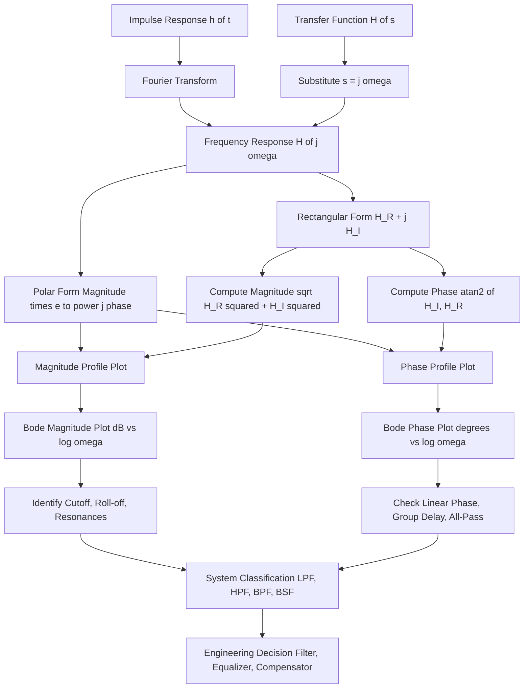
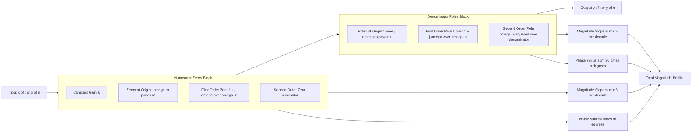
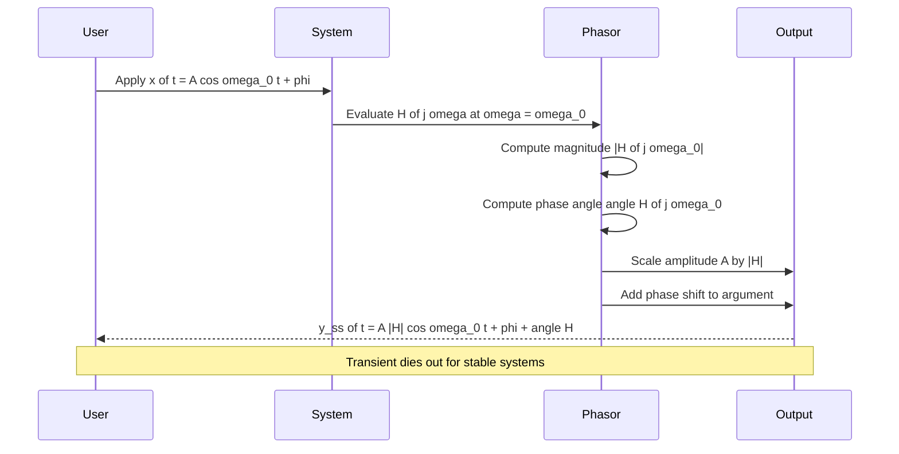
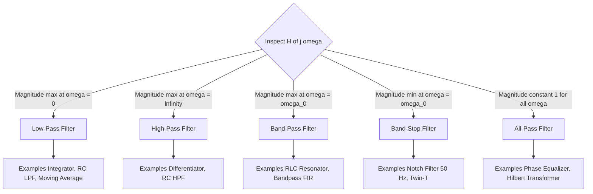

# Frequency response of LTI systems, magnitude and phase profiles tracking

<!-- SECTION_1_START -->
# Frequency Response of LTI Systems — Magnitude and Phase Profiles

## 1.1 Formal Definition (KTU 2024 Syllabus Terminology)

For a **continuous-time Linear Time-Invariant (LTI) system** characterized by an impulse response $h(t)$, the **frequency response** $H(j\omega)$ is defined as the **Fourier Transform** of $h(t)$, evaluated on the imaginary axis of the complex $s$-plane:

$$H(j\omega) = \int_{-\infty}^{+\infty} h(t) e^{-j\omega t} \, dt$$

For a **discrete-time LTI system** with impulse response $h[n]$, the frequency response is the **Discrete-Time Fourier Transform (DTFT)** evaluated on the unit circle $z = e^{j\Omega}$:

$$H(e^{j\Omega}) = \sum_{n=-\infty}^{+\infty} h[n] e^{-j\Omega n}$$

> [!IMPORTANT]
> **Syllabus Highlight:** The frequency response is **defined only for BIBO-stable LTI systems** (Region of Convergence must include the $j\omega$ axis for CT, or the unit circle for DT). The system acts as a **complex gain** that scales the input sinusoid's amplitude and introduces a phase shift.

## 1.2 Conceptual Analogy — The "Equalizer" Intuition

Imagine an audio **graphic equalizer** in a music player. Each slider on the equalizer controls how much a specific frequency band (bass, mid, treble) is amplified or attenuated. The complete set of slider positions forms the **magnitude profile** of the system, while the timing alignment between left and right speakers (causing a slight delay in certain frequencies) represents the **phase profile**.

> [!NOTE]
> **Key Intuition:** When a pure sinusoid $\cos(\omega t)$ enters a stable LTI system, the output is **another sinusoid of the same frequency $\omega$**, but with its amplitude scaled by $\vert H(j\omega) \vert$ and shifted in phase by $\angle H(j\omega)$. The system reshapes the signal's spectral content — it does **not** create new frequencies.

This is formalized as the **Eigenfunction Property** of LTI systems:

$$x(t) = e^{j\omega t} \quad \xrightarrow{\text{LTI}} \quad y(t) = H(j\omega)\, e^{j\omega t}$$

The complex exponential $e^{j\omega t}$ is an **eigenfunction** of every LTI system, and $H(j\omega)$ is the corresponding **eigenvalue** (a complex number, hence having both magnitude and phase).

## 1.3 Magnitude and Phase Components

Any frequency response $H(j\omega)$ can be expressed in two equivalent forms:

**Rectangular (Cartesian) form:**

$$H(j\omega) = H_R(\omega) + j H_I(\omega)$$

**Polar (Magnitude–Phase) form:**

$$H(j\omega) = \vert H(j\omega) \vert \, e^{j \angle H(j\omega)}$$

The two profiles are extracted as:

$$\vert H(j\omega) \vert = \sqrt{H_R^2(\omega) + H_I^2(\omega)} \quad \text{(Magnitude Profile)}$$

$$\angle H(j\omega) = \tan^{-1}\!\left( \frac{H_I(\omega)}{H_R(\omega)} \right) \quad \text{(Phase Profile)}$$

> [!TIP]
> **Tracking** the magnitude and phase means plotting them as functions of frequency $\omega$ (continuous) or $\Omega$ (discrete) and analyzing how the system "colors" the input spectrum.

> [!VISUALIZATION CONTROL]
> **Concept:** Magnitude and Phase Spectrum of a First-Order Low-Pass Filter
> **System:** $H(j\omega) = \dfrac{1}{1 + j\omega}$
> **GeoGebra / Desmos Input Equations:**
> * `f(x) = 1 / sqrt(1 + x^2)` — Magnitude response
> * `g(x) = -atan(x)` — Phase response (in radians)
> **Visual Description:** The magnitude curve starts at **1.0** at $\omega = 0$, rolls off monotonically toward **0** as $\omega \to \infty$. The phase starts at **0°**, drops monotonically through **−45°** at the corner frequency $\omega = 1$, and asymptotically approaches **−90°**.

## 1.4 The Sinusoidal In–Out Identity (Steady-State Response)

For an input $x(t) = A \cos(\omega_0 t + \phi)$ entering a stable LTI system, the **steady-state output** is:

$$y_{ss}(t) = A\, \vert H(j\omega_0) \vert \, \cos\!\big(\omega_0 t + \phi + \angle H(j\omega_0)\big)$$

The transient response dies out (if the system is stable), leaving only this scaled-and-shifted sinusoid at the **same frequency** $\omega_0$. This identity is the foundation of **phasor analysis** in AC circuit theory and is directly tested in KTU university exams.

<!-- SECTION_1_END -->

<!-- SECTION_2_START -->
# Deep Theoretical Analysis & KTU High-Yield Formula Sheet

## 2.1 Conditions for Existence of Frequency Response

The frequency response $H(j\omega)$ exists in the conventional sense only if:

1. The system is **LTI** (so the eigenfunction property holds).
2. The system is **BIBO stable** (so the Fourier transform converges).
3. The system is described by a **Linear Constant-Coefficient Differential/Difference Equation (LCCDE)**.

> [!NOTE]
> For **unstable** systems, the frequency response can still be defined by **analytic continuation** (substituting $s = j\omega$ into the transfer function $H(s)$), but the sinusoidal-in / sinusoidal-out identity fails because the output contains growing exponentials.

## 2.2 Connection Between LCCDE and Frequency Response

For a continuous-time LCCDE:

$$\sum_{k=0}^{N} a_k \frac{d^k y(t)}{dt^k} = \sum_{m=0}^{M} b_m \frac{d^m x(t)}{dt^m}$$

Substituting $x(t) = e^{j\omega t}$ and $y(t) = H(j\omega) e^{j\omega t}$, and using $\dfrac{d^k}{dt^k} e^{j\omega t} = (j\omega)^k e^{j\omega t}$:

$$H(j\omega) = \frac{\displaystyle\sum_{m=0}^{M} b_m (j\omega)^m}{\displaystyle\sum_{k=0}^{N} a_k (j\omega)^k}$$

This is a **rational function of $j\omega$** — the foundation of pole-zero analysis.

## 2.3 Pole-Zero Geometric Interpretation

Write $H(j\omega) = K \cdot \dfrac{\prod_{m=1}^{M} (j\omega - z_m)}{\prod_{k=1}^{N} (j\omega - p_k)}$

**Magnitude** (Geometric — distances in the $s$-plane):

$$\vert H(j\omega) \vert = \vert K \vert \cdot \frac{\prod_{m=1}^{M} \vert j\omega - z_m \vert}{\prod_{k=1}^{N} \vert j\omega - p_k \vert}$$

**Phase** (Geometric — angles in the $s$-plane):

$$\angle H(j\omega) = \angle K + \sum_{m=1}^{M} \angle(j\omega - z_m) - \sum_{k=1}^{N} \angle(j\omega - p_k)$$

> [!IMPORTANT]
> The magnitude response is the **ratio of products of distances** from the evaluation point $j\omega$ on the imaginary axis to the zeros (numerator) and poles (denominator). The phase is the **difference of sums of angles** subtended at the evaluation point.

## 2.4 Log-Magnitude and Decibel Scale

In practice, magnitude is plotted on a **logarithmic (dB) scale** to compress the wide dynamic range:

$$H_{dB}(\omega) = 20 \log_{10} \vert H(j\omega) \vert \quad \text{(units: decibels, dB)}$$

**Reference values:**

| Linear $\vert H \vert$ | Decibel Value (dB) |
|:---:|:---:|
| 0.5 | −6.02 dB |
| $1 / \sqrt{2} \approx 0.707$ | −3.01 dB |
| 1.0 | 0 dB |
| 2.0 | +6.02 dB |
| 10 | +20 dB |
| 100 | +40 dB |

## 2.5 Bode Plot Asymptotic Approximations

For a transfer function factored into **first-order** and **second-order** building blocks, the Bode plot is built by superposition. The standard building blocks are:

| Building Block | Magnitude Slope (high $\omega$) | Phase Contribution |
|:---:|:---:|:---:|
| Constant $K$ | 0 dB/dec | 0° (or fixed) |
| Pole at origin $(j\omega)$ | −20 dB/dec | −90° |
| Zero at origin $(j\omega)$ | +20 dB/dec | +90° |
| First-order pole $\dfrac{1}{1 + j\omega/\omega_c}$ | 0 dB/dec below, −20 dB/dec above $\omega_c$ | 0° to −90°, crossing −45° at $\omega_c$ |
| First-order zero $1 + j\omega/\omega_c$ | 0 dB/dec below, +20 dB/dec above $\omega_c$ | 0° to +90°, crossing +45° at $\omega_c$ |
| Second-order pole $\dfrac{\omega_n^2}{s^2 + 2\zeta\omega_n s + \omega_n^2}$ | 0 dB/dec below, −40 dB/dec above $\omega_n$ | 0° to −180°, peak near $\omega_r = \omega_n\sqrt{1 - 2\zeta^2}$ |

**Corner / Break Frequency:** $\omega_c$ is the frequency where the asymptotic line changes slope. The actual curve passes through $\pm 3$ dB of the asymptote at the corner (for first-order sections).

## 2.6 Linear Phase and Group Delay

A system has **linear phase** if:

$$\angle H(j\omega) = -\alpha \omega - \beta$$

where $\alpha$ and $\beta$ are real constants. The constant $\alpha$ represents a pure time delay $t_d = \alpha$ (in seconds), and $\beta$ is a fixed phase offset.

**Group Delay** quantifies the time delay experienced by each spectral component:

$$\tau_g(\omega) = -\frac{d}{d\omega} \angle H(j\omega)$$

> [!NOTE]
> For a **linear-phase** system, $\tau_g(\omega) = \alpha$ is **constant** — all frequency components are delayed by the same amount, preserving the **waveform shape**. This is critical in **data transmission, audio processing, and image filtering**, where signal distortion must be minimized.

## 2.7 All-Pass Systems

An **all-pass system** has $\vert H(j\omega) \vert = 1$ for all $\omega$, but a non-trivial phase response. A first-order all-pass has the form:

$$H_{ap}(s) = \frac{s - a}{s + a}, \quad a > 0 \quad (\text{stable version})$$

$$H_{ap}(j\omega) = \frac{j\omega - a}{j\omega + a} \quad \Rightarrow \quad \vert H_{ap}(j\omega) \vert = \frac{\sqrt{\omega^2 + a^2}}{\sqrt{\omega^2 + a^2}} = 1$$

$$\angle H_{ap}(j\omega) = \pi - 2 \tan^{-1}\!\left(\frac{\omega}{a}\right)$$

> [!IMPORTANT]
> All-pass systems are used as **phase equalizers** — they reshape the phase response without affecting the magnitude response. They appear in **minimum-phase system theory** and **feedback amplifier design**.

## 2.8 Complete KTU Formula Cheat Sheet

| Formula | Expression | Use Case |
|:---|:---|:---|
| Frequency Response (CT) | $H(j\omega) = \int_{-\infty}^{\infty} h(t) e^{-j\omega t} dt$ | Definition |
| Frequency Response (DT) | $H(e^{j\Omega}) = \sum_{n=-\infty}^{\infty} h[n] e^{-j\Omega n}$ | Definition |
| Steady-State Output | $y_{ss}(t) = A \vert H(j\omega_0) \vert \cos(\omega_0 t + \phi + \angle H(j\omega_0))$ | Sinusoidal response |
| Magnitude from Poles-Zeros | $\vert H(j\omega) \vert = \vert K \vert \dfrac{\prod \vert j\omega - z_m \vert}{\prod \vert j\omega - p_k \vert}$ | Geometric analysis |
| Phase from Poles-Zeros | $\angle H(j\omega) = \angle K + \sum \angle(j\omega - z_m) - \sum \angle(j\omega - p_k)$ | Geometric analysis |
| Decibel Conversion | $H_{dB} = 20 \log_{10} \vert H(j\omega) \vert$ | Bode plot |
| Group Delay | $\tau_g(\omega) = -d \angle H(j\omega) / d\omega$ | Dispersion analysis |
| Linear Phase Condition | $\angle H(j\omega) = -\alpha\omega - \beta$ | Distortionless transmission |
| All-Pass (1st Order) | $H_{ap}(s) = (s - a)/(s + a)$ | Phase equalizer |

## 2.9 Real-World Engineering Applications

* **Audio Equalizers and Crossovers:** Audio speakers use crossover networks whose frequency response separates bass, mid, and treble bands.
* **Communication Channel Equalization:** Telephone and wireless channels distort the magnitude and phase of transmitted signals; adaptive equalizers track and invert the channel response.
* **Control Systems:** Servo controllers and PID compensators are designed by shaping the open-loop frequency response for desired gain and phase margin (Bode stability criterion).
* **Radar and Sonar:** Matched filters are designed so that $\vert H(j\omega) \vert$ matches the signal spectrum for maximum SNR.
* **Biomedical Signal Processing:** ECG and EEG amplifiers use band-pass filters designed in the frequency domain to remove 50/60 Hz powerline interference.

<!-- SECTION_2_END -->

<!-- SECTION_3_START -->
# Step-by-Step Derivations & Code Implementation

## 3.1 Worked Example 1 — Magnitude & Phase Tracking of a First-Order LPF

**Problem:** Given the continuous-time LTI system $H(j\omega) = \dfrac{1}{1 + j\omega}$, plot the magnitude and phase profiles. Identify the −3 dB cutoff and verify the high-frequency roll-off rate.

**Step 1 — Express in rectangular form** by rationalizing the denominator:

$$H(j\omega) = \frac{1}{1 + j\omega} \cdot \frac{1 - j\omega}{1 - j\omega} = \frac{1 - j\omega}{1 + \omega^2}$$

**Step 2 — Separate real and imaginary parts:**

$$H_R(\omega) = \frac{1}{1 + \omega^2}, \quad H_I(\omega) = \frac{-\omega}{1 + \omega^2}$$

**Step 3 — Compute magnitude:**

$$\vert H(j\omega) \vert = \sqrt{H_R^2 + H_I^2} = \sqrt{\frac{1 + \omega^2}{(1 + \omega^2)^2}} = \frac{1}{\sqrt{1 + \omega^2}}$$

**Step 4 — Compute phase:**

$$\angle H(j\omega) = \tan^{-1}\!\left(\frac{H_I}{H_R}\right) = \tan^{-1}\!\left(\frac{-\omega}{1}\right) = -\tan^{-1}(\omega)$$

**Step 5 — Find −3 dB cutoff frequency:**

$$\vert H(j\omega_c) \vert = \frac{1}{\sqrt{2}} \quad \Rightarrow \quad \frac{1}{\sqrt{1 + \omega_c^2}} = \frac{1}{\sqrt{2}}$$

$$\Rightarrow \quad 1 + \omega_c^2 = 2 \quad \Rightarrow \quad \omega_c = 1 \text{ rad/s}$$

**Step 6 — High-frequency asymptotic slope:**

$$H_{dB} = -20 \log_{10}\sqrt{1 + \omega^2} \approx -20 \log_{10}(\omega) \quad \text{for } \omega \gg 1$$

This corresponds to a slope of **−20 dB/decade**.

**Step 7 — Tabulate values for tracking the profile:**

| $\omega$ (rad/s) | $\vert H(j\omega) \vert$ | $\vert H(j\omega) \vert$ in dB | $\angle H(j\omega)$ (degrees) |
|:---:|:---:|:---:|:---:|
| 0.01 | 0.99995 | −0.0004 dB | −0.57° |
| 0.1 | 0.9950 | −0.0432 dB | −5.71° |
| 0.5 | 0.8944 | −0.969 dB | −26.57° |
| 1.0 | 0.7071 | −3.01 dB | −45.00° |
| 2.0 | 0.4472 | −6.99 dB | −63.43° |
| 10.0 | 0.0995 | −20.04 dB | −84.29° |
| 100.0 | 0.009999 | −40.00 dB | −89.43° |

> [!NOTE]
> Notice that at $\omega = \omega_c = 1$, the magnitude is **−3.01 dB** (the half-power point) and the phase is **−45°**. Both are diagnostic markers for a first-order low-pass system.

---

## 3.2 Worked Example 2 — Linear Phase Verification

**Problem:** A discrete-time LTI system has impulse response $h[n] = \delta[n] + 0.5\,\delta[n - 1] + 0.25\,\delta[n - 2]$. Show that the system is linear phase and find the constant group delay.

**Step 1 — Compute the frequency response by DTFT:**

$$H(e^{j\Omega}) = \sum_{n=0}^{2} h[n] e^{-j\Omega n} = 1 + 0.5 e^{-j\Omega} + 0.25 e^{-j2\Omega}$$

**Step 2 — Factor out the largest delay (linear phase center):**

$$H(e^{j\Omega}) = e^{-j\Omega}\!\left( e^{j\Omega} + 0.5 + 0.25 e^{-j\Omega} \right)$$

$$= e^{-j\Omega}\!\left( 0.5 + 2(0.5)\cos(\Omega) \right) = e^{-j\Omega}\!\left( 0.5 + \cos(\Omega) \right)$$

**Step 3 — Identify the magnitude and phase:**

The bracketed term $0.5 + \cos(\Omega)$ is **real and non-negative** for $\Omega \in [-\pi, \pi]$ (it ranges from −0.5 to 1.5, with a sign change at $\cos(\Omega) = -0.5$).

For $\Omega$ where $0.5 + \cos(\Omega) > 0$:

$$\angle H(e^{j\Omega}) = -\Omega$$

**Step 4 — Verify linear phase and compute group delay:**

$$\tau_g(\Omega) = -\frac{d}{d\Omega}(-\Omega) = 1 \text{ sample}$$

> [!IMPORTANT]
> The constant group delay of **1 sample** means the output is a delayed replica of the input waveform shape — **no phase distortion**. This is the discrete-time analog of a transmission line with pure time delay $T_s = 1$.

---

## 3.3 Worked Example 3 — All-Pass Phase Profiling

**Problem:** For the all-pass system $H(s) = \dfrac{s - 1}{s + 1}$, compute and plot the phase response over $\omega \in [0.1, 10]$ rad/s.

**Step 1 — Substitute $s = j\omega$:**

$$H(j\omega) = \frac{j\omega - 1}{j\omega + 1}$$

**Step 2 — Compute magnitude:**

$$\vert H(j\omega) \vert = \frac{\sqrt{\omega^2 + 1}}{\sqrt{\omega^2 + 1}} = 1 \quad \text{(all-pass property verified)}$$

**Step 3 — Compute phase:**

$$\angle H(j\omega) = \angle(j\omega - 1) - \angle(j\omega + 1)$$

$$\angle(j\omega - 1) = \pi - \tan^{-1}(\omega) \quad \text{(second quadrant)}$$

$$\angle(j\omega + 1) = \tan^{-1}(\omega) \quad \text{(first quadrant)}$$

$$\Rightarrow \angle H(j\omega) = \pi - 2\tan^{-1}(\omega)$$

**Step 4 — Evaluate at key frequencies:**

| $\omega$ (rad/s) | $\angle H(j\omega)$ (radians) | $\angle H(j\omega)$ (degrees) |
|:---:|:---:|:---:|
| 0.1 | 2.942 | 168.58° |
| 0.5 | 2.214 | 126.87° |
| 1.0 | $\pi/2 \approx 1.571$ | 90.00° |
| 2.0 | 0.927 | 53.13° |
| 10.0 | 0.199 | 11.42° |

> [!NOTE]
> The phase response is a **mirror image** of the first-order low-pass phase, with a sign change. The all-pass system contributes a phase lag that varies from **180°** at $\omega \to 0$ down to **0°** at $\omega \to \infty$, passing through **90°** at $\omega = 1$ rad/s.

---

## 3.4 Python Implementation — Magnitude and Phase Tracker

```python
import numpy as np
import matplotlib.pyplot as plt

def track_frequency_response(H_func, w_vec, label="System"):
    """
    Compute and plot magnitude (linear & dB) and phase profiles
    of a continuous-time LTI system.
    
    Parameters
    ----------
    H_func : callable
        Function that takes omega (rad/s) and returns complex H(jw).
    w_vec : np.ndarray
        1D array of angular frequencies (rad/s).
    label : str
        Display label for the system.
    """
    H = np.array([H_func(w) for w in w_vec], dtype=complex)
    mag = np.abs(H)
    mag_db = 20.0 * np.log10(mag + 1e-12)  # avoid log(0)
    phase_deg = np.degrees(np.angle(H))
    phase_unwrapped = np.degrees(np.unwrap(np.angle(H)))
    
    fig, axes = plt.subplots(3, 1, figsize=(9, 9), sharex=True)
    
    # Magnitude (linear)
    axes[0].semilogx(w_vec, mag, 'b-', linewidth=2)
    axes[0].set_ylabel("Magnitude |H(jw)|")
    axes[0].set_title(f"Frequency Response Tracking - {label}")
    axes[0].grid(True, which='both', linestyle='--', alpha=0.6)
    axes[0].axhline(1/np.sqrt(2), color='r', linestyle=':', label='-3 dB level (linear)')
    axes[0].legend()
    
    # Magnitude (dB)
    axes[1].semilogx(w_vec, mag_db, 'b-', linewidth=2)
    axes[1].set_ylabel("Magnitude (dB)")
    axes[1].axhline(-3.01, color='r', linestyle=':', label='-3 dB cutoff')
    axes[1].grid(True, which='both', linestyle='--', alpha=0.6)
    axes[1].legend()
    
    # Phase
    axes[2].semilogx(w_vec, phase_unwrapped, 'r-', linewidth=2)
    axes[2].set_ylabel("Phase (degrees, unwrapped)")
    axes[2].set_xlabel("Frequency w (rad/s)")
    axes[2].grid(True, which='both', linestyle='--', alpha=0.6)
    
    plt.tight_layout()
    plt.savefig(f"{label.replace(' ', '_')}_bode.png", dpi=150)
    plt.show()
    
    return mag, phase_unwrapped


# ----- Example 1: First-order LPF -----
def H_lpf(w):
    return 1.0 / (1.0 + 1j * w)

w = np.logspace(-2, 2, 1000)
mag, phase = track_frequency_response(H_lpf, w, "First-Order LPF")

# Print tracking checkpoints
print("\nFirst-Order LPF Tracking Report")
print("=" * 50)
for w_chk in [0.1, 0.5, 1.0, 2.0, 10.0]:
    idx = np.argmin(np.abs(w - w_chk))
    print(f"w = {w_chk:6.2f} rad/s | |H| = {mag[idx]:.4f} "
          f"({20*np.log10(mag[idx]):+6.2f} dB) | "
          f"phase = {phase[idx]:+7.2f} deg")


# ----- Example 2: All-Pass System -----
def H_allpass(w):
    return (1j * w - 1.0) / (1j * w + 1.0)

mag_ap, phase_ap = track_frequency_response(H_allpass, w, "First-Order All-Pass")
print("\nAll-Pass Verification: |H| =", mag_ap[0], "to", mag_ap[-1])
```

**Expected Output (excerpt):**

```text
First-Order LPF Tracking Report
==================================================
w =   0.10 rad/s | |H| = 0.9950 ( -0.04 dB) | phase =  -5.71 deg
w =   0.50 rad/s | |H| = 0.8944 ( -0.97 dB) | phase = -26.57 deg
w =   1.00 rad/s | |H| = 0.7071 ( -3.01 dB) | phase = -45.00 deg
w =   2.00 rad/s | |H| = 0.4472 ( -6.99 dB) | phase = -63.43 deg
w =  10.00 rad/s | |H| = 0.0995 (-20.04 dB) | phase = -84.29 deg
```

> [!TIP]
> **Engineering Tip:** When plotting Bode diagrams by hand, always use **semilog paper** (log frequency, linear magnitude in dB). The straight-line asymptotes become easy to draw, and the −20 dB/dec and −40 dB/dec slopes are visually obvious.

---

## 3.5 Derivation — Group Delay from Phase Slope

**Goal:** Show that for a narrowband signal centered at $\omega_0$, the group delay equals the time delay experienced by the envelope.

**Step 1 — Consider a narrowband signal:**

$$x(t) = a(t) \cos(\omega_0 t)$$

where $a(t)$ is a slowly-varying envelope.

**Step 2 — Express as sum of two complex exponentials:**

$$x(t) = \frac{1}{2} a(t) e^{j\omega_0 t} + \frac{1}{2} a^*(t) e^{-j\omega_0 t}$$

**Step 3 — The system response near $\omega_0$ is locally linear-phase:**

$$\angle H(j\omega) \approx \angle H(j\omega_0) + \left.\frac{d\angle H}{d\omega}\right|_{\omega_0} (\omega - \omega_0)$$

$$\Rightarrow H(j\omega) \approx \vert H(j\omega_0) \vert e^{j\angle H(j\omega_0)} e^{-j\tau_g(\omega_0)(\omega - \omega_0)}$$

**Step 4 — Substitute back into the output spectrum and inverse-transform:**

$$y(t) \approx \vert H(j\omega_0) \vert \cdot a(t - \tau_g) \cos(\omega_0 t + \angle H(j\omega_0))$$

**Conclusion:** The envelope $a(t)$ is delayed by exactly $\tau_g(\omega_0)$ seconds, while the carrier is phase-shifted by $\angle H(j\omega_0)$. This is the formal justification for treating group delay as "envelope delay."

<!-- SECTION_3_END -->

<!-- SECTION_4_START -->
# Structural Diagrams & Schematics

## 4.1 Mermaid Flow — Frequency Response Analysis Pipeline



## 4.2 Mermaid Subgraph — Decomposition of a Generic Transfer Function



## 4.3 Mermaid Sequence — Steady-State Sinusoidal Response Procedure



## 4.4 Mermaid Graph — Filter Type Classification by Profile



> [!NOTE]
> **Diagram Interpretation:** The classification is performed purely by **tracking the magnitude profile** — observing which frequency region the system amplifies and which it attenuates. Phase profile is secondary but reveals linearity (and hence distortion behavior).

<!-- SECTION_4_END -->

<!-- SECTION_5_START -->
# KTU 2024 Scheme Examination Question Bank & Topic Recap

## Part A — Short Answer Questions (3 Marks Each)

### Question 1 [KTU University Exam — July 2023]

**(CO1, Remember):** Define the **frequency response** of a continuous-time LTI system. State the condition under which it exists.

**Model Answer (3 Marks):**
The frequency response $H(j\omega)$ of a continuous-time LTI system with impulse response $h(t)$ is defined as the Fourier Transform of $h(t)$:

$$H(j\omega) = \int_{-\infty}^{+\infty} h(t) e^{-j\omega t} \, dt \quad \text{(Definition: 2 Marks)}$$

It exists when the system is **BIBO stable**, i.e., $\int_{-\infty}^{+\infty} \vert h(t) \vert \, dt < \infty$, ensuring convergence of the Fourier integral. **Condition: 1 Mark**

---

### Question 2 [KTU University Exam — Dec 2023]

**(CO2, Understand):** Explain the **geometric interpretation** of magnitude and phase of $H(j\omega)$ in terms of poles and zeros in the $s$-plane.

**Model Answer (3 Marks):**
For a transfer function $H(s) = K \dfrac{\prod (s - z_m)}{\prod (s - p_k)}$, evaluating at $s = j\omega$ gives complex numbers $j\omega - z_m$ (vectors from each zero to the point $j\omega$ on the imaginary axis) and $j\omega - p_k$ (vectors from each pole).
* **Magnitude:** $\vert H(j\omega) \vert = \vert K \vert \cdot \dfrac{\prod \vert j\omega - z_m \vert}{\prod \vert j\omega - p_k \vert}$ — ratio of product of lengths. **(1.5 Marks)**
* **Phase:** $\angle H(j\omega) = \angle K + \sum \angle(j\omega - z_m) - \sum \angle(j\omega - p_k)$ — sum/difference of subtended angles. **(1.5 Marks)**

---

## Part B — Full 14-Mark Questions (ESE Module Internal Choice)

### Question A (14 Marks) [KTU University Exam — July 2024]

**(a)** Derive the expression for the frequency response of an LTI system governed by the differential equation:

$$\frac{d^2 y(t)}{dt^2} + 3 \frac{dy(t)}{dt} + 2\, y(t) = x(t)$$

**(CO2, Understand — 7 Marks)**

**Model Solution:**

**Step 1 — Apply the eigenfunction property** [1 Mark]: Substituting $x(t) = e^{j\omega t}$, $y(t) = H(j\omega) e^{j\omega t}$ into the LCCDE.

**Step 2 — Differentiate** [1 Mark]: $\dfrac{d^k}{dt^k} e^{j\omega t} = (j\omega)^k e^{j\omega t}$.

**Step 3 — Substitute and simplify** [3 Marks]:

$$(j\omega)^2 H e^{j\omega t} + 3(j\omega) H e^{j\omega t} + 2 H e^{j\omega t} = e^{j\omega t}$$

$$H(j\omega)\big[(j\omega)^2 + 3(j\omega) + 2\big] = 1$$

**Step 4 — Solve for $H(j\omega)$** [1 Mark]:

$$H(j\omega) = \frac{1}{(j\omega)^2 + 3(j\omega) + 2} = \frac{1}{2 - \omega^2 + 3j\omega}$$

**Step 5 — Final form** [1 Mark]:

$$H(j\omega) = \frac{1}{(j\omega + 1)(j\omega + 2)}$$

The system has two real poles at $s = -1$ and $s = -2$ (both in the left half-plane, hence **stable**).

---

**(b)** For the system in part (a), compute and plot (with values at $\omega = 0, 0.5, 1, 2, 5$ rad/s) the **magnitude and phase profiles**. Identify the system type.

**(CO3, Apply — 7 Marks)**

**Model Solution:**

**Step 1 — Magnitude expression** [1 Mark]:

$$\vert H(j\omega) \vert = \frac{1}{\sqrt{(2 - \omega^2)^2 + (3\omega)^2}} = \frac{1}{\sqrt{(2 - \omega^2)^2 + 9\omega^2}}$$

**Step 2 — Phase expression** [1 Mark]:

$$\angle H(j\omega) = -\tan^{-1}\!\left(\frac{3\omega}{2 - \omega^2}\right) \quad \text{(with quadrant correction)}$$

**Step 3 — Tabulate values** [3 Marks]:

| $\omega$ (rad/s) | $\vert H(j\omega) \vert$ | $\vert H \vert$ in dB | $\angle H$ (degrees) |
|:---:|:---:|:---:|:---:|
| 0 | 0.5000 | −6.02 dB | 0° |
| 0.5 | 0.4926 | −6.15 dB | −23.20° |
| 1.0 | 0.4472 | −6.99 dB | −45.00° |
| 2.0 | 0.2774 | −11.13 dB | −108.43° |
| 5.0 | 0.0370 | −28.64 dB | −172.87° |

**Step 4 — Profile interpretation** [1 Mark]: Magnitude decreases monotonically with frequency; phase is monotonically decreasing (0° → −180°). The system is a **second-order low-pass filter**.

**Step 5 — Sketch Bode plot** [1 Mark]: Mark DC gain at −6 dB, two corner frequencies at $\omega_1 = 1$ rad/s and $\omega_2 = 2$ rad/s, with slopes of −20 dB/dec and −40 dB/dec after the second corner.

---

### Question B (14 Marks) [KTU University Exam — Dec 2023] — ALTERNATIVE

**(a)** Explain the concepts of **linear phase** and **group delay**. Show that a linear phase response ensures distortionless transmission.

**(CO2, Understand — 7 Marks)**

**Model Solution:**

**Step 1 — Define linear phase** [2 Marks]: A system has linear phase if $\angle H(j\omega) = -\alpha\omega - \beta$ for constants $\alpha, \beta \in \mathbb{R}$. The term $-\alpha\omega$ corresponds to a **time delay** $t_d = \alpha$, and $-\beta$ is a fixed phase offset.

**Step 2 — Define group delay** [2 Marks]: $\tau_g(\omega) = -\dfrac{d}{d\omega} \angle H(j\omega)$. For a linear-phase system, $\tau_g(\omega) = \alpha$ is **constant** — every spectral component is delayed by the same amount.

**Step 3 — Distortionless transmission condition** [2 Marks]: A system is distortionless if $|H(j\omega)| = K$ (constant) **and** $\angle H(j\omega) = -\alpha\omega - \beta$. Under these two conditions, $y(t) = K \cdot x(t - \alpha)$ — a scaled, delayed replica of the input with no waveform distortion.

**Step 4 — Example** [1 Mark]: A transmission line of length $\ell$ with propagation speed $v$ has $H(j\omega) = e^{-j\omega \ell/v}$, satisfying both conditions with $K = 1$ and $\alpha = \ell/v$.

---

**(b)** A discrete-time LTI system is described by $H(z) = 1 + z^{-1} + z^{-2} + z^{-3}$. Prove that it is a **linear-phase FIR filter** and determine its constant group delay. Plot the magnitude response for $\Omega \in [0, \pi]$.

**(CO3, Apply — 7 Marks)**

**Model Solution:**

**Step 1 — Frequency response** [1 Mark]:

$$H(e^{j\Omega}) = 1 + e^{-j\Omega} + e^{-j2\Omega} + e^{-j3\Omega}$$

**Step 2 — Factor out the center delay** [2 Marks]:

$$H(e^{j\Omega}) = e^{-j3\Omega/2}\!\left(e^{j3\Omega/2} + e^{j\Omega/2} + e^{-j\Omega/2} + e^{-j3\Omega/2}\right)$$

**Step 3 — Group the cosines** [1 Mark]:

$$H(e^{j\Omega}) = e^{-j3\Omega/2}\!\left(2\cos(3\Omega/2) + 2\cos(\Omega/2)\right) = 2 e^{-j3\Omega/2}\!\left(\cos(3\Omega/2) + \cos(\Omega/2)\right)$$

**Step 4 — Identify phase and group delay** [1 Mark]: The bracketed term is **real**, hence:

$$\angle H(e^{j\Omega}) = -\frac{3\Omega}{2} \quad \text{(linear phase)}$$

$$\tau_g = -\frac{d}{d\Omega}\!\left(-\frac{3\Omega}{2}\right) = \frac{3}{2} = 1.5 \text{ samples}$$

**Step 5 — Magnitude profile** [2 Marks]:

$$\vert H(e^{j\Omega}) \vert = 2 \left\vert \cos(3\Omega/2) + \cos(\Omega/2) \right\vert$$

| $\Omega$ | $0$ | $\pi/4$ | $\pi/2$ | $3\pi/4$ | $\pi$ |
|:---:|:---:|:---:|:---:|:---:|:---:|
| $\vert H \vert$ | 4.000 | 2.613 | 0.000 | 0.586 | 0.000 |

This is a **4-tap moving-average low-pass filter** with zeros at $\Omega = 2\pi/3$ and $\Omega = \pi$. The constant group delay of 1.5 samples confirms distortionless envelope propagation.

---

## KTU Examiner's Valuation Warning / Pitfall Callout

> [!WARNING]
> **Common Mistakes That Cost Marks in KTU University Exams:**
> 1. **Forgetting the absolute value** in the decibel formula: Students often write $20 \log H$ instead of $20 \log \vert H \vert$. This gives nonsensical complex-valued "dB" and loses **2–3 marks**.
> 2. **Ignoring the quadrant** of the phase: $\tan^{-1}(H_I/H_R)$ returns values in $(-\pi/2, \pi/2)$ only. For poles/zeros in the second quadrant, you must add $\pi$ (or use `atan2` in code). Examiners specifically test this.
> 3. **Confusing "−3 dB" with "−3 dB/decade":** −3 dB is the **cutoff magnitude**, while −3 dB/decade would mean a slope. Always state the unit.
> 4. **Skipping the stability check:** Before writing $H(j\omega)$, always confirm that all poles lie in the left half-plane (or inside the unit circle for DT). Mentioning this gives **bonus marks** and shows conceptual depth.
> 5. **Linear phase ≠ minimum phase:** A linear-phase FIR filter of order $N$ has $\alpha = N/2$ samples of delay. Don't claim "no delay" — claim "constant delay" instead.
> 6. **Failing to unwrap the phase:** Phase plots with $\pm 180°$ jumps obscure the true linear-phase trend. Always use the **unwrapped phase** for Bode plots.

---

## Topic Recap & Important Things to Remember

* **Definition:** $H(j\omega) = \mathcal{F}\{h(t)\}$ is the steady-state complex gain of an LTI system to a complex exponential $e^{j\omega t}$.
* **Existence condition:** System must be LTI and BIBO stable.
* **Steady-state identity:** $A\cos(\omega_0 t + \phi) \;\to\; A|H(j\omega_0)|\cos(\omega_0 t + \phi + \angle H(j\omega_0))$.
* **Pole-zero geometry:** $\vert H \vert$ = product of distances to zeros / product of distances to poles; $\angle H$ = sum of zero angles − sum of pole angles.
* **Decibel scale:** $H_{dB} = 20\log_{10}\vert H \vert$; −3 dB = $1/\sqrt{2}$ amplitude.
* **Bode plot asymptotes:** First-order pole contributes **−20 dB/dec** slope and **−90°** phase lag (centered on corner frequency $\omega_c$).
* **Linear phase:** $\angle H(j\omega) = -\alpha\omega - \beta$ → **distortionless** transmission with delay $\alpha$.
* **Group delay:** $\tau_g(\omega) = -d\angle H/d\omega$; must be **constant** for waveform preservation.
* **All-pass system:** $\vert H(j\omega) \vert = 1$ for all $\omega$; used as **phase equalizers**.
* **Filter classification:** LPF, HPF, BPF, BSF, AP — distinguished purely by tracking the magnitude profile.
* **LCCDE → Frequency response:** Substitute $(j\omega)^k$ for the $k$-th derivative operator and solve algebraically.
* **Symmetry property:** For real-valued $h(t)$, $\vert H(j\omega) \vert$ is even and $\angle H(j\omega)$ is odd in $\omega$.
* **High-frequency roll-off:** A system with $N$ more poles than zeros rolls off at **−20N dB/decade**.
* **Two diagnostic markers for first-order LPF:** Magnitude is **−3 dB** and phase is **−45°** at the corner frequency.
* **Bode stability (preview):** Phase margin and gain margin are read directly from the magnitude/phase profiles — linking Module 3 to Module 4 of the KTU syllabus.

<!-- SECTION_5_END -->
