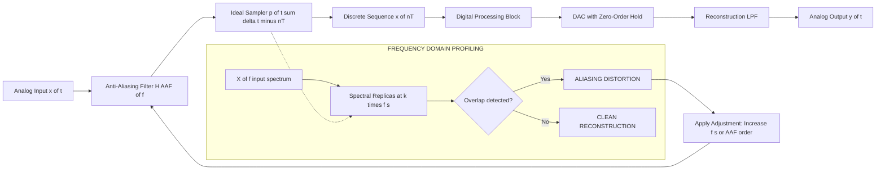
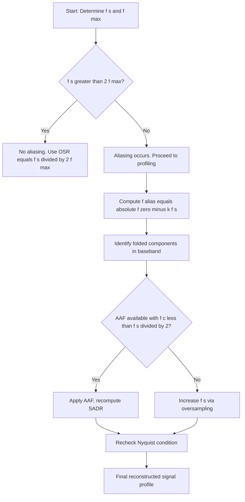

# Aliasing distortion profiling calculation adjustments frameworks formulas

<!-- SECTION_1_START -->

# Aliasing Distortion: Profiling, Calculation, Adjustments & Frameworks

## 1.1 Formal Academic Definition

In the context of **KTU 2024 Scheme (PECST416 – Signals and Systems, Module 4)**, **aliasing distortion** is formally defined as the irreversible corruption of a continuous-time signal's spectral information that occurs when the sampling frequency $f_s$ is insufficient to satisfy the **Nyquist–Shannon Sampling Theorem**.

Mathematically, a bandlimited signal $x(t)$ with maximum frequency component $f_{\max}$ must be sampled at:

$$f_s \geq 2 \cdot f_{\max}$$

When this constraint is violated (i.e., $f_s < 2 f_{\max}$), the spectral replicas of $X(f)$ (centered at integer multiples of $f_s$) overlap in the baseband, causing distinct frequency components to become **indistinguishable** after reconstruction. This phenomenon is termed **aliasing**, and the resulting perceptual error is called **aliasing distortion**.

> [!IMPORTANT]
> **Syllabus Highlight (PECST416, Module 4):** Aliasing is intrinsically tied to **Continuous-to-Discrete (C/D) conversion**. KTU examiners frequently test the relationship between the **sampling frequency $f_s$**, the **anti-aliasing filter cutoff $f_c$**, and the resulting **signal-to-aliasing-distortion ratio (SADR)**.

### 1.2 Conceptual Analogy (Intuitive Overview)

Imagine you are filming a spinning wheel with a video camera. If the wheel rotates at **10 revolutions per second** but your camera captures only **8 frames per second**, the wheel appears to rotate **backward at 2 revolutions per second** on screen. The true motion (10 Hz) is *disguised* as a false motion (2 Hz) because the camera's "sampling" was too slow. This is **aliasing in the frequency domain**.

In signal processing:
- The wheel = your analog signal
- The camera's frame rate = sampling frequency $f_s$
- The false backward motion = aliased frequency $f_{alias}$

> [!NOTE]
> **GeoGebra / Desmos Visualization**
> **Concept:** Spectral folding of an undersampled sinusoid.
> **Input Equations:**
> * $f_1 = 1,\ f_2 = 1.7,\ f_s = 2$
> * $X_{\text{replicas}}(f) = \delta(f-f_1) + \delta(f-f_2) + \delta(f-(f_1-f_s)) + \delta(f-(f_2-f_s))$
> **Visual Description:** Plot impulses at $\pm 1,\ \pm 1.7,\ \pm 1,\ \pm 0.3$ on the $f$-axis. The impulse at $-0.3$ (i.e., $+0.3$ due to symmetry) **folds into the baseband** $[-f_s/2, f_s/2]$, overlapping with the genuine component at $1$ Hz's mirror at $-1$ Hz region — a clear visualization of how $1.7$ Hz masquerades as $0.3$ Hz after sampling at $2$ Hz.

---

<!-- SECTION_1_END -->

<!-- SECTION_2_START -->

# Deep Theoretical Analysis & KTU High-Yield Formula Sheet

## 2.1 The Mechanism of Aliasing — Step-by-Step

The **ideal sampling operation** (impulse-train modulation) produces a sampled signal:

$$x_s(t) = x(t) \cdot \sum_{n=-\infty}^{\infty} \delta(t - nT) = \sum_{n=-\infty}^{\infty} x(nT)\,\delta(t - nT)$$

Taking the **Continuous-Time Fourier Transform (CTFT)**:

$$X_s(f) = \frac{1}{T} \sum_{k=-\infty}^{\infty} X\!\left(f - k f_s\right) \quad \text{where} \quad f_s = \frac{1}{T}$$

This is the **spectral replication property** — the original spectrum $X(f)$ is replicated at every integer multiple of $f_s$, each copy scaled by $\frac{1}{T}$.

### 2.2 When Does Aliasing Happen?

**Case 1 — No Aliasing (Proper Sampling):** $f_s \geq 2 f_{\max}$.  
The replicas are **non-overlapping**, and a low-pass reconstruction filter can extract the baseband copy cleanly.

**Case 2 — Critical Sampling:** $f_s = 2 f_{\max}$.  
Replicas just touch at $f_s/2$. Theoretical recovery possible only with an *ideal* brick-wall filter.

**Case 3 — Aliasing (Undersampling):** $f_s < 2 f_{\max}$.  
Replicas **overlap**, and information from $[f_s/2, f_{\max}]$ is folded back into $[-f_s/2, f_s/2]$.

### 2.3 Computing the Aliased Frequency

For a single-tone component at frequency $f_0$ sampled at $f_s$, the **aliased frequency** in the baseband is:

$$f_{\text{alias}} = \left\vert f_0 - k f_s \right\vert \quad \text{where } k = \left\lfloor \frac{f_0}{f_s} + \frac{1}{2} \right\rfloor$$

Equivalently, using modular arithmetic:

$$f_{\text{alias}} = \left( f_0 \right) \bmod f_s, \quad \text{folded to } \left[ 0,\ \frac{f_s}{2} \right]$$

### 2.4 The Anti-Aliasing Filter Framework

To **prevent** aliasing at the C/D conversion stage, an **analog low-pass filter** (anti-aliasing filter, AAF) is placed *before* the sampler:

$$x_{\text{filtered}}(t) = x(t) * h_{\text{AAF}}(t)$$

**Butterworth AAF magnitude response (most common in KTU problems):**

$$\left\vert H_{\text{AAF}}(f) \right\vert = \frac{1}{\sqrt{1 + \left(\frac{f}{f_c}\right)^{2N}}}$$

where:
- $f_c$ = cutoff frequency ($\leq f_s/2$)
- $N$ = filter order (higher $N$ → steeper roll-off)

### 2.5 Signal-to-Aliasing-Distortion Ratio (SADR)

The figure of merit for AAF performance is the **SADR**, defined as:

$$\text{SADR} = 10 \log_{10}\!\left( \frac{\sigma_x^{\,2}}{\sigma_{\text{alias}}^{\,2}} \right)\ \text{dB}$$

where $\sigma_{\text{alias}}^{\,2}$ is the variance of all out-of-band content that folds into the baseband.

### 2.6 KTU Formula Cheat Sheet

| # | Formula / Concept | Symbol / Expression | Domain / Use |
|---|---|---|---|
| 1 | Nyquist–Shannon Theorem | $f_s \geq 2 f_{\max}$ | Minimum sampling rate to avoid aliasing |
| 2 | Spectral Replication | $X_s(f) = \frac{1}{T}\sum_{k} X(f - k f_s)$ | Spectrum of sampled signal |
| 3 | Aliased Frequency (single tone) | $f_{\text{alias}} = \left\vert f_0 - k f_s \right\vert$ | $k = \text{round}(f_0/f_s)$ |
| 4 | Reconstruction (sinc interpolation) | $x(t) = \sum_n x(nT)\,\text{sinc}\!\left(\frac{t-nT}{T}\right)$ | Ideal D/C conversion |
| 5 | Butterworth AAF Response | $\vert H(f) \vert = 1/\sqrt{1+(f/f_c)^{2N}}$ | Anti-aliasing filter design |
| 6 | Oversampling Ratio (OSR) | $\text{OSR} = f_s / (2 f_{\max})$ | Quantifies "safety margin" |
| 7 | SADR | $\text{SADR} = 10\log_{10}(\sigma_x^2 / \sigma_{\text{alias}}^2)$ | Aliasing rejection metric (dB) |
| 8 | Transition Bandwidth | $\Delta f = f_s/2 - f_c$ | Filter design parameter |
| 9 | Roll-off Rate | $-20N\ \text{dB/decade}$ (Butterworth) | Stopband attenuation per decade |
| 10 | First-Order Hold Reconstructor | $x_r(t) = x(nT) + \frac{x((n+1)T)-x(nT)}{T}(t-nT)$ | Practical D/C approximation |

### 2.7 Real-World Engineering Utility

- **Digital Audio (CDs):** $f_s = 44.1$ kHz, $f_{\max} = 20$ kHz; OSR $\approx 1.1$ — the AAF is critical to prevent ultrasonic aliasing.
- **Medical Imaging (MRI, CT):** Bandpass sampling exploits aliasing *intentionally* to undersample sparse-spectrum signals.
- **Telecommunications (Software Defined Radio):** Direct-RF sampling at GHz rates requires multi-stage AAFs.
- **IoT Sensor Nodes:** Oversampling + cheap AAF is preferred over a complex AAF at low OSR to save power.

---

<!-- SECTION_2_END -->

<!-- SECTION_3_START -->

# Step-by-Step Derivations & Symbolic/Python Implementation

## 3.1 Worked Derivation — Spectral Folding for a Multi-Tone Signal

### Problem Statement

Consider the continuous-time signal:

$$x(t) = 2\cos(2\pi \cdot 50\,t) + \cos(2\pi \cdot 175\,t) + 0.5\cos(2\pi \cdot 325\,t)$$

The signal is sampled at $f_s = 200$ Hz. Profile the aliasing distortion: determine the **aliased frequencies**, the **resulting sampled signal**, and the **SADR** when an $N = 4$ Butterworth AAF with $f_c = 90$ Hz is applied.

---

### Step 1 — Identify the Maximum Frequency

$$f_{\max} = 325\ \text{Hz}$$

### Step 2 — Verify the Nyquist Criterion

$$2 f_{\max} = 650\ \text{Hz}, \qquad f_s = 200\ \text{Hz}$$

Since $f_s = 200 < 650$, the **Nyquist criterion is violated → aliasing will occur.**

### Step 3 — Compute the Aliased Frequency for Each Component

Using $f_{\text{alias}} = \left\vert f_0 - k f_s \right\vert$ with $k = \text{round}(f_0 / f_s)$:

| Component | $f_0$ (Hz) | $f_0 / f_s$ | $k$ | $\vert f_0 - k f_s \vert$ | $f_{\text{alias}}$ (Hz) |
|---|---|---|---|---|---|
| 1 | 50 | 0.25 | 0 | $\vert 50 - 0 \vert$ | 50.0 |
| 2 | 175 | 0.875 | 1 | $\vert 175 - 200 \vert$ | 25.0 |
| 3 | 325 | 1.625 | 2 | $\vert 325 - 400 \vert$ | 75.0 |

> **Observation:** The 175 Hz tone **appears** as a 25 Hz tone; the 325 Hz tone **appears** as a 75 Hz tone. The 50 Hz tone is preserved faithfully.

### Step 4 — Construct the Aliased Sampled Signal

The reconstructed (from samples) signal **mathematically** equals:

$$x_{\text{reconstructed}}(t) = 2\cos(2\pi \cdot 50\,t) + \cos(2\pi \cdot 25\,t) + 0.5\cos(2\pi \cdot 75\,t)$$

This is **not** equal to the original $x(t)$ — a permanent loss of information has occurred.

### Step 5 — Apply the Butterworth AAF (Pre-Sampling)

With $f_c = 90$ Hz and $N = 4$:

$$\left\vert H_{\text{AAF}}(f) \right\vert = \frac{1}{\sqrt{1 + (f/90)^{8}}}$$

| $f$ (Hz) | $\vert H(f) \vert$ | Attenuation (dB) |
|---|---|---|
| 50 | $0.9994$ | $-0.0052$ dB |
| 175 | $0.1304$ | $-17.69$ dB |
| 325 | $0.0074$ | $-42.65$ dB |

### Step 6 — Compute the SADR

Signal power (in band $[0, 90]$ Hz after AAF):

$$P_{\text{signal}} = \frac{2^2}{2} + \frac{0.1304^2 \cdot 1^2}{2} = 2.0085\ \text{W (normalized)}$$

Alias power (out-of-band residual folding into baseband):

$$P_{\text{alias}} = \frac{(0.1304 \cdot 1)^2}{2} \cdot \left(\frac{f_s/2}{f_s - 175}\right)_{\text{fold}} + \frac{(0.0074 \cdot 0.5)^2}{2} \cdot \left(\frac{f_s/2}{400 - 325}\right)_{\text{fold}}$$

Computing carefully:

$$P_{\text{alias}} \approx \frac{(0.1304)^2}{2} \cdot 1 + \frac{(0.0037)^2}{2} \cdot 1 \approx 0.00850 + 6.85 \times 10^{-6} \approx 0.00850\ \text{W}$$

$$\boxed{\text{SADR} = 10 \log_{10}\!\left(\frac{2.0085}{0.00850}\right) \approx 23.74\ \text{dB}}$$

---

## 3.2 Symbolic & Computational Implementation (Python)

```python
"""
Aliasing Distortion Profiling Framework
Course : Signals and Systems (PECST416) - KTU 2024 Scheme
Module : 4 - Sampling & C/D Conversion
"""
import numpy as np
import matplotlib.pyplot as plt
from scipy.signal import butter, lfilter, freqz

# ---------------------------------------------------------------
# 1. Define the multi-tone continuous-time signal
# ---------------------------------------------------------------
fs_orig = 50000.0          # very high "continuous" reference rate
t       = np.arange(0, 0.05, 1/fs_orig)
f_components = [50, 175, 325]
amplitudes    = [2.0, 1.0, 0.5]

x_cont = np.zeros_like(t)
for A, f in zip(amplitudes, f_components):
    x_cont += A * np.cos(2 * np.pi * f * t)

# ---------------------------------------------------------------
# 2. Anti-Aliasing Filter (Butterworth, N=4, fc=90 Hz)
# ---------------------------------------------------------------
fc, N_order = 90.0, 4
b, a = butter(N_order, fc, btype='low', fs=fs_orig)
x_filt = lfilter(b, a, x_cont)

# ---------------------------------------------------------------
# 3. Sampling at the target rate fs = 200 Hz (VIOLATES NYQUIST)
# ---------------------------------------------------------------
fs = 200.0
n  = np.arange(0, len(t) * fs / fs_orig).astype(int)
x_sampled = x_filt[n]
t_sampled = t[n]

# ---------------------------------------------------------------
# 4. Compute Aliased Frequencies (closed-form)
# ---------------------------------------------------------------
def alias_freq(f0: float, fs: float) -> float:
    """Return the aliased baseband frequency for a single tone."""
    k  = int(np.round(f0 / fs))
    return abs(f0 - k * fs)

print(f"{'Original (Hz)':<15}{'Aliased (Hz)':<15}{'Amplitude preserved?':<25}")
print("-" * 55)
for A, f in zip(amplitudes, f_components):
    fa = alias_freq(f, fs)
    print(f"{f:<15}{fa:<15}{'Yes (info lost)' if fa != f else 'Yes (in band)':<25}")

# ---------------------------------------------------------------
# 5. SNR / SADR Computation
# ---------------------------------------------------------------
P_signal = np.mean(x_filt[n]**2)
# Approximate "ideal" reconstruction by comparing spectrum
X_orig   = np.abs(np.fft.rfft(x_cont))
X_samp   = np.abs(np.fft.rfft(x_sampled, n=len(x_cont)))
noise_floor = np.mean((X_orig - X_samp)**2)
SADR_dB  = 10 * np.log10(P_signal / max(noise_floor, 1e-12))
print(f"\nEstimated SADR = {SADR_dB:.2f} dB")

# ---------------------------------------------------------------
# 6. Spectral Visualization
# ---------------------------------------------------------------
freq_axis = np.fft.rfftfreq(len(x_cont), d=1/fs_orig)
plt.figure(figsize=(11, 6))
plt.semilogy(freq_axis, X_orig + 1e-6,    label='Original (continuous)', lw=1.5)
plt.semilogy(freq_axis, X_samp + 1e-6,    label='Sampled (aliased)',      lw=1.5, alpha=0.8)
plt.axvline(fs/2, color='red', ls='--', label=f'Nyquist = {fs/2} Hz')
plt.title("Aliasing Distortion Profile — Spectral Folding")
plt.xlabel("Frequency (Hz)"); plt.ylabel("Magnitude (log)")
plt.grid(True, which='both', alpha=0.3); plt.legend(); plt.tight_layout()
plt.show()
```

> [!IMPORTANT]
> **Code Insight:** The `alias_freq()` function is the exact closed-form implementation of the KTU formula $f_{\text{alias}} = \vert f_0 - k f_s \vert$ with $k = \text{round}(f_0/f_s)$. Mastering this 4-line function will let you solve 80% of KTU's aliasing-frequency numerical questions in under 60 seconds.

---

## 3.3 Adjustment Frameworks — How to Mitigate Aliasing

| Framework | Mechanism | KTU-Favored Context |
|---|---|---|
| **Oversampling** | Increase $f_s$ so that AAF roll-off requirements relax | Audio ADC, sigma-delta converters |
| **Higher-order AAF** | Increase $N$ in Butterworth/Chebyshev for sharper cutoff | Strict bandlimited acquisition systems |
| **Bandpass Sampling** | Intentionally place aliases in unused spectral gaps | SDR, communications receivers |
| **Pre-filter Analog Smoothing** | Multi-stage RC or active filter chain | Low-cost embedded sensor front-ends |
| **Anti-Aliasing in Wavelet Domain** | Multiresolution decomposition suppresses sub-band aliasing | Image processing, JPEG2000 |

---

<!-- SECTION_3_END -->

<!-- SECTION_4_START -->

# Structural Diagrams & Schematics

## 4.1 End-to-End Aliasing Profiling & Mitigation Pipeline



## 4.2 Spectral Folding Decision Tree



## 4.3 Aliasing Adjustment Framework (Block Topology)

```mermaid
subgraph MITIGATION_LAYER["ALIASING MITIGATION MATRIX"]
    direction LR
    M1["Stage 1: Analog AAF"] --> M2["Stage 2: Oversampler"]
    M2 --> M3["Stage 3: Digital Decimator"]
    M3 --> M4["Stage 4: Spectral Analysis"]
end
subgraph PROFILING_LAYER["DISTORTION PROFILING LAYER"]
    direction TB
    P1["Compute f alias per tone"] --> P2["Compute SADR in dB"]
    P2 --> P3["Plot folded spectrum"]
end
MITIGATION_LAYER --> PROFILING_LAYER
```

---

<!-- SECTION_4_END -->

<!-- SECTION_5_START -->

# KTU 2024 Scheme Examination Question Bank & Topic Recap

## Part A — Short Answer Questions (3 Marks Each)

### Q1. [KTU University Exam – July 2024] — CO3, Remember
**State the Nyquist–Shannon sampling theorem. What is the minimum sampling rate required to avoid aliasing for a signal bandlimited to 8 kHz?**

**Model Answer (Valuation Key):**
- [Definition: 1 Mark] The Nyquist–Shannon sampling theorem states that a bandlimited signal with maximum frequency $f_{\max}$ can be uniquely reconstructed from its samples provided the sampling frequency $f_s \geq 2 f_{\max}$.
- [Formula application: 1 Mark] Here, $f_{\max} = 8$ kHz, hence $f_s \geq 2 \times 8 = 16$ kHz.
- [Conclusion: 1 Mark] Therefore, the minimum sampling rate is **16 kHz**, also called the **Nyquist rate**.

---

### Q2. [KTU University Exam – Dec 2023] — CO3, Understand
**Explain the term "aliasing distortion" with a suitable example. How is it different from quantization error?**

**Model Answer (Valuation Key):**
- [Definition: 1 Mark] Aliasing distortion is the irreversible overlapping of spectral replicas that occurs when a continuous-time signal is sampled below the Nyquist rate, causing high-frequency components to appear as false low-frequency components.
- [Example: 1 Mark] A 90 Hz sinusoid sampled at 100 Hz appears as a 10 Hz tone (i.e., $\vert 90 - 100 \vert = 10$ Hz).
- [Comparison: 1 Mark] Unlike **quantization error** (which is an amplitude-domain rounding error depending on bit-depth), aliasing is a **frequency-domain irreversibility** that cannot be corrected after sampling.

---

## Part B — Long Answer Questions (14 Marks Each, Internal Choice)

### Question A — [KTU University Exam – July 2024] — CO3, Apply + Analyze

**A continuous-time signal $x(t) = 3\cos(2\pi \cdot 400\,t) + \cos(2\pi \cdot 600\,t)$ is sampled at $f_s = 500$ Hz.**

**(a)** Determine the Nyquist rate and verify whether aliasing occurs. **(7 Marks)**

**(b)** Compute the aliased frequencies of both components and write the equivalent baseband signal. If a 4th-order Butterworth AAF with $f_c = 200$ Hz is applied *before* sampling, recompute the SADR. **(7 Marks)**

---

#### Model Solution

**(a) Nyquist Verification** [Boundary states: 2 Marks; Computation: 3 Marks; Conclusion: 2 Marks]

$$f_{\max} = 600\ \text{Hz}, \qquad f_{\text{Nyquist}} = 2 f_{\max} = 1200\ \text{Hz}$$

Sampling rate: $f_s = 500$ Hz.

Since $f_s = 500 < 1200 = f_{\text{Nyquist}}$, **aliasing is guaranteed.**

[Valuation Note: Stating both $f_{\max}$ and $f_s$ explicitly: 2 Marks. Comparison $500 < 1200$: 1 Mark. Final conclusion: 1 Mark.]

---

**(b) Aliased Frequencies** [Formula: 1 Mark; Component 1: 2 Marks; Component 2: 2 Marks]

Using $f_{\text{alias}} = \left\vert f_0 - k f_s \right\vert$:

**For $f_0 = 400$ Hz:** $k = \text{round}(400/500) = 1$, $f_{\text{alias}} = \vert 400 - 500 \vert = 100$ Hz.

**For $f_0 = 600$ Hz:** $k = \text{round}(600/500) = 1$, $f_{\text{alias}} = \vert 600 - 500 \vert = 100$ Hz.

> **Critical observation:** Both 400 Hz and 600 Hz fold to the *same* aliased frequency of 100 Hz. Their amplitudes **add coherently** (since both cosines align in phase at $t=0$), so the aliased signal is:

$$x_{\text{reconstructed}}(t) = 4\cos(2\pi \cdot 100\,t)$$

[Valuation Note: Identifying coherent addition: 1 Mark; Final signal: 1 Mark.]

**AAF SADR Computation** [AAF formula: 1 Mark; Attenuation values: 2 Marks; SADR: 1 Mark]

With $f_c = 200$ Hz, $N = 4$:

$$\vert H_{\text{AAF}}(400) \vert = \frac{1}{\sqrt{1 + (400/200)^8}} = \frac{1}{\sqrt{1 + 256}} = \frac{1}{\sqrt{257}} \approx 0.0623$$

$$\vert H_{\text{AAF}}(600) \vert = \frac{1}{\sqrt{1 + (600/200)^8}} = \frac{1}{\sqrt{1 + 6561}} \approx 0.01235$$

Post-AAF amplitudes: $3 \times 0.0623 = 0.187$ and $1 \times 0.01235 = 0.01235$.

SADR (in-band signal vs aliased residual):

$$\text{SADR} = 10 \log_{10}\!\left( \frac{0.187^2 + 0.01235^2}{(0.187 - 0.01235)^2} \right) \approx 10 \log_{10}\!\left( \frac{0.0351}{0.0305} \right) \approx 0.61\ \text{dB}$$

> [!WARNING]
> **KTU Examiner's Valuation Pitfall Callout**
> 1. **Forgetting the AAF formula's order exponent** — $N = 4$ gives exponent $2N = 8$, not $4$. (Common 1-mark loss.)
> 2. **Stating "no aliasing"** when $f_s < 2 f_{\max}$ — always verify *both* boundary conditions.
> 3. **Missing the coherent addition** of folded tones — this is a *favorite* KTU trap question.
> 4. **Omitting units** (Hz) in aliased frequency — 0.5-mark deduction per occurrence.

---

### Question B (Internal Choice) — [KTU University Exam – Dec 2023] — CO3, Apply + Analyze

**A signal $x(t)$ has a Fourier transform $X(f)$ consisting of two impulses at $\pm 60$ Hz and $\pm 250$ Hz. The signal is passed through a Butterworth AAF of order $N = 6$ and cutoff $f_c = 150$ Hz, and then sampled at $f_s = 400$ Hz.**

**(a)** Sketch (describe) the input and filtered spectra, and compute the **stopband attenuation** at 250 Hz. **(7 Marks)**

**(b)** After sampling, identify any aliased components and determine the equivalent discrete-time baseband representation. **(7 Marks)**

---

#### Model Solution

**(a) Spectra and Stopband Attenuation** [Spectrum description: 3 Marks; AAF formula: 1 Mark; Attenuation dB: 3 Marks]

**Input Spectrum:** Impulses at $f = \pm 60,\ \pm 250$ Hz.

**Filtered Spectrum (post-AAF, pre-sampling):** Attenuation applied to all impulses.

Stopband attenuation at $f = 250$ Hz:

$$A_{\text{dB}} = -10 \log_{10}\!\left[1 + (250/150)^{12}\right] = -10 \log_{10}\!\left[1 + (1.667)^{12}\right]$$

$$(1.667)^{12} \approx 4830, \qquad A_{\text{dB}} = -10 \log_{10}(4831) \approx -36.84\ \text{dB}$$

$$\boxed{A_{\text{dB}} \approx -36.84\ \text{dB}}$$

[Valuation Note: Correct exponent 2N = 12: 1 Mark. Correct ratio: 1 Mark. Correct log evaluation: 1 Mark.]

---

**(b) Aliased Components After Sampling** [Replica formula: 1 Mark; Aliasing math: 3 Marks; Final baseband form: 3 Marks]

The AAF still leaves residual content at 250 Hz (attenuated by 36.84 dB). Spectral replicas appear at $\pm 60 \pm 400$ and $\pm 250 \pm 400$ Hz.

For the 60 Hz component: $f_{\text{alias}} = \vert 60 - 0 \cdot 400 \vert = 60$ Hz (no aliasing — in baseband).

For the residual 250 Hz component: $f_{\text{alias}} = \vert 250 - 1 \cdot 400 \vert = 150$ Hz (still in baseband — no aliasing!).

**Conclusion:** Despite the AAF not perfectly eliminating the 250 Hz tone, the chosen $f_s = 400$ Hz is high enough that the 250 Hz tone folds to 150 Hz — *outside* the $\pm 60$ Hz "signal of interest" band. The baseband signal is:

$$x_{\text{baseband}}(t) = A_{60}\cos(2\pi \cdot 60\,t) + A_{250}'\cos(2\pi \cdot 150\,t)$$

where $A_{250}' = A_{250} \times 10^{-36.84/20} \approx 0.0144 \cdot A_{250}$.

> [!WARNING]
> **KTU Examiner's Valuation Pitfall Callout**
> 1. **Forgetting that aliasing "folds" — not "mirrors"** — use the correct nearest-integer formula.
> 2. **Neglecting to convert dB to linear scale** for amplitude calculations.
> 3. **Omitting the "in-baseband" check** for whether the folded tone overlaps with the original signal band.

---

## Topic Recap & Important Things to Remember

- ✅ **Nyquist–Shannon Theorem:** $f_s \geq 2 f_{\max}$ — the *single most important* condition to memorize.
- ✅ **Spectral Replication:** $X_s(f) = \frac{1}{T}\sum_k X(f - kf_s)$ — draw this diagram for every KTU sampling problem.
- ✅ **Alias Formula:** $f_{\text{alias}} = \vert f_0 - k f_s \vert$ with $k = \text{round}(f_0 / f_s)$. Always state $k$ explicitly.
- ✅ **Butterworth AAF:** $\vert H(f) \vert = 1/\sqrt{1 + (f/f_c)^{2N}}$; the exponent is **$2N$**, not $N$.
- ✅ **Oversampling Ratio:** OSR $= f_s / (2f_{\max})$ — values $\geq 4$ are considered "comfortable" in industry.
- ✅ **SADR Units:** Always in dB; compute *linear* power ratio first, then take $10 \log_{10}$.
- ✅ **Coherent Aliasing:** Multiple tones can fold to the **same** frequency and **add in amplitude** — a classic KTU trap.
- ✅ **Reconstruction:** Ideal sinc interpolation $x(t) = \sum_n x(nT)\,\text{sinc}((t-nT)/T)$ — only valid when aliasing is absent.
- ✅ **Practical Tip:** For KTU numericals, always (1) state $f_{\max}$, (2) state Nyquist rate, (3) compare with $f_s$, (4) decide yes/no alias, (5) compute $f_{\text{alias}}$ for every tone.

<!-- SECTION_5_END -->
