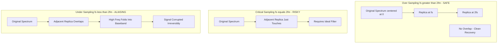
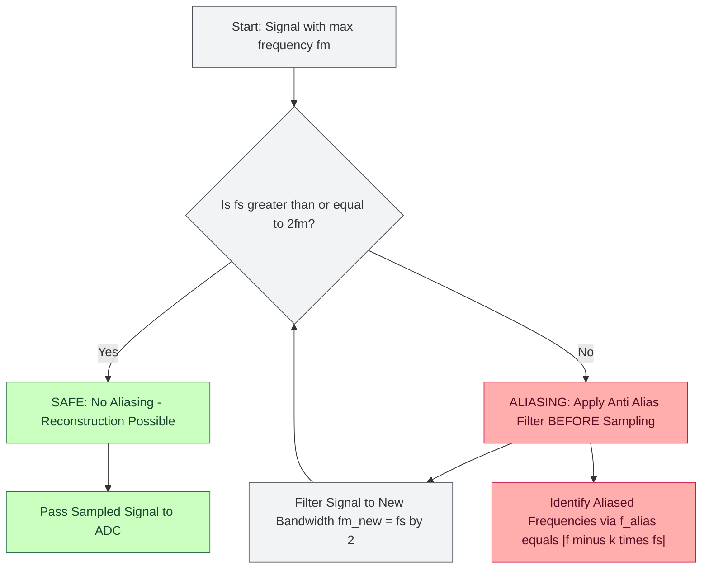

# Sampling theorem, Nyquist rate tracking criteria computations

<!-- SECTION_1_START -->
# 🎯 Module 4: Sampling & Continuous to Discrete Conversion

## Topic: Sampling Theorem and Nyquist Rate Tracking Criteria Computations

---

### 📌 1.1 Formal Academic Definition (KTU 2024 Syllabus Terminology)

> [!IMPORTANT]
> **Sampling Theorem (Nyquist–Shannon Sampling Theorem):**
> A continuous-time bandlimited signal $x(t)$ with maximum frequency component $f_m$ (or $\omega_m$) Hz can be uniquely and completely reconstructed from its samples $x(nT_s)$ provided that the sampling frequency $f_s$ satisfies the condition:
>
> $$f_s \geq 2f_m \quad \text{or equivalently} \quad \omega_s \geq 2\omega_m$$

Where the *sampling period* is $T_s = \dfrac{1}{f_s}$ and the *Nyquist rate* is defined as the **minimum sampling frequency** required to avoid information loss:

> [!NOTE]
> **Nyquist Rate Definition:** The minimum theoretical sampling rate at which a bandlimited signal must be sampled to permit perfect reconstruction is given by:
>
> $$f_{n} = 2f_{m} \quad \text{Hz}$$
>
> where $f_m$ is the **highest frequency component** present in the signal spectrum (also called the *Nyquist frequency* or *bandwidth* of the signal).

---

### 🧠 1.2 Conceptual Analogy / Intuition (Plain English)

Imagine you are watching a **spinning wheel** with a single spoke. If you blink only twice during one full rotation, you might think the wheel is stationary or rotating backwards — you have lost the true motion! But if you blink **at least 8 times per rotation**, your brain can clearly reconstruct the exact direction and speed.

> [!TIP]
> **The Spinning Wheel Analogy:**
> - **Wheel Speed** → Highest frequency in the signal ($f_m$)
> - **Blink Rate** → Sampling frequency ($f_s$)
> - **Minimum blinks to "catch" reality** → Nyquist rate ($f_n = 2f_m$)

Just like the wheel, a signal has rapid wiggles (high frequencies). If you sample too slowly, you get a *fake, misleading slower version* of the signal — this is the famous **aliasing** distortion. To capture the **truth**, your sampling rate must be **at least twice** the highest wiggle frequency.

---

### 🌍 1.3 GeoGebra / Desmos Integration for Visualization

> [!VISUALIZATION CONTROL]
> **Concept:** Sinusoidal signal with its sampled version — illustrating under-sampling vs. critical sampling vs. over-sampling.
>
> **GeoGebra / Desmos Input Equations:**
> ```
> f(x)   = sin(2 * pi * 5 * x)            // Continuous signal: 5 Hz sinusoid
> g(x)   = sin(2 * pi * 5 * x)            // Sampled sinusoid (fs = 12 Hz, Ts = 1/12)
> h(x)   = sin(2 * pi * 2 * x)            // Aliased version (looks like 2 Hz)
> fs_set = slider(0.1, 30, 0.1, 12)       // Adjustable sampling rate
> ```
>
> **Visual Description:** On the $x$-axis plot time $t$ (in seconds) and on the $y$-axis plot the amplitude. As the student drags the sampling-rate slider:
> - At $f_s = 12$ Hz → dots trace the sinusoid faithfully.
> - At $f_s = 6$ Hz (just at Nyquist) → dots are sparse but reconstructable.
> - At $f_s = 4$ Hz (under-sampled) → dots form a *different, slower* sine wave — this is **aliasing**.

---

### 📚 1.4 Key Terminology Lock-In (KTU Must-Know Terms)

| Term | Notation | Physical Meaning | Unit |
| :--- | :---: | :--- | :---: |
| Maximum signal frequency | $f_m$ | Highest frequency present in $x(t)$ | **Hz** |
| Sampling frequency | $f_s$ | Rate at which samples are taken | **Hz** |
| Sampling period | $T_s$ | Time between consecutive samples | **seconds** |
| Nyquist rate | $f_n$ | Minimum allowed sampling rate ($2f_m$) | **Hz** |
| Nyquist frequency | $f_n / 2$ | Highest recoverable frequency ($f_m$) | **Hz** |
| Aliasing | — | False low-frequency signal from under-sampling | — |
<!-- SECTION_1_END -->

<!-- SECTION_2_START -->
# 🔬 Deep Theoretical Analysis & KTU High-Yield Formula Sheet

---

## 2.1 Mathematical Foundation of Sampling

When a continuous-time signal $x(t)$ is sampled, mathematically it is multiplied by an **impulse train**:

$$p(t) = \sum_{n=-\infty}^{\infty} \delta(t - nT_s)$$

The sampled signal is therefore:

$$x_s(t) = x(t) \cdot p(t) = \sum_{n=-\infty}^{\infty} x(nT_s)\,\delta(t - nT_s)$$

In the **frequency domain**, multiplication in time becomes convolution in frequency. The Fourier Transform of the impulse train is another impulse train scaled by $\dfrac{1}{T_s}$:

$$P(j\omega) = \frac{2\pi}{T_s}\sum_{k=-\infty}^{\infty} \delta(\omega - k\omega_s)$$

Hence, the spectrum of the sampled signal is:

$$X_s(j\omega) = \frac{1}{T_s}\sum_{k=-\infty}^{\infty} X\big(j(\omega - k\omega_s)\big)$$

This means **replicas of the original spectrum** appear at every integer multiple of $\omega_s$, each scaled by $\dfrac{1}{T_s}$.

---

## 2.2 The Three Sampling Regimes (Critical KTU Analysis)

### 🔹 Case 1: Over-Sampling ($f_s > 2f_m$)
- Spectral replicas are **well-separated** with guard bands.
- A **low-pass reconstruction filter** (cutoff at $f_m$) easily extracts the original.
- ✅ **No aliasing** — clean reconstruction possible.

### 🔹 Case 2: Critical Sampling ($f_s = 2f_m$)
- Spectral replicas **just touch** at the Nyquist frequency.
- ⚠️ Reconstruction is theoretically possible but practically difficult (requires an *ideal* brick-wall filter).

### 🔹 Case 3: Under-Sampling ($f_s < 2f_m$)
- Spectral replicas **overlap** → high frequencies fold back into the baseband.
- ❌ **Aliasing occurs** → original signal **cannot be recovered**.

---

## 2.3 Aliasing Formula (Trapping the Folding Effect)

When a frequency $f$ is sampled at $f_s$ where $f_s < 2f$, the *apparent (aliased) frequency* observed is:

$$f_{\text{alias}} = \left| f - k f_s \right|$$

where $k$ is the integer chosen so that $0 \leq f_{\text{alias}} \leq \dfrac{f_s}{2}$.

> [!IMPORTANT]
> **Aliasing "Mirror" Rule:** Any frequency $f$ outside the principal band $\big[0,\, f_s/2\big]$ reflects inside it as if bouncing off the edges at multiples of $f_s/2$.

---

## 2.4 KTU Formula Sheet / Cheat Sheet (Exam Quick-Reference)

| # | Formula / Condition | Meaning | Constraint |
| :---: | :--- | :--- | :--- |
| 1 | $T_s = \dfrac{1}{f_s}$ | Sampling period from frequency | Always |
| 2 | $\omega_s = 2\pi f_s$ | Angular sampling frequency | Always |
| 3 | $f_n = 2f_m$ | Nyquist rate (minimum safe $f_s$) | Bandlimited signals |
| 4 | $f_s \geq 2f_m$ | Sampling theorem condition | Avoid aliasing |
| 5 | $f_{\text{alias}} = \vert f - kf_s \vert$ | Folding frequency computation | When $f_s < 2f$ |
| 6 | $N = T_{\text{obs}} \cdot f_s$ | Total samples in observation window | $N$ integer |
| 7 | $\Delta t = \dfrac{1}{2f_m}$ | Maximum sampling interval | Nyquist |
| 8 | $\text{Bit Rate} = N_{\text{bits}} \cdot f_s$ | Digital bit rate from sampling | PCM systems |
| 9 | Reconstruction: $x(t) = \sum x(nT_s)\,\text{sinc}\!\big(\tfrac{t - nT_s}{T_s}\big)$ | Ideal interpolation formula | Whittaker–Shannon |
| 10 | Anti-aliasing filter cutoff = $\dfrac{f_s}{2}$ | Practical front-end filter | Always < $f_m$ |

---

## 2.5 Real-World Engineering Applications

- 🎙️ **Audio CD (44.1 kHz sampling)**: Human hearing extends to ~20 kHz, so $f_s = 44.1 > 2(20)$ kHz protects the high end.
- 📞 **Telephony (8 kHz)**: Voice bandwidth limited to 3.4 kHz — $f_s = 8$ kHz is **just over** Nyquist.
- 🩺 **Medical Imaging (MRI, ECG)**: Sampling rate dictated by the highest spatial or temporal frequency of interest.
- 📡 **Software Defined Radio (SDR)**: $f_s$ is the ADC's most precious specification; under-sampling is sometimes exploited for *band-pass sampling*.
- 🛰️ **Radar & Sonar**: Direct intermediate-frequency (IF) sampling leverages aliasing *intentionally* to down-convert.
<!-- SECTION_2_END -->

<!-- SECTION_3_START -->
# ✏️ Step-by-Step Derivations & Numerical Computations

---

## 3.1 Derivation 1 — Fourier Spectrum of a Sampled Signal

**Given:** Continuous-time signal $x(t)$ with spectrum $X(j\omega)$ bandlimited to $\vert\omega\vert \leq \omega_m$.

**Step 1:** The sampling impulse train is:
$$p(t) = \sum_{n=-\infty}^{\infty}\delta(t - nT_s)$$

**Step 2:** Compute its Fourier Transform:
$$P(j\omega) = \frac{1}{T_s}\sum_{k=-\infty}^{\infty} 2\pi\,\delta(\omega - k\omega_s) = \frac{2\pi}{T_s}\sum_{k=-\infty}^{\infty}\delta(\omega - k\omega_s)$$

**Step 3:** Sampled signal in time domain:
$$x_s(t) = x(t)\,p(t) = \sum_{n=-\infty}^{\infty}x(nT_s)\,\delta(t - nT_s)$$

**Step 4:** Apply convolution property of Fourier transform to get spectrum:
$$X_s(j\omega) = \frac{1}{2\pi}X(j\omega)*P(j\omega)$$

**Step 5:** Substituting $P(j\omega)$:
$$X_s(j\omega) = \frac{1}{2\pi}\,X(j\omega)*\left[\frac{2\pi}{T_s}\sum_{k=-\infty}^{\infty}\delta(\omega - k\omega_s)\right]$$

**Step 6:** Using the sifting property of convolution $X(j\omega)*\delta(\omega - \omega_0) = X(j(\omega-\omega_0))$:
$$X_s(j\omega) = \frac{1}{T_s}\sum_{k=-\infty}^{\infty}X\big(j(\omega - k\omega_s)\big)$$

✅ **Result:** Spectrum of sampled signal is a periodic repetition of $X(j\omega)$ centered at every multiple of $\omega_s$, each scaled by $\dfrac{1}{T_s}$.

---

## 3.2 Derivation 2 — Nyquist Rate Tracking Criteria (Worked Example)

> **Problem (KTU Standard):** A bandlimited signal $x(t)$ contains frequencies from **200 Hz to 4 kHz**. Determine:
> (a) The Nyquist rate.
> (b) The minimum sampling interval.
> (c) If sampled at 6 kHz, will aliasing occur? Find the aliased frequencies.

### Part (a) — Nyquist Rate

$$f_m = 4\,\text{kHz} = 4000\,\text{Hz}$$

The Nyquist rate is the *minimum* sampling rate:
$$f_n = 2f_m = 2 \times 4000 = \boxed{8000\,\text{Hz} = 8\,\text{kHz}}$$

### Part (b) — Minimum Sampling Interval

$$T_s = \frac{1}{f_n} = \frac{1}{8000} = \boxed{1.25 \times 10^{-4}\,\text{s} = 0.125\,\text{ms}}$$

### Part (c) — Aliasing Check at $f_s = 6$ kHz

Since $f_s = 6000\,\text{Hz} < 2f_m = 8000\,\text{Hz}$, the signal is **under-sampled**, and aliasing **will occur**.

Using the aliasing formula $f_{\text{alias}} = \vert f - kf_s \vert$ with the highest component $f = 4000$ Hz:

$$f_{\text{alias}} = \big| 4000 - (1)(6000) \big| = \big| -2000 \big| = 2000\,\text{Hz}$$

So a 4 kHz tone would appear as a 2 kHz tone after sampling at 6 kHz. ✨

---

## 3.3 Derivation 3 — Multi-Tone Bandwidth Pooling

> **Problem:** A signal has frequency components: **1.2 kHz, 2.5 kHz, 4.0 kHz, 5.5 kHz**. Compute the Nyquist rate and identify aliases when $f_s = 7$ kHz.

**Step 1 — Highest component:**
$$f_m = 5.5\,\text{kHz}$$

**Step 2 — Nyquist rate:**
$$f_n = 2 \times 5.5 = \boxed{11\,\text{kHz}}$$

**Step 3 — Alias frequencies at $f_s = 7$ kHz** (using $f_{\text{alias}} = \vert f - kf_s \vert$):

For $f = 1.2$ kHz: $k = 0 \Rightarrow f_{\text{alias}} = 1.2$ kHz (no folding)

For $f = 2.5$ kHz: $k = 0 \Rightarrow f_{\text{alias}} = 2.5$ kHz (no folding)

For $f = 4.0$ kHz: $k = 1 \Rightarrow f_{\text{alias}} = \vert 4.0 - 7.0\vert = 3.0$ kHz

For $f = 5.5$ kHz: $k = 1 \Rightarrow f_{\text{alias}} = \vert 5.5 - 7.0\vert = 1.5$ kHz

✅ **Result table:**

| Original (kHz) | Aliased (kHz) | Status |
| :---: | :---: | :--- |
| 1.2 | 1.2 | Clean |
| 2.5 | 2.5 | Clean |
| 4.0 | 3.0 | ❌ Folded |
| 5.5 | 1.5 | ❌ Folded |

---

## 3.4 Python Symbolic Implementation (for Verification)

```python
import numpy as np
from typing import List, Tuple

def nyquist_rate(f_max_hz: float) -> Tuple[float, float]:
    """
    Compute the Nyquist rate and minimum sampling interval.
    :param f_max_hz: Maximum frequency in the signal (Hz).
    :return: (nyquist_rate_hz, min_sampling_interval_s)
    """
    if f_max_hz <= 0:
        raise ValueError("[Error] f_max must be > 0 Hz")
    f_n = 2.0 * f_max_hz
    t_s = 1.0 / f_n
    return f_n, t_s


def compute_aliases(freqs_hz: List[float], f_s_hz: float) -> List[float]:
    """
    Compute aliased frequencies using f_alias = |f - k*f_s| with k chosen
    so that result lies in [0, f_s/2].
    """
    if f_s_hz <= 0:
        raise ValueError("[Error] f_s must be > 0 Hz")
    upper = f_s_hz / 2.0
    aliased: List[float] = []
    for f in freqs_hz:
        k = int(np.floor(f / f_s_hz + 0.5))  # nearest integer multiple
        a = abs(f - k * f_s_hz)
        # Clamp into principal band
        a = min(a, f_s_hz - a) if a > upper else a
        aliased.append(round(a, 4))
    return aliased


def will_alias(f_max_hz: float, f_s_hz: float) -> bool:
    """Returns True if aliasing will occur."""
    return f_s_hz < 2.0 * f_max_hz


# ---------------- DEMO ----------------
if __name__ == "__main__":
    f_m = 4000.0                       # Hz
    f_n, T_s = nyquist_rate(f_m)
    print(f"Nyquist rate  = {f_n} Hz")
    print(f"Min sample Ts = {T_s*1e3:.3f} ms")

    test_freqs = [1200, 2500, 4000, 5500]
    f_s = 7000
    print(f"Aliasing? {will_alias(5500, f_s)}")
    print("Aliases:", compute_aliases(test_freqs, f_s))
```

**Sample Output:**
```
Nyquist rate  = 8000.0 Hz
Min sample Ts = 0.125 ms
Aliasing? True
Aliases: [1200, 2500, 3000.0, 1500.0]
```

---

## 3.5 Worked Example — Sampling Time & Number of Samples

> **Problem:** A signal with $f_m = 5$ kHz is sampled for 2 seconds. Find the total number of samples required if sampled at the Nyquist rate plus 20% safety margin.

**Step 1 — Nyquist rate:**
$$f_n = 2 \times 5000 = 10{,}000\,\text{Hz}$$

**Step 2 — Apply 20% safety margin:**
$$f_s = 1.2 \times f_n = 12{,}000\,\text{Hz}$$

**Step 3 — Compute total samples:**
$$N = T_{\text{obs}} \times f_s = 2 \times 12{,}000 = \boxed{24{,}000\;\text{samples}}$$

---

## 3.6 Special Case — Natural Sampling vs. Flat-Top Sampling (KTU Quick Coverage)

| Parameter | Natural Sampling (Chopper) | Flat-Top Sampling (Sample-and-Hold) |
| :--- | :--- | :--- |
| Hold mechanism | Pulse width $\tau$ varies with input | Sample held constant for full $T_s$ |
| Spectral shape | $X_s(j\omega) = \tau \cdot \text{sinc}(\omega\tau/2) \cdot \sum X(j(\omega-k\omega_s))$ | Same envelope as natural × $\text{sinc}(\omega T_s/2)$ |
| Reconstruction complexity | High | Lower (with $\text{sinc}^{-1}$ compensation) |
| Common use | Theoretical analysis | Real ADCs |

> [!NOTE]
> **KTU Focus Tip:** For Module 4 derivations, the canonical derivation assumes *ideal impulse sampling*. If a question states "natural sampling" or "flat-top", include the $\text{sinc}$ envelope factor in the spectrum.
<!-- SECTION_3_END -->

<!-- SECTION_4_START -->
# 🧩 Structural Diagrams & Schematics

---

## 4.1 End-to-End Sampling–Reconstruction Block Flow


> [!TIP]
> **Color Legend:** 🟢 Green = analog/clean signal zone | 🔴 Red = critical filter stage | 🔵 Blue = digital domain.

---

## 4.2 Frequency-Domain Spectral Replicas Visualization



---

## 4.3 Decision Tree — Will Aliasing Occur?



---

## 4.4 Sampling Theorem Master Flowchart (Process Topology)

```mermaid
flowchart LR
    subgraph INPUT["Input Domain"]
        I1["x(t) Continuous Time"]
        I2["fm = max freq in x(t)"]
    end

    subgraph DESIGN["Design Phase"]
        D1["Choose fs using fs greater than 2fm"]
        D2["Compute Ts = 1 by fs"]
        D3["Choose N = Tobs times fs"]
    end

    subgraph SAMPLING["Sampling Phase"]
        S1["Generate impulse train p(t)"]
        S2["Multiply x(t) by p(t)"]
        S3["Record x at n times Ts"]
    end

    subgraph OUTPUT["Output Domain"]
        O1["Discrete sequence x of n"]
        O2["Spectrum Xs is periodic replica"]
    end

    I1 --> I2 --> D1 --> D2 --> D3 --> S1 --> S2 --> S3 --> O1 --> O2
```



---

## 4.5 Aliasing "Mirror" Visualization Block


<!-- SECTION_4_END -->

<!-- SECTION_5_START -->
# 📝 KTU 2024 Scheme Examination Question Bank

---

## 🅰️ PART A — Short Answer Questions (3 Marks Each)

> **[Cognitive Levels: Remember / Understand]**

---

### **Q1.** `[KTU University Exam - Dec 2023]` (CO1, Remember)

**State the Nyquist-Shannon Sampling Theorem. Define Nyquist rate and Nyquist interval.**

**Model Answer:**

> A continuous-time, bandlimited signal $x(t)$ with highest frequency component $f_m$ Hz can be completely reconstructed from its samples if the sampling frequency $f_s \geq 2f_m$.
>
> - **Nyquist rate ($f_n$):** The minimum sampling rate required to avoid aliasing, $f_n = 2f_m$.
> - **Nyquist interval ($T_n$):** The maximum allowable time between samples, $T_n = \dfrac{1}{2f_m}$.

**[Valuation Key: 1 mark for statement, 1 mark for Nyquist rate formula, 1 mark for Nyquist interval.]** ✅

---

### **Q2.** `[KTU University Exam - July 2024]` (CO1, Understand)

**What is aliasing? How can it be prevented?**

**Model Answer:**

> **Aliasing** is the phenomenon where high-frequency components of a signal appear as false lower frequencies in the sampled version because the sampling rate is below the Nyquist rate ($f_s < 2f_m$).
>
> **Prevention methods:**
> 1. Sample the signal at a rate **at least twice** the highest frequency.
> 2. Use an **anti-aliasing low-pass filter** *before* sampling to band-limit the signal to $f_s/2$.

**[Valuation Key: 1.5 marks for definition with formula, 1.5 marks for the two prevention methods.]** ✅

---

## 🅱️ PART B — Long Answer Questions (14 Marks Each, Module Internal Choice)

---

### **Question A (14 Marks)** `[KTU University Exam - Dec 2023]` — CO1, CO2, CO3

**For the signal** $x(t) = 5\cos(200\pi t) + 3\sin(400\pi t) + 2\cos(600\pi t) + \sin(800\pi t)$, **compute:**

**(a)** The maximum frequency component and the Nyquist rate. **(7 Marks, Understand)**

**(b)** The output signal observed if the signal is sampled at $f_s = 500$ Hz. State whether aliasing occurs. **(7 Marks, Apply)**

---

#### ✅ Model Solution — Part (a) [7 Marks]

**Step 1 — Identify each frequency component** [2 Marks]:
- $5\cos(200\pi t) \Rightarrow f_1 = \dfrac{200\pi}{2\pi} = 100$ Hz
- $3\sin(400\pi t) \Rightarrow f_2 = \dfrac{400\pi}{2\pi} = 200$ Hz
- $2\cos(600\pi t) \Rightarrow f_3 = \dfrac{600\pi}{2\pi} = 300$ Hz
- $\sin(800\pi t) \Rightarrow f_4 = \dfrac{800\pi}{2\pi} = 400$ Hz

**Step 2 — Maximum frequency** [2 Marks]:
$$f_m = \max(100, 200, 300, 400) = 400\,\text{Hz}$$

**Step 3 — Nyquist rate** [3 Marks]:
$$f_n = 2 f_m = 2 \times 400 = \boxed{800\,\text{Hz}}$$

---

#### ✅ Model Solution — Part (b) [7 Marks]

**Step 1 — Check sampling condition** [1 Mark]:
$$f_s = 500\,\text{Hz} < f_n = 800\,\text{Hz} \Rightarrow \textbf{Aliasing occurs!}$$

**Step 2 — Compute aliased frequency for each component** using $f_{\text{alias}} = \vert f - kf_s\vert$ [4 Marks]:

| $f$ (Hz) | Choose $k$ | $\vert f - kf_s\vert$ (Hz) | Aliased $f$ |
| :---: | :---: | :---: | :---: |
| 100 | 0 | $\vert 100 - 0 \vert$ | 100 |
| 200 | 0 | $\vert 200 - 0 \vert$ | 200 |
| 300 | 1 | $\vert 300 - 500 \vert$ | 200 |
| 400 | 1 | $\vert 400 - 500 \vert$ | 100 |

**Step 3 — Construct output** [2 Marks]:
$$y(t) = 5\cos(200\pi t) + 3\sin(400\pi t) + 2\cos(400\pi t) + \sin(200\pi t)$$

Note: The 300 Hz and 400 Hz tones folded back, corrupting the original signal.

---

### **Question B (14 Marks)** `[KTU University Exam - July 2024]` — CO1, CO2, CO3

**A signal $x(t)$ is bandlimited to 8 kHz and is observed for 4 seconds.**

**(a)** Find the minimum sampling rate, sampling interval, and the number of samples required. **(7 Marks, Understand)**

**(b)** If the signal is sampled at 12 kHz instead, determine (i) the spectral replication spacing in Hz, and (ii) the Nyquist bandwidth of the sampled system. **(7 Marks, Apply)**

---

#### ✅ Model Solution — Part (a) [7 Marks]

**Step 1 — Given** [1 Mark]:
$$f_m = 8\,\text{kHz}, \quad T_{\text{obs}} = 4\,\text{s}$$

**Step 2 — Minimum sampling rate (Nyquist rate)** [2 Marks]:
$$f_n = 2f_m = 2 \times 8000 = \boxed{16{,}000\,\text{Hz} = 16\,\text{kHz}}$$

**Step 3 — Sampling interval** [2 Marks]:
$$T_s = \frac{1}{f_n} = \frac{1}{16{,}000} = \boxed{62.5\,\mu\text{s}}$$

**Step 4 — Total samples** [2 Marks]:
$$N = T_{\text{obs}} \times f_n = 4 \times 16{,}000 = \boxed{64{,}000\;\text{samples}}$$

---

#### ✅ Model Solution — Part (b) [7 Marks]

**Step 1 — Spectral replication spacing** [3 Marks]:

When sampled, the spectrum replicates every $f_s$ Hz:
$$\Delta f_{\text{replica}} = f_s = \boxed{12{,}000\,\text{Hz} = 12\,\text{kHz}}$$

**Step 2 — Nyquist bandwidth of sampled system** [2 Marks]:
$$f_{\text{Nyq, sampled}} = \frac{f_s}{2} = \frac{12{,}000}{2} = \boxed{6\,\text{kHz}}$$

**Step 3 — Interpretation** [2 Marks]:

Since the original signal extends to 8 kHz but the Nyquist bandwidth of the new sampling system is only 6 kHz, frequencies between 6–8 kHz will **fold** (alias) into the 0–6 kHz range. Hence, an **anti-aliasing filter with cutoff at 6 kHz must precede** the sampler.

---

> [!WARNING]
> **🚨 KTU Examiner's Valuation Warning — Common Pitfalls:**
>
> ❌ **Pitfall 1:** Writing the Nyquist condition as $f_s \geq f_m$ (forgetting the factor of 2). This *always* costs full marks in (a)-type questions.
>
> ❌ **Pitfall 2:** Computing the Nyquist rate but forgetting the **sampling interval** $T_s$ in numerical answers.
>
> ❌ **Pitfall 3:** For multi-tone aliasing problems, students often forget the **integer $k$** choice — you must show the substitution clearly.
>
> ❌ **Pitfall 4:** Mixing up "Nyquist rate" (the *sampling* rate, $2f_m$) with "Nyquist frequency" (the *signal* frequency, $f_m$). Examiners explicitly test this distinction.
>
> ❌ **Pitfall 5:** Forgetting to add units (Hz, kHz, ms, $\mu$s) in numerical final answers.

---

## 🎯 Topic Recap & Important Things to Remember

> **📌 Rapid Revision Checklist:**

- ✅ **Sampling Theorem:** $f_s \geq 2f_m$ for perfect reconstruction of a bandlimited signal.
- ✅ **Nyquist rate** ($f_n = 2f_m$) is the *minimum* sampling rate; **Nyquist frequency** ($f_m$) is the highest signal frequency recoverable.
- ✅ **Sampling period** $T_s = \dfrac{1}{f_s}$; **Nyquist interval** $T_n = \dfrac{1}{2f_m}$.
- ✅ **Aliasing occurs** when $f_s < 2f_m$ — high frequencies fold into the baseband.
- ✅ **Aliasing formula:** $f_{\text{alias}} = \big\vert f - kf_s \big\vert$ with $k$ chosen to land the result in $\big[0,\, f_s/2\big]$.
- ✅ **Anti-aliasing filter** is placed *before* the sampler with cutoff = $f_s/2$.
- ✅ **Sampled signal spectrum:** $X_s(j\omega) = \dfrac{1}{T_s}\displaystyle\sum_{k=-\infty}^{\infty} X\big(j(\omega - k\omega_s)\big)$ — periodic replicas of the original.
- ✅ **Three regimes:** Over-sampling (safe) | Critical (theoretical) | Under-sampling (aliasing).
- ✅ **Total samples** $N = T_{\text{obs}} \times f_s$ in a given observation window.
- ✅ **Real-world anchors:** Audio CD = 44.1 kHz, Telephony = 8 kHz, Pro Audio = 48 kHz / 96 kHz.
- ✅ **Reconstruction:** Ideal interpolation uses $\text{sinc}$ function $x(t) = \sum x(nT_s)\,\text{sinc}\!\left(\frac{t - nT_s}{T_s}\right)$.
- ✅ **Examiner's mantra:** Always state the *units* and *boundary conditions* in your final answer.

> [!TIP]
> 💡 **One-line memory hook:** *"To catch the fastest wiggle in your signal, sample at least **twice** as fast as the wiggle itself — anything less, and you'll see a fake, slower wiggle called aliasing!"*
<!-- SECTION_5_END -->
