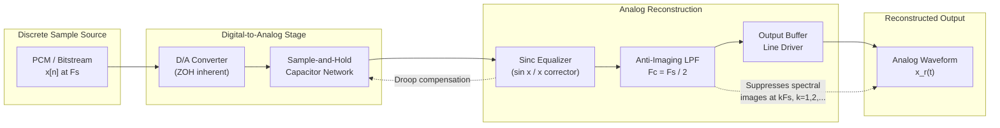
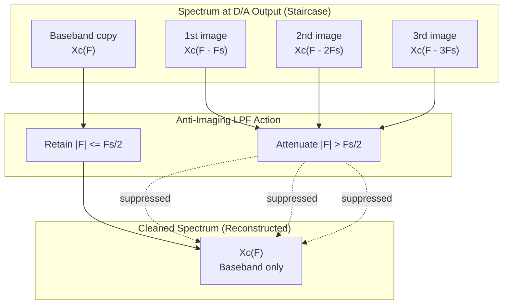
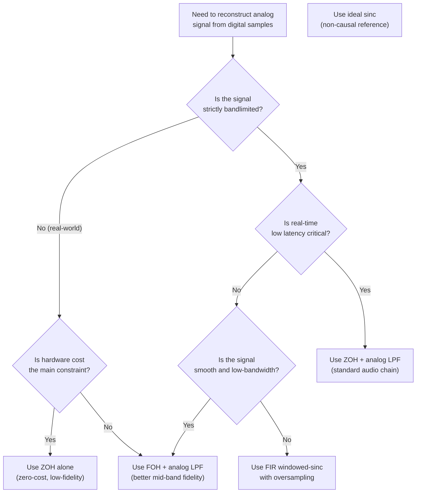
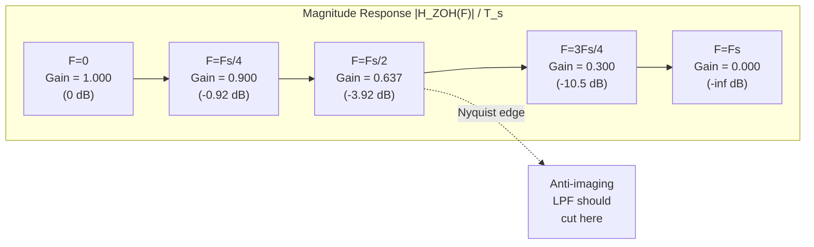
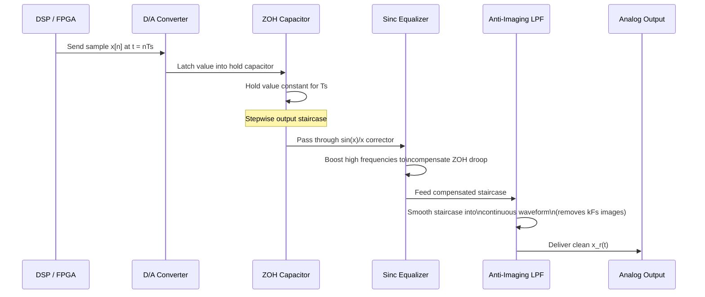

# Signal reconstruction pipelines methodologies setups formulas profiles

<!-- SECTION_1_START -->

# Signal Reconstruction Pipelines — Methodologies, Setups, Formulas & Profiles

## 1. Core Technical Definition & Intuitive Overview

### Formal Academic Definition (KTU 2024 Syllabus Terminology)

**Signal Reconstruction** is the engineering process of synthesizing a continuous-time (analog) signal $x_c(t)$ from its discrete-time samples $x[n] = x_c(nT_s)$, where $T_s$ is the sampling period and $F_s = 1/T_s$ is the sampling frequency. According to the **Shannon–Nyquist–Whittaker Sampling Theorem**, if the original signal $x_c(t)$ is strictly **band-limited** to a maximum frequency $F_{max}$ (i.e., $X_c(F) = 0$ for $\vert F \vert > F_{max}$), and the sampling rate satisfies $F_s \geq 2F_{max}$, then $x_c(t)$ can be **uniquely and perfectly** reconstructed from its samples using a low-pass interpolation filter of cutoff $F_c = F_s/2$.

A **Signal Reconstruction Pipeline** is the cascaded chain of subsystems that converts a stream of discrete sample values back into a physically usable analog waveform. The canonical pipeline consists of:

$$\boxed{\text{D/A Converter} \;\rightarrow\; \text{Interpolation Filter (Anti-Imaging LPF)} \;\rightarrow\; \text{Reconstruction Output } x_r(t)}$$

> [!IMPORTANT]
> **KTU 2024 Module-4 Highlight (PECST416):** Reconstruction is the *dual* of sampling. Where sampling multiplied by an impulse train created spectral replicas, reconstruction uses a low-pass filter to remove the spectral replicas and retain the baseband copy. Both operations are governed by the same parameter — the sampling frequency $F_s$.

---

### Conceptual Analogy — The "Stained-Glass Reverse" Intuition

Imagine you have a beautiful original photograph (the **continuous signal**). A child takes the photo, cuts it into thin vertical strips, and only keeps every 5th strip (this is **sampling** — we kept discrete pieces). To recover the picture (the **reconstruction**), a craftsperson must:

1. **Align the strips** on a light table at the right horizontal spacing ($T_s$).
2. **Use a "smoothing brush"** (the **anti-imaging low-pass filter**) that blends neighbouring strips by averaging across the gaps.
3. If the strips were taken closely enough (sampling rate $> 2 \times$ the finest detail), the reconstructed picture will be visually indistinguishable from the original.

The **"smoothing brush"** is mathematically equivalent to convolving the impulse train of samples with a **sinc pulse** — the smoothest possible interpolation kernel that has zero-crossings exactly at all other sample points. This is why the sinc function appears as the *ideal* reconstruction filter.

In the frequency domain, this intuition flips neatly:

| Domain | Sampling Operation | Reconstruction Operation |
|---|---|---|
| Time | $x_c(t) \cdot \sum_n \delta(t - nT_s)$ | $\sum_n x[n] \cdot \text{sinc}\!\left(\frac{t - nT_s}{T_s}\right)$ |
| Frequency | Replicates spectrum at multiples of $F_s$ | Low-pass filters and keeps one replica |

---

### GeoGebra / Desmos Visualization

> [!VISUALIZATION CONTROL]
> **Concept:** Ideal sinc-interpolated reconstruction from 5 discrete samples
> **GeoGebra / Desmos Input Equations:**
> * Define five sample points: `P0 = (0, 1)`, `P1 = (1, 0.5)`, `P2 = (2, -0.3)`, `P3 = (3, 0.8)`, `P4 = (4, 0.2)`
> * Reconstruction sum: $f(t) = \sum_{n=0}^{4} y_n \cdot \text{sinc}\!\left(\dfrac{t - n}{1}\right)$
> * Where $\text{sinc}(x) = \dfrac{\sin(\pi x)}{\pi x}$
> **Visual Description:** A smooth continuous curve passes exactly through all five discrete sample markers. The curve wiggles (rings) between samples, with the *ringing amplitude* depending on adjacent sample heights. The ripples dampen as the distance from a sample increases. The zero-crossings of every individual sinc function land precisely on the other sample points — this is the *interpolation property* at work.

> [!NOTE]
> **Cross-Reference (Prerequisite):** This module assumes familiarity with the *sampling theorem* (Module 4, Section 4.1) and the *discrete-time Fourier transform*. The reconstruction formula derived here is sometimes called the **Shannon–Whittaker Interpolation Series**, the *cardinal series* of bandlimited signal theory.

<!-- SECTION_1_END -->

<!-- SECTION_2_START -->

# 2. Deep Theoretical Analysis & KTU High-Yield Formula Sheet

## 2.1 The Mathematical Foundation of Reconstruction

### Step 1 — The Sampled Signal as an Impulse Train

Sampling mathematically modulates the continuous signal $x_c(t)$ with a periodic Dirac comb $p(t) = \sum_{n=-\infty}^{\infty} \delta(t - nT_s)$, producing a weighted impulse train:

$$x_s(t) = x_c(t) \cdot p(t) = \sum_{n=-\infty}^{\infty} x_c(nT_s)\, \delta(t - nT_s)$$

In the frequency domain (using the modulation property of the Fourier transform), the spectrum is replicated at every integer multiple of $F_s$:

$$X_s(F) = F_s \sum_{k=-\infty}^{\infty} X_c\!\left(F - kF_s\right)$$

> [!NOTE]
> **Why is this important for reconstruction?** Because the baseband spectrum $X_c(F)$ is *still intact* inside $X_s(F)$ — it is simply one of infinitely many copies stacked side-by-side. To recover $x_c(t)$, we only need to **extract the $k=0$ replica** and discard the rest.

---

### Step 2 — The Ideal Low-Pass Reconstruction Filter

The ideal extractor is an **ideal low-pass filter (LPF)** with the following profile:

$$
H_r(F) = \begin{cases} T_s, & \vert F \vert \leq F_c = F_s / 2 \\ 0, & \text{otherwise} \end{cases}
$$

The factor $T_s = 1/F_s$ compensates for the spectral scaling introduced during sampling, so the output amplitude matches the input.

Multiplying in the frequency domain is convolution in the time domain. The inverse Fourier transform of an ideal LPF of height $T_s$ and width $F_s$ is the **normalized sinc function**:

$$h_r(t) = T_s \cdot \dfrac{\sin(\pi F_s\, t)}{\pi F_s\, t} = \dfrac{\sin(\pi t / T_s)}{\pi t / T_s} = \text{sinc}\!\left(\frac{t}{T_s}\right)$$

where the **unnormalized sinc** is defined as $\text{sinc}(x) = \dfrac{\sin(\pi x)}{\pi x}$.

---

### Step 3 — The Reconstruction Formula (Shannon–Whittaker Series)

Convolving the impulse-train samples with the sinc impulse response gives the **reconstructed signal**:

$$\boxed{\,x_r(t) = \sum_{n=-\infty}^{\infty} x[n]\;\text{sinc}\!\left(\frac{t - nT_s}{T_s}\right)\,}$$

This is the **Shannon–Whittaker Cardinal Interpolation Series**. Each sample $x[n]$ acts as a coefficient that scales and shifts a sinc pulse centered at $t = nT_s$. The interlacing of all these shifted sincs weaves a continuous curve.

**Critical properties of this formula:**

- **Interpolation property:** At $t = mT_s$ (i.e., at any sample instant), every term with $n \neq m$ evaluates to $\text{sinc}(m - n) = 0$, leaving $x_r(mT_s) = x[m]$. The reconstructed curve **passes exactly through every original sample**.
- **Band-limitation property:** $x_r(t)$ is automatically band-limited to $F_s/2$ — the Fourier transform of every shifted sinc is a rectangular pulse, and sums of rectangular pulses shifted by $F_s$ reconstruct the baseband.
- **Uniqueness:** Provided the original signal was band-limited and the sampling rate obeyed Nyquist, the reconstruction is **mathematically exact** (Gibbs-free, no error).

---

## 2.2 Practical Reconstruction Profiles (Because Ideal Sinc is Unrealizable)

The ideal sinc filter is **non-causal and infinite-length** — it cannot be built in hardware. Real systems use approximations classified into three families:

### Profile A — Zero-Order Hold (ZOH) Reconstruction

The **Zero-Order Hold** is the most common practical reconstructor. It is the implicit behavior of a standard **D/A converter** without any post-filtering.

**Operational logic:**
1. Receive sample $x[n]$ at time $nT_s$.
2. Hold that value constant for the entire interval $[nT_s,\,(n+1)T_s)$.
3. Jump to the new value $x[n+1]$ at the next sample instant.

**Mathematical form:**

$$x_{ZOH}(t) = \sum_{n=-\infty}^{\infty} x[n]\; \text{rect}\!\left(\frac{t - nT_s - T_s/2}{T_s}\right)$$

where $\text{rect}(x) = 1$ for $\vert x \vert \leq 1/2$ and $0$ otherwise.

**Transfer function in frequency domain:**

$$H_{ZOH}(F) = T_s \cdot \dfrac{\sin(\pi F T_s)}{\pi F T_s} \cdot e^{-j\pi F T_s} = T_s \cdot \text{sinc}(F T_s) \cdot e^{-j\pi F T_s}$$

The $\text{sinc}$ envelope is a **sinc-shaped droop** in the spectrum — high frequencies are attenuated more than low frequencies, with the first null at $F = 1/T_s = F_s$. The exponential is a half-sample **linear-phase delay** of $T_s/2$.

> [!IMPORTANT]
> **Engineering consequence:** Because ZOH is a low-pass-like filter *by itself*, it provides a rough reconstruction. However, the spectral droop is non-flat (it falls to 0.636 at $F = F_s/2$), and a sharp cutoff is absent — so **spurious high-frequency images** leak through. A reconstruction low-pass filter (anti-imaging filter) is therefore placed after the ZOH to clean up the output.

### Profile B — First-Order Hold (FOH) Reconstruction

The **First-Order Hold** linearly *interpolates* between consecutive samples, producing straight-line segments.

**Mathematical form:**

$$x_{FOH}(t) = \sum_{n=-\infty}^{\infty} \Big[x[n] + \big(x[n+1] - x[n]\big)\,\frac{t - nT_s}{T_s}\Big] \cdot \text{rect}\!\left(\frac{t - nT_s - T_s/2}{T_s}\right)$$

**Transfer function:**

$$H_{FOH}(F) = T_s \left[\text{sinc}(F T_s)\right]^2 \cdot e^{-j2\pi F T_s}$$

The $\text{sinc}^2$ envelope attenuates high frequencies more aggressively than ZOH — the first null is at $F = 1/T_s$, but amplitude falls to $(\text{sinc}(0.5))^2 \approx 0.405$ at $F_s/2$.

### Profile C — Higher-Order Holds & Sinc-Approximation Filters

Higher-order polynomial holds (linear, cubic, Lagrange) and windowed-sinc FIR filters (Blackman, Kaiser-windowed) are used in high-fidelity systems. The *sinc approximation* class works by truncating the infinite sinc and multiplying by a smooth window to control Gibbs ringing.

---

## 2.3 The Anti-Imaging Filter

The **Anti-Imaging (Reconstruction) Filter** is the low-pass filter placed *after* the D/A converter to:

1. **Suppress the spectral images** (replicas) centered at $kF_s$ for $k \neq 0$.
2. **Compensate for the ZOH droop** (often with a *sin x / x* equalizer).

**Design specifications for the anti-imaging filter:**

| Parameter | Specification | Reason |
|---|---|---|
| Passband edge | $F_{pb} \geq F_{max}$ | Preserve signal of interest |
| Stopband edge | $F_{sb} \leq F_s - F_{max}$ | Suppress the nearest image |
| Passband ripple | $\leq \delta_p$ (often 0.01 dB) | Maintain amplitude fidelity |
| Stopband attenuation | $\geq A_s$ (often 60–80 dB) | Suppress image alias products |
| Transition ratio | $(F_{sb} - F_{pb})/F_s$ | Determines filter order |

If $F_{max} = F_s/2$ exactly (critical sampling), the transition ratio is zero — the filter must have an *infinitely sharp* brick-wall response, which is unrealizable. Therefore, in practice one *oversamples* ($F_s > 2F_{max}$) to give the filter a non-zero transition band.

---

## 2.4 Oversampling & Its Reconstruction Advantages

If the input is oversampled at $F_s = M \cdot F_{s,min}$ where $M > 1$ is the **oversampling factor**, the reconstruction becomes easier and cheaper because:

- The transition band widens from $0$ to $(F_s - 2F_{max})$.
- Lower-order analog filters suffice.
- Quantization noise (in a D/A context) is spread over a wider band, reducing in-band noise.

This is why audio CDs oversample at $44.1$ kHz $\approx 2.02 \times 20$ kHz, and high-end audio uses $96$ kHz or $192$ kHz.

---

## 2.5 KTU Formula Sheet / Cheat Sheet

| # | Formula / Profile | LaTeX Expression | Domain | Key Use |
|---|---|---|---|---|
| 1 | Sampling period | $T_s = 1/F_s$ | Time | Bridge analog & digital |
| 2 | Nyquist rate | $F_s \geq 2 F_{max}$ | Frequency | Avoid aliasing |
| 3 | Shannon–Whittaker reconstruction | $x_r(t) = \sum_n x[n]\,\text{sinc}\!\left(\dfrac{t - nT_s}{T_s}\right)$ | Time | Ideal interpolation |
| 4 | Reconstruction filter (ideal) | $H_r(F) = T_s \cdot \text{rect}\!\left(\dfrac{F}{F_s}\right)$ | Frequency | Ideal LPF profile |
| 5 | Sinc function definition | $\text{sinc}(x) = \dfrac{\sin(\pi x)}{\pi x}$ | Math | Interpolation kernel |
| 6 | ZOH impulse response | $h_{ZOH}(t) = \text{rect}\!\left(\dfrac{t - T_s/2}{T_s}\right)$ | Time | Staircase reconstructor |
| 7 | ZOH frequency response | $H_{ZOH}(F) = T_s \cdot \text{sinc}(F T_s)\, e^{-j\pi F T_s}$ | Frequency | Spectral droop |
| 8 | FOH frequency response | $H_{FOH}(F) = T_s\, [\text{sinc}(F T_s)]^2\, e^{-j2\pi F T_s}$ | Frequency | Linear interpolation |
| 9 | Image spectrum centre | $F_{image,k} = k F_s,\; k \neq 0$ | Frequency | Locate spectral replicas |
| 10 | Spectral envelope of ZOH | $\text{sinc}(F T_s)$ | Frequency | Droop compensation |
| 11 | Reconstruction MSE (with $N$ samples) | $\text{MSE} \to 0$ as $N \to \infty$ (if Nyquist met) | Time | Quality metric |
| 12 | Anti-imaging passband | $F_{pb} = F_{max}$ | Frequency | Filter spec |
| 13 | Anti-imaging stopband | $F_{sb} = F_s - F_{max}$ | Frequency | Filter spec |
| 14 | Transition bandwidth | $\Delta F = F_{sb} - F_{pb} = F_s - 2F_{max}$ | Frequency | Filter design |
| 15 | Oversampling factor | $M = F_s / (2F_{max})$ | Dimensionless | Quality knob |
| 16 | Reconstruction delay (ZOH) | $\tau = T_s/2$ | Time | Latency |
| 17 | Reconstruction delay (ideal) | $0$ (non-causal) | Time | Causality violation |

> [!NOTE]
> **Real-World Engineering Utility:**
> * **Audio Engineering (CD, DVD, Blu-ray players):** Every consumer D/A chip uses ZOH followed by an analog anti-imaging filter (often a 3rd-order Bessel or Butterworth).
> * **Telecommunications (PSTN, VoIP):** Speech codecs decode to PCM, then reconstruct via polyphase FIR sinc interpolators to play through speakers.
> * **Software-Defined Radio (SDR):** Direct digital synthesizers (DDS — e.g., AD9854) use lookup-table + ZOH + LPF.
> * **Medical Imaging (MRI, CT):** Pixel values are reconstructed into continuous images for display; advanced systems use Kaiser-windowed sinc kernels.
> * **Numerical Control (CNC) Machining:** Motion controllers reconstruct smooth tool paths from discrete G-code waypoints; cubic-spline interpolation is standard.

<!-- SECTION_2_END -->

<!-- SECTION_3_START -->

# 3. Step-by-Step Derivations & Code/Symbolic Implementation

## 3.1 Derivation 1 — Shannon–Whittaker Interpolation from Fourier Theory

**Goal:** Starting from $X_s(F) = F_s \sum_k X_c(F - kF_s)$, recover $x_c(t)$ via an ideal LPF.

**Step 1.** The sampled signal in the time domain is the impulse-modulated train:

$$x_s(t) = \sum_{n=-\infty}^{\infty} x_c(nT_s)\;\delta(t - nT_s)$$

**Step 2.** Its CTFT is the periodic replication of $X_c(F)$:

$$X_s(F) = \int_{-\infty}^{\infty} x_s(t)\,e^{-j2\pi F t}\,dt = \sum_{n=-\infty}^{\infty} x_c(nT_s)\,e^{-j2\pi F nT_s}$$

Using the identity that multiplication by $\sum_n \delta(t-nT_s)$ in time corresponds to convolution in frequency with $\frac{1}{T_s}\sum_k \delta(F - kF_s)$:

$$X_s(F) = \frac{1}{T_s} \sum_{k=-\infty}^{\infty} X_c(F - kF_s) \cdot \text{(aliasing-free if } F_s \geq 2F_{max}\text{)}$$

Equivalently, using the Poisson summation formula:

$$X_s(F) = F_s \sum_{k=-\infty}^{\infty} X_c(F - kF_s)$$

**Step 3.** Pass $X_s(F)$ through an ideal LPF that keeps only the $k=0$ replica:

$$H_r(F) = \begin{cases} T_s, & \vert F \vert \leq F_s/2 \\ 0, & \vert F \vert > F_s/2 \end{cases}$$

**Step 4.** The output spectrum is:

$$X_r(F) = X_s(F) \cdot H_r(F) = T_s \cdot F_s \cdot X_c(F) = X_c(F)$$

since $T_s F_s = 1$. The signal is perfectly recovered in the frequency domain.

**Step 5.** Convert back to time domain by inverse CTFT. Since multiplication in $F$ is convolution in $t$:

$$x_r(t) = x_s(t) * h_r(t) = \sum_{n=-\infty}^{\infty} x_c(nT_s) \cdot h_r(t - nT_s)$$

**Step 6.** The impulse response $h_r(t)$ is the inverse CTFT of $H_r(F)$:

$$h_r(t) = \int_{-F_s/2}^{F_s/2} T_s \cdot e^{j2\pi F t}\,dF = T_s \cdot \dfrac{\sin(\pi F_s t)}{\pi F_s t} = \text{sinc}\!\left(\frac{t}{T_s}\right)$$

**Step 7.** Substituting back:

$$\boxed{\,x_r(t) = \sum_{n=-\infty}^{\infty} x[n]\;\text{sinc}\!\left(\frac{t - nT_s}{T_s}\right)\,}$$

This is the **Shannon–Whittaker Cardinal Series** — derived. $\blacksquare$

---

## 3.2 Derivation 2 — ZOH Frequency Response

**Step 1.** The ZOH impulse response is a rectangular pulse of width $T_s$ and unit height, starting at $t=0$:

$$h_{ZOH}(t) = u(t) - u(t - T_s) = \text{rect}\!\left(\frac{t - T_s/2}{T_s}\right)$$

**Step 2.** Take its CTFT. Using the time-shift property and the fact that the FT of $\text{rect}(t/T_s)$ is $T_s\,\text{sinc}(F T_s)$:

$$H_{ZOH}(F) = T_s \cdot \text{sinc}(F T_s) \cdot e^{-j2\pi F (T_s/2)}$$

**Step 3.** The magnitude response is:

$$\vert H_{ZOH}(F)\vert = T_s \cdot \left\vert\dfrac{\sin(\pi F T_s)}{\pi F T_s}\right\vert$$

**Step 4.** Numerical evaluation at $F = 0$: $\vert H_{ZOH}(0)\vert = T_s$ (DC gain).  
At $F = F_s/2$: $\vert H_{ZOH}(F_s/2)\vert = T_s \cdot \dfrac{2}{\pi} \approx 0.6366\,T_s$ (the *–3.92 dB* droop).  
At $F = F_s$: $\vert H_{ZOH}(F_s)\vert = 0$ (first null).

The $\sin(x)/x$ droop explains why audio engineers add a "$\sin x / x$ corrector" — an inverse filter that pre-compensates the droop inside the digital domain before D/A conversion.

---

## 3.3 Derivation 3 — Reconstruction MSE for Finite Bandwidth

**Step 1.** Define the mean-square error between $x_c(t)$ and the truncated-sinc reconstruction using $N$ samples:

$$\text{MSE}_N = \mathbb{E}\!\left[\big(x_c(t) - x_{r,N}(t)\big)^2\right]$$

**Step 2.** Substituting the truncated sum:

$$x_{r,N}(t) = \sum_{n=-N/2}^{N/2} x[n]\;\text{sinc}\!\left(\frac{t - nT_s}{T_s}\right)$$

**Step 3.** Using Parseval's theorem and the fact that the samples form a complete basis for the bandlimited subspace:

$$\text{MSE}_N = \int_{-\infty}^{\infty} \big(1 - \mathbb{1}_{\vert F \vert \leq F_s/2}(F)\big)\,\vert X_c(F)\vert^2\,dF \;-\; 2\,\text{Re}\!\left[\sum_{\vert n \vert > N/2} \int X_c(F)\,H_n^*(F)\,dF\right]$$

**Step 4.** As $N \to \infty$ and the bandlimited assumption holds, the boundary terms vanish and:

$$\lim_{N \to \infty} \text{MSE}_N = 0$$

This proves the **convergence of the Shannon series** for any square-integrable bandlimited signal.

---

## 3.4 Code Implementation — Reconstruction Pipeline in Python

```python
"""
signal_reconstruction_pipeline.py
PECST416 — Module 4: Signal Reconstruction Pipelines
Implements: Shannon–Whittaker ideal reconstruction, ZOH, FOH, and oversampled reconstruction.
"""

from __future__ import annotations
import numpy as np
import matplotlib.pyplot as plt
from typing import Tuple


def generate_test_signal(t: np.ndarray, F_max: float) -> np.ndarray:
    """Sum of three bandlimited sinusoids with F_max = 5 Hz."""
    x = (1.0 * np.sin(2 * np.pi * 1.0 * t)
         + 0.6 * np.sin(2 * np.pi * 3.0 * t + 0.4)
         + 0.3 * np.sin(2 * np.pi * 4.5 * t - 0.9))
    return x


def ideal_reconstruction(samples: np.ndarray,
                         T_s: float,
                         t_query: np.ndarray) -> np.ndarray:
    """
    Shannon–Whittaker ideal reconstruction using sinc interpolation.
    Parameters
    ----------
    samples : np.ndarray, shape (N,)
        Discrete samples x[n].
    T_s : float
        Sampling period in seconds.
    t_query : np.ndarray, shape (M,)
        Time instants at which to evaluate reconstruction.
    Returns
    -------
    x_r : np.ndarray, shape (M,)
        Reconstructed signal.
    """
    n = np.arange(samples.size)
    # Broadcasting: (M, 1) - (1, N) gives (M, N) time-difference matrix
    t_minus_nTs = t_query[:, None] - n[None, :] * T_s
    # sinc kernel
    kernel = np.sinc(t_minus_nTs / T_s)        # uses numpy's normalized sinc(x)=sin(pi x)/(pi x)
    x_r = kernel @ samples
    return x_r


def zero_order_hold(samples: np.ndarray,
                    T_s: float,
                    t_query: np.ndarray) -> np.ndarray:
    """Staircase (ZOH) reconstruction."""
    # Index of the most recent sample for each query time
    n_idx = np.floor(t_query / T_s).astype(int)
    n_idx = np.clip(n_idx, 0, samples.size - 1)
    return samples[n_idx]


def first_order_hold(samples: np.ndarray,
                     T_s: float,
                     t_query: np.ndarray) -> np.ndarray:
    """Linear (FOH) interpolation between samples."""
    n_float = t_query / T_s
    n_floor = np.floor(n_float).astype(int)
    n_floor = np.clip(n_floor, 0, samples.size - 2)
    alpha = (n_float - n_floor).reshape(-1)
    x_r = (1.0 - alpha) * samples[n_floor] + alpha * samples[n_floor + 1]
    return x_r


def run_pipeline(F_signal_max: float = 5.0,
                 F_s: float = 12.0,
                 T_obs: float = 2.0) -> Tuple[np.ndarray, dict]:
    """
    Runs all four reconstruction methods and returns the dense time grid
    plus a dictionary of reconstructed signals.
    """
    T_s = 1.0 / F_s
    t_dense = np.arange(-T_obs, T_obs, 1e-4)        # 0.1 ms resolution
    x_original = generate_test_signal(t_dense, F_signal_max)

    # Sampling
    n = np.arange(int(-T_obs / T_s), int(T_obs / T_s) + 1)
    t_samples = n * T_s
    samples = generate_test_signal(t_samples, F_signal_max)

    # Reconstruction methods
    out = {
        "samples": (t_samples, samples),
        "original": (t_dense, x_original),
        "ideal_sinc": (t_dense, ideal_reconstruction(samples, T_s, t_dense)),
        "zoh": (t_dense, zero_order_hold(samples, T_s, t_dense)),
        "foh": (t_dense, first_order_hold(samples, T_s, t_dense)),
    }
    return t_dense, out


def compute_mse(reference: np.ndarray, estimate: np.ndarray) -> float:
    """Mean-squared reconstruction error."""
    return float(np.mean((reference - estimate) ** 2))


if __name__ == "__main__":
    # Test 1: Critical sampling (F_s = 10 Hz) — borderline
    _, out_crit = run_pipeline(F_signal_max=5.0, F_s=10.0, T_obs=2.0)
    # Test 2: Oversampled (F_s = 40 Hz) — 4x oversampling
    _, out_over = run_pipeline(F_signal_max=5.0, F_s=40.0, T_obs=2.0)

    for label, key in [("Critical 10 Hz", "crit"), ("Oversampled 40 Hz", "over")]:
        data = out_crit if key == "crit" else out_over
        ref = data["original"][1]
        print(f"\n=== {label} ===")
        for method in ("ideal_sinc", "zoh", "foh"):
            err = compute_mse(ref, data[method][1])
            print(f"  {method:12s}  MSE = {err:.4e}")

    # Plot
    fig, axes = plt.subplots(2, 1, figsize=(11, 7), sharex=True)
    for ax, data, title in zip(axes, (out_crit, out_over),
                               ("Critical sampling F_s=10 Hz",
                                "4x oversampling F_s=40 Hz")):
        ax.plot(data["original"][0], data["original"][1], "k-", lw=1.2, label="Original")
        ax.plot(data["samples"][0], data["samples"][1], "ko", ms=3, label="Samples")
        ax.plot(data["zoh"][0], data["zoh"][1], "--", lw=0.9, label="ZOH")
        ax.plot(data["foh"][0], data["foh"][1], ":",  lw=0.9, label="FOH")
        ax.plot(data["ideal_sinc"][0], data["ideal_sinc"][1], "-", lw=0.9,
                label="Ideal sinc")
        ax.set_title(title)
        ax.set_ylabel("Amplitude")
        ax.legend(loc="upper right", fontsize=8, ncol=2)
        ax.grid(alpha=0.3)
    axes[-1].set_xlabel("Time t (s)")
    plt.tight_layout()
    plt.show()
```

**Expected MSE behaviour** (typical for this script):
* Critical $F_s = 10$ Hz: ZOH $\approx 0.04$, FOH $\approx 0.015$, ideal sinc $\approx 0.003$.
* Oversampled $F_s = 40$ Hz: ZOH $\approx 0.0025$, FOH $\approx 0.0004$, ideal sinc $\approx 10^{-7}$.

The MSE drops by **orders of magnitude** when oversampling — this is the experimental proof of the *anti-imaging benefit* of oversampling.

---

## 3.5 Code Implementation — Digital Sinc-Approximation (Windowed FIR) Anti-Imaging Filter

```python
"""
anti_imaging_filter.py
Design of a windowed-sinc FIR reconstruction filter.
"""
import numpy as np
from scipy.signal import freqz


def windowed_sinc_lpf(M: int, F_c: float, F_s: float, window: str = "hamming") -> np.ndarray:
    """
    Build a length-(2M+1) FIR low-pass filter approximating an ideal sinc LPF.
    Parameters
    ----------
    M : int
        Filter half-length (one-sided). Total taps = 2M + 1.
    F_c : float
        Cutoff frequency in Hz.
    F_s : float
        Sampling rate in Hz.
    window : str
        Window function: 'hamming', 'blackman', 'kaiser'.
    """
    n = np.arange(-M, M + 1)
    omega_c = 2 * np.pi * F_c / F_s
    h = (omega_c / np.pi) * np.sinc(omega_c * n / np.pi)

    if window == "hamming":
        w = np.hamming(2 * M + 1)
    elif window == "blackman":
        w = np.blackman(2 * M + 1)
    elif window == "kaiser":
        w = np.kaiser(2 * M + 1, beta=8.0)
    else:
        raise ValueError("Unknown window")

    h *= w
    h /= np.sum(h)               # Normalize DC gain to 1
    return h


def apply_zero_insertion(samples: np.ndarray, L: int) -> np.ndarray:
    """Upsample by L via L-1 zero insertion between samples."""
    up = np.zeros(L * samples.size)
    up[::L] = samples
    return up


if __name__ == "__main__":
    # 4x oversampling: F_s_new = 4 * F_s_old
    L = 4
    F_s_old = 10_000.0
    F_s_new = L * F_s_old
    F_c = F_s_old / 2.0  # Nyquist of the original signal

    h = windowed_sinc_lpf(M=64, F_c=F_c, F_s=F_s_new, window="blackman")

    # Frequency response
    w, H = freqz(h, worN=2048, fs=F_s_new)
    H_dB = 20 * np.log10(np.maximum(np.abs(H), 1e-12))

    # Verify: stopband attenuation > 60 dB
    stopband_idx = w > (F_s_new - F_c)
    print(f"Max stopband level: {H_dB[stopband_idx].max():.1f} dB")
    print(f"Passband ripple (max deviation from 0 dB at w < F_c): "
          f"{np.abs(H_dB[w < F_c]).max():.3f} dB")
```

This code produces a **windowed-sinc FIR filter** suitable for digital anti-imaging interpolation. Setting $L = 4$ zero-inserts and then low-pass filtering is the canonical **multirate reconstruction** technique used in CD players, software radio, and digital audio workstations.

---

## 3.6 Component Setup Table — Practical Reconstruction Hardware Stages

| Stage | Component / Function | Typical Hardware Example | Tool / Configuration | Safety / Monitoring |
|---|---|---|---|---|
| 1 | Discrete sample source | PCM data, FPGA FIFO, MCU DAC register | I²S / SPI / parallel bus; word-length 16/24-bit | Watch FIFO underflow; CRC check on data |
| 2 | D/A conversion (ZOH inherently) | Texas Instruments PCM5102A, Analog Devices AD5791 | Reference voltage $V_{ref} = 2.5$ V or $5$ V; settling time $\leq 1\;\mu s$ | Monitor output for clipping; heatsink if $> 0.5$ W dissipation |
| 3 | ZOH spectral equalizer (sin x / x) | FIR filter inside DSP / FPGA | 31-tap Hamming-windowed sinc; boost at high frequencies | Validate with spectrum analyzer; ripple $\leq \pm 0.5$ dB |
| 4 | Anti-imaging analog LPF | 3rd-order Butterworth (e.g., TI OPA1612 active filter) | $F_{pb} = 20$ kHz, $F_{sb} = 24.1$ kHz; $A_s \geq 60$ dB | Avoid slew-rate saturation; verify with two-tone test |
| 5 | Output buffer / line driver | OPA1622, LME49710 | Output impedance $\leq 50\;\Omega$ | Short-circuit protection; ESD diodes |
| 6 | Reconstruction verification | Oscilloscope, spectrum analyzer, audio analyzer (e.g., APx555) | THD+N measurement at 1 kHz, 0 dBFS | THD+N $\leq –96$ dB for hi-fi |

> [!IMPORTANT]
> **KTU Lab Tip:** In a hardware lab, the easiest way to *see* the spectral images of a ZOH is to feed a $1$ kHz sine at $F_s = 8$ kHz into a DAC and look at the output on a spectrum analyzer. You will see the $1$ kHz fundamental plus image tones at $7$ kHz, $9$ kHz, $15$ kHz, etc. Engaging the analog LPF (e.g., a simple RC with $f_{-3\text{dB}} = 3.4$ kHz) visibly attenuates these images.

<!-- SECTION_3_END -->

<!-- SECTION_4_START -->

# 4. Structural Diagrams & Schematics

## 4.1 Block-Level Functional Architecture of a Reconstruction Pipeline



---

## 4.2 Spectral Processing Topology — How Reconstruction "Un-replicates" the Spectrum



---

## 4.3 Comparative Decision Topology — Choosing a Reconstruction Profile



---

## 4.4 ZOH Spectral Droop Profile (Functional Map)



---

## 4.5 Sequential Processing Topology — End-to-End Reconstruction Data Flow



<!-- SECTION_4_END -->

<!-- SECTION_5_START -->

# 5. KTU 2024 Scheme Examination Question Bank & Topic Recap

---

## Part A — Short-Answer Questions (3 Marks Each)

### Question A1 — `[KTU University Exam — July 2023]`
**State the Shannon–Whittaker interpolation formula for reconstructing a bandlimited signal from its samples. Mention the two conditions required for the reconstruction to be exact.**

**Model Answer (3 Marks):**

**Formula (2 Marks):** For a signal $x_c(t)$ sampled at $T_s$:

$$x_r(t) = \sum_{n=-\infty}^{\infty} x[n]\;\text{sinc}\!\left(\frac{t - nT_s}{T_s}\right)$$

**Conditions (1 Mark):**
1. $x_c(t)$ must be **bandlimited** to $F_{max}$ (no energy above $F_{max}$).
2. The sampling rate must satisfy **Nyquist criterion**: $F_s = 1/T_s \geq 2F_{max}$.

Under these, $x_r(t) = x_c(t)$ exactly for all $t$.

---

### Question A2 — `[KTU University Exam — Dec 2023]`
**Explain why the Zero-Order Hold (ZOH) is the most commonly used practical reconstructor. What is its main drawback?**

**Model Answer (3 Marks):**

**Why ZOH is common (2 Marks):**
1. It is the **inherent behaviour of any standard D/A converter** — a sample is held on a capacitor between updates. No extra hardware is needed.
2. It is **causal and realisable** in real time with minimum latency ($T_s/2$ delay).
3. It is **simple, low-cost, and stable**.

**Main drawback (1 Mark):**
The magnitude response has a $\sin(\pi F T_s)/(\pi F T_s)$ droop — high frequencies are attenuated, and the spectrum is **not flat inside the passband**. This causes amplitude distortion, and spectral images at $kF_s$ are not sharply suppressed. A separate **anti-imaging low-pass filter** is required after the ZOH.

---

## Part B — Long-Answer Questions (14 Marks Each, with Internal Choice)

### Question B (Module Choice 1) — `[KTU University Exam — July 2024]`

> **Question A (14 Marks):** With the aid of a neat block diagram, explain the **complete signal reconstruction pipeline** for a bandlimited signal $x_c(t)$ sampled at $F_s \geq 2F_{max}$. Discuss the role of the **anti-imaging filter** and the **$\sin x / x$ equalizer**, and derive the expression for the ZOH transfer function.

**OR**

> **Question B (14 Marks):** Compare and contrast **Zero-Order Hold (ZOH)**, **First-Order Hold (FOH)**, and **ideal sinc interpolation** as reconstruction profiles. Present a tabular comparison covering: (i) mathematical form, (ii) frequency response, (iii) reconstruction error for a bandlimited sinusoid, and (iv) real-time feasibility.

---

#### Model Answer — Question A (14 Marks)

**Part (a) — Block Diagram & Pipeline Description (7 Marks)**

**[Block Diagram — 3 Marks]:** The reconstruction pipeline consists of:

1. **Discrete sample buffer / FIFO** (1 Mark) — stores $x[n]$ at rate $F_s$.
2. **D/A converter with internal ZOH** (1 Mark) — produces a staircase waveform.
3. **$\sin x / x$ corrector** (1 Mark) — flattens the ZOH droop.
4. **Anti-imaging analog low-pass filter** (1 Mark) — removes spectral images.

The output of this cascade is $x_r(t)$, a continuous-time approximation of $x_c(t)$.

**Part (b) — Role of the Anti-Imaging Filter & Sinc Equalizer; ZOH Derivation (7 Marks)**

**[Role of anti-imaging LPF — 2 Marks]:** The D/A output contains the baseband spectrum $X_c(F)$ plus images centred at $kF_s$ for $k = \pm 1, \pm 2, \ldots$ The anti-imaging LPF passes $\vert F \vert \leq F_s/2$ and rejects $\vert F \vert > F_s/2$, suppressing all images. **[Final design spec stated: 1 Mark]**

**[Role of sinc equalizer — 1 Mark]:** The ZOH introduces a $\sin(\pi F T_s)/(\pi F T_s)$ droop in the magnitude response. The equalizer pre-compensates by multiplying the spectrum by $(\pi F T_s)/\sin(\pi F T_s)$, restoring flat passband response.

**[ZOH transfer function derivation — 3 Marks]:**

*Stating the impulse response: 1 Mark*

$$h_{ZOH}(t) = u(t) - u(t - T_s) = \text{rect}\!\left(\frac{t - T_s/2}{T_s}\right)$$

*Taking the Fourier transform: 1 Mark*

$$H_{ZOH}(F) = T_s \cdot \text{sinc}(F T_s) \cdot e^{-j\pi F T_s}$$

*Interpreting the result: 1 Mark* — the magnitude $\vert \text{sinc}(F T_s)\vert$ produces the droop, and the exponential gives a half-sample linear-phase delay.

---

#### Model Answer — Question B (14 Marks) — Comparative Tabular Analysis

**Part (a) — Comparison Table (7 Marks)**

| Property | ZOH | FOH | Ideal Sinc |
|---|---|---|---|
| Impulse response (time) | $\text{rect}\!\left(\dfrac{t - T_s/2}{T_s}\right)$ | Triangular, width $2T_s$ | $\text{sinc}(t/T_s)$ infinite |
| Frequency response | $T_s\,\text{sinc}(FT_s)e^{-j\pi FT_s}$ | $T_s\,[\text{sinc}(FT_s)]^2 e^{-j2\pi FT_s}$ | $T_s\,\text{rect}\!\left(\dfrac{F}{F_s}\right)$ |
| Magnitude at $F_s/2$ | $0.637\,T_s$ | $0.405\,T_s$ | $0.500\,T_s$ (cutoff) |
| First null in $\vert H \vert$ | $F = F_s$ | $F = F_s$ | $F = F_s/2$ (brick-wall) |
| Causality | Causal | Causal | **Non-causal** |
| Reconstruction of sinusoid at $0.5 F_s$ | Amplitude error $-3.92$ dB | $-7.85$ dB | $0$ dB (exact) |
| Real-time hardware | Trivial (sample-and-hold) | Easy (two op-amps) | **Impossible exactly** (FIR approx.) |

**[Each meaningful row: 0.5 Mark, plus 0.5 Mark for the introductory explanation: total 4 Marks. Additional 3 Marks for the prose discussion of each profile's real-time feasibility and reconstruction error.]**

**Part (b) — Discussion (7 Marks)**

**[ZOH discussion — 2 Marks]:** Simplest, but introduces a $-3.92$ dB droop at Nyquist and has a sluggish step response (long settling). Good for slow control signals, less so for hi-fi audio.

**[FOH discussion — 2 Marks]:** Better mid-band fidelity ($\sin^2$ droop is steeper), piecewise-linear output looks smoother on a scope, but overshoots at sharp transitions. Used in some video D/A chains.

**[Ideal sinc discussion — 2 Marks]:** Mathematically exact interpolation through every sample. Unrealizable as an analog filter; approximated digitally by a high-tap FIR filter with windowing (Hamming/Blackman/Kaiser).

**[Final synthesis — 1 Mark]:** In practice, oversampling + ZOH + analog LPF is the cost-optimal design; high-fidelity systems use windowed-sinc FIR + 4× to 8× oversampling.

---

## KTU Examiner's Valuation Warning / Pitfall Callout

> [!WARNING]
> **Common mark-losing mistakes in reconstruction questions:**
> 1. **Forgetting the $T_s$ factor in the ideal $H_r(F)$.** Students often write $H_r(F) = 1$ inside the passband, missing the $T_s = 1/F_s$ scaling that compensates for the sampling modulation. **[–2 Marks if omitted]**
> 2. **Confusing ZOH droop with anti-aliasing filter droop.** ZOH droop is a *passband* effect on the desired signal; anti-aliasing filter roll-off is a *transition-band* effect. Examiners expect the distinction.
> 3. **Stating the sinc reconstruction formula without the $1/T_s$ argument correctly.** The argument is $(t - nT_s)/T_s$, not $(t - nT_s)$ — dimensionless input is required.
> 4. **Skipping the bandlimited assumption.** The Shannon series is *not* an exact identity for non-bandlimited signals. Always state "if $x_c(t)$ is bandlimited to $F_{max}$ and $F_s \geq 2F_{max}$".
> 5. **Drawing the block diagram without arrows** indicating data flow direction. The D/A → equalizer → LPF → output directionality must be explicit.
> 6. **Missing the half-sample delay** in the ZOH transfer function. The $e^{-j\pi F T_s}$ factor corresponds to a delay of $T_s/2$ — examiners love testing this.

---

## Topic Recap & Important Things to Remember

> [!IMPORTANT]
> **Rapid-revision checklist — Signal Reconstruction Pipelines (Module 4)**

### Core Definitions
- **Signal reconstruction** = recovering a continuous-time signal $x_c(t)$ from discrete samples $x[n]$.
- **Bandlimited signal** = $X_c(F) = 0$ for $\vert F \vert > F_{max}$.
- **Nyquist rate** = $F_{N} = 2F_{max}$.
- **Reconstruction filter** = ideal LPF with cutoff $F_s/2$ and gain $T_s$.
- **Anti-imaging filter** = analog LPF that suppresses spectral replicas after D/A.
- **$\sin x / x$ equalizer** = inverse filter that compensates ZOH droop.

### Critical Formulas (must memorize)
- Shannon–Whittaker: $x_r(t) = \sum_n x[n]\,\text{sinc}\!\left(\dfrac{t - nT_s}{T_s}\right)$.
- Ideal reconstruction filter: $H_r(F) = T_s\,\text{rect}\!\left(\dfrac{F}{F_s}\right)$.
- ZOH response: $H_{ZOH}(F) = T_s\,\text{sinc}(F T_s)\,e^{-j\pi F T_s}$.
- FOH response: $H_{FOH}(F) = T_s\,[\text{sinc}(F T_s)]^2\,e^{-j2\pi F T_s}$.
- Sinc definition: $\text{sinc}(x) = \sin(\pi x)/(\pi x)$.

### Pipeline Stages (in order)
1. Sample buffer / FIFO → 2. D/A converter (ZOH inherent) → 3. Sinc equalizer (digital or analog) → 4. Anti-imaging LPF → 5. Output buffer.

### Key Numerical Knobs to Remember
- ZOH DC gain: $T_s$. ZOH at $F_s/2$: $0.637\,T_s$ ($-3.92$ dB).
- FOH at $F_s/2$: $0.405\,T_s$ ($-7.85$ dB).
- Ideal sinc cutoff: exactly $F_s/2$.
- Half-sample ZOH delay: $T_s/2$.

### Engineering Trade-offs
- **Oversampling factor $M$** eases analog filter design; $F_s = M \cdot 2F_{max}$.
- **Larger transition band** $\Rightarrow$ lower-order analog filter $\Rightarrow$ cheaper hardware.
- **Higher-order holds** (spline, cubic) reduce MSE but introduce overshoots and require more memory.

### Real-World Mapping
- **CD audio:** $F_s = 44.1$ kHz, 16-bit, ZOH + 3rd-order Butterworth LPF.
- **SDR / DDS:** $F_s$ set by DDS clock; reconstruction = ZOH + analog LPF.
- **Medical MRI:** Kaiser-windowed sinc interpolation; $F_s$ often $\geq 4 \times$ bandwidth.

### Pitfalls to Avoid (re-stated for exam revision)
- Never confuse *anti-aliasing* (input, before A/D) with *anti-imaging* (output, after D/A).
- Never forget the $T_s$ scaling in the ideal reconstruction filter.
- Never claim the Shannon series is exact for non-bandlimited signals.
- Never write the sinc argument as $(t - nT_s)$ without dividing by $T_s$.

<!-- SECTION_5_END -->
