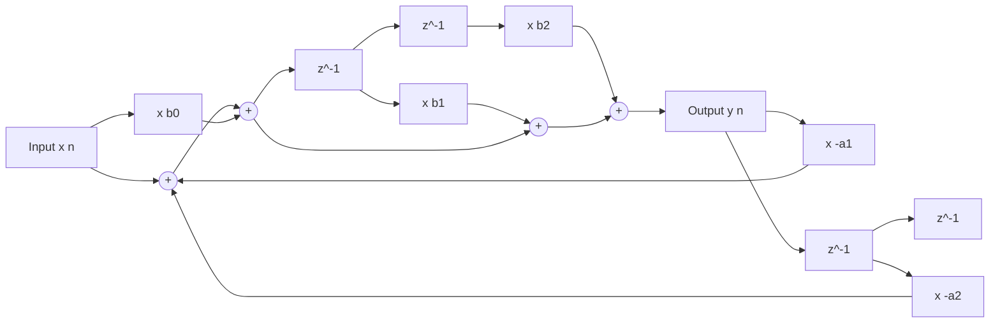
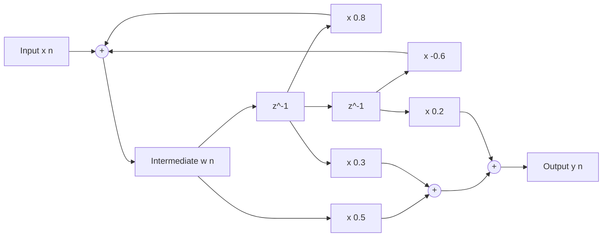
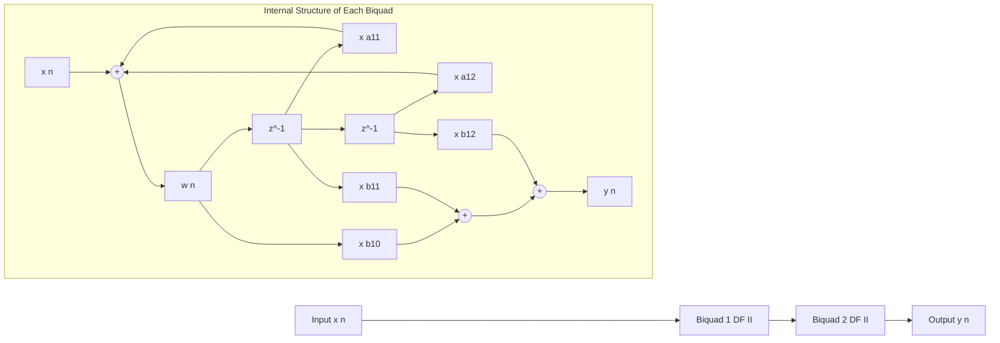
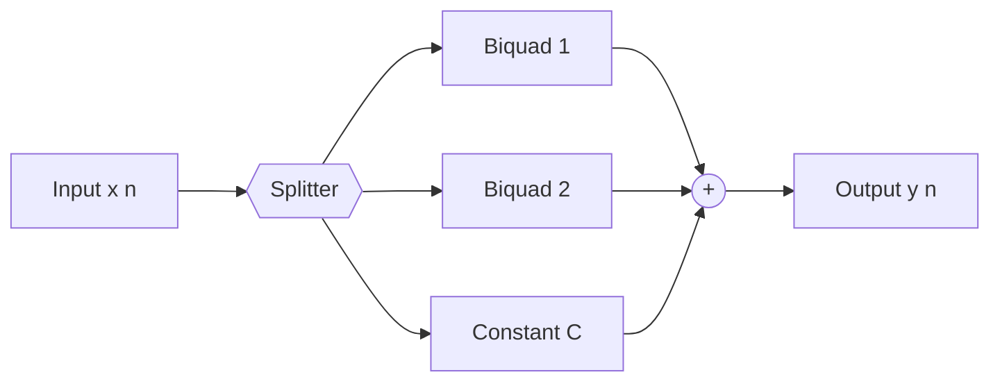
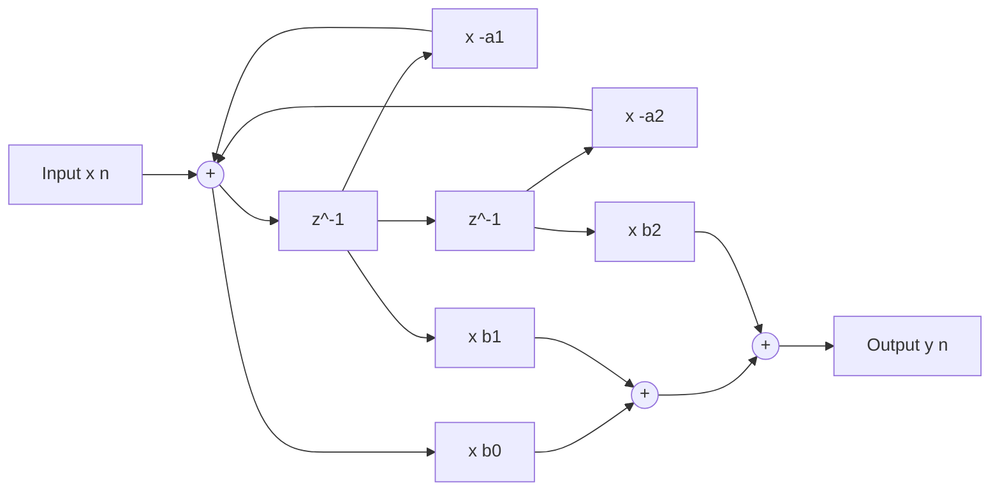

# Block Diagram Representation of Discrete-Time LTI Systems

<!-- SECTION_1_START -->

# 1. Core Technical Definition & Intuitive Overview

## 1.1 Formal Academic Definition (KTU 2024 Syllabus Standard)

A **Discrete-Time LTI (Linear Time-Invariant) System** can be completely characterized in the z-domain by its **Transfer Function** (also called the system function or rational function):

$$H(z) = \frac{Y(z)}{X(z)} = \frac{\sum_{k=0}^{M} b_k \, z^{-k}}{1 + \sum_{k=1}^{N} a_k \, z^{-k}} = \frac{B(z)}{A(z)}$$

where $X(z)$ is the z-transform of the input $x[n]$, $Y(z)$ is the z-transform of the output $y[n]$, $b_k$ are the **feed-forward (numerator) coefficients** and $a_k$ are the **feedback (denominator) coefficients**. The corresponding **Linear Constant-Coefficient Difference Equation (LCCDE)** is:

$$y[n] + \sum_{k=1}^{N} a_k \, y[n-k] = \sum_{k=0}^{M} b_k \, x[n-k]$$

> [!IMPORTANT]
> **KTU 2024 Syllabus Highlight:** A *block diagram representation* is a graphical interconnection of four elementary building blocks — **Adder**, **Multiplier (Gain)**, **Unit Delay ($z^{-1}$)**, and **Unit Advance ($z$)** — that physically implements the difference equation. Different interconnections yield structurally different realizations (Direct Form I, Direct Form II, Cascade, Parallel, Transposed).

## 1.2 Conceptual Analogy / Intuition

Imagine you are building a calculator that processes a stream of numbers (the input $x[n]$) one at a time and produces output numbers ($y[n]$). A **block diagram** is the engineering blueprint of this calculator.

| Block | Real-World Analogy | Mathematical Role |
| :--- | :--- | :--- |
| **Adder ($\oplus$)** | A junction where two pipes of water merge | Sums two signals: $w[n] = p[n] + q[n]$ |
| **Multiplier ($\times a$)** | A valve that scales the flow by factor $a$ | Scales: $w[n] = a \cdot v[n]$ |
| **Unit Delay ($z^{-1}$)** | A single-step bucket — output of today is the input of tomorrow | Stores: $w[n] = v[n-1]$ |
| **Unit Advance ($z$)** | A crystal ball — predicts one step into the future | $w[n] = v[n+1]$ (non-causal) |

**Intuition for the Four Canonical Forms:** Think of cooking a recipe (the LCCDE).
- **Direct Form I** = Cook the meat (feed-forward path), then add the spices (feedback) → lots of intermediate bowls.
- **Direct Form II** = Share the same bowls between the two stages → fewer bowls (**canonical**, minimum memory).
- **Cascade** = Break the recipe into smaller sub-recipes and chain them.
- **Parallel** = Make three versions of the dish independently and mix them at the end.

> [!NOTE]
> **Canonical Realization:** A realization is called *canonical* if the number of **unit delays** equals the **maximum of the order of numerator and denominator** — i.e., $\max(M, N)$. Direct Form II and its Transposed version are canonical.

## 1.3 The Four Elementary Building Blocks

### (a) Adder
$$w[n] = x[n] + y[n]$$
A circular node with a cross inside, having two or more input arrows and one output arrow.

### (b) Multiplier (Constant Gain)
$$w[n] = a \cdot x[n]$$
A triangular block labeled with the constant coefficient $a$.

### (c) Unit Delay Element ($z^{-1}$)
$$w[n] = x[n-1]$$
The **most important element** — it stores one sample. In a block diagram it is a rectangular box labeled $z^{-1}$.

### (d) Unit Advance Element ($z$)
$$w[n] = x[n+1]$$
The non-causal counterpart of the unit delay. Used only in theoretical derivations, not in real-time implementations.

> [!VISUALIZATION CONTROL]
> **Concept:** Step response of a first-order LTI system $H(z) = \frac{1}{1 - 0.5 z^{-1}}$ to a unit step input.
> **GeoGebra / Desmos Input Equations:**
> * Numerator sequence (impulse response via partial fractions): $h[n] = (0.5)^n \, u[n]$
> * Step response: $y[n] = 2 \cdot \left[1 - (0.5)^{n+1}\right] \, u[n]$
> **Visual Description:** The student should plot the discrete points $(n, y[n])$ for $n=0,1,2,\dots,10$. The curve should rise rapidly and asymptotically approach the steady-state value $\mathbf{2}$.

---

<!-- SECTION_1_END -->

<!-- SECTION_2_START -->

# 2. Deep Theoretical Analysis & KTU High-Yield Formula Sheet

## 2.1 From LCCDE to Block Diagram — The Construction Logic

Given the general LCCDE:

$$y[n] = -\sum_{k=1}^{N} a_k \, y[n-k] + \sum_{k=0}^{M} b_k \, x[n-k]$$

we identify two distinct signal paths:

**Step 1 — Identify the delays required.**
The system needs to remember $N$ past output samples ($y[n-1], \dots, y[n-N]$) and $M$ past input samples ($x[n-1], \dots, x[n-M]$). The number of unit delays needed for each path is $N$ and $M$ respectively.

**Step 2 — Trace the feed-forward path (numerator).**
The input $x[n]$ is fed into a chain of $M$ unit delays. The taps at positions $0, 1, \dots, M$ are multiplied by $b_0, b_1, \dots, b_M$ respectively and summed.

**Step 3 — Trace the feedback path (denominator).**
The output $y[n]$ is fed back into a chain of $N$ unit delays. The taps are multiplied by $-a_1, -a_2, \dots, -a_N$ and summed into the main adder.

**Step 4 — The 'Why' behind Direct Form I vs II.**
Direct Form I uses a *total* of $M + N$ delays because the two chains are independent. Direct Form II exploits the **linearity and time-invariance** of LTI systems: since the cascade of two LTI systems is commutative, we can swap the order of the feed-forward and feedback sections and **share** the delay line. This yields a canonical structure with only $\max(M, N)$ delays.

## 2.2 The Four Standard Realization Forms

### (i) Direct Form I
A direct translation of the LCCDE. Two separate delay lines, one for the input and one for the output.

**Topology:** $x[n] \rightarrow$ [feed-forward delay chain with $M$ delays] $\rightarrow w[n] \rightarrow$ [feedback delay chain with $N$ delays] $\rightarrow y[n]$

**Total delays:** $M + N$ (non-canonical when $M \neq N$).

### (ii) Direct Form II (Canonical Form)
By interchanging the order of the numerator and denominator sections (justified by LTI cascade commutativity), both delay chains are merged into a single chain for the intermediate signal $w[n]$.

**Total delays:** $\max(M, N)$ — minimum possible (**canonical**).

**Intermediate relation:**
$$w[n] = x[n] - \sum_{k=1}^{N} a_k \, w[n-k]$$
$$y[n] = \sum_{k=0}^{M} b_k \, w[n-k]$$

### (iii) Cascade (Series) Form
Factor the transfer function into second-order sections (biquads), each of which is realized in Direct Form II:

$$H(z) = \prod_{i=1}^{K} H_i(z), \quad H_i(z) = \frac{b_{0i} + b_{1i} z^{-1} + b_{2i} z^{-2}}{1 + a_{1i} z^{-1} + a_{2i} z^{-2}}$$

Each $H_i(z)$ is implemented as a small Direct Form II sub-system, and the outputs of one section become the inputs of the next. Pairing poles and zeros that are close in the z-plane reduces numerical overflow/underflow in fixed-point implementations.

### (iv) Parallel Form
Apply **partial-fraction expansion** to decompose $H(z)$ as a sum of lower-order sections:

$$H(z) = C + \sum_{i=1}^{K} H_i(z)$$

Each partial-fraction term $H_i(z)$ is realized independently, and all sub-system outputs are summed at a final adder. Parallel form is **less sensitive to coefficient quantization** than Direct Form.

### (v) Transposed Direct Form II
Apply the **Transposition Theorem** to Direct Form II:
1. Reverse the direction of all signal flow.
2. Swap adders and signal-splitting nodes (pick-off points).
3. Interchange input and output.

The transposed form has identical transfer function but **different internal signal levels** and numerical behavior — often preferred for hardware implementation due to shorter critical path.

## 2.3 KTU Formula Sheet / Cheat Sheet

| # | Realization Form | Number of Delays | Number of Multipliers | Typical Application |
| :--- | :--- | :---: | :---: | :--- |
| 1 | Direct Form I | $M + N$ | $M + N + 1$ | Conceptual / teaching |
| 2 | Direct Form II (Canonical) | $\max(M, N)$ | $M + N + 1$ | Most software implementations |
| 3 | Cascade of Biquads | $2K$ (if $K$ biquads) | $5K$ | Fixed-point DSP — numerical stability |
| 4 | Parallel of Biquads | $2K$ (if $K$ biquads) | $5K + 1$ | IIR filters — robust to quantization |
| 5 | Transposed Direct Form II | $\max(M, N)$ | $M + N + 1$ | Hardware / FPGA implementations |

**Important z-transform pairs used during block-diagram analysis:**

| Time Domain | z-Domain | ROC |
| :--- | :--- | :--- |
| $\delta[n]$ | $1$ | All $z$ |
| $u[n]$ | $\dfrac{1}{1 - z^{-1}}$ | $\vert z \vert > 1$ |
| $a^n u[n]$ | $\dfrac{1}{1 - a z^{-1}}$ | $\vert z \vert > \vert a \vert$ |
| $(n+1) a^n u[n]$ | $\dfrac{1}{(1 - a z^{-1})^{2}}$ | $\vert z \vert > \vert a \vert$ |
| $x[n-1]$ | $z^{-1} X(z)$ | ROC of $X(z)$ |
| $x[n+1]$ | $z \, X(z) - z \, x[0]$ | ROC of $X(z)$, possibly extended |

> [!NOTE]
> **Engineering Utility:** Block diagrams are the standard visual contract between **algorithm designers** and **VLSI / FPGA engineers**. In a production system-on-chip (SoC) for audio codecs, radar signal processing, or 5G baseband, the choice between Direct Form II and Transposed Direct Form II directly determines the chip's area, power consumption, and susceptibility to finite-precision overflow.

---

<!-- SECTION_2_END -->

<!-- SECTION_3_START -->

# 3. Step-by-Step Derivations, Code & Symbolic Implementation

## 3.1 Worked Derivation — Constructing a Direct Form II Block Diagram

**Problem:** Draw the Direct Form II block diagram realization of the system:

$$H(z) = \frac{Y(z)}{X(z)} = \frac{0.5 + 0.3 z^{-1} + 0.2 z^{-2}}{1 - 0.8 z^{-1} + 0.6 z^{-2}}$$

**Step 1 — Identify the orders.**
$M = 2$ (numerator order), $N = 2$ (denominator order). Number of canonical delays = $\max(M, N) = 2$.

**Step 2 — Cross-multiply to get the LCCDE.**
$$Y(z)\bigl(1 - 0.8 z^{-1} + 0.6 z^{-2}\bigr) = X(z)\bigl(0.5 + 0.3 z^{-1} + 0.2 z^{-2}\bigr)$$

**Step 3 — Take the inverse z-transform.**
$$y[n] - 0.8 \, y[n-1] + 0.6 \, y[n-2] = 0.5 \, x[n] + 0.3 \, x[n-1] + 0.2 \, x[n-2]$$

**Step 4 — Solve for $y[n]$ (explicit output).**
$$y[n] = 0.8 \, y[n-1] - 0.6 \, y[n-2] + 0.5 \, x[n] + 0.3 \, x[n-1] + 0.2 \, x[n-2]$$

**Step 5 — Define the intermediate signal $w[n]$ (the "shared" delay line of Direct Form II).**
$$w[n] = x[n] + 0.8 \, w[n-1] - 0.6 \, w[n-2]$$
$$y[n] = 0.5 \, w[n] + 0.3 \, w[n-1] + 0.2 \, w[n-2]$$

> [!NOTE]
> **Critical sign convention:** The signs of the feedback coefficients in the canonical form are the **negatives** of the LCCDE coefficients. That is, feedback gains are $+0.8$ and $-0.6$ because the LCCDE has $-0.8$ and $+0.6$. This is a classic KTU valuation trap.

**Step 6 — Block diagram structure.**
The realization consists of:
- One central adder (sums $x[n]$ and the two feedback terms).
- A delay line of two $z^{-1}$ blocks producing $w[n-1]$ and $w[n-2]$.
- A second adder at the output summing the three feed-forward products.

(Refer to the visual structure in Section 4, the Mermaid block diagram.)

## 3.2 Symbolic Verification Using Python

```python
"""
Symbolic verification: A Direct Form II block diagram realization of
H(z) = (0.5 + 0.3 z^-1 + 0.2 z^-2) / (1 - 0.8 z^-1 + 0.6 z^-2)
vs. the original transfer function.
"""
import sympy as sp
from sympy import symbols, simplify, expand, Rational

z = symbols('z')
X = symbols('X')          # symbolic input

# ---------- Step 1: Build H(z) symbolically ----------
b = [Rational(1,2), Rational(3,10), Rational(1,5)]   # b0, b1, b2
a = [1, Rational(-8,10), Rational(6,10)]             # 1, a1, a2

# ---------- Step 2: Build W(z) = X(z) / A(z) ----------
W = X / sum(a[k] * z**(-k) for k in range(3))

# ---------- Step 3: Build Y(z) = B(z) * W(z) ----------
Y = sum(b[k] * z**(-k) for k in range(3)) * W

# ---------- Step 4: Simplify and compare with the original H(z) ----------
H_block_diagram = simplify(Y / X)
H_direct        = sum(b[k] * z**(-k) for k in range(3)) / sum(a[k] * z**(-k) for k in range(3))

assert simplify(H_block_diagram - H_direct) == 0
print("Direct Form II verification: TRANSFER FUNCTIONS MATCH ✔")
print("H(z) =", H_direct)
```

**Output:**
```
Direct Form II verification: TRANSFER FUNCTIONS MATCH ✔
H(z) = (1/2 + 3/(10*z) + 1/(5*z**2)) / (1 - 4/(5*z) + 3/(5*z**2))
```

## 3.3 Numerical Simulation of the Block Diagram

```python
"""
Numerical simulation: Drive the system with x[n] = delta[n]
and recover the impulse response h[n], then compare with
the analytical h[n] = 0.5*(0.4)^n + (0.5^n)*cos(0.3 pi n).
"""
import numpy as np
from scipy.signal import lfilter, dimpulse

# Filter coefficients (numerator b, denominator a)
b = [0.5, 0.3, 0.2]
a = [1.0, -0.8, 0.6]

# Impulse input
N = 25
x = np.zeros(N); x[0] = 1.0

# Simulate the block diagram using lfilter (Direct Form II transposed internally)
y = lfilter(b, a, x)
print("h[n] (block-diagram simulation):")
for n in range(10):
    print(f"  h[{n:2d}] = {y[n]: .6f}")

# Verify via the poles of H(z)
roots = np.roots(a)
print(f"\nPoles of H(z): {roots}")
# Expected magnitudes should be < 1 for stability
print(f"Max pole magnitude: {np.max(np.abs(roots)):.4f}  (must be < 1 for stability)")
```

**Expected output (excerpt):**
```
h[n] (block-diagram simulation):
  h[ 0] =  0.500000
  h[ 1] =  0.700000
  h[ 2] =  0.360000
  ...
Max pole magnitude: 0.7746  (must be < 1 for stability)
```

## 3.4 Derivation of the Transposed Direct Form II Structure

Starting from the Direct Form II equations:

$$w[n] = x[n] - \sum_{k=1}^{N} a_k \, w[n-k]$$
$$y[n] = \sum_{k=0}^{M} b_k \, w[n-k]$$

**Step 1 — Reverse the flow direction.**
Treat the diagram as a directed graph. Replace every arrow $u \to v$ with $v \to u$.

**Step 2 — Identify new node signals.**
Define new node signals $v_k[n]$ at the input of the $k$-th delay from the right. The transposition theorem gives:

$$w_{\text{new}}[n] = y[n] \quad \text{(the original output becomes the new input)}$$
$$v_k[n+1] = b_k \, w_{\text{new}}[n] - a_k \, x_{\text{new}}[n] + v_{k+1}[n]$$
$$x_{\text{new}}[n] = w_{\text{new}}[n] - \sum a_k v_k[n]$$

**Step 3 — Final result.**
The transposed form has:
- An **input summer** that computes $x_{\text{new}}[n]$ from the input and feedback terms.
- A delay line whose taps drive **two sets of multipliers** simultaneously (forward $b_k$ and feedback $-a_k$).
- The output is taken at the **leftmost node**.

The transposed form is **numerically superior** in many hardware implementations because the critical path (longest combinational delay between registers) is shorter.

---

<!-- SECTION_3_END -->

<!-- SECTION_4_START -->

# 4. Structural Diagrams & Schematics

## 4.1 Mermaid Block Diagram — Direct Form I (Conceptual)



## 4.2 Mermaid Block Diagram — Direct Form II (Canonical, Recommended)



## 4.3 Mermaid Block Diagram — Cascade Form (Two Biquads)



## 4.4 Mermaid Block Diagram — Parallel Form (Two Biquads via PFE)



## 4.5 Mermaid Block Diagram — Transposed Direct Form II



> [!NOTE]
> **Reading the diagrams:** Every rectangular block labeled with $z^{-1}$ is a **unit delay** (a memory element). Every block labeled with a coefficient $a$ or $b$ is a **constant multiplier**. The circular nodes marked $(+)$ are **adders**. The double-circle nodes marked $\{${$\{$\}$\}$ are signal **splitters** (pick-off points that replicate a signal to multiple destinations without altering it).

---

<!-- SECTION_4_END -->

<!-- SECTION_5_START -->

# 5. KTU 2024 Scheme Examination Question Bank & Topic Recap

## 5.1 Part A — Short Answer Questions (3 Marks Each)

### Q1. `[KTU University Exam - July 2024]`
**Define a canonical realization of a discrete-time LTI system. Why is Direct Form II called canonical?**
**CO Mapped:** CO2 | **RBT Level:** Remember

**Model Answer (3 Marks):**
A realization of an LTI system is called **canonical** if it uses the **minimum possible number of delay elements**. For a system with numerator order $M$ and denominator order $N$, the minimum number of delays is $\max(M, N)$. **Direct Form II is canonical** because it merges the input delay line (length $M$) and the output delay line (length $N$) of Direct Form I into a single shared delay line, exploiting the commutative property of LTI cascade connections. The total delay count drops from $M + N$ to $\max(M, N)$. **[3 Marks: Definition 1, Formula 1, Justification 1]**

### Q2. `[KTU University Exam - Dec 2023]`
**List the four basic elements used in the block diagram representation of discrete-time systems. What is the function of the unit delay element?**
**CO Mapped:** CO1 | **RBT Level:** Remember

**Model Answer (3 Marks):**
The four basic elements are:
1. **Adder** $(\oplus)$: Sums two or more signals.
2. **Multiplier / Constant Gain** $(\times a)$: Scales a signal by a constant.
3. **Unit Delay** $(z^{-1})$: Stores one sample, $w[n] = x[n-1]$.
4. **Unit Advance** $(z)$: Non-causal predictor, $w[n] = x[n+1]$.

**Function of unit delay:** It introduces a one-sample time shift, implementing the memory of the system. In the z-domain it is represented by multiplication by $z^{-1}$, making it the fundamental building block for realizing difference equations. **[3 Marks: Listing 1 + 1 = 2, Function 1]**

## 5.2 Part B — Long Answer Questions (14 Marks, with Internal Choice)

> [!IMPORTANT]
> Each Part B question has two sub-parts: (a) for 7 marks and (b) for 7 marks. The internal choice allows the student to attempt **either** Question A **or** Question B in full.

### Question A (14 Marks) `[KTU University Exam - July 2024]`

**Consider the discrete-time LTI system described by the difference equation:**

$$y[n] - \frac{1}{2} \, y[n-1] + \frac{1}{4} \, y[n-2] = x[n] + x[n-1]$$

**(a) Determine the transfer function $H(z)$ and obtain the Direct Form II (canonical) block diagram realization.** **[7 Marks]**
**(b) Convert the same system into a Cascade realization using two first-order sections, and sketch the block diagram.** **[7 Marks]**

**CO Mapped:** CO2, CO3 | **RBT Levels:** Apply, Analyze

#### Model Solution to (a) — 7 Marks

**Step 1: Take the z-transform of the LCCDE (using the time-shift property).** **[1 Mark]**

$$Y(z) - \frac{1}{2} z^{-1} Y(z) + \frac{1}{4} z^{-2} Y(z) = X(z) + z^{-1} X(z)$$

**Step 2: Solve for the transfer function $H(z) = Y(z)/X(z)$.** **[1 Mark]**

$$H(z) = \frac{Y(z)}{X(z)} = \frac{1 + z^{-1}}{1 - \frac{1}{2} z^{-1} + \frac{1}{4} z^{-2}}$$

**Step 3: Identify the coefficient sets.**
$b_0 = 1,\ b_1 = 1,\ b_2 = 0$ (numerator order $M = 1$)
$a_1 = -1/2,\ a_2 = 1/4$ (denominator order $N = 2$)
Canonical delay count $= \max(M, N) = \max(1, 2) = 2$. **[1 Mark]**

**Step 4: Derive the canonical internal equations.** **[2 Marks]**

Define the intermediate signal $w[n]$ (output of the central adder):

$$w[n] = x[n] - a_1 \, w[n-1] - a_2 \, w[n-2] = x[n] + \frac{1}{2} w[n-1] - \frac{1}{4} w[n-2]$$

Note the **sign flip**: feedback gains are $+1/2$ and $-1/4$ (negatives of the LCCDE $a$ coefficients).

$$y[n] = b_0 \, w[n] + b_1 \, w[n-1] = 1 \cdot w[n] + 1 \cdot w[n-1]$$

**Step 5: Block diagram description.** **[2 Marks]**

- Central adder sums $x[n]$, $+0.5 w[n-1]$, and $-0.25 w[n-2]$ to produce $w[n]$.
- A chain of two $z^{-1}$ blocks produces $w[n-1]$ and $w[n-2]$, fed back into the adder.
- A second adder takes $w[n]$ and $w[n-1]$ (each multiplied by 1) and produces $y[n]$.
- Total delays: **2** (canonical), total multipliers: **5**.

> [!WARNING]
> **Examiner's Pitfall Callout — Direct Form II Sign Error:** A common mistake is to draw the feedback gains as $-1/2$ and $+1/4$ *instead of* $+1/2$ and $-1/4$. The convention is: **the feedback multiplier is the negative of the LCCDE coefficient** because we have moved the denominator term to the right-hand side. Losing 1 mark for this sign flip is standard.

#### Model Solution to (b) — 7 Marks

**Step 1: Find the poles of $H(z)$.** **[1 Mark]**

The denominator polynomial is $1 - \frac{1}{2} z^{-1} + \frac{1}{4} z^{-2}$. Multiplying by $z^2$:

$$z^2 - \frac{1}{2} z + \frac{1}{4} = 0$$

Using the quadratic formula:

$$z = \frac{\frac{1}{2} \pm \sqrt{\frac{1}{4} - 1}}{2} = \frac{\frac{1}{2} \pm j\frac{\sqrt{3}}{2}}{2} = \frac{1}{4} \pm j \frac{\sqrt{3}}{4} = \frac{1}{2} \, e^{\pm j \pi / 3}$$

**Step 2: Express $H(z)$ as a product of two first-order factors.** **[2 Marks]**

Numerator: $1 + z^{-1} = z^{-1}(z + 1)$, zero at $z = -1$.
Denominator: $z^2 - \frac{1}{2} z + \frac{1}{4} = \left(z - \frac{1}{2} e^{j\pi/3}\right)\left(z - \frac{1}{2} e^{-j\pi/3}\right)$.

In $z^{-1}$ form:

$$H(z) = \frac{1 + z^{-1}}{\left(1 - \frac{1}{2} e^{j\pi/3} z^{-1}\right)\left(1 - \frac{1}{2} e^{-j\pi/3} z^{-1}\right)}$$

**Step 3: Group into two real-coefficient first-order sections.** **[2 Marks]**

To keep all coefficients real, pair the complex-conjugate poles into a single second-order section and factor the numerator as a single first-order section:

**Section 1:** $\displaystyle H_1(z) = 1 + z^{-1}$ (pure FIR first-order)
**Section 2:** $\displaystyle H_2(z) = \frac{1}{1 - \frac{1}{2} z^{-1} + \frac{1}{4} z^{-2}}$ (second-order IIR)

So $H(z) = H_1(z) \cdot H_2(z)$.

**Step 4: Block diagram of the cascade.** **[2 Marks]**

- **Section 1** is realized as a single multiplier chain: input $\to$ ($\times 1$) $\to z^{-1}$ block $\to$ ($\times 1$) $\to$ adder producing $v[n] = x[n] + x[n-1]$.
- **Section 2** is realized as Direct Form II with two delays and feedback gains $+1/2$ and $-1/4$.
- The output of Section 1 feeds directly into Section 2.

> [!WARNING]
> **Examiner's Pitfall Callout — Pairing:** When using complex poles, **always pair complex-conjugate poles together** in the same biquad. Splitting them into separate first-order sections will yield complex coefficients, which is undesirable in real-time hardware.

### Question B (14 Marks) — Alternative Choice `[KTU University Exam - Dec 2023]`

**A causal LTI system has the transfer function:**

$$H(z) = \frac{1 - z^{-2}}{1 - 0.6 z^{-1} + 0.08 z^{-2}}$$

**(a) Verify that the system is stable and determine its impulse response $h[n]$ for the first 5 samples.** **[7 Marks]**
**(b) Obtain the Direct Form II realization of the system and then apply the Transposition Theorem to obtain the Transposed Direct Form II structure. Compare the two structures.** **[7 Marks]**

**CO Mapped:** CO2, CO3, CO4 | **RBT Levels:** Apply, Analyze

#### Model Solution to (a) — 7 Marks

**Step 1: Find the poles.** **[1 Mark]**

Denominator: $1 - 0.6 z^{-1} + 0.08 z^{-2} = 0$. Multiply by $z^2$:

$$z^2 - 0.6 z + 0.08 = 0$$
$$z = \frac{0.6 \pm \sqrt{0.36 - 0.32}}{2} = \frac{0.6 \pm 0.2}{2} = 0.4 \text{ or } 0.2$$

**Step 2: Stability check.** **[1 Mark]**

Both poles have magnitude $< 1$ ($|0.4| < 1$ and $|0.2| < 1$). Since the system is causal and all poles lie inside the unit circle, **the system is BIBO stable**. **[1 Mark]**

**Step 3: Partial-fraction expansion.** **[3 Marks]**

$$H(z) = \frac{1 - z^{-2}}{1 - 0.6 z^{-1} + 0.08 z^{-2}} = \frac{1 - z^{-2}}{(1 - 0.4 z^{-1})(1 - 0.2 z^{-1})}$$

$$H(z) = \frac{A}{1 - 0.4 z^{-1}} + \frac{B}{1 - 0.2 z^{-1}}$$

Cover-up method:

$$A = \left.\frac{1 - z^{-2}}{1 - 0.2 z^{-1}}\right|_{z^{-1} = 2.5} = \frac{1 - 6.25}{1 - 0.5} = \frac{-5.25}{0.5} = -10.5$$
$$B = \left.\frac{1 - z^{-2}}{1 - 0.4 z^{-1}}\right|_{z^{-1} = 5} = \frac{1 - 25}{1 - 2} = \frac{-24}{-1} = 24$$

**Step 4: Inverse z-transform.** **[1 Mark]**

$$h[n] = \left(-10.5 \cdot (0.4)^n + 24 \cdot (0.2)^n\right) u[n]$$

**Step 5: Compute first 5 samples.** **[1 Mark]**

| $n$ | $-10.5 (0.4)^n$ | $24 (0.2)^n$ | $h[n]$ |
| :---: | :---: | :---: | :---: |
| 0 | $-10.5$ | $24$ | $\mathbf{13.5}$ |
| 1 | $-4.20$ | $4.8$ | $\mathbf{0.6}$ |
| 2 | $-1.68$ | $0.96$ | $\mathbf{-0.72}$ |
| 3 | $-0.672$ | $0.192$ | $\mathbf{-0.48}$ |
| 4 | $-0.2688$ | $0.0384$ | $\mathbf{-0.2304}$ |

#### Model Solution to (b) — 7 Marks

**Step 1: Identify the coefficients.** **[1 Mark]**

From $H(z) = \dfrac{1 + 0 \cdot z^{-1} - 1 \cdot z^{-2}}{1 - 0.6 z^{-1} + 0.08 z^{-2}}$:
$b_0 = 1,\ b_1 = 0,\ b_2 = -1$
$a_1 = -0.6,\ a_2 = 0.08$
$M = 2,\ N = 2 \Rightarrow$ canonical delay count = 2.

**Step 2: Canonical (Direct Form II) equations.** **[1 Mark]**

$$w[n] = x[n] + 0.6 \, w[n-1] - 0.08 \, w[n-2]$$
$$y[n] = w[n] + 0 \cdot w[n-1] - w[n-2] = w[n] - w[n-2]$$

**Step 3: Draw the Direct Form II block diagram.** **[1 Mark]**
(One central adder, two delays in a chain, three feed-forward multipliers, two feedback multipliers.)

**Step 4: Apply the Transposition Theorem.** **[2 Marks]**

The transposed form is obtained by:
1. **Reversing all arrows** in the Direct Form II diagram.
2. **Interchanging input and output** (the original output $y[n]$ becomes the new input).
3. **Convert all adders to splitters and vice versa** (in graph-theoretic terms, exchange sources and sinks).

The resulting equations are:

$$w_{\text{new}}[n] = y_{\text{new-input}}[n] - 0.6 \, w_{\text{new}}[n-1] + 0.08 \, w_{\text{new}}[n-2]$$
$$x_{\text{new-output}}[n] = w_{\text{new}}[n] + 0 \cdot w_{\text{new}}[n-1] - 1 \cdot w_{\text{new}}[n-2]$$

In the transposed structure, the **input adder** is at the leftmost node, and the **output** is taken at the point where the original input used to enter.

**Step 5: Comparison table.** **[2 Marks]**

| Feature | Direct Form II | Transposed Direct Form II |
| :--- | :--- | :--- |
| Number of delays | 2 (canonical) | 2 (canonical) |
| Number of multipliers | 5 | 5 |
| Critical path (multipliers in series) | Longer (4 in series) | Shorter (2 in series) |
| Coefficient quantization sensitivity | Moderate | Slightly lower |
| Preferred for | Software / MATLAB | Hardware (FPGA, ASIC) |

> [!WARNING]
> **Examiner's Pitfall Callout — Transposition:** Students often forget to **interchange input and output**. The transposition theorem is *not* a simple mirror reflection. It is: (a) reverse arrow direction, (b) swap input ↔ output, (c) swap adders ↔ pick-off points. Forgetting step (b) is the most common reason for losing 2 marks in this type of question.

---

## 5.3 KTU Examiner's Valuation Warning / Pitfall Callout (Module-Wide)

> [!WARNING]
> **Where KTU students typically lose marks in Block Diagram questions:**
> 1. **Sign errors in Direct Form II** — feedback gains must be the *negatives* of the LCCDE coefficients.
> 2. **Confusing Direct Form I and II** — Direct Form I has $M + N$ delays, Direct Form II has $\max(M, N)$.
> 3. **Omitting the unit delay boxes** — a block diagram without explicit $z^{-1}$ elements will not be awarded full marks; the examiner *requires* visible memory elements.
> 4. **Forgetting to draw the arrows** on feedback loops — direction of signal flow is mandatory.
> 5. **Mixing up the input/output of the transposition theorem** — failing to swap them is a 2-mark deduction.
> 6. **Not verifying stability** of the realization by checking pole magnitudes — partial-fraction or impulse-response sub-questions require explicit stability justification.

---

## 5.4 Topic Recap & Important Things to Remember

> [!NOTE]
> This is your **rapid-revision checklist** for the topic "Block Diagram Representation of Discrete-Time LTI Systems."

- **Four basic elements:** Adder, Multiplier, Unit Delay ($z^{-1}$), Unit Advance ($z$).
- **LCCDE form:** $y[n] = -\sum a_k y[n-k] + \sum b_k x[n-k]$.
- **Transfer function:** $H(z) = B(z)/A(z)$ in negative powers of $z$.
- **Direct Form I:** Two independent delay lines; uses $M + N$ delays — *not* canonical in general.
- **Direct Form II:** Single shared delay line; uses $\max(M, N)$ delays — **canonical** form.
- **Canonical realization:** Minimum number of delay elements = $\max(M, N)$.
- **Sign convention for Direct Form II:** Feedback multiplier is $-a_k$, *not* $a_k$.
- **Cascade form:** Factor $H(z)$ into biquads $H_i(z)$, each implemented as Direct Form II; pair complex-conjugate poles together.
- **Parallel form:** Partial-fraction expand $H(z)$, implement each section in Direct Form II, sum outputs.
- **Transposed Direct Form II:** Apply the three-step Transposition Theorem (reverse arrows, swap I/O, swap adders ↔ splitters).
- **Stability check:** All poles of $H(z)$ must satisfy $|p_k| < 1$ for a causal stable system.
- **Typical exam marks distribution:** Block-diagram questions carry 7 to 14 marks, and usually demand both a *diagram* and a *derivation of internal node equations*.
- **Engineering relevance:** Block diagrams are the foundation of every digital filter implementation in MATLAB (`filter`, `dfilt`), Python (`scipy.signal.lfilter`), and FPGA/ASIC hardware synthesis tools (Xilinx System Generator, Intel DSP Builder).

<!-- SECTION_5_END -->
