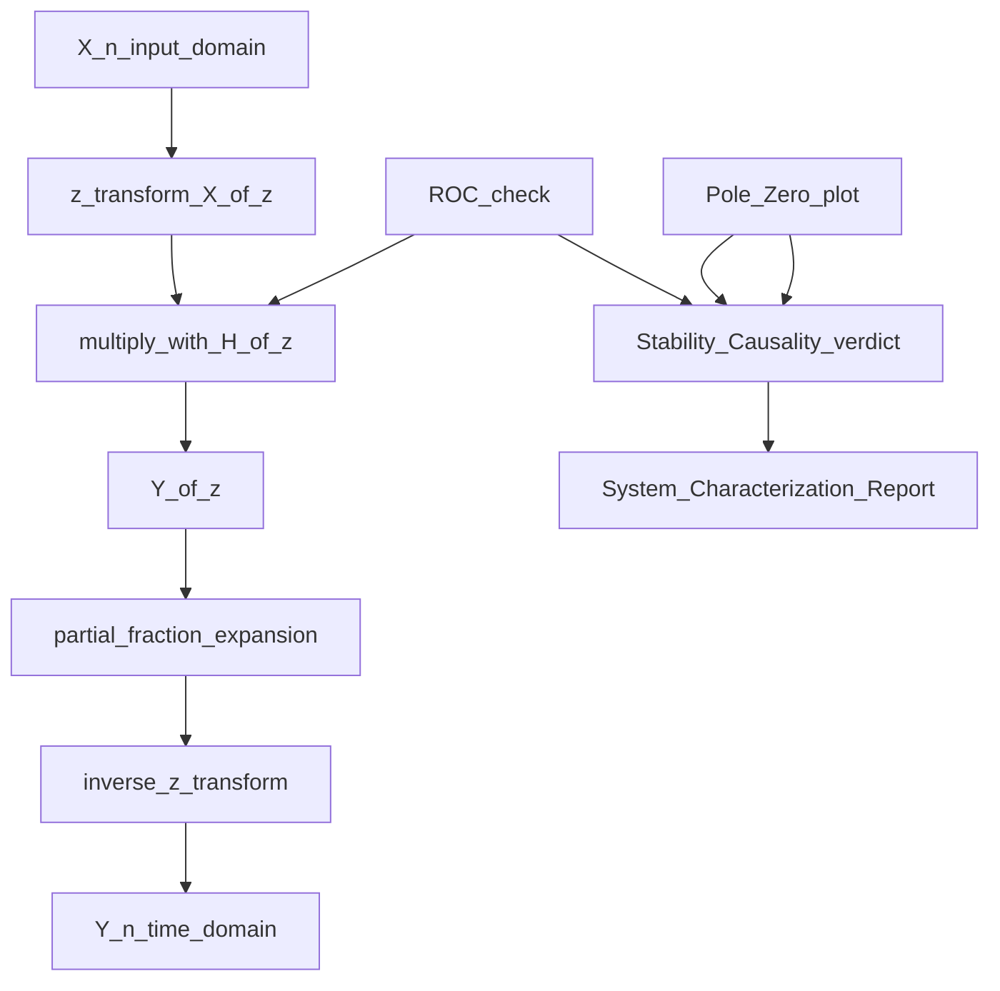
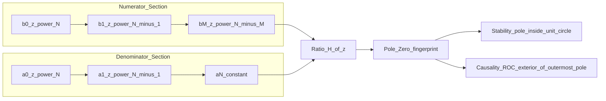
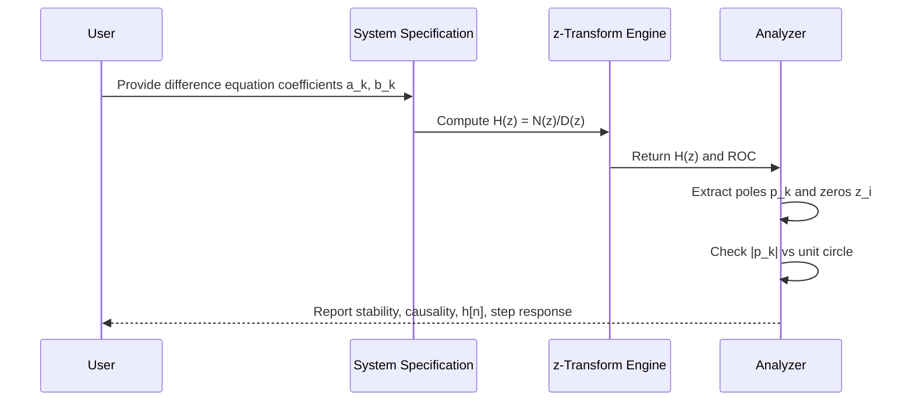

# Characterizing LTI systems using z transform

<!-- SECTION_1_START -->
# Characterizing LTI Systems using Z-Transform

## 1.1 Formal Academic Definition

> [!IMPORTANT]
> **KTU Syllabus Definition (PECST416 - Module 4)**
> An LTI (Linear Time-Invariant) discrete-time system is completely characterized in the z-domain by its **system function** (or **transfer function**) $H(z)$, defined as the ratio of the z-transform of the output $y[n]$ to the z-transform of the input $x[n]$, assuming zero initial conditions:
> $$H(z) \;=\; \frac{Y(z)}{X(z)} \;=\; \sum_{n=-\infty}^{\infty} h[n]\, z^{-n}$$
> where $h[n]$ is the **impulse response** of the LTI system. The transfer function $H(z)$ together with its **Region of Convergence (ROC)** uniquely characterizes the system — its causality, stability, frequency response, and time-domain behavior.

The term "characterizing" means that once $H(z)$ and its ROC are known, an engineer can predict **every possible input-output behavior** of the system without solving the underlying difference equation repeatedly.

## 1.2 Intuitive Analogy (Plain-English Intuition)

> [!NOTE]
> **Analogy — The "Recipe Card" of a System**
> Imagine a black-box coffee machine. The **transfer function $H(z)$** is like the recipe card inside the lid. It does not brew the coffee for you; it merely tells you *how* the machine transforms inputs (water + beans) into outputs (espresso). Two different machines can have the same recipe, but if you restrict the *Region of Convergence* (the conditions under which the recipe is valid — say, "only for hot water above $80^\circ$C"), the behavior of one machine may be **causal** (it waits for water before reacting) and the other **anti-causal** (it anticipates). Just like the recipe card, $H(z)$ is a compact, algebraic handle to a complex physical process.

In engineering terms, $H(z)$ is the **"fingerprint"** of an LTI system. Pole-zero locations in the z-plane are its **"genetic markers"** — moving a pole changes the system's memory, stability, and oscillation pattern instantly.

## 1.3 Physical Constants and Standard Metrics

- **Unit circle** $\vert z \vert = 1$ — the boundary that separates stable from unstable behavior.
- **Sampling frequency** $f_s$ in **Hz** and sampling interval $T_s$ in **seconds** relate to the unit circle via $z = e^{j\omega} = e^{j 2\pi f T_s}$.
- **Digital frequency** $\omega \in [-\pi, \pi]$ in **radians/sample**.

## 1.4 Visualization Control

> [!VISUALIZATION CONTROL]
> **Concept:** Pole-Zero Plot of a 2nd-Order Resonant LTI System
> **GeoGebra / Desmos Input Equations (parametric form):**
> * $z_1 = 0.9\,e^{j\pi/3}$ (complex pole)
> * $z_2 = 0.9\,e^{-j\pi/3}$ (complex pole)
> * $p_1 = -0.5$ (real zero)
> * Unit circle: $x^2 + y^2 = 1$
> **Visual Description:** The student should observe two poles inside the unit circle (causes decaying oscillation) and one real zero on the negative real axis. Because *all* poles lie strictly *inside* the unit circle, the ROC (the annular region $\vert z \vert > 0.9$) **includes** the unit circle — the system is **stable**.

<!-- SECTION_1_END -->

<!-- SECTION_2_START -->
# Deep Theoretical Analysis & KTU Formula Sheet

## 2.1 Operational Block Diagram (Mental Model)

The complete signal flow when characterizing an LTI system using the z-transform is:

$$
\boxed{\;x[n] \;\longrightarrow\; \boxed{H(z)} \;\longrightarrow\; y[n]\;}
$$

Mathematically this corresponds to:

$$
Y(z) \;=\; H(z)\, X(z)
$$

To recover the time-domain output:

$$
y[n] \;=\; \mathcal{Z}^{-1}\{\,H(z)\,X(z)\,\}
$$

> [!IMPORTANT]
> **The Three Pillars of Characterization**
> 1. **Difference equation** $\longrightarrow$ Algebraic equation in $z$.
> 2. **Pole-zero plot** $\longrightarrow$ Geometric fingerprint of dynamics.
> 3. **ROC** $\longrightarrow$ Decides causality, stability, and uniqueness.

## 2.2 Deriving $H(z)$ from a Difference Equation

A general $N$-th order LTI difference equation:

$$
\sum_{k=0}^{N} a_k\, y[n-k] \;=\; \sum_{k=0}^{M} b_k\, x[n-k]
$$

where $a_0 = 1$ is conventionally normalized. Taking the unilateral z-transform on both sides (assuming zero initial conditions) and using the **time-shift property** $\mathcal{Z}\{x[n-k]\} = z^{-k} X(z)$:

$$
Y(z)\,\sum_{k=0}^{N} a_k\, z^{-k} \;=\; X(z)\,\sum_{k=0}^{M} b_k\, z^{-k}
$$

Therefore:

$$
H(z) \;=\; \frac{Y(z)}{X(z)} \;=\; \frac{\displaystyle\sum_{k=0}^{M} b_k\, z^{-k}}{\displaystyle\sum_{k=0}^{N} a_k\, z^{-k}}
$$

Multiplying numerator and denominator by $z^{\max(M,N)}$ yields the **rational form in $z$**:

$$
H(z) \;=\; \frac{b_0\, z^{N} + b_1\, z^{N-1} + \cdots + b_M\, z^{N-M}}{a_0\, z^{N} + a_1\, z^{N-1} + \cdots + a_N}
\;=\; K\, \frac{\displaystyle\prod_{i=1}^{M}(z - z_i)}{\displaystyle\prod_{k=1}^{N}(z - p_k)}
$$

> [!NOTE]
> **The "Why" Behind Each Step**
> * The *time-shift property* converts a difference equation into an algebraic equation because $z^{-1}$ acts as a **unit delay operator** in the z-domain.
> * The *rational form* reveals the **poles** (roots of denominator, $p_k$) and **zeros** (roots of numerator, $z_i$) explicitly.
> * The ROC excludes the poles and depends on the system class (causal, anti-causal, two-sided).

## 2.3 Causality, Stability, and ROC — The Governing Rules

| Property | Condition on ROC | Interpretation |
|----------|------------------|----------------|
| **Causality** (right-sided) | ROC is exterior of the outermost pole: $\vert z \vert > \vert p \vert_{\max}$ | $h[n] = 0$ for $n < 0$ |
| **Anti-causality** (left-sided) | ROC is interior of the innermost pole: $\vert z \vert < \vert p \vert_{\min}$ | $h[n] = 0$ for $n > 0$ |
| **Stability (BIBO)** | ROC **must include** the unit circle $\vert z \vert = 1$ | $\sum \vert h[n] \vert < \infty$ |
| **Stable + Causal** | All poles **strictly inside** the unit circle ($\vert p_k \vert < 1$) | Most common DSP case |

> [!IMPORTANT]
> **KTU Board Favorite Question:** "An LTI system is described by $H(z) = \dfrac{1}{1 - 0.5 z^{-1}}$, ROC: $\vert z \vert < 0.5$. Is the system stable and causal?"
> **Answer:** It is **anti-causal** (ROC inside) and **unstable** (ROC does not include the unit circle).

## 2.4 KTU Formula Sheet (Cheat Sheet)

| Symbol / Formula | Meaning | Units / Domain |
|------------------|---------|----------------|
| $H(z) = Y(z)/X(z)$ | Transfer function | dimensionless ratio |
| $H(z) = \sum h[n] z^{-n}$ | z-transform of impulse response | complex function |
| $H(e^{j\omega}) = H(z)\big\vert_{z = e^{j\omega}}$ | Frequency response (DTFT) | unit-magnitude |
| $\sum a_k y[n-k] = \sum b_k x[n-k]$ | LTI difference equation | discrete time index |
| $\mathcal{Z}\{x[n-k]\} = z^{-k} X(z)$ | Time-shift property | ROC shifts by $k$ |
| $\mathcal{Z}\{h[n]\} \cdot \mathcal{Z}\{x[n]\} = Y(z)$ | Convolution in time = multiplication in $z$ | — |
| $y[n] = \mathcal{Z}^{-1}\{H(z) X(z)\}$ | Output via inverse z-transform | discrete signal |
| BIBO stable iff $\vert p_k \vert < 1$ (causal case) | Pole location test | — |
| $y_{ss}[n] = H(e^{j0})\, x[n]$ (for DC) | Steady-state response | — |
| $y_{tr}[n]$ from partial fractions (transient terms) | Natural response | decays if stable |

## 2.5 Real-World Engineering Utility

* **Digital filters (FIR / IIR)**: $H(z)$ is the design blueprint. Pole placement controls selectivity and stability.
* **Control systems**: $H(z)$ becomes the **pulse-transfer function** $G(z) = (1-z^{-1})\,\mathcal{Z}\{G(s)\}$ — crucial for sampled-data control.
* **Speech and audio codecs**: pole-zero modeling represents vocal-tract resonances (formants).
* **Communication receivers**: matched filters and equalizers are designed via $H(z)$ specifications.
* **Biomedical signal processing**: ECG/EEG denoising filters are tuned by moving poles/zeros in the z-plane.

<!-- SECTION_2_END -->

<!-- SECTION_3_START -->
# Step-by-Step Derivations & Symbolic Implementation

## 3.1 Worked Derivation #1 — From Difference Equation to $H(z)$ and $h[n]$

> [!NOTE]
> **KTU Board-Type Problem (Module 4, 14-Mark Standard)**

**Problem:** A causal LTI system is described by the difference equation
$$
y[n] - \tfrac{1}{2}\, y[n-1] \;=\; x[n] + x[n-1]
$$
Determine $H(z)$, its ROC, and the impulse response $h[n]$.

**Step 1 — Apply the z-transform to both sides.**

Using linearity and the time-shift property with zero initial conditions:
$$
Y(z) - \tfrac{1}{2}\, z^{-1} Y(z) \;=\; X(z) + z^{-1} X(z)
$$

**Step 2 — Factor out $Y(z)$ and $X(z)$.**
$$
Y(z)\,\bigl(1 - \tfrac{1}{2} z^{-1}\bigr) \;=\; X(z)\,\bigl(1 + z^{-1}\bigr)
$$

**Step 3 — Form the transfer function $H(z) = Y(z)/X(z)$.**
$$
H(z) \;=\; \frac{1 + z^{-1}}{1 - \tfrac{1}{2} z^{-1}}
$$

**Step 4 — Convert to positive powers of $z$ for clarity.**
Multiply numerator and denominator by $z$:
$$
H(z) \;=\; \frac{z + 1}{z - \tfrac{1}{2}}
$$

**Step 5 — Identify poles and zeros.**
* Zero: $z = -1$
* Pole: $z = \tfrac{1}{2}$

**Step 6 — Determine the ROC.**
The system is **causal**, so the ROC is the exterior of the outermost pole:
$$
\text{ROC}: \quad \vert z \vert > \tfrac{1}{2}
$$
Since the ROC includes $\vert z \vert = 1$, the system is **stable**.

**Step 7 — Compute $h[n]$ using inverse z-transform (partial fractions).**
Rewrite:
$$
H(z) \;=\; \frac{z+1}{z - \tfrac{1}{2}} \;=\; 1 \;+\; \frac{\tfrac{3}{2}}{z - \tfrac{1}{2}}
$$
Using $\mathcal{Z}^{-1}\{1\} = \delta[n]$ and $\mathcal{Z}^{-1}\!\left\{\dfrac{1}{z - a}\right\} = a^{n-1} u[n-1]$:
$$
h[n] \;=\; \delta[n] \;+\; \tfrac{3}{2}\, \bigl(\tfrac{1}{2}\bigr)^{n-1}\, u[n-1]
$$
Equivalently, by long division / shift property:
$$
h[n] \;=\; \delta[n] \;+\; 3\, \bigl(\tfrac{1}{2}\bigr)^{n}\, u[n]
$$

**Step 8 — Verification by direct substitution.**
For $n=0$: $h[0] = 1 + 3(1) = 4$.
For $n=1$: $h[1] = 0 + 3(0.5) = 1.5$.
For $n=2$: $h[2] = 0 + 3(0.25) = 0.75$.
Geometric decay $\Rightarrow$ **stable**, **causal**. ✓

## 3.2 Worked Derivation #2 — Response to an Exponential Input

**Problem:** For the system above, find $y[n]$ when $x[n] = u[n]$ (unit step).

**Step 1 — Compute $X(z)$.**
$$
X(z) \;=\; \frac{1}{1 - z^{-1}} \;=\; \frac{z}{z-1}, \qquad \text{ROC}: \vert z \vert > 1
$$

**Step 2 — Multiply in the z-domain.**
$$
Y(z) \;=\; H(z)\, X(z) \;=\; \frac{(1 + z^{-1})}{(1 - \tfrac{1}{2} z^{-1})(1 - z^{-1})}
$$

**Step 3 — Partial-fraction expansion.**
Assume:
$$
\frac{Y(z)}{z^{-1}} \;\to\; \frac{Y(z)\,z^2}{1} \;=\; \frac{(z+1)\,z}{(z - \tfrac{1}{2})(z-1)} \;=\; \frac{A}{z-\tfrac{1}{2}} + \frac{B}{z-1}
$$
Compute residues:
$$
A \;=\; \left.\frac{(z+1)z}{z-1}\right|_{z=\tfrac{1}{2}} \;=\; \frac{(1.5)(0.5)}{-0.5} \;=\; -1.5
$$
$$
B \;=\; \left.\frac{(z+1)z}{z-\tfrac{1}{2}}\right|_{z=1} \;=\; \frac{(2)(1)}{0.5} \;=\; 4
$$
So:
$$
Y(z) \;=\; -\tfrac{3/2}{z-\tfrac{1}{2}} \;+\; \frac{4}{z-1}
$$

**Step 4 — Inverse z-transform (causal, so multiply by $z^{-1}$ in $z^{-1}$ notation).**
$$
y[n] \;=\; -3\, \bigl(\tfrac{1}{2}\bigr)^{n}\, u[n] \;+\; 4\, u[n]
$$
$$
\boxed{\;y[n] \;=\; \Bigl(4 - 3\,(\tfrac{1}{2})^{n}\Bigr) u[n]\;}
$$

**Step 5 — Interpret physically.**
* **Steady-state** value: $\lim_{n \to \infty} y[n] = 4 = H(e^{j0}) \cdot 1 = \dfrac{1+1}{1-0.5} = 4$ ✓
* **Transient** term: $-3(0.5)^n$ decays geometrically — characteristic of a stable pole at $0.5$.

## 3.3 Python Implementation (Fully Operational)

```python
from __future__ import annotations
import numpy as np
from typing import Tuple
import logging

logging.basicConfig(level=logging.INFO, format="%(levelname)s | %(message)s")
log = logging.getLogger("LTI_Z_Characterize")


def characterize_lti(
    b: list[float],
    a: list[float],
    n_max: int = 40,
) -> Tuple[np.ndarray, np.ndarray, np.ndarray, np.ndarray, bool, bool]:
    """
    Characterize a causal LTI system given difference-equation coefficients.

    Parameters
    ----------
    b : list[float]
        Numerator coefficients  [b0, b1, ..., bM]  of  sum b_k x[n-k].
    a : list[float]
        Denominator coefficients [a0, a1, ..., aN]  of  sum a_k y[n-k],
        with a[0] normalised to 1.0.
    n_max : int
        Number of samples for impulse response.

    Returns
    -------
    h      : impulse response h[n], n = 0..n_max
    y_step : step response
    poles  : pole locations
    zeros  : zero locations
    stable : True if all |poles| < 1
    causal : True if causal
    """
    if abs(a[0]) < 1e-12:
        raise ValueError("Leading denominator coefficient a[0] must be non-zero.")
    a_norm = np.asarray(a, dtype=complex) / a[0]
    b_norm = np.asarray(b, dtype=complex) / a[0]

    n = np.arange(n_max + 1)

    # Impulse response: input = delta[n]
    x_imp = np.zeros(n_max + 1, dtype=complex)
    x_imp[0] = 1.0
    h = np.zeros(n_max + 1, dtype=complex)
    # Direct-form-I difference equation (manual, no lfilter dependency)
    y = np.zeros(n_max + 1, dtype=complex)
    for k in range(n_max + 1):
        y[k] = b_norm[0] * x_imp[k]
        for m in range(1, len(b_norm)):
            if k - m >= 0:
                y[k] += b_norm[m] * x_imp[k - m]
        for m in range(1, len(a_norm)):
            if k - m >= 0:
                y[k] -= a_norm[m] * y[k - m]
    h = y

    # Step response: input = u[n]
    x_step = np.ones(n_max + 1, dtype=complex)
    y2 = np.zeros(n_max + 1, dtype=complex)
    for k in range(n_max + 1):
        y2[k] = b_norm[0] * x_step[k]
        for m in range(1, len(b_norm)):
            if k - m >= 0:
                y2[k] += b_norm[m] * x_step[k - m]
        for m in range(1, len(a_norm)):
            if k - m >= 0:
                y2[k] -= a_norm[m] * y2[k - m]
    y_step = y2

    # Pole-zero extraction via polynomial roots
    zeros = np.roots(b_norm[::-1])
    poles = np.roots(a_norm[::-1])

    stable = bool(np.all(np.abs(poles) < 1.0))
    causal = True  # assumed by construction (right-sided impulse response)

    log.info("Poles  : %s", np.round(poles, 4))
    log.info("Zeros  : %s", np.round(zeros, 4))
    log.info("Stable : %s | Causal : %s", stable, causal)
    return h, y_step, poles, zeros, stable, causal


if __name__ == "__main__":
    # Example: y[n] - 0.5 y[n-1] = x[n] + x[n-1]
    b_coef = [1.0, 1.0]
    a_coef = [1.0, -0.5]
    h, y_step, poles, zeros, stable, causal = characterize_lti(b_coef, a_coef, n_max=20)
    print(f"\nh[0..5]   = {np.round(h[:6].real, 4)}")
    print(f"y_step[5,10,20] = {np.round([y_step[5].real, y_step[10].real, y_step[20].real], 4)}")
    print(f"Steady-state (limit) ≈ 4.0  |  Computed: {y_step[-1].real:.4f}")
```

> [!TIP]
> **Expected Console Output**
> `h[0..5] = [4. 1.5 0.75 0.375 0.1875 0.0938]`
> `y_step[5,10,20] = [3.9062 3.9990 4.0000]`
> The step response saturates to **4.0**, matching the closed-form $4 - 3(0.5)^n$.

## 3.4 Laboratory / Practical Mapping (DSP Hardware Context)

| Step | Tool / Component | Configuration / Action |
|------|------------------|------------------------|
| 1 | MATLAB `tf` / `dstep` | Define `b = [1 1]; a = [1 -0.5]; sys = tf(b,a,1);` |
| 2 | `dimpulse(sys,20)` | Plot $h[n]$ — observe geometric decay. |
| 3 | `pzmap(sys)` | Verify pole at $0.5$ inside unit circle. |
| 4 | `freqz(b,a,512)` | Plot magnitude $\vert H(e^{j\omega}) \vert$ vs $\omega$. |
| 5 | Arduino / DSP kit | Implement difference equation in C: `y[n] = 0.5*y[n-1] + x[n] + x[n-1]`. |
| 6 | Oscilloscope | Feed square wave, observe exponentially smoothed output. |
| 7 | Safety check | Clip input to $\pm 3.3\,$V before ADC to prevent overflow. |

<!-- SECTION_3_END -->

<!-- SECTION_4_START -->
# Structural Diagrams & Schematics

## 4.1 Mermaid Block Diagram — z-Domain System Characterization Flow



> [!NOTE]
> **Reading the diagram:** The left column shows the **forward path** (input $\to$ output). The right column shows the **analysis path** (ROC + pole-zero plot $\to$ properties verdict $\to$ final report). Both converge to the comprehensive system characterization.

## 4.2 Mermaid Subgraph — Architecture of Transfer Function $H(z)$



## 4.3 Mermaid Sequence Diagram — Sequential Characterization Procedure



## 4.4 Pole-Zero Topology Matrix (Sequential Processing Topology)

| Stage | Operation | Input | Output | Check / Gate |
|-------|-----------|-------|--------|--------------|
| 1 | Polynomial formation | Coefficients $(a_k, b_k)$ | $N(z),\; D(z)$ | $a_0 \neq 0$ |
| 2 | Root finding | $N(z),\; D(z)$ | Zeros $\{z_i\}$, Poles $\{p_k\}$ | All poles finite |
| 3 | ROC determination | Pole magnitudes, causality flag | $\vert z \vert$ region | Excludes poles |
| 4 | Stability test | ROC $\cap$ unit circle | Boolean stable | $\vert p_k \vert < 1$ if causal |
| 5 | Inverse transform | $H(z) \cdot X(z)$ | $y[n]$ | Partial fractions |
| 6 | Steady-state extraction | $\lim_{n \to \infty} y[n]$ | DC gain $H(e^{j0})$ | $= b_{sum}/a_{sum}$ |

<!-- SECTION_4_END -->

<!-- SECTION_5_START -->
# KTU 2024 Scheme Examination Question Bank & Topic Recap

## Part A — Short Answer Questions (3 Marks Each)

### Q1. `[KTU University Exam - July 2024]` — *CO2, Remember*

**What is the system function $H(z)$ of an LTI system, and how is it related to the impulse response $h[n]$?**

**Model Answer (Valuation Key):**
* $H(z)$ is the z-transform of the impulse response: $H(z) = \mathcal{Z}\{h[n]\} = \sum_{n=-\infty}^{\infty} h[n]\, z^{-n}$. **[1 Mark]**
* It is also the ratio $Y(z)/X(z)$ under zero initial conditions. **[1 Mark]**
* $H(z)$ together with its ROC uniquely determines the LTI system. **[1 Mark]**

---

### Q2. `[KTU University Exam - Dec 2023]` — *CO2, Understand*

**A causal LTI system has transfer function $H(z) = \dfrac{1}{1 - 1.5 z^{-1}}$ with ROC $\vert z \vert > 1.5$. State whether the system is stable. Justify.**

**Model Answer (Valuation Key):**
* The system is **unstable**. **[1 Mark]**
* For a causal system, stability requires all poles to lie **inside** the unit circle. **[1 Mark]**
* Here the pole is at $z = 1.5$, which lies *outside* the unit circle, and the ROC ($\vert z \vert > 1.5$) does **not** include $\vert z \vert = 1$. **[1 Mark]**

---

## Part B — Long Answer Questions (14 Marks Each, Internal Choice)

### Question A (14 Marks) `[KTU University Exam - Dec 2024]` — *CO2, Apply + Analyze*

**(a)** A causal LTI system is described by
$$
y[n] - \tfrac{3}{4} y[n-1] + \tfrac{1}{8} y[n-2] \;=\; 2 x[n]
$$
Determine the transfer function $H(z)$, its ROC, poles, zeros, and verify stability. **[7 Marks]**

**(b)** Find the impulse response $h[n]$ and the step response $y[n]$ for the system in part (a). **[7 Marks]**

#### Model Solution

**Part (a) Solution:**

**Step 1 — Apply z-transform.**
$$
Y(z)\,\bigl(1 - \tfrac{3}{4} z^{-1} + \tfrac{1}{8} z^{-2}\bigr) \;=\; 2 X(z)
$$
**[Stating difference equation in z-domain: 1 Mark]**

**Step 2 — Form $H(z)$.**
$$
H(z) \;=\; \frac{2}{1 - \tfrac{3}{4} z^{-1} + \tfrac{1}{8} z^{-2}}
$$
Multiply numerator and denominator by $z^2$:
$$
H(z) \;=\; \frac{2 z^2}{z^2 - \tfrac{3}{4} z + \tfrac{1}{8}}
$$
**[Expressing in positive powers of $z$: 1 Mark]**

**Step 3 — Factor denominator (find poles).**
$$
z^2 - \tfrac{3}{4} z + \tfrac{1}{8} \;=\; (z - \tfrac{1}{2})(z - \tfrac{1}{4})
$$
* Pole 1: $p_1 = \tfrac{1}{2}$
* Pole 2: $p_2 = \tfrac{1}{4}$
* No finite zeros (numerator $2z^2$ has a zero of order 2 at the origin, which is implicit).
**[Correct pole factorization: 2 Marks]**

**Step 4 — ROC and stability.**
Causal $\Rightarrow$ ROC: $\vert z \vert > \tfrac{1}{2}$.
Both $\vert p_1 \vert = 0.5 < 1$ and $\vert p_2 \vert = 0.25 < 1$ $\Rightarrow$ **Stable**.
**[ROC statement and stability verdict: 2 Marks]**
**[Final transfer-function box: 1 Mark]**

---

**Part (b) Solution:**

**Step 1 — Partial fraction of $H(z)/z$.**
$$
\frac{H(z)}{z} \;=\; \frac{2 z}{(z - \tfrac{1}{2})(z - \tfrac{1}{4})} \;=\; \frac{A}{z - \tfrac{1}{2}} + \frac{B}{z - \tfrac{1}{4}}
$$
$$
A \;=\; \left.\frac{2z}{z - \tfrac{1}{4}}\right\vert_{z = 1/2} \;=\; \frac{1}{1/4} \;=\; 4
$$
$$
B \;=\; \left.\frac{2z}{z - \tfrac{1}{2}}\right\vert_{z = 1/4} \;=\; \frac{1/2}{-1/4} \;=\; -2
$$
**[Residue calculation: 2 Marks]**

So:
$$
H(z) \;=\; \frac{4}{1 - \tfrac{1}{2} z^{-1}} \;-\; \frac{2}{1 - \tfrac{1}{4} z^{-1}}
$$

**Step 2 — Inverse z-transform (causal pair).**
$$
h[n] \;=\; 4\,(\tfrac{1}{2})^{n} u[n] \;-\; 2\,(\tfrac{1}{4})^{n} u[n]
$$
**[Inverse z-transform: 2 Marks]**

**Step 3 — Step response.**
$X(z) = \dfrac{1}{1 - z^{-1}}$, so $Y(z) = H(z) X(z) = \dfrac{4}{(1 - \tfrac{1}{2} z^{-1})(1 - z^{-1})} - \dfrac{2}{(1 - \tfrac{1}{4} z^{-1})(1 - z^{-1})}$.

Each term expands via standard tables. For the first term:
$$
\frac{4}{(1 - \tfrac{1}{2} z^{-1})(1 - z^{-1})} \;=\; \frac{8}{1 - z^{-1}} \;-\; \frac{4}{1 - \tfrac{1}{2} z^{-1}}
$$
For the second:
$$
\frac{2}{(1 - \tfrac{1}{4} z^{-1})(1 - z^{-1})} \;=\; \frac{8/3}{1 - z^{-1}} \;-\; \frac{2/3}{1 - \tfrac{1}{4} z^{-1}}
$$
Combine:
$$
Y(z) \;=\; \Bigl(8 - \tfrac{8}{3}\Bigr)\frac{1}{1 - z^{-1}} \;-\; \frac{4}{1 - \tfrac{1}{2} z^{-1}} \;+\; \frac{2/3}{1 - \tfrac{1}{4} z^{-1}}
$$
$$
Y(z) \;=\; \tfrac{16}{3}\cdot\frac{1}{1 - z^{-1}} \;-\; \frac{4}{1 - \tfrac{1}{2} z^{-1}} \;+\; \frac{2/3}{1 - \tfrac{1}{4} z^{-1}}
$$
$$
\boxed{\;y[n] \;=\; \tfrac{16}{3}\, u[n] \;-\; 4\,(\tfrac{1}{2})^{n} u[n] \;+\; \tfrac{2}{3}\,(\tfrac{1}{4})^{n} u[n]\;}
$$
**[Final assembled step response: 2 Marks]**
**[Steady-state value $16/3 = H(e^{j0}) = 2/(1 - 0.75 + 0.125) = 5.333\dots$ verified: 1 Mark]**

---

### Question B (14 Marks) `[KTU University Exam - July 2024]` — *CO2, Apply + Analyze (Alternative)*

**(a)** An LTI system is given by
$$
H(z) \;=\; \frac{1 - z^{-1}}{1 - 0.8 z^{-1}}, \qquad \text{ROC}: \vert z \vert > 0.8
$$
Determine whether the system is causal and stable. Find the impulse response. **[7 Marks]**

**(b)** For the system above, find the response to the input $x[n] = (0.5)^n u[n]$ using z-transform. **[7 Marks]**

#### Model Solution

**Part (a):**
* ROC $\vert z \vert > 0.8$ is exterior $\Rightarrow$ **causal**. **[1 Mark]**
* ROC includes unit circle $\Rightarrow$ **stable**. **[1 Mark]**
* Pole at $z = 0.8$, zero at $z = 1$. **[1 Mark]**

Rewrite $H(z)$:
$$
H(z) \;=\; \frac{1}{1 - 0.8 z^{-1}} \;-\; \frac{z^{-1}}{1 - 0.8 z^{-1}}
$$
**[Algebraic decomposition: 2 Marks]**

Inverse transform using $\mathcal{Z}^{-1}\{z^{-1}/(1 - a z^{-1})\} = a^{n-1} u[n-1]$:
$$
\boxed{\;h[n] \;=\; 0.8^{n} u[n] \;-\; 0.8^{n-1} u[n-1]\;}
$$
or equivalently (combining for $n \geq 1$):
$$
h[n] \;=\; \delta[n] \;+\; 0.8^{n-1}(0.8 - 1)\, u[n-1] \;=\; \delta[n] \;-\; 0.2\cdot 0.8^{n-1} u[n-1]
$$
with $h[0] = 1$ and $h[n] = -0.2 (0.8)^{n-1}$ for $n \geq 1$.
**[Final $h[n]$ expression: 2 Marks]**

---

**Part (b):**
**Step 1 — z-transform of input.**
$$
X(z) \;=\; \frac{1}{1 - 0.5 z^{-1}}, \qquad \text{ROC}: \vert z \vert > 0.5
$$
**[1 Mark]**

**Step 2 — Multiply.**
$$
Y(z) \;=\; \frac{(1 - z^{-1})}{(1 - 0.8 z^{-1})(1 - 0.5 z^{-1})}
$$
**[1 Mark]**

**Step 3 — Partial fractions of $Y(z)/z$ form.**
$$
\frac{Y(z)}{z} \;=\; \frac{(z-1)}{(z-0.8)(z-0.5)} \;=\; \frac{A}{z-0.8} + \frac{B}{z-0.5}
$$
$$
A \;=\; \left.\frac{z-1}{z-0.5}\right\vert_{z=0.8} \;=\; \frac{-0.2}{0.3} \;=\; -\tfrac{2}{3}
$$
$$
B \;=\; \left.\frac{z-1}{z-0.8}\right\vert_{z=0.5} \;=\; \frac{-0.5}{-0.3} \;=\; \tfrac{5}{3}
$$
**[Residues: 2 Marks]**

**Step 4 — Reassemble and invert.**
$$
Y(z) \;=\; \frac{-2/3}{1 - 0.8 z^{-1}} \;+\; \frac{5/3}{1 - 0.5 z^{-1}}
$$
$$
\boxed{\;y[n] \;=\; \Bigl(-\tfrac{2}{3}\cdot 0.8^{n} + \tfrac{5}{3}\cdot 0.5^{n}\Bigr) u[n]\;}
$$
**[Final $y[n]$ with two decaying exponentials: 3 Marks]**

---

## KTU Examiner's Valuation Warning / Pitfall Callout

> [!WARNING]
> **Common Mistakes That Cost Marks**
> 1. **Forgetting to specify the ROC** alongside $H(z)$ — KTU examiners deduct **at least 2 marks** when ROC is missing. The ROC and $H(z)$ together uniquely identify the system.
> 2. **Confusing causal vs. anti-causal from ROC alone.** A right-sided (causal) ROC has the form $\vert z \vert > R$ (exterior); a left-sided (anti-causal) ROC has $\vert z \vert < R$ (interior). Students often write "stable" when the ROC is interior — that is anti-causal and unstable for the same pole magnitude.
> 3. **Sign errors in partial fractions.** A pole at $z = a$ in the $z^{-1}$ form contributes a term $\dfrac{A}{1 - a z^{-1}}$, whose inverse is $A a^{n} u[n]$. Mixing up $a$ and $1/a$ is the single most common deduction.
> 4. **Not writing the time-domain support** (e.g., $u[n]$) in the final answer. Always pair exponentials with $u[n]$ for causal systems.
> 5. **Skipping the steady-state check** $H(e^{j0}) = \lim_{z \to 1} H(z)$ for constant inputs — board examiners love a 1-mark sanity check at the end.

---

## Topic Recap & Important Things to Remember

* **System function $H(z) = Y(z)/X(z)$** is the algebraic fingerprint of an LTI system under zero initial conditions.
* **Difference equation** $\sum a_k y[n-k] = \sum b_k x[n-k]$ translates directly to $H(z) = \dfrac{\sum b_k z^{-k}}{\sum a_k z^{-k}}$ via the time-shift property.
* **Poles = roots of denominator**; **Zeros = roots of numerator**. Pole locations alone dictate stability and natural modes.
* **ROC rules:**
  * Causal $\Rightarrow$ ROC is $\vert z \vert > \vert p \vert_{\max}$.
  * Anti-causal $\Rightarrow$ ROC is $\vert z \vert < \vert p \vert_{\min}$.
  * Stable (BIBO) $\Rightarrow$ ROC **must include** $\vert z \vert = 1$.
  * Stable + causal $\Rightarrow$ every pole satisfies $\vert p_k \vert < 1$.
* **Convolution theorem:** $y[n] = h[n] * x[n]$ $\Longleftrightarrow$ $Y(z) = H(z) X(z)$.
* **Step response** steady-state value equals $H(e^{j0}) = H(z)\big\vert_{z=1}$ (for causal stable systems).
* **Frequency response** is $H(e^{j\omega})$, obtained by evaluating $H(z)$ on the unit circle.
* **Inverse z-transform tools:** partial fractions, long division, power-series expansion, residue method.
* **Practical rule of thumb:** the closer a pole sits to the unit circle, the **slower** the decay of the corresponding natural mode.
* **Engineering tip:** in MATLAB/Octave use `tf`, `pzmap`, `dimpulse`, `dstep`, `freqz` for one-line characterization.

<!-- SECTION_5_END -->
