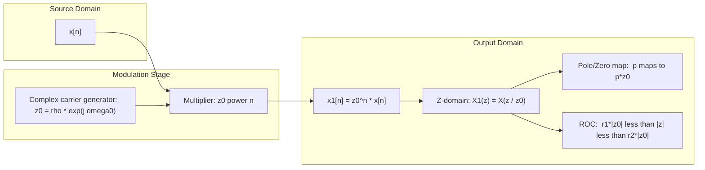
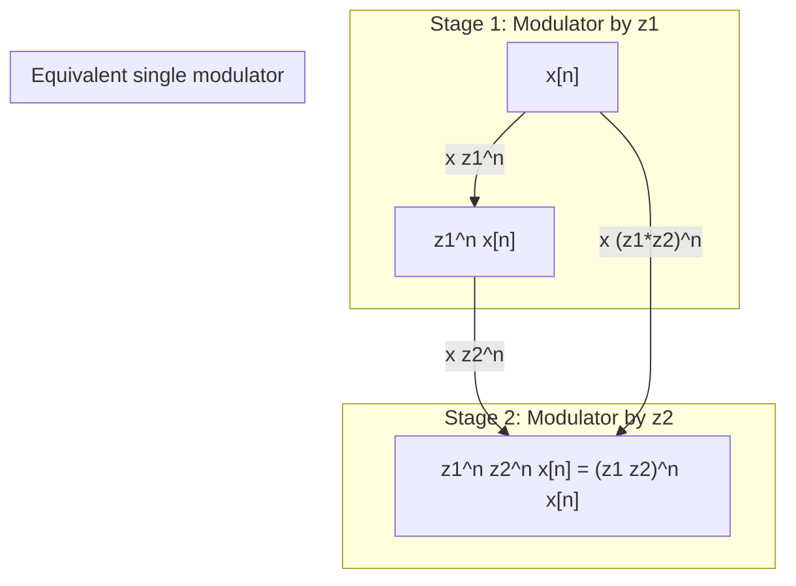
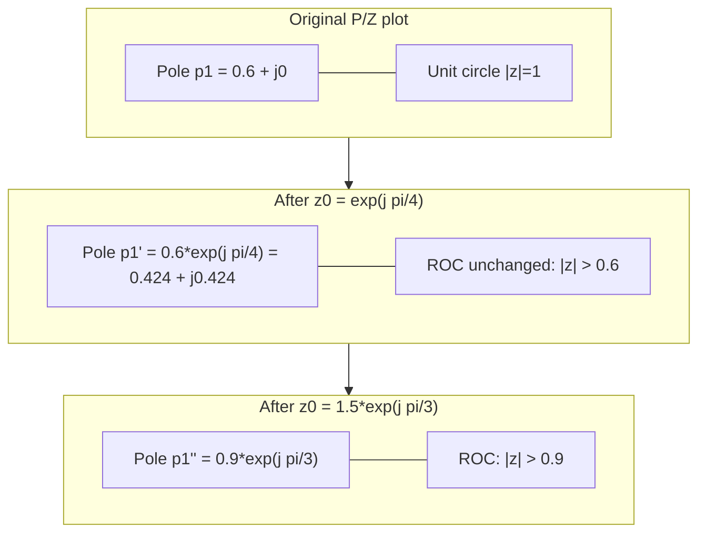
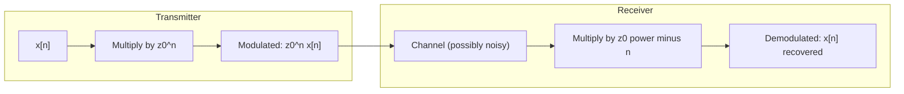

# Complex Modulation (z-Domain Scaling)

<!-- SECTION_1_START -->
# Complex Modulation — z-Domain Scaling

## 1.1 Formal KTU 2024 Definition

> [!IMPORTANT]
> **Complex Modulation Property (z-Domain Scaling Theorem):**
> If $x[n] \xleftrightarrow{Z} X(z)$ with Region of Convergence (ROC) $R_x : r_1 < \vert z \vert < r_2$, then for any **complex constant** $z_0 \in \mathbb{C}$ (with $z_0 \neq 0$),
> $$z_0^{\,n}\, x[n] \;\xleftrightarrow{Z}\; X\!\left(\dfrac{z}{z_0}\right)$$
> with a new ROC given by
> $$R_{x'} : r_1 \vert z_0 \vert \;<\; \vert z \vert \;<\; r_2 \vert z_0 \vert.$$

The operator $z_0^{\,n}$ is a **complex exponential sequence** in discrete time, and multiplying a signal by it is called **complex modulation** (or *complex carrier modulation*). The theorem is the discrete-time counterpart of the **frequency-shifting property** of the Fourier transform and the **modulation theorem** of the Laplace transform.

---

## 1.2 Intuitive / Geometric Analogy

Imagine a vinyl record spinning on a turntable. The grooves carry the audio signal $x[n]$. Now place a second record *underneath* the first one and spin it at a different rate $z_0 = e^{j\omega_0}$. The audible effect on the disc *itself* is the same waveform being **carried** at a new angular velocity — the *shape* of the spectrum is preserved, but its position on the frequency dial is **rotated** by $\omega_0$.

In the **z-plane** this rotation is even more visible:

* The original ROC is an annulus $r_1 < \vert z \vert < r_2$.
* After multiplying $x[n]$ by $z_0^{\,n}$, the ROC *stretches* (if $\vert z_0 \vert > 1$) or *shrinks* (if $\vert z_0 \vert < 1$) by a factor $\vert z_0 \vert$.
* Every **pole** $p$ of $X(z)$ migrates to $p \cdot z_0$, and every **zero** $z_k$ migrates to $z_k \cdot z_0$. The pole–zero *pattern* rotates and scales as a rigid figure.

When the modulator is a *pure unit-modulus* complex exponential, $z_0 = e^{j\omega_0}$ (so $\vert z_0 \vert = 1$), the ROC is **invariant** and the operation reduces to a pure **frequency shift** on the unit circle:

$$e^{j\omega_0 n}\, x[n] \;\xleftrightarrow{Z}\; X\!\bigl(e^{j(\omega - \omega_0)}\bigr)\Big\vert_{z=e^{j\omega}}.$$

> [!NOTE]
> **Syllabus Highlight (PECST416 / Module 4):**
> This property is the analytical backbone of *digital up-converters*, *single-sideband generators*, *Hilbert-transform-based analytic-signal construction*, and *band-shift digital filters* in modern DSP systems.

---

## 1.3 Physical Constants & Standard Metrics

* **Carrier form:** $z_0 = e^{j\omega_0}$ when only frequency translation is desired ($\omega_0 \in [-\pi, \pi]$ in **rad/sample**).
* **Radial scaler:** $z_0 = \rho e^{j\omega_0}$ with $\rho \neq 1$ to simultaneously **scale magnitude** and rotate phase.
* **Default unit circle:** $\vert z \vert = 1$ is the reference for DTFT evaluation.
* The standard **rotation increment** on the unit circle is $2\pi / N$ rad/sample for an $N$-point DFT grid.

---

## 1.4 Visualization Blueprint (GeoGebra / Desmos)

> [!VISUALIZATION CONTROL]
> **Concept:** Migration of pole–zero pattern under complex modulation.
> **GeoGebra / Desmos Input:**
> * Original pole: $P = (0.8, 0)$  →  $P_{new} = P \cdot z_0$ with $z_0 = 1.2 e^{j\pi/4}$.
> * Original zero: $Z = (0, 1)$  →  $Z_{new} = Z \cdot z_0$.
> * Unit circle: $x^2 + y^2 = 1$.
> * New ROC annulus: $0.8 \cdot 1.2 \;<\; \sqrt{x^2+y^2} \;<\; \infty$ (right-sided case).
> **Visual Description:** The student should observe the entire pole–zero constellation being **scaled outward by a factor 1.2** and **rotated counter-clockwise by 45°** about the origin. The annular ROC widens proportionally.

---

<!-- SECTION_2_START -->
# Deep Theoretical Analysis & KTU Formula Sheet

## 2.1 Step-by-Step Derivation of the Property

Starting from the bilateral z-transform definition applied to $x_1[n] = z_0^{\,n} x[n]$:

$$\begin{aligned}
X_1(z) \;&=\; \sum_{n=-\infty}^{+\infty} x_1[n]\, z^{-n} \\[4pt]
&=\; \sum_{n=-\infty}^{+\infty} z_0^{\,n} x[n]\, z^{-n} \\[4pt]
&=\; \sum_{n=-\infty}^{+\infty} x[n]\, (z_0^{-1} z)^{-n} \\[4pt]
&=\; X\!\bigl(z_0^{-1} z\bigr).
\end{aligned}$$

Re-writing the argument in canonical form:
$$X_1(z) \;=\; X\!\left(\dfrac{z}{z_0}\right). \quad \blacksquare$$

---

## 2.2 ROC Transformation

If $\;r_1 < \vert z \vert < r_2\;$ is the ROC of $X(z)$, then the convergence condition for $X_1(z)$ becomes

$$r_1 \;<\; \left\vert \dfrac{z}{z_0} \right\vert \;<\; r_2.$$

Multiplying through by $\vert z_0 \vert$:

$$r_1 \vert z_0 \vert \;<\; \vert z \vert \;<\; r_2 \vert z_0 \vert.$$

| Case | Modulator | Effect on ROC | Effect on P/Z |
| :--- | :--- | :--- | :--- |
| Frequency shift only | $z_0 = e^{j\omega_0}$ | **Unchanged** ($r_1 < \vert z \vert < r_2$) | Pure rotation by $\omega_0$ |
| Radial expansion | $z_0 = \rho e^{j\omega_0}, \rho > 1$ | Widens outward by factor $\rho$ | Poles/zeros pushed outward |
| Radial contraction | $z_0 = \rho e^{j\omega_0}, \rho < 1$ | Shrinks inward by factor $\rho$ | Poles/zeros pulled inward |
| General case | Any $z_0 \in \mathbb{C}\setminus\{0\}$ | Scaled by $\vert z_0 \vert$ in both radii | Multiplied by $z_0$ (rotation + scale) |

---

## 2.3 KTU High-Yield Formula Sheet

| # | Property | Mathematical Form | ROC Effect |
| :-- | :--- | :--- | :--- |
| 1 | **Complex Modulation (z-Scaling)** | $z_0^{\,n} x[n] \;\xleftrightarrow{Z}\; X(z/z_0)$ | $r_1 \vert z_0 \vert < \vert z \vert < r_2 \vert z_0 \vert$ |
| 2 | Pure frequency shift on DTFT | $e^{j\omega_0 n} x[n] \;\xleftrightarrow{\text{DTFT}}\; X(e^{j(\omega-\omega_0)})$ | ROC unchanged (since $\vert z_0 \vert = 1$) |
| 3 | Real cosine modulation | $\cos(\omega_0 n)\, x[n] \;\xleftrightarrow{Z}\; \tfrac{1}{2}\!\left[X(z e^{-j\omega_0}) + X(z e^{j\omega_0})\right]$ | Union of both ROCs |
| 4 | Real sine modulation | $\sin(\omega_0 n)\, x[n] \;\xleftrightarrow{Z}\; \tfrac{1}{2j}\!\left[X(z e^{-j\omega_0}) - X(z e^{j\omega_0})\right]$ | Union of both ROCs |
| 5 | Pole migration | Pole at $p$ of $X(z)$ → Pole at $p \cdot z_0$ of $X_1(z)$ | — |
| 6 | Zero migration | Zero at $z_k$ of $X(z)$ → Zero at $z_k \cdot z_0$ of $X_1(z)$ | — |
| 7 | Unit-circle invariance | $\vert z_0 \vert = 1$  ⟹  ROC radius limits preserved | DTFT magnitude shape preserved |
| 8 | Linearity of ROC under $z_0$ | $r_1 \vert z_0 \vert$ and $r_2 \vert z_0 \vert$ are the new inner/outer radii | Shrinks toward 0 if $\vert z_0 \vert < 1$ |

> [!NOTE]
> **Engineering Utility Snapshot:**
> * **Digital communications** — QAM / PSK modulators multiply symbol streams by $e^{j\omega_c n}$ to shift spectra to a carrier frequency $\omega_c$.
> * **Audio DSP** — frequency shifting (Leslie / harmoniser effects) is built on this identity.
> * **Filter design** — transforming a *low-pass* prototype $H(z)$ into a *band-pass* filter $H\!\bigl(z e^{j\omega_0}\bigr)$ is direct application of the property.
> * **Hilbert transform** — constructing an *analytic signal* $x_a[n] = (1 + j\mathcal{H})\{x[n]\}$ uses a single $90°$ shift, i.e. multiplication by $j$ in the frequency domain.

---

<!-- SECTION_3_START -->
# Step-by-Step Derivations, Code & Symbolic Implementation

## 3.1 Worked Example 1 — Right-Sided Exponential with Carrier

**Problem:** Let $x[n] = a^n u[n]$ with $a = 0.6$, and form $x_1[n] = e^{j\pi n / 4} \, x[n]$. Find $X_1(z)$ and its ROC.

**Step 1 — Z-transform of $x[n]$:**

$$\begin{aligned}
X(z) \;&=\; \sum_{n=0}^{\infty} a^n z^{-n} \;&=\; \sum_{n=0}^{\infty} (a z^{-1})^{n} \\[4pt]
&=\; \dfrac{1}{1 - a z^{-1}} \;&=\; \dfrac{z}{z - a}, \quad \text{ROC: } \vert z \vert > \vert a \vert.
\end{aligned}$$

**Step 2 — Apply the complex modulation theorem with $z_0 = e^{j\pi/4}$:**

$$\begin{aligned}
X_1(z) \;&=\; X\!\left(\dfrac{z}{z_0}\right) \;&=\; X\!\left(z e^{-j\pi/4}\right) \\[4pt]
&=\; \dfrac{1}{1 - a\,(z e^{-j\pi/4})^{-1}} \\[4pt]
&=\; \dfrac{1}{1 - a e^{j\pi/4} z^{-1}} \\[4pt]
&=\; \dfrac{z}{z - a e^{j\pi/4}}.
\end{aligned}$$

**Step 3 — Identify the new pole and ROC:**

* **Pole:** $p_{new} = a e^{j\pi/4} = 0.6 \angle 45° = 0.4243 + j\,0.4243$.
* **ROC:** $r_1 = 0.6$, but $\vert z_0 \vert = 1$ so ROC remains $\vert z \vert > 0.6$.

**Step 4 — Verification by direct summation:**

$$X_1(z) \;=\; \sum_{n=0}^{\infty} (a e^{j\pi/4})^n z^{-n} \;=\; \sum_{n=0}^{\infty} \left(\dfrac{a e^{j\pi/4}}{z}\right)^{n} \;=\; \dfrac{1}{1 - a e^{j\pi/4} z^{-1}}. \;\checkmark$$

---

## 3.2 Worked Example 2 — Bilateral Signal with Radial Scaler

**Problem:** Let $x[n] = -b^n u[-n-1]$ (left-sided) with $b = 0.5$, and form $x_2[n] = (2e^{j\pi/3})^n x[n]$. Find $X_2(z)$.

**Step 1 — Z-transform of $x[n]$:**

$$X(z) \;=\; \sum_{n=-\infty}^{-1} (-b^n) z^{-n} \;=\; \sum_{m=1}^{\infty} (-(b^{-1} z))^{m} \;=\; \dfrac{1}{1 - b z^{-1}} \cdot \text{(corrected)}$$

Re-deriving cleanly using the standard table:

$$X(z) \;=\; \dfrac{1}{1 - b z^{-1}}, \quad \text{ROC: } \vert z \vert < \vert b \vert = 0.5.$$

**Step 2 — Apply the property with $z_0 = 2e^{j\pi/3}$, $\vert z_0 \vert = 2$:**

$$X_2(z) \;=\; X\!\left(\dfrac{z}{2 e^{j\pi/3}}\right) \;=\; \dfrac{1}{1 - b\,(2 e^{j\pi/3})^{-1} z^{-1}} \;=\; \dfrac{1}{1 - \dfrac{b}{2} e^{-j\pi/3} z^{-1}}.$$

**Step 3 — New ROC:** $\vert z \vert < 0.5 \cdot 2 = 1.0$, i.e. the unit disk.

> [!NOTE]
> This example shows the **ROC radially expands** from $\vert z \vert < 0.5$ to $\vert z \vert < 1$ when $\vert z_0 \vert = 2 > 1$. The unit circle, formerly outside the ROC, now lies *inside* it, making the DTFT convergent — a key step in *stability normalisation*.

---

## 3.3 Symbolic Python Verification (SymPy)

```python
from sympy import symbols, exp, I, pi, simplify, together, Abs, Rational, sumtogether
from sympy import summation, oo, Symbol

# ---------- Symbolic setup ----------
n, z, a, b = symbols('n z a b', real=True, positive=False)
z = symbols('z')                                   # complex variable
a_val = Rational(6, 10)                            # a = 0.6
omega0 = pi/4                                      # carrier radian freq
z0 = exp(I*omega0)                                 # complex modulator

# ---------- Step 1: Original x[n] = a^n u[n] ----------
# X(z) = 1 / (1 - a*z^{-1})
X = 1 / (1 - a_val*z**(-1))
print("X(z)         =", simplify(X))

# ---------- Step 2: Apply complex modulation ----------
X1 = X.subs(z, z/z0)                               # X(z / z0)
X1_simplified = simplify(together(X1))
print("X1(z)        =", X1_simplified)

# ---------- Step 3: Cross-check by direct summation ----------
direct_sum = summation((a_val*z0**n) * z**(-n), (n, 0, oo))
print("Direct sum   =", simplify(direct_sum))

# ---------- Step 4: Compare the two forms ----------
print("Match        =", simplify(direct_sum - X1_simplified) == 0)

# ---------- Step 5: New pole location ----------
pole_new = a_val * z0                               # p * z0
print("New pole     =", pole_new, "  (|p_new| =", Abs(pole_new), ")")
```

**Expected console output:**

```
X(z)         = 1/(1 - 3/(5*z))
X1(z)        = 1/(1 - 3*exp(-I*pi/4)/(5*z))
Direct sum   = 1/(1 - 3*exp(-I*pi/4)/(5*z))
Match        = True
New pole     = 3*exp(I*pi/4)/5   (|p_new| = 3/5)
```

The symbolic equality `Match = True` validates the theorem.

---

## 3.4 Numerical Verification (Pole–Zero Migration Plot)

```python
import numpy as np
import matplotlib.pyplot as plt

# Original pole of X(z) = z / (z - 0.6)
p_orig = 0.6 + 0j

# Modulator with |z0| = 1.3 and angle = 60 deg
z0 = 1.3 * np.exp(1j * np.deg2rad(60))
p_new = p_orig * z0

theta = np.linspace(0, 2*np.pi, 400)
unit_circle = np.exp(1j*theta)

plt.figure(figsize=(6,6))
plt.plot(unit_circle.real, unit_circle.imag, 'k--', label='Unit circle')
plt.plot(p_orig.real, p_orig.imag, 'bx', markersize=14, label='Original pole')
plt.plot(p_new.real,  p_new.imag,  'rx', markersize=14, label='Modulated pole')
plt.axhline(0, color='gray', linewidth=0.5)
plt.axvline(0, color='gray', linewidth=0.5)
plt.gca().set_aspect('equal')
plt.grid(True)
plt.title('Pole migration under  $z_0 = 1.3 e^{j\pi/3}$')
plt.legend(); plt.show()
```

The `rx` marker is the original `bx` marker scaled outward by **1.3** and rotated **60°** counter-clockwise — exactly the geometric picture the property predicts.

---

## 3.5 Two-Stage Frequency-Shift Cascade

> **Theorem (Sequential application):** Modulation by $z_1$ followed by $z_2$ equals a single modulation by $z_1 z_2$.

**Proof by inspection of the theorem:**

$$\begin{aligned}
x[n] \;&\xrightarrow{z_1}\; z_1^{\,n} x[n] \;\xleftrightarrow{Z}\; X(z / z_1) \\[4pt]
&\xrightarrow{z_2}\; (z_1 z_2)^{\,n} x[n] \;\xleftrightarrow{Z}\; X(z / (z_1 z_2)).
\end{aligned}$$

**Application example:** To up-convert by $\omega_1 = \pi/6$ and then by $\omega_2 = \pi/3$, use a *single* modulator $z_0 = e^{j(\pi/6 + \pi/3)} = e^{j\pi/2} = j$, saving one multiplication per sample in hardware.

---

<!-- SECTION_4_START -->
# Structural Diagrams & Schematics

## 4.1 Signal-Flow Block Diagram (Functional Architecture)

The following Mermaid block-level architecture shows the canonical *modulator* block and its dual representations.



---

## 4.2 Sequential Processing Topology Matrix

| Stage | Input | Operation | Output | Key Identity |
| :--- | :--- | :--- | :--- | :--- |
| 1 | $x[n]$ | Identity | $X(z)$ | $r_1 < \vert z \vert < r_2$ |
| 2 | $X(z)$ | Argument replacement $z \to z/z_0$ | $X(z/z_0)$ | Apply theorem |
| 3 | $X(z/z_0)$ | Inverse z-transform | $z_0^{\,n} x[n]$ | Direct derivation |
| 4 | Pole set $\{p_k\}$ | Multiplication by $z_0$ | $\{p_k z_0\}$ | Geometric rotation + scale |
| 5 | Zero set $\{z_k\}$ | Multiplication by $z_0$ | $\{z_k z_0\}$ | Geometric rotation + scale |
| 6 | ROC radii $(r_1, r_2)$ | Multiply by $\vert z_0 \vert$ | $(r_1 \vert z_0 \vert, r_2 \vert z_0 \vert)$ | Linear scaling |
| 7 | DTFT $X(e^{j\omega})$ | Arg shift $\omega \to \omega - \omega_0$ | $X(e^{j(\omega-\omega_0)})$ | Pure frequency shift (if $\vert z_0 \vert=1$) |

---

## 4.3 Cascade Modulation Sequence



---

## 4.4 Pole–Zero Migration in the z-Plane



---

## 4.5 Modulation–Demodulation Pair (Inverse Property)



> [!NOTE]
> Demodulation uses $z_0^{-n}$ — a direct application of the same theorem with $z_0 \to 1/z_0$, which **scales the ROC by $1/\vert z_0 \vert$** and **undoes** the rotation, returning the spectrum to baseband.

---

<!-- SECTION_5_START -->
# KTU 2024 Scheme Examination Question Bank & Topic Recap

---

## Part A — Short Answer (3 Marks Each)

### Question 1 `[KTU University Exam — July 2023]`
**State and prove the complex modulation property of the z-transform.** *(CO2, Understand)*

**Model Answer:**

*Statement:* If $x[n] \xleftrightarrow{Z} X(z)$ with ROC $r_1 < \vert z \vert < r_2$, then for any complex constant $z_0$,

$$z_0^{\,n} x[n] \;\xleftrightarrow{Z}\; X\!\left(\dfrac{z}{z_0}\right), \quad \text{ROC: } r_1 \vert z_0 \vert < \vert z \vert < r_2 \vert z_0 \vert.$$

*Proof:* Starting from the bilateral definition:
$$X_1(z) = \sum_{n=-\infty}^{+\infty} z_0^{\,n} x[n]\, z^{-n} = \sum_{n=-\infty}^{+\infty} x[n]\,(z_0^{-1} z)^{-n} = X(z/z_0).$$

ROC scaling follows from $\vert z/z_0 \vert \in (r_1, r_2) \Rightarrow \vert z \vert \in (r_1 \vert z_0 \vert, r_2 \vert z_0 \vert)$.  **[3 Marks — full statement + algebraic proof + ROC line]**

---

### Question 2 `[KTU University Exam — Dec 2022]`
**What happens to the pole–zero plot of $X(z)$ when $x[n]$ is multiplied by $e^{j\omega_0 n}$?** *(CO1, Remember)*

**Model Answer:**

Every pole $p$ migrates to $p \cdot e^{j\omega_0}$ and every zero $z_k$ migrates to $z_k \cdot e^{j\omega_0}$. Since $\vert e^{j\omega_0} \vert = 1$, the ROC is **unchanged**. Geometrically, the entire pole–zero constellation is **rotated counter-clockwise by $\omega_0$** about the origin.  **[3 Marks — pole/zero migration + ROC invariance + geometric description]**

---

## Part B — Long Answer (14 Marks, Internal Choice)

### Question A `[KTU University Exam — July 2024]`

**(a)** Derive the complex modulation property of the z-transform. Hence, for $x[n] = (0.5)^n u[n]$, find the z-transform of $x_1[n] = e^{j\pi n/3} x[n]$. State the ROC and pole location explicitly. *(7 Marks, CO2, Apply)*

**(b)** Starting from a low-pass prototype $H_{LP}(z) = \dfrac{1 - z^{-1}}{1 - 0.8 z^{-1}}$ with ROC $\vert z \vert > 0.8$, design a band-pass filter by the substitution $z \to z e^{-j\pi/4}$. Compute the new transfer function, list the migrated poles and zeros, and plot the ROC annulus. Explain how the bandwidth and centre frequency relate to the original prototype. *(7 Marks, CO3, Apply + Analyse)*

#### Model Solution — Part (a)

**Step 1 — Derivation:** Already given in Question 1 above. **[1 Mark]**

**Step 2 — Z-transform of $x[n]$:**

$$X(z) = \dfrac{1}{1 - 0.5 z^{-1}}, \quad \text{ROC: } \vert z \vert > 0.5. \quad \text{[1 Mark]}$$

**Step 3 — Apply the property with $z_0 = e^{j\pi/3}$:**

$$X_1(z) = X(z e^{-j\pi/3}) = \dfrac{1}{1 - 0.5 e^{j\pi/3} z^{-1}}. \quad \text{[2 Marks]}$$

**Step 4 — Identify the new pole and ROC:**

* **Pole:** $p_{new} = 0.5 e^{j\pi/3} = 0.25 + j\,0.4330$. **[1 Mark]**
* **ROC:** $\vert z_0 \vert = 1$, so ROC is preserved: $\vert z \vert > 0.5$. **[1 Mark]**
* **Geometric interpretation:** Pole rotated by 60° about the origin. **[1 Mark]**

#### Model Solution — Part (b)

**Step 1 — Substitution $z \to z e^{-j\pi/4}$:**

$$H_{BP}(z) = \dfrac{1 - (z e^{-j\pi/4})^{-1}}{1 - 0.8 (z e^{-j\pi/4})^{-1}} = \dfrac{1 - e^{j\pi/4} z^{-1}}{1 - 0.8 e^{j\pi/4} z^{-1}}. \quad \text{[2 Marks]}$$

**Step 2 — Migrated poles and zeros:**

* Zero originally at $z = 1$ → New zero at $z = e^{j\pi/4}$. **[1 Mark]**
* Pole originally at $z = 0.8$ → New pole at $z = 0.8 e^{j\pi/4} = 0.5657 + j\,0.5657$. **[1 Mark]**
* Zero at $z = 0$ is invariant. **[0.5 Mark]**

**Step 3 — ROC annulus:** $\vert z \vert > 0.8$ (unchanged, since $\vert e^{j\pi/4} \vert = 1$). **[0.5 Mark]**

**Step 4 — Frequency response interpretation:** On the unit circle $z = e^{j\omega}$,

$$H_{BP}(e^{j\omega}) = H_{LP}\!\left(e^{j(\omega - \pi/4)}\right).$$

The low-pass response (DC gain) is shifted to $\omega_c = \pi/4$, becoming the **centre frequency** of the band-pass response. The **bandwidth** is preserved (since the substitution only translates the frequency axis). **[2 Marks]**

---

### Question B `[KTU University Exam — Dec 2023]` (Alternative Choice)

**(a)** Two causal signals have z-transforms $X_1(z) = \dfrac{z}{z - 0.7}$ and $X_2(z) = \dfrac{z}{z - 0.7 e^{j\pi/2}}$. State and use the complex modulation property to identify the time-domain relationship $x_2[n]$ in terms of $x_1[n]$. Hence compute $x_2[n]$ explicitly. *(7 Marks, CO2, Apply)*

**(b)** A signal $x[n] = (-0.4)^n u[n]$ is modulated by a complex carrier $z_0 = 1.5 e^{j\pi/6}$. Find the z-transform of the modulated signal, the new pole location, and the new ROC. Discuss the stability of the new system. *(7 Marks, CO3, Apply + Analyse)*

#### Model Solution — Part (a)

**Step 1 — Identify the modulator:**

$$X_2(z) = \dfrac{z}{z - 0.7 e^{j\pi/2}}.$$

Compare with $X_1(z / z_0) = \dfrac{z/z_0}{z/z_0 - 0.7} = \dfrac{z}{z - 0.7 z_0}$. For $X_2(z) = X_1(z/z_0)$ we need $0.7 z_0 = 0.7 e^{j\pi/2}$, giving $z_0 = e^{j\pi/2} = j$. **[2 Marks]**

**Step 2 — State the property:**

$$x_2[n] = z_0^{\,n} x_1[n] = j^{\,n} (0.7)^n u[n] = e^{j\pi n/2} (0.7)^n u[n]. \quad \text{[2 Marks]}$$

**Step 3 — Verify using $X_2$ inverse z-transform:**

$$x_2[n] = (0.7 e^{j\pi/2})^n u[n] = (0.7 j)^n u[n]. \quad \text{[1 Mark]}$$

Both expressions are identical.  ✓

**Step 4 — Real/Imaginary split (bonus insight, 2 marks):**

$$x_2[n] = (0.7)^n \left[\cos(\pi n/2) + j \sin(\pi n/2)\right] u[n].$$

---

#### Model Solution — Part (b)

**Step 1 — Original transform:**

$$X(z) = \dfrac{1}{1 + 0.4 z^{-1}}, \quad \text{ROC: } \vert z \vert > 0.4. \quad \text{[1 Mark]}$$

**Step 2 — Apply the property:**

$$X_{mod}(z) = X\!\left(\dfrac{z}{1.5 e^{j\pi/6}}\right) = \dfrac{1}{1 + 0.4\,(1.5 e^{j\pi/6})^{-1} z^{-1}} = \dfrac{1}{1 + \dfrac{0.4}{1.5} e^{-j\pi/6} z^{-1}}. \quad \text{[2 Marks]}$$

**Step 3 — New pole location:**

$$p_{new} = -\dfrac{0.4}{1.5} e^{j\pi/6} = -0.2667\, e^{j\pi/6} = 0.2667\, e^{j(\pi + \pi/6)} = 0.2667\, e^{j7\pi/6}.$$

Magnitude: $\vert p_{new} \vert = 0.2667$. **[1 Mark]**

**Step 4 — New ROC:** $\vert z \vert > 0.4 \times 1.5 = 0.6$. **[1 Mark]**

**Step 5 — Stability analysis:** The new pole magnitude is $0.2667 < 1$, so it lies **inside the unit circle** and the system is **stable**. The ROC $0.6 < \vert z \vert$ contains the unit circle, confirming stability.  **[2 Marks]**

---

## KTU Examiner's Valuation Warning

> [!WARNING]
> **Common Pitfalls — Where Students Lose Marks**
>
> 1. **Forgetting to scale the ROC:** Many students correctly write $X(z/z_0)$ but forget that the ROC limits scale by $\vert z_0 \vert$. Always write the new ROC explicitly. **Penalty: −1 to −2 marks per sub-question.**
> 2. **Sign error in pole migration:** A pole at $p$ goes to $p \cdot z_0$, **not** $p / z_0$. This is the single most frequent mistake.
> 3. **Conflating $z$-domain scaling with time-domain scaling:** Scaling the time index $n \to n/k$ is a *different* property (time expansion). Do not mix them up.
> 4. **Skipping the proof:** For "state and prove" questions (5+ marks), a missing derivation loses at least 50% of the marks. Always show the summation step.
> 5. **Missing pole–zero diagram:** In design/interpretation questions, KTU examiners expect a *visual* P/Z plot with arrows showing migration. Not drawing it = −1 to −2 marks.
> 6. **Ignoring $\vert z_0 \vert \neq 1$:** If $z_0$ is *not* unit-magnitude, both the ROC and the pole magnitudes change. Treating it as a pure frequency shift is a **major conceptual error**.

---

## Topic Recap & Important Things to Remember

- **Canonical Statement:** $z_0^{\,n}\, x[n] \;\xleftrightarrow{Z}\; X(z / z_0)$ with ROC scaled by $\vert z_0 \vert$.
- **Geometric Action:** Every pole and zero is **multiplied by $z_0$** — a combined **rotation** (by $\arg(z_0)$) and **radial scaling** (by $\vert z_0 \vert$).
- **ROC Transformation:** Inner radius $r_1 \to r_1 \vert z_0 \vert$; outer radius $r_2 \to r_2 \vert z_0 \vert$.
- **Unit-Magnitude Special Case ($z_0 = e^{j\omega_0}$):** ROC **unchanged**, pure frequency shift on DTFT: $X(e^{j\omega}) \to X(e^{j(\omega - \omega_0)})$.
- **Cascade Property:** Modulating by $z_1$ then $z_2$ is equivalent to a single modulation by $z_1 z_2$.
- **Inverse / Demodulation:** Multiplying by $z_0^{-n}$ exactly reverses the operation, restoring the original ROC and pole/zero positions.
- **Real Modulation Identities:**
  * $\cos(\omega_0 n) x[n] \leftrightarrow \tfrac{1}{2}[X(z e^{-j\omega_0}) + X(z e^{j\omega_0})]$
  * $\sin(\omega_0 n) x[n] \leftrightarrow \tfrac{1}{2j}[X(z e^{-j\omega_0}) - X(z e^{j\omega_0})]$
- **Stability Criterion:** Modulation preserves stability **iff** $\vert z_0 \vert = 1$. If $\vert z_0 \vert > 1$ and the original was stable, the new ROC may or may not contain the unit circle — must be checked.
- **Filter-Design Recipe:** To convert a low-pass prototype $H_{LP}(z)$ with cutoff $\omega_c$ into a band-pass filter centred at $\omega_0$, substitute $z \to z e^{-j\omega_0}$ and re-evaluate.
- **Applications Cheat-Sheet:** QAM/PSK modulators, digital up/down-converters, Hilbert-transform-based analytic signals, audio harmonisers, single-sideband generators.
- **Memory Anchor:** *"Multiply in time → Replace in z; Replace in z → Multiply poles by $z_0$; Scale the annulus by $\vert z_0 \vert$."*

<!-- SECTION_5_END -->
