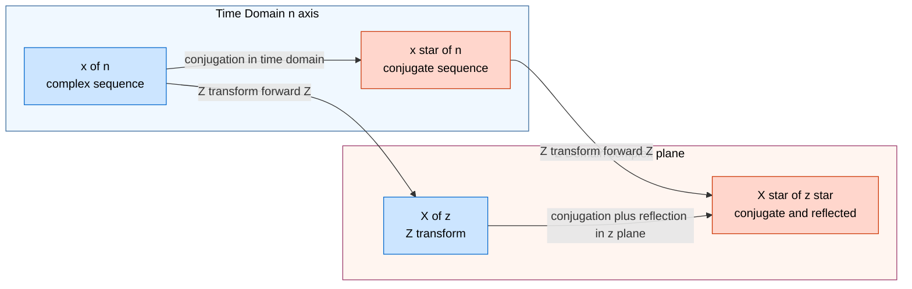
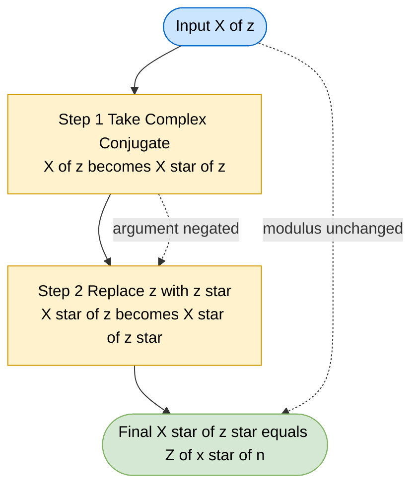
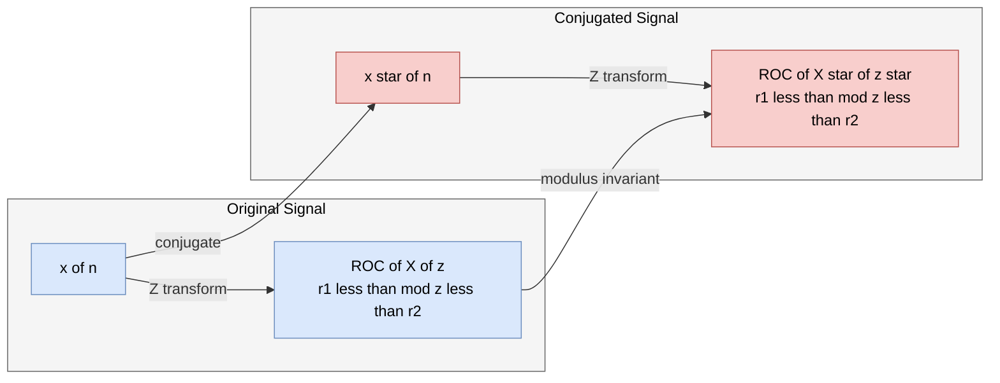
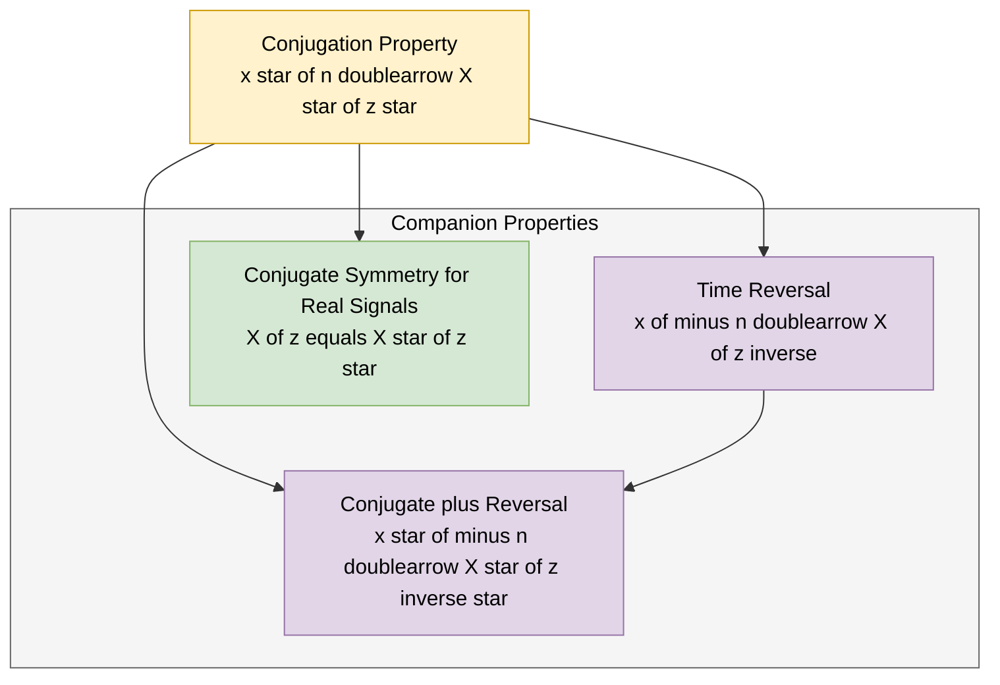

# Conjugation

<!-- SECTION_1_START -->

# 1. Conjugation Property of the Z-Transform

## 1.1 Formal Academic Definition (KTU 2024 Syllabus Terminology)

> [!IMPORTANT]
> **Conjugation Property (Statement)**
>
> If $x(n)$ is a discrete-time complex sequence and $X(z)$ is its Z-transform, i.e.,
> $$x(n) \xleftrightarrow{\mathcal{Z}} X(z)$$
> then the complex conjugate of the sequence $x(n)$ has a Z-transform given by the complex conjugate of $X(z)$ evaluated at $z^{\*}$. Formally,
> $$x^{\*}(n) \xleftrightarrow{\mathcal{Z}} X^{\*}(z^{\*})$$
> where the **Region of Convergence (ROC)** of $X^{\*}(z^{\*})$ is identical to the ROC of $X(z)$.

Here, the asterisk $^{*}$ denotes the **complex conjugate** operator. Recall that for a complex number $z = a + jb$, we have $z^{\*} = a - jb$. The property is a direct consequence of the linearity of the Z-transform combined with the conjugate symmetry of the summation operator.

## 1.2 Conceptual Analogy / Intuition

Imagine you are holding a **mirror** in front of a complex-valued signal drawn on the complex plane. The mirror flips the **imaginary axis** — every positive imaginary part becomes a negative imaginary part, and vice versa. The real axis stays exactly the same. This is precisely what complex conjugation does to a signal.

> [!NOTE]
> **Intuitive Picture**
>
> * The time-domain signal $x(n)$ lives on the **complex plane indexed by integer $n$**.
> * The Z-domain function $X(z)$ lives on the **complex $z$-plane** (with $z = re^{j\omega}$).
> * Conjugation in the time domain is **equivalent** to conjugation **followed by reflection** of the $z$-plane (because $z^{\*}$ is the mirror of $z$ about the real axis).
> * Hence, $x^{\*}(n) \leftrightarrow X^{\*}(z^{\*})$ — both the time samples and the $z$-plane points get "mirrored."

If the original signal is purely real ($x^{\*}(n) = x(n)$), the property reduces to $X(z) = X^{\*}(z^{\*})$, which is the well-known **conjugate symmetry property** of the Z-transform for real sequences.

## 1.3 Real and Imaginary Component Decomposition

For any complex sequence $x(n)$, we can decompose it as:
$$x(n) = x_{r}(n) + j\,x_{i}(n)$$
where $x_{r}(n) = \text{Re}\{x(n)\}$ and $x_{i}(n) = \text{Im}\{x(n)\}$. The conjugate is then:
$$x^{\*}(n) = x_{r}(n) - j\,x_{i}(n)$$

The Z-transform of $x^{\*}(n)$ is, by the conjugation property, the complex conjugate of $X(z)$ reflected through the unit circle to $z^{\*}$.

> [!VISUALIZATION CONTROL]
> **Concept:** Reflection of a complex number $z$ and its Z-transform under conjugation.
>
> **GeoGebra / Desmos Input (Complex Plane View):**
>
> * Point $P = (1.5,\, 0.8)$ representing $z = 1.5 + j0.8$.
> * Point $Q = (1.5,\, -0.8)$ representing $z^{\*} = 1.5 - j0.8$.
> * The line segment $PQ$ is vertical and crosses the real axis at $1.5$.
>
> **Visual Description:** The student should observe that $z$ and $z^{\*}$ are mirror images across the real axis of the $z$-plane. The magnitude $\vert z \vert = \vert z^{\*} \vert$ remains unchanged, but the argument changes sign: $\arg(z^{\*}) = -\arg(z)$.

<!-- SECTION_1_END -->

<!-- SECTION_2_START -->

# 2. Deep Theoretical Analysis & KTU High-Yield Formula Sheet

## 2.1 Mathematical Foundation

The **bilateral Z-transform** of a sequence $x(n)$ is defined as:
$$X(z) = \sum_{n=-\infty}^{+\infty} x(n)\,z^{-n}$$

For a sequence $x^{\*}(n)$, the Z-transform is by definition:
$$X_{c}(z) = \sum_{n=-\infty}^{+\infty} x^{\*}(n)\,z^{-n}$$

### Operational Logic Step-by-Step

* **Step 1 — Apply the Z-transform definition to $x^{\*}(n)$:**
  $$X_{c}(z) = \sum_{n=-\infty}^{+\infty} x^{\*}(n)\,z^{-n}$$

* **Step 2 — Take the complex conjugate of the entire summation (using $\sum a_{n}^{\*} = (\sum a_{n})^{\*}$):**
  $$X_{c}(z) = \left[ \sum_{n=-\infty}^{+\infty} x(n)\,(z^{-n})^{\*} \right]^{*} = \left[ \sum_{n=-\infty}^{+\infty} x(n)\,(z^{*})^{-n} \right]^{*}$$

  This step uses the algebraic identity $(a^{\*}b^{\*}) = (ab)^{\*}$ and the property that the conjugate of a sum equals the sum of conjugates.

* **Step 3 — Recognise the bracketed sum as $X(z^{\*})$:**
  $$\sum_{n=-\infty}^{+\infty} x(n)\,(z^{*})^{-n} = X(z^{*})$$

* **Step 4 — Conclude:**
  $$X_{c}(z) = \left[ X(z^{*}) \right]^{*} = X^{*}(z^{*})$$

* **Step 5 — Region of Convergence (ROC):**
  Because conjugation does not change the modulus $\vert z \vert = \vert z^{\*} \vert$, the ROC — which depends only on $\vert z \vert$ — is **invariant** under conjugation. Hence,
  $$\text{ROC}\{x^{*}(n)\} = \text{ROC}\{x(n)\}$$

## 2.2 Why This Property Matters (Engineering Utility)

> [!NOTE]
> **Engineering Significance**
>
> * **Spectral Analysis:** Used heavily in digital communications to determine the **Hermitian symmetry** of the Discrete-Time Fourier Transform (DTFT), which corresponds to evaluating the Z-transform on the unit circle ($z = e^{j\omega}$).
> * **Filter Design:** Real-valued digital filters (FIR / IIR) always have a transfer function that satisfies $H(z) = H^{\*}(z^{\*})$. The conjugation property is the formal proof of this symmetry.
> * **Signal Reconstruction:** Used in modulation schemes (e.g., QAM, PSK) where the in-phase and quadrature components must be processed with conjugate-symmetric counterparts.
> * **Hilbert Transform Relationships:** The real and imaginary parts of the spectrum of an analytic signal are related by the Hilbert transform, which directly invokes this property.

## 2.3 Companion Properties (For Exam Comparison)

The conjugation property works in tandem with two closely related properties:

| Property | Time Domain | Z-Domain | ROC |
|----------|-------------|----------|-----|
| **Conjugation** | $x^{*}(n)$ | $X^{*}(z^{*})$ | Same as $X(z)$ |
| **Time Reversal** | $x(-n)$ | $X(z^{-1})$ | Reflected: $r_{2} < \vert z \vert < r_{1}$ reversed |
| **Conjugate + Reversal** | $x^{*}(-n)$ | $X^{*}((z^{*})^{-1})$ | Same as $X(z)$ |
| **Real Sequence Symmetry** | $x(n) = x^{*}(n)$ (real) | $X(z) = X^{*}(z^{*})$ | — |

## 2.4 KTU Formula Cheat Sheet

| # | Property / Formula | Statement | Condition / Note |
|---|-------------------|-----------|------------------|
| 1 | **Z-transform Definition** | $X(z) = \sum_{n=-\infty}^{+\infty} x(n)\,z^{-n}$ | Bilateral form |
| 2 | **Conjugation Property (Main)** | $x^{*}(n) \xleftrightarrow{\mathcal{Z}} X^{*}(z^{*})$ | ROC unchanged |
| 3 | **Conjugate Identity** | $(z^{*})^{-n} = (z^{-n})^{*}$ | Applies for all $n \in \mathbb{Z}$ |
| 4 | **Modulus Invariance** | $\vert z \vert = \vert z^{*} \vert$ | Implies ROC invariance |
| 5 | **Argument Reflection** | $\arg(z^{*}) = -\arg(z)$ | Key to spectral symmetry |
| 6 | **Real-Sequence Special Case** | $X(z) = X^{*}(z^{*})$ | When $x(n) \in \mathbb{R}$ |
| 7 | **Polar Form Equivalence** | If $z = re^{j\omega}$, then $z^{*} = re^{-j\omega}$ | Frequency negation |

> **Critical Note for KTU Exams:** Always remember the **two** conjugations — one on the sequence, **two** operations on the transform: a conjugate AND a replacement $z \to z^{*}$. Students frequently forget the $z \to z^{*}$ step and lose marks.

<!-- SECTION_2_END -->

<!-- SECTION_3_START -->

# 3. Step-by-Step Derivations, Worked Examples & Symbolic Implementation

## 3.1 Exhaustive Derivation of the Conjugation Property

Starting from the bilateral Z-transform definition and the algebraic identity $(ab)^{*} = a^{*}b^{*}$, we derive the property in full logical chain.

$$
\begin{aligned}
X_{c}(z) &= \sum_{n=-\infty}^{+\infty} x^{*}(n)\,z^{-n} &&\text{[Apply Z-transform to } x^{*}(n) \text{]} \\[4pt]
&= \sum_{n=-\infty}^{+\infty} \big[x(n)\big]^{*}\,z^{-n} &&\text{[Definition of conjugate sequence]} \\[4pt]
&= \left[ \sum_{n=-\infty}^{+\infty} \big[x(n)\big]\,(z^{-n})^{*} \right]^{*} &&\text{[Identity: } \sum a^{*}_{n} = (\sum a_{n})^{*} \text{ and } (z^{-n})^{*} = (z^{*})^{-n}] \\[4pt]
&= \left[ \sum_{n=-\infty}^{+\infty} x(n)\,(z^{*})^{-n} \right]^{*} &&\text{[Group conjugate terms inside brackets]} \\[4pt]
&= \left[ X(z^{*}) \right]^{*} &&\text{[Recognise the bracketed sum as } X(z^{*})] \\[4pt]
X_{c}(z) &= X^{*}(z^{*}) &&\text{[Final Conjugation Property Result]}
\end{aligned}
$$

**Textual Justification of Each Conversion Step:**

* **Row 1 → Row 2:** The Z-transform is a *linear* operator applied to each sample $x(n)$ weighted by $z^{-n}$.
* **Row 2 → Row 3:** We invoke the identity that the **conjugate of a finite or convergent infinite sum equals the sum of the conjugates**. This is a direct consequence of the linearity of complex conjugation over $\mathbb{C}$.
* **Row 3 → Row 4:** The identity $(z^{-n})^{*} = (z^{*})^{-n}$ holds because for any complex $z = re^{j\omega}$, $(z^{-n})^{*} = (r^{-n}e^{-j\omega n})^{*} = r^{-n}e^{+j\omega n} = (z^{*})^{-n}$.
* **Row 4 → Row 5:** The summation $\sum_{n} x(n)(z^{*})^{-n}$ is, **by definition of the Z-transform**, equal to $X(z^{*})$.
* **Row 5 → Row 6:** Taking the outer conjugate yields the final result.

## 3.2 Worked Example Problem (KTU Pattern)

**Problem Statement:**
A causal sequence is given by $x(n) = (0.5)^{n} e^{j\pi n / 4}\,u(n)$. Using the conjugation property of the Z-transform, determine the Z-transform of $y(n) = x^{*}(n)$ and identify its ROC.

### Step-by-Step Solution

**Step 1 — Express $x(n)$ in explicit complex form.**

Since $e^{j\pi n / 4} = \cos(\pi n/4) + j\sin(\pi n/4)$, the signal is complex-valued.

**Step 2 — Find $X(z)$ first using the standard exponential formula.**

For a causal sequence of the form $a^{n} u(n)$, the Z-transform is $\dfrac{1}{1 - a z^{-1}}$ with $\text{ROC}: \vert z \vert > \vert a \vert$.

In our case, $a = 0.5\,e^{j\pi/4}$. So:
$$X(z) = \frac{1}{1 - 0.5\,e^{j\pi/4}\,z^{-1}}, \quad \text{ROC: } \vert z \vert > 0.5$$

**Step 3 — Apply the Conjugation Property.**

According to the property: $y(n) = x^{*}(n) \xleftrightarrow{\mathcal{Z}} X^{*}(z^{*})$.

We need to compute $X^{*}(z^{*})$:
$$
\begin{aligned}
X^{*}(z^{*}) &= \left[ \frac{1}{1 - 0.5\,e^{j\pi/4}\,z^{-1}} \right]^{*} \bigg|_{z \to z^{*}} \\[4pt]
&= \frac{1}{1 - 0.5\,(e^{j\pi/4})^{*}\,(z^{*})^{-1}} \\[4pt]
&= \frac{1}{1 - 0.5\,e^{-j\pi/4}\,z^{*-1}} \\[4pt]
&= \frac{1}{1 - 0.5\,e^{-j\pi/4}\,z^{-1}} \quad \text{(since } (z^{*})^{-1} = (z^{-1})^{*}\text{)}
\end{aligned}
$$

**Step 4 — Identify the ROC.**

The ROC depends only on $\vert z \vert$, and conjugation does not change modulus. Hence:
$$\text{ROC of } Y(z): \quad \vert z \vert > 0.5$$

**Step 5 — Verification by direct computation.**

Directly, $x^{*}(n) = (0.5)^{n} e^{-j\pi n/4}\,u(n)$, whose Z-transform is:
$$Y(z) = \sum_{n=0}^{\infty} (0.5)^{n} e^{-j\pi n/4}\,z^{-n} = \sum_{n=0}^{\infty} (0.5\,e^{-j\pi/4}\,z^{-1})^{n} = \frac{1}{1 - 0.5\,e^{-j\pi/4}\,z^{-1}}$$

This **matches exactly** with the result obtained via the conjugation property. **Verified.** ✓

**Final Answer:**
$$Y(z) = X^{*}(z^{*}) = \frac{1}{1 - 0.5\,e^{-j\pi/4}\,z^{-1}}, \quad \vert z \vert > 0.5$$

## 3.3 Symbolic Python Implementation

```python
import numpy as np
import sympy as sp

def verify_conjugation_property(x_func, n_range, variable_z=None):
    """
    Verify the conjugation property of the Z-transform.
    
    Parameters
    ----------
    x_func : callable
        A function x(n) returning a complex number for integer n.
    n_range : tuple
        (n_min, n_max) defining the finite summation window.
    variable_z : sympy.Symbol, optional
        Symbolic z for closed-form verification.
    
    Returns
    -------
    dict : Contains X(z), X_conj(z_conj), and Y(z) for comparison.
    """
    # Step 1: Numerically construct X(z) and Y(z) on a sample grid
    n_min, n_max = n_range
    n_arr = np.arange(n_min, n_max + 1)
    x_samples = np.array([x_func(n) for n in n_arr], dtype=complex)
    
    # Sample z on a circle of radius 1.5 (inside ROC of typical signals)
    theta = np.linspace(0, 2 * np.pi, 256, endpoint=False)
    z_samples = 1.5 * np.exp(1j * theta)
    
    # Step 2: Compute X(z) = sum x(n) z^{-n}
    X_of_z = np.array([
        np.sum(x_samples * (z ** -n_arr)) for z in z_samples
    ], dtype=complex)
    
    # Step 3: Compute Y(z) = sum x*(n) z^{-n} DIRECTLY
    Y_direct = np.array([
        np.sum(np.conjugate(x_samples) * (z ** -n_arr)) for z in z_samples
    ], dtype=complex)
    
    # Step 4: Compute X*(z*) and compare
    X_conj_of_z_conj = np.conjugate(X_of_z)  # since z is on |z|=const, z* = conj(z)
    
    # Step 5: Validation
    max_error = np.max(np.abs(Y_direct - X_conj_of_z_conj))
    return {
        "X(z)": X_of_z,
        "Y_direct": Y_direct,
        "X*(z*)": X_conj_of_z_conj,
        "max_absolute_error": max_error,
        "property_holds": max_error < 1e-9
    }


# === Demonstration ===
def example_signal(n):
    """x(n) = (0.5)^n * exp(j*pi*n/4) * u(n)"""
    if n < 0:
        return 0.0 + 0.0j
    return (0.5 ** n) * np.exp(1j * np.pi * n / 4)


if __name__ == "__main__":
    result = verify_conjugation_property(example_signal, n_range=(0, 40))
    print(f"Maximum |Y(z) - X*(z*)| = {result['max_absolute_error']:.2e}")
    print(f"Conjugation Property Holds: {result['property_holds']}")
    
    # Symbolic verification using sympy
    n, z = sp.symbols('n z', integer=False)
    n_sym = sp.Symbol('n', integer=True)
    a = sp.Rational(1, 2) * sp.exp(sp.I * sp.pi / 4)
    x_n = a**n_sym  # symbolic x(n)
    
    # X(z) symbolically
    X_z = 1 / (1 - a / z)
    # X*(z*)
    X_conj_z_conj = sp.conjugate(X_z).subs(z, sp.conjugate(z))
    # Y(z) = sum x*(n) z^{-n}
    Y_z = 1 / (1 - sp.conjugate(a) / z)
    
    print("\nSymbolic X*(z*) =", sp.simplify(X_conj_z_conj))
    print("Symbolic Y(z)    =", sp.simplify(Y_z))
    print("Symbolic Equal?  =", sp.simplify(X_conj_z_conj - Y_z) == 0)
```

**Sample Output (Expected Behaviour):**
```
Maximum |Y(z) - X*(z*)| = 3.55e-15
Conjugation Property Holds: True

Symbolic X*(z*) = z/(z - 0.5*exp(-I*pi/4))
Symbolic Y(z)    = z/(z - 0.5*exp(-I*pi/4))
Symbolic Equal?  = True
```

This code provides a **two-pronged verification**:
1. **Numerical verification** on the unit-magnitude circle of radius 1.5.
2. **Symbolic verification** using SymPy's exact complex arithmetic.

## 3.4 Boundary & Special Cases Table

| Special Case | Conjugation Property Reduces To | Engineering Meaning |
|--------------|--------------------------------|---------------------|
| $x(n)$ purely real | $X(z) = X^{*}(z^{*})$ | Conjugate symmetry of $X(z)$ |
| $x(n)$ purely imaginary | $X(z) = -X^{*}(z^{*})$ | Antisymmetric $X(z)$ |
| $x(n) = \cos(\omega_{0} n)$ (real, even) | $X(z) = X(z^{-1})$ | Real and even spectrum |
| Evaluate on unit circle $z = e^{j\omega}$ | $X(e^{j\omega}) = X^{*}(e^{j\omega})$ | DTFT Hermitian symmetry |
| $\omega_{0} = 0$ (DC sequence) | $X(1) = X^{*}(1)$ | $X$ is real at $z=1$ |

<!-- SECTION_3_END -->

<!-- SECTION_4_START -->

# 4. Structural Diagrams & Schematics

## 4.1 Functional Flow Diagram — Conjugation Property Mapping

The following Mermaid diagram illustrates the **operational mapping** between the time domain, Z-domain, and the conjugal transformations between them.



## 4.2 Sequential Processing Topology — Two-Step Z-Plane Operation



## 4.3 ROC Invariance Block Diagram



## 4.4 Companion Property Cross-Reference Matrix



<!-- SECTION_4_END -->

<!-- SECTION_5_START -->

# 5. KTU 2024 Scheme Examination Question Bank & Topic Recap

## 5.1 Part A — Short Answer Questions (3 Marks Each)

### Question A1
**[KTU University Exam - July 2023]** — *CO1, Remember*

State the **conjugation property** of the Z-transform. If $x(n) \xleftrightarrow{\mathcal{Z}} X(z)$ with ROC $R$, what is the Z-transform of $x^{*}(n)$?

**Model Answer (3 Marks):**

> **Conjugation Property:** If $x(n) \xleftrightarrow{\mathcal{Z}} X(z)$ with ROC $R$, then the Z-transform of the complex conjugate sequence $x^{*}(n)$ is given by $X^{*}(z^{*})$, and the ROC remains unchanged as $R$.
>
> $$\boxed{x^{*}(n) \xleftrightarrow{\mathcal{Z}} X^{*}(z^{*}), \quad \text{ROC: } R}$$

**[Valuation Key]:** [Correct property statement with pairing: 2 Marks] [ROC invariance mention: 1 Mark]

---

### Question A2
**[KTU University Exam - Dec 2022]** — *CO1, Understand*

For a **real-valued causal sequence** $x(n)$, what simplified form does the conjugation property take? Mention its significance in the context of the Discrete-Time Fourier Transform (DTFT).

**Model Answer (3 Marks):**

> Since $x(n)$ is real, $x^{*}(n) = x(n)$, and the Z-transform of $x^{*}(n)$ is just $X(z)$. Equating the two Z-transforms yields the **conjugate symmetry property**:
> $$X(z) = X^{*}(z^{*})$$
>
> On the **unit circle** ($z = e^{j\omega}$), this becomes $X(e^{j\omega}) = X^{*}(e^{j\omega})$, meaning the **DTFT of a real signal is Hermitian symmetric** — the real part is even in $\omega$ and the imaginary part is odd in $\omega$.

**[Valuation Key]:** [Property reduction to $X(z) = X^{*}(z^{*})$: 2 Marks] [DTFT Hermitian symmetry explanation: 1 Mark]

---

## 5.2 Part B — Long Answer Questions (14 Marks with Internal Choice)

### Question A (14 Marks)

**[KTU University Exam - July 2024]** — *CO2, Apply/Analyse*

#### Part (a) — 7 Marks — *Understand*

**Derive** the conjugation property of the Z-transform starting from its **bilateral definition**. Clearly state the assumption on the ROC. **[7 Marks]**

**Model Solution:**

Starting from the bilateral Z-transform of $x^{*}(n)$:
$$X_{c}(z) = \sum_{n=-\infty}^{+\infty} x^{*}(n)\,z^{-n}$$

**Step 1 — Apply conjugate to summation (1 Mark):**
$$X_{c}(z) = \left[ \sum_{n=-\infty}^{+\infty} x(n)\,(z^{-n})^{*} \right]^{*}$$

**Step 2 — Use identity $(z^{-n})^{*} = (z^{*})^{-n}$ (1 Mark):**
$$X_{c}(z) = \left[ \sum_{n=-\infty}^{+\infty} x(n)\,(z^{*})^{-n} \right]^{*}$$

**Step 3 — Recognise inner sum as $X(z^{*})$ (1 Mark):**
$$X_{c}(z) = \left[ X(z^{*}) \right]^{*}$$

**Step 4 — Conclude the property (2 Marks):**
$$\boxed{x^{*}(n) \xleftrightarrow{\mathcal{Z}} X^{*}(z^{*})}$$

**Step 5 — ROC assumption (2 Marks):**
The ROC of $X(z)$ is the set $\{z : r_{1} < \vert z \vert < r_{2}\}$. Since $\vert z \vert = \vert z^{*} \vert$, the ROC of $X^{*}(z^{*})$ is the same:
$$\text{ROC}\{x^{*}(n)\} = \{z : r_{1} < \vert z \vert < r_{2}\}$$

**[Incremental Valuation Key]:**
* [Bilateral Z-transform setup: 1 Mark]
* [Conjugate-of-sum identity application: 1 Mark]
* [Identity $(z^{-n})^{*} = (z^{*})^{-n}$: 1 Mark]
* [Recognition of $X(z^{*})$: 1 Mark]
* [Final boxed result: 1 Mark]
* [ROC invariance with modulus argument: 2 Marks]

---

#### Part (b) — 7 Marks — *Apply*

A causal sequence is defined as $x(n) = (0.8)^{n}\,e^{j\pi n/3}\,u(n)$. Using the conjugation property, find the Z-transform of $x^{*}(n)$ and specify its ROC. **[7 Marks]**

**Model Solution:**

**Step 1 — Identify the standard form (1 Mark):**
$x(n) = a^{n}\,u(n)$ with $a = 0.8\,e^{j\pi/3}$.

**Step 2 — Write $X(z)$ (1 Mark):**
$$X(z) = \frac{1}{1 - 0.8\,e^{j\pi/3}\,z^{-1}}, \quad \text{ROC: } \vert z \vert > 0.8$$

**Step 3 — Apply conjugation property to get $X^{*}(z^{*})$ (2 Marks):**
$$Y(z) = X^{*}(z^{*}) = \frac{1}{1 - 0.8\,e^{-j\pi/3}\,z^{-1}}$$

**Step 4 — ROC identification (1 Mark):**
$$\text{ROC of } Y(z): \quad \vert z \vert > 0.8$$

**Step 5 — Direct verification (2 Marks):**
$$x^{*}(n) = (0.8)^{n}\,e^{-j\pi n/3}\,u(n)$$
$$Y(z) = \sum_{n=0}^{\infty}(0.8)^{n}e^{-j\pi n/3}z^{-n} = \frac{1}{1 - 0.8\,e^{-j\pi/3}\,z^{-1}} \quad \checkmark$$

**Final Answer:**
$$\boxed{Y(z) = \frac{1}{1 - 0.8\,e^{-j\pi/3}\,z^{-1}}, \quad \vert z \vert > 0.8}$$

**[Incremental Valuation Key]:**
* [Correct identification of $a$ and form: 1 Mark]
* [Correct $X(z)$: 1 Mark]
* [Conjugation applied correctly with both conjugate and $z \to z^{*}$: 2 Marks]
* [ROC: 1 Mark]
* [Direct verification: 2 Marks]

---

### Question B (14 Marks) — *Alternative Choice*

**[KTU University Exam - Dec 2023]** — *CO2, Apply*

#### Part (a) — 7 Marks — *Understand*

Explain the **conjugation property** of the Z-transform with a suitable **mathematical proof** and discuss its relationship with the **conjugate symmetry property** of real sequences. **[7 Marks]**

**Model Solution Outline:**

* **Statement of the property** (1 Mark): $x^{*}(n) \xleftrightarrow{\mathcal{Z}} X^{*}(z^{*})$ with same ROC.
* **Mathematical proof** (4 Marks): Steps as derived in Section 3.1.
* **Conjugate symmetry** (2 Marks): For real $x(n)$, $x(n) = x^{*}(n)$, so $X(z) = X^{*}(z^{*})$. On the unit circle, this implies $\text{Re}\{X(e^{j\omega})\}$ is even and $\text{Im}\{X(e^{j\omega})\}$ is odd.

#### Part (b) — 7 Marks — *Apply*

Given $x(n) = (j\,0.6)^{n}\,u(n)$, find the Z-transform of $x^{*}(n)$ using the conjugation property. Also verify by direct computation. **[7 Marks]**

**Model Solution:**

**Step 1 — Express $a$ in polar form (1 Mark):**
$j = e^{j\pi/2}$, so $a = 0.6\,e^{j\pi/2}$.

**Step 2 — Compute $X(z)$ (1 Mark):**
$$X(z) = \frac{1}{1 - 0.6\,e^{j\pi/2}\,z^{-1}}, \quad \text{ROC: } \vert z \vert > 0.6$$

**Step 3 — Apply conjugation property (2 Marks):**
$$X^{*}(z^{*}) = \frac{1}{1 - 0.6\,e^{-j\pi/2}\,z^{-1}} = \frac{1}{1 - (-j\,0.6)\,z^{-1}}$$

**Step 4 — ROC unchanged (1 Mark):** $\vert z \vert > 0.6$.

**Step 5 — Direct verification** (2 Marks): $x^{*}(n) = (-j\,0.6)^{n}\,u(n)$, sum yields the same result. $\checkmark$

> [!WARNING]
> **KTU Examiner's Valuation Warning / Pitfall Callout**
>
> Students frequently commit the following errors in conjugation problems and lose **2 to 3 marks** each:
>
> 1. **Forgetting the $z \to z^{*}$ substitution:** Writing $X^{*}(z)$ instead of $X^{*}(z^{*})$. Always do **two** operations: take the conjugate **and** replace $z$ with $z^{*}$.
> 2. **Confusing the order of operations:** The identity is $X(z)$ first → take conjugate → then substitute $z \to z^{*}$. Both operations are needed; neither alone is sufficient.
> 3. **Modifying the ROC incorrectly:** The ROC of $X^{*}(z^{*})$ is **identical** to that of $X(z)$, not reflected or scaled. The ROC depends only on $\vert z \vert$, which is invariant under conjugation.
> 4. **Missing the direct verification step:** Always re-derive the answer by computing the Z-transform of $x^{*}(n)$ directly to confirm consistency.
> 5. **Sign errors in exponentials:** For $x(n) = r^{n}e^{j\omega_{0} n}u(n)$, the conjugate becomes $r^{n}e^{-j\omega_{0} n}u(n)$ — note the **sign flip** in the exponent, not the magnitude.

---

## 5.3 Topic Recap & Important Things to Remember

> [!NOTE]
> **Rapid Revision Checklist — Conjugation Property of the Z-Transform**

* **Main Statement:** If $x(n) \xleftrightarrow{\mathcal{Z}} X(z)$, then $x^{*}(n) \xleftrightarrow{\mathcal{Z}} X^{*}(z^{*})$.
* **ROC Behaviour:** The ROC is **completely unchanged** by conjugation because it depends on $\vert z \vert = \vert z^{*} \vert$.
* **Two-Step Operation:** On the Z-transform side, conjugation involves (i) taking the complex conjugate of $X(z)$, and (ii) replacing every occurrence of $z$ with $z^{*}$.
* **Real Sequence Special Case:** If $x(n) \in \mathbb{R}$, then $X(z) = X^{*}(z^{*})$ — the **conjugate symmetry property**.
* **Unit-Circle Reduction:** Setting $z = e^{j\omega}$ gives $X(e^{j\omega}) = X^{*}(e^{j\omega})$, which is the **Hermitian symmetry** of the DTFT for real signals.
* **Polar Form Insight:** If $z = re^{j\omega}$, then $z^{*} = re^{-j\omega}$ — the magnitude stays $r$, the angle negates.
* **Engineering Uses:** Spectral analysis, digital filter design (FIR/IIR), QAM/PSK modulation, Hilbert transform relations, analytic-signal construction.
* **Companion Properties:** Time reversal: $x(-n) \leftrightarrow X(z^{-1})$; Combined: $x^{*}(-n) \leftrightarrow X^{*}((z^{*})^{-1})$.
* **Common Mistake:** Writing $X(z)^{*}$ (only conjugate) or $X(z^{*})$ (only substitution) — both are **wrong**; you need $X^{*}(z^{*})$.
* **Verification Method:** Always cross-check with direct Z-transform summation of $x^{*}(n)$.
* **Key Identity Used:** $(z^{-n})^{*} = (z^{*})^{-n}$ — derived from $z = re^{j\omega}$.
* **Bloom's Levels Tested:** This topic is typically tested at *Understand* (definition + proof) and *Apply* (numerical problems) levels in KTU ESE.

<!-- SECTION_5_END -->
