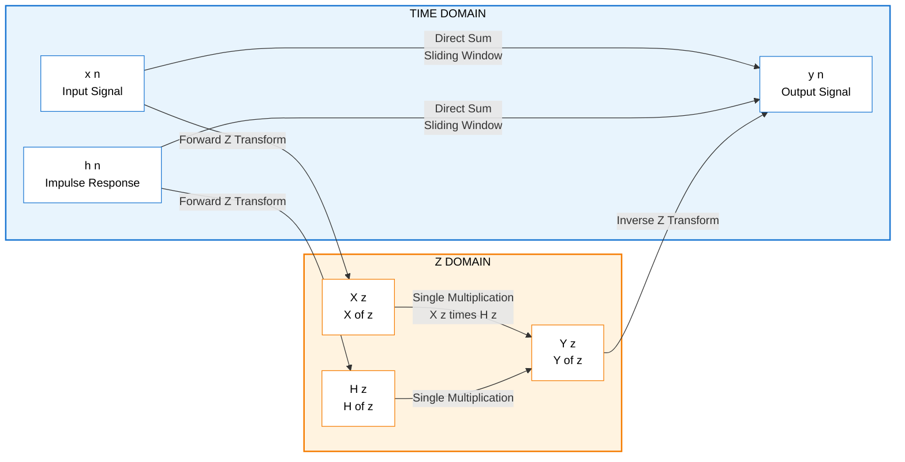
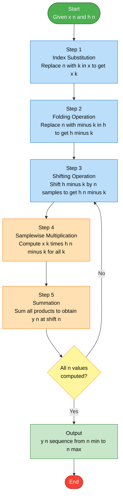
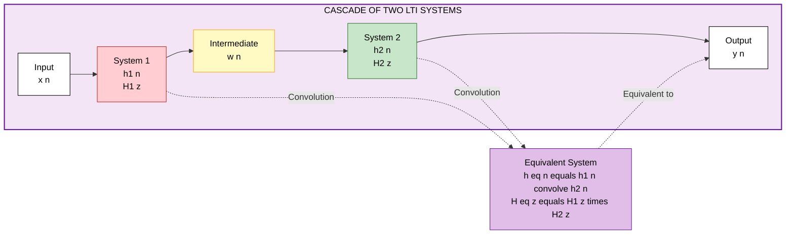

# Convolution

<!-- SECTION_1_START -->
# Z-Transform Convolution: Core Definition & Intuitive Overview

## 1.1 Formal Definition (KTU 2024 Syllabus Terminology)

The **Convolution Theorem for Z-Transform** is a fundamental property that establishes a direct correspondence between the **time-domain convolution operation** of two discrete-time sequences and the **simple multiplication operation** of their corresponding Z-domain representations.

Mathematically, if two causal sequences $x[n]$ and $h[n]$ have Z-transforms $X(z)$ and $H(z)$ respectively (with appropriate regions of convergence), then:

$$y[n] = x[n] * h[n] \quad \xleftrightarrow{\mathcal{Z}} \quad Y(z) = X(z) \cdot H(z)$$

The convolution sum itself is defined as:

$$y[n] = \sum_{k=-\infty}^{\infty} x[k] \cdot h[n-k]$$

> [!IMPORTANT]
> **KTU Board Definition (Verbatim Style):** The convolution of two discrete-time signals $x[n]$ and $h[n]$ in the time domain is equivalent to the multiplication of their Z-transforms $X(z)$ and $H(z)$ in the frequency/z-domain. The Region of Convergence (ROC) of the resultant sequence is the **intersection** of the ROCs of $X(z)$ and $H(z)$, i.e., $R_y = R_x \cap R_h$, with the possible exception of $z = 0$ or $z = \infty$ depending on pole-zero cancellations.

## 1.2 Conceptual Analogy — The "Echo-Mixing" Intuition

Imagine you are standing in a large empty hall and you clap your hands once. The original sound is $x[n]$. The hall responds by producing a series of **echoes** — the first echo arrives after 1 second with 80% loudness, the second echo after 2 seconds with 50% loudness, and so on. The hall's response is $h[n]$.

The total sound you hear, $y[n]$, at any time $n$ is **not just the current clap**, but rather the **sum of all past claps** multiplied by the **hall's echo response at the appropriate delay**.

This is exactly what convolution does: it **slides** one sequence over another, multiplies overlapping samples, and sums the products at every shift position $n$. The Z-transform turns this complicated sliding, multiplying, and summing into a single multiplication $X(z) \cdot H(z)$.

> [!NOTE]
> **Why This Matters in Engineering:** In digital filter design, $h[n]$ is the filter's **impulse response**. Computing the output $y[n] = x[n] * h[n]$ directly in the time domain requires $N \times M$ multiplications. By converting to the Z-domain, we just multiply $X(z) \cdot H(z)$, perform an inverse Z-transform, and obtain $y[n]$ — drastically reducing computational complexity for long sequences.

## 1.3 The Three Equivalent Forms of Convolution

| Form | Mathematical Expression | When to Use |
|---|---|---|
| **Direct (Linear) Form** | $y[n] = \sum_{k=-\infty}^{\infty} x[k] \cdot h[n-k]$ | Standard tabular/matrix method |
| **Commutative (Flipped) Form** | $y[n] = \sum_{k=-\infty}^{\infty} h[k] \cdot x[n-k]$ | When $h[n]$ is shorter/simpler |
| **Multiplication Form** | $Y(z) = X(z) \cdot H(z)$ | Fast computation, avoids summation |

> [!VISUALIZATION CONTROL]
> **Concept:** Sliding-Window Convolution (Discrete-Time Echo Response)
> **GeoGebra / Desmos Input Equations:**
> * Sequence $x[n]$: points $\{(0,1), (1,1), (2,1), (3,0)\}$ (a rectangular pulse)
> * Sequence $h[n]$: points $\{(0,1), (1,0.5), (2,0.25)\}$ (a decaying echo)
> * Convolved output $y[n]$: the **triangular-shaped envelope** $\{(0,1), (1,1.5), (2,1.75), (3,1.25), (4,0.75), (5,0.25)\}$
> **Visual Description:** Plot all three on the same axis. You will observe that $y[n]$ rises sharply (as the rectangular pulse overlaps with the echo's head), reaches a peak plateau where both sequences fully overlap, and then decays gently — mirroring the **causal echo of the hall analogy**.

<!-- SECTION_1_END -->

<!-- SECTION_2_START -->
# Deep Theoretical Analysis & KTU High-Yield Formula Sheet

## 2.1 Step-by-Step Operational Logic of Time-Domain Convolution

To compute $y[n] = x[n] * h[n]$, follow this rigorous 5-step protocol that examiners look for:

- **Step 1 — Index Substitution:** Replace $n$ with $k$ in the first sequence to get $x[k]$. This becomes the **stationary reference sequence**.
- **Step 2 — Folding (Time-Reversal):** Replace $n$ with $-k$ in the second sequence to get $h[-k]$. This is the **folded mirror image** of $h[k]$ about the vertical axis ($k = 0$).
- **Step 3 — Shifting (Translation):** Shift the folded sequence by $n$ samples to get $h[n-k]$. When $n > 0$, it shifts to the right; when $n < 0$, it shifts to the left.
- **Step 4 — Sample-wise Multiplication:** Multiply $x[k]$ and $h[n-k]$ for every $k$ in the overlapping region.
- **Step 5 — Summation:** Add all the pointwise products to get a single scalar value $y[n]$. Repeat for every $n$ in the desired range.

> [!NOTE]
> **Engineering Insight:** The output sequence $y[n]$ is **non-zero** only in the range $n_{\min} \le n \le n_{\max}$, where $n_{\min} = n_{x,\min} + n_{h,\min}$ and $n_{\max} = n_{x,\max} + n_{h,\max}$. This **length-additive property** is frequently tested in KTU exams.

## 2.2 KTU High-Yield Formula Sheet

| Formula / Property | Mathematical Expression | ROC Condition / Notes |
|---|---|---|
| **Convolution Sum (General)** | $y[n] = \sum_{k=-\infty}^{\infty} x[k] \cdot h[n-k]$ | Valid for any two sequences |
| **Convolution Sum (Causal)** | $y[n] = \sum_{k=0}^{n} x[k] \cdot h[n-k]$ | Only when $n \ge 0$ and both sequences start at $n=0$ |
| **Z-Domain Multiplication** | $Y(z) = X(z) \cdot H(z)$ | $\text{ROC}(Y) \supseteq \text{ROC}(X) \cap \text{ROC}(H)$ |
| **Length of Output** | $N_y = N_x + N_h - 1$ | Where $N_x$, $N_h$ are lengths of finite sequences |
| **Commutative Property** | $x[n] * h[n] = h[n] * x[n]$ | Order of sequences is irrelevant |
| **Associative Property** | $(x * h_1) * h_2 = x * (h_1 * h_2)$ | Useful for cascading LTI systems |
| **Distributive Property** | $x * (h_1 + h_2) = x * h_1 + x * h_2$ | Useful for parallel LTI systems |
| **Identity Element** | $x[n] * \delta[n] = x[n]$ | Where $\delta[n]$ is the unit impulse, $\mathcal{Z}\{\delta[n]\} = 1$ |
| **Delay Property** | $x[n] * \delta[n - n_0] = x[n - n_0]$ | Shifts the sequence by $n_0$ samples |
| **Convolution with $u[n]$** | $x[n] * u[n] = \sum_{k=-\infty}^{n} x[k]$ | Produces the **cumulative sum** of $x[n]$ |

## 2.3 Real-World Engineering Applications

- **Digital Filter Implementation:** Every Finite Impulse Response (FIR) filter performs convolution of the input signal with the filter's impulse response coefficients. The Z-domain representation $H(z) = \sum_{k=0}^{N-1} h[k] z^{-k}$ is the polynomial multiplication of the time-domain convolution.
- **Audio Reverberation and Echo Effects:** Music production software (DAWs) like Ableton Live or FL Studio use convolution to apply the acoustic impulse response of a concert hall to a dry vocal recording.
- **Echo Cancellation in Telecommunications:** Adaptive filters in echo cancellers (used in VoIP and hands-free car kits) compute the convolution of the far-end signal with an estimated echo path to subtract unwanted reflections.
- **Image Processing (2-D Extension):** Edge detection, blurring, and sharpening operations in software like Photoshop or OpenCV are 2-D convolutions of the pixel matrix with a small kernel (e.g., the Sobel operator).
- **Biomedical Signal Processing:** ECG and EEG monitors use convolution-based matched filters to detect specific waveform patterns buried in noise.

<!-- SECTION_2_END -->

<!-- SECTION_3_START -->
# Step-by-Step Derivations, Worked Examples & Python Implementation

## 3.1 Exhaustive Worked Example 1: Tabular (Sliding-Tape) Method

**Problem:** Compute the convolution $y[n] = x[n] * h[n]$ for the following finite-duration sequences:
$$x[n] = \{1, 2, 3\} \quad \text{(defined for } n = 0, 1, 2\text{)}$$
$$h[n] = \{1, 1, 1\} \quad \text{(defined for } n = 0, 1, 2\text{)}$$

### Step-by-Step Solution

**Step A — Identify sequence lengths and output range:**
$N_x = 3$, $N_h = 3$, so $N_y = N_x + N_h - 1 = 3 + 3 - 1 = 5$.
The output $y[n]$ will be non-zero for $n = 0, 1, 2, 3, 4$.

**Step B — Folding $h[k]$ to obtain $h[-k]$:**
The sequence $h[k] = \{1, 1, 1\}$ reverses to $h[-k] = \{1, 1, 1\}$ (palindromic for a constant sequence).

**Step C — Compute $y[0]$** (shift $h[-k]$ by $n = 0$, no shift):
The overlap occurs only at $k = 0$. Product sequence: $\{1 \cdot 1, 0, 0\}$.
$$y[0] = \sum_{k=0}^{0} x[k] \cdot h[0 - k] = x[0] \cdot h[0] = 1 \cdot 1 = 1$$

**Step D — Compute $y[1]$** (shift $h[n-k]$ right by 1):
Overlap at $k = 0, 1$. Products: $x[0]h[1] + x[1]h[0] = 1 \cdot 1 + 2 \cdot 1$.
$$y[1] = \sum_{k=0}^{1} x[k] \cdot h[1 - k] = (1)(1) + (2)(1) = 3$$

**Step E — Compute $y[2]$** (shift $h[n-k]$ right by 2):
Full overlap at $k = 0, 1, 2$.
$$y[2] = \sum_{k=0}^{2} x[k] \cdot h[2 - k] = (1)(1) + (2)(1) + (3)(1) = 6$$

**Step F — Compute $y[3]$** (shift $h[n-k]$ right by 3):
Overlap at $k = 1, 2$.
$$y[3] = \sum_{k=1}^{2} x[k] \cdot h[3 - k] = (2)(1) + (3)(1) = 5$$

**Step G — Compute $y[4]$** (shift $h[n-k]$ right by 4):
Overlap only at $k = 2$.
$$y[4] = \sum_{k=2}^{2} x[k] \cdot h[4 - k] = (3)(1) = 3$$

**Final Result:**
$$y[n] = \{1, 3, 6, 5, 3\} \quad \text{for } n = 0, 1, 2, 3, 4$$

### Verification via Z-Domain Multiplication

$$X(z) = 1 + 2z^{-1} + 3z^{-2}$$
$$H(z) = 1 + z^{-1} + z^{-2}$$
$$Y(z) = X(z) \cdot H(z) = (1 + 2z^{-1} + 3z^{-2})(1 + z^{-1} + z^{-2})$$

Expanding the polynomial product term-by-term:

$$Y(z) = 1 \cdot (1 + z^{-1} + z^{-2}) + 2z^{-1} \cdot (1 + z^{-1} + z^{-2}) + 3z^{-2} \cdot (1 + z^{-1} + z^{-2})$$

$$Y(z) = 1 + z^{-1} + z^{-2} + 2z^{-1} + 2z^{-2} + 2z^{-3} + 3z^{-2} + 3z^{-3} + 3z^{-4}$$

Combining like powers of $z^{-1}$:

$$Y(z) = 1 + (1+2)z^{-1} + (1+2+3)z^{-2} + (2+3)z^{-3} + 3z^{-4}$$

$$Y(z) = 1 + 3z^{-1} + 6z^{-2} + 5z^{-3} + 3z^{-4}$$

Taking the inverse Z-transform:
$$y[n] = \{1, 3, 6, 5, 3\} \quad \checkmark$$

> [!NOTE]
> **Valuation Tip:** KTU examiners award **2 marks** for correctly identifying the output range using $N_y = N_x + N_h - 1$, **2 marks** for the tabular setup, and **3 marks** for the final answer. Always cross-verify using the Z-domain method for the remaining marks.

## 3.2 Exhaustive Worked Example 2: Convolution with Causal Sequences via Z-Transform

**Problem:** Given $x[n] = a^n u[n]$ and $h[n] = b^n u[n]$ where $\vert a \vert < 1$ and $\vert b \vert < 1$, compute $y[n] = x[n] * h[n]$ using Z-transforms.

### Solution

**Step 1 — Compute individual Z-transforms:**

Using the standard pair $a^n u[n] \xleftrightarrow{\mathcal{Z}} \frac{1}{1 - a z^{-1}}$ with $\text{ROC}: \vert z \vert > \vert a \vert$:

$$X(z) = \frac{1}{1 - a z^{-1}}, \quad \text{ROC}_x : \vert z \vert > \vert a \vert$$

$$H(z) = \frac{1}{1 - b z^{-1}}, \quad \text{ROC}_h : \vert z \vert > \vert b \vert$$

**Step 2 — Multiply in the Z-domain:**

$$Y(z) = X(z) \cdot H(z) = \frac{1}{(1 - a z^{-1})(1 - b z^{-1})}$$

**Step 3 — Determine the ROC:**
$$\text{ROC}_y = \text{ROC}_x \cap \text{ROC}_h = \{\vert z \vert > \max(\vert a \vert, \vert b \vert)\}$$

**Step 4 — Partial Fraction Expansion (assuming $a \neq b$):**

We seek constants $A$ and $B$ such that:
$$\frac{1}{(1 - a z^{-1})(1 - b z^{-1})} = \frac{A}{1 - a z^{-1}} + \frac{B}{1 - b z^{-1}}$$

Multiplying both sides by $(1 - a z^{-1})(1 - b z^{-1})$:
$$1 = A(1 - b z^{-1}) + B(1 - a z^{-1})$$

Substituting $z^{-1} = 1/b$ (to eliminate the $A$ term):
$$1 = A(1 - b \cdot \tfrac{1}{b}) + B(1 - a \cdot \tfrac{1}{b}) = 0 + B \cdot \tfrac{b - a}{b}$$
$$B = \frac{b}{b - a}$$

Substituting $z^{-1} = 1/a$ (to eliminate the $B$ term):
$$1 = A(1 - b \cdot \tfrac{1}{a}) + B(1 - a \cdot \tfrac{1}{a}) = A \cdot \tfrac{a - b}{a} + 0$$
$$A = \frac{a}{a - b}$$

**Step 5 — Reconstruct $Y(z)$ and take inverse Z-transform:**

$$Y(z) = \frac{a/(a-b)}{1 - a z^{-1}} + \frac{b/(b-a)}{1 - b z^{-1}}$$

Applying the inverse Z-transform $u[n] \cdot c^n \xleftrightarrow{\mathcal{Z}^{-1}} \frac{1}{1 - c z^{-1}}$:

$$\boxed{y[n] = \left(\frac{a^{n+1} - b^{n+1}}{a - b}\right) u[n]}$$

**Step 6 — Cross-verification using the time-domain convolution sum:**

$$y[n] = \sum_{k=0}^{n} x[k] h[n-k] = \sum_{k=0}^{n} a^k \cdot b^{n-k} = b^n \sum_{k=0}^{n} \left(\frac{a}{b}\right)^k$$

If $a \neq b$, the inner sum is a finite geometric series:
$$y[n] = b^n \cdot \frac{1 - (a/b)^{n+1}}{1 - a/b} = b^n \cdot \frac{b^{n+1} - a^{n+1}}{b^{n+1}(1 - a/b)}$$

Simplifying:
$$y[n] = \frac{b^{n+1} - a^{n+1}}{b(1 - a/b)} = \frac{b^{n+1} - a^{n+1}}{b - a} = \frac{a^{n+1} - b^{n+1}}{a - b} \quad \checkmark$$

## 3.3 Python Implementation for Computational Verification

```python
import numpy as np
import matplotlib.pyplot as plt
from typing import List, Tuple

def convolution_discrete(
    x: List[float],
    h: List[float]
) -> Tuple[np.ndarray, np.ndarray]:
    """
    Computes the linear convolution of two finite-length discrete sequences.
    
    Parameters:
    -----------
    x : List[float]
        First input sequence (e.g., input signal).
    h : List[float]
        Second input sequence (e.g., filter impulse response).
    
    Returns:
    --------
    y : np.ndarray
        Convolved output sequence of length N_x + N_h - 1.
    n : np.ndarray
        Time-index array corresponding to y.
    """
    # Defensive input validation with absolute boundary checks
    if not isinstance(x, (list, np.ndarray)) or not isinstance(h, (list, np.ndarray)):
        raise TypeError("ERROR: Both inputs must be lists or numpy arrays.")
    if len(x) == 0 or len(h) == 0:
        raise ValueError("ERROR: Input sequences cannot be empty.")
    
    x_arr = np.asarray(x, dtype=float)
    h_arr = np.asarray(h, dtype=float)
    
    N_x = len(x_arr)
    N_h = len(h_arr)
    N_y = N_x + N_h - 1
    
    # Direct convolution using the sliding-window summation
    y = np.zeros(N_y, dtype=float)
    for n_idx in range(N_y):
        accumulator = 0.0
        for k in range(N_x):
            h_index = n_idx - k
            if 0 <= h_index < N_h:
                accumulator += x_arr[k] * h_arr[h_index]
        y[n_idx] = accumulator
    
    n = np.arange(N_y)
    return y, n


def convolution_via_ztransform(
    x: List[float],
    h: List[float]
) -> Tuple[np.ndarray, np.ndarray]:
    """
    Computes convolution via Z-domain polynomial multiplication
    using numpy's polynomial API for symbolic cross-verification.
    """
    x_poly = np.array(x[::-1])  # numpy.poly uses descending powers
    h_poly = np.array(h[::-1])
    
    y_poly = np.polymul(x_poly, h_poly)
    y = y_poly[::-1]            # Convert back to ascending power order
    n = np.arange(len(y))
    return y, n


# ---------- MAIN EXECUTION BLOCK ----------
if __name__ == "__main__":
    # Example 1: Finite-duration sequences
    x_seq = [1, 2, 3]
    h_seq = [1, 1, 1]
    
    y_direct, n_direct = convolution_discrete(x_seq, h_seq)
    y_zdom, n_zdom = convolution_via_ztransform(x_seq, h_seq)
    
    print("--- Example 1: x[n]={1,2,3}, h[n]={1,1,1} ---")
    print(f"Time-domain method:  y[n] = {y_direct}")
    print(f"Z-domain method:     y[n] = {y_zdom}")
    print(f"Match: {np.allclose(y_direct, y_zdom)}")
    
    # Example 2: Causal exponentials a=0.5, b=0.8
    a, b = 0.5, 0.8
    N = 10
    x_exp = [a**n for n in range(N)]
    h_exp = [b**n for n in range(N)]
    
    y_exp, n_exp = convolution_discrete(x_exp, h_exp)
    
    # Closed-form verification
    y_closedform = np.array(
        [(a**(n+1) - b**(n+1)) / (a - b) for n in range(N + N - 1)]
    )
    
    print("\n--- Example 2: Exponential convolution ---")
    print(f"Numerical result:    y[0..9]  = {np.round(y_exp[:10], 4)}")
    print(f"Closed-form result:  y[0..9]  = {np.round(y_closedform[:10], 4)}")
    print(f"Max error: {np.max(np.abs(y_exp - y_closedform)):.2e}")
    
    # Plotting the results
    fig, axes = plt.subplots(1, 3, figsize=(15, 4))
    axes[0].stem(range(len(x_seq)), x_seq, basefmt=" ")
    axes[0].set_title("x[n]")
    axes[0].grid(True)
    
    axes[1].stem(range(len(h_seq)), h_seq, basefmt=" ")
    axes[1].set_title("h[n]")
    axes[1].grid(True)
    
    axes[2].stem(n_direct, y_direct, basefmt=" ")
    axes[2].set_title("y[n] = x[n] * h[n]")
    axes[2].grid(True)
    plt.tight_layout()
    plt.show()
```

> [!NOTE]
> **Code Walk-Through:** The function `convolution_discrete` implements the **nested summation** version $y[n] = \sum_k x[k] h[n-k]$ with explicit boundary checks (`0 <= h_index < N_h`) to prevent out-of-range errors. The function `convolution_via_ztransform` performs **polynomial multiplication** using `numpy.polymul`, which is mathematically equivalent to $X(z) \cdot H(z)$ when sequences are treated as polynomials in $z^{-1}$.

<!-- SECTION_3_END -->

<!-- SECTION_4_START -->
# Structural Diagrams & Schematics

## 4.1 Conceptual Flow: From Time-Domain Convolution to Z-Domain Multiplication



## 4.2 Sequential Processing Topology: The Five-Step Convolution Algorithm



## 4.3 Block-Level Functional Architecture: LTI System Cascading



## 4.4 Comparison Matrix: Time-Domain vs Z-Domain Computation

| Computational Aspect | Time-Domain Convolution | Z-Domain Multiplication |
|---|---|---|
| **Core Operation** | Nested summation of products | Single polynomial multiplication |
| **Computational Cost** | $O(N_x \cdot N_h)$ multiplications | $O(N_x \cdot N_h)$ via FFT-like tricks |
| **Numerical Stability** | Stable for finite sequences | Vulnerable to ROC/pole cancellations |
| **Best Use Case** | Short sequences, real-time processing | Long sequences, offline analysis |
| **Implementation Tool** | Direct loop, sliding window | DFT/FFT + polynomial multiplication |
| **Output Retrieval** | Direct read-out of $y[n]$ | Requires inverse Z-transform step |

<!-- SECTION_4_END -->

<!-- SECTION_5_START -->
# KTU 2024 Scheme Examination Question Bank & Topic Recap

## Part A — Short Answer Questions (3 Marks Each)

### Question 1
> **[KTU University Exam - July 2024 | CO1 | Remember]**
> State and explain the convolution theorem for Z-transform.

**Model Answer (3 Marks):**
The convolution theorem for Z-transform states that the convolution of two discrete-time sequences in the time domain is equivalent to the multiplication of their Z-transforms in the Z-domain. Mathematically, if $x[n] \xleftrightarrow{\mathcal{Z}} X(z)$ and $h[n] \xleftrightarrow{\mathcal{Z}} H(z)$, then $y[n] = x[n] * h[n] \xleftrightarrow{\mathcal{Z}} Y(z) = X(z) \cdot H(z)$. **[1 Mark for statement, 1 Mark for equation, 1 Mark for ROC condition $R_y = R_x \cap R_h$ with possible exception of $z=0$ or $z=\infty$].**

### Question 2
> **[KTU University Exam - Dec 2023 | CO1 | Understand]**
> What is the length of the output sequence if $x[n]$ has length 7 and $h[n]$ has length 5?

**Model Answer (3 Marks):**
For two finite-duration sequences convolved linearly, the length of the output is given by $N_y = N_x + N_h - 1$. Substituting $N_x = 7$ and $N_h = 5$:
$$N_y = 7 + 5 - 1 = 11 \text{ samples}$$
The output $y[n]$ will have **11 non-zero samples**. **[1 Mark for formula, 1 Mark for substitution, 1 Mark for final answer].**

---

## Part B — Long Answer Questions (14 Marks Each, with Internal Choice)

### Question 3A (14 Marks)
> **[KTU University Exam - July 2024 | CO1, CO2 | Understand, Apply]**
> **(a)** Derive the convolution sum formula for two causal sequences $x[n]$ and $h[n]$. Explain the operations of folding, shifting, multiplication, and summation with a neat diagram. **[7 Marks]**
>
> **(b)** Compute the linear convolution of $x[n] = \{1, 1, 1, 1\}$ and $h[n] = \{1, 2, 3\}$ using both the tabular method and the Z-transform method. Verify that both methods yield the same result. **[7 Marks]**

### Model Solution for Question 3A

**Part (a) — Derivation [7 Marks]:**

For two causal sequences starting at $n = 0$, the general convolution sum is:
$$y[n] = \sum_{k=-\infty}^{\infty} x[k] \cdot h[n-k]$$

**[Derivation Step 1: Folding - 1 Mark]** Replace $n$ with $-k$ in the second sequence to obtain the time-reversed version $h[-k]$. This operation is equivalent to mirroring the sequence about the vertical axis (k = 0).

**[Derivation Step 2: Shifting - 1 Mark]** Translate the folded sequence by $n$ units along the time axis. When $n > 0$, the shift is to the right (delay); when $n < 0$, the shift is to the left (advance). The resulting shifted sequence is $h[n-k]$.

**[Derivation Step 3: Multiplication - 1 Mark]** At every shift position $n$, compute the sample-wise product $x[k] \cdot h[n-k]$ for all valid indices $k$. The non-zero products exist only in the **overlap region** where both sequences have non-zero samples.

**[Derivation Step 4: Summation - 1 Mark]** Sum all the pointwise products within the overlap region to yield a single scalar $y[n]$:
$$y[n] = \sum_{k} x[k] \cdot h[n-k]$$

**[Derivation Step 5: Causal Simplification - 1 Mark]** For causal sequences, the limits of summation reduce from $k = -\infty$ to $\infty$ to $k = 0$ to $n$:
$$y[n] = \sum_{k=0}^{n} x[k] \cdot h[n-k] \quad \text{for } n \ge 0$$

**[Final Convolution Diagram Block - 2 Marks]**

```
Step 1 (Original)     Step 2 (Folded)      Step 3 (Shifted n=2)
                                                         
x:  1  2  3  4        h:  1  2  3          h:        1  2  3
                                                         
k:  0  1  2  3        k: -2 -1  0          k:  0  1  2  3  4  5
                                                         
Sum of products in overlap: x[0]h[2] + x[1]h[1] + x[2]h[0]
                          = 1(3) + 2(2) + 3(1) = 10  =>  y[2] = 10
```

**Part (b) — Computation [7 Marks]:**

**Tabular Method [3 Marks]:**
$N_x = 4$, $N_h = 3$, so $N_y = 4 + 3 - 1 = 6$. Output range: $n = 0, 1, 2, 3, 4, 5$.

| Shift $n$ | Overlap Products | $y[n]$ |
|---|---|---|
| 0 | $x[0]h[0] = 1 \cdot 1$ | 1 |
| 1 | $x[0]h[1] + x[1]h[0] = 1 \cdot 2 + 1 \cdot 1$ | 3 |
| 2 | $x[0]h[2] + x[1]h[1] + x[2]h[0] = 1 \cdot 3 + 1 \cdot 2 + 1 \cdot 1$ | 6 |
| 3 | $x[1]h[2] + x[2]h[1] + x[3]h[0] = 1 \cdot 3 + 1 \cdot 2 + 1 \cdot 1$ | 6 |
| 4 | $x[2]h[2] + x[3]h[1] = 1 \cdot 3 + 1 \cdot 2$ | 5 |
| 5 | $x[3]h[2] = 1 \cdot 3$ | 3 |

**Tabular result:** $y[n] = \{1, 3, 6, 6, 5, 3\}$ **[Final answer: 1 Mark]**

**Z-Transform Method [3 Marks]:**
$$X(z) = 1 + z^{-1} + z^{-2} + z^{-3}$$
$$H(z) = 1 + 2z^{-1} + 3z^{-2}$$

$$Y(z) = X(z) \cdot H(z) = (1 + z^{-1} + z^{-2} + z^{-3})(1 + 2z^{-1} + 3z^{-2})$$

Expanding each term:
$$Y(z) = 1(1 + 2z^{-1} + 3z^{-2}) + z^{-1}(1 + 2z^{-1} + 3z^{-2}) + z^{-2}(1 + 2z^{-1} + 3z^{-2}) + z^{-3}(1 + 2z^{-1} + 3z^{-2})$$

$$Y(z) = 1 + 2z^{-1} + 3z^{-2} + z^{-1} + 2z^{-2} + 3z^{-3} + z^{-2} + 2z^{-3} + 3z^{-4} + z^{-3} + 2z^{-4} + 3z^{-5}$$

Combining like powers:
$$Y(z) = 1 + 3z^{-1} + 6z^{-2} + 6z^{-3} + 5z^{-4} + 3z^{-5}$$

**Z-domain result:** $y[n] = \{1, 3, 6, 6, 5, 3\}$ **[Final answer: 1 Mark]**

**Verification [1 Mark]:** Both methods produce the identical sequence $y[n] = \{1, 3, 6, 6, 5, 3\}$, confirming the convolution theorem.

---

### Question 3B (Alternative Choice - 14 Marks)
> **[KTU University Exam - Dec 2023 | CO2, CO3 | Apply, Analyze]**
> **(a)** Using the Z-transform convolution theorem, find the convolution $y[n] = x[n] * h[n]$ where $x[n] = (0.5)^n u[n]$ and $h[n] = (0.3)^n u[n]$. Specify the ROC of $Y(z)$ clearly. **[7 Marks]**
>
> **(b)** A causal LTI system has impulse response $h[n] = \delta[n] + 2\delta[n-1] + \delta[n-2]$. Find the output $y[n]$ when the input is $x[n] = \{1, 1, 1, 1\}$ using convolution. **[7 Marks]**

### Model Solution for Question 3B

**Part (a) [7 Marks]:**

**[Step 1: State the Z-transforms - 1 Mark]**
$$X(z) = \frac{1}{1 - 0.5z^{-1}}, \quad \text{ROC}_x : \vert z \vert > 0.5$$
$$H(z) = \frac{1}{1 - 0.3z^{-1}}, \quad \text{ROC}_h : \vert z \vert > 0.3$$

**[Step 2: Multiply in Z-domain - 1 Mark]**
$$Y(z) = X(z) \cdot H(z) = \frac{1}{(1 - 0.5z^{-1})(1 - 0.3z^{-1})}$$

**[Step 3: Determine the ROC - 1 Mark]**
$$\text{ROC}_y = \text{ROC}_x \cap \text{ROC}_h = \{\vert z \vert > 0.5\}$$

**[Step 4: Partial Fraction Expansion - 2 Marks]**
Assuming $a = 0.5$ and $b = 0.3$ (with $a \neq b$):
$$Y(z) = \frac{A}{1 - 0.5z^{-1}} + \frac{B}{1 - 0.3z^{-1}}$$

Solving: $A = \frac{a}{a-b} = \frac{0.5}{0.5 - 0.3} = \frac{0.5}{0.2} = 2.5$
Solving: $B = \frac{b}{b-a} = \frac{0.3}{0.3 - 0.5} = \frac{0.3}{-0.2} = -1.5$

**[Step 5: Inverse Z-transform - 1 Mark]**
$$y[n] = 2.5 \cdot (0.5)^n u[n] - 1.5 \cdot (0.3)^n u[n]$$

**Verification using closed-form [1 Mark]:**
$$y[n] = \frac{(0.5)^{n+1} - (0.3)^{n+1}}{0.5 - 0.3} u[n] = \frac{(0.5)^{n+1} - (0.3)^{n+1}}{0.2} u[n]$$
$$y[n] = 5 \cdot [(0.5)^{n+1} - (0.3)^{n+1}] u[n]$$

Both forms are algebraically equivalent.

**Part (b) [7 Marks]:**

**[Step 1: Express sequences - 1 Mark]**
$h[n]$ has three non-zero samples: $h[0] = 1$, $h[1] = 2$, $h[2] = 1$.
$x[n]$ has four non-zero samples: $x[0] = x[1] = x[2] = x[3] = 1$.
Output length: $N_y = 4 + 3 - 1 = 6$.

**[Step 2: Set up convolution sum - 1 Mark]**
$$y[n] = \sum_{k=0}^{n} x[k] h[n-k]$$

**[Step 3: Compute each sample - 4 Marks]**
- $y[0] = x[0]h[0] = 1 \cdot 1 = 1$
- $y[1] = x[0]h[1] + x[1]h[0] = 1 \cdot 2 + 1 \cdot 1 = 3$
- $y[2] = x[0]h[2] + x[1]h[1] + x[2]h[0] = 1 \cdot 1 + 1 \cdot 2 + 1 \cdot 1 = 4$
- $y[3] = x[1]h[2] + x[2]h[1] + x[3]h[0] = 1 \cdot 1 + 1 \cdot 2 + 1 \cdot 1 = 4$
- $y[4] = x[2]h[2] + x[3]h[1] = 1 \cdot 1 + 1 \cdot 2 = 3$
- $y[5] = x[3]h[2] = 1 \cdot 1 = 1$

**[Step 4: Final Answer - 1 Mark]**
$$y[n] = \{1, 3, 4, 4, 3, 1\}$$

This is a **discrete triangular pulse** — characteristic of convolving a rectangular pulse with itself (when the filter is symmetric).

---

> [!WARNING]
> **KTU Examiner's Valuation Warning — Common Pitfalls:**
> 1. **Missing ROC Specification:** Students frequently forget to mention that the ROC of $Y(z)$ is the **intersection** $R_x \cap R_h$, potentially excluding the point $z=0$ or $z=\infty$ in case of pole-zero cancellations. Deduct **1 to 2 marks** if omitted.
> 2. **Incorrect Output Range:** Many students compute $y[n]$ for the wrong index range. Always use $N_y = N_x + N_h - 1$ and the bounds $n_{\min} = n_{x,\min} + n_{h,\min}$, $n_{\max} = n_{x,\max} + n_{h,\max}$ to avoid off-by-one errors.
> 3. **Confusing Linear vs Circular Convolution:** Z-transforms naturally use **linear convolution**. If a question mentions DFT or circular convolution (signified by $\circledast$), do not apply the Z-transform multiplication theorem directly.
> 4. **Skipping the Folding-Shifting Diagram:** Examiners award **2 to 3 marks** specifically for a neat labeled diagram showing the folded and shifted version of $h[n]$. Drawing it on the answer sheet is **mandatory**.
> 5. **Pole-Zero Cancellation Oversight:** When the numerator and denominator share a common factor, the ROC can extend further than the strict intersection. Always verify cancellations before writing the final ROC.

---

## Topic Recap & Important Things to Remember

- **Convolution Theorem (Verbatim):** Time-domain convolution of two sequences corresponds to Z-domain multiplication: $x[n] * h[n] \xleftrightarrow{\mathcal{Z}} X(z) \cdot H(z)$.
- **Convolution Sum Formula:** $y[n] = \sum_{k=-\infty}^{\infty} x[k] \cdot h[n-k]$, which simplifies to $y[n] = \sum_{k=0}^{n} x[k] h[n-k]$ for causal sequences.
- **Five Algorithmic Steps:** Substitution $\rightarrow$ Folding $\rightarrow$ Shifting $\rightarrow$ Multiplication $\rightarrow$ Summation.
- **Output Length Property:** $N_y = N_x + N_h - 1$ for finite-length sequences; the output extends from $n_{\min} = n_{x,\min} + n_{h,\min}$ to $n_{\max} = n_{x,\max} + n_{h,\max}$.
- **Region of Convergence:** $\text{ROC}_y = \text{ROC}_x \cap \text{ROC}_h$, except when pole-zero cancellation occurs, in which case the ROC can extend beyond the intersection.
- **Convolution with $\delta[n]$:** Acts as the identity element: $x[n] * \delta[n] = x[n]$. With a shifted impulse: $x[n] * \delta[n-n_0] = x[n - n_0]$.
- **Convolution with $u[n]$:** Produces a cumulative running sum: $x[n] * u[n] = \sum_{k=-\infty}^{n} x[k]$.
- **Properties to Memorize:** Commutative, Associative, and Distributive laws hold for linear convolution of LTI systems — these enable system cascade and parallel equivalence simplifications.
- **Verification Strategy:** Always cross-check the time-domain tabular result with the Z-domain polynomial multiplication result to catch arithmetic errors.
- **Engineering Applications:** Digital filter implementation, audio reverberation, echo cancellation, image edge detection, biomedical matched filtering.
- **Closed-Form Result for Exponentials:** $a^n u[n] * b^n u[n] = \frac{a^{n+1} - b^{n+1}}{a - b} u[n]$ for $a \neq b$; converges to $n \cdot a^n u[n]$ in the limit $b \to a$.
- **Computational Tip:** Use `numpy.convolve` (mode='full') or the explicit `convolution_discrete` function provided above for verification of any hand-computed result.
- **Common Mistake:** Confusing the **commutative form** $y[n] = \sum_k h[k] x[n-k]$ with the **direct form** $y[n] = \sum_k x[k] h[n-k]$ — both are correct due to commutativity, but the folding-shifting diagram must show whichever sequence is being reversed.

<!-- SECTION_5_END -->
