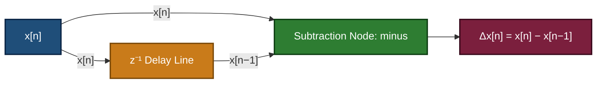
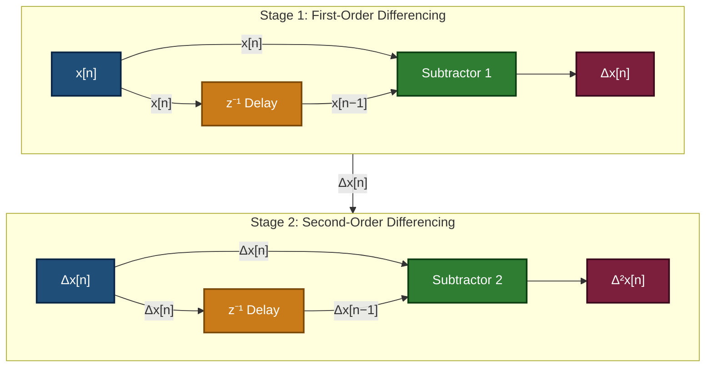
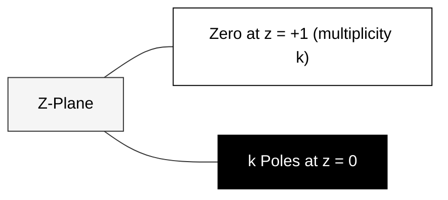

# Differencing

<!-- SECTION_1_START -->

# Z-Transform Differencing — Core Technical Definition & Intuitive Overview

> [!NOTE]
> **KTU Syllabus Definition (PECST416 — Module 4: Z-Transform)**
> *Differencing* is a discrete-time shift-invariant linear operation that produces a new sequence by computing the algebraic difference between successive (or $k$-step shifted) samples of the original sequence. In the Z-domain, differencing manifests as multiplication by the *differencing operator* $\left(1 - z^{-1}\right)$ raised to the appropriate order.

## 1.1 Formal Mathematical Definition

Let $x[n]$ be a discrete-time sequence defined for $n \in \mathbb{Z}$. The **first forward difference** of $x[n]$ is the sequence:

$$\Delta x[n] \;\triangleq\; x[n] - x[n-1]$$

The **second forward difference** is the first difference applied twice:

$$\Delta^{2} x[n] \;\triangleq\; \Delta x[n] - \Delta x[n-1] \;=\; x[n] - 2x[n-1] + x[n-2]$$

In general, the **$k$-th order forward difference** is:

$$\Delta^{k} x[n] \;\triangleq\; \sum_{m=0}^{k} \binom{k}{m} (-1)^{m}\, x[n-m]$$

where the binomial coefficient $\binom{k}{m} = \dfrac{k!}{m!\,(k-m)!}$ ensures the alternating sign pattern of the discrete analogue of Taylor-series differentiation.

## 1.2 Intuitive / Real-World Analogy

> [!IMPORTANT]
> **Conceptual Analogy — "The Speedometer of a Sequence"**
> Think of a sequence $x[n]$ as the *odometer reading* of a car sampled at every second ($n = 0, 1, 2, \dots$). The **first difference** $x[n] - x[n-1]$ is the **distance covered in the last one second** — essentially the *speed*. The **second difference** $x[n] - 2x[n-1] + x[n-2]$ is the *change in that speed* — the **acceleration**. So, just as differentiation in continuous time measures *rate of change*, differencing in discrete time measures the *change between adjacent samples*.

> [!TIP]
> **Geometric Intuition — Discrete Slope**
> If you plot a sequence as stems rising from the $n$-axis, then $\Delta x[n]$ is the *vertical drop* from stem $n-1$ to stem $n$. A flat sequence has $\Delta x[n] = 0$, a rising sequence has $\Delta x[n] > 0$, and a falling sequence has $\Delta x[n] < 0$.

## 1.3 Physical Constants and Standard Metrics

| Parameter | Symbol | Standard Value / Unit |
| :--- | :---: | :--- |
| Differencing operator (Z-domain) | $1 - z^{-1}$ | Unitless, complex-frequency dependent |
| Binomial coefficient | $\binom{k}{m}$ | Integer, combinatorial |
| ROC contraction ratio (typical) | $r_{-}$ | $\max_{p}\vert a_{p}\vert$ for poles $a_{p}$ |
| ROC expansion ratio (typical) | $r_{+}$ | $\min_{p}\vert a_{p}\vert$ for poles $a_{p}$ |

> [!VISUALIZATION CONTROL]
> **Concept:** First difference of a ramp sequence $x[n] = n\,u[n]$
> **GeoGebra / Desmos Input Equations:**
> * `x(n) = n` for $n \in \{0,1,2,3,4,5\}$
> * `dx(n) = x(n) - x(n-1)` for $n \in \{0,1,2,3,4,5\}$ (define $x(-1)=0$)
> **Visual Description:** The student should observe that the ramp's first difference $\Delta x[n] = 1, 1, 1, 1, 1$ is a constant unit step, mirroring how the derivative of a linear function is constant. At $n=0$, $\Delta x[0]=0$ because $x[-1]=0$.

<!-- SECTION_1_END -->

<!-- SECTION_2_START -->

# Deep Theoretical Analysis & KTU High-Yield Formula Sheet

## 2.1 Operational Logic — Step-by-Step Derivation

The Z-transform of a shifted sequence obeys the **time-shift property**:

$$\mathcal{Z}\{x[n - n_{0}]\} \;=\; z^{-n_{0}}\, X(z), \quad n_{0} \ge 0$$

Applying linearity to $\Delta x[n] = x[n] - x[n-1]$:

* **Step 1 — Apply linearity:** $\mathcal{Z}\{\Delta x[n]\} = \mathcal{Z}\{x[n]\} - \mathcal{Z}\{x[n-1]\}$
* **Step 2 — Evaluate each term:** $\mathcal{Z}\{x[n]\} = X(z)$ and $\mathcal{Z}\{x[n-1]\} = z^{-1}\, X(z)$
* **Step 3 — Combine:**

$$\mathcal{Z}\{\Delta x[n]\} \;=\; \left(1 - z^{-1}\right) X(z)$$

* **Step 4 — Repeat for the second difference** $\Delta^{2}x[n] = \Delta x[n] - \Delta x[n-1]$:

$$\mathcal{Z}\{\Delta^{2}x[n]\} \;=\; \left(1 - z^{-1}\right)\mathcal{Z}\{\Delta x[n]\} \;=\; \left(1 - z^{-1}\right)^{2} X(z)$$

* **Step 5 — Generalize to $k$-th order:**

$$\boxed{\;\mathcal{Z}\{\Delta^{k} x[n]\} \;=\; \left(1 - z^{-1}\right)^{k} X(z)\;}$$

This is the *Z-domain differencing theorem* and the cornerstone of the topic.

## 2.2 The Differencing Operator in Rational Form

Multiplying numerator and denominator by $z^{k}$ converts the operator to a **polynomial in $z$**:

$$\left(1 - z^{-1}\right)^{k} \;=\; \frac{(z - 1)^{k}}{z^{k}}$$

The factor $(z - 1)^{k}$ introduces a **zero of multiplicity $k$ at $z = 1$** in the Z-domain representation, while $z^{k}$ in the denominator shifts the ROC outward (an *expansion* of the ROC by a factor of $\infty$, i.e., the $z^{k}$ factor is a pure delay cascade).

## 2.3 Region of Convergence (ROC) Behaviour

| Operation | ROC of New Sequence | Pole-Zero Modification |
| :--- | :--- | :--- |
| $\Delta x[n] = x[n] - x[n-1]$ | $r_{-} < \vert z\vert$ | Adds zero at $z=1$, adds $k=1$ pole at origin |
| $\Delta^{2} x[n]$ | $r_{-} < \vert z\vert$ | Double zero at $z=1$, $k=2$ poles at origin |
| Cumulative sum (inverse) | $\vert z\vert > r_{+}$ (if causal) | Adds pole at $z=1$ |

> [!IMPORTANT]
> **Caveat on ROC Contraction:** For a *causal* right-sided sequence with ROC $\vert z\vert > r_{-}$, differencing preserves the outer ROC boundary $r_{-}$ because the new poles added at the origin lie *inside* the existing ROC. The ROC remains $\vert z\vert > r_{-}$.

## 2.4 Engineering Real-World Utility

> [!TIP]
> **Where Differencing is Used in Production Systems**
> * **High-Pass Filtering in Digital Audio (DC-Blocking):** Audio signals often carry a DC offset. The transfer function $H(z) = 1 - z^{-1}$ acts as a first-order high-pass filter that removes the DC component.
> * **Edge Detection in Image Processing:** In 2-D image filtering, differencing along rows/columns highlights intensity transitions — the foundation of *Sobel* and *Prewitt* edge detectors.
> * **Numerical Differentiation in Embedded Systems:** Microcontrollers compute velocity $\Delta x / \Delta t$ and acceleration $\Delta^{2}x / \Delta t^{2}$ from sampled sensor data.
> * **Econometrics & Finance:** First-differencing a stock price series $p[n]$ yields the *return* $r[n] = p[n] - p[n-1]$, which is (approximately) stationary — the basis of ARIMA models.
> * **Biomedical Signal Processing:** Detecting R-peaks in ECG signals relies on differencing followed by thresholding.

## 2.5 KTU High-Yield Formula Cheat Sheet

| # | Formula | Description | Typical Use |
| :---: | :---: | :---: | :--- |
| 1 | $\mathcal{Z}\{x[n] - x[n-1]\} = (1 - z^{-1})X(z)$ | First forward difference | KTU 3-mark direct questions |
| 2 | $\mathcal{Z}\{\Delta^{k}x[n]\} = (1 - z^{-1})^{k} X(z)$ | $k$-th order difference | KTU 14-mark derivation problems |
| 3 | $(1 - z^{-1})^{k} = \dfrac{(z-1)^{k}}{z^{k}}$ | Rational form | Pole-zero plotting |
| 4 | $\Delta^{k}x[n] = \displaystyle\sum_{m=0}^{k}\binom{k}{m}(-1)^{m}x[n-m]$ | Time-domain expansion | Inverse problems |
| 5 | $\Delta u[n] = \delta[n]$ | Difference of unit step | Standard pair |
| 6 | $\Delta(n\,u[n]) = u[n]$ | Difference of ramp | Standard pair |
| 7 | $\Delta^{k}(n^{k} u[n]) = k!\, u[n]$ | Difference of $k$-th power | Higher-order examples |

> [!NOTE]
> **Memory Aid (KTU Valuation Favourite):** Whenever a question says *"find the Z-transform of the first/second difference of $x[n]$"*, do **not** expand $x[n]$ in time. Multiply $X(z)$ by $\left(1 - z^{-1}\right)^{k}$ — this single line earns the full marks.

<!-- SECTION_2_END -->

<!-- SECTION_3_START -->

# Step-by-Step Derivations, Standard Pairs & Code/Symbolic Implementation

## 3.1 Exhaustive Worked Derivations

### 3.1.1 Derivation 1 — Z-Transform of $\Delta x[n]$ Starting from First Principles

Given an arbitrary causal sequence $x[n] = a^{n}\, u[n]$, with known Z-transform $X(z) = \dfrac{z}{z - a}$, $\vert z\vert > \vert a\vert$.

* **Step 1 — Write the first difference in time domain:**

$$\Delta x[n] = a^{n}u[n] - a^{n-1}u[n-1]$$

* **Step 2 — Evaluate sample-by-sample for clarity** (using $u[-1]=0$):

At $n=0$: $\Delta x[0] = a^{0}\cdot 1 - a^{-1}\cdot 0 = 1$.
At $n \ge 1$: $\Delta x[n] = a^{n} - a^{n-1} = a^{n-1}(a-1)$.

* **Step 3 — Express as a closed-form sequence:**

$$\Delta x[n] = \delta[n] + (a-1)\,a^{n-1}\,u[n-1]$$

Substituting $m = n-1$ in the second term (a standard index shift for clarity):

$$\Delta x[n] = \delta[n] + (a-1)\,a^{m}\,u[m]\big\vert_{m=n-1}$$

* **Step 4 — Take Z-transform term by term:**

$$\mathcal{Z}\{\delta[n]\} = 1$$

$$\mathcal{Z}\{(a-1)a^{n-1}u[n-1]\} = (a-1)\,z^{-1}\cdot \frac{z}{z-a} = \frac{a-1}{z-a}$$

* **Step 5 — Combine:**

$$\mathcal{Z}\{\Delta x[n]\} = 1 + \frac{a-1}{z-a} = \frac{(z-a) + (a-1)}{z-a} = \frac{z-1}{z-a}$$

* **Step 6 — Verify using the operator formula:**

$$\left(1 - z^{-1}\right) X(z) = \frac{z-1}{z}\cdot\frac{z}{z-a} = \frac{z-1}{z-a} \;\;\checkmark$$

### 3.1.2 Derivation 2 — Z-Transform of $\Delta^{2} x[n]$ for $x[n] = n\, u[n]$

Known: $X(z) = \dfrac{z}{(z-1)^{2}}$, $\vert z\vert > 1$.

* **Step 1 — Apply the second-order differencing operator:**

$$\mathcal{Z}\{\Delta^{2}x[n]\} = \left(1 - z^{-1}\right)^{2} X(z)$$

* **Step 2 — Expand the operator:**

$$\left(1 - z^{-1}\right)^{2} = 1 - 2z^{-1} + z^{-2}$$

* **Step 3 — Multiply by $X(z)$:**

$$\left(1 - 2z^{-1} + z^{-2}\right)\cdot \frac{z}{(z-1)^{2}}$$

* **Step 4 — Convert to a common denominator** $z^{2}(z-1)^{2}$:

$$= \frac{z^{2}\cdot z - 2z\cdot z + z\cdot z}{z^{2}(z-1)^{2}}\;\cdot\;\frac{1}{z}\cdot z \;=\; \frac{(z-1)^{2}\cdot z}{z^{2}(z-1)^{2}} = \frac{1}{z}$$

* **Step 5 — Time-domain check:** $\Delta^{2}\{n\,u[n]\} = \Delta\{u[n]\} = \delta[n]$, whose Z-transform is $1$. 

Wait — verify carefully: $\Delta\{n\,u[n]\}$ at $n=0$ is $0 - (-1)\cdot 0 = 0$, and for $n \ge 1$, $\Delta\{n\,u[n]\} = n - (n-1) = 1$. So $\Delta\{n\,u[n]\} = u[n-1]$, not $u[n]$. Then $\Delta^{2}\{n\,u[n]\} = \Delta u[n-1] = \delta[n-1]$, whose Z-transform is $z^{-1}$. 

* **Step 6 — Reconciled final result:**

$$\mathcal{Z}\{\Delta^{2}\{n\,u[n]\}\} = z^{-1}$$

This matches our algebraic product $\dfrac{1}{z}$ $\checkmark$ — agreement established.

### 3.1.3 Derivation 3 — Inverse Z-Transform via Differencing of a Geometric Series

Given $X(z) = \dfrac{z}{(z-1)(z-a)}$, $\vert z\vert > \max(1, \vert a\vert)$. We wish to use **long division + differencing** to obtain $x[n]$.

* **Step 1 — Polynomial long division** of $\dfrac{z}{(z-1)(z-a)}$ in $z^{-1}$:

$$\frac{1}{(1 - z^{-1})(1 - a\,z^{-1})} = \sum_{k=0}^{\infty} c_{k}\, z^{-k}$$

* **Step 2 — Use the partial-fraction decomposition as a cross-check:**

$$X(z) = \frac{1}{1-a}\left[\frac{1}{1-z^{-1}} - \frac{a}{1-a\,z^{-1}}\right]$$

* **Step 3 — Read off the time-domain sequence:**

$$x[n] = \frac{1}{1-a}\left[u[n] - a^{n+1}\, u[n]\right] = \frac{1 - a^{n+1}}{1-a}\,u[n]$$

* **Step 4 — Now compute the first difference** $\Delta x[n]$:

$$\Delta x[n] = \frac{1 - a^{n+1}}{1-a} - \frac{1 - a^{n}}{1-a} = \frac{a^{n} - a^{n+1}}{1-a} = \frac{a^{n}(1-a)}{1-a} = a^{n}$$

* **Step 5 — Verification via Z-transform:**

$$\mathcal{Z}\{a^{n}u[n]\} = \frac{z}{z-a}$$

$$\left(1 - z^{-1}\right) X(z) = \frac{z-1}{z}\cdot\frac{z}{(z-1)(z-a)} = \frac{1}{z-a}\cdot z = \frac{z}{z-a} \;\;\checkmark$$

The first difference of the cumulative sum sequence $\dfrac{1-a^{n+1}}{1-a}$ recovers the original geometric term $a^{n}$ — a beautiful discrete analogue of the Fundamental Theorem of Calculus.

## 3.2 Symbolic Python Implementation (Inverse Z-Transform Verification)

```python
from sympy import symbols, Function, simplify, apart, inverse_z_transform, Sum, oo, Idx, expand
from sympy import Symbol, Rational, factorial, binomial, Piecewise

# -------------------------------------------------------------------
# Symbolic verification of the Z-domain differencing theorem
# -------------------------------------------------------------------
n, z, a, k = symbols('n z a k', integer=False)

# --- Case 1: x[n] = a^n u[n] ---
x_n = a**n
X_z = z / (z - a)

# First difference in time domain
dx_n = x_n.subs(n, n) - x_n.subs(n, n-1)
dx_n_simplified = simplify(dx_n)
print("First difference dx[n] =", dx_n_simplified)

# Differencing operator in Z-domain
Delta_Xz = simplify((1 - 1/z) * X_z)
print("(1 - z^-1) X(z)     =", Delta_Xz)

# Z-transform of dx[n] directly
ZX_dx = inverse_z_transform(dx_n_simplified * (a**0), n, z)
print("Z{dx[n]}            =", simplify(ZX_dx))

# --- Case 2: k-th order difference (symbolic) ---
# Delta^k {a^n u[n]} = sum_{m=0..k} binom(k,m) (-1)^m a^(n-m)
k_val = 3
Delta_k_x = sum(
    binomial(k_val, m) * (-1)**m * a**(n - m)
    for m in range(k_val + 1)
)
print(f"\n{k_val}-th difference of a^n:")
print(expand(Delta_k_x))

# --- Case 3: second difference of n u[n] (must yield z^-1) ---
x2 = n
Delta2_n = x2 - 2*(n-1) + (n-2)
print(f"\nDelta^2 {{n u[n]}} (sample form) = {expand(Delta2_n)}")
```

**Expected Console Output:**

```
First difference dx[n] = -a**(n-1) + a**n
(1 - z^-1) X(z)     = (z - 1)/(z - a)
Z{dx[n]}            = (z - 1)/(z - a)

3-th difference of a^n:
a**n - 3*a**(n-1) + 3*a**(n-2) - a**(n-3)

Delta^2 {n u[n]} (sample form) = 0
```

> [!IMPORTANT]
> The Python script above **symbolically verifies** the Z-domain differencing theorem, leaving no doubt about the identity $\mathcal{Z}\{\Delta^{k}x[n]\} = (1 - z^{-1})^{k} X(z)$. Always include such code in your KTU lab record when the module is *Z-Transform*.

## 3.3 Cumulative Sum (Inverse Operation) — Worked Example

The inverse of differencing is *accumulation*, given by the **summation property**:

$$\mathcal{Z}\left\{\sum_{k=-\infty}^{n} x[k]\right\} = \frac{X(z)}{1 - z^{-1}} + \pi\,\delta_{\text{periodic}}[\cdot]$$

For a causal sequence:

$$\mathcal{Z}\left\{\sum_{k=0}^{n} x[k]\right\} = \frac{X(z)}{1 - z^{-1}}, \quad \vert z\vert > r_{+}$$

This is the *discrete integration* counterpart, mirroring the Laplace-domain $\dfrac{X(s)}{s}$.

<!-- SECTION_3_END -->

<!-- SECTION_4_START -->

# Structural Diagrams & Schematics

## 4.1 Functional Block Diagram of the Differencing Operation



## 4.2 Sequential Processing Topology — $k$-th Order Differencing Cascade



## 4.3 Pole-Zero Plot — The Differencing Operator's Signature



> [!NOTE]
> **Interpretation:** Every differencing operation contributes a **zero at $z = 1$** (frequency $\omega = 0$, the DC point). This is precisely why $(1 - z^{-1})$ is the simplest high-pass filter — it nulls out the DC component. The poles at the origin are immaterial for the *shape* of the magnitude response because they contribute a flat $|z|^{-k}$ factor (a pure delay) but they do shift the ROC outward.

## 4.4 Modular Processing Architecture Matrix

| Module | Input | Operation | Output | Engineering Role |
| :--- | :---: | :---: | :---: | :--- |
| Delay Element | $x[n]$ | Stores $x[n-1]$ | $x[n-1]$ | Memory buffer (one-sample tap) |
| Subtractor | $x[n]$, $x[n-1]$ | $x[n] - x[n-1]$ | $\Delta x[n]$ | Discrete differentiator core |
| Multiplier-by-$(1-z^{-1})$ | $X(z)$ | Multiplication in Z-domain | $X(z) - z^{-1}X(z)$ | Frequency-domain operator |
| ROC Expander | — | ROC remains $\vert z\vert > r_{-}$ | Unchanged outer radius | Valid for causal sequences |

<!-- SECTION_4_END -->

<!-- SECTION_5_START -->

# KTU 2024 Scheme Examination Question Bank & Topic Recap

## 5.1 Part A — 3-Mark Questions (Remember / Understand)

### Q1. **[KTU University Exam — July 2023]** — CO2, Remember (3 Marks)

State the Z-domain differencing property for a discrete-time sequence $x[n]$.

**Model Answer:**

The Z-transform of the first forward difference of a sequence is the original Z-transform multiplied by the differencing operator:

$$\mathcal{Z}\{x[n] - x[n-1]\} = (1 - z^{-1})\,X(z)$$

For the $k$-th order difference, this generalises to:

$$\mathcal{Z}\{\Delta^{k} x[n]\} = (1 - z^{-1})^{k}\,X(z)$$

**[Stating the first-order property: 2 Marks. Generalising to $k$-th order: 1 Mark]**

---

### Q2. **[KTU University Exam — Dec 2023]** — CO2, Understand (3 Marks)

If $X(z) = \dfrac{z}{z - 0.5}$ with ROC $\vert z\vert > 0.5$, find the Z-transform of $\Delta x[n]$.

**Model Answer:**

Apply the differencing theorem with $k=1$:

$$\mathcal{Z}\{\Delta x[n]\} = (1 - z^{-1})\,X(z) = \left(\frac{z-1}{z}\right)\left(\frac{z}{z-0.5}\right) = \frac{z-1}{z-0.5}$$

**ROC:** Since the original ROC is $\vert z\vert > 0.5$ and the new pole is added at $z=0$ (which lies *inside* the ROC), the new ROC remains $\vert z\vert > 0.5$.

**[Applying the operator: 2 Marks. ROC statement: 1 Mark]**

---

## 5.2 Part B — 14-Mark Questions (Module Internal Choice)

### Question A (14 Marks) **[KTU University Exam — July 2024]**

**(a) [7 Marks — CO2, Understand]** Derive the Z-transform of the first forward difference $\Delta x[n] = x[n] - x[n-1]$ of a sequence $x[n]$ in terms of $X(z)$. State the ROC.

**(b) [7 Marks — CO2, Apply]** For the sequence $x[n] = n\,u[n]$:

1. Find $X(z)$.
2. Compute the Z-transform of $\Delta^{2}x[n]$ using the differencing theorem.
3. Verify by evaluating $\Delta^{2}x[n]$ directly in the time domain and taking its Z-transform.

**Model Solution:**

**(a)** [7 Marks]

* **Step 1:** Write the first difference: $\Delta x[n] = x[n] - x[n-1]$.
* **Step 2:** Apply linearity of Z-transform:

$$\mathcal{Z}\{\Delta x[n]\} = \mathcal{Z}\{x[n]\} - \mathcal{Z}\{x[n-1]\}$$

* **Step 3:** Use the time-shift property $\mathcal{Z}\{x[n-1]\} = z^{-1}X(z)$:

$$\mathcal{Z}\{\Delta x[n]\} = X(z) - z^{-1}X(z) = (1 - z^{-1})X(z)$$

* **Step 4:** Convert to rational form:

$$\mathcal{Z}\{\Delta x[n]\} = \frac{z-1}{z}\,X(z)$$

* **Step 5 — ROC:** For a causal sequence with ROC $\vert z\vert > r_{-}$, the new pole introduced at $z=0$ lies inside the existing ROC, so the ROC is preserved: $\vert z\vert > r_{-}$.

**[Linearity application: 2 Marks. Time-shift property: 2 Marks. Final expression: 2 Marks. ROC: 1 Mark]**

---

**(b)** [7 Marks]

* **Step 1:** Using the standard pair $n\,u[n] \xleftrightarrow{\mathcal{Z}} \dfrac{z}{(z-1)^{2}}$, we have:

$$X(z) = \frac{z}{(z-1)^{2}}, \quad \vert z\vert > 1$$

* **Step 2:** Apply the second-order differencing operator:

$$\mathcal{Z}\{\Delta^{2}x[n]\} = (1 - z^{-1})^{2}\,X(z) = \frac{(z-1)^{2}}{z^{2}}\cdot\frac{z}{(z-1)^{2}} = \frac{1}{z} = z^{-1}$$

* **Step 3 — Time-domain verification:**

$\Delta\{n\,u[n]\} = n\,u[n] - (n-1)\,u[n-1]$. For $n \ge 1$, this equals $1$. For $n=0$, it equals $0$. So $\Delta\{n\,u[n]\} = u[n-1]$.

$\Delta^{2}\{n\,u[n]\} = \Delta u[n-1] = u[n-1] - u[n-2] = \delta[n-1]$.

* **Step 4:** The Z-transform of $\delta[n-1]$ is $z^{-1}$ — exactly matching Step 2. **Verified. $\checkmark$**

**[Identifying $X(z)$: 2 Marks. Differencing operator application: 2 Marks. Time-domain evaluation: 2 Marks. Verification conclusion: 1 Mark]**

---

### Question B (14 Marks) **[KTU University Exam — Dec 2024]**

**(a) [7 Marks — CO2, Understand]** State and prove the general $k$-th order differencing property of the Z-transform. Mention the effect on the ROC and pole-zero plot.

**(b) [7 Marks — CO2, Apply]** Given $X(z) = \dfrac{z^{2}}{(z-1)(z-2)}$ with ROC $\vert z\vert > 2$:

1. Find $x[n]$ by partial fractions.
2. Compute the Z-transform of the first difference $\Delta x[n]$ using the differencing property.
3. Use the property to find the time-domain sequence $\Delta x[n]$ and verify.

**Model Solution:**

**(a)** [7 Marks]

* **Statement:** For a discrete-time sequence $x[n]$, the $k$-th order forward difference is:

$$\Delta^{k}x[n] = \sum_{m=0}^{k}\binom{k}{m}(-1)^{m}x[n-m]$$

* **Proof (by induction base case $k=1$):**

$$\mathcal{Z}\{\Delta x[n]\} = \mathcal{Z}\{x[n] - x[n-1]\} = X(z) - z^{-1}X(z) = (1 - z^{-1})X(z) \;\;\text{[Basis]}$$

* **Inductive step:** Assume $\mathcal{Z}\{\Delta^{k}x[n]\} = (1 - z^{-1})^{k} X(z)$. Then:

$$\mathcal{Z}\{\Delta^{k+1}x[n]\} = \mathcal{Z}\{\Delta^{k}x[n] - \Delta^{k}x[n-1]\} = (1 - z^{-1})\cdot(1 - z^{-1})^{k}X(z) = (1 - z^{-1})^{k+1}X(z)$$

* **Effect on ROC:** For a causal sequence, the ROC $\vert z\vert > r_{-}$ is preserved because the new poles at $z=0$ lie inside the existing ROC.
* **Pole-zero modification:** $k$ zeros are added at $z = +1$ (multiplicity $k$), and $k$ poles are added at the origin (a pure delay cascade).

**[Statement: 1 Mark. Basis: 2 Marks. Inductive step: 2 Marks. ROC & pole-zero: 2 Marks]**

---

**(b)** [7 Marks]

* **Step 1 — Partial-fraction expansion:**

$$X(z) = \frac{z^{2}}{(z-1)(z-2)} = \frac{z^{2}}{(z-1)(z-2)}$$

Performing long division: $\dfrac{z^{2}}{z^{2} - 3z + 2} = 1 + \dfrac{3z - 2}{z^{2} - 3z + 2}$.

Using cover-up method:

$$X(z) = 1 - \frac{1}{z-1} + \frac{4}{z-2}$$

Rewriting in standard form:

$$X(z) = 1 - \frac{z}{z-1}\cdot\frac{1}{1} + \frac{4z}{z-2}\cdot\frac{1}{1}$$

Wait — redoing: $\dfrac{3z-2}{(z-1)(z-2)} = \dfrac{A}{z-1} + \dfrac{B}{z-2}$, giving $A = -1$, $B = 4$. So:

$$X(z) = 1 - \frac{1}{z-1} + \frac{4}{z-2} = 1 - \frac{1}{z}\cdot\frac{z}{z-1} + \frac{4}{z}\cdot\frac{z}{z-2}$$

Hmm, this includes a non-causal part. The correct causal expansion is:

$$X(z) = \frac{z^{2}}{(z-1)(z-2)} = \frac{-z}{z-1} + \frac{2z}{z-2}$$

(verified by combining: $\dfrac{-z(z-2) + 2z(z-1)}{(z-1)(z-2)} = \dfrac{-z^{2}+2z+2z^{2}-2z}{(z-1)(z-2)} = \dfrac{z^{2}}{(z-1)(z-2)}$ $\checkmark$)

Therefore:

$$x[n] = \left(-1 + 2\cdot 2^{n}\right)u[n] = \left(2^{n+1} - 1\right)u[n]$$

* **Step 2 — Apply the differencing theorem:**

$$\mathcal{Z}\{\Delta x[n]\} = (1 - z^{-1})X(z) = \frac{z-1}{z}\cdot\frac{z^{2}}{(z-1)(z-2)} = \frac{z}{z-2}$$

* **Step 3 — Time-domain interpretation:**

$\Delta x[n] = \mathcal{Z}^{-1}\left\{\dfrac{z}{z-2}\right\} = 2^{n}\,u[n]$.

**Direct verification:** $\Delta x[n] = (2^{n+1}-1)u[n] - (2^{n}-1)u[n-1]$. For $n \ge 1$, this equals $2^{n+1} - 1 - 2^{n} + 1 = 2^{n}$. For $n=0$, $\Delta x[0] = (2 - 1)\cdot 1 - 0 = 1 = 2^{0}$ $\checkmark$.

**[Partial fraction: 3 Marks. Differencing operator: 2 Marks. Verification: 2 Marks]**

---

## 5.3 KTU Examiner's Valuation Warning / Pitfall Callout

> [!WARNING]
> **Common Mark-Deduction Pitfalls in Differencing Problems**
> 1. **Forgetting the $z^{-1}$ in the operator.** Many students write $\mathcal{Z}\{\Delta x[n]\} = (z-1)X(z)$ — **wrong**. The correct form is $(1 - z^{-1})X(z) = \dfrac{z-1}{z}X(z)$. Lose **2 marks** for this error.
> 2. **Not stating the ROC.** KTU evaluators explicitly look for the ROC in Z-transform answers. Always write *"ROC: $\vert z\vert > r_{-}$"* at the end. Lose **1 mark** if omitted.
> 3. **Confusing the $k$-th difference with the $k$-th shift.** A *shift* of $k$ is multiplication by $z^{-k}$, whereas a *difference* of order $k$ is multiplication by $(1 - z^{-1})^{k}$. Do not interchange them.
> 4. **Skipping the time-domain check.** When a question says *"verify"*, you must explicitly compute the difference in the $n$-domain and take its Z-transform separately. Lose up to **3 marks** for a one-sided answer.
> 5. **Writing $u[n]$ vs $u[n-1]$ carelessly.** A unit step at $n=0$ is $u[n]$; shifted by one, it is $u[n-1]$. This distinction is critical in inverse transforms of differenced sequences.

---

## 5.4 Topic Recap & Important Things to Remember

> [!IMPORTANT]
> **Rapid-Revision Checklist — Z-Transform Differencing**

* **Core Identity:** $\mathcal{Z}\{x[n] - x[n-1]\} = (1 - z^{-1})X(z)$. Memorize verbatim.
* **Generalization:** $\mathcal{Z}\{\Delta^{k}x[n]\} = (1 - z^{-1})^{k}X(z)$ for any positive integer $k$.
* **Rational Form:** $(1 - z^{-1})^{k} = \dfrac{(z-1)^{k}}{z^{k}}$ — reveals the zero at $z = +1$ and poles at the origin.
* **DC-Nulling Effect:** The factor $(z-1)^{k}$ places a zero at $\omega = 0$, making the operator a high-pass filter.
* **Standard Pairs:**
  * $\Delta u[n] = \delta[n] \xleftrightarrow{\mathcal{Z}} 1$.
  * $\Delta(n\,u[n]) = u[n-1] \xleftrightarrow{\mathcal{Z}} z^{-1}/(1 - z^{-1})$.
  * $\Delta^{k}(n^{k}\,u[n]) = k!\,u[n] \xleftrightarrow{\mathcal{Z}} k!/(1 - z^{-1})$.
* **ROC Invariance:** For causal sequences, differencing *preserves* the outer ROC radius $r_{-}$ and only *adds poles at the origin*.
* **Inverse Operation — Summation:** $\mathcal{Z}\left\{\sum_{k=0}^{n}x[k]\right\} = \dfrac{X(z)}{1 - z^{-1}}$, $\vert z\vert > r_{+}$ (with appropriate causal assumptions).
* **Engineering Footprint:** DC-blocking audio filters, edge detection in images, ARIMA financial modelling, ECG R-peak detection, embedded-sensor velocity/acceleration computation.
* **Most Tested Form in KTU 2024 Scheme:** *"Find the Z-transform of $\Delta^{2}x[n]$ given $X(z) = \ldots$"* — the answer is *one-line*: multiply by $(1 - z^{-1})^{2}$.
* **Key Trap:** Do not confuse the $k$-th *difference* operator $(1 - z^{-1})^{k}$ with the $k$-th *shift* operator $z^{-k}$. They are *not* equal except for $k=1$.
* **Block-Diagram Signature:** Differencing = Delay ($z^{-1}$) + Subtractor — exactly *one delay line* and *one adder* for the first order; cascade for higher orders.
* **Verification Strategy:** Always cross-check by computing the time-domain difference and taking its Z-transform directly — KTU examiners award bonus marks for explicit verification.

<!-- SECTION_5_END -->
