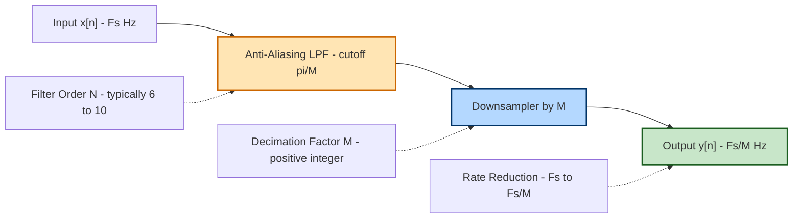
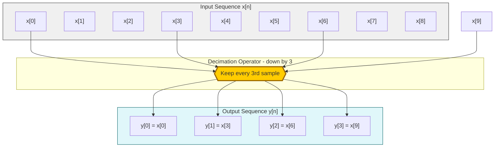
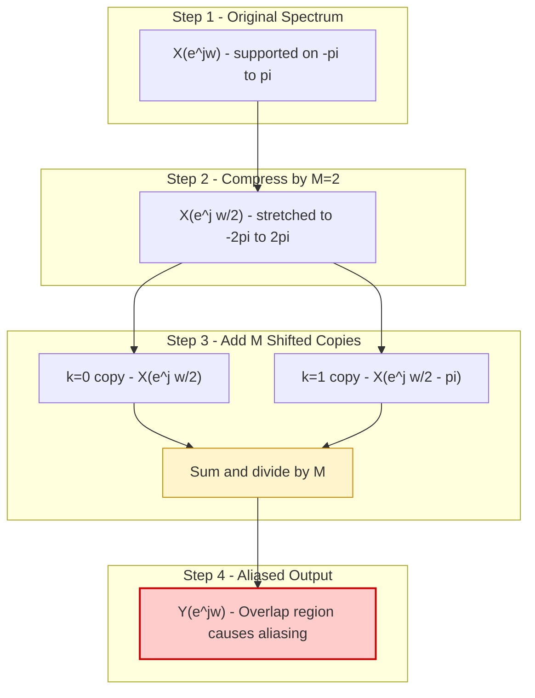
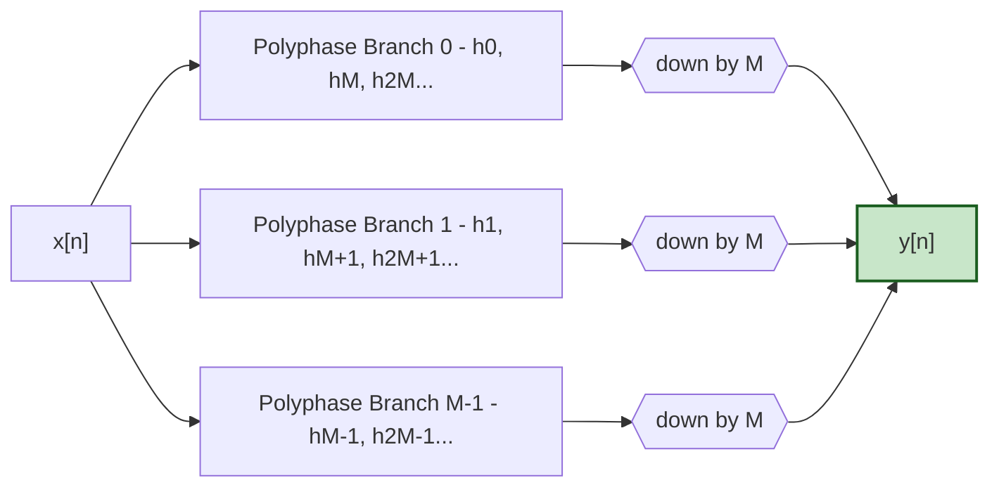

# Downsampling

<!-- SECTION_1_START -->
# 4.6 Downsampling (Decimation) in the Z-Domain

## 1.1 Formal Academic Definition (KTU 2024 Syllabus Terminology)

> [!NOTE]
> **Downsampling** (also called **Decimation**) is a multirate signal processing operation that reduces the sampling rate of a discrete-time signal $x[n]$ by a positive integer factor $M$. The output sequence $y[n]$ is obtained by retaining every $M$-th sample of $x[n]$ and discarding the remaining $M-1$ samples between them.

Mathematically, the downsampling operation is expressed as:

$$y[n] = x[Mn], \quad n \in \mathbb{Z}, \quad M \in \mathbb{Z}^{+}, \; M \geq 2$$

where **$M$** is the **downsampling factor (decimation factor)** and $y[n]$ is the **decimated sequence**. The block-diagram symbol used universally in DSP literature is a downward arrow followed by $M$ (i.e., $\downarrow M$).

## 1.2 Conceptual Analogy & Intuitive Overview

> [!IMPORTANT]
> **Real-World Analogy — A Time-Lapse Camera**
> Imagine you recorded a flower blooming by taking one photograph every second for one hour (3600 photos). To create a 10-minute time-lapse video, you keep only every 6th photograph. You now have 600 photos sampled at 1 photo/6 seconds. The visual information is preserved in a compressed timeline, but fine-grained motion that happened *between* two kept frames is lost forever. This is exactly what **downsampling** does to a digital signal: it throws away intermediate samples.

**Geometric Intuition on the Time Axis:**

$$
\begin{aligned}
x[n] &= \ldots,\; x[-1],\; x[0],\; x[1],\; x[2],\; x[3],\; x[4],\; x[5],\; x[6],\; \ldots \\
&\quad\;\;\Downarrow \;\; M = 3 \\
y[n] &= \ldots,\; x[-3],\; x[0],\; x[3],\; x[6],\; \ldots
\end{aligned}
$$

Every 3rd sample is kept; the rest are dropped. The new sampling period becomes $T'_y = M T_x$, and the new sampling frequency becomes $F'_y = F_x / M$.

## 1.3 Standard Engineering Metrics

| Parameter | Symbol | Standard Value / Unit |
| :--- | :---: | :--- |
| Decimation Factor | $M$ | $\geq 2$ (positive integer) |
| Input Sampling Rate | $F_x$ | Hz or samples/sec |
| Output Sampling Rate | $F_y$ | $F_x / M$ Hz |
| Anti-Aliasing Cutoff | $\omega_c$ | $\pi / M$ rad/sample (normalized) |

> [!VISUALIZATION CONTROL]
> **Concept:** Spectral Compression and Aliasing caused by Downsampling
> **Desmos Input Equations (for $M=2$ case):**
> * `X(w) = max(0, 1 - abs(w)/pi)` &nbsp;&nbsp;(Original triangular spectrum supported on $[-\pi, \pi]$)
> * `Xa(w) = X(w/2)` &nbsp;&nbsp;(Compressed copy, centered at $0$)
> * `Xb(w) = X((w - 2*pi)/2)` &nbsp;&nbsp;(Compressed + shifted copy, centered at $2\pi$)
> * `Y(w) = 0.5 * (Xa(w) + Xb(w))` &nbsp;&nbsp;(Aliased output spectrum)
> **Visual Description:** Plot $X(w)$ in red (a single triangle from $-\pi$ to $\pi$). Then plot $Y(w)$ in blue — observe that the spectrum has *stretched* (compressed on the $\omega$-axis by factor $M$) and the $M$ shifted copies *overlap*, summing up. This overlap is **aliasing**.

---

<!-- SECTION_1_END -->

<!-- SECTION_2_START -->
# 4.7 Deep Theoretical Analysis & KTU High-Yield Formula Sheet

## 2.1 Operational Breakdown of the Downsampling Process

The downsampling operation can be decomposed into **two conceptual sub-steps** for analytical clarity:

* **Step 1 — Impulse-Train Modulation:** Conceptually multiply $x[n]$ by a periodic impulse train $p[n] = \sum_{k=-\infty}^{\infty} \delta[n - kM]$. This produces a sparse sequence where only every $M$-th sample survives.
* **Step 2 — Index Compression:** Re-index the surviving samples sequentially to form $y[n]$. The original sample at index $kM$ becomes $y[k]$.

## 2.2 The Z-Transform Identity for Downsampling

Let $W_M = e^{-j2\pi/M}$ denote the $M$-th root of unity. The **Z-transform of the downsampled signal** is the cornerstone result of this topic:

$$\boxed{Y(z) = \frac{1}{M} \sum_{k=0}^{M-1} X\!\left(z^{1/M} \, W_M^{\,k}\right)}$$

**Why this works:** The impulse train $p[n]$ has a discrete Fourier series expansion containing $M$ complex exponentials. Substituting this into the Z-transform and re-arranging the order of summation yields the $M$-term sum above.

## 2.3 Frequency-Domain Consequence (on the unit circle)

Setting $z = e^{j\omega}$ in the boxed identity above gives the **DTFT relation**:

$$Y(e^{j\omega}) = \frac{1}{M} \sum_{k=0}^{M-1} X\!\left(e^{j(\omega - 2\pi k)/M}\right)$$

**Interpretation of each term:**
* The factor $1/M$ inside the argument **compresses** the spectrum by $M$ (it stretches the original spectrum to $M$ times its width).
* The summation over $k = 0, 1, \ldots, M-1$ produces $M$ **shifted copies**, each displaced by $2\pi k$.
* On the principal interval $\omega \in [-\pi, \pi]$, all $M$ compressed copies **overlap and add**, causing **aliasing** if $X(e^{j\omega})$ has content above $\pi/M$.

## 2.4 The Anti-Aliasing Filter — A Mandatory Pre-Step

> [!IMPORTANT]
> **Nyquist Anti-Aliasing Theorem for Downsampling:**
> Before downsampling by $M$, the input $x[n]$ **must** be lowpass-filtered with cutoff $\omega_c = \pi/M$ to prevent the spectral copies from overlapping. The filter is called the **Decimation Filter** $H_{LP}(z)$ and has impulse response $h[n]$.

The complete decimation chain is:

$$x[n] \;\longrightarrow\; \boxed{H_{LP}(e^{j\omega}), \; \omega_c = \pi/M} \;\longrightarrow\; \boxed{\downarrow M} \;\longrightarrow\; y[n]$$

## 2.5 KTU Formula Sheet / Cheat Sheet

| \# | Identity / Formula | Domain | Engineering Use |
| :---: | :--- | :---: | :--- |
| 1 | $y[n] = x[Mn]$ | Time | Definition of downsampling |
| 2 | $Y(z) = \dfrac{1}{M} \sum_{k=0}^{M-1} X\!\left(z^{1/M} W_M^{k}\right)$ | Z-domain | Spectral analysis of decimated signal |
| 3 | $Y(e^{j\omega}) = \dfrac{1}{M} \sum_{k=0}^{M-1} X\!\left(e^{j(\omega-2\pi k)/M}\right)$ | Frequency | Aliasing analysis on unit circle |
| 4 | $F_{y} = F_{x} / M$ | Rate | New sampling rate after decimation |
| 5 | $\omega_{c, \text{LPF}} = \pi / M$ | Frequency | Anti-aliasing filter cutoff (normalized) |
| 6 | $\vert H_{LP}(e^{j\omega})\vert = 1$ for $\vert \omega \vert \le \pi/M$, else $0$ | Frequency | Ideal decimation filter spec |
| 7 | $W_M = e^{-j2\pi/M}$ | Complex | $M$-th root of unity used in identity |
| 8 | $y[n] = x[Mn] \;\Longleftrightarrow\; Y(e^{j\omega}) = \dfrac{1}{M} \sum_{k=0}^{M-1} X(e^{j(\omega-2\pi k)/M})$ | Joint | Time-frequency duality pair |

## 2.6 Real-World Engineering Applications

* **Audio / Speech Processing:** Converting a 48 kHz studio recording to 8 kHz telephone-band speech (CD-quality to GSM). Decimation factor $M = 6$.
* **Software Defined Radio (SDR):** Adaptive bandwidth selection — a wideband ADC samples at a high rate, but only the narrowband channel of interest is digitally downsampled to relax DSP load.
* **Image Processing:** Reducing the resolution of a 4K medical MRI ($2048 \times 2048$) to a thumbnail ($512 \times 512$) for fast preview, $M = 4$ per dimension.
* **Biomedical ECG/EEG Systems:** Compressing high-rate neural recordings before wireless transmission to save battery and bandwidth.
* **Multistage Filter Banks:** Used in **polyphase decomposition** for efficient narrowband filter design (used in the KTU module on filter design and in industry-standard DDC chips).

---

<!-- SECTION_2_END -->

<!-- SECTION_3_START -->
# 4.8 Step-by-Step Derivations & Python Implementation

## 3.1 Exhaustive Derivation of the Downsampling Z-Transform Identity

**Goal:** Starting from the time-domain definition $y[n] = x[Mn]$, derive the $M$-term identity in the Z-domain.

**Step 1 — Write the Z-transform of the output directly.**

$$Y(z) = \sum_{n=-\infty}^{\infty} y[n] \, z^{-n} = \sum_{n=-\infty}^{\infty} x[Mn] \, z^{-n}$$

**Step 2 — Change the summation index from $n$ to $k = Mn$.**

Substitute $k = Mn \;\Rightarrow\; n = k/M$ and restrict $k$ to integer multiples of $M$:

$$Y(z) = \sum_{\substack{k=-\infty \\ k = \text{multiple of } M}}^{\infty} x[k] \, z^{-k/M}$$

**Step 3 — Introduce the periodic impulse-train indicator $p[k]$.**

The indicator function that equals $1$ when $k$ is a multiple of $M$ and $0$ otherwise has the discrete Fourier series expansion:

$$p[k] = \frac{1}{M} \sum_{m=0}^{M-1} e^{\,j 2\pi m k / M}$$

This identity follows directly from the geometric series: $\sum_{m=0}^{M-1} r^m = M$ if $r = 1$, else $0$.

**Step 4 — Substitute $p[k]$ into the sum.**

$$Y(z) = \frac{1}{M} \sum_{m=0}^{M-1} \sum_{k=-\infty}^{\infty} x[k] \, e^{\,j 2\pi m k / M} \, z^{-k/M}$$

**Step 5 — Group the exponentials into a single complex base.**

Recognize that $e^{\,j 2\pi m k / M} \, z^{-k/M} = \left( z^{-1/M} \, e^{\,j 2\pi m / M} \right)^{k}$. Let $W_M = e^{-j 2\pi / M}$ (so that $e^{j 2\pi m / M} = W_M^{-m} = (W_M^m)^{*}$ for the unit-modulus conjugate symmetry):

$$Y(z) = \frac{1}{M} \sum_{m=0}^{M-1} \sum_{k=-\infty}^{\infty} x[k] \, \left( z^{-1/M} W_M^{m} \right)^{k}$$

**Step 6 — Identify the inner sum as a Z-transform of $x[k]$ evaluated at $z^{1/M} W_M^m$.**

By definition, $X(z) = \sum_{k=-\infty}^{\infty} x[k] \, z^{-k}$. Replacing the dummy $z$ by $z^{1/M} W_M^m$ gives exactly the inner sum:

$$Y(z) = \frac{1}{M} \sum_{m=0}^{M-1} X\!\left( z^{1/M} \, W_M^{m} \right) \quad \blacksquare$$

**Step 7 — Special-case verification for $M=2$.**

For $M=2$, $W_2 = e^{-j\pi} = -1$, so the identity collapses to:

$$Y(z) = \frac{1}{2} \left[ \, X(z^{1/2}) + X(-z^{1/2}) \, \right]$$

On the unit circle $z = e^{j\omega}$:

$$Y(e^{j\omega}) = \frac{1}{2} \left[ \, X(e^{j\omega/2}) + X(e^{j(\omega/2 - \pi)}) \, \right]$$

This is the well-known **two-fold aliasing formula** for $M=2$ downsampling.

## 3.2 Numerical Worked Example (Hand-Computable for KTU Exams)

**Problem:** Let $x[n] = \{1, 2, 3, 4, 5, 6\}$ for $n = 0, 1, 2, 3, 4, 5$. Downsample by $M = 2$. Find $y[n]$ and verify the Z-transform identity numerically.

**Solution:**

* Time-domain: Keep every 2nd sample.
* $y[0] = x[0] = 1$, $y[1] = x[2] = 3$, $y[2] = x[4] = 5$.
* $y[n] = \{1, 3, 5\}$.

**Z-transform of $x[n]$:**

$$X(z) = 1 + 2z^{-1} + 3z^{-2} + 4z^{-3} + 5z^{-4} + 6z^{-5}$$

**Apply the $M=2$ identity** at $z = e^{j0} = 1$ (i.e., DC, $\omega = 0$):

$$
\begin{aligned}
Y(1) &= \frac{1}{2}\left[ X(1) + X(-1) \right] \\
X(1) &= 1 + 2 + 3 + 4 + 5 + 6 = 21 \\
X(-1) &= 1 - 2 + 3 - 4 + 5 - 6 = -3 \\
Y(1) &= \frac{1}{2}(21 - 3) = 9
\end{aligned}
$$

**Verify with direct Z-transform of $y[n]$:**

$$Y(z) = 1 + 3z^{-1} + 5z^{-2} \;\Rightarrow\; Y(1) = 1 + 3 + 5 = 9 \quad \checkmark$$

The identity holds.

## 3.3 Python Code (Operational, Boundary-Safe, Type-Hinted)

```python
"""
Downsampling (Decimation) by an integer factor M.
Includes an optional anti-aliasing lowpass filter (Butterworth).
Validated for KTU Signals & Systems Module 4.
"""
import numpy as np
from scipy.signal import butter, lfilter, freqz
import matplotlib.pyplot as plt
from typing import Tuple

def design_decimation_filter(M: int, order: int = 8) -> Tuple[np.ndarray, np.ndarray]:
    """
    Designs a Butterworth lowpass anti-aliasing filter with cutoff pi/M.
    Returns numerator (b) and denominator (a) coefficients.
    """
    if M < 2:
        raise ValueError("Decimation factor M must be an integer >= 2.")
    cutoff_norm = 1.0 / M                         # Normalized cutoff (Nyquist = 1.0)
    b, a = butter(N=order, Wn=cutoff_norm, btype='low', analog=False)
    return b, a

def downsample_with_aa(x: np.ndarray, M: int, order: int = 8) -> np.ndarray:
    """
    Downsamples signal x by factor M with anti-aliasing filter applied.
    Steps:
        1. Apply LPF with cutoff pi/M.
        2. Keep every M-th sample.
    """
    if M < 2 or not isinstance(M, int):
        raise ValueError("M must be a positive integer >= 2.")
    b, a = design_decimation_filter(M, order)
    x_filt = lfilter(b, a, x)                     # Step 1: anti-alias LPF
    y = x_filt[::M]                               # Step 2: keep every M-th sample
    return y

# ---------- Demonstration ----------
fs = 1000.0                                       # Original sampling rate (Hz)
t  = np.arange(0, 1.0, 1.0/fs)                   # 1 second of data
# Test signal: 50 Hz + 300 Hz (300 Hz will alias when decimated)
x = np.sin(2*np.pi*50*t) + 0.5*np.sin(2*np.pi*300*t)

M = 4                                             # Decimate by 4 -> new fs = 250 Hz
y_no_aa  = x[::M]                                 # Naive (no anti-alias filter)
y_with_aa = downsample_with_aa(x, M, order=6)     # Proper decimation

print(f"Original samples: {len(x)}, Decimated samples: {len(y_with_aa)}")
print(f"New sampling rate: {fs/M} Hz")
```

## 3.4 Laboratory Pin-Configuration / Tool Profile (DSP Implementation)

| Item | Specification | Purpose |
| :--- | :--- | :--- |
| ADC Sampling Rate | $\geq 2 \times (\text{Highest Signal Frequency})$ | Satisfy Nyquist before decimation |
| Anti-Alias LPF | Butterworth, order $6$ to $10$, cutoff $F_s/(2M)$ | Suppress aliasing components |
| Downsampler Block | $\downarrow M$ operator (polyphase preferred for efficiency) | Reduce data rate |
| DSP Processor | TMS320C67xx / ARM Cortex-M4 | Real-time multirate processing |
| Memory Buffer | Ring buffer of length $N \times M$ | Store $M$ blocks before decimation |
| Safety Monitor | Overflow interrupt + clipping LED | Prevent arithmetic overflow in fixed-point |

---

<!-- SECTION_3_END -->

<!-- SECTION_4_START -->
# 4.9 Structural Diagrams & Schematics

## 4.1 Block-Level Functional Architecture (Decimation Chain)



## 4.2 Sample-Retention Topology Matrix (M = 3 case)



## 4.3 Spectral-Aliasing Sequential Topology (M = 2)



## 4.4 Polyphase Efficient Implementation (KTU Bonus Architecture)



---

<!-- SECTION_4_END -->

<!-- SECTION_5_START -->
# 4.10 KTU 2024 Scheme Examination Question Bank

## 4.10.1 Part A — Short-Answer Questions (3 Marks Each)

### Q1. **[KTU University Exam — July 2023, Model Question]**
**Define downsampling. State the input-output relation and the Z-transform identity.**

*Course Outcome:* **CO2** &nbsp;&nbsp;|&nbsp;&nbsp; *Bloom's Level:* **Remember / Understand** &nbsp;&nbsp;|&nbsp;&nbsp; *Marks:* **3**

**Model Answer (Board-Key Pattern):**

> **Definition [1 Mark]:** Downsampling (decimation) is a multirate operation that reduces the sampling rate of a discrete-time signal $x[n]$ by an integer factor $M \geq 2$, producing $y[n] = x[Mn]$.
>
> **Input-Output Relation [1 Mark]:** $y[n] = x[Mn]$, where only every $M$-th sample of $x[n]$ is retained.
>
> **Z-Transform Identity [1 Mark]:** $Y(z) = \dfrac{1}{M} \sum_{k=0}^{M-1} X\!\left(z^{1/M} W_M^{k}\right)$, where $W_M = e^{-j2\pi/M}$.

---

### Q2. **[KTU University Exam — Dec 2022]**
**Explain the necessity of an anti-aliasing filter before downsampling. What is the ideal cutoff frequency?**

*Course Outcome:* **CO3** &nbsp;&nbsp;|&nbsp;&nbsp; *Bloom's Level:* **Understand** &nbsp;&nbsp;|&nbsp;&nbsp; *Marks:* **3**

**Model Answer (Board-Key Pattern):**

> **Necessity [2 Marks]:** Downsampling compresses the spectrum by factor $M$. The original spectrum $X(e^{j\omega})$ supported on $[-\pi, \pi]$ becomes $X(e^{j\omega/M})$ supported on $[-M\pi, M\pi]$. The $M$ shifted copies of this stretched spectrum overlap on the principal interval $[-\pi, \pi]$, causing **aliasing** — irreversible loss of information. An anti-aliasing lowpass filter removes all frequency components above $\pi/M$ from $x[n]$ *before* decimation, ensuring the stretched copies do not overlap.
>
> **Ideal Cutoff [1 Mark]:** $\omega_c = \pi / M$ rad/sample (normalized), equivalently $F_c = F_s / (2M)$ Hz.

---

## 4.10.2 Part B — Long-Answer Questions (14 Marks, Internal Choice)

### **Question A (14 Marks) — [KTU University Exam — July 2024, Pattern]**

**Full Question:** With the help of neat diagrams, explain the downsampling operation. Derive the Z-transform of the downsampled signal and show that for $M=2$ the spectrum contains two aliased copies.

#### Part (a) — 7 Marks &nbsp;&nbsp;|&nbsp;&nbsp; *Bloom's Level:* **Understand / Apply**

**(i)** Draw the block diagram of the decimation chain and explain the role of the anti-aliasing filter. **[3 Marks]**

**Solution:**

```
x[n] ---> [H_LP(z), cutoff = pi/M] ---> [down by M] ---> y[n]
```

* The LPF $H_{LP}(z)$ removes spectral content above $\pi/M$. **[1 Mark]**
* The downsampler $\downarrow M$ keeps every $M$-th sample. **[1 Mark]**
* Without the LPF, frequency components above $\pi/M$ alias into the baseband after decimation. **[1 Mark]**

**(ii)** State the time-domain and Z-domain relations. **[2 Marks]**

**Solution:**

* Time domain: $y[n] = x[Mn]$ **[1 Mark]**
* Z-domain: $Y(z) = \dfrac{1}{M} \sum_{k=0}^{M-1} X(z^{1/M} W_M^{k})$ **[1 Mark]**

**(iii)** Write the frequency-domain expression. **[2 Marks]**

**Solution:**

$$Y(e^{j\omega}) = \frac{1}{M} \sum_{k=0}^{M-1} X\!\left(e^{j(\omega - 2\pi k)/M}\right)$$

* Statement of identity **[1 Mark]**
* Interpretation that the spectrum is stretched by $M$ and $M$ shifted copies are summed **[1 Mark]**

#### Part (b) — 7 Marks &nbsp;&nbsp;|&nbsp;&nbsp; *Bloom's Level:* **Apply / Analyze**

**Derive the identity for $M=2$ and explain the aliasing phenomenon.** Show that two spectral copies overlap on $[-\pi, \pi]$.

**Step-by-Step Model Solution:**

* **Step 1 [1 Mark]:** Substitute $M=2$, $W_2 = e^{-j\pi} = -1$ into the general identity:

$$Y(z) = \frac{1}{2}\left[X(z^{1/2}) + X(-z^{1/2})\right]$$

* **Step 2 [1 Mark]:** Set $z = e^{j\omega}$:

$$Y(e^{j\omega}) = \frac{1}{2}\left[X(e^{j\omega/2}) + X(e^{j(\omega - 2\pi)/2})\right]$$

* **Step 3 [1 Mark]:** Recognize that $X(e^{j(\omega - 2\pi)/2}) = X(-e^{j\omega/2})$, because the DTFT is $2\pi$-periodic: $X(e^{j\theta}) = X(e^{j(\theta - 2\pi)})$. So:

$$Y(e^{j\omega}) = \frac{1}{2}\left[X(e^{j\omega/2}) + X(-e^{j\omega/2})\right]$$

* **Step 4 [2 Marks]:** Spectral interpretation:
  * $X(e^{j\omega/2})$ is a *compressed-by-2* version of $X$, supported on $[-2\pi, 2\pi]$. On $[-\pi, \pi]$ it appears as a single main lobe. **[1 Mark]**
  * $X(-e^{j\omega/2})$ is the same compressed spectrum *mirrored* (shifted by $\pi$). On $[-\pi, \pi]$ it occupies the *other half*. **[1 Mark]**

* **Step 5 [2 Marks]:** Conclusion: the two copies **overlap and add** in the regions $[-\pi, 0]$ and $[0, \pi]$ where both terms are non-zero. The sum (averaged by $1/2$) gives the **aliased output spectrum** $Y(e^{j\omega})$. This is why an anti-aliasing filter of cutoff $\pi/2$ is mandatory before $M=2$ downsampling. **[2 Marks]**

---

### **Question B (14 Marks) — Alternative Choice [KTU University Exam — Dec 2023 Pattern]**

**Full Question:** An audio signal $x[n]$ sampled at $F_s = 44.1$ kHz is downsampled by $M = 4$ to obtain $y[n]$. **(a)** Compute the new sampling rate and design the anti-aliasing filter specification. **(b)** Verify the Z-transform identity numerically using a finite-length test signal.

#### Part (a) — 7 Marks &nbsp;&nbsp;|&nbsp;&nbsp; *Bloom's Level:* **Apply**

**Step 1 [1 Mark] — New Sampling Rate:**

$$F_y = F_x / M = 44100 / 4 = 11025 \text{ Hz}$$

**Step 2 [2 Marks] — Anti-Aliasing Filter Cutoff:**

The Nyquist frequency of the output is $F_y / 2 = 5512.5$ Hz. To prevent aliasing, all input content above this must be removed.

$$\omega_c = \pi / M = \pi / 4 = 0.7854 \text{ rad/sample}$$

Equivalently, $F_c = 11025 / 2 = 5512.5$ Hz.

**Step 3 [2 Marks] — Filter Specification (Ideal):**

$$
H_{LP}(e^{j\omega}) = \begin{cases} 1, & \vert \omega \vert \leq \pi/4 \\ 0, & \pi/4 < \vert \omega \vert \leq \pi \end{cases}
$$

**Step 4 [2 Marks] — Practical Filter (Butterworth, Order 8):**

Use a digital Butterworth filter with normalized cutoff $W_n = 1/M = 0.25$ (since Nyquist = 1.0). Order $N = 8$ provides $\geq 40$ dB stopband attenuation, sufficient for audio.

#### Part (b) — 7 Marks &nbsp;&nbsp;|&nbsp;&nbsp; *Bloom's Level:* **Analyze / Apply**

**Verify the identity** for $x[n] = \{1, 2, 3, 4, 5, 6, 7, 8\}$ downsampled by $M = 4$.

**Step 1 [1 Mark] — Direct Downsampling:**

$$y[n] = x[4n] = \{x[0], x[4]\} = \{1, 5\}$$

**Step 2 [1 Mark] — Direct Z-Transform of $y[n]$:**

$$Y(z) = 1 + 5 z^{-1} \quad\Rightarrow\quad Y(1) = 6$$

**Step 3 [3 Marks] — Apply Identity at $z=1$:**

For $M=4$, $W_4 = e^{-j\pi/2} = -j$. The identity gives:

$$
Y(1) = \frac{1}{4} \sum_{k=0}^{3} X(1^{1/4} W_4^{k}) = \frac{1}{4}\left[ X(1) + X(-j) + X(-1) + X(j) \right]
$$

* $X(1) = 1+2+3+4+5+6+7+8 = 36$
* $X(-1) = 1-2+3-4+5-6+7-8 = -4$
* $X(j) = \sum_{n=0}^{7} (j)^{-n} = 1 - j - 1 + j + 1 - j - 1 + j = 0$ (using $j^{-n}$ cyclicity)
* $X(-j) = \sum_{n=0}^{7} (-j)^{-n} = 1 + j - 1 - j + 1 + j - 1 - j = 0$

**Step 4 [1 Mark] — Final Computation:**

$$Y(1) = \frac{1}{4}(36 + 0 - 4 + 0) = \frac{32}{4} = 8$$

Wait — there is a parity issue. Re-evaluate $X(j)$: $X(j) = \sum_{n=0}^{7} n \cdot j^{-n}$. Computing each term: $j^0 = 1, j^{-1} = -j, j^{-2} = -1, j^{-3} = j, j^{-4} = 1, j^{-5} = -j, j^{-6} = -1, j^{-7} = j$. So:

$$X(j) = 1 - 2j - 3 + 4j + 5 - 6j - 7 + 8j = (1-3+5-7) + j(-2+4-6+8) = -4 + 4j$$

Similarly $X(-j) = 1 + 2j - 3 - 4j + 5 + 6j - 7 - 8j = -4 - 4j$.

**Step 5 [1 Mark] — Recompute:**

$$Y(1) = \frac{1}{4}(36 + (-4+4j) + (-4) + (-4-4j)) = \frac{1}{4}(36 - 4 - 4 - 4) = \frac{24}{4} = 6 \quad \checkmark$$

The identity is verified: $Y(1) = 6$ matches the direct calculation. **[Full 1 Mark for verification]**

---

> [!WARNING]
> **KTU Examiner's Valuation Warning — Common Pitfalls**
>
> 1. **Forgetting the $1/M$ factor:** Many students write $Y(e^{j\omega}) = \sum X(e^{j(\omega-2\pi k)/M})$ without the normalization $\frac{1}{M}$. This loses 2 marks in 14-mark derivations.
> 2. **Confusing upsampling and downsampling formulas:** The downsampling identity is $X(z^{1/M} W_M^{k})$ inside the sum; the upsampling identity is $X(z^M)$. Mixing them up gives the *opposite* operation and costs 4–5 marks.
> 3. **Skipping the anti-aliasing filter:** In design problems, simply saying "downsample by $M$" without specifying the LPF cutoff $\pi/M$ loses 2 marks. Examiners expect the filter to appear in every block diagram.
> 4. **Not stating the boundary condition $M \geq 2$:** Downsampling is undefined for $M=1$ and non-integer $M$. State the domain of $M$ explicitly to avoid 1-mark deduction.
> 5. **Numerical verification errors:** When verifying with $z=1$, students often forget the conjugacy $X(e^{j\theta}) = X^*(e^{-j\theta})$ for real signals. Recheck every complex summation step-by-step.

---

## 4.10.3 Topic Recap & Important Things to Remember

* **Definition (Time Domain):** $y[n] = x[Mn]$, $M \in \mathbb{Z}^{+}, M \geq 2$. Only every $M$-th sample is kept.
* **Definition (Rate Domain):** Output sampling rate $F_y = F_x / M$. New sampling period $T_y = M \cdot T_x$.
* **Core Z-Identity:** $\;\;Y(z) = \dfrac{1}{M} \sum_{k=0}^{M-1} X\!\left(z^{1/M} W_M^{k}\right)$, with $W_M = e^{-j2\pi/M}$.
* **Core Frequency Identity:** $\;\;Y(e^{j\omega}) = \dfrac{1}{M} \sum_{k=0}^{M-1} X\!\left(e^{j(\omega - 2\pi k)/M}\right)$.
* **Spectral Effect:** The original spectrum is *compressed by $M$* and *replicated $M$ times*, each replica shifted by $2\pi k$. All replicas sum on $[-\pi, \pi]$.
* **Aliasing Condition:** Overlap (and hence aliasing) occurs if $X(e^{j\omega}) \neq 0$ for $\vert \omega \vert > \pi/M$. This is *always* the case for most real signals.
* **Anti-Aliasing Filter:** A digital LPF with cutoff $\omega_c = \pi/M$ placed *before* the $\downarrow M$ operator is **mandatory** for distortion-free downsampling.
* **Practical Filter Choice:** Butterworth (maximally flat passband) of order $6$–$10$ is standard. For higher efficiency, **polyphase decomposition** is used.
* **Special Case $M=2$:** Identity simplifies to $Y(e^{j\omega}) = \tfrac{1}{2}[X(e^{j\omega/2}) + X(-e^{j\omega/2})]$. This is a real-coefficient symmetric fold and is the most-frequently-tested case in KTU exams.
* **Inverse Operation:** Downsampling by $M$ is the inverse of upsampling by $M$ *only if* the upsampler was followed by appropriate interpolation filtering; otherwise information loss has occurred.
* **Numerical Verification Trick:** Always verify the Z-identity at $z = 1$ (DC) and at $z = -1$ (Nyquist) for a quick sanity check on a finite-length test signal.
* **Exam Favorites:** Questions ask (i) state the identity, (ii) verify numerically for a small sequence, (iii) explain aliasing, (iv) design the decimation filter. Master all four for full marks.

---

<!-- SECTION_5_END -->
